Breast Cancer Prediction with ComBat Data
================
Michael Kesling
June 2020

## Making Cancer Predictions on Breast RNA-Seq Samples

This particular document takes the Toil-normalized TCGA and GTEx breast
cancer samples and runs the logistic regression algorithm with lasso
regularizer on them. Importantly, the only sample-to-sample
normalization performed in quantile-quantile normalization relative to a
single reference sample. No batch normalization is performed at this
point, as it’s the simplest scenario for test samples processed in the
clinic, as they will appear one at a time, typically.

The data were downloaded from the UCSC server at:
<https://xenabrowser.net/datapages/?cohort=TCGA%20TARGET%20GTEx&removeHub=https%3A%2F%2Fxena.treehouse.gi.ucsc.edu%3A443>
There are 2 relevant *gene expression RNAseq* datasets there. *RSEM
expected\_count (n=19,109)* which is used in this document, and *RSEM
expected\_count (DESeq2 standardized) (n=19,039)* which was used in the
*Toil\_Norm.Rmd* file.

The *markdown* and *html* versions of this document have some of the
code masked for better readability. To view the full code, see the [.Rmd
version](Toil_Analysis_ObjOrient.Rmd).

#### Setting Global Parameters

For this code to run, one must set the path, on one’s machine to the
*RSEM\_COUNTS\_FILE*, which contains the RNASeq data, and the
*TOILGENEANNOT* file, which maps the Ensembl identifiers to the gene
names.

``` r
knitr::opts_chunk$set(echo = TRUE)
# rmarkdown::render("./Toil_Analysis_ObjOrient.Rmd")
#######################
# SET GLOBAL PARAMETERS
#######################
RSEM_COUNTS_FILE <- "/Volumes/MK_Ext/Tresorit_iOS/projects/RNA-Seq/MachineLearningRNASeq/toilSubsetRSEM382.txt"
TOILGENEANNOT <- "/Volumes/MK_Ext/RNA-Seq_2019/TOIL_Data/gencode.v23.annotation.gene.probemap"
BIOMART_GENE_ATTR_FILE <- "/Volumes/MK_Ext/Tresorit_iOS/projects/RNA-Seq/MachineLearningRNASeq/geneAttr.csv"
TCGA_ATTR_FILE <- "/Volumes/MK_Ext/Tresorit_iOS/projects/RNA-Seq/data/TCGA_Attributes_full.txt"
WANG_MATRIX <- "/Volumes/MK_Ext/Tresorit_iOS/projects/RNA-Seq/data/wangBreastFPKM398_Attrib.txt"
FULL_TOIL_DATA <- "/Users/mjk/RNA-Seq_2019/TOIL_Data/TcgaTargetGtex_gene_expected_count"
ATTR_FILE = '/Volumes/MK_Ext/Tresorit_iOS/projects/RNA-Seq/data/TCGA_Attributes_full_20200628.txt'
SEQUENCING_DATE_FILE = "/Volumes/MK_Ext/Tresorit_iOS/projects/RNA-Seq/MachineLearningRNASeq/confoundingElimi/Sequencing_Dates2.tsv"
SEED <- 233992812
SEED2 <- 1011
```

#### Hidden Functions

There are 3 large functions that don’t appear in the .md and .html
versions of this document to improve readability: one pre-processes the
Toil\_RSEM data, one performs TMM sample-to-sample scaling, just like
the edgeR method, and the last centers and scales each gene relative to
its mean and standard
deviation.

### Define main data structure and create methods for it

``` r
## The DAT object will contain all the various data matrices, sample names,
## and lists as the original data matrix is pre-processed before the data
## analysis ensues.

createDAT <- function(M){                # M is a data.matrix
   # it's assumed that samples are rows and genes are columns already
   z <- list(M_orig = M,                     # assumed log2 scale
             M_nat = matrix(),          # M_orig on natural scale
             M_filt = matrix(),         # after gene filtering
             M_scaled = matrix(),       # as fraction of all counts
             M_norm = matrix(),         # after gene normalization
             ZEROGENES = list(),
             outcome = list(),
             RefSampleName = character(),
             RefSample = matrix(),
             RefSampleUnscaled = matrix(),
             M_filtScaled = matrix(),   # after TMM scaling
             seed = numeric())
   #names(z[[2]]) <- "Nat"
   class(z) <- "DAT"
   return(z)
}

##########
# pick the most representative sample, calling it RefSample
##########
pickRefSample <- function(x) UseMethod("pickRefSample", x)
pickRefSample.DAT <- function(x, logged=FALSE){  # X is matrix with samples as rows
                   # representative reference sample selected via edgeR specs
                   # this script assumes data are on natural scale.
   # Xnat <- if(logged==TRUE) ((2^X)-1) else X  # put in natural scale
   N <- apply(x$M_filt, 1, sum)
   scaledX <- apply(x$M_filt, 2, function(x) x / N)
   thirdQuartiles <- apply(scaledX, 1, function(x) quantile(x)[4])
   med <- median(thirdQuartiles)
   refSampleName <- names(sort(abs(thirdQuartiles - med))[1])
   return(list(refSampleName, scaledX))
}

##########
# transform log2 data to natural scale
natural <- function(x) UseMethod("natural", x)
natural.DAT <- function(x){
   x$M_nat <- (2^x$M_orig) - 1
}

############
# filter Genes
filterGenes <- function(x) UseMethod("filterGenes", x)
filterGenes.DAT <- function(x, cutoff=0.2){ # filters calculated in log2 scale
                                       # but applied to data in natural scale
   ZEROEXPGENES <- which(apply(x[[1]], 2, function(x) quantile(x)[4]) < cutoff)
   filteredGenes <- x[[2]][, -ZEROEXPGENES]  
   return(list(ZEROEXPGENES, filteredGenes))
}

###########
# Add Zero Genes (to test set from training Zero list)
addZeroGenes <- function(x, ZERO){    # used when training-ZERO applied to 
   x[[6]] <- ZERO                     # test set
} 
```

## MAIN

The RSEM-Counts file originated as the full set of GTEX and TCGA breast
samples, both healthy and tumors, which numbered over 1200. I wanted an
equal number of tumor and healthy samples in my training and test set,
as it gave me the best chance at seeing how well my predictor
performed.  
This document represents an updated form of an earlier document, where
the name of the data were ‘toil’ for the non-batch-corrected data. Here,
we’re working with the batch-corrected ComBat data, which are still
represented with the toilTrain and toilTest variables.

``` r
##############
# SUBSTITUTE COMBAT for TOIL:
##############
toilSubset <- read.table(WANG_MATRIX, sep="\t", header=TRUE,
                         stringsAsFactors = F)
rownames(toilSubset) <- toilSubset[,1]
toilSubset <- toilSubset[,3:ncol(toilSubset)]

# COMBAT:
# the last 8 rows are non-gene information (race, age, etc)
# and we'll remove those now:
tmp <- toilSubset[1:(nrow(toilSubset)-8),]
toilSubset <- tmp

### conserve full sample names for later batch inquiries:
all398sampleNames <- gsub("\\.","-",colnames(toilSubset))
all398sampleNames <- gsub("-07-1$","-07",all398sampleNames)


tmp <- as.data.frame(sapply(toilSubset, as.numeric)) # throws NA error
rownames(tmp) <- rownames(toilSubset)
toilSubset <- tmp
rm(tmp)
# columns already ordered as expected
```

### Create Test and Training Sets

Up to this point, all we’ve done is grabbed the ComBat RSEM output data
and re-formatted it. At this point it’s on the natural (non-log) scale.

Next:  
1\. Randomly select samples to be in the training and test sets in a way
that keeps the ratio of healthy/tumors at about 50/50  
2\. Filter out genes with very low or zero expression across the data
set.  
3\. perform edgeR normalization with a reference sample to control for
depth-of-sequencing effects. Use same reference for training and
(future) test set  
4\. Center and scale each gene about its mean and std deviation,
respectively.  
5\. Perform ML  
6\. Test the model on the test
set.

``` r
toilSubsetWide <- t(toilSubset)                               # transpose matrix

outcome <- c(rep(0, 199), rep(1, 199))                  # 0 = healthy, 1 = tumor

# bind outcome variable on data frame for even, random partitioning
toilSubsetWide <- data.frame(cbind(toilSubsetWide, outcome))
set.seed(SEED)
idxTrain <- caTools::sample.split(toilSubsetWide$outcome, SplitRatio = 0.75)
# QA
sum(idxTrain)/length(idxTrain)             # 75% observations in training set OK
```

    ## [1] 0.7487437

We see that 75% of the samples ended up in the training set, as
expected.

``` r
#### COMBAT convert to log2(x+1) first
tmp <- as.data.frame(sapply(toilSubsetWide,
                                       function(x) log2(x+1)))
rownames(tmp) <- rownames(toilSubsetWide)
toilSubsetWide <- tmp
rm(tmp)

# create training and test predictor sets and outcome vectors:
toilTrain <- subset(toilSubsetWide, idxTrain==TRUE)
outcomeTrain <- subset(toilSubsetWide$outcome, idxTrain==TRUE)  # Is this used?

toilTest <- subset(toilSubsetWide, idxTrain==FALSE)
outcomeTest <- subset(toilSubsetWide$outcome, idxTrain==FALSE)

# remove outcome variable from predictor matrices:
toilTrain <- toilTrain %>% dplyr::select(-outcome)
toilTest <- toilTest %>% dplyr::select(-outcome)

# convert back to matrices:
toilTrain <- as.matrix(toilTrain)
toilTest <- as.matrix(toilTest)

# reclaim memory
rm(toilSubset); rm(toilSubsetWide)
```

Now create object starting with toilTrain data matrix

``` r
train <- createDAT(toilTrain)
train$M_nat <- natural(train)
train$outcome <- outcomeTrain
```

### 1\. Removing genes whose expression is very close to zero.

We know that there are about 9103 genes that are never expressed (data
not shown), but there are over 25000 genes whose 75th quantile-level
expression is under 2^(0.2) - 1 = 0.14 counts. We really don’t want to
deal with those genes in selecting a reference sample,
etc.

``` r
hist(apply(toilTrain, 2, function(x) quantile(x)[4]), breaks=100, main="Histogram of each gene's 75th quantile of expression.", xlab="log2(RSEM Est Counts)")
```

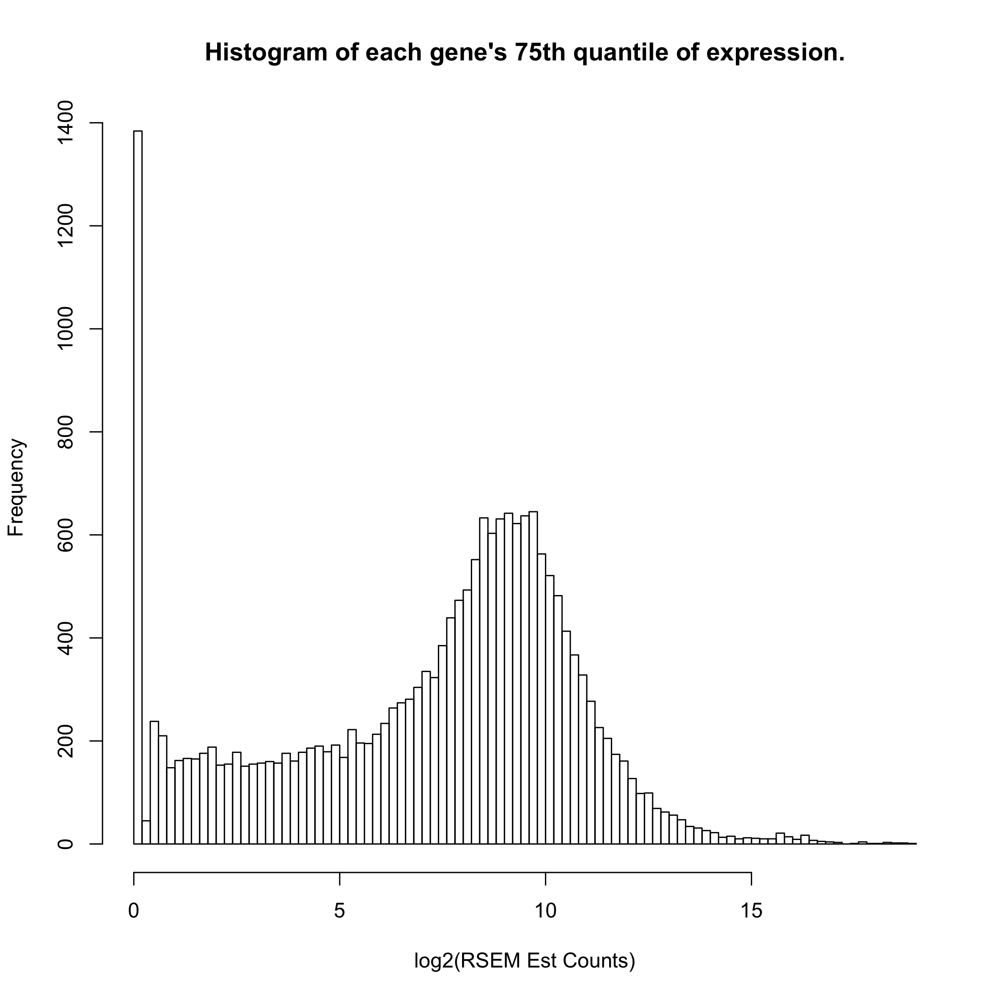<!-- -->
Another attempt at filtering genes whose log2(Est Counts) was less than
5 gave very unstable results at the sample-to-sample scaling factor step
that corrects for unequal depth-of-sequencing between samples (not shown
here). The exact reason for this hasn’t been pursued at this point. One
possibility is that samples whose depth-of-sequencing is low may have
most of their genes absent for the sample-to-sample adjustment step.

``` r
tmp <- filterGenes(train)
train$ZEROGENES <- tmp[[1]]; train$M_filt <- tmp[[2]]
```

### 2\. Sample-to-Sample Scaling

I’m using the TMM algorithm to perform sample-to-sample scaling, just as
what is done in edgeR. First, one picks a reference sample (whose
depth-of-sequencing is close to the median), then one scales all other
samples relative to it, using weighted Trimmed Mean (TMM).

``` r
tmp <- pickRefSample(train)
train$M_scaled <- tmp[[2]]; train$RefSampleName <- tmp[[1]]
train$M_filtScaled <- weightedTrimmedMean(train)
```

### 3\. Gene-level Normalization

When performing lasso regularization, it’s important that the each gene
is on the same scale as all other genes. Otherwise, highly expressed
genes will influence the algorithm more than other genes. And with
differential expression, we’re not interested in the absolute expression
level in any case. So here, we subtract each gene’s mean and divide by
the gene’s standard deviation so that each gene is standard-normalized.

``` r
train$M_norm <- normalizeGenes(train$M_filtScaled, TRUE, FALSE)
```

train$M\_norm is what we’ll perform our machine learning on.

### Logistic Regression with Lasso Regularizer on Toil Data

I’m using a Lasso Regularizer via the *glmnet* package in order to not
only reduce overfitting via regularization, but also to perform feature
selection, as an increasing number of the original predictors are
eliminated as the regularizing tuning parameter, lambda, become larger.

The figure below illustrates this feature elimination process:

``` r
set.seed(SEED2)
fitToil.lasso <- glmnet(train$M_norm, train$outcome, family="binomial",
                           alpha = 1)
defaultPalette <- palette()
plot(fitToil.lasso, xvar="lambda", label=TRUE)
```

<!-- -->
Here, we see which genes have the strongest effect on the logistic
regression model as the value of lambda increases from left to right. It
appears that perhaps with a few dozen genes, we might have a
well-performing
model.

### Cross-Validating the Model to Pick the Smallest, Well-Performing Model

I’m going to look at cross-validating the model in order to pick the
simplest one that performs well. I’ll use the 1-standard-deviation rule
from the model with the smallest binomial
deviance.

``` r
set.seed(SEED2)                                # need same seed as previous step
cv.Toil.lasso <- cv.glmnet(train$M_norm, train$outcome
                           , family="binomial", alpha=1) 
plot(cv.Toil.lasso)
```

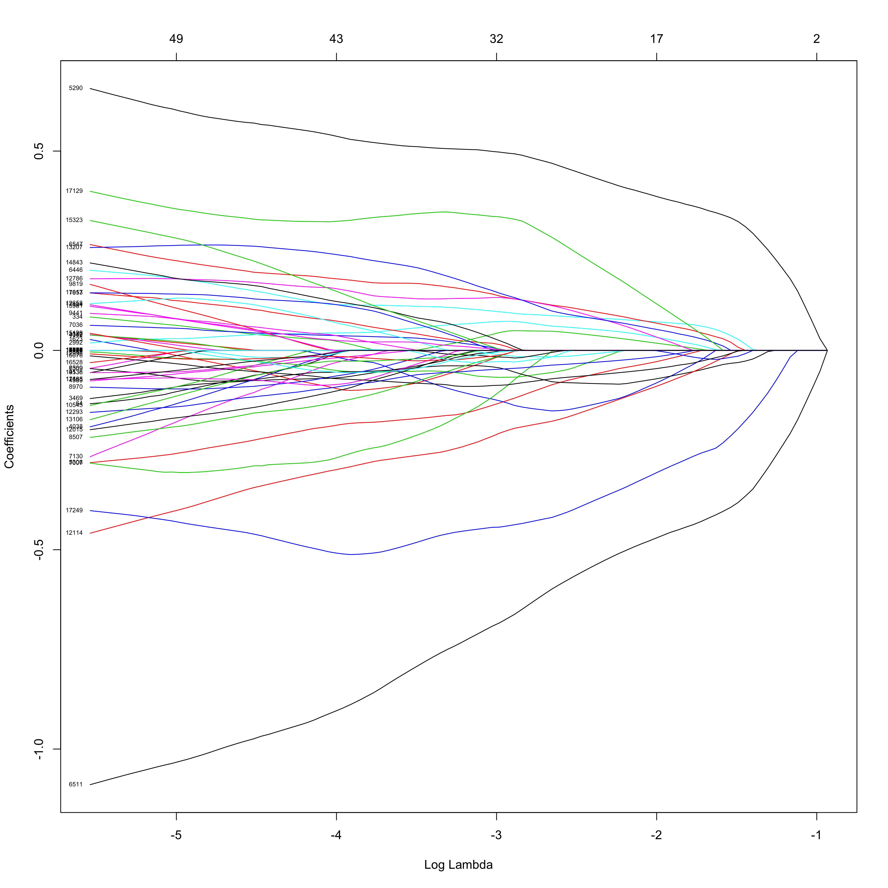<!-- -->
We can see that 48 predictors gives us a model whose deviance is within
1-standard deviation from the minimum.

### Store the Model in a Custom Structure

``` r
coefsToil <- coef(cv.Toil.lasso, s=cv.Toil.lasso$lambda.1se)

##########
# Store model in a structure:
storeMODEL <- function(coefsToil, train=train){
   idx <- which(coefsToil[,1] != 0)
   predictorFullNames <- rownames(coefsToil)[idx]
   colIDs <- which(colnames(train$M_norm) %in% 
                   predictorFullNames) 
   tmpDF <- train$M_norm[,colIDs]
   predGeneNames <- gsub("\\.ENSG.*","", predictorFullNames)
   colnames(tmpDF) <- predGeneNames[2:length(predGeneNames)]

   z <- list(
      fullModel = coefsToil,
      predFullNames = predictorFullNames,
      predCoefs = coefsToil[idx],
      predGeneNames = predGeneNames, 
      predEntrezID = gsub(".*.(ENSG.*)\\..*$","\\1", predictorFullNames),
      modelDF = tmpDF                                 # lacks (Intercept)
   )
   
   class(z) <- "MODEL"
   return(z)
}

LogRegModel <- storeMODEL(coefsToil, train)
```

### How highly correlated are the model’s predictors to the output?

I’m going to find the genes that are best correlated with the output
variable (healthy/tumor) both in terms of positive correlation and
negative correlation. If a gene is a predictor in the model, then it
will be elevated in the plot compared with other non-predictor genes.

``` r
predictorsCorrTotal <- sort(apply(train$M_norm, 2, cor,
                               y=train$outcome,
                               method="pearson"))

digitalPredCCoutcome <- ifelse(names(predictorsCorrTotal) %in% LogRegModel$predFullNames, 1, 0)

# look at 250 genes most positively correlated and most
# negatively correlated with outcome variable:
bottomDigPredCCoutcome <- head(digitalPredCCoutcome, 250)
topDigPredCCoutcome <- tail(digitalPredCCoutcome, 250)
topCC <- data.frame(cbind(1:250, topDigPredCCoutcome))
bottomCC <- data.frame(cbind(1:250, bottomDigPredCCoutcome))

colorsOutcome <- c("#E6550D",  "#56B4E9")

ggplot(topCC) +
  geom_point(aes(x=V1, y=topDigPredCCoutcome)) +
  ggtitle("Distribution of Predictors Among Top 250 Genes Correlated with Outcome Variable") +
  xlab("Genes with Top Pearson's Corr Coeff with Outcome Var") + theme_bw() + ylab("A Predictor in the Model?") 
```

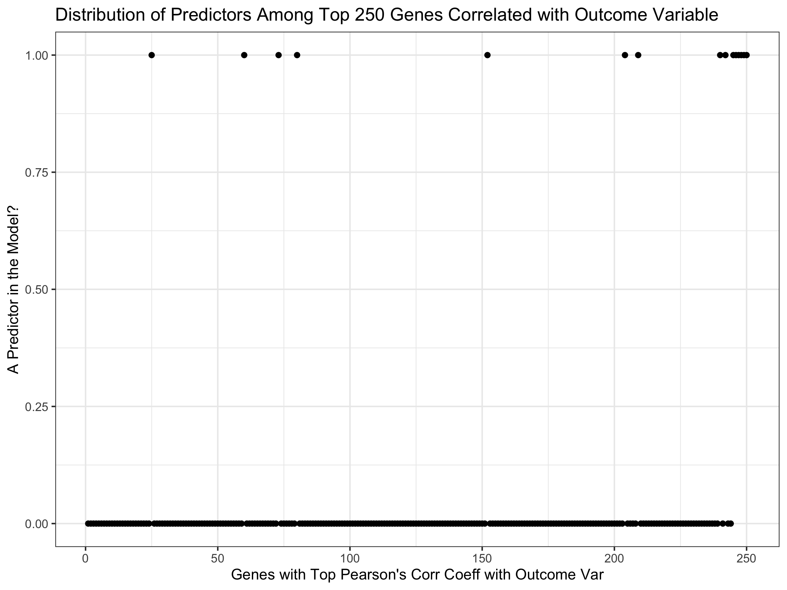<!-- -->
We see that the 6 genes most highly correlated with the outcome variable
are predictors in the model, but some are not all the way to the top.
Note that all genes shown here are amongst the top 1.3% positively
correlated with the outcome variable.

``` r
ggplot(bottomCC) +
  geom_point(aes(x=V1, y=bottomDigPredCCoutcome)) +
  ggtitle("Distribution of Predictors Among Bottom 250 Genes Correlated with Outcome Var") +
  xlab("Genes with Bottom Pearson's Corr Coeff with Outcome Var") + theme_bw() + ylab("A Predictor in the Model?") 
```

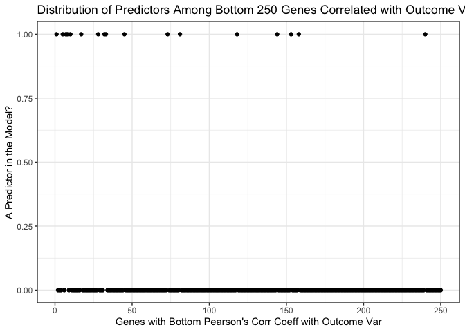<!-- -->

## Working with Test Data

### Filter and Scale Test Data.

#### Relying on Training Data for Zero-Filtering and Scaling of Test Data

In order to see how well our model actually performs, we need to test it
on test data that it hasn’t seen before. First, we need to process the
test data just as we did the training data, but completely separately,
as this is the real-world case.

In data not shown here, I have found that sample-to-sample scaling
performs well only when either

1)  it’s done in the context of a large number of samples, which is a
    challenge for the real-world case where a single sample comes out of
    the clinic.

2)  it’s done relative to a single *reference sample* that was
    identified in the training set.

Here, I’m using case (ii) by normalizing each test sample individually
against this reference sample. Towards the bottom of the document, I
perform case (i) below in order to rule out any lingering bias derived
from the fact that sample scaling is performed relative to a single
training sample.

Furthermore, the process of filtering out genes with very-near-zero
expression levels across all samples cannot be easily defined by a
single clinical sample. Likewise, here, I’ll use the “(near)
zero-expressed genes” from the training set in order to perform
gene-level filtering in the test set.

We start by entering the test data into a new instance of our **DAT**
object.

``` r
test <- createDAT(toilTest)               # add matrix to DAT object
test$M_nat <- natural(test)                # transform from log2 to natural scale
test$outcome <- outcomeTest                  # add outcome variable
```

#### 1\. Filter out genes from test set using those defined in the training set

``` r
                                               # transfer ZEROEXP to test object
test$M_filt <- test$M_nat[, -train$ZEROGENES]  # subtract off genes and return 
                                               # remainder to test object
```

#### 2\. Sample-to-Sample Scaling of Test Set

We’re going to use the Reference Sample data from the training set
here

``` r
tmp <- pickRefSample(test)                  # only doing this to get scaled data
test$M_scaled <- tmp[[2]]; 
test$RefSampleName <- train$RefSampleName      # RefSampleName from training set
test$M_filtScaled <- weightedTrimmedMean(test, train, 1)     # filtered & scaled
```

#### 3\. Gene-level Normalization on Test Set

``` r
test$M_norm <- normalizeGenes(test$M_filtScaled, TRUE, FALSE)
```

#### 4\. Remove Non-Predictor Genes from Filtered Test Data

We’re just keeping the 42 predictors from toilTestFiltScaled

``` r
colIDs <- which(colnames(test$M_norm) %in% 
                   LogRegModel$predFullNames[2:length(LogRegModel$predFullNames)])
toilTestFiltScal42 <- test$M_norm[,colIDs]                  # SEPARATE FROM OBJECT
toilTrainFiltScal42 <- train$M_norm[,colIDs]
toilTrainFiltScal42 <- cbind(rep(1,nrow(toilTrainFiltScal42)), toilTrainFiltScal42)
```

#### 5\. Test Set Sensitivity and Specificity

First we add an intercept column to test predictor variables, then we
perform matrix multiplication with the predictor coefficients and then
look at the prediction performance in the confusion
matrix.

``` r
toilTestFiltScal42 <- cbind(rep(1,nrow(toilTestFiltScal42)), toilTestFiltScal42)

testPredictions_toil <- ifelse(toilTestFiltScal42 %*% LogRegModel$predCoefs > 0, 1, 0)
table(test$outcome, testPredictions_toil)
```

    ##    testPredictions_toil
    ##      0  1
    ##   0 50  0
    ##   1  1 49

I’m at 98% sensitivity and 100% specificity.

#### Create Visual for Test Predictions

``` r
generateOutcomeIndicators <- function(names){
  # given the sample names from a list or df row/colname
  # will generate a numeric vector for coloring points
  # according to (1) GTEX sample, (2) TCGA normal, (3) TCGA tumor
  gtex <- ifelse(grepl("^GTEX", names),1,0)
  tcgaHealthy <- ifelse(grepl("^TCGA.*\\.11[AB]\\..*", names),2,0)
  tcgaTumor <- ifelse(grepl("^TCGA.*\\.01[AB]\\..*", names),3,0)
  return(gtex + tcgaHealthy + tcgaTumor)
}
generateOutcomeIndicatorsCOSMIC <- function(names){
  # given the sample names from a list or df row/colname
  # will generate a numeric vector for coloring points
  # according to (1) GTEX sample, (2) TCGA normal, (3) TCGA tumor
  gtex <- ifelse(grepl("^GTEX", names),1,0)
  tcgaHealthy <- ifelse(grepl("^TCGA+[\\.]+[^\\.]+[\\.]+[^\\.]+[\\.]+11",
                              names),2,0)
  tcgaTumor <- ifelse(grepl("^TCGA+[\\.]+[^\\.]+[\\.]+[^\\.]+[\\.]+01", 
                            names),3,0)
  return(gtex + tcgaHealthy + tcgaTumor)
}

testPreds95 <- toilTestFiltScal42 %*% LogRegModel$predCoefs
testPreds95Probs <- 1/(1 + exp(-1 * testPreds95))

outcomeIndicators <- 
  generateOutcomeIndicatorsCOSMIC(rownames(testPreds95Probs))

testPreds95_DF <- data.frame(cbind(testPreds95Probs,  # change
                                   outcomeIndicators))
colnames(testPreds95_DF) <- c("probability","outcome")
testPreds95_DF <- testPreds95_DF %>%       # sort on probability
                    arrange(probability)
testPreds95_DF <- cbind(index=1:nrow(testPreds95_DF), 
                        testPreds95_DF) # add idx

#colorsOutcome <- c("#E6550D",  "#56B4E9")
colors3pal <- c("#FDAE6B", "#E6550D",  "#56B4E9")

ggplot(testPreds95_DF) +
  geom_point(aes(x=index, y=probability, color=as.factor(outcome))) +
  ggtitle("Prediction Probabilities of Test Samples") +
  xlab("Test Sample") + theme_bw() + ylab("Predicted Probability") +
  scale_color_manual(name="Actual Outcome",
                      breaks = c("1", "2", "3"),
                      values = c(colors3pal[1], colors3pal[2],
                                 colors3pal[3]), 
                      labels = c("GTEX-Healthy", "TCGA-Healthy",
                                 "TCGA-Tumor"))
```

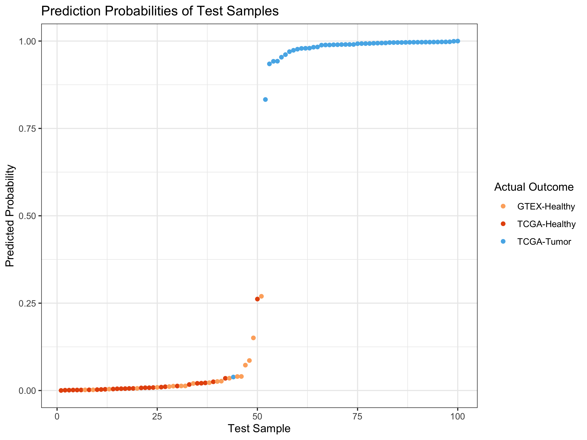<!-- -->

#### Create Visual for Training Predictions

``` r
trainPreds <- toilTrainFiltScal42 %*% LogRegModel$predCoefs
trainPredsProbs <- 1/(1 + exp(-1 * trainPreds))
outcomeIndicators <- 
  generateOutcomeIndicatorsCOSMIC(rownames(trainPredsProbs)) #####

trainPreds_DF <- data.frame(cbind(trainPredsProbs,
                                   outcomeIndicators))
colnames(trainPreds_DF) <- c("probability","outcome")
trainPreds_DF <- trainPreds_DF %>%       # sort on probability
                    arrange(probability)
trainPreds_DF <- cbind(index=1:nrow(trainPreds_DF), trainPreds_DF) # add idx

#colorsOutcome <- c("#E6550D",  "#56B4E9")
colors3pal <- c("#FDAE6B", "#E6550D",  "#56B4E9")

ggplot(trainPreds_DF) +
  geom_point(aes(x=index, y=probability, color=as.factor(outcome))) +
  ggtitle("Prediction Probabilities of Training Samples") +
  xlab("Training Sample") + theme_bw() + ylab("Predicted Probability") +
  scale_color_manual(name="Actual Outcome",
                      breaks = c("1", "2", "3"),
                      values = c(colors3pal[1], colors3pal[2],
                                 colors3pal[3]), 
                      labels = c("GTEX-Healthy", "TCGA-Healthy",
                                 "TCGA-Tumor"))
```

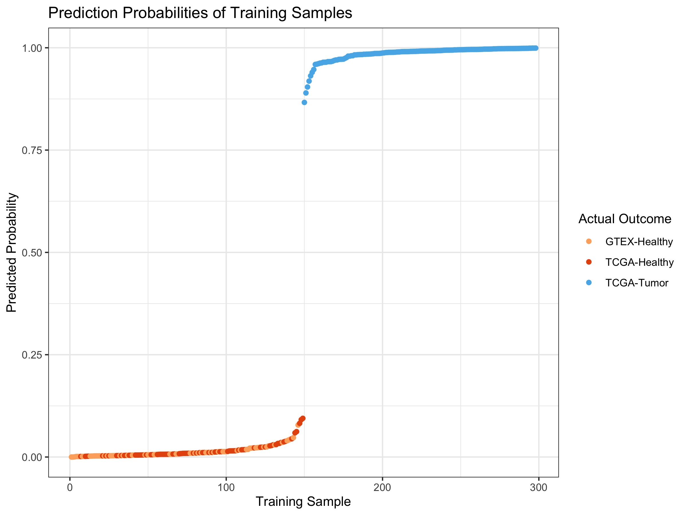<!-- -->

## Why does the model perform so well?

I expected that the logistic regression with a lasso regularizer would
perform okay, but not nearly as well as it did. The question is why? Is
it simply that tumors have a sufficiently different genetic programming
that they can easily be partitioned from healthy samples?

### Principal Components

To explore this idea, I’m going to look at the first 2 principal
components of the overall variability of the data across all genes that
weren’t filtered out for having near-zero expression, and plot those
out, coloring each sample according to whether or not it’s healthy or a
tumor.

``` r
plotPCs <- function(dfComponents, compIdx){
   PC_plot <- data.frame(x=dfComponents[,compIdx[1]], y = dfComponents[,compIdx[2]], col=prognosis)
   colors3pal <- c("#FDAE6B", "#E6550D",  "#56B4E9")
   obj <<- ggplot(PC_plot) + 
      geom_point(aes(x=x, y=y, color=as.factor(col)), alpha=0.6) + 
      ggtitle("PCA Plot of Training Data Using All Filtered Predictors of Toil Training Data") +
      xlab(paste0("PC",compIdx[1])) + ylab(paste0("PC", compIdx[2])) +
      theme_bw() + 
      scale_color_manual(name="Category",
                         breaks = c("1", "2", "3"),
                         values = c(colors3pal[1], colors3pal[2], colors3pal[3]),
                         labels = c("Healthy-GTEX", "Healthy-TCGA", "Cancer-TCGA"));
   return(obj)
}


prognosis <- c(rep(1, 69), rep(2,80), rep(3, 149))       # 1/2 = healthy, 3 = cancer
PCs <- prcomp(train$M_norm)                               # (data already scaled)
nComp <- 2
dfComponents <- predict(PCs, newdata=train$M_norm)[,1:nComp]

PC_plot <- data.frame(x=dfComponents[,1], y = dfComponents[,2], col=prognosis)
colors3pal <- c("#FDAE6B", "#E6550D",  "#56B4E9")

ggplot(PC_plot) + 
   geom_point(aes(x=x, y=y, color=as.factor(col))) + 
   ggtitle("PCA Plot of Training Data Using All Filtered Predictors of Toil Training Data") +
   xlab("PC1") + ylab("PC2") + theme_bw() +
   scale_color_manual(name="Category",
                      breaks = c("1", "2", "3"),
                      values = c(colors3pal[1], colors3pal[2], colors3pal[3]),
                      labels = c("Healthy-GTEX", "Healthy-TCGA", "Cancer-TCGA"))
```

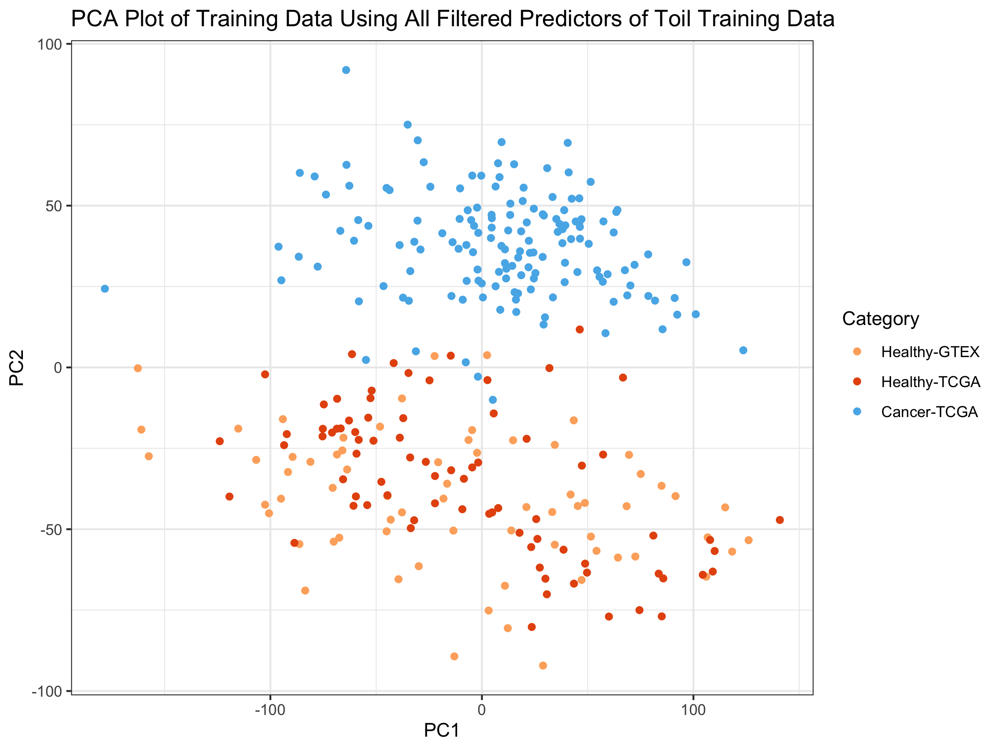<!-- -->

We can see that even only employing the first 2 Principal Components,
that:

1)  there is very good separation between the tumors (blue) and the
    healthy samples (light and dark orange) in the training set.

2)  We also see that the 2nd PC separates the outcome variable much
    better than the 1st PC.

3)  We also notice that the healthy samples from TCGA (red) and the
    healthy samples from GTEX (orange), which had a strong batch effect
    in the TOIL data, have been batch-corrected by ComBat here [Wang,
    et. al. Combat paper](https://www.nature.com/articles/sdata201861).

In light of the PC plot, it perhaps should not be surprising that an
off-the-shelf algorithm would perform so well, as the variability in
transcription is quite significant between healthy samples and tumors.
It might be that after tissue type, healthy/tumor may impact variability
in transcription more than any other factor.

### Top 5 Principal Components

I wanted to see if any other of the top PCs were good at separating
healthy samples from tumors.

``` r
plotPCs_1d <- function(dfComponents){
   PC_plot <- data.frame(x=dfComponents$Var2, y = dfComponents$value, col=prognosis)
   colors3pal <- c("#FDAE6B", "#E6550D",  "#56B4E9")
   obj <- ggplot(PC_plot) + 
      geom_jitter(aes(x=x, y=y, color=as.factor(col)), alpha=0.7) + 
      ggtitle("Separation of Healthy / Tumors by First Few PC's") +
      xlab("PC Number") + ylab("PC Projection") +
      theme_bw() +
      scale_color_manual(name="Category",
                         breaks = c("1", "2", "3"),
                         values = c(colors3pal[1], colors3pal[2], colors3pal[3]),
                         labels = c("Healthy-GTEX", "Healthy-TCGA",
                                    "Cancer-TCGA"));
   return(obj)
}


nComp <- 5
dfComponents <- predict(PCs, newdata=train$M_norm)[,1:nComp]

dfCompMelt <- melt(dfComponents)
plotPCs_1d(dfCompMelt)
```

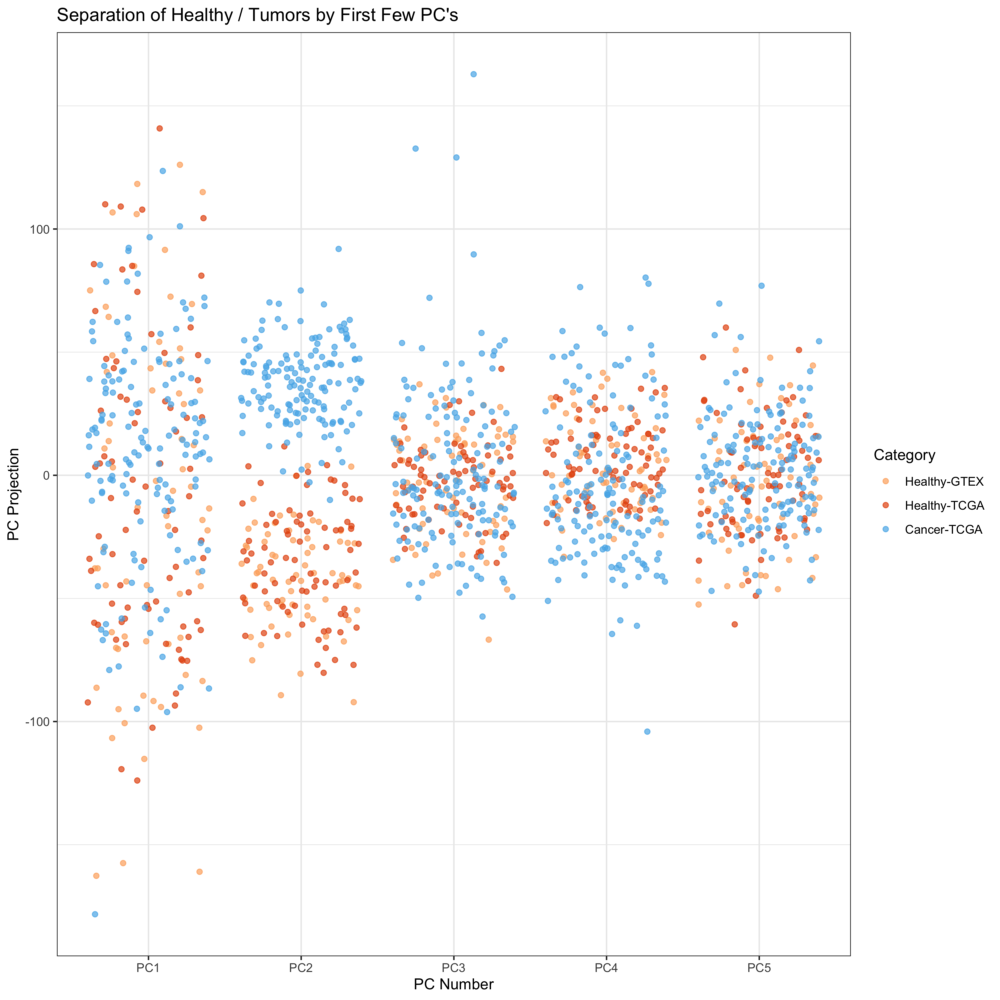<!-- -->
We see that the 2nd and 3rd PCs give pretty good outcome variable
separation. Let’s look at pairwise PC plots.

``` r
ls <- list()
pairs <- combn(5,2)
for(idx in 1:dim(pairs)[2]){
   pair <- pairs[,idx]
   ls[[idx]] <- plotPCs(dfComponents, pair)                  # Add a MAIN TITLE and remove other titles
}
grid.arrange(ls[[1]], ls[[2]], ls[[3]], ls[[4]], ls[[5]], ls[[6]],
             ls[[7]], ls[[8]], ls[[9]], ls[[10]], ncol=2)
```

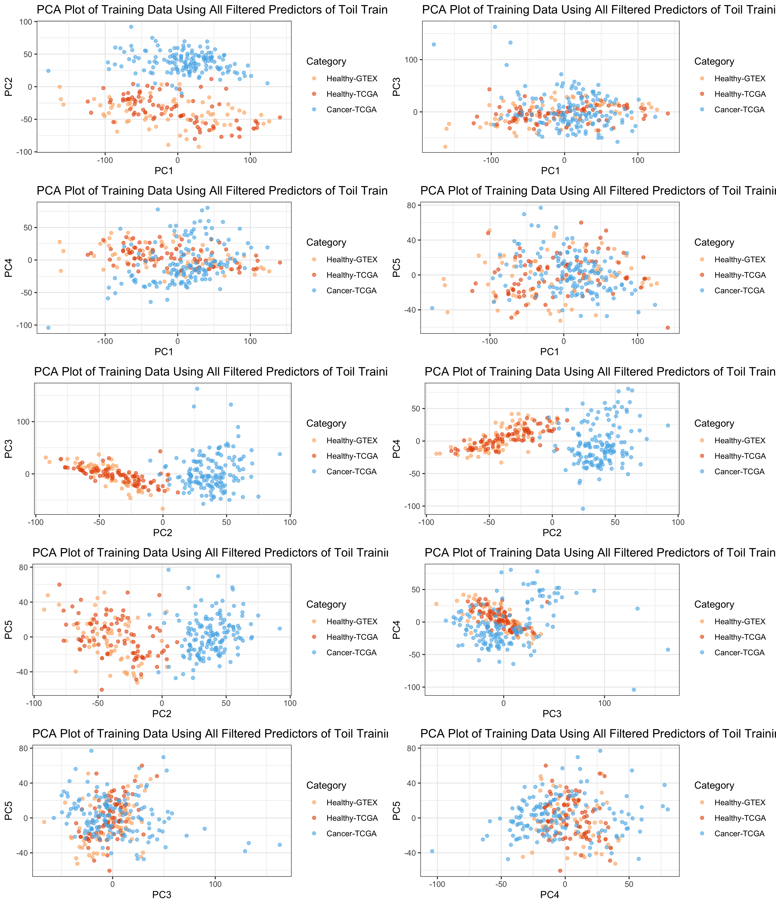<!-- -->
It appears that PC2 and PC3 together (or PC1 and PC2) give the best
separation.

# Ruling Out Batch Effects and Other Potential Confounders

### Duplicates in Principal Components

In some cases, TCGA has both a tumor sample and a healthy sample from
the same patient. This isn’t very common, as the number of TCGA tumor
samples is nearly 10 times greater than the number of TCGA healthy
samples in the database. While both healthy and tumor samples were
randomly selected here, I wanted to rule out any contribution a
same-patient variable might have.

Here I create the exact sample Principal Components plot as above,
except that I only color the TCGA points that are from the same
patient–one healthy and one tumor.

``` r
modifyPrognosisByPairs <- function(prognosis, pairedSamples){
  # Take the prognosis, which is a vector of whether actual sample outcomes
  # are GTEX-healthy, TCGA-healthy, or TCGA-Tumor and changes the
  # color indicator to "4" if the samples are not part of a
  # paired set of TCGA samples
  names(prognosis) <- gsub("\\.11[AB]\\..*$","",names(prognosis)) %>%
                     {gsub("\\.01[AB]\\..*$", "", .)}
  prognosis <-
    replace(prognosis, !names(prognosis) %in% pairedSamples,4)
  return(prognosis)
}

PCs <- prcomp(train$M_norm)                               # (data already scaled)
nComp <- 2
dfComponents <- predict(PCs, newdata=train$M_norm)[,1:nComp]


prognosis <- generateOutcomeIndicators(rownames(dfComponents)) #1/2=healthy, 3=tum
names(prognosis) <- rownames(dfComponents)

#######
# identify paired samples
# start by shortening TCGA ID:
sampleNamesShort <- gsub("(^TCGA.*)\\.11[AB]\\..*", 
                         "\\1", names(prognosis)) %>%
                         {gsub("(^TCGA.*)\\.01[AB]\\..*", "\\1", .)}
sampleNamesShort.srt <- sort(sampleNamesShort)       # sort list

# identify paired samples by adjacency in sorted list:
pairedSamples <- c()
for(idx in 2:length(sampleNamesShort)){
  if(sampleNamesShort.srt[idx]==sampleNamesShort.srt[idx-1]){
    pairedSamples <- c(pairedSamples, sampleNamesShort.srt[idx])
  }
}


prognosis <-
  modifyPrognosisByPairs(prognosis = prognosis,
                         pairedSamples = pairedSamples)

# add back original names:
names(prognosis) <- rownames(dfComponents)


PC_plot <- data.frame(x=dfComponents[,1], y = dfComponents[,2], col=prognosis)
colors4pal <- c("#FDAE6B", "#E6550D",  "#56B4E9", "#bdbdbd")

ggplot(PC_plot) +
   geom_point(aes(x=x, y=y, color=as.factor(col))) +
   ggtitle("PCA Plot of Training Data Coloring Only Paired TCGA Samples") +
   xlab("PC1") + ylab("PC2") + theme_bw() +
   scale_color_manual(name="Category",
                      breaks = c("1", "2", "3", "4"),
                      values = c(colors4pal[1], colors4pal[2],
                                 colors4pal[3], colors4pal[4]),
                      labels = c("", "Paired-Healthy-TCGA",
                                 "Paired-Cancer-TCGA",
                                 "Unpaired Sample\nor GTEX"))
```

<!-- -->
I appears that the paired samples seem to be fairly evenly distributed
in the PCA
plot.

#### Create Visual for Training Predictions – Coloring by Paired TCGA Samples from Same Patient

``` r
trainPreds <- toilTrainFiltScal42 %*% LogRegModel$predCoefs
trainPredsProbs <- 1/(1 + exp(-1 * trainPreds))

# check that the order of the samples has not changed:
stopifnot(all(rownames(trainPreds)==names(prognosis)))

# create dataframe with training probabilities and prognosis:
trainPreds_DF <- data.frame(cbind(trainPredsProbs,prognosis))
colnames(trainPreds_DF) <- c("probability","outcome")
trainPreds_DF <- trainPreds_DF %>%       # sort on probability
                    arrange(probability)
trainPreds_DF <- cbind(index=1:nrow(trainPreds_DF), trainPreds_DF) # add idx

# create color palette:
colors4pal <- c("#FDAE6B", "#E6550D",  "#56B4E9", "#bdbdbd")

ggplot(trainPreds_DF) +
  geom_point(aes(x=index, y=probability, color=as.factor(outcome))) +
  ggtitle("Prediction Probabilities of Training Samples, Coloring Only Paired TCGA Samples") +
  xlab("Training Sample") + theme_bw() + ylab("Predicted Probability") +
  scale_color_manual(name="Actual Outcome",
                      breaks = c("1", "2", "3", "4"),
                      values = c(colors4pal[1], colors4pal[2],
                                 colors4pal[3], colors4pal[4]),
                      labels = c("", "TCGA-Healthy",
                                 "TCGA-Tumor", "Unpaired Sample\nor GTEX"))
```

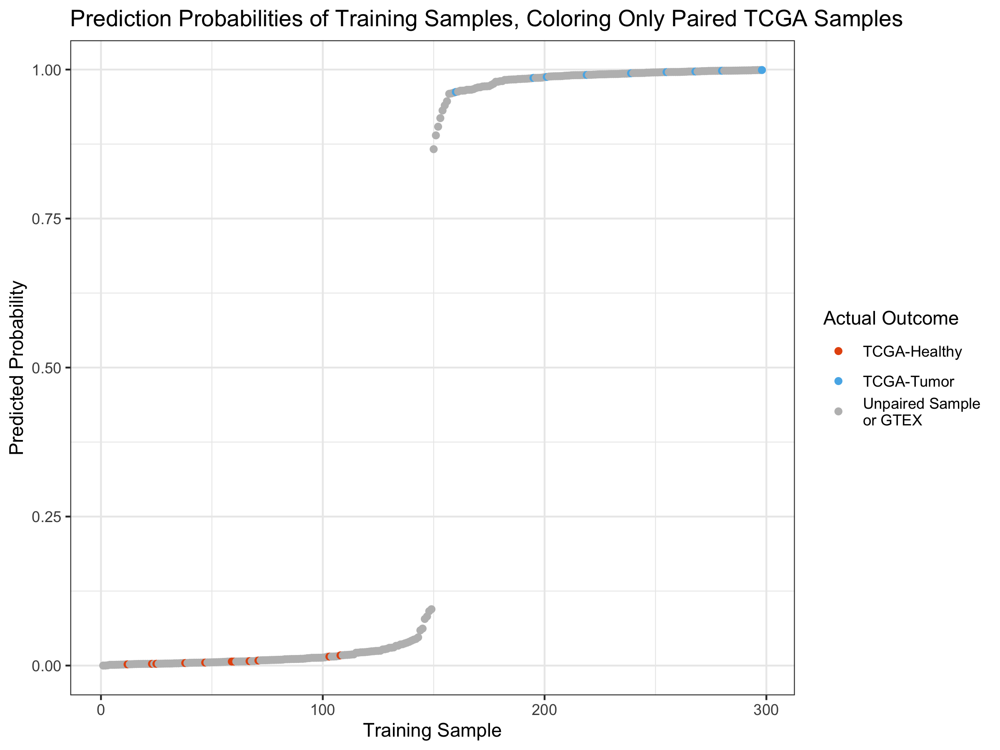<!-- -->
The paired sample distribution in the probabilities also seems fairly
randomly distributed as well.

It thus appears that whether healthy and tumor samples are from the same
patient or not isn’t affecting the model.

### What Genes are the Model Predictors?

I’m going to pull the definition and symbols for the 47 predictors in
the model from *biomaRt* to see what genes the predictors are. The
following table is sorted from the gene predictor that has the
coefficient with the greatest (absolute) magnitude to the predictor with
the least
magnitude.

``` r
# get predictor gene names and Ensembl IDs while removing Intercept term:
ensembl_geneID <- LogRegModel$predEntrezID[2:length(LogRegModel$predEntrezID)]
# manually fix a few updated IDs:
ensembl_geneID[which(ensembl_geneID == "AL354993.1")] = "TSHZ2"
ensembl_geneID[which(ensembl_geneID == "APOA1BP")] = "NAXE"

predictorGeneNames <- LogRegModel$predGeneNames[2:length(LogRegModel$predGeneNames)]
modelCoefs <- LogRegModel$predCoefs[2:length(LogRegModel$predCoefs)]
ensembl_coefs <- data.frame(ensembl_geneID, modelCoefs, abs(modelCoefs)) 
names(ensembl_coefs) <- c("ensembl_geneID", "modelCoefs", "abs.modelCoefs")
ensembl_coefs$ensembl_geneID <- as.character(ensembl_coefs$ensembl_geneID)

##############
# we'll grab biomaRt data for these genes.  
# The following block of code is ONLY
# RUN ONCE, and the results are stored in a file.
if(FALSE){                                  # rm this line the VERY first time
listMarts()
ensembl=useMart("ensembl")
ensembl = useDataset("hsapiens_gene_ensembl",mart=ensembl)

geneID_Name_Description <- getBM(attributes=c("ensembl_gene_id", "hgnc_id", 
                                              "hgnc_symbol", "description"),
   values=geneNames,
   mart=ensembl)
write.csv(geneID_Name_Description, file=BIOMART_GENE_ATTR_FILE)
}
#############

Ensmbl_HGNC_SYM_DESC <- read.csv(BIOMART_GENE_ATTR_FILE, header=TRUE, stringsAsFactors = F)
predGeneAnnot <- Ensmbl_HGNC_SYM_DESC %>% dplyr::filter(hgnc_symbol %in% ensembl_geneID) 

# One remaining predictor w/o BiomaRt information
c3orf36 <- c(NA, "ENSG00000288547","HGNC:26170", "C3ORF36", "chromosome 3 open reading frame 36")
predGeneAnnot <- rbind(predGeneAnnot, c3orf36)


# right-join with ensembl-coeff df-abs coeff, to not lose any predictors
joinedAnnot <- right_join(predGeneAnnot, ensembl_coefs, by=c("hgnc_symbol" = "ensembl_geneID"))

# add back C3ORF36 info:
c3orf36 <- unlist(c(NA, "ENSG00000288547","HGNC:26170", "C3ORF36", "chromosome 3 open reading frame 36", joinedAnnot[nrow(joinedAnnot), 6:7]))
joinedAnnot[nrow(joinedAnnot),] <- c3orf36
# remove extra MSRA gene-to-Ensembl mapping:
joinedAnnot <- joinedAnnot[-which(joinedAnnot$ensembl_gene_id ==
                                    "ENSG00000285250"),]

rm(Ensmbl_HGNC_SYM_DESC)

# arrange by descending abs coeff and print select columns:
joinedAnnot$description <- gsub(" \\[.*$","",joinedAnnot$description) # %>% substr(1,40)
modelAnnot <- as_tibble(joinedAnnot %>% 
                          arrange(desc(abs.modelCoefs)) %>%
                          dplyr::select("ensembl_gene_id", "hgnc_symbol",
                                        "modelCoefs", "description"))
print(modelAnnot, n=nrow(modelAnnot))
```

    ## # A tibble: 47 x 4
    ##    ensembl_gene_id hgnc_symbol modelCoefs     description                       
    ##    <chr>           <chr>       <chr>          <chr>                             
    ##  1 ENSG00000189134 NKAPL       -1.0204748228… NFKB activating protein like      
    ##  2 ENSG00000079462 PAFAH1B3    0.59218829949… platelet activating factor acetyl…
    ##  3 ENSG00000149090 PAMR1       -0.4376512904… peptidase domain containing assoc…
    ##  4 ENSG00000175806 MSRA        -0.3892064370… methionine sulfoxide reductase A  
    ##  5 ENSG00000164932 CTHRC1      0.34831405684… collagen triple helix repeat cont…
    ##  6 ENSG00000159176 CSRP1       -0.3056091208… cysteine and glycine rich protein…
    ##  7 ENSG00000288547 C3ORF36     0.27051225875… chromosome 3 open reading frame 36
    ##  8 ENSG00000143761 ARF1        0.26431761421… ADP ribosylation factor 1         
    ##  9 ENSG00000131069 ACSS2       -0.2510426709… acyl-CoA synthetase short chain f…
    ## 10 ENSG00000163382 NAXE        0.21770116549… NAD(P)HX epimerase                
    ## 11 ENSG00000139874 SSTR1       -0.1846200553… somatostatin receptor 1           
    ## 12 ENSG00000117410 ATP6V0B     0.17791602339… ATPase H+ transporting V0 subunit…
    ## 13 ENSG00000182492 BGN         0.17522454450… biglycan                          
    ## 14 ENSG00000123975 CKS2        0.17430771479… CDC28 protein kinase regulatory s…
    ## 15 ENSG00000156284 CLDN8       -0.1635362378… claudin 8                         
    ## 16 ENSG00000130176 CNN1        -0.1605196562… calponin 1                        
    ## 17 ENSG00000106638 TBL2        0.14026160098… transducin beta like 2            
    ## 18 ENSG00000265972 TXNIP       -0.1363602347… thioredoxin interacting protein   
    ## 19 ENSG00000149380 P4HA3       0.12992246875… prolyl 4-hydroxylase subunit alph…
    ## 20 ENSG00000160877 NACC1       0.12009143589… nucleus accumbens associated 1    
    ## 21 ENSG00000182463 TSHZ2       -0.1200680339… teashirt zinc finger homeobox 2   
    ## 22 ENSG00000182601 HS3ST4      -0.1022980400… heparan sulfate-glucosamine 3-sul…
    ## 23 ENSG00000088992 TESC        -0.0967748115… tescalcin                         
    ## 24 ENSG00000151882 CCL28       -0.0943531670… C-C motif chemokine ligand 28     
    ## 25 ENSG00000166557 TMED3       0.09421100647… transmembrane p24 trafficking pro…
    ## 26 ENSG00000170276 HSPB2       -0.0856989600… heat shock protein family B (smal…
    ## 27 ENSG00000124875 CXCL6       -0.0805364422… C-X-C motif chemokine ligand 6    
    ## 28 ENSG00000126524 SBDS        -0.0746639985… SBDS ribosome maturation factor   
    ## 29 ENSG00000143742 SRP9        0.07465846840… signal recognition particle 9     
    ## 30 ENSG00000164032 H2AFZ       0.07257089181… H2A histone family member Z       
    ## 31 ENSG00000160179 ABCG1       0.07197897770… ATP binding cassette subfamily G …
    ## 32 ENSG00000126561 STAT5A      -0.0700825365… signal transducer and activator o…
    ## 33 ENSG00000164694 FNDC1       0.05755728446… fibronectin type III domain conta…
    ## 34 ENSG00000240654 C1QTNF9     -0.0544062598… C1q and TNF related 9             
    ## 35 ENSG00000144136 SLC20A1     0.05288309784… solute carrier family 20 member 1 
    ## 36 ENSG00000154240 CEP112      -0.0510856889… centrosomal protein 112           
    ## 37 ENSG00000119929 CUTC        -0.0452420957… cutC copper transporter           
    ## 38 ENSG00000187824 TMEM220     -0.0386328520… transmembrane protein 220         
    ## 39 ENSG00000149923 PPP4C       0.03082144517… protein phosphatase 4 catalytic s…
    ## 40 ENSG00000277494 GPIHBP1     -0.0220924955… glycosylphosphatidylinositol anch…
    ## 41 ENSG00000135063 FAM189A2    -0.0213424726… family with sequence similarity 1…
    ## 42 ENSG00000151623 NR3C2       -0.0210937158… nuclear receptor subfamily 3 grou…
    ## 43 ENSG00000130812 ANGPTL6     0.01767635299… angiopoietin like 6               
    ## 44 ENSG00000118733 OLFM3       0.01537600015… olfactomedin 3                    
    ## 45 ENSG00000160753 RUSC1       0.00734547004… RUN and SH3 domain containing 1   
    ## 46 ENSG00000169744 LDB2        -0.0058639598… LIM domain binding 2              
    ## 47 ENSG00000173812 EIF1        -0.0049361449… eukaryotic translation initiation…

### Expression of the 47 Predictors Across Healthy Samples and Tumors

``` r
require(reshape2)
trainNorm42predictors <- train$M_norm[,colIDs]

# update 3 gene names:
colnames(trainNorm42predictors)[which(colnames(trainNorm42predictors) ==
                                        "AL354993.1")] = "TSHZ2"
colnames(trainNorm42predictors)[which(colnames(trainNorm42predictors) ==
                                        "APOA1BP")] = "NAXE"
colnames(trainNorm42predictors)[which(colnames(trainNorm42predictors) ==
                                        "C3orf36")] = "C3ORF36"

prognosis <- generateOutcomeIndicators(rownames(trainNorm42predictors)) 
                                  #1/2=healthy, 3=tum
names(prognosis) <- rownames(trainNorm42predictors)

colors3pal <- c("#FDAE6B", "#E6550D",  "#56B4E9")
predict42scaledMelt <- melt(trainNorm42predictors)
predict42scaledMelt <- cbind(predict42scaledMelt , 
                             colr=as.factor(rep(prognosis, ncol(trainNorm42predictors))))
ggplot(predict42scaledMelt, aes(x=Var2, y=value)) + #, colour=colr)) +
   geom_jitter(aes(colour=colr), size=0.5, alpha=0.75) +
   theme_bw() +
   ylim(-2,5) + theme(axis.text.x=element_text(angle=90)) +
   xlab("Gene Predictors") + ylab("Number of STDEV of Expression vs Mean") +
   scale_color_manual(name="Category",
                         breaks = c("1", "2", "3"),
                         values = c(colors3pal[1], colors3pal[2], colors3pal[3]),
                         labels = c("Healthy-GTEX", "Healthy-TCGA",
                                    "Cancer-TCGA"))
```

    ## Warning: Removed 34 rows containing missing values (geom_point).

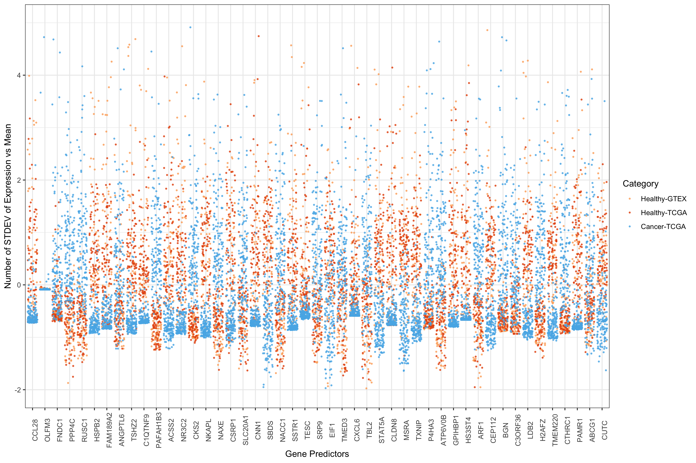<!-- -->
We can see that the majority of these gene predictors have either a
higher level of expression in tumors (positive coefficient) or a higher
level of expression in healthy tissues (negative coefficient). 2 genes
seem to disciminate poorly–at least on their own. I thought they might
all have coefficients very close to zero. However, they are mid-to-high
range (RP5.1039K5.17 = 0.140 and TRBV11-2 = 0.124). Beyond this basic
point, I haven’t pursued this.

### Finding Minimum, Scaled Values for 42 Predictors

The data produced here were used for creating a powerpoint
    slide:

``` r
apply(train$M_scaled[,colIDs], 2, function(x) min(x)/median(x))
```

    ##       CCL28       OLFM3       FNDC1       PPP4C       RUSC1       HSPB2 
    ## 0.002489699         NaN 0.025406277 0.084686380 0.228499380 0.016804128 
    ##    FAM189A2     ANGPTL6  AL354993.1     C1QTNF9    PAFAH1B3       ACSS2 
    ## 0.012737468 0.000000000 0.000000000 0.000000000 0.031490929 0.219657045 
    ##       NR3C2        CKS2       NKAPL     APOA1BP       CSRP1     SLC20A1 
    ## 0.048922858 0.019697494 0.041192819 0.280040856 0.074503634 0.193464699 
    ##        CNN1        SBDS       NACC1       SSTR1        TESC        SRP9 
    ## 0.012525591 0.305963515 0.096072046 0.000000000 0.037848368 0.249072089 
    ##        EIF1       TMED3       CXCL6        TBL2      STAT5A       CLDN8 
    ## 0.085867101 0.039901716 0.000000000 0.173707752 0.039295985 0.000000000 
    ##        MSRA       TXNIP       P4HA3     ATP6V0B     GPIHBP1      HS3ST4 
    ## 0.108713232 0.086162141 0.003878744 0.226021845 0.008661932 0.000000000 
    ##        ARF1      CEP112         BGN     C3orf36        LDB2       H2AFZ 
    ## 0.174336552 0.090270476 0.084281740 0.000000000 0.073908118 0.204381895 
    ##     TMEM220      CTHRC1       PAMR1       ABCG1        CUTC 
    ## 0.024383411 0.031064704 0.010820843 0.167459577 0.208651537

### Using 2 genes to separate out healthy and tumor samples

I’m going to use MIR497HG and PAFAH1B3 to create a 2D plot of the
samples colored by their healthy / tumor status. I’m choosing these two
because they have large coefficients in the model and because they are
inversely correlated with one another.

``` r
df03 <- LogRegModel$modelDF[,c("PAFAH1B3", "NKAPL")]    # BGN
df03 <- data.frame(cbind(df03, col=as.factor(prognosis)))
ggplot(df03) +
   geom_point(aes(x=PAFAH1B3,y=NKAPL,colour=as.factor(col))) +
   theme_bw() + theme(plot.title = element_text(hjust=0.5)) +
    #ylim(-2,5) + #theme_bw() + # (axis.text.x=element_text(angle=90)) +
   scale_color_manual(name="Category",
                         breaks = c("1", "2", "3"),
                         values = c(colors3pal[1], colors3pal[2], colors3pal[3]),
                         labels = c("Healthy-GTEX", "Healthy-TCGA", "Cancer-TCGA")) +
  ggtitle("Training Sample Separation Using Only 2 Genes")
```

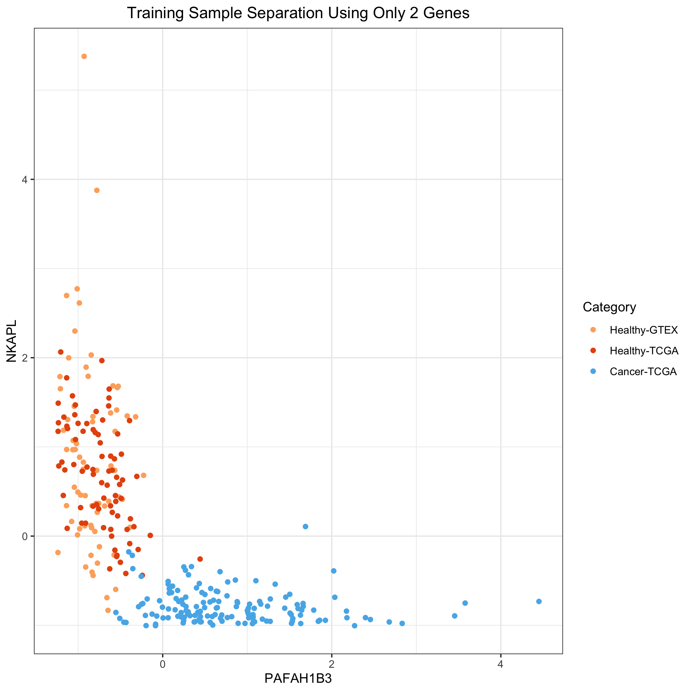<!-- -->
\#\#\# Using the same 2 genes to separate out healthy and tumor samples
in Test Set We’ll repeat the above figure, but for Test data
only

``` r
# start by taking test set data across 42 predictors and removing Entrez part of name
# from column names
#colnames(toilTestFiltScal42) <- gsub("\\.ENSG.*$","",colnames(toilTestFiltScal42))

paste0("PAFAH1B3.", LogRegModel$predEntrezID[which(LogRegModel$predGeneNames == "PAFAH1B3")])
```

    ## [1] "PAFAH1B3.PAFAH1B3"

``` r
df04 <- toilTestFiltScal42[,c("PAFAH1B3", "NKAPL")]
#df03 <- LogRegModel$modelDF[,c("PAFAH1B3", "MIR497HG")]    # BGN
# need prognosis for test set
prognosisTest <- c(rep(1, 20), rep(2,30), rep(3, 50))    # COMBAT
df04 <- data.frame(cbind(df04, col=as.factor(prognosisTest)))
ggplot(df04) +
   geom_point(aes(x=PAFAH1B3,y=NKAPL,colour=as.factor(col))) +
   theme_bw() + theme(plot.title = element_text(hjust=0.5)) +
    #ylim(-2,5) + #theme_bw() + # (axis.text.x=element_text(angle=90)) +
   scale_color_manual(name="Category",
                         breaks = c("1", "2", "3"),
                         values = c(colors3pal[1], colors3pal[2], colors3pal[3]),
                         labels = c("Healthy-GTEX", "Healthy-TCGA", "Cancer-TCGA")) +
  ggtitle("Test Sample Separation Using Only 2 Genes")
```

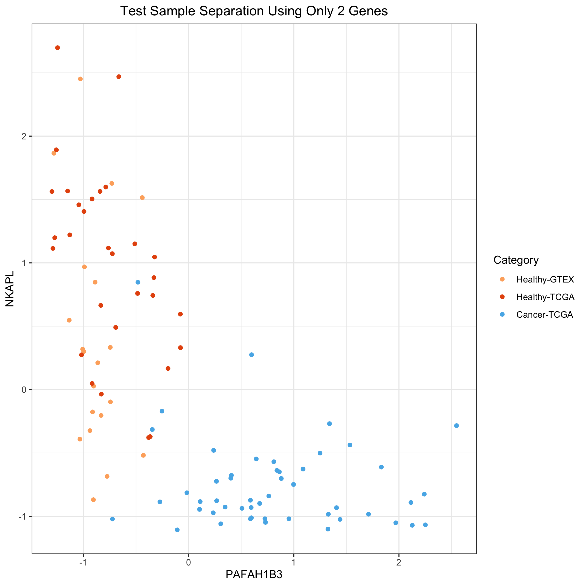<!-- -->

We can see that 2 genes with coefficients that are large, but of
opposite sign, nearly create a separating hyperplane between the tumors
and the healthy samples. This recapitulates the earlier idea of how the
gene expression programming of tumors have greatly diverged from that of
healthy samples that we saw with the Principal Components plots.

### Heatmap of Predictors Across Samples

``` r
# create color range for expression values:
hmcol <- colorRampPalette(c("#40004B", "#40004B", "#40004B", "#762A83", "#9970AB", 
  "#F7F7F7", "#5AAE61", "#1B7837", "#00441B", "#00441B", "#00441B"))

# coloring genes by value of model coefficient:
geneCoefs <- data.frame(LogRegModel$predCoefs)
rownames(geneCoefs) <- LogRegModel$predGeneNames
colnames(geneCoefs) <- "coefs"
geneCoefs <- geneCoefs[rownames(geneCoefs) != "(Intercept)",] # vector now

# create color range for model coefficients:
range01 <- function(x)(x-min(x))/diff(range(x))
geneCols <- palette(brewer.pal(11,"Spectral"))[cut(range01(geneCoefs), 
                                                   breaks=11, labels=FALSE)]

# coloring samples by prognosis:
samples <- factor(prognosis)
sampleCols <- palette(colors3pal)[samples]

# plot heatmap
heatmap.2(as.matrix(LogRegModel$modelDF), 
          col=hmcol, trace="none", 
          cexRow = 0.15, 
          cexCol = 0.5,  
          ColSideColors = geneCols, 
          RowSideColors = sampleCols, 
          main = "Heatmap of Gene Predictors vs Samples")
```

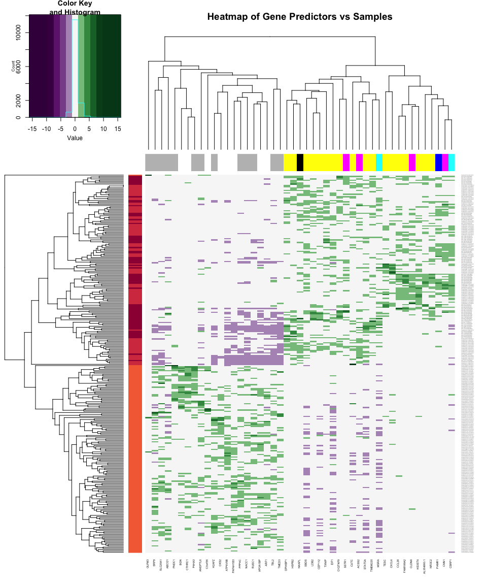<!-- -->
The heatmap just provides another way at looking at the closeness of
relationship between the different gene predictors and likewise between
the different samples. The color-coding of the columns and rows has a
bug in it at the moment.

### Tissue Source Sites

``` r
tssCode <- rownames(train$M_norm) %>%
{gsub("TCGA+[\\.]+([^\\.]+).*","\\1",.)}
# set tssCode for GTEX samples to be zero
tssCode <- gsub("^GTEX.*","GTEX",tssCode)


tssDF <- cbind(rownames(train$M_norm), tssCode)

# create table to see differences in healthy vs tumor
t(table(c(rep("Healthy",149),rep("Tumor",149)), tssCode))
```

    ##        
    ## tssCode Healthy Tumor
    ##    3C         0     1
    ##    A1         0     2
    ##    A2         0    10
    ##    A7         6    11
    ##    A8         0    15
    ##    AC         2     5
    ##    AN         0     7
    ##    AO         0     5
    ##    AR         0     9
    ##    B6         0     6
    ##    BH        53    22
    ##    C8         0     4
    ##    D8         0    16
    ##    E2         8    19
    ##    E9        10     4
    ##    EW         0     5
    ##    GI         1     1
    ##    GM         0     1
    ##    GTEX      69     0
    ##    LL         0     2
    ##    OL         0     2
    ##    PL         0     1
    ##    S3         0     1

This shows that there’s a clear bias of tissue centers in terms of how
many healthy or tumor training samples they contribute. However, the
samples are still originating from many hospitals, which makes it
difficult for one or two to dominate this set.

``` r
# select 8 most common tissue sites, and set others to "FEW"
sitesToTrack <- names(sort(table(tssCode),decreasing = T)[1:8])
tssCode <- replace(tssCode, !tssCode %in% sitesToTrack, "FEW")

# convert to factors
tssCode <- as.factor(tssCode)

PCs <- prcomp(train$M_norm)                               # (data already scaled)
nComp <- 2
dfComponents <- predict(PCs, newdata=train$M_norm)[,1:nComp]

stopifnot(all(rownames(dfComponents) == tssDF[,1]))

PC_plot <- data.frame(x=dfComponents[,1], y = dfComponents[,2], col=tssCode)

my_pal <- c("#e41a1c","#377eb8","#4daf4a","#984ea3","#ff7f00",
            "#ffff33","#a65628","#f781bf","#999999")


ggplot(PC_plot) + 
   geom_point(aes(x=x, y=y, color=as.factor(col))) + 
   ggtitle("PCA Plot of Training Data Colored by Tissue Source Site") +
   xlab("PC1") + ylab("PC2") + theme_bw() +
   theme(panel.background = element_rect(fill = '#f0f0f0')) +
   scale_color_manual(values = my_pal,
                      name="Tissue Source",
                      breaks=c("A2","A7","A8","BH","D8",
                               "E2","E9","FEW","GTEX"),
                      labels=c("Walter Reed", "Christiana Health",
                               "Indivumed", "U Pittsburg",
                               "Greater Poland CC", "Roswell Park",
                               "Asterand", "Miscellaneous", "GTEX"))
```

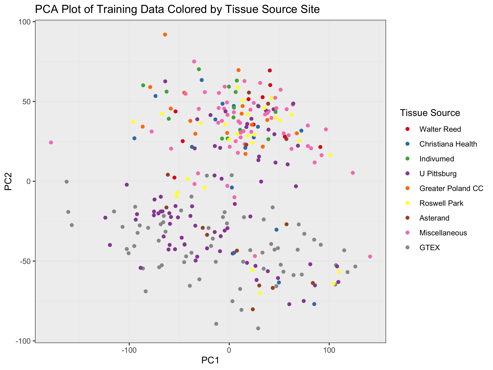<!-- -->
We see that healthy samples (bottom half) are dominated by GTEX and BH
(Univ Pittsburg BRCA Study). However, there are BH samples in the tumor
samples on top as well. Most other biases favor sites that only donated
tumor samples, including the catch-all “FEW” category that captures all
sites having donated \< 10 samples total to my training set.

The question is how these biases affect predictions.

#### Effect of Tissue Source Site on Prediction Probabilities

``` r
trainPreds <- toilTrainFiltScal42 %*% LogRegModel$predCoefs
trainPredsProbs <- 1/(1 + exp(-1 * trainPreds))
stopifnot(all(names(trainPredsProbs)==rownames(train$M_norm)))


# outcome variable = the tissue source sites "tssCode"
trainPreds_DF <- data.frame(cbind(trainPredsProbs,
                                   tssCode))
colnames(trainPreds_DF) <- c("probability","outcome")


# sort on probability and add idx
trainPreds_DF <- trainPreds_DF %>%       
                    arrange(probability)
trainPreds_DF <- cbind(index=1:nrow(trainPreds_DF), trainPreds_DF) 


# colors for data:
my_pal <- c("#e41a1c","#377eb8","#4daf4a","#984ea3","#ff7f00",
            "#ffff33","#a65628","#f781bf","#999999")

ggplot(trainPreds_DF) +
  geom_point(aes(x=index, y=probability, color=as.factor(outcome))) +
  ggtitle("Prediction Probabilities of Training Samples Colored by Tissue Source Site") +
  xlab("Training Sample") + theme_bw() + ylab("Predicted Probability") +
  scale_color_manual(values = my_pal,
                      name="Tissue Source",
                      breaks=c(1,2,3,4,5,6,7,8,9),
                               #"E2","E9","FEW","GTEX"),
                      labels=c("Walter Reed", "Christiana Health",
                               "Indivumed", "U Pittsburg",
                               "Greater Poland CC", "Roswell Park",
                               "Asterand", "Miscellaneous", "GTEX"))
```

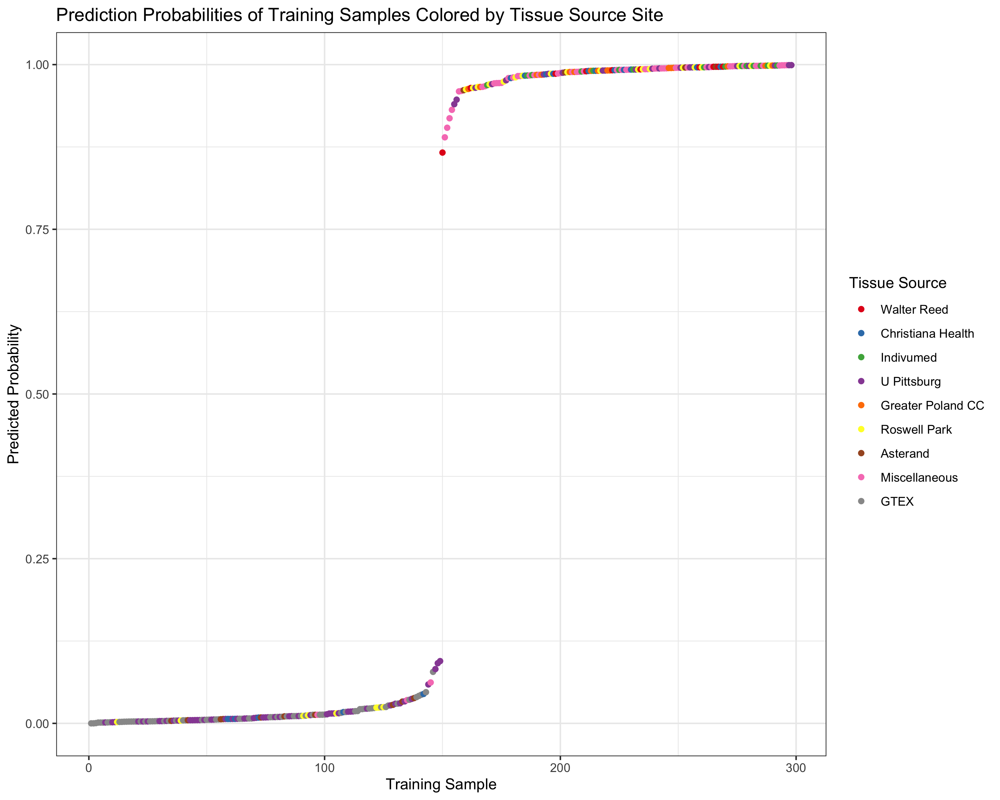<!-- -->
We can see that while U Pittsburg has many more healthy samples than
tumors, the model correctly discriminates between U Pittsburg samples by
whether they are actually healthy (53 samples) or tumor (22 samples),
which is enough to rule out the Tissue Source Site for being a batch
effect for a model with 98%+ accuracy.

### Looking at Diagnosis Date as Proxy for Sample Collection Date

``` r
# grab attributes file and pull out tcga id and year_of_diagnosis:
TCGA_Attr_Full <- read.csv(ATTR_FILE, header=TRUE, sep="\t", 
                            stringsAsFactors = FALSE)
TCGA_ID_Date <- TCGA_Attr_Full %>% dplyr::select(tcgaID, year_of_diagnosis)
rm(TCGA_Attr_Full)

# need to pair these with rownames(train$M_norm)
gtexIDs <- rownames(train$M_norm)[grepl('^GTEX',rownames(train$M_norm))]
tcgaIDs <- rownames(train$M_norm)[grepl('^TCGA',rownames(train$M_norm))]
tcgaIDs_cleaned <- gsub("[.][^.]+[.][^.]+[.][^.]+$","",tcgaIDs)
tcgaIDs_cleaned <- gsub("\\.41R","",tcgaIDs_cleaned)

CombatTrainSamples <- c(gtexIDs, tcgaIDs_cleaned)
write.csv(CombatTrainSamples, "CombatTrainSamples.txt", sep="\t",
          row.names = F)
```

    ## Warning in write.csv(CombatTrainSamples, "CombatTrainSamples.txt", sep = "\t", :
    ## attempt to set 'sep' ignored

``` r
# clean up TCGA_ID_Date:
TCGA_Date_Clean <- data.frame(tcgaID="TCGA.Null",
                              year_of_diagnosis=1999)

for(row in 1:nrow(TCGA_ID_Date)){
  for(tcgaID in (unlist(strsplit(TCGA_ID_Date$tcgaID[row],";")))){
    tcgaID <- gsub("-", ".",tcgaID)    # change - to .
    year_of_diagnosis = TCGA_ID_Date$year_of_diagnosis[row]
    #print(dim(cbind(id, year_of_diagnosis)))
    TCGA_Date_Clean <- rbind(TCGA_Date_Clean,
        cbind(tcgaID, year_of_diagnosis))
  }
}

# fix data types:
TCGA_Date_Clean$tcgaID <- as.character(TCGA_Date_Clean$tcgaID)
TCGA_Date_Clean$year_of_diagnosis <- 
  as.integer(TCGA_Date_Clean$year_of_diagnosis)

# now for each element in tcgaIDs_cleaned, grab year from TCGA_Date_Clean
years <- integer()
for(id in tcgaIDs_cleaned){
  year <- 
    TCGA_Date_Clean$year_of_diagnosis[which(TCGA_Date_Clean$tcgaID %in% id)]
  years <- c(years, year)
}
tumHealthy <- ifelse(grepl("01[AB]$",tcgaIDs_cleaned),"Tumor", "Healthy")
tumHealthYearDF <- data.frame(cbind(tumHealthy, as.integer(years)))

ggplot(tumHealthYearDF, aes(x=V2)) +
  stat_count(aes(fill=tumHealthy)) +
  ggtitle("Year of Patient Diagnosis for Training Samples") +
  xlab("Year of Patient Diagnosis") +
  scale_fill_manual(name="Category",
                     breaks = c("Healthy", "Tumor"),
                     values=c("#E6550D",  "#56B4E9"),
                     labels = c("Healthy-TCGA", "Cancer-TCGA"))
```

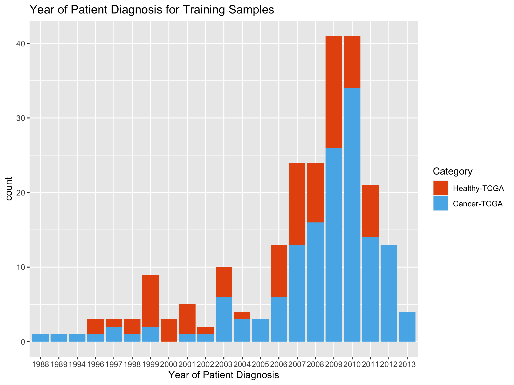<!-- -->

``` r
# add gtex dates on front end:
years <- c(rep(NA,length(gtexIDs)), years)  # or NA better?

#####################
# now do the PCA plotting:
PCs <- prcomp(train$M_norm)                               # (data already scaled)
nComp <- 2
dfComponents <- predict(PCs, newdata=train$M_norm)[,1:nComp]

# QA sample name consistency:
stopifnot(all(rownames(dfComponents) == tssDF[,1]))

# make DF for PCA's
PC_plot <- data.frame(x=dfComponents[,1], y = dfComponents[,2], col=years)

# color palette:
my_pal <- c("#e41a1c","#377eb8","#4daf4a","#984ea3","#ff7f00",
            "#ffff33","#a65628","#f781bf","#999999")

ggplot(PC_plot) + 
   geom_point(aes(x=x, y=y, color=as.factor(col))) + 
   ggtitle("PCA Plot of Training Data Colored by Year of Diagnosis") +
   xlab("PC1") + ylab("PC2") + theme_bw() +
   theme(panel.background = element_rect(fill = '#f0f0f0')) 
```

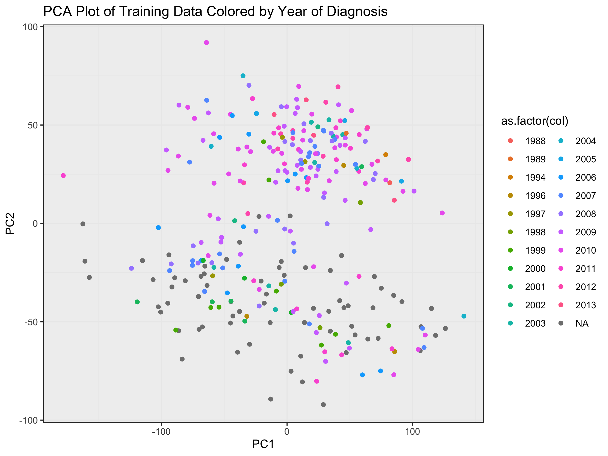<!-- -->

#### Effect of Collection Data on Prediction Probabilities

``` r
trainPreds <- toilTrainFiltScal42 %*% LogRegModel$predCoefs
trainPredsProbs <- 1/(1 + exp(-1 * trainPreds))

stopifnot(all(names(trainPredsProbs)==rownames(train$M_norm)))

# outcome variable here will be the year of sample collection
trainPreds_DF <- data.frame(cbind(trainPredsProbs,
                                   years))
colnames(trainPreds_DF) <- c("probability","outcome")


# sort on probability and add index:
trainPreds_DF <- trainPreds_DF %>%       
                    arrange(probability)
trainPreds_DF <- cbind(index=1:nrow(trainPreds_DF), trainPreds_DF)


# data colors:
my_pal <- c("#e41a1c","#377eb8","#4daf4a","#984ea3","#ff7f00",
            "#ffff33","#a65628","#f781bf","#999999")

ggplot(trainPreds_DF) +
  geom_point(aes(x=index, y=probability, color=as.factor(outcome))) +
  ggtitle("Prediction Probabilities of Training Samples Colored by Year of Diagnosis") +
  xlab("Training Sample") + theme_bw() + ylab("Predicted Probability") +
  theme(panel.background = element_rect(fill = '#f0f0f0')) 
```

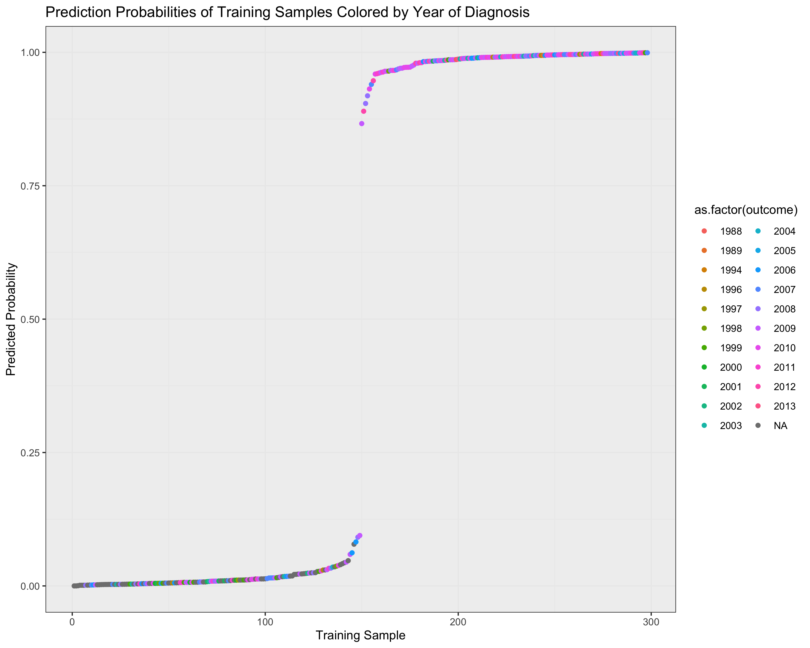<!-- -->

### Sequencing Center for all TCGA Samples

The final portion of each TCGA ID tells us what sequencing center was
used in creating the samples. An example would be
“TCGA.A7.A3J0.01A.11R.A213.07”. So the sequencing center code is “07”.
According to
<https://gdc.cancer.gov/resources-tcga-users/tcga-code-tables/center-codes>,
07 refers to the University of North Carolina. In fact, we can see that
it’s the center used for all TCGA samples in this training set:

``` r
tcgaSampleNames <- all398sampleNames[grep("^TCGA", all398sampleNames)]
print(paste("The percentage of TCGA samples that were sequenced at the University of North Carolina sequencing center is",
(sum(grepl("-07$", tcgaSampleNames))/length(tcgaSampleNames))*100, "%"))
```

    ## [1] "The percentage of TCGA samples that were sequenced at the University of North Carolina sequencing center is 100 %"

We can see that for all healthy samples: TCGA.xx.xxxx.11(A/B) and for
all tumor samples TCGA.xx.xxxx.01(A/B) that they all end in “07”.
Therefore there is no sequencing center variability that, on its own,
could give rise to a batch effect.

#### Potential TCGA Plate Number Batch Effect

The TCGA IDs have a plate identifier embedded in them. It refers to how
samples are stored at the facility. I’d like to eliminate that as a
batch effect.

``` r
# first I'll break healthy and tumor into 2 groups:
tumorSampleNames <- all398sampleNames[grep("-01[AB]-", 
                                           all398sampleNames)]
healthyTCGASampleNames <- all398sampleNames[grep("-11[AB]-", 
                                                 all398sampleNames)]
healthyTCGASampleNames <- gsub("-07-1$","-07", 
                               healthyTCGASampleNames)

# I'm going to take a quick look at plate number distribution:
tumorPlateNumber <- gsub(".*.R-([A-Z0-9]+)-07$", "\\1",
                                   tumorSampleNames)
healthyTCGAPlateNumber <- gsub(".*.R-([A-Z0-9]+)-07$", "\\1",
                                   healthyTCGASampleNames)

plateIDs <- c(tumorPlateNumber, healthyTCGAPlateNumber)
classes <- c(rep("Tumor", length(tumorPlateNumber)), 
             rep("Healthy", length(healthyTCGAPlateNumber)))

plateDF <- data.frame(cbind(plateIDs, classes))

ggplot(plateDF, aes(x=as.factor(plateIDs))) +
  stat_count(aes(fill=classes)) +
  ggtitle("Distribution of TCGA Samples by Plate Number") +
  xlab("TCGA Plate Number") + 
  theme(axis.text.x=element_text(angle=90)) +
  scale_fill_manual(name="Category",
                     breaks = c("Healthy", "Tumor"),
                     values=c("#E6550D",  "#56B4E9"),
                     labels = c("Healthy-TCGA", "Cancer-TCGA"))
```

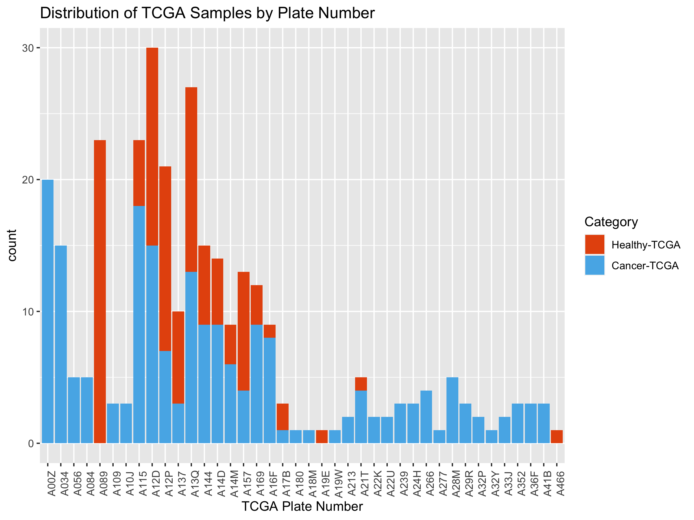<!-- -->
We can see that many TCGA plate numbers are shared between healthy and
tumor samples. For a model with greater than 98% accuracy, plate number
can’t be a confounder. However, next, we’d like to look at the actual
sequencing date.

#### Eliminating Sequencing Date as a Batch Effect Confounder

At the moment, querying for the sequencing date is done manually, and
will be automated in the future. Because of this manual process, I took
a random sampling of 20 healthy TCGA samples and 20 tumor TCGA samples
(training and test are mixed
here).

``` r
# Let's put together a dataframe that has the original IDs along with the 
# plate number.
tcgaSampleNames <- c(tumorSampleNames, healthyTCGASampleNames)
tcgaNamesPlatesDF <- data.frame(cbind(tcgaSampleNames, plateIDs, classes))

# I think I'll take a random sampling of 20 tumor samples and 20 healthy samples and make a figure out of their dates.
set.seed(839298)
idx <- sample(which(tcgaNamesPlatesDF$classes=="Tumor"),20,replace = F)
tumorSample <- tcgaNamesPlatesDF[idx,]
idx <- sample(which(tcgaNamesPlatesDF$classes=="Healthy"),20,replace = F)
healthySample <- tcgaNamesPlatesDF[idx,]
```

The tumorSample and healthySample dataframes were manually queried on
the command-line for the dates. Multiple dates came back for the 40
samples in question. I picked the most representative (common) date for
each sample. Here, we import the output of that file and create a graph
showing the sequencing date variable:

``` r
SeqDatesDF <- read.table(SEQUENCING_DATE_FILE, 
                         header=T, stringsAsFactors = F)

ggplot(SeqDatesDF, aes(x=as.Date(Most_Common_Date), y=as.factor(classes))) +
  geom_jitter(aes(colour=as.factor(classes)),size=0.5, height=0.2) +
  ggtitle("Sequencing Date for Random Sampling of TCGA Samples") +
  xlab("Date of Sequencing") + ylab("Tumor Status") +
  theme_bw() + xlim(c(as.Date("2010-01-01"), as.Date("2014-01-01"))) +
  scale_colour_manual(name="Category",
                    breaks = c("Healthy", "Tumor"),
                    values=c("#E6550D",  "#56B4E9"),
                    labels = c("Healthy-TCGA", "Cancer-TCGA"))
```

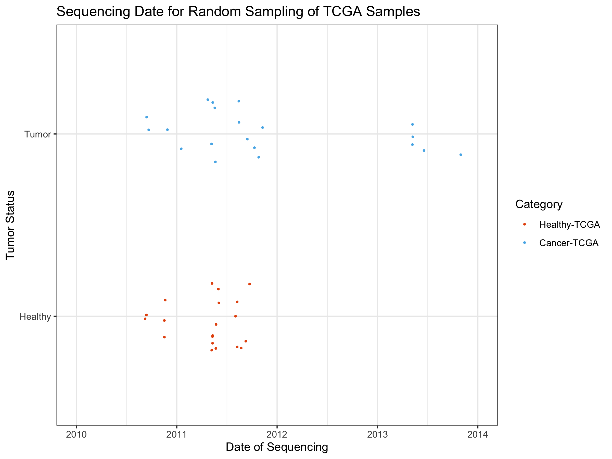<!-- -->
