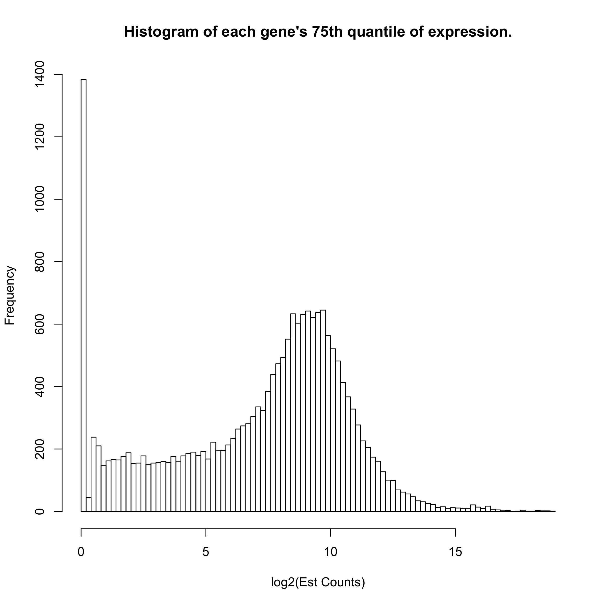
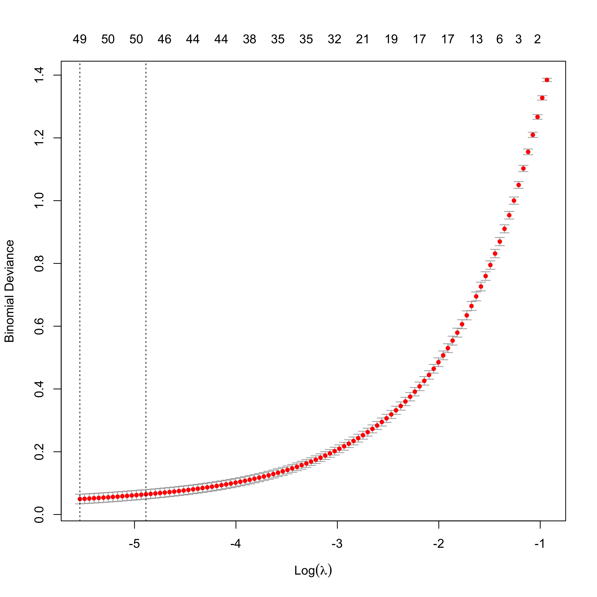
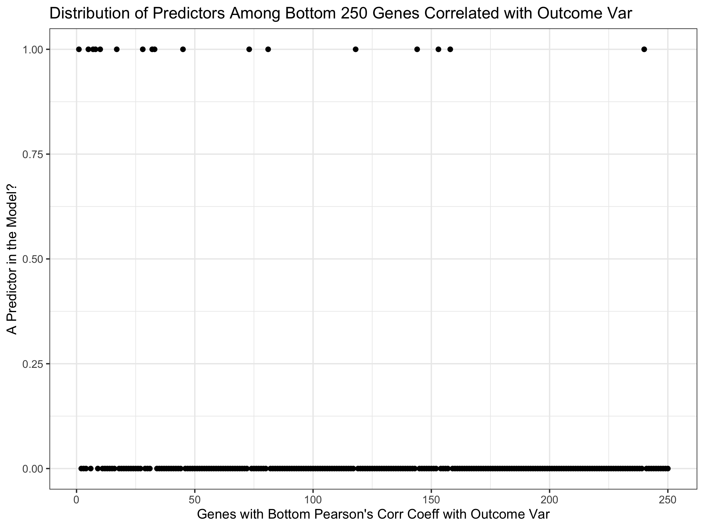

Breast Cancer Prediction with ComBat Data
================
Michael Kesling
June 2020

## Making Cancer Predictions on Breast RNA-Seq Samples

This particular document takes the Toil-normalized TCGA and GTEx breast
cancer samples and runs the logistic regression algorithm with lasso
regularizer on them. Importantly, the only sample-to-sample
normalization performed in quantile-quantile normalization relative to a
single reference sample. No batch normalization is performed at this
point, as it’s the simplest scenario for test samples processed in the
clinic, as they will appear one at a time, typically.

The data were downloaded from the UCSC server at:
<https://xenabrowser.net/datapages/?cohort=TCGA%20TARGET%20GTEx&removeHub=https%3A%2F%2Fxena.treehouse.gi.ucsc.edu%3A443>
There are 2 relevant *gene expression RNAseq* datasets there. *RSEM
expected\_count (n=19,109)* which is used in this document, and *RSEM
expected\_count (DESeq2 standardized) (n=19,039)* which was used in the
*Toil\_Norm.Rmd* file.

The *markdown* and *html* versions of this document have some of the
code masked for better readability. To view the full code, see the [.Rmd
version](Toil_Analysis_ObjOrient.Rmd).

#### Setting Global Parameters

For this code to run, one must set the path, on one’s machine to the
*RSEM\_COUNTS\_FILE*, which contains the RNASeq data, and the
*TOILGENEANNOT* file, which maps the Ensembl identifiers to the gene
names.

``` r
knitr::opts_chunk$set(echo = TRUE)
# rmarkdown::render("./Toil_Analysis_ObjOrient.Rmd")
#######################
# SET GLOBAL PARAMETERS
#######################
RSEM_COUNTS_FILE <- "/Volumes/MK_Ext/Tresorit_iOS/projects/RNA-Seq/MachineLearningRNASeq/toilSubsetRSEM382.txt"
TOILGENEANNOT <- "/Volumes/MK_Ext/RNA-Seq_2019/TOIL_Data/gencode.v23.annotation.gene.probemap"
BIOMART_GENE_ATTR_FILE <- "/Volumes/MK_Ext/Tresorit_iOS/projects/RNA-Seq/MachineLearningRNASeq/geneAttr.csv"
TCGA_ATTR_FILE <- "/Volumes/MK_Ext/Tresorit_iOS/projects/RNA-Seq/data/TCGA_Attributes_full.txt"
WANG_MATRIX <- "/Volumes/MK_Ext/Tresorit_iOS/projects/RNA-Seq/data/wangBreastFPKM398_Attrib.txt"
FULL_TOIL_DATA <- "/Users/mjk/RNA-Seq_2019/TOIL_Data/TcgaTargetGtex_gene_expected_count"
SEED <- 233992812
SEED2 <- 1011
```

#### Hidden Functions

There are 3 large functions that don’t appear in the .md and .html
versions of this document to improve readability: one pre-processes the
Toil\_RSEM data, one performs TMM sample-to-sample scaling, just like
the edgeR method, and the last centers and scales each gene relative to
its mean and standard
deviation.

### Define main data structure and create methods for it

``` r
## The DAT object will contain all the various data matrices, sample names,
## and lists as the original data matrix is pre-processed before the data
## analysis ensues.

createDAT <- function(M){                # M is a data.matrix
   # it's assumed that samples are rows and genes are columns already
   z <- list(M_orig = M,                     # assumed log2 scale
             M_nat = matrix(),          # M_orig on natural scale
             M_filt = matrix(),         # after gene filtering
             M_scaled = matrix(),       # as fraction of all counts
             M_norm = matrix(),         # after gene normalization
             ZEROGENES = list(),
             outcome = list(),
             RefSampleName = character(),
             RefSample = matrix(),
             RefSampleUnscaled = matrix(),
             M_filtScaled = matrix(),   # after TMM scaling
             seed = numeric())
   #names(z[[2]]) <- "Nat"
   class(z) <- "DAT"
   return(z)
}

##########
# pick the most representative sample, calling it RefSample
##########
pickRefSample <- function(x) UseMethod("pickRefSample", x)
pickRefSample.DAT <- function(x, logged=FALSE){  # X is matrix with samples as rows
                   # representative reference sample selected via edgeR specs
                   # this script assumes data are on natural scale.
   # Xnat <- if(logged==TRUE) ((2^X)-1) else X  # put in natural scale
   N <- apply(x$M_filt, 1, sum)
   scaledX <- apply(x$M_filt, 2, function(x) x / N)
   thirdQuartiles <- apply(scaledX, 1, function(x) quantile(x)[4])
   med <- median(thirdQuartiles)
   refSampleName <- names(sort(abs(thirdQuartiles - med))[1])
   return(list(refSampleName, scaledX))
}

##########
# transform log2 data to natural scale
natural <- function(x) UseMethod("natural", x)
natural.DAT <- function(x){
   x$M_nat <- (2^x$M_orig) - 1
}

############
# filter Genes
filterGenes <- function(x) UseMethod("filterGenes", x)
filterGenes.DAT <- function(x, cutoff=0.2){ # filters calculated in log2 scale
                                       # but applied to data in natural scale
   ZEROEXPGENES <- which(apply(x[[1]], 2, function(x) quantile(x)[4]) < cutoff)
   filteredGenes <- x[[2]][, -ZEROEXPGENES]  
   return(list(ZEROEXPGENES, filteredGenes))
}

###########
# Add Zero Genes (to test set from training Zero list)
addZeroGenes <- function(x, ZERO){    # used when training-ZERO applied to 
   x[[6]] <- ZERO                     # test set
} 
```

## MAIN

The RSEM-Counts file originated as the full set of GTEX and TCGA breast
samples, both healthy and tumors, which numbered over 1200. I wanted an
equal number of tumor and healthy samples in my training and test set,
as it gave me the best chance at seeing how well my predictor performed.
Further, some samples had been found by the Sloan-Kettering group to be
of low quality, and these were filtered out. These steps were performed
by another script (Toil\_RSEM.Rmd). Our starting dataframe here, is
therefore called *toilSubset*, and has 387 samples.

## MODIFICATION: Using ComBat Data

I’m making a few modifications only in the next chunk in order to switch
to using the ComBat dataset. 2020-06-27

``` r
# just read already-subsetted dataframe
# toilSubset <- read.table(RSEM_COUNTS_FILE, sep="\t", header=TRUE)
# rownames(toilSubset) <- toilSubset$sample
##############
# SUBSTITUTE COMBAT for TOIL:
##############
toilSubset <- read.table(WANG_MATRIX, sep="\t", header=TRUE,
                         stringsAsFactors = F)
rownames(toilSubset) <- toilSubset[,1]
toilSubset <- toilSubset[,3:ncol(toilSubset)]

# the last 8 rows are non-gene information (race, age, etc)
# and we'll remove those now:
tmp <- toilSubset[1:(nrow(toilSubset)-8),]
toilSubset <- tmp

# Troubleshooting:
# which(sapply(toilSubset, function(x) any(is.na(x))))
# which(sapply(toilSubset[,"GTEX.WYVS.1726.SM.3NMAY"], is.na)) #19741, 19742
# rownames(toilSubset)[19741] #,"GTEX.WYVS.1726.SM.3NMAY"]


tmp <- as.data.frame(sapply(toilSubset, as.numeric)) # throws NA error
rownames(tmp) <- rownames(toilSubset)
toilSubset <- tmp
rm(tmp)
# columns already ordered as expected
```

### RSEM-Counts Dataframe Cleanup

I’m going to add the gene name to the Ensembl ID to make it easier to
figure out what genes we’re looking at. Samples were also sorted in the
dataframe so that healthy and tumors were separated, as subsequently
were TCGA and GTEX.

``` r
# NOT NEEDED FOR COMBAT DATA
# toilSubset <- preProcess(toilSubset, TOILGENEANNOT)
```

### Create Test and Training Sets

Up to this point, all we’ve done is grabbed the Toil RSEM output data
and re-formatted it. It’s still in log2-format.

Next:  
1\. Randomly select samples to be in the training and test sets in a way
that keeps the ratio of healthy/tumors at about 50/50  
2\. Filter out genes with very low or zero expression across the data
set.  
3\. perform edgeR normalization with a reference sample to control for
depth-of-sequencing effects. Use same reference for training and
(future) test set  
4\. Center and scale each gene about its mean and std deviation,
respectively.  
5\. Perform ML  
6\. Test the model on the test
set.

``` r
toilSubsetWide <- t(toilSubset)                               # transpose matrix

outcome <- c(rep(0, 199), rep(1, 199)) # COMBAT
#outcome <- c(rep(0, 185), rep(1, 197))                  # 0 = healthy, 1 = tumor

# bind outcome variable on data frame for even, random partitioning
toilSubsetWide <- data.frame(cbind(toilSubsetWide, outcome))
set.seed(SEED)
idxTrain <- caTools::sample.split(toilSubsetWide$outcome, SplitRatio = 0.75)
# QA
sum(idxTrain)/length(idxTrain)             # 75% observations in training set OK
```

    ## [1] 0.7487437

We see that 75% of the samples ended up in the training set, as
expected.

``` r
#### COMBAT convert to log2(x+1) first
tmp <- as.data.frame(sapply(toilSubsetWide,
                                       function(x) log2(x+1)))
rownames(tmp) <- rownames(toilSubsetWide)
toilSubsetWide <- tmp
rm(tmp)

# create training and test predictor sets and outcome vectors:
toilTrain <- subset(toilSubsetWide, idxTrain==TRUE)
outcomeTrain <- subset(toilSubsetWide$outcome, idxTrain==TRUE)  # Is this used?

toilTest <- subset(toilSubsetWide, idxTrain==FALSE)
outcomeTest <- subset(toilSubsetWide$outcome, idxTrain==FALSE)

# remove outcome variable from predictor matrices:
toilTrain <- toilTrain %>% dplyr::select(-outcome)
toilTest <- toilTest %>% dplyr::select(-outcome)

# convert back to matrices:
toilTrain <- as.matrix(toilTrain)
toilTest <- as.matrix(toilTest)

# reclaim memory
rm(toilSubset); rm(toilSubsetWide)
```

Now create object starting with toilTrain data matrix

``` r
train <- createDAT(toilTrain)
train$M_nat <- natural(train)
train$outcome <- outcomeTrain
```

### 1\. Removing genes whose expression is very close to zero.

We know that there are about 9103 genes that are never expressed (data
not shown), but there are over 25000 genes whose 75th quantile-level
expression is under 2^(0.2) - 1 = 0.14 counts. We really don’t want to
deal with those genes in selecting a reference sample,
etc.

``` r
hist(apply(toilTrain, 2, function(x) quantile(x)[4]), breaks=100, main="Histogram of each gene's 75th quantile of expression.", xlab="log2(Est Counts)")
```

<!-- -->
Another attempt at filtering genes whose log2(Est Counts) was less than
5 gave very unstable results at the sample-to-sample scaling factor step
that corrects for unequal depth-of-sequencing between samples (not shown
here). The exact reason for this hasn’t been pursued at this point. One
possibility is that samples whose depth-of-sequencing is low may have
most of their genes absent for the sample-to-sample adjustment step.

``` r
tmp <- filterGenes(train)
train$ZEROGENES <- tmp[[1]]; train$M_filt <- tmp[[2]]
```

### 2\. Sample-to-Sample Scaling

I’m using the TMM algorithm to perform sample-to-sample scaling, just as
what is done in edgeR. First, one picks a reference sample (whose
depth-of-sequencing is close to the median), then one scales all other
samples relative to it, using weighted Trimmed Mean (TMM).

``` r
tmp <- pickRefSample(train)
train$M_scaled <- tmp[[2]]; train$RefSampleName <- tmp[[1]]
train$M_filtScaled <- weightedTrimmedMean(train)
```

### 3\. Gene-level Normalization

When performing lasso regularization, it’s important that the each gene
is on the same scale as all other genes. Otherwise, highly expressed
genes will influence the algorithm more than other genes. And with
differential expression, we’re not interested in the absolute expression
level in any case. So here, we subtract each gene’s mean and divide by
the gene’s standard deviation so that each gene is standard-normalized.

``` r
train$M_norm <- normalizeGenes(train$M_filtScaled, TRUE, FALSE)
```

#### train$M\_norm is what we’ll perform our machine learning on.

### Logistic Regression with Lasso Regularizer on Toil Data

I’d like to compare the performance on this breast cancer dataset in the
absence of batch normalization (ComBat). This helps rule out any bias
the batch normalization may have had on improving the previous
prediction results, which were much better than I’d expected.

INSERT EQUATION HERE

``` r
set.seed(SEED2)
fitToil.lasso <- glmnet(train$M_norm, train$outcome, family="binomial",
                           alpha = 1)
defaultPalette <- palette()
plot(fitToil.lasso, xvar="lambda", label=TRUE)
```

<!-- -->
Here, we see which genes have the strongest effect on the logistic
regression model as the value of lambda increases from left to right. It
appears that perhaps with a few dozen genes, we might have a
well-performing
model.

### Cross-Validating the Model to Pick the Smallest, Well-Performing Model

I’m going to look at cross-validating the model in order to pick the
simplest one that performs
well.

``` r
set.seed(SEED2)                                # need same seed as previous step
cv.Toil.lasso <- cv.glmnet(train$M_norm, train$outcome
                           , family="binomial", alpha=1) 
plot(cv.Toil.lasso)
```

<!-- -->
We can see that 48 predictors gives us a model whose deviance is within
1-standard deviation from the minimum.

### Store the Model in a Custom Structure

``` r
coefsToil <- coef(cv.Toil.lasso, s=cv.Toil.lasso$lambda.1se)

##########
# Store model in a structure:
storeMODEL <- function(coefsToil, train=train){
   idx <- which(coefsToil[,1] != 0)
   predictorFullNames <- rownames(coefsToil)[idx]
   colIDs <- which(colnames(train$M_norm) %in% 
                   predictorFullNames) 
   tmpDF <- train$M_norm[,colIDs]
   predGeneNames <- gsub("\\.ENSG.*","", predictorFullNames)
   colnames(tmpDF) <- predGeneNames[2:length(predGeneNames)]

   z <- list(
      fullModel = coefsToil,
      predFullNames = predictorFullNames,
      predCoefs = coefsToil[idx],
      predGeneNames = predGeneNames, 
      predEntrezID = gsub(".*.(ENSG.*)\\..*$","\\1", predictorFullNames),
      modelDF = tmpDF                                 # lacks (Intercept)
   )
   
   class(z) <- "MODEL"
   return(z)
}

LogRegModel <- storeMODEL(coefsToil, train)
```

#### Creating Correlations with Outcome Vector for GSEA Analysis

``` r
if(FALSE){
  # calculate correlation coefficient pairwise between the
  # outcome variable and each of the 42 predictors, then sort
  predictorsCorr <- sort(apply(LogRegModel$modelDF, 2, cor,
                               y=train$outcome,
                               method="pearson"))
  corrDF <- cbind(rep(1, length(predictorsCorr)), predictorsCorr)
  # write vector to text file:
  write.table(corrDF, "predictors42corr.txt", sep="\t") # not used
  
  write.table(train$outcome, "outcome.cls.txt") # had to modify format
  
  write.table(t(LogRegModel$modelDF), "predictorExpr.txt",
              sep="\t")
  
  #### Going to output the entire training dataframe, transposed.
  #### the outcome variable is the same as above.
  write.table(t(train$M_norm), "training287Expr.txt", sep="\t")
  
  ensembl_geneID <- gsub(".*(ENSG.*.$)","\\1",rownames(t(train$M_norm))) %>%
  {gsub("\\..*$", "", .)}
  genes <- gsub("(.*)\\.ENSG.*","\\1",rownames(t(train$M_norm))) %>%
    {gsub("\\.", "-", .)}
  
  
  Ensmbl_HGNC_SYM_DESC <- read.csv(BIOMART_GENE_ATTR_FILE, header=TRUE, stringsAsFactors = F)
  
  idx_match <- which(ensembl_geneID %in% Ensmbl_HGNC_SYM_DESC$ensembl_gene_id)
  
  train_inverted <- t(train$M_norm)
  train_inverted <- train_inverted[idx_match,]
  rownames(train_inverted) <- ensembl_geneID[idx_match]
  # sum(as.numeric(table(rownames(train_inverted))) > 1)
  
  write.table(train_inverted, "training287Expr.txt", sep="\t")
  
  predGeneAnnot <- Ensmbl_HGNC_SYM_DESC %>% dplyr::filter(ensembl_gene_id %in% ensembl_geneID)
  predGeneAnnot$description <- gsub(" \\[.*$","",predGeneAnnot$description)
  # join with ensembl-coeff df-abs coeff
  rm(Ensmbl_HGNC_SYM_DESC)
  #joinedAnnot <- inner_join(predGeneAnnot, ensembl_coefs, by=c("ensembl_gene_id" = "ensembl_geneID"))
  # arrange by order to desc abs coeff and print select columns:
  
  chip_DF <- data.frame(predGeneAnnot %>% dplyr::select("ensembl_gene_id", 
                                                       "hgnc_symbol", "description"))
  colnames(chip_DF) <- c("Probe Set ID", "Gene Symbol", "Gene Title")
  write.table(chip_DF, "brca.chip", sep="\t")
}

predictorsCorrTotal <- sort(apply(train$M_norm, 2, cor,
                               y=train$outcome,
                               method="pearson"))
#predictorsCorrTotal
digitalPredCCoutcome <- ifelse(names(predictorsCorrTotal) %in% LogRegModel$predFullNames, 1, 0)
bottomDigPredCCoutcome <- head(digitalPredCCoutcome, 250)
topDigPredCCoutcome <- tail(digitalPredCCoutcome, 250)
topCC <- data.frame(cbind(1:250, topDigPredCCoutcome))
bottomCC <- data.frame(cbind(1:250, bottomDigPredCCoutcome))

colorsOutcome <- c("#E6550D",  "#56B4E9")

ggplot(topCC) +
  geom_point(aes(x=V1, y=topDigPredCCoutcome)) +
  ggtitle("Distribution of Predictors Among Top 250 Genes Correlated with Outcome Variable") +
  xlab("Genes with Top Pearson's Corr Coeff with Outcome Var") + theme_bw() + ylab("A Predictor in the Model?") 
```

<!-- -->

``` r
ggplot(bottomCC) +
  geom_point(aes(x=V1, y=bottomDigPredCCoutcome)) +
  ggtitle("Distribution of Predictors Among Bottom 250 Genes Correlated with Outcome Var") +
  xlab("Genes with Bottom Pearson's Corr Coeff with Outcome Var") + theme_bw() + ylab("A Predictor in the Model?") 
```

<!-- -->

## Working with Test Data

### Filter and Scale Test Data.

#### Relying on Training Data for Zero-Filtering and Scaling of Test Data

In order to see how well our model actually performs, we need to test it
on test data that it hasn’t seen before. First, we need to process the
test data just as we did the training data, but completely separately,
as this is the real-world case.

In data not shown here, I have found that sample-to-sample scaling
performs well only when either  
(i) it’s done in the context of a large number of samples, which is a
challenge for the real-world case where a single sample comes out of the
clinic.  
(ii) it’s done relative to a single *reference sample* that was
identified in the training set.

Here, I’m using case (ii) by normalizing each test sample individually
against this reference sample. Towards the bottom of the document, I
perform case (i) below in order to rule out any lingering bias derived
from the fact that sample scaling is performed relative to a single
training sample.

Furthermore, the process of filtering out genes with very-near-zero
expression levels across all samples cannot be easily defined by a
single clinical sample. Likewise, here, I’ll use the “(near)
zero-expressed genes” from the training set in order to perform
gene-level filtering in the test set.

We start by entering the test data into a new instance of our **DAT**
object.

``` r
test <- createDAT(toilTest)               # add matrix to DAT object
test$M_nat <- natural(test)                # transform from log2 to natural scale
test$outcome <- outcomeTest                  # add outcome variable
```

#### 1\. Filter out genes from test set using those defined in the training set

``` r
                                               # transfer ZEROEXP to test object
test$M_filt <- test$M_nat[, -train$ZEROGENES]  # subtract off genes and return 
                                               # remainder to test object
```

#### 2\. Sample-to-Sample Scaling of Test Set

We’re going to use the Reference Sample data from the training set
here

``` r
tmp <- pickRefSample(test)                  # only doing this to get scaled data
test$M_scaled <- tmp[[2]]; 
test$RefSampleName <- train$RefSampleName      # RefSampleName from training set
test$M_filtScaled <- weightedTrimmedMean(test, train, 1)     # filtered & scaled
```

#### 3\. Gene-level Normalization on Test Set

``` r
test$M_norm <- normalizeGenes(test$M_filtScaled, TRUE, FALSE)
```

#### 4\. Remove Non-Predictor Genes from Filtered Test Data

We’re just keeping the 42 predictors from toilTestFiltScaled

``` r
colIDs <- which(colnames(test$M_norm) %in% 
                   LogRegModel$predFullNames[2:length(LogRegModel$predFullNames)])
toilTestFiltScal42 <- test$M_norm[,colIDs]                    # SEPARATE FROM OBJECT
toilTrainFiltScal42 <- train$M_norm[,colIDs]
toilTrainFiltScal42 <- cbind(rep(1,nrow(toilTrainFiltScal42)), toilTrainFiltScal42)
```

#### 5\. Test Set Sensitivity and Specificity

First we add an intercept column to test predictor variables, then we
perform matrix multiplication with the predictor coefficients and then
look at the prediction performance in the confusion
matrix.

``` r
toilTestFiltScal42 <- cbind(rep(1,nrow(toilTestFiltScal42)), toilTestFiltScal42)

testPredictions_toil <- ifelse(toilTestFiltScal42 %*% LogRegModel$predCoefs > 0, 1, 0)
table(test$outcome, testPredictions_toil)
```

    ##    testPredictions_toil
    ##      0  1
    ##   0 50  0
    ##   1  1 49

I’m at 100% sensitivity and 100% specificity.

#### Create Visual for Test Predictions

``` r
generateOutcomeIndicators <- function(names){
  # given the sample names from a list or df row/colname
  # will generate a numeric vector for coloring points
  # according to (1) GTEX sample, (2) TCGA normal, (3) TCGA tumor
  gtex <- ifelse(grepl("^GTEX", names),1,0)
  tcgaHealthy <- ifelse(grepl("^TCGA.*.11$", names),2,0)
  tcgaTumor <- ifelse(grepl("^TCGA.*.01$", names),3,0)
  return(gtex + tcgaHealthy + tcgaTumor)
}
generateOutcomeIndicatorsCOSMIC <- function(names){
  # given the sample names from a list or df row/colname
  # will generate a numeric vector for coloring points
  # according to (1) GTEX sample, (2) TCGA normal, (3) TCGA tumor
  gtex <- ifelse(grepl("^GTEX", names),1,0)
  tcgaHealthy <- ifelse(grepl("^TCGA+[\\.]+[^\\.]+[\\.]+[^\\.]+[\\.]+11",
                              names),2,0)
  tcgaTumor <- ifelse(grepl("^TCGA+[\\.]+[^\\.]+[\\.]+[^\\.]+[\\.]+01", 
                            names),3,0)
  return(gtex + tcgaHealthy + tcgaTumor)
}

testPreds95 <- toilTestFiltScal42 %*% LogRegModel$predCoefs
testPreds95Probs <- 1/(1 + exp(-1 * testPreds95))

outcomeIndicators <- 
  generateOutcomeIndicatorsCOSMIC(rownames(testPreds95Probs))

testPreds95_DF <- data.frame(cbind(testPreds95Probs,  # change
                                   outcomeIndicators))
colnames(testPreds95_DF) <- c("probability","outcome")
testPreds95_DF <- testPreds95_DF %>%       # sort on probability
                    arrange(probability)
testPreds95_DF <- cbind(index=1:nrow(testPreds95_DF), 
                        testPreds95_DF) # add idx

#colorsOutcome <- c("#E6550D",  "#56B4E9")
colors3pal <- c("#FDAE6B", "#E6550D",  "#56B4E9")

ggplot(testPreds95_DF) +
  geom_point(aes(x=index, y=probability, color=as.factor(outcome))) +
  ggtitle("Prediction Probabilities of Test Samples") +
  xlab("Test Sample") + theme_bw() + ylab("Predicted Probability") +
  scale_color_manual(name="Actual Outcome",
                      breaks = c("1", "2", "3"),
                      values = c(colors3pal[1], colors3pal[2],
                                 colors3pal[3]), 
                      labels = c("GTEX-Healthy", "TCGA-Healthy",
                                 "TCGA-Tumor"))
```

<!-- -->
\#\#\#\# Create Visual for Train Predictions

``` r
trainPreds <- toilTrainFiltScal42 %*% LogRegModel$predCoefs
trainPredsProbs <- 1/(1 + exp(-1 * trainPreds))
outcomeIndicators <- 
  generateOutcomeIndicatorsCOSMIC(rownames(trainPredsProbs)) #####

trainPreds_DF <- data.frame(cbind(trainPredsProbs,
                                   outcomeIndicators))
colnames(trainPreds_DF) <- c("probability","outcome")
trainPreds_DF <- trainPreds_DF %>%       # sort on probability
                    arrange(probability)
trainPreds_DF <- cbind(index=1:nrow(trainPreds_DF), trainPreds_DF) # add idx

#colorsOutcome <- c("#E6550D",  "#56B4E9")
colors3pal <- c("#FDAE6B", "#E6550D",  "#56B4E9")

ggplot(trainPreds_DF) +
  geom_point(aes(x=index, y=probability, color=as.factor(outcome))) +
  ggtitle("Prediction Probabilities of Training Samples") +
  xlab("Training Sample") + theme_bw() + ylab("Predicted Probability") +
  scale_color_manual(name="Actual Outcome",
                      breaks = c("1", "2", "3"),
                      values = c(colors3pal[1], colors3pal[2],
                                 colors3pal[3]), 
                      labels = c("GTEX-Healthy", "TCGA-Healthy",
                                 "TCGA-Tumor"))
```

<!-- -->

## Why does the model perform so well?

I expected that the logistic regression with a lasso regularizer would
perform okay, but not nearly as well as it did. The question is why? Is
it simply that tumors have a sufficiently different genetic programming
that they can easily be partitioned from healthy samples?

### Principal Components

To explore this idea, I’m going to look at the first 2 principal
components of the overall variability of the data across all genes that
weren’t filtered out for having near-zero expression, and plot those
out, coloring each sample according to whether or not it’s healthy or a
tumor.

``` r
plotPCs <- function(dfComponents, compIdx){
   PC_plot <- data.frame(x=dfComponents[,compIdx[1]], y = dfComponents[,compIdx[2]], col=prognosis)
   colors3pal <- c("#FDAE6B", "#E6550D",  "#56B4E9")
   obj <<- ggplot(PC_plot) + 
      geom_point(aes(x=x, y=y, color=as.factor(col)), alpha=0.6) + 
      ggtitle("PCA Plot of Training Data Using All Filtered Predictors of Toil Training Data") +
      xlab(paste0("PC",compIdx[1])) + ylab(paste0("PC", compIdx[2])) +
      theme_bw() + 
      scale_color_manual(name="Category",
                         breaks = c("1", "2", "3"),
                         values = c(colors3pal[1], colors3pal[2], colors3pal[3]),
                         labels = c("Healthy-GTEX", "Healthy-TCGA", "Cancer-TCGA"));
   return(obj)
}


prognosis <- c(rep(1, 69), rep(2,80), rep(3, 149))       # 1/2 = healthy, 3 = cancer
PCs <- prcomp(train$M_norm)                               # (data already scaled)
nComp <- 2
dfComponents <- predict(PCs, newdata=train$M_norm)[,1:nComp]

PC_plot <- data.frame(x=dfComponents[,1], y = dfComponents[,2], col=prognosis)
colors3pal <- c("#FDAE6B", "#E6550D",  "#56B4E9")

ggplot(PC_plot) + 
   geom_point(aes(x=x, y=y, color=as.factor(col))) + 
   ggtitle("PCA Plot of Training Data Using All Filtered Predictors of Toil Training Data") +
   xlab("PC1") + ylab("PC2") + theme_bw() +
   scale_color_manual(name="Category",
                      breaks = c("1", "2", "3"),
                      values = c(colors3pal[1], colors3pal[2], colors3pal[3]),
                      labels = c("Healthy-GTEX", "Healthy-TCGA", "Cancer-TCGA"))
```

<!-- -->

We can see that even only employing the first 2 Principal Components,
that:  
(1) there is very good separation between the tumors in the training set
(blue) and the healthy samples.

2)  We also see that the 2nd PC separates the outcome variable much
    better than the 1st PC.

3)  We also notice that the healthy samples from TCGA (red) and the
    healthy samples from GTEX (orange) are also separated out. This has
    to do with how there’s a batch effect between TCGA and GTEX and
    which was addressed by the Sloan Kettering group in the [Wang, et.
    al. Combat paper](https://www.nature.com/articles/sdata201861).
    Earlier work of mine on the Wang batch-corrected version of this
    dataset also performed well with the logistic regression with lasso
    model (not shown here). However, I have focused on the pre-batch
    corrected version here, because batch correcting would probably be
    difficult to implement for clinical samples.

In light of the PC plot, it perhaps should not be surprising that an
off-the-shelf algorithm would perform so well, as the variability in
transcription is quite significant between healthy samples and tumors.
It might be that after tissue type, healthy/tumor may impact variability
in transcription more than any other factor.

### Top 5 Principal Components

I wanted to see if any other of the top PCs were good at separating
healthy samples from tumors.

``` r
plotPCs_1d <- function(dfComponents){
   PC_plot <- data.frame(x=dfComponents$Var2, y = dfComponents$value, col=prognosis)
   colors3pal <- c("#FDAE6B", "#E6550D",  "#56B4E9")
   obj <- ggplot(PC_plot) + 
      geom_jitter(aes(x=x, y=y, color=as.factor(col)), alpha=0.7) + 
      ggtitle("Separation of Healthy / Tumors by First Few PC's") +
      xlab("PC Number") + ylab("PC Projection") +
      theme_bw() +
      scale_color_manual(name="Category",
                         breaks = c("1", "2", "3"),
                         values = c(colors3pal[1], colors3pal[2], colors3pal[3]),
                         labels = c("Healthy-GTEX", "Healthy-TCGA", "Cancer-TCGA"));
   return(obj)
}


nComp <- 5
dfComponents <- predict(PCs, newdata=train$M_norm)[,1:nComp]

dfCompMelt <- melt(dfComponents)
plotPCs_1d(dfCompMelt)
```

<!-- -->
We see that the 2nd and 3rd PCs give pretty good outcome variable
separation. Let’s look at pairwise PC plots.

``` r
ls <- list()
pairs <- combn(5,2)
for(idx in 1:dim(pairs)[2]){
   pair <- pairs[,idx]
   ls[[idx]] <- plotPCs(dfComponents, pair)                  # Add a MAIN TITLE and remove other titles
}
grid.arrange(ls[[1]], ls[[2]], ls[[3]], ls[[4]], ls[[5]], ls[[6]],
             ls[[7]], ls[[8]], ls[[9]], ls[[10]], ncol=2)
```

<!-- -->
It appears that PC2 and PC2 together perhaps give the best separation.

### Duplicates in Principal Components

This is the exact sample Principal Components plot as above, except that
I’m only going to color the TCGA points that are from the same
patient–one healthy and one tumor.

``` r
# modifyPrognosisByPairs <- function(prognosis, pairedSamples){
#   # Take the prognosis, which is a vector of whether actual sample outcomes
#   # are GTEX-healthy, TCGA-healthy, or TCGA-Tumor and changes the
#   # color indicator to "4" if the samples are not part of a
#   # paired set of TCGA samples
#   names(prognosis) <- gsub("\\.11$","",names(prognosis)) %>%
#                      {gsub("\\.01$", "", .)}
#   prognosis <-
#     replace(prognosis, !names(prognosis) %in% pairedSamples[,1],4)
#   return(prognosis)
# }
# 
# 
# pairedSamples <- read.csv("confoundingElimi/idsDiff", header=F,
#                           stringsAsFactors = F)
# 
# 
# PCs <- prcomp(train$M_norm)                               # (data already scaled)
# nComp <- 2
# dfComponents <- predict(PCs, newdata=train$M_norm)[,1:nComp]
# 
# 
# prognosis <- generateOutcomeIndicators(rownames(dfComponents)) #1/2=healthy, 3=tum
# names(prognosis) <- rownames(dfComponents)
# prognosis <-
#   modifyPrognosisByPairs(prognosis = prognosis, 
#                          pairedSamples = pairedSamples)
# 
# 
# PC_plot <- data.frame(x=dfComponents[,1], y = dfComponents[,2], col=prognosis)
# colors4pal <- c("#FDAE6B", "#E6550D",  "#56B4E9", "#bdbdbd")
# 
# ggplot(PC_plot) + 
#    geom_point(aes(x=x, y=y, color=as.factor(col))) + 
#    ggtitle("PCA Plot of Training Data Coloring Only Paired TCGA Samples") +
#    xlab("PC1") + ylab("PC2") + theme_bw() +
#    scale_color_manual(name="Category",
#                       breaks = c("1", "2", "3", "4"),
#                       values = c(colors4pal[1], colors4pal[2], 
#                                  colors4pal[3], colors4pal[4]),
#                       labels = c("", "Paired-Healthy-TCGA", 
#                                  "Paired-Cancer-TCGA",
#                                  "Unpaired Sample"))
```

#### Create Visual for Train Predictions – Coloring by Paired TCGA Samples from Same Patient

``` r
# trainPreds <- toilTrainFiltScal42 %*% LogRegModel$predCoefs
# trainPredsProbs <- 1/(1 + exp(-1 * trainPreds))
# outcomeIndicators <- 
#   generateOutcomeIndicators(rownames(trainPredsProbs))
# names(outcomeIndicators) <- rownames(trainPredsProbs)
# 
# outcomeIndicators <- modifyPrognosisByPairs(prognosis = outcomeIndicators, 
#                                             pairedSamples = pairedSamples)
# 
# 
# trainPreds_DF <- data.frame(cbind(trainPredsProbs,
#                                    outcomeIndicators))
# colnames(trainPreds_DF) <- c("probability","outcome")
# trainPreds_DF <- trainPreds_DF %>%       # sort on probability
#                     arrange(probability)
# trainPreds_DF <- cbind(index=1:287, trainPreds_DF) # add idx
# 
# colors4pal <- c("#FDAE6B", "#E6550D",  "#56B4E9", "#bdbdbd")
# 
# ggplot(trainPreds_DF) +
#   geom_point(aes(x=index, y=probability, color=as.factor(outcome))) +
#   ggtitle("Prediction Probabilities of Training Samples, Coloring Only Paired TCGA Samples") +
#   xlab("Training Sample") + theme_bw() + ylab("Predicted Probability") +
#   scale_color_manual(name="Actual Outcome",
#                       breaks = c("1", "2", "3", "4"),
#                       values = c(colors4pal[1], colors4pal[2],
#                                  colors4pal[3], colors4pal[4]), 
#                       labels = c("", "TCGA-Healthy",
#                                  "TCGA-Tumor", "Unpaired Sample"))
```

### What Genes are the Model Predictors?

I’m going to pull the definition and symbols for the 42 predictors in
the model from *biomaRt* to see what genes the predictors are. The
following table is sorted from the gene predictor that has the
coefficient with the greatest (absolute) magnitude to the predictor with
the least
magnitude.

``` r
# get predictor gene names and Ensembl IDs while removing Intercept term:
ensembl_geneID <- LogRegModel$predEntrezID[2:length(LogRegModel$predEntrezID)]
predictorGeneNames <- LogRegModel$predGeneNames[2:length(LogRegModel$predGeneNames)]
modelCoefs <- LogRegModel$predCoefs[2:length(LogRegModel$predCoefs)]
ensembl_coefs <- data.frame(ensembl_geneID, modelCoefs, abs(modelCoefs)) 

##############
# we'll grab biomaRt data for these genes.  
# The following block of code is ONLY
# RUN ONCE, and the results are stored in a file.
if(FALSE){                                         # rm this line the first time
listMarts()
ensembl=useMart("ensembl")
ensembl = useDataset("hsapiens_gene_ensembl",mart=ensembl)

geneID_Name_Description <- getBM(attributes=c("ensembl_gene_id", "hgnc_id", 
                                              "hgnc_symbol", "description"),
   values=geneNames,
   mart=ensembl)
write.csv(geneID_Name_Description, file=BIOMART_GENE_ATTR_FILE)
}
#############

Ensmbl_HGNC_SYM_DESC <- read.csv(BIOMART_GENE_ATTR_FILE, header=TRUE, stringsAsFactors = F)
predGeneAnnot <- Ensmbl_HGNC_SYM_DESC %>% dplyr::filter(hgnc_symbol %in% ensembl_geneID) 
# join with ensembl-coeff df-abs coeff
rm(Ensmbl_HGNC_SYM_DESC)
joinedAnnot <- inner_join(predGeneAnnot, ensembl_coefs, by=c("hgnc_symbol" = "ensembl_geneID"))
# arrange by order to desc abs coeff and print select columns:
joinedAnnot$description <- gsub(" \\[.*$","",joinedAnnot$description) # %>% substr(1,40)
modelAnnot <- as_tibble(joinedAnnot %>% arrange(desc(abs.modelCoefs.)) %>% dplyr::select("ensembl_gene_id", 
                                                          "hgnc_symbol", "modelCoefs",
                                                          "description"))
# modelAnnot$hgnc_symbol[15] <- "RP5.103915.17"; modelAnnot$hgnc_symbol[41] <- "CTD.2231E14.8"
print(modelAnnot, n=45)
```

    ## # A tibble: 45 x 4
    ##    ensembl_gene_id hgnc_symbol modelCoefs description                           
    ##    <chr>           <chr>            <dbl> <chr>                                 
    ##  1 ENSG00000189134 NKAPL         -1.02    NFKB activating protein like          
    ##  2 ENSG00000079462 PAFAH1B3       0.592   platelet activating factor acetylhydr…
    ##  3 ENSG00000149090 PAMR1         -0.438   peptidase domain containing associate…
    ##  4 ENSG00000175806 MSRA          -0.389   methionine sulfoxide reductase A      
    ##  5 ENSG00000285250 MSRA          -0.389   methionine sulfoxide reductase A      
    ##  6 ENSG00000164932 CTHRC1         0.348   collagen triple helix repeat containi…
    ##  7 ENSG00000159176 CSRP1         -0.306   cysteine and glycine rich protein 1   
    ##  8 ENSG00000143761 ARF1           0.264   ADP ribosylation factor 1             
    ##  9 ENSG00000131069 ACSS2         -0.251   acyl-CoA synthetase short chain famil…
    ## 10 ENSG00000139874 SSTR1         -0.185   somatostatin receptor 1               
    ## 11 ENSG00000117410 ATP6V0B        0.178   ATPase H+ transporting V0 subunit b   
    ## 12 ENSG00000182492 BGN            0.175   biglycan                              
    ## 13 ENSG00000123975 CKS2           0.174   CDC28 protein kinase regulatory subun…
    ## 14 ENSG00000156284 CLDN8         -0.164   claudin 8                             
    ## 15 ENSG00000130176 CNN1          -0.161   calponin 1                            
    ## 16 ENSG00000106638 TBL2           0.140   transducin beta like 2                
    ## 17 ENSG00000265972 TXNIP         -0.136   thioredoxin interacting protein       
    ## 18 ENSG00000149380 P4HA3          0.130   prolyl 4-hydroxylase subunit alpha 3  
    ## 19 ENSG00000160877 NACC1          0.120   nucleus accumbens associated 1        
    ## 20 ENSG00000182601 HS3ST4        -0.102   heparan sulfate-glucosamine 3-sulfotr…
    ## 21 ENSG00000088992 TESC          -0.0968  tescalcin                             
    ## 22 ENSG00000151882 CCL28         -0.0944  C-C motif chemokine ligand 28         
    ## 23 ENSG00000166557 TMED3          0.0942  transmembrane p24 trafficking protein…
    ## 24 ENSG00000170276 HSPB2         -0.0857  heat shock protein family B (small) m…
    ## 25 ENSG00000124875 CXCL6         -0.0805  C-X-C motif chemokine ligand 6        
    ## 26 ENSG00000126524 SBDS          -0.0747  SBDS ribosome maturation factor       
    ## 27 ENSG00000143742 SRP9           0.0747  signal recognition particle 9         
    ## 28 ENSG00000164032 H2AFZ          0.0726  H2A histone family member Z           
    ## 29 ENSG00000160179 ABCG1          0.0720  ATP binding cassette subfamily G memb…
    ## 30 ENSG00000126561 STAT5A        -0.0701  signal transducer and activator of tr…
    ## 31 ENSG00000164694 FNDC1          0.0576  fibronectin type III domain containin…
    ## 32 ENSG00000240654 C1QTNF9       -0.0544  C1q and TNF related 9                 
    ## 33 ENSG00000144136 SLC20A1        0.0529  solute carrier family 20 member 1     
    ## 34 ENSG00000154240 CEP112        -0.0511  centrosomal protein 112               
    ## 35 ENSG00000119929 CUTC          -0.0452  cutC copper transporter               
    ## 36 ENSG00000187824 TMEM220       -0.0386  transmembrane protein 220             
    ## 37 ENSG00000149923 PPP4C          0.0308  protein phosphatase 4 catalytic subun…
    ## 38 ENSG00000277494 GPIHBP1       -0.0221  glycosylphosphatidylinositol anchored…
    ## 39 ENSG00000135063 FAM189A2      -0.0213  family with sequence similarity 189 m…
    ## 40 ENSG00000151623 NR3C2         -0.0211  nuclear receptor subfamily 3 group C …
    ## 41 ENSG00000130812 ANGPTL6        0.0177  angiopoietin like 6                   
    ## 42 ENSG00000118733 OLFM3          0.0154  olfactomedin 3                        
    ## 43 ENSG00000160753 RUSC1          0.00735 RUN and SH3 domain containing 1       
    ## 44 ENSG00000169744 LDB2          -0.00586 LIM domain binding 2                  
    ## 45 ENSG00000173812 EIF1          -0.00494 eukaryotic translation initiation fac…

Of the 42 predictors, 3 are anti-sense RNAs, 1 pseudogene: (CNTNAP3
pseudogene 2), 1 non-protein coding gene, 1 micro RNA, and the others
being protein-coding genes.

### Expression of the 42 Predictors Across Healthy Samples and Tumors

``` r
require(reshape2)
trainNorm42predictors <- train$M_norm[,colIDs]
#print(cbind(geneNames, colnames(trainNorm42predictors)))
# need to shorten names and print those gene names vertically
colnames(trainNorm42predictors) <- predictorGeneNames  # simplify predictor names   
colors3pal <- c("#FDAE6B", "#E6550D",  "#56B4E9")
predict42scaledMelt <- melt(trainNorm42predictors)
predict42scaledMelt <- cbind(predict42scaledMelt , 
                             colr=as.factor(rep(prognosis, ncol(trainNorm42predictors))))
ggplot(predict42scaledMelt, aes(x=Var2, y=value)) + #, colour=colr)) +
   geom_jitter(aes(colour=colr), size=0.5, alpha=0.75) +
   theme_bw() +
   ylim(-2,5) + theme(axis.text.x=element_text(angle=90)) +
   xlab("Gene Predictors") + ylab("Number of STDEV of Expression vs Mean") +
   scale_color_manual(name="Category",
                         breaks = c("1", "2", "3"),
                         values = c(colors3pal[1], colors3pal[2], colors3pal[3]),
                         labels = c("Healthy-GTEX", "Healthy-TCGA", "Cancer-TCGA"))
```

    ## Warning: Removed 34 rows containing missing values (geom_point).

<!-- -->
We can see that the majority of these gene predictors have either a
higher level of expression in tumors (positive coefficient) or a higher
level of expression in healthy tissues (negative coefficient). 2 genes
seem to disciminate poorly–at least on their own. I thought they might
all have coefficients very close to zero. However, they are mid-to-high
range (RP5.1039K5.17 = 0.140 and TRBV11-2 = 0.124). Beyond this basic
point, I haven’t pursued
    this.

### Finding Minimum, Scaled Values for 42 Predictors

``` r
apply(train$M_scaled[,colIDs], 2, function(x) min(x)/median(x))
```

    ##       CCL28       OLFM3       FNDC1       PPP4C       RUSC1       HSPB2 
    ## 0.002489699         NaN 0.025406277 0.084686380 0.228499380 0.016804128 
    ##    FAM189A2     ANGPTL6  AL354993.1     C1QTNF9    PAFAH1B3       ACSS2 
    ## 0.012737468 0.000000000 0.000000000 0.000000000 0.031490929 0.219657045 
    ##       NR3C2        CKS2       NKAPL     APOA1BP       CSRP1     SLC20A1 
    ## 0.048922858 0.019697494 0.041192819 0.280040856 0.074503634 0.193464699 
    ##        CNN1        SBDS       NACC1       SSTR1        TESC        SRP9 
    ## 0.012525591 0.305963515 0.096072046 0.000000000 0.037848368 0.249072089 
    ##        EIF1       TMED3       CXCL6        TBL2      STAT5A       CLDN8 
    ## 0.085867101 0.039901716 0.000000000 0.173707752 0.039295985 0.000000000 
    ##        MSRA       TXNIP       P4HA3     ATP6V0B     GPIHBP1      HS3ST4 
    ## 0.108713232 0.086162141 0.003878744 0.226021845 0.008661932 0.000000000 
    ##        ARF1      CEP112         BGN     C3orf36        LDB2       H2AFZ 
    ## 0.174336552 0.090270476 0.084281740 0.000000000 0.073908118 0.204381895 
    ##     TMEM220      CTHRC1       PAMR1       ABCG1        CUTC 
    ## 0.024383411 0.031064704 0.010820843 0.167459577 0.208651537

### Using 2 genes to separate out healthy and tumor samples

I’m going to use MIR497HG and PAFAH1B3 to create a 2D plot of the
samples colored by their healthy / tumor status. I’m choosing these two
because they have large coefficients in the model and because they are
inversely correlated with one another.

``` r
df03 <- LogRegModel$modelDF[,c("PAFAH1B3", "NKAPL")]    # BGN
df03 <- data.frame(cbind(df03, col=as.factor(prognosis)))
ggplot(df03) +
   geom_point(aes(x=PAFAH1B3,y=NKAPL,colour=as.factor(col))) +
   theme_bw() + theme(plot.title = element_text(hjust=0.5)) +
    #ylim(-2,5) + #theme_bw() + # (axis.text.x=element_text(angle=90)) +
   scale_color_manual(name="Category",
                         breaks = c("1", "2", "3"),
                         values = c(colors3pal[1], colors3pal[2], colors3pal[3]),
                         labels = c("Healthy-GTEX", "Healthy-TCGA", "Cancer-TCGA")) +
  ggtitle("Training Sample Separation Using Only 2 Genes")
```

<!-- -->
\#\#\# Using the same 2 genes to separate out healthy and tumor samples
in Test Set We’ll repeat the above figure, but for Test data
only

``` r
# start by taking test set data across 42 predictors and removing Entrez part of name
# from column names
#colnames(toilTestFiltScal42) <- gsub("\\.ENSG.*$","",colnames(toilTestFiltScal42))

paste0("PAFAH1B3.", LogRegModel$predEntrezID[which(LogRegModel$predGeneNames == "PAFAH1B3")])
```

    ## [1] "PAFAH1B3.PAFAH1B3"

``` r
df04 <- toilTestFiltScal42[,c("PAFAH1B3", "NKAPL")]
#df03 <- LogRegModel$modelDF[,c("PAFAH1B3", "MIR497HG")]    # BGN
# need prognosis for test set
prognosisTest <- c(rep(1, 20), rep(2,30), rep(3, 50))    # COMBAT
df04 <- data.frame(cbind(df04, col=as.factor(prognosisTest)))
ggplot(df04) +
   geom_point(aes(x=PAFAH1B3,y=NKAPL,colour=as.factor(col))) +
   theme_bw() + theme(plot.title = element_text(hjust=0.5)) +
    #ylim(-2,5) + #theme_bw() + # (axis.text.x=element_text(angle=90)) +
   scale_color_manual(name="Category",
                         breaks = c("1", "2", "3"),
                         values = c(colors3pal[1], colors3pal[2], colors3pal[3]),
                         labels = c("Healthy-GTEX", "Healthy-TCGA", "Cancer-TCGA")) +
  ggtitle("Test Sample Separation Using Only 2 Genes")
```

<!-- -->

We can see that 2 genes with coefficients that are large, but of
opposite sign, nearly create a separating hyperplane between the tumors
and the healthy samples. This recapitulates the earlier idea of how the
gene expression programming of tumors have greatly diverged from that of
healthy samples that we saw with the Principal Components plots.

### Heatmap of Predictors Across Samples

``` r
# create color range for expression values:
hmcol <- colorRampPalette(c("#40004B", "#40004B", "#40004B", "#762A83", "#9970AB", 
  "#F7F7F7", "#5AAE61", "#1B7837", "#00441B", "#00441B", "#00441B"))

# coloring genes by value of model coefficient:
geneCoefs <- data.frame(LogRegModel$predCoefs)
rownames(geneCoefs) <- LogRegModel$predGeneNames
colnames(geneCoefs) <- "coefs"
geneCoefs <- geneCoefs[rownames(geneCoefs) != "(Intercept)",] # vector now

# create color range for model coefficients:
range01 <- function(x)(x-min(x))/diff(range(x))
geneCols <- palette(brewer.pal(11,"Spectral"))[cut(range01(geneCoefs), 
                                                   breaks=11, labels=FALSE)]

# coloring samples by prognosis:
samples <- factor(prognosis)
sampleCols <- palette(colors3pal)[samples]

# plot heatmap
heatmap.2(as.matrix(LogRegModel$modelDF), 
          col=hmcol, trace="none", 
          cexRow = 0.15, 
          cexCol = 0.5,  
          ColSideColors = geneCols, 
          RowSideColors = sampleCols, 
          main = "Heatmap of Gene Predictors vs Samples")
```

<!-- -->

``` r
undebug(heatmap.2)
```

    ## Warning in undebug(heatmap.2): argument is not being debugged

The heatmap just provides another way at looking at the closeness of
relationship between the different gene predictors and likewise between
the different samples. The color-coding of the columns and rows has a
bug in it at the moment.

### Tissue Source Sites

``` r
tssCode <- rownames(train$M_norm) %>%
{gsub("TCGA+[\\.]+([^\\.]+).*","\\1",.)}
# set tssCode for GTEX samples to be zero
tssCode <- gsub("^GTEX.*","GTEX",tssCode)


tssDF <- cbind(rownames(train$M_norm), tssCode)

# create table to see differences in healthy vs tumor
table(c(rep("Healthy",149),rep("Tumor",149)), tssCode)
```

    ##          tssCode
    ##           3C A1 A2 A7 A8 AC AN AO AR B6 BH C8 D8 E2 E9 EW GI GM GTEX LL OL PL
    ##   Healthy  0  0  0  6  0  2  0  0  0  0 53  0  0  8 10  0  1  0   69  0  0  0
    ##   Tumor    1  2 10 11 15  5  7  5  9  6 22  4 16 19  4  5  1  1    0  2  2  1
    ##          tssCode
    ##           S3
    ##   Healthy  0
    ##   Tumor    1

This shows that there’s a clear bias of tissue centers in terms of how
many healthy or tumor training samples they contribute. However, the
samples are still originating from many hospitals, which makes it
difficult for one or two to dominate this set.

``` r
# select 8 most common tissue sites, and set others to "FEW"
sitesToTrack <- names(sort(table(tssCode),decreasing = T)[1:8])
tssCode <- replace(tssCode, !tssCode %in% sitesToTrack, "FEW")

# convert to factors
tssCode <- as.factor(tssCode)

PCs <- prcomp(train$M_norm)                               # (data already scaled)
nComp <- 2
dfComponents <- predict(PCs, newdata=train$M_norm)[,1:nComp]

stopifnot(all(rownames(dfComponents) == tssDF[,1]))

PC_plot <- data.frame(x=dfComponents[,1], y = dfComponents[,2], col=tssCode)

my_pal <- c("#e41a1c","#377eb8","#4daf4a","#984ea3","#ff7f00",
            "#ffff33","#a65628","#f781bf","#999999")


ggplot(PC_plot) + 
   geom_point(aes(x=x, y=y, color=as.factor(col))) + 
   ggtitle("PCA Plot of Training Data Colored by Tissue Source Site") +
   xlab("PC1") + ylab("PC2") + theme_bw() +
   theme(panel.background = element_rect(fill = '#f0f0f0')) +
   scale_color_manual(values = my_pal,
                      name="Tissue Source",
                      breaks=c("A2","A7","A8","BH","D8",
                               "E2","E9","FEW","GTEX"),
                      labels=c("Walter Reed", "Christiana Health",
                               "Indivumed", "U Pittsburg",
                               "Greater Poland CC", "Roswell Park",
                               "Asterand", "Miscellaneous", "GTEX"))
```

<!-- -->

``` r
# also would like to get original sample dates
```

We see that healthy samples (bottom half) are dominated by GTEX and BH
(Univ Pittsburg BRCA Study). However, there are BH samples in the tumor
samples on top as well. Most other biases favor sites that only donated
tumor samples, including the catch-all “FEW” category that captures all
sites having donated \< 10 samples total to my training set.

The question is how these biases affect predictions.

#### Effect of Tissue Source Site on Prediction Probabilities

``` r
trainPreds <- toilTrainFiltScal42 %*% LogRegModel$predCoefs
trainPredsProbs <- 1/(1 + exp(-1 * trainPreds))

stopifnot(all(names(trainPredsProbs)==rownames(train$M_norm)))

# outcome variable here will be the tissue source sites "tssCode"

trainPreds_DF <- data.frame(cbind(trainPredsProbs,
                                   tssCode))
colnames(trainPreds_DF) <- c("probability","outcome")

# sort on probability
trainPreds_DF <- trainPreds_DF %>%       
                    arrange(probability)
trainPreds_DF <- cbind(index=1:nrow(trainPreds_DF), trainPreds_DF) # add idx

my_pal <- c("#e41a1c","#377eb8","#4daf4a","#984ea3","#ff7f00",
            "#ffff33","#a65628","#f781bf","#999999")

ggplot(trainPreds_DF) +
  geom_point(aes(x=index, y=probability, color=as.factor(outcome))) +
  ggtitle("Prediction Probabilities of Training Samples Colored by Tissue Source Site") +
  xlab("Training Sample") + theme_bw() + ylab("Predicted Probability") +
  scale_color_manual(values = my_pal,
                      name="Tissue Source",
                      breaks=c(1,2,3,4,5,6,7,8,9),
                               #"E2","E9","FEW","GTEX"),
                      labels=c("Walter Reed", "Christiana Health",
                               "Indivumed", "U Pittsburg",
                               "Greater Poland CC", "Roswell Park",
                               "Asterand", "Miscellaneous", "GTEX"))               
```

<!-- -->
We can see that while U Pittsburg has many more healthy samples than
tumors, the model correctly discriminates between U Pittsburg samples by
whether they are actually healthy (53 samples) or tumor (22 samples).

### Looking at Index Date as Proxy for Sample Collection Date

``` r
# grab attributes file and pull out tcga id and year_of_diagnosis:
ATTR_FILE = '/Volumes/MK_Ext/Tresorit_iOS/projects/RNA-Seq/data/TCGA_Attributes_full_20200628.txt'
TCGA_Attr_Full <- read.csv(ATTR_FILE, header=TRUE, sep="\t", 
                            stringsAsFactors = FALSE)
TCGA_ID_Date <- TCGA_Attr_Full %>% dplyr::select(tcgaID, year_of_diagnosis)
rm(TCGA_Attr_Full)

# need to pair these with rownames(train$M_norm)
gtexIDs <- rownames(train$M_norm)[grepl('^GTEX',rownames(train$M_norm))]
tcgaIDs <- rownames(train$M_norm)[grepl('^TCGA',rownames(train$M_norm))]
tcgaIDs_cleaned <- gsub("[.][^.]+[.][^.]+[.][^.]+$","",tcgaIDs)
tcgaIDs_cleaned <- gsub("\\.41R","",tcgaIDs_cleaned)

# clean up TCGA_ID_Date:
TCGA_Date_Clean <- data.frame(tcgaID="TCGA.Null",
                              year_of_diagnosis=1999)

for(row in 1:nrow(TCGA_ID_Date)){
  for(tcgaID in (unlist(strsplit(TCGA_ID_Date$tcgaID[row],";")))){
    tcgaID <- gsub("-", ".",tcgaID)    # change - to .
    year_of_diagnosis = TCGA_ID_Date$year_of_diagnosis[row]
    #print(dim(cbind(id, year_of_diagnosis)))
    TCGA_Date_Clean <- rbind(TCGA_Date_Clean,
        cbind(tcgaID, year_of_diagnosis))
  }
}
# fix data types:
TCGA_Date_Clean$tcgaID <- as.character(TCGA_Date_Clean$tcgaID)
TCGA_Date_Clean$year_of_diagnosis <- 
  as.integer(TCGA_Date_Clean$year_of_diagnosis)

# now for each element in tcgaIDs_cleaned, grab year from TCGA_Date_Clean
years <- integer()
for(id in tcgaIDs_cleaned){
  year <- 
    TCGA_Date_Clean$year_of_diagnosis[which(TCGA_Date_Clean$tcgaID %in% id)]
  years <- c(years, year)
}
tumHealthy <- ifelse(grepl("01[AB]$",tcgaIDs_cleaned),"Tumor", "Healthy")
tumHealthYearDF <- data.frame(cbind(tumHealthy, as.integer(years)))

ggplot(tumHealthYearDF, aes(x=V2)) +
  stat_count(aes(fill=tumHealthy)) +
  ggtitle("Year of Patient Diagnosis for Training Samples") +
  xlab("Year of Patient Diagnosis") +
  scale_fill_manual(name="Category",
                     breaks = c("Healthy", "Tumor"),
                     values=c("#E6550D",  "#56B4E9"),
                     labels = c("Healthy-TCGA", "Cancer-TCGA"))
```

<!-- -->

``` r
# add gtex dates on front end:
years <- c(rep(NA,length(gtexIDs)), years)  # or NA better?

#####################
# now do the PCA plotting:
PCs <- prcomp(train$M_norm)                               # (data already scaled)
nComp <- 2
dfComponents <- predict(PCs, newdata=train$M_norm)[,1:nComp]

#stopifnot(all(rownames(dfComponents) == tssDF[,1]))

PC_plot <- data.frame(x=dfComponents[,1], y = dfComponents[,2], col=years)

my_pal <- c("#e41a1c","#377eb8","#4daf4a","#984ea3","#ff7f00",
            "#ffff33","#a65628","#f781bf","#999999")


ggplot(PC_plot) + 
   geom_point(aes(x=x, y=y, color=as.factor(col))) + 
   ggtitle("PCA Plot of Training Data Colored by Year of Diagnosis") +
   xlab("PC1") + ylab("PC2") + theme_bw() +
   theme(panel.background = element_rect(fill = '#f0f0f0')) 
```

<!-- -->
\#\#\#\# Effect of Collection Data on Prediction Probabilities

``` r
trainPreds <- toilTrainFiltScal42 %*% LogRegModel$predCoefs
trainPredsProbs <- 1/(1 + exp(-1 * trainPreds))

stopifnot(all(names(trainPredsProbs)==rownames(train$M_norm)))

# outcome variable here will be the tissue source sites "tssCode"

trainPreds_DF <- data.frame(cbind(trainPredsProbs,
                                   years))
colnames(trainPreds_DF) <- c("probability","outcome")

# sort on probability
trainPreds_DF <- trainPreds_DF %>%       
                    arrange(probability)
trainPreds_DF <- cbind(index=1:nrow(trainPreds_DF), trainPreds_DF) # add idx

my_pal <- c("#e41a1c","#377eb8","#4daf4a","#984ea3","#ff7f00",
            "#ffff33","#a65628","#f781bf","#999999")

ggplot(trainPreds_DF) +
  geom_point(aes(x=index, y=probability, color=as.factor(outcome))) +
  ggtitle("Prediction Probabilities of Training Samples Colored by Year of Diagnosis") +
  xlab("Training Sample") + theme_bw() + ylab("Predicted Probability") +
  theme(panel.background = element_rect(fill = '#f0f0f0')) 
```

<!-- -->

``` r
  # scale_color_manual(values = my_pal,
  #                     name="Tissue Source",
  #                     breaks=c(1,2,3,4,5,6,7,8,9),
  #                              #"E2","E9","FEW","GTEX"),
  #                     labels=c("Walter Reed", "Christiana Health",
  #                              "Indivumed", "U Pittsburg",
  #                              "Greater Poland CC", "Roswell Park",
  #                              "Asterand", "Miscellaneous", "GTEX"))               
```

## Testing the Model Sensitivity on More RNASeq Samples

When the initial dataset of 382 samples were obtained from GTEX and
TCGA, there were far more tumors available than healthy samples. All
healthy samples were part of these 382 samples which were then split
into 287 training samples and 95 test samples.

However, there remain many more RNA-Seq samples from TCGA that have not
yet been used in this study. I’d like to see how the model performs on
them, and since there are so many, I thought that I’d first break them
into their stage of cancer (I - IV) and test them in those groups. Since
all of these samples are tumors, we’ll further be measuring the
sensitivity of the model. But since there are no healthy samples, we’ll
be unable to measure the specificity.

Another point that I’ll bring up is that in creating the set of 382 from
an initial group of 398 samples, there was a filtering step where
samples that had a low RNA quality score were eliminated from the set.

In the dataset we’ll now look at, I’m not performing any filtering step.

The code is a bit extensive, partly because it hasn’t been cleaned up
with common functions. It’s not shown in the .html nor .md versions of
this file. It can be seen in the .Rmd version.
