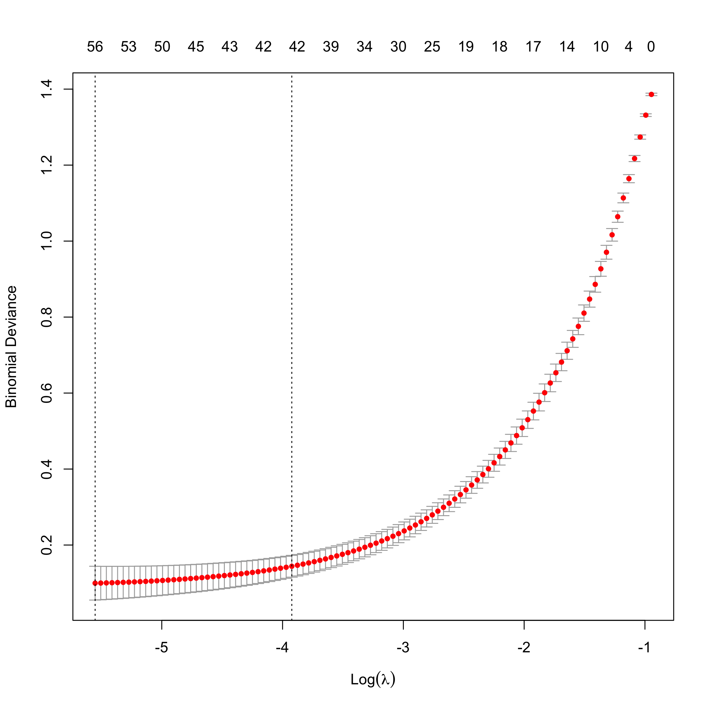
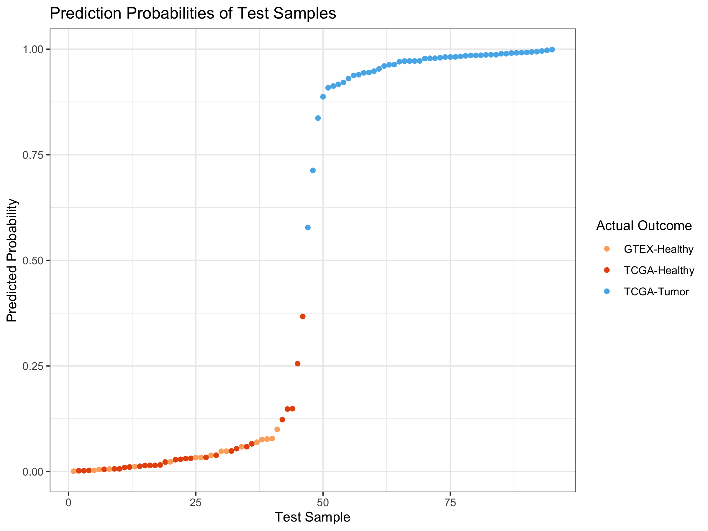
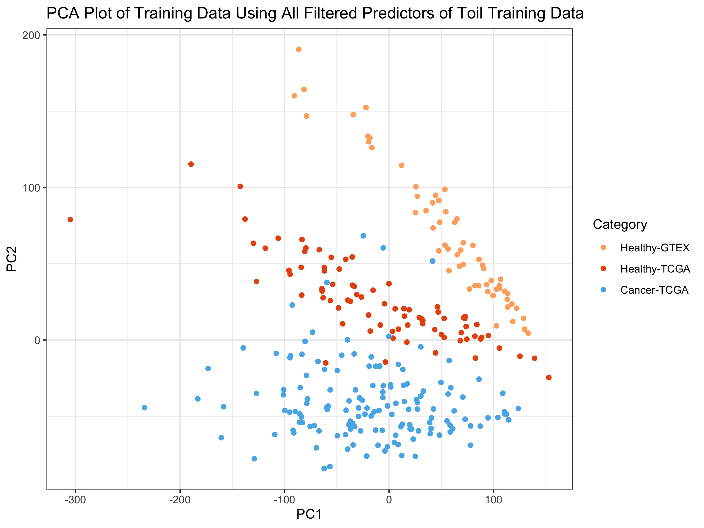
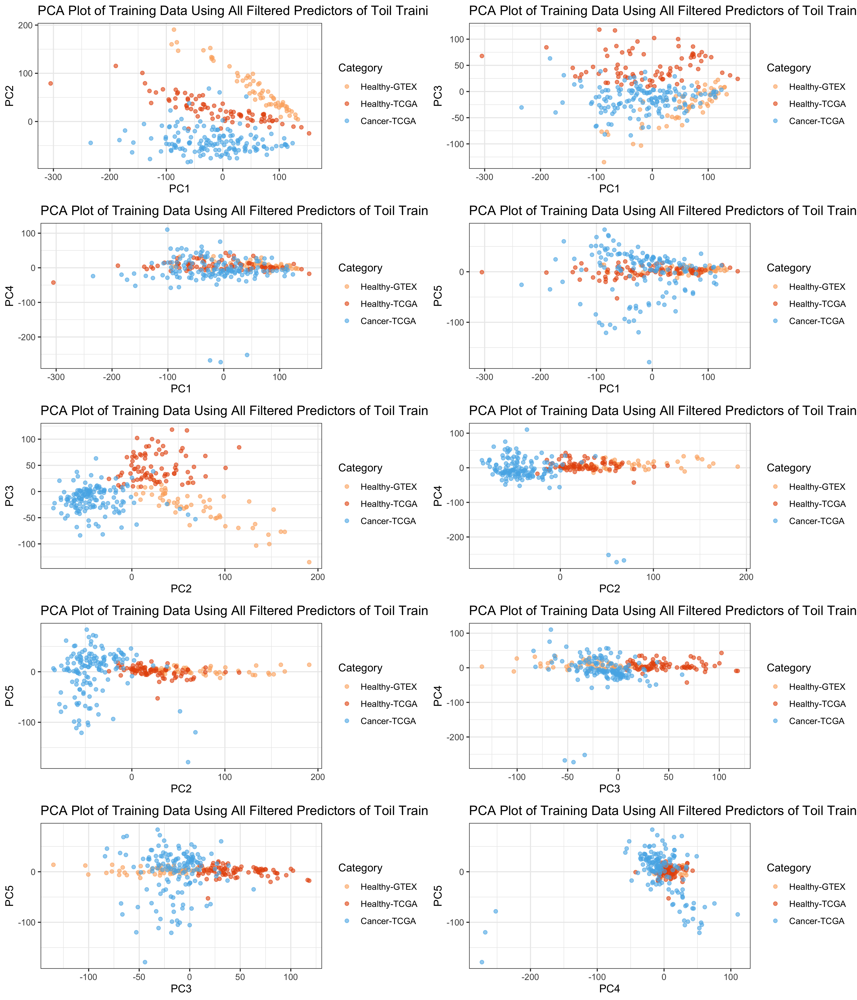
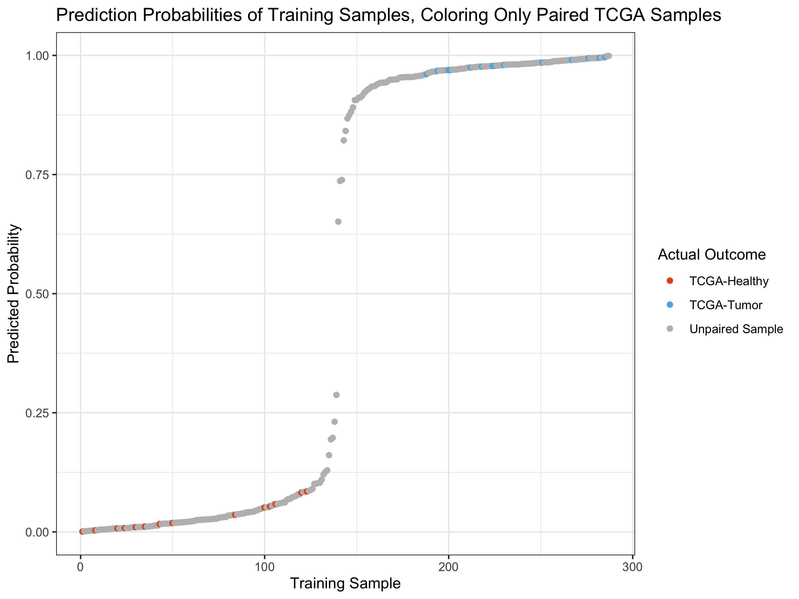
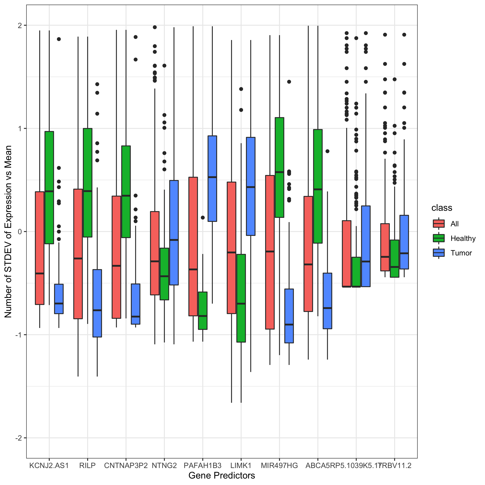

Breast Cancer Prediction
================
Michael Kesling
11/28/2019

## Making Cancer Predictions on Breast RNA-Seq Samples

This particular document takes the Toil-normalized TCGA and GTEx breast
cancer samples and runs the logistic regression algorithm with lasso
regularizer on them. Importantly, the only sample-to-sample
normalization performed in quantile-quantile normalization relative to a
single reference sample. No batch normalization is performed at this
point, as it’s the simplest scenario for test samples processed in the
clinic, as they will appear one at a time, typically.

The data were downloaded from the UCSC server at:
<https://xenabrowser.net/datapages/?cohort=TCGA%20TARGET%20GTEx&removeHub=https%3A%2F%2Fxena.treehouse.gi.ucsc.edu%3A443>
There are 2 relevant *gene expression RNAseq* datasets there. *RSEM
expected\_count (n=19,109)* which is used in this document, and *RSEM
expected\_count (DESeq2 standardized) (n=19,039)* which was used in the
*Toil\_Norm.Rmd* file.

The *markdown* and *html* versions of this document have some of the
code masked for better readability. To view the full code, see the [.Rmd
version](Toil_Analysis_ObjOrient.Rmd).

#### Setting Global Parameters

For this code to run, one must set the path, on one’s machine to the
*RSEM\_COUNTS\_FILE*, which contains the RNASeq data, and the
*TOILGENEANNOT* file, which maps the Ensembl identifiers to the gene
names.

``` r
knitr::opts_chunk$set(echo = TRUE)
# rmarkdown::render("./Toil_Analysis_ObjOrient.Rmd")
#######################
# SET GLOBAL PARAMETERS
#######################
RSEM_COUNTS_FILE <- "/Volumes/MK_Ext/Tresorit_iOS/projects/RNA-Seq/MachineLearningRNASeq/toilSubsetRSEM382.txt"
TOILGENEANNOT <- "/Volumes/MK_Ext/RNA-Seq_2019/TOIL_Data/gencode.v23.annotation.gene.probemap"
BIOMART_GENE_ATTR_FILE <- "/Volumes/MK_Ext/Tresorit_iOS/projects/RNA-Seq/MachineLearningRNASeq/geneAttr.csv"
TCGA_ATTR_FILE <- "/Volumes/MK_Ext/Tresorit_iOS/projects/RNA-Seq/data/TCGA_Attributes_full.txt"
WANG_MATRIX <- "/Volumes/MK_Ext/Tresorit_iOS/projects/RNA-Seq/data/wangBreastFPKM398_Attrib.txt"
FULL_TOIL_DATA <- "/Users/mjk/RNA-Seq_2019/TOIL_Data/TcgaTargetGtex_gene_expected_count"
SEED <- 233992812
SEED2 <- 1011
```

#### Hidden Functions

There are 3 large functions that don’t appear in the .md and .html
versions of this document to improve readability: one pre-processes the
Toil\_RSEM data, one performs TMM sample-to-sample scaling, just like
the edgeR method, and the last centers and scales each gene relative to
its mean and standard
deviation.

### Define main data structure and create methods for it

``` r
## The DAT object will contain all the various data matrices, sample names,
## and lists as the original data matrix is pre-processed before the data
## analysis ensues.

createDAT <- function(M){                # M is a data.matrix
   # it's assumed that samples are rows and genes are columns already
   z <- list(M_orig = M,                     # assumed log2 scale
             M_nat = matrix(),          # M_orig on natural scale
             M_filt = matrix(),         # after gene filtering
             M_scaled = matrix(),       # as fraction of all counts
             M_norm = matrix(),         # after gene normalization
             ZEROGENES = list(),
             outcome = list(),
             RefSampleName = character(),
             RefSample = matrix(),
             RefSampleUnscaled = matrix(),
             M_filtScaled = matrix(),   # after TMM scaling
             seed = numeric())
   #names(z[[2]]) <- "Nat"
   class(z) <- "DAT"
   return(z)
}

##########
# pick the most representative sample, calling it RefSample
##########
pickRefSample <- function(x) UseMethod("pickRefSample", x)
pickRefSample.DAT <- function(x, logged=FALSE){  # X is matrix with samples as rows
                   # representative reference sample selected via edgeR specs
                   # this script assumes data are on natural scale.
   # Xnat <- if(logged==TRUE) ((2^X)-1) else X  # put in natural scale
   N <- apply(x$M_filt, 1, sum)
   scaledX <- apply(x$M_filt, 2, function(x) x / N)
   thirdQuartiles <- apply(scaledX, 1, function(x) quantile(x)[4])
   med <- median(thirdQuartiles)
   refSampleName <- names(sort(abs(thirdQuartiles - med))[1])
   return(list(refSampleName, scaledX))
}

##########
# transform log2 data to natural scale
natural <- function(x) UseMethod("natural", x)
natural.DAT <- function(x){
   x$M_nat <- (2^x$M_orig) - 1
}

############
# filter Genes
filterGenes <- function(x) UseMethod("filterGenes", x)
filterGenes.DAT <- function(x, cutoff=0.2){ # filters calculated in log2 scale
                                       # but applied to data in natural scale
   ZEROEXPGENES <- which(apply(x[[1]], 2, function(x) quantile(x)[4]) < cutoff)
   filteredGenes <- x[[2]][, -ZEROEXPGENES]  
   return(list(ZEROEXPGENES, filteredGenes))
}

###########
# Add Zero Genes (to test set from training Zero list)
addZeroGenes <- function(x, ZERO){    # used when training-ZERO applied to 
   x[[6]] <- ZERO                     # test set
} 
```

## MAIN

The RSEM-Counts file originated as the full set of GTEX and TCGA breast
samples, both healthy and tumors, which numbered over 1200. I wanted an
equal number of tumor and healthy samples in my training and test set,
as it gave me the best chance at seeing how well my predictor performed.
Further, some samples had been found by the Sloan-Kettering group to be
of low quality, and these were filtered out. These steps were performed
by another script (Toil\_RSEM.Rmd). Our starting dataframe here, is
therefore called *toilSubset*, and has 387 samples.

``` r
# just read already-subsetted dataframe
toilSubset <- read.table(RSEM_COUNTS_FILE, sep="\t", header=TRUE)
rownames(toilSubset) <- toilSubset$sample
```

### RSEM-Counts Dataframe Cleanup

I’m going to add the gene name to the Ensembl ID to make it easier to
figure out what genes we’re looking at. Samples were also sorted in the
dataframe so that healthy and tumors were separated, as subsequently
were TCGA and GTEX.

``` r
toilSubset <- preProcess(toilSubset, TOILGENEANNOT)
```

### Create Test and Training Sets

Up to this point, all we’ve done is grabbed the Toil RSEM output data
and re-formatted it. It’s still in log2-format.

Next:  
1\. Randomly select samples to be in the training and test sets in a way
that keeps the ratio of healthy/tumors at about 50/50  
2\. Filter out genes with very low or zero expression across the data
set.  
3\. perform edgeR normalization with a reference sample to control for
depth-of-sequencing effects. Use same reference for training and
(future) test set  
4\. Center and scale each gene about its mean and std deviation,
respectively.  
5\. Perform ML  
6\. Test the model on the test
set.

``` r
toilSubsetWide <- t(toilSubset)                               # transpose matrix

outcome <- c(rep(0, 185), rep(1, 197))                  # 0 = healthy, 1 = tumor

# bind outcome variable on data frame for even, random partitioning
toilSubsetWide <- data.frame(cbind(toilSubsetWide, outcome))
set.seed(SEED)
idxTrain <- caTools::sample.split(toilSubsetWide$outcome, SplitRatio = 0.75)
# QA
sum(idxTrain)/length(idxTrain)             # 75% observations in training set OK
```

    ## [1] 0.7513089

We see that 75% of the samples ended up in the training set, as
expected.

``` r
# create training and test predictor sets and outcome vectors:
toilTrain <- subset(toilSubsetWide, idxTrain==TRUE)
outcomeTrain <- subset(toilSubsetWide$outcome, idxTrain==TRUE)  # Is this used?

toilTest <- subset(toilSubsetWide, idxTrain==FALSE)
outcomeTest <- subset(toilSubsetWide$outcome, idxTrain==FALSE)

# remove outcome variable from predictor matrices:
toilTrain <- toilTrain %>% dplyr::select(-outcome)
toilTest <- toilTest %>% dplyr::select(-outcome)

# convert back to matrices:
toilTrain <- as.matrix(toilTrain)
toilTest <- as.matrix(toilTest)

# reclaim memory
rm(toilSubset); rm(toilSubsetWide)
```

Now create object starting with toilTrain data matrix

``` r
train <- createDAT(toilTrain)
train$M_nat <- natural(train)
train$outcome <- outcomeTrain
```

### 1\. Removing genes whose expression is very close to zero.

We know that there are about 9103 genes that are never expressed (data
not shown), but there are over 25000 genes whose 75th quantile-level
expression is under 2^(0.2) - 1 = 0.14 counts. We really don’t want to
deal with those genes in selecting a reference sample,
etc.

``` r
hist(apply(toilTrain, 2, function(x) quantile(x)[4]), breaks=100, main="Histogram of each gene's 75th quantile of expression.", xlab="log2(Est Counts)")
```

<!-- -->
Another attempt at filtering genes whose log2(Est Counts) was less than
5 gave very unstable results at the sample-to-sample scaling factor step
that corrects for unequal depth-of-sequencing between samples (not shown
here). The exact reason for this hasn’t been pursued at this point. One
possibility is that samples whose depth-of-sequencing is low may have
most of their genes absent for the sample-to-sample adjustment step.

``` r
tmp <- filterGenes(train)
train$ZEROGENES <- tmp[[1]]; train$M_filt <- tmp[[2]]
```

### 2\. Sample-to-Sample Scaling

I’m using the TMM algorithm to perform sample-to-sample scaling, just as
what is done in edgeR. First, one picks a reference sample (whose
depth-of-sequencing is close to the median), then one scales all other
samples relative to it, using weighted Trimmed Mean (TMM).

``` r
tmp <- pickRefSample(train)
train$M_scaled <- tmp[[2]]; train$RefSampleName <- tmp[[1]]
train$M_filtScaled <- weightedTrimmedMean(train)
```

### 3\. Gene-level Normalization

When performing lasso regularization, it’s important that the each gene
is on the same scale as all other genes. Otherwise, highly expressed
genes will influence the algorithm more than other genes. And with
differential expression, we’re not interested in the absolute expression
level in any case. So here, we subtract each gene’s mean and divide by
the gene’s standard deviation so that each gene is standard-normalized.

``` r
train$M_norm <- normalizeGenes(train$M_filtScaled, TRUE, FALSE)
```

#### train$M\_norm is what we’ll perform our machine learning on.

### Logistic Regression with Lasso Regularizer on Toil Data

I’d like to compare the performance on this breast cancer dataset in the
absence of batch normalization (ComBat). This helps rule out any bias
the batch normalization may have had on improving the previous
prediction results, which were much better than I’d expected.

INSERT EQUATION HERE

``` r
set.seed(SEED2)
fitToil.lasso <- glmnet(train$M_norm, train$outcome, family="binomial",
                           alpha = 1)
defaultPalette <- palette()
plot(fitToil.lasso, xvar="lambda", label=TRUE)
```

<!-- -->
Here, we see which genes have the strongest effect on the logistic
regression model as the value of lambda increases from left to right. It
appears that perhaps with a few dozen genes, we might have a
well-performing
model.

### Cross-Validating the Model to Pick the Smallest, Well-Performing Model

I’m going to look at cross-validating the model in order to pick the
simplest one that performs
well.

``` r
set.seed(SEED2)                                # need same seed as previous step
cv.Toil.lasso <- cv.glmnet(train$M_norm, train$outcome
                           , family="binomial", alpha=1) 
plot(cv.Toil.lasso)
```

<!-- -->
We can see that 42 predictors gives us a model whose deviance is within
1-standard deviation from the minimum.

### Store the Model in a Custom Structure

``` r
coefsToil <- coef(cv.Toil.lasso, s=cv.Toil.lasso$lambda.1se)

##########
# Store model in a structure:
storeMODEL <- function(coefsToil, train=train){
   idx <- which(coefsToil[,1] != 0)
   predictorFullNames <- rownames(coefsToil)[idx]
   colIDs <- which(colnames(train$M_norm) %in% 
                   predictorFullNames) 
   tmpDF <- train$M_norm[,colIDs]
   predGeneNames <- gsub("\\.ENSG.*","", predictorFullNames)
   colnames(tmpDF) <- predGeneNames[2:length(predGeneNames)]

   z <- list(
      fullModel = coefsToil,
      predFullNames = predictorFullNames,
      predCoefs = coefsToil[idx],
      predGeneNames = predGeneNames, 
      predEntrezID = gsub(".*.(ENSG.*)\\..*$","\\1", predictorFullNames),
      modelDF = tmpDF                                 # lacks (Intercept)
   )
   
   class(z) <- "MODEL"
   return(z)
}

LogRegModel <- storeMODEL(coefsToil, train)
```

#### Creating Correlations with Outcome Vector for GSEA Analysis

``` r
if(FALSE){
  # calculate correlation coefficient pairwise between the
  # outcome variable and each of the 42 predictors, then sort
  predictorsCorr <- sort(apply(LogRegModel$modelDF, 2, cor,
                               y=train$outcome,
                               method="pearson"))
  corrDF <- cbind(rep(1, length(predictorsCorr)), predictorsCorr)
  # write vector to text file:
  write.table(corrDF, "predictors42corr.txt", sep="\t") # not used
  
  write.table(train$outcome, "outcome.cls.txt") # had to modify format
  
  write.table(t(LogRegModel$modelDF), "predictorExpr.txt",
              sep="\t")
  
  #### Going to output the entire training dataframe, transposed.
  #### the outcome variable is the same as above.
  write.table(t(train$M_norm), "training287Expr.txt", sep="\t")
  
  ensembl_geneID <- gsub(".*(ENSG.*.$)","\\1",rownames(t(train$M_norm))) %>%
  {gsub("\\..*$", "", .)}
  genes <- gsub("(.*)\\.ENSG.*","\\1",rownames(t(train$M_norm))) %>%
    {gsub("\\.", "-", .)}
  
  
  Ensmbl_HGNC_SYM_DESC <- read.csv(BIOMART_GENE_ATTR_FILE, header=TRUE, stringsAsFactors = F)
  
  idx_match <- which(ensembl_geneID %in% Ensmbl_HGNC_SYM_DESC$ensembl_gene_id)
  
  train_inverted <- t(train$M_norm)
  train_inverted <- train_inverted[idx_match,]
  rownames(train_inverted) <- ensembl_geneID[idx_match]
  # sum(as.numeric(table(rownames(train_inverted))) > 1)
  
  write.table(train_inverted, "training287Expr.txt", sep="\t")
  
  predGeneAnnot <- Ensmbl_HGNC_SYM_DESC %>% dplyr::filter(ensembl_gene_id %in% ensembl_geneID)
  predGeneAnnot$description <- gsub(" \\[.*$","",predGeneAnnot$description)
  # join with ensembl-coeff df-abs coeff
  rm(Ensmbl_HGNC_SYM_DESC)
  #joinedAnnot <- inner_join(predGeneAnnot, ensembl_coefs, by=c("ensembl_gene_id" = "ensembl_geneID"))
  # arrange by order to desc abs coeff and print select columns:
  
  chip_DF <- data.frame(predGeneAnnot %>% dplyr::select("ensembl_gene_id", 
                                                       "hgnc_symbol", "description"))
  colnames(chip_DF) <- c("Probe Set ID", "Gene Symbol", "Gene Title")
  write.table(chip_DF, "brca.chip", sep="\t")
}

predictorsCorrTotal <- sort(apply(train$M_norm, 2, cor,
                               y=train$outcome,
                               method="pearson"))
#predictorsCorrTotal
digitalPredCCoutcome <- ifelse(names(predictorsCorrTotal) %in% LogRegModel$predFullNames, 1, 0)
bottomDigPredCCoutcome <- head(digitalPredCCoutcome, 250)
topDigPredCCoutcome <- tail(digitalPredCCoutcome, 250)
topCC <- data.frame(cbind(1:250, topDigPredCCoutcome))
bottomCC <- data.frame(cbind(1:250, bottomDigPredCCoutcome))

colorsOutcome <- c("#E6550D",  "#56B4E9")

ggplot(topCC) +
  geom_point(aes(x=V1, y=topDigPredCCoutcome)) +
  ggtitle("Distribution of Predictors Among Top 250 Genes Correlated with Outcome Variable") +
  xlab("Genes with Top Pearson's Corr Coeff with Outcome Var") + theme_bw() + ylab("A Predictor in the Model?") 
```

<!-- -->

``` r
ggplot(bottomCC) +
  geom_point(aes(x=V1, y=bottomDigPredCCoutcome)) +
  ggtitle("Distribution of Predictors Among Bottom 250 Genes Correlated with Outcome Var") +
  xlab("Genes with Bottom Pearson's Corr Coeff with Outcome Var") + theme_bw() + ylab("A Predictor in the Model?") 
```

<!-- -->
\#\# Working with Test
Data

### Filter and Scale Test Data.

#### Relying on Training Data for Zero-Filtering and Scaling of Test Data

In order to see how well our model actually performs, we need to test it
on test data that it hasn’t seen before. First, we need to process the
test data just as we did the training data, but completely separately,
as this is the real-world case.

In data not shown here, I have found that sample-to-sample scaling
performs well only when either  
(i) it’s done in the context of a large number of samples, which is a
challenge for the real-world case where a single sample comes out of the
clinic.  
(ii) it’s done relative to a single *reference sample* that was
identified in the training set.

Here, I’m using case (ii) by normalizing each test sample individually
against this reference sample. Towards the bottom of the document, I
perform case (i) below in order to rule out any lingering bias derived
from the fact that sample scaling is performed relative to a single
training sample.

Furthermore, the process of filtering out genes with very-near-zero
expression levels across all samples cannot be easily defined by a
single clinical sample. Likewise, here, I’ll use the “(near)
zero-expressed genes” from the training set in order to perform
gene-level filtering in the test set.

We start by entering the test data into a new instance of our **DAT**
object.

``` r
test <- createDAT(toilTest)               # add matrix to DAT object
test$M_nat <- natural(test)                # transform from log2 to natural scale
test$outcome <- outcomeTest                  # add outcome variable
```

#### 1\. Filter out genes from test set using those defined in the training set

``` r
                                               # transfer ZEROEXP to test object
test$M_filt <- test$M_nat[, -train$ZEROGENES]  # subtract off genes and return 
                                               # remainder to test object
```

#### 2\. Sample-to-Sample Scaling of Test Set

We’re going to use the Reference Sample data from the training set
here

``` r
tmp <- pickRefSample(test)                  # only doing this to get scaled data
test$M_scaled <- tmp[[2]]; 
test$RefSampleName <- train$RefSampleName      # RefSampleName from training set
test$M_filtScaled <- weightedTrimmedMean(test, train, 1)     # filtered & scaled
```

#### 3\. Gene-level Normalization on Test Set

``` r
test$M_norm <- normalizeGenes(test$M_filtScaled, TRUE, FALSE)
```

#### 4\. Remove Non-Predictor Genes from Filtered Test Data

We’re just keeping the 42 predictors from toilTestFiltScaled

``` r
colIDs <- which(colnames(test$M_norm) %in% 
                   LogRegModel$predFullNames[2:length(LogRegModel$predFullNames)])
toilTestFiltScal42 <- test$M_norm[,colIDs]                    # SEPARATE FROM OBJECT
toilTrainFiltScal42 <- train$M_norm[,colIDs]
toilTrainFiltScal42 <- cbind(rep(1,nrow(toilTrainFiltScal42)), toilTrainFiltScal42)
```

#### 5\. Test Set Sensitivity and Specificity

First we add an intercept column to test predictor variables, then we
perform matrix multiplication with the predictor coefficients and then
look at the prediction performance in the confusion
matrix.

``` r
toilTestFiltScal42 <- cbind(rep(1,nrow(toilTestFiltScal42)), toilTestFiltScal42)

testPredictions_toil <- ifelse(toilTestFiltScal42 %*% LogRegModel$predCoefs > 0, 1, 0)
table(test$outcome, testPredictions_toil)
```

    ##    testPredictions_toil
    ##      0  1
    ##   0 46  0
    ##   1  0 49

I’m at 100% sensitivity and 100% specificity.

#### Create Visual for Test Predictions

``` r
generateOutcomeIndicators <- function(names){
  # given the sample names from a list or df row/colname
  # will generate a numeric vector for coloring points
  # according to (1) GTEX sample, (2) TCGA normal, (3) TCGA tumor
  gtex <- ifelse(grepl("^GTEX", names),1,0)
  tcgaHealthy <- ifelse(grepl("^TCGA.*.11$", names),2,0)
  tcgaTumor <- ifelse(grepl("^TCGA.*.01$", names),3,0)
  return(gtex + tcgaHealthy + tcgaTumor)
}


testPreds95 <- toilTestFiltScal42 %*% LogRegModel$predCoefs
testPreds95Probs <- 1/(1 + exp(-1 * testPreds95))

outcomeIndicators <- 
  generateOutcomeIndicators(rownames(testPreds95Probs))

testPreds95_DF <- data.frame(cbind(testPreds95Probs,  # change
                                   outcomeIndicators))
colnames(testPreds95_DF) <- c("probability","outcome")
testPreds95_DF <- testPreds95_DF %>%       # sort on probability
                    arrange(probability)
testPreds95_DF <- cbind(index=1:95, testPreds95_DF) # add idx

#colorsOutcome <- c("#E6550D",  "#56B4E9")
colors3pal <- c("#FDAE6B", "#E6550D",  "#56B4E9")

ggplot(testPreds95_DF) +
  geom_point(aes(x=index, y=probability, color=as.factor(outcome))) +
  ggtitle("Prediction Probabilities of Test Samples") +
  xlab("Test Sample") + theme_bw() + ylab("Predicted Probability") +
  scale_color_manual(name="Actual Outcome",
                      breaks = c("1", "2", "3"),
                      values = c(colors3pal[1], colors3pal[2],
                                 colors3pal[3]), 
                      labels = c("GTEX-Healthy", "TCGA-Healthy",
                                 "TCGA-Tumor"))
```

<!-- -->
\#\#\#\# Create Visual for Train Predictions

``` r
trainPreds <- toilTrainFiltScal42 %*% LogRegModel$predCoefs
trainPredsProbs <- 1/(1 + exp(-1 * trainPreds))
outcomeIndicators <- 
  generateOutcomeIndicators(rownames(trainPredsProbs))

trainPreds_DF <- data.frame(cbind(trainPredsProbs,
                                   outcomeIndicators))
colnames(trainPreds_DF) <- c("probability","outcome")
trainPreds_DF <- trainPreds_DF %>%       # sort on probability
                    arrange(probability)
trainPreds_DF <- cbind(index=1:287, trainPreds_DF) # add idx

#colorsOutcome <- c("#E6550D",  "#56B4E9")
colors3pal <- c("#FDAE6B", "#E6550D",  "#56B4E9")

ggplot(trainPreds_DF) +
  geom_point(aes(x=index, y=probability, color=as.factor(outcome))) +
  ggtitle("Prediction Probabilities of Training Samples") +
  xlab("Training Sample") + theme_bw() + ylab("Predicted Probability") +
  scale_color_manual(name="Actual Outcome",
                      breaks = c("1", "2", "3"),
                      values = c(colors3pal[1], colors3pal[2],
                                 colors3pal[3]), 
                      labels = c("GTEX-Healthy", "TCGA-Healthy",
                                 "TCGA-Tumor"))
```

<!-- -->

## Why does the model perform so well?

I expected that the logistic regression with a lasso regularizer would
perform okay, but not nearly as well as it did. The question is why? Is
it simply that tumors have a sufficiently different genetic programming
that they can easily be partitioned from healthy samples?

### Principal Components

To explore this idea, I’m going to look at the first 2 principal
components of the overall variability of the data across all genes that
weren’t filtered out for having near-zero expression, and plot those
out, coloring each sample according to whether or not it’s healthy or a
tumor.

``` r
plotPCs <- function(dfComponents, compIdx){
   PC_plot <- data.frame(x=dfComponents[,compIdx[1]], y = dfComponents[,compIdx[2]], col=prognosis)
   colors3pal <- c("#FDAE6B", "#E6550D",  "#56B4E9")
   obj <<- ggplot(PC_plot) + 
      geom_point(aes(x=x, y=y, color=as.factor(col)), alpha=0.6) + 
      ggtitle("PCA Plot of Training Data Using All Filtered Predictors of Toil Training Data") +
      xlab(paste0("PC",compIdx[1])) + ylab(paste0("PC", compIdx[2])) +
      theme_bw() + 
      scale_color_manual(name="Category",
                         breaks = c("1", "2", "3"),
                         values = c(colors3pal[1], colors3pal[2], colors3pal[3]),
                         labels = c("Healthy-GTEX", "Healthy-TCGA", "Cancer-TCGA"));
   return(obj)
}


prognosis <- c(rep(1, 59), rep(2,80), rep(3, 148))       # 1/2 = healthy, 3 = cancer
PCs <- prcomp(train$M_norm)                               # (data already scaled)
nComp <- 2
dfComponents <- predict(PCs, newdata=train$M_norm)[,1:nComp]

PC_plot <- data.frame(x=dfComponents[,1], y = dfComponents[,2], col=prognosis)
colors3pal <- c("#FDAE6B", "#E6550D",  "#56B4E9")

ggplot(PC_plot) + 
   geom_point(aes(x=x, y=y, color=as.factor(col))) + 
   ggtitle("PCA Plot of Training Data Using All Filtered Predictors of Toil Training Data") +
   xlab("PC1") + ylab("PC2") + theme_bw() +
   scale_color_manual(name="Category",
                      breaks = c("1", "2", "3"),
                      values = c(colors3pal[1], colors3pal[2], colors3pal[3]),
                      labels = c("Healthy-GTEX", "Healthy-TCGA", "Cancer-TCGA"))
```

<!-- -->

We can see that even only employing the first 2 Principal Components,
that:  
(1) there is very good separation between the tumors in the training set
(blue) and the healthy samples.

2)  We also see that the 2nd PC separates the outcome variable much
    better than the 1st PC.

3)  We also notice that the healthy samples from TCGA (red) and the
    healthy samples from GTEX (orange) are also separated out. This has
    to do with how there’s a batch effect between TCGA and GTEX and
    which was addressed by the Sloan Kettering group in the [Wang, et.
    al. Combat paper](https://www.nature.com/articles/sdata201861).
    Earlier work of mine on the Wang batch-corrected version of this
    dataset also performed well with the logistic regression with lasso
    model (not shown here). However, I have focused on the pre-batch
    corrected version here, because batch correcting would probably be
    difficult to implement for clinical samples.

In light of the PC plot, it perhaps should not be surprising that an
off-the-shelf algorithm would perform so well, as the variability in
transcription is quite significant between healthy samples and tumors.
It might be that after tissue type, healthy/tumor may impact variability
in transcription more than any other factor.

### Top 5 Principal Components

I wanted to see if any other of the top PCs were good at separating
healthy samples from tumors.

``` r
plotPCs_1d <- function(dfComponents){
   PC_plot <- data.frame(x=dfComponents$Var2, y = dfComponents$value, col=prognosis)
   colors3pal <- c("#FDAE6B", "#E6550D",  "#56B4E9")
   obj <- ggplot(PC_plot) + 
      geom_jitter(aes(x=x, y=y, color=as.factor(col)), alpha=0.7) + 
      ggtitle("Separation of Healthy / Tumors by First Few PC's") +
      xlab("PC Number") + ylab("PC Projection") +
      theme_bw() +
      scale_color_manual(name="Category",
                         breaks = c("1", "2", "3"),
                         values = c(colors3pal[1], colors3pal[2], colors3pal[3]),
                         labels = c("Healthy-GTEX", "Healthy-TCGA", "Cancer-TCGA"));
   return(obj)
}


nComp <- 5
dfComponents <- predict(PCs, newdata=train$M_norm)[,1:nComp]

dfCompMelt <- melt(dfComponents)
plotPCs_1d(dfCompMelt)
```

<!-- -->
We see that the 2nd and 3rd PCs give pretty good outcome variable
separation. Let’s look at pairwise PC plots.

``` r
ls <- list()
pairs <- combn(5,2)
for(idx in 1:dim(pairs)[2]){
   pair <- pairs[,idx]
   ls[[idx]] <- plotPCs(dfComponents, pair)                  # Add a MAIN TITLE and remove other titles
}
grid.arrange(ls[[1]], ls[[2]], ls[[3]], ls[[4]], ls[[5]], ls[[6]],
             ls[[7]], ls[[8]], ls[[9]], ls[[10]], ncol=2)
```

<!-- -->
It appears that PC2 and PC2 together perhaps give the best separation.

### Duplicates in Principal Components

This is the exact sample Principal Components plot as above, except that
I’m only going to color the TCGA points that are from the same
patient–one healthy and one tumor.

``` r
modifyPrognosisByPairs <- function(prognosis, pairedSamples){
  # Take the prognosis, which is a vector of whether actual sample outcomes
  # are GTEX-healthy, TCGA-healthy, or TCGA-Tumor and changes the
  # color indicator to "4" if the samples are not part of a
  # paired set of TCGA samples
  names(prognosis) <- gsub("\\.11$","",names(prognosis)) %>%
                     {gsub("\\.01$", "", .)}
  prognosis <-
    replace(prognosis, !names(prognosis) %in% pairedSamples[,1],4)
  return(prognosis)
}


pairedSamples <- read.csv("confoundingElimi/idsDiff", header=F,
                          stringsAsFactors = F)


PCs <- prcomp(train$M_norm)                               # (data already scaled)
nComp <- 2
dfComponents <- predict(PCs, newdata=train$M_norm)[,1:nComp]


prognosis <- generateOutcomeIndicators(rownames(dfComponents)) #1/2=healthy, 3=tum
names(prognosis) <- rownames(dfComponents)
prognosis <-
  modifyPrognosisByPairs(prognosis = prognosis, 
                         pairedSamples = pairedSamples)


PC_plot <- data.frame(x=dfComponents[,1], y = dfComponents[,2], col=prognosis)
colors4pal <- c("#FDAE6B", "#E6550D",  "#56B4E9", "#bdbdbd")

ggplot(PC_plot) + 
   geom_point(aes(x=x, y=y, color=as.factor(col))) + 
   ggtitle("PCA Plot of Training Data Coloring Only Paired TCGA Samples") +
   xlab("PC1") + ylab("PC2") + theme_bw() +
   scale_color_manual(name="Category",
                      breaks = c("1", "2", "3", "4"),
                      values = c(colors4pal[1], colors4pal[2], 
                                 colors4pal[3], colors4pal[4]),
                      labels = c("", "Paired-Healthy-TCGA", 
                                 "Paired-Cancer-TCGA",
                                 "Unpaired Sample"))
```

<!-- -->
\#\#\#\# Create Visual for Train Predictions – Coloring by Paired TCGA
Samples from Same Patient

``` r
trainPreds <- toilTrainFiltScal42 %*% LogRegModel$predCoefs
trainPredsProbs <- 1/(1 + exp(-1 * trainPreds))
outcomeIndicators <- 
  generateOutcomeIndicators(rownames(trainPredsProbs))
names(outcomeIndicators) <- rownames(trainPredsProbs)

outcomeIndicators <- modifyPrognosisByPairs(prognosis = outcomeIndicators, 
                                            pairedSamples = pairedSamples)


trainPreds_DF <- data.frame(cbind(trainPredsProbs,
                                   outcomeIndicators))
colnames(trainPreds_DF) <- c("probability","outcome")
trainPreds_DF <- trainPreds_DF %>%       # sort on probability
                    arrange(probability)
trainPreds_DF <- cbind(index=1:287, trainPreds_DF) # add idx

colors4pal <- c("#FDAE6B", "#E6550D",  "#56B4E9", "#bdbdbd")

ggplot(trainPreds_DF) +
  geom_point(aes(x=index, y=probability, color=as.factor(outcome))) +
  ggtitle("Prediction Probabilities of Training Samples, Coloring Only Paired TCGA Samples") +
  xlab("Training Sample") + theme_bw() + ylab("Predicted Probability") +
  scale_color_manual(name="Actual Outcome",
                      breaks = c("1", "2", "3", "4"),
                      values = c(colors4pal[1], colors4pal[2],
                                 colors4pal[3], colors4pal[4]), 
                      labels = c("", "TCGA-Healthy",
                                 "TCGA-Tumor", "Unpaired Sample"))
```

<!-- -->

### What Genes are the Model Predictors?

I’m going to pull the definition and symbols for the 42 predictors in
the model from *biomaRt* to see what genes the predictors are. The
following table is sorted from the gene predictor that has the
coefficient with the greatest (absolute) magnitude to the predictor with
the least
magnitude.

``` r
# get predictor gene names and Ensembl IDs while removing Intercept term:
ensembl_geneID <- LogRegModel$predEntrezID[2:length(LogRegModel$predEntrezID)]
predictorGeneNames <- LogRegModel$predGeneNames[2:length(LogRegModel$predGeneNames)]
modelCoefs <- LogRegModel$predCoefs[2:length(LogRegModel$predCoefs)]
ensembl_coefs <- data.frame(ensembl_geneID, modelCoefs, abs(modelCoefs)) 

##############
# we'll grab biomaRt data for these genes.  
# The following block of code is ONLY
# RUN ONCE, and the results are stored in a file.
if(FALSE){                                         # rm this line the first time
listMarts()
ensembl=useMart("ensembl")
ensembl = useDataset("hsapiens_gene_ensembl",mart=ensembl)

geneID_Name_Description <- getBM(attributes=c("ensembl_gene_id", "hgnc_id", 
                                              "hgnc_symbol", "description"),
   values=geneNames,
   mart=ensembl)
write.csv(geneID_Name_Description, file=BIOMART_GENE_ATTR_FILE)
}
#############

Ensmbl_HGNC_SYM_DESC <- read.csv(BIOMART_GENE_ATTR_FILE, header=TRUE, stringsAsFactors = F)
predGeneAnnot <- Ensmbl_HGNC_SYM_DESC %>% dplyr::filter(ensembl_gene_id %in% ensembl_geneID) 
# join with ensembl-coeff df-abs coeff
rm(Ensmbl_HGNC_SYM_DESC)
joinedAnnot <- inner_join(predGeneAnnot, ensembl_coefs, by=c("ensembl_gene_id" = "ensembl_geneID"))
# arrange by order to desc abs coeff and print select columns:
joinedAnnot$description <- gsub(" \\[.*$","",joinedAnnot$description) # %>% substr(1,40)
modelAnnot <- as_tibble(joinedAnnot %>% arrange(desc(abs.modelCoefs.)) %>% dplyr::select("ensembl_gene_id", 
                                                          "hgnc_symbol", "modelCoefs",
                                                          "description"))
modelAnnot$hgnc_symbol[15] <- "RP5.103915.17"; modelAnnot$hgnc_symbol[41] <- "CTD.2231E14.8"
print(modelAnnot, n=42)
```

    ## # A tibble: 42 x 4
    ##    ensembl_gene_id hgnc_symbol  modelCoefs description                          
    ##    <chr>           <chr>             <dbl> <chr>                                
    ##  1 ENSG00000182492 BGN             0.462   biglycan                             
    ##  2 ENSG00000267532 MIR497HG       -0.452   mir-497-195 cluster host gene        
    ##  3 ENSG00000143742 SRP9            0.412   signal recognition particle 9        
    ##  4 ENSG00000266964 FXYD1          -0.404   FXYD domain containing ion transport…
    ##  5 ENSG00000137727 ARHGAP20       -0.397   Rho GTPase activating protein 20     
    ##  6 ENSG00000079462 PAFAH1B3        0.385   platelet activating factor acetylhyd…
    ##  7 ENSG00000119771 KLHL29         -0.249   kelch like family member 29          
    ##  8 ENSG00000165795 NDRG2          -0.190   NDRG family member 2                 
    ##  9 ENSG00000101955 SRPX           -0.185   sushi repeat containing protein X-li…
    ## 10 ENSG00000106638 TBL2            0.167   transducin beta like 2               
    ## 11 ENSG00000163431 LMOD1          -0.167   leiomodin 1                          
    ## 12 ENSG00000103495 MAZ             0.138   MYC associated zinc finger protein   
    ## 13 ENSG00000267365 KCNJ2-AS1      -0.135   KCNJ2 antisense RNA 1                
    ## 14 ENSG00000167705 RILP           -0.129   Rab interacting lysosomal protein    
    ## 15 ENSG00000272582 RP5.103915.…    0.119   novel transcript, antisense to C22or…
    ## 16 ENSG00000230587 LINC02580      -0.110   long intergenic non-protein coding R…
    ## 17 ENSG00000142910 TINAGL1        -0.104   tubulointerstitial nephritis antigen…
    ## 18 ENSG00000241657 TRBV11-2        0.103   T cell receptor beta variable 11-2   
    ## 19 ENSG00000276386 CNTNAP3P2      -0.102   CNTNAP3 pseudogene 2                 
    ## 20 ENSG00000033100 CHPF2           0.0961  chondroitin polymerizing factor 2    
    ## 21 ENSG00000189134 NKAPL          -0.0847  NFKB activating protein like         
    ## 22 ENSG00000136160 EDNRB          -0.0819  endothelin receptor type B           
    ## 23 ENSG00000168497 CAVIN2         -0.0775  caveolae associated protein 2        
    ## 24 ENSG00000167394 ZNF668          0.0762  zinc finger protein 668              
    ## 25 ENSG00000164885 CDK5            0.0667  cyclin dependent kinase 5            
    ## 26 ENSG00000164694 FNDC1           0.0641  fibronectin type III domain containi…
    ## 27 ENSG00000106683 LIMK1           0.0621  LIM domain kinase 1                  
    ## 28 ENSG00000104888 SLC17A7        -0.0540  solute carrier family 17 member 7    
    ## 29 ENSG00000136295 TTYH3           0.0497  tweety family member 3               
    ## 30 ENSG00000163884 KLF15          -0.0413  Kruppel like factor 15               
    ## 31 ENSG00000136014 USP44          -0.0379  ubiquitin specific peptidase 44      
    ## 32 ENSG00000163041 H3F3A           0.0373  H3 histone family member 3A          
    ## 33 ENSG00000139112 GABARAPL1      -0.0373  GABA type A receptor associated prot…
    ## 34 ENSG00000154265 ABCA5          -0.0304  ATP binding cassette subfamily A mem…
    ## 35 ENSG00000004799 PDK4           -0.0283  pyruvate dehydrogenase kinase 4      
    ## 36 ENSG00000156284 CLDN8          -0.0235  claudin 8                            
    ## 37 ENSG00000154736 ADAMTS5        -0.0218  ADAM metallopeptidase with thrombosp…
    ## 38 ENSG00000117410 ATP6V0B         0.0179  ATPase H+ transporting V0 subunit b  
    ## 39 ENSG00000160179 ABCG1           0.0171  ATP binding cassette subfamily G mem…
    ## 40 ENSG00000196358 NTNG2           0.00859 netrin G2                            
    ## 41 ENSG00000269243 CTD.2231E14…    0.00620 novel transcript, antisense RAB8A    
    ## 42 ENSG00000160877 NACC1           0.00411 nucleus accumbens associated 1

Of the 42 predictors, 3 are anti-sense RNAs, 1 pseudogene: (CNTNAP3
pseudogene 2), 1 non-protein coding gene, 1 micro RNA, and the others
being protein-coding genes.

### Expression of the 42 Predictors Across Healthy Samples and Tumors

``` r
require(reshape2)
trainNorm42predictors <- train$M_norm[,colIDs]
#print(cbind(geneNames, colnames(trainNorm42predictors)))
# need to shorten names and print those gene names vertically
colnames(trainNorm42predictors) <- predictorGeneNames  # simplify predictor names   
colors3pal <- c("#FDAE6B", "#E6550D",  "#56B4E9")
predict42scaledMelt <- melt(trainNorm42predictors)
predict42scaledMelt <- cbind(predict42scaledMelt , colr=as.factor(rep(prognosis, 42)))
ggplot(predict42scaledMelt, aes(x=Var2, y=value)) + #, colour=colr)) +
   geom_jitter(aes(colour=colr), size=0.5, alpha=0.75) +
   theme_bw() +
   ylim(-2,5) + theme(axis.text.x=element_text(angle=90)) +
   xlab("Gene Predictors") + ylab("Number of STDEV of Expression vs Mean") +
   scale_color_manual(name="Category",
                         breaks = c("1", "2", "3"),
                         values = c(colors3pal[1], colors3pal[2], colors3pal[3]),
                         labels = c("Healthy-GTEX", "Healthy-TCGA", "Cancer-TCGA"))
```

    ## Warning: Removed 10879 rows containing missing values (geom_point).

<!-- -->
We can see that the majority of these gene predictors have either a
higher level of expression in tumors (positive coefficient) or a higher
level of expression in healthy tissues (negative coefficient). 2 genes
seem to disciminate poorly–at least on their own. I thought they might
all have coefficients very close to zero. However, they are mid-to-high
range (RP5.1039K5.17 = 0.140 and TRBV11-2 = 0.124). Beyond this basic
point, I haven’t pursued this.

### Using 2 genes to separate out healthy and tumor samples

I’m going to use MIR497HG and PAFAH1B3 to create a 2D plot of the
samples colored by their healthy / tumor status. I’m choosing these two
because they have large coefficients in the model and because they are
inversely correlated with one another.

``` r
df03 <- LogRegModel$modelDF[,c("PAFAH1B3", "MIR497HG")]    # BGN
df03 <- data.frame(cbind(df03, col=as.factor(prognosis)))
ggplot(df03) +
   geom_point(aes(x=PAFAH1B3,y=MIR497HG,colour=as.factor(col))) +
   theme_bw() + theme(plot.title = element_text(hjust=0.5)) +
    #ylim(-2,5) + #theme_bw() + # (axis.text.x=element_text(angle=90)) +
   scale_color_manual(name="Category",
                         breaks = c("1", "2", "3"),
                         values = c(colors3pal[1], colors3pal[2], colors3pal[3]),
                         labels = c("Healthy-GTEX", "Healthy-TCGA", "Cancer-TCGA")) +
  ggtitle("Training Sample Separation Using Only 2 Genes")
```

<!-- -->
\#\#\# Using the same 2 genes to separate out healthy and tumor samples
in Test Set We’ll repeat the above figure, but for Test data
only

``` r
# start by taking test set data across 42 predictors and removing Entrez part of name
# from column names
colnames(toilTestFiltScal42) <- gsub("\\.ENSG.*$","",colnames(toilTestFiltScal42))

paste0("PAFAH1B3.", LogRegModel$predEntrezID[which(LogRegModel$predGeneNames == "PAFAH1B3")])
```

    ## [1] "PAFAH1B3.ENSG00000079462"

``` r
df04 <- toilTestFiltScal42[,c("PAFAH1B3", "MIR497HG")]
#df03 <- LogRegModel$modelDF[,c("PAFAH1B3", "MIR497HG")]    # BGN
# need prognosis for test set
prognosisTest <- c(rep(1, 17), rep(2,29), rep(3, 49))
df04 <- data.frame(cbind(df04, col=as.factor(prognosisTest)))
ggplot(df04) +
   geom_point(aes(x=PAFAH1B3,y=MIR497HG,colour=as.factor(col))) +
   theme_bw() + theme(plot.title = element_text(hjust=0.5)) +
    #ylim(-2,5) + #theme_bw() + # (axis.text.x=element_text(angle=90)) +
   scale_color_manual(name="Category",
                         breaks = c("1", "2", "3"),
                         values = c(colors3pal[1], colors3pal[2], colors3pal[3]),
                         labels = c("Healthy-GTEX", "Healthy-TCGA", "Cancer-TCGA")) +
  ggtitle("Test Sample Separation Using Only 2 Genes")
```

<!-- -->

We can see that 2 genes with coefficients that are large, but of
opposite sign, nearly create a separating hyperplane between the tumors
and the healthy samples. This recapitulates the earlier idea of how the
gene expression programming of tumors have greatly diverged from that of
healthy samples that we saw with the Principal Components plots.

### Heatmap of Predictors Across Samples

``` r
# create color range for expression values:
hmcol <- colorRampPalette(c("#40004B", "#40004B", "#40004B", "#762A83", "#9970AB", 
  "#F7F7F7", "#5AAE61", "#1B7837", "#00441B", "#00441B", "#00441B"))

# coloring genes by value of model coefficient:
geneCoefs <- data.frame(LogRegModel$predCoefs)
rownames(geneCoefs) <- LogRegModel$predGeneNames
colnames(geneCoefs) <- "coefs"
geneCoefs <- geneCoefs[rownames(geneCoefs) != "(Intercept)",] # vector now

# create color range for model coefficients:
range01 <- function(x)(x-min(x))/diff(range(x))
geneCols <- palette(brewer.pal(11,"Spectral"))[cut(range01(geneCoefs), 
                                                   breaks=11, labels=FALSE)]

# coloring samples by prognosis:
samples <- factor(prognosis)
sampleCols <- palette(colors3pal)[samples]

# plot heatmap
heatmap.2(as.matrix(LogRegModel$modelDF), 
          col=hmcol, trace="none", 
          cexRow = 0.15, 
          cexCol = 0.5,  
          ColSideColors = geneCols, 
          RowSideColors = sampleCols, 
          main = "Heatmap of Gene Predictors vs Samples")
```

<!-- -->

``` r
undebug(heatmap.2)
```

    ## Warning in undebug(heatmap.2): argument is not being debugged

The heatmap just provides another way at looking at the closeness of
relationship between the different gene predictors and likewise between
the different samples. The color-coding of the columns and rows has a
bug in it at the moment.

## Testing the Model Sensitivity on More RNASeq Samples

When the initial dataset of 382 samples were obtained from GTEX and
TCGA, there were far more tumors available than healthy samples. All
healthy samples were part of these 382 samples which were then split
into 287 training samples and 95 test samples.

However, there remain many more RNA-Seq samples from TCGA that have not
yet been used in this study. I’d like to see how the model performs on
them, and since there are so many, I thought that I’d first break them
into their stage of cancer (I - IV) and test them in those groups. Since
all of these samples are tumors, we’ll further be measuring the
sensitivity of the model. But since there are no healthy samples, we’ll
be unable to measure the specificity.

Another point that I’ll bring up is that in creating the set of 382 from
an initial group of 398 samples, there was a filtering step where
samples that had a low RNA quality score were eliminated from the set.

In the dataset we’ll now look at, I’m not performing any filtering step.

The code is a bit extensive, partly because it hasn’t been cleaned up
with common functions. It’s not shown in the .html nor .md versions of
this file. It can be seen in the .Rmd
version.

## 1\. Process the 4 datasets (stageOne, stageTwo, stageThree, stageFour)

I’ll process these datasets the same way as I did above. I’m still using
the ZEROGENES that were defined by the training data for gene filtering.
And I’m still using the Reference Sample defined in the training set for
calculating the sample-to-sample scaling factors. \#\#\#\# A function
for processing dataframes and making predictions

``` r
filterScaleNormalizePredict <- function(df, REF_MEANS, REF_SDS,
                                        train, LogRegModel, useRef=0){
   # if useRef==0, then geneNormalization done within df
   # if useRef==1, then geneNormalization done with parameters from train 
   # (REF_MEANS & REF_SDS)
   
   # 1b. convert to natural scale:
   df$M_nat <- natural(df)
   
   # 2. subtract out ZEROEXPGENES, as defined in training set
   df$M_filt <- df$M_nat[,-train$ZEROGENES]

   # 2b. represent intensities as fraction of all signals in each sample
   N <- apply(df$M_filt, 1, sum)
   df$M_scaled <- apply(df$M_filt, 2, function(x) x / N)              
   
   df$RefSampleName <- train$RefSampleName             # transfer from train set
   
   # 3. Calc scaling factor, relative to REFSAMPLE (in train) and scale data
   df$M_filtScaled <- data.frame(weightedTrimmedMean(df, train, TRUE))         
   
   # 4. Remove Non-Predictor Genes from Filtered Test Data, REF_MEANS, REF_SDS
   coefsFullNames <- LogRegModel$predFullNames[2:length(LogRegModel$predFullNames)]
   dfFiltScal42 <- df$M_filtScaled %>% dplyr::select(coefsFullNames)  

   # 5. scale each gene by its stdev and offset by its mean.  Add intercept
   if(useRef == 1){
      REF_MEANS_Predictors <- REF_MEANS[coefsFullNames]
      REF_SDS_Predictors <- REF_SDS[coefsFullNames]
      df$M_norm <- t(apply(dfFiltScal42, 1, function(x){
         (x - REF_MEANS_Predictors)/REF_SDS_Predictors}))}
   if(useRef == 0){                       
      SMP_MEANS <- apply(df$M_filtScaled, 2, mean)
      SMP_SDS <- apply(df$M_filtScaled, 2, sd)
      SMP_MEANS_Predictors <- SMP_MEANS[coefsFullNames]
      SMP_SDS_Predictors <- SMP_SDS[coefsFullNames]
      df$M_norm <- t(apply(dfFiltScal42, 1, function(x){
         (x - SMP_MEANS_Predictors)/SMP_SDS_Predictors}))}
   
   dfFiltScaledSD <- cbind(rep(1,nrow(df$M_norm)), df$M_norm)
   
   # 6. perform predictions
   testPredictions <- ifelse(dfFiltScaledSD %*% LogRegModel$predCoefs > 0, 1, 0)
   return(testPredictions)
}
```

## Other TCGA Sample Sensitivity

METHODOLOGY: Processing samples as above, with:  
1\. The filtering of genes defined by the training set

2.  The sample-to-sample scaling factors done relative to a Reference
    Sample defined in the training set

3.  The centering and scaling of each gene about its mean and standard
    deviation, respectively, within the dataset at hand.

#### Cancer Stage I Predictions

``` r
# stage 1 only   
stageOne <- createDAT(stageOneDF)
rm(stageOneDF)
stage1Preds <- filterScaleNormalizePredict(stageOne, NULL, NULL, 
                                           train, LogRegModel, FALSE)
```

    ## Note: Using an external vector in selections is ambiguous.
    ## ℹ Use `all_of(coefsFullNames)` instead of `coefsFullNames` to silence this message.
    ## ℹ See <https://tidyselect.r-lib.org/reference/faq-external-vector.html>.
    ## This message is displayed once per session.

``` r
table(stageOneOutcome, stage1Preds)
```

    ##                stage1Preds
    ## stageOneOutcome  0  1
    ##               1 57 90

#### Cancer Stage II Predictions

``` r
# stage 2 only   
stageTwo <- createDAT(stageTwoDF)
rm(stageTwoDF)
stage2Preds <- filterScaleNormalizePredict(stageTwo, NULL, NULL, 
                                           train, LogRegModel, FALSE)
table(stageTwoOutcome, stage2Preds)
```

    ##                stage2Preds
    ## stageTwoOutcome   0   1
    ##               1 182 332

#### Cancer Stage III Predictions

``` r
# stage 3 only   
stageThree <- createDAT(stageThreeDF)
rm(stageThreeDF)
stage3Preds <- filterScaleNormalizePredict(stageThree, NULL, NULL, 
                                           train, LogRegModel, FALSE)
table(stageThreeOutcome, stage3Preds)
```

    ##                  stage3Preds
    ## stageThreeOutcome   0   1
    ##                 1  67 136

#### Cancer Stage IV Predictions

``` r
# stage 4 only   
stageFour <- createDAT(stageFourDF)
rm(stageFourDF)
stage4Preds <- filterScaleNormalizePredict(stageFour, NULL, NULL, 
                                           train, LogRegModel, FALSE)
table(stageFourOutcome, stage4Preds)
```

    ##                 stage4Preds
    ## stageFourOutcome  0  1
    ##                1  8 12

## We are getting terrible performance\! Why?

It has to do with the centering and scaling of each gene about its mean
and standard deviation. Let’s look at a figure, where for the first 10
gene predictors (out of a total of 42), we create a boxplot for  
(a) all 287 training samples (red)  
(b) just the 139 healthy training samples (green)  
(c) just the 148 training tumors (blue)

``` r
numCols <-10
fullTrainPredictors <- LogRegModel$modelDF[,1:numCols]
healthyTrainPredictors <- fullTrainPredictors[1:139,]
tumorTrainPredictors <- fullTrainPredictors[140:287,]

trainPredictorsMelt <- cbind(rbind(melt(fullTrainPredictors), melt(healthyTrainPredictors), 
                             melt(tumorTrainPredictors)), class=c(rep("All", numCols*287), 
                                                            rep("Healthy", numCols*139), 
                                                            rep("Tumor", numCols*148)))
ggplot(trainPredictorsMelt, aes(x=Var2, y=value, fill=class)) + geom_boxplot() +
   ylim(-2,2) + theme_bw() +
   xlab("Gene Predictors") + ylab("Number of STDEV of Expression vs Mean")
```

    ## Warning: Removed 224 rows containing non-finite values (stat_boxplot).

<!-- -->
This figure illustrates the problem we’re having quite well.  
The gene-level centering and scaling we just performed on the Stage I-IV
TCGA tumors was done based ONLY on the tumor data for each gene (blue
boxplot). However, the training model was created based on the
gene-level normalization from the red boxplot.

Looking at the gene on the left (FAM89B), we see that the mean across
healthy sample and tumors is about -0.25, but amongst only the tumors,
the mean is about +0.45. What that means is that there will be many
samples whose FAM89B level lies between -0.25 and +0.45. In these cases,
they would have had POSITIVE post-normalization values if all samples
had been used, but NEGATIVE values if just the tumor samples had been
used. In these cases, the data would have been working counter to the
model due to erroneous gene-level centering and scaling.

Looking at the figure, we see that this issue is relevant for many
genes.

If this is true, then it should be the case that if we take the mean and
standard deviation for all 42 genes in the training set (red boxplot)
and apply these numbers to the gene-level centering and scaling of the
Stage I-IV Predictions, our model performance should greatly improve.

### Testing the Gene-Level Centering and Scaling Hypothesis

We start out by calculating the gene-level means and standard deviations
for all genes *in the training set*. We then apply these values for the
Stage I-IV test sets

``` r
REF_MEANS <- apply(train$M_filtScaled, 2, mean)
REF_SDS <- apply(train$M_filtScaled, 2, sd)
```

``` r
# stage 1 only   
#stageOne <- createDAT(stageOneDF)
stage1Preds <- filterScaleNormalizePredict(stageOne, REF_MEANS, REF_SDS, 
                                           train, LogRegModel, TRUE)
table(stageOneOutcome, stage1Preds)
```

    ##                stage1Preds
    ## stageOneOutcome   1
    ##               1 147

``` r
# stage 2 only   
#stageTwo <- createDAT(stageTwoDF)
stage2Preds <- filterScaleNormalizePredict(stageTwo, REF_MEANS, REF_SDS, 
                                           train, LogRegModel, TRUE)
table(stageTwoOutcome, stage2Preds)
```

    ##                stage2Preds
    ## stageTwoOutcome   0   1
    ##               1   5 509

``` r
# stage 3 only   
#stageThree <- createDAT(stageThreeDF)
stage3Preds <- filterScaleNormalizePredict(stageThree, REF_MEANS, REF_SDS, 
                                           train, LogRegModel, TRUE)
table(stageThreeOutcome, stage3Preds)
```

    ##                  stage3Preds
    ## stageThreeOutcome   0   1
    ##                 1   3 200

``` r
# stage 4 only   
#stageFour <- createDAT(stageFourDF)
stage4Preds <- filterScaleNormalizePredict(stageFour, REF_MEANS, REF_SDS, 
                                           train, LogRegModel, TRUE)
table(stageFourOutcome, stage4Preds)
```

    ##                 stage4Preds
    ## stageFourOutcome  1
    ##                1 20

We see that our results are greatly improved\! The sensitivity is not
proportional nor inversely proportional to the stage of the disease.
Overall, we have a sensitivity of 99.1%\!

## Searching for Redundant Predictors in Training Set

Although our model with 42 gene predictors behaved very well, there are
presumably many other predictors that could have sufficed as well. Here,
we subtract the 42 predictors out of the training set, and retrain the
model

``` r
# start by grabbing normalized training matrix:
trainM <- train$M_norm
#colnames(trainM) <- gsub("\\.ENSG.*", "", colnames(trainM))
#length(unique(colnames(trainM)))   # NOT unique!

# next, remove the 42 predictors from this matrix:
colIDs <- which(colnames(trainM) %in% 
                   LogRegModel$predFullNames[2:length(LogRegModel$predFullNames)])
trainM_no42 <- trainM[,-colIDs]                    # SEPARATE FROM OBJECT

mypal <- defaultPalette

# train Lasso Model
set.seed(SEED2)
fitToil.lasso2 <- glmnet(trainM_no42, train$outcome, family="binomial",
                           alpha = 1)
plot(fitToil.lasso2, xvar="lambda", label=TRUE, col=mypal)
```

<!-- -->

``` r
set.seed(SEED2)                                # need same seed as previous step
cv.Toil.lasso2 <- cv.glmnet(trainM_no42, train$outcome
                           , family="binomial", alpha=1) 
plot(cv.Toil.lasso2)
```

<!-- -->

The Lasso Coefficient plots suggest that a lot of the same predictor
value of the data are still in the dataset after removing the original
42 predictors. This time, it takes 56 predictors to be within 1 standard
deviation of the minimum binomial deviance.

#### Grabbing Test Set Data to Measure Accuracy of 2nd pass model

Let’s take a look at the test set accuracy:

``` r
# start by capturing model2 information:
coefsToil2 <- coef(cv.Toil.lasso2, s=cv.Toil.lasso$lambda.1se)
LogRegModel2 <- storeMODEL(coefsToil2, train)

colIDs <- which(colnames(test$M_norm) %in% 
                   LogRegModel2$predFullNames[2:length(LogRegModel2$predFullNames)])
toilTestFiltScal56 <- test$M_norm[,colIDs]                    # SEPARATE FROM OBJECT
```

#### 2nd Pass Model Test Set Sensitivity and Specificity

First we add an intercept column to test predictor variables, then we
perform matrix multiplication with the predictor coefficients and then
look at the prediction performance in the confusion
matrix.

``` r
toilTestFiltScal56 <- cbind(rep(1,nrow(toilTestFiltScal56)), toilTestFiltScal56)

testPredictions_toil <- ifelse(toilTestFiltScal56 %*% LogRegModel2$predCoefs > 0, 1, 0)
table(test$outcome, testPredictions_toil)
```

    ##    testPredictions_toil
    ##      0  1
    ##   0 46  0
    ##   1  0 49

We see that the 2nd model performs just as well as the first model.
\#\#\#\# Predictor Comparison Across
Models

``` r
# get predictor gene names and Ensembl IDs while removing Intercept term:
ensembl_geneID2 <- LogRegModel2$predEntrezID[2:length(LogRegModel2$predEntrezID)]
predictorGeneName2s <- LogRegModel2$predGeneNames[2:length(LogRegModel2$predGeneNames)]
modelCoefs2 <- LogRegModel2$predCoefs[2:length(LogRegModel2$predCoefs)]
ensembl_coefs2 <- data.frame(ensembl_geneID2, modelCoefs2, abs(modelCoefs2)) 


Ensmbl_HGNC_SYM_DESC <- read.csv(BIOMART_GENE_ATTR_FILE, header=TRUE, stringsAsFactors = F)
predGeneAnnot2 <- Ensmbl_HGNC_SYM_DESC %>% dplyr::filter(ensembl_gene_id %in% ensembl_geneID2) 
# join with ensembl-coeff df-abs coeff
rm(Ensmbl_HGNC_SYM_DESC)
joinedAnnot2 <- inner_join(predGeneAnnot2, ensembl_coefs2, 
                          by=c("ensembl_gene_id" = "ensembl_geneID2"))
# arrange by order to desc abs coeff and print select columns:
joinedAnnot2$description <- gsub(" \\[.*$","",joinedAnnot2$description) # %>% substr(1,40)
modelAnnot2 <- as_tibble(joinedAnnot2 %>% arrange(desc(abs.modelCoefs2.)) %>% 
                           dplyr::select("ensembl_gene_id", "hgnc_symbol", "modelCoefs2",
                                         "description"))

# find and fill in missing information:
missingIndices <- c(which(modelAnnot2$hgnc_symbol == ""))
missing <- modelAnnot2$ensembl_gene_id[missingIndices]
findName <- function(ensembl, LogRegModel2){
  name <- LogRegModel2$predGeneNames[which(LogRegModel2$predEntrezID == ensembl)]
  return(name)
}
#findName(missing[1], LogRegModel2)
missingNames <- unlist(lapply(missing, findName, LogRegModel2=LogRegModel2))
modelAnnot2$hgnc_symbol[missingIndices] <- missingNames

print(modelAnnot2, n=57)
```

    ## # A tibble: 59 x 4
    ##    ensembl_gene_id hgnc_symbol   modelCoefs2 description                        
    ##    <chr>           <chr>               <dbl> <chr>                              
    ##  1 ENSG00000149380 P4HA3             0.304   prolyl 4-hydroxylase subunit alpha…
    ##  2 ENSG00000137070 IL11RA           -0.302   interleukin 11 receptor subunit al…
    ##  3 ENSG00000177732 SOX12             0.259   SRY-box transcription factor 12    
    ##  4 ENSG00000103647 CORO2B           -0.247   coronin 2B                         
    ##  5 ENSG00000177363 LRRN4CL          -0.242   LRRN4 C-terminal like              
    ##  6 ENSG00000064300 NGFR             -0.240   nerve growth factor receptor       
    ##  7 ENSG00000143761 ARF1              0.235   ADP ribosylation factor 1          
    ##  8 ENSG00000167434 CA4              -0.199   carbonic anhydrase 4               
    ##  9 ENSG00000277954 RP11.679B19.1    -0.194   novel transcript, antisense to WWOX
    ## 10 ENSG00000205155 PSENEN            0.179   presenilin enhancer, gamma-secreta…
    ## 11 ENSG00000277494 GPIHBP1          -0.179   glycosylphosphatidylinositol ancho…
    ## 12 ENSG00000263400 TMEM220-AS1      -0.169   TMEM220 antisense RNA 1            
    ## 13 ENSG00000226031 FGF13-AS1        -0.169   FGF13 antisense RNA 1              
    ## 14 ENSG00000111077 TNS2             -0.155   tensin 2                           
    ## 15 ENSG00000160991 ORAI2             0.150   ORAI calcium release-activated cal…
    ## 16 ENSG00000187824 TMEM220          -0.138   transmembrane protein 220          
    ## 17 ENSG00000130520 LSM4              0.131   LSM4 homolog, U6 small nuclear RNA…
    ## 18 ENSG00000182601 HS3ST4           -0.127   heparan sulfate-glucosamine 3-sulf…
    ## 19 ENSG00000183155 RABIF             0.101   RAB interacting factor             
    ## 20 ENSG00000226005 LINC02660        -0.0987  long intergenic non-protein coding…
    ## 21 ENSG00000176973 FAM89B            0.0945  family with sequence similarity 89…
    ## 22 ENSG00000018625 ATP1A2           -0.0935  ATPase Na+/K+ transporting subunit…
    ## 23 ENSG00000038427 VCAN              0.0891  versican                           
    ## 24 ENSG00000236264 RPL26P30          0.0889  ribosomal protein L26 pseudogene 30
    ## 25 ENSG00000072778 ACADVL           -0.0883  acyl-CoA dehydrogenase very long c…
    ## 26 ENSG00000174611 KY               -0.0866  kyphoscoliosis peptidase           
    ## 27 ENSG00000254445 HSPB2-C11orf…    -0.0850  HSPB2-C11orf52 readthrough (NMD ca…
    ## 28 ENSG00000261468 RP11.1024P17…    -0.0783  novel transcript                   
    ## 29 ENSG00000105438 KDELR1            0.0755  KDEL endoplasmic reticulum protein…
    ## 30 ENSG00000266289 RP11.1C8.6        0.0725  novel transcript                   
    ## 31 ENSG00000121900 TMEM54            0.0701  transmembrane protein 54           
    ## 32 ENSG00000136158 SPRY2            -0.0668  sprouty RTK signaling antagonist 2 
    ## 33 ENSG00000166292 TMEM100          -0.0616  transmembrane protein 100          
    ## 34 ENSG00000182253 SYNM             -0.0593  synemin                            
    ## 35 ENSG00000237949 LINC00844        -0.0588  long intergenic non-protein coding…
    ## 36 ENSG00000143543 JTB               0.0574  jumping translocation breakpoint   
    ## 37 ENSG00000136026 CKAP4             0.0553  cytoskeleton associated protein 4  
    ## 38 ENSG00000136842 TMOD1            -0.0505  tropomodulin 1                     
    ## 39 ENSG00000182732 RGS6             -0.0493  regulator of G protein signaling 6 
    ## 40 ENSG00000160161 CILP2             0.0485  cartilage intermediate layer prote…
    ## 41 ENSG00000262115 RP11.455O6.2     -0.0434  novel transcript, antisense to AZI1
    ## 42 ENSG00000213186 TRIM59            0.0422  tripartite motif containing 59     
    ## 43 ENSG00000144136 SLC20A1           0.0418  solute carrier family 20 member 1  
    ## 44 ENSG00000134986 NREP              0.0354  neuronal regeneration related prot…
    ## 45 ENSG00000163382 NAXE              0.0352  NAD(P)HX epimerase                 
    ## 46 ENSG00000109906 ZBTB16           -0.0323  zinc finger and BTB domain contain…
    ## 47 ENSG00000104415 CCN4              0.0295  cellular communication network fac…
    ## 48 ENSG00000265972 TXNIP            -0.0283  thioredoxin interacting protein    
    ## 49 ENSG00000163618 CADPS             0.0240  calcium dependent secretion activa…
    ## 50 ENSG00000102970 CCL17             0.0218  C-C motif chemokine ligand 17      
    ## 51 ENSG00000077264 PAK3             -0.0173  p21 (RAC1) activated kinase 3      
    ## 52 ENSG00000261740 BOLA2-SMG1P6      0.0119  BOLA2-SMG1P6 readthrough           
    ## 53 ENSG00000151882 CCL28            -0.0106  C-C motif chemokine ligand 28      
    ## 54 ENSG00000168874 ATOH8            -0.00946 atonal bHLH transcription factor 8 
    ## 55 ENSG00000240972 MIF               0.00903 macrophage migration inhibitory fa…
    ## 56 ENSG00000102100 SLC35A2           0.00444 solute carrier family 35 member A2 
    ## 57 ENSG00000259407 RP11.158M2.3     -0.00113 novel transcript, antisense to AKA…
    ## # … with 2 more rows

We can see that more gene predictors are selected and that the magnitude
of the predictors is a bit lower (largest ones 0.3 vs 0.45)

#### Using Correlation Matrix to Compare Predictors

``` r
trainM <- train$M_norm
# clean up gene names.  I'm going to stick with Ensembl IDs until
# point of display
colnames(trainM) <- gsub(".*.\\.(ENSG.*$)", "\\1", colnames(trainM))
colnames(trainM) <- gsub("\\..*$", "", colnames(trainM))
#colnames(trainM) <- gsub("\\.ENSG.*$", "", colnames(trainM))
#colnames(trainM) <- gsub("\\.", "-", colnames(trainM))

# gather original and new predictors.  I'll use 
origPredictors <- modelAnnot$ensembl_gene_id #hgnc_symbol
origPredictors <- gsub("\\..*$", "", origPredictors)
secondPredictors <- modelAnnot2$ensembl_gene_id #hgnc_symbol
secondPredictors <- gsub("\\..*$", "", secondPredictors)
allPredictors <- c(origPredictors, secondPredictors)
#allPredictors <- gsub("\\..*$", "", allPredictors)
#allPredictors <- gsub("\\.", "-", allPredictors)
#corrMatrixAll <- cor(trainM[,c(allPredictors)])
#corrValues99Predictors <- data.frame(corrMatrix[upper.tri(corrMatrix)])
corrMatrixOrig <- cor(trainM[,c(origPredictors)])
corrValues42Predictors <- data.frame(corrMatrixOrig[upper.tri(corrMatrixOrig)])
corrMatrixSecond <- cor(trainM[,c(secondPredictors)])
corrValues57Predictors <- data.frame(corrMatrixSecond[upper.tri(corrMatrixSecond)])

#corrValues99Predictors <- 
#cbind(corrValues99Predictors, rep("ALL", length(corrValues99Predictors)))
corrValues57Predictors <- 
cbind(corrValues57Predictors, rep("57", length(corrValues57Predictors)))
corrValues42Predictors <- 
cbind(corrValues42Predictors, rep("42", length(corrValues42Predictors)))

# grab sample of other genes in trainM:
set.seed(SEED)
randSamples <- sample(colnames(trainM)[!colnames(trainM) %in% allPredictors], 100)
# colnames(trainM[,randSamples] %in% allPredictors) #OK
corrMatrixNonPredictors <- cor(trainM[,randSamples])
corrValuesNonPredictors <- data.frame(corrMatrixNonPredictors[
  upper.tri(corrMatrixNonPredictors)])
corrValuesNonPredictors <- 
  cbind(corrValuesNonPredictors, rep("NonPredictors", length(corrValuesNonPredictors)))

# corrMatrixNonPredictors <- cor(trainM[,!colnames(trainM) %in% allPredictors])
# corrValues32kNonPredictors <- 
# data.frame(corrMatrixNonPredictors[upper.tri(corrMatrixNonPredictors)])
# write.table(corrValues32kNonPredictors, sep="\t", file="nonPredictorsCC.tsv")


colnames(corrValuesNonPredictors) <- c("CC", "PredictorGroup")
colnames(corrValues57Predictors) <- c("CC", "PredictorGroup")
colnames(corrValues42Predictors) <- c("CC", "PredictorGroup")

corrValuesAll <- rbind(corrValuesNonPredictors, corrValues57Predictors,
                       corrValues42Predictors)


ggplot(corrValuesAll, aes(x=CC)) +
  geom_density(aes(fill=PredictorGroup),alpha=0.5) + #, binwidth=0.05) +
  scale_x_continuous(breaks=seq(-1,1,0.05), limits=c(-1.05, 1.05)) +
  theme(axis.text.x = element_text(angle=-90, size=6)) +
  xlab("correlation coefficient") + xlim(-1,1)
```

    ## Scale for 'x' is already present. Adding another scale for 'x', which will
    ## replace the existing scale.

<!-- -->

``` r
predictorsCorrTotal <- data.frame(predictorsCorrTotal)
names(predictorsCorrTotal) <- "CC"
ggplot(corrValuesAll, aes(x=CC)) +
  geom_density() + #, binwidth=0.05) +
  scale_x_continuous(breaks=seq(-1,1,0.05), limits=c(-1.05, 1.05)) +
  theme(axis.text.x = element_text(angle=-90, size=6)) +
  theme_bw() +
  ggtitle("Distribution of Correlation Coefficient with Outcome Variable") +
  xlab("correlation coefficient") + xlim(-1,1)
```

    ## Scale for 'x' is already present. Adding another scale for 'x', which will
    ## replace the existing scale.

<!-- -->

``` r
  predictorsCorrTotal
```

    ##                                                     CC
    ## FXYD1.ENSG00000266964.5                  -7.766236e-01
    ## SPRY2.ENSG00000136158.10                 -7.744267e-01
    ## KLHL29.ENSG00000119771.14                -7.723094e-01
    ## MIR497HG.ENSG00000267532.3               -7.661861e-01
    ## LMOD1.ENSG00000163431.12                 -7.629793e-01
    ## MAGI2.AS3.ENSG00000234456.7              -7.520487e-01
    ## LIMS2.ENSG00000072163.18                 -7.471482e-01
    ## TINAGL1.ENSG00000142910.15               -7.436816e-01
    ## PPAP2B.ENSG00000162407.8                 -7.377463e-01
    ## CORO2B.ENSG00000103647.12                -7.374457e-01
    ## SRPX.ENSG00000101955.14                  -7.352586e-01
    ## LHFP.ENSG00000183722.7                   -7.343535e-01
    ## SDPR.ENSG00000168497.4                   -7.309338e-01
    ## TNS2.ENSG00000111077.17                  -7.305706e-01
    ## EDNRB.ENSG00000136160.14                 -7.286500e-01
    ## TMEM220.ENSG00000187824.8                -7.274914e-01
    ## C10orf54.ENSG00000107738.19              -7.206474e-01
    ## CDKN1C.ENSG00000129757.12                -7.182919e-01
    ## LRRN4CL.ENSG00000177363.4                -7.179175e-01
    ## ARHGAP20.ENSG00000137727.12              -7.168920e-01
    ## PID1.ENSG00000153823.18                  -7.166984e-01
    ## MICU3.ENSG00000155970.11                 -7.156270e-01
    ## ABCA6.ENSG00000154262.12                 -7.149468e-01
    ## CNTNAP3B.ENSG00000154529.14              -7.130195e-01
    ## FOXO1.ENSG00000150907.6                  -7.127598e-01
    ## GABARAPL1.ENSG00000139112.10             -7.125485e-01
    ## TXNIP.ENSG00000265972.5                  -7.092782e-01
    ## IL11RA.ENSG00000137070.17                -7.078049e-01
    ## PDE2A.ENSG00000186642.15                 -7.073237e-01
    ## ARHGAP10.ENSG00000071205.11              -7.069107e-01
    ## NKAPL.ENSG00000189134.3                  -7.029317e-01
    ## TMEM220.AS1.ENSG00000263400.6            -7.020907e-01
    ## STARD9.ENSG00000159433.11                -7.008288e-01
    ## RP11.1024P17.1.ENSG00000261468.1         -7.006365e-01
    ## HOXA4.ENSG00000197576.13                 -6.994584e-01
    ## FMO2.ENSG00000094963.13                  -6.980635e-01
    ## EZH1.ENSG00000108799.12                  -6.963106e-01
    ## PEAR1.ENSG00000187800.13                 -6.958899e-01
    ## RBMS3.ENSG00000144642.20                 -6.945392e-01
    ## TMEM88.ENSG00000167874.6                 -6.944251e-01
    ## LIFR.ENSG00000113594.9                   -6.939157e-01
    ## ABCA9.ENSG00000154258.16                 -6.934912e-01
    ## ADHFE1.ENSG00000147576.15                -6.932667e-01
    ## LDB2.ENSG00000169744.12                  -6.921968e-01
    ## GPR146.ENSG00000164849.8                 -6.911748e-01
    ## CTA.212A2.1.ENSG00000279805.1            -6.897344e-01
    ## PGM5.AS1.ENSG00000224958.5               -6.861040e-01
    ## EEPD1.ENSG00000122547.10                 -6.839990e-01
    ## USP44.ENSG00000136014.11                 -6.837360e-01
    ## PGM5.ENSG00000154330.12                  -6.834292e-01
    ## RP11.175K6.1.ENSG00000245812.2           -6.834141e-01
    ## ADAMTS5.ENSG00000154736.5                -6.827451e-01
    ## HSPB2.C11orf52.ENSG00000254445.1         -6.826186e-01
    ## MRGPRF.ENSG00000172935.8                 -6.822247e-01
    ## LINC01537.ENSG00000227467.3              -6.820804e-01
    ## TGFBR2.ENSG00000163513.17                -6.813455e-01
    ## CACHD1.ENSG00000158966.13                -6.804104e-01
    ## GYPC.ENSG00000136732.14                  -6.793799e-01
    ## RGS6.ENSG00000182732.16                  -6.791877e-01
    ## NPR1.ENSG00000169418.9                   -6.785789e-01
    ## CD300LG.ENSG00000161649.12               -6.784616e-01
    ## ATOH8.ENSG00000168874.12                 -6.776930e-01
    ## FBLN5.ENSG00000140092.14                 -6.771252e-01
    ## GPIHBP1.ENSG00000277494.1                -6.768045e-01
    ## CEP112.ENSG00000154240.16                -6.764038e-01
    ## FIGF.ENSG00000165197.4                   -6.761775e-01
    ## MAB21L1.ENSG00000180660.7                -6.760094e-01
    ## FGF13.AS1.ENSG00000226031.5              -6.756320e-01
    ## ADRB2.ENSG00000169252.5                  -6.755744e-01
    ## AVPR2.ENSG00000126895.13                 -6.749967e-01
    ## NDN.ENSG00000182636.5                    -6.728415e-01
    ## AC116035.1.ENSG00000227260.1             -6.717409e-01
    ## RBMS3.AS3.ENSG00000235904.1              -6.717166e-01
    ## RP11.159H22.2.ENSG00000254862.5          -6.708620e-01
    ## ABCA5.ENSG00000154265.15                 -6.708613e-01
    ## PDK4.ENSG00000004799.7                   -6.701278e-01
    ## CXorf36.ENSG00000147113.16               -6.700654e-01
    ## TSPAN7.ENSG00000156298.12                -6.691925e-01
    ## CNTNAP3P2.ENSG00000276386.1              -6.689277e-01
    ## FAXDC2.ENSG00000170271.10                -6.681421e-01
    ## ZBTB16.ENSG00000109906.13                -6.680393e-01
    ## PLSCR4.ENSG00000114698.14                -6.672838e-01
    ## TSLP.ENSG00000145777.14                  -6.666563e-01
    ## FAM162B.ENSG00000183807.7                -6.659436e-01
    ## HSPB2.ENSG00000170276.5                  -6.659310e-01
    ## RILP.ENSG00000167705.11                  -6.659259e-01
    ## KLF9.ENSG00000119138.4                   -6.654060e-01
    ## PGM5P3.AS1.ENSG00000277631.4             -6.653867e-01
    ## CA4.ENSG00000167434.9                    -6.651518e-01
    ## EBF3.ENSG00000108001.13                  -6.642440e-01
    ## PPAP2A.ENSG00000067113.16                -6.626639e-01
    ## EGFLAM.ENSG00000164318.17                -6.626085e-01
    ## SLC12A4.ENSG00000124067.16               -6.622683e-01
    ## RP11.696N14.1.ENSG00000246090.6          -6.611848e-01
    ## MAMDC2.ENSG00000165072.9                 -6.610790e-01
    ## ANGPTL1.ENSG00000116194.12               -6.609238e-01
    ## OXCT1.AS1.ENSG00000248668.2              -6.606892e-01
    ## WHAMMP2.ENSG00000248334.6                -6.596953e-01
    ## AC093110.3.ENSG00000238018.2             -6.582604e-01
    ## AC093609.1.ENSG00000230587.1             -6.582125e-01
    ## FAM13A.ENSG00000138640.14                -6.581852e-01
    ## DAAM2.ENSG00000146122.16                 -6.577589e-01
    ## SHE.ENSG00000169291.9                    -6.573639e-01
    ## PELI2.ENSG00000139946.9                  -6.570479e-01
    ## APCDD1.ENSG00000154856.12                -6.570302e-01
    ## RP11.455O6.2.ENSG00000262115.1           -6.565922e-01
    ## PTH1R.ENSG00000160801.13                 -6.564905e-01
    ## SLC17A7.ENSG00000104888.9                -6.562880e-01
    ## S1PR1.ENSG00000170989.8                  -6.561754e-01
    ## TGFBR3.ENSG00000069702.10                -6.542615e-01
    ## CHST7.ENSG00000147119.3                  -6.542512e-01
    ## RP11.394O4.5.ENSG00000269936.3           -6.539175e-01
    ## RUNX1T1.ENSG00000079102.16               -6.534339e-01
    ## DMD.ENSG00000198947.14                   -6.527412e-01
    ## ANKRD29.ENSG00000154065.16               -6.526014e-01
    ## SVEP1.ENSG00000165124.17                 -6.525960e-01
    ## TDRD10.ENSG00000163239.12                -6.524041e-01
    ## WASF3.ENSG00000132970.12                 -6.522745e-01
    ## IGSF10.ENSG00000152580.8                 -6.519454e-01
    ## TWIST2.ENSG00000233608.3                 -6.509832e-01
    ## SPRY1.ENSG00000164056.10                 -6.509285e-01
    ## ROBO4.ENSG00000154133.14                 -6.505302e-01
    ## CCL14.ENSG00000276409.4                  -6.503403e-01
    ## KLF15.ENSG00000163884.3                  -6.500323e-01
    ## ADAMTS9.AS2.ENSG00000241684.5            -6.490366e-01
    ## GPRASP1.ENSG00000198932.12               -6.483125e-01
    ## LTBP4.ENSG00000090006.17                 -6.481786e-01
    ## SCN4B.ENSG00000177098.8                  -6.479203e-01
    ## CALCOCO1.ENSG00000012822.15              -6.477734e-01
    ## SOD3.ENSG00000109610.5                   -6.474639e-01
    ## NDRG2.ENSG00000165795.20                 -6.474566e-01
    ## RASIP1.ENSG00000105538.8                 -6.466280e-01
    ## CCDC36.ENSG00000173421.16                -6.463633e-01
    ## USHBP1.ENSG00000130307.11                -6.458330e-01
    ## RP11.481H12.1.ENSG00000230018.1          -6.458069e-01
    ## WDR86.AS1.ENSG00000243836.5              -6.455465e-01
    ## CTD.2135D7.5.ENSG00000262097.1           -6.453158e-01
    ## TMEM100.ENSG00000166292.11               -6.440197e-01
    ## SLC22A3.ENSG00000146477.5                -6.433075e-01
    ## ADH1C.ENSG00000248144.5                  -6.431494e-01
    ## ABCA8.ENSG00000141338.13                 -6.431490e-01
    ## CDC14B.ENSG00000081377.16                -6.431130e-01
    ## MEOX2.ENSG00000106511.5                  -6.428467e-01
    ## AC005682.6.ENSG00000226329.2             -6.424701e-01
    ## CLEC1A.ENSG00000150048.10                -6.421162e-01
    ## MOCS1.ENSG00000124615.17                 -6.409013e-01
    ## GSN.ENSG00000148180.16                   -6.407671e-01
    ## CBX7.ENSG00000100307.12                  -6.406285e-01
    ## RP11.158M2.3.ENSG00000259407.1           -6.395339e-01
    ## AC021188.4.ENSG00000230747.1             -6.393398e-01
    ## TMOD1.ENSG00000136842.13                 -6.393106e-01
    ## PALMD.ENSG00000099260.10                 -6.386796e-01
    ## NRN1.ENSG00000124785.8                   -6.379733e-01
    ## RP11.51B23.3.ENSG00000254847.1           -6.379416e-01
    ## RP11.70D24.2.ENSG00000278058.1           -6.379371e-01
    ## ALDH1A2.ENSG00000128918.14               -6.378182e-01
    ## MEIS2.ENSG00000134138.19                 -6.368689e-01
    ## METTL7A.ENSG00000185432.11               -6.365884e-01
    ## EPAS1.ENSG00000116016.13                 -6.364714e-01
    ## RP11.679B19.1.ENSG00000277954.1          -6.364538e-01
    ## RP11.875O11.1.ENSG00000245025.2          -6.362362e-01
    ## HSPB6.ENSG00000004776.11                 -6.359473e-01
    ## GIPC2.ENSG00000137960.5                  -6.357313e-01
    ## EBF1.ENSG00000164330.16                  -6.356876e-01
    ## HID1.AS1.ENSG00000263586.1               -6.353597e-01
    ## MEF2C.AS1.ENSG00000248309.5              -6.344391e-01
    ## NAALADL1.ENSG00000168060.14              -6.344381e-01
    ## ARAP3.ENSG00000120318.15                 -6.340351e-01
    ## CTC.297N7.9.ENSG00000264016.2            -6.339576e-01
    ## CAV2.ENSG00000105971.14                  -6.337886e-01
    ## ANXA1.ENSG00000135046.13                 -6.336403e-01
    ## LDLRAD2.ENSG00000187942.11               -6.335941e-01
    ## SLIT3.ENSG00000184347.14                 -6.334307e-01
    ## PTRF.ENSG00000177469.12                  -6.330751e-01
    ## MATN2.ENSG00000132561.13                 -6.330362e-01
    ## SPARCL1.ENSG00000152583.12               -6.328096e-01
    ## TENM1.ENSG00000009694.13                 -6.328000e-01
    ## AKAP12.ENSG00000131016.16                -6.325033e-01
    ## DTX1.ENSG00000135144.7                   -6.322703e-01
    ## PTPRM.ENSG00000173482.16                 -6.322206e-01
    ## FAM189A2.ENSG00000135063.17              -6.319200e-01
    ## AC005682.5.ENSG00000228649.8             -6.313898e-01
    ## NIPSNAP3B.ENSG00000165028.11             -6.310082e-01
    ## PHLDB1.ENSG00000019144.16                -6.308590e-01
    ## RP11.64C12.8.ENSG00000267069.1           -6.308546e-01
    ## TBX15.ENSG00000092607.13                 -6.307445e-01
    ## PAK3.ENSG00000077264.14                  -6.305643e-01
    ## COL25A1.ENSG00000188517.14               -6.304717e-01
    ## EHD2.ENSG00000024422.11                  -6.296912e-01
    ## ARHGEF40.ENSG00000165801.9               -6.290923e-01
    ## CAPN11.ENSG00000137225.12                -6.289661e-01
    ## RP11.554A11.4.ENSG00000261625.1          -6.288121e-01
    ## BCL6.ENSG00000113916.17                  -6.285792e-01
    ## POU6F1.ENSG00000184271.15                -6.284982e-01
    ## PCAT19.ENSG00000267107.6                 -6.282176e-01
    ## WHAMMP3.ENSG00000276141.4                -6.273799e-01
    ## ASPA.ENSG00000108381.10                  -6.273063e-01
    ## SH3BGRL2.ENSG00000198478.7               -6.264186e-01
    ## PQLC2L.ENSG00000174899.10                -6.262072e-01
    ## ITGA7.ENSG00000135424.15                 -6.258355e-01
    ## CFD.ENSG00000197766.7                    -6.254381e-01
    ## C8orf88.ENSG00000253250.2                -6.246221e-01
    ## CYP11A1.ENSG00000140459.17               -6.236171e-01
    ## HYAL1.ENSG00000114378.16                 -6.234651e-01
    ## RP11.823E8.3.ENSG00000274021.1           -6.230727e-01
    ## C6orf3.ENSG00000255389.1                 -6.228712e-01
    ## FBXO31.ENSG00000103264.15                -6.225202e-01
    ## MMRN2.ENSG00000173269.13                 -6.225069e-01
    ## KANK3.ENSG00000186994.11                 -6.223792e-01
    ## ST6GALNAC3.ENSG00000184005.10            -6.222572e-01
    ## CNTNAP3.ENSG00000106714.17               -6.219489e-01
    ## ABCA10.ENSG00000154263.17                -6.219238e-01
    ## C10orf128.ENSG00000204161.13             -6.201415e-01
    ## RP11.571L19.8.ENSG00000272777.1          -6.200852e-01
    ## TCEAL7.ENSG00000182916.7                 -6.200055e-01
    ## LINC00641.ENSG00000258441.1              -6.199284e-01
    ## SERPING1.ENSG00000149131.15              -6.199055e-01
    ## RRN3P1.ENSG00000248124.7                 -6.198435e-01
    ## RP11.182J1.17.ENSG00000275120.1          -6.194908e-01
    ## RP11.736K20.4.ENSG00000280339.1          -6.192203e-01
    ## FAM110D.ENSG00000197245.4                -6.189565e-01
    ## RBPMS.ENSG00000157110.15                 -6.187067e-01
    ## AASS.ENSG00000008311.14                  -6.182328e-01
    ## RBPMS.AS1.ENSG00000254109.5              -6.181505e-01
    ## RP11.175K6.2.ENSG00000279204.1           -6.178898e-01
    ## TAL1.ENSG00000162367.11                  -6.176895e-01
    ## RP11.407G23.2.ENSG00000279019.1          -6.173119e-01
    ## KCNJ2.AS1.ENSG00000267365.1              -6.171458e-01
    ## KL.ENSG00000133116.7                     -6.164505e-01
    ## ICAM2.ENSG00000108622.10                 -6.164083e-01
    ## SYNPO2.ENSG00000172403.10                -6.157589e-01
    ## SLC35G2.ENSG00000168917.8                -6.155089e-01
    ## PPP1R14A.ENSG00000167641.10              -6.153732e-01
    ## CLIP4.ENSG00000115295.19                 -6.151532e-01
    ## MIR99AHG.ENSG00000215386.10              -6.150565e-01
    ## CCM2L.ENSG00000101331.15                 -6.148490e-01
    ## EBF2.ENSG00000221818.8                   -6.145271e-01
    ## RP11.7F17.3.ENSG00000258819.1            -6.140434e-01
    ## BOC.ENSG00000144857.14                   -6.136989e-01
    ## BMX.ENSG00000102010.14                   -6.136898e-01
    ## FAM126A.ENSG00000122591.11               -6.133531e-01
    ## DNASE1L3.ENSG00000163687.13              -6.133175e-01
    ## CADM3.AS1.ENSG00000225670.4              -6.132475e-01
    ## PRDM8.ENSG00000152784.15                 -6.131641e-01
    ## NAALAD2.ENSG00000077616.10               -6.128389e-01
    ## SEMA3G.ENSG00000010319.6                 -6.127680e-01
    ## GNG11.ENSG00000127920.5                  -6.124528e-01
    ## GALNT15.ENSG00000131386.17               -6.124426e-01
    ## RAPGEF3.ENSG00000079337.15               -6.123036e-01
    ## RP11.464C19.3.ENSG00000226005.3          -6.121541e-01
    ## MAGOH2P.ENSG00000264176.1                -6.121439e-01
    ## PAMR1.ENSG00000149090.11                 -6.118482e-01
    ## ARHGEF15.ENSG00000198844.10              -6.116841e-01
    ## MME.ENSG00000196549.10                   -6.112301e-01
    ## HCRTR1.ENSG00000121764.11                -6.107854e-01
    ## HOXA5.ENSG00000106004.4                  -6.101397e-01
    ## CLCN6.ENSG00000011021.21                 -6.100637e-01
    ## PER1.ENSG00000179094.13                  -6.100518e-01
    ## IGFBP6.ENSG00000167779.7                 -6.092155e-01
    ## RBP7.ENSG00000162444.11                  -6.091672e-01
    ## F10.ENSG00000126218.11                   -6.090566e-01
    ## RP11.182J1.1.ENSG00000254414.1           -6.084744e-01
    ## FOXP2.ENSG00000128573.22                 -6.081470e-01
    ## ERG.ENSG00000157554.18                   -6.081247e-01
    ## RP5.965F6.2.ENSG00000231246.1            -6.079690e-01
    ## RP11.173M11.2.ENSG00000250327.1          -6.077136e-01
    ## SASH1.ENSG00000111961.16                 -6.069874e-01
    ## ADGRF5.ENSG00000069122.18                -6.064125e-01
    ## HIF3A.ENSG00000124440.15                 -6.061831e-01
    ## AL035610.1.ENSG00000232079.6             -6.061086e-01
    ## CAV1.ENSG00000105974.11                  -6.060764e-01
    ## PPP1R12B.ENSG00000077157.20              -6.059189e-01
    ## PRCD.ENSG00000214140.10                  -6.059153e-01
    ## HOTAIRM1.ENSG00000233429.9               -6.057140e-01
    ## PRDM5.ENSG00000138738.10                 -6.056766e-01
    ## RP11.3B7.1.ENSG00000225399.4             -6.053652e-01
    ## NOTCH4.ENSG00000204301.6                 -6.053049e-01
    ## RP11.330O11.3.ENSG00000272914.1          -6.048461e-01
    ## HOXA3.ENSG00000105997.22                 -6.045296e-01
    ## NGFR.ENSG00000064300.8                   -6.043396e-01
    ## NLRP1.ENSG00000091592.15                 -6.040969e-01
    ## INPP1.ENSG00000151689.12                 -6.038834e-01
    ## ADCYAP1R1.ENSG00000078549.14             -6.038187e-01
    ## TTLL10.ENSG00000162571.13                -6.032507e-01
    ## TSSC2.ENSG00000223756.6                  -6.031422e-01
    ## HLF.ENSG00000108924.13                   -6.030936e-01
    ## NPR2.ENSG00000159899.14                  -6.030215e-01
    ## ADH6.ENSG00000172955.17                  -6.029784e-01
    ## ARHGEF7.AS2.ENSG00000235875.3            -6.027386e-01
    ## ACAD11.ENSG00000240303.7                 -6.024297e-01
    ## LGI4.ENSG00000153902.13                  -6.016655e-01
    ## TMC2.ENSG00000149488.12                  -6.011758e-01
    ## PPL.ENSG00000118898.15                   -6.010853e-01
    ## DST.ENSG00000151914.17                   -6.010418e-01
    ## RP11.517I3.2.ENSG00000279118.1           -6.004674e-01
    ## FLJ27354.ENSG00000231999.6               -6.004627e-01
    ## FLT4.ENSG00000037280.15                  -5.996428e-01
    ## HSPA12B.ENSG00000132622.10               -5.994367e-01
    ## HABP4.ENSG00000130956.13                 -5.991862e-01
    ## STARD8.ENSG00000130052.13                -5.990524e-01
    ## AC105053.3.ENSG00000229498.1             -5.988629e-01
    ## ACKR1.ENSG00000213088.9                  -5.985446e-01
    ## RP11.645C24.5.ENSG00000260306.1          -5.982324e-01
    ## RP11.693N9.2.ENSG00000235505.7           -5.981885e-01
    ## GOLGA8M.ENSG00000188626.6                -5.981658e-01
    ## CYYR1.ENSG00000166265.11                 -5.980013e-01
    ## DENND2A.ENSG00000146966.12               -5.979569e-01
    ## SLC25A27.ENSG00000153291.15              -5.979460e-01
    ## GPC3.ENSG00000147257.13                  -5.974194e-01
    ## SMIM10.ENSG00000184785.5                 -5.973748e-01
    ## SCARA5.ENSG00000168079.16                -5.970291e-01
    ## GOLGA8N.ENSG00000232653.8                -5.968064e-01
    ## CHL1.ENSG00000134121.9                   -5.966788e-01
    ## AMOTL2.ENSG00000114019.14                -5.962904e-01
    ## GRASP.ENSG00000161835.10                 -5.961664e-01
    ## SYNE3.ENSG00000176438.12                 -5.961547e-01
    ## CNRIP1.ENSG00000119865.8                 -5.958189e-01
    ## ALDH1A1.ENSG00000165092.12               -5.957703e-01
    ## AKAP2.ENSG00000241978.9                  -5.957337e-01
    ## NODAL.ENSG00000156574.9                  -5.946803e-01
    ## ANKRD53.ENSG00000144031.11               -5.946383e-01
    ## PKD2.ENSG00000118762.7                   -5.939138e-01
    ## ACADVL.ENSG00000072778.19                -5.933249e-01
    ## PROS1.ENSG00000184500.14                 -5.933213e-01
    ## CLDND2.ENSG00000160318.6                 -5.932425e-01
    ## PRRG3.ENSG00000130032.15                 -5.929928e-01
    ## RP11.166D19.1.ENSG00000255248.6          -5.928284e-01
    ## LIPE.AS1.ENSG00000213904.8               -5.928034e-01
    ## PPP1R3G.ENSG00000219607.3                -5.924138e-01
    ## HAND2.AS1.ENSG00000237125.8              -5.917719e-01
    ## TNXB.ENSG00000168477.17                  -5.916169e-01
    ## TMEM132C.ENSG00000181234.9               -5.911658e-01
    ## CLDN11.ENSG00000013297.10                -5.910920e-01
    ## PPARG.ENSG00000132170.19                 -5.898093e-01
    ## ISM1.ENSG00000101230.5                   -5.897382e-01
    ## C1QTNF9.ENSG00000240654.6                -5.896879e-01
    ## LRRC70.ENSG00000186105.7                 -5.896469e-01
    ## N4BP2L1.ENSG00000139597.16               -5.894278e-01
    ## RP11.2E11.5.ENSG00000259920.1            -5.890801e-01
    ## CCDC152.ENSG00000198865.9                -5.889824e-01
    ## SH3D19.ENSG00000109686.16                -5.888861e-01
    ## UBE2Q2P1.ENSG00000189136.8               -5.888353e-01
    ## F3.ENSG00000117525.13                    -5.888214e-01
    ## THSD1.ENSG00000136114.15                 -5.887771e-01
    ## MYH11.ENSG00000133392.16                 -5.887758e-01
    ## FAM43A.ENSG00000185112.5                 -5.885949e-01
    ## LURAP1.ENSG00000171357.5                 -5.882948e-01
    ## EVC2.ENSG00000173040.12                  -5.879869e-01
    ## AQP1.ENSG00000240583.10                  -5.878703e-01
    ## ENPP2.ENSG00000136960.12                 -5.878490e-01
    ## PLEKHH2.ENSG00000152527.13               -5.870024e-01
    ## TMEM252.ENSG00000181778.4                -5.866591e-01
    ## GIMAP5.ENSG00000196329.10                -5.865646e-01
    ## SOX17.ENSG00000164736.5                  -5.857284e-01
    ## LRIG3.ENSG00000139263.11                 -5.856820e-01
    ## ADD3.AS1.ENSG00000203876.9               -5.852443e-01
    ## AOX1.ENSG00000138356.13                  -5.848949e-01
    ## CXCL12.ENSG00000107562.16                -5.845673e-01
    ## RP1.18D14.7.ENSG00000226252.1            -5.845474e-01
    ## AP000892.6.ENSG00000280143.1             -5.842770e-01
    ## TPT1.AS1.ENSG00000170919.15              -5.842475e-01
    ## AC097724.3.ENSG00000226833.5             -5.834594e-01
    ## TIE1.ENSG00000066056.13                  -5.832220e-01
    ## TCF7L2.ENSG00000148737.15                -5.829903e-01
    ## RP11.681H18.2.ENSG00000277801.1          -5.829168e-01
    ## RP11.411A19.5.ENSG00000281974.1          -5.825920e-01
    ## ANKDD1A.ENSG00000166839.16               -5.821571e-01
    ## TACR1.ENSG00000115353.10                 -5.818923e-01
    ## JAM2.ENSG00000154721.14                  -5.812732e-01
    ## NPHP3.ENSG00000113971.18                 -5.812196e-01
    ## NR3C2.ENSG00000151623.14                 -5.811559e-01
    ## RP11.632K20.7.ENSG00000223509.8          -5.810768e-01
    ## HERC2P9.ENSG00000206149.10               -5.805814e-01
    ## VWF.ENSG00000110799.13                   -5.795985e-01
    ## EPS8.ENSG00000151491.12                  -5.795245e-01
    ## GNAI1.ENSG00000127955.15                 -5.794853e-01
    ## ADCY4.ENSG00000129467.13                 -5.794525e-01
    ## ADAMTS1.ENSG00000154734.14               -5.790999e-01
    ## L3HYPDH.ENSG00000126790.11               -5.790851e-01
    ## SCN5A.ENSG00000183873.15                 -5.784839e-01
    ## HOXA.AS2.ENSG00000253552.7               -5.783319e-01
    ## HOXA2.ENSG00000105996.6                  -5.781878e-01
    ## CHRDL1.ENSG00000101938.14                -5.781078e-01
    ## CYP7A1.ENSG00000167910.3                 -5.780996e-01
    ## RP11.71E19.1.ENSG00000250934.1           -5.779267e-01
    ## FGF2.ENSG00000138685.12                  -5.777450e-01
    ## RP11.81K2.2.ENSG00000279036.1            -5.776282e-01
    ## MME.AS1.ENSG00000240666.2                -5.775500e-01
    ## CDH5.ENSG00000179776.17                  -5.773637e-01
    ## MEOX1.ENSG00000005102.12                 -5.772082e-01
    ## NTF4.ENSG00000225950.7                   -5.767817e-01
    ## WDR86.ENSG00000187260.15                 -5.766841e-01
    ## RP11.582J16.5.ENSG00000253200.1          -5.765703e-01
    ## LCAT.ENSG00000213398.7                   -5.761894e-01
    ## TNS1.ENSG00000079308.16                  -5.761783e-01
    ## CYGB.ENSG00000161544.9                   -5.759376e-01
    ## FAM149A.ENSG00000109794.13               -5.758315e-01
    ## CDO1.ENSG00000129596.4                   -5.756962e-01
    ## RP11.793H13.10.ENSG00000267281.2         -5.752880e-01
    ## CREB5.ENSG00000146592.16                 -5.750491e-01
    ## KANK2.ENSG00000197256.10                 -5.743931e-01
    ## JAZF1.AS1.ENSG00000234336.6              -5.743149e-01
    ## ACVRL1.ENSG00000139567.12                -5.743138e-01
    ## FADS3.ENSG00000221968.8                  -5.742971e-01
    ## FAM13C.ENSG00000148541.12                -5.735150e-01
    ## EFCAB1.ENSG00000034239.10                -5.734387e-01
    ## AQP7.ENSG00000165269.12                  -5.733776e-01
    ## MCAM.ENSG00000076706.14                  -5.733062e-01
    ## GULP1.ENSG00000144366.15                 -5.730098e-01
    ## PTGES3P2.ENSG00000217643.1               -5.729839e-01
    ## MEOX2.AS1.ENSG00000229108.1              -5.727726e-01
    ## RP11.89K11.1.ENSG00000259658.3           -5.726122e-01
    ## GOLGA8S.ENSG00000261739.2                -5.725939e-01
    ## RP11.164J13.1.ENSG00000258461.5          -5.724595e-01
    ## ITPRIPL1.ENSG00000198885.9               -5.722872e-01
    ## ADH1B.ENSG00000196616.12                 -5.722701e-01
    ## PVRL3.AS1.ENSG00000242242.5              -5.718495e-01
    ## CD34.ENSG00000174059.16                  -5.714955e-01
    ## GDF10.ENSG00000266524.2                  -5.711126e-01
    ## RP11.96C23.13.ENSG00000151303.11         -5.710383e-01
    ## AFAP1L1.ENSG00000157510.13               -5.709726e-01
    ## MFAP4.ENSG00000166482.11                 -5.706435e-01
    ## CELF2.ENSG00000048740.17                 -5.706294e-01
    ## RP11.930O11.3.ENSG00000275569.1          -5.702744e-01
    ## RP11.473M20.9.ENSG00000262370.5          -5.702655e-01
    ## TRAF3IP2.AS1.ENSG00000231889.7           -5.699811e-01
    ## GRK5.ENSG00000198873.11                  -5.699584e-01
    ## AGAP11.ENSG00000271880.1                 -5.698112e-01
    ## SCRN2.ENSG00000141295.13                 -5.697665e-01
    ## MYCT1.ENSG00000120279.6                  -5.695055e-01
    ## RP11.130L8.2.ENSG00000269976.1           -5.694667e-01
    ## RP11.407G23.5.ENSG00000279803.1          -5.693932e-01
    ## AC074289.1.ENSG00000225889.7             -5.691945e-01
    ## CFLAR.ENSG00000003402.19                 -5.691148e-01
    ## GOLGA6L5P.ENSG00000230373.8              -5.690135e-01
    ## RP11.981G7.6.ENSG00000272505.1           -5.688465e-01
    ## EFEMP1.ENSG00000115380.18                -5.688124e-01
    ## APOLD1.ENSG00000178878.12                -5.687832e-01
    ## AKR1C3.ENSG00000196139.11                -5.687554e-01
    ## SSTR1.ENSG00000139874.5                  -5.686848e-01
    ## FAM107A.ENSG00000168309.16               -5.686409e-01
    ## CCDC69.ENSG00000198624.12                -5.685296e-01
    ## CNN1.ENSG00000130176.7                   -5.681810e-01
    ## TIMP4.ENSG00000157150.4                  -5.679626e-01
    ## SCN3A.ENSG00000153253.15                 -5.678953e-01
    ## PLAGL1.ENSG00000118495.18                -5.678054e-01
    ## FABP4.ENSG00000170323.8                  -5.670258e-01
    ## CNTFR.ENSG00000122756.14                 -5.665986e-01
    ## LINC01197.ENSG00000248441.6              -5.664082e-01
    ## NOVA2.ENSG00000104967.6                  -5.663768e-01
    ## CADM3.ENSG00000162706.12                 -5.661918e-01
    ## RP11.789C17.1.ENSG00000265413.1          -5.661464e-01
    ## MIR100HG.ENSG00000255090.5               -5.656610e-01
    ## PDE1C.ENSG00000154678.16                 -5.652369e-01
    ## TRIM52.AS1.ENSG00000248275.1             -5.651863e-01
    ## MAP7D3.ENSG00000129680.15                -5.650078e-01
    ## MAP1LC3C.ENSG00000197769.5               -5.649138e-01
    ## ADGRD1.ENSG00000111452.12                -5.648679e-01
    ## STAT5A.ENSG00000126561.16                -5.646653e-01
    ## SLC1A7.ENSG00000162383.11                -5.643406e-01
    ## MSRA.ENSG00000175806.14                  -5.642428e-01
    ## OVCH2.ENSG00000183378.11                 -5.639207e-01
    ## JADE1.ENSG00000077684.15                 -5.637781e-01
    ## PKD1L2.ENSG00000166473.16                -5.637619e-01
    ## VIP.ENSG00000146469.12                   -5.637476e-01
    ## ACACB.ENSG00000076555.15                 -5.635001e-01
    ## PHYHIP.ENSG00000168490.13                -5.633913e-01
    ## GPX3.ENSG00000211445.11                  -5.633442e-01
    ## RP11.474O21.5.ENSG00000272482.1          -5.632326e-01
    ## PDGFRA.ENSG00000134853.11                -5.622698e-01
    ## RP11.384P7.7.ENSG00000260947.1           -5.621989e-01
    ## FHL5.ENSG00000112214.10                  -5.619818e-01
    ## CTD.2536I1.2.ENSG00000280304.1           -5.616754e-01
    ## ST6GALNAC6.ENSG00000160408.14            -5.616392e-01
    ## SGK2.ENSG00000101049.14                  -5.612307e-01
    ## GOLGA6L4.ENSG00000184206.11              -5.610793e-01
    ## CYP1B1.AS1.ENSG00000232973.11            -5.610179e-01
    ## LAMA2.ENSG00000196569.11                 -5.608461e-01
    ## RNF112.ENSG00000128482.15                -5.606049e-01
    ## EMX2OS.ENSG00000229847.8                 -5.605155e-01
    ## DNAH1.ENSG00000114841.17                 -5.602653e-01
    ## DNM1P41.ENSG00000280038.1                -5.602304e-01
    ## ITIH5.ENSG00000123243.14                 -5.599451e-01
    ## ESR2.ENSG00000140009.18                  -5.598518e-01
    ## CAMK1.ENSG00000134072.10                 -5.592420e-01
    ## MASP2.ENSG00000009724.16                 -5.591301e-01
    ## DUSP1.ENSG00000120129.5                  -5.585639e-01
    ## HOXD3.ENSG00000128652.11                 -5.585490e-01
    ## AOC2.ENSG00000131480.8                   -5.583488e-01
    ## GABRE.ENSG00000102287.16                 -5.583313e-01
    ## INMT.ENSG00000241644.2                   -5.578310e-01
    ## CAPZA3.ENSG00000177938.4                 -5.576235e-01
    ## RP11.182J1.12.ENSG00000259244.1          -5.575224e-01
    ## DHRS3.ENSG00000162496.8                  -5.575081e-01
    ## CTD.2026K11.6.ENSG00000203392.3          -5.574897e-01
    ## SOBP.ENSG00000112320.11                  -5.574812e-01
    ## ANTXR2.ENSG00000163297.16                -5.574683e-01
    ## MRGPRF.AS1.ENSG00000256508.2             -5.574528e-01
    ## RP11.412D9.4.ENSG00000260329.1           -5.573822e-01
    ## RP11.195F19.30.ENSG00000261215.1         -5.573390e-01
    ## ELMOD3.ENSG00000115459.17                -5.572348e-01
    ## ZNF781.ENSG00000196381.10                -5.570615e-01
    ## FERMT2.ENSG00000073712.13                -5.569717e-01
    ## PDGFD.ENSG00000170962.12                 -5.569308e-01
    ## RP11.251M1.1.ENSG00000228401.4           -5.568412e-01
    ## RP11.834C11.7.ENSG00000250654.7          -5.562255e-01
    ## KANK1.ENSG00000107104.18                 -5.560828e-01
    ## ECSCR.ENSG00000249751.3                  -5.559619e-01
    ## RGCC.ENSG00000102760.12                  -5.558229e-01
    ## NMT2.ENSG00000152465.17                  -5.557148e-01
    ## MESTIT1.ENSG00000272701.2                -5.554579e-01
    ## CHL1.AS2.ENSG00000224318.5               -5.554387e-01
    ## PREX2.ENSG00000046889.18                 -5.551342e-01
    ## FAM49A.ENSG00000197872.11                -5.549566e-01
    ## PNMAL2.ENSG00000204851.6                 -5.549235e-01
    ## DLK2.ENSG00000171462.14                  -5.549173e-01
    ## SAA1.ENSG00000173432.10                  -5.548972e-01
    ## ANGPT4.ENSG00000101280.7                 -5.546120e-01
    ## MYH3.ENSG00000109063.14                  -5.545407e-01
    ## CD36.ENSG00000135218.17                  -5.542394e-01
    ## LEPR.ENSG00000116678.18                  -5.539678e-01
    ## RP11.276H19.1.ENSG00000226237.1          -5.538138e-01
    ## LINC00921.ENSG00000281005.1              -5.537569e-01
    ## bP.2189O9.2.ENSG00000278931.1            -5.536345e-01
    ## MASP1.ENSG00000127241.16                 -5.535909e-01
    ## TPO.ENSG00000115705.20                   -5.535433e-01
    ## RP4.737E23.6.ENSG00000279447.1           -5.534921e-01
    ## LINC00377.ENSG00000229246.1              -5.533042e-01
    ## GS1.124K5.11.ENSG00000229180.5           -5.532878e-01
    ## KY.ENSG00000174611.11                    -5.531517e-01
    ## IL33.ENSG00000137033.11                  -5.527159e-01
    ## DDX26B.ENSG00000165359.14                -5.525274e-01
    ## PPP4R1L.ENSG00000124224.16               -5.522054e-01
    ## HEPN1.ENSG00000221932.6                  -5.520721e-01
    ## ADGRA2.ENSG00000020181.17                -5.520283e-01
    ## AC003986.6.ENSG00000232821.1             -5.519895e-01
    ## MYL9.ENSG00000101335.9                   -5.519474e-01
    ## ROBO3.ENSG00000154134.14                 -5.515831e-01
    ## CLDN5.ENSG00000184113.9                  -5.515568e-01
    ## HOXD4.ENSG00000170166.5                  -5.510405e-01
    ## DAB2IP.ENSG00000136848.16                -5.510136e-01
    ## LYVE1.ENSG00000133800.8                  -5.509932e-01
    ## AOC4P.ENSG00000260105.6                  -5.509834e-01
    ## CLMP.ENSG00000166250.11                  -5.507645e-01
    ## ALS2CL.ENSG00000178038.16                -5.506308e-01
    ## FGD4.ENSG00000139132.14                  -5.503740e-01
    ## LIPE.ENSG00000079435.9                   -5.502896e-01
    ## CYP46A1.ENSG00000036530.8                -5.502334e-01
    ## LRFN5.ENSG00000165379.13                 -5.499632e-01
    ## HFM1.ENSG00000162669.15                  -5.497924e-01
    ## CCBE1.ENSG00000183287.13                 -5.496680e-01
    ## IQSEC3.ENSG00000120645.11                -5.496499e-01
    ## AC009336.19.ENSG00000278500.1            -5.494648e-01
    ## BTNL9.ENSG00000165810.16                 -5.491158e-01
    ## FLJ38122.ENSG00000227508.6               -5.490497e-01
    ## CCDC85A.ENSG00000055813.5                -5.487987e-01
    ## ABLIM1.ENSG00000099204.18                -5.485731e-01
    ## TSPYL2.ENSG00000184205.14                -5.484464e-01
    ## RARRES2.ENSG00000106538.9                -5.482260e-01
    ## LINC00844.ENSG00000237949.1              -5.480039e-01
    ## AC011239.2.ENSG00000279526.1             -5.478912e-01
    ## ZNF219.ENSG00000165804.15                -5.477683e-01
    ## RP11.324O2.3.ENSG00000232934.7           -5.477528e-01
    ## NOD1.ENSG00000106100.10                  -5.476802e-01
    ## IGF1.ENSG00000017427.15                  -5.476478e-01
    ## KIAA1456.ENSG00000250305.8               -5.476314e-01
    ## AP000473.8.ENSG00000270093.1             -5.473892e-01
    ## CRHR2.ENSG00000106113.18                 -5.473043e-01
    ## FZD4.ENSG00000174804.3                   -5.471687e-01
    ## CTD.3092A11.2.ENSG00000270055.1          -5.471597e-01
    ## PTGDR2.ENSG00000183134.4                 -5.471390e-01
    ## PDLIM4.ENSG00000131435.12                -5.471307e-01
    ## FGF14.AS2.ENSG00000272143.1              -5.470615e-01
    ## PNPLA2.ENSG00000177666.15                -5.470207e-01
    ## LINC00598.ENSG00000215483.8              -5.467869e-01
    ## TRPC1.ENSG00000144935.14                 -5.467394e-01
    ## RP11.228B15.4.ENSG00000225032.5          -5.466676e-01
    ## TMTC1.ENSG00000133687.15                 -5.462546e-01
    ## FAM13A.AS1.ENSG00000248019.2             -5.462453e-01
    ## ADAMTSL4.ENSG00000143382.13              -5.459380e-01
    ## RP11.497E19.1.ENSG00000205562.2          -5.459317e-01
    ## RP11.644F5.10.ENSG00000258311.5          -5.455733e-01
    ## FAT4.ENSG00000196159.11                  -5.455677e-01
    ## RP4.635E18.8.ENSG00000271895.2           -5.452617e-01
    ## RP11.796E2.4.ENSG00000245904.3           -5.452406e-01
    ## GALT.ENSG00000213930.11                  -5.447168e-01
    ## FGF7.ENSG00000140285.9                   -5.443842e-01
    ## BHMT2.ENSG00000132840.9                  -5.443472e-01
    ## DCN.ENSG00000011465.16                   -5.440710e-01
    ## RHOXF1.ENSG00000101883.4                 -5.438474e-01
    ## ESAM.ENSG00000149564.11                  -5.438410e-01
    ## SHANK3.ENSG00000251322.7                 -5.436851e-01
    ## PSAT1P3.ENSG00000230787.1                -5.435278e-01
    ## STAC2.ENSG00000141750.6                  -5.435277e-01
    ## CTC.510F12.2.ENSG00000267082.1           -5.433967e-01
    ## CTD.3092A11.1.ENSG00000215302.8          -5.429343e-01
    ## GIMAP8.ENSG00000171115.3                 -5.428825e-01
    ## CIDEC.ENSG00000187288.10                 -5.428816e-01
    ## AC018647.3.ENSG00000227544.8             -5.428406e-01
    ## MT1X.ENSG00000187193.8                   -5.425342e-01
    ## RP11.31F15.2.ENSG00000238198.1           -5.422543e-01
    ## CX3CL1.ENSG00000006210.6                 -5.422107e-01
    ## SMAD9.ENSG00000120693.13                 -5.421974e-01
    ## PTPN21.ENSG00000070778.12                -5.421288e-01
    ## C16orf86.ENSG00000159761.14              -5.418419e-01
    ## ZEB2.AS1.ENSG00000238057.8               -5.418358e-01
    ## RHOJ.ENSG00000126785.12                  -5.417394e-01
    ## RP5.1024N4.4.ENSG00000272491.1           -5.416575e-01
    ## TCF21.ENSG00000118526.6                  -5.416469e-01
    ## TGFB1I1.ENSG00000140682.18               -5.416100e-01
    ## DLGAP2.ENSG00000198010.11                -5.414378e-01
    ## CCDC82.ENSG00000149231.11                -5.411518e-01
    ## HOXD.AS2.ENSG00000237380.6               -5.411142e-01
    ## SAMD4A.ENSG00000020577.13                -5.410008e-01
    ## CAHM.ENSG00000270419.1                   -5.408018e-01
    ## CCND2.AS1.ENSG00000256164.1              -5.404624e-01
    ## RP11.589M4.4.ENSG00000271075.1           -5.404054e-01
    ## KLF8.ENSG00000102349.14                  -5.403239e-01
    ## ADAMTS9.AS1.ENSG00000241158.5            -5.400928e-01
    ## RDH5.ENSG00000135437.9                   -5.397359e-01
    ## SH3BP5.AS1.ENSG00000224660.1             -5.396922e-01
    ## LINC00032.ENSG00000231459.1              -5.396160e-01
    ## MAFTRR.ENSG00000261390.5                 -5.388324e-01
    ## XXbac.BPGBPG55C20.2.ENSG00000272316.1    -5.386371e-01
    ## RP11.375I20.6.ENSG00000260633.1          -5.385805e-01
    ## SNX21.ENSG00000124104.18                 -5.385327e-01
    ## GIMAP1.ENSG00000213203.2                 -5.384994e-01
    ## ACADL.ENSG00000115361.7                  -5.384110e-01
    ## LARP6.ENSG00000166173.10                 -5.381678e-01
    ## HPSE2.ENSG00000172987.12                 -5.377626e-01
    ## TACC1.ENSG00000147526.19                 -5.377132e-01
    ## MRPL35P2.ENSG00000232075.1               -5.375881e-01
    ## ITM2A.ENSG00000078596.10                 -5.375273e-01
    ## RPL23AP1.ENSG00000239257.1               -5.374974e-01
    ## AOC3.ENSG00000131471.6                   -5.374743e-01
    ## FREM1.ENSG00000164946.19                 -5.374162e-01
    ## HSD17B13.ENSG00000170509.11              -5.373762e-01
    ## CABP1.ENSG00000157782.9                  -5.373587e-01
    ## CUBN.ENSG00000107611.14                  -5.373192e-01
    ## RBMS2.ENSG00000076067.11                 -5.371744e-01
    ## HSD17B11.ENSG00000198189.10              -5.371734e-01
    ## XXbac.BPG299F13.17.ENSG00000272501.1     -5.370185e-01
    ## SIK2.ENSG00000170145.4                   -5.369795e-01
    ## CLEC14A.ENSG00000176435.6                -5.369660e-01
    ## ZC3H12B.ENSG00000102053.12               -5.364816e-01
    ## RP11.762L8.6.ENSG00000278989.1           -5.364519e-01
    ## GNAL.ENSG00000141404.15                  -5.363263e-01
    ## LINC01359.ENSG00000226891.6              -5.362916e-01
    ## RP3.414A15.12.ENSG00000279026.1          -5.360835e-01
    ## TEPP.ENSG00000159648.11                  -5.360834e-01
    ## STAT5B.ENSG00000173757.9                 -5.359774e-01
    ## AC073130.3.ENSG00000243243.5             -5.359012e-01
    ## RP11.20J15.3.ENSG00000229116.2           -5.358820e-01
    ## VGLL3.ENSG00000206538.7                  -5.358018e-01
    ## NEXN.AS1.ENSG00000235927.4               -5.357558e-01
    ## LINC01366.ENSG00000235172.7              -5.356777e-01
    ## AC093495.4.ENSG00000228242.6             -5.355056e-01
    ## ZCCHC24.ENSG00000165424.6                -5.354014e-01
    ## RP11.454C18.1.ENSG00000241151.1          -5.353142e-01
    ## RP11.6O2.4.ENSG00000261054.1             -5.350010e-01
    ## AC098617.1.ENSG00000233766.7             -5.348394e-01
    ## UBE2Q2L.ENSG00000259511.1                -5.346280e-01
    ## TCEAL5.ENSG00000204065.2                 -5.345757e-01
    ## SCARF1.ENSG00000074660.15                -5.345197e-01
    ## TRHDE.AS1.ENSG00000236333.3              -5.344351e-01
    ## ZFP36L2.ENSG00000152518.6                -5.344222e-01
    ## PARK2.ENSG00000185345.18                 -5.342792e-01
    ## TUSC5.ENSG00000184811.3                  -5.341072e-01
    ## TNFRSF8.ENSG00000120949.14               -5.337442e-01
    ## SCN4A.ENSG00000007314.11                 -5.332193e-01
    ## FLG.AS1.ENSG00000237975.6                -5.331489e-01
    ## PDE1B.ENSG00000123360.11                 -5.330459e-01
    ## AP002954.3.ENSG00000255176.1             -5.327350e-01
    ## BDH2.ENSG00000164039.14                  -5.325680e-01
    ## EGFEM1P.ENSG00000206120.11               -5.325325e-01
    ## RP11.475B2.1.ENSG00000261672.1           -5.323760e-01
    ## CTC.255N20.1.ENSG00000250343.1           -5.322605e-01
    ## BIN1.ENSG00000136717.14                  -5.321890e-01
    ## RP11.138H8.6.ENSG00000259744.1           -5.321273e-01
    ## ACSS2.ENSG00000131069.19                 -5.320516e-01
    ## C1QTNF1.ENSG00000173918.14               -5.318785e-01
    ## MSRB3.ENSG00000174099.10                 -5.317515e-01
    ## FAM89A.ENSG00000182118.5                 -5.317354e-01
    ## RP4.635E18.7.ENSG00000226849.1           -5.317349e-01
    ## CTD.2311M21.2.ENSG00000260266.1          -5.316105e-01
    ## ARHGEF10.ENSG00000104728.15              -5.315649e-01
    ## MT.ND1.ENSG00000198888.2                 -5.314724e-01
    ## DNM1P47.ENSG00000259660.2                -5.314177e-01
    ## MRAP.ENSG00000170262.12                  -5.310226e-01
    ## RP11.468H14.2.ENSG00000249258.2          -5.309134e-01
    ## ASXL3.ENSG00000141431.9                  -5.308036e-01
    ## SERPINF1.ENSG00000132386.10              -5.304674e-01
    ## GOLGA8IP.ENSG00000277561.4               -5.299471e-01
    ## LINC01497.ENSG00000237560.5              -5.298164e-01
    ## RP11.186B7.4.ENSG00000264772.5           -5.297504e-01
    ## KCNAB1.ENSG00000169282.17                -5.296616e-01
    ## DFNB59.ENSG00000204311.11                -5.295738e-01
    ## COL4A2.AS1.ENSG00000232814.2             -5.290399e-01
    ## RP11.386I14.2.ENSG00000213561.4          -5.289952e-01
    ## WTIP.ENSG00000142279.12                  -5.289096e-01
    ## RECK.ENSG00000122707.11                  -5.287257e-01
    ## ARHGAP6.ENSG00000047648.21               -5.287177e-01
    ## RP11.177H2.1.ENSG00000280294.1           -5.286641e-01
    ## PFKFB1.ENSG00000158571.10                -5.283303e-01
    ## EPHA2.ENSG00000142627.12                 -5.280812e-01
    ## PALM.ENSG00000099864.17                  -5.280768e-01
    ## SCN2B.ENSG00000149575.5                  -5.280128e-01
    ## KLHL10.ENSG00000161594.6                 -5.278727e-01
    ## SMIM3.ENSG00000256235.1                  -5.277647e-01
    ## TRIP10.ENSG00000125733.17                -5.272715e-01
    ## CCDC50.ENSG00000152492.13                -5.271438e-01
    ## AP000473.5.ENSG00000228798.1             -5.268282e-01
    ## RP11.932O9.7.ENSG00000247728.2           -5.267379e-01
    ## TTC28.ENSG00000100154.14                 -5.264435e-01
    ## ZNF662.ENSG00000182983.14                -5.258358e-01
    ## RP11.87H9.5.ENSG00000279456.1            -5.257503e-01
    ## GOLGA8K.ENSG00000249931.4                -5.257158e-01
    ## bP.21264C1.1.ENSG00000279208.1           -5.255954e-01
    ## LRCH2.ENSG00000130224.14                 -5.255650e-01
    ## RP11.666A8.7.ENSG00000267543.1           -5.255146e-01
    ## CDH23.ENSG00000107736.19                 -5.253915e-01
    ## ARHGAP24.ENSG00000138639.17              -5.253656e-01
    ## CTD.2588E21.1.ENSG00000277763.1          -5.252637e-01
    ## ABCA9.AS1.ENSG00000231749.3              -5.251497e-01
    ## EVA1C.ENSG00000166979.12                 -5.250557e-01
    ## FIGN.ENSG00000182263.13                  -5.249982e-01
    ## RP11.236L14.2.ENSG00000273771.1          -5.249675e-01
    ## RP11.631N16.2.ENSG00000257354.2          -5.249661e-01
    ## ADRA1A.ENSG00000120907.17                -5.249020e-01
    ## CLEC3B.ENSG00000163815.5                 -5.248074e-01
    ## FP325317.1.ENSG00000277737.2             -5.246069e-01
    ## ZNF366.ENSG00000178175.11                -5.245935e-01
    ## LINC00639.ENSG00000259070.5              -5.245758e-01
    ## A2M.AS1.ENSG00000245105.2                -5.245606e-01
    ## HOXA6.ENSG00000106006.6                  -5.244794e-01
    ## MAP3K6.ENSG00000142733.14                -5.244511e-01
    ## RP11.100L22.1.ENSG00000253177.1          -5.238923e-01
    ## RP11.834C11.8.ENSG00000248576.1          -5.238305e-01
    ## MAOA.ENSG00000189221.9                   -5.237467e-01
    ## A2MP1.ENSG00000256069.7                  -5.237275e-01
    ## RP11.574E24.3.ENSG00000176134.5          -5.237222e-01
    ## GAS1.ENSG00000180447.6                   -5.236991e-01
    ## GOLGA8R.ENSG00000186399.10               -5.236409e-01
    ## STX11.ENSG00000135604.9                  -5.235256e-01
    ## MMP28.ENSG00000271447.5                  -5.234307e-01
    ## RP11.138I17.1.ENSG00000248869.5          -5.233855e-01
    ## SCN3B.ENSG00000166257.8                  -5.233643e-01
    ## SNCA.ENSG00000145335.15                  -5.232184e-01
    ## PECAM1.ENSG00000261371.5                 -5.231651e-01
    ## ELANE.ENSG00000197561.6                  -5.230162e-01
    ## SEC31B.ENSG00000075826.16                -5.228739e-01
    ## MAN2C1.ENSG00000140400.14                -5.227009e-01
    ## GFAP.ENSG00000131095.11                  -5.225786e-01
    ## GRIN2B.ENSG00000273079.4                 -5.223199e-01
    ## KCNC4.ENSG00000116396.13                 -5.223045e-01
    ## PCDHGA3.ENSG00000254245.2                -5.222085e-01
    ## RP11.96C23.14.ENSG00000272508.1          -5.219188e-01
    ## SMIM10L2B.ENSG00000196972.7              -5.218779e-01
    ## PPP1R1A.ENSG00000135447.16               -5.217717e-01
    ## LINC00982.ENSG00000177133.10             -5.217552e-01
    ## MIR22HG.ENSG00000186594.12               -5.217298e-01
    ## RP11.494M8.4.ENSG00000254951.7           -5.215204e-01
    ## CTD.2541J13.1.ENSG00000260578.1          -5.214108e-01
    ## RP11.7F17.5.ENSG00000246548.3            -5.213351e-01
    ## PABPC1P4.ENSG00000255642.1               -5.211888e-01
    ## MLYCD.ENSG00000103150.5                  -5.211744e-01
    ## RP11.66B24.4.ENSG00000259583.2           -5.211501e-01
    ## RP11.490M8.1.ENSG00000260025.1           -5.207591e-01
    ## LY6G5B.ENSG00000240053.8                 -5.206709e-01
    ## PLIN1.ENSG00000166819.11                 -5.204136e-01
    ## CCL28.ENSG00000151882.11                 -5.204066e-01
    ## LINC00891.ENSG00000281852.1              -5.203702e-01
    ## ABCC9.ENSG00000069431.10                 -5.199725e-01
    ## ARID5B.ENSG00000150347.14                -5.199582e-01
    ## FOXN3.ENSG00000053254.15                 -5.197942e-01
    ## PCDHB15.ENSG00000113248.5                -5.197649e-01
    ## RP11.736K20.5.ENSG00000255471.1          -5.197274e-01
    ## MITF.ENSG00000187098.14                  -5.197166e-01
    ## RP11.333I13.1.ENSG00000260977.1          -5.193443e-01
    ## RP11.777F6.3.ENSG00000270510.1           -5.193057e-01
    ## C20orf194.ENSG00000088854.12             -5.191538e-01
    ## RP11.64C12.1.ENSG00000280302.1           -5.190980e-01
    ## EFNB1.ENSG00000090776.5                  -5.190926e-01
    ## RSPO3.ENSG00000146374.13                 -5.190466e-01
    ## HLA.F.AS1.ENSG00000214922.9              -5.189338e-01
    ## RP11.104F15.9.ENSG00000280401.1          -5.187645e-01
    ## SLC47A2.ENSG00000180638.17               -5.185214e-01
    ## ADAMTS3.ENSG00000156140.8                -5.184311e-01
    ## AP001189.4.ENSG00000236304.1             -5.183826e-01
    ## ABCD4.ENSG00000119688.20                 -5.182621e-01
    ## ACCS.ENSG00000110455.13                  -5.181765e-01
    ## STXBP5.AS1.ENSG00000233452.6             -5.180727e-01
    ## MRVI1.ENSG00000072952.18                 -5.180145e-01
    ## C10orf10.ENSG00000165507.8               -5.178809e-01
    ## HERC2P2.ENSG00000276550.4                -5.178618e-01
    ## YBX3.ENSG00000060138.12                  -5.177466e-01
    ## RP11.35J10.6.ENSG00000275612.1           -5.177075e-01
    ## RP11.7F17.8.ENSG00000273729.1            -5.174474e-01
    ## FNDC4.ENSG00000115226.9                  -5.173597e-01
    ## KLF4.ENSG00000136826.14                  -5.172750e-01
    ## CCNL1.ENSG00000163660.11                 -5.171529e-01
    ## MT.ND2.ENSG00000198763.3                 -5.171152e-01
    ## KIF26A.ENSG00000066735.14                -5.170603e-01
    ## RP11.1101K5.1.ENSG00000253434.5          -5.170084e-01
    ## RP11.578F21.6.ENSG00000261480.1          -5.169707e-01
    ## OVCH1.ENSG00000187950.8                  -5.169283e-01
    ## RP11.182J1.14.ENSG00000259683.1          -5.169130e-01
    ## RP11.305L7.6.ENSG00000229694.6           -5.167285e-01
    ## EGFL7.ENSG00000172889.15                 -5.167180e-01
    ## NYAP1.ENSG00000166924.8                  -5.166759e-01
    ## HCAR3.ENSG00000255398.2                  -5.166538e-01
    ## KIAA1683.ENSG00000130518.16              -5.166455e-01
    ## CUTC.ENSG00000119929.12                  -5.164266e-01
    ## LINCR.0001.ENSG00000253641.5             -5.164196e-01
    ## TMEM246.ENSG00000165152.8                -5.161674e-01
    ## RNF217.ENSG00000146373.16                -5.160867e-01
    ## COX7A1.ENSG00000161281.10                -5.159452e-01
    ## TLE4.ENSG00000106829.18                  -5.157831e-01
    ## ADAM33.ENSG00000149451.17                -5.157406e-01
    ## PLXNA4.ENSG00000221866.9                 -5.156718e-01
    ## ZNF204P.ENSG00000204789.4                -5.156628e-01
    ## CLEC4G.ENSG00000182566.12                -5.154847e-01
    ## RP1.310O13.7.ENSG00000226239.1           -5.154456e-01
    ## RP11.359E3.4.ENSG00000272631.1           -5.154353e-01
    ## LINC01415.ENSG00000267325.1              -5.153649e-01
    ## RBP4.ENSG00000138207.12                  -5.153177e-01
    ## RP11.439C8.2.ENSG00000243953.1           -5.151089e-01
    ## AIFM2.ENSG00000042286.14                 -5.150888e-01
    ## PGM5P4.AS1.ENSG00000231943.7             -5.148952e-01
    ## NR1H3.ENSG00000025434.18                 -5.148916e-01
    ## CSPG4P12.ENSG00000259295.6               -5.147903e-01
    ## OXTR.ENSG00000180914.10                  -5.147059e-01
    ## DZIP1L.ENSG00000158163.14                -5.145676e-01
    ## GPD1.ENSG00000167588.12                  -5.145551e-01
    ## CAT.ENSG00000121691.4                    -5.143718e-01
    ## ADGRL4.ENSG00000162618.12                -5.142458e-01
    ## CLDN15.ENSG00000106404.13                -5.142361e-01
    ## PHYKPL.ENSG00000175309.14                -5.141792e-01
    ## CTA.315H11.2.ENSG00000274080.1           -5.141267e-01
    ## SPG20.AS1.ENSG00000120664.10             -5.140522e-01
    ## RP11.466L17.1.ENSG00000234810.1          -5.140105e-01
    ## RP11.35J10.7.ENSG00000276668.1           -5.138710e-01
    ## PNPLA7.ENSG00000130653.15                -5.137903e-01
    ## YPEL4.ENSG00000166793.10                 -5.136600e-01
    ## KCNIP2.AS1.ENSG00000226009.1             -5.134953e-01
    ## CH17.132F21.5.ENSG00000281904.1          -5.133839e-01
    ## NFIL3.ENSG00000165030.3                  -5.133317e-01
    ## RP11.234G16.4.ENSG00000275327.1          -5.131575e-01
    ## SORBS1.ENSG00000095637.20                -5.129131e-01
    ## EQTN.ENSG00000120160.10                  -5.128935e-01
    ## LINC01140.ENSG00000267272.5              -5.128870e-01
    ## RP1.28O10.1.ENSG00000227591.5            -5.128704e-01
    ## WDFY2.ENSG00000139668.8                  -5.128554e-01
    ## RP13.514E23.1.ENSG00000261496.1          -5.128008e-01
    ## RP11.435O5.5.ENSG00000271155.1           -5.127447e-01
    ## NXNL1.ENSG00000171773.2                  -5.126920e-01
    ## CTD.2224J9.8.ENSG00000213777.5           -5.125817e-01
    ## B3GALT1.ENSG00000172318.5                -5.125652e-01
    ## COL4A3.ENSG00000169031.18                -5.125649e-01
    ## CTD.2521M24.11.ENSG00000269736.1         -5.125291e-01
    ## LVRN.ENSG00000172901.19                  -5.123356e-01
    ## DACT2.ENSG00000164488.11                 -5.123122e-01
    ## USP53.ENSG00000145390.11                 -5.123040e-01
    ## RP4.742C19.13.ENSG00000279833.1          -5.121540e-01
    ## MT.CYB.ENSG00000198727.2                 -5.121413e-01
    ## RGL1.ENSG00000143344.15                  -5.121354e-01
    ## C17orf51.ENSG00000212719.10              -5.119236e-01
    ## KCNMB1.ENSG00000145936.8                 -5.119148e-01
    ## AC135178.7.ENSG00000226871.1             -5.118529e-01
    ## PLA2G5.ENSG00000127472.10                -5.117859e-01
    ## PDE7B.ENSG00000171408.13                 -5.115315e-01
    ## RP1.170O19.23.ENSG00000272801.1          -5.114693e-01
    ## MYLK.ENSG00000065534.18                  -5.114204e-01
    ## CD248.ENSG00000174807.3                  -5.113810e-01
    ## CCDC116.ENSG00000161180.10               -5.113124e-01
    ## LINC00506.ENSG00000281392.1              -5.111994e-01
    ## MYZAP.ENSG00000263155.5                  -5.107611e-01
    ## CXCL2.ENSG00000081041.8                  -5.107560e-01
    ## ETS2.ENSG00000157557.11                  -5.107472e-01
    ## PIK3C2G.ENSG00000139144.9                -5.105860e-01
    ## SYDE1.ENSG00000105137.12                 -5.104464e-01
    ## GHR.ENSG00000112964.13                   -5.103181e-01
    ## RP11.96C23.11.ENSG00000261011.1          -5.102828e-01
    ## RP11.486G15.2.ENSG00000271576.1          -5.100763e-01
    ## RPL21P135.ENSG00000235482.1              -5.099493e-01
    ## CCDC3.ENSG00000151468.10                 -5.098723e-01
    ## AC096772.6.ENSG00000244567.1             -5.098094e-01
    ## GGTA1P.ENSG00000204136.10                -5.096372e-01
    ## SYNE1.ENSG00000131018.22                 -5.095156e-01
    ## FEZ1.ENSG00000149557.12                  -5.094229e-01
    ## KLF3.AS1.ENSG00000231160.9               -5.091338e-01
    ## SAT2.ENSG00000141504.11                  -5.090808e-01
    ## LINC01186.ENSG00000236751.1              -5.089583e-01
    ## FAM87B.ENSG00000177757.2                 -5.089509e-01
    ## RP11.524F11.1.ENSG00000265511.1          -5.088577e-01
    ## NRG2.ENSG00000158458.19                  -5.088051e-01
    ## RNPC3.ENSG00000185946.15                 -5.086667e-01
    ## RP11.452H21.4.ENSG00000251323.2          -5.084276e-01
    ## ACSM5.ENSG00000183549.10                 -5.084218e-01
    ## DMGDH.ENSG00000132837.14                 -5.082260e-01
    ## EPB41L4A.AS1.ENSG00000224032.6           -5.080220e-01
    ## WDFY3.AS2.ENSG00000180769.8              -5.079974e-01
    ## RP11.88I18.3.ENSG00000229019.1           -5.075460e-01
    ## NEDD9.ENSG00000111859.16                 -5.074513e-01
    ## GRM7.ENSG00000196277.15                  -5.073030e-01
    ## CSRNP1.ENSG00000144655.14                -5.073009e-01
    ## CTB.33G10.1.ENSG00000243829.1            -5.072912e-01
    ## AC006547.14.ENSG00000234409.6            -5.072316e-01
    ## TMBIM1.ENSG00000135926.12                -5.069348e-01
    ## LINC00671.ENSG00000213373.7              -5.068983e-01
    ## RP11.448G15.3.ENSG00000261490.1          -5.067661e-01
    ## ANGPTL2.ENSG00000136859.9                -5.067010e-01
    ## RP11.1070N10.3.ENSG00000258572.1         -5.064246e-01
    ## GREM2.ENSG00000180875.4                  -5.061261e-01
    ## ANGPTL4.ENSG00000167772.11               -5.060801e-01
    ## TPT1P4.ENSG00000217027.1                 -5.060293e-01
    ## PLCZ1.ENSG00000139151.14                 -5.058606e-01
    ## PCDHGB7.ENSG00000254122.2                -5.055003e-01
    ## PAK7.ENSG00000101349.16                  -5.053215e-01
    ## CSRP1.ENSG00000159176.13                 -5.053143e-01
    ## TMEM198B.ENSG00000182796.12              -5.051124e-01
    ## PAPLN.ENSG00000100767.15                 -5.050046e-01
    ## C1R.ENSG00000159403.15                   -5.049387e-01
    ## SRSF5.ENSG00000100650.15                 -5.048880e-01
    ## PLA2R1.ENSG00000153246.11                -5.047804e-01
    ## MAFF.ENSG00000185022.11                  -5.047699e-01
    ## RP11.381O7.3.ENSG00000182021.9           -5.046776e-01
    ## LINC01028.ENSG00000267603.1              -5.045914e-01
    ## RERGL.ENSG00000111404.6                  -5.045806e-01
    ## GLDN.ENSG00000186417.13                  -5.044327e-01
    ## CASP12.ENSG00000204403.9                 -5.044312e-01
    ## CRY2.ENSG00000121671.11                  -5.043279e-01
    ## KIT.ENSG00000157404.15                   -5.042169e-01
    ## LINC01589.ENSG00000238120.1              -5.040548e-01
    ## TTLL10.AS1.ENSG00000205231.1             -5.039222e-01
    ## TFPI.ENSG00000003436.14                  -5.038397e-01
    ## KCNIP2.ENSG00000120049.18                -5.037053e-01
    ## CFL2.ENSG00000165410.14                  -5.034828e-01
    ## RP11.963H4.3.ENSG00000263508.5           -5.034052e-01
    ## LINC00933.ENSG00000259728.5              -5.033300e-01
    ## RP11.470P21.2.ENSG00000229312.2          -5.031863e-01
    ## C10orf142.ENSG00000277288.3              -5.031807e-01
    ## AC013474.4.ENSG00000235128.1             -5.031700e-01
    ## BEST1.ENSG00000167995.15                 -5.030536e-01
    ## NACAD.ENSG00000136274.8                  -5.030492e-01
    ## KLF11.ENSG00000172059.10                 -5.030237e-01
    ## OR5K2.ENSG00000231861.2                  -5.029556e-01
    ## LMO2.ENSG00000135363.11                  -5.029343e-01
    ## CTB.50E14.5.ENSG00000269374.1            -5.028570e-01
    ## PLAC9.ENSG00000189129.13                 -5.028365e-01
    ## COL17A1.ENSG00000065618.16               -5.026954e-01
    ## CLDN8.ENSG00000156284.5                  -5.022790e-01
    ## SLC19A3.ENSG00000135917.13               -5.022394e-01
    ## SYNM.ENSG00000182253.14                  -5.021807e-01
    ## LOC100421166.ENSG00000267361.1           -5.021143e-01
    ## FAM223A.ENSG00000279245.1                -5.019578e-01
    ## FAM223A.ENSG00000272681.2                -5.019578e-01
    ## GLRA4.ENSG00000188828.11                 -5.018625e-01
    ## DIO3OS.ENSG00000258498.6                 -5.018264e-01
    ## CSPG4P5.ENSG00000272887.1                -5.016856e-01
    ## CLDN19.ENSG00000164007.10                -5.016576e-01
    ## RP11.56M3.1.ENSG00000234043.3            -5.014320e-01
    ## JPH2.ENSG00000149596.6                   -5.013157e-01
    ## RIMKLB.ENSG00000166532.15                -5.013042e-01
    ## MMRN1.ENSG00000138722.9                  -5.011613e-01
    ## RP11.327J17.9.ENSG00000277135.1          -5.009285e-01
    ## RNASE7.ENSG00000165799.4                 -5.008619e-01
    ## FRMD1.ENSG00000153303.16                 -5.007955e-01
    ## AC005519.4.ENSG00000258559.2             -5.007412e-01
    ## C1orf140.ENSG00000234754.1               -5.006859e-01
    ## MAML2.ENSG00000184384.13                 -5.001930e-01
    ## RP11.203J24.9.ENSG00000257524.5          -4.999868e-01
    ## RP13.262C2.3.ENSG00000259694.1           -4.999862e-01
    ## WSB1.ENSG00000109046.14                  -4.998875e-01
    ## MEIS1.ENSG00000143995.19                 -4.998243e-01
    ## PLIN4.ENSG00000167676.4                  -4.997470e-01
    ## HS1BP3.IT1.ENSG00000231948.2             -4.996451e-01
    ## SLC6A16.ENSG00000063127.15               -4.995887e-01
    ## AC005592.1.ENSG00000236714.1             -4.995318e-01
    ## SEC14L1.ENSG00000129657.14               -4.995317e-01
    ## STOX2.ENSG00000173320.9                  -4.995201e-01
    ## RP11.958F21.1.ENSG00000264345.1          -4.993377e-01
    ## EHD4.AS1.ENSG00000259883.1               -4.991165e-01
    ## MTURN.ENSG00000180354.15                 -4.988853e-01
    ## GRAMD3.ENSG00000155324.9                 -4.986055e-01
    ## SNED1.ENSG00000162804.13                 -4.983649e-01
    ## PKDCC.ENSG00000162878.12                 -4.983181e-01
    ## CNTFR.AS1.ENSG00000237159.5              -4.980913e-01
    ## GDPD5.ENSG00000158555.14                 -4.979443e-01
    ## JAM3.ENSG00000166086.12                  -4.978623e-01
    ## SHISA3.ENSG00000178343.4                 -4.978103e-01
    ## RP11.389C8.2.ENSG00000261269.1           -4.976255e-01
    ## RASGRP2.ENSG00000068831.18               -4.975984e-01
    ## SMIM10L2A.ENSG00000178947.8              -4.975616e-01
    ## ADRA2A.ENSG00000150594.6                 -4.974364e-01
    ## RP11.35J10.5.ENSG00000271758.2           -4.973306e-01
    ## DCUN1D3.ENSG00000188215.9                -4.972571e-01
    ## RP11.2E11.9.ENSG00000270953.1            -4.970834e-01
    ## TPPP2.ENSG00000179636.14                 -4.970243e-01
    ## ARHGAP26.ENSG00000145819.15              -4.968158e-01
    ## ARHGEF25.ENSG00000240771.6               -4.967737e-01
    ## EMCN.ENSG00000164035.9                   -4.966112e-01
    ## G0S2.ENSG00000123689.5                   -4.965644e-01
    ## ACTA2.AS1.ENSG00000180139.11             -4.965483e-01
    ## ARID5A.ENSG00000196843.15                -4.964957e-01
    ## PYROXD2.ENSG00000119943.10               -4.963819e-01
    ## AVPI1.ENSG00000119986.6                  -4.962758e-01
    ## LINC01070.ENSG00000260102.1              -4.961829e-01
    ## CTD.2036P10.6.ENSG00000274403.1          -4.961404e-01
    ## ANKAR.ENSG00000151687.14                 -4.959874e-01
    ## DPY19L2.ENSG00000177990.11               -4.958982e-01
    ## THRB.AS1.ENSG00000228791.7               -4.956251e-01
    ## CCL16.ENSG00000275152.4                  -4.953326e-01
    ## SLC2A4.ENSG00000181856.14                -4.951630e-01
    ## CLCA4.ENSG00000016602.9                  -4.951546e-01
    ## ZBED3.AS1.ENSG00000250802.6              -4.949104e-01
    ## TMEM255A.ENSG00000125355.15              -4.947547e-01
    ## RP11.326C3.12.ENSG00000255328.1          -4.946932e-01
    ## LGALS4.ENSG00000171747.8                 -4.946096e-01
    ## HEPACAM.ENSG00000165478.6                -4.945883e-01
    ## SLC7A10.ENSG00000130876.11               -4.943031e-01
    ## RP11.182J1.10.ENSG00000259551.1          -4.942761e-01
    ## PINLYP.ENSG00000234465.10                -4.942707e-01
    ## GSTM2.ENSG00000213366.12                 -4.942160e-01
    ## RCBTB2.ENSG00000136161.12                -4.941564e-01
    ## RP11.460N11.2.ENSG00000197550.3          -4.940230e-01
    ## ALDH1L1.ENSG00000144908.13               -4.939865e-01
    ## RP11.574K11.24.ENSG00000279088.1         -4.936320e-01
    ## ADIRF.AS1.ENSG00000272734.1              -4.935787e-01
    ## C14orf180.ENSG00000184601.10             -4.934613e-01
    ## ERICH4.ENSG00000204978.2                 -4.933527e-01
    ## PIGL.ENSG00000108474.16                  -4.933052e-01
    ## RP11.769O8.3.ENSG00000264635.1           -4.930326e-01
    ## CLK1.ENSG00000013441.15                  -4.927915e-01
    ## KLHDC1.ENSG00000197776.7                 -4.927180e-01
    ## CDC20P1.ENSG00000231007.5                -4.922363e-01
    ## ZNF300P1.ENSG00000197083.11              -4.921575e-01
    ## MARC1.ENSG00000186205.12                 -4.920874e-01
    ## CD302.ENSG00000241399.6                  -4.918315e-01
    ## ADAD2.ENSG00000140955.10                 -4.917596e-01
    ## MRAS.ENSG00000158186.12                  -4.916947e-01
    ## MAF.ENSG00000178573.6                    -4.916301e-01
    ## LINC00640.ENSG00000258479.5              -4.915330e-01
    ## HSPB7.ENSG00000173641.17                 -4.914407e-01
    ## EOGT.ENSG00000163378.13                  -4.912586e-01
    ## PTPRB.ENSG00000127329.14                 -4.912367e-01
    ## MT.ND3.ENSG00000198840.2                 -4.911654e-01
    ## CEBPA.ENSG00000245848.2                  -4.909480e-01
    ## RP11.212I21.4.ENSG00000261997.1          -4.909366e-01
    ## ZEB2.ENSG00000169554.16                  -4.908917e-01
    ## ANKRD20A17P.ENSG00000251056.1            -4.907457e-01
    ## TBX2.AS1.ENSG00000267280.5               -4.906783e-01
    ## ACADS.ENSG00000122971.8                  -4.906265e-01
    ## LINC00989.ENSG00000250334.5              -4.906129e-01
    ## SPTBN1.ENSG00000115306.15                -4.903527e-01
    ## SEMA3F.AS1.ENSG00000235016.1             -4.903301e-01
    ## DOCK6.ENSG00000130158.13                 -4.902968e-01
    ## AP001627.1.ENSG00000225731.1             -4.902933e-01
    ## HCG23.ENSG00000228962.1                  -4.902557e-01
    ## RP11.286B14.1.ENSG00000228971.2          -4.902549e-01
    ## TEK.ENSG00000120156.20                   -4.901874e-01
    ## MTMR9LP.ENSG00000220785.7                -4.901872e-01
    ## NPTN.IT1.ENSG00000281183.1               -4.901615e-01
    ## GRIA4.ENSG00000152578.12                 -4.900883e-01
    ## CHL1.AS1.ENSG00000234661.2               -4.900257e-01
    ## TLN2.ENSG00000171914.14                  -4.899458e-01
    ## RP5.827E24.1.ENSG00000277270.1           -4.897885e-01
    ## ZNF502.ENSG00000196653.11                -4.897789e-01
    ## ABCB5.ENSG00000004846.16                 -4.896385e-01
    ## KCNH8.ENSG00000183960.8                  -4.894414e-01
    ## RP11.322E11.5.ENSG00000267583.5          -4.894371e-01
    ## GNRH1.ENSG00000147437.9                  -4.893297e-01
    ## FYN.ENSG00000010810.17                   -4.891892e-01
    ## RP11.798K3.2.ENSG00000259347.5           -4.891022e-01
    ## KALRN.ENSG00000160145.15                 -4.890546e-01
    ## NUDT7.ENSG00000140876.11                 -4.886780e-01
    ## AC083843.1.ENSG00000259820.1             -4.884710e-01
    ## RP1.292L20.3.ENSG00000274818.1           -4.884147e-01
    ## TMEM256.PLSCR3.ENSG00000262481.5         -4.883302e-01
    ## LPL.ENSG00000175445.14                   -4.882699e-01
    ## INHBB.ENSG00000163083.5                  -4.882635e-01
    ## LRP1.ENSG00000123384.13                  -4.881534e-01
    ## SACS.AS1.ENSG00000229558.2               -4.878669e-01
    ## RASD1.ENSG00000108551.4                  -4.878173e-01
    ## AGMO.ENSG00000187546.13                  -4.876870e-01
    ## LIFR.AS1.ENSG00000244968.6               -4.875824e-01
    ## GOLGA8T.ENSG00000261247.1                -4.875023e-01
    ## PKHD1L1.ENSG00000205038.11               -4.873440e-01
    ## RP13.270P17.2.ENSG00000265399.1          -4.870856e-01
    ## CTD.2135J3.3.ENSG00000248896.2           -4.870751e-01
    ## AKR1C1.ENSG00000187134.12                -4.870620e-01
    ## RP11.241F15.1.ENSG00000248583.1          -4.868703e-01
    ## MLXIPL.ENSG00000009950.15                -4.868458e-01
    ## AC006116.20.ENSG00000267710.5            -4.868309e-01
    ## MIR143HG.ENSG00000249669.7               -4.868109e-01
    ## IFFO1.ENSG00000010295.19                 -4.864923e-01
    ## SOX7.ENSG00000171056.7                   -4.861253e-01
    ## ALDH1L1.AS2.ENSG00000246022.2            -4.859778e-01
    ## CEP68.ENSG00000011523.13                 -4.859514e-01
    ## ABTB1.ENSG00000114626.17                 -4.859268e-01
    ## CRIM1.ENSG00000150938.9                  -4.858725e-01
    ## RP4.575N6.4.ENSG00000225938.1            -4.856920e-01
    ## RP11.234G16.5.ENSG00000275005.1          -4.856567e-01
    ## NRIP2.ENSG00000053702.14                 -4.856457e-01
    ## PCSK5.ENSG00000099139.13                 -4.856249e-01
    ## SNTG2.ENSG00000172554.11                 -4.856138e-01
    ## FAM228A.ENSG00000186453.12               -4.853772e-01
    ## EPB41L2.ENSG00000079819.16               -4.853228e-01
    ## HS3ST4.ENSG00000182601.6                 -4.852289e-01
    ## PKN3.ENSG00000160447.6                   -4.851448e-01
    ## TP63.ENSG00000073282.12                  -4.850342e-01
    ## PSD2.ENSG00000146005.3                   -4.850224e-01
    ## RP4.575N6.5.ENSG00000260940.1            -4.850167e-01
    ## RP11.830F9.6.ENSG00000205018.2           -4.850031e-01
    ## DLC1.ENSG00000164741.14                  -4.847503e-01
    ## AC005154.7.ENSG00000244480.1             -4.845855e-01
    ## EDA.ENSG00000158813.17                   -4.845245e-01
    ## RP11.295P9.3.ENSG00000239665.8           -4.843843e-01
    ## NR2F2.AS1.ENSG00000247809.7              -4.842081e-01
    ## MPDZ.ENSG00000107186.16                  -4.840704e-01
    ## RP11.276H7.2.ENSG00000227959.1           -4.840609e-01
    ## FIGNL2.ENSG00000261308.1                 -4.839180e-01
    ## ID4.ENSG00000172201.10                   -4.838096e-01
    ## RPL24P8.ENSG00000236801.1                -4.835278e-01
    ## LRRC34.ENSG00000171757.15                -4.834522e-01
    ## RP5.1029K10.2.ENSG00000249906.1          -4.833352e-01
    ## POM121L9P.ENSG00000128262.8              -4.833279e-01
    ## WSCD1.ENSG00000179314.13                 -4.833179e-01
    ## HAND2.ENSG00000164107.8                  -4.826697e-01
    ## PIK3R1.ENSG00000145675.14                -4.824800e-01
    ## ADGRL3.ENSG00000150471.15                -4.823001e-01
    ## KLHL21.ENSG00000162413.16                -4.822513e-01
    ## KIAA1614.ENSG00000135835.10              -4.819204e-01
    ## RP11.482H16.1.ENSG00000271894.1          -4.817660e-01
    ## CTD.2023N9.1.ENSG00000250961.1           -4.816627e-01
    ## CTD.2054N24.2.ENSG00000259363.5          -4.816528e-01
    ## GUSBP11.ENSG00000228315.11               -4.815969e-01
    ## MIR222HG.ENSG00000270069.1               -4.812947e-01
    ## PTENP1.AS.ENSG00000281128.1              -4.811867e-01
    ## CFI.ENSG00000205403.12                   -4.809258e-01
    ## LEP.ENSG00000174697.4                    -4.805952e-01
    ## RP3.525N10.2.ENSG00000230910.2           -4.802990e-01
    ## MOB3B.ENSG00000120162.9                  -4.802671e-01
    ## ACTA2.ENSG00000107796.12                 -4.800050e-01
    ## CERS3.AS1.ENSG00000259430.1              -4.799856e-01
    ## C1QTNF9B.ENSG00000205863.9               -4.799179e-01
    ## RP11.6N17.3.ENSG00000266601.1            -4.797591e-01
    ## ANK2.ENSG00000145362.16                  -4.795191e-01
    ## DPYSL2.ENSG00000092964.16                -4.794354e-01
    ## RP11.1221G12.2.ENSG00000279955.3         -4.794134e-01
    ## RP1.193H18.2.ENSG00000267194.1           -4.793816e-01
    ## PXDC1.ENSG00000168994.13                 -4.793708e-01
    ## CTD.2026K11.4.ENSG00000275454.1          -4.790813e-01
    ## EGFL8.ENSG00000241404.6                  -4.790600e-01
    ## CTD.2013N24.2.ENSG00000244513.6          -4.790336e-01
    ## RP11.170K4.2.ENSG00000279311.1           -4.787605e-01
    ## AP000442.4.ENSG00000255008.2             -4.786914e-01
    ## RP3.523C21.2.ENSG00000236166.1           -4.784447e-01
    ## AC074286.1.ENSG00000213963.6             -4.784187e-01
    ## ARRDC2.ENSG00000105643.9                 -4.783325e-01
    ## RP11.902B17.1.ENSG00000247287.2          -4.782330e-01
    ## RP11.47L3.1.ENSG00000267364.1            -4.781943e-01
    ## GYG2.ENSG00000056998.18                  -4.781351e-01
    ## ACSL1.ENSG00000151726.13                 -4.780634e-01
    ## RP11.96C21.2.ENSG00000280639.1           -4.779219e-01
    ## TNFSF12.ENSG00000239697.10               -4.778822e-01
    ## RP1.161N10.1.ENSG00000232599.1           -4.777886e-01
    ## PPM1F.ENSG00000100034.13                 -4.777695e-01
    ## MYO15B.ENSG00000266714.6                 -4.777477e-01
    ## ABCB1.ENSG00000085563.14                 -4.776712e-01
    ## LINC00924.ENSG00000259134.5              -4.776526e-01
    ## DOC2B.ENSG00000272636.3                  -4.776520e-01
    ## RBPMS2.ENSG00000166831.8                 -4.776411e-01
    ## HERC2P3.ENSG00000180229.12               -4.776376e-01
    ## SYN2.ENSG00000157152.16                  -4.775077e-01
    ## DMRT2.ENSG00000173253.14                 -4.774820e-01
    ## ENPP7P2.ENSG00000239959.1                -4.773437e-01
    ## RP11.475I24.3.ENSG00000237357.2          -4.771446e-01
    ## CNKSR2.ENSG00000149970.14                -4.767429e-01
    ## OR7E12P.ENSG00000189398.5                -4.767321e-01
    ## RP11.932O9.9.ENSG00000269930.1           -4.767216e-01
    ## RN7SL417P.ENSG00000244056.3              -4.766471e-01
    ## RP5.858L17.1.ENSG00000276649.1           -4.761639e-01
    ## RP11.103J8.1.ENSG00000270792.5           -4.759529e-01
    ## TP53AIP1.ENSG00000120471.14              -4.759491e-01
    ## RP11.146D12.2.ENSG00000240240.8          -4.759396e-01
    ## RP11.672A2.6.ENSG00000255479.1           -4.759186e-01
    ## RP11.361I14.2.ENSG00000255648.1          -4.757964e-01
    ## RP11.927P21.5.ENSG00000263647.1          -4.757740e-01
    ## AL161668.5.ENSG00000258604.1             -4.757173e-01
    ## RP5.894D12.5.ENSG00000271820.1           -4.756277e-01
    ## MYOCD.ENSG00000141052.17                 -4.755244e-01
    ## RP11.536C12.1.ENSG00000279254.1          -4.753490e-01
    ## LIPJ.ENSG00000204022.9                   -4.752829e-01
    ## RP11.295M18.6.ENSG00000272823.1          -4.752372e-01
    ## SCN11A.ENSG00000168356.11                -4.751540e-01
    ## CYP2U1.ENSG00000155016.17                -4.750916e-01
    ## RBM44.ENSG00000177483.11                 -4.744290e-01
    ## RP11.373E16.3.ENSG00000244738.1          -4.744284e-01
    ## TRPC6.ENSG00000137672.12                 -4.743742e-01
    ## AC129778.2.ENSG00000184906.9             -4.742843e-01
    ## LILRB5.ENSG00000105609.16                -4.741415e-01
    ## PKMP3.ENSG00000220563.1                  -4.741362e-01
    ## CD200.ENSG00000091972.18                 -4.740638e-01
    ## SAA4.ENSG00000148965.8                   -4.738253e-01
    ## COL6A6.ENSG00000206384.10                -4.737771e-01
    ## ZNF471.ENSG00000196263.7                 -4.736540e-01
    ## AC002066.1.ENSG00000237813.3             -4.735981e-01
    ## RP11.737O24.5.ENSG00000272625.1          -4.735946e-01
    ## TRHDE.ENSG00000072657.8                  -4.734559e-01
    ## C2CD2.ENSG00000157617.16                 -4.732423e-01
    ## RP13.104F24.2.ENSG00000215769.8          -4.731379e-01
    ## RP11.236F9.2.ENSG00000228522.2           -4.730627e-01
    ## RPS6KA2.ENSG00000071242.11               -4.730300e-01
    ## TAGLN.ENSG00000149591.16                 -4.729662e-01
    ## CRTAC1.ENSG00000095713.13                -4.729331e-01
    ## UBAP1L.ENSG00000246922.8                 -4.729325e-01
    ## SAMD5.ENSG00000203727.3                  -4.727449e-01
    ## PKD1L3.ENSG00000277481.1                 -4.727363e-01
    ## RP5.1142A6.9.ENSG00000260121.1           -4.727296e-01
    ## P3H2.AS1.ENSG00000225764.1               -4.726028e-01
    ## AC019172.2.ENSG00000227363.1             -4.725669e-01
    ## ECHDC2.ENSG00000121310.16                -4.723365e-01
    ## TSHZ2.ENSG00000182463.15                 -4.722196e-01
    ## BEND5.ENSG00000162373.12                 -4.721507e-01
    ## RP11.128A17.1.ENSG00000259460.1          -4.720160e-01
    ## EPHB1.ENSG00000154928.16                 -4.719259e-01
    ## RP13.104F24.1.ENSG00000266820.1          -4.718744e-01
    ## CPAMD8.ENSG00000160111.12                -4.717880e-01
    ## KLF2.ENSG00000127528.5                   -4.717206e-01
    ## UTS2B.ENSG00000188958.9                  -4.716941e-01
    ## AC007566.10.ENSG00000244055.1            -4.716006e-01
    ## RP13.516M14.1.ENSG00000260563.3          -4.715314e-01
    ## RASSF9.ENSG00000198774.4                 -4.713866e-01
    ## ARL4A.ENSG00000122644.12                 -4.713165e-01
    ## RHOU.ENSG00000116574.5                   -4.711968e-01
    ## NKTR.ENSG00000114857.17                  -4.711497e-01
    ## PKD1P6.ENSG00000250251.6                 -4.706643e-01
    ## ADM.ENSG00000148926.9                    -4.706387e-01
    ## RP11.307C18.1.ENSG00000272950.1          -4.706227e-01
    ## NR3C1.ENSG00000113580.14                 -4.704456e-01
    ## NMB.ENSG00000197696.9                    -4.704284e-01
    ## CTD.2311M21.3.ENSG00000261821.2          -4.704254e-01
    ## XPNPEP2.ENSG00000122121.10               -4.701066e-01
    ## SH3BP5.ENSG00000131370.15                -4.700481e-01
    ## RP1.197B17.3.ENSG00000257433.5           -4.700436e-01
    ## AKR1C2.ENSG00000151632.16                -4.700372e-01
    ## AVPR1A.ENSG00000166148.3                 -4.699699e-01
    ## RP11.504A18.1.ENSG00000260971.3          -4.699448e-01
    ## HCAR2.ENSG00000182782.7                  -4.699349e-01
    ## NLGN1.ENSG00000169760.17                 -4.699250e-01
    ## LGALS3.ENSG00000131981.15                -4.699210e-01
    ## RP11.211N8.2.ENSG00000226007.2           -4.698536e-01
    ## CLIC2.ENSG00000155962.12                 -4.694386e-01
    ## PROX1.AS1.ENSG00000230461.8              -4.693584e-01
    ## PAPPA2.ENSG00000116183.10                -4.693121e-01
    ## SLC7A14.ENSG00000013293.5                -4.691427e-01
    ## DPT.ENSG00000143196.4                    -4.689931e-01
    ## CTC.205M6.5.ENSG00000260841.1            -4.689826e-01
    ## RP11.643A5.3.ENSG00000280362.1           -4.689018e-01
    ## LPAR1.ENSG00000198121.13                 -4.688416e-01
    ## RP11.588H23.3.ENSG00000258168.5          -4.687476e-01
    ## PTGIS.ENSG00000124212.5                  -4.686986e-01
    ## RP4.612B15.3.ENSG00000261737.1           -4.686659e-01
    ## OR2A1.ENSG00000221970.1                  -4.685691e-01
    ## RP11.70D24.3.ENSG00000277214.1           -4.684489e-01
    ## FBXW7.ENSG00000109670.13                 -4.683909e-01
    ## RP11.585P4.6.ENSG00000273987.1           -4.682620e-01
    ## RP11.567J20.2.ENSG00000253688.1          -4.681484e-01
    ## RP11.250B2.5.ENSG00000260645.1           -4.681076e-01
    ## AC092155.4.ENSG00000226622.5             -4.679505e-01
    ## RRN3P2.ENSG00000103472.9                 -4.677202e-01
    ## PLCH2.ENSG00000149527.17                 -4.675708e-01
    ## CTC.251D13.1.ENSG00000271795.1           -4.674981e-01
    ## RP5.875H18.10.ENSG00000275025.1          -4.673948e-01
    ## RP11.395I14.2.ENSG00000253476.1          -4.671051e-01
    ## PLEKHM1P.ENSG00000214176.9               -4.670964e-01
    ## MGLL.ENSG00000074416.13                  -4.670320e-01
    ## ARGLU1.ENSG00000134884.13                -4.669824e-01
    ## ZBTB47.ENSG00000114853.13                -4.669567e-01
    ## TSKS.ENSG00000126467.10                  -4.668953e-01
    ## AC025165.8.ENSG00000224713.4             -4.668442e-01
    ## DNAJC18.ENSG00000170464.9                -4.668425e-01
    ## PM20D1.ENSG00000162877.12                -4.666879e-01
    ## PXN.ENSG00000089159.15                   -4.665424e-01
    ## RP11.427L15.2.ENSG00000277687.1          -4.662420e-01
    ## CPNE8.ENSG00000139117.13                 -4.659999e-01
    ## CTIF.ENSG00000134030.13                  -4.659856e-01
    ## RP5.1057I20.4.ENSG00000268069.2          -4.658840e-01
    ## SCN7A.ENSG00000136546.13                 -4.658241e-01
    ## RP11.665G4.1.ENSG00000249252.5           -4.656776e-01
    ## DDR2.ENSG00000162733.16                  -4.655666e-01
    ## GLP2R.ENSG00000065325.12                 -4.655663e-01
    ## SLC25A18.ENSG00000182902.13              -4.650033e-01
    ## PRIMA1.ENSG00000175785.12                -4.649671e-01
    ## CTC.499B15.4.ENSG00000267343.1           -4.648979e-01
    ## TMIE.ENSG00000181585.3                   -4.648548e-01
    ## RP4.663N10.1.ENSG00000228035.1           -4.646409e-01
    ## RP11.286E11.2.ENSG00000249604.1          -4.646142e-01
    ## HOXD9.ENSG00000128709.11                 -4.645778e-01
    ## KB.1572G7.2.ENSG00000273000.5            -4.645711e-01
    ## NDUFAF4P3.ENSG00000236411.1              -4.645140e-01
    ## CENPT.ENSG00000102901.12                 -4.643975e-01
    ## CHKB.ENSG00000100288.19                  -4.643654e-01
    ## RP11.1000B6.8.ENSG00000262728.5          -4.643552e-01
    ## PRRT4.ENSG00000224940.8                  -4.641736e-01
    ## AMT.ENSG00000145020.14                   -4.639852e-01
    ## IFNGR1.ENSG00000027697.12                -4.639778e-01
    ## SEMA6A.AS1.ENSG00000248445.5             -4.638867e-01
    ## RP11.91K11.2.ENSG00000235434.1           -4.636989e-01
    ## SBK3.ENSG00000231274.5                   -4.635452e-01
    ## RNU6ATAC35P.ENSG00000221571.3            -4.635230e-01
    ## GRIP2.ENSG00000144596.11                 -4.634144e-01
    ## PNISR.ENSG00000132424.14                 -4.633904e-01
    ## STAB1.ENSG00000010327.10                 -4.632586e-01
    ## LCN6.ENSG00000267206.5                   -4.630956e-01
    ## HOXC.AS1.ENSG00000250451.5               -4.630535e-01
    ## LRRC4B.ENSG00000131409.12                -4.628952e-01
    ## RP11.400F19.18.ENSG00000267632.1         -4.628666e-01
    ## PELI1.ENSG00000197329.11                 -4.628245e-01
    ## PDE11A.ENSG00000128655.16                -4.627626e-01
    ## XXbac.B444P24.8.ENSG00000249923.1        -4.627360e-01
    ## QKI.ENSG00000112531.16                   -4.626599e-01
    ## RP11.863K10.7.ENSG00000183154.1          -4.625582e-01
    ## BET1P1.ENSG00000241134.3                 -4.624147e-01
    ## AC004490.1.ENSG00000267122.1             -4.624012e-01
    ## HMGB3P10.ENSG00000223656.1               -4.623860e-01
    ## HOXB.AS1.ENSG00000230148.8               -4.623799e-01
    ## MEDAG.ENSG00000102802.9                  -4.622620e-01
    ## AC005740.6.ENSG00000271871.1             -4.619909e-01
    ## ANKRD65.ENSG00000235098.8                -4.619454e-01
    ## LINC01485.ENSG00000254211.5              -4.618885e-01
    ## GFOD1.ENSG00000145990.10                 -4.617416e-01
    ## KLF6.ENSG00000067082.14                  -4.615311e-01
    ## GPRC5B.ENSG00000167191.11                -4.614970e-01
    ## C7.ENSG00000112936.18                    -4.614731e-01
    ## CCDC8.ENSG00000169515.5                  -4.614402e-01
    ## GALR1.ENSG00000166573.5                  -4.613426e-01
    ## CES1.ENSG00000198848.12                  -4.612402e-01
    ## UST.ENSG00000111962.7                    -4.611679e-01
    ## ADD3.ENSG00000148700.13                  -4.611389e-01
    ## RP11.266L9.3.ENSG00000262700.1           -4.610677e-01
    ## AC026150.8.ENSG00000260693.1             -4.610369e-01
    ## RP11.950C14.10.ENSG00000279594.1         -4.608729e-01
    ## RP11.216L13.16.ENSG00000204003.8         -4.608401e-01
    ## FGF1.ENSG00000113578.17                  -4.608389e-01
    ## CDK3.ENSG00000250506.6                   -4.607766e-01
    ## RP11.16E12.1.ENSG00000259448.2           -4.607213e-01
    ## ZNF192P1.ENSG00000226314.7               -4.606872e-01
    ## ECM2.ENSG00000106823.12                  -4.606761e-01
    ## SH3TC2.ENSG00000169247.11                -4.606240e-01
    ## TUBE1.ENSG00000074935.13                 -4.603095e-01
    ## PDZD2.ENSG00000133401.15                 -4.603051e-01
    ## DBX2.ENSG00000185610.6                   -4.601213e-01
    ## ATP1A2.ENSG00000018625.14                -4.599992e-01
    ## MECOM.ENSG00000085276.17                 -4.599959e-01
    ## DLL1.ENSG00000198719.8                   -4.599942e-01
    ## CRYBG3.ENSG00000080200.9                 -4.599841e-01
    ## KIF17.ENSG00000117245.12                 -4.599707e-01
    ## RAB11B.AS1.ENSG00000269386.5             -4.599375e-01
    ## TMEM110.MUSTN1.ENSG00000248592.7         -4.598815e-01
    ## RP11.373N22.3.ENSG00000247199.3          -4.598268e-01
    ## TEX26.AS1.ENSG00000224743.6              -4.597032e-01
    ## TBRG1.ENSG00000154144.12                 -4.596413e-01
    ## CTD.2366F13.2.ENSG00000272123.1          -4.596283e-01
    ## WWC2.AS2.ENSG00000251359.4               -4.593720e-01
    ## ST3GAL3.ENSG00000126091.19               -4.592826e-01
    ## RP4.613B23.1.ENSG00000230084.5           -4.592544e-01
    ## GRID1.ENSG00000182771.17                 -4.591678e-01
    ## CARD6.ENSG00000132357.13                 -4.590239e-01
    ## NPIPP1.ENSG00000188599.17                -4.589433e-01
    ## RP11.5C23.2.ENSG00000273183.1            -4.586911e-01
    ## RP11.252A24.2.ENSG00000214331.8          -4.586446e-01
    ## RP11.553L6.5.ENSG00000259976.1           -4.583468e-01
    ## CCDC178.ENSG00000166960.16               -4.582197e-01
    ## GNG2.ENSG00000186469.8                   -4.582126e-01
    ## CTB.113P19.1.ENSG00000249035.6           -4.582053e-01
    ## P2RX6.ENSG00000099957.16                 -4.579997e-01
    ## RP11.736K20.6.ENSG00000246523.7          -4.579327e-01
    ## RP11.490N5.3.ENSG00000279499.1           -4.579135e-01
    ## AC007461.2.ENSG00000226101.1             -4.578937e-01
    ## ANKK1.ENSG00000170209.4                  -4.577690e-01
    ## LETMD1.ENSG00000050426.15                -4.577639e-01
    ## BMPER.ENSG00000164619.8                  -4.577544e-01
    ## ALX4.ENSG00000052850.5                   -4.577395e-01
    ## ZNF333.ENSG00000160961.11                -4.574946e-01
    ## FMN2.ENSG00000155816.19                  -4.573536e-01
    ## RNF150.ENSG00000170153.10                -4.573188e-01
    ## SLC29A4.ENSG00000164638.10               -4.573156e-01
    ## CLK4.ENSG00000113240.12                  -4.572171e-01
    ## RP1.153G14.4.ENSG00000271755.1           -4.570899e-01
    ## CIDEA.ENSG00000176194.17                 -4.570245e-01
    ## RP11.407P15.2.ENSG00000259916.1          -4.570188e-01
    ## RP5.1142A6.2.ENSG00000224888.4           -4.569710e-01
    ## ZFAND5.ENSG00000107372.12                -4.569595e-01
    ## RP11.930P14.1.ENSG00000253389.2          -4.569512e-01
    ## RNF186.ENSG00000178828.6                 -4.569447e-01
    ## LINC01266.ENSG00000224957.5              -4.568823e-01
    ## PTCH1.ENSG00000185920.15                 -4.567840e-01
    ## RP11.66B24.1.ENSG00000259604.5           -4.567781e-01
    ## PTGER4.ENSG00000171522.5                 -4.565032e-01
    ## RP11.148B6.1.ENSG00000249532.3           -4.564773e-01
    ## CTB.60B18.18.ENSG00000268287.1           -4.562025e-01
    ## SLC9A9.ENSG00000181804.14                -4.560563e-01
    ## AP004782.1.ENSG00000279711.1             -4.560023e-01
    ## CTC.439O9.1.ENSG00000278875.1            -4.559754e-01
    ## RP11.787I22.3.ENSG00000271730.1          -4.559350e-01
    ## GIMAP1.GIMAP5.ENSG00000281887.2          -4.558405e-01
    ## KRT74.ENSG00000170484.9                  -4.555891e-01
    ## ECHDC3.ENSG00000134463.14                -4.555799e-01
    ## RP11.106M7.1.ENSG00000228484.1           -4.555405e-01
    ## SYNPO.ENSG00000171992.12                 -4.554732e-01
    ## RASA3.ENSG00000185989.10                 -4.554578e-01
    ## SH3RF2.ENSG00000156463.17                -4.554558e-01
    ## VIM.ENSG00000026025.13                   -4.554206e-01
    ## CRYAB.ENSG00000109846.7                  -4.553705e-01
    ## ENDOU.ENSG00000111405.8                  -4.553072e-01
    ## EDN3.ENSG00000124205.15                  -4.552974e-01
    ## KCTD12.ENSG00000178695.5                 -4.552575e-01
    ## GPR17.ENSG00000144230.16                 -4.552426e-01
    ## LGALS12.ENSG00000133317.14               -4.552262e-01
    ## IRS2.ENSG00000185950.8                   -4.551599e-01
    ## C20orf203.ENSG00000198547.8              -4.550447e-01
    ## BMP2.ENSG00000125845.6                   -4.549809e-01
    ## ZFP36.ENSG00000128016.5                  -4.549687e-01
    ## AC002451.3.ENSG00000231170.5             -4.548906e-01
    ## RP13.270P17.3.ENSG00000272688.1          -4.547575e-01
    ## ADH1A.ENSG00000187758.7                  -4.547507e-01
    ## ADAT2.ENSG00000189007.15                 -4.546538e-01
    ## AQP7P1.ENSG00000186466.5                 -4.546059e-01
    ## LINC00702.ENSG00000233117.2              -4.545679e-01
    ## RP11.222K16.1.ENSG00000271943.1          -4.544117e-01
    ## GOLGA8A.ENSG00000175265.17               -4.543859e-01
    ## N4BP2L2.IT2.ENSG00000281026.1            -4.543455e-01
    ## TLE2.ENSG00000065717.14                  -4.543169e-01
    ## HBZ.ENSG00000130656.4                    -4.542378e-01
    ## RP6.24A23.3.ENSG00000237863.2            -4.541874e-01
    ## SV2B.ENSG00000185518.11                  -4.541151e-01
    ## AGPAT2.ENSG00000169692.12                -4.541021e-01
    ## MRGPRX2.ENSG00000183695.2                -4.540776e-01
    ## RPL7P12.ENSG00000227770.1                -4.538854e-01
    ## LYSMD4.ENSG00000183060.15                -4.538245e-01
    ## RP11.254F7.2.ENSG00000260077.1           -4.537492e-01
    ## CEP164P1.ENSG00000226937.9               -4.537432e-01
    ## PACRG.ENSG00000112530.11                 -4.537198e-01
    ## GPAM.ENSG00000119927.13                  -4.536138e-01
    ## ACO1.ENSG00000122729.18                  -4.535752e-01
    ## LIX1L.ENSG00000271601.3                  -4.534862e-01
    ## MBL1P.ENSG00000242600.6                  -4.534556e-01
    ## KLHL13.ENSG00000003096.13                -4.533085e-01
    ## RP11.932O9.8.ENSG00000270016.1           -4.532199e-01
    ## RP11.762H8.1.ENSG00000259322.1           -4.532179e-01
    ## CTD.2373N4.3.ENSG00000279041.1           -4.531475e-01
    ## ABI3BP.ENSG00000154175.16                -4.529490e-01
    ## ACSBG2.ENSG00000130377.13                -4.529338e-01
    ## CCND2.ENSG00000118971.7                  -4.528982e-01
    ## RP11.455I9.1.ENSG00000278959.1           -4.527290e-01
    ## ABCD2.ENSG00000173208.3                  -4.526743e-01
    ## GS1.114I9.1.ENSG00000272638.1            -4.525672e-01
    ## SLC10A6.ENSG00000145283.7                -4.524986e-01
    ## RP4.657D16.3.ENSG00000266993.3           -4.521138e-01
    ## RP5.1115A15.1.ENSG00000232912.5          -4.520902e-01
    ## STXBP6.ENSG00000168952.15                -4.520675e-01
    ## BACH2.ENSG00000112182.14                 -4.518640e-01
    ## C2orf88.ENSG00000187699.10               -4.517866e-01
    ## RP11.132M7.3.ENSG00000228290.6           -4.517601e-01
    ## RP1.29C18.9.ENSG00000213279.2            -4.517249e-01
    ## FAM150B.ENSG00000189292.15               -4.517223e-01
    ## MAPK11.ENSG00000185386.14                -4.516987e-01
    ## PCOLCE2.ENSG00000163710.7                -4.516728e-01
    ## C9orf72.ENSG00000147894.14               -4.515831e-01
    ## AC007038.7.ENSG00000229127.1             -4.515241e-01
    ## CCND2.AS2.ENSG00000255920.1              -4.514502e-01
    ## RP11.116B13.1.ENSG00000270513.1          -4.514006e-01
    ## RP11.111J6.2.ENSG00000260331.1           -4.513289e-01
    ## FAM156B.ENSG00000179304.16               -4.512590e-01
    ## NAT8L.ENSG00000185818.7                  -4.510742e-01
    ## RP11.849F2.5.ENSG00000265749.5           -4.510233e-01
    ## FPGT.TNNI3K.ENSG00000259030.6            -4.510230e-01
    ## RP11.244O19.1.ENSG00000261534.1          -4.508192e-01
    ## ATP1B2.ENSG00000129244.8                 -4.507878e-01
    ## RP11.255G12.2.ENSG00000258942.1          -4.506379e-01
    ## PPAPDC3.ENSG00000160539.4                -4.504921e-01
    ## RP11.923I11.6.ENSG00000261586.2          -4.504511e-01
    ## GOLGA8B.ENSG00000215252.11               -4.504126e-01
    ## JUN.ENSG00000177606.6                    -4.503943e-01
    ## MT.ATP6.ENSG00000198899.2                -4.500039e-01
    ## NR2C1.ENSG00000120798.16                 -4.497842e-01
    ## RP11.467I17.1.ENSG00000261472.1          -4.497306e-01
    ## AC013271.3.ENSG00000186148.11            -4.495832e-01
    ## RP11.1000B6.7.ENSG00000276724.1          -4.495158e-01
    ## MMP27.ENSG00000137675.4                  -4.494775e-01
    ## RP11.543C4.1.ENSG00000247970.2           -4.494510e-01
    ## EMX2.ENSG00000170370.11                  -4.492287e-01
    ## TUBGCP6.ENSG00000128159.11               -4.491523e-01
    ## RP11.96D1.8.ENSG00000279649.1            -4.490958e-01
    ## LINC00667.ENSG00000263753.6              -4.489463e-01
    ## MSANTD2.ENSG00000120458.9                -4.488022e-01
    ## PPP1R15A.ENSG00000087074.7               -4.487766e-01
    ## C12orf54.ENSG00000177627.9               -4.487621e-01
    ## RXRG.ENSG00000143171.12                  -4.487394e-01
    ## TNFRSF10D.ENSG00000173530.5              -4.486287e-01
    ## DUSP22.ENSG00000112679.14                -4.485571e-01
    ## RP11.54D18.2.ENSG00000215237.6           -4.485236e-01
    ## DENND3.ENSG00000105339.10                -4.483877e-01
    ## RP11.769O8.1.ENSG00000266171.1           -4.482792e-01
    ## FHL1.ENSG00000022267.16                  -4.481881e-01
    ## ADIPOQ.ENSG00000181092.9                 -4.481837e-01
    ## ERRFI1.ENSG00000116285.12                -4.480697e-01
    ## ZDHHC17.ENSG00000186908.14               -4.479391e-01
    ## ANKRD35.ENSG00000198483.12               -4.477556e-01
    ## LENG8.ENSG00000167615.16                 -4.477361e-01
    ## SLC26A10.ENSG00000135502.16              -4.477137e-01
    ## RPGR.ENSG00000156313.12                  -4.476335e-01
    ## RP5.1102E8.3.ENSG00000272855.1           -4.473827e-01
    ## RNASE13.ENSG00000206150.3                -4.472937e-01
    ## KCNE1.ENSG00000180509.11                 -4.472549e-01
    ## CYP26B1.ENSG00000003137.8                -4.472127e-01
    ## HSPA12A.ENSG00000165868.12               -4.469277e-01
    ## RP11.57H14.4.ENSG00000260917.1           -4.468193e-01
    ## CTD.2196P11.2.ENSG00000251189.1          -4.467161e-01
    ## PPP1R16B.ENSG00000101445.9               -4.463514e-01
    ## PI4KAP2.ENSG00000183506.16               -4.462515e-01
    ## EPB42.ENSG00000166947.11                 -4.462050e-01
    ## VN1R20P.ENSG00000233121.1                -4.460380e-01
    ## RP11.368I23.2.ENSG00000242268.2          -4.460130e-01
    ## CTD.2540B15.11.ENSG00000267580.1         -4.455849e-01
    ## ARHGAP5.AS1.ENSG00000258655.2            -4.454561e-01
    ## RP11.278C7.1.ENSG00000257511.1           -4.453799e-01
    ## RASL11A.ENSG00000122035.6                -4.453300e-01
    ## NR5A2.ENSG00000116833.13                 -4.451066e-01
    ## SLC16A7.ENSG00000118596.11               -4.450622e-01
    ## DNAJB4.ENSG00000162616.8                 -4.450178e-01
    ## ANGPTL7.ENSG00000171819.4                -4.449837e-01
    ## SIRPA.ENSG00000198053.11                 -4.449352e-01
    ## CEBPD.ENSG00000221869.4                  -4.449264e-01
    ## AC010226.4.ENSG00000249249.1             -4.448468e-01
    ## TEF.ENSG00000167074.14                   -4.446306e-01
    ## ANXA3.ENSG00000138772.12                 -4.445552e-01
    ## RP1.278D1.2.ENSG00000279587.1            -4.444606e-01
    ## TLR4.ENSG00000136869.13                  -4.443620e-01
    ## RP11.181K3.4.ENSG00000224468.3           -4.443521e-01
    ## RP1.302G2.5.ENSG00000262179.2            -4.443492e-01
    ## PSMC1P9.ENSG00000255993.1                -4.442987e-01
    ## AC000036.4.ENSG00000225929.1             -4.442257e-01
    ## RP11.481J13.1.ENSG00000272180.1          -4.441793e-01
    ## AC016722.4.ENSG00000228925.1             -4.441640e-01
    ## CCL23.ENSG00000274736.4                  -4.441590e-01
    ## CTD.2263F21.1.ENSG00000251257.2          -4.441176e-01
    ## GLYAT.ENSG00000149124.10                 -4.440945e-01
    ## RP11.517I3.1.ENSG00000250602.5           -4.440589e-01
    ## LINC01091.ENSG00000249464.5              -4.440227e-01
    ## CYB5R3.ENSG00000100243.20                -4.439491e-01
    ## AJ011932.1.ENSG00000274248.1             -4.437152e-01
    ## AC002480.3.ENSG00000232759.1             -4.436160e-01
    ## D4S234E.ENSG00000168824.14               -4.436152e-01
    ## BTAF1.ENSG00000095564.13                 -4.435641e-01
    ## SCTR.ENSG00000080293.9                   -4.435074e-01
    ## DOCK11.ENSG00000147251.15                -4.434532e-01
    ## RAX2.ENSG00000173976.15                  -4.433852e-01
    ## GAS2L2.ENSG00000270765.5                 -4.433777e-01
    ## RP11.673E1.3.ENSG00000249741.2           -4.433581e-01
    ## RP11.168K11.3.ENSG00000233817.1          -4.432933e-01
    ## CTD.2378E12.1.ENSG00000273674.4          -4.432137e-01
    ## NEXN.ENSG00000162614.18                  -4.432000e-01
    ## RP11.264M12.2.ENSG00000261707.1          -4.431920e-01
    ## AP000347.2.ENSG00000272578.5             -4.431741e-01
    ## OR7E13P.ENSG00000197882.3                -4.431577e-01
    ## RP11.317J9.1.ENSG00000280083.1           -4.430371e-01
    ## VIPR1.ENSG00000114812.12                 -4.427687e-01
    ## TESC.ENSG00000088992.17                  -4.426717e-01
    ## RP11.79D8.2.ENSG00000240979.1            -4.425574e-01
    ## CGB7.ENSG00000196337.10                  -4.425414e-01
    ## CH17.472G23.4.ENSG00000275131.1          -4.424502e-01
    ## LINC00968.ENSG00000246430.6              -4.422395e-01
    ## GJA4.ENSG00000187513.8                   -4.422122e-01
    ## CTD.2553C6.1.ENSG00000267650.1           -4.421324e-01
    ## RP13.104F24.3.ENSG00000265298.1          -4.421255e-01
    ## SMG1P7.ENSG00000261556.8                 -4.420438e-01
    ## FES.ENSG00000182511.11                   -4.418375e-01
    ## CTB.25B13.5.ENSG00000268798.1            -4.417544e-01
    ## SERPINF2.ENSG00000167711.13              -4.417424e-01
    ## LINC01126.ENSG00000279873.2              -4.416908e-01
    ## RP11.16P20.3.ENSG00000253875.1           -4.416512e-01
    ## LINC00694.ENSG00000225873.1              -4.415808e-01
    ## SLC27A1.ENSG00000130304.16               -4.415588e-01
    ## KIAA0408.ENSG00000189367.14              -4.415426e-01
    ## RP11.981P6.1.ENSG00000258302.2           -4.415234e-01
    ## HLX.AS1.ENSG00000257551.1                -4.415016e-01
    ## RP11.677M14.3.ENSG00000250073.2          -4.414223e-01
    ## RP11.356J5.12.ENSG00000250303.3          -4.414042e-01
    ## SHMT1.ENSG00000176974.17                 -4.413947e-01
    ## RP11.434B12.1.ENSG00000260837.1          -4.411927e-01
    ## LINC00987.ENSG00000237248.4              -4.411573e-01
    ## ZNF677.ENSG00000197928.10                -4.409263e-01
    ## ACRC.ENSG00000147174.11                  -4.409213e-01
    ## AQP7P2.ENSG00000181997.8                 -4.409156e-01
    ## ACVR1C.ENSG00000123612.15                -4.408508e-01
    ## RP11.442O1.3.ENSG00000275088.1           -4.407689e-01
    ## RP11.211G3.2.ENSG00000223401.1           -4.407614e-01
    ## CCDC84.ENSG00000186166.8                 -4.407350e-01
    ## EPHB6.ENSG00000106123.11                 -4.407179e-01
    ## MT.ATP8.ENSG00000228253.1                -4.406167e-01
    ## AP001628.7.ENSG00000233754.1             -4.404798e-01
    ## LINC01119.ENSG00000239332.5              -4.404363e-01
    ## RP11.320M2.1.ENSG00000257135.5           -4.404002e-01
    ## TRABD2B.ENSG00000269113.3                -4.401600e-01
    ## SHC3.ENSG00000148082.9                   -4.401180e-01
    ## PPIEL.ENSG00000243970.1                  -4.400532e-01
    ## SERBP1P6.ENSG00000248873.1               -4.400093e-01
    ## VSTM4.ENSG00000165633.12                 -4.399489e-01
    ## PHBP9.ENSG00000230224.1                  -4.396645e-01
    ## MT.ND4.ENSG00000198886.2                 -4.396532e-01
    ## XXbac.B461K10.4.ENSG00000093100.13       -4.396302e-01
    ## GIMAP6.ENSG00000133561.15                -4.395464e-01
    ## ADH5.ENSG00000197894.10                  -4.395290e-01
    ## WFIKKN2.ENSG00000173714.7                -4.394839e-01
    ## PRSS42.ENSG00000178055.11                -4.393898e-01
    ## GALNT8.ENSG00000130035.6                 -4.392536e-01
    ## TMEM91.ENSG00000142046.14                -4.392442e-01
    ## KAT2B.ENSG00000114166.7                  -4.389483e-01
    ## RP11.672A2.5.ENSG00000255363.1           -4.388894e-01
    ## COBLL1.ENSG00000082438.15                -4.388440e-01
    ## RP11.446H18.1.ENSG00000241218.1          -4.387251e-01
    ## CH507.396I9.6.ENSG00000276289.4          -4.386523e-01
    ## HAP1.ENSG00000173805.15                  -4.383053e-01
    ## CTD.2536I1.3.ENSG00000273923.1           -4.383024e-01
    ## LL22NC03.86G7.1.ENSG00000224086.5        -4.382026e-01
    ## CLTCL1.ENSG00000070371.15                -4.379694e-01
    ## SCML1.ENSG00000047634.14                 -4.379451e-01
    ## RP11.43A14.2.ENSG00000282375.1           -4.376535e-01
    ## GPR182.ENSG00000166856.2                 -4.376385e-01
    ## SSPN.ENSG00000123096.11                  -4.376121e-01
    ## AF131215.9.ENSG00000269918.1             -4.375836e-01
    ## CTB.13F3.1.ENSG00000273055.1             -4.375338e-01
    ## VENTX.ENSG00000151650.7                  -4.372895e-01
    ## TNMD.ENSG00000000005.5                   -4.372069e-01
    ## STAB2.ENSG00000136011.14                 -4.371571e-01
    ## PTCH2.ENSG00000117425.13                 -4.371347e-01
    ## ACSM2B.ENSG00000066813.14                -4.370695e-01
    ## CPEB1.ENSG00000214575.9                  -4.370044e-01
    ## GPM6B.ENSG00000046653.14                 -4.369846e-01
    ## ECHDC1.ENSG00000093144.18                -4.369817e-01
    ## RNF39.ENSG00000204618.8                  -4.369689e-01
    ## RP1.111C20.4.ENSG00000271913.5           -4.369467e-01
    ## SPATA9.ENSG00000145757.15                -4.368540e-01
    ## PLG.ENSG00000122194.18                   -4.365530e-01
    ## RP1.234P15.4.ENSG00000225793.2           -4.365205e-01
    ## PIP5K1B.ENSG00000107242.17               -4.364568e-01
    ## LINC01422.ENSG00000223704.1              -4.364560e-01
    ## CDH13.ENSG00000140945.15                 -4.363286e-01
    ## RP11.156E8.1.ENSG00000272195.1           -4.361415e-01
    ## DKFZp779M0652.ENSG00000205106.4          -4.361049e-01
    ## MTOR.AS1.ENSG00000225602.5               -4.359829e-01
    ## PODN.ENSG00000174348.13                  -4.359707e-01
    ## NISCH.ENSG00000010322.15                 -4.359501e-01
    ## DENND2C.ENSG00000175984.14               -4.359100e-01
    ## CTB.31O20.4.ENSG00000267244.5            -4.358601e-01
    ## CTC.529I10.1.ENSG00000275413.1           -4.357706e-01
    ## EMP1.ENSG00000134531.9                   -4.357020e-01
    ## PCSK7.ENSG00000160613.12                 -4.356603e-01
    ## RP11.68I3.4.ENSG00000264290.1            -4.356110e-01
    ## RP11.803B1.8.ENSG00000272690.5           -4.355744e-01
    ## RP11.338I21.1.ENSG00000271933.1          -4.355477e-01
    ## CYTL1.ENSG00000170891.10                 -4.355471e-01
    ## AC010547.9.ENSG00000261611.5             -4.355461e-01
    ## ALDH2.ENSG00000111275.12                 -4.354397e-01
    ## RP11.394I13.1.ENSG00000260868.1          -4.352529e-01
    ## RP11.326C3.13.ENSG00000270030.1          -4.352344e-01
    ## RP11.262I2.2.ENSG00000224222.1           -4.350661e-01
    ## AC027612.6.ENSG00000143429.9             -4.349901e-01
    ## KRT14.ENSG00000186847.5                  -4.349756e-01
    ## PTCHD1.ENSG00000165186.10                -4.349688e-01
    ## PLA2G6.ENSG00000184381.18                -4.349051e-01
    ## SMYD4.ENSG00000186532.11                 -4.348955e-01
    ## MST1L.ENSG00000186715.10                 -4.348932e-01
    ## PTGFR.ENSG00000122420.9                  -4.347873e-01
    ## SEMA3A.ENSG00000075213.10                -4.347832e-01
    ## KANSL1L.ENSG00000144445.15               -4.347400e-01
    ## RP11.1000B6.3.ENSG00000261064.1          -4.347289e-01
    ## SLC25A37.ENSG00000147454.13              -4.345717e-01
    ## CLIP3.ENSG00000105270.14                 -4.345635e-01
    ## SLC5A4.ENSG00000100191.5                 -4.345311e-01
    ## RP11.347C12.1.ENSG00000198064.13         -4.344488e-01
    ## RP11.290L1.4.ENSG00000257941.1           -4.343367e-01
    ## RP11.459D22.1.ENSG00000255960.1          -4.342273e-01
    ## RP11.407G23.7.ENSG00000276663.1          -4.341319e-01
    ## WDR27.ENSG00000184465.15                 -4.340989e-01
    ## EML3.ENSG00000149499.11                  -4.340629e-01
    ## DIXDC1.ENSG00000150764.13                -4.338846e-01
    ## MAN2A2.ENSG00000196547.14                -4.338465e-01
    ## LHX6.ENSG00000106852.15                  -4.338154e-01
    ## TSPAN4.ENSG00000214063.10                -4.336831e-01
    ## RBMS1.ENSG00000153250.17                 -4.335690e-01
    ## RP11.486L19.2.ENSG00000250685.7          -4.335480e-01
    ## ITIH4.ENSG00000055955.15                 -4.335279e-01
    ## CCL21.ENSG00000137077.7                  -4.335065e-01
    ## LAMC1.ENSG00000135862.5                  -4.334945e-01
    ## LINC01354.ENSG00000231768.1              -4.334357e-01
    ## ADPRM.ENSG00000170222.11                 -4.334180e-01
    ## VIPR1.AS1.ENSG00000232354.7              -4.334101e-01
    ## HORMAD2.AS1.ENSG00000227117.6            -4.332842e-01
    ## EIF1B.AS1.ENSG00000280739.2              -4.332616e-01
    ## AC093627.8.ENSG00000242611.1             -4.332022e-01
    ## PDE3B.ENSG00000152270.8                  -4.331983e-01
    ## TRIM74.ENSG00000155428.12                -4.331524e-01
    ## SLCO1C1.ENSG00000139155.8                -4.331131e-01
    ## JMJD7.PLA2G4B.ENSG00000168970.20         -4.330510e-01
    ## RP11.802O23.3.ENSG00000272182.1          -4.330300e-01
    ## ABLIM3.ENSG00000173210.19                -4.329831e-01
    ## PLEKHG5.ENSG00000171680.20               -4.329809e-01
    ## RBMXP4.ENSG00000249465.1                 -4.329609e-01
    ## CCR10.ENSG00000184451.5                  -4.328152e-01
    ## AC002398.12.ENSG00000267328.1            -4.327915e-01
    ## MYLKP1.ENSG00000228868.3                 -4.327594e-01
    ## DLL4.ENSG00000128917.6                   -4.326824e-01
    ## CFH.ENSG00000000971.15                   -4.325907e-01
    ## CRTAP.ENSG00000170275.14                 -4.324923e-01
    ## RNF217.AS1.ENSG00000236548.1             -4.324644e-01
    ## RP11.203L2.3.ENSG00000236998.2           -4.324361e-01
    ## CTD.2507G9.1.ENSG00000255243.1           -4.323575e-01
    ## RHOXF1.AS1.ENSG00000258545.5             -4.321660e-01
    ## NPHP3.ACAD11.ENSG00000274810.3           -4.320051e-01
    ## RP11.290L7.3.ENSG00000243695.1           -4.316920e-01
    ## TNS4.ENSG00000131746.12                  -4.316671e-01
    ## RP4.756G23.5.ENSG00000235513.1           -4.315887e-01
    ## AP000662.4.ENSG00000254602.1             -4.312230e-01
    ## PRDM11.ENSG00000019485.12                -4.310861e-01
    ## KIZ.ENSG00000088970.15                   -4.309730e-01
    ## B4GALT1.AS1.ENSG00000233554.5            -4.309719e-01
    ## TWIST1.ENSG00000122691.12                -4.308771e-01
    ## PFKFB3.ENSG00000170525.18                -4.308314e-01
    ## NPM1P13.ENSG00000232492.1                -4.308224e-01
    ## UBE2CP2.ENSG00000265939.1                -4.307361e-01
    ## MRPL23.AS1.ENSG00000226416.1             -4.307186e-01
    ## ADRBK2.ENSG00000100077.14                -4.305587e-01
    ## RP4.535B20.4.ENSG00000272506.1           -4.304178e-01
    ## C6orf163.ENSG00000203872.6               -4.304117e-01
    ## LAMA3.ENSG00000053747.15                 -4.303967e-01
    ## SELP.ENSG00000174175.16                  -4.303444e-01
    ## GNG12.AS1.ENSG00000232284.7              -4.303115e-01
    ## NTRK2.ENSG00000148053.15                 -4.302158e-01
    ## RP11.477J21.6.ENSG00000239593.1          -4.302140e-01
    ## CTC.429P9.3.ENSG00000269044.2            -4.301675e-01
    ## ITSN1.ENSG00000205726.13                 -4.301061e-01
    ## ARHGEF7.IT1.ENSG00000233644.1            -4.300150e-01
    ## MS4A4E.ENSG00000214787.8                 -4.300097e-01
    ## GLTSCR2.ENSG00000105373.18               -4.299484e-01
    ## TRNP1.ENSG00000253368.3                  -4.298721e-01
    ## RP11.124N14.3.ENSG00000234961.1          -4.298208e-01
    ## RP11.583F2.1.ENSG00000264057.1           -4.297960e-01
    ## PDZRN3.AS1.ENSG00000239677.6             -4.296401e-01
    ## RP11.666A8.12.ENSG00000272386.1          -4.294555e-01
    ## HAS3.ENSG00000103044.10                  -4.294526e-01
    ## CXCL3.ENSG00000163734.4                  -4.294017e-01
    ## FXYD2.ENSG00000137731.13                 -4.294013e-01
    ## FGF17.ENSG00000158815.10                 -4.292889e-01
    ## PITRM1.AS1.ENSG00000237399.7             -4.290484e-01
    ## RP11.276H7.3.ENSG00000224621.1           -4.290251e-01
    ## RP11.411B6.6.ENSG00000255339.6           -4.290024e-01
    ## LATS2.ENSG00000150457.8                  -4.289427e-01
    ## ADGRG3.ENSG00000182885.16                -4.288885e-01
    ## KCNJ2.ENSG00000123700.4                  -4.286334e-01
    ## OR2A1.AS1.ENSG00000244479.6              -4.285433e-01
    ## PZP.ENSG00000126838.9                    -4.285126e-01
    ## RP11.46C24.7.ENSG00000259877.2           -4.285101e-01
    ## TLL1.ENSG00000038295.7                   -4.284362e-01
    ## CELF6.ENSG00000140488.14                 -4.283400e-01
    ## GPAA1P2.ENSG00000230596.2                -4.281097e-01
    ## LINC00893.ENSG00000241769.7              -4.279993e-01
    ## SGK1.ENSG00000118515.11                  -4.279862e-01
    ## ARRDC3.ENSG00000113369.8                 -4.279706e-01
    ## KLHL31.ENSG00000124743.5                 -4.278244e-01
    ## RHOQ.ENSG00000119729.10                  -4.277774e-01
    ## ATP4A.ENSG00000105675.8                  -4.276195e-01
    ## RP11.520D19.2.ENSG00000241593.5          -4.274781e-01
    ## SLC16A12.ENSG00000152779.13              -4.274565e-01
    ## OLFML1.ENSG00000183801.7                 -4.273863e-01
    ## LINC01152.ENSG00000256124.5              -4.273572e-01
    ## NAV2.ENSG00000166833.19                  -4.273475e-01
    ## RP1.261G23.5.ENSG00000236961.1           -4.273294e-01
    ## GYPE.ENSG00000197465.13                  -4.272687e-01
    ## KLB.ENSG00000134962.6                    -4.272274e-01
    ## COL23A1.ENSG00000050767.15               -4.271958e-01
    ## PCDH18.ENSG00000189184.11                -4.271738e-01
    ## RP1.142L7.5.ENSG00000237234.6            -4.271692e-01
    ## LSINCT5.ENSG00000281560.1                -4.271473e-01
    ## FLRT2.ENSG00000185070.10                 -4.270240e-01
    ## KIAA0355.ENSG00000166398.12              -4.269977e-01
    ## CSRNP3.ENSG00000178662.15                -4.269930e-01
    ## TRPM1.ENSG00000134160.13                 -4.269354e-01
    ## CASQ2.ENSG00000118729.11                 -4.268557e-01
    ## MARK1.ENSG00000116141.15                 -4.268369e-01
    ## GAB3.ENSG00000160219.11                  -4.268200e-01
    ## DGAT2.ENSG00000062282.14                 -4.268049e-01
    ## AF064858.8.ENSG00000235888.1             -4.266368e-01
    ## FLI1.ENSG00000151702.16                  -4.264888e-01
    ## RP11.32D16.1.ENSG00000254135.1           -4.264254e-01
    ## GBE1.ENSG00000114480.12                  -4.263880e-01
    ## GIMAP7.ENSG00000179144.4                 -4.262989e-01
    ## RP4.673D20.3.ENSG00000232528.3           -4.261678e-01
    ## CYP3A4.ENSG00000160868.14                -4.261492e-01
    ## CTC.428H11.2.ENSG00000272367.1           -4.260528e-01
    ## PCCA.ENSG00000175198.14                  -4.259821e-01
    ## CTD.2081C10.7.ENSG00000272416.1          -4.259192e-01
    ## URAHP.ENSG00000222019.7                  -4.258702e-01
    ## RP11.278C7.3.ENSG00000274105.1           -4.257477e-01
    ## SCHIP1.ENSG00000151967.18                -4.257409e-01
    ## OR10AB1P.ENSG00000176716.4               -4.256080e-01
    ## ISCU.ENSG00000136003.15                  -4.255928e-01
    ## ZNF354B.ENSG00000178338.10               -4.255649e-01
    ## CD164L2.ENSG00000174950.10               -4.254990e-01
    ## RP11.44B19.1.ENSG00000272411.1           -4.254973e-01
    ## RP11.1379J22.2.ENSG00000244945.1         -4.253207e-01
    ## CTA.407F11.8.ENSG00000234884.1           -4.252039e-01
    ## TAF1C.ENSG00000103168.16                 -4.251776e-01
    ## RP11.203M5.7.ENSG00000258515.1           -4.251493e-01
    ## NATD1.ENSG00000274180.1                  -4.250600e-01
    ## ASB1.ENSG00000065802.11                  -4.250469e-01
    ## AC147651.1.ENSG00000234471.1             -4.250217e-01
    ## RP11.449P15.1.ENSG00000257607.1          -4.249787e-01
    ## SOCS2.ENSG00000120833.13                 -4.248225e-01
    ## RP11.395I6.3.ENSG00000260296.1           -4.248134e-01
    ## CD81.AS1.ENSG00000238184.1               -4.247674e-01
    ## RP11.835E18.4.ENSG00000265188.1          -4.245139e-01
    ## KIF25.ENSG00000125337.16                 -4.243751e-01
    ## AF001548.3.ENSG00000280429.1             -4.242995e-01
    ## TCF15.ENSG00000125878.5                  -4.242870e-01
    ## RIC3.ENSG00000166405.14                  -4.241813e-01
    ## PCK1.ENSG00000124253.10                  -4.240435e-01
    ## MGARP.ENSG00000137463.4                  -4.240348e-01
    ## RP4.798P15.3.ENSG00000254154.8           -4.238842e-01
    ## MAP3K3.ENSG00000198909.7                 -4.238443e-01
    ## ADRA2B.ENSG00000274286.1                 -4.237701e-01
    ## CCDC17.ENSG00000159588.14                -4.236950e-01
    ## KRTAP13.4.ENSG00000186971.3              -4.236749e-01
    ## MT1JP.ENSG00000255986.6                  -4.236548e-01
    ## FAM193B.ENSG00000146067.15               -4.235442e-01
    ## RP11.436K8.1.ENSG00000231252.1           -4.234639e-01
    ## KCTD8.ENSG00000183783.6                  -4.234326e-01
    ## NMUR1.ENSG00000171596.6                  -4.231881e-01
    ## LHCGR.ENSG00000138039.14                 -4.230724e-01
    ## DSC1.ENSG00000134765.9                   -4.230438e-01
    ## RASL12.ENSG00000103710.10                -4.229504e-01
    ## OXER1.ENSG00000162881.6                  -4.228517e-01
    ## SIDT2.ENSG00000149577.15                 -4.228459e-01
    ## UBE2Q2P6.ENSG00000275695.1               -4.228333e-01
    ## RP13.1039J1.4.ENSG00000273471.1          -4.228254e-01
    ## RP11.867G23.1.ENSG00000254855.1          -4.227711e-01
    ## PLTP.ENSG00000100979.14                  -4.227638e-01
    ## STON1.ENSG00000243244.5                  -4.227349e-01
    ## CTD.2270F17.1.ENSG00000253647.1          -4.226839e-01
    ## SCN2A.ENSG00000136531.13                 -4.225621e-01
    ## CATSPER2.ENSG00000166762.16              -4.225521e-01
    ## HOGA1.ENSG00000241935.8                  -4.225323e-01
    ## FAM205C.ENSG00000187791.11               -4.222601e-01
    ## RP11.175B9.3.ENSG00000236439.4           -4.222193e-01
    ## MTMR10.ENSG00000166912.16                -4.221683e-01
    ## AC004623.3.ENSG00000279488.1             -4.221462e-01
    ## DNM1P51.ENSG00000235370.6                -4.219464e-01
    ## RP5.1116H23.3.ENSG00000277425.1          -4.218840e-01
    ## RP4.681N20.5.ENSG00000275582.1           -4.217349e-01
    ## RP5.1056H1.2.ENSG00000278192.1           -4.216120e-01
    ## NRN1L.ENSG00000188038.7                  -4.214559e-01
    ## TTLL3.ENSG00000214021.15                 -4.214518e-01
    ## NAV2.AS1.ENSG00000254894.1               -4.214411e-01
    ## PIWIL4.ENSG00000134627.11                -4.213888e-01
    ## RP11.326C3.15.ENSG00000270972.1          -4.213105e-01
    ## RP11.286H15.1.ENSG00000272789.1          -4.212985e-01
    ## AF131215.2.ENSG00000255310.2             -4.212973e-01
    ## RP1.20N2.8.ENSG00000278206.1             -4.211924e-01
    ## OGN.ENSG00000106809.10                   -4.211097e-01
    ## RP11.755F10.3.ENSG00000254461.1          -4.210546e-01
    ## RP11.460E7.8.ENSG00000235893.5           -4.209791e-01
    ## GPRASP2.ENSG00000158301.18               -4.209504e-01
    ## LINC01267.ENSG00000251576.1              -4.209433e-01
    ## PKD1P6.ENSG00000270580.5                 -4.208192e-01
    ## RP11.274B21.10.ENSG00000271553.1         -4.208074e-01
    ## RP11.894P9.1.ENSG00000246451.2           -4.207911e-01
    ## RUNDC3B.ENSG00000105784.15               -4.207678e-01
    ## EPDR1.ENSG00000086289.11                 -4.207672e-01
    ## RP5.826L7.1.ENSG00000228692.2            -4.207159e-01
    ## RP11.72I8.1.ENSG00000260735.1            -4.204417e-01
    ## RBMS1P1.ENSG00000225422.4                -4.204370e-01
    ## AK5.ENSG00000154027.18                   -4.203987e-01
    ## THSD7A.ENSG00000005108.15                -4.203335e-01
    ## RP11.442O1.4.ENSG00000278214.1           -4.201117e-01
    ## CTD.2194A8.2.ENSG00000262995.1           -4.200869e-01
    ## AC007193.10.ENSG00000269124.1            -4.199982e-01
    ## DNM1P46.ENSG00000182397.14               -4.199940e-01
    ## PRDM16.ENSG00000142611.16                -4.199921e-01
    ## CMB9.94B1.2.ENSG00000276505.1            -4.198118e-01
    ## AHNAK.ENSG00000124942.13                 -4.197114e-01
    ## AF131215.8.ENSG00000270076.1             -4.196732e-01
    ## ADCK3.ENSG00000163050.16                 -4.196336e-01
    ## RP11.471B22.2.ENSG00000258424.1          -4.196326e-01
    ## MPRIP.ENSG00000133030.19                 -4.195531e-01
    ## LINC00264.ENSG00000233261.2              -4.194870e-01
    ## DNHD1.ENSG00000179532.12                 -4.194404e-01
    ## SLC2A3P2.ENSG00000185031.6               -4.194303e-01
    ## FAM124B.ENSG00000124019.9                -4.192155e-01
    ## RP11.49K24.3.ENSG00000280212.1           -4.191407e-01
    ## PLA2G4B.ENSG00000243708.8                -4.190940e-01
    ## RP11.106M3.2.ENSG00000260729.1           -4.190446e-01
    ## RP11.20O24.4.ENSG00000244716.3           -4.190277e-01
    ## MCTP2.ENSG00000140563.14                 -4.190049e-01
    ## MANEA.AS1.ENSG00000261366.1              -4.189834e-01
    ## RBM5.AS1.ENSG00000281691.1               -4.189291e-01
    ## RP11.172E9.2.ENSG00000230058.1           -4.189286e-01
    ## RP11.430B1.2.ENSG00000259577.1           -4.188728e-01
    ## CSPG4P11.ENSG00000259726.1               -4.188362e-01
    ## PLCG1.AS1.ENSG00000226648.1              -4.186976e-01
    ## RP11.368N21.5.ENSG00000279583.1          -4.185536e-01
    ## WASH7P.ENSG00000227232.5                 -4.183843e-01
    ## RP11.419J16.1.ENSG00000265554.1          -4.182558e-01
    ## AC004019.13.ENSG00000236754.5            -4.181617e-01
    ## RP11.83M16.5.ENSG00000249736.1           -4.180191e-01
    ## FAM156A.ENSG00000268350.7                -4.179986e-01
    ## LMF1.AS1.ENSG00000260439.1               -4.179024e-01
    ## PAN2.ENSG00000135473.14                  -4.178729e-01
    ## RP11.689P11.2.ENSG00000205959.3          -4.178598e-01
    ## LPAR6.ENSG00000139679.15                 -4.177474e-01
    ## CYP2D8P.ENSG00000226450.2                -4.174057e-01
    ## RP11.205K6.3.ENSG00000279137.1           -4.172620e-01
    ## PHEX.AS1.ENSG00000224204.1               -4.172592e-01
    ## AGAP9.ENSG00000204172.11                 -4.171953e-01
    ## MOB3C.ENSG00000142961.14                 -4.171701e-01
    ## GAPDHP32.ENSG00000226443.3               -4.171676e-01
    ## IL15RA.ENSG00000134470.19                -4.171403e-01
    ## CYR61.ENSG00000142871.15                 -4.171159e-01
    ## FAT2.ENSG00000086570.12                  -4.170950e-01
    ## FAM47E.STBD1.ENSG00000118804.8           -4.170095e-01
    ## RP11.16P20.4.ENSG00000279302.1           -4.168410e-01
    ## RP11.80H8.4.ENSG00000241679.2            -4.168164e-01
    ## FLG2.ENSG00000143520.6                   -4.167555e-01
    ## FBXO17.ENSG00000269190.5                 -4.167316e-01
    ## PCDHGC3.ENSG00000240184.6                -4.166934e-01
    ## AC008063.2.ENSG00000230918.1             -4.166529e-01
    ## SIRPB3P.ENSG00000223750.1                -4.166425e-01
    ## HOXD10.ENSG00000128710.5                 -4.165880e-01
    ## FAM184A.ENSG00000111879.18               -4.164537e-01
    ## AC145124.2.ENSG00000255495.1             -4.164343e-01
    ## GOLGA8J.ENSG00000179938.12               -4.164001e-01
    ## RASL10A.ENSG00000100276.9                -4.163843e-01
    ## WISP2.ENSG00000064205.10                 -4.163135e-01
    ## MYH7B.ENSG00000078814.15                 -4.161689e-01
    ## RP11.305L7.1.ENSG00000230537.1           -4.161301e-01
    ## SNCG.ENSG00000173267.13                  -4.159030e-01
    ## AC093818.1.ENSG00000225205.5             -4.158842e-01
    ## RP11.574K11.31.ENSG00000272916.5         -4.155243e-01
    ## MAPKBP1.ENSG00000137802.13               -4.152407e-01
    ## RP11.389O22.1.ENSG00000236066.5          -4.152025e-01
    ## MAFK.ENSG00000198517.9                   -4.151194e-01
    ## PRX.ENSG00000105227.14                   -4.150970e-01
    ## AC073316.1.ENSG00000236708.1             -4.150368e-01
    ## SNRPGP4.ENSG00000267203.1                -4.149671e-01
    ## AC011738.4.ENSG00000231638.1             -4.149341e-01
    ## LONRF3.ENSG00000175556.16                -4.149004e-01
    ## AC009120.6.ENSG00000259972.2             -4.148482e-01
    ## RP11.486A14.2.ENSG00000257252.5          -4.148378e-01
    ## LINC00895.ENSG00000281548.1              -4.147495e-01
    ## RP11.130L8.1.ENSG00000270100.1           -4.146471e-01
    ## TLDC2.ENSG00000101342.9                  -4.144953e-01
    ## MFNG.ENSG00000100060.17                  -4.144802e-01
    ## RP11.147L13.8.ENSG00000267731.1          -4.144100e-01
    ## CYP2D7.ENSG00000205702.10                -4.143955e-01
    ## RAB3IL1.ENSG00000167994.11               -4.143848e-01
    ## FAM196B.ENSG00000204767.3                -4.143174e-01
    ## CTC.429P9.2.ENSG00000268087.1            -4.142662e-01
    ## IL1R1.ENSG00000115594.11                 -4.142653e-01
    ## AC002480.5.ENSG00000225541.1             -4.142457e-01
    ## RORA.ENSG00000069667.15                  -4.141932e-01
    ## GOLGA8O.ENSG00000206127.10               -4.140913e-01
    ## CH17.13I23.3.ENSG00000277702.1           -4.140580e-01
    ## RPL21.ENSG00000122026.10                 -4.138892e-01
    ## KDR.ENSG00000128052.8                    -4.138541e-01
    ## BBOX1.ENSG00000129151.8                  -4.138068e-01
    ## RP11.69E11.4.ENSG00000182109.7           -4.136461e-01
    ## SSBP3.AS1.ENSG00000198711.5              -4.135630e-01
    ## GOLGA8Q.ENSG00000178115.11               -4.135049e-01
    ## CES1P1.ENSG00000228695.9                 -4.134948e-01
    ## RYR3.ENSG00000198838.11                  -4.134569e-01
    ## CTC.510F12.3.ENSG00000279807.1           -4.133768e-01
    ## RP5.1126H10.2.ENSG00000272084.1          -4.132744e-01
    ## MERTK.ENSG00000153208.16                 -4.131618e-01
    ## RNASE4.ENSG00000258818.3                 -4.131459e-01
    ## CREBRF.ENSG00000164463.12                -4.127723e-01
    ## PDGFA.ENSG00000197461.13                 -4.126942e-01
    ## FBLN1.ENSG00000077942.17                 -4.126446e-01
    ## AC022007.5.ENSG00000206567.9             -4.126160e-01
    ## RP11.614O9.1.ENSG00000259037.1           -4.125811e-01
    ## GOLGA8H.ENSG00000261794.1                -4.125660e-01
    ## KSR1.ENSG00000141068.13                  -4.125282e-01
    ## GABBR1.ENSG00000204681.10                -4.124611e-01
    ## HCG4B.ENSG00000227262.3                  -4.124411e-01
    ## ZSCAN4.ENSG00000180532.10                -4.123956e-01
    ## RRP7BP.ENSG00000182841.12                -4.123709e-01
    ## CTC.479C5.10.ENSG00000263126.1           -4.123668e-01
    ## FAM219B.ENSG00000178761.14               -4.122641e-01
    ## C1QTNF7.ENSG00000163145.12               -4.121921e-01
    ## CTD.3088G3.8.ENSG00000188897.8           -4.121750e-01
    ## APOB.ENSG00000084674.13                  -4.119627e-01
    ## PCDHB18P.ENSG00000146001.5               -4.119480e-01
    ## RP11.407P15.1.ENSG00000261522.5          -4.117349e-01
    ## SPG20.ENSG00000133104.12                 -4.117277e-01
    ## AL022393.9.ENSG00000280107.1             -4.115719e-01
    ## LINC01235.ENSG00000270547.5              -4.114517e-01
    ## RP11.640N20.4.ENSG00000278867.1          -4.114393e-01
    ## AC137932.4.ENSG00000268218.1             -4.112912e-01
    ## TMEM5.AS1.ENSG00000255850.1              -4.112594e-01
    ## RP11.73M18.6.ENSG00000270108.1           -4.112395e-01
    ## IFFO2.ENSG00000169991.10                 -4.112270e-01
    ## FFAR4.ENSG00000186188.10                 -4.111112e-01
    ## AC007743.1.ENSG00000233251.7             -4.110770e-01
    ## ODF3L1.ENSG00000182950.2                 -4.110592e-01
    ## PRKD1.ENSG00000184304.14                 -4.109283e-01
    ## CTD.2154I11.2.ENSG00000250240.5          -4.108970e-01
    ## RP11.134L10.1.ENSG00000272941.1          -4.108741e-01
    ## LINC.PINT.ENSG00000231721.6              -4.108545e-01
    ## PTPN14.ENSG00000152104.11                -4.108484e-01
    ## FAM180B.ENSG00000196666.4                -4.108109e-01
    ## RP11.331F4.5.ENSG00000280152.1           -4.107949e-01
    ## FSCN3.ENSG00000106328.9                  -4.107893e-01
    ## CTD.3080P12.3.ENSG00000249201.2          -4.106309e-01
    ## OSR1.ENSG00000143867.6                   -4.106148e-01
    ## RP4.717I23.3.ENSG00000223745.7           -4.105529e-01
    ## AC006946.17.ENSG00000273442.1            -4.105172e-01
    ## SAA2.SAA4.ENSG00000255071.3              -4.104296e-01
    ## ECSCR.ENSG00000279686.1                  -4.104089e-01
    ## CES5AP1.ENSG00000215478.8                -4.103836e-01
    ## AC012363.13.ENSG00000235840.1            -4.102933e-01
    ## RPS6P16.ENSG00000243250.1                -4.102220e-01
    ## LINC01219.ENSG00000232987.1              -4.102126e-01
    ## RFX2.ENSG00000087903.12                  -4.101901e-01
    ## TAS2R5.ENSG00000127366.5                 -4.101661e-01
    ## SNX33.ENSG00000173548.8                  -4.101595e-01
    ## HYI.ENSG00000178922.16                   -4.101369e-01
    ## PTPRS.ENSG00000105426.14                 -4.101039e-01
    ## CCNL2.ENSG00000221978.11                 -4.100792e-01
    ## NEURL2.ENSG00000124257.6                 -4.100723e-01
    ## RP11.305D15.8.ENSG00000277684.1          -4.100663e-01
    ## LINC00211.ENSG00000237803.5              -4.100388e-01
    ## RCAN2.ENSG00000172348.14                 -4.099387e-01
    ## CYMP.ENSG00000240194.6                   -4.099176e-01
    ## SMTN.ENSG00000183963.18                  -4.099096e-01
    ## RP11.622C24.2.ENSG00000277152.1          -4.098098e-01
    ## AC010883.5.ENSG00000234936.1             -4.097442e-01
    ## NFIB.ENSG00000147862.14                  -4.096680e-01
    ## TMEM37.ENSG00000171227.6                 -4.096275e-01
    ## TSC22D3.ENSG00000157514.16               -4.095671e-01
    ## CTD.2033D24.2.ENSG00000236319.2          -4.095645e-01
    ## CTBP2P8.ENSG00000234383.1                -4.095639e-01
    ## NKAPP1.ENSG00000233382.6                 -4.095638e-01
    ## RN7SKP70.ENSG00000252464.1               -4.095346e-01
    ## DIAPH2.ENSG00000147202.17                -4.094910e-01
    ## NRBP2.ENSG00000185189.15                 -4.093083e-01
    ## CTD.2353F22.2.ENSG00000279400.1          -4.091142e-01
    ## PGM5P2.ENSG00000277778.1                 -4.091082e-01
    ## TIMP3.ENSG00000100234.11                 -4.087455e-01
    ## GOLGA6L17P.ENSG00000277741.4             -4.087231e-01
    ## LINC01229.ENSG00000260876.5              -4.086032e-01
    ## LINC01330.ENSG00000244227.5              -4.085792e-01
    ## C6orf201.ENSG00000185689.15              -4.085786e-01
    ## AC136289.1.ENSG00000224479.5             -4.085560e-01
    ## RP11.23J9.5.ENSG00000254876.5            -4.085338e-01
    ## RASA4.ENSG00000105808.17                 -4.084497e-01
    ## DMTN.ENSG00000158856.17                  -4.083924e-01
    ## CTB.60B18.12.ENSG00000268108.1           -4.082948e-01
    ## RP11.136K14.1.ENSG00000232891.1          -4.082922e-01
    ## RP3.405J10.3.ENSG00000257298.1           -4.082794e-01
    ## RP11.3D4.4.ENSG00000276702.1             -4.080153e-01
    ## RP11.617B3.2.ENSG00000255548.1           -4.079919e-01
    ## RP11.506B6.6.ENSG00000226440.7           -4.079720e-01
    ## MT.ND4L.ENSG00000212907.2                -4.079222e-01
    ## WDR91.ENSG00000105875.13                 -4.078932e-01
    ## MSX1.ENSG00000163132.6                   -4.078825e-01
    ## AHSA2.ENSG00000173209.22                 -4.078750e-01
    ## C3.ENSG00000125730.16                    -4.078158e-01
    ## MXRA7.ENSG00000182534.13                 -4.078115e-01
    ## RP3.416H24.1.ENSG00000257671.1           -4.077721e-01
    ## CTB.55O6.12.ENSG00000267169.1            -4.076942e-01
    ## MMD.ENSG00000108960.7                    -4.076842e-01
    ## UACA.ENSG00000137831.14                  -4.076767e-01
    ## RP11.158M2.5.ENSG00000259416.2           -4.076422e-01
    ## CDADC1.ENSG00000102543.14                -4.076413e-01
    ## CLIC5.ENSG00000112782.15                 -4.075344e-01
    ## KCNIP1.ENSG00000182132.12                -4.075166e-01
    ## RPS20P14.ENSG00000223803.1               -4.074994e-01
    ## HIC1.ENSG00000177374.12                  -4.074521e-01
    ## C14orf28.ENSG00000179476.7               -4.073574e-01
    ## RP3.355L5.4.ENSG00000231628.1            -4.073268e-01
    ## ULK4P1.ENSG00000261279.5                 -4.072509e-01
    ## RNF180.ENSG00000164197.11                -4.072474e-01
    ## CDC42EP2.ENSG00000149798.4               -4.071876e-01
    ## CTB.167G5.7.ENSG00000274892.1            -4.071729e-01
    ## RRAS.ENSG00000126458.3                   -4.071484e-01
    ## ADGRG4.ENSG00000156920.10                -4.070153e-01
    ## NARF.IT1.ENSG00000266236.1               -4.069795e-01
    ## ATF4P1.ENSG00000213338.3                 -4.069028e-01
    ## ATF4P2.ENSG00000273041.1                 -4.069028e-01
    ## IRX6.ENSG00000159387.7                   -4.068548e-01
    ## PKNOX2.ENSG00000165495.15                -4.068147e-01
    ## TCEAL6.ENSG00000204071.9                 -4.068146e-01
    ## RP11.481J2.4.ENSG00000276259.1           -4.067109e-01
    ## RGMA.ENSG00000182175.13                  -4.067107e-01
    ## FAM229A.ENSG00000225828.1                -4.066363e-01
    ## CLEC4GP1.ENSG00000268297.1               -4.065884e-01
    ## RFTN2.ENSG00000162944.10                 -4.063026e-01
    ## SEPP1.ENSG00000250722.5                  -4.060669e-01
    ## AC090044.2.ENSG00000224239.1             -4.060466e-01
    ## RP11.513M16.7.ENSG00000272842.1          -4.060258e-01
    ## XXyac.YR38GF2.1.ENSG00000281969.1        -4.060112e-01
    ## RP5.855D21.1.ENSG00000272240.1           -4.057130e-01
    ## C1GALT1C1L.ENSG00000223658.6             -4.056796e-01
    ## RP11.394I13.3.ENSG00000273258.1          -4.056495e-01
    ## VAMP2.ENSG00000220205.8                  -4.056344e-01
    ## RP3.414A15.11.ENSG00000258443.1          -4.053492e-01
    ## RAPGEF2.ENSG00000109756.8                -4.053375e-01
    ## PWAR6.ENSG00000257151.1                  -4.052863e-01
    ## RP11.505K9.4.ENSG00000260300.5           -4.051456e-01
    ## PLD1.ENSG00000075651.15                  -4.050606e-01
    ## MAPK10.ENSG00000109339.18                -4.050552e-01
    ## RP11.238F2.1.ENSG00000271239.1           -4.049532e-01
    ## PPT2.EGFL8.ENSG00000258388.7             -4.048031e-01
    ## DPYD.ENSG00000188641.12                  -4.047059e-01
    ## RP11.603J24.5.ENSG00000258317.1          -4.043183e-01
    ## PNRC1.ENSG00000146278.10                 -4.041981e-01
    ## CTB.186H2.3.ENSG00000275431.1            -4.041820e-01
    ## AK3P3.ENSG00000230042.1                  -4.041156e-01
    ## SNTB2.ENSG00000168807.16                 -4.040801e-01
    ## RAD1P2.ENSG00000233473.2                 -4.040354e-01
    ## RP11.384K6.2.ENSG00000225892.3           -4.039175e-01
    ## DIRC3.ENSG00000231672.6                  -4.037062e-01
    ## ABHD6.ENSG00000163686.13                 -4.032939e-01
    ## STK32A.ENSG00000169302.14                -4.032534e-01
    ## AC026150.6.ENSG00000260784.1             -4.030840e-01
    ## CCDC136.ENSG00000128596.16               -4.029579e-01
    ## RP3.473L9.4.ENSG00000257595.2            -4.029299e-01
    ## CTD.2298J14.2.ENSG00000258636.1          -4.028634e-01
    ## NKPD1.ENSG00000179846.8                  -4.028066e-01
    ## RP11.756G20.1.ENSG00000277851.1          -4.027823e-01
    ## POLR2J4.ENSG00000214783.9                -4.027791e-01
    ## XXbac.BPG154L12.4.ENSG00000225914.1      -4.027758e-01
    ## LINC00636.ENSG00000240423.1              -4.027584e-01
    ## RP11.3D4.3.ENSG00000259408.2             -4.027395e-01
    ## RP11.247I13.11.ENSG00000240591.1         -4.027108e-01
    ## SOX18.ENSG00000203883.6                  -4.025669e-01
    ## RP11.58O9.2.ENSG00000279806.1            -4.025180e-01
    ## RP11.225H22.4.ENSG00000234699.1          -4.025124e-01
    ## RP11.134K13.4.ENSG00000271967.1          -4.024308e-01
    ## NAP1L2.ENSG00000186462.8                 -4.024256e-01
    ## TBC1D4.ENSG00000136111.12                -4.023647e-01
    ## PKD1.ENSG00000008710.17                  -4.023519e-01
    ## SLIT2.ENSG00000145147.19                 -4.023113e-01
    ## AC132008.1.ENSG00000213519.2             -4.022488e-01
    ## RP11.59H7.3.ENSG00000259732.1            -4.022365e-01
    ## GOLGA6L3.ENSG00000188388.10              -4.021988e-01
    ## OR52N4.ENSG00000181074.3                 -4.021674e-01
    ## XIST.ENSG00000229807.9                   -4.020878e-01
    ## RP11.384K6.6.ENSG00000260404.2           -4.020777e-01
    ## RAB3C.ENSG00000152932.7                  -4.020350e-01
    ## BST1.ENSG00000109743.10                  -4.020349e-01
    ## FAM153A.ENSG00000170074.19               -4.020290e-01
    ## THA1P.ENSG00000267676.1                  -4.019276e-01
    ## RP11.536O18.1.ENSG00000226197.2          -4.018183e-01
    ## DOC2GP.ENSG00000231793.4                 -4.018070e-01
    ## PRICKLE2.AS1.ENSG00000241111.1           -4.016629e-01
    ## SHROOM4.ENSG00000158352.15               -4.016498e-01
    ## DKK3.ENSG00000050165.17                  -4.016206e-01
    ## RP11.70D24.4.ENSG00000275040.1           -4.016023e-01
    ## PAN3.AS1.ENSG00000261485.1               -4.015008e-01
    ## RBM5.ENSG00000003756.16                  -4.014736e-01
    ## RP11.73M7.1.ENSG00000229167.1            -4.014708e-01
    ## ZHX3.ENSG00000174306.21                  -4.013997e-01
    ## PRSS55.ENSG00000184647.10                -4.012541e-01
    ## RP11.392O1.4.ENSG00000267747.1           -4.011789e-01
    ## ACKR3.ENSG00000144476.5                  -4.011727e-01
    ## SLCO4A1.ENSG00000101187.15               -4.010407e-01
    ## AC092641.2.ENSG00000227176.1             -4.008895e-01
    ## AC010745.4.ENSG00000232444.1             -4.008588e-01
    ## RP11.3D4.2.ENSG00000259287.2             -4.008091e-01
    ## DLEU2L.ENSG00000116652.6                 -4.007914e-01
    ## DLEC1.ENSG00000008226.19                 -4.007843e-01
    ## FAM20A.ENSG00000108950.11                -4.006687e-01
    ## RP5.864K19.4.ENSG00000228436.2           -4.005677e-01
    ## INE1.ENSG00000224975.1                   -4.005642e-01
    ## RP11.254F19.4.ENSG00000279622.1          -4.005571e-01
    ## AC025627.7.ENSG00000228983.8             -4.005318e-01
    ## ADCY3.ENSG00000138031.14                 -4.004474e-01
    ## CD209.ENSG00000090659.17                 -4.003374e-01
    ## AMY2B.ENSG00000240038.6                  -4.002900e-01
    ## HTR4.ENSG00000164270.17                  -4.002680e-01
    ## ZC3H12C.ENSG00000149289.10               -4.002574e-01
    ## RP11.48B3.5.ENSG00000251867.3            -4.002559e-01
    ## RP3.394A18.1.ENSG00000279159.1           -4.002280e-01
    ## CEP85L.ENSG00000111860.13                -4.002266e-01
    ## IRX1.ENSG00000170549.3                   -4.001481e-01
    ## ABCA1.ENSG00000165029.15                 -4.000406e-01
    ## TMEM178A.ENSG00000152154.10              -4.000311e-01
    ## NTN5.ENSG00000142233.11                  -3.998566e-01
    ## RP11.244H3.1.ENSG00000241014.1           -3.997677e-01
    ## PLIN2.ENSG00000147872.9                  -3.997636e-01
    ## ST7.AS1.ENSG00000227199.1                -3.997410e-01
    ## BMP6.ENSG00000153162.8                   -3.997318e-01
    ## RP4.809F18.2.ENSG00000257061.1           -3.996677e-01
    ## RP11.218C14.5.ENSG00000225056.1          -3.995183e-01
    ## AKAP6.ENSG00000151320.10                 -3.995124e-01
    ## RP11.358D17.2.ENSG00000280551.1          -3.994946e-01
    ## RP11.305K5.1.ENSG00000272990.1           -3.994527e-01
    ## EBLN2.ENSG00000255423.1                  -3.994176e-01
    ## LINC01058.ENSG00000225039.1              -3.993365e-01
    ## CTD.2587M2.1.ENSG00000249476.1           -3.992854e-01
    ## CH17.472G23.1.ENSG00000274642.1          -3.991789e-01
    ## SPATA21.ENSG00000187144.11               -3.990998e-01
    ## DUSP6.ENSG00000139318.7                  -3.990560e-01
    ## ARHGAP23.ENSG00000275832.4               -3.989737e-01
    ## CCDC39.ENSG00000145075.11                -3.989238e-01
    ## OR2L13.ENSG00000196071.3                 -3.988566e-01
    ## RP11.427J23.1.ENSG00000275149.1          -3.988449e-01
    ## MTATP6P1.ENSG00000248527.1               -3.988064e-01
    ## IL18R1.ENSG00000115604.10                -3.988002e-01
    ## RP11.311C24.1.ENSG00000260772.1          -3.987284e-01
    ## RP11.439C15.4.ENSG00000253764.1          -3.986980e-01
    ## PCDHB12.ENSG00000120328.6                -3.986900e-01
    ## CTD.3252C9.4.ENSG00000267519.3           -3.986622e-01
    ## RP11.18O15.1.ENSG00000258142.2           -3.986575e-01
    ## ITGB1BP1.ENSG00000119185.12              -3.986090e-01
    ## LDHAP2.ENSG00000235674.2                 -3.986042e-01
    ## CPM.ENSG00000135678.11                   -3.986039e-01
    ## RP11.295M3.4.ENSG00000277639.1           -3.984519e-01
    ## RP11.56D16.8.ENSG00000279571.1           -3.983863e-01
    ## ACSL5.ENSG00000197142.10                 -3.982960e-01
    ## RP11.562A8.4.ENSG00000259298.1           -3.981177e-01
    ## ADIRF.ENSG00000148671.13                 -3.981012e-01
    ## RP11.171I2.4.ENSG00000271141.1           -3.980941e-01
    ## RP11.569G13.2.ENSG00000237212.1          -3.980712e-01
    ## RPL15P21.ENSG00000244753.2               -3.980688e-01
    ## TUBB6.ENSG00000176014.12                 -3.980426e-01
    ## ERICH1.ENSG00000104714.13                -3.980127e-01
    ## ACKR4.ENSG00000129048.6                  -3.979462e-01
    ## AC004160.4.ENSG00000230435.1             -3.979347e-01
    ## P2RY14.ENSG00000174944.8                 -3.978831e-01
    ## RP11.463O12.5.ENSG00000280138.1          -3.978497e-01
    ## MEG3.ENSG00000214548.14                  -3.975918e-01
    ## PI16.ENSG00000164530.13                  -3.975647e-01
    ## SEMA6A.ENSG00000092421.16                -3.974142e-01
    ## RP11.266K4.14.ENSG00000275367.1          -3.974120e-01
    ## COLCA2.ENSG00000214290.7                 -3.973414e-01
    ## RP11.568J23.5.ENSG00000270184.1          -3.972913e-01
    ## UTRN.ENSG00000152818.18                  -3.972907e-01
    ## TNFRSF1B.ENSG00000028137.16              -3.972470e-01
    ## RP11.243M5.2.ENSG00000280200.1           -3.972456e-01
    ## CTD.3128G10.6.ENSG00000269680.1          -3.972132e-01
    ## TTC7B.ENSG00000165914.14                 -3.972131e-01
    ## SOX5.ENSG00000134532.15                  -3.971511e-01
    ## RP11.170N16.3.ENSG00000273007.1          -3.971463e-01
    ## RP11.327L3.3.ENSG00000231518.1           -3.971062e-01
    ## MET.ENSG00000105976.14                   -3.970945e-01
    ## CELF2.AS1.ENSG00000181800.5              -3.970423e-01
    ## PRELP.ENSG00000188783.5                  -3.969563e-01
    ## PCDHGA6.ENSG00000253731.2                -3.968073e-01
    ## CTD.3076O17.1.ENSG00000254744.3          -3.967190e-01
    ## SULT1A4.ENSG00000213648.10               -3.966724e-01
    ## ZNF582.AS1.ENSG00000267454.5             -3.966373e-01
    ## SNX29P1.ENSG00000158482.9                -3.966287e-01
    ## TYRO3.ENSG00000092445.11                 -3.965886e-01
    ## RP1L1.ENSG00000183638.5                  -3.964008e-01
    ## LRCH1.ENSG00000136141.14                 -3.963751e-01
    ## CHST9.ENSG00000154080.12                 -3.963084e-01
    ## GAL3ST1.ENSG00000128242.12               -3.962939e-01
    ## RP11.97O12.6.ENSG00000271997.1           -3.962585e-01
    ## PCNX.ENSG00000100731.15                  -3.959843e-01
    ## RP4.647C14.2.ENSG00000258376.2           -3.959467e-01
    ## XXbac.BPGBPG55C20.1.ENSG00000272541.1    -3.959465e-01
    ## RAD51.AS1.ENSG00000245849.6              -3.959093e-01
    ## ALDOC.ENSG00000109107.13                 -3.958194e-01
    ## LINC00548.ENSG00000278772.1              -3.958103e-01
    ## RP4.614O4.12.ENSG00000269202.1           -3.958086e-01
    ## OR2A9P.ENSG00000228960.5                 -3.957987e-01
    ## RP11.302L19.3.ENSG00000273100.1          -3.957240e-01
    ## NPIPB5.ENSG00000243716.10                -3.954429e-01
    ## RP11.243M5.5.ENSG00000279940.1           -3.951407e-01
    ## RGN.ENSG00000130988.12                   -3.951358e-01
    ## RP11.578O24.2.ENSG00000254352.1          -3.950854e-01
    ## CDH20.ENSG00000101542.9                  -3.949757e-01
    ## RP11.434H6.7.ENSG00000273437.1           -3.949205e-01
    ## POU5F1P3.ENSG00000235602.5               -3.948554e-01
    ## GUSBP4.ENSG00000239650.4                 -3.948262e-01
    ## ALDH1A3.ENSG00000184254.16               -3.948246e-01
    ## ADH4.ENSG00000198099.8                   -3.947695e-01
    ## AF067845.1.ENSG00000260721.1             -3.946948e-01
    ## RP11.57H12.3.ENSG00000226026.5           -3.946897e-01
    ## RP11.770E5.1.ENSG00000253608.1           -3.946634e-01
    ## EPHA4.ENSG00000116106.11                 -3.946504e-01
    ## SCN9A.ENSG00000169432.14                 -3.946064e-01
    ## CTD.2647E9.3.ENSG00000259188.5           -3.945725e-01
    ## APBB1IP.ENSG00000077420.15               -3.945602e-01
    ## TFP1.ENSG00000242337.5                   -3.944621e-01
    ## BTN2A3P.ENSG00000124549.14               -3.944232e-01
    ## RND3.ENSG00000115963.13                  -3.943874e-01
    ## SLC25A34.ENSG00000162461.7               -3.942779e-01
    ## KLHL4.ENSG00000102271.13                 -3.941829e-01
    ## RP1.102E24.8.ENSG00000256433.2           -3.941742e-01
    ## RP11.122K13.12.ENSG00000235245.1         -3.940715e-01
    ## LINC00920.ENSG00000246898.1              -3.940126e-01
    ## RP11.531F16.4.ENSG00000273261.1          -3.939571e-01
    ## EDA2R.ENSG00000131080.14                 -3.939499e-01
    ## RBM6.ENSG00000004534.14                  -3.939054e-01
    ## ITGA1.ENSG00000213949.8                  -3.938723e-01
    ## HOXA7.ENSG00000122592.7                  -3.938482e-01
    ## TARDBP.ENSG00000277726.4                 -3.935110e-01
    ## MAP3K15.ENSG00000180815.14               -3.934373e-01
    ## RP1.253P7.4.ENSG00000197815.4            -3.932788e-01
    ## OR5E1P.ENSG00000170688.4                 -3.932474e-01
    ## DRICH1.ENSG00000189269.12                -3.932196e-01
    ## SAV1.ENSG00000151748.14                  -3.931974e-01
    ## SH2D3C.ENSG00000095370.19                -3.931112e-01
    ## ADGRL2.ENSG00000117114.19                -3.930296e-01
    ## HHIP.AS1.ENSG00000248890.1               -3.929980e-01
    ## CDNF.ENSG00000185267.9                   -3.929569e-01
    ## NAMA.ENSG00000271086.5                   -3.929467e-01
    ## C10orf105.ENSG00000214688.4              -3.928660e-01
    ## AC005104.3.ENSG00000223374.1             -3.928152e-01
    ## RP11.87H9.4.ENSG00000280077.1            -3.927441e-01
    ## S100B.ENSG00000160307.9                  -3.927093e-01
    ## OAF.ENSG00000184232.8                    -3.924400e-01
    ## RP5.966M1.6.ENSG00000243696.4            -3.924322e-01
    ## HSD3BP4.ENSG00000203855.7                -3.923986e-01
    ## TRBV26OR9.2.ENSG00000231165.3            -3.923091e-01
    ## CTB.43E15.2.ENSG00000253428.1            -3.922591e-01
    ## PRDX3P1.ENSG00000229598.1                -3.922255e-01
    ## LMBR1L.ENSG00000139636.15                -3.921294e-01
    ## SAA2.ENSG00000134339.8                   -3.920053e-01
    ## AC073850.6.ENSG00000229436.1             -3.919727e-01
    ## CTD.2626G11.2.ENSG00000268416.1          -3.919184e-01
    ## RP11.230C9.2.ENSG00000271551.2           -3.916746e-01
    ## RP11.958N24.1.ENSG00000183458.13         -3.916594e-01
    ## AC005682.7.ENSG00000226279.2             -3.916588e-01
    ## RP11.46I8.4.ENSG00000262855.1            -3.915277e-01
    ## SLC7A3.ENSG00000165349.11                -3.915013e-01
    ## CTD.3116E22.7.ENSG00000267612.1          -3.914951e-01
    ## RP11.129M16.4.ENSG00000277879.1          -3.914493e-01
    ## RRAS2.ENSG00000133818.12                 -3.913791e-01
    ## RP11.388C12.5.ENSG00000263321.1          -3.913447e-01
    ## SORBS3.ENSG00000120896.13                -3.913003e-01
    ## RP11.213H15.1.ENSG00000234292.3          -3.912781e-01
    ## ADAMTS10.ENSG00000142303.13              -3.911817e-01
    ## CRB2.ENSG00000148204.11                  -3.910178e-01
    ## RP4.710M3.1.ENSG00000242353.1            -3.909533e-01
    ## AC016735.2.ENSG00000231826.5             -3.909384e-01
    ## AOX3P.ENSG00000244301.5                  -3.909061e-01
    ## WLS.ENSG00000116729.13                   -3.908544e-01
    ## MTND5P1.ENSG00000227999.1                -3.906008e-01
    ## FHOD3.ENSG00000134775.15                 -3.905936e-01
    ## HMCN2.ENSG00000148357.16                 -3.905185e-01
    ## CYP4F24P.ENSG00000267594.5               -3.902979e-01
    ## RP11.715H19.2.ENSG00000279444.1          -3.900636e-01
    ## CDCP2.ENSG00000157211.10                 -3.897609e-01
    ## RP11.57H14.2.ENSG00000233547.1           -3.897332e-01
    ## LA16c.OS12.2.ENSG00000268836.1           -3.896710e-01
    ## RP5.855D21.2.ENSG00000273402.1           -3.896044e-01
    ## CTD.2184D3.7.ENSG00000259709.1           -3.895902e-01
    ## CTTNBP2.ENSG00000077063.10               -3.895670e-01
    ## PGA5.ENSG00000256713.7                   -3.895110e-01
    ## RNF125.ENSG00000101695.8                 -3.895059e-01
    ## TPCN1.ENSG00000186815.12                 -3.894964e-01
    ## RP1.124C6.1.ENSG00000232316.1            -3.894600e-01
    ## RP11.840I19.5.ENSG00000272158.1          -3.893922e-01
    ## ME3.ENSG00000151376.16                   -3.893827e-01
    ## ARHGEF28.ENSG00000214944.9               -3.893476e-01
    ## RP4.809F18.1.ENSG00000255595.1           -3.893388e-01
    ## RP11.394B2.1.ENSG00000279569.1           -3.892833e-01
    ## TCEB1P19.ENSG00000241975.1               -3.892319e-01
    ## PIK3IP1.ENSG00000100100.12               -3.891919e-01
    ## RP11.180I4.4.ENSG00000268926.2           -3.891669e-01
    ## ADM5.ENSG00000224420.3                   -3.891458e-01
    ## RP11.173D3.1.ENSG00000258410.1           -3.890715e-01
    ## CCDC107.ENSG00000159884.11               -3.890480e-01
    ## RP11.244F12.3.ENSG00000259498.1          -3.889833e-01
    ## OGT.ENSG00000147162.13                   -3.887895e-01
    ## RAB40A.ENSG00000172476.3                 -3.887595e-01
    ## RP13.1016M1.2.ENSG00000272783.1          -3.884746e-01
    ## RP11.531A24.7.ENSG00000272254.1          -3.884323e-01
    ## RP11.66B24.9.ENSG00000278456.1           -3.882534e-01
    ## TMPRSS2.ENSG00000184012.11               -3.882240e-01
    ## RP11.578F21.2.ENSG00000254398.1          -3.882206e-01
    ## TMEFF2.ENSG00000144339.11                -3.882095e-01
    ## PGM5P4.ENSG00000225398.3                 -3.881591e-01
    ## TK2.ENSG00000166548.15                   -3.880529e-01
    ## CTC.501O10.1.ENSG00000267440.1           -3.880518e-01
    ## VDAC1P8.ENSG00000229036.7                -3.880479e-01
    ## CTC.786C10.1.ENSG00000262601.1           -3.880127e-01
    ## ACTG1P4.ENSG00000236085.1                -3.879753e-01
    ## ARHGEF7.ENSG00000102606.17               -3.879337e-01
    ## MORF4L2.AS1.ENSG00000231154.1            -3.879185e-01
    ## PDXDC2P.ENSG00000196696.12               -3.878814e-01
    ## RP5.1112D6.8.ENSG00000272356.1           -3.876585e-01
    ## AC000403.4.ENSG00000278727.1             -3.876450e-01
    ## RP11.110I1.11.ENSG00000254428.1          -3.876195e-01
    ## THRB.ENSG00000151090.17                  -3.875600e-01
    ## RP11.77K12.9.ENSG00000274220.1           -3.874376e-01
    ## GCKR.ENSG00000084734.8                   -3.874240e-01
    ## RP11.507K2.2.ENSG00000258983.2           -3.873878e-01
    ## RP11.804H8.6.ENSG00000273356.1           -3.873421e-01
    ## SFRP1.ENSG00000104332.11                 -3.873400e-01
    ## ZNF483.ENSG00000173258.12                -3.872147e-01
    ## PRNP.ENSG00000171867.16                  -3.871436e-01
    ## PCDHGA9.ENSG00000261934.2                -3.870968e-01
    ## AC139099.4.ENSG00000262898.1             -3.870875e-01
    ## RSRP1.ENSG00000117616.17                 -3.870161e-01
    ## RP11.338K17.10.ENSG00000280300.1         -3.870042e-01
    ## RP11.459I19.1.ENSG00000272555.1          -3.869320e-01
    ## RP4.673D20.4.ENSG00000234282.1           -3.867777e-01
    ## RP5.1070G24.2.ENSG00000243018.1          -3.867213e-01
    ## RP11.524D16__A.3.ENSG00000261295.1       -3.867198e-01
    ## TENM2.ENSG00000145934.15                 -3.864479e-01
    ## LAMC3.ENSG00000050555.17                 -3.864435e-01
    ## C1S.ENSG00000182326.14                   -3.864257e-01
    ## TMEM133.ENSG00000170647.3                -3.862230e-01
    ## RP11.274B21.3.ENSG00000243679.1          -3.862123e-01
    ## AC011286.1.ENSG00000232328.1             -3.860846e-01
    ## PPEF2.ENSG00000156194.17                 -3.860056e-01
    ## TEX12.ENSG00000150783.9                  -3.859308e-01
    ## KCNJ16.ENSG00000153822.13                -3.856454e-01
    ## CRHBP.ENSG00000145708.10                 -3.855403e-01
    ## GS1.24F4.2.ENSG00000245857.2             -3.853381e-01
    ## STXBP1.ENSG00000136854.17                -3.852533e-01
    ## EMILIN2.ENSG00000132205.10               -3.851048e-01
    ## RP11.6O2.3.ENSG00000261616.1             -3.850046e-01
    ## PLCXD3.ENSG00000182836.9                 -3.849371e-01
    ## LINC01336.ENSG00000250889.2              -3.847713e-01
    ## RP11.507K2.3.ENSG00000258789.1           -3.847534e-01
    ## RP11.38H17.1.ENSG00000254366.6           -3.846713e-01
    ## SLC28A3.ENSG00000197506.7                -3.846159e-01
    ## EHBP1.ENSG00000115504.14                 -3.845236e-01
    ## LONRF1.ENSG00000154359.12                -3.843902e-01
    ## CTD.2516F10.2.ENSG00000251364.6          -3.843430e-01
    ## RP11.732A21.3.ENSG00000277459.1          -3.841717e-01
    ## KRT17.ENSG00000128422.15                 -3.840942e-01
    ## RP11.445O3.1.ENSG00000231291.3           -3.840754e-01
    ## LPCAT2.ENSG00000087253.11                -3.840744e-01
    ## RP5.875H18.4.ENSG00000250282.1           -3.839869e-01
    ## ADGRD2.ENSG00000180264.10                -3.838868e-01
    ## RBM17P2.ENSG00000273999.1                -3.837626e-01
    ## OR11H7.ENSG00000258806.1                 -3.836669e-01
    ## TAS2R6P.ENSG00000270923.1                -3.836209e-01
    ## RFX8.ENSG00000196460.12                  -3.834817e-01
    ## SNHG23.ENSG00000225746.8                 -3.834252e-01
    ## C10orf90.ENSG00000154493.17              -3.832772e-01
    ## TTLL11.ENSG00000175764.14                -3.832636e-01
    ## RP11.631M21.1.ENSG00000260370.1          -3.832426e-01
    ## STX19.ENSG00000178750.2                  -3.832354e-01
    ## CASP10.ENSG00000003400.14                -3.832228e-01
    ## MCCC1.AS1.ENSG00000243368.2              -3.831418e-01
    ## RP11.438L7.3.ENSG00000255967.1           -3.830536e-01
    ## RP11.12A2.3.ENSG00000238099.2            -3.830131e-01
    ## ADRB1.ENSG00000043591.5                  -3.830022e-01
    ## PEMT.ENSG00000133027.17                  -3.829586e-01
    ## THRSP.ENSG00000151365.2                  -3.827510e-01
    ## AC022819.3.ENSG00000259921.1             -3.826865e-01
    ## AC097713.3.ENSG00000228162.1             -3.826451e-01
    ## TULP2.ENSG00000104804.7                  -3.826262e-01
    ## LINC00894.ENSG00000235703.5              -3.824250e-01
    ## LPIN3.ENSG00000132793.11                 -3.824222e-01
    ## STAT6.ENSG00000166888.10                 -3.823296e-01
    ## RP11.613D13.5.ENSG00000246250.2          -3.822797e-01
    ## AMOTL1.ENSG00000166025.17                -3.822769e-01
    ## LINC00342.ENSG00000232931.5              -3.822681e-01
    ## GPLD1.ENSG00000112293.14                 -3.821347e-01
    ## NNMT.ENSG00000166741.7                   -3.820753e-01
    ## MT1M.ENSG00000205364.3                   -3.820283e-01
    ## AC226118.1.ENSG00000249574.1             -3.820117e-01
    ## CTB.147N14.6.ENSG00000275719.1           -3.817438e-01
    ## RP11.730A19.5.ENSG00000228330.1          -3.817038e-01
    ## AC108488.4.ENSG00000242282.6             -3.816485e-01
    ## AC108004.2.ENSG00000273172.1             -3.815604e-01
    ## RPL34P18.ENSG00000240509.1               -3.815253e-01
    ## C1QTNF1.AS1.ENSG00000265096.1            -3.815044e-01
    ## RP11.23P13.6.ENSG00000174171.5           -3.814406e-01
    ## RP11.392O17.1.ENSG00000228536.1          -3.813234e-01
    ## TUBG2.ENSG00000037042.8                  -3.813148e-01
    ## RP11.173B14.4.ENSG00000228444.2          -3.812840e-01
    ## TRIOBP.ENSG00000100106.19                -3.812650e-01
    ## TRO.ENSG00000067445.20                   -3.811577e-01
    ## LRRTM2.ENSG00000146006.7                 -3.811548e-01
    ## CTD.2078B5.2.ENSG00000271334.5           -3.811114e-01
    ## LINC01305.ENSG00000231453.1              -3.811045e-01
    ## FAM66D.ENSG00000255052.4                 -3.811033e-01
    ## SLC15A5.ENSG00000188991.3                -3.810777e-01
    ## PDLIM3.ENSG00000154553.13                -3.810722e-01
    ## HRNR.ENSG00000197915.5                   -3.809438e-01
    ## SHOX.ENSG00000185960.12                  -3.809233e-01
    ## GRAMD2.ENSG00000175318.11                -3.808967e-01
    ## GAS6.ENSG00000183087.14                  -3.808168e-01
    ## PIGHP1.ENSG00000259657.1                 -3.807618e-01
    ## RP11.573M3.3.ENSG00000255445.1           -3.807391e-01
    ## RP1.197B17.7.ENSG00000280054.1           -3.805244e-01
    ## P2RY12.ENSG00000169313.9                 -3.804492e-01
    ## HADH.ENSG00000138796.15                  -3.804304e-01
    ## C7orf31.ENSG00000153790.11               -3.804007e-01
    ## RP11.68I3.11.ENSG00000265625.1           -3.803979e-01
    ## RP11.280K24.4.ENSG00000258535.1          -3.803899e-01
    ## SKAP2.ENSG00000005020.12                 -3.802864e-01
    ## OTUD7A.ENSG00000169918.9                 -3.802622e-01
    ## TBKBP1.ENSG00000198933.9                 -3.802445e-01
    ## FAM124A.ENSG00000150510.15               -3.802257e-01
    ## RP5.965G21.6.ENSG00000276952.1           -3.802199e-01
    ## KB.1572G7.3.ENSG00000211683.3            -3.802185e-01
    ## GABRA4.ENSG00000109158.10                -3.800936e-01
    ## RP6.65G23.5.ENSG00000275630.1            -3.800871e-01
    ## NEIL1.ENSG00000140398.13                 -3.799842e-01
    ## RPS3AP34.ENSG00000242607.1               -3.799571e-01
    ## HSF4.ENSG00000102878.15                  -3.798549e-01
    ## RP11.414H17.5.ENSG00000213994.3          -3.797720e-01
    ## RP11.515O17.2.ENSG00000263096.1          -3.797109e-01
    ## BNIP2.ENSG00000140299.11                 -3.796056e-01
    ## AADAC.ENSG00000114771.13                 -3.795927e-01
    ## AC010969.1.ENSG00000188525.3             -3.795528e-01
    ## RP11.70D24.1.ENSG00000279378.1           -3.792297e-01
    ## OR7C1.ENSG00000127530.2                  -3.791368e-01
    ## CTD.3179P9.1.ENSG00000249797.1           -3.790676e-01
    ## NRG1.ENSG00000157168.18                  -3.790454e-01
    ## RP3.333H23.9.ENSG00000280216.1           -3.789427e-01
    ## PARM1.ENSG00000169116.11                 -3.789119e-01
    ## DSCAS.ENSG00000265888.1                  -3.788167e-01
    ## NDEL1.ENSG00000166579.15                 -3.788037e-01
    ## CLEC2B.ENSG00000110852.4                 -3.787966e-01
    ## RP11.211G3.3.ENSG00000228804.5           -3.786760e-01
    ## DLGAP4.AS1.ENSG00000232907.7             -3.786486e-01
    ## MSTN.ENSG00000138379.4                   -3.786482e-01
    ## RP11.106M3.3.ENSG00000261460.1           -3.786472e-01
    ## NEAT1.ENSG00000245532.5                  -3.786471e-01
    ## TANK.ENSG00000136560.13                  -3.786441e-01
    ## OR10A3.ENSG00000170683.5                 -3.785760e-01
    ## CTC.529I10.2.ENSG00000227782.2           -3.785531e-01
    ## GABPB1.AS1.ENSG00000244879.4             -3.785349e-01
    ## LINC00936.ENSG00000271614.1              -3.785237e-01
    ## RP11.111F5.2.ENSG00000231995.2           -3.785106e-01
    ## GXYLT1P3.ENSG00000232433.2               -3.785044e-01
    ## AC009299.2.ENSG00000235724.8             -3.783252e-01
    ## NRP1.ENSG00000099250.17                  -3.782866e-01
    ## RASGRF2.ENSG00000113319.11               -3.782410e-01
    ## RP4.800G7.2.ENSG00000244560.6            -3.782095e-01
    ## SLC16A11.ENSG00000174326.11              -3.782039e-01
    ## RBM33.ENSG00000184863.10                 -3.781616e-01
    ## RP11.626H12.1.ENSG00000255191.1          -3.781269e-01
    ## GABRG1.ENSG00000163285.7                 -3.781215e-01
    ## GJC2.ENSG00000198835.3                   -3.780143e-01
    ## BICC1.ENSG00000122870.11                 -3.779516e-01
    ## EGR1.ENSG00000120738.7                   -3.779272e-01
    ## SPNS2.ENSG00000183018.8                  -3.778709e-01
    ## HYPK.ENSG00000242028.5                   -3.778493e-01
    ## U3.ENSG00000271817.2                     -3.777982e-01
    ## NNAT.ENSG00000053438.8                   -3.777124e-01
    ## RNF138P1.ENSG00000250853.1               -3.776689e-01
    ## ACSM2A.ENSG00000183747.11                -3.776640e-01
    ## TDRD6.ENSG00000180113.15                 -3.775711e-01
    ## SPHKAP.ENSG00000153820.12                -3.774901e-01
    ## ZNF345.ENSG00000251247.9                 -3.774584e-01
    ## GCOM1.ENSG00000137878.16                 -3.774317e-01
    ## APOL3.ENSG00000128284.19                 -3.773638e-01
    ## RP1.193H18.3.ENSG00000267653.1           -3.773470e-01
    ## AC016738.4.ENSG00000223947.1             -3.773329e-01
    ## OR2L3.ENSG00000198128.3                  -3.773248e-01
    ## JAG2.ENSG00000184916.8                   -3.772946e-01
    ## RP11.305L7.7.ENSG00000273381.1           -3.772879e-01
    ## CPED1.ENSG00000106034.17                 -3.772603e-01
    ## ACAA2.ENSG00000167315.17                 -3.772468e-01
    ## PTPN5.ENSG00000110786.17                 -3.770712e-01
    ## ZNF276.ENSG00000158805.11                -3.769631e-01
    ## RP11.1391J7.1.ENSG00000250397.2          -3.769287e-01
    ## ENG.ENSG00000106991.13                   -3.768965e-01
    ## RP11.632K20.2.ENSG00000254912.2          -3.768563e-01
    ## CMB9.55A18.1.ENSG00000269570.2           -3.767648e-01
    ## HNRNPA1P9.ENSG00000231956.1              -3.767046e-01
    ## PLLP.ENSG00000102934.9                   -3.765781e-01
    ## RPL23AP49.ENSG00000243422.1              -3.765695e-01
    ## OLFML2A.ENSG00000185585.19               -3.764670e-01
    ## SNCAIP.ENSG00000064692.18                -3.761827e-01
    ## MRGPRX3.ENSG00000179826.6                -3.761355e-01
    ## FAM160B2.ENSG00000158863.21              -3.761107e-01
    ## RP11.147L13.14.ENSG00000278740.1         -3.760629e-01
    ## ARG1.ENSG00000118520.13                  -3.760161e-01
    ## PLEKHM3.ENSG00000178385.13               -3.757969e-01
    ## LINC01532.ENSG00000267014.5              -3.757733e-01
    ## H1FX.AS1.ENSG00000206417.8               -3.757408e-01
    ## PDGFRL.ENSG00000104213.12                -3.756808e-01
    ## LAMB3.ENSG00000196878.12                 -3.756462e-01
    ## RP11.278C7.4.ENSG00000276148.1           -3.755012e-01
    ## RP11.88I18.2.ENSG00000233178.7           -3.754031e-01
    ## RP11.600F24.7.ENSG00000260285.1          -3.753768e-01
    ## KCTD14.ENSG00000151364.15                -3.753624e-01
    ## ZNF37BP.ENSG00000234420.7                -3.752961e-01
    ## RP11.327J17.7.ENSG00000280048.1          -3.752910e-01
    ## RP11.2C24.7.ENSG00000274678.1            -3.752882e-01
    ## CARF.ENSG00000138380.17                  -3.752807e-01
    ## RP3.449O17.1.ENSG00000244627.5           -3.752662e-01
    ## SACS.ENSG00000151835.13                  -3.752284e-01
    ## RP11.723D22.3.ENSG00000253829.1          -3.752267e-01
    ## RP4.647C14.3.ENSG00000258944.1           -3.752055e-01
    ## MAGI1.ENSG00000151276.23                 -3.751714e-01
    ## MOCS1P1.ENSG00000260347.1                -3.748508e-01
    ## HBEGF.ENSG00000113070.7                  -3.748064e-01
    ## RP11.475I24.9.ENSG00000212952.6          -3.747457e-01
    ## CNR1.ENSG00000118432.12                  -3.747204e-01
    ## AC005592.3.ENSG00000261757.1             -3.746034e-01
    ## ZNF608.ENSG00000168916.15                -3.745322e-01
    ## TRABD2A.ENSG00000186854.10               -3.744997e-01
    ## HCG4P3.ENSG00000237669.1                 -3.744185e-01
    ## LL0XNC01.36H8.1.ENSG00000279155.1        -3.744169e-01
    ## MDFIC.ENSG00000135272.9                  -3.743799e-01
    ## FLJ44511.ENSG00000223855.1               -3.742840e-01
    ## N4BP2L2.ENSG00000244754.8                -3.742162e-01
    ## AC005253.2.ENSG00000268030.1             -3.741629e-01
    ## C5orf45.ENSG00000161010.14               -3.739110e-01
    ## AC012454.4.ENSG00000203363.2             -3.738385e-01
    ## RP4.712E4.1.ENSG00000226172.2            -3.737660e-01
    ## ID1.ENSG00000125968.8                    -3.737627e-01
    ## REV3L.ENSG00000009413.15                 -3.737334e-01
    ## ITGA10.ENSG00000143127.12                -3.737314e-01
    ## PRICKLE2.ENSG00000163637.11              -3.735547e-01
    ## C1orf123.ENSG00000162384.13              -3.735141e-01
    ## NPPA.AS1.ENSG00000242349.5               -3.733785e-01
    ## SUN2.ENSG00000100242.15                  -3.733606e-01
    ## LINC01482.ENSG00000267659.5              -3.733335e-01
    ## RP11.73M7.6.ENSG00000235790.7            -3.733181e-01
    ## LAMA4.ENSG00000112769.18                 -3.732864e-01
    ## RP11.230G5.2.ENSG00000250748.6           -3.731453e-01
    ## FOS.ENSG00000170345.9                    -3.731377e-01
    ## DEFB124.ENSG00000180383.3                -3.731333e-01
    ## TNFRSF14.ENSG00000157873.17              -3.731052e-01
    ## RP11.20G6.1.ENSG00000280400.1            -3.730975e-01
    ## RP11.211G23.2.ENSG00000260877.1          -3.730614e-01
    ## VIT.ENSG00000205221.12                   -3.730563e-01
    ## BMS1P14.ENSG00000276500.1                -3.730166e-01
    ## SPIN2A.ENSG00000147059.8                 -3.729656e-01
    ## RP11.325L12.6.ENSG00000277351.1          -3.728868e-01
    ## RP1.45N11.1.ENSG00000260271.1            -3.728349e-01
    ## SULT1C4.ENSG00000198075.9                -3.728266e-01
    ## BEAN1.AS1.ENSG00000261656.5              -3.727788e-01
    ## RP11.446E24.4.ENSG00000256407.1          -3.727747e-01
    ## MTHFD2P1.ENSG00000244681.1               -3.726905e-01
    ## RP11.587D21.1.ENSG00000240036.4          -3.725541e-01
    ## PTCHD3.ENSG00000182077.10                -3.724456e-01
    ## RP1.266L20.9.ENSG00000266896.1           -3.723457e-01
    ## AC108938.5.ENSG00000257207.5             -3.723207e-01
    ## SPATA25.ENSG00000149634.4                -3.722804e-01
    ## TTBK2.ENSG00000128881.16                 -3.722470e-01
    ## ABC12.47964100C23.1.ENSG00000274067.1    -3.721327e-01
    ## RP11.80I15.1.ENSG00000223849.1           -3.721223e-01
    ## ZNF559.ENSG00000188321.13                -3.720731e-01
    ## SRP14.AS1.ENSG00000248508.6              -3.720662e-01
    ## PCDHGB6.ENSG00000253305.2                -3.720345e-01
    ## METTL21EP.ENSG00000250878.3              -3.720325e-01
    ## RP11.696F12.1.ENSG00000250971.1          -3.720006e-01
    ## RP11.535A5.1.ENSG00000273348.1           -3.719821e-01
    ## ZNF727.ENSG00000214652.5                 -3.719511e-01
    ## RP11.972P1.7.ENSG00000280328.1           -3.719295e-01
    ## TLCD2.ENSG00000185561.9                  -3.719096e-01
    ## GNB3.ENSG00000111664.10                  -3.719033e-01
    ## RP11.673E1.1.ENSG00000251600.5           -3.718652e-01
    ## H1FNT.ENSG00000187166.1                  -3.717504e-01
    ## TREH.ENSG00000118094.11                  -3.716795e-01
    ## RP11.87H9.2.ENSG00000276291.4            -3.715655e-01
    ## APBB3.ENSG00000113108.17                 -3.715365e-01
    ## TAS2R20.ENSG00000255837.1                -3.714343e-01
    ## RP1.93H18.1.ENSG00000240050.5            -3.713691e-01
    ## RRAD.ENSG00000166592.11                  -3.713675e-01
    ## ZNF767P.ENSG00000133624.13               -3.713650e-01
    ## RP11.15E1.5.ENSG00000274893.1            -3.713320e-01
    ## RP11.274B21.2.ENSG00000243302.3          -3.712802e-01
    ## RP11.677M14.2.ENSG00000255045.1          -3.712609e-01
    ## FAM212B.ENSG00000197852.9                -3.711826e-01
    ## ZNF540.ENSG00000171817.16                -3.711806e-01
    ## HLX.ENSG00000136630.12                   -3.710655e-01
    ## CTC.524C5.2.ENSG00000263272.1            -3.710615e-01
    ## AC087762.1.ENSG00000279588.1             -3.710229e-01
    ## CTD.2184D3.5.ENSG00000259712.1           -3.710129e-01
    ## RP5.888M10.2.ENSG00000229484.1           -3.709251e-01
    ## GNG7.ENSG00000176533.12                  -3.708451e-01
    ## RP11.1180F24.1.ENSG00000277435.1         -3.708230e-01
    ## UGP2.ENSG00000169764.14                  -3.708068e-01
    ## SPEG.ENSG00000072195.14                  -3.707535e-01
    ## SNHG24.ENSG00000271417.2                 -3.705031e-01
    ## CTD.2104P17.1.ENSG00000231625.4          -3.704994e-01
    ## L3MBTL1.ENSG00000185513.14               -3.704947e-01
    ## GALNT16.ENSG00000100626.16               -3.704752e-01
    ## SEPT10.ENSG00000186522.14                -3.703883e-01
    ## RIPK4.ENSG00000183421.11                 -3.703744e-01
    ## C16orf96.ENSG00000205832.7               -3.702687e-01
    ## CEBPA.AS1.ENSG00000267296.2              -3.702056e-01
    ## RP11.431K24.1.ENSG00000238290.1          -3.701907e-01
    ## PARD3B.ENSG00000116117.17                -3.701346e-01
    ## PLD5.ENSG00000180287.16                  -3.700060e-01
    ## AC079630.4.ENSG00000225342.2             -3.698870e-01
    ## ZSWIM8.AS1.ENSG00000272589.1             -3.698174e-01
    ## ZMAT1.ENSG00000166432.14                 -3.698137e-01
    ## RP11.677O4.6.ENSG00000267143.1           -3.697377e-01
    ## RP3.508I15.19.ENSG00000230149.2          -3.696982e-01
    ## RP11.403A3.3.ENSG00000275830.1           -3.696561e-01
    ## FOXO4.ENSG00000184481.16                 -3.696376e-01
    ## RP11.243M5.3.ENSG00000279581.1           -3.696070e-01
    ## RP11.441O15.3.ENSG00000224934.2          -3.695099e-01
    ## AC007278.3.ENSG00000234389.1             -3.694248e-01
    ## CDC42EP5.ENSG00000167617.2               -3.693742e-01
    ## AP000654.5.ENSG00000271318.1             -3.692641e-01
    ## RP11.16P6.1.ENSG00000261428.2            -3.692468e-01
    ## RP11.756P10.7.ENSG00000275826.1          -3.692249e-01
    ## COX4I2.ENSG00000131055.4                 -3.691517e-01
    ## RP11.97O12.7.ENSG00000173867.8           -3.691284e-01
    ## RP11.1334A24.5.ENSG00000279821.1         -3.690826e-01
    ## AC068057.1.ENSG00000228528.1             -3.688349e-01
    ## CTD.3035K23.7.ENSG00000274565.1          -3.688274e-01
    ## RP11.213G2.5.ENSG00000231741.2           -3.688015e-01
    ## RP11.393I2.4.ENSG00000272008.1           -3.687589e-01
    ## AC005237.4.ENSG00000225521.1             -3.686764e-01
    ## ADIPOQ.AS1.ENSG00000226482.1             -3.686401e-01
    ## PDE6C.ENSG00000095464.9                  -3.686156e-01
    ## RP11.1109F11.3.ENSG00000271327.1         -3.686033e-01
    ## LINC01451.ENSG00000279141.3              -3.685629e-01
    ## RP11.561I11.3.ENSG00000224525.2          -3.684920e-01
    ## RP11.305L7.3.ENSG00000237422.1           -3.684916e-01
    ## DPP4.ENSG00000197635.9                   -3.684668e-01
    ## ZNF300.ENSG00000145908.12                -3.684601e-01
    ## FGD5.ENSG00000154783.10                  -3.683958e-01
    ## RP1.317E23.3.ENSG00000228172.5           -3.682982e-01
    ## KIRREL.ENSG00000183853.17                -3.680915e-01
    ## HOOK2.ENSG00000095066.11                 -3.679631e-01
    ## RP1.59D14.5.ENSG00000263345.1            -3.679468e-01
    ## RP11.54A9.1.ENSG00000257219.5            -3.679144e-01
    ## RP11.548P2.2.ENSG00000272564.1           -3.678708e-01
    ## OTUD3.ENSG00000169914.5                  -3.678658e-01
    ## RP11.513M16.8.ENSG00000273226.1          -3.678139e-01
    ## VEGFB.ENSG00000173511.9                  -3.677913e-01
    ## FAM122A.ENSG00000187866.7                -3.677687e-01
    ## TEN1.CDK3.ENSG00000261408.5              -3.677645e-01
    ## RP11.261C10.5.ENSG00000227230.1          -3.676231e-01
    ## PROX2.ENSG00000119608.12                 -3.676046e-01
    ## RP11.848P1.9.ENSG00000266865.6           -3.675443e-01
    ## SERTM1.ENSG00000180440.3                 -3.675389e-01
    ## ADAMTS18.ENSG00000140873.15              -3.674260e-01
    ## SLC7A6OS.ENSG00000103061.11              -3.671934e-01
    ## RP11.311P8.2.ENSG00000232186.1           -3.670732e-01
    ## MCTP1.ENSG00000175471.19                 -3.670373e-01
    ## SENCR.ENSG00000254703.2                  -3.670169e-01
    ## CTB.35F21.4.ENSG00000250692.1            -3.670084e-01
    ## RP11.309M23.1.ENSG00000237531.5          -3.668992e-01
    ## DDX17.ENSG00000100201.18                 -3.668679e-01
    ## KLHL2.ENSG00000109466.13                 -3.667637e-01
    ## KLHL3.ENSG00000146021.14                 -3.667464e-01
    ## MROH7.ENSG00000184313.19                 -3.666322e-01
    ## RP11.2E11.6.ENSG00000270823.1            -3.665558e-01
    ## TTC38.ENSG00000075234.16                 -3.663727e-01
    ## ACSL4.ENSG00000068366.19                 -3.663591e-01
    ## AC009495.3.ENSG00000232411.1             -3.663311e-01
    ## ACVR2A.ENSG00000121989.14                -3.663041e-01
    ## PHLDA3.ENSG00000174307.6                 -3.662739e-01
    ## TEAD1.ENSG00000187079.14                 -3.661185e-01
    ## RGS2.ENSG00000116741.7                   -3.659944e-01
    ## ANGPT1.ENSG00000154188.9                 -3.659422e-01
    ## SEPT4.ENSG00000108387.14                 -3.659197e-01
    ## HOTAIRM1_2.ENSG00000276771.1             -3.657813e-01
    ## C19orf12.ENSG00000131943.17              -3.657323e-01
    ## RP11.250B2.3.ENSG00000233967.6           -3.656914e-01
    ## OXT.ENSG00000101405.3                    -3.655970e-01
    ## SLCO1A2.ENSG00000084453.16               -3.655129e-01
    ## RP11.379F4.4.ENSG00000240207.6           -3.654764e-01
    ## MT.CO3.ENSG00000198938.2                 -3.654209e-01
    ## SEPT7P2.ENSG00000214765.8                -3.653290e-01
    ## PRKAR2B.ENSG00000005249.12               -3.652777e-01
    ## RP11.5A19.5.ENSG00000265690.7            -3.652367e-01
    ## FSIP2.AS1.ENSG00000231646.5              -3.651705e-01
    ## RP11.454E5.4.ENSG00000278126.1           -3.650589e-01
    ## RP11.153F1.1.ENSG00000224613.6           -3.650440e-01
    ## RP1.127D3.4.ENSG00000225243.5            -3.650435e-01
    ## ABCG2.ENSG00000118777.10                 -3.649519e-01
    ## AC006946.16.ENSG00000273203.1            -3.647126e-01
    ## RP11.622C24.1.ENSG00000270490.1          -3.646622e-01
    ## GRID1.AS1.ENSG00000234942.2              -3.645048e-01
    ## SHOX2.ENSG00000168779.19                 -3.644705e-01
    ## TPTEP1.ENSG00000100181.21                -3.644473e-01
    ## RP11.569A11.1.ENSG00000226862.1          -3.644255e-01
    ## BMS1P10.ENSG00000237238.2                -3.643770e-01
    ## PRSS53.ENSG00000151006.7                 -3.643151e-01
    ## NES.ENSG00000132688.10                   -3.642431e-01
    ## RP5.981L23.2.ENSG00000225849.1           -3.642163e-01
    ## CARD8.ENSG00000105483.16                 -3.641189e-01
    ## NAB1.ENSG00000138386.16                  -3.640377e-01
    ## RP11.434D2.7.ENSG00000266925.1           -3.640192e-01
    ## FAM213A.ENSG00000122378.13               -3.639907e-01
    ## GPR142.ENSG00000257008.6                 -3.639877e-01
    ## ANKRD20A4.ENSG00000172014.12             -3.639036e-01
    ## MXI1.ENSG00000119950.20                  -3.638497e-01
    ## HSD17B1P1.ENSG00000108785.7              -3.638342e-01
    ## RP11.759A24.3.ENSG00000275443.1          -3.637974e-01
    ## REM1.ENSG00000088320.3                   -3.637470e-01
    ## RP11.685M7.3.ENSG00000246308.1           -3.637298e-01
    ## HGF.ENSG00000019991.15                   -3.636669e-01
    ## AC011524.1.ENSG00000267528.1             -3.635787e-01
    ## RP11.864N7.2.ENSG00000227615.1           -3.635232e-01
    ## ROCK2.ENSG00000134318.13                 -3.634939e-01
    ## AC010907.5.ENSG00000224661.1             -3.634456e-01
    ## RERE.ENSG00000142599.17                  -3.634200e-01
    ## RP11.455J20.3.ENSG00000273240.1          -3.633873e-01
    ## COLGALT2.ENSG00000198756.10              -3.631183e-01
    ## RP5.1107A17.4.ENSG00000263120.1          -3.631069e-01
    ## CTD.2555O16.4.ENSG00000272909.1          -3.630987e-01
    ## KRT15.ENSG00000171346.13                 -3.630514e-01
    ## KCNMB2.ENSG00000197584.11                -3.629484e-01
    ## KLRAP1.ENSG00000256667.6                 -3.629142e-01
    ## RP11.981G7.3.ENSG00000253678.1           -3.628841e-01
    ## LAYN.ENSG00000204381.11                  -3.628394e-01
    ## PLEKHA4.ENSG00000105559.11               -3.628355e-01
    ## LINC00479.ENSG00000236384.7              -3.626372e-01
    ## RP11.301L8.2.ENSG00000233110.1           -3.625557e-01
    ## NFAT5.ENSG00000102908.20                 -3.624698e-01
    ## RP1.102K2.9.ENSG00000279699.1            -3.624302e-01
    ## FLT3LG.ENSG00000090554.12                -3.623071e-01
    ## CASP4.ENSG00000196954.12                 -3.622778e-01
    ## RP11.73M18.7.ENSG00000269940.1           -3.622283e-01
    ## RP3.368A4.5.ENSG00000271430.1            -3.621080e-01
    ## TBC1D2B.ENSG00000167202.11               -3.620411e-01
    ## ZNF667.ENSG00000198046.11                -3.620325e-01
    ## MPP6.ENSG00000105926.15                  -3.619204e-01
    ## FNBP4.ENSG00000109920.12                 -3.618127e-01
    ## SCAND2P.ENSG00000176700.19               -3.618082e-01
    ## BMS1P13.ENSG00000231701.1                -3.617437e-01
    ## PPP1R17.ENSG00000106341.10               -3.615782e-01
    ## LINC00599.ENSG00000253230.6              -3.615437e-01
    ## TEX21P.ENSG00000234911.1                 -3.614653e-01
    ## RP13.516M14.10.ENSG00000275888.1         -3.614619e-01
    ## SEMA3D.ENSG00000153993.13                -3.613281e-01
    ## RP11.322E11.2.ENSG00000275512.1          -3.612965e-01
    ## AC026904.1.ENSG00000233858.4             -3.611544e-01
    ## AP000442.1.ENSG00000255139.1             -3.610726e-01
    ## HTR2A.ENSG00000102468.10                 -3.610342e-01
    ## RP11.128A17.2.ENSG00000274444.1          -3.610044e-01
    ## RP11.178L8.9.ENSG00000269901.1           -3.609180e-01
    ## HSD52.ENSG00000224609.6                  -3.607977e-01
    ## TMCC3.ENSG00000057704.10                 -3.606622e-01
    ## RP11.508N22.12.ENSG00000272983.1         -3.606420e-01
    ## PPP3CC.ENSG00000120910.14                -3.606408e-01
    ## CSNK2B.LY6G5B.1181.ENSG00000263020.5     -3.606166e-01
    ## CYP4F12.ENSG00000186204.14               -3.605381e-01
    ## LINC00840.ENSG00000226808.1              -3.603540e-01
    ## AQP7P4.ENSG00000176115.9                 -3.603383e-01
    ## LPIN1.ENSG00000134324.11                 -3.603063e-01
    ## SLC26A5.ENSG00000170615.14               -3.602886e-01
    ## PLCL2.ENSG00000154822.15                 -3.602449e-01
    ## RP13.1039J1.2.ENSG00000184115.16         -3.601127e-01
    ## MMP19.ENSG00000123342.15                 -3.600196e-01
    ## AC064875.2.ENSG00000225649.5             -3.598939e-01
    ## RN7SL608P.ENSG00000239884.3              -3.598345e-01
    ## AC114730.11.ENSG00000235351.1            -3.597684e-01
    ## RP11.235E17.6.ENSG00000262903.1          -3.597432e-01
    ## GFRA2.ENSG00000168546.10                 -3.596759e-01
    ## SLC16A6P1.ENSG00000232457.4              -3.596090e-01
    ## RP11.680F8.4.ENSG00000259644.1           -3.595480e-01
    ## SEMA5A.ENSG00000112902.11                -3.594252e-01
    ## RP11.435J9.2.ENSG00000274340.1           -3.594004e-01
    ## DFNA5.ENSG00000105928.13                 -3.592304e-01
    ## RMDN2.ENSG00000115841.19                 -3.591651e-01
    ## RP11.541N10.3.ENSG00000260461.1          -3.590237e-01
    ## ISLR2.ENSG00000167178.15                 -3.589816e-01
    ## MGAT3.ENSG00000128268.11                 -3.589599e-01
    ## SNRK.ENSG00000163788.13                  -3.588505e-01
    ## RP11.264B14.1.ENSG00000267207.1          -3.588256e-01
    ## ANKDD1B.ENSG00000189045.13               -3.587429e-01
    ## CTD.2260A17.1.ENSG00000248734.2          -3.586570e-01
    ## ADGRF5P2.ENSG00000204818.4               -3.586549e-01
    ## AP001471.1.ENSG00000227438.1             -3.584124e-01
    ## SLC22A12.ENSG00000197891.11              -3.582851e-01
    ## DKK4.ENSG00000104371.4                   -3.582737e-01
    ## VWCE.ENSG00000167992.12                  -3.581468e-01
    ## RP11.317F20.3.ENSG00000279796.1          -3.580693e-01
    ## RP11.284B18.3.ENSG00000213754.2          -3.580134e-01
    ## AGPAT4.ENSG00000026652.13                -3.579290e-01
    ## RP11.73M18.8.ENSG00000269958.1           -3.578501e-01
    ## RP5.944M2.3.ENSG00000214043.7            -3.578500e-01
    ## PKD1P1.ENSG00000244257.5                 -3.577842e-01
    ## RP11.334A14.8.ENSG00000235563.1          -3.577827e-01
    ## PGA4.ENSG00000229183.8                   -3.577676e-01
    ## RP11.756P10.2.ENSG00000250626.2          -3.577534e-01
    ## AC019181.3.ENSG00000224331.2             -3.577330e-01
    ## CPXM2.ENSG00000121898.12                 -3.577320e-01
    ## SEC1P.ENSG00000232871.8                  -3.576976e-01
    ## RP11.941H19.2.ENSG00000213791.4          -3.576830e-01
    ## LINC00974.ENSG00000226629.1              -3.575892e-01
    ## PROX1.ENSG00000117707.15                 -3.575410e-01
    ## RAMP2.ENSG00000131477.10                 -3.575232e-01
    ## RETSAT.ENSG00000042445.13                -3.574618e-01
    ## ABC7.42404400C24.1.ENSG00000277758.4     -3.573853e-01
    ## SYT15.ENSG00000204176.13                 -3.573276e-01
    ## RP13.516M14.8.ENSG00000280407.2          -3.573242e-01
    ## PWAR5.ENSG00000279192.1                  -3.572780e-01
    ## CROCCP3.ENSG00000080947.14               -3.572607e-01
    ## RP11.154D17.1.ENSG00000233926.1          -3.572210e-01
    ## CMA1.ENSG00000092009.10                  -3.571845e-01
    ## LINC00693.ENSG00000228214.6              -3.569577e-01
    ## RP11.571I18.4.ENSG00000272650.1          -3.569391e-01
    ## CTC.564N23.2.ENSG00000250615.1           -3.568727e-01
    ## RP11.506K6.4.ENSG00000272320.1           -3.568245e-01
    ## KB.208E9.1.ENSG00000272733.1             -3.568195e-01
    ## ADCY10P1.ENSG00000161912.17              -3.568193e-01
    ## RP11.17A4.2.ENSG00000254254.5            -3.568086e-01
    ## ZDHHC8.ENSG00000099904.15                -3.567279e-01
    ## RP11.95P13.1.ENSG00000230024.1           -3.567152e-01
    ## ENGASE.ENSG00000167280.16                -3.566270e-01
    ## RP11.13A1.1.ENSG00000246363.2            -3.566069e-01
    ## CEACAM20.ENSG00000273777.4               -3.564443e-01
    ## RP11.499O7.7.ENSG00000224251.6           -3.563447e-01
    ## RP11.1260E13.4.ENSG00000262061.5         -3.561987e-01
    ## AADACP1.ENSG00000240602.7                -3.561948e-01
    ## RP11.320H14.1.ENSG00000260878.1          -3.561028e-01
    ## SLC2A3.ENSG00000059804.15                -3.560085e-01
    ## AC004538.3.ENSG00000230333.6             -3.559044e-01
    ## RP11.92C4.6.ENSG00000270412.1            -3.558958e-01
    ## PDE8B.ENSG00000113231.13                 -3.558900e-01
    ## MEIS1.AS2.ENSG00000230749.4              -3.558436e-01
    ## AF131217.1.ENSG00000232855.6             -3.557719e-01
    ## SDHAP1.ENSG00000185485.14                -3.556590e-01
    ## RP11.231C14.4.ENSG00000169203.16         -3.556326e-01
    ## MAS1L.ENSG00000204687.4                  -3.555642e-01
    ## COX7CP1.ENSG00000235957.1                -3.554258e-01
    ## ATF3.ENSG00000162772.16                  -3.554161e-01
    ## SV2C.ENSG00000122012.13                  -3.554155e-01
    ## KLF7.ENSG00000118263.14                  -3.553986e-01
    ## TMEM72.AS1.ENSG00000224812.2             -3.552029e-01
    ## LLNLR.285B5.1.ENSG00000276578.1          -3.551142e-01
    ## RP13.554M15.2.ENSG00000279700.1          -3.550981e-01
    ## ZNF833P.ENSG00000197332.8                -3.550934e-01
    ## SH3RF3.AS1.ENSG00000259863.1             -3.550616e-01
    ## PHF1.ENSG00000112511.17                  -3.550169e-01
    ## ANO6.ENSG00000177119.15                  -3.550043e-01
    ## RP11.154D6.1.ENSG00000232295.7           -3.549959e-01
    ## ARHGAP23P1.ENSG00000260781.1             -3.549912e-01
    ## UBL4B.ENSG00000186150.4                  -3.549466e-01
    ## RP5.1039K5.19.ENSG00000279010.1          -3.548859e-01
    ## ASIP.ENSG00000101440.9                   -3.548835e-01
    ## FSTL1.ENSG00000163430.9                  -3.548712e-01
    ## FZD5.ENSG00000163251.3                   -3.548571e-01
    ## SIN3B.ENSG00000127511.9                  -3.548049e-01
    ## NPPA.ENSG00000175206.10                  -3.547949e-01
    ## RP5.855D21.3.ENSG00000272812.1           -3.547709e-01
    ## KDM4E.ENSG00000235268.2                  -3.547159e-01
    ## C11orf96.ENSG00000187479.5               -3.546292e-01
    ## RP11.666A8.8.ENSG00000267546.2           -3.546268e-01
    ## FABP1.ENSG00000163586.9                  -3.545178e-01
    ## C22orf15.ENSG00000169314.14              -3.545125e-01
    ## CAPRIN2.ENSG00000110888.17               -3.544991e-01
    ## SBDS.ENSG00000126524.9                   -3.544907e-01
    ## LPCAT4.ENSG00000176454.13                -3.543913e-01
    ## RP11.667F14.1.ENSG00000279086.1          -3.543298e-01
    ## ASTN1.ENSG00000152092.15                 -3.542915e-01
    ## SYNE1.AS1.ENSG00000234577.1              -3.542499e-01
    ## RP11.182J23.1.ENSG00000260070.1          -3.541779e-01
    ## CTD.2014B16.3.ENSG00000258847.1          -3.541360e-01
    ## RP11.266K4.13.ENSG00000276417.1          -3.541096e-01
    ## CLCNKB.ENSG00000184908.17                -3.540536e-01
    ## AC011239.1.ENSG00000224361.1             -3.540395e-01
    ## RPS25.ENSG00000118181.10                 -3.539948e-01
    ## RP11.359E10.1.ENSG00000270607.1          -3.539535e-01
    ## RP11.228M15.1.ENSG00000274471.1          -3.539367e-01
    ## GRAPL.ENSG00000189152.10                 -3.539017e-01
    ## RP11.365N19.2.ENSG00000259515.1          -3.537702e-01
    ## RP11.45A17.2.ENSG00000277959.1           -3.537552e-01
    ## TRIM73.ENSG00000178809.11                -3.537476e-01
    ## LTK.ENSG00000062524.15                   -3.536261e-01
    ## SMYD1.ENSG00000115593.14                 -3.536055e-01
    ## EEF1B2P3.ENSG00000232472.1               -3.535953e-01
    ## AC002116.8.ENSG00000248101.2             -3.534676e-01
    ## SDHDP6.ENSG00000224183.1                 -3.533604e-01
    ## RP11.84C10.4.ENSG00000258471.1           -3.533194e-01
    ## ANKRD33B.ENSG00000164236.11              -3.533162e-01
    ## ALLC.ENSG00000151360.9                   -3.532761e-01
    ## RP11.351M8.2.ENSG00000259546.1           -3.532360e-01
    ## ASMTL.AS1.ENSG00000236017.7              -3.531076e-01
    ## KRT18P7.ENSG00000258951.1                -3.530712e-01
    ## ZCCHC5.ENSG00000179300.3                 -3.528688e-01
    ## CTC.542B22.2.ENSG00000263990.1           -3.528377e-01
    ## RP11.281O15.2.ENSG00000213328.3          -3.528354e-01
    ## FMNL2.ENSG00000157827.19                 -3.527659e-01
    ## LINC01314.ENSG00000259417.2              -3.527402e-01
    ## CTD.2007L18.5.ENSG00000260808.1          -3.527386e-01
    ## RP11.508M8.1.ENSG00000249365.1           -3.527350e-01
    ## NLGN2.ENSG00000169992.9                  -3.527210e-01
    ## RP11.282A11.4.ENSG00000277863.1          -3.526824e-01
    ## MRPS31P5.ENSG00000243406.6               -3.526044e-01
    ## RP3.402G11.28.ENSG00000273137.1          -3.525344e-01
    ## PER2.ENSG00000132326.11                  -3.524942e-01
    ## HNRNPA1P66.ENSG00000229221.1             -3.524782e-01
    ## TMEM236.ENSG00000148483.8                -3.523354e-01
    ## TEX41.ENSG00000226674.8                  -3.523305e-01
    ## GPR75.ENSG00000119737.5                  -3.522525e-01
    ## TP73.AS1.ENSG00000227372.10              -3.522177e-01
    ## SMARCD3.ENSG00000082014.16               -3.522034e-01
    ## P3H2.ENSG00000090530.9                   -3.521259e-01
    ## AC138035.2.ENSG00000238035.8             -3.520252e-01
    ## AC005387.3.ENSG00000268938.2             -3.520250e-01
    ## AC015849.19.ENSG00000270871.1            -3.520237e-01
    ## FAM71F2.ENSG00000205085.8                -3.519953e-01
    ## PRORSD1P.ENSG00000162997.15              -3.519773e-01
    ## PPARGC1B.ENSG00000155846.16              -3.519532e-01
    ## FKBP5.ENSG00000096060.14                 -3.519403e-01
    ## RP11.549J18.1.ENSG00000251023.1          -3.517714e-01
    ## RP11.6I2.3.ENSG00000254288.1             -3.517651e-01
    ## PCDHB4.ENSG00000081818.3                 -3.516927e-01
    ## IL3RA.ENSG00000185291.10                 -3.515889e-01
    ## BOK.ENSG00000176720.4                    -3.515424e-01
    ## TPTE2P5.ENSG00000168852.12               -3.514976e-01
    ## FAM205A.ENSG00000205108.5                -3.514970e-01
    ## PALM2.AKAP2.ENSG00000157654.17           -3.514736e-01
    ## C21orf62.AS1.ENSG00000205930.8           -3.512511e-01
    ## RP13.395E19.3.ENSG00000215304.3          -3.512201e-01
    ## RP11.288H12.3.ENSG00000213073.4          -3.511513e-01
    ## MESTP1.ENSG00000220884.2                 -3.511334e-01
    ## IGIP.ENSG00000182700.4                   -3.511010e-01
    ## PRSS50.ENSG00000206549.12                -3.509343e-01
    ## ZNF10.ENSG00000256223.5                  -3.508732e-01
    ## FAM181A.ENSG00000140067.6                -3.507419e-01
    ## SYCE1L.ENSG00000205078.5                 -3.506964e-01
    ## COLCA1.ENSG00000196167.9                 -3.506027e-01
    ## PTBP2.ENSG00000117569.18                 -3.505838e-01
    ## AC079779.4.ENSG00000228643.1             -3.505484e-01
    ## CTA.390C10.10.ENSG00000272977.1          -3.505262e-01
    ## HSD17B3.ENSG00000130948.9                -3.505212e-01
    ## RP11.1348G14.4.ENSG00000251417.2         -3.505144e-01
    ## PI4KAP1.ENSG00000274602.4                -3.504956e-01
    ## TTC23.ENSG00000103852.12                 -3.504269e-01
    ## EFCAB13.ENSG00000178852.15               -3.503870e-01
    ## VAMP5.ENSG00000168899.4                  -3.503483e-01
    ## RP11.423F24.3.ENSG00000227934.1          -3.501631e-01
    ## LCA5.ENSG00000135338.13                  -3.501547e-01
    ## WDR19.ENSG00000157796.17                 -3.499396e-01
    ## ANAPC4.ENSG00000053900.10                -3.497391e-01
    ## FILIP1.ENSG00000118407.14                -3.497278e-01
    ## SMAD9.IT1.ENSG00000236711.2              -3.497139e-01
    ## MPL.ENSG00000117400.14                   -3.496774e-01
    ## RP13.942N8.1.ENSG00000256092.2           -3.496622e-01
    ## RP11.290O12.2.ENSG00000280241.3          -3.496569e-01
    ## RP11.676J12.4.ENSG00000262228.2          -3.496408e-01
    ## KLC1.ENSG00000126214.20                  -3.496394e-01
    ## RAB11FIP1P1.ENSG00000228492.2            -3.495683e-01
    ## RP4.678D15.1.ENSG00000271774.1           -3.494958e-01
    ## FAM47E.STBD1.ENSG00000272414.5           -3.494451e-01
    ## AC010976.2.ENSG00000231731.7             -3.493870e-01
    ## RP11.789C17.5.ENSG00000263970.1          -3.493159e-01
    ## AP005530.2.ENSG00000263305.1             -3.492805e-01
    ## ORAOV1P1.ENSG00000251008.1               -3.492224e-01
    ## RP1.37E16.12.ENSG00000281932.1           -3.492086e-01
    ## RP11.6L6.2.ENSG00000250673.1             -3.491214e-01
    ## RP13.514E23.2.ENSG00000273389.1          -3.490551e-01
    ## ENOSF1.ENSG00000132199.18                -3.489809e-01
    ## AC100830.3.ENSG00000259635.1             -3.488878e-01
    ## ZNF660.ENSG00000144792.9                 -3.487722e-01
    ## C1DP5.ENSG00000254965.1                  -3.487457e-01
    ## CCDC38.ENSG00000165972.12                -3.487204e-01
    ## RP11.488C13.6.ENSG00000259081.1          -3.487162e-01
    ## RP11.415F23.2.ENSG00000271964.1          -3.485235e-01
    ## ADAMTS9.ENSG00000163638.13               -3.484934e-01
    ## RP11.710E1.2.ENSG00000272856.1           -3.484700e-01
    ## SLC27A3.ENSG00000143554.13               -3.483969e-01
    ## LINC01352.ENSG00000238078.1              -3.483266e-01
    ## NID1.ENSG00000116962.14                  -3.482173e-01
    ## RP11.396B14.2.ENSG00000263033.2          -3.480438e-01
    ## RP11.574O7.1.ENSG00000254041.1           -3.480341e-01
    ## AC092614.2.ENSG00000227542.1             -3.480145e-01
    ## DNAH9.ENSG00000007174.17                 -3.479714e-01
    ## MTAPP2.ENSG00000230077.1                 -3.478638e-01
    ## GUSBP6.ENSG00000224458.3                 -3.478339e-01
    ## RP11.304C12.5.ENSG00000282556.1          -3.478122e-01
    ## RN7SKP23.ENSG00000280039.1               -3.478076e-01
    ## MEF2C.ENSG00000081189.13                 -3.477304e-01
    ## RP11.1090M7.3.ENSG00000280168.1          -3.476529e-01
    ## PRR5.ENSG00000186654.20                  -3.475409e-01
    ## PDE1A.ENSG00000115252.18                 -3.475379e-01
    ## PLCG2.ENSG00000197943.9                  -3.474914e-01
    ## RPL13.ENSG00000167526.13                 -3.474087e-01
    ## MKNK1.ENSG00000079277.19                 -3.472835e-01
    ## DEFB132.ENSG00000186458.4                -3.472793e-01
    ## EDN1.ENSG00000078401.6                   -3.472030e-01
    ## SNCA.AS1.ENSG00000247775.2               -3.471310e-01
    ## THRA.ENSG00000126351.12                  -3.470474e-01
    ## AC007036.5.ENSG00000251660.1             -3.469987e-01
    ## GABRR2.ENSG00000111886.10                -3.469196e-01
    ## MST1P2.ENSG00000186301.8                 -3.468145e-01
    ## RP11.797A18.6.ENSG00000269951.1          -3.467591e-01
    ## CTA.363E19.2.ENSG00000272072.1           -3.467541e-01
    ## RP11.342D11.2.ENSG00000238258.1          -3.467301e-01
    ## FAM138B.ENSG00000226516.7                -3.467139e-01
    ## LEPROT.ENSG00000213625.8                 -3.466833e-01
    ## DNAJC19P5.ENSG00000225808.1              -3.466543e-01
    ## BMS1P11.ENSG00000225883.2                -3.465741e-01
    ## PGM1.ENSG00000079739.15                  -3.465399e-01
    ## RP11.467C18.1.ENSG00000270457.1          -3.465312e-01
    ## MAPRE3.ENSG00000084764.10                -3.465121e-01
    ## RP9P.ENSG00000205763.13                  -3.464913e-01
    ## CD99L2.ENSG00000102181.19                -3.464829e-01
    ## KPNA5.ENSG00000196911.9                  -3.464085e-01
    ## KRT18P15.ENSG00000234737.1               -3.463978e-01
    ## RP11.218M11.1.ENSG00000259928.1          -3.463298e-01
    ## TMEM237.ENSG00000155755.18               -3.463264e-01
    ## RAI2.ENSG00000131831.17                  -3.462556e-01
    ## LA16c.390E6.4.ENSG00000260051.1          -3.462415e-01
    ## RSL24D1P11.ENSG00000231544.3             -3.462369e-01
    ## BUD13P1.ENSG00000270689.1                -3.462339e-01
    ## RP13.15M17.1.ENSG00000231181.1           -3.461970e-01
    ## RP11.274B21.4.ENSG00000230715.3          -3.461646e-01
    ## YAP1.ENSG00000137693.13                  -3.460466e-01
    ## CEBPB.AS1.ENSG00000277449.1              -3.460196e-01
    ## LRCOL1.ENSG00000204583.9                 -3.459271e-01
    ## SLC25A42.ENSG00000181035.13              -3.458947e-01
    ## RP11.86K22.2.ENSG00000274719.1           -3.458540e-01
    ## RPL39P5.ENSG00000214289.2                -3.457915e-01
    ## KCNAB3.ENSG00000170049.9                 -3.457735e-01
    ## ANKRD36B.ENSG00000196912.12              -3.457622e-01
    ## DOPEY1.ENSG00000083097.14                -3.455724e-01
    ## ACR.ENSG00000100312.10                   -3.455274e-01
    ## RP11.513G19.1.ENSG00000255968.1          -3.454952e-01
    ## RP11.382B18.6.ENSG00000274966.1          -3.454516e-01
    ## AGPAT4.IT1.ENSG00000279355.1             -3.454374e-01
    ## RP11.332H18.5.ENSG00000267131.1          -3.454003e-01
    ## CACNA2D1.ENSG00000153956.15              -3.453978e-01
    ## RP11.1094H24.4.ENSG00000246640.1         -3.453058e-01
    ## LINC01412.ENSG00000232606.1              -3.452532e-01
    ## SH3BP2.ENSG00000087266.15                -3.452128e-01
    ## RP11.253I19.3.ENSG00000255670.1          -3.451440e-01
    ## RP11.467D6.1.ENSG00000259826.1           -3.450422e-01
    ## UBTFL6.ENSG00000228970.6                 -3.450368e-01
    ## ARPC4.TTLL3.ENSG00000250151.9            -3.450228e-01
    ## RP11.885N19.6.ENSG00000237419.1          -3.449944e-01
    ## DNAJB7.ENSG00000172404.4                 -3.449875e-01
    ## CNGA1.ENSG00000198515.13                 -3.448908e-01
    ## TMEM255B.ENSG00000184497.12              -3.448634e-01
    ## MIR4697HG.ENSG00000280237.1              -3.447687e-01
    ## AP000436.4.ENSG00000270775.1             -3.447562e-01
    ## CH507.42P11.7.ENSG00000280095.1          -3.447527e-01
    ## RP5.1116H23.4.ENSG00000278816.1          -3.447106e-01
    ## RP11.316N24.2.ENSG00000279305.1          -3.446949e-01
    ## RP11.49K24.8.ENSG00000267724.1           -3.446820e-01
    ## AL590762.11.ENSG00000213018.2            -3.446195e-01
    ## RP11.4B16.4.ENSG00000278330.1            -3.446172e-01
    ## PROCR.ENSG00000101000.4                  -3.446065e-01
    ## LPPR4.ENSG00000117600.12                 -3.445393e-01
    ## CSAD.ENSG00000139631.18                  -3.445206e-01
    ## RP11.61I13.3.ENSG00000235033.7           -3.445043e-01
    ## BIN3.ENSG00000147439.11                  -3.442363e-01
    ## AC108142.1.ENSG00000177822.7             -3.442006e-01
    ## RP4.545K15.5.ENSG00000261101.2           -3.441809e-01
    ## RP5.1160K1.6.ENSG00000228703.1           -3.440920e-01
    ## C1QTNF4.ENSG00000172247.3                -3.439573e-01
    ## KARSP2.ENSG00000230371.1                 -3.438997e-01
    ## RP11.843A23.1.ENSG00000255084.1          -3.437825e-01
    ## KCNQ1.AS1.ENSG00000229414.2              -3.437699e-01
    ## RP11.158M2.4.ENSG00000259762.1           -3.437483e-01
    ## RP1.137D17.2.ENSG00000272848.1           -3.436267e-01
    ## RP1.34H18.1.ENSG00000231121.3            -3.435071e-01
    ## RP11.166P13.4.ENSG00000263089.1          -3.435006e-01
    ## RP11.229P13.19.ENSG00000238268.2         -3.434756e-01
    ## EXTL3.AS1.ENSG00000246339.5              -3.433352e-01
    ## TUBBP9.ENSG00000220586.1                 -3.432826e-01
    ## CTD.2325P2.2.ENSG00000242941.1           -3.431177e-01
    ## RP11.2N1.2.ENSG00000267774.2             -3.430661e-01
    ## RP11.112J1.1.ENSG00000213598.4           -3.430062e-01
    ## RP11.452C8.1.ENSG00000248408.1           -3.429644e-01
    ## LINC00545.ENSG00000236094.1              -3.429629e-01
    ## RP11.387A1.5.ENSG00000272729.1           -3.429119e-01
    ## TMEM47.ENSG00000147027.3                 -3.428748e-01
    ## AC125232.1.ENSG00000231259.4             -3.428467e-01
    ## C16orf82.ENSG00000234186.2               -3.427632e-01
    ## CCDC80.ENSG00000091986.15                -3.427075e-01
    ## AC005517.3.ENSG00000223878.1             -3.426839e-01
    ## RP11.722E23.2.ENSG00000272338.2          -3.426639e-01
    ## DAPK2.ENSG00000035664.11                 -3.425877e-01
    ## RP11.728F11.4.ENSG00000254528.7          -3.425346e-01
    ## RPL34.ENSG00000109475.16                 -3.425321e-01
    ## pk.ENSG00000091436.16                    -3.424721e-01
    ## RP4.631H13.6.ENSG00000230953.2           -3.423906e-01
    ## C15orf52.ENSG00000188549.12              -3.423883e-01
    ## STAG3L1.ENSG00000205583.13               -3.423104e-01
    ## KCNC4.AS1.ENSG00000224965.1              -3.422384e-01
    ## RP11.530C5.4.ENSG00000277130.1           -3.422122e-01
    ## RP11.379F4.8.ENSG00000271778.1           -3.421776e-01
    ## RP11.24B13.2.ENSG00000270909.1           -3.421677e-01
    ## NSUN5P1.ENSG00000223705.9                -3.420487e-01
    ## LL21NC02.21A1.1.ENSG00000273796.1        -3.419803e-01
    ## AC144831.1.ENSG00000261888.1             -3.418739e-01
    ## RP11.849F2.9.ENSG00000269947.1           -3.418707e-01
    ## DPP6.ENSG00000130226.16                  -3.417991e-01
    ## CYP3A7.ENSG00000160870.12                -3.417791e-01
    ## AC010136.2.ENSG00000223923.1             -3.416045e-01
    ## ALDH3A1.ENSG00000108602.17               -3.415934e-01
    ## CRP.ENSG00000132693.12                   -3.415681e-01
    ## PPP3CB.AS1.ENSG00000221817.9             -3.415653e-01
    ## HDAC7.ENSG00000061273.17                 -3.414733e-01
    ## CTD.2339F6.1.ENSG00000254139.1           -3.413247e-01
    ## RGPD8.ENSG00000169629.11                 -3.413066e-01
    ## HIGD1AP11.ENSG00000227644.2              -3.412619e-01
    ## RP11.876N24.4.ENSG00000262222.1          -3.412320e-01
    ## DPRX.ENSG00000204595.1                   -3.412054e-01
    ## FAHD2A.ENSG00000115042.9                 -3.410897e-01
    ## AC079305.11.ENSG00000236501.5            -3.410820e-01
    ## KLHDC8B.ENSG00000185909.14               -3.410680e-01
    ## PLVAP.ENSG00000130300.8                  -3.409460e-01
    ## CYP3A43.ENSG00000021461.16               -3.409448e-01
    ## USP6.ENSG00000129204.16                  -3.408866e-01
    ## RP11.2C24.5.ENSG00000260082.1            -3.408716e-01
    ## RP3.449M8.6.ENSG00000259005.1            -3.408558e-01
    ## RP6.159A1.4.ENSG00000274536.4            -3.407732e-01
    ## CMTM7.ENSG00000153551.13                 -3.407674e-01
    ## ARHGEF4.ENSG00000136002.16               -3.407477e-01
    ## VLDLR.ENSG00000147852.15                 -3.407001e-01
    ## PTPRZ1.ENSG00000106278.11                -3.406845e-01
    ## RP11.399K21.14.ENSG00000272692.1         -3.406142e-01
    ## GPBAR1.ENSG00000179921.14                -3.405322e-01
    ## RP11.111E14.1.ENSG00000259351.1          -3.404994e-01
    ## INMT.FAM188B.ENSG00000254959.6           -3.404988e-01
    ## MRPL15P1.ENSG00000259441.2               -3.404482e-01
    ## CTC.296K1.4.ENSG00000267405.1            -3.404135e-01
    ## RPS23P1.ENSG00000243504.1                -3.403512e-01
    ## NME9.ENSG00000181322.13                  -3.403111e-01
    ## EIF3EP1.ENSG00000234882.1                -3.402580e-01
    ## RAPGEF4.AS1.ENSG00000228016.1            -3.401715e-01
    ## RP11.33B1.1.ENSG00000245958.6            -3.400121e-01
    ## RP5.1116H23.5.ENSG00000276768.1          -3.399740e-01
    ## RP11.342D14.1.ENSG00000229491.5          -3.399198e-01
    ## UNKL.ENSG00000059145.18                  -3.399045e-01
    ## IRAK3.ENSG00000090376.8                  -3.398614e-01
    ## RP4.777O23.3.ENSG00000281039.1           -3.398186e-01
    ## RP11.536K7.5.ENSG00000229664.1           -3.396113e-01
    ## METTL24.ENSG00000053328.8                -3.394257e-01
    ## PRO1804.ENSG00000278873.1                -3.393447e-01
    ## LCN15.ENSG00000177984.6                  -3.391881e-01
    ## GTF3C2.AS1.ENSG00000234945.7             -3.390737e-01
    ## RP11.165F24.3.ENSG00000227155.7          -3.390617e-01
    ## WDPCP.ENSG00000143951.15                 -3.390328e-01
    ## LDHD.ENSG00000166816.13                  -3.388911e-01
    ## NR1D1.ENSG00000126368.5                  -3.388441e-01
    ## RP11.274B21.9.ENSG00000271344.1          -3.387135e-01
    ## CTD.2550O8.7.ENSG00000268884.1           -3.386490e-01
    ## RP11.327J17.2.ENSG00000259359.1          -3.384435e-01
    ## RP11.258F1.1.ENSG00000266677.1           -3.384344e-01
    ## RP11.173P15.9.ENSG00000277423.1          -3.384028e-01
    ## FILIP1L.ENSG00000168386.18               -3.383699e-01
    ## COL7A1.ENSG00000114270.15                -3.383554e-01
    ## CTC.301O7.4.ENSG00000197813.5            -3.383396e-01
    ## NPIPA2.ENSG00000254852.8                 -3.383139e-01
    ## ITGA9.AS1.ENSG00000235257.8              -3.382987e-01
    ## MYLK4.ENSG00000145949.9                  -3.382982e-01
    ## HMGN1P3.ENSG00000258967.1                -3.381140e-01
    ## RP11.121M22.1.ENSG00000175773.12         -3.381128e-01
    ## ETV5.AS1.ENSG00000234197.1               -3.380437e-01
    ## RP11.258C19.7.ENSG00000270189.1          -3.380395e-01
    ## MEST.ENSG00000106484.14                  -3.379774e-01
    ## ACTN1.AS1.ENSG00000259062.2              -3.379575e-01
    ## RP11.524N5.1.ENSG00000276778.1           -3.379484e-01
    ## MYCBP2.AS1.ENSG00000236051.6             -3.379052e-01
    ## LINC00852.ENSG00000231177.4              -3.378942e-01
    ## AC114877.3.ENSG00000234165.1             -3.378344e-01
    ## CBLB.ENSG00000114423.18                  -3.377110e-01
    ## RP11.298O21.2.ENSG00000240292.1          -3.376570e-01
    ## SEC14L1P1.ENSG00000213693.4              -3.376504e-01
    ## NPIPA1.ENSG00000183426.15                -3.375599e-01
    ## GTF2IRD2B.ENSG00000174428.16             -3.375273e-01
    ## RP13.20L14.10.ENSG00000279744.1          -3.374735e-01
    ## CLEC4M.ENSG00000104938.16                -3.374511e-01
    ## RUSC2.ENSG00000198853.11                 -3.374490e-01
    ## AC093390.1.ENSG00000232057.1             -3.374433e-01
    ## FAM95B1.ENSG00000223839.7                -3.374030e-01
    ## OR10A6.ENSG00000175393.3                 -3.373643e-01
    ## RP5.839B4.8.ENSG00000243961.2            -3.373597e-01
    ## RPS17P1.ENSG00000213900.2                -3.373375e-01
    ## RP11.540B6.6.ENSG00000270015.1           -3.372582e-01
    ## RP11.800A3.7.ENSG00000257038.1           -3.372547e-01
    ## RP11.59H7.4.ENSG00000277144.1            -3.371335e-01
    ## OR10V3P.ENSG00000254743.1                -3.371251e-01
    ## OR5P2.ENSG00000183303.2                  -3.369680e-01
    ## JAZF1.ENSG00000153814.11                 -3.369630e-01
    ## RP11.389C8.1.ENSG00000244061.1           -3.369450e-01
    ## UBE2FP3.ENSG00000233337.1                -3.369203e-01
    ## RP11.160E2.19.ENSG00000263394.1          -3.368895e-01
    ## PARVA.ENSG00000197702.11                 -3.368425e-01
    ## LCN10.ENSG00000187922.13                 -3.368397e-01
    ## DPYS.ENSG00000147647.12                  -3.367856e-01
    ## CTSG.ENSG00000100448.3                   -3.367510e-01
    ## LINC01118.ENSG00000222005.8              -3.367134e-01
    ## AGAP6.ENSG00000204149.9                  -3.365272e-01
    ## RP11.390K5.6.ENSG00000270060.1           -3.365095e-01
    ## CRYGN.ENSG00000127377.8                  -3.364920e-01
    ## RP11.335L23.5.ENSG00000272784.1          -3.363510e-01
    ## RP4.673D20.6.ENSG00000271461.1           -3.363465e-01
    ## MUC3A.ENSG00000169894.17                 -3.363250e-01
    ## VEGFC.ENSG00000150630.3                  -3.363230e-01
    ## RP11.158M2.2.ENSG00000259544.1           -3.363164e-01
    ## RP11.44F14.7.ENSG00000279344.1           -3.362882e-01
    ## IGFBP3.ENSG00000146674.14                -3.362764e-01
    ## RP11.598F7.4.ENSG00000249695.6           -3.361397e-01
    ## CDIP1.ENSG00000089486.16                 -3.360294e-01
    ## BHMT.ENSG00000145692.14                  -3.360075e-01
    ## ASPRV1.ENSG00000244617.2                 -3.360054e-01
    ## C2orf40.ENSG00000119147.9                -3.359992e-01
    ## ZRSR1.ENSG00000212643.2                  -3.358649e-01
    ## C12orf71.ENSG00000214700.5               -3.358505e-01
    ## TBX18.ENSG00000112837.16                 -3.358336e-01
    ## CTD.2595P9.4.ENSG00000275155.1           -3.358112e-01
    ## FFAR3.ENSG00000185897.6                  -3.357812e-01
    ## RP11.21B21.4.ENSG00000261744.1           -3.356560e-01
    ## LINC01474.ENSG00000236849.5              -3.356251e-01
    ## RCN1P2.ENSG00000214455.4                 -3.356240e-01
    ## AC012613.2.ENSG00000253406.1             -3.355862e-01
    ## RP11.382A20.1.ENSG00000259308.3          -3.355170e-01
    ## POPDC2.ENSG00000121577.13                -3.354742e-01
    ## TRIM50.ENSG00000146755.10                -3.354481e-01
    ## LLNLF.187D8.1.ENSG00000277531.1          -3.354156e-01
    ## TRIM29.ENSG00000137699.16                -3.354115e-01
    ## RP11.646I6.5.ENSG00000269921.1           -3.353814e-01
    ## RP11.190A12.9.ENSG00000279430.1          -3.353463e-01
    ## RP11.489E7.4.ENSG00000272256.1           -3.353234e-01
    ## MYO1H.ENSG00000174527.9                  -3.353061e-01
    ## NCALD.ENSG00000104490.17                 -3.353037e-01
    ## RP11.861E21.2.ENSG00000267199.1          -3.352256e-01
    ## RCAN1.ENSG00000159200.17                 -3.352087e-01
    ## HRASLS5.ENSG00000168004.9                -3.351756e-01
    ## MAP3K5.ENSG00000197442.9                 -3.351348e-01
    ## DPP9.AS1.ENSG00000205790.1               -3.350880e-01
    ## MIR205HG.ENSG00000230937.9               -3.350799e-01
    ## DAB2.ENSG00000153071.14                  -3.350558e-01
    ## AC142472.6.ENSG00000276728.1             -3.350526e-01
    ## RP3.395M20.9.ENSG00000228037.1           -3.350182e-01
    ## FAM217A.ENSG00000145975.13               -3.350067e-01
    ## METTL17.ENSG00000165792.17               -3.350000e-01
    ## RP11.734K2.4.ENSG00000270344.2           -3.349970e-01
    ## CTC.429P9.5.ENSG00000267904.1            -3.349879e-01
    ## ARHGAP19.ENSG00000213390.10              -3.349639e-01
    ## RP11.478J18.2.ENSG00000274895.1          -3.349547e-01
    ## CTD.2235C13.1.ENSG00000242198.1          -3.349312e-01
    ## RP11.504P24.3.ENSG00000185495.10         -3.349225e-01
    ## RP11.798M19.6.ENSG00000272870.1          -3.349014e-01
    ## SUN1.ENSG00000164828.17                  -3.348443e-01
    ## XKR6.ENSG00000171044.10                  -3.348317e-01
    ## RP11.66N24.3.ENSG00000258727.1           -3.347783e-01
    ## RP11.831A10.1.ENSG00000255216.1          -3.347562e-01
    ## MYCBP2.ENSG00000005810.17                -3.347120e-01
    ## RP11.254A17.1.ENSG00000217379.2          -3.346866e-01
    ## ALAS2.ENSG00000158578.18                 -3.346346e-01
    ## RP11.95I19.1.ENSG00000240436.1           -3.345989e-01
    ## BOK.AS1.ENSG00000234235.1                -3.345520e-01
    ## FAM66C.ENSG00000226711.6                 -3.341672e-01
    ## AC006378.2.ENSG00000236861.6             -3.341442e-01
    ## GDF7.ENSG00000143869.6                   -3.341372e-01
    ## RP11.271K11.1.ENSG00000264242.2          -3.341355e-01
    ## CNTNAP3P5.ENSG00000278213.1              -3.340198e-01
    ## PLA2G16.ENSG00000176485.10               -3.338791e-01
    ## PHACTR2P1.ENSG00000270300.1              -3.337751e-01
    ## AC104654.2.ENSG00000234362.5             -3.337709e-01
    ## RP1.293L6.1.ENSG00000234688.1            -3.337701e-01
    ## FOSB.ENSG00000125740.13                  -3.337027e-01
    ## ANKRD33.ENSG00000167612.12               -3.335483e-01
    ## CSF1.ENSG00000184371.13                  -3.334296e-01
    ## HEBP2.ENSG00000051620.10                 -3.333527e-01
    ## PABPC1P7.ENSG00000250651.1               -3.333463e-01
    ## ZNF286A.ENSG00000255104.7                -3.332659e-01
    ## PPARA.ENSG00000186951.16                 -3.332404e-01
    ## SBDSP1.ENSG00000225648.5                 -3.332081e-01
    ## MYOC.ENSG00000034971.14                  -3.331271e-01
    ## RP11.110I1.5.ENSG00000254909.1           -3.330310e-01
    ## SCART1.ENSG00000214279.12                -3.330078e-01
    ## EFNB3.ENSG00000108947.4                  -3.329999e-01
    ## CROCCP2.ENSG00000215908.7                -3.329083e-01
    ## CSGALNACT1.ENSG00000147408.14            -3.328448e-01
    ## RPL5P30.ENSG00000243431.1                -3.327599e-01
    ## RP11.713N11.6.ENSG00000276842.1          -3.325098e-01
    ## TBC1D17.ENSG00000104946.10               -3.324852e-01
    ## RP11.650K20.3.ENSG00000257327.1          -3.324577e-01
    ## ZDHHC19.ENSG00000163958.13               -3.324221e-01
    ## RP11.399B17.1.ENSG00000278962.1          -3.323721e-01
    ## FZD10.AS1.ENSG00000250208.6              -3.323503e-01
    ## LRRC74A.ENSG00000100565.15               -3.322530e-01
    ## RP11.619A14.2.ENSG00000254933.1          -3.322424e-01
    ## CTD.2196E14.6.ENSG00000260751.2          -3.322035e-01
    ## LINC01125.ENSG00000228486.9              -3.320945e-01
    ## FTH1P1.ENSG00000232273.1                 -3.320920e-01
    ## LRRC32.ENSG00000137507.11                -3.320077e-01
    ## NPIPB11.ENSG00000254206.5                -3.319890e-01
    ## HAPLN2.ENSG00000132702.12                -3.319407e-01
    ## RPS2P7.ENSG00000235508.3                 -3.317511e-01
    ## STON1.GTF2A1L.ENSG00000068781.20         -3.315685e-01
    ## TCF4.ENSG00000196628.13                  -3.315177e-01
    ## LINC01562.ENSG00000203356.2              -3.314920e-01
    ## C1RL.AS1.ENSG00000205885.7               -3.314633e-01
    ## MYC.ENSG00000136997.14                   -3.314191e-01
    ## RP11.84G21.1.ENSG00000257557.2           -3.313783e-01
    ## RP11.589P10.5.ENSG00000262089.1          -3.313531e-01
    ## PHKA2.ENSG00000044446.11                 -3.312647e-01
    ## RP11.178L8.3.ENSG00000261592.1           -3.312599e-01
    ## AC013275.2.ENSG00000231013.1             -3.311430e-01
    ## RP11.517P14.7.ENSG00000236114.1          -3.311055e-01
    ## RP4.549F15.1.ENSG00000225126.1           -3.310871e-01
    ## AC003075.4.ENSG00000237773.5             -3.310825e-01
    ## RP11.111F5.3.ENSG00000231212.1           -3.309915e-01
    ## TCP11L2.ENSG00000166046.10               -3.309759e-01
    ## RP11.73M18.10.ENSG00000269910.1          -3.309177e-01
    ## MTMR8.ENSG00000102043.15                 -3.309053e-01
    ## PRRG1.ENSG00000130962.17                 -3.309047e-01
    ## NEAT1_2.ENSG00000278050.1                -3.307397e-01
    ## HCG11.ENSG00000228223.2                  -3.307176e-01
    ## SFTPD.AS1.ENSG00000273372.1              -3.307013e-01
    ## RP1.170O19.22.ENSG00000273433.1          -3.306998e-01
    ## EGR3.ENSG00000179388.8                   -3.306424e-01
    ## AC005154.6.ENSG00000196295.11            -3.305744e-01
    ## RP11.112J1.3.ENSG00000258734.2           -3.305683e-01
    ## NLGN4X.ENSG00000146938.14                -3.305668e-01
    ## GLYCTK.ENSG00000168237.17                -3.305297e-01
    ## CTB.129P6.7.ENSG00000280087.1            -3.305085e-01
    ## CTD.2341M24.1.ENSG00000258733.5          -3.305039e-01
    ## PPP1R32.ENSG00000162148.10               -3.304958e-01
    ## AC102953.4.ENSG00000225981.1             -3.304882e-01
    ## TMEM43.ENSG00000170876.7                 -3.304412e-01
    ## ATN1.ENSG00000111676.14                  -3.303921e-01
    ## RP11.256I23.2.ENSG00000269068.1          -3.303772e-01
    ## RP11.419C5.2.ENSG00000226232.8           -3.303540e-01
    ## RNASE1.ENSG00000129538.13                -3.303137e-01
    ## LRMP.ENSG00000118308.14                  -3.302751e-01
    ## RP5.934G17.6.ENSG00000224904.1           -3.302465e-01
    ## RN7SL49P.ENSG00000265802.2               -3.302313e-01
    ## LINC01397.ENSG00000258673.1              -3.302009e-01
    ## SNTA1.ENSG00000101400.5                  -3.301989e-01
    ## RP11.430C7.5.ENSG00000240219.1           -3.301934e-01
    ## RPS4XP5.ENSG00000229920.2                -3.299508e-01
    ## AC016910.1.ENSG00000232377.1             -3.298855e-01
    ## RP11.446E24.3.ENSG00000280425.1          -3.298636e-01
    ## PRR33.ENSG00000184682.5                  -3.298142e-01
    ## RP11.15A1.4.ENSG00000278917.1            -3.297971e-01
    ## PTOV1.AS2.ENSG00000269352.1              -3.297926e-01
    ## RP4.669L17.8.ENSG00000250575.1           -3.297430e-01
    ## RP11.479O17.9.ENSG00000280259.1          -3.297300e-01
    ## RP11.94C24.8.ENSG00000250286.1           -3.296548e-01
    ## DLG2.ENSG00000150672.16                  -3.296483e-01
    ## RPL7AP10.ENSG00000240522.1               -3.295638e-01
    ## CTD.2619J13.3.ENSG00000269054.1          -3.295216e-01
    ## RP13.43E11.1.ENSG00000226679.1           -3.293853e-01
    ## SGCG.ENSG00000102683.7                   -3.292894e-01
    ## COL14A1.ENSG00000187955.11               -3.291900e-01
    ## RP11.264B17.3.ENSG00000261067.6          -3.291032e-01
    ## OR10D1P.ENSG00000196403.4                -3.291007e-01
    ## TLN1.ENSG00000137076.18                  -3.289437e-01
    ## RP11.348F1.2.ENSG00000226530.1           -3.288691e-01
    ## CTD.3107M8.2.ENSG00000254152.1           -3.288452e-01
    ## ST13P3.ENSG00000257773.1                 -3.288161e-01
    ## MIB2.ENSG00000197530.12                  -3.288146e-01
    ## GABRA2.ENSG00000151834.15                -3.287965e-01
    ## CTB.79E8.3.ENSG00000253683.1             -3.287671e-01
    ## PPP1R12C.ENSG00000125503.12              -3.287344e-01
    ## KLRF1.ENSG00000150045.11                 -3.286698e-01
    ## L3MBTL4.ENSG00000154655.14               -3.285500e-01
    ## CLDN18.ENSG00000066405.12                -3.285473e-01
    ## RP11.574K11.32.ENSG00000279689.1         -3.285034e-01
    ## BTBD11.ENSG00000151136.14                -3.284120e-01
    ## NICN1.ENSG00000145029.11                 -3.283374e-01
    ## TCF7L1.ENSG00000152284.4                 -3.282352e-01
    ## MROH7.TTC4.ENSG00000271723.5             -3.281794e-01
    ## GMNC.ENSG00000205835.8                   -3.281749e-01
    ## GLYCTK.AS1.ENSG00000242797.3             -3.281285e-01
    ## KRT5.ENSG00000186081.11                  -3.280721e-01
    ## RP3.414A15.2.ENSG00000258695.2           -3.280163e-01
    ## PRH1.PRR4.ENSG00000275778.1              -3.279095e-01
    ## MOGAT1.ENSG00000124003.12                -3.278748e-01
    ## AC009120.3.ENSG00000239763.2             -3.278109e-01
    ## CLASRP.ENSG00000104859.14                -3.277011e-01
    ## RP11.1081L13.4.ENSG00000254966.1         -3.276793e-01
    ## TMEM240.ENSG00000205090.8                -3.276273e-01
    ## OR2A20P.ENSG00000170356.8                -3.276252e-01
    ## RP11.408H20.3.ENSG00000263698.1          -3.276170e-01
    ## CTBP1.AS.ENSG00000280927.1               -3.275534e-01
    ## RP11.543D5.2.ENSG00000223814.1           -3.274264e-01
    ## TCN2.ENSG00000185339.8                   -3.274073e-01
    ## RP11.129K12.1.ENSG00000272334.1          -3.273653e-01
    ## PARD3.AS1.ENSG00000226386.1              -3.272331e-01
    ## RGPD6.ENSG00000183054.11                 -3.271618e-01
    ## TVP23A.ENSG00000166676.14                -3.270591e-01
    ## CAB39L.ENSG00000102547.18                -3.270499e-01
    ## CTD.2591A1.1.ENSG00000280159.1           -3.270134e-01
    ## RP11.781P6.1.ENSG00000265069.1           -3.269525e-01
    ## ZBTB4.ENSG00000174282.11                 -3.268601e-01
    ## MKNK1.AS1.ENSG00000269956.1              -3.268556e-01
    ## AC027601.1.ENSG00000260005.6             -3.267360e-01
    ## RP11.325K4.2.ENSG00000261114.1           -3.267095e-01
    ## ART5.ENSG00000167311.13                  -3.266919e-01
    ## ANKZF1.ENSG00000163516.13                -3.266462e-01
    ## Metazoa_SRP.ENSG00000277039.1            -3.266376e-01
    ## RP11.573G6.4.ENSG00000279631.1           -3.266120e-01
    ## MYO7B.ENSG00000169994.18                 -3.265462e-01
    ## BEGAIN.ENSG00000183092.15                -3.265456e-01
    ## PCDHB7.ENSG00000113212.6                 -3.265342e-01
    ## BEND7.ENSG00000165626.16                 -3.264878e-01
    ## RP11.196G11.2.ENSG00000260911.2          -3.264822e-01
    ## SYNE2.ENSG00000054654.15                 -3.264426e-01
    ## RP11.387H17.4.ENSG00000264968.1          -3.264194e-01
    ## RP11.403B2.7.ENSG00000260409.1           -3.263785e-01
    ## RP11.999E24.3.ENSG00000259969.1          -3.263759e-01
    ## LINC01230.ENSG00000281769.1              -3.262247e-01
    ## VPS51.ENSG00000149823.7                  -3.262114e-01
    ## RP11.690P14.4.ENSG00000269920.1          -3.261987e-01
    ## RP11.690I21.1.ENSG00000237641.1          -3.261866e-01
    ## RP11.452L6.7.ENSG00000260625.2           -3.260737e-01
    ## THSD7B.ENSG00000144229.11                -3.260290e-01
    ## RP11.654E17.2.ENSG00000226774.1          -3.259901e-01
    ## ZDHHC8P1.ENSG00000133519.12              -3.259494e-01
    ## RP11.182J1.3.ENSG00000276278.1           -3.259487e-01
    ## TMEM221.ENSG00000188051.6                -3.257848e-01
    ## FLJ43879.ENSG00000227744.4               -3.257395e-01
    ## CTD.2538G9.5.ENSG00000268743.1           -3.257314e-01
    ## HNRNPKP5.ENSG00000250662.1               -3.256785e-01
    ## LMO7DN.ENSG00000178734.5                 -3.256568e-01
    ## ANKRD20A1.ENSG00000260691.5              -3.255979e-01
    ## NEURL3.ENSG00000163121.9                 -3.255538e-01
    ## RN7SL40P.ENSG00000242696.3               -3.255360e-01
    ## PDP2.ENSG00000172840.6                   -3.254575e-01
    ## TBC1D29.ENSG00000266733.5                -3.254370e-01
    ## KHDC3L.ENSG00000203908.3                 -3.254221e-01
    ## RP11.163E9.2.ENSG00000239969.5           -3.253740e-01
    ## SHBG.ENSG00000129214.14                  -3.253677e-01
    ## RP11.822E23.8.ENSG00000272780.5          -3.253303e-01
    ## RPL23AP64.ENSG00000240970.1              -3.251614e-01
    ## CTD.2017F17.1.ENSG00000275332.1          -3.251574e-01
    ## RP11.536C5.7.ENSG00000227741.1           -3.251484e-01
    ## MFAP5.ENSG00000197614.10                 -3.250238e-01
    ## GXYLT1P4.ENSG00000275026.1               -3.249179e-01
    ## C1orf115.ENSG00000162817.6               -3.248423e-01
    ## RP3.425C14.6.ENSG00000275339.1           -3.248075e-01
    ## GAB4.ENSG00000215568.7                   -3.247299e-01
    ## RP11.32B5.1.ENSG00000237161.4            -3.247289e-01
    ## RP11.678G15.2.ENSG00000266767.1          -3.247042e-01
    ## PVRL3.ENSG00000177707.10                 -3.245944e-01
    ## PQLC1.ENSG00000122490.18                 -3.245936e-01
    ## RP11.1109F11.5.ENSG00000271259.1         -3.245917e-01
    ## FLT1.ENSG00000102755.10                  -3.245643e-01
    ## FEZF2.ENSG00000153266.12                 -3.245242e-01
    ## CACNA1G.ENSG00000006283.17               -3.245136e-01
    ## AP002884.2.ENSG00000255292.6             -3.244933e-01
    ## RP1.58B11.1.ENSG00000260972.1            -3.244261e-01
    ## FAM170B.ENSG00000172538.6                -3.244256e-01
    ## OR1E1.ENSG00000180016.2                  -3.242595e-01
    ## CASKIN2.ENSG00000177303.9                -3.242301e-01
    ## RP5.1165K10.2.ENSG00000273432.1          -3.242274e-01
    ## ZNF840P.ENSG00000184617.10               -3.242153e-01
    ## CICP14.ENSG00000281490.1                 -3.242109e-01
    ## RP11.76E17.4.ENSG00000258831.1           -3.241507e-01
    ## RP11.446H18.6.ENSG00000272597.1          -3.239970e-01
    ## RP11.80P20.3.ENSG00000280399.1           -3.239908e-01
    ## C1RL.ENSG00000139178.10                  -3.239294e-01
    ## AJ003147.11.ENSG00000279330.1            -3.238945e-01
    ## RP11.1223D19.1.ENSG00000261760.6         -3.238879e-01
    ## RP11.1060G2.2.ENSG00000271382.1          -3.238172e-01
    ## RGAG4.ENSG00000242732.4                  -3.238125e-01
    ## ALOX12.AS1.ENSG00000215067.9             -3.238063e-01
    ## RP11.227D13.1.ENSG00000259705.1          -3.237702e-01
    ## LINC00670.ENSG00000179136.6              -3.237678e-01
    ## RP11.20G6.3.ENSG00000260566.2            -3.237610e-01
    ## BANF1P2.ENSG00000230306.1                -3.237552e-01
    ## SCPEP1.ENSG00000121064.12                -3.236874e-01
    ## XG.ENSG00000124343.12                    -3.236676e-01
    ## AC006273.4.ENSG00000272473.1             -3.236519e-01
    ## RP11.1008C21.2.ENSG00000236914.3         -3.235190e-01
    ## RP3.368A4.6.ENSG00000271533.1            -3.234985e-01
    ## GSPT2.ENSG00000189369.8                  -3.233886e-01
    ## RP11.685N10.1.ENSG00000255893.1          -3.233243e-01
    ## CCNDBP1.ENSG00000166946.13               -3.232883e-01
    ## AK3.ENSG00000147853.16                   -3.232334e-01
    ## RP11.522B15.6.ENSG00000259614.2          -3.232220e-01
    ## LRRC2.ENSG00000163827.12                 -3.232114e-01
    ## AC007278.2.ENSG00000236525.1             -3.230818e-01
    ## RP4.798A17.5.ENSG00000225704.2           -3.230515e-01
    ## LRP4.ENSG00000134569.9                   -3.229877e-01
    ## RN7SL566P.ENSG00000241983.3              -3.229487e-01
    ## IZUMO4.ENSG00000099840.13                -3.228909e-01
    ## GPT.ENSG00000167701.13                   -3.227710e-01
    ## CTD.2240E14.4.ENSG00000267387.1          -3.227224e-01
    ## ANGPTL5.ENSG00000187151.7                -3.227182e-01
    ## RP11.701H24.3.ENSG00000257647.1          -3.227067e-01
    ## ZCCHC11.ENSG00000134744.13               -3.224940e-01
    ## AC062017.1.ENSG00000222020.2             -3.224751e-01
    ## MBNL1.AS1.ENSG00000229619.3              -3.224563e-01
    ## RP11.762H8.2.ENSG00000259562.2           -3.223535e-01
    ## RP11.115L11.1.ENSG00000214846.4          -3.223326e-01
    ## RP11.397E7.4.ENSG00000251411.1           -3.222691e-01
    ## FAM90A20P.ENSG00000233295.3              -3.220772e-01
    ## TBX5.AS1.ENSG00000255399.3               -3.220304e-01
    ## TRIM61.ENSG00000183439.6                 -3.220112e-01
    ## ITPRIP.ENSG00000148841.15                -3.220004e-01
    ## AC138430.4.ENSG00000267629.3             -3.219810e-01
    ## IMMP1LP1.ENSG00000270269.1               -3.218368e-01
    ## RP11.767I20.1.ENSG00000257259.1          -3.217993e-01
    ## PPP1R3E.ENSG00000235194.8                -3.217676e-01
    ## CTD.2083E4.6.ENSG00000248925.1           -3.217415e-01
    ## LPAL2.ENSG00000213071.10                 -3.217280e-01
    ## BTG1.ENSG00000133639.4                   -3.216810e-01
    ## RAP1AP.ENSG00000258769.1                 -3.216432e-01
    ## RP11.130F10.1.ENSG00000250131.1          -3.215619e-01
    ## RP11.59C5.3.ENSG00000273599.1            -3.215607e-01
    ## RP11.261P13.5.ENSG00000279135.1          -3.215481e-01
    ## TFE3.ENSG00000068323.16                  -3.214817e-01
    ## DUX4L27.ENSG00000258794.3                -3.214434e-01
    ## GPR149.ENSG00000174948.5                 -3.214174e-01
    ## TNNI3K.ENSG00000116783.14                -3.213158e-01
    ## NXPE4.ENSG00000137634.9                  -3.213105e-01
    ## RP11.972P1.11.ENSG00000278112.1          -3.212405e-01
    ## MT1XP1.ENSG00000233929.1                 -3.212328e-01
    ## SOD2.ENSG00000112096.16                  -3.211881e-01
    ## RP4.791M13.3.ENSG00000254539.1           -3.211704e-01
    ## LINC00612.ENSG00000214851.4              -3.211117e-01
    ## RP11.291I6.2.ENSG00000275611.1           -3.211047e-01
    ## EGR2.ENSG00000122877.13                  -3.210513e-01
    ## AC000120.7.ENSG00000243107.1             -3.208917e-01
    ## GOLGA8VP.ENSG00000259236.1               -3.208835e-01
    ## MAP3K8.ENSG00000107968.9                 -3.207525e-01
    ## RP11.84D1.1.ENSG00000229162.1            -3.207445e-01
    ## CTD.3022L24.1.ENSG00000278972.1          -3.206862e-01
    ## RPL12P4.ENSG00000185834.10               -3.206726e-01
    ## AC131097.4.ENSG00000216921.7             -3.205703e-01
    ## KIAA0895L.ENSG00000196123.12             -3.205173e-01
    ## MROH8.ENSG00000101353.14                 -3.204017e-01
    ## FOLR2.ENSG00000165457.13                 -3.203261e-01
    ## RP5.877J2.1.ENSG00000250424.4            -3.203163e-01
    ## AC073621.2.ENSG00000227158.1             -3.203063e-01
    ## MBNL1.ENSG00000152601.17                 -3.202116e-01
    ## PAPOLB.ENSG00000218823.1                 -3.201178e-01
    ## FAM90A11P.ENSG00000233115.4              -3.200628e-01
    ## EP400NL.ENSG00000185684.12               -3.200554e-01
    ## ACOT12.ENSG00000172497.8                 -3.200335e-01
    ## BACE1.AS.ENSG00000278768.1               -3.200129e-01
    ## RP11.304L19.3.ENSG00000261123.1          -3.199859e-01
    ## AL442127.1.ENSG00000278371.2             -3.199751e-01
    ## ZBED3.ENSG00000132846.5                  -3.199543e-01
    ## ATP1B3.AS1.ENSG00000244124.1             -3.199435e-01
    ## CTD.2651B20.3.ENSG00000259520.5          -3.199243e-01
    ## RP11.946P6.6.ENSG00000277595.1           -3.199194e-01
    ## GIPR.ENSG00000010310.8                   -3.198731e-01
    ## MTERF4.ENSG00000122085.16                -3.197747e-01
    ## ZSCAN23.ENSG00000187987.9                -3.197114e-01
    ## RP4.669L17.10.ENSG00000237094.11         -3.195634e-01
    ## CTD.2525P14.5.ENSG00000280073.1          -3.195441e-01
    ## AKAP7.ENSG00000118507.15                 -3.195221e-01
    ## CC2D2A.ENSG00000048342.15                -3.195074e-01
    ## KLHL30.ENSG00000168427.8                 -3.194500e-01
    ## RP11.672A2.4.ENSG00000254810.1           -3.193973e-01
    ## AAED1.ENSG00000158122.11                 -3.193949e-01
    ## SLC1A3.ENSG00000079215.13                -3.193500e-01
    ## RP11.92A5.2.ENSG00000250538.5            -3.193460e-01
    ## NWD2.ENSG00000174145.7                   -3.192937e-01
    ## MEG8.ENSG00000258399.6                   -3.192710e-01
    ## PTGDS.ENSG00000107317.11                 -3.192299e-01
    ## DHRS12.ENSG00000102796.10                -3.191928e-01
    ## FAM228B.ENSG00000219626.8                -3.191517e-01
    ## SGCZ.ENSG00000185053.12                  -3.190980e-01
    ## KCNA2.ENSG00000177301.13                 -3.190641e-01
    ## EYS.ENSG00000188107.13                   -3.190590e-01
    ## RP11.573D15.9.ENSG00000263826.1          -3.190350e-01
    ## NR4A1.ENSG00000123358.19                 -3.189852e-01
    ## FER.ENSG00000151422.12                   -3.188617e-01
    ## RP11.248J18.2.ENSG00000269906.1          -3.188225e-01
    ## AC060834.2.ENSG00000197320.5             -3.185890e-01
    ## IFNE.ENSG00000184995.7                   -3.185500e-01
    ## RP11.188P20.3.ENSG00000271941.1          -3.185392e-01
    ## LCE1C.ENSG00000197084.5                  -3.185191e-01
    ## ARMCX4.ENSG00000196440.11                -3.184891e-01
    ## RP11.66B24.7.ENSG00000272808.2           -3.184458e-01
    ## MEG9.ENSG00000223403.3                   -3.183577e-01
    ## RP11.1017G21.4.ENSG00000258959.1         -3.182964e-01
    ## RP11.36C20.1.ENSG00000240376.1           -3.182543e-01
    ## MT1E.ENSG00000169715.14                  -3.182152e-01
    ## AC009095.4.ENSG00000237718.2             -3.181902e-01
    ## RP11.578F21.9.ENSG00000260844.2          -3.181704e-01
    ## ARHGAP31.ENSG00000031081.10              -3.181336e-01
    ## RP5.1139B12.4.ENSG00000270110.1          -3.179992e-01
    ## RP4.710M16.1.ENSG00000229871.1           -3.179961e-01
    ## ACSM3.ENSG00000005187.11                 -3.179546e-01
    ## KRT8P13.ENSG00000241416.1                -3.179449e-01
    ## RP11.420A23.1.ENSG00000251432.6          -3.179003e-01
    ## ARMS2.ENSG00000254636.1                  -3.178526e-01
    ## OR5P3.ENSG00000182334.1                  -3.178233e-01
    ## LINC01473.ENSG00000237877.6              -3.177683e-01
    ## RP11.618M23.5.ENSG00000279858.1          -3.177546e-01
    ## ESYT1.ENSG00000139641.12                 -3.177260e-01
    ## RP11.61K12.2.ENSG00000280053.1           -3.176584e-01
    ## RP5.1029F21.2.ENSG00000262905.1          -3.176542e-01
    ## RP11.536I6.2.ENSG00000255021.1           -3.175994e-01
    ## WDR59.ENSG00000103091.14                 -3.173592e-01
    ## GPR4.ENSG00000177464.4                   -3.173434e-01
    ## IL17RD.ENSG00000144730.16                -3.173273e-01
    ## RP11.368I23.3.ENSG00000272797.1          -3.173185e-01
    ## ZEB1.ENSG00000148516.21                  -3.172834e-01
    ## CTD.2292M16.8.ENSG00000258768.2          -3.172832e-01
    ## AC007272.3.ENSG00000224672.4             -3.172553e-01
    ## AGER.ENSG00000204305.13                  -3.172208e-01
    ## FCHSD1.ENSG00000197948.10                -3.171859e-01
    ## RP11.735G4.1.ENSG00000226409.1           -3.171385e-01
    ## LPP.AS2.ENSG00000270959.1                -3.170953e-01
    ## ANKRD36C.ENSG00000174501.14              -3.169807e-01
    ## GPR135.ENSG00000181619.11                -3.169365e-01
    ## RN7SKP287.ENSG00000252355.1              -3.169072e-01
    ## WNT8A.ENSG00000061492.11                 -3.168206e-01
    ## RP11.474C8.7.ENSG00000279875.1           -3.167971e-01
    ## BEND3P3.ENSG00000278616.1                -3.167463e-01
    ## CECR7.ENSG00000237438.6                  -3.165809e-01
    ## ACSM5P1.ENSG00000260762.1                -3.165500e-01
    ## HTR3C.ENSG00000178084.1                  -3.164566e-01
    ## BMP5.ENSG00000112175.7                   -3.164229e-01
    ## RP11.64D22.1.ENSG00000242097.1           -3.163376e-01
    ## LINC00906.ENSG00000267339.5              -3.162273e-01
    ## RP11.494K3.2.ENSG00000229657.2           -3.160529e-01
    ## RP11.19P22.8.ENSG00000266872.1           -3.159720e-01
    ## RP11.490B18.6.ENSG00000276523.1          -3.158563e-01
    ## CTD.2010I16.1.ENSG00000254595.1          -3.158224e-01
    ## AC093484.4.ENSG00000239203.1             -3.157777e-01
    ## AP001065.7.ENSG00000224747.1             -3.157487e-01
    ## AC109642.1.ENSG00000235997.2             -3.157449e-01
    ## WBP4.ENSG00000120688.8                   -3.157200e-01
    ## LHB.ENSG00000104826.11                   -3.157037e-01
    ## AIRE.ENSG00000160224.16                  -3.156914e-01
    ## RNF207.ENSG00000158286.12                -3.156811e-01
    ## ZFP36L1.ENSG00000185650.9                -3.155260e-01
    ## CTC.366B18.4.ENSG00000272040.1           -3.154879e-01
    ## OR1L8.ENSG00000171496.3                  -3.154421e-01
    ## RP5.902P8.12.ENSG00000260179.1           -3.153148e-01
    ## RP11.430C7.4.ENSG00000240710.1           -3.153025e-01
    ## FBXW4P1.ENSG00000230701.2                -3.152334e-01
    ## USP2.ENSG00000036672.15                  -3.152100e-01
    ## RP3.402G11.25.ENSG00000273188.1          -3.151248e-01
    ## PPTC7.ENSG00000196850.5                  -3.151134e-01
    ## RP11.552M11.8.ENSG00000260948.1          -3.151099e-01
    ## PRKAA1.ENSG00000132356.11                -3.150330e-01
    ## RPE65.ENSG00000116745.6                  -3.150296e-01
    ## LINC01060.ENSG00000249378.5              -3.148316e-01
    ## RP11.60A14.1.ENSG00000279778.1           -3.147688e-01
    ## RP1.197B17.4.ENSG00000274902.1           -3.145777e-01
    ## RPL34P27.ENSG00000232858.1               -3.145003e-01
    ## RP11.446H18.5.ENSG00000239828.6          -3.144776e-01
    ## RP11.380G5.2.ENSG00000224745.1           -3.143165e-01
    ## SPX.ENSG00000134548.9                    -3.143109e-01
    ## RP11.188C12.2.ENSG00000255585.3          -3.143098e-01
    ## GS1.124K5.12.ENSG00000232559.3           -3.142525e-01
    ## AC000078.5.ENSG00000232926.1             -3.142005e-01
    ## RP11.1007O24.2.ENSG00000261187.1         -3.141978e-01
    ## ACBD4.ENSG00000181513.14                 -3.140643e-01
    ## RP4.622L5.7.ENSG00000224066.1            -3.139994e-01
    ## CTC.338M12.1.ENSG00000248514.1           -3.139415e-01
    ## GATS.ENSG00000239521.7                   -3.139230e-01
    ## GS1.166A23.2.ENSG00000272361.2           -3.138099e-01
    ## RP11.63A2.2.ENSG00000272592.1            -3.137876e-01
    ## LINC01402.ENSG00000228139.1              -3.137246e-01
    ## BTBD19.ENSG00000222009.8                 -3.135774e-01
    ## RP11.661O13.1.ENSG00000266708.1          -3.135761e-01
    ## RP11.356J5.13.ENSG00000268472.2          -3.135537e-01
    ## NDFIP1P1.ENSG00000255892.1               -3.135348e-01
    ## RP11.321A17.4.ENSG00000263709.1          -3.135246e-01
    ## U2AF1L4.ENSG00000161265.14               -3.135170e-01
    ## RP3.331H24.5.ENSG00000269966.1           -3.134586e-01
    ## C3orf35.ENSG00000198590.11               -3.134364e-01
    ## KLHL33.ENSG00000185271.6                 -3.133739e-01
    ## NR2F1.AS1.ENSG00000237187.8              -3.132973e-01
    ## RP11.325K4.3.ENSG00000261270.1           -3.132703e-01
    ## RP11.413H22.3.ENSG00000274031.1          -3.131503e-01
    ## RP11.138M12.1.ENSG00000228704.1          -3.130723e-01
    ## ENPEP.ENSG00000138792.9                  -3.130428e-01
    ## RP11.574K11.5.ENSG00000224195.1          -3.130138e-01
    ## ANO1.AS2.ENSG00000254417.1               -3.129533e-01
    ## LAMA1.ENSG00000101680.13                 -3.129488e-01
    ## RP11.1212A22.1.ENSG00000205746.9         -3.129266e-01
    ## UBE2E2.AS1.ENSG00000233153.5             -3.128692e-01
    ## LINC01550.ENSG00000246223.8              -3.127960e-01
    ## KBTBD11.ENSG00000176595.3                -3.127773e-01
    ## RP11.680C21.1.ENSG00000264727.1          -3.124484e-01
    ## PTPRG.ENSG00000144724.18                 -3.123828e-01
    ## LRP5L.ENSG00000100068.11                 -3.123267e-01
    ## RP11.54A4.2.ENSG00000237781.3            -3.123058e-01
    ## USP32P1.ENSG00000188933.14               -3.121839e-01
    ## RP11.177G23.1.ENSG00000279659.1          -3.121793e-01
    ## SATB1.ENSG00000182568.16                 -3.121685e-01
    ## BBIP1.ENSG00000214413.7                  -3.121187e-01
    ## SNURF.ENSG00000214265.11                 -3.120976e-01
    ## CDCA4P1.ENSG00000229029.2                -3.120344e-01
    ## RP5.1068E13.7.ENSG00000273148.1          -3.120064e-01
    ## ST3GAL5.AS1.ENSG00000232504.4            -3.119925e-01
    ## CNN2P9.ENSG00000213149.3                 -3.119627e-01
    ## FAM182A.ENSG00000125804.13               -3.119501e-01
    ## LINC01558.ENSG00000146521.9              -3.119317e-01
    ## HCP5B.ENSG00000281831.1                  -3.118714e-01
    ## RP11.573G6.6.ENSG00000261671.1           -3.118596e-01
    ## RP11.762B21.5.ENSG00000255342.1          -3.118050e-01
    ## RP11.463O9.1.ENSG00000243697.1           -3.114664e-01
    ## IL15.ENSG00000164136.16                  -3.114042e-01
    ## CKMT2.AS1.ENSG00000247572.7              -3.113251e-01
    ## RP11.554A11.7.ENSG00000260895.1          -3.112570e-01
    ## ZNF23.ENSG00000167377.17                 -3.112467e-01
    ## RP11.227G15.11.ENSG00000278668.1         -3.111736e-01
    ## MICAL3.ENSG00000243156.7                 -3.111692e-01
    ## ZNF385D.ENSG00000151789.9                -3.110420e-01
    ## ATP5A1P3.ENSG00000263232.2               -3.110272e-01
    ## TRPM6.ENSG00000119121.21                 -3.110008e-01
    ## H6PD.ENSG00000049239.12                  -3.109793e-01
    ## SESN1.ENSG00000080546.13                 -3.109175e-01
    ## AP4B1.AS1.ENSG00000226167.1              -3.109004e-01
    ## RP11.572M11.4.ENSG00000240057.5          -3.107821e-01
    ## AF064858.11.ENSG00000237721.1            -3.106635e-01
    ## URAD.ENSG00000183463.5                   -3.106611e-01
    ## NOV.ENSG00000136999.4                    -3.106607e-01
    ## RP5.1153D9.5.ENSG00000280387.1           -3.106425e-01
    ## ATF7.ENSG00000170653.18                  -3.105149e-01
    ## OTC.ENSG00000036473.6                    -3.104332e-01
    ## RP11.106D4.2.ENSG00000276337.1           -3.104105e-01
    ## KRBOX4.ENSG00000147121.15                -3.104090e-01
    ## ZNF25.ENSG00000175395.15                 -3.104045e-01
    ## LINC01480.ENSG00000270164.1              -3.103937e-01
    ## RP11.415J8.3.ENSG00000225313.5           -3.103039e-01
    ## RP11.362K2.2.ENSG00000258231.5           -3.102787e-01
    ## RP11.274B21.14.ENSG00000242588.5         -3.101584e-01
    ## MID1.ENSG00000101871.14                  -3.100706e-01
    ## LIMS3L.ENSG00000256671.6                 -3.100701e-01
    ## NLGN3.ENSG00000196338.12                 -3.100679e-01
    ## IL18RAP.ENSG00000115607.9                -3.100431e-01
    ## RP3.402G11.27.ENSG00000272836.1          -3.100354e-01
    ## IFRD1.ENSG00000006652.13                 -3.099224e-01
    ## OR8T1P.ENSG00000226413.2                 -3.098320e-01
    ## RP11.455B3.1.ENSG00000248202.1           -3.098090e-01
    ## AC002056.5.ENSG00000254499.1             -3.097540e-01
    ## LTBP2.ENSG00000119681.11                 -3.097533e-01
    ## RP11.950C14.3.ENSG00000258646.1          -3.097465e-01
    ## TMEM140.ENSG00000146859.6                -3.097046e-01
    ## RP11.254I22.1.ENSG00000250551.1          -3.096925e-01
    ## ANKRD20A2.ENSG00000183148.6              -3.096618e-01
    ## RP11.455G16.1.ENSG00000178636.8          -3.096406e-01
    ## F13A1.ENSG00000124491.15                 -3.096155e-01
    ## AQP7P3.ENSG00000279688.1                 -3.096002e-01
    ## TSSK3.ENSG00000162526.6                  -3.095318e-01
    ## RP11.195F19.29.ENSG00000258728.1         -3.094676e-01
    ## NPIPB4.ENSG00000185864.16                -3.093780e-01
    ## RP11.290L1.2.ENSG00000257839.1           -3.093624e-01
    ## RNASE3.ENSG00000169397.3                 -3.093031e-01
    ## C11orf53.ENSG00000150750.6               -3.092585e-01
    ## COL4A2.AS2.ENSG00000224821.5             -3.091905e-01
    ## SNHG14.ENSG00000224078.12                -3.090865e-01
    ## LL22NC03.32F9.1.ENSG00000273082.1        -3.090771e-01
    ## LINC01481.ENSG00000257613.1              -3.090725e-01
    ## AC006033.22.ENSG00000231916.1            -3.090353e-01
    ## RP11.256L11.3.ENSG00000255655.1          -3.089977e-01
    ## PSMA3.AS1.ENSG00000257621.7              -3.089870e-01
    ## RP11.23D24.2.ENSG00000238755.3           -3.088515e-01
    ## SGSM1.ENSG00000167037.18                 -3.088462e-01
    ## SNHG5.ENSG00000203875.10                 -3.088223e-01
    ## RP11.503C24.6.ENSG00000224417.2          -3.088186e-01
    ## AC006014.8.ENSG00000146722.11            -3.087441e-01
    ## NT5E.ENSG00000135318.11                  -3.086706e-01
    ## PLK5.ENSG00000185988.11                  -3.086501e-01
    ## OR7E94P.ENSG00000249646.2                -3.085642e-01
    ## GTF2IRD2P1.ENSG00000214544.7             -3.085261e-01
    ## FTOP1.ENSG00000226491.1                  -3.084451e-01
    ## OMG.ENSG00000126861.4                    -3.084153e-01
    ## FLJ20021.ENSG00000254531.1               -3.083893e-01
    ## INTU.ENSG00000164066.12                  -3.083756e-01
    ## RP11.562A8.5.ENSG00000259618.1           -3.083123e-01
    ## ZFYVE21.ENSG00000100711.13               -3.082939e-01
    ## FLJ33360.ENSG00000250490.1               -3.082776e-01
    ## RP11.845C23.2.ENSG00000267504.1          -3.082183e-01
    ## U91328.22.ENSG00000272810.1              -3.081533e-01
    ## ARMCX3.AS1.ENSG00000228275.1             -3.081316e-01
    ## C15orf62.ENSG00000188277.9               -3.081285e-01
    ## WNT9B.ENSG00000158955.10                 -3.080872e-01
    ## RP11.266L9.5.ENSG00000262155.1           -3.080824e-01
    ## SPRY4.IT1.ENSG00000281881.1              -3.080487e-01
    ## RP11.158L12.4.ENSG00000279233.1          -3.079936e-01
    ## RPSAP41.ENSG00000239626.1                -3.079702e-01
    ## VLDLR.AS1.ENSG00000236404.8              -3.079512e-01
    ## CTD.2023N9.3.ENSG00000249436.1           -3.079308e-01
    ## PF4V1.ENSG00000109272.3                  -3.079054e-01
    ## AC083843.4.ENSG00000279518.1             -3.077999e-01
    ## DNAH6.ENSG00000115423.18                 -3.077822e-01
    ## SNRNP70.ENSG00000104852.14               -3.077580e-01
    ## AL133243.2.ENSG00000276517.1             -3.077286e-01
    ## ZRANB2.ENSG00000132485.12                -3.076228e-01
    ## GTF2IRD2.ENSG00000196275.13              -3.076019e-01
    ## RP11.57J16.1.ENSG00000265374.1           -3.075518e-01
    ## ENPP6.ENSG00000164303.10                 -3.075475e-01
    ## RP11.109A6.3.ENSG00000227374.1           -3.075093e-01
    ## DCST2.ENSG00000163354.14                 -3.073175e-01
    ## NPM2.ENSG00000158806.13                  -3.072783e-01
    ## SKI.ENSG00000157933.9                    -3.072530e-01
    ## CYP2E1.ENSG00000130649.9                 -3.072500e-01
    ## RP11.116D17.3.ENSG00000271579.1          -3.070886e-01
    ## RP11.330M19.1.ENSG00000225028.1          -3.070566e-01
    ## EFEMP2.ENSG00000172638.12                -3.070354e-01
    ## RP11.408A13.4.ENSG00000272871.1          -3.069977e-01
    ## IGHA1.ENSG00000211895.4                  -3.069256e-01
    ## SNRK.AS1.ENSG00000234617.1               -3.067903e-01
    ## MINK1.ENSG00000141503.15                 -3.067897e-01
    ## SYNDIG1L.ENSG00000183379.8               -3.067565e-01
    ## CTD.2303H24.2.ENSG00000273018.5          -3.067210e-01
    ## AC008132.14.ENSG00000239989.1            -3.067133e-01
    ## SGCE.ENSG00000127990.15                  -3.066737e-01
    ## AC002398.11.ENSG00000267439.1            -3.065030e-01
    ## AC009501.4.ENSG00000231609.5             -3.063522e-01
    ## ATP1A1.AS1.ENSG00000203865.9             -3.063513e-01
    ## RP11.244N9.4.ENSG00000231521.1           -3.062900e-01
    ## CTD.2530H12.2.ENSG00000254826.1          -3.062483e-01
    ## RP3.467L1.4.ENSG00000236266.1            -3.061355e-01
    ## IDS.ENSG00000241489.7                    -3.061197e-01
    ## SKINTL.ENSG00000242267.6                 -3.060091e-01
    ## RP11.923I11.5.ENSG00000259887.1          -3.059515e-01
    ## RP11.151A6.6.ENSG00000280169.1           -3.059380e-01
    ## ZNF266.ENSG00000174652.17                -3.059368e-01
    ## RP11.286H14.8.ENSG00000243230.1          -3.058671e-01
    ## PTPRVP.ENSG00000243323.5                 -3.058173e-01
    ## CTCFL.ENSG00000124092.12                 -3.057704e-01
    ## TIAF1.ENSG00000221995.5                  -3.056091e-01
    ## RN7SL145P.ENSG00000244357.3              -3.056065e-01
    ## ZFPM2.ENSG00000169946.13                 -3.055724e-01
    ## ZCCHC12.ENSG00000174460.3                -3.054649e-01
    ## ZNRD1.AS1.ENSG00000204623.8              -3.054288e-01
    ## AKR1B1.ENSG00000085662.13                -3.052516e-01
    ## RP11.181G12.2.ENSG00000182873.5          -3.052042e-01
    ## TCTEX1D1.ENSG00000152760.9               -3.051316e-01
    ## RP11.480C22.1.ENSG00000273409.1          -3.050973e-01
    ## PLB1.ENSG00000163803.12                  -3.050836e-01
    ## RP11.71H17.7.ENSG00000260391.2           -3.050372e-01
    ## AC012358.8.ENSG00000240401.8             -3.050309e-01
    ## NCAM1.AS1.ENSG00000227487.3              -3.050281e-01
    ## FOXE1.ENSG00000178919.8                  -3.047726e-01
    ## AC073072.5.ENSG00000179428.2             -3.047492e-01
    ## RP11.575H3.1.ENSG00000261600.1           -3.047412e-01
    ## LAMB4.ENSG00000091128.12                 -3.047278e-01
    ## C5orf56.ENSG00000197536.10               -3.045595e-01
    ## DPY19L1P1.ENSG00000229358.3              -3.045568e-01
    ## CYTH3.ENSG00000008256.15                 -3.045138e-01
    ## KLHL36.ENSG00000135686.12                -3.045027e-01
    ## C12orf79.ENSG00000257242.6               -3.044585e-01
    ## NUTM2HP.ENSG00000232706.3                -3.044397e-01
    ## RP11.389G6.3.ENSG00000261292.2           -3.044386e-01
    ## RPL21P44.ENSG00000229585.4               -3.044262e-01
    ## RP5.1185H19.2.ENSG00000235933.1          -3.043876e-01
    ## RP11.26N15.2.ENSG00000264790.1           -3.043639e-01
    ## LINC01089.ENSG00000212694.8              -3.041457e-01
    ## RP1.199J3.5.ENSG00000219755.1            -3.041316e-01
    ## RP11.236J17.7.ENSG00000279391.1          -3.040912e-01
    ## FTLP3.ENSG00000226608.3                  -3.040585e-01
    ## PHKA2.AS1.ENSG00000237836.5              -3.040418e-01
    ## ANKRD20A7P.ENSG00000236816.2             -3.040316e-01
    ## GTF2A1L.ENSG00000242441.7                -3.039992e-01
    ## BLCAP.ENSG00000166619.12                 -3.039806e-01
    ## HEXDC.IT1.ENSG00000279066.1              -3.039541e-01
    ## TRIM68.ENSG00000167333.12                -3.039490e-01
    ## AC012074.2.ENSG00000235072.2             -3.039394e-01
    ## CTD.2525I3.2.ENSG00000267927.1           -3.039285e-01
    ## AC094019.4.ENSG00000236732.1             -3.038707e-01
    ## BHLHE41.ENSG00000123095.5                -3.037782e-01
    ## KCTD10.ENSG00000110906.12                -3.037314e-01
    ## RP11.632F7.3.ENSG00000250906.1           -3.037011e-01
    ## COLEC11.ENSG00000118004.17               -3.036219e-01
    ## RP3.508I15.20.ENSG00000273096.1          -3.036176e-01
    ## RP5.1039K5.16.ENSG00000222044.1          -3.036151e-01
    ## IZUMO1.ENSG00000182264.8                 -3.035907e-01
    ## RP11.96D1.10.ENSG00000263276.1           -3.035773e-01
    ## RP11.454L9.2.ENSG00000259318.1           -3.034018e-01
    ## IL4R.ENSG00000077238.13                  -3.033858e-01
    ## RP11.334A14.2.ENSG00000236360.2          -3.033451e-01
    ## INPP5K.ENSG00000132376.19                -3.033197e-01
    ## NMD3P1.ENSG00000226342.1                 -3.032811e-01
    ## EIF3L.ENSG00000100129.17                 -3.032764e-01
    ## PLK3.ENSG00000173846.12                  -3.032386e-01
    ## HLA.E.ENSG00000204592.8                  -3.031966e-01
    ## RP5.1116H23.6.ENSG00000277087.1          -3.031897e-01
    ## RP11.410E4.1.ENSG00000259915.2           -3.031731e-01
    ## DRD5P1.ENSG00000184303.5                 -3.029988e-01
    ## SLC16A1.AS1.ENSG00000226419.6            -3.029177e-01
    ## RP11.348N5.9.ENSG00000278601.1           -3.029033e-01
    ## RP11.1105G2.3.ENSG00000258365.1          -3.028288e-01
    ## CTD.2014B16.5.ENSG00000277651.1          -3.027469e-01
    ## PTN.ENSG00000105894.11                   -3.027380e-01
    ## RP11.727A23.4.ENSG00000254676.1          -3.027043e-01
    ## RP11.923I11.4.ENSG00000260473.1          -3.026168e-01
    ## CRIPAK.ENSG00000179979.8                 -3.026166e-01
    ## RP11.372K14.2.ENSG00000270681.1          -3.025075e-01
    ## CTA.14H9.5.ENSG00000261353.1             -3.023920e-01
    ## MYRIP.ENSG00000170011.13                 -3.023353e-01
    ## OGFRL1.ENSG00000119900.7                 -3.022744e-01
    ## PGA3.ENSG00000229859.8                   -3.022235e-01
    ## RP11.326C3.7.ENSG00000254910.1           -3.022068e-01
    ## RP11.552F3.4.ENSG00000266980.1           -3.021772e-01
    ## RP11.10O17.1.ENSG00000260103.2           -3.021308e-01
    ## ZFHX4.ENSG00000091656.15                 -3.020764e-01
    ## GPR34.ENSG00000171659.13                 -3.020649e-01
    ## MTRNR2L8.ENSG00000255823.2               -3.020475e-01
    ## RP4.761J14.10.ENSG00000269892.1          -3.019886e-01
    ## ASMT.ENSG00000196433.11                  -3.018739e-01
    ## RN7SKP296.ENSG00000223117.1              -3.018723e-01
    ## GGT2.ENSG00000133475.16                  -3.018499e-01
    ## CH507.24F1.1.ENSG00000279094.3           -3.018151e-01
    ## RP11.511H9.3.ENSG00000258230.2           -3.018059e-01
    ## AC022153.1.ENSG00000267623.3             -3.017945e-01
    ## PEAK1.ENSG00000173517.10                 -3.017531e-01
    ## C4orf45.ENSG00000164123.6                -3.017199e-01
    ## PC.ENSG00000173599.13                    -3.016658e-01
    ## LINC00106.ENSG00000236871.6              -3.016454e-01
    ## DUOXA2.ENSG00000140274.13                -3.016046e-01
    ## CTD.2576F9.1.ENSG00000260521.2           -3.015349e-01
    ## NPY4R.ENSG00000204174.6                  -3.014303e-01
    ## RTEL1.TNFRSF6B.ENSG00000026036.20        -3.011480e-01
    ## DND1.ENSG00000256453.1                   -3.011248e-01
    ## AC116614.1.ENSG00000235688.2             -3.011006e-01
    ## NPPB.ENSG00000120937.8                   -3.010506e-01
    ## CPS1.ENSG00000021826.14                  -3.010085e-01
    ## DYNLL1P4.ENSG00000257231.1               -3.010043e-01
    ## RP6.99M1.3.ENSG00000269902.1             -3.010004e-01
    ## RP11.820I16.1.ENSG00000267079.1          -3.009662e-01
    ## ZFP2.ENSG00000198939.7                   -3.008383e-01
    ## CPEB1.AS1.ENSG00000259462.2              -3.007923e-01
    ## CTD.3193K9.3.ENSG00000267765.1           -3.007745e-01
    ## RP11.822E23.6.ENSG00000266050.2          -3.006312e-01
    ## RP11.295I5.3.ENSG00000274987.1           -3.005913e-01
    ## BCL2L2.ENSG00000129473.9                 -3.005904e-01
    ## SNAI2.ENSG00000019549.8                  -3.005743e-01
    ## LINC00445.ENSG00000236036.1              -3.005131e-01
    ## ZNF106.ENSG00000103994.16                -3.004989e-01
    ## HNRNPDL.ENSG00000152795.17               -3.004928e-01
    ## ST5.ENSG00000166444.17                   -3.004922e-01
    ## IL16.ENSG00000172349.16                  -3.004693e-01
    ## PACRG.AS1.ENSG00000281692.1              -3.004609e-01
    ## RANP4.ENSG00000225125.2                  -3.004259e-01
    ## LAMC2.ENSG00000058085.14                 -3.003127e-01
    ## C4BPA.ENSG00000123838.10                 -3.002182e-01
    ## NCKAP5L.ENSG00000167566.16               -3.001045e-01
    ## RP11.215D10.1.ENSG00000254406.1          -3.000352e-01
    ## CDK11A.ENSG00000008128.22                -2.999477e-01
    ## RP11.216B9.9.ENSG00000280758.1           -2.999365e-01
    ## DUSP8P3.ENSG00000215097.3                -2.999093e-01
    ## RP5.965G21.4.ENSG00000274414.1           -2.998036e-01
    ## RP11.195B21.3.ENSG00000274869.1          -2.996182e-01
    ## RP11.476C8.2.ENSG00000248196.1           -2.996178e-01
    ## FRMD4A.ENSG00000151474.19                -2.994352e-01
    ## APBB1.ENSG00000166313.18                 -2.994298e-01
    ## RP11.176H8.1.ENSG00000203546.7           -2.993808e-01
    ## SZT2.ENSG00000198198.13                  -2.993710e-01
    ## RP11.266J6.2.ENSG00000269886.1           -2.993134e-01
    ## RP4.800J21.3.ENSG00000218018.2           -2.992840e-01
    ## SPATA22.ENSG00000141255.12               -2.992385e-01
    ## PBX4.ENSG00000105717.13                  -2.992179e-01
    ## CLYBL.ENSG00000125246.15                 -2.990695e-01
    ## ZPBP.ENSG00000042813.7                   -2.990609e-01
    ## TSC22D1.ENSG00000102804.14               -2.990029e-01
    ## HCG27.ENSG00000206344.6                  -2.989028e-01
    ## RP1.168L15.5.ENSG00000261420.1           -2.988014e-01
    ## CTC.239J10.1.ENSG00000267417.1           -2.987876e-01
    ## HAAO.ENSG00000162882.14                  -2.987484e-01
    ## GPR50.ENSG00000102195.8                  -2.987461e-01
    ## TMEM51.AS1.ENSG00000175147.11            -2.986705e-01
    ## PRELID2P1.ENSG00000257336.1              -2.986699e-01
    ## MEGF6.ENSG00000162591.15                 -2.986325e-01
    ## DCT.ENSG00000080166.15                   -2.985954e-01
    ## TMEM170B.ENSG00000205269.5               -2.985446e-01
    ## RP11.398K22.12.ENSG00000229852.2         -2.983700e-01
    ## RP11.197N18.2.ENSG00000256028.2          -2.983620e-01
    ## HSPA8P11.ENSG00000248159.1               -2.983340e-01
    ## HAPLN4.ENSG00000187664.8                 -2.983035e-01
    ## CTD.2135D7.4.ENSG00000261856.1           -2.983034e-01
    ## OR7E154P.ENSG00000254715.3               -2.983025e-01
    ## RP11.215G15.4.ENSG00000251548.1          -2.982406e-01
    ## CTD.2024F21.1.ENSG00000277173.1          -2.982083e-01
    ## JUND.ENSG00000130522.5                   -2.981664e-01
    ## AKNAD1.ENSG00000162641.18                -2.980423e-01
    ## PCDHGA2.ENSG00000081853.14               -2.980321e-01
    ## RP11.235E17.3.ENSG00000263338.1          -2.979835e-01
    ## TBX5.ENSG00000089225.19                  -2.979496e-01
    ## PLEKHM1.ENSG00000225190.8                -2.979018e-01
    ## ACE2.ENSG00000130234.10                  -2.978959e-01
    ## CTD.2515H24.2.ENSG00000276772.1          -2.978891e-01
    ## RP11.563J2.2.ENSG00000215244.2           -2.978287e-01
    ## RELN.ENSG00000189056.13                  -2.978015e-01
    ## RP11.298O21.6.ENSG00000242924.1          -2.977698e-01
    ## AC007879.2.ENSG00000234902.6             -2.976148e-01
    ## NDNF.ENSG00000173376.13                  -2.976027e-01
    ## TESC.AS1.ENSG00000258285.1               -2.975661e-01
    ## RP11.295H24.4.ENSG00000275580.1          -2.975192e-01
    ## NAP1L5.ENSG00000177432.6                 -2.974844e-01
    ## CYP17A1.AS1.ENSG00000203886.4            -2.974574e-01
    ## PCDHB19P.ENSG00000262096.2               -2.974259e-01
    ## FRMD6.AS2.ENSG00000258537.5              -2.973918e-01
    ## AC009495.2.ENSG00000235192.1             -2.973471e-01
    ## CTD.2527I21.14.ENSG00000271032.1         -2.973338e-01
    ## RPLP1P11.ENSG00000243686.2               -2.972825e-01
    ## CR848007.2.ENSG00000170165.5             -2.972538e-01
    ## CTA.228A9.3.ENSG00000272720.1            -2.972501e-01
    ## KCNJ8.ENSG00000121361.3                  -2.972452e-01
    ## DSE.ENSG00000111817.16                   -2.972350e-01
    ## LA16c.361A3.3.ENSG00000261207.1          -2.971406e-01
    ## GEM.ENSG00000164949.7                    -2.971085e-01
    ## AGPAT9.ENSG00000138678.10                -2.970445e-01
    ## RP11.290M5.4.ENSG00000272691.1           -2.970189e-01
    ## RPL5P34.ENSG00000234009.1                -2.970044e-01
    ## RBFOX2.ENSG00000100320.22                -2.969954e-01
    ## RP11.325L12.7.ENSG00000278737.1          -2.968451e-01
    ## NEK3.ENSG00000136098.16                  -2.968316e-01
    ## CTRL.ENSG00000141086.17                  -2.967218e-01
    ## SOX10.ENSG00000100146.16                 -2.966690e-01
    ## ZNF423.ENSG00000102935.11                -2.965748e-01
    ## SLCO4A1.AS1.ENSG00000232803.1            -2.965681e-01
    ## RPS20P10.ENSG00000233971.1               -2.965448e-01
    ## RP11.677M14.7.ENSG00000245498.6          -2.965294e-01
    ## AC084219.3.ENSG00000267163.1             -2.964832e-01
    ## EFCAB14.AS1.ENSG00000228237.5            -2.964402e-01
    ## NTF3.ENSG00000185652.11                  -2.964307e-01
    ## CAMK2D.ENSG00000145349.16                -2.964304e-01
    ## LDHAL6B.ENSG00000171989.5                -2.963614e-01
    ## ZNF334.ENSG00000198185.11                -2.963177e-01
    ## ENO1P4.ENSG00000241790.2                 -2.961026e-01
    ## C2CD4B.ENSG00000205502.3                 -2.960755e-01
    ## LANCL3.ENSG00000147036.11                -2.960616e-01
    ## RP4.682C21.2.ENSG00000181227.3           -2.959862e-01
    ## ERICH6B.ENSG00000165837.11               -2.959372e-01
    ## RGPD5.ENSG00000015568.12                 -2.958895e-01
    ## LL22NC03.2H8.5.ENSG00000274422.1         -2.957850e-01
    ## BMS1P1.ENSG00000204177.10                -2.957614e-01
    ## RP11.575F12.2.ENSG00000256001.1          -2.957163e-01
    ## HLA.K.ENSG00000230795.2                  -2.956756e-01
    ## DNAJC27.ENSG00000115137.11               -2.956544e-01
    ## RP11.66N24.4.ENSG00000157306.14          -2.956497e-01
    ## LINC01198.ENSG00000231817.7              -2.956106e-01
    ## PPP1R26P1.ENSG00000238086.5              -2.955724e-01
    ## FGF22.ENSG00000070388.11                 -2.955604e-01
    ## RRAGD.ENSG00000025039.14                 -2.955536e-01
    ## SOX9.AS1.ENSG00000234899.9               -2.954636e-01
    ## SNHG7.ENSG00000233016.6                  -2.954426e-01
    ## RP11.468E2.11.ENSG00000278784.1          -2.954176e-01
    ## TSC1.ENSG00000165699.13                  -2.953405e-01
    ## RP11.149I23.3.ENSG00000232110.7          -2.953319e-01
    ## RALGDS.ENSG00000160271.14                -2.952259e-01
    ## SLC23A2.ENSG00000089057.14               -2.952129e-01
    ## FAM151A.ENSG00000162391.11               -2.951823e-01
    ## RP3.395C13.1.ENSG00000218631.1           -2.951541e-01
    ## RP11.235G24.1.ENSG00000224371.5          -2.951180e-01
    ## TEC.ENSG00000135605.12                   -2.950850e-01
    ## VSIG4.ENSG00000155659.14                 -2.950840e-01
    ## OR2A7.ENSG00000243896.3                  -2.950252e-01
    ## RHD.ENSG00000187010.18                   -2.949786e-01
    ## CHCHD10.ENSG00000250479.8                -2.949680e-01
    ## AF131216.6.ENSG00000246477.3             -2.949650e-01
    ## ZC3H6.ENSG00000188177.13                 -2.949589e-01
    ## FAM66B.ENSG00000215374.5                 -2.949520e-01
    ## GFRAL.ENSG00000187871.2                  -2.949092e-01
    ## MBNL2.ENSG00000139793.18                 -2.949028e-01
    ## C20orf166.AS1.ENSG00000174403.15         -2.948358e-01
    ## AC007228.11.ENSG00000269696.1            -2.947887e-01
    ## CTD.2020K17.1.ENSG00000267121.5          -2.947380e-01
    ## ING5.ENSG00000168395.14                  -2.947013e-01
    ## RP4.605O3.4.ENSG00000272368.2            -2.946504e-01
    ## AC005753.1.ENSG00000278925.1             -2.946340e-01
    ## SDHAP2.ENSG00000215837.7                 -2.946007e-01
    ## TBX2.ENSG00000121068.13                  -2.945256e-01
    ## RP11.213G2.2.ENSG00000230303.5           -2.944951e-01
    ## FAM212A.ENSG00000185614.4                -2.943428e-01
    ## LYRM9.ENSG00000232859.9                  -2.942485e-01
    ## RTP5.ENSG00000188011.5                   -2.942343e-01
    ## RNF157.ENSG00000141576.14                -2.942067e-01
    ## TPM2.ENSG00000198467.13                  -2.942003e-01
    ## NPAS4.ENSG00000174576.8                  -2.941835e-01
    ## RPL37P23.ENSG00000243680.1               -2.941149e-01
    ## FAM160A2.ENSG00000051009.10              -2.939514e-01
    ## RP11.890B15.3.ENSG00000255455.2          -2.939418e-01
    ## GGT3P.ENSG00000197421.9                  -2.939201e-01
    ## CTB.66B24.1.ENSG00000267299.1            -2.939001e-01
    ## RP11.206L10.3.ENSG00000235373.1          -2.938989e-01
    ## RP4.734G22.3.ENSG00000272078.1           -2.938389e-01
    ## OR10A6.ENSG00000279000.1                 -2.938109e-01
    ## RP11.635L1.2.ENSG00000279384.1           -2.937850e-01
    ## RP11.327F22.4.ENSG00000260616.6          -2.936885e-01
    ## RP11.423P10.2.ENSG00000272054.1          -2.936432e-01
    ## RP11.12A20.4.ENSG00000278134.1           -2.936378e-01
    ## MTND5P28.ENSG00000223549.1               -2.936181e-01
    ## NMRK1.ENSG00000106733.20                 -2.936030e-01
    ## ASXL1.ENSG00000171456.16                 -2.935726e-01
    ## RIMS3.ENSG00000117016.9                  -2.935248e-01
    ## DEFB109P3.ENSG00000254866.2              -2.934624e-01
    ## RP11.417N10.3.ENSG00000262140.1          -2.934126e-01
    ## SLC22A11.ENSG00000168065.15              -2.933664e-01
    ## MRC1.ENSG00000260314.2                   -2.933240e-01
    ## PML.ENSG00000140464.19                   -2.932440e-01
    ## TIMM8AP1.ENSG00000231445.1               -2.932095e-01
    ## EIF3LP2.ENSG00000233837.1                -2.931605e-01
    ## FAM221A.ENSG00000188732.10               -2.931562e-01
    ## SLC25A25.ENSG00000148339.12              -2.930772e-01
    ## AC092597.3.ENSG00000248254.1             -2.930731e-01
    ## RP11.556I14.1.ENSG00000248373.5          -2.929723e-01
    ## RP11.542H15.1.ENSG00000279663.2          -2.929634e-01
    ## PRSS45.ENSG00000188086.12                -2.929244e-01
    ## CTC.529P8.1.ENSG00000250072.5            -2.929091e-01
    ## RP11.613F22.8.ENSG00000256588.1          -2.929084e-01
    ## LINC00643.ENSG00000186369.9              -2.928881e-01
    ## ZNF83.ENSG00000167766.18                 -2.927958e-01
    ## KLF10.ENSG00000155090.14                 -2.927517e-01
    ## CARD10.ENSG00000100065.14                -2.926388e-01
    ## LINC01093.ENSG00000249173.5              -2.925308e-01
    ## AKAP17A.ENSG00000197976.10               -2.925285e-01
    ## ATXN3.ENSG00000066427.21                 -2.924513e-01
    ## HNMT.ENSG00000150540.13                  -2.924442e-01
    ## PROX1.AS1.ENSG00000272167.2              -2.924426e-01
    ## LOXL4.ENSG00000138131.3                  -2.923160e-01
    ## C11orf91.ENSG00000205177.6               -2.922957e-01
    ## LYPD2.ENSG00000197353.3                  -2.922451e-01
    ## CASP1P2.ENSG00000254750.1                -2.920796e-01
    ## RP11.324E6.6.ENSG00000256249.1           -2.920773e-01
    ## MATN1.AS1.ENSG00000186056.9              -2.919969e-01
    ## XRCC6P1.ENSG00000237417.1                -2.919938e-01
    ## ZNF436.AS1.ENSG00000249087.6             -2.919538e-01
    ## RP11.167N5.5.ENSG00000267834.1           -2.919289e-01
    ## OSBPL9.ENSG00000117859.18                -2.919032e-01
    ## RP1.140C12.2.ENSG00000261003.1           -2.918340e-01
    ## RP11.1166P10.1.ENSG00000260628.5         -2.918193e-01
    ## STEAP4.ENSG00000127954.12                -2.917930e-01
    ## CBX3P2.ENSG00000266405.3                 -2.916081e-01
    ## RASA4B.ENSG00000170667.14                -2.916054e-01
    ## RP11.380G5.3.ENSG00000213613.2           -2.915786e-01
    ## AC015971.2.ENSG00000228363.2             -2.914785e-01
    ## RP11.196E1.3.ENSG00000254561.3           -2.914643e-01
    ## AL157871.2.ENSG00000259052.1             -2.913281e-01
    ## RP11.338C15.5.ENSG00000235862.2          -2.912183e-01
    ## RASA4DP.ENSG00000233297.4                -2.912160e-01
    ## C6.ENSG00000039537.13                    -2.911752e-01
    ## RP11.164O23.8.ENSG00000275392.1          -2.911694e-01
    ## ITIH3.ENSG00000162267.12                 -2.911047e-01
    ## RMDN2.AS1.ENSG00000235848.4              -2.910863e-01
    ## D2HGDH.ENSG00000180902.16                -2.910330e-01
    ## RP11.60L3.6.ENSG00000277749.1            -2.910288e-01
    ## AC073133.2.ENSG00000228569.1             -2.909574e-01
    ## ZNF341.AS1.ENSG00000230753.5             -2.909401e-01
    ## RP11.314C9.2.ENSG00000273006.1           -2.909048e-01
    ## PLA2G2A.ENSG00000188257.10               -2.908944e-01
    ## RP11.227G15.10.ENSG00000274341.1         -2.908883e-01
    ## CEACAM22P.ENSG00000230666.5              -2.908455e-01
    ## MIR202HG.ENSG00000166917.8               -2.908298e-01
    ## RP11.712B9.5.ENSG00000270578.1           -2.907824e-01
    ## RP11.408O19.5.ENSG00000271631.1          -2.907153e-01
    ## SEC16B.ENSG00000120341.18                -2.905149e-01
    ## OR2A42.ENSG00000212807.1                 -2.904366e-01
    ## C22orf39.ENSG00000242259.8               -2.902787e-01
    ## AL022344.7.ENSG00000259869.1             -2.902392e-01
    ## RP11.16N11.2.ENSG00000260572.1           -2.902160e-01
    ## RP11.245J9.6.ENSG00000272181.1           -2.901148e-01
    ## RP11.66B24.8.ENSG00000272639.1           -2.900834e-01
    ## RP11.121E16.1.ENSG00000258100.1          -2.900587e-01
    ## VIM2P.ENSG00000220548.3                  -2.900422e-01
    ## PPP2R1B.ENSG00000137713.15               -2.900414e-01
    ## CTD.2515A14.1.ENSG00000261669.1          -2.900312e-01
    ## RP11.568K15.1.ENSG00000242193.9          -2.900301e-01
    ## RP11.582J16.4.ENSG00000251034.1          -2.899564e-01
    ## RP11.461L13.3.ENSG00000270750.1          -2.899315e-01
    ## RP11.474D1.2.ENSG00000256906.1           -2.899217e-01
    ## RP5.968J1.1.ENSG00000230839.1            -2.898383e-01
    ## APOL5.ENSG00000128313.2                  -2.898037e-01
    ## GOLGA6L10.ENSG00000278662.4              -2.898002e-01
    ## TSHR.ENSG00000165409.15                  -2.897854e-01
    ## HEXDC.ENSG00000169660.15                 -2.897610e-01
    ## CTD.2651B20.4.ENSG00000259433.2          -2.897465e-01
    ## LINC00574.ENSG00000231690.2              -2.896397e-01
    ## SLC7A6.ENSG00000103064.13                -2.895902e-01
    ## HDAC4.ENSG00000068024.16                 -2.895595e-01
    ## RP11.474I16.8.ENSG00000226889.3          -2.894693e-01
    ## FGF8.ENSG00000107831.12                  -2.894450e-01
    ## RP11.260M2.1.ENSG00000272807.1           -2.894369e-01
    ## AP006621.5.ENSG00000255284.1             -2.893880e-01
    ## AC006195.2.ENSG00000238090.1             -2.893622e-01
    ## PINK1.ENSG00000158828.5                  -2.893317e-01
    ## RP11.400L8.2.ENSG00000239300.5           -2.893150e-01
    ## LINC00313.ENSG00000185186.8              -2.892399e-01
    ## C11orf95.ENSG00000188070.9               -2.892244e-01
    ## TTC32.ENSG00000183891.5                  -2.892152e-01
    ## RP11.210H10__A.1.ENSG00000225549.3       -2.891599e-01
    ## ABO.ENSG00000175164.13                   -2.891491e-01
    ## RP11.269F20.1.ENSG00000236031.1          -2.890886e-01
    ## EIF4EBP2.ENSG00000148730.6               -2.890465e-01
    ## RP11.732A21.2.ENSG00000260008.1          -2.890058e-01
    ## RP11.17E13.2.ENSG00000272864.1           -2.889834e-01
    ## SEL1L2.ENSG00000101251.11                -2.889292e-01
    ## RPS12P23.ENSG00000180172.6               -2.888528e-01
    ## RP5.1159O4.2.ENSG00000272732.1           -2.888456e-01
    ## GANC.ENSG00000214013.9                   -2.887978e-01
    ## RP5.1021I20.1.ENSG00000259065.1          -2.887609e-01
    ## RP11.442N24__B.1.ENSG00000229388.1       -2.886674e-01
    ## RP11.15E1.6.ENSG00000278068.1            -2.886136e-01
    ## TNFRSF10B.ENSG00000120889.12             -2.885297e-01
    ## MGST1.ENSG00000008394.12                 -2.885060e-01
    ## WDR11.AS1.ENSG00000227165.7              -2.884758e-01
    ## EGF.ENSG00000138798.11                   -2.884705e-01
    ## IQSEC3P1.ENSG00000256902.1               -2.883289e-01
    ## HMGB3P14.ENSG00000231845.3               -2.882926e-01
    ## MUSTN1.ENSG00000272573.5                 -2.882798e-01
    ## RP11.169K16.6.ENSG00000224321.1          -2.882390e-01
    ## PLD2.ENSG00000129219.13                  -2.880582e-01
    ## FLG.ENSG00000143631.10                   -2.880495e-01
    ## AGAP4.ENSG00000188234.13                 -2.880368e-01
    ## GXYLT1P5.ENSG00000276591.1               -2.879614e-01
    ## SLC25A30.AS1.ENSG00000251015.1           -2.879499e-01
    ## RN7SL481P.ENSG00000240322.3              -2.877861e-01
    ## TSHB.ENSG00000134200.3                   -2.876908e-01
    ## GGTLC3.ENSG00000274252.1                 -2.876516e-01
    ## LCNL1.ENSG00000214402.6                  -2.875507e-01
    ## CTD.2623N2.3.ENSG00000267370.1           -2.875448e-01
    ## RP11.371I20.2.ENSG00000279266.1          -2.875381e-01
    ## ST13P15.ENSG00000243759.1                -2.875217e-01
    ## AC005498.4.ENSG00000267224.1             -2.874384e-01
    ## RP4.635A23.4.ENSG00000238061.2           -2.873742e-01
    ## TMEM262.ENSG00000187066.8                -2.873355e-01
    ## ALPK3.ENSG00000136383.6                  -2.873313e-01
    ## CYP39A1.ENSG00000146233.7                -2.873085e-01
    ## LA16c.358B7.3.ENSG00000261505.1          -2.872624e-01
    ## STAG3L5P.PVRIG2P.PILRB.ENSG00000272752.5 -2.871702e-01
    ## RP11.11N5.3.ENSG00000272218.1            -2.871568e-01
    ## DMRT3.ENSG00000064218.4                  -2.871531e-01
    ## DUXAP1.ENSG00000259056.1                 -2.871133e-01
    ## RP11.843P14.2.ENSG00000250909.1          -2.871091e-01
    ## RP1.278C19.8.ENSG00000275936.1           -2.870730e-01
    ## AC005550.3.ENSG00000237070.1             -2.870503e-01
    ## FAM95B1.ENSG00000274628.4                -2.870096e-01
    ## RPS15AP24.ENSG00000241511.1              -2.869360e-01
    ## RP5.1000K24.2.ENSG00000248503.2          -2.868852e-01
    ## MGAT3.AS1.ENSG00000227188.1              -2.868815e-01
    ## CTB.12O2.1.ENSG00000254226.5             -2.868803e-01
    ## STX2.ENSG00000111450.13                  -2.868219e-01
    ## HNRNPCP4.ENSG00000263179.1               -2.867963e-01
    ## RP3.402G11.26.ENSG00000273253.2          -2.867059e-01
    ## NFKBIZ.ENSG00000144802.11                -2.866243e-01
    ## RP1.142L7.9.ENSG00000270661.1            -2.865780e-01
    ## CES4A.ENSG00000172824.14                 -2.865603e-01
    ## FAM153B.ENSG00000182230.11               -2.865587e-01
    ## RP11.36B15.1.ENSG00000248936.1           -2.864708e-01
    ## CACNA1G.AS1.ENSG00000250107.1            -2.864200e-01
    ## RP11.386I14.4.ENSG00000273338.1          -2.863608e-01
    ## SPIN4.AS1.ENSG00000233661.1              -2.863003e-01
    ## RP5.1077I2.3.ENSG00000225956.1           -2.860990e-01
    ## RP11.761I4.4.ENSG00000271725.1           -2.860956e-01
    ## CMP21.97G8.2.ENSG00000272958.1           -2.860795e-01
    ## ICE2P1.ENSG00000248880.1                 -2.860012e-01
    ## OPN4.ENSG00000122375.11                  -2.860008e-01
    ## PROKR1.ENSG00000169618.6                 -2.859950e-01
    ## TLE1.ENSG00000196781.13                  -2.859810e-01
    ## RP11.80I15.4.ENSG00000229065.1           -2.859701e-01
    ## RP11.429A20.4.ENSG00000256654.2          -2.859494e-01
    ## CTC.281F24.3.ENSG00000274114.1           -2.859359e-01
    ## RP11.161M6.2.ENSG00000260807.6           -2.856973e-01
    ## DGKG.ENSG00000058866.14                  -2.856685e-01
    ## ADAMTS8.ENSG00000134917.9                -2.856361e-01
    ## SEMA6D.ENSG00000137872.15                -2.856310e-01
    ## AGAP10P.ENSG00000230869.1                -2.855899e-01
    ## RP1.168L15.6.ENSG00000280057.1           -2.853888e-01
    ## CIRBP.ENSG00000099622.13                 -2.853311e-01
    ## RP11.700J17.1.ENSG00000273369.1          -2.853231e-01
    ## VWA5A.ENSG00000110002.15                 -2.852900e-01
    ## RP11.613D13.8.ENSG00000244953.1          -2.852715e-01
    ## SNHG12.ENSG00000197989.13                -2.851756e-01
    ## GAPDHP27.ENSG00000239873.2               -2.851332e-01
    ## RP11.240L7.4.ENSG00000232283.1           -2.850949e-01
    ## TM4SF18.ENSG00000163762.6                -2.850929e-01
    ## AC092431.3.ENSG00000231024.1             -2.849096e-01
    ## CDK10.ENSG00000185324.21                 -2.848958e-01
    ## ZNF438.ENSG00000183621.15                -2.848948e-01
    ## AGXT.ENSG00000172482.4                   -2.848521e-01
    ## HCG4P7.ENSG00000230521.1                 -2.848406e-01
    ## AC007792.1.ENSG00000280103.1             -2.847820e-01
    ## RP11.701H24.5.ENSG00000270704.3          -2.847233e-01
    ## RP11.171I2.1.ENSG00000267784.1           -2.846588e-01
    ## RPL21P28.ENSG00000220749.4               -2.846301e-01
    ## FLYWCH1.ENSG00000059122.16               -2.846105e-01
    ## FLCN.ENSG00000154803.12                  -2.845381e-01
    ## AC096574.4.ENSG00000225057.2             -2.842789e-01
    ## SPRY3.ENSG00000168939.10                 -2.842403e-01
    ## AC007879.5.ENSG00000223725.6             -2.842096e-01
    ## RP11.503C24.2.ENSG00000237987.1          -2.842081e-01
    ## RP11.141O15.1.ENSG00000261113.1          -2.841774e-01
    ## CH507.42P11.8.ENSG00000275993.2          -2.841557e-01
    ## NABP1.ENSG00000173559.12                 -2.841452e-01
    ## FAM46B.ENSG00000158246.7                 -2.841340e-01
    ## AC100802.3.ENSG00000253775.1             -2.840916e-01
    ## TGM5.ENSG00000104055.14                  -2.840520e-01
    ## RP5.1159O4.1.ENSG00000272894.5           -2.840060e-01
    ## OR7E101P.ENSG00000227019.2               -2.839899e-01
    ## FGFBP2.ENSG00000137441.7                 -2.839824e-01
    ## KCNH4.ENSG00000089558.8                  -2.839777e-01
    ## PWAR1.ENSG00000279050.1                  -2.839665e-01
    ## CTD.3193K9.11.ENSG00000273650.1          -2.839330e-01
    ## CTD.3179P9.2.ENSG00000250427.1           -2.838993e-01
    ## RPL18AP7.ENSG00000232439.1               -2.838931e-01
    ## WHAMM.ENSG00000156232.7                  -2.838738e-01
    ## LENG8.AS1.ENSG00000226696.5              -2.838586e-01
    ## RP11.888D10.4.ENSG00000273284.1          -2.838222e-01
    ## RP11.466G12.2.ENSG00000249755.2          -2.837644e-01
    ## SEPT10P1.ENSG00000253541.1               -2.837567e-01
    ## ZDHHC1.ENSG00000159714.10                -2.835672e-01
    ## OR2A13P.ENSG00000273234.1                -2.835369e-01
    ## A4GNT.ENSG00000118017.3                  -2.834906e-01
    ## NOS3.ENSG00000164867.10                  -2.834894e-01
    ## NFKBID.ENSG00000167604.13                -2.833258e-01
    ## ZDHHC14.ENSG00000175048.16               -2.831607e-01
    ## RP11.115D19.2.ENSG00000276542.1          -2.830903e-01
    ## RP11.12J10.4.ENSG00000278831.1           -2.830692e-01
    ## RP11.583F24.7.ENSG00000254529.1          -2.830692e-01
    ## CYP51A1.AS1.ENSG00000188693.7            -2.830445e-01
    ## CTB.39G8.3.ENSG00000267344.1             -2.830372e-01
    ## ADRA1B.ENSG00000170214.3                 -2.829502e-01
    ## RP11.67H24.3.ENSG00000278950.1           -2.829407e-01
    ## RP11.9N20.3.ENSG00000273123.1            -2.829367e-01
    ## AMD1P1.ENSG00000228339.1                 -2.829096e-01
    ## ZSWIM2.ENSG00000163012.3                 -2.829049e-01
    ## TMEM143.ENSG00000161558.10               -2.829028e-01
    ## VILL.ENSG00000136059.14                  -2.828728e-01
    ## HLA.J.ENSG00000204622.10                 -2.828305e-01
    ## WNT1.ENSG00000125084.11                  -2.827891e-01
    ## RP11.147K16.3.ENSG00000280268.1          -2.827829e-01
    ## TSC22D1.AS1.ENSG00000278156.1            -2.827559e-01
    ## RPL31P52.ENSG00000219355.2               -2.826749e-01
    ## FEZ2.ENSG00000171055.14                  -2.826528e-01
    ## TDRP.ENSG00000180190.11                  -2.825716e-01
    ## RPL32P1.ENSG00000224796.1                -2.825531e-01
    ## RPS6KA3.ENSG00000177189.12               -2.825343e-01
    ## LUZP2.ENSG00000187398.11                 -2.825248e-01
    ## CCDC180.ENSG00000197816.13               -2.824049e-01
    ## RP11.166B2.7.ENSG00000260488.1           -2.824031e-01
    ## B3GAT2.ENSG00000112309.10                -2.823445e-01
    ## NEGR1.ENSG00000172260.13                 -2.823164e-01
    ## RP11.218M11.7.ENSG00000279431.1          -2.822866e-01
    ## RP11.113E21.3.ENSG00000280134.1          -2.822368e-01
    ## PMS2P3.ENSG00000127957.16                -2.821789e-01
    ## ARL5AP3.ENSG00000228431.1                -2.821692e-01
    ## ZNF663P.ENSG00000215452.3                -2.821552e-01
    ## ZNRF2P1.ENSG00000237004.3                -2.821531e-01
    ## COQ10A.ENSG00000135469.13                -2.821402e-01
    ## RP11.22B23.1.ENSG00000111788.10          -2.821244e-01
    ## OR5P1P.ENSG00000166408.4                 -2.821026e-01
    ## CHST3.ENSG00000122863.5                  -2.820648e-01
    ## RBM22P2.ENSG00000213411.2                -2.820466e-01
    ## ADARB1.ENSG00000197381.15                -2.820436e-01
    ## GPR45.ENSG00000135973.2                  -2.820381e-01
    ## AC004051.2.ENSG00000246774.1             -2.820170e-01
    ## CROCCP2.ENSG00000282056.1                -2.820042e-01
    ## RPL9.ENSG00000163682.15                  -2.818434e-01
    ## LRRTM1.ENSG00000162951.10                -2.818133e-01
    ## LINC00969.ENSG00000242086.8              -2.817851e-01
    ## MAP2K6.ENSG00000108984.13                -2.817163e-01
    ## HRH4.ENSG00000134489.6                   -2.817163e-01
    ## RP11.801F7.1.ENSG00000272851.1           -2.817098e-01
    ## DLST.ENSG00000119689.14                  -2.816525e-01
    ## SLC39A5.ENSG00000139540.11               -2.816438e-01
    ## RP11.12M9.3.ENSG00000237214.3            -2.816162e-01
    ## RP3.414A15.10.ENSG00000258603.3          -2.815766e-01
    ## ST13P5.ENSG00000212789.4                 -2.815731e-01
    ## REV1.ENSG00000135945.9                   -2.815668e-01
    ## HES7.ENSG00000179111.8                   -2.815411e-01
    ## BRD2.IT1.ENSG00000223837.2               -2.814971e-01
    ## RP11.273B20.1.ENSG00000256967.1          -2.814587e-01
    ## MUC15.ENSG00000169550.12                 -2.813208e-01
    ## PRADC1P1.ENSG00000236165.1               -2.812131e-01
    ## APOL4.ENSG00000100336.17                 -2.811912e-01
    ## WDR82P2.ENSG00000241318.3                -2.810791e-01
    ## LINC00484.ENSG00000235641.4              -2.808696e-01
    ## GPR150.ENSG00000178015.4                 -2.807209e-01
    ## RP4.798A10.2.ENSG00000226029.1           -2.806847e-01
    ## RPS6KA5.ENSG00000100784.9                -2.806754e-01
    ## RP11.565P22.2.ENSG00000227094.1          -2.806569e-01
    ## SLC25A21.AS1.ENSG00000258708.1           -2.805629e-01
    ## APOA1.AS.ENSG00000235910.1               -2.805543e-01
    ## RP11.171I2.3.ENSG00000271401.1           -2.804945e-01
    ## RP3.449M8.9.ENSG00000270000.1            -2.804367e-01
    ## RPL23AP32.ENSG00000237887.1              -2.804105e-01
    ## SRSF11.ENSG00000116754.13                -2.803943e-01
    ## RP11.290F5.2.ENSG00000180712.3           -2.803792e-01
    ## ELMO1.ENSG00000155849.15                 -2.803588e-01
    ## RP1.134E15.3.ENSG00000269919.1           -2.803540e-01
    ## RPS26P21.ENSG00000242829.1               -2.803527e-01
    ## RNF165.ENSG00000141622.13                -2.803399e-01
    ## STRCP1.ENSG00000166763.7                 -2.803355e-01
    ## ENKD1.ENSG00000124074.11                 -2.803197e-01
    ## PLGLB1.ENSG00000183281.14                -2.802934e-01
    ## AHDC1.ENSG00000126705.13                 -2.802845e-01
    ## FBXL8.ENSG00000135722.8                  -2.802679e-01
    ## RP11.382A20.7.ENSG00000260608.1          -2.802622e-01
    ## CTD.2337A12.1.ENSG00000251314.2          -2.801873e-01
    ## DMTF1.ENSG00000135164.18                 -2.801695e-01
    ## ASB14.ENSG00000239388.8                  -2.801672e-01
    ## TNFRSF11A.ENSG00000141655.15             -2.801055e-01
    ## SLC26A4.AS1.ENSG00000233705.6            -2.800983e-01
    ## KIF7.ENSG00000166813.14                  -2.800482e-01
    ## CCDC144A.ENSG00000170160.16              -2.799480e-01
    ## RP11.314N13.10.ENSG00000274322.1         -2.799306e-01
    ## SCML2P2.ENSG00000271105.1                -2.799143e-01
    ## RP11.667K14.3.ENSG00000263050.1          -2.799102e-01
    ## PRRT1.ENSG00000204314.10                 -2.798696e-01
    ## RP11.361L15.5.ENSG00000280334.1          -2.798272e-01
    ## PPM1L.ENSG00000163590.13                 -2.798013e-01
    ## PDLIM1.ENSG00000107438.8                 -2.797367e-01
    ## AP000925.2.ENSG00000235286.1             -2.797333e-01
    ## TIMM10B.ENSG00000265264.5                -2.797131e-01
    ## TRIM60P17.ENSG00000223558.1              -2.797052e-01
    ## CTD.3035K23.3.ENSG00000279713.1          -2.796756e-01
    ## RP11.218E20.5.ENSG00000258745.1          -2.796261e-01
    ## ADAM20P1.ENSG00000259158.2               -2.795703e-01
    ## TIPARP.ENSG00000163659.12                -2.795192e-01
    ## RP11.439H8.4.ENSG00000237324.3           -2.794656e-01
    ## RP11.266L9.6.ENSG00000263326.1           -2.793889e-01
    ## RP11.348N5.7.ENSG00000270589.1           -2.793433e-01
    ## MTFR1L.ENSG00000117640.17                -2.793071e-01
    ## uc_338.ENSG00000274051.1                 -2.793070e-01
    ## CTF1.ENSG00000150281.6                   -2.792465e-01
    ## ZDHHC15.ENSG00000102383.13               -2.791854e-01
    ## MTND5P25.ENSG00000227348.1               -2.791823e-01
    ## SLFN13.ENSG00000154760.13                -2.791569e-01
    ## PDZD9.ENSG00000155714.13                 -2.790768e-01
    ## TOMM7.ENSG00000196683.10                 -2.790610e-01
    ## RP11.521D12.1.ENSG00000240687.1          -2.790227e-01
    ## RP11.60A8.1.ENSG00000249743.5            -2.789728e-01
    ## RP11.528N21.1.ENSG00000226302.1          -2.788924e-01
    ## RP11.340L3.1.ENSG00000280281.1           -2.787062e-01
    ## MTND2P28.ENSG00000225630.1               -2.787031e-01
    ## ID3.ENSG00000117318.8                    -2.786943e-01
    ## ERICH1.AS1.ENSG00000237647.8             -2.786929e-01
    ## TAS2R10.ENSG00000121318.2                -2.786736e-01
    ## RGS7BP.ENSG00000186479.4                 -2.786709e-01
    ## ANKRD36.ENSG00000135976.16               -2.785819e-01
    ## CCDC158.ENSG00000163749.17               -2.785668e-01
    ## RP4.800M22.1.ENSG00000228407.2           -2.785583e-01
    ## PKD2L2.ENSG00000078795.16                -2.785509e-01
    ## SVIL.ENSG00000197321.14                  -2.784768e-01
    ## MYO1C.ENSG00000197879.14                 -2.784622e-01
    ## GIMAP3P.ENSG00000177590.7                -2.783953e-01
    ## RP11.108O10.2.ENSG00000254990.5          -2.783118e-01
    ## AC073283.4.ENSG00000234690.6             -2.783021e-01
    ## GYS2.ENSG00000111713.2                   -2.782722e-01
    ## RP11.214C8.2.ENSG00000264954.1           -2.780256e-01
    ## RP3.425C14.4.ENSG00000279453.1           -2.778952e-01
    ## TMEM35.ENSG00000126950.7                 -2.778375e-01
    ## LRRC37A4P.ENSG00000214425.6              -2.778331e-01
    ## RP11.934B9.3.ENSG00000258973.1           -2.776568e-01
    ## INPP5B.ENSG00000204084.12                -2.775824e-01
    ## RP11.7I15.4.ENSG00000254675.1            -2.775757e-01
    ## TANC1.ENSG00000115183.13                 -2.775628e-01
    ## RPL26.ENSG00000161970.12                 -2.775081e-01
    ## GRIK5.ENSG00000105737.9                  -2.774535e-01
    ## RP11.475D10.4.ENSG00000279357.1          -2.773301e-01
    ## SNRPGP10.ENSG00000235363.1               -2.773263e-01
    ## MTND6P21.ENSG00000223431.1               -2.772765e-01
    ## JDP2.ENSG00000140044.12                  -2.772711e-01
    ## HOXA9.ENSG00000078399.15                 -2.772227e-01
    ## MT2P1.ENSG00000162840.4                  -2.771757e-01
    ## AC079781.7.ENSG00000232032.1             -2.771693e-01
    ## CTD.2006M22.2.ENSG00000278934.1          -2.771219e-01
    ## LINC01127.ENSG00000281162.2              -2.770434e-01
    ## GUCA1B.ENSG00000112599.8                 -2.769298e-01
    ## RP11.165D7.5.ENSG00000274929.1           -2.768211e-01
    ## RP11.230C9.4.ENSG00000271265.1           -2.768202e-01
    ## RP11.336N8.2.ENSG00000233947.1           -2.767767e-01
    ## FAM95C.ENSG00000273036.2                 -2.767759e-01
    ## CDC14C.ENSG00000218305.3                 -2.767206e-01
    ## CCL24.ENSG00000106178.6                  -2.766352e-01
    ## ZNF395.ENSG00000186918.13                -2.766003e-01
    ## RP11.194N12.2.ENSG00000267222.1          -2.765688e-01
    ## SLC14A2.AS1.ENSG00000267097.1            -2.764544e-01
    ## RN7SL657P.ENSG00000264293.2              -2.764480e-01
    ## HCFC2.ENSG00000111727.11                 -2.764435e-01
    ## RP11.295D4.5.ENSG00000277440.1           -2.764259e-01
    ## RP11.57K17.1.ENSG00000216809.1           -2.764227e-01
    ## SGSM2.ENSG00000141258.12                 -2.764079e-01
    ## NIFK.AS1.ENSG00000236859.6               -2.763595e-01
    ## MAP1B.ENSG00000131711.14                 -2.762548e-01
    ## ZNF133.ENSG00000125846.15                -2.762416e-01
    ## ST8SIA2.ENSG00000140557.11               -2.761516e-01
    ## RP3.333A15.1.ENSG00000235782.1           -2.760659e-01
    ## CD93.ENSG00000125810.9                   -2.760645e-01
    ## MRPS25.ENSG00000131368.7                 -2.760442e-01
    ## HMGB1P35.ENSG00000251566.1               -2.760276e-01
    ## CTD.2540B15.9.ENSG00000267130.1          -2.758874e-01
    ## VWDE.ENSG00000146530.11                  -2.758491e-01
    ## RP5.1049N15.2.ENSG00000226636.1          -2.758416e-01
    ## PRG2.ENSG00000186652.9                   -2.756561e-01
    ## HSD11B1.ENSG00000117594.9                -2.756130e-01
    ## RP11.89B16.2.ENSG00000250815.1           -2.756044e-01
    ## RP11.372E1.1.ENSG00000240950.1           -2.755797e-01
    ## PHKG1.ENSG00000164776.9                  -2.755774e-01
    ## LINC00371.ENSG00000226792.6              -2.755603e-01
    ## RP11.81A1.6.ENSG00000278600.1            -2.755518e-01
    ## CH17.125A10.2.ENSG00000277199.1          -2.755509e-01
    ## RP11.165E7.1.ENSG00000267072.2           -2.754839e-01
    ## GADD45A.ENSG00000116717.11               -2.754286e-01
    ## BBS2.ENSG00000125124.11                  -2.754257e-01
    ## RP11.819C21.1.ENSG00000261098.1          -2.753674e-01
    ## RP11.347C12.3.ENSG00000258130.7          -2.753551e-01
    ## AC130469.1.ENSG00000279396.1             -2.753238e-01
    ## TAS2R4.ENSG00000127364.3                 -2.752919e-01
    ## AC092798.2.ENSG00000213872.3             -2.752667e-01
    ## RP1.66C13.4.ENSG00000266202.1            -2.752149e-01
    ## AC005152.3.ENSG00000228639.6             -2.751986e-01
    ## C3orf49.ENSG00000163632.12               -2.751642e-01
    ## KCNA1.ENSG00000111262.4                  -2.751458e-01
    ## AC012368.1.ENSG00000228079.2             -2.751296e-01
    ## EIF3J.AS1.ENSG00000179523.4              -2.750884e-01
    ## NPIPA5.ENSG00000183889.12                -2.750139e-01
    ## RP1.182D15.2.ENSG00000236173.1           -2.749990e-01
    ## DNM1P34.ENSG00000260357.1                -2.749936e-01
    ## SLC23A3.ENSG00000213901.10               -2.749043e-01
    ## GPATCH11.ENSG00000152133.14              -2.749028e-01
    ## RP11.281P23.1.ENSG00000251152.1          -2.748769e-01
    ## HELQ.ENSG00000163312.10                  -2.748581e-01
    ## TMEM71.ENSG00000165071.14                -2.748416e-01
    ## CTD.3126B10.2.ENSG00000279162.1          -2.748347e-01
    ## NPIPA3.ENSG00000224712.10                -2.747899e-01
    ## MOBP.ENSG00000168314.17                  -2.747720e-01
    ## SOCS3.ENSG00000184557.4                  -2.746408e-01
    ## LDHB.ENSG00000111716.12                  -2.745401e-01
    ## CPNE2.ENSG00000140848.16                 -2.745314e-01
    ## GADD45B.ENSG00000099860.8                -2.744655e-01
    ## RP11.304L19.1.ENSG00000259933.6          -2.744088e-01
    ## FAM76B.ENSG00000077458.12                -2.744062e-01
    ## TMCO6.ENSG00000113119.12                 -2.743752e-01
    ## RP11.490K7.4.ENSG00000229447.2           -2.742904e-01
    ## RP11.767C1.2.ENSG00000272263.1           -2.742422e-01
    ## RP11.459O16.8.ENSG00000276128.1          -2.741880e-01
    ## CTB.78O21.1.ENSG00000249363.1            -2.741790e-01
    ## PHC1.ENSG00000111752.10                  -2.741133e-01
    ## ZNF280D.ENSG00000137871.19               -2.741078e-01
    ## SHPRH.ENSG00000146414.15                 -2.741031e-01
    ## AADACL2.ENSG00000197953.5                -2.740719e-01
    ## C1QTNF2.ENSG00000145861.7                -2.740717e-01
    ## CTD.2636A23.2.ENSG00000261604.1          -2.740542e-01
    ## LINC00888.ENSG00000240024.5              -2.739687e-01
    ## RP11.23J9.4.ENSG00000255036.5            -2.739587e-01
    ## RFXAP.ENSG00000133111.3                  -2.739411e-01
    ## RP11.545I5.3.ENSG00000235652.7           -2.738727e-01
    ## RP11.311F12.1.ENSG00000262681.2          -2.737501e-01
    ## BMS1P2.ENSG00000251079.6                 -2.737075e-01
    ## LINC00899.ENSG00000231711.2              -2.736557e-01
    ## RP11.65J21.3.ENSG00000262454.1           -2.736533e-01
    ## PGAP1.ENSG00000197121.14                 -2.736428e-01
    ## RP4.671O14.6.ENSG00000280434.1           -2.735826e-01
    ## RP1.167F1.2.ENSG00000226786.2            -2.735136e-01
    ## RPL24P2.ENSG00000235065.1                -2.734896e-01
    ## DCST1.ENSG00000163357.10                 -2.734704e-01
    ## ETFDH.ENSG00000171503.11                 -2.734189e-01
    ## NFIA.AS2.ENSG00000237928.5               -2.733963e-01
    ## TJP2.ENSG00000119139.16                  -2.733436e-01
    ## RP11.546O6.4.ENSG00000260677.1           -2.732532e-01
    ## AC130469.2.ENSG00000267986.1             -2.732422e-01
    ## ACVR2B.AS1.ENSG00000229589.1             -2.732367e-01
    ## RP13.228J13.8.ENSG00000228986.1          -2.732152e-01
    ## FIGLA.ENSG00000183733.6                  -2.731215e-01
    ## GMFG.ENSG00000130755.12                  -2.731010e-01
    ## RP11.574K11.29.ENSG00000272140.2         -2.730224e-01
    ## RP13.20L14.1.ENSG00000260011.2           -2.730151e-01
    ## RP11.180N14.1.ENSG00000272511.1          -2.730096e-01
    ## RP11.455F5.6.ENSG00000275371.1           -2.729964e-01
    ## PRKCA.ENSG00000154229.11                 -2.729723e-01
    ## RP11.78O7.2.ENSG00000270091.1            -2.729390e-01
    ## BMS1P4.ENSG00000242338.6                 -2.729010e-01
    ## LINC01376.ENSG00000236204.5              -2.728539e-01
    ## C7orf61.ENSG00000185955.4                -2.727563e-01
    ## CTD.2562J15.6.ENSG00000267275.1          -2.727402e-01
    ## HIST2H3DP1.ENSG00000213244.3             -2.727087e-01
    ## TAF1D.ENSG00000166012.14                 -2.726955e-01
    ## RP11.66B24.2.ENSG00000232386.9           -2.726617e-01
    ## RP11.367J11.3.ENSG00000245468.3          -2.726522e-01
    ## MARK2P9.ENSG00000232709.1                -2.726427e-01
    ## AC112715.2.ENSG00000224132.2             -2.725967e-01
    ## RPL7P19.ENSG00000241458.1                -2.725565e-01
    ## RP11.460I13.6.ENSG00000238231.2          -2.725073e-01
    ## RP11.1007O24.3.ENSG00000261423.1         -2.724864e-01
    ## RPL11.ENSG00000142676.12                 -2.724851e-01
    ## RP11.1212A22.4.ENSG00000233024.7         -2.724274e-01
    ## RP11.146E13.4.ENSG00000277128.1          -2.724231e-01
    ## RP11.178L8.7.ENSG00000270006.2           -2.723527e-01
    ## LINC00632.ENSG00000203930.10             -2.723186e-01
    ## CLK3.ENSG00000179335.18                  -2.723148e-01
    ## CIR1P2.ENSG00000250215.1                 -2.722995e-01
    ## LINC01085.ENSG00000248698.5              -2.722942e-01
    ## XXbac.BPGBPG55C20.3.ENSG00000271761.1    -2.722917e-01
    ## LINC00535.ENSG00000246662.6              -2.722205e-01
    ## RP11.89C3.3.ENSG00000271390.1            -2.721645e-01
    ## RASSF4.ENSG00000107551.20                -2.721502e-01
    ## C5orf58.ENSG00000234511.8                -2.721246e-01
    ## ZNF577.ENSG00000161551.12                -2.721005e-01
    ## FMO1.ENSG00000010932.15                  -2.720464e-01
    ## RP11.14I17.3.ENSG00000254362.1           -2.720322e-01
    ## EEF1A1P30.ENSG00000237757.2              -2.720311e-01
    ## SRRM2.ENSG00000167978.16                 -2.720166e-01
    ## LIMS1.AS1.ENSG00000228763.1              -2.720152e-01
    ## FAM47C.ENSG00000198173.4                 -2.719129e-01
    ## RILPL2.ENSG00000150977.10                -2.718651e-01
    ## RPS3AP5.ENSG00000178429.9                -2.718485e-01
    ## RP11.168J18.6.ENSG00000239557.1          -2.718235e-01
    ## AF011889.2.ENSG00000238039.1             -2.717958e-01
    ## RP11.861E21.3.ENSG00000267515.1          -2.716991e-01
    ## CTB.152G17.6.ENSG00000272918.1           -2.716761e-01
    ## NUAK1.ENSG00000074590.13                 -2.716357e-01
    ## RP11.53I6.3.ENSG00000265008.1            -2.716085e-01
    ## RP11.523O18.5.ENSG00000233665.8          -2.715943e-01
    ## FSTL3.ENSG00000070404.9                  -2.715697e-01
    ## RP11.182L21.6.ENSG00000272447.1          -2.715512e-01
    ## CTC.360G5.9.ENSG00000269486.2            -2.714971e-01
    ## TMEM259.ENSG00000182087.12               -2.714824e-01
    ## RP11.82L18.2.ENSG00000224945.1           -2.714738e-01
    ## RP5.981O7.2.ENSG00000229591.1            -2.714431e-01
    ## RP11.101E7.2.ENSG00000260277.1           -2.714402e-01
    ## GOLGA8F.ENSG00000153684.14               -2.712720e-01
    ## RN7SL15P.ENSG00000264573.2               -2.712712e-01
    ## JCHAIN.ENSG00000132465.10                -2.712609e-01
    ## NCOA7.ENSG00000111912.18                 -2.712030e-01
    ## RP11.274B21.12.ENSG00000229413.2         -2.711615e-01
    ## CTD.3064M3.7.ENSG00000271959.1           -2.711299e-01
    ## AC013463.2.ENSG00000236283.3             -2.710595e-01
    ## NUDT13.ENSG00000166321.13                -2.710493e-01
    ## RP11.44F14.6.ENSG00000279722.1           -2.710356e-01
    ## RASL10B.ENSG00000270885.1                -2.710337e-01
    ## RP11.34A14.3.ENSG00000230928.1           -2.710095e-01
    ## SLC12A6.ENSG00000140199.11               -2.709698e-01
    ## RP11.144G6.12.ENSG00000254929.6          -2.709227e-01
    ## AC018766.4.ENSG00000267896.1             -2.707945e-01
    ## NPY2R.ENSG00000185149.5                  -2.707816e-01
    ## RP11.286E11.1.ENSG00000245293.2          -2.707508e-01
    ## TSPAN19.ENSG00000231738.10               -2.706499e-01
    ## UNGP3.ENSG00000270343.1                  -2.706270e-01
    ## NACA3P.ENSG00000121089.4                 -2.704697e-01
    ## FAM65B.ENSG00000111913.15                -2.704424e-01
    ## RPL5.ENSG00000122406.12                  -2.703941e-01
    ## GRAMD1C.ENSG00000178075.19               -2.702662e-01
    ## BCHE.ENSG00000114200.9                   -2.701878e-01
    ## LINC01220.ENSG00000259687.1              -2.701844e-01
    ## ZKSCAN7.ENSG00000196345.12               -2.701067e-01
    ## RP11.33O4.2.ENSG00000280537.2            -2.700839e-01
    ## ULK4P2.ENSG00000260128.6                 -2.700540e-01
    ## RP11.861A13.3.ENSG00000279277.1          -2.699983e-01
    ## RP13.638C3.2.ENSG00000262652.1           -2.699697e-01
    ## CTD.2207P18.1.ENSG00000258425.1          -2.699229e-01
    ## NR4A3.ENSG00000119508.17                 -2.698609e-01
    ## RP11.48G14.1.ENSG00000261823.1           -2.698236e-01
    ## PLCD3.ENSG00000161714.11                 -2.697892e-01
    ## SEMA6C.ENSG00000143434.15                -2.697589e-01
    ## SLC13A2.ENSG00000007216.14               -2.696980e-01
    ## USP31.ENSG00000103404.14                 -2.696125e-01
    ## RP11.497H17.1.ENSG00000262663.1          -2.695490e-01
    ## CTB.161M19.4.ENSG00000249494.5           -2.695253e-01
    ## BRI3P1.ENSG00000225169.1                 -2.694578e-01
    ## RP11.89G4.1.ENSG00000277192.1            -2.693307e-01
    ## OR7M1P.ENSG00000273336.1                 -2.693003e-01
    ## KIAA1875.ENSG00000179698.13              -2.692797e-01
    ## RP11.183E9.2.ENSG00000223928.1           -2.692006e-01
    ## DCDC2C.ENSG00000214866.7                 -2.691315e-01
    ## VWFP1.ENSG00000241717.1                  -2.690164e-01
    ## LTC4S.ENSG00000213316.9                  -2.690147e-01
    ## RP11.13J8.1.ENSG00000232719.1            -2.689998e-01
    ## CALD1.ENSG00000122786.19                 -2.689816e-01
    ## EDRF1.AS1.ENSG00000236991.6              -2.688867e-01
    ## RP11.315O6.1.ENSG00000255337.1           -2.688852e-01
    ## LINC00926.ENSG00000247982.6              -2.688669e-01
    ## FAM41C.ENSG00000230368.2                 -2.688442e-01
    ## APOD.ENSG00000189058.8                   -2.687799e-01
    ## RP11.550I24.2.ENSG00000243176.5          -2.687233e-01
    ## RP11.92K2.2.ENSG00000231767.3            -2.686477e-01
    ## NDUFA3P4.ENSG00000259262.1               -2.686251e-01
    ## AP000445.1.ENSG00000197254.4             -2.686218e-01
    ## ETV1.ENSG00000006468.13                  -2.683265e-01
    ## RP13.631K18.3.ENSG00000254991.1          -2.683236e-01
    ## RPS12P21.ENSG00000243930.1               -2.682605e-01
    ## RP11.69I8.3.ENSG00000227220.1            -2.680030e-01
    ## RP11.640L9.1.ENSG00000279727.1           -2.680005e-01
    ## AC005387.2.ENSG00000269191.1             -2.679960e-01
    ## RBM25.ENSG00000119707.13                 -2.679909e-01
    ## ADPRH.ENSG00000144843.11                 -2.679292e-01
    ## WSCD2.ENSG00000075035.9                  -2.678707e-01
    ## RP11.304L19.4.ENSG00000261240.1          -2.678237e-01
    ## GS1.174L6.4.ENSG00000224691.1            -2.677375e-01
    ## AC069282.6.ENSG00000225507.1             -2.676296e-01
    ## UBE2Q2P6.ENSG00000237550.5               -2.676270e-01
    ## RP11.850A17.1.ENSG00000277324.1          -2.676208e-01
    ## RASGRP4.ENSG00000171777.15               -2.675854e-01
    ## RP11.344B5.2.ENSG00000224307.1           -2.675783e-01
    ## CELF5.ENSG00000161082.12                 -2.675492e-01
    ## ARL4C.ENSG00000188042.7                  -2.675247e-01
    ## RNF122.ENSG00000133874.1                 -2.675203e-01
    ## HBA1.ENSG00000206172.8                   -2.674531e-01
    ## RP11.707O23.1.ENSG00000280022.1          -2.674417e-01
    ## FAS.ENSG00000026103.19                   -2.674248e-01
    ## FGF14.IT1.ENSG00000243319.7              -2.673858e-01
    ## CTB.134F13.1.ENSG00000260545.1           -2.673693e-01
    ## RPL5P17.ENSG00000243859.3                -2.673276e-01
    ## MYHAS.ENSG00000272975.1                  -2.671661e-01
    ## RP11.552F3.10.ENSG00000267342.1          -2.671605e-01
    ## RP11.798K23.5.ENSG00000253520.1          -2.671526e-01
    ## XXbac.BPG299F13.14.ENSG00000271821.1     -2.671411e-01
    ## RP11.468E2.2.ENSG00000259522.2           -2.671372e-01
    ## AJAP1.ENSG00000196581.10                 -2.670932e-01
    ## FXYD6.ENSG00000137726.15                 -2.670621e-01
    ## RP11.676J12.7.ENSG00000262003.1          -2.670430e-01
    ## OR7E35P.ENSG00000250425.1                -2.669955e-01
    ## CTD.2619J13.23.ENSG00000269106.1         -2.669437e-01
    ## RP11.619A14.3.ENSG00000255362.1          -2.669431e-01
    ## CSPG4P10.ENSG00000276710.4               -2.668385e-01
    ## RP11.370A5.2.ENSG00000273232.1           -2.666965e-01
    ## PLIN5.ENSG00000214456.8                  -2.666638e-01
    ## RN7SL487P.ENSG00000243871.3              -2.664973e-01
    ## RP11.474C8.8.ENSG00000274124.1           -2.664658e-01
    ## ITGB3.ENSG00000259207.7                  -2.664394e-01
    ## RP11.522B15.3.ENSG00000259275.2          -2.663865e-01
    ## TNIP1.ENSG00000145901.14                 -2.663776e-01
    ## CTB.12A17.2.ENSG00000279161.1            -2.663009e-01
    ## PDZD3.ENSG00000172367.15                 -2.661835e-01
    ## CTD.3185P2.1.ENSG00000261351.2           -2.661645e-01
    ## RSPO1.ENSG00000169218.13                 -2.661327e-01
    ## CTC.463A16.1.ENSG00000280047.1           -2.661241e-01
    ## MAMDC4.ENSG00000177943.13                -2.660670e-01
    ## TUB.ENSG00000166402.8                    -2.658942e-01
    ## RP11.506K19.1.ENSG00000258680.2          -2.658565e-01
    ## SIGLEC17P.ENSG00000171101.13             -2.658387e-01
    ## RP11.416A14.1.ENSG00000270040.1          -2.657845e-01
    ## RP11.903H12.5.ENSG00000259171.1          -2.657797e-01
    ## LL22NC03.2H8.4.ENSG00000234630.1         -2.656543e-01
    ## DICER1.AS1.ENSG00000235706.7             -2.655649e-01
    ## ARHGEF6.ENSG00000129675.15               -2.655522e-01
    ## WDR13.ENSG00000101940.17                 -2.655416e-01
    ## GPAA1P1.ENSG00000240069.1                -2.654525e-01
    ## FAM66A.ENSG00000227888.4                 -2.654132e-01
    ## AC007952.5.ENSG00000228157.4             -2.652229e-01
    ## GGT5.ENSG00000099998.17                  -2.650730e-01
    ## GKN1.ENSG00000169605.5                   -2.650610e-01
    ## RP3.453C12.14.ENSG00000275894.1          -2.650204e-01
    ## RNF145.ENSG00000145860.11                -2.650071e-01
    ## BRINP1.ENSG00000078725.12                -2.649671e-01
    ## AC142119.1.ENSG00000236989.5             -2.649505e-01
    ## TXK.ENSG00000074966.10                   -2.649182e-01
    ## OR7E28P.ENSG00000251491.2                -2.648671e-01
    ## RP11.218C14.8.ENSG00000270001.1          -2.647504e-01
    ## AC010890.1.ENSG00000226953.7             -2.647409e-01
    ## IL22RA1.ENSG00000142677.3                -2.646813e-01
    ## RP11.119F19.5.ENSG00000280355.1          -2.646520e-01
    ## RP11.996F15.4.ENSG00000275476.1          -2.646409e-01
    ## CFP.ENSG00000126759.12                   -2.645859e-01
    ## TRIM66.ENSG00000166436.15                -2.645218e-01
    ## FMR1.IT1.ENSG00000236337.1               -2.644602e-01
    ## FER1L5.ENSG00000249715.9                 -2.643749e-01
    ## OBSCN.ENSG00000154358.19                 -2.643285e-01
    ## RP11.130C19.3.ENSG00000227914.3          -2.643241e-01
    ## CSDAP1.ENSG00000261614.1                 -2.642828e-01
    ## CER1.ENSG00000147869.4                   -2.641457e-01
    ## ZNF846.ENSG00000196605.7                 -2.641323e-01
    ## RP11.124O11.1.ENSG00000234944.1          -2.640697e-01
    ## LTB4R2.ENSG00000213906.9                 -2.640675e-01
    ## HMGN3.AS1.ENSG00000270362.1              -2.639613e-01
    ## DOCK9.ENSG00000088387.17                 -2.639374e-01
    ## CTD.2231E14.2.ENSG00000279198.1          -2.639066e-01
    ## CLK3P2.ENSG00000226191.3                 -2.638569e-01
    ## GH1.ENSG00000259384.6                    -2.638354e-01
    ## XXbac.BPG249D20.9.ENSG00000235781.1      -2.637973e-01
    ## RP11.700H6.4.ENSG00000262006.1           -2.637645e-01
    ## RP13.228J13.6.ENSG00000225008.1          -2.637367e-01
    ## AC116366.6.ENSG00000234290.2             -2.637189e-01
    ## EXD3.ENSG00000187609.15                  -2.637125e-01
    ## GPX2.ENSG00000176153.11                  -2.636661e-01
    ## AC097495.2.ENSG00000237576.1             -2.635141e-01
    ## XX.FW83563B9.5.ENSG00000280195.1         -2.634959e-01
    ## PTPRE.ENSG00000132334.16                 -2.634732e-01
    ## RP11.537E18.1.ENSG00000237916.1          -2.634438e-01
    ## RP11.62H7.2.ENSG00000233609.3            -2.633831e-01
    ## IGFBP1.ENSG00000146678.9                 -2.633229e-01
    ## AC091633.2.ENSG00000236844.1             -2.632944e-01
    ## RP5.857K21.4.ENSG00000230021.7           -2.632805e-01
    ## CTD.2152M20.2.ENSG00000250764.1          -2.632494e-01
    ## TAS2R14.ENSG00000212127.5                -2.632202e-01
    ## OR2L1P.ENSG00000224227.2                 -2.632003e-01
    ## ILF3.AS1.ENSG00000267100.1               -2.631946e-01
    ## IL1RL1.ENSG00000115602.16                -2.631461e-01
    ## TIMP2.ENSG00000035862.12                 -2.631123e-01
    ## RP11.234N17.1.ENSG00000227034.1          -2.631073e-01
    ## AC109631.1.ENSG00000259192.1             -2.631070e-01
    ## TSPEAR.AS1.ENSG00000235890.2             -2.630833e-01
    ## TMOD2.ENSG00000128872.9                  -2.630612e-01
    ## APBA1.ENSG00000107282.7                  -2.630543e-01
    ## RP11.20G13.5.ENSG00000274294.1           -2.629812e-01
    ## CTA.929C8.6.ENSG00000226741.1            -2.629515e-01
    ## RP11.365H22.2.ENSG00000272576.1          -2.629436e-01
    ## AC107081.5.ENSG00000236498.1             -2.628864e-01
    ## RP11.416H1.2.ENSG00000279721.1           -2.628790e-01
    ## SLED1.ENSG00000249138.1                  -2.628435e-01
    ## RP11.572P18.1.ENSG00000220842.6          -2.627945e-01
    ## RP11.334C17.5.ENSG00000262580.5          -2.627818e-01
    ## RP11.285A1.1.ENSG00000260988.1           -2.627504e-01
    ## MAPK7.ENSG00000166484.19                 -2.627276e-01
    ## RP11.379F4.1.ENSG00000243675.1           -2.627197e-01
    ## RP11.613M10.9.ENSG00000255872.3          -2.626819e-01
    ## CFAP70.ENSG00000156042.17                -2.626673e-01
    ## PTAR1.ENSG00000188647.12                 -2.626311e-01
    ## RPL13P12.ENSG00000215030.5               -2.625664e-01
    ## COPZ2.ENSG00000005243.9                  -2.625205e-01
    ## RP4.545C24.1.ENSG00000244198.5           -2.624537e-01
    ## CTD.2027I19.2.ENSG00000268442.1          -2.623607e-01
    ## RP11.45A17.4.ENSG00000273521.1           -2.623251e-01
    ## ZNF449.ENSG00000173275.12                -2.622981e-01
    ## RP11.131L12.4.ENSG00000275409.1          -2.622882e-01
    ## RP11.57H14.3.ENSG00000225292.2           -2.622505e-01
    ## EPHA1.AS1.ENSG00000229153.5              -2.622360e-01
    ## AC109333.10.ENSG00000227495.1            -2.621592e-01
    ## RP11.551L14.4.ENSG00000226472.7          -2.621542e-01
    ## RP11.395B7.2.ENSG00000274993.1           -2.621494e-01
    ## ZNF462.ENSG00000148143.12                -2.620957e-01
    ## RP11.1114A5.4.ENSG00000232611.1          -2.620920e-01
    ## C17orf64.ENSG00000141371.12              -2.620667e-01
    ## ETV5.ENSG00000244405.7                   -2.620612e-01
    ## MYO9A.ENSG00000066933.15                 -2.620522e-01
    ## MBIP.ENSG00000151332.18                  -2.619678e-01
    ## MAP3K12.ENSG00000139625.12               -2.619479e-01
    ## BX470102.3.ENSG00000238279.1             -2.619193e-01
    ## UPP1.ENSG00000183696.13                  -2.618770e-01
    ## LA16c.329F2.1.ENSG00000261399.1          -2.618136e-01
    ## VAMP1.ENSG00000139190.16                 -2.618073e-01
    ## RP11.346C20.4.ENSG00000272250.1          -2.617887e-01
    ## NALCN.ENSG00000102452.15                 -2.617515e-01
    ## SLC13A4.ENSG00000164707.15               -2.616822e-01
    ## RP11.88H12.2.ENSG00000270059.1           -2.616015e-01
    ## RAD52.ENSG00000002016.16                 -2.615857e-01
    ## SLC4A5.ENSG00000188687.15                -2.615471e-01
    ## RP11.158H5.2.ENSG00000279989.1           -2.615209e-01
    ## PPWD1.ENSG00000113593.11                 -2.614545e-01
    ## ZFP37.ENSG00000136866.13                 -2.614381e-01
    ## RP11.392E22.9.ENSG00000273170.5          -2.613925e-01
    ## XX.C00717C00720L.1.ENSG00000279182.1     -2.613763e-01
    ## RP11.855A2.5.ENSG00000266176.1           -2.613550e-01
    ## AP001062.8.ENSG00000241728.5             -2.612172e-01
    ## ABHD14A.ACY1.ENSG00000114786.15          -2.611354e-01
    ## NR2F1.ENSG00000175745.11                 -2.611077e-01
    ## SPACA6P.ENSG00000182310.12               -2.610983e-01
    ## RP5.933K21.2.ENSG00000213078.3           -2.609488e-01
    ## EXOSC3P1.ENSG00000229007.1               -2.608280e-01
    ## SLC25A28.ENSG00000155287.10              -2.607672e-01
    ## U2AF1.ENSG00000160201.11                 -2.607171e-01
    ## ZDBF2.ENSG00000204186.7                  -2.606957e-01
    ## RP11.11N5.1.ENSG00000250829.2            -2.606782e-01
    ## TMEM147.AS1.ENSG00000236144.6            -2.606537e-01
    ## LRRC3B.ENSG00000179796.11                -2.606464e-01
    ## CTD.3193K9.4.ENSG00000267042.1           -2.606412e-01
    ## PPP2R2B.ENSG00000156475.18               -2.606236e-01
    ## RP11.287D1.3.ENSG00000264324.1           -2.605635e-01
    ## CDRT4.ENSG00000239704.10                 -2.604835e-01
    ## ARMC12.ENSG00000157343.8                 -2.604313e-01
    ## CTB.191K22.6.ENSG00000269392.1           -2.604238e-01
    ## SZT2.AS1.ENSG00000229372.1               -2.603852e-01
    ## RP11.21C4.1.ENSG00000254102.1            -2.603351e-01
    ## TNFRSF25.ENSG00000215788.9               -2.603328e-01
    ## ZZEF1.ENSG00000074755.14                 -2.601778e-01
    ## LINC01252.ENSG00000247157.6              -2.600815e-01
    ## PFN1P6.ENSG00000227212.3                 -2.598644e-01
    ## CTD.3148I10.15.ENSG00000273189.1         -2.598454e-01
    ## RP1.300G12.2.ENSG00000226089.2           -2.598135e-01
    ## PHC1P1.ENSG00000179899.8                 -2.597902e-01
    ## AK4.ENSG00000162433.14                   -2.597083e-01
    ## HOTAIRM1_5.ENSG00000277694.1             -2.596852e-01
    ## TSHZ3.ENSG00000121297.6                  -2.596659e-01
    ## LIMA1.ENSG00000050405.13                 -2.595009e-01
    ## PCDH15.ENSG00000150275.17                -2.594779e-01
    ## OR2S1P.ENSG00000228307.1                 -2.594097e-01
    ## BLOC1S5.TXNDC5.ENSG00000259040.4         -2.593750e-01
    ## PCDHGA11.ENSG00000253873.5               -2.593690e-01
    ## RP11.91I8.3.ENSG00000266441.1            -2.593234e-01
    ## C22orf34.ENSG00000188511.12              -2.592476e-01
    ## LINC01347.ENSG00000214837.8              -2.591674e-01
    ## MTRF1LP1.ENSG00000256091.1               -2.591267e-01
    ## RP4.535B20.1.ENSG00000231485.1           -2.591100e-01
    ## SLC27A6.ENSG00000113396.12               -2.590895e-01
    ## CH507.145C22.3.ENSG00000278878.1         -2.589237e-01
    ## KCTD9.ENSG00000104756.15                 -2.588511e-01
    ## SLFN11.ENSG00000172716.16                -2.587603e-01
    ## SAMD8.ENSG00000156671.12                 -2.587507e-01
    ## SLC9A5.ENSG00000135740.16                -2.586783e-01
    ## RP11.567F11.2.ENSG00000281772.1          -2.586704e-01
    ## RP11.44M6.7.ENSG00000274272.1            -2.586595e-01
    ## CCDC154.ENSG00000197599.12               -2.586164e-01
    ## RP11.165D6.1.ENSG00000278462.1           -2.585865e-01
    ## AP000866.1.ENSG00000279342.1             -2.585861e-01
    ## RP11.127I20.8.ENSG00000275056.1          -2.585704e-01
    ## RP1.39J2.1.ENSG00000260771.1             -2.585670e-01
    ## RP13.884E18.3.ENSG00000280352.1          -2.585341e-01
    ## PCOLCE.AS1.ENSG00000224729.5             -2.585319e-01
    ## EPM2A.ENSG00000112425.13                 -2.584566e-01
    ## LINC00540.ENSG00000276476.2              -2.584556e-01
    ## RP11.76E17.3.ENSG00000258476.5           -2.583649e-01
    ## RP11.21L19.1.ENSG00000254418.1           -2.582939e-01
    ## HPS5.ENSG00000110756.17                  -2.582845e-01
    ## KRTAP16.1.ENSG00000212657.1              -2.582397e-01
    ## RP11.694I15.7.ENSG00000270441.1          -2.581961e-01
    ## PF4.ENSG00000163737.3                    -2.581751e-01
    ## DAW1.ENSG00000123977.9                   -2.581533e-01
    ## RP11.367G18.1.ENSG00000230943.1          -2.581228e-01
    ## KRT13.ENSG00000171401.14                 -2.580677e-01
    ## DUOX2.ENSG00000140279.12                 -2.580550e-01
    ## RP11.284M14.1.ENSG00000250326.1          -2.579883e-01
    ## HEY2.ENSG00000135547.8                   -2.579565e-01
    ## SERBP1P3.ENSG00000242142.1               -2.579535e-01
    ## SIGLEC16.ENSG00000161643.12              -2.579114e-01
    ## RP11.677M14.6.ENSG00000254509.1          -2.578851e-01
    ## RP11.669E14.6.ENSG00000262372.1          -2.578790e-01
    ## RP11.1055B8.4.ENSG00000262877.4          -2.578391e-01
    ## RP11.513I15.6.ENSG00000225339.3          -2.577517e-01
    ## WNT2B.ENSG00000134245.17                 -2.577441e-01
    ## RP11.272P10.3.ENSG00000223672.2          -2.577427e-01
    ## RP11.495K9.6.ENSG00000249926.2           -2.577300e-01
    ## RP11.276H19.2.ENSG00000269994.1          -2.577143e-01
    ## GIMAP4.ENSG00000133574.9                 -2.576220e-01
    ## FAM187B2P.ENSG00000262497.1              -2.576024e-01
    ## RP11.513D5.2.ENSG00000254898.1           -2.575854e-01
    ## SC22CB.1E7.1.ENSG00000232346.1           -2.575846e-01
    ## PLCD1.ENSG00000187091.13                 -2.575445e-01
    ## RAB11FIP2.ENSG00000107560.10             -2.574918e-01
    ## TPPP.ENSG00000171368.11                  -2.574399e-01
    ## KIFC3.ENSG00000140859.15                 -2.573038e-01
    ## RP4.622L5.2.ENSG00000250135.1            -2.572866e-01
    ## AL928768.3.ENSG00000253701.2             -2.572865e-01
    ## TRMT13.ENSG00000122435.9                 -2.572210e-01
    ## RP11.148L24.1.ENSG00000248174.5          -2.571682e-01
    ## RP11.374M1.11.ENSG00000277624.1          -2.571453e-01
    ## TMEM204.ENSG00000131634.13               -2.570791e-01
    ## RP11.284F21.11.ENSG00000272971.1         -2.570768e-01
    ## SSBP2.ENSG00000145687.15                 -2.570763e-01
    ## DMAP1.ENSG00000178028.13                 -2.570475e-01
    ## WDR81.ENSG00000167716.18                 -2.569233e-01
    ## RP11.613F22.6.ENSG00000256361.1          -2.569009e-01
    ## CTC.457L16.2.ENSG00000262319.1           -2.568733e-01
    ## RP11.160E2.11.ENSG00000262292.2          -2.568511e-01
    ## PP2D1.ENSG00000183977.13                 -2.568345e-01
    ## SPOCK3.ENSG00000196104.10                -2.567669e-01
    ## LINC01573.ENSG00000237886.1              -2.567328e-01
    ## GLIS2.AS1.ENSG00000262686.1              -2.566771e-01
    ## ROR1.ENSG00000185483.11                  -2.566468e-01
    ## CCDC141.ENSG00000163492.13               -2.566273e-01
    ## AC124789.1.ENSG00000276170.4             -2.565844e-01
    ## CTD.2299I21.1.ENSG00000214890.3          -2.565709e-01
    ## RP11.779O18.1.ENSG00000253295.1          -2.565320e-01
    ## RP11.507M3.1.ENSG00000276087.1           -2.564106e-01
    ## LY75.ENSG00000054219.10                  -2.564097e-01
    ## RP11.655M14.13.ENSG00000255318.1         -2.562429e-01
    ## RP11.247A12.2.ENSG00000204055.4          -2.562263e-01
    ## RP11.324D17.3.ENSG00000275147.1          -2.562143e-01
    ## CCDC129.ENSG00000180347.13               -2.562005e-01
    ## KYNUP2.ENSG00000265746.1                 -2.561472e-01
    ## RPL7P18.ENSG00000243806.1                -2.561401e-01
    ## TAZ.ENSG00000102125.15                   -2.561088e-01
    ## GOLGA6L9.ENSG00000197978.9               -2.560339e-01
    ## RP11.519G16.5.ENSG00000259342.1          -2.559977e-01
    ## CRYGS.ENSG00000213139.7                  -2.559721e-01
    ## KB.1448A5.1.ENSG00000253105.5            -2.559068e-01
    ## ITM2B.ENSG00000136156.12                 -2.557570e-01
    ## CYP3A7.CYP3A51P.ENSG00000282301.1        -2.557520e-01
    ## KMT2A.ENSG00000118058.20                 -2.556931e-01
    ## STX16.NPEPL1.ENSG00000254995.4           -2.556018e-01
    ## RP11.213G2.3.ENSG00000165121.10          -2.555286e-01
    ## AC004603.4.ENSG00000225877.1             -2.555112e-01
    ## LCN8.ENSG00000204001.9                   -2.554966e-01
    ## LINC01142.ENSG00000224286.5              -2.554956e-01
    ## RP11.709D24.8.ENSG00000278434.1          -2.554930e-01
    ## CFLAR.AS1.ENSG00000226312.7              -2.554506e-01
    ## SGCB.ENSG00000163069.12                  -2.554360e-01
    ## RP11.1069G10.1.ENSG00000259370.2         -2.553803e-01
    ## GAS7.ENSG00000007237.18                  -2.553641e-01
    ## HDAC1P2.ENSG00000233012.2                -2.553310e-01
    ## CTC.444N24.6.ENSG00000267871.5           -2.552490e-01
    ## SPDYE7P.ENSG00000179994.10               -2.551472e-01
    ## SRRM1.ENSG00000133226.16                 -2.550832e-01
    ## ZNF391.ENSG00000124613.8                 -2.550233e-01
    ## RP11.420K14.2.ENSG00000268433.1          -2.550216e-01
    ## RP11.162G10.5.ENSG00000236514.1          -2.549767e-01
    ## RP11.849H4.4.ENSG00000251143.1           -2.549463e-01
    ## AC067959.1.ENSG00000233005.1             -2.549155e-01
    ## ARID4A.ENSG00000032219.18                -2.549127e-01
    ## RASSF1.ENSG00000068028.17                -2.549124e-01
    ## CTD.2639E6.9.ENSG00000267898.1           -2.548162e-01
    ## TRPM3.ENSG00000083067.22                 -2.546953e-01
    ## CCDC54.ENSG00000138483.2                 -2.546779e-01
    ## RP11.326I11.3.ENSG00000271646.1          -2.546767e-01
    ## RP6.105D16.1.ENSG00000214016.3           -2.545316e-01
    ## NLRX1.ENSG00000160703.15                 -2.545275e-01
    ## LINC00603.ENSG00000250048.1              -2.545030e-01
    ## CCL13.ENSG00000181374.7                  -2.543813e-01
    ## GXYLT1P6.ENSG00000235310.1               -2.543303e-01
    ## XXbac.BPG181B23.7.ENSG00000272221.1      -2.543076e-01
    ## CTD.3131K8.2.ENSG00000269439.5           -2.542979e-01
    ## S100A4.ENSG00000196154.11                -2.542732e-01
    ## C2orf15.ENSG00000241962.9                -2.542561e-01
    ## ZNF578.ENSG00000258405.9                 -2.541884e-01
    ## ADAM11.ENSG00000073670.13                -2.541749e-01
    ## GPR78.ENSG00000155269.11                 -2.541567e-01
    ## RP11.563J2.3.ENSG00000212743.2           -2.541348e-01
    ## RP11.95G6.1.ENSG00000279393.1            -2.541150e-01
    ## ZNF224.ENSG00000267680.5                 -2.541094e-01
    ## MTUS1.ENSG00000129422.13                 -2.540818e-01
    ## MTND4P26.ENSG00000234065.2               -2.540484e-01
    ## ATP5F1P5.ENSG00000254944.1               -2.539661e-01
    ## RP1.161P9.5.ENSG00000271392.1            -2.539590e-01
    ## POLR3GL.ENSG00000121851.12               -2.539287e-01
    ## PABPC1P3.ENSG00000230673.3               -2.539048e-01
    ## IGHA2.ENSG00000211890.3                  -2.538738e-01
    ## RP13.638C3.6.ENSG00000265136.1           -2.537991e-01
    ## CTD.2547L16.1.ENSG00000245281.6          -2.537484e-01
    ## LIPF.ENSG00000182333.14                  -2.536402e-01
    ## RP11.344B5.4.ENSG00000235007.2           -2.534684e-01
    ## RP4.758J24.6.ENSG00000280378.1           -2.534604e-01
    ## RP11.343H5.4.ENSG00000224114.1           -2.534569e-01
    ## CETP.ENSG00000087237.10                  -2.533673e-01
    ## ATP13A5.ENSG00000187527.10               -2.533337e-01
    ## ING3.ENSG00000071243.15                  -2.533166e-01
    ## RP11.797A18.5.ENSG00000278991.1          -2.532809e-01
    ## LRRC38.ENSG00000162494.5                 -2.530255e-01
    ## KDELC1P1.ENSG00000250329.1               -2.530204e-01
    ## ZNF454.ENSG00000178187.7                 -2.528393e-01
    ## RP11.247C2.2.ENSG00000248540.2           -2.527199e-01
    ## GLT1D1.ENSG00000151948.11                -2.526839e-01
    ## FCGRT.ENSG00000104870.12                 -2.526520e-01
    ## LYPLAL1.AS1.ENSG00000228063.1            -2.526493e-01
    ## RP11.597D13.7.ENSG00000251429.1          -2.526165e-01
    ## RP11.499P20.2.ENSG00000240291.1          -2.524850e-01
    ## IL22RA2.ENSG00000164485.14               -2.524722e-01
    ## PPM1M.ENSG00000164088.17                 -2.524633e-01
    ## CTD.2278I10.1.ENSG00000269350.1          -2.524606e-01
    ## TCF7.ENSG00000081059.19                  -2.524602e-01
    ## PROL1.ENSG00000171199.9                  -2.523976e-01
    ## GPAT2.ENSG00000186281.12                 -2.523350e-01
    ## RN7SL336P.ENSG00000264017.2              -2.522768e-01
    ## KRR1P1.ENSG00000237672.1                 -2.522494e-01
    ## OR7A5.ENSG00000188269.8                  -2.521712e-01
    ## BANK1.ENSG00000153064.11                 -2.521382e-01
    ## COL4A4.ENSG00000081052.11                -2.521091e-01
    ## SH2D1B.ENSG00000198574.5                 -2.520863e-01
    ## C9.ENSG00000113600.10                    -2.519983e-01
    ## RP11.58A18.2.ENSG00000274478.1           -2.519596e-01
    ## GLI2.ENSG00000074047.20                  -2.519451e-01
    ## CYP3A5.ENSG00000106258.13                -2.519236e-01
    ## ISM1.AS1.ENSG00000226263.1               -2.518974e-01
    ## RP11.64K12.8.ENSG00000259211.1           -2.518743e-01
    ## F2RL3.ENSG00000127533.3                  -2.518331e-01
    ## RP11.649A18.3.ENSG00000279035.1          -2.518200e-01
    ## HOXA.AS3.ENSG00000254369.6               -2.518071e-01
    ## FCN3.ENSG00000142748.12                  -2.517597e-01
    ## GHRLOS.ENSG00000240288.7                 -2.517374e-01
    ## GPR75.ASB3.ENSG00000270898.5             -2.517048e-01
    ## PDCL3P5.ENSG00000213089.4                -2.516602e-01
    ## AC004012.1.ENSG00000233942.1             -2.516273e-01
    ## MYEOV.ENSG00000172927.7                  -2.515376e-01
    ## RP11.250B2.4.ENSG00000279022.1           -2.515238e-01
    ## GAPDHP15.ENSG00000214563.2               -2.514954e-01
    ## ICA1L.ENSG00000163596.16                 -2.514794e-01
    ## SLC25A25.AS1.ENSG00000234771.3           -2.514730e-01
    ## RP11.575L7.4.ENSG00000231616.8           -2.514548e-01
    ## AC012363.7.ENSG00000236878.1             -2.514155e-01
    ## GS1.259H13.2.ENSG00000244219.6           -2.512922e-01
    ## RP11.211N8.6.ENSG00000234451.1           -2.512830e-01
    ## EPOR.ENSG00000187266.13                  -2.511727e-01
    ## CBLN4.ENSG00000054803.3                  -2.511146e-01
    ## PTGDR.ENSG00000168229.3                  -2.510771e-01
    ## HORMAD2.ENSG00000176635.17               -2.510699e-01
    ## CTB.107G13.1.ENSG00000234715.1           -2.510283e-01
    ## NXPE2.ENSG00000204361.8                  -2.509984e-01
    ## RP11.420A6.2.ENSG00000263220.1           -2.509452e-01
    ## C9orf24.ENSG00000164972.12               -2.509307e-01
    ## RP11.384C4.2.ENSG00000229832.1           -2.509088e-01
    ## RP11.1376P16.2.ENSG00000265678.1         -2.508723e-01
    ## ELF5.ENSG00000135374.9                   -2.508653e-01
    ## RP11.627G23.1.ENSG00000255545.7          -2.508453e-01
    ## FAM181A.AS1.ENSG00000258584.1            -2.507681e-01
    ## RP11.733O18.1.ENSG00000236120.6          -2.507491e-01
    ## CC2D2B.ENSG00000188649.11                -2.507162e-01
    ## LINC01273.ENSG00000231742.5              -2.506969e-01
    ## RP1.65J11.1.ENSG00000223382.3            -2.506758e-01
    ## KATNAL1.ENSG00000102781.13               -2.505927e-01
    ## RP11.356I2.4.ENSG00000237499.6           -2.505470e-01
    ## RP11.342L8.2.ENSG00000261970.1           -2.505026e-01
    ## MPHOSPH8.ENSG00000196199.13              -2.503253e-01
    ## PDPN.ENSG00000162493.16                  -2.503163e-01
    ## MMP23B.ENSG00000189409.12                -2.502014e-01
    ## SERPINI2.ENSG00000114204.14              -2.501443e-01
    ## OSMR.AS1.ENSG00000249740.1               -2.501382e-01
    ## FMO4.ENSG00000076258.9                   -2.500758e-01
    ## RP4.639F20.1.ENSG00000235501.5           -2.500044e-01
    ## NSUN5P2.ENSG00000106133.17               -2.499888e-01
    ## ZNF559.ZNF177.ENSG00000270011.6          -2.499563e-01
    ## C8orf58.ENSG00000241852.9                -2.498446e-01
    ## CCDC130.ENSG00000104957.13               -2.497767e-01
    ## PILRB.ENSG00000121716.18                 -2.497520e-01
    ## RP11.118K6.3.ENSG00000273001.1           -2.497311e-01
    ## GS1.57L11.1.ENSG00000253853.1            -2.496517e-01
    ## NLRP2P.ENSG00000215174.2                 -2.496166e-01
    ## PHF10.ENSG00000130024.14                 -2.496108e-01
    ## RADIL.ENSG00000157927.16                 -2.495889e-01
    ## CTB.75G16.3.ENSG00000275720.1            -2.495697e-01
    ## C1orf204.ENSG00000188004.9               -2.495378e-01
    ## MMP21.ENSG00000154485.4                  -2.493228e-01
    ## AP000350.5.ENSG00000273295.1             -2.491707e-01
    ## ACSBG1.ENSG00000103740.9                 -2.491250e-01
    ## RP11.748H22.1.ENSG00000254506.1          -2.491180e-01
    ## FXYD7.ENSG00000221946.7                  -2.491064e-01
    ## OR7E125P.ENSG00000177306.4               -2.490903e-01
    ## AC008073.9.ENSG00000223754.1             -2.490402e-01
    ## SLC6A3.ENSG00000142319.17                -2.489952e-01
    ## CYP2D6.ENSG00000100197.20                -2.489717e-01
    ## GPCPD1.ENSG00000125772.12                -2.488621e-01
    ## OR52N3P.ENSG00000236965.4                -2.488210e-01
    ## RP11.637O19.2.ENSG00000235051.3          -2.487979e-01
    ## BRAFP1.ENSG00000224775.2                 -2.487647e-01
    ## HCN1.ENSG00000164588.4                   -2.487608e-01
    ## RAP1BP1.ENSG00000236857.3                -2.487276e-01
    ## CTD.2544H17.2.ENSG00000272139.1          -2.486849e-01
    ## FRA10AC1.ENSG00000148690.11              -2.486704e-01
    ## CAPN3.ENSG00000092529.22                 -2.486627e-01
    ## RP11.300G22.2.ENSG00000259561.1          -2.486412e-01
    ## RP6.74O6.6.ENSG00000272824.1             -2.485965e-01
    ## AADACL2.AS1.ENSG00000242908.6            -2.485887e-01
    ## PIK3IP1.AS1.ENSG00000228839.5            -2.485705e-01
    ## CCNB1IP1.ENSG00000100814.17              -2.485637e-01
    ## RP11.524C21.2.ENSG00000261568.1          -2.484868e-01
    ## FAM20C.ENSG00000177706.8                 -2.484645e-01
    ## CTD.2647E9.1.ENSG00000259388.1           -2.484153e-01
    ## RP11.127B20.3.ENSG00000272677.1          -2.483972e-01
    ## LINC01340.ENSG00000250331.1              -2.483654e-01
    ## RP11.43N16.4.ENSG00000279861.1           -2.482335e-01
    ## RP11.690D19.3.ENSG00000260966.1          -2.482325e-01
    ## PRUNE2.ENSG00000106772.17                -2.481836e-01
    ## GPR42.ENSG00000126251.6                  -2.481590e-01
    ## PRR26.ENSG00000180525.11                 -2.481288e-01
    ## RP11.572M11.3.ENSG00000243795.1          -2.481227e-01
    ## IFITM4P.ENSG00000235821.1                -2.481076e-01
    ## RP11.124D2.7.ENSG00000270433.1           -2.480459e-01
    ## TSSK4.ENSG00000139908.14                 -2.480406e-01
    ## RP11.10H3.1.ENSG00000253474.1            -2.479579e-01
    ## COX5BP7.ENSG00000226024.1                -2.479243e-01
    ## ARHGEF37.ENSG00000183111.11              -2.479154e-01
    ## FAM73B.ENSG00000148343.18                -2.479100e-01
    ## RP11.388M20.1.ENSG00000260060.1          -2.478367e-01
    ## TMSB4XP2.ENSG00000188765.7               -2.478181e-01
    ## RP11.83B20.1.ENSG00000214650.2           -2.477405e-01
    ## RP11.781A6.1.ENSG00000258066.1           -2.477246e-01
    ## RP5.1042K10.13.ENSG00000272834.1         -2.476218e-01
    ## AC005752.10.ENSG00000277795.1            -2.476007e-01
    ## ABHD14B.ENSG00000114779.19               -2.475994e-01
    ## RP1.45C12.1.ENSG00000231424.2            -2.474975e-01
    ## AC104024.1.ENSG00000230709.1             -2.474965e-01
    ## S100A12.ENSG00000163221.8                -2.474825e-01
    ## FCN2.ENSG00000160339.15                  -2.474754e-01
    ## RP11.584P21.2.ENSG00000250075.5          -2.474471e-01
    ## RP11.85K15.3.ENSG00000279434.1           -2.474189e-01
    ## MAMDC2.AS1.ENSG00000204706.14            -2.473658e-01
    ## IL7.ENSG00000104432.12                   -2.473593e-01
    ## RP11.620J15.4.ENSG00000273805.1          -2.472779e-01
    ## RP11.527J8.1.ENSG00000273306.1           -2.472702e-01
    ## RFX4.ENSG00000111783.12                  -2.472155e-01
    ## RP11.374F3.5.ENSG00000279149.1           -2.470774e-01
    ## CTD.2006C1.2.ENSG00000219665.8           -2.470333e-01
    ## RP11.764K9.4.ENSG00000215548.2           -2.470316e-01
    ## RASSF8.AS1.ENSG00000246695.7             -2.469853e-01
    ## CTD.2260A17.3.ENSG00000272109.1          -2.469583e-01
    ## OLFM4.ENSG00000102837.6                  -2.469513e-01
    ## RPLP2.ENSG00000177600.8                  -2.468083e-01
    ## TOP3B.ENSG00000100038.19                 -2.468009e-01
    ## DEFB1.ENSG00000164825.3                  -2.467723e-01
    ## RP11.797D24.4.ENSG00000272678.1          -2.467505e-01
    ## COL4A3BP.ENSG00000113163.15              -2.467497e-01
    ## ITPR1.AS1.ENSG00000231249.1              -2.467313e-01
    ## CTD.3080F16.3.ENSG00000253509.1          -2.467308e-01
    ## CAPS2.ENSG00000180881.19                 -2.467077e-01
    ## BTNL2.ENSG00000204290.10                 -2.466918e-01
    ## RP11.20I20.4.ENSG00000273179.1           -2.466860e-01
    ## MAPK8IP3.ENSG00000138834.12              -2.466048e-01
    ## MST1.ENSG00000173531.15                  -2.464460e-01
    ## CTD.3247F14.2.ENSG00000261026.1          -2.464452e-01
    ## DCC.ENSG00000187323.11                   -2.464347e-01
    ## P2RX6P.ENSG00000206145.8                 -2.464308e-01
    ## RP11.90K6.1.ENSG00000239482.6            -2.463143e-01
    ## ICAM4.ENSG00000105371.8                  -2.462720e-01
    ## KIAA0141.ENSG00000081791.8               -2.462075e-01
    ## FERP1.ENSG00000232149.1                  -2.462036e-01
    ## RP11.989F5.1.ENSG00000256250.1           -2.461054e-01
    ## FAM185BP.ENSG00000214439.3               -2.460389e-01
    ## RP11.158I9.8.ENSG00000278376.1           -2.459959e-01
    ## CTC.425O23.2.ENSG00000205041.1           -2.459928e-01
    ## CH17.164J11.1.ENSG00000273825.1          -2.459531e-01
    ## CTD.3199J23.6.ENSG00000267681.1          -2.459496e-01
    ## PIGR.ENSG00000162896.5                   -2.458597e-01
    ## RP11.392O17.2.ENSG00000277007.1          -2.458052e-01
    ## RP11.626H12.3.ENSG00000248844.6          -2.457896e-01
    ## RP11.536K7.3.ENSG00000232807.2           -2.457026e-01
    ## AP006222.2.ENSG00000228463.8             -2.456924e-01
    ## WASH5P.ENSG00000282458.1                 -2.456267e-01
    ## ITGB4.ENSG00000132470.13                 -2.456073e-01
    ## RP11.350N15.4.ENSG00000255201.1          -2.454584e-01
    ## SBF2.ENSG00000133812.14                  -2.453050e-01
    ## RP11.843P14.1.ENSG00000251414.1          -2.452513e-01
    ## ZFHX4.AS1.ENSG00000253661.1              -2.452313e-01
    ## PTEN.ENSG00000171862.9                   -2.451452e-01
    ## CTD.2020K17.3.ENSG00000233175.2          -2.451407e-01
    ## LSMEM1.ENSG00000181016.9                 -2.450966e-01
    ## DDB2.ENSG00000134574.11                  -2.450956e-01
    ## PSG1.ENSG00000231924.9                   -2.450330e-01
    ## AIF1L.ENSG00000126878.12                 -2.450169e-01
    ## RN7SL704P.ENSG00000241693.2              -2.449789e-01
    ## RP11.615I2.6.ENSG00000275383.1           -2.448124e-01
    ## TPRG1.AS1.ENSG00000234076.1              -2.447949e-01
    ## HBG2.ENSG00000196565.12                  -2.447820e-01
    ## RN7SL262P.ENSG00000265033.2              -2.445883e-01
    ## MEF2B.ENSG00000213999.15                 -2.445182e-01
    ## PES1P2.ENSG00000229268.1                 -2.445132e-01
    ## VPS36.ENSG00000136100.12                 -2.444455e-01
    ## AC022210.2.ENSG00000213399.3             -2.444002e-01
    ## RP11.166B2.1.ENSG00000234719.8           -2.443524e-01
    ## CTD.2035E11.4.ENSG00000272382.1          -2.443151e-01
    ## RP11.190C22.1.ENSG00000242052.1          -2.442978e-01
    ## TLR9.ENSG00000239732.3                   -2.442770e-01
    ## Metazoa_SRP.ENSG00000274008.1            -2.442378e-01
    ## KB.431C1.5.ENSG00000272037.1             -2.441571e-01
    ## CLEC4F.ENSG00000152672.7                 -2.439171e-01
    ## LYNX1.ENSG00000180155.18                 -2.439011e-01
    ## WNK2.ENSG00000165238.16                  -2.438493e-01
    ## RP11.173A16.1.ENSG00000267560.1          -2.438262e-01
    ## RP11.278C7.5.ENSG00000275854.1           -2.438217e-01
    ## RP5.1021I20.2.ENSG00000258586.1          -2.437856e-01
    ## SLC5A9.ENSG00000117834.12                -2.437555e-01
    ## AP000347.4.ENSG00000234353.2             -2.435727e-01
    ## FAM166B.ENSG00000215187.9                -2.435233e-01
    ## PAXIP1.AS2.ENSG00000214106.7             -2.434412e-01
    ## RP11.347I19.7.ENSG00000274292.1          -2.434055e-01
    ## HMGB3P7.ENSG00000215399.2                -2.433606e-01
    ## ZBTB49.ENSG00000168826.15                -2.432717e-01
    ## CYYR1.AS1.ENSG00000197934.8              -2.432385e-01
    ## RP13.516M14.2.ENSG00000264548.1          -2.432119e-01
    ## RP5.1042K10.14.ENSG00000279624.3         -2.429975e-01
    ## CRYM.AS1.ENSG00000189149.11              -2.429320e-01
    ## CD81.ENSG00000110651.11                  -2.428902e-01
    ## RP11.114F3.5.ENSG00000255566.1           -2.427864e-01
    ## IL1RAPL2.ENSG00000189108.12              -2.427107e-01
    ## CYP1A1.ENSG00000140465.13                -2.427040e-01
    ## F8.ENSG00000185010.13                    -2.426310e-01
    ## PRL.ENSG00000172179.11                   -2.425695e-01
    ## Metazoa_SRP.ENSG00000273975.1            -2.425075e-01
    ## RP11.345K20.2.ENSG00000229659.1          -2.424764e-01
    ## JMJD1C.ENSG00000171988.17                -2.424114e-01
    ## EMILIN3.ENSG00000183798.4                -2.423801e-01
    ## MATN1.ENSG00000162510.5                  -2.423442e-01
    ## RP11.354M20.3.ENSG00000231104.8          -2.423271e-01
    ## RP11.384F7.2.ENSG00000239268.2           -2.423031e-01
    ## RPS27A.ENSG00000143947.12                -2.422810e-01
    ## RP11.589B3.6.ENSG00000226676.1           -2.419646e-01
    ## ATP2B4.ENSG00000058668.14                -2.419224e-01
    ## STAG3L5P.ENSG00000242294.6               -2.418820e-01
    ## CREBZF.ENSG00000137504.13                -2.418585e-01
    ## HIGD1B.ENSG00000131097.6                 -2.418398e-01
    ## RP11.569G13.3.ENSG00000275465.4          -2.418179e-01
    ## MAP3K14.ENSG00000006062.13               -2.416543e-01
    ## RP11.32B5.7.ENSG00000247765.2            -2.416433e-01
    ## RPL23P2.ENSG00000176054.6                -2.416424e-01
    ## RP11.76P2.4.ENSG00000273450.1            -2.416191e-01
    ## ALPL.ENSG00000162551.13                  -2.416162e-01
    ## RP11.196H14.4.ENSG00000255817.1          -2.416052e-01
    ## CTC.523E23.10.ENSG00000270281.1          -2.415716e-01
    ## RP1.30M3.6.ENSG00000272402.1             -2.415606e-01
    ## RP11.867G2.4.ENSG00000280167.1           -2.415323e-01
    ## CTC.543D15.3.ENSG00000267273.1           -2.414528e-01
    ## RP11.63M22.1.ENSG00000260558.1           -2.414392e-01
    ## RP11.798G7.7.ENSG00000267246.1           -2.413470e-01
    ## RP11.327P2.5.ENSG00000231856.2           -2.413438e-01
    ## CTA.293F17.1.ENSG00000271133.5           -2.412626e-01
    ## CTD.2104P17.2.ENSG00000264932.3          -2.412468e-01
    ## SH3GL1P1.ENSG00000266777.1               -2.411903e-01
    ## AC073636.1.ENSG00000227098.1             -2.411848e-01
    ## SSMEM1.ENSG00000165120.3                 -2.411473e-01
    ## ZYX.ENSG00000159840.15                   -2.410674e-01
    ## RP11.474D14.2.ENSG00000226318.1          -2.410633e-01
    ## IGLV5.52.ENSG00000211643.2               -2.410086e-01
    ## RP11.867O8.5.ENSG00000255478.1           -2.409661e-01
    ## AKR1C8P.ENSG00000264006.6                -2.409470e-01
    ## SLC25A26.ENSG00000144741.17              -2.409139e-01
    ## LINC00958.ENSG00000251381.6              -2.409095e-01
    ## CTD.3116E22.8.ENSG00000277587.1          -2.409040e-01
    ## RP11.103B5.4.ENSG00000277840.1           -2.409012e-01
    ## RN7SL452P.ENSG00000243103.3              -2.408821e-01
    ## CCDC144B.ENSG00000154874.14              -2.407909e-01
    ## ISPD.AS1.ENSG00000229688.7               -2.407648e-01
    ## RP11.116D17.4.ENSG00000276308.1          -2.407482e-01
    ## RP11.64D24.4.ENSG00000256195.2           -2.407454e-01
    ## RP11.1348G14.8.ENSG00000275807.1         -2.407005e-01
    ## RP11.272L14.2.ENSG00000274204.1          -2.406596e-01
    ## RPL31P49.ENSG00000241680.1               -2.406325e-01
    ## RP3.426I6.6.ENSG00000270031.1            -2.406096e-01
    ## RP11.474L23.3.ENSG00000257752.1          -2.405667e-01
    ## AC083900.1.ENSG00000225111.1             -2.404855e-01
    ## ATG2B.ENSG00000066739.11                 -2.404465e-01
    ## RP11.770E5.3.ENSG00000253455.1           -2.404067e-01
    ## ETS1.ENSG00000134954.14                  -2.404025e-01
    ## CTD.2515H24.4.ENSG00000261265.1          -2.403514e-01
    ## RP5.1039K5.18.ENSG00000273214.1          -2.403344e-01
    ## CENPUP2.ENSG00000258546.1                -2.402504e-01
    ## NXF3.ENSG00000147206.16                  -2.401845e-01
    ## LINC00163.ENSG00000234880.1              -2.401818e-01
    ## ZNF154.ENSG00000179909.15                -2.401086e-01
    ## MRGPRX4.ENSG00000179817.4                -2.400921e-01
    ## SENP7.ENSG00000138468.15                 -2.400065e-01
    ## RP11.399O19.9.ENSG00000261438.1          -2.400057e-01
    ## HOXA1.ENSG00000105991.7                  -2.399279e-01
    ## DPH1.ENSG00000108963.17                  -2.399036e-01
    ## AC007392.4.ENSG00000237179.5             -2.398915e-01
    ## DOCK4.ENSG00000128512.19                 -2.398771e-01
    ## ADGRE4P.ENSG00000268758.5                -2.398765e-01
    ## GPR20.ENSG00000204882.3                  -2.398513e-01
    ## YPEL3.ENSG00000090238.11                 -2.398352e-01
    ## GLT8D2.ENSG00000120820.12                -2.398273e-01
    ## RPL26P19.ENSG00000226221.1               -2.396525e-01
    ## RP11.567F11.1.ENSG00000281469.1          -2.396524e-01
    ## FIBIN.ENSG00000176971.3                  -2.396143e-01
    ## MT2A.ENSG00000125148.6                   -2.395487e-01
    ## SNHG8.ENSG00000269893.6                  -2.395084e-01
    ## AC055736.1.ENSG00000280827.1             -2.394694e-01
    ## RP11.216L13.17.ENSG00000272896.1         -2.394077e-01
    ## RP11.89N17.4.ENSG00000236494.1           -2.393935e-01
    ## SUMO2P15.ENSG00000271236.1               -2.393272e-01
    ## INPP5E.ENSG00000148384.11                -2.392515e-01
    ## CDKN2C.ENSG00000123080.10                -2.392007e-01
    ## GIGYF1.ENSG00000146830.9                 -2.391766e-01
    ## CACNA1C.ENSG00000151067.20               -2.391401e-01
    ## FRMD4B.ENSG00000114541.14                -2.391360e-01
    ## RP11.306O13.1.ENSG00000213121.2          -2.391189e-01
    ## RP11.248G5.9.ENSG00000273523.1           -2.389964e-01
    ## TAT.AS1.ENSG00000260886.1                -2.389332e-01
    ## ZNF177.ENSG00000188629.11                -2.389117e-01
    ## MT1L.ENSG00000260549.1                   -2.388777e-01
    ## TMEM55A.ENSG00000155099.7                -2.388738e-01
    ## FAM90A15P.ENSG00000230045.4              -2.387614e-01
    ## RP11.128N14.4.ENSG00000276704.1          -2.387340e-01
    ## RP11.91J19.2.ENSG00000279852.1           -2.387302e-01
    ## AC007228.5.ENSG00000268352.1             -2.387233e-01
    ## RP11.195F19.9.ENSG00000230074.1          -2.386800e-01
    ## KLF14.ENSG00000266265.2                  -2.386321e-01
    ## AC108448.2.ENSG00000236710.1             -2.386205e-01
    ## RPS4XP3.ENSG00000214541.3                -2.385510e-01
    ## FOXN2.ENSG00000170802.15                 -2.385113e-01
    ## GLIS1.ENSG00000174332.5                  -2.384827e-01
    ## RP11.857B24.1.ENSG00000258633.1          -2.384693e-01
    ## ZMIZ1.AS1.ENSG00000224596.7              -2.384401e-01
    ## PDE8A.ENSG00000073417.14                 -2.384065e-01
    ## ZNF169.ENSG00000175787.16                -2.384059e-01
    ## AC003682.17.ENSG00000269097.1            -2.383604e-01
    ## RP4.765C7.2.ENSG00000213058.3            -2.383533e-01
    ## GLIDR.ENSG00000278175.2                  -2.383157e-01
    ## RPS4XP11.ENSG00000234335.1               -2.380167e-01
    ## CTD.2192J16.22.ENSG00000269242.1         -2.379060e-01
    ## PMP2.ENSG00000147588.6                   -2.378553e-01
    ## GAPDHP33.ENSG00000240244.3               -2.378230e-01
    ## NPIPB3.ENSG00000169246.16                -2.378098e-01
    ## LAMB2.ENSG00000172037.13                 -2.377987e-01
    ## RP11.796G6.1.ENSG00000241494.1           -2.377281e-01
    ## PLEKHG4.ENSG00000196155.12               -2.377184e-01
    ## RP11.434P11.2.ENSG00000273245.1          -2.376280e-01
    ## FAM86GP.ENSG00000166492.9                -2.375897e-01
    ## AQP8.ENSG00000103375.10                  -2.375886e-01
    ## THBD.ENSG00000178726.6                   -2.375625e-01
    ## AC016995.3.ENSG00000231367.5             -2.375215e-01
    ## SPTA1.ENSG00000163554.11                 -2.375053e-01
    ## AL132709.8.ENSG00000232018.4             -2.374903e-01
    ## ODF3L2.ENSG00000181781.9                 -2.374728e-01
    ## RP11.8P13.5.ENSG00000274976.1            -2.374720e-01
    ## FAM90A13P.ENSG00000223885.4              -2.374298e-01
    ## MT.ND5.ENSG00000198786.2                 -2.373607e-01
    ## MEIS1.AS3.ENSG00000226819.1              -2.373605e-01
    ## RP11.326C3.16.ENSG00000277290.1          -2.373487e-01
    ## RP11.567J20.1.ENSG00000253702.1          -2.372892e-01
    ## TMEM78.ENSG00000177800.2                 -2.372511e-01
    ## TANGO6.ENSG00000103047.7                 -2.372489e-01
    ## RP11.1228E12.1.ENSG00000280279.1         -2.372304e-01
    ## SLC9A3.ENSG00000066230.10                -2.372174e-01
    ## APOBEC3C.ENSG00000244509.3               -2.371488e-01
    ## GCNT4.ENSG00000176928.5                  -2.371392e-01
    ## STS.ENSG00000101846.6                    -2.371002e-01
    ## MPPED2.ENSG00000066382.16                -2.369258e-01
    ## ALPK1.ENSG00000073331.17                 -2.369093e-01
    ## GCK.ENSG00000106633.15                   -2.368151e-01
    ## EPHA5.ENSG00000145242.13                 -2.367948e-01
    ## TFCP2L1.ENSG00000115112.7                -2.367159e-01
    ## AC023271.1.ENSG00000228513.1             -2.367083e-01
    ## RP11.259A24.1.ENSG00000259530.1          -2.366986e-01
    ## OR1H1P.ENSG00000228914.1                 -2.366720e-01
    ## SMAD5.AS1_1.ENSG00000277859.1            -2.366472e-01
    ## RP11.1090M7.1.ENSG00000265489.1          -2.366342e-01
    ## GAS2.ENSG00000148935.10                  -2.366255e-01
    ## AC003973.1.ENSG00000269615.1             -2.366237e-01
    ## TNXA.ENSG00000248290.1                   -2.366136e-01
    ## AC006128.2.ENSG00000279716.1             -2.365511e-01
    ## ESYT3.ENSG00000158220.13                 -2.364800e-01
    ## LRRTM4.ENSG00000176204.13                -2.364596e-01
    ## UG0898H09.ENSG00000274956.2              -2.364217e-01
    ## IGHV1OR15.4.ENSG00000270356.1            -2.362695e-01
    ## RP11.361C13.1.ENSG00000280655.1          -2.362695e-01
    ## G6PC2.ENSG00000152254.10                 -2.362057e-01
    ## HNRNPA1L2.ENSG00000139675.11             -2.360841e-01
    ## KB.1958F4.1.ENSG00000270077.1            -2.360760e-01
    ## RP1.4G17.5.ENSG00000262302.1             -2.360438e-01
    ## TMPRSS5.ENSG00000166682.10               -2.360349e-01
    ## CTD.3065B20.3.ENSG00000259314.1          -2.359360e-01
    ## RP1.244F24.1.ENSG00000271857.1           -2.358555e-01
    ## SAPCD1.ENSG00000228727.8                 -2.358176e-01
    ## GJC3.ENSG00000176402.5                   -2.358018e-01
    ## RP11.707G14.8.ENSG00000256898.1          -2.357594e-01
    ## MARC2.ENSG00000117791.15                 -2.357497e-01
    ## CLCN3P1.ENSG00000232000.2                -2.357048e-01
    ## Metazoa_SRP.ENSG00000203286.5            -2.356962e-01
    ## MCOLN3.ENSG00000055732.12                -2.356784e-01
    ## MIR17HG.ENSG00000215417.10               -2.356680e-01
    ## HNRNPA1P49.ENSG00000233231.1             -2.356678e-01
    ## DHDDS.ENSG00000117682.16                 -2.356242e-01
    ## BMS1P12.ENSG00000224599.1                -2.355850e-01
    ## CTNNAL1.ENSG00000119326.14               -2.355761e-01
    ## RP11.358B23.7.ENSG00000278829.1          -2.355490e-01
    ## RP11.153K11.3.ENSG00000233590.1          -2.353729e-01
    ## TRMT11.ENSG00000066651.17                -2.353596e-01
    ## KLF7.IT1.ENSG00000237892.1               -2.352518e-01
    ## LINC00923.ENSG00000251209.7              -2.352468e-01
    ## ANXA11.ENSG00000122359.17                -2.352212e-01
    ## DENND5A.ENSG00000184014.7                -2.351263e-01
    ## FAM209A.ENSG00000124103.8                -2.351103e-01
    ## RP11.6J24.3.ENSG00000225893.1            -2.351065e-01
    ## CTD.2647L4.4.ENSG00000259366.1           -2.350413e-01
    ## RP13.392I16.1.ENSG00000235263.1          -2.349664e-01
    ## C15orf32.ENSG00000183643.4               -2.349649e-01
    ## RP11.225N10.3.ENSG00000270554.1          -2.349588e-01
    ## HBA2.ENSG00000188536.12                  -2.349583e-01
    ## LINC01422.ENSG00000235271.5              -2.349358e-01
    ## EEF1B2.ENSG00000114942.13                -2.349283e-01
    ## SH3KBP1.ENSG00000147010.17               -2.348491e-01
    ## RN7SKP163.ENSG00000200091.1              -2.348378e-01
    ## RP5.1071N3.1.ENSG00000231105.1           -2.347105e-01
    ## CASP1.ENSG00000137752.22                 -2.346772e-01
    ## PER3.ENSG00000049246.14                  -2.346417e-01
    ## RP11.60C6.8.ENSG00000274486.1            -2.346264e-01
    ## MIR4458HG.ENSG00000247516.4              -2.345661e-01
    ## A2M.ENSG00000175899.14                   -2.345078e-01
    ## MAGI1.IT1.ENSG00000272610.1              -2.344816e-01
    ## FLJ40194.ENSG00000177369.8               -2.344669e-01
    ## AC018462.3.ENSG00000242735.1             -2.344201e-01
    ## STAC.ENSG00000144681.10                  -2.344073e-01
    ## RP11.677I18.3.ENSG00000254433.1          -2.343954e-01
    ## POM121L7.ENSG00000239511.2               -2.343787e-01
    ## RP11.326C3.11.ENSG00000251661.3          -2.343471e-01
    ## FKSG62.ENSG00000280403.1                 -2.342380e-01
    ## RP11.70L8.4.ENSG00000265194.1            -2.342214e-01
    ## RP11.703H8.9.ENSG00000254404.1           -2.342137e-01
    ## CTC.457L16.1.ENSG00000279825.1           -2.341711e-01
    ## AC006160.5.ENSG00000249502.1             -2.341378e-01
    ## VAMP3.ENSG00000049245.12                 -2.341351e-01
    ## RP3.467D16.3.ENSG00000282024.1           -2.341218e-01
    ## CTD.2192J16.15.ENSG00000178464.6         -2.340948e-01
    ## LINC00961.ENSG00000235387.1              -2.339964e-01
    ## MS4A4A.ENSG00000110079.16                -2.339844e-01
    ## OSGIN1.ENSG00000140961.12                -2.339658e-01
    ## DUSP8P4.ENSG00000215065.3                -2.339459e-01
    ## KRT17P3.ENSG00000231870.4                -2.339419e-01
    ## RP11.696D21.2.ENSG00000258943.1          -2.339159e-01
    ## CTC.559E9.4.ENSG00000267581.1            -2.338623e-01
    ## GAPDHP70.ENSG00000249489.1               -2.338146e-01
    ## HMGN1P7.ENSG00000239614.1                -2.337783e-01
    ## RP11.119F19.4.ENSG00000224886.2          -2.337669e-01
    ## MZF1.ENSG00000099326.8                   -2.337634e-01
    ## CH17.264L24.1.ENSG00000279278.1          -2.336233e-01
    ## IL2.ENSG00000109471.4                    -2.336218e-01
    ## LINC01149.ENSG00000230174.1              -2.335608e-01
    ## TOP1P1.ENSG00000268062.1                 -2.334909e-01
    ## RP11.430G17.3.ENSG00000271200.1          -2.334843e-01
    ## RP11.286N22.14.ENSG00000279246.1         -2.334389e-01
    ## RP11.190A12.8.ENSG00000272668.1          -2.334225e-01
    ## CTD.2600O9.2.ENSG00000276166.1           -2.333535e-01
    ## NBPF26.ENSG00000273136.5                 -2.333533e-01
    ## RP11.242D8.1.ENSG00000267002.1           -2.333309e-01
    ## FAM90A24P.ENSG00000215354.9              -2.332864e-01
    ## AC024560.3.ENSG00000214135.8             -2.332706e-01
    ## NFASC.ENSG00000163531.15                 -2.332501e-01
    ## RP11.350F16.1.ENSG00000253745.1          -2.332260e-01
    ## ARL10.ENSG00000175414.6                  -2.332149e-01
    ## RPL12L3.ENSG00000236992.2                -2.332064e-01
    ## ETV3L.ENSG00000253831.1                  -2.331327e-01
    ## NAA16.ENSG00000172766.18                 -2.330699e-01
    ## PRSS51.ENSG00000253649.2                 -2.330681e-01
    ## RP11.425D17.1.ENSG00000278733.1          -2.330093e-01
    ## PTF1A.ENSG00000168267.5                  -2.329604e-01
    ## ZNF667.AS1.ENSG00000166770.10            -2.329554e-01
    ## LRRN3.ENSG00000173114.12                 -2.328902e-01
    ## CFAP69.ENSG00000105792.19                -2.328718e-01
    ## DENND5B.ENSG00000170456.14               -2.328711e-01
    ## CEBPB.ENSG00000172216.5                  -2.327199e-01
    ## RP11.420L9.2.ENSG00000219992.2           -2.326931e-01
    ## EID3.ENSG00000255150.1                   -2.326754e-01
    ## PDPR.ENSG00000090857.13                  -2.326512e-01
    ## RP11.370A5.1.ENSG00000266850.1           -2.326499e-01
    ## PRMT5.AS1.ENSG00000237054.9              -2.325958e-01
    ## DUXAP7.ENSG00000232136.2                 -2.323786e-01
    ## RP11.62H20.1.ENSG00000261120.1           -2.322584e-01
    ## CTA.268H5.12.ENSG00000273353.1           -2.322517e-01
    ## A4GALT.ENSG00000128274.15                -2.322444e-01
    ## CTC.498J12.3.ENSG00000248664.1           -2.321919e-01
    ## RP11.378J18.8.ENSG00000272750.1          -2.321465e-01
    ## RP11.152L20.3.ENSG00000260661.1          -2.321141e-01
    ## RP11.40E6.2.ENSG00000275248.1            -2.320523e-01
    ## KCNIP4.ENSG00000185774.14                -2.320474e-01
    ## CTA.292E10.8.ENSG00000272858.1           -2.319440e-01
    ## RP11.348F1.3.ENSG00000229151.1           -2.319260e-01
    ## RPL4.ENSG00000174444.14                  -2.318988e-01
    ## MCC.ENSG00000171444.17                   -2.318780e-01
    ## RP11.307E17.8.ENSG00000232063.1          -2.318039e-01
    ## AC016907.3.ENSG00000233862.5             -2.317424e-01
    ## VWC2.ENSG00000188730.4                   -2.317273e-01
    ## AC091801.1.ENSG00000217455.8             -2.316666e-01
    ## MPP4.ENSG00000082126.17                  -2.316389e-01
    ## LINC00327.ENSG00000232977.6              -2.315550e-01
    ## AC015922.7.ENSG00000233090.1             -2.315294e-01
    ## RP11.392A14.8.ENSG00000279489.1          -2.315263e-01
    ## DTWD1.ENSG00000104047.14                 -2.314540e-01
    ## RP11.428J1.4.ENSG00000271978.1           -2.313730e-01
    ## RP11.438L19.1.ENSG00000272800.1          -2.312791e-01
    ## CH17.174L20.1.ENSG00000282142.1          -2.312744e-01
    ## FAM180A.ENSG00000189320.8                -2.312668e-01
    ## STX7.ENSG00000079950.13                  -2.312445e-01
    ## LINC00266.1.ENSG00000149656.8            -2.312142e-01
    ## CEACAM8.ENSG00000124469.10               -2.311084e-01
    ## ZC2HC1B.ENSG00000118491.9                -2.310886e-01
    ## MYSM1.ENSG00000162601.9                  -2.310661e-01
    ## LPP.ENSG00000145012.12                   -2.309506e-01
    ## RP11.419I17.1.ENSG00000270154.1          -2.308619e-01
    ## AC005220.3.ENSG00000236352.1             -2.308107e-01
    ## PLEKHA8P1.ENSG00000134297.6              -2.308037e-01
    ## ST13P10.ENSG00000213234.4                -2.307164e-01
    ## RP11.100G15.3.ENSG00000228069.1          -2.307105e-01
    ## PRKCDBP.ENSG00000170955.9                -2.306699e-01
    ## TSPO2.ENSG00000112212.11                 -2.306577e-01
    ## SERPIND1.ENSG00000099937.10              -2.305632e-01
    ## FAM129A.ENSG00000135842.16               -2.305604e-01
    ## MLKL.ENSG00000168404.12                  -2.305316e-01
    ## PPP1R12A.ENSG00000058272.15              -2.304720e-01
    ## RP4.773N10.4.ENSG00000258634.3           -2.304225e-01
    ## RP13.884E18.2.ENSG00000250126.1          -2.304169e-01
    ## AC007969.5.ENSG00000233762.3             -2.302778e-01
    ## RP1.265C24.5.ENSG00000219392.1           -2.302292e-01
    ## RP11.65B7.2.ENSG00000281883.1            -2.302150e-01
    ## ZNF132.ENSG00000131849.10                -2.301710e-01
    ## AADACL3.ENSG00000188984.11               -2.301326e-01
    ## PARGP1.ENSG00000239883.8                 -2.301182e-01
    ## RNF146.ENSG00000118518.15                -2.300209e-01
    ## RP11.48G14.2.ENSG00000259941.1           -2.300047e-01
    ## FAM69A.ENSG00000154511.11                -2.299897e-01
    ## RP11.203I16.7.ENSG00000274351.1          -2.299509e-01
    ## CCDC85B.ENSG00000175602.3                -2.298645e-01
    ## CFL1P1.ENSG00000223820.5                 -2.298370e-01
    ## RP11.250H24.2.ENSG00000229156.1          -2.298134e-01
    ## RP11.635N19.1.ENSG00000267390.1          -2.298116e-01
    ## BCL2L2.PABPN1.ENSG00000258643.5          -2.297742e-01
    ## RP11.493E12.3.ENSG00000274769.1          -2.296992e-01
    ## AUH.ENSG00000148090.11                   -2.295390e-01
    ## HEIH.ENSG00000278970.1                   -2.294536e-01
    ## RPL7P38.ENSG00000239473.1                -2.294343e-01
    ## FZD7.ENSG00000155760.2                   -2.293783e-01
    ## TUBB8P11.ENSG00000234711.1               -2.293576e-01
    ## CTD.2047H16.4.ENSG00000263069.5          -2.293269e-01
    ## SHC2.ENSG00000129946.10                  -2.292946e-01
    ## SPATA6L.ENSG00000106686.16               -2.292356e-01
    ## RPL34P22.ENSG00000244267.1               -2.291695e-01
    ## AC009120.5.ENSG00000260884.1             -2.291488e-01
    ## RP11.729L2.2.ENSG00000267699.2           -2.291281e-01
    ## CTD.2062F14.3.ENSG00000259031.1          -2.290845e-01
    ## RP11.415F23.4.ENSG00000272529.1          -2.290804e-01
    ## EFHB.ENSG00000163576.17                  -2.290408e-01
    ## AC002984.2.ENSG00000267005.1             -2.290099e-01
    ## RP11.339B21.13.ENSG00000272696.1         -2.289820e-01
    ## RP11.6L6.4.ENSG00000279845.1             -2.289533e-01
    ## RP11.180C16.1.ENSG00000273489.1          -2.289485e-01
    ## RP11.288I21.1.ENSG00000237938.5          -2.289402e-01
    ## RP13.36G14.4.ENSG00000270223.1           -2.288782e-01
    ## CTB.161M19.1.ENSG00000250678.1           -2.288002e-01
    ## CH507.396I9.7.ENSG00000277277.2          -2.287444e-01
    ## RP11.148K1.12.ENSG00000244151.1          -2.286176e-01
    ## MBNL3.ENSG00000076770.14                 -2.285921e-01
    ## GOLGA7B.ENSG00000155265.10               -2.284812e-01
    ## C7orf71.ENSG00000222004.7                -2.284799e-01
    ## YWHABP2.ENSG00000256464.1                -2.284569e-01
    ## GTDC1.ENSG00000121964.14                 -2.284153e-01
    ## LBH.ENSG00000213626.11                   -2.283878e-01
    ## CH507.42P11.5.ENSG00000280191.3          -2.283866e-01
    ## STAT4.ENSG00000138378.17                 -2.283473e-01
    ## Metazoa_SRP.ENSG00000196274.5            -2.283329e-01
    ## RP11.143J12.3.ENSG00000263847.1          -2.283227e-01
    ## CTD.3032J10.3.ENSG00000269480.1          -2.283197e-01
    ## MLIP.IT1.ENSG00000236996.1               -2.282547e-01
    ## MSH5.SAPCD1.ENSG00000255152.8            -2.282128e-01
    ## RP11.208N14.4.ENSG00000198491.3          -2.280474e-01
    ## ZNF354C.ENSG00000177932.6                -2.280191e-01
    ## ZFYVE28.ENSG00000159733.13               -2.280028e-01
    ## TMEM132B.ENSG00000139364.10              -2.279995e-01
    ## LINC00864.ENSG00000264404.2              -2.279965e-01
    ## CTD.2382E5.6.ENSG00000278493.1           -2.279304e-01
    ## HIP1R.ENSG00000130787.13                 -2.279027e-01
    ## ABL1.ENSG00000097007.17                  -2.278490e-01
    ## RP11.20I23.10.ENSG00000280402.1          -2.278212e-01
    ## EGFR.AS1.ENSG00000224057.1               -2.277824e-01
    ## EIF1B.ENSG00000114784.3                  -2.277482e-01
    ## RAB44.ENSG00000255587.7                  -2.277070e-01
    ## RN7SKP16.ENSG00000222112.1               -2.276755e-01
    ## RP4.669P10.20.ENSG00000281538.1          -2.276549e-01
    ## AC073257.2.ENSG00000237614.1             -2.276340e-01
    ## SYT8.ENSG00000149043.16                  -2.276037e-01
    ## HSPE1P5.ENSG00000261395.3                -2.275262e-01
    ## TDGF1P3.ENSG00000225366.4                -2.275128e-01
    ## DDIT3.ENSG00000175197.10                 -2.274632e-01
    ## ENTHD2.ENSG00000167302.9                 -2.273950e-01
    ## FAM157C.ENSG00000260528.3                -2.273869e-01
    ## HOTAIRM1_1.ENSG00000276528.1             -2.273676e-01
    ## OPTC.ENSG00000188770.9                   -2.273084e-01
    ## STX16.ENSG00000124222.21                 -2.273018e-01
    ## RCVRN.ENSG00000109047.7                  -2.272624e-01
    ## CTC.281F24.1.ENSG00000261996.1           -2.272417e-01
    ## RP3.510D11.2.ENSG00000234546.2           -2.272386e-01
    ## AP001469.5.ENSG00000223901.2             -2.271672e-01
    ## RP11.89N17.1.ENSG00000173862.3           -2.271293e-01
    ## PRSS46.ENSG00000261603.1                 -2.271281e-01
    ## ANKRD10.IT1.ENSG00000229152.2            -2.270897e-01
    ## CHRNE.ENSG00000108556.7                  -2.270484e-01
    ## RP11.402L1.4.ENSG00000237389.1           -2.270183e-01
    ## RP5.867C24.1.ENSG00000239291.1           -2.269475e-01
    ## CLEC10A.ENSG00000132514.13               -2.269430e-01
    ## AC012363.8.ENSG00000227788.1             -2.269284e-01
    ## RSL24D1P8.ENSG00000237273.1              -2.268687e-01
    ## PHLDB2.ENSG00000144824.19                -2.268640e-01
    ## ASPG.ENSG00000166183.15                  -2.268539e-01
    ## RP11.93B14.6.ENSG00000167046.4           -2.267739e-01
    ## RP11.403A21.1.ENSG00000265752.2          -2.266047e-01
    ## ACAD8.ENSG00000151498.11                 -2.265765e-01
    ## YES1P1.ENSG00000224003.1                 -2.264709e-01
    ## ADH5P4.ENSG00000233859.2                 -2.264251e-01
    ## AC087163.2.ENSG00000232344.2             -2.264016e-01
    ## SFSWAP.ENSG00000061936.9                 -2.264000e-01
    ## ACTG2.ENSG00000163017.13                 -2.263602e-01
    ## RP11.755J8.1.ENSG00000277112.2           -2.263194e-01
    ## TRIM2.ENSG00000109654.14                 -2.262850e-01
    ## PLEKHG1.ENSG00000120278.14               -2.262601e-01
    ## RP11.94C24.6.ENSG00000249451.1           -2.262109e-01
    ## PARP4P3.ENSG00000249263.2                -2.261886e-01
    ## SPRR2F.ENSG00000244094.1                 -2.261701e-01
    ## RP11.443P15.2.ENSG00000171658.8          -2.261644e-01
    ## RP3.508I15.21.ENSG00000272669.1          -2.261402e-01
    ## RHOQP3.ENSG00000230756.1                 -2.260942e-01
    ## EIF4E3.ENSG00000163412.12                -2.260584e-01
    ## RP11.793H13.8.ENSG00000257379.1          -2.260401e-01
    ## RP11.125O18.1.ENSG00000248491.5          -2.260124e-01
    ## FRRS1L.ENSG00000260230.2                 -2.260004e-01
    ## CTD.2651B20.1.ENSG00000259539.1          -2.259979e-01
    ## ZNF521.ENSG00000198795.10                -2.259847e-01
    ## SEPT7.AS1.ENSG00000228878.7              -2.259489e-01
    ## CD40.ENSG00000101017.13                  -2.259439e-01
    ## IGFN1.ENSG00000163395.16                 -2.259222e-01
    ## RPL17.ENSG00000265681.6                  -2.259114e-01
    ## MAP1LC3B.ENSG00000140941.12              -2.258719e-01
    ## RP11.731J8.2.ENSG00000260918.1           -2.257905e-01
    ## SLC5A1.ENSG00000100170.9                 -2.257742e-01
    ## ANTXRL.ENSG00000274209.4                 -2.257621e-01
    ## APOC3.ENSG00000110245.11                 -2.257255e-01
    ## PECR.ENSG00000115425.13                  -2.257231e-01
    ## MICE.ENSG00000273340.1                   -2.256457e-01
    ## GRIN3B.ENSG00000116032.5                 -2.256435e-01
    ## C2orf74.ENSG00000237651.6                -2.256070e-01
    ## YPEL5P2.ENSG00000271557.1                -2.255958e-01
    ## MEIS3P1.ENSG00000179277.9                -2.255712e-01
    ## RP11.138I1.2.ENSG00000264739.1           -2.255674e-01
    ## NPAP1P3.ENSG00000237740.1                -2.254678e-01
    ## RP11.489O18.1.ENSG00000253988.1          -2.254606e-01
    ## MCFD2P1.ENSG00000237154.2                -2.253765e-01
    ## LINC00102.ENSG00000230542.5              -2.252984e-01
    ## LINC01106.ENSG00000175772.10             -2.252809e-01
    ## RP11.500G22.5.ENSG00000273891.1          -2.252458e-01
    ## FAM65A.ENSG00000039523.17                -2.252205e-01
    ## RP11.346C20.3.ENSG00000271009.2          -2.251803e-01
    ## TMEM243.ENSG00000135185.11               -2.251515e-01
    ## LSMEM2.ENSG00000179564.3                 -2.251250e-01
    ## NADK2.AS1.ENSG00000245711.2              -2.250659e-01
    ## RP11.531A24.5.ENSG00000253636.1          -2.247971e-01
    ## BCL6B.ENSG00000161940.10                 -2.247257e-01
    ## RP11.495K9.5.ENSG00000255933.1           -2.247189e-01
    ## UHRF2.ENSG00000147854.16                 -2.246396e-01
    ## CEACAMP5.ENSG00000231561.2               -2.246119e-01
    ## GOLGA8G.ENSG00000183629.13               -2.246092e-01
    ## RP11.967K21.1.ENSG00000247934.4          -2.245479e-01
    ## STX12.ENSG00000117758.13                 -2.244784e-01
    ## YJEFN3.ENSG00000250067.11                -2.244512e-01
    ## RP11.335L23.4.ENSG00000273180.1          -2.244484e-01
    ## EEF1B2P6.ENSG00000213261.3               -2.244360e-01
    ## TMEM242.ENSG00000215712.10               -2.243606e-01
    ## FREM3.ENSG00000183090.5                  -2.243460e-01
    ## AP000344.3.ENSG00000234928.1             -2.243233e-01
    ## RP11.359J14.2.ENSG00000256973.1          -2.242900e-01
    ## AC004453.8.ENSG00000146677.7             -2.242631e-01
    ## TPPP3.ENSG00000159713.10                 -2.242521e-01
    ## HMGN2P19.ENSG00000229367.1               -2.241953e-01
    ## RP11.152H18.3.ENSG00000254665.1          -2.241669e-01
    ## ZNF274.ENSG00000171606.17                -2.241617e-01
    ## CTB.50L17.5.ENSG00000267255.1            -2.241338e-01
    ## DRD2.ENSG00000149295.13                  -2.240824e-01
    ## CMB9.14B22.1.ENSG00000275598.1           -2.240646e-01
    ## RP11.477D19.2.ENSG00000235381.1          -2.239795e-01
    ## LINC00619.ENSG00000204187.5              -2.239648e-01
    ## KCNJ12.ENSG00000184185.9                 -2.238795e-01
    ## GPR61.ENSG00000156097.12                 -2.238653e-01
    ## CTD.2044J15.1.ENSG00000248677.1          -2.238418e-01
    ## RP11.760H22.2.ENSG00000254343.2          -2.237008e-01
    ## AC007392.3.ENSG00000232046.6             -2.236420e-01
    ## RP13.977J11.6.ENSG00000279640.1          -2.236376e-01
    ## ST13P6.ENSG00000225259.4                 -2.236065e-01
    ## RP3.508I15.22.ENSG00000273076.1          -2.235888e-01
    ## KB.1440D3.14.ENSG00000273342.1           -2.235719e-01
    ## TECTB.ENSG00000119913.4                  -2.235539e-01
    ## RP11.432I5.6.ENSG00000260185.1           -2.235321e-01
    ## LIMCH1.ENSG00000064042.17                -2.235260e-01
    ## RP3.466P17.1.ENSG00000270638.1           -2.234994e-01
    ## ITIH2.ENSG00000151655.17                 -2.234757e-01
    ## SOCS2.AS1.ENSG00000246985.7              -2.234729e-01
    ## RP4.669P10.19.ENSG00000227370.1          -2.233505e-01
    ## SNX18P12.ENSG00000279718.1               -2.232973e-01
    ## KIAA1328.ENSG00000150477.14              -2.232668e-01
    ## RP11.159D12.2.ENSG00000264112.1          -2.232317e-01
    ## HBG1.ENSG00000213934.6                   -2.232131e-01
    ## ZNF346.IT1.ENSG00000251666.1             -2.232026e-01
    ## HSD17B2.ENSG00000086696.10               -2.231918e-01
    ## RP13.578N3.3.ENSG00000246448.2           -2.231657e-01
    ## XAGE3.ENSG00000171402.14                 -2.231635e-01
    ## SNN.ENSG00000184602.5                    -2.231392e-01
    ## RPL21P5.ENSG00000258640.3                -2.230965e-01
    ## RP5.890O15.3.ENSG00000215450.2           -2.230924e-01
    ## KCNB1.ENSG00000158445.7                  -2.230748e-01
    ## DCHS1.ENSG00000166341.7                  -2.230731e-01
    ## RP11.354A14.1.ENSG00000254689.1          -2.230093e-01
    ## AXL.ENSG00000167601.11                   -2.229991e-01
    ## LINC00562.ENSG00000260388.2              -2.229582e-01
    ## RNGTTP1.ENSG00000237731.1                -2.229508e-01
    ## NXF1.ENSG00000162231.13                  -2.229330e-01
    ## RP6.91H8.5.ENSG00000269945.1             -2.228975e-01
    ## RP11.62J1.3.ENSG00000242261.1            -2.228962e-01
    ## PMP22.ENSG00000109099.13                 -2.228709e-01
    ## SPAG8.ENSG00000137098.13                 -2.228699e-01
    ## RP11.107N15.1.ENSG00000273209.1          -2.227789e-01
    ## RP11.727A23.7.ENSG00000254551.1          -2.227725e-01
    ## RP11.481C4.2.ENSG00000279089.1           -2.227585e-01
    ## RP1.41C23.4.ENSG00000278546.1            -2.226680e-01
    ## RP11.139K1.2.ENSG00000227560.1           -2.226447e-01
    ## RP11.510M2.2.ENSG00000247324.2           -2.225884e-01
    ## TBC1D26.ENSG00000214946.13               -2.225708e-01
    ## A3GALT2.ENSG00000184389.9                -2.225523e-01
    ## FGL2.ENSG00000127951.5                   -2.225402e-01
    ## KLHL30.AS1.ENSG00000279484.1             -2.225384e-01
    ## ACSS3.ENSG00000111058.7                  -2.224867e-01
    ## LINC01239.ENSG00000234840.1              -2.224822e-01
    ## RP11.429A20.3.ENSG00000256790.1          -2.224743e-01
    ## CTD.2537I9.12.ENSG00000267523.1          -2.223705e-01
    ## KRT1.ENSG00000167768.4                   -2.223414e-01
    ## RP11.326L17.1.ENSG00000260685.1          -2.222332e-01
    ## CTD.2002J20.1.ENSG00000273013.1          -2.222210e-01
    ## RP11.154D6.2.ENSG00000276127.1           -2.222160e-01
    ## RHOQP2.ENSG00000232742.3                 -2.221786e-01
    ## CACTIN.AS1.ENSG00000226800.5             -2.221648e-01
    ## RP1.29C18.8.ENSG00000235111.1            -2.221446e-01
    ## CTD.3064M3.3.ENSG00000261655.1           -2.221197e-01
    ## NHLRC2.ENSG00000196865.4                 -2.220151e-01
    ## RP11.197M22.2.ENSG00000225213.2          -2.219373e-01
    ## RP11.187O7.3.ENSG00000259124.1           -2.219144e-01
    ## SMAD6.ENSG00000137834.14                 -2.219090e-01
    ## SLFN14.ENSG00000236320.3                 -2.217926e-01
    ## RP11.813P10.2.ENSG00000237176.4          -2.217923e-01
    ## SLC38A11.ENSG00000169507.9               -2.217209e-01
    ## INTS6.AS1.ENSG00000236778.7              -2.217098e-01
    ## AC009542.2.ENSG00000231794.5             -2.216750e-01
    ## HYDIN2.ENSG00000276975.1                 -2.216546e-01
    ## FAM166A.ENSG00000188163.7                -2.216296e-01
    ## RFTN1.ENSG00000131378.13                 -2.215647e-01
    ## RP11.341G23.4.ENSG00000257681.1          -2.214835e-01
    ## Metazoa_SRP.ENSG00000273524.1            -2.213685e-01
    ## RP11.344F13.1.ENSG00000231606.1          -2.213428e-01
    ## TPT1.ENSG00000133112.16                  -2.212946e-01
    ## KAT2A.ENSG00000108773.10                 -2.212230e-01
    ## FCF1P5.ENSG00000220392.1                 -2.212004e-01
    ## ITFG2.ENSG00000111203.11                 -2.211907e-01
    ## NFKBIA.ENSG00000100906.10                -2.211777e-01
    ## FAM47E.ENSG00000189157.13                -2.211495e-01
    ## ANKRD6.ENSG00000135299.16                -2.211306e-01
    ## RP11.406H21.2.ENSG00000273153.1          -2.210883e-01
    ## NT5DC3.ENSG00000111696.11                -2.210739e-01
    ## RP11.435F17.3.ENSG00000241889.1          -2.210462e-01
    ## TTC34.ENSG00000215912.10                 -2.209942e-01
    ## CCDC81.ENSG00000149201.9                 -2.209324e-01
    ## DUSP8P5.ENSG00000235316.1                -2.208840e-01
    ## ZDHHC20P1.ENSG00000233916.1              -2.208817e-01
    ## TSPAN11.ENSG00000110900.14               -2.208659e-01
    ## RP11.647K16.1.ENSG00000272979.1          -2.208042e-01
    ## OR3A2.ENSG00000221882.2                  -2.207444e-01
    ## AC092301.3.ENSG00000269148.1             -2.206651e-01
    ## CTD.2270P14.1.ENSG00000260565.6          -2.206451e-01
    ## ZNF202.ENSG00000166261.10                -2.206132e-01
    ## RP11.104N10.2.ENSG00000274627.1          -2.205909e-01
    ## CTDSP2.ENSG00000175215.9                 -2.205718e-01
    ## RFPL3S.ENSG00000205853.10                -2.205518e-01
    ## RP11.667M19.9.ENSG00000255710.2          -2.205280e-01
    ## RP11.26L20.4.ENSG00000263207.2           -2.204849e-01
    ## NTRK3.ENSG00000140538.16                 -2.203492e-01
    ## TAS1R1.ENSG00000173662.19                -2.203410e-01
    ## KLRC4.ENSG00000183542.5                  -2.202685e-01
    ## PPFIBP1.ENSG00000110841.13               -2.201947e-01
    ## ITLN1.ENSG00000179914.4                  -2.201207e-01
    ## OVAAL.ENSG00000236719.2                  -2.200856e-01
    ## RP11.455F5.4.ENSG00000261367.1           -2.200765e-01
    ## RP11.248J23.6.ENSG00000269948.5          -2.200637e-01
    ## MAP7D1.ENSG00000116871.15                -2.200431e-01
    ## PGBD4P3.ENSG00000249834.3                -2.199822e-01
    ## PTGER3.ENSG00000050628.20                -2.199526e-01
    ## PAK6.ENSG00000137843.11                  -2.198982e-01
    ## PAX3.ENSG00000135903.18                  -2.198493e-01
    ## KIAA1109.ENSG00000138688.15              -2.198050e-01
    ## ZNF596.ENSG00000172748.12                -2.198024e-01
    ## EEF1DP7.ENSG00000263883.1                -2.198022e-01
    ## OR8S1.ENSG00000197376.2                  -2.197365e-01
    ## RP11.864I4.1.ENSG00000255508.7           -2.197325e-01
    ## RBM26.AS1.ENSG00000227354.6              -2.197213e-01
    ## ABCC6.ENSG00000091262.14                 -2.196643e-01
    ## TCEAL2.ENSG00000184905.8                 -2.195913e-01
    ## C17orf105.ENSG00000231256.7              -2.195534e-01
    ## RP11.366M4.11.ENSG00000248632.1          -2.195476e-01
    ## METAP1D.ENSG00000172878.13               -2.195236e-01
    ## LINC01449.ENSG00000224017.1              -2.194902e-01
    ## RP11.115D19.3.ENSG00000274238.1          -2.194336e-01
    ## DZIP1.ENSG00000134874.17                 -2.194048e-01
    ## UTS2R.ENSG00000181408.3                  -2.193774e-01
    ## WASH2P.ENSG00000146556.14                -2.193525e-01
    ## AC008746.12.ENSG00000267838.2            -2.193337e-01
    ## CH25H.ENSG00000138135.6                  -2.193320e-01
    ## ZNF519.ENSG00000175322.11                -2.193226e-01
    ## OCLM.ENSG00000262180.1                   -2.193179e-01
    ## AC007326.1.ENSG00000279560.1             -2.193078e-01
    ## STX1B.ENSG00000099365.9                  -2.192504e-01
    ## LINC00384.ENSG00000232117.1              -2.192377e-01
    ## KCNT2.ENSG00000162687.16                 -2.192236e-01
    ## RP3.400B16.1.ENSG00000234817.2           -2.192170e-01
    ## NBPF8.ENSG00000270231.3                  -2.191483e-01
    ## RP11.359B12.2.ENSG00000250132.6          -2.189315e-01
    ## ACOT2.ENSG00000119673.14                 -2.189251e-01
    ## RP11.256I23.3.ENSG00000267919.1          -2.188439e-01
    ## RP11.710C12.1.ENSG00000271474.1          -2.188409e-01
    ## CNN2P3.ENSG00000235832.2                 -2.188301e-01
    ## SH3GLB1.ENSG00000097033.14               -2.188286e-01
    ## ZNF534.ENSG00000198633.10                -2.187574e-01
    ## BCO2.ENSG00000197580.11                  -2.187489e-01
    ## SPG7.ENSG00000197912.13                  -2.187427e-01
    ## RP11.544L8__B.4.ENSG00000175967.3        -2.187258e-01
    ## PLXDC1.ENSG00000161381.13                -2.187054e-01
    ## RP11.497E19.2.ENSG00000258945.1          -2.186982e-01
    ## AC008592.4.ENSG00000251409.1             -2.186658e-01
    ## FKSG63.ENSG00000280252.1                 -2.186507e-01
    ## DGCR12.ENSG00000281530.1                 -2.186170e-01
    ## PACERR.ENSG00000273129.1                 -2.186130e-01
    ## RP11.701H24.7.ENSG00000271347.1          -2.185537e-01
    ## AC058791.1.ENSG00000226380.7             -2.185401e-01
    ## RP11.510N19.5.ENSG00000249007.1          -2.184940e-01
    ## FAM90A2P.ENSG00000205879.4               -2.183500e-01
    ## SNX18P9.ENSG00000224185.1                -2.183478e-01
    ## ACAP2.IT1.ENSG00000229325.1              -2.183199e-01
    ## RP11.115H18.1.ENSG00000273125.1          -2.182763e-01
    ## AC093326.1.ENSG00000223985.1             -2.182709e-01
    ## CTC.265F19.2.ENSG00000267412.1           -2.182412e-01
    ## RP11.180I4.2.ENSG00000228142.2           -2.182279e-01
    ## RP11.334J6.6.ENSG00000230289.1           -2.182234e-01
    ## DEF8.ENSG00000140995.16                  -2.182019e-01
    ## SIGLEC11.ENSG00000161640.15              -2.181332e-01
    ## SOSTDC1.ENSG00000171243.7                -2.180342e-01
    ## RP11.95O2.5.ENSG00000267707.2            -2.179921e-01
    ## IL6R.ENSG00000160712.12                  -2.179861e-01
    ## ZSCAN12.ENSG00000158691.14               -2.179714e-01
    ## RP11.691N7.6.ENSG00000254732.1           -2.179085e-01
    ## CCDC14.ENSG00000175455.14                -2.178472e-01
    ## GLIPR1L1.ENSG00000173401.9               -2.178250e-01
    ## RP11.231E4.5.ENSG00000276934.1           -2.178107e-01
    ## RILPL1.ENSG00000188026.11                -2.177937e-01
    ## RP11.727A23.10.ENSG00000255234.5         -2.177154e-01
    ## CPLX1.ENSG00000168993.14                 -2.176953e-01
    ## RP11.464F9.1.ENSG00000242288.9           -2.176670e-01
    ## RP11.342K6.3.ENSG00000270462.1           -2.176335e-01
    ## PRG4.ENSG00000116690.11                  -2.176056e-01
    ## DYNC1LI2.ENSG00000135720.12              -2.174634e-01
    ## RP11.731K22.1.ENSG00000261467.2          -2.174363e-01
    ## AC002117.1.ENSG00000224505.2             -2.174263e-01
    ## COL4A6.ENSG00000197565.15                -2.173500e-01
    ## EIF4EP1.ENSG00000233578.1                -2.173254e-01
    ## RP11.5G9.5.ENSG00000274001.1             -2.172664e-01
    ## RP11.35N6.1.ENSG00000148123.14           -2.172604e-01
    ## RP11.250B2.2.ENSG00000219361.1           -2.172570e-01
    ## LOXHD1.ENSG00000167210.16                -2.172450e-01
    ## HMGB1P11.ENSG00000230547.1               -2.170696e-01
    ## RP11.338N10.1.ENSG00000270171.1          -2.170347e-01
    ## LY86.AS1.ENSG00000216863.9               -2.169702e-01
    ## RP11.497G19.7.ENSG00000275898.1          -2.169144e-01
    ## ETFB.ENSG00000105379.9                   -2.169024e-01
    ## LINC00115.ENSG00000225880.5              -2.167854e-01
    ## IL6.ENSG00000136244.11                   -2.167697e-01
    ## AC144831.3.ENSG00000274370.1             -2.167450e-01
    ## RP11.754B17.1.ENSG00000255158.1          -2.166814e-01
    ## RP4.669P10.16.ENSG00000232710.1          -2.166678e-01
    ## FMOD.ENSG00000122176.10                  -2.166573e-01
    ## LINC01001.ENSG00000230724.9              -2.165905e-01
    ## BNIP3P4.ENSG00000271225.1                -2.165783e-01
    ## RP11.72M17.1.ENSG00000258561.1           -2.165329e-01
    ## LTB4R.ENSG00000213903.8                  -2.165244e-01
    ## RP11.680G10.1.ENSG00000261567.1          -2.164208e-01
    ## RPS2P32.ENSG00000232818.2                -2.164039e-01
    ## RP3.437C15.1.ENSG00000232702.3           -2.162332e-01
    ## TRMT44.ENSG00000155275.18                -2.162307e-01
    ## BX842568.4.ENSG00000231069.1             -2.162137e-01
    ## RP11.544A12.8.ENSG00000246851.1          -2.161634e-01
    ## RP11.676J12.9.ENSG00000277491.1          -2.161570e-01
    ## GPATCH2L.ENSG00000089916.17              -2.161346e-01
    ## CTD.2350C19.2.ENSG00000265254.1          -2.160760e-01
    ## CHD9.ENSG00000177200.15                  -2.160314e-01
    ## RPL7L1P9.ENSG00000231035.1               -2.160098e-01
    ## CTD.2049O4.1.ENSG00000261329.5           -2.160070e-01
    ## EXOSC8.ENSG00000120699.12                -2.160036e-01
    ## DUXAP4.ENSG00000270258.1                 -2.159766e-01
    ## YEATS2.AS1.ENSG00000233885.7             -2.159314e-01
    ## ITIH4.AS1.ENSG00000239799.1              -2.159073e-01
    ## EFCAB6.AS1.ENSG00000223843.4             -2.158946e-01
    ## MIATNB.ENSG00000244625.5                 -2.158663e-01
    ## CTD.2278I10.4.ENSG00000269815.1          -2.158429e-01
    ## KCTD16.ENSG00000183775.10                -2.158126e-01
    ## AC063976.7.ENSG00000224431.1             -2.157646e-01
    ## RP1.164F3.8.ENSG00000234557.2            -2.157594e-01
    ## RP11.444D3.1.ENSG00000255864.5           -2.156784e-01
    ## MPO.ENSG00000005381.7                    -2.155516e-01
    ## SUCLA2.ENSG00000136143.13                -2.155218e-01
    ## RP11.382J24.2.ENSG00000254272.1          -2.154229e-01
    ## RP11.845M18.6.ENSG00000257829.1          -2.153599e-01
    ## LINC00843.ENSG00000178440.5              -2.153568e-01
    ## CH507.254M2.3.ENSG00000280164.1          -2.152269e-01
    ## RP11.120K19.3.ENSG00000279236.1          -2.151819e-01
    ## SETP17.ENSG00000255222.1                 -2.151374e-01
    ## CBX1P1.ENSG00000230823.3                 -2.150062e-01
    ## TARID.ENSG00000227954.6                  -2.149863e-01
    ## RAMP2.AS1.ENSG00000197291.8              -2.149254e-01
    ## CPA1.ENSG00000091704.9                   -2.149241e-01
    ## CTC.506B8.1.ENSG00000249180.1            -2.148811e-01
    ## RP11.100G15.7.ENSG00000234537.1          -2.148787e-01
    ## IL1RL2.ENSG00000115598.9                 -2.148617e-01
    ## GLUD1P3.ENSG00000250959.2                -2.148606e-01
    ## B4GALT6.ENSG00000118276.11               -2.148403e-01
    ## AC012485.2.ENSG00000232306.1             -2.147930e-01
    ## RP11.264I13.2.ENSG00000236199.1          -2.147652e-01
    ## HRC.ENSG00000130528.11                   -2.146977e-01
    ## C17orf47.ENSG00000181013.3               -2.146891e-01
    ## RP11.400F19.8.ENSG00000266929.1          -2.146370e-01
    ## CTD.2036P10.3.ENSG00000246283.2          -2.146006e-01
    ## BHLHE22.ENSG00000180828.2                -2.145440e-01
    ## MPRIPP1.ENSG00000214820.3                -2.145293e-01
    ## RPL7AP2.ENSG00000241984.2                -2.144727e-01
    ## RP11.255P5.2.ENSG00000272542.1           -2.144477e-01
    ## HOXD8.ENSG00000175879.8                  -2.144408e-01
    ## LINC01128.ENSG00000228794.8              -2.144128e-01
    ## RAB28P5.ENSG00000225400.1                -2.143656e-01
    ## TRIM22.ENSG00000132274.15                -2.143197e-01
    ## MAMLD1.ENSG00000013619.13                -2.143144e-01
    ## RP11.331F9.3.ENSG00000231393.1           -2.142361e-01
    ## AC007796.1.ENSG00000267662.1             -2.142234e-01
    ## PKD1L1.ENSG00000158683.7                 -2.141984e-01
    ## NMNAT2.ENSG00000157064.10                -2.141890e-01
    ## CHRNA7.ENSG00000175344.16                -2.141874e-01
    ## SLC13A5.ENSG00000141485.15               -2.141708e-01
    ## DNM1.ENSG00000106976.18                  -2.141068e-01
    ## AXIN2.ENSG00000168646.12                 -2.140065e-01
    ## RP11.492M23.2.ENSG00000229605.5          -2.139803e-01
    ## PCDHB11.ENSG00000197479.6                -2.139064e-01
    ## ABCC6P1.ENSG00000256340.8                -2.138789e-01
    ## RP11.92B11.3.ENSG00000264673.1           -2.138123e-01
    ## AL590762.10.ENSG00000229601.1            -2.138105e-01
    ## CDH12.ENSG00000154162.13                 -2.137457e-01
    ## RP11.89C3.4.ENSG00000271584.1            -2.137290e-01
    ## RP11.292E2.1.ENSG00000241220.1           -2.135454e-01
    ## RN7SL75P.ENSG00000239908.3               -2.135097e-01
    ## NEK9.ENSG00000119638.12                  -2.135096e-01
    ## VN1R108P.ENSG00000230772.1               -2.134934e-01
    ## ADCY5.ENSG00000173175.14                 -2.134700e-01
    ## LINC00645.ENSG00000258548.5              -2.134610e-01
    ## AFF1.ENSG00000172493.20                  -2.134124e-01
    ## RP11.419L20.2.ENSG00000254185.1          -2.133355e-01
    ## RASGEF1B.ENSG00000138670.16              -2.133249e-01
    ## C22orf31.ENSG00000100249.4               -2.132732e-01
    ## LRRC29.ENSG00000125122.14                -2.131770e-01
    ## KIAA1462.ENSG00000165757.8               -2.131650e-01
    ## RP11.661A12.5.ENSG00000254859.1          -2.131322e-01
    ## SIRPAP1.ENSG00000225774.2                -2.130524e-01
    ## NBAT1.ENSG00000260455.1                  -2.129871e-01
    ## RP5.1057I20.5.ENSG00000276691.1          -2.129239e-01
    ## MAS1.ENSG00000130368.5                   -2.128904e-01
    ## RP11.166O4.6.ENSG00000273448.1           -2.128892e-01
    ## SAPCD2P3.ENSG00000232491.1               -2.128497e-01
    ## MYOM1.ENSG00000101605.12                 -2.128320e-01
    ## TPTE2P1.ENSG00000253771.5                -2.128165e-01
    ## RP11.496I2.2.ENSG00000257310.1           -2.127995e-01
    ## DNM1P28.ENSG00000261792.1                -2.127566e-01
    ## TMEM200B.ENSG00000253304.1               -2.127546e-01
    ## RP5.1042I8.7.ENSG00000261662.1           -2.126762e-01
    ## RP11.211N8.3.ENSG00000212951.5           -2.126567e-01
    ## KCP.ENSG00000135253.13                   -2.126471e-01
    ## BZRAP1.ENSG00000005379.15                -2.126162e-01
    ## TMEM120A.ENSG00000189077.10              -2.125684e-01
    ## MRO.ENSG00000134042.12                   -2.125326e-01
    ## RP11.203B9.4.ENSG00000226803.7           -2.125304e-01
    ## INPP5D.ENSG00000168918.13                -2.125196e-01
    ## SLC25A20.ENSG00000178537.9               -2.125117e-01
    ## FRMPD1.ENSG00000070601.9                 -2.124890e-01
    ## RP11.64P14.7.ENSG00000234156.1           -2.124603e-01
    ## CTD.3157E16.1.ENSG00000265519.1          -2.124230e-01
    ## RP11.478C19.2.ENSG00000258210.1          -2.123775e-01
    ## CTD.2535L24.2.ENSG00000266076.1          -2.123380e-01
    ## LINC00994.ENSG00000189196.4              -2.122588e-01
    ## NXF4.ENSG00000196970.8                   -2.122431e-01
    ## SLC48A1.ENSG00000211584.13               -2.121852e-01
    ## RP11.480N24.4.ENSG00000220614.1          -2.121571e-01
    ## METTL3.ENSG00000165819.11                -2.121477e-01
    ## MESP1.ENSG00000166823.5                  -2.121269e-01
    ## GDNF.AS1.ENSG00000248587.6               -2.120851e-01
    ## ZNF728.ENSG00000269067.1                 -2.120655e-01
    ## OSBPL1A.ENSG00000141447.16               -2.120352e-01
    ## ADGRF3.ENSG00000173567.14                -2.120074e-01
    ## RP11.394I13.2.ENSG00000271151.1          -2.119841e-01
    ## RP1.5O6.4.ENSG00000229955.1              -2.119177e-01
    ## FAM3D.ENSG00000198643.6                  -2.119152e-01
    ## PARP3.ENSG00000041880.14                 -2.119092e-01
    ## RP1.179N16.3.ENSG00000237719.1           -2.118894e-01
    ## NLRP13.ENSG00000173572.11                -2.118648e-01
    ## RPL36AP43.ENSG00000241362.2              -2.118532e-01
    ## RP11.2B6.2.ENSG00000269929.1             -2.118476e-01
    ## LINC01088.ENSG00000249307.5              -2.117052e-01
    ## C14orf159.ENSG00000133943.20             -2.116941e-01
    ## KB.1466C5.1.ENSG00000273115.1            -2.116779e-01
    ## RPL31P11.ENSG00000213075.7               -2.116437e-01
    ## AC010761.13.ENSG00000265205.1            -2.115825e-01
    ## RP11.266K4.1.ENSG00000244050.2           -2.114587e-01
    ## OR2A14.ENSG00000221938.3                 -2.113417e-01
    ## CTB.133G6.2.ENSG00000267852.1            -2.113269e-01
    ## CH17.262O2.1.ENSG00000275064.1           -2.112932e-01
    ## MT.CO1.ENSG00000198804.2                 -2.112151e-01
    ## TRPV1.ENSG00000196689.10                 -2.111558e-01
    ## CCSER1.ENSG00000184305.14                -2.110818e-01
    ## TUBB8P2.ENSG00000218896.1                -2.110726e-01
    ## RP5.1074L1.4.ENSG00000273373.1           -2.109831e-01
    ## LDHAL6FP.ENSG00000217783.2               -2.109430e-01
    ## CTD.2325P2.3.ENSG00000258623.1           -2.108605e-01
    ## PLCB1.ENSG00000182621.16                 -2.108038e-01
    ## RP11.155G14.5.ENSG00000272601.1          -2.107933e-01
    ## FAM86B1.ENSG00000186523.14               -2.106763e-01
    ## C4BPB.ENSG00000123843.12                 -2.106408e-01
    ## RP4.555D20.2.ENSG00000261786.1           -2.106353e-01
    ## AC024560.2.ENSG00000236833.1             -2.105235e-01
    ## ITM2BP1.ENSG00000266853.1                -2.104357e-01
    ## PDZD4.ENSG00000067840.12                 -2.104212e-01
    ## AC007282.6.ENSG00000224299.1             -2.103835e-01
    ## RXFP2.ENSG00000133105.7                  -2.103788e-01
    ## C2CD4C.ENSG00000183186.7                 -2.103438e-01
    ## KLRC1.ENSG00000134545.13                 -2.102506e-01
    ## ZC4H2.ENSG00000126970.15                 -2.102316e-01
    ## TSPAN14.ENSG00000108219.14               -2.102167e-01
    ## CTB.40H15.4.ENSG00000272057.1            -2.102023e-01
    ## ADTRP.ENSG00000111863.12                 -2.101436e-01
    ## RP11.230F18.5.ENSG00000276248.1          -2.101367e-01
    ## CASC18.ENSG00000257859.1                 -2.101341e-01
    ## RP11.297D21.2.ENSG00000261320.1          -2.100658e-01
    ## LINC01506.ENSG00000234506.5              -2.100541e-01
    ## AC011242.5.ENSG00000229695.1             -2.100488e-01
    ## RP11.295P9.12.ENSG00000273474.1          -2.099982e-01
    ## RP11.15J10.8.ENSG00000236252.2           -2.099207e-01
    ## PADI4.ENSG00000159339.13                 -2.098663e-01
    ## WASH6P.ENSG00000182484.14                -2.098110e-01
    ## PKD1P5.ENSG00000254681.6                 -2.097871e-01
    ## GPR15.ENSG00000154165.4                  -2.097826e-01
    ## JUNB.ENSG00000171223.5                   -2.097716e-01
    ## KB.1269D1.8.ENSG00000248409.1            -2.097575e-01
    ## FOLH1.ENSG00000086205.16                 -2.096243e-01
    ## RP11.30L15.4.ENSG00000253667.2           -2.095825e-01
    ## RP11.687E1.2.ENSG00000276174.1           -2.095409e-01
    ## STIM2.ENSG00000109689.14                 -2.095292e-01
    ## RP11.573D15.2.ENSG00000232233.1          -2.095071e-01
    ## RPL5P12.ENSG00000242697.2                -2.094670e-01
    ## PLEKHG6.ENSG00000008323.15               -2.094649e-01
    ## ASGR1.ENSG00000141505.11                 -2.094629e-01
    ## RP11.638L3.1.ENSG00000265533.1           -2.093925e-01
    ## C21orf2.ENSG00000160226.15               -2.093767e-01
    ## DNAJC9.AS1.ENSG00000236756.4             -2.093727e-01
    ## RP11.1348G14.6.ENSG00000270424.1         -2.093511e-01
    ## RP11.78I14.1.ENSG00000273090.1           -2.092486e-01
    ## ENPP7P10.ENSG00000249767.1               -2.091795e-01
    ## PHF7.ENSG00000010318.19                  -2.089896e-01
    ## CTD.2306A12.1.ENSG00000273972.1          -2.089577e-01
    ## UVSSA.ENSG00000163945.15                 -2.087397e-01
    ## RP5.897D18.1.ENSG00000231604.2           -2.087217e-01
    ## AC073133.1.ENSG00000233878.1             -2.086974e-01
    ## SCN1B.ENSG00000105711.10                 -2.086227e-01
    ## RP11.91P24.6.ENSG00000255449.1           -2.086119e-01
    ## JPH4.ENSG00000092051.16                  -2.085920e-01
    ## COL21A1.ENSG00000124749.16               -2.085816e-01
    ## SPATA7.ENSG00000042317.16                -2.085610e-01
    ## AC006994.1.ENSG00000231063.1             -2.084619e-01
    ## C5orf64.ENSG00000178722.12               -2.084447e-01
    ## TMEM253.ENSG00000232070.8                -2.084032e-01
    ## RP11.212I21.3.ENSG00000279030.1          -2.083946e-01
    ## VPS13A.ENSG00000197969.11                -2.083742e-01
    ## RP11.430H12.2.ENSG00000224570.1          -2.083576e-01
    ## CH17.360D5.1.ENSG00000264717.5           -2.083472e-01
    ## RP5.1142A6.8.ENSG00000182376.2           -2.082890e-01
    ## CTA.276O3.4.ENSG00000235354.1            -2.082729e-01
    ## FRMPD2B.ENSG00000150175.13               -2.082171e-01
    ## RP11.1029J19.4.ENSG00000258919.1         -2.082022e-01
    ## RP3.508I15.14.ENSG00000225450.1          -2.081962e-01
    ## MT1A.ENSG00000205362.10                  -2.081498e-01
    ## RP11.950K24.2.ENSG00000248885.1          -2.081383e-01
    ## MYO16.ENSG00000041515.15                 -2.081267e-01
    ## RPS4XP22.ENSG00000239830.1               -2.080901e-01
    ## CFHR1.ENSG00000244414.6                  -2.080409e-01
    ## AC008268.2.ENSG00000237510.7             -2.079794e-01
    ## RP3.465N24.5.ENSG00000261349.1           -2.079779e-01
    ## AC005757.7.ENSG00000267037.1             -2.079693e-01
    ## RP11.169K17.4.ENSG00000271716.1          -2.079610e-01
    ## LGR4.ENSG00000205213.13                  -2.079509e-01
    ## STEAP1.ENSG00000164647.8                 -2.079063e-01
    ## AC074212.6.ENSG00000267395.5             -2.079012e-01
    ## RP1.224A6.9.ENSG00000271840.1            -2.078965e-01
    ## INPP5A.ENSG00000068383.18                -2.078925e-01
    ## RP11.616K6.1.ENSG00000250726.1           -2.078886e-01
    ## NFATC2.ENSG00000101096.19                -2.078806e-01
    ## FAM205BP.ENSG00000257198.6               -2.078480e-01
    ## C19orf80.ENSG00000130173.13              -2.078377e-01
    ## SOCS5.ENSG00000171150.7                  -2.077592e-01
    ## RP11.155O18.6.ENSG00000272100.1          -2.077527e-01
    ## RP11.333E1.2.ENSG00000263164.1           -2.077409e-01
    ## CYP1A2.ENSG00000140505.6                 -2.077020e-01
    ## RP11.102L12.2.ENSG00000259326.1          -2.076519e-01
    ## PPBP.ENSG00000163736.3                   -2.075479e-01
    ## SNX1.ENSG00000028528.14                  -2.075467e-01
    ## RP11.370I10.6.ENSG00000257735.1          -2.075358e-01
    ## DEFA1.ENSG00000206047.2                  -2.074839e-01
    ## ZNF331.ENSG00000130844.16                -2.074023e-01
    ## ELAC1.ENSG00000141642.8                  -2.073760e-01
    ## CTD.3035D6.1.ENSG00000213315.5           -2.073743e-01
    ## LIPK.ENSG00000204021.3                   -2.073563e-01
    ## PROK1.ENSG00000143125.5                  -2.073288e-01
    ## RP11.374M1.4.ENSG00000223379.1           -2.073268e-01
    ## PGLYRP1.ENSG00000008438.4                -2.071893e-01
    ## IQCJ.SCHIP1.ENSG00000250588.6            -2.071583e-01
    ## CTD.2135J3.4.ENSG00000258724.1           -2.071517e-01
    ## SLC2A12.ENSG00000146411.5                -2.071438e-01
    ## BBS7.ENSG00000138686.9                   -2.071254e-01
    ## ADGRA3.ENSG00000152990.13                -2.070931e-01
    ## GNB5.ENSG00000069966.18                  -2.070799e-01
    ## RP4.782L23.1.ENSG00000231816.1           -2.069403e-01
    ## NR1D2.ENSG00000174738.12                 -2.069067e-01
    ## RP11.157J24.1.ENSG00000218027.2          -2.069013e-01
    ## RP11.147L13.13.ENSG00000277476.1         -2.068778e-01
    ## LINC00882.ENSG00000242759.6              -2.067865e-01
    ## FBLN2.ENSG00000163520.13                 -2.067084e-01
    ## RP11.848G14.5.ENSG00000250138.4          -2.066232e-01
    ## RP11.20I20.1.ENSG00000251639.2           -2.065897e-01
    ## RP11.1006G14.1.ENSG00000260672.1         -2.065684e-01
    ## DYNC2H1.ENSG00000187240.13               -2.065594e-01
    ## RP11.93G5.1.ENSG00000274317.1            -2.064564e-01
    ## SETDB2.ENSG00000136169.16                -2.064534e-01
    ## FAM186B.ENSG00000135436.8                -2.064531e-01
    ## CCDC13.AS1.ENSG00000173811.10            -2.063979e-01
    ## RP11.254A24.2.ENSG00000279013.1          -2.063936e-01
    ## CTD.2619J13.17.ENSG00000268912.1         -2.063727e-01
    ## RP13.735L24.1.ENSG00000260423.1          -2.063614e-01
    ## PFDN5.ENSG00000123349.13                 -2.063536e-01
    ## AP000640.10.ENSG00000254477.1            -2.063043e-01
    ## GS1.166A23.1.ENSG00000272537.1           -2.062751e-01
    ## RAB40B.ENSG00000141542.10                -2.062492e-01
    ## CTB.58E17.3.ENSG00000275532.1            -2.062401e-01
    ## MTMR3.ENSG00000100330.15                 -2.061750e-01
    ## NXPE1.ENSG00000095110.7                  -2.061208e-01
    ## CICP4.ENSG00000232852.1                  -2.060928e-01
    ## DDX50P1.ENSG00000229816.1                -2.060547e-01
    ## RP13.33H18.1.ENSG00000234969.1           -2.060502e-01
    ## RP11.449D8.1.ENSG00000265485.5           -2.060035e-01
    ## KBTBD13.ENSG00000234438.3                -2.059257e-01
    ## VKORC1L1.ENSG00000196715.5               -2.058309e-01
    ## RP11.468E2.5.ENSG00000259321.1           -2.058034e-01
    ## RARB.ENSG00000077092.18                  -2.057389e-01
    ## RP11.593F23.1.ENSG00000259422.1          -2.057125e-01
    ## ANKRD37.ENSG00000186352.8                -2.055452e-01
    ## FAM27B.ENSG00000278763.1                 -2.055162e-01
    ## RPL4P4.ENSG00000229638.1                 -2.055141e-01
    ## CTC.336P14.1.ENSG00000271228.1           -2.054703e-01
    ## APCDD1L.ENSG00000198768.10               -2.054506e-01
    ## RP11.159N11.4.ENSG00000270179.1          -2.053941e-01
    ## KLKB1.ENSG00000164344.15                 -2.053832e-01
    ## CTC.203F4.2.ENSG00000270021.1            -2.053775e-01
    ## AP000432.1.ENSG00000280594.1             -2.053236e-01
    ## MICA.ENSG00000204520.12                  -2.053197e-01
    ## RP11.567P19.1.ENSG00000275927.1          -2.053036e-01
    ## AC024937.6.ENSG00000231443.2             -2.052878e-01
    ## AC005154.8.ENSG00000226874.1             -2.052468e-01
    ## RP11.167P11.2.ENSG00000270165.1          -2.052367e-01
    ## RN7SL838P.ENSG00000243562.3              -2.051857e-01
    ## RP11.459F6.3.ENSG00000260927.1           -2.051797e-01
    ## PIM1.ENSG00000137193.13                  -2.050581e-01
    ## GAS6.AS2.ENSG00000272695.1               -2.050457e-01
    ## OR1Q1.ENSG00000165202.3                  -2.049817e-01
    ## CDH26.ENSG00000124215.16                 -2.049232e-01
    ## RP11.574K11.26.ENSG00000280238.1         -2.049165e-01
    ## CSNK1A1L.ENSG00000180138.7               -2.048796e-01
    ## MLK7.AS1.ENSG00000238133.6               -2.048240e-01
    ## RP11.555K12.1.ENSG00000243417.1          -2.048159e-01
    ## XPC.ENSG00000154767.14                   -2.047353e-01
    ## SDK1.ENSG00000146555.18                  -2.046742e-01
    ## TULP1.ENSG00000112041.12                 -2.046524e-01
    ## RP11.213G2.1.ENSG00000234424.2           -2.046340e-01
    ## MYL5.ENSG00000215375.6                   -2.046243e-01
    ## SCAPER.ENSG00000140386.12                -2.046011e-01
    ## RP11.1057B8.2.ENSG00000251218.1          -2.045710e-01
    ## GUCY1A3.ENSG00000164116.16               -2.045592e-01
    ## ARAP1.AS2.ENSG00000245148.2              -2.044923e-01
    ## RPL21P120.ENSG00000244582.2              -2.044845e-01
    ## RP1.43E13.2.ENSG00000230424.1            -2.044283e-01
    ## ANO2.ENSG00000047617.14                  -2.044211e-01
    ## SPATA31D5P.ENSG00000240632.6             -2.043663e-01
    ## CTC.459M5.2.ENSG00000251187.5            -2.043515e-01
    ## RP11.478C6.1.ENSG00000251535.1           -2.043181e-01
    ## RP11.304F15.3.ENSG00000204584.1          -2.042704e-01
    ## RP11.90B9.2.ENSG00000259767.1            -2.042120e-01
    ## NPM1P8.ENSG00000236285.1                 -2.041793e-01
    ## FGFR1OP2.ENSG00000111790.13              -2.041708e-01
    ## ATP13A4.ENSG00000127249.14               -2.041436e-01
    ## OMD.ENSG00000127083.7                    -2.041189e-01
    ## RP11.644N4.1.ENSG00000273219.1           -2.040962e-01
    ## RP11.53I6.4.ENSG00000263393.1            -2.040805e-01
    ## HIST2H2BB.ENSG00000240929.2              -2.040743e-01
    ## AC001226.7.ENSG00000274898.1             -2.040537e-01
    ## RP11.147L13.7.ENSG00000267708.1          -2.040036e-01
    ## HCG22.ENSG00000228789.6                  -2.039812e-01
    ## RP11.19N8.4.ENSG00000260141.1            -2.039721e-01
    ## RP11.554I8.1.ENSG00000225948.2           -2.039527e-01
    ## GPR62.ENSG00000180929.5                  -2.039349e-01
    ## LINC00570.ENSG00000224177.6              -2.038739e-01
    ## AC092535.3.ENSG00000227189.2             -2.038256e-01
    ## ZNF248.ENSG00000198105.11                -2.038130e-01
    ## SDCBP2.AS1.ENSG00000234684.6             -2.037932e-01
    ## RP11.405L18.4.ENSG00000230188.1          -2.037508e-01
    ## ANXA5.ENSG00000164111.14                 -2.037286e-01
    ## HEY1.ENSG00000164683.16                  -2.037163e-01
    ## AC006116.24.ENSG00000267776.1            -2.036754e-01
    ## ULK4P3.ENSG00000178081.12                -2.036056e-01
    ## SPATA18.ENSG00000163071.10               -2.036011e-01
    ## BTNL3.ENSG00000168903.8                  -2.035785e-01
    ## SH3RF3.ENSG00000172985.10                -2.035604e-01
    ## TNFRSF1A.ENSG00000067182.7               -2.035586e-01
    ## RP11.445L13__B.3.ENSG00000227215.1       -2.035526e-01
    ## RP11.111F5.4.ENSG00000204802.3           -2.035456e-01
    ## RP11.817O13.9.ENSG00000275645.1          -2.034941e-01
    ## AC009299.5.ENSG00000232320.6             -2.034400e-01
    ## RP11.1396O13.1.ENSG00000242034.1         -2.034293e-01
    ## LINC01564.ENSG00000235899.1              -2.034253e-01
    ## FGF19.ENSG00000162344.3                  -2.034210e-01
    ## RP11.217B7.3.ENSG00000230013.1           -2.034001e-01
    ## LAMB1.ENSG00000091136.13                 -2.033091e-01
    ## RP11.50B3.4.ENSG00000254694.1            -2.032879e-01
    ## LRRC18.ENSG00000165383.10                -2.032761e-01
    ## RP11.58A11.2.ENSG00000229519.2           -2.032724e-01
    ## ASPDH.ENSG00000204653.9                  -2.032635e-01
    ## C14orf178.ENSG00000197734.8              -2.032622e-01
    ## RP11.452K12.4.ENSG00000225850.3          -2.032587e-01
    ## RP11.392E22.10.ENSG00000272934.1         -2.031982e-01
    ## BVES.AS1.ENSG00000203808.10              -2.031681e-01
    ## ATP5HP4.ENSG00000234925.2                -2.031261e-01
    ## CHST2.ENSG00000175040.5                  -2.031159e-01
    ## PRR23D2.ENSG00000255378.1                -2.031016e-01
    ## RP11.243M5.1.ENSG00000256204.1           -2.030803e-01
    ## FLJ31104.ENSG00000227908.3               -2.030537e-01
    ## KCNQ1DN.ENSG00000237941.2                -2.030466e-01
    ## RP3.522J7.6.ENSG00000260613.1            -2.030371e-01
    ## RP1.102K2.8.ENSG00000268812.3            -2.030049e-01
    ## FAM85B.ENSG00000253893.2                 -2.029656e-01
    ## LLNLR.307A6.1.ENSG00000280486.1          -2.029445e-01
    ## AGAP7P.ENSG00000264204.2                 -2.029331e-01
    ## CTD.2526A2.4.ENSG00000279273.1           -2.028560e-01
    ## ZNF208.ENSG00000160321.14                -2.028451e-01
    ## SETP12.ENSG00000251609.2                 -2.027382e-01
    ## PAICSP1.ENSG00000226055.2                -2.027175e-01
    ## FBXL12.ENSG00000127452.8                 -2.026661e-01
    ## FAM90A25P.ENSG00000251402.3              -2.026613e-01
    ## ANKRD26P1.ENSG00000261239.6              -2.026194e-01
    ## RP11.401F2.3.ENSG00000266473.1           -2.025210e-01
    ## RPL12P9.ENSG00000232687.1                -2.025196e-01
    ## SLC25A30.ENSG00000174032.16              -2.024473e-01
    ## LRRC8C.ENSG00000171488.14                -2.024306e-01
    ## RP5.899B16.1.ENSG00000231426.5           -2.023885e-01
    ## ASS1P10.ENSG00000215325.4                -2.023072e-01
    ## RP11.390G14.1.ENSG00000248557.1          -2.022860e-01
    ## NEURL4.ENSG00000215041.9                 -2.022168e-01
    ## RP5.1024C24.1.ENSG00000254489.1          -2.022155e-01
    ## GAPDHP42.ENSG00000219881.1               -2.022092e-01
    ## EFNB2.ENSG00000125266.6                  -2.021702e-01
    ## ZNF658.ENSG00000274349.4                 -2.021526e-01
    ## STAMBPL1.ENSG00000138134.11              -2.021420e-01
    ## AC079305.10.ENSG00000222043.2            -2.021103e-01
    ## AC005944.2.ENSG00000267469.1             -2.021008e-01
    ## AC009502.1.ENSG00000231802.1             -2.020816e-01
    ## RP11.894J14.5.ENSG00000272305.5          -2.020298e-01
    ## FAM86DP.ENSG00000244026.6                -2.019728e-01
    ## ME1.ENSG00000065833.8                    -2.019663e-01
    ## SLC25A36.ENSG00000114120.11              -2.019592e-01
    ## RP3.395M20.8.ENSG00000238164.6           -2.019327e-01
    ## RP11.575L7.8.ENSG00000235298.1           -2.018779e-01
    ## LINC01265.ENSG00000249911.1              -2.017751e-01
    ## RP11.887P2.5.ENSG00000258274.1           -2.017403e-01
    ## RP11.231I16.1.ENSG00000257279.1          -2.017174e-01
    ## RPUSD4.ENSG00000165526.8                 -2.017079e-01
    ## RP11.847H18.3.ENSG00000256538.1          -2.017002e-01
    ## RP11.632C17__A.1.ENSG00000230202.1       -2.016736e-01
    ## RP11.788M5.4.ENSG00000282728.1           -2.016543e-01
    ## C17orf85.ENSG00000074356.16              -2.015090e-01
    ## RP11.326K13.5.ENSG00000274275.1          -2.014931e-01
    ## KCNV2.ENSG00000168263.8                  -2.014763e-01
    ## CTC.559E9.5.ENSG00000267481.1            -2.014673e-01
    ## RP4.657D16.6.ENSG00000272175.1           -2.014432e-01
    ## B3GAT1.ENSG00000109956.12                -2.014426e-01
    ## FLNB.AS1.ENSG00000244161.1               -2.013266e-01
    ## PTTG4P.ENSG00000258571.1                 -2.013201e-01
    ## RP11.526I2.5.ENSG00000270127.2           -2.012842e-01
    ## RP11.69E11.8.ENSG00000228060.1           -2.012623e-01
    ## RP11.1100L3.8.ENSG00000259884.1          -2.011575e-01
    ## UIMC1.ENSG00000087206.16                 -2.011498e-01
    ## RP11.686D22.7.ENSG00000267102.1          -2.010972e-01
    ## RP3.455J7.4.ENSG00000241666.2            -2.010449e-01
    ## ADRB3.ENSG00000188778.4                  -2.009239e-01
    ## CYP4F60P.ENSG00000230635.2               -2.009048e-01
    ## RP11.575F12.3.ENSG00000278266.1          -2.008880e-01
    ## RP3.468K18.6.ENSG00000270890.1           -2.006870e-01
    ## C5orf67.ENSG00000225940.5                -2.006278e-01
    ## RP4.782L23.2.ENSG00000226883.1           -2.005492e-01
    ## RP11.388C12.8.ENSG00000262410.1          -2.003531e-01
    ## RP11.384M20.1.ENSG00000280198.1          -2.003291e-01
    ## RP11.806O11.1.ENSG00000253671.1          -2.002649e-01
    ## RP11.483L5.1.ENSG00000255462.1           -1.999522e-01
    ## RP11.394O2.3.ENSG00000273828.1           -1.999486e-01
    ## RP11.771K4.3.ENSG00000275769.1           -1.998929e-01
    ## RIPPLY1.ENSG00000147223.5                -1.997328e-01
    ## RP11.747H7.3.ENSG00000260711.2           -1.995759e-01
    ## RN7SL130P.ENSG00000244256.3              -1.995570e-01
    ## RP11.503P10.1.ENSG00000272056.1          -1.994138e-01
    ## RP11.45M22.4.ENSG00000264187.1           -1.993845e-01
    ## Metazoa_SRP.ENSG00000281350.1            -1.993676e-01
    ## UPF3BP1.ENSG00000276354.1                -1.993537e-01
    ## RP11.403P17.4.ENSG00000261519.3          -1.993446e-01
    ## RPL23AP55.ENSG00000243265.1              -1.993373e-01
    ## KB.1517D11.4.ENSG00000272321.1           -1.993339e-01
    ## NPM1P26.ENSG00000235677.1                -1.993079e-01
    ## GRPEL2.AS1.ENSG00000253618.1             -1.993069e-01
    ## LRRC66.ENSG00000188993.3                 -1.993055e-01
    ## RP11.449P15.2.ENSG00000273151.1          -1.992551e-01
    ## SNX5P1.ENSG00000249858.2                 -1.992032e-01
    ## RP11.432J24.5.ENSG00000226900.1          -1.991816e-01
    ## RP11.333E1.1.ENSG00000261879.5           -1.990999e-01
    ## RP11.362F19.3.ENSG00000272632.1          -1.990571e-01
    ## RP4.635A23.6.ENSG00000279838.1           -1.990287e-01
    ## MBP.ENSG00000197971.14                   -1.990160e-01
    ## ATG14.ENSG00000126775.8                  -1.989106e-01
    ## AC019186.1.ENSG00000234584.1             -1.988834e-01
    ## P2RX1.ENSG00000108405.3                  -1.988250e-01
    ## RP11.17E2.2.ENSG00000250039.3            -1.988046e-01
    ## RP1.317E23.6.ENSG00000255054.3           -1.987668e-01
    ## AP006621.8.ENSG00000255108.1             -1.987581e-01
    ## PRKCH.ENSG00000027075.13                 -1.987371e-01
    ## RPAIN.ENSG00000129197.14                 -1.987319e-01
    ## ARHGAP42.ENSG00000165895.17              -1.986742e-01
    ## RNF219.AS1.ENSG00000234377.7             -1.986472e-01
    ## RP11.173D14.3.ENSG00000229495.1          -1.986096e-01
    ## RP11.45M22.2.ENSG00000278864.1           -1.985920e-01
    ## RP11.421P23.2.ENSG00000254040.1          -1.985916e-01
    ## SWAP70.ENSG00000133789.14                -1.985368e-01
    ## PPFIA2.ENSG00000139220.16                -1.985016e-01
    ## CDK15.ENSG00000138395.14                 -1.984221e-01
    ## LIAS.ENSG00000121897.13                  -1.983592e-01
    ## FAUP1.ENSG00000235297.3                  -1.983315e-01
    ## CROCC.ENSG00000058453.16                 -1.983029e-01
    ## KLHL32.ENSG00000186231.16                -1.982156e-01
    ## KIF1C.ENSG00000129250.11                 -1.981904e-01
    ## RP11.620J15.2.ENSG00000245651.2          -1.981037e-01
    ## PRKAG2.AS1.ENSG00000239911.2             -1.980911e-01
    ## RP11.831F12.2.ENSG00000258400.1          -1.980501e-01
    ## PURG.ENSG00000172733.11                  -1.980300e-01
    ## RP11.517C16.4.ENSG00000261243.1          -1.980147e-01
    ## RP11.171I2.2.ENSG00000270574.1           -1.978061e-01
    ## TDGF1.ENSG00000241186.7                  -1.977852e-01
    ## CTD.2600H12.2.ENSG00000280067.1          -1.977850e-01
    ## FAM106A.ENSG00000213077.5                -1.977634e-01
    ## ZFP28.ENSG00000196867.7                  -1.976687e-01
    ## CTC.277H1.7.ENSG00000262691.1            -1.976461e-01
    ## PLS3.ENSG00000102024.17                  -1.976386e-01
    ## RP11.686D22.5.ENSG00000267711.1          -1.975092e-01
    ## PLEKHH1.ENSG00000054690.13               -1.974767e-01
    ## AC073410.1.ENSG00000236047.1             -1.974699e-01
    ## DPH6.AS1.ENSG00000248079.2               -1.973740e-01
    ## RP1.170O19.24.ENSG00000270182.1          -1.973736e-01
    ## AL136419.6.ENSG00000260669.2             -1.973452e-01
    ## COL28A1.ENSG00000215018.9                -1.973450e-01
    ## TMX2.CTNND1.ENSG00000254462.1            -1.972830e-01
    ## SELE.ENSG00000007908.15                  -1.972783e-01
    ## DHX38.ENSG00000140829.11                 -1.972753e-01
    ## CADM2.ENSG00000175161.13                 -1.972647e-01
    ## RP1.202O8.3.ENSG00000271746.1            -1.972360e-01
    ## RP11.95I16.4.ENSG00000271670.1           -1.971094e-01
    ## AL133245.2.ENSG00000272754.1             -1.971014e-01
    ## GP9.ENSG00000169704.4                    -1.971004e-01
    ## RP5.942I16.1.ENSG00000234215.2           -1.970995e-01
    ## ACSF3.ENSG00000176715.15                 -1.970949e-01
    ## PDE3A.ENSG00000172572.6                  -1.970250e-01
    ## RP11.75A9.3.ENSG00000224072.1            -1.969961e-01
    ## ARHGAP21.ENSG00000107863.16              -1.969852e-01
    ## RP11.473E2.4.ENSG00000228877.2           -1.969559e-01
    ## CTB.50L17.9.ENSG00000267769.1            -1.969520e-01
    ## TNFSF14.ENSG00000125735.10               -1.968808e-01
    ## HSD3BP5.ENSG00000198857.3                -1.968567e-01
    ## ATL1.ENSG00000198513.11                  -1.965779e-01
    ## ERVFRD.1.ENSG00000244476.2               -1.965121e-01
    ## PAXBP1.ENSG00000159086.14                -1.965111e-01
    ## RP11.81H14.1.ENSG00000273824.1           -1.964974e-01
    ## RP11.164P12.3.ENSG00000251455.1          -1.964149e-01
    ## LINC01310.ENSG00000205632.2              -1.963215e-01
    ## ATAD3B.ENSG00000160072.19                -1.962910e-01
    ## RP11.358B23.5.ENSG00000267758.1          -1.962814e-01
    ## CALM2P2.ENSG00000229097.1                -1.962296e-01
    ## RP11.989E6.13.ENSG00000277304.1          -1.960730e-01
    ## RP11.556N21.1.ENSG00000243008.2          -1.960647e-01
    ## DEFA3.ENSG00000239839.5                  -1.960550e-01
    ## DDIT4.ENSG00000168209.4                  -1.960343e-01
    ## TMEM245.ENSG00000106771.12               -1.960319e-01
    ## ST6GALNAC4P1.ENSG00000233469.1           -1.960289e-01
    ## HERC2P4.ENSG00000230267.7                -1.960064e-01
    ## LINC01541.ENSG00000260676.5              -1.959255e-01
    ## CEACAM4.ENSG00000105352.10               -1.958912e-01
    ## RP11.338K17.6.ENSG00000278861.1          -1.958636e-01
    ## RP11.178H8.7.ENSG00000279696.1           -1.958039e-01
    ## ZNF774.ENSG00000196391.10                -1.958001e-01
    ## LA16c.380F5.1.ENSG00000280062.1          -1.957760e-01
    ## RP11.325F22.2.ENSG00000237513.1          -1.957620e-01
    ## RP11.383B4.4.ENSG00000225527.1           -1.956931e-01
    ## RP11.68I3.5.ENSG00000263370.1            -1.956242e-01
    ## TPK1.ENSG00000196511.13                  -1.955879e-01
    ## FCER2.ENSG00000104921.14                 -1.955879e-01
    ## STK25P1.ENSG00000267570.1                -1.954557e-01
    ## RP11.196B3.1.ENSG00000279637.1           -1.954331e-01
    ## RP11.571M6.18.ENSG00000269903.1          -1.954020e-01
    ## OSGEPL1.AS1.ENSG00000253559.1            -1.951969e-01
    ## FTX.ENSG00000230590.7                    -1.951627e-01
    ## RP11.92C4.3.ENSG00000267026.5            -1.951160e-01
    ## UBXN1.ENSG00000162191.13                 -1.950640e-01
    ## THYN1.ENSG00000151500.14                 -1.950465e-01
    ## PCDHGA12.ENSG00000253159.2               -1.949604e-01
    ## RARRES2P1.ENSG00000241622.1              -1.949418e-01
    ## RP3.337O18.9.ENSG00000271984.1           -1.948926e-01
    ## KREMEN1.ENSG00000183762.12               -1.948518e-01
    ## RP11.348J24.2.ENSG00000250049.5          -1.948344e-01
    ## NPIPB8.ENSG00000255524.7                 -1.948288e-01
    ## EIF4BP6.ENSG00000197258.5                -1.947353e-01
    ## RPL10AP6.ENSG00000226360.5               -1.946882e-01
    ## BMP3.ENSG00000152785.6                   -1.946134e-01
    ## CCDC93.ENSG00000125633.10                -1.945713e-01
    ## RABL2A.ENSG00000144134.18                -1.945643e-01
    ## ADCY6.ENSG00000174233.11                 -1.945529e-01
    ## RP11.706P11.2.ENSG00000278703.1          -1.945016e-01
    ## CYSTM1.ENSG00000120306.9                 -1.944786e-01
    ## RP11.386I23.1.ENSG00000229052.2          -1.944611e-01
    ## CRBN.ENSG00000113851.13                  -1.944520e-01
    ## RP11.290H9.5.ENSG00000276790.1           -1.944519e-01
    ## CACNB1.ENSG00000067191.15                -1.943420e-01
    ## ALG13.ENSG00000101901.10                 -1.943358e-01
    ## RP11.158I9.5.ENSG00000245869.2           -1.943107e-01
    ## DEFA1B.ENSG00000240247.6                 -1.942991e-01
    ## LRRC37A7P.ENSG00000265158.1              -1.942598e-01
    ## CPEB3.ENSG00000107864.14                 -1.942373e-01
    ## PHBP2.ENSG00000254512.1                  -1.942182e-01
    ## RP11.508N22.13.ENSG00000273019.1         -1.942167e-01
    ## HCG14.ENSG00000224157.1                  -1.942026e-01
    ## CTB.30L5.1.ENSG00000267052.1             -1.941798e-01
    ## EI24P2.ENSG00000236257.1                 -1.941288e-01
    ## RPS3A.ENSG00000145425.9                  -1.940244e-01
    ## RP11.762I7.4.ENSG00000257509.1           -1.939625e-01
    ## RP11.80H5.5.ENSG00000249962.1            -1.939484e-01
    ## RP11.686D22.8.ENSG00000267745.1          -1.939172e-01
    ## RP11.523H24.3.ENSG00000226352.2          -1.939059e-01
    ## TBX22.ENSG00000122145.14                 -1.938868e-01
    ## AC000032.2.ENSG00000260246.1             -1.937881e-01
    ## RP11.212E8.1.ENSG00000264174.1           -1.937767e-01
    ## RPL32P3.ENSG00000251474.6                -1.937507e-01
    ## AC144449.1.ENSG00000231969.1             -1.937304e-01
    ## RP11.968O1.5.ENSG00000256139.2           -1.937272e-01
    ## GFPT2.ENSG00000131459.12                 -1.937221e-01
    ## RN7SL809P.ENSG00000241217.3              -1.937061e-01
    ## LINC00173.ENSG00000196668.3              -1.936943e-01
    ## CTD.2245F17.6.ENSG00000269288.1          -1.936801e-01
    ## RP11.331F4.4.ENSG00000240338.5           -1.936669e-01
    ## WASH1.ENSG00000181404.15                 -1.936614e-01
    ## SMIM8.ENSG00000111850.10                 -1.936481e-01
    ## CTD.2002H8.2.ENSG00000258682.1           -1.935680e-01
    ## AC003986.5.ENSG00000229533.1             -1.935498e-01
    ## AC067945.4.ENSG00000231858.5             -1.934927e-01
    ## FAHD2CP.ENSG00000231584.8                -1.934895e-01
    ## RP11.80H5.9.ENSG00000235100.3            -1.934594e-01
    ## ESRG.ENSG00000265992.1                   -1.934309e-01
    ## FBXO44.ENSG00000132879.13                -1.934114e-01
    ## PDE4C.ENSG00000105650.21                 -1.933872e-01
    ## AC007966.1.ENSG00000226747.6             -1.933654e-01
    ## RPS4XP7.ENSG00000218265.1                -1.933360e-01
    ## VN2R10P.ENSG00000226348.1                -1.932973e-01
    ## ZDHHC2.ENSG00000104219.12                -1.932866e-01
    ## PDGFRB.ENSG00000113721.13                -1.932734e-01
    ## RP11.114F3.2.ENSG00000256293.2           -1.932386e-01
    ## LINC00165.ENSG00000261706.1              -1.932282e-01
    ## ANKMY2.ENSG00000106524.8                 -1.932215e-01
    ## AP000266.7.ENSG00000232623.1             -1.931683e-01
    ## IRAK2.ENSG00000134070.4                  -1.931346e-01
    ## AC012360.6.ENSG00000238273.3             -1.930622e-01
    ## CTD.2619J13.8.ENSG00000268230.5          -1.930518e-01
    ## COLQ.ENSG00000206561.12                  -1.930269e-01
    ## LUC7L3.ENSG00000108848.15                -1.930192e-01
    ## RP11.328C8.2.ENSG00000257376.1           -1.929678e-01
    ## SORBS2.ENSG00000154556.17                -1.927986e-01
    ## LINC00677.ENSG00000259717.1              -1.927321e-01
    ## U3.ENSG00000200693.2                     -1.926496e-01
    ## C6orf58.ENSG00000184530.8                -1.926248e-01
    ## LUC7L.ENSG00000007392.16                 -1.924840e-01
    ## RP11.732A19.8.ENSG00000254400.1          -1.923131e-01
    ## EDAR.ENSG00000135960.9                   -1.922831e-01
    ## AC093162.5.ENSG00000246575.2             -1.922612e-01
    ## RP13.554M15.7.ENSG00000280287.1          -1.922150e-01
    ## RASAL2.AS1.ENSG00000224687.1             -1.921679e-01
    ## RP11.242D8.3.ENSG00000267340.1           -1.921216e-01
    ## XDH.ENSG00000158125.9                    -1.921100e-01
    ## HTR5BP.ENSG00000125631.7                 -1.920441e-01
    ## SLX1A.SULT1A3.ENSG00000213599.9          -1.920193e-01
    ## TECPR2.ENSG00000196663.15                -1.919892e-01
    ## ARHGAP28.ENSG00000088756.12              -1.918119e-01
    ## PRPH.ENSG00000135406.13                  -1.918076e-01
    ## ZSCAN18.ENSG00000121413.12               -1.917030e-01
    ## PTX3.ENSG00000163661.3                   -1.916586e-01
    ## SNHG4.ENSG00000281398.2                  -1.916231e-01
    ## SDR42E2.ENSG00000183921.7                -1.916081e-01
    ## RP11.385D13.3.ENSG00000266538.1          -1.915793e-01
    ## RNLS.ENSG00000184719.11                  -1.915598e-01
    ## RP11.390E23.6.ENSG00000272686.1          -1.915049e-01
    ## TARSL2.ENSG00000185418.15                -1.914666e-01
    ## RP11.154J22.1.ENSG00000259488.2          -1.914398e-01
    ## SCOC.AS1.ENSG00000196951.10              -1.913266e-01
    ## CARS.AS1.ENSG00000247473.2               -1.913257e-01
    ## SMAD5.AS1.ENSG00000164621.5              -1.912878e-01
    ## RP11.350D17.3.ENSG00000271369.1          -1.912747e-01
    ## RP1.140K8.5.ENSG00000260604.2            -1.912436e-01
    ## CCDC184.ENSG00000177875.4                -1.912376e-01
    ## CTC.559E9.1.ENSG00000266904.5            -1.912346e-01
    ## RP11.624M8.1.ENSG00000237742.6           -1.911966e-01
    ## RP11.323F24.4.ENSG00000275343.1          -1.911578e-01
    ## TPST1.ENSG00000169902.13                 -1.911017e-01
    ## CHMP4BP1.ENSG00000258469.1               -1.910759e-01
    ## HIATL2.ENSG00000196312.11                -1.910291e-01
    ## RP13.39P12.2.ENSG00000213513.3           -1.910219e-01
    ## LIPC.ENSG00000166035.10                  -1.909650e-01
    ## RN7SL263P.ENSG00000240160.3              -1.909249e-01
    ## RP11.972P1.8.ENSG00000270445.1           -1.909220e-01
    ## FAM69B.ENSG00000165716.9                 -1.908735e-01
    ## AP001062.7.ENSG00000184441.4             -1.907460e-01
    ## PMEL.ENSG00000185664.14                  -1.907071e-01
    ## RP11.63E9.1.ENSG00000259828.1            -1.906725e-01
    ## RAPGEF1.ENSG00000107263.18               -1.906480e-01
    ## RP11.255E6.5.ENSG00000270880.1           -1.906408e-01
    ## FAM135A.ENSG00000082269.16               -1.906379e-01
    ## RAB7B.ENSG00000276600.4                  -1.906322e-01
    ## AP001476.2.ENSG00000224413.1             -1.904974e-01
    ## FBXL22.ENSG00000197361.6                 -1.904698e-01
    ## RAB9B.ENSG00000123570.3                  -1.904407e-01
    ## GDA.ENSG00000119125.16                   -1.904406e-01
    ## TMEM257.ENSG00000221870.2                -1.904327e-01
    ## RP11.175P13.3.ENSG00000257489.6          -1.904297e-01
    ## ZNF157.ENSG00000147117.7                 -1.903633e-01
    ## KMT2E.AS1.ENSG00000239569.3              -1.902958e-01
    ## AP000962.2.ENSG00000269950.1             -1.902651e-01
    ## ARVCF.ENSG00000099889.13                 -1.902444e-01
    ## ACTBP2.ENSG00000213763.4                 -1.902188e-01
    ## FAM90A12P.ENSG00000254229.2              -1.901783e-01
    ## CTC.510F12.7.ENSG00000273733.1           -1.901765e-01
    ## SPINK7.ENSG00000145879.10                -1.900527e-01
    ## MARCO.ENSG00000019169.10                 -1.900474e-01
    ## ZNF638.IT1.ENSG00000281195.1             -1.900397e-01
    ## RP11.347I19.8.ENSG00000272849.1          -1.899782e-01
    ## RP11.6E9.4.ENSG00000249955.1             -1.899754e-01
    ## ZNF655.ENSG00000197343.10                -1.899231e-01
    ## RP11.503E24.2.ENSG00000254165.1          -1.899160e-01
    ## GSTM5.ENSG00000134201.10                 -1.897817e-01
    ## DSEL.ENSG00000171451.13                  -1.897105e-01
    ## SLC4A1.ENSG00000004939.13                -1.896770e-01
    ## KB.68A7.1.ENSG00000274225.1              -1.896207e-01
    ## CTD.2583P5.3.ENSG00000261158.1           -1.895807e-01
    ## ACOT9.ENSG00000123130.16                 -1.894607e-01
    ## CTD.3157E16.2.ENSG00000276855.1          -1.894266e-01
    ## RP11.51J9.4.ENSG00000253708.1            -1.894129e-01
    ## PHBP20.ENSG00000271072.1                 -1.893904e-01
    ## ZBTB21.ENSG00000173276.13                -1.893141e-01
    ## RP11.262H14.4.ENSG00000170161.6          -1.893021e-01
    ## RP11.20B24.7.ENSG00000264304.1           -1.892940e-01
    ## CYBRD1.ENSG00000071967.11                -1.892551e-01
    ## RP11.325P15.1.ENSG00000225603.3          -1.892227e-01
    ## RP11.1H15.1.ENSG00000254765.1            -1.892010e-01
    ## NPIPB15.ENSG00000196436.8                -1.891835e-01
    ## RP11.144A16.8.ENSG00000276422.1          -1.891680e-01
    ## RP13.317D12.3.ENSG00000255237.1          -1.891641e-01
    ## GGTLC5P.ENSG00000276160.1                -1.890789e-01
    ## DPF3.ENSG00000205683.11                  -1.890289e-01
    ## HSPG2.ENSG00000142798.16                 -1.890171e-01
    ## TM6SF1.ENSG00000136404.15                -1.890149e-01
    ## CTD.2026D20.3.ENSG00000228782.7          -1.889991e-01
    ## CPT1B.ENSG00000205560.12                 -1.889610e-01
    ## NR1H4.ENSG00000012504.13                 -1.889571e-01
    ## AC069213.1.ENSG00000224769.1             -1.889449e-01
    ## CXCL1.ENSG00000163739.4                  -1.888567e-01
    ## RP11.352G18.2.ENSG00000260773.1          -1.888216e-01
    ## SLC22A1.ENSG00000175003.12               -1.888208e-01
    ## CTD.2036P10.5.ENSG00000278769.1          -1.887884e-01
    ## RP11.115N4.1.ENSG00000243144.6           -1.887872e-01
    ## PICALM.ENSG00000073921.17                -1.887193e-01
    ## IBA57.AS1.ENSG00000203684.5              -1.887102e-01
    ## NCAM1.ENSG00000149294.16                 -1.886776e-01
    ## RP11.862L9.3.ENSG00000266844.1           -1.885964e-01
    ## RP11.326C3.10.ENSG00000255089.1          -1.885616e-01
    ## HHIP.ENSG00000164161.9                   -1.885505e-01
    ## CTD.2026D20.2.ENSG00000253347.1          -1.885103e-01
    ## ITGA9.ENSG00000144668.11                 -1.884512e-01
    ## RP1.315G1.3.ENSG00000232412.1            -1.884338e-01
    ## DOCK1.ENSG00000150760.12                 -1.884301e-01
    ## DDX10P1.ENSG00000237135.1                -1.884097e-01
    ## HAUS1P1.ENSG00000251453.1                -1.883829e-01
    ## IL20RA.ENSG00000016402.12                -1.883704e-01
    ## ESD.ENSG00000139684.13                   -1.883629e-01
    ## ZC3H12A.ENSG00000163874.8                -1.883266e-01
    ## RP11.351I21.7.ENSG00000254423.1          -1.882808e-01
    ## TRPC2.ENSG00000182048.11                 -1.882457e-01
    ## RP11.583F2.7.ENSG00000280299.1           -1.882316e-01
    ## RP11.139H15.5.ENSG00000276533.1          -1.882030e-01
    ## FKBP1B.ENSG00000119782.13                -1.881251e-01
    ## RP11.1277A3.2.ENSG00000246596.6          -1.881143e-01
    ## RP5.1033E15.3.ENSG00000279642.1          -1.880322e-01
    ## RP3.329A5.8.ENSG00000272374.1            -1.878950e-01
    ## CSMD1.ENSG00000183117.17                 -1.878764e-01
    ## GID4.ENSG00000141034.9                   -1.878503e-01
    ## ARNTL.ENSG00000133794.17                 -1.877389e-01
    ## TRIM52.ENSG00000183718.5                 -1.876466e-01
    ## CTD.2325A15.2.ENSG00000251163.1          -1.875993e-01
    ## RP3.340B19.2.ENSG00000219023.1           -1.875832e-01
    ## GS1.293C5.1.ENSG00000273138.1            -1.875726e-01
    ## SLITRK2.ENSG00000185985.8                -1.875086e-01
    ## PLXNB1.ENSG00000164050.12                -1.874922e-01
    ## RP11.285F7.2.ENSG00000242861.1           -1.874720e-01
    ## AC091729.7.ENSG00000224079.1             -1.874265e-01
    ## RP11.513O13.1.ENSG00000279881.1          -1.874061e-01
    ## STARD13.ENSG00000133121.20               -1.873857e-01
    ## RP1.283E3.8.ENSG00000268575.1            -1.873699e-01
    ## ATXN1L.ENSG00000224470.7                 -1.873114e-01
    ## RP11.56F10.3.ENSG00000254396.1           -1.872182e-01
    ## RP11.351I21.11.ENSG00000270074.1         -1.872129e-01
    ## ZNF514.ENSG00000144026.11                -1.871686e-01
    ## CTD.3076O17.2.ENSG00000259219.1          -1.871414e-01
    ## ELOVL3.ENSG00000119915.4                 -1.870430e-01
    ## KB.1471A8.1.ENSG00000245330.4            -1.870255e-01
    ## AC007879.7.ENSG00000229647.1             -1.869317e-01
    ## CTB.50L17.8.ENSG00000280239.1            -1.869315e-01
    ## RP11.400G3.5.ENSG00000276490.1           -1.868274e-01
    ## AC007249.3.ENSG00000217258.2             -1.868023e-01
    ## MFSD4.ENSG00000174514.12                 -1.867706e-01
    ## RAB8B.ENSG00000166128.12                 -1.867520e-01
    ## SLC2A9.ENSG00000109667.11                -1.867382e-01
    ## TSHZ1.ENSG00000179981.9                  -1.867366e-01
    ## TSPAN32.ENSG00000064201.15               -1.867302e-01
    ## RP11.804N13.1.ENSG00000253766.1          -1.867192e-01
    ## Metazoa_SRP.ENSG00000277794.1            -1.866896e-01
    ## RP11.596D21.1.ENSG00000257831.1          -1.866271e-01
    ## RP11.989E6.10.ENSG00000261200.1          -1.865652e-01
    ## AC078842.3.ENSG00000228031.2             -1.864497e-01
    ## RP11.370I10.10.ENSG00000275228.1         -1.864442e-01
    ## AD000092.3.ENSG00000240616.1             -1.864253e-01
    ## MT.CO2.ENSG00000198712.1                 -1.863952e-01
    ## RP5.1039K5.12.ENSG00000278948.1          -1.863451e-01
    ## RP1.27K12.2.ENSG00000231683.6            -1.863284e-01
    ## RP11.303E16.9.ENSG00000278985.1          -1.862720e-01
    ## RP13.20L14.4.ENSG00000264812.1           -1.862560e-01
    ## CCDC102A.ENSG00000135736.5               -1.862465e-01
    ## CTD.2609K8.3.ENSG00000255165.1           -1.861151e-01
    ## CTD.3220F14.1.ENSG00000267605.5          -1.861130e-01
    ## RP11.366M4.1.ENSG00000240674.1           -1.860815e-01
    ## AL662801.1.ENSG00000276877.1             -1.860793e-01
    ## CETN4P.ENSG00000224786.1                 -1.860573e-01
    ## RP11.138H8.8.ENSG00000274297.1           -1.860515e-01
    ## TPM1.ENSG00000140416.19                  -1.860483e-01
    ## NR2C2.ENSG00000177463.15                 -1.860350e-01
    ## SEC62.AS1.ENSG00000240373.1              -1.860298e-01
    ## HOXA10.ENSG00000253293.4                 -1.859877e-01
    ## NRG4.ENSG00000169752.16                  -1.859322e-01
    ## RPL4P5.ENSG00000230207.1                 -1.859177e-01
    ## RP11.1094M14.12.ENSG00000267359.1        -1.858770e-01
    ## CRYZP1.ENSG00000233025.1                 -1.858754e-01
    ## LINC01578.ENSG00000272888.5              -1.858409e-01
    ## PLCE1.AS1.ENSG00000268894.6              -1.858295e-01
    ## AFG3L1P.ENSG00000223959.8                -1.858121e-01
    ## RP11.417F21.1.ENSG00000250116.2          -1.857735e-01
    ## CTA.268H5.14.ENSG00000273287.2           -1.857158e-01
    ## IL12A.ENSG00000168811.6                  -1.855425e-01
    ## CNTN6.ENSG00000134115.12                 -1.853907e-01
    ## RP11.20I23.2.ENSG00000279520.1           -1.853851e-01
    ## RP11.192H23.7.ENSG00000264044.1          -1.852525e-01
    ## RP11.1167A19.2.ENSG00000255038.1         -1.852480e-01
    ## RP11.292E2.2.ENSG00000241912.1           -1.852203e-01
    ## LINC01204.ENSG00000229563.6              -1.851618e-01
    ## PTPN4.ENSG00000088179.8                  -1.851555e-01
    ## PABPC5.ENSG00000174740.7                 -1.850792e-01
    ## EEF1A1P31.ENSG00000237859.2              -1.850063e-01
    ## GAPDHP74.ENSG00000232780.2               -1.849961e-01
    ## ADORA2BP1.ENSG00000236136.1              -1.849956e-01
    ## OSR2.ENSG00000164920.9                   -1.849924e-01
    ## GAS6.AS1.ENSG00000233695.2               -1.849440e-01
    ## RP3.507I15.2.ENSG00000261212.1           -1.849370e-01
    ## AC003682.16.ENSG00000268392.1            -1.848525e-01
    ## CMP21.97G8.1.ENSG00000273104.1           -1.848207e-01
    ## HBB.ENSG00000244734.3                    -1.848033e-01
    ## RP11.1113L8.1.ENSG00000262769.1          -1.847879e-01
    ## RGS17.ENSG00000091844.7                  -1.847693e-01
    ## SETBP1.ENSG00000152217.16                -1.847119e-01
    ## PKP1.ENSG00000081277.11                  -1.846815e-01
    ## AKAP17BP.ENSG00000214992.6               -1.845753e-01
    ## CTD.2196E14.9.ENSG00000260482.3          -1.845009e-01
    ## RP11.77E14.2.ENSG00000273056.1           -1.844830e-01
    ## AC087380.14.ENSG00000224295.2            -1.844755e-01
    ## PMFBP1.ENSG00000118557.15                -1.843727e-01
    ## FGR.ENSG00000000938.12                   -1.843233e-01
    ## SOS1.ENSG00000115904.12                  -1.843230e-01
    ## MYL7.ENSG00000106631.8                   -1.842134e-01
    ## TTC39C.AS1.ENSG00000264745.1             -1.841964e-01
    ## LINC01355.ENSG00000261326.2              -1.841818e-01
    ## AC093585.6.ENSG00000229996.1             -1.841481e-01
    ## ANXA13.ENSG00000104537.16                -1.840876e-01
    ## SPA17P1.ENSG00000236797.1                -1.840608e-01
    ## RP11.34F13.2.ENSG00000245719.1           -1.840046e-01
    ## RP4.756H11.4.ENSG00000177418.2           -1.839717e-01
    ## HNRNPH3.ENSG00000096746.17               -1.839500e-01
    ## C2orf82.ENSG00000182600.9                -1.839437e-01
    ## RPL21P32.ENSG00000224019.1               -1.838836e-01
    ## MRPS18AP1.ENSG00000229759.1              -1.838311e-01
    ## ADH7.ENSG00000196344.11                  -1.838253e-01
    ## LYG1.ENSG00000144214.9                   -1.838244e-01
    ## EHHADH.ENSG00000113790.10                -1.837798e-01
    ## ITGA6.ENSG00000091409.14                 -1.837508e-01
    ## CNOT6LP1.ENSG00000230183.4               -1.837424e-01
    ## RP11.630C16.2.ENSG00000257239.1          -1.837181e-01
    ## MSH4.ENSG00000057468.6                   -1.837060e-01
    ## CDR1.ENSG00000184258.6                   -1.836490e-01
    ## SMAD3.ENSG00000166949.15                 -1.835839e-01
    ## RP11.797H7.5.ENSG00000189316.3           -1.835729e-01
    ## USP17L2.ENSG00000223443.2                -1.835725e-01
    ## RP11.446J8.1.ENSG00000248138.5           -1.835233e-01
    ## RP5.1065P14.2.ENSG00000236975.1          -1.834927e-01
    ## RP11.797H7.1.ENSG00000234338.1           -1.834925e-01
    ## RP11.759A24.1.ENSG00000279645.1          -1.834478e-01
    ## CRYZL1.ENSG00000205758.11                -1.834466e-01
    ## KIRREL.IT1.ENSG00000226520.1             -1.834386e-01
    ## RPL21P65.ENSG00000216977.1               -1.833985e-01
    ## SPEN.ENSG00000065526.10                  -1.833979e-01
    ## AC116050.1.ENSG00000278131.1             -1.833494e-01
    ## CKMT2.ENSG00000131730.15                 -1.833345e-01
    ## SMIM24.ENSG00000095932.6                 -1.833320e-01
    ## OR10V2P.ENSG00000255538.1                -1.833215e-01
    ## RP11.5C23.1.ENSG00000272760.1            -1.833156e-01
    ## RP4.650F12.2.ENSG00000233894.1           -1.832039e-01
    ## CICP16.ENSG00000248213.3                 -1.832004e-01
    ## RGL4.ENSG00000159496.14                  -1.831811e-01
    ## MIRLET7BHG.ENSG00000197182.12            -1.831735e-01
    ## RP11.128N14.5.ENSG00000276573.1          -1.831674e-01
    ## AC010649.1.ENSG00000267448.5             -1.831177e-01
    ## RP11.798L4.1.ENSG00000205682.2           -1.830988e-01
    ## GSTA1.ENSG00000243955.5                  -1.830809e-01
    ## MLLT4.AS1.ENSG00000198221.8              -1.830515e-01
    ## RP1.20C7.6.ENSG00000272223.1             -1.830228e-01
    ## U3.ENSG00000221125.2                     -1.829626e-01
    ## PRH1.ENSG00000231887.6                   -1.828614e-01
    ## RN7SL181P.ENSG00000243738.3              -1.828566e-01
    ## SEPT4.AS1.ENSG00000264672.5              -1.828496e-01
    ## RP11.216L13.19.ENSG00000273066.5         -1.828240e-01
    ## KCND1.ENSG00000102057.9                  -1.827924e-01
    ## RP11.61L23.2.ENSG00000253882.6           -1.827883e-01
    ## HCG9.ENSG00000204625.10                  -1.827725e-01
    ## PRKAG2.ENSG00000106617.13                -1.827668e-01
    ## SLC25A31.ENSG00000151475.5               -1.827469e-01
    ## ACTG1P3.ENSG00000215388.3                -1.827109e-01
    ## RBPJ.ENSG00000168214.20                  -1.827022e-01
    ## BTBD16.ENSG00000138152.8                 -1.826647e-01
    ## AC007391.2.ENSG00000232028.1             -1.826460e-01
    ## SLITRK3.ENSG00000121871.3                -1.826433e-01
    ## PENK.ENSG00000181195.10                  -1.826287e-01
    ## BNIP3L.ENSG00000104765.14                -1.826264e-01
    ## AGAP5.ENSG00000172650.12                 -1.825998e-01
    ## MUM1.ENSG00000160953.14                  -1.825965e-01
    ## RP11.337N6.2.ENSG00000271825.1           -1.825916e-01
    ## LINC01176.ENSG00000281404.1              -1.825914e-01
    ## ADAMTSL4.AS1.ENSG00000203804.4           -1.825622e-01
    ## PKDREJ.ENSG00000130943.6                 -1.825562e-01
    ## TUBBP10.ENSG00000226147.1                -1.825430e-01
    ## CTD.2015G9.1.ENSG00000260026.1           -1.825062e-01
    ## RP11.408A13.3.ENSG00000273399.2          -1.824956e-01
    ## HSPE1P26.ENSG00000220867.1               -1.824479e-01
    ## OR5BT1P.ENSG00000258024.1                -1.824212e-01
    ## RP11.361M10.3.ENSG00000260144.1          -1.824096e-01
    ## CPHL1P.ENSG00000240216.7                 -1.823789e-01
    ## LINC01187.ENSG00000249601.2              -1.823673e-01
    ## HPD.ENSG00000158104.11                   -1.823315e-01
    ## AC005062.2.ENSG00000243004.5             -1.823106e-01
    ## TSPAN3.ENSG00000140391.14                -1.822486e-01
    ## SFTA1P.ENSG00000225383.6                 -1.822190e-01
    ## AL589743.1.ENSG00000279508.1             -1.821945e-01
    ## LPAR4.ENSG00000147145.12                 -1.821912e-01
    ## NHS.ENSG00000188158.14                   -1.821044e-01
    ## RP1.5O6.5.ENSG00000235246.1              -1.820841e-01
    ## PHYHD1.ENSG00000175287.18                -1.819278e-01
    ## ATP8A1.ENSG00000124406.16                -1.818843e-01
    ## RP11.158I13.2.ENSG00000259080.1          -1.818505e-01
    ## CTD.2314G24.2.ENSG00000259663.2          -1.818141e-01
    ## LINC01504.ENSG00000225434.2              -1.817367e-01
    ## PM20D2.ENSG00000146281.5                 -1.817146e-01
    ## C19orf60.ENSG00000006015.17              -1.817079e-01
    ## ZCWPW2.ENSG00000206559.7                 -1.816795e-01
    ## PLN.ENSG00000198523.5                    -1.816610e-01
    ## RP11.374M1.5.ENSG00000235659.1           -1.816456e-01
    ## IFNWP19.ENSG00000238271.2                -1.815821e-01
    ## LIPT1.ENSG00000144182.16                 -1.815545e-01
    ## DSG4.ENSG00000175065.11                  -1.815289e-01
    ## AC137932.5.ENSG00000260279.2             -1.814502e-01
    ## TMEM18.ENSG00000151353.14                -1.813859e-01
    ## ZNF30.AS1.ENSG00000270876.1              -1.813458e-01
    ## LINC00092.ENSG00000225194.2              -1.813108e-01
    ## PNN.ENSG00000100941.8                    -1.810667e-01
    ## SEPT14P4.ENSG00000251155.2               -1.810658e-01
    ## CTC.332L22.1.ENSG00000271849.1           -1.810620e-01
    ## GDF5OS.ENSG00000204183.1                 -1.810218e-01
    ## FAM35DP.ENSG00000189014.7                -1.809864e-01
    ## DENND6A.AS1.ENSG00000239801.1            -1.809164e-01
    ## CCRL2.ENSG00000121797.9                  -1.808104e-01
    ## RP11.395L14.18.ENSG00000279267.1         -1.807841e-01
    ## RP11.736N17.10.ENSG00000278071.1         -1.807502e-01
    ## SYT2.ENSG00000143858.11                  -1.807077e-01
    ## RP11.307I14.2.ENSG00000220105.2          -1.806775e-01
    ## HCG4P11.ENSG00000225864.1                -1.806766e-01
    ## RP11.217B7.2.ENSG00000226334.1           -1.806726e-01
    ## RP11.402J6.1.ENSG00000249509.1           -1.806682e-01
    ## RIMKLBP1.ENSG00000189089.5               -1.806515e-01
    ## PRKG2.ENSG00000138669.9                  -1.806145e-01
    ## RP11.83M16.4.ENSG00000249721.1           -1.805749e-01
    ## RP11.557J10.4.ENSG00000248356.1          -1.805049e-01
    ## ANP32D.ENSG00000139223.2                 -1.804432e-01
    ## CTC.453G23.5.ENSG00000269534.5           -1.804042e-01
    ## UBQLNL.ENSG00000175518.6                 -1.804014e-01
    ## FAM71D.ENSG00000172717.15                -1.803832e-01
    ## RP11.49G2.3.ENSG00000274624.1            -1.803268e-01
    ## RP11.370B11.3.ENSG00000224549.1          -1.802910e-01
    ## RP1.225E12.2.ENSG00000231329.7           -1.802566e-01
    ## DDX51.ENSG00000185163.9                  -1.802409e-01
    ## RP4.659I19.1.ENSG00000232175.1           -1.802320e-01
    ## RP11.185N2.1.ENSG00000257611.1           -1.801773e-01
    ## Metazoa_SRP.ENSG00000275070.1            -1.801409e-01
    ## SERHL.ENSG00000172250.14                 -1.801279e-01
    ## RP11.521O16.1.ENSG00000260634.1          -1.800921e-01
    ## AC072052.7.ENSG00000231359.3             -1.800835e-01
    ## APCDD1L.AS1.ENSG00000231290.5            -1.800648e-01
    ## VASN.ENSG00000168140.4                   -1.799649e-01
    ## ST8SIA1.ENSG00000111728.10               -1.799407e-01
    ## SLC3A1.ENSG00000138079.13                -1.799193e-01
    ## RP11.156K13.1.ENSG00000253944.1          -1.799003e-01
    ## ATP10D.ENSG00000145246.13                -1.798906e-01
    ## RP4.675C20.4.ENSG00000279513.1           -1.798890e-01
    ## GS1.124K5.9.ENSG00000179342.4            -1.798525e-01
    ## ASB4.ENSG00000005981.12                  -1.797915e-01
    ## RP11.254F7.3.ENSG00000271787.1           -1.797463e-01
    ## AF131215.3.ENSG00000254936.4             -1.797437e-01
    ## JAK2.ENSG00000096968.12                  -1.796985e-01
    ## LRRK2.ENSG00000188906.13                 -1.796451e-01
    ## RP11.166B2.8.ENSG00000263307.1           -1.796343e-01
    ## RPS14.ENSG00000164587.11                 -1.796230e-01
    ## FGF16.ENSG00000196468.7                  -1.796131e-01
    ## NPPA.AS1_1.ENSG00000276470.1             -1.795732e-01
    ## KB.318B8.7.ENSG00000232545.1             -1.795704e-01
    ## FENDRR.ENSG00000268388.5                 -1.795531e-01
    ## RP4.630A11.3.ENSG00000237852.1           -1.795359e-01
    ## RP11.109N23.4.ENSG00000258813.2          -1.794930e-01
    ## RP11.496I2.5.ENSG00000277156.1           -1.794918e-01
    ## RP11.649G15.2.ENSG00000253582.1          -1.794091e-01
    ## CTD.2528L19.6.ENSG00000267152.1          -1.793417e-01
    ## PI15.ENSG00000137558.7                   -1.793146e-01
    ## NPAS3.ENSG00000151322.18                 -1.792947e-01
    ## INSL3.ENSG00000248099.3                  -1.792529e-01
    ## CALN1.ENSG00000183166.10                 -1.792443e-01
    ## CTB.131B5.5.ENSG00000254363.6            -1.792418e-01
    ## ABHD5.ENSG00000011198.7                  -1.792413e-01
    ## EHD3.ENSG00000013016.14                  -1.792018e-01
    ## RP11.83B20.9.ENSG00000278973.1           -1.791736e-01
    ## LINC01483.ENSG00000227517.6              -1.791477e-01
    ## STPG2.ENSG00000163116.9                  -1.791386e-01
    ## OR56B1.ENSG00000181023.6                 -1.791026e-01
    ## RP11.571I18.5.ENSG00000269506.2          -1.790911e-01
    ## HACE1.ENSG00000085382.11                 -1.790751e-01
    ## SCDP1.ENSG00000226549.3                  -1.790566e-01
    ## NPR3.ENSG00000113389.15                  -1.790497e-01
    ## RP11.373D23.2.ENSG00000270640.1          -1.790351e-01
    ## DEAR.ENSG00000270751.1                   -1.790309e-01
    ## OR5BK1P.ENSG00000257763.1                -1.789818e-01
    ## ACTL7B.ENSG00000148156.7                 -1.789808e-01
    ## RP11.91J19.3.ENSG00000272293.1           -1.789690e-01
    ## RP11.295D4.4.ENSG00000277170.1           -1.789629e-01
    ## RP11.481F24.3.ENSG00000278928.1          -1.789382e-01
    ## MSMP.ENSG00000215183.4                   -1.789143e-01
    ## C9orf41.AS1.ENSG00000203321.2            -1.788571e-01
    ## LINC00028.ENSG00000233354.1              -1.788414e-01
    ## SOD1P3.ENSG00000253651.1                 -1.788364e-01
    ## RP11.258C19.4.ENSG00000227329.2          -1.787348e-01
    ## ARHGAP40.ENSG00000124143.10              -1.786882e-01
    ## RP3.395M20.7.ENSG00000225931.3           -1.786795e-01
    ## RPS23.ENSG00000186468.12                 -1.785795e-01
    ## AC097359.2.ENSG00000231449.1             -1.785719e-01
    ## APPL2.ENSG00000136044.11                 -1.785465e-01
    ## SLC24A4.ENSG00000140090.17               -1.784418e-01
    ## AC007256.5.ENSG00000213090.2             -1.784159e-01
    ## CRACR2B.ENSG00000177685.16               -1.783861e-01
    ## USP25.ENSG00000155313.15                 -1.783268e-01
    ## KCTD7.ENSG00000243335.8                  -1.783150e-01
    ## ALK.ENSG00000171094.15                   -1.783071e-01
    ## CTD.2026K11.1.ENSG00000260892.1          -1.782801e-01
    ## THCAT158.ENSG00000263293.2               -1.782770e-01
    ## RP11.332H14.2.ENSG00000272994.1          -1.782626e-01
    ## ZKSCAN8.ENSG00000198315.10               -1.782123e-01
    ## RP11.48B14.1.ENSG00000240898.1           -1.782013e-01
    ## AP000344.4.ENSG00000227755.1             -1.781763e-01
    ## GOLGA8EP.ENSG00000175676.15              -1.781197e-01
    ## CTD.2530N21.4.ENSG00000254064.1          -1.780974e-01
    ## CTD.2132N18.2.ENSG00000267221.1          -1.780076e-01
    ## SLC35F1.ENSG00000196376.10               -1.780023e-01
    ## BTN2A1.ENSG00000112763.15                -1.779695e-01
    ## DISC1.ENSG00000162946.20                 -1.778914e-01
    ## AGBL3.ENSG00000146856.14                 -1.778736e-01
    ## NTRK3.AS1.ENSG00000260305.1              -1.778614e-01
    ## CITED1.ENSG00000125931.10                -1.778228e-01
    ## LRRC37B.ENSG00000185158.12               -1.778152e-01
    ## GPR87.ENSG00000138271.5                  -1.778114e-01
    ## ARHGEF38.IT1.ENSG00000249885.1           -1.776467e-01
    ## PDE5A.ENSG00000138735.15                 -1.776304e-01
    ## OTUD1.ENSG00000165312.6                  -1.776129e-01
    ## RP11.380B4.3.ENSG00000277151.1           -1.776034e-01
    ## IGBP1.AS1.ENSG00000203588.3              -1.775252e-01
    ## CH17.437K3.1.ENSG00000227082.1           -1.775195e-01
    ## KIAA1671.ENSG00000197077.12              -1.774731e-01
    ## MTND4P23.ENSG00000225796.2               -1.774503e-01
    ## RP11.340I6.8.ENSG00000226581.1           -1.774022e-01
    ## RP11.783K16.10.ENSG00000257069.5         -1.773880e-01
    ## C9orf173.ENSG00000197768.10              -1.773061e-01
    ## PTPRD.AS1.ENSG00000225706.1              -1.773028e-01
    ## MOV10L1.ENSG00000073146.15               -1.772682e-01
    ## RAG1.ENSG00000166349.9                   -1.772382e-01
    ## ARL14EPL.ENSG00000268223.2               -1.770232e-01
    ## FRMD3.ENSG00000172159.15                 -1.770072e-01
    ## IQCA1L.ENSG00000278685.4                 -1.769890e-01
    ## RP11.78B10.2.ENSG00000236911.6           -1.769347e-01
    ## PTH2R.ENSG00000144407.9                  -1.769053e-01
    ## AC093899.3.ENSG00000229827.1             -1.768627e-01
    ## CTD.2555O16.2.ENSG00000258824.2          -1.767946e-01
    ## GRAP.ENSG00000154016.13                  -1.767861e-01
    ## ST3GAL5.ENSG00000115525.16               -1.767811e-01
    ## RPL34P33.ENSG00000241282.1               -1.767713e-01
    ## ALDH4A1.ENSG00000159423.16               -1.767427e-01
    ## FAM66E.ENSG00000225725.4                 -1.767392e-01
    ## RP11.374M1.2.ENSG00000231527.5           -1.766861e-01
    ## CTC.563A5.2.ENSG00000249412.1            -1.766231e-01
    ## RPS2P5.ENSG00000240342.3                 -1.765749e-01
    ## HBE1.ENSG00000213931.5                   -1.765697e-01
    ## RPL10A.ENSG00000198755.10                -1.765089e-01
    ## AC011330.5.ENSG00000249839.1             -1.764578e-01
    ## SDR39U1.ENSG00000100445.16               -1.764088e-01
    ## RPL21P75.ENSG00000213860.4               -1.763998e-01
    ## PIEZO1.ENSG00000103335.19                -1.763419e-01
    ## PPIHP1.ENSG00000230911.1                 -1.763398e-01
    ## RP11.133N21.10.ENSG00000257964.1         -1.763304e-01
    ## RP11.348P10.2.ENSG00000272077.1          -1.763051e-01
    ## RP11.234A1.1.ENSG00000242299.1           -1.762558e-01
    ## RP5.907D15.3.ENSG00000254620.1           -1.762416e-01
    ## TRIM35.ENSG00000104228.12                -1.762375e-01
    ## RNF133.ENSG00000188050.2                 -1.762035e-01
    ## PDLIM1P4.ENSG00000249274.1               -1.761954e-01
    ## RP11.1000B6.5.ENSG00000244952.2          -1.761464e-01
    ## DCBLD2.ENSG00000057019.15                -1.761454e-01
    ## SRSF4.ENSG00000116350.15                 -1.761178e-01
    ## LINC01586.ENSG00000249487.6              -1.760871e-01
    ## DKFZP434I0714.ENSG00000268471.4          -1.760559e-01
    ## GSC.ENSG00000133937.4                    -1.760368e-01
    ## RP11.186N15.3.ENSG00000228302.2          -1.760356e-01
    ## KB.1208A12.3.ENSG00000245970.2           -1.760299e-01
    ## CD69.ENSG00000110848.8                   -1.760123e-01
    ## SETD7.ENSG00000145391.13                 -1.759658e-01
    ## PLEKHS1.ENSG00000148735.14               -1.759620e-01
    ## RP11.739N20.2.ENSG00000226330.1          -1.759572e-01
    ## SRSF8.ENSG00000263465.3                  -1.758860e-01
    ## MON2.ENSG00000061987.14                  -1.758090e-01
    ## LIMS3.ENSG00000256977.10                 -1.756641e-01
    ## RP11.16F15.2.ENSG00000239470.3           -1.756355e-01
    ## RP11.297N6.4.ENSG00000255046.1           -1.756248e-01
    ## RP11.172C16.4.ENSG00000256674.1          -1.755976e-01
    ## FAM160B1.ENSG00000151553.14              -1.755795e-01
    ## WIF1.ENSG00000156076.9                   -1.755648e-01
    ## AGGF1P3.ENSG00000241532.1                -1.755416e-01
    ## RP11.46F15.2.ENSG00000238260.1           -1.754972e-01
    ## UBOX5.AS1.ENSG00000235958.5              -1.754131e-01
    ## AC010761.9.ENSG00000265474.1             -1.753082e-01
    ## CTD.2529O21.2.ENSG00000261978.1          -1.752364e-01
    ## DPRXP4.ENSG00000264743.2                 -1.752172e-01
    ## GNE.ENSG00000159921.14                   -1.751695e-01
    ## RP11.420L9.5.ENSG00000270504.1           -1.750708e-01
    ## CTD.3224I3.3.ENSG00000255260.1           -1.750128e-01
    ## RP5.943J3.1.ENSG00000231613.1            -1.749407e-01
    ## RP11.103J8.2.ENSG00000270777.1           -1.749179e-01
    ## ARL2.ENSG00000213465.7                   -1.748825e-01
    ## BTNL8.ENSG00000113303.11                 -1.748680e-01
    ## CTD.3137H5.5.ENSG00000279262.1           -1.748150e-01
    ## NECAB2.ENSG00000103154.9                 -1.747708e-01
    ## RUFY3.ENSG00000018189.12                 -1.747697e-01
    ## AC142528.1.ENSG00000235078.1             -1.747310e-01
    ## RP11.180M15.6.ENSG00000275963.1          -1.746256e-01
    ## C20orf197.ENSG00000176659.7              -1.746120e-01
    ## DPH7.ENSG00000148399.11                  -1.746052e-01
    ## FTMT.ENSG00000181867.2                   -1.745958e-01
    ## RP11.96H17.1.ENSG00000261502.3           -1.745857e-01
    ## HLA.W.ENSG00000235290.1                  -1.745588e-01
    ## ECEL1.ENSG00000171551.11                 -1.745251e-01
    ## LRRD1.ENSG00000240720.7                  -1.745102e-01
    ## RPA4.ENSG00000204086.4                   -1.744745e-01
    ## RP11.854K16.4.ENSG00000279595.1          -1.743202e-01
    ## RP13.1032I1.7.ENSG00000262049.1          -1.742720e-01
    ## OR7E157P.ENSG00000233176.3               -1.741899e-01
    ## IRS4.ENSG00000133124.11                  -1.741650e-01
    ## RP11.837J7.4.ENSG00000277299.1           -1.741452e-01
    ## RPS23P8.ENSG00000230629.2                -1.740323e-01
    ## RP11.514P8.6.ENSG00000205236.6           -1.738824e-01
    ## C17orf107.ENSG00000205710.3              -1.737792e-01
    ## CEP126.ENSG00000110318.13                -1.737505e-01
    ## DOCK11P1.ENSG00000259000.1               -1.737292e-01
    ## HPGDS.ENSG00000163106.10                 -1.737219e-01
    ## AC008079.10.ENSG00000280007.1            -1.736967e-01
    ## RP11.1H8.5.ENSG00000279092.1             -1.736608e-01
    ## AC027612.4.ENSG00000223703.1             -1.736365e-01
    ## TTYH2.ENSG00000141540.10                 -1.736065e-01
    ## CPA2.ENSG00000158516.11                  -1.735964e-01
    ## RP11.370I10.11.ENSG00000273765.1         -1.735722e-01
    ## AC020594.5.ENSG00000237133.1             -1.735519e-01
    ## WASF2.ENSG00000158195.10                 -1.735439e-01
    ## TTC33.ENSG00000113638.12                 -1.735239e-01
    ## RP11.399E6.4.ENSG00000229901.1           -1.735233e-01
    ## MT.ND6.ENSG00000198695.2                 -1.735155e-01
    ## CTC.367J11.1.ENSG00000254333.1           -1.734972e-01
    ## C9orf47.ENSG00000186354.10               -1.734771e-01
    ## RP11.155D18.13.ENSG00000280422.1         -1.734360e-01
    ## CR1.ENSG00000203710.10                   -1.734121e-01
    ## SECISBP2L.ENSG00000138593.8              -1.733738e-01
    ## RP11.686O6.1.ENSG00000272966.1           -1.733697e-01
    ## CTC.458I2.2.ENSG00000251675.1            -1.733348e-01
    ## LA16c.60H5.7.ENSG00000215270.3           -1.733062e-01
    ## FAM87A.ENSG00000182366.9                 -1.732981e-01
    ## CALB2.ENSG00000172137.18                 -1.732397e-01
    ## RP11.629G13.1.ENSG00000247416.2          -1.732087e-01
    ## CTD.2006C1.13.ENSG00000267179.1          -1.732034e-01
    ## EIF1.ENSG00000173812.10                  -1.731636e-01
    ## KIAA1107.ENSG00000069712.10              -1.730861e-01
    ## RP11.313F23.4.ENSG00000255652.2          -1.730834e-01
    ## RP11.259K5.1.ENSG00000271653.1           -1.730663e-01
    ## ZNF711.ENSG00000147180.16                -1.730129e-01
    ## TBPL2.ENSG00000182521.5                  -1.729982e-01
    ## RP11.104G3.2.ENSG00000229273.1           -1.729724e-01
    ## RPL21P10.ENSG00000239272.1               -1.729656e-01
    ## ADAMTSL1.ENSG00000178031.15              -1.729348e-01
    ## CH17.140K24.8.ENSG00000279983.1          -1.729082e-01
    ## HNRNPH1.ENSG00000169045.17               -1.728801e-01
    ## C1orf145.ENSG00000162913.9               -1.728776e-01
    ## CTD.2349P21.1.ENSG00000242439.1          -1.728699e-01
    ## ZNF503.AS1.ENSG00000226051.6             -1.728443e-01
    ## AC091177.1.ENSG00000230113.1             -1.727846e-01
    ## KRT16P4.ENSG00000229526.2                -1.727826e-01
    ## RP11.169K17.3.ENSG00000272483.1          -1.727045e-01
    ## RP5.1014D13.2.ENSG00000279738.1          -1.726730e-01
    ## AC079807.2.ENSG00000233230.1             -1.726723e-01
    ## GATM.AS1.ENSG00000275672.1               -1.726489e-01
    ## CTC.479C5.12.ENSG00000261884.2           -1.726411e-01
    ## PLA2G4A.ENSG00000116711.9                -1.726322e-01
    ## RN7SKP26.ENSG00000222179.1               -1.726248e-01
    ## RP11.323F24.3.ENSG00000276524.1          -1.725654e-01
    ## CH17.302M23.1.ENSG00000275552.1          -1.725474e-01
    ## RP11.151N17.1.ENSG00000259659.1          -1.724227e-01
    ## RPS3AP14.ENSG00000242229.1               -1.723730e-01
    ## SUPT20HL1.ENSG00000223731.2              -1.723251e-01
    ## RP11.203H19.2.ENSG00000279328.1          -1.722357e-01
    ## FABP5P3.ENSG00000241735.1                -1.721898e-01
    ## CTD.2527I21.4.ENSG00000221857.7          -1.721106e-01
    ## RP11.177G23.2.ENSG00000272137.1          -1.720279e-01
    ## USP32P2.ENSG00000233327.10               -1.720242e-01
    ## ZMYM6NB.ENSG00000243749.1                -1.720054e-01
    ## RP11.203F10.6.ENSG00000219133.2          -1.720032e-01
    ## RP11.67C2.2.ENSG00000231964.1            -1.719784e-01
    ## CNTNAP3P1.ENSG00000273509.1              -1.719320e-01
    ## LA16c.380F5.3.ENSG00000280231.1          -1.718975e-01
    ## ANKRD13A.ENSG00000076513.16              -1.718137e-01
    ## LINC01524.ENSG00000234948.1              -1.717845e-01
    ## ZNF501.ENSG00000186446.11                -1.717631e-01
    ## RP11.144O23.8.ENSG00000256651.1          -1.717066e-01
    ## MRRF.ENSG00000148187.17                  -1.716835e-01
    ## RPL41.ENSG00000229117.8                  -1.716124e-01
    ## SLC8A3.ENSG00000100678.18                -1.716122e-01
    ## RP6.201G10.2.ENSG00000260118.1           -1.716095e-01
    ## RP11.62F24.2.ENSG00000234779.1           -1.715937e-01
    ## CPE.ENSG00000109472.13                   -1.715894e-01
    ## LL0XNC01.250H12.3.ENSG00000234405.1      -1.715886e-01
    ## RP11.857B24.5.ENSG00000258949.1          -1.715240e-01
    ## RP11.91J3.3.ENSG00000250620.1            -1.714587e-01
    ## RP5.1049G16.4.ENSG00000229853.1          -1.714444e-01
    ## RP11.727F15.9.ENSG00000256690.1          -1.713861e-01
    ## EIF4A2P3.ENSG00000254589.1               -1.713780e-01
    ## RP11.320L11.2.ENSG00000254783.1          -1.713614e-01
    ## RP11.283I3.2.ENSG00000256577.2           -1.712768e-01
    ## RPS15AP38.ENSG00000237668.1              -1.712664e-01
    ## RP11.146F11.1.ENSG00000261840.2          -1.712302e-01
    ## LLNLR.259H9.1.ENSG00000280282.1          -1.712079e-01
    ## RP11.347C12.12.ENSG00000273724.1         -1.711981e-01
    ## OSMR.ENSG00000145623.12                  -1.711650e-01
    ## DUTP6.ENSG00000225171.2                  -1.711138e-01
    ## CTA.212A2.3.ENSG00000279217.1            -1.711068e-01
    ## RP5.1024N4.5.ENSG00000279214.1           -1.710937e-01
    ## RP11.492E3.51.ENSG00000239353.1          -1.710145e-01
    ## HIPK4.ENSG00000160396.8                  -1.709631e-01
    ## AFAP1L2.ENSG00000169129.14               -1.709490e-01
    ## AC100830.5.ENSG00000264937.1             -1.708771e-01
    ## ERVFRD.3.ENSG00000264801.1               -1.708172e-01
    ## EPB41L4B.ENSG00000095203.14              -1.708125e-01
    ## MTERF2.ENSG00000120832.9                 -1.707780e-01
    ## CTC.537E7.3.ENSG00000248884.1            -1.707293e-01
    ## CTD.2290P7.1.ENSG00000249142.1           -1.706610e-01
    ## KLF5.ENSG00000102554.13                  -1.706416e-01
    ## GBGT1.ENSG00000148288.11                 -1.706040e-01
    ## RP11.69L16.5.ENSG00000220472.1           -1.705912e-01
    ## CNTNAP1.ENSG00000108797.11               -1.705702e-01
    ## CFTR.ENSG00000001626.14                  -1.705502e-01
    ## KANSL1.AS1.ENSG00000214401.4             -1.705466e-01
    ## PHACTR2.ENSG00000112419.14               -1.705386e-01
    ## FGFRL1.ENSG00000127418.14                -1.704545e-01
    ## TUBA8.ENSG00000183785.14                 -1.704442e-01
    ## RP1.130H16.18.ENSG00000248751.6          -1.703553e-01
    ## WNT11.ENSG00000085741.12                 -1.702673e-01
    ## PDCL3P4.ENSG00000244119.1                -1.702022e-01
    ## AF131216.1.ENSG00000280273.1             -1.701929e-01
    ## ZFPM2.AS1.ENSG00000251003.7              -1.701677e-01
    ## ZMYND15.ENSG00000141497.13               -1.701656e-01
    ## NFYC.AS1.ENSG00000272145.1               -1.701096e-01
    ## AC006116.22.ENSG00000266907.1            -1.700186e-01
    ## RP11.800A18.3.ENSG00000279077.1          -1.700100e-01
    ## Metazoa_SRP.ENSG00000275881.1            -1.699002e-01
    ## CDCA4P4.ENSG00000234219.1                -1.698828e-01
    ## OR4F29.ENSG00000278566.1                 -1.698738e-01
    ## OR4F16.ENSG00000273547.1                 -1.698738e-01
    ## CALHM2.ENSG00000138172.10                -1.697873e-01
    ## LMX1A.ENSG00000162761.14                 -1.697292e-01
    ## RP4.555D20.1.ENSG00000280435.1           -1.696713e-01
    ## RP11.392A14.9.ENSG00000273597.1          -1.696652e-01
    ## RPL9P25.ENSG00000240821.1                -1.696651e-01
    ## ZSWIM8.ENSG00000214655.10                -1.696613e-01
    ## AC079807.4.ENSG00000230773.6             -1.696204e-01
    ## GPX4.ENSG00000167468.16                  -1.696171e-01
    ## STRC.ENSG00000242866.9                   -1.696149e-01
    ## RP11.96D1.3.ENSG00000259797.1            -1.695745e-01
    ## RP3.500L14.2.ENSG00000272209.1           -1.695678e-01
    ## CCDC88B.ENSG00000168071.21               -1.695254e-01
    ## LINC01055.ENSG00000235366.2              -1.695221e-01
    ## RP11.1017G21.6.ENSG00000272444.1         -1.694883e-01
    ## PYGO1.ENSG00000171016.11                 -1.694844e-01
    ## ARC.ENSG00000198576.3                    -1.694807e-01
    ## IRX4.ENSG00000113430.9                   -1.694588e-01
    ## RP11.454F8.4.ENSG00000279589.1           -1.694582e-01
    ## OSBPL7.ENSG00000006025.11                -1.693967e-01
    ## CASC15.ENSG00000272168.5                 -1.693921e-01
    ## PPP1R13L.ENSG00000104881.14              -1.693905e-01
    ## RP11.449G16.1.ENSG00000273035.1          -1.693425e-01
    ## RP11.43N5.1.ENSG00000255970.1            -1.692794e-01
    ## RP11.830F9.5.ENSG00000259881.1           -1.692674e-01
    ## RP11.248J23.7.ENSG00000270099.1          -1.692163e-01
    ## TTC28.AS1.ENSG00000235954.6              -1.691619e-01
    ## RP11.274B21.1.ENSG00000280828.1          -1.691135e-01
    ## DHODH.ENSG00000102967.11                 -1.690604e-01
    ## WWTR1.AS1.ENSG00000241313.2              -1.690407e-01
    ## HBM.ENSG00000206177.6                    -1.690345e-01
    ## HMGB1P21.ENSG00000248909.1               -1.690120e-01
    ## SGCA.ENSG00000108823.15                  -1.688961e-01
    ## CYP4F29P.ENSG00000228314.1               -1.688863e-01
    ## SCGB3A1.ENSG00000161055.3                -1.688676e-01
    ## RP11.44D5.1.ENSG00000270409.1            -1.688348e-01
    ## RPL7AP66.ENSG00000175886.10              -1.688345e-01
    ## RP11.662B19.2.ENSG00000254034.1          -1.688175e-01
    ## ZNF699.ENSG00000196110.7                 -1.688089e-01
    ## AC012314.8.ENSG00000237017.1             -1.687943e-01
    ## RP11.530C5.2.ENSG00000258044.1           -1.687514e-01
    ## LINC01254.ENSG00000260913.1              -1.687485e-01
    ## ZNF503.ENSG00000165655.15                -1.687014e-01
    ## PSMC1P11.ENSG00000217385.1               -1.686957e-01
    ## CTGLF8P.ENSG00000243289.1                -1.686419e-01
    ## PGC.ENSG00000096088.16                   -1.685584e-01
    ## METTL21B.ENSG00000123427.15              -1.684438e-01
    ## C16orf89.ENSG00000153446.15              -1.684227e-01
    ## FBLN7.ENSG00000144152.12                 -1.684042e-01
    ## HNRNPMP1.ENSG00000259335.1               -1.683694e-01
    ## RP11.305L7.5.ENSG00000230147.2           -1.683670e-01
    ## FAM27E2.ENSG00000276135.1                -1.683415e-01
    ## AC026188.1.ENSG00000223727.6             -1.683335e-01
    ## RP11.701H24.4.ENSG00000261069.3          -1.683270e-01
    ## RP11.30K9.1.ENSG00000242747.1            -1.682602e-01
    ## CH17.140K24.7.ENSG00000278936.1          -1.682057e-01
    ## PPP3R2.ENSG00000188386.5                 -1.682038e-01
    ## RP11.360I2.1.ENSG00000272130.1           -1.681988e-01
    ## AC008781.7.ENSG00000228737.2             -1.681758e-01
    ## LRRC37A17P.ENSG00000263142.5             -1.681281e-01
    ## SLC25A2.ENSG00000120329.6                -1.680846e-01
    ## LINC01554.ENSG00000236882.7              -1.680526e-01
    ## RP11.269C23.5.ENSG00000277831.1          -1.680331e-01
    ## LINC00960.ENSG00000242516.1              -1.680197e-01
    ## PIANP.ENSG00000139200.13                 -1.679789e-01
    ## RP11.1365D11.1.ENSG00000250892.1         -1.679332e-01
    ## FRMPD4.ENSG00000169933.12                -1.679045e-01
    ## RCSD1.ENSG00000198771.10                 -1.678807e-01
    ## CTD.2545G14.4.ENSG00000279812.1          -1.678642e-01
    ## RP11.69H7.2.ENSG00000260660.1            -1.677920e-01
    ## RP11.127L20.3.ENSG00000228261.1          -1.677904e-01
    ## RP11.320A16.1.ENSG00000261549.2          -1.677115e-01
    ## WBP2NL.ENSG00000183066.14                -1.676493e-01
    ## RP11.263K4.3.ENSG00000257431.1           -1.676068e-01
    ## RP11.350G8.9.ENSG00000273110.1           -1.675769e-01
    ## IL25.ENSG00000166090.8                   -1.674710e-01
    ## LL0XNC01.240C2.1.ENSG00000235946.1       -1.674367e-01
    ## CH507.154B10.1.ENSG00000280145.3         -1.674340e-01
    ## SETD4.ENSG00000185917.13                 -1.674238e-01
    ## SULT1C2P1.ENSG00000237223.6              -1.674157e-01
    ## CLK2P1.ENSG00000232553.3                 -1.674153e-01
    ## RPSAP58.ENSG00000225178.5                -1.673476e-01
    ## ZNF404.ENSG00000176222.8                 -1.673188e-01
    ## RP4.799P18.2.ENSG00000233332.1           -1.672917e-01
    ## RN7SKP74.ENSG00000199719.1               -1.672849e-01
    ## TBC1D3H.ENSG00000274226.4                -1.672423e-01
    ## OFD1P17.ENSG00000228212.1                -1.671934e-01
    ## AC006942.4.ENSG00000269194.1             -1.671745e-01
    ## RP1.7G5.6.ENSG00000249094.2              -1.671485e-01
    ## CACNA1C.AS1.ENSG00000246627.6            -1.670931e-01
    ## LINC01013.ENSG00000228495.1              -1.670865e-01
    ## IDUA.ENSG00000127415.12                  -1.670695e-01
    ## CACNA2D4.ENSG00000151062.14              -1.669748e-01
    ## RP11.632K20.6.ENSG00000261375.1          -1.669733e-01
    ## RPL29P14.ENSG00000241112.1               -1.669469e-01
    ## RP5.940J5.8.ENSG00000245667.2            -1.669209e-01
    ## RP4.610C12.3.ENSG00000225490.1           -1.669068e-01
    ## U1.ENSG00000206828.1                     -1.668958e-01
    ## ASS1.ENSG00000130707.17                  -1.667446e-01
    ## PYGL.ENSG00000100504.16                  -1.667318e-01
    ## CTD.2095E4.4.ENSG00000280020.1           -1.667242e-01
    ## RP11.268P4.6.ENSG00000274885.1           -1.666545e-01
    ## AC073326.3.ENSG00000228540.1             -1.666432e-01
    ## SHF.ENSG00000138606.19                   -1.666037e-01
    ## AP000679.2.ENSG00000176984.6             -1.665935e-01
    ## RP11.566E18.1.ENSG00000279348.1          -1.665859e-01
    ## RP11.165F24.5.ENSG00000228115.1          -1.665608e-01
    ## PINX1.ENSG00000254093.8                  -1.665586e-01
    ## RP11.863P13.4.ENSG00000205037.2          -1.665574e-01
    ## LMBRD1.ENSG00000168216.10                -1.665476e-01
    ## AC018766.6.ENSG00000268047.1             -1.665175e-01
    ## RP11.67L2.2.ENSG00000273033.2            -1.664840e-01
    ## NRDE2.ENSG00000119720.17                 -1.663535e-01
    ## CCT8L1P.ENSG00000020219.9                -1.663251e-01
    ## RP11.775C24.5.ENSG00000277782.1          -1.662991e-01
    ## RP11.122C5.3.ENSG00000250629.1           -1.662537e-01
    ## CWF19L2.ENSG00000152404.15               -1.662067e-01
    ## SIK1.ENSG00000142178.7                   -1.661214e-01
    ## CTB.36H16.2.ENSG00000260686.1            -1.660989e-01
    ## uc_338.ENSG00000277916.1                 -1.660818e-01
    ## RP11.329J18.4.ENSG00000260012.1          -1.659698e-01
    ## RP11.290H9.2.ENSG00000259753.1           -1.659170e-01
    ## LINC01002.ENSG00000282508.1              -1.658843e-01
    ## PCDH11Y.ENSG00000099715.14               -1.658806e-01
    ## PPIAP14.ENSG00000264775.1                -1.658608e-01
    ## RP11.290D2.6.ENSG00000273149.1           -1.658447e-01
    ## CTNNA3.ENSG00000183230.16                -1.657623e-01
    ## RP4.800G7.3.ENSG00000271664.1            -1.657389e-01
    ## RP11.96H17.3.ENSG00000269986.1           -1.657316e-01
    ## AC068580.5.ENSG00000229512.1             -1.656561e-01
    ## RP11.271C24.3.ENSG00000239280.1          -1.656478e-01
    ## ARHGAP29.ENSG00000137962.12              -1.656381e-01
    ## AC007787.3.ENSG00000279044.1             -1.656278e-01
    ## AC074117.13.ENSG00000235267.1            -1.655128e-01
    ## RP11.498C9.12.ENSG00000264769.1          -1.655037e-01
    ## BNIP3P28.ENSG00000271095.1               -1.655015e-01
    ## RP11.51J9.6.ENSG00000272375.1            -1.654150e-01
    ## IER2.ENSG00000160888.6                   -1.653850e-01
    ## RNASEK.C17orf49.ENSG00000161939.18       -1.653532e-01
    ## DKFZP434L187.ENSG00000225930.3           -1.653329e-01
    ## C9orf3.ENSG00000148120.14                -1.653103e-01
    ## AC104134.2.ENSG00000225420.1             -1.652750e-01
    ## RP11.64B16.4.ENSG00000256609.1           -1.651474e-01
    ## FGF9.ENSG00000102678.6                   -1.650407e-01
    ## EML1.ENSG00000066629.16                  -1.650020e-01
    ## RP11.573D15.1.ENSG00000231982.1          -1.649949e-01
    ## LINC00304.ENSG00000180422.3              -1.649739e-01
    ## RP11.10N16.2.ENSG00000230023.2           -1.649608e-01
    ## RUSC1.AS1.ENSG00000225855.6              -1.649333e-01
    ## ZNF32.AS2.ENSG00000230565.1              -1.649162e-01
    ## SLC26A3.ENSG00000091138.12               -1.648954e-01
    ## SOAT2.ENSG00000167780.11                 -1.648953e-01
    ## LRRK1.ENSG00000154237.12                 -1.648808e-01
    ## RP11.770J1.3.ENSG00000255435.6           -1.648342e-01
    ## LINC00622.ENSG00000260941.1              -1.648292e-01
    ## RP11.324D17.1.ENSG00000259517.2          -1.648273e-01
    ## DMPK.ENSG00000104936.17                  -1.648221e-01
    ## RP11.981G7.1.ENSG00000261451.1           -1.647814e-01
    ## RP11.417L19.5.ENSG00000279283.1          -1.647186e-01
    ## SCARB1.ENSG00000073060.15                -1.646992e-01
    ## RP11.554F20.1.ENSG00000237461.1          -1.646522e-01
    ## AHR.ENSG00000106546.12                   -1.646447e-01
    ## RP11.351I21.6.ENSG00000255556.2          -1.645750e-01
    ## TTC14.ENSG00000163728.10                 -1.645549e-01
    ## DDTL.ENSG00000099974.7                   -1.645186e-01
    ## RP11.23E10.6.ENSG00000278848.2           -1.645117e-01
    ## FXYD6.FXYD2.ENSG00000255245.3            -1.644670e-01
    ## DFFBP1.ENSG00000232303.2                 -1.644584e-01
    ## SCNN1D.ENSG00000162572.19                -1.643314e-01
    ## HMGCLL1.ENSG00000146151.12               -1.643204e-01
    ## RP11.12A20.7.ENSG00000274911.1           -1.643002e-01
    ## EIF3F.ENSG00000175390.12                 -1.642768e-01
    ## FAM131A.ENSG00000175182.13               -1.642558e-01
    ## RP11.638I2.10.ENSG00000258581.2          -1.642353e-01
    ## LL22NC03.N14H11.1.ENSG00000272872.1      -1.642120e-01
    ## EEF1A1P33.ENSG00000258846.1              -1.642037e-01
    ## MECP2.ENSG00000169057.19                 -1.640332e-01
    ## ELK3.ENSG00000111145.7                   -1.640305e-01
    ## BAZ2B.ENSG00000123636.17                 -1.640265e-01
    ## LINC00441.ENSG00000231473.2              -1.640195e-01
    ## ENO1.AS1.ENSG00000230679.1               -1.640112e-01
    ## PVRIG2P.ENSG00000235333.3                -1.640078e-01
    ## RP11.7F17.1.ENSG00000243225.2            -1.639870e-01
    ## PRSS44.ENSG00000226074.4                 -1.639599e-01
    ## bP.2171C21.2.ENSG00000280436.1           -1.639254e-01
    ## RP11.1293J14.1.ENSG00000271868.1         -1.638619e-01
    ## RP11.133K1.8.ENSG00000279537.1           -1.638363e-01
    ## FAM127A.ENSG00000134590.13               -1.638278e-01
    ## SLC35G1.ENSG00000176273.14               -1.637965e-01
    ## RP11.58H15.1.ENSG00000243175.1           -1.637716e-01
    ## ZNF215.ENSG00000149054.14                -1.636565e-01
    ## RP11.632K20.8.ENSG00000270789.1          -1.636517e-01
    ## C19orf71.ENSG00000183397.5               -1.636139e-01
    ## RP13.270P17.1.ENSG00000264235.5          -1.634932e-01
    ## AC013717.3.ENSG00000226972.2             -1.634335e-01
    ## AC024704.2.ENSG00000244063.1             -1.634074e-01
    ## AC093326.3.ENSG00000233633.1             -1.633441e-01
    ## EFHC1.ENSG00000096093.14                 -1.633440e-01
    ## RNF214.ENSG00000167257.10                -1.633328e-01
    ## AC073052.1.ENSG00000228446.2             -1.632932e-01
    ## MYH6.ENSG00000197616.11                  -1.632513e-01
    ## ACTG1P10.ENSG00000231340.1               -1.632454e-01
    ## INAFM1.ENSG00000257704.3                 -1.632410e-01
    ## CDH17.ENSG00000079112.9                  -1.632345e-01
    ## RP11.269M20.3.ENSG00000271752.1          -1.632336e-01
    ## MAPK12.ENSG00000188130.13                -1.632198e-01
    ## LZTS1.ENSG00000061337.15                 -1.632140e-01
    ## GGT7.ENSG00000131067.16                  -1.631271e-01
    ## RP11.798K3.3.ENSG00000259289.2           -1.631084e-01
    ## CDC42EP3.ENSG00000163171.7               -1.630524e-01
    ## PDK2.ENSG00000005882.11                  -1.630415e-01
    ## RP11.752G15.10.ENSG00000279758.1         -1.630386e-01
    ## AC007040.11.ENSG00000258881.6            -1.630350e-01
    ## RP11.65J3.2.ENSG00000226355.1            -1.630010e-01
    ## RP11.536L3.4.ENSG00000271580.1           -1.629490e-01
    ## RP11.440L14.4.ENSG00000272588.1          -1.629272e-01
    ## RP11.775D22.2.ENSG00000229196.3          -1.629196e-01
    ## FNIP2.ENSG00000052795.12                 -1.628083e-01
    ## RP1.47A17.1.ENSG00000274717.1            -1.627485e-01
    ## RPL3.ENSG00000100316.15                  -1.627381e-01
    ## RP11.875O11.2.ENSG00000246130.1          -1.627308e-01
    ## RP11.454K7.1.ENSG00000257900.2           -1.627042e-01
    ## CYP19A1.ENSG00000137869.13               -1.626563e-01
    ## RP4.800O15.2.ENSG00000280415.1           -1.626450e-01
    ## POLR2J2.ENSG00000267645.5                -1.626443e-01
    ## RP11.462B18.2.ENSG00000231193.1          -1.626328e-01
    ## C2orf71.ENSG00000179270.6                -1.624608e-01
    ## RP11.192P3.4.ENSG00000272381.1           -1.624578e-01
    ## CA5B.ENSG00000169239.12                  -1.624491e-01
    ## TMEM92.AS1.ENSG00000251179.1             -1.624186e-01
    ## EHBP1L1.ENSG00000173442.11               -1.623379e-01
    ## RP5.1007F24.1.ENSG00000280255.1          -1.623259e-01
    ## TCEB1P21.ENSG00000226186.1               -1.623027e-01
    ## CHRM3.AS2.ENSG00000233355.6              -1.622733e-01
    ## OR52N2.ENSG00000180988.2                 -1.622121e-01
    ## DCP1A.ENSG00000272886.5                  -1.622114e-01
    ## MROH2B.ENSG00000171495.16                -1.621442e-01
    ## RAB24.ENSG00000169228.13                 -1.620726e-01
    ## MMP25.AS1.ENSG00000261971.6              -1.620694e-01
    ## ENPP7P12.ENSG00000254527.1               -1.619953e-01
    ## MFAP1P1.ENSG00000232489.1                -1.619816e-01
    ## FLJ26850.ENSG00000204666.3               -1.619717e-01
    ## RP3.469D22.1.ENSG00000238084.4           -1.619535e-01
    ## LINC01531.ENSG00000205786.8              -1.618899e-01
    ## LYL1.ENSG00000104903.4                   -1.618791e-01
    ## ABCG8.ENSG00000143921.6                  -1.618524e-01
    ## RP11.618L22.1.ENSG00000274723.1          -1.618302e-01
    ## RP11.157H4.1.ENSG00000279463.1           -1.617743e-01
    ## RP4.794I6.4.ENSG00000277287.1            -1.617717e-01
    ## U47924.32.ENSG00000275703.1              -1.617648e-01
    ## RP11.139H15.6.ENSG00000277548.1          -1.617213e-01
    ## AC004381.7.ENSG00000260510.1             -1.617123e-01
    ## RP11.105N14.1.ENSG00000270659.1          -1.616969e-01
    ## CCER2.ENSG00000262484.1                  -1.616762e-01
    ## AC004947.2.ENSG00000233760.1             -1.615808e-01
    ## CTD.2008P7.9.ENSG00000267259.1           -1.615756e-01
    ## AP000692.9.ENSG00000228107.1             -1.615756e-01
    ## EPPIN.ENSG00000101448.13                 -1.615662e-01
    ## SNORA12.ENSG00000212175.1                -1.615308e-01
    ## CREBL2.ENSG00000111269.2                 -1.614972e-01
    ## AP000255.6.ENSG00000273091.1             -1.614777e-01
    ## AC010761.8.ENSG00000264577.1             -1.614539e-01
    ## RP11.269G24.6.ENSG00000265971.1          -1.614395e-01
    ## SLITRK5.ENSG00000165300.7                -1.614232e-01
    ## RP11.88E10.5.ENSG00000274922.1           -1.614109e-01
    ## RP11.288C18.1.ENSG00000279519.1          -1.613961e-01
    ## RP11.700J17.2.ENSG00000272936.1          -1.612869e-01
    ## PPT2.ENSG00000221988.12                  -1.612677e-01
    ## RP11.195B17.1.ENSG00000272148.1          -1.612527e-01
    ## ZNF705E.ENSG00000214534.4                -1.612306e-01
    ## FCER1A.ENSG00000179639.10                -1.612061e-01
    ## SMTNL2.ENSG00000188176.11                -1.611878e-01
    ## RPS6.ENSG00000137154.12                  -1.611808e-01
    ## MANSC4.ENSG00000205693.3                 -1.611644e-01
    ## RP11.179B15.6.ENSG00000261076.1          -1.611458e-01
    ## RP11.167B3.3.ENSG00000277987.1           -1.611414e-01
    ## HOXC8.ENSG00000037965.5                  -1.611410e-01
    ## FAM200B.ENSG00000237765.6                -1.611302e-01
    ## POLI.ENSG00000101751.10                  -1.611091e-01
    ## TMEM89.ENSG00000183396.3                 -1.610800e-01
    ## AKNA.ENSG00000106948.16                  -1.610098e-01
    ## CTD.2410N18.4.ENSG00000273345.5          -1.610088e-01
    ## RP11.38G5.2.ENSG00000259548.1            -1.609946e-01
    ## ATP5G1P6.ENSG00000214318.3               -1.609141e-01
    ## BAHCC1.ENSG00000266074.8                 -1.608388e-01
    ## ICAM5.ENSG00000105376.4                  -1.608230e-01
    ## CCDC66.ENSG00000180376.16                -1.608166e-01
    ## STAG3L3.ENSG00000174353.17               -1.608083e-01
    ## PNLIP.ENSG00000175535.6                  -1.608002e-01
    ## MYADM.ENSG00000179820.15                 -1.607386e-01
    ## C18orf63.ENSG00000206043.6               -1.606952e-01
    ## CELA2A.ENSG00000142615.7                 -1.606800e-01
    ## RPL5P29.ENSG00000242208.1                -1.606596e-01
    ## DSTNP1.ENSG00000230982.1                 -1.606284e-01
    ## RP11.283G6.3.ENSG00000256894.1           -1.605334e-01
    ## RP11.18B3.3.ENSG00000228366.1            -1.605292e-01
    ## OR9A3P.ENSG00000240031.1                 -1.604787e-01
    ## ZNF117.ENSG00000152926.14                -1.604293e-01
    ## RP11.323I15.2.ENSG00000259397.3          -1.604134e-01
    ## RP11.261P9.4.ENSG00000254419.1           -1.604119e-01
    ## RP11.351M8.1.ENSG00000259649.4           -1.603683e-01
    ## CLCN1.ENSG00000188037.10                 -1.603431e-01
    ## CH17.140K24.5.ENSG00000279068.1          -1.602451e-01
    ## RP11.365P13.5.ENSG00000277767.1          -1.602126e-01
    ## TNFRSF6B.ENSG00000243509.4               -1.601531e-01
    ## RP11.78J21.7.ENSG00000273784.4           -1.601394e-01
    ## COL15A1.ENSG00000204291.10               -1.601195e-01
    ## FLNC.ENSG00000128591.15                  -1.601083e-01
    ## RPS9.ENSG00000170889.13                  -1.600024e-01
    ## IFI27L2.ENSG00000119632.3                -1.600004e-01
    ## RPL22.ENSG00000116251.9                  -1.599604e-01
    ## RP11.360L9.4.ENSG00000253133.1           -1.599302e-01
    ## CTD.2012J19.1.ENSG00000232615.4          -1.599184e-01
    ## RP11.13E1.5.ENSG00000232462.1            -1.598247e-01
    ## RP11.467H10.2.ENSG00000259628.1          -1.597544e-01
    ## TOP3BP1.ENSG00000228050.1                -1.597508e-01
    ## RP11.521C20.2.ENSG00000259584.1          -1.597387e-01
    ## LINC01374.ENSG00000280560.1              -1.597348e-01
    ## CECR5.AS1.ENSG00000185837.3              -1.597271e-01
    ## RP11.105C19.2.ENSG00000260973.1          -1.597258e-01
    ## ARHGAP17.ENSG00000140750.16              -1.596895e-01
    ## LINC01278.ENSG00000235437.7              -1.596539e-01
    ## RP11.47I22.1.ENSG00000258926.1           -1.595960e-01
    ## IL34.ENSG00000157368.10                  -1.594516e-01
    ## RP11.358L22.3.ENSG00000276007.1          -1.594184e-01
    ## RP11.219A15.1.ENSG00000266302.5          -1.594094e-01
    ## SH2B1.ENSG00000178188.14                 -1.593358e-01
    ## CNN2P4.ENSG00000213816.3                 -1.593181e-01
    ## RP11.307B6.3.ENSG00000223774.5           -1.592752e-01
    ## RP11.215P8.2.ENSG00000279469.1           -1.592707e-01
    ## MYCBP2.AS2.ENSG00000229521.2             -1.592639e-01
    ## EIF4A2P1.ENSG00000267336.1               -1.592405e-01
    ## HPS4.ENSG00000100099.20                  -1.591994e-01
    ## AP000295.9.ENSG00000249624.8             -1.591989e-01
    ## MLXIP.ENSG00000175727.13                 -1.591975e-01
    ## RP1.265C24.8.ENSG00000261839.1           -1.591954e-01
    ## AC005306.3.ENSG00000267283.1             -1.591756e-01
    ## CTC.338M12.6.ENSG00000250900.6           -1.591668e-01
    ## RP11.529A4.7.ENSG00000255305.1           -1.591641e-01
    ## RP11.770J1.7.ENSG00000269944.1           -1.590653e-01
    ## CENPC.ENSG00000145241.10                 -1.590567e-01
    ## AC124914.3.ENSG00000231395.1             -1.590366e-01
    ## RP11.7F17.7.ENSG00000258602.1            -1.590086e-01
    ## TRPC6P.ENSG00000223484.6                 -1.589970e-01
    ## RP11.23N2.4.ENSG00000260618.1            -1.589678e-01
    ## AC007163.8.ENSG00000234842.1             -1.589493e-01
    ## AC009502.4.ENSG00000227308.2             -1.589450e-01
    ## RN7SL113P.ENSG00000278590.1              -1.589292e-01
    ## CTD.2537I9.13.ENSG00000267096.1          -1.589220e-01
    ## RPS3P6.ENSG00000213363.4                 -1.589004e-01
    ## RP11.314N13.3.ENSG00000229728.1          -1.588871e-01
    ## FLNA.ENSG00000196924.14                  -1.588757e-01
    ## RP11.209D14.2.ENSG00000261033.1          -1.588337e-01
    ## NUDT16.ENSG00000198585.11                -1.588330e-01
    ## RP11.415C15.3.ENSG00000251325.1          -1.588057e-01
    ## BVES.ENSG00000112276.13                  -1.587833e-01
    ## BARX2.ENSG00000043039.6                  -1.587158e-01
    ## SNHG22.ENSG00000267322.2                 -1.586780e-01
    ## AC002064.5.ENSG00000225498.1             -1.586580e-01
    ## AP001055.6.ENSG00000225331.1             -1.586270e-01
    ## RNF175.ENSG00000145428.14                -1.585409e-01
    ## CLCNKA.ENSG00000186510.11                -1.585046e-01
    ## NCRNA00250.ENSG00000253433.1             -1.584947e-01
    ## RP11.273B20.3.ENSG00000255572.1          -1.584695e-01
    ## PLA2G12B.ENSG00000138308.5               -1.584311e-01
    ## ODF3B.ENSG00000177989.13                 -1.584118e-01
    ## RP11.467H10.1.ENSG00000213542.3          -1.583184e-01
    ## RP11.181C3.1.ENSG00000245017.2           -1.583176e-01
    ## RP11.521D12.5.ENSG00000243491.1          -1.582746e-01
    ## RP11.651L5.3.ENSG00000277715.1           -1.582312e-01
    ## RP11.392E22.5.ENSG00000250989.1          -1.582093e-01
    ## NAP1L3.ENSG00000186310.9                 -1.581719e-01
    ## MEF2BNB.MEF2B.ENSG00000064489.21         -1.581585e-01
    ## LUZP1.ENSG00000169641.13                 -1.581413e-01
    ## RP11.150C16.1.ENSG00000257443.1          -1.581354e-01
    ## CTC.498M16.2.ENSG00000250156.3           -1.580224e-01
    ## RP11.464F9.22.ENSG00000272791.1          -1.579422e-01
    ## SMG1P2.ENSG00000205534.6                 -1.579255e-01
    ## SKOR1.ENSG00000188779.10                 -1.578923e-01
    ## AC097461.4.ENSG00000234193.1             -1.578606e-01
    ## AGFG2.ENSG00000106351.12                 -1.578537e-01
    ## OR2B11.ENSG00000177535.7                 -1.578160e-01
    ## RP11.350N15.6.ENSG00000272159.1          -1.577292e-01
    ## HYKK.ENSG00000188266.13                  -1.577157e-01
    ## FAM13B.ENSG00000031003.10                -1.576515e-01
    ## CTD.2126E3.3.ENSG00000269091.5           -1.576350e-01
    ## CTB.36O1.4.ENSG00000198868.3             -1.575270e-01
    ## ANO3.ENSG00000134343.12                  -1.573876e-01
    ## RP11.326C3.14.ENSG00000270105.1          -1.573700e-01
    ## CEP44.ENSG00000164118.12                 -1.573378e-01
    ## INO80D.ENSG00000114933.15                -1.572578e-01
    ## RP11.9N12.2.ENSG00000278981.1            -1.572484e-01
    ## RP3.337H4.10.ENSG00000271970.1           -1.572263e-01
    ## KCNS2.ENSG00000156486.7                  -1.571377e-01
    ## RP13.650J16.1.ENSG00000264569.1          -1.571014e-01
    ## GAS8.AS1.ENSG00000221819.5               -1.570695e-01
    ## ZNF197.AS1.ENSG00000233509.2             -1.570545e-01
    ## BNIP3P5.ENSG00000260571.1                -1.570440e-01
    ## RP6.91H8.2.ENSG00000259907.1             -1.570384e-01
    ## KLK2.ENSG00000167751.12                  -1.570225e-01
    ## AC010525.4.ENSG00000267117.1             -1.570117e-01
    ## EEA1.ENSG00000102189.16                  -1.569811e-01
    ## AL356289.1.ENSG00000279096.1             -1.569733e-01
    ## AC098831.4.ENSG00000240761.1             -1.569528e-01
    ## INSC.ENSG00000188487.11                  -1.569434e-01
    ## RP11.166B2.5.ENSG00000261216.1           -1.569154e-01
    ## CTA.228A9.4.ENSG00000279080.1            -1.568705e-01
    ## TAPT1.AS1.ENSG00000263327.6              -1.568601e-01
    ## MCF2L2.ENSG00000053524.11                -1.568566e-01
    ## AC008280.3.ENSG00000241114.1             -1.567790e-01
    ## METTL25.ENSG00000127720.7                -1.567580e-01
    ## RANBP10.ENSG00000141084.10               -1.567427e-01
    ## CCDC122.ENSG00000151773.12               -1.567297e-01
    ## RP4.806M20.4.ENSG00000268649.3           -1.566960e-01
    ## SRPX2.ENSG00000102359.5                  -1.566344e-01
    ## TMEM173.ENSG00000184584.12               -1.566122e-01
    ## CEP164.ENSG00000110274.14                -1.565479e-01
    ## AC097381.1.ENSG00000228919.5             -1.565477e-01
    ## PIKFYVE.ENSG00000115020.16               -1.565322e-01
    ## FAM26D.ENSG00000164451.13                -1.565236e-01
    ## AGO4.ENSG00000134698.10                  -1.565236e-01
    ## MAP2K5.ENSG00000137764.19                -1.564923e-01
    ## HSPBAP1.ENSG00000169087.10               -1.564920e-01
    ## RP11.316M21.7.ENSG00000236308.1          -1.564853e-01
    ## RP11.466P24.6.ENSG00000250348.1          -1.564584e-01
    ## GOLGA6A.ENSG00000159289.6                -1.564565e-01
    ## RP11.278J20.2.ENSG00000216687.2          -1.564449e-01
    ## RP1.56K13.5.ENSG00000266588.1            -1.563325e-01
    ## KDM7A.ENSG00000006459.10                 -1.561316e-01
    ## TTN.AS1.ENSG00000237298.8                -1.560397e-01
    ## LINC00959.ENSG00000237489.2              -1.559767e-01
    ## RP11.317B3.2.ENSG00000237593.1           -1.559691e-01
    ## RP11.472B18.1.ENSG00000224097.5          -1.559032e-01
    ## DDTP1.ENSG00000230683.1                  -1.559006e-01
    ## FLT1P1.ENSG00000229515.1                 -1.558684e-01
    ## CTD.2017C7.1.ENSG00000256705.3           -1.558126e-01
    ## LA16c.385E7.1.ENSG00000260646.1          -1.557262e-01
    ## PKI55.ENSG00000260804.3                  -1.556896e-01
    ## RP11.214K3.5.ENSG00000256827.1           -1.556604e-01
    ## IGHV1.45.ENSG00000211961.3               -1.555865e-01
    ## RP11.717F1.2.ENSG00000274333.4           -1.555755e-01
    ## RP11.145P16.3.ENSG00000270523.1          -1.555699e-01
    ## RP11.586K12.1.ENSG00000279795.1          -1.555434e-01
    ## RP11.13P5.1.ENSG00000224478.1            -1.555311e-01
    ## PISD.ENSG00000241878.9                   -1.555299e-01
    ## HLA.DQB1.AS1.ENSG00000223534.1           -1.555152e-01
    ## SLC34A2.ENSG00000157765.11               -1.554698e-01
    ## RP11.133F8.2.ENSG00000249776.5           -1.554291e-01
    ## RP11.507K2.6.ENSG00000278576.1           -1.554244e-01
    ## SF1.ENSG00000168066.20                   -1.553817e-01
    ## PROK2.ENSG00000163421.8                  -1.553772e-01
    ## DUX4L26.ENSG00000236138.4                -1.553656e-01
    ## RP11.162P23.2.ENSG00000257767.2          -1.553576e-01
    ## RP3.486I3.4.ENSG00000233558.1            -1.553358e-01
    ## PCYOX1.ENSG00000116005.11                -1.553261e-01
    ## RP11.546B15.1.ENSG00000261002.5          -1.553094e-01
    ## TTC21A.ENSG00000168026.16                -1.552213e-01
    ## CTRB2.ENSG00000168928.12                 -1.552191e-01
    ## LINC01095.ENSG00000248809.5              -1.551797e-01
    ## AC002480.4.ENSG00000232949.1             -1.551508e-01
    ## OR3A3.ENSG00000159961.1                  -1.551443e-01
    ## ELOVL7.ENSG00000164181.13                -1.551423e-01
    ## FAM27E3.ENSG00000274026.1                -1.551264e-01
    ## AC004791.2.ENSG00000267453.6             -1.550649e-01
    ## TLR3.ENSG00000164342.12                  -1.550636e-01
    ## RP5.902P8.10.ENSG00000230415.1           -1.550577e-01
    ## TRIM56.ENSG00000169871.12                -1.550458e-01
    ## HIPK3.ENSG00000110422.11                 -1.550331e-01
    ## AC003991.3.ENSG00000228113.7             -1.549945e-01
    ## SLCO2A1.ENSG00000174640.12               -1.549897e-01
    ## GS1.124K5.10.ENSG00000234500.1           -1.549757e-01
    ## RFX3.AS1.ENSG00000232104.3               -1.549751e-01
    ## ENPP7P4.ENSG00000241278.1                -1.549717e-01
    ## AC073283.7.ENSG00000225187.1             -1.549155e-01
    ## IRF4.ENSG00000137265.14                  -1.548837e-01
    ## GALNT12.ENSG00000119514.6                -1.547509e-01
    ## ATG16L2.ENSG00000168010.10               -1.547346e-01
    ## UBE2E3.ENSG00000170035.15                -1.547308e-01
    ## RP11.557H15.4.ENSG00000232310.6          -1.547073e-01
    ## RP11.245J9.5.ENSG00000271843.1           -1.546468e-01
    ## LRRC75A.AS1.ENSG00000175061.17           -1.546359e-01
    ## ITGB8.ENSG00000105855.9                  -1.544965e-01
    ## TNFAIP8.ENSG00000145779.7                -1.544783e-01
    ## AP001046.5.ENSG00000237989.1             -1.544119e-01
    ## RPS2P41.ENSG00000244060.2                -1.543920e-01
    ## PAXBP1.AS1.ENSG00000238197.5             -1.543301e-01
    ## CTD.3184A7.4.ENSG00000232442.1           -1.542950e-01
    ## LINC01122.ENSG00000233723.7              -1.542938e-01
    ## HHATL.ENSG00000010282.14                 -1.542096e-01
    ## RP11.463O9.9.ENSG00000270020.1           -1.541521e-01
    ## CITED2.ENSG00000164442.9                 -1.541186e-01
    ## HEG1.ENSG00000173706.12                  -1.540824e-01
    ## TG.ENSG00000042832.11                    -1.540804e-01
    ## RP11.355F16.1.ENSG00000270571.2          -1.539719e-01
    ## RAET1E.AS1.ENSG00000268592.3             -1.539712e-01
    ## RBPJL.ENSG00000124232.10                 -1.539672e-01
    ## ARRDC4.ENSG00000140450.8                 -1.539467e-01
    ## HES1.ENSG00000114315.3                   -1.539039e-01
    ## FAM179A.ENSG00000189350.12               -1.538576e-01
    ## ADRA1D.ENSG00000171873.7                 -1.537626e-01
    ## RP11.439L18.1.ENSG00000232618.1          -1.537389e-01
    ## GLTSCR2.AS1.ENSG00000269656.1            -1.536964e-01
    ## CTB.131B5.2.ENSG00000250069.1            -1.536860e-01
    ## IFI16.ENSG00000163565.18                 -1.535592e-01
    ## AC003986.7.ENSG00000236536.1             -1.535098e-01
    ## HRH1.ENSG00000196639.6                   -1.534819e-01
    ## ACAT1.ENSG00000075239.13                 -1.534250e-01
    ## RP11.50D16.4.ENSG00000273507.4           -1.534201e-01
    ## NPIPA5.ENSG00000183793.13                -1.533772e-01
    ## MAST4.AS1.ENSG00000229666.1              -1.532957e-01
    ## NEPNP.ENSG00000218233.1                  -1.532291e-01
    ## ANKRD26P4.ENSG00000229427.1              -1.532021e-01
    ## RP5.971N18.3.ENSG00000229766.6           -1.531341e-01
    ## RP11.567M16.6.ENSG00000274828.1          -1.531314e-01
    ## ZCWPW1.ENSG00000078487.17                -1.530792e-01
    ## PRPS1P2.ENSG00000232630.1                -1.530369e-01
    ## HULC.ENSG00000251164.1                   -1.529895e-01
    ## NDUFAF4P1.ENSG00000259467.1              -1.529133e-01
    ## AC093690.1.ENSG00000223522.1             -1.528187e-01
    ## HMGN2P15.ENSG00000214578.5               -1.527209e-01
    ## MAML3.ENSG00000196782.12                 -1.527049e-01
    ## CXorf57.ENSG00000147231.13               -1.526883e-01
    ## SPSB3.ENSG00000162032.15                 -1.525462e-01
    ## SCD.ENSG00000099194.5                    -1.525115e-01
    ## ARL5C.ENSG00000141748.12                 -1.524986e-01
    ## RP1.90J4.1.ENSG00000257906.1             -1.524893e-01
    ## EIF3G.ENSG00000130811.10                 -1.524812e-01
    ## JAG1.ENSG00000101384.11                  -1.524551e-01
    ## LINC01024.ENSG00000245146.6              -1.524000e-01
    ## CDKN1A.ENSG00000124762.13                -1.523933e-01
    ## UBA7.ENSG00000182179.10                  -1.523801e-01
    ## RP5.1085F17.4.ENSG00000260536.1          -1.523586e-01
    ## CATSPER4.ENSG00000188782.7               -1.523487e-01
    ## RPL10.ENSG00000147403.16                 -1.523341e-01
    ## DDX24.ENSG00000089737.15                 -1.523298e-01
    ## RP11.630A13.4.ENSG00000280285.1          -1.523186e-01
    ## RP5.1056L3.3.ENSG00000226396.1           -1.521540e-01
    ## CTD.2145A24.4.ENSG00000264273.1          -1.521393e-01
    ## IGFBP4.ENSG00000141753.6                 -1.521224e-01
    ## SLC35F3.ENSG00000183780.12               -1.520965e-01
    ## AP000688.29.ENSG00000233393.1            -1.520815e-01
    ## XX.C283C717.1.ENSG00000227484.1          -1.520483e-01
    ## DNM3.ENSG00000197959.13                  -1.519930e-01
    ## RP11.422N16.3.ENSG00000248050.1          -1.519765e-01
    ## CTB.50L17.14.ENSG00000267385.1           -1.519708e-01
    ## ANPEP.ENSG00000166825.13                 -1.519603e-01
    ## AP001257.1.ENSG00000254952.1             -1.519024e-01
    ## RP11.437B10.1.ENSG00000279765.3          -1.518946e-01
    ## EEF2K.ENSG00000103319.11                 -1.518839e-01
    ## ZFAND2B.ENSG00000158552.12               -1.518605e-01
    ## RP11.701P16.2.ENSG00000251139.2          -1.518373e-01
    ## MIR219A2.ENSG00000207955.3               -1.518331e-01
    ## ATM.ENSG00000149311.17                   -1.518255e-01
    ## RP11.867G23.10.ENSG00000254510.1         -1.518222e-01
    ## HIST2H3PS2.ENSG00000203818.7             -1.517977e-01
    ## LGMNP1.ENSG00000214269.3                 -1.517886e-01
    ## SLC10A1.ENSG00000100652.4                -1.517829e-01
    ## NRROS.ENSG00000174004.5                  -1.517129e-01
    ## RP11.345P4.7.ENSG00000269737.1           -1.516969e-01
    ## CHIC2.ENSG00000109220.10                 -1.516843e-01
    ## RP11.326I11.4.ENSG00000271538.5          -1.516696e-01
    ## DGKH.ENSG00000102780.16                  -1.516683e-01
    ## RP11.168A11.4.ENSG00000251050.1          -1.516612e-01
    ## RP11.315D16.4.ENSG00000260657.2          -1.515987e-01
    ## SPTB.ENSG00000070182.17                  -1.515556e-01
    ## CORO6.ENSG00000167549.18                 -1.515522e-01
    ## SEC14L6.ENSG00000214491.8                -1.515048e-01
    ## RP11.95O2.1.ENSG00000267651.1            -1.514769e-01
    ## TRMT10B.ENSG00000165275.9                -1.513770e-01
    ## RP11.686D22.3.ENSG00000267648.1          -1.513033e-01
    ## DUS3L.ENSG00000141994.15                 -1.512984e-01
    ## NENFP1.ENSG00000233647.2                 -1.512730e-01
    ## GPATCH8.ENSG00000186566.11               -1.512064e-01
    ## RPL29P11.ENSG00000224858.5               -1.511932e-01
    ## PGAM1P3.ENSG00000230274.1                -1.511367e-01
    ## SPAG5.AS1.ENSG00000227543.4              -1.510642e-01
    ## PTCHD4.ENSG00000244694.7                 -1.510535e-01
    ## RASGRF2.AS1.ENSG00000251450.1            -1.510106e-01
    ## C10orf62.ENSG00000203942.4               -1.509881e-01
    ## CEACAMP3.ENSG00000239736.2               -1.509822e-01
    ## LINC01165.ENSG00000229081.1              -1.509815e-01
    ## RP11.547D13.1.ENSG00000279145.1          -1.509734e-01
    ## CHKA.ENSG00000110721.11                  -1.509578e-01
    ## VCL.ENSG00000035403.16                   -1.509518e-01
    ## RP11.362K14.7.ENSG00000270135.1          -1.509229e-01
    ## KLLN.ENSG00000227268.3                   -1.508891e-01
    ## GNG12.ENSG00000172380.5                  -1.508779e-01
    ## ADAMTSL3.ENSG00000156218.12              -1.508180e-01
    ## RUFY2.ENSG00000204130.12                 -1.508178e-01
    ## ANG.ENSG00000214274.9                    -1.507295e-01
    ## GOLGA6B.ENSG00000215186.6                -1.507124e-01
    ## RP11.375H19.2.ENSG00000203307.2          -1.507080e-01
    ## MIR5047.ENSG00000266241.1                -1.506913e-01
    ## DUSP2.ENSG00000158050.4                  -1.506848e-01
    ## AC079779.6.ENSG00000233684.2             -1.506709e-01
    ## CTA.221G9.12.ENSG00000203280.4           -1.506663e-01
    ## RP11.324I22.3.ENSG00000269952.1          -1.505612e-01
    ## NPM1P37.ENSG00000219085.1                -1.505480e-01
    ## RP11.34P13.15.ENSG00000268903.1          -1.505201e-01
    ## RP11.318E3.4.ENSG00000240180.1           -1.505152e-01
    ## RP11.154H23.4.ENSG00000277855.1          -1.505033e-01
    ## TRIM75P.ENSG00000250374.3                -1.504499e-01
    ## HSPA8P18.ENSG00000232953.1               -1.503592e-01
    ## RP11.495K9.3.ENSG00000248703.2           -1.503249e-01
    ## B3GNT3.ENSG00000179913.10                -1.503167e-01
    ## GRM3.ENSG00000198822.10                  -1.503095e-01
    ## HDAC5.ENSG00000108840.15                 -1.502661e-01
    ## SFTPC.ENSG00000168484.12                 -1.502604e-01
    ## ZBTB48.ENSG00000204859.11                -1.502212e-01
    ## ZNF441.ENSG00000197044.10                -1.501949e-01
    ## ARIH2OS.ENSG00000221883.2                -1.501475e-01
    ## RP11.18I14.11.ENSG00000273262.1          -1.501402e-01
    ## RPS15AP9.ENSG00000228453.1               -1.501159e-01
    ## TMEM88B.ENSG00000205116.3                -1.501087e-01
    ## ADD1.ENSG00000087274.16                  -1.500975e-01
    ## LINC01484.ENSG00000253686.1              -1.500716e-01
    ## RP11.50I19.2.ENSG00000276136.1           -1.500678e-01
    ## RPL23AP81.ENSG00000242748.1              -1.500524e-01
    ## APLF.ENSG00000169621.9                   -1.500443e-01
    ## RP11.6N17.2.ENSG00000266821.1            -1.500196e-01
    ## PIGZ.ENSG00000119227.7                   -1.500132e-01
    ## LLNLF.65H9.1.ENSG00000272635.1           -1.499973e-01
    ## EYA2.ENSG00000064655.18                  -1.499828e-01
    ## OCM.ENSG00000122543.10                   -1.499797e-01
    ## RP11.848P1.5.ENSG00000264107.1           -1.499711e-01
    ## RP11.394O4.6.ENSG00000275871.1           -1.499280e-01
    ## RP11.680A11.5.ENSG00000257605.2          -1.498486e-01
    ## BIRC6.AS2.ENSG00000279897.1              -1.498462e-01
    ## IFNLR1.ENSG00000185436.11                -1.498145e-01
    ## RP11.180O5.2.ENSG00000226088.1           -1.496471e-01
    ## CYP2C9.ENSG00000138109.9                 -1.496027e-01
    ## RPS13P2.ENSG00000228929.1                -1.495960e-01
    ## AC068831.15.ENSG00000259661.1            -1.495897e-01
    ## NEK7.ENSG00000151414.14                  -1.495701e-01
    ## ARRB1.ENSG00000137486.16                 -1.495066e-01
    ## RP11.80I3.1.ENSG00000276759.2            -1.494950e-01
    ## C1orf95.ENSG00000203685.9                -1.494815e-01
    ## WEE1.ENSG00000166483.10                  -1.494152e-01
    ## RP11.707P17.2.ENSG00000259668.5          -1.493636e-01
    ## ZGLP1.ENSG00000220201.7                  -1.491403e-01
    ## RP11.380I10.4.ENSG00000253690.1          -1.491089e-01
    ## ARID3C.ENSG00000205143.2                 -1.490700e-01
    ## RP11.506F3.1.ENSG00000282033.1           -1.490489e-01
    ## MARCKSL1P1.ENSG00000213277.3             -1.490339e-01
    ## C3orf20.ENSG00000131379.9                -1.490310e-01
    ## SLC6A14.ENSG00000268104.2                -1.489796e-01
    ## TMEM256.PLSCR3.ENSG00000187838.16        -1.489240e-01
    ## NTN4.ENSG00000074527.11                  -1.489154e-01
    ## AF146191.4.ENSG00000245685.6             -1.489059e-01
    ## MSC.AS1.ENSG00000235531.9                -1.488855e-01
    ## RN7SL403P.ENSG00000240625.3              -1.488491e-01
    ## BX255923.3.ENSG00000276462.1             -1.487656e-01
    ## ROM1.ENSG00000149489.8                   -1.486999e-01
    ## RBL2.ENSG00000103479.14                  -1.486715e-01
    ## CTD.2201I18.1.ENSG00000249825.5          -1.486344e-01
    ## LTBP3.ENSG00000168056.14                 -1.486057e-01
    ## REG1A.ENSG00000115386.5                  -1.485889e-01
    ## RP3.508I15.9.ENSG00000228274.3           -1.485305e-01
    ## CTC.543D15.8.ENSG00000278611.1           -1.484071e-01
    ## RP11.64B16.3.ENSG00000256884.1           -1.483874e-01
    ## CYP4F33P.ENSG00000259898.1               -1.483755e-01
    ## DOCK9.AS2.ENSG00000260992.1              -1.483663e-01
    ## VTI1B.ENSG00000100568.10                 -1.483465e-01
    ## RP11.69I8.2.ENSG00000236673.5            -1.483443e-01
    ## RP11.281O15.7.ENSG00000253144.1          -1.482632e-01
    ## CTC.277H1.6.ENSG00000280163.1            -1.482310e-01
    ## CNTN3.ENSG00000113805.8                  -1.482228e-01
    ## RP11.181K12.1.ENSG00000279481.1          -1.481466e-01
    ## KRT8P42.ENSG00000220378.3                -1.481416e-01
    ## BBS10.ENSG00000179941.6                  -1.480356e-01
    ## RP11.789C1.1.ENSG00000250266.1           -1.480351e-01
    ## RN7SL737P.ENSG00000243015.2              -1.479667e-01
    ## FABP5P7.ENSG00000234964.4                -1.479429e-01
    ## TAS2R15P.ENSG00000212125.2               -1.479177e-01
    ## RP1.92O14.6.ENSG00000229431.1            -1.478719e-01
    ## RP11.34P13.13.ENSG00000241860.6          -1.478604e-01
    ## RP11.131L23.2.ENSG00000273264.1          -1.478509e-01
    ## HAS1.ENSG00000105509.10                  -1.478403e-01
    ## AC129492.1.ENSG00000279152.1             -1.477805e-01
    ## CTD.2325A15.5.ENSG00000272234.1          -1.477741e-01
    ## RP11.231C14.6.ENSG00000260413.1          -1.477627e-01
    ## RP11.42O4.2.ENSG00000278367.1            -1.477599e-01
    ## SMAD4.ENSG00000141646.13                 -1.477246e-01
    ## PPP5D1.ENSG00000230510.6                 -1.477128e-01
    ## HBP1.ENSG00000105856.13                  -1.477094e-01
    ## ARHGEF17.ENSG00000110237.3               -1.476635e-01
    ## MDN1.ENSG00000112159.11                  -1.476394e-01
    ## HP.ENSG00000257017.8                     -1.475511e-01
    ## AC022431.3.ENSG00000234553.1             -1.475294e-01
    ## TEKT4P2.ENSG00000188681.11               -1.474524e-01
    ## RP11.667K14.5.ENSG00000262810.1          -1.474375e-01
    ## RP11.50D9.1.ENSG00000244021.4            -1.473662e-01
    ## RN7SL834P.ENSG00000243650.3              -1.473373e-01
    ## CALML6.ENSG00000169885.9                 -1.472707e-01
    ## GK5.ENSG00000175066.15                   -1.472422e-01
    ## PDCD1LG2.ENSG00000197646.7               -1.471174e-01
    ## GRIK1.AS1.ENSG00000174680.9              -1.470885e-01
    ## MAP1A.ENSG00000166963.12                 -1.470642e-01
    ## CES2.ENSG00000172831.11                  -1.470641e-01
    ## KLRC4.KLRK1.ENSG00000255819.6            -1.468753e-01
    ## POU3F3.ENSG00000198914.2                 -1.468752e-01
    ## PARP6.ENSG00000137817.16                 -1.468265e-01
    ## RP11.350G8.5.ENSG00000228013.1           -1.467949e-01
    ## KLF13.ENSG00000169926.9                  -1.467246e-01
    ## RP3.475N16.1.ENSG00000231113.2           -1.467091e-01
    ## SH3GL1P2.ENSG00000264943.1               -1.466983e-01
    ## RP11.977G19.5.ENSG00000258199.1          -1.466497e-01
    ## TAC1.ENSG00000006128.11                  -1.466138e-01
    ## RP11.70P17.1.ENSG00000225643.1           -1.465641e-01
    ## RP11.509J21.4.ENSG00000226669.2          -1.464999e-01
    ## RP11.329B9.5.ENSG00000272922.1           -1.464876e-01
    ## CTC.297N7.1.ENSG00000261433.1            -1.464600e-01
    ## ENAM.ENSG00000132464.11                  -1.464530e-01
    ## OR10Q1.ENSG00000180475.4                 -1.464420e-01
    ## TBC1D15.ENSG00000121749.15               -1.464331e-01
    ## RP11.329B9.3.ENSG00000273403.1           -1.463608e-01
    ## AC011530.4.ENSG00000268434.5             -1.463514e-01
    ## WDR82P1.ENSG00000234629.1                -1.463308e-01
    ## WWTR1.ENSG00000018408.14                 -1.463170e-01
    ## EHF.ENSG00000135373.12                   -1.462869e-01
    ## RPS20.ENSG00000008988.9                  -1.462642e-01
    ## TNN.ENSG00000120332.15                   -1.462633e-01
    ## RP11.495K9.2.ENSG00000279746.1           -1.462076e-01
    ## RPL31.ENSG00000071082.10                 -1.461771e-01
    ## AC007279.2.ENSG00000230799.1             -1.461652e-01
    ## RP11.586K12.2.ENSG00000279780.1          -1.461018e-01
    ## GPR21.ENSG00000188394.6                  -1.460814e-01
    ## RP11.326I19.2.ENSG00000280310.1          -1.460790e-01
    ## MYO15A.ENSG00000091536.16                -1.460474e-01
    ## RP11.359K18.4.ENSG00000272574.1          -1.459283e-01
    ## OXGR1.ENSG00000165621.8                  -1.458910e-01
    ## SMARCA2.ENSG00000080503.19               -1.458830e-01
    ## SOGA3.ENSG00000255330.8                  -1.458032e-01
    ## AKT3.ENSG00000117020.16                  -1.457578e-01
    ## RP3.323P24.3.ENSG00000226310.1           -1.457389e-01
    ## DDX25.ENSG00000109832.12                 -1.457351e-01
    ## SLC11A1.ENSG00000018280.16               -1.457167e-01
    ## AF064858.6.ENSG00000205622.9             -1.456447e-01
    ## CDC42P5.ENSG00000253439.1                -1.455266e-01
    ## AC097382.5.ENSG00000187904.3             -1.455098e-01
    ## RP11.366L20.2.ENSG00000197301.7          -1.454992e-01
    ## DOK5.ENSG00000101134.11                  -1.454661e-01
    ## L29074.3.ENSG00000227083.1               -1.454594e-01
    ## AC007319.1.ENSG00000224063.5             -1.454217e-01
    ## RP4.695O20.1.ENSG00000280384.1           -1.454010e-01
    ## RP11.299H22.3.ENSG00000166104.14         -1.453957e-01
    ## SVILP1.ENSG00000234814.7                 -1.453661e-01
    ## DNAJC5G.ENSG00000163793.12               -1.452794e-01
    ## CTD.2228K2.7.ENSG00000225138.7           -1.452552e-01
    ## FUT4.ENSG00000196371.3                   -1.451899e-01
    ## FDX1P1.ENSG00000181741.7                 -1.451889e-01
    ## MS4A3.ENSG00000149516.13                 -1.451395e-01
    ## LINC01183.ENSG00000230561.3              -1.451202e-01
    ## RP11.460N20.4.ENSG00000227113.2          -1.451148e-01
    ## RP11.231L11.3.ENSG00000248773.1          -1.450490e-01
    ## AC004053.1.ENSG00000245384.1             -1.450296e-01
    ## RP11.730A19.9.ENSG00000234175.1          -1.448731e-01
    ## CTRC.ENSG00000162438.11                  -1.448369e-01
    ## BDH2P1.ENSG00000232699.3                 -1.448179e-01
    ## Metazoa_SRP.ENSG00000274514.1            -1.447744e-01
    ## SMPDL3A.ENSG00000172594.12               -1.447229e-01
    ## WDR45.ENSG00000196998.15                 -1.447043e-01
    ## RP11.140I16.3.ENSG00000272343.1          -1.446728e-01
    ## SERPINB12.ENSG00000166634.6              -1.446602e-01
    ## AC008440.10.ENSG00000232324.1            -1.446285e-01
    ## HADHAP1.ENSG00000251596.1                -1.445410e-01
    ## CRYBB3.ENSG00000100053.9                 -1.445317e-01
    ## RP3.431P23.5.ENSG00000269155.2           -1.444816e-01
    ## CCDC33.ENSG00000140481.13                -1.444480e-01
    ## FTO.ENSG00000140718.18                   -1.444133e-01
    ## CTC.268N12.2.ENSG00000278638.1           -1.443991e-01
    ## HS3ST2.ENSG00000122254.6                 -1.443896e-01
    ## ZNF589.ENSG00000164048.13                -1.443409e-01
    ## CMYA5.ENSG00000164309.14                 -1.443222e-01
    ## RPL7AP6.ENSG00000242071.3                -1.442826e-01
    ## CDC42P4.ENSG00000249965.2                -1.442762e-01
    ## RP11.45A17.3.ENSG00000279982.1           -1.442715e-01
    ## OR1B1.ENSG00000280094.1                  -1.442362e-01
    ## CH17.140K24.6.ENSG00000279375.1          -1.442215e-01
    ## RP11.182J1.5.ENSG00000256278.1           -1.441837e-01
    ## PTTG2.ENSG00000250254.1                  -1.440883e-01
    ## TNFAIP2.ENSG00000185215.8                -1.440724e-01
    ## TUSC8.ENSG00000237361.2                  -1.440651e-01
    ## CTD.2007H13.3.ENSG00000248489.1          -1.440265e-01
    ## PAM.ENSG00000145730.20                   -1.440176e-01
    ## AC005009.2.ENSG00000233073.1             -1.439658e-01
    ## EYA4.ENSG00000112319.17                  -1.439617e-01
    ## ZNF160.ENSG00000170949.17                -1.438960e-01
    ## AQP4.ENSG00000171885.13                  -1.438565e-01
    ## RP3.467L1.6.ENSG00000269925.1            -1.437134e-01
    ## TMCO4.ENSG00000162542.13                 -1.436947e-01
    ## CTXN3.ENSG00000205279.8                  -1.436655e-01
    ## LINC01158.ENSG00000233639.5              -1.436191e-01
    ## RP11.385F5.4.ENSG00000230325.1           -1.435657e-01
    ## SBF1.ENSG00000100241.20                  -1.434900e-01
    ## RP11.104N10.1.ENSG00000261118.1          -1.434238e-01
    ## RP11.30K9.4.ENSG00000259402.1            -1.434177e-01
    ## LZTR1.ENSG00000099949.18                 -1.433384e-01
    ## GCSAML.ENSG00000169224.12                -1.433195e-01
    ## RP11.425M5.7.ENSG00000276603.1           -1.432914e-01
    ## SLC35G5.ENSG00000177710.5                -1.431690e-01
    ## RP11.362K14.6.ENSG00000270096.1          -1.431611e-01
    ## BATF3.ENSG00000123685.8                  -1.431589e-01
    ## RP11.12J10.3.ENSG00000258539.1           -1.431498e-01
    ## RP11.632F7.1.ENSG00000248780.1           -1.431403e-01
    ## RP11.403P17.5.ENSG00000260851.6          -1.430858e-01
    ## ANGPTL3.ENSG00000132855.4                -1.430621e-01
    ## PCDHB14.ENSG00000120327.6                -1.430613e-01
    ## RP11.335G20.7.ENSG00000259984.1          -1.430277e-01
    ## RP13.152O15.5.ENSG00000237371.1          -1.430186e-01
    ## MTND4P15.ENSG00000227321.2               -1.429783e-01
    ## DIRAS2.ENSG00000165023.5                 -1.428915e-01
    ## PCGF5.ENSG00000180628.14                 -1.428470e-01
    ## HSDL2.ENSG00000119471.14                 -1.427762e-01
    ## SYN3.ENSG00000185666.14                  -1.427681e-01
    ## RP11.435O5.4.ENSG00000271659.1           -1.427059e-01
    ## AKAP1.ENSG00000121057.12                 -1.426725e-01
    ## ASB12.ENSG00000198881.9                  -1.426590e-01
    ## AC012456.4.ENSG00000230790.2             -1.426545e-01
    ## PICK1.ENSG00000100151.15                 -1.426493e-01
    ## RP5.827C21.4.ENSG00000231663.1           -1.426452e-01
    ## NHEJ1.ENSG00000187736.12                 -1.426148e-01
    ## HNRNPU.AS1.ENSG00000188206.6             -1.425713e-01
    ## NEMP2.ENSG00000189362.11                 -1.425412e-01
    ## CACNA1C.AS2.ENSG00000256271.1            -1.425240e-01
    ## RP11.82K18.2.ENSG00000235308.1           -1.425001e-01
    ## CHRM5.ENSG00000184984.9                  -1.424555e-01
    ## RP11.104H15.10.ENSG00000272884.1         -1.424428e-01
    ## RP11.872D17.4.ENSG00000254662.1          -1.424319e-01
    ## RP4.777O23.2.ENSG00000264520.1           -1.423549e-01
    ## FOXN3.AS1.ENSG00000258920.1              -1.423362e-01
    ## GPNMB.ENSG00000136235.15                 -1.421906e-01
    ## RP11.264B17.4.ENSG00000260367.2          -1.421830e-01
    ## RP5.1107A17.3.ENSG00000262298.1          -1.421534e-01
    ## PRPF39.ENSG00000185246.17                -1.420998e-01
    ## ESRRB.ENSG00000119715.14                 -1.420881e-01
    ## RN7SL535P.ENSG00000239419.3              -1.419889e-01
    ## PPARGC1A.ENSG00000109819.8               -1.419492e-01
    ## PARD3.ENSG00000148498.15                 -1.419232e-01
    ## LA16c.316G12.2.ENSG00000260425.1         -1.419138e-01
    ## AP000577.2.ENSG00000280269.1             -1.419058e-01
    ## STOML3.ENSG00000133115.11                -1.418924e-01
    ## IP6K2.ENSG00000068745.14                 -1.418891e-01
    ## PRKXP1.ENSG00000259205.2                 -1.418874e-01
    ## CA11.ENSG00000063180.8                   -1.418394e-01
    ## LA16c.349E10.1.ENSG00000262528.2         -1.418276e-01
    ## RTN4.ENSG00000115310.17                  -1.418259e-01
    ## CXXC1.ENSG00000154832.14                 -1.418240e-01
    ## GORASP1.ENSG00000114745.13               -1.418189e-01
    ## TP53TG3.ENSG00000183632.14               -1.417631e-01
    ## SERTAD4.AS1.ENSG00000203706.8            -1.417017e-01
    ## DVL2.ENSG00000004975.11                  -1.416888e-01
    ## RP11.285E23.2.ENSG00000274560.1          -1.416540e-01
    ## SUCLA2P1.ENSG00000224936.1               -1.416446e-01
    ## BGLAP.ENSG00000242252.1                  -1.416165e-01
    ## CTB.96E2.6.ENSG00000279532.1             -1.415078e-01
    ## RP11.663P9.1.ENSG00000250863.1           -1.414832e-01
    ## KDM5C.IT1.ENSG00000235262.1              -1.414350e-01
    ## FUT10.ENSG00000172728.15                 -1.413855e-01
    ## AKR1B15.ENSG00000227471.8                -1.413500e-01
    ## RP11.266A24.1.ENSG00000255418.5          -1.412393e-01
    ## ITPKC.ENSG00000086544.2                  -1.412327e-01
    ## AC006946.12.ENSG00000235328.1            -1.412041e-01
    ## AKR1C4.ENSG00000198610.10                -1.411698e-01
    ## CH507.338C24.1.ENSG00000277991.4         -1.411348e-01
    ## GAS2L1P2.ENSG00000228376.3               -1.410858e-01
    ## IL13.ENSG00000169194.9                   -1.410250e-01
    ## GARNL3.ENSG00000136895.18                -1.410057e-01
    ## MKL1.ENSG00000196588.14                  -1.409674e-01
    ## HIBADH.ENSG00000106049.8                 -1.409081e-01
    ## AC006042.8.ENSG00000233264.2             -1.408545e-01
    ## RP11.354E23.5.ENSG00000272627.1          -1.408517e-01
    ## AC003973.3.ENSG00000279377.1             -1.408209e-01
    ## ACYP2.ENSG00000170634.12                 -1.407567e-01
    ## RP11.313D6.3.ENSG00000232470.1           -1.407333e-01
    ## RP11.712B9.2.ENSG00000245552.6           -1.406471e-01
    ## LRP4.AS1.ENSG00000247675.6               -1.406386e-01
    ## CELA2B.ENSG00000215704.9                 -1.406136e-01
    ## EIF4BP3.ENSG00000224546.2                -1.405987e-01
    ## RP11.98I9.4.ENSG00000228506.1            -1.405836e-01
    ## ANXA2R.ENSG00000177721.4                 -1.405606e-01
    ## AC104135.2.ENSG00000236209.1             -1.405569e-01
    ## PIGFP1.ENSG00000253869.1                 -1.405447e-01
    ## SLC9C2.ENSG00000162753.11                -1.405391e-01
    ## RN7SL473P.ENSG00000277452.1              -1.405353e-01
    ## ODF2L.ENSG00000122417.15                 -1.405223e-01
    ## RP11.270M14.5.ENSG00000258876.1          -1.405075e-01
    ## RP11.1084E5.1.ENSG00000253796.1          -1.404589e-01
    ## C22orf24.ENSG00000128254.12              -1.404449e-01
    ## CCT6P3.ENSG00000234585.6                 -1.404305e-01
    ## U91328.19.ENSG00000272462.2              -1.404005e-01
    ## PHYHIPL.ENSG00000165443.11               -1.403912e-01
    ## RP11.138B4.1.ENSG00000250658.1           -1.403689e-01
    ## C10orf55.ENSG00000222047.8               -1.403594e-01
    ## RP11.391L3.1.ENSG00000272923.1           -1.403466e-01
    ## RP11.950C14.7.ENSG00000259138.1          -1.402264e-01
    ## FAM175A.ENSG00000163322.13               -1.402212e-01
    ## NYNRIN.ENSG00000205978.5                 -1.402160e-01
    ## PSMD6.AS2.ENSG00000239653.1              -1.402056e-01
    ## RP13.216E22.4.ENSG00000228906.1          -1.401673e-01
    ## RHOA.IT1.ENSG00000235908.1               -1.401389e-01
    ## CTGLF12P.ENSG00000265018.6               -1.400767e-01
    ## LINC00476.ENSG00000175611.11             -1.400657e-01
    ## SMIM21.ENSG00000206026.7                 -1.400547e-01
    ## RP11.426J5.3.ENSG00000278983.1           -1.400452e-01
    ## RP4.614O4.13.ENSG00000279253.1           -1.400247e-01
    ## RHOBTB2.ENSG00000008853.16               -1.400092e-01
    ## THUMPD2.ENSG00000138050.14               -1.399884e-01
    ## MYOM3.ENSG00000142661.18                 -1.399137e-01
    ## MYBPHL.ENSG00000221986.6                 -1.398912e-01
    ## TMEM42.ENSG00000169964.5                 -1.398503e-01
    ## CCL27.ENSG00000213927.3                  -1.398205e-01
    ## TCTE1.ENSG00000146221.9                  -1.397535e-01
    ## RP11.311D14.1.ENSG00000248778.1          -1.397422e-01
    ## OR7E26P.ENSG00000228547.5                -1.397400e-01
    ## CTD.3094K11.1.ENSG00000259704.1          -1.397085e-01
    ## AC016712.2.ENSG00000235225.1             -1.397015e-01
    ## RP11.1055B8.9.ENSG00000275966.1          -1.396791e-01
    ## RP11.83M16.3.ENSG00000250669.1           -1.395810e-01
    ## PFN1P2.ENSG00000270392.2                 -1.395745e-01
    ## GSN.AS1.ENSG00000235865.2                -1.394988e-01
    ## PWRN1.ENSG00000259905.5                  -1.394934e-01
    ## SEC11B.ENSG00000226098.4                 -1.394620e-01
    ## CH507.145C22.4.ENSG00000279313.1         -1.394612e-01
    ## AC079781.8.ENSG00000232097.1             -1.394403e-01
    ## CYP17A1.ENSG00000148795.5                -1.394126e-01
    ## RP3.468O1.6.ENSG00000277558.1            -1.393886e-01
    ## LA16c.390H2.1.ENSG00000278942.1          -1.393517e-01
    ## ZNF383.ENSG00000188283.11                -1.393159e-01
    ## RP11.295P9.8.ENSG00000268549.1           -1.393035e-01
    ## MUC4.ENSG00000145113.21                  -1.392764e-01
    ## RGL3.ENSG00000205517.12                  -1.392605e-01
    ## GRM6.ENSG00000113262.14                  -1.392395e-01
    ## SIK3.ENSG00000160584.15                  -1.391897e-01
    ## RP11.996F15.2.ENSG00000257176.2          -1.390740e-01
    ## THAP7.AS1.ENSG00000230513.1              -1.388792e-01
    ## CTB.193M12.3.ENSG00000262380.1           -1.388725e-01
    ## CDH8.ENSG00000150394.13                  -1.388530e-01
    ## SLFN12.ENSG00000172123.12                -1.388434e-01
    ## TSTD3.ENSG00000228439.4                  -1.387043e-01
    ## RP11.108O10.8.ENSG00000258529.5          -1.387036e-01
    ## AMIGO2.ENSG00000139211.6                 -1.386415e-01
    ## ANGPT2.ENSG00000091879.13                -1.386012e-01
    ## IMMP2L.ENSG00000184903.9                 -1.385265e-01
    ## KLRD1.ENSG00000134539.16                 -1.385212e-01
    ## SLC4A9.ENSG00000113073.14                -1.384385e-01
    ## ADAM20.ENSG00000134007.3                 -1.384328e-01
    ## MIR646HG.ENSG00000228340.5               -1.384286e-01
    ## C1orf61.ENSG00000125462.16               -1.383740e-01
    ## RP11.777B9.1.ENSG00000248926.1           -1.383403e-01
    ## ZNF529.ENSG00000186020.12                -1.382945e-01
    ## CLIC4P1.ENSG00000236739.3                -1.381864e-01
    ## AC008746.5.ENSG00000235681.1             -1.381657e-01
    ## RP11.817J15.2.ENSG00000256916.1          -1.381463e-01
    ## ZNF812.ENSG00000224689.7                 -1.381357e-01
    ## AC007036.4.ENSG00000230751.1             -1.380049e-01
    ## RP11.61A14.1.ENSG00000258122.1           -1.379951e-01
    ## CSRP2.ENSG00000175183.9                  -1.379546e-01
    ## ZBTB38.ENSG00000177311.10                -1.379114e-01
    ## RP11.1060G2.1.ENSG00000257283.1          -1.378907e-01
    ## RP11.347P5.1.ENSG00000272211.1           -1.378652e-01
    ## ANO1.ENSG00000131620.17                  -1.377925e-01
    ## CD163.ENSG00000177575.12                 -1.377682e-01
    ## HSD3B2.ENSG00000203859.9                 -1.376619e-01
    ## CLPS.ENSG00000137392.9                   -1.376034e-01
    ## RPS8.ENSG00000142937.11                  -1.375780e-01
    ## AHSP.ENSG00000169877.9                   -1.375600e-01
    ## GAN.ENSG00000261609.3                    -1.375259e-01
    ## ATP5S.ENSG00000125375.14                 -1.375062e-01
    ## RP5.999L4.2.ENSG00000275142.1            -1.374144e-01
    ## CTC.484P3.3.ENSG00000249175.1            -1.373925e-01
    ## HPS1.ENSG00000107521.18                  -1.373852e-01
    ## NUMB.ENSG00000133961.19                  -1.373788e-01
    ## RP11.420K14.1.ENSG00000268278.1          -1.373528e-01
    ## AC013460.1.ENSG00000229727.6             -1.373064e-01
    ## RP11.583F2.2.ENSG00000265912.1           -1.372371e-01
    ## LINC00526.ENSG00000264575.1              -1.372100e-01
    ## SLC18B1.ENSG00000146409.10               -1.371366e-01
    ## OR11H13P.ENSG00000196143.4               -1.370901e-01
    ## CRH.ENSG00000147571.4                    -1.370408e-01
    ## RP11.525G13.2.ENSG00000236364.3          -1.370271e-01
    ## POM121L1P.ENSG00000183169.6              -1.370150e-01
    ## SPATA42.ENSG00000203897.3                -1.370052e-01
    ## RP11.478K15.6.ENSG00000230731.2          -1.369922e-01
    ## ACTBL2.ENSG00000169067.3                 -1.369674e-01
    ## NPHP3.AS1.ENSG00000248724.6              -1.369469e-01
    ## ZFC3H1.ENSG00000133858.15                -1.369220e-01
    ## MED28P1.ENSG00000214875.2                -1.368934e-01
    ## CTB.55O6.4.ENSG00000267670.1             -1.368312e-01
    ## RPL7AP28.ENSG00000184139.8               -1.368212e-01
    ## RP11.53I6.1.ENSG00000214917.3            -1.367707e-01
    ## AP001625.6.ENSG00000235772.1             -1.367682e-01
    ## ACTG1P17.ENSG00000259315.1               -1.367337e-01
    ## RP11.1094M14.7.ENSG00000267312.1         -1.367266e-01
    ## CTC.338M12.7.ENSG00000247049.2           -1.367157e-01
    ## RP11.734J24.1.ENSG00000243181.2          -1.366797e-01
    ## RP11.399E6.1.ENSG00000235358.1           -1.366791e-01
    ## RN7SL381P.ENSG00000263968.2              -1.366592e-01
    ## RP11.368L12.1.ENSG00000260658.5          -1.366583e-01
    ## RP11.561O23.5.ENSG00000234394.8          -1.366574e-01
    ## CTD.2600O9.1.ENSG00000187185.4           -1.366452e-01
    ## SLC9A6.ENSG00000198689.9                 -1.366307e-01
    ## STAR.ENSG00000147465.11                  -1.366024e-01
    ## GPR88.ENSG00000181656.6                  -1.365375e-01
    ## RP4.621B10.8.ENSG00000273487.1           -1.365166e-01
    ## PCBP3.ENSG00000183570.16                 -1.364506e-01
    ## PGBD4P7.ENSG00000244433.2                -1.364132e-01
    ## CCNG1.ENSG00000113328.18                 -1.363726e-01
    ## RP11.572O17.1.ENSG00000270195.1          -1.363676e-01
    ## ZNF19.ENSG00000157429.15                 -1.363539e-01
    ## LINC01237.ENSG00000233806.7              -1.363078e-01
    ## RP11.444E17.6.ENSG00000272442.2          -1.363026e-01
    ## BMS1P9.ENSG00000198312.4                 -1.362764e-01
    ## PRSS57.ENSG00000185198.11                -1.362414e-01
    ## CALCRL.ENSG00000064989.12                -1.362325e-01
    ## RP11.260M19.2.ENSG00000258913.1          -1.362156e-01
    ## RP11.809C18.3.ENSG00000225140.1          -1.362118e-01
    ## MGAT4C.ENSG00000182050.13                -1.361588e-01
    ## TMEM120B.ENSG00000188735.12              -1.361254e-01
    ## IPO5P1.ENSG00000269837.1                 -1.360542e-01
    ## GNAZ.ENSG00000128266.8                   -1.360018e-01
    ## RP11.104L21.3.ENSG00000273160.1          -1.359485e-01
    ## RP11.91I8.2.ENSG00000279479.1            -1.358303e-01
    ## RPL36AP15.ENSG00000235369.1              -1.357956e-01
    ## RP11.173P15.10.ENSG00000276188.1         -1.357847e-01
    ## GATA6.AS1.ENSG00000266010.1              -1.357801e-01
    ## CHKB.CPT1B.ENSG00000254413.8             -1.357742e-01
    ## RP11.140L24.3.ENSG00000255074.1          -1.357613e-01
    ## LOR.ENSG00000203782.5                    -1.357412e-01
    ## TMEM213.ENSG00000214128.10               -1.357345e-01
    ## RP11.876N24.3.ENSG00000280153.1          -1.356849e-01
    ## RP3.431P23.2.ENSG00000213065.2           -1.356507e-01
    ## CARM1P1.ENSG00000227835.8                -1.355983e-01
    ## KCNS1.ENSG00000124134.8                  -1.355762e-01
    ## AC079753.4.ENSG00000180152.3             -1.355211e-01
    ## CTD.2527I21.5.ENSG00000279619.1          -1.355026e-01
    ## RPS19P3.ENSG00000240463.1                -1.354739e-01
    ## JRKL.ENSG00000183340.6                   -1.354462e-01
    ## CHST5.ENSG00000135702.14                 -1.354307e-01
    ## OR2H2.ENSG00000204657.3                  -1.354038e-01
    ## RP11.552M11.4.ENSG00000243960.1          -1.353899e-01
    ## RP11.661A12.8.ENSG00000279605.1          -1.353807e-01
    ## RP11.317L10.1.ENSG00000272554.1          -1.353239e-01
    ## CCDC71L.ENSG00000253276.2                -1.352762e-01
    ## AC006116.19.ENSG00000267298.1            -1.351470e-01
    ## CTD.3037G24.4.ENSG00000259876.1          -1.351435e-01
    ## MGEA5.ENSG00000198408.13                 -1.351425e-01
    ## RP11.404O13.1.ENSG00000231666.5          -1.351003e-01
    ## RP5.916L7.2.ENSG00000256276.1            -1.350809e-01
    ## ACHE.ENSG00000087085.13                  -1.350753e-01
    ## TMEM44.ENSG00000145014.17                -1.350649e-01
    ## RN7SL724P.ENSG00000244692.3              -1.350578e-01
    ## RIN3.ENSG00000100599.15                  -1.350077e-01
    ## SLC22A14.ENSG00000144671.10              -1.349954e-01
    ## TM7SF2.ENSG00000149809.14                -1.349605e-01
    ## RP11.401N16.2.ENSG00000275381.1          -1.349565e-01
    ## AC012507.4.ENSG00000230385.1             -1.349098e-01
    ## PCDHB6.ENSG00000113211.5                 -1.349040e-01
    ## CAMTA2.ENSG00000108509.20                -1.348948e-01
    ## NSMCE4A.ENSG00000107672.14               -1.348728e-01
    ## CLN8.ENSG00000182372.7                   -1.348578e-01
    ## FAM106CP.ENSG00000266486.1               -1.348315e-01
    ## KIR3DX1.ENSG00000104970.10               -1.348309e-01
    ## MIR31HG.ENSG00000171889.3                -1.348294e-01
    ## WI2.89031B12.1.ENSG00000261773.1         -1.348029e-01
    ## RP11.672L10.2.ENSG00000265179.6          -1.347993e-01
    ## ARHGAP33.ENSG00000004777.18              -1.347937e-01
    ## RP11.343C2.10.ENSG00000261527.1          -1.347407e-01
    ## TSPEAR.ENSG00000175894.14                -1.347223e-01
    ## RBM19.ENSG00000122965.10                 -1.347001e-01
    ## RP11.152N13.5.ENSG00000227540.1          -1.346787e-01
    ## RP11.511B23.2.ENSG00000257322.5          -1.346262e-01
    ## BACE1.ENSG00000186318.16                 -1.345986e-01
    ## RP11.38L15.8.ENSG00000272430.1           -1.345902e-01
    ## ATL2.ENSG00000119787.13                  -1.345698e-01
    ## RP11.457M11.5.ENSG00000261584.1          -1.345470e-01
    ## RP11.462D18.2.ENSG00000230495.1          -1.345192e-01
    ## CT45A11P.ENSG00000230162.1               -1.345181e-01
    ## TRIM7.ENSG00000146054.17                 -1.344677e-01
    ## RP11.531A24.3.ENSG00000260838.3          -1.344623e-01
    ## ALAD.ENSG00000148218.15                  -1.343855e-01
    ## CLRN3.ENSG00000180745.4                  -1.343452e-01
    ## MYL4.ENSG00000198336.9                   -1.343225e-01
    ## SPINK5.ENSG00000133710.15                -1.342525e-01
    ## PRKCE.ENSG00000171132.13                 -1.340851e-01
    ## RP11.597M12.2.ENSG00000277621.1          -1.340322e-01
    ## ZNF876P.ENSG00000198155.5                -1.340013e-01
    ## DSG2.AS1.ENSG00000264859.5               -1.339959e-01
    ## AFM.ENSG00000079557.4                    -1.338958e-01
    ## AC009948.7.ENSG00000238082.1             -1.338819e-01
    ## SEMA3C.ENSG00000075223.13                -1.338721e-01
    ## RP11.44F21.3.ENSG00000249717.1           -1.338145e-01
    ## AMN.ENSG00000166126.10                   -1.338103e-01
    ## SMLR1.ENSG00000256162.2                  -1.337878e-01
    ## AC006994.3.ENSG00000279317.1             -1.337271e-01
    ## SFTPA1.ENSG00000122852.14                -1.337197e-01
    ## DCDC2.ENSG00000146038.11                 -1.337158e-01
    ## VAT1L.ENSG00000171724.2                  -1.336797e-01
    ## CXCR2.ENSG00000180871.7                  -1.336602e-01
    ## PRR23D1.ENSG00000255251.1                -1.336103e-01
    ## HSPA7.ENSG00000225217.1                  -1.335893e-01
    ## JAK1.ENSG00000162434.11                  -1.335694e-01
    ## RP1.267D11.6.ENSG00000277283.1           -1.335414e-01
    ## RP11.321A17.6.ENSG00000276995.1          -1.334924e-01
    ## TCAF2.ENSG00000170379.19                 -1.334850e-01
    ## KAZN.ENSG00000189337.15                  -1.334550e-01
    ## PGAM1P2.ENSG00000225639.1                -1.334326e-01
    ## WRN.ENSG00000165392.9                    -1.334200e-01
    ## RPS18P9.ENSG00000220848.4                -1.333917e-01
    ## NANOGP8.ENSG00000255192.5                -1.333729e-01
    ## F11.ENSG00000088926.13                   -1.333711e-01
    ## RP11.259O2.1.ENSG00000248994.1           -1.333293e-01
    ## EXOG.ENSG00000157036.12                  -1.333217e-01
    ## CDH6.ENSG00000113361.12                  -1.332770e-01
    ## PCDHGB3.ENSG00000262209.2                -1.332077e-01
    ## CTD.2265D6.2.ENSG00000250860.1           -1.331863e-01
    ## FABP5.ENSG00000164687.10                 -1.331789e-01
    ## AC005355.3.ENSG00000280420.1             -1.331318e-01
    ## CBWD7.ENSG00000215126.10                 -1.330794e-01
    ## DIRAS3.ENSG00000162595.4                 -1.330415e-01
    ## RP11.501J20.5.ENSG00000225936.1          -1.330216e-01
    ## RP11.373D23.3.ENSG00000270210.1          -1.329930e-01
    ## SPINK9.ENSG00000204909.7                 -1.329750e-01
    ## PURA.ENSG00000185129.5                   -1.329695e-01
    ## RP11.281O15.8.ENSG00000272431.1          -1.329687e-01
    ## AC011516.2.ENSG00000268038.1             -1.329590e-01
    ## TCF23.ENSG00000163792.6                  -1.328126e-01
    ## SPATA8.ENSG00000185594.4                 -1.327840e-01
    ## AC093732.1.ENSG00000233845.1             -1.327770e-01
    ## FRMPD2.ENSG00000170324.19                -1.327638e-01
    ## WASH3P.ENSG00000185596.16                -1.327623e-01
    ## RP11.83B20.3.ENSG00000279071.1           -1.327227e-01
    ## PRC1.AS1.ENSG00000258725.1               -1.327045e-01
    ## UQCRHL.ENSG00000233954.6                 -1.326997e-01
    ## CPB2.AS1.ENSG00000235903.7               -1.326937e-01
    ## CH17.80A12.1.ENSG00000276266.1           -1.326936e-01
    ## AC098614.2.ENSG00000213846.4             -1.326662e-01
    ## AKAP3.ENSG00000111254.7                  -1.326498e-01
    ## RPL5P18.ENSG00000220744.1                -1.326321e-01
    ## RPL17P43.ENSG00000228331.2               -1.325881e-01
    ## RPS13.ENSG00000110700.6                  -1.325194e-01
    ## CPO.ENSG00000144410.4                    -1.325102e-01
    ## DLG4.ENSG00000132535.18                  -1.324929e-01
    ## RP11.73O6.3.ENSG00000227678.7            -1.324690e-01
    ## RP11.410L14.2.ENSG00000253948.1          -1.324402e-01
    ## LGR6.ENSG00000133067.17                  -1.324292e-01
    ## AC098824.6.ENSG00000232202.1             -1.323163e-01
    ## RP11.493L12.7.ENSG00000276454.1          -1.323012e-01
    ## NHSL2.ENSG00000204131.8                  -1.322832e-01
    ## CROCCP4.ENSG00000227684.2                -1.322789e-01
    ## RP11.360N9.2.ENSG00000279917.1           -1.322423e-01
    ## TOX2.ENSG00000124191.17                  -1.322309e-01
    ## RP11.87N3.6.ENSG00000271779.1            -1.322127e-01
    ## FOXO3.ENSG00000118689.14                 -1.321884e-01
    ## RP11.130C6.1.ENSG00000273077.1           -1.321578e-01
    ## GAPDHP2.ENSG00000236811.1                -1.321196e-01
    ## SUCLG1.ENSG00000163541.11                -1.320820e-01
    ## REP15.ENSG00000174236.3                  -1.320756e-01
    ## SYNPR.ENSG00000163630.10                 -1.319036e-01
    ## RP11.22N19.2.ENSG00000273320.1           -1.318980e-01
    ## RPL10P1.ENSG00000217026.3                -1.318611e-01
    ## ZNF259P1.ENSG00000219565.2               -1.318305e-01
    ## HOMER2.ENSG00000103942.12                -1.318288e-01
    ## DIS3L2.ENSG00000144535.19                -1.317921e-01
    ## OR52V1P.ENSG00000249633.1                -1.317602e-01
    ## FAM183B.ENSG00000164556.7                -1.316403e-01
    ## RP4.669H2.1.ENSG00000231703.2            -1.315531e-01
    ## TMSB4XP1.ENSG00000236876.3               -1.315149e-01
    ## GATAD1.ENSG00000157259.6                 -1.314527e-01
    ## OXCT1.ENSG00000083720.12                 -1.314495e-01
    ## CD200R1.ENSG00000163606.10               -1.314426e-01
    ## MBD1.ENSG00000141644.17                  -1.314089e-01
    ## HSD3BP2.ENSG00000203858.3                -1.313338e-01
    ## RP11.127B20.2.ENSG00000273156.1          -1.313141e-01
    ## PDE9A.ENSG00000160191.17                 -1.312948e-01
    ## AC084117.3.ENSG00000256006.1             -1.312077e-01
    ## PIK3CA.ENSG00000121879.3                 -1.311830e-01
    ## EFNA5.ENSG00000184349.12                 -1.310784e-01
    ## CTB.89H12.4.ENSG00000230551.4            -1.310648e-01
    ## CDKL1.ENSG00000100490.9                  -1.310454e-01
    ## RP5.905G11.3.ENSG00000233625.1           -1.310191e-01
    ## DKFZP434K028.ENSG00000124915.10          -1.310105e-01
    ## SGSH.ENSG00000181523.12                  -1.309557e-01
    ## RN7SL610P.ENSG00000243847.3              -1.309485e-01
    ## RP11.493E12.2.ENSG00000273302.1          -1.307396e-01
    ## RP3.510O8.4.ENSG00000232909.1            -1.306937e-01
    ## AC005785.2.ENSG00000268189.2             -1.306899e-01
    ## RP1.167A14.2.ENSG00000227598.1           -1.306478e-01
    ## CSPG4P13.ENSG00000260139.6               -1.306373e-01
    ## CPNE6.ENSG00000100884.9                  -1.306203e-01
    ## COPS8P2.ENSG00000214552.4                -1.305934e-01
    ## LRRC28.ENSG00000168904.14                -1.305910e-01
    ## RP11.15A1.3.ENSG00000267058.1            -1.305752e-01
    ## EPC1.ENSG00000120616.15                  -1.305726e-01
    ## RP4.734P14.4.ENSG00000256566.1           -1.305620e-01
    ## CTD.2026K11.5.ENSG00000274515.1          -1.305244e-01
    ## CTRB1.ENSG00000168925.10                 -1.304998e-01
    ## RP11.121G22.3.ENSG00000257467.5          -1.304900e-01
    ## RPL21P116.ENSG00000243711.1              -1.304564e-01
    ## CD14.ENSG00000170458.13                  -1.304388e-01
    ## RP4.644L1.2.ENSG00000229771.2            -1.304301e-01
    ## RP11.927P21.1.ENSG00000265218.1          -1.304270e-01
    ## KCTD9P2.ENSG00000181819.14               -1.304123e-01
    ## NOTCH1.ENSG00000148400.9                 -1.304044e-01
    ## KIAA0087.ENSG00000122548.5               -1.303721e-01
    ## RP11.395N3.1.ENSG00000261379.1           -1.303467e-01
    ## RP11.472K17.3.ENSG00000279965.1          -1.303432e-01
    ## ALG9.ENSG00000086848.14                  -1.303312e-01
    ## ABHD17A.ENSG00000129968.15               -1.302870e-01
    ## DDX50P2.ENSG00000240048.1                -1.302741e-01
    ## SRGN.ENSG00000122862.4                   -1.302616e-01
    ## TMED6.ENSG00000157315.4                  -1.302257e-01
    ## RP11.483I13.5.ENSG00000260879.1          -1.302234e-01
    ## RP11.680F20.12.ENSG00000264299.1         -1.302178e-01
    ## EEF1A1.ENSG00000156508.17                -1.301517e-01
    ## RP11.478C6.6.ENSG00000251188.1           -1.301284e-01
    ## MAPRE1P1.ENSG00000253915.1               -1.301154e-01
    ## ZNF330.ENSG00000109445.10                -1.300943e-01
    ## GBP2.ENSG00000162645.12                  -1.300800e-01
    ## RNF38.ENSG00000137075.17                 -1.300082e-01
    ## RP3.476K8.3.ENSG00000225891.1            -1.299947e-01
    ## DTX3.ENSG00000178498.15                  -1.299713e-01
    ## TRPV1.ENSG00000262304.1                  -1.299506e-01
    ## AC007246.3.ENSG00000231312.6             -1.299476e-01
    ## CTB.75G16.1.ENSG00000274756.1            -1.298371e-01
    ## RP5.891H21.5.ENSG00000271329.1           -1.298298e-01
    ## TSPAN8.ENSG00000127324.8                 -1.297912e-01
    ## CTC.558O2.2.ENSG00000254192.1            -1.297807e-01
    ## PRKD3.ENSG00000115825.9                  -1.297796e-01
    ## WIPF3.ENSG00000122574.10                 -1.297678e-01
    ## TIMM23B.ENSG00000204152.10               -1.296951e-01
    ## RP11.474N24.6.ENSG00000272799.1          -1.295906e-01
    ## FOSL2.ENSG00000075426.11                 -1.295658e-01
    ## RP11.769O8.2.ENSG00000264339.1           -1.295553e-01
    ## RP11.678G14.3.ENSG00000268555.1          -1.295391e-01
    ## AC104655.2.ENSG00000231851.5             -1.295273e-01
    ## FAM86B3P.ENSG00000173295.7               -1.294863e-01
    ## RP11.290F5.1.ENSG00000249096.6           -1.294599e-01
    ## AC009166.7.ENSG00000280344.1             -1.294569e-01
    ## BMPR1A.ENSG00000107779.11                -1.294225e-01
    ## DDX39B.ENSG00000198563.13                -1.294125e-01
    ## NCF4.ENSG00000100365.14                  -1.293435e-01
    ## RP11.404P21.5.ENSG00000258412.1          -1.292908e-01
    ## RP11.506M13.3.ENSG00000244733.5          -1.292751e-01
    ## CCT8L2.ENSG00000198445.4                 -1.292597e-01
    ## PLXNB3.ENSG00000198753.11                -1.291851e-01
    ## CTB.60B18.10.ENSG00000268655.1           -1.291776e-01
    ## CTC1.ENSG00000178971.13                  -1.291726e-01
    ## CH507.145C22.1.ENSG00000278903.3         -1.290668e-01
    ## FCHO2.ENSG00000157107.13                 -1.290303e-01
    ## UBTFL5.ENSG00000204705.3                 -1.290286e-01
    ## CA1.ENSG00000133742.13                   -1.290250e-01
    ## RP11.848P1.4.ENSG00000266340.1           -1.289498e-01
    ## LL0XNC01.221F2.2.ENSG00000226241.2       -1.289277e-01
    ## XXyac.YX65C7_A.2.ENSG00000226445.1       -1.289270e-01
    ## OSGEP.ENSG00000092094.10                 -1.289161e-01
    ## ZNF780B.ENSG00000128000.15               -1.289046e-01
    ## GS1.259H13.11.ENSG00000272647.1          -1.288950e-01
    ## BNIP3P24.ENSG00000269040.1               -1.288797e-01
    ## KCNK4.ENSG00000182450.12                 -1.288729e-01
    ## RP4.751H13.7.ENSG00000273419.1           -1.288398e-01
    ## BTN1A1.ENSG00000124557.12                -1.288396e-01
    ## RP11.519C12.1.ENSG00000259935.1          -1.288345e-01
    ## RP11.343B5.1.ENSG00000233597.3           -1.287942e-01
    ## PLA2G1B.ENSG00000170890.13               -1.287874e-01
    ## CAMK2G.ENSG00000148660.20                -1.287683e-01
    ## FAM212B.AS1.ENSG00000227811.2            -1.287583e-01
    ## RP11.114H24.2.ENSG00000260776.5          -1.287327e-01
    ## LL09NC01.251B2.3.ENSG00000273249.1       -1.286699e-01
    ## ZNF862.ENSG00000106479.10                -1.286630e-01
    ## RP11.561O4.1.ENSG00000239455.1           -1.285585e-01
    ## ZNF763.ENSG00000197054.11                -1.285314e-01
    ## GJD3.ENSG00000183153.6                   -1.285274e-01
    ## GRIN3A.ENSG00000198785.4                 -1.285120e-01
    ## CCNH.ENSG00000134480.13                  -1.285054e-01
    ## AC138035.3.ENSG00000274553.1             -1.285043e-01
    ## RP11.108M9.4.ENSG00000238142.1           -1.284929e-01
    ## KIAA1217.ENSG00000120549.15              -1.284915e-01
    ## FKBP6.ENSG00000077800.11                 -1.284441e-01
    ## GLULP4.ENSG00000178723.7                 -1.284025e-01
    ## SPON1.ENSG00000262655.3                  -1.283369e-01
    ## C17orf99.ENSG00000187997.11              -1.283281e-01
    ## AP001056.1.ENSG00000237604.1             -1.282774e-01
    ## RP11.141O11.2.ENSG00000249352.4          -1.282658e-01
    ## RP11.124N2.1.ENSG00000250012.1           -1.282391e-01
    ## PEPD.ENSG00000124299.13                  -1.282104e-01
    ## AC003104.1.ENSG00000236194.3             -1.281970e-01
    ## RP11.79M19.2.ENSG00000236426.5           -1.281831e-01
    ## LRP6.ENSG00000070018.8                   -1.281728e-01
    ## TGFA.ENSG00000163235.15                  -1.281441e-01
    ## DKFZP434A062.ENSG00000262075.3           -1.281267e-01
    ## PRDX6.ENSG00000117592.8                  -1.280967e-01
    ## RP11.732A19.2.ENSG00000254641.1          -1.280887e-01
    ## AL022393.7.ENSG00000216901.1             -1.280441e-01
    ## GOLGA2P5.ENSG00000238105.7               -1.279845e-01
    ## RP3.523E19.2.ENSG00000271218.1           -1.279207e-01
    ## NRG3.ENSG00000185737.12                  -1.279151e-01
    ## LINC00880.ENSG00000243629.1              -1.278735e-01
    ## FABP5P1.ENSG00000236972.2                -1.278654e-01
    ## ACTC1.ENSG00000159251.6                  -1.278341e-01
    ## C9orf66.ENSG00000183784.6                -1.277983e-01
    ## CD163L1.ENSG00000177675.8                -1.277770e-01
    ## AC002454.1.ENSG00000237819.5             -1.277701e-01
    ## RP1.178F15.4.ENSG00000272030.1           -1.277230e-01
    ## RPL36AP45.ENSG00000240366.1              -1.277152e-01
    ## RP11.235D19.2.ENSG00000224800.1          -1.276933e-01
    ## KRT2.ENSG00000172867.3                   -1.276755e-01
    ## CEP95.ENSG00000258890.6                  -1.275649e-01
    ## RP11.685M7.5.ENSG00000255125.1           -1.275228e-01
    ## RP11.432F4.2.ENSG00000213529.3           -1.274906e-01
    ## PABPC1L.ENSG00000101104.12               -1.274441e-01
    ## TCF25.ENSG00000141002.18                 -1.274171e-01
    ## CTD.3037G24.3.ENSG00000259899.1          -1.274148e-01
    ## FOXF1.ENSG00000103241.6                  -1.274115e-01
    ## RPL9P2.ENSG00000234324.1                 -1.273520e-01
    ## UPF3AP1.ENSG00000226478.3                -1.272925e-01
    ## VPS13D.ENSG00000048707.13                -1.272102e-01
    ## WWC2.ENSG00000151718.15                  -1.271942e-01
    ## SDHD.ENSG00000204370.8                   -1.271856e-01
    ## RP11.151A6.4.ENSG00000224356.5           -1.271671e-01
    ## RP11.90M2.5.ENSG00000276968.1            -1.270528e-01
    ## DIP2C.ENSG00000151240.15                 -1.270136e-01
    ## TMEM130.ENSG00000166448.14               -1.268699e-01
    ## CCL2.ENSG00000108691.9                   -1.268486e-01
    ## PEBP1P2.ENSG00000270532.1                -1.267994e-01
    ## SIRT2.ENSG00000068903.19                 -1.267892e-01
    ## TMSB4XP4.ENSG00000223551.1               -1.267706e-01
    ## AC068657.2.ENSG00000223908.5             -1.267342e-01
    ## ZNF37CP.ENSG00000151963.4                -1.267315e-01
    ## CTD.2329K10.1.ENSG00000259563.1          -1.267174e-01
    ## RP11.269F19.2.ENSG00000225721.5          -1.267075e-01
    ## RP11.404G16.2.ENSG00000244062.1          -1.266991e-01
    ## ATP8B2.ENSG00000143515.16                -1.266885e-01
    ## AP000487.4.ENSG00000254495.1             -1.266412e-01
    ## CTB.161M19.2.ENSG00000250928.1           -1.265820e-01
    ## CTD.2008E3.1.ENSG00000279923.1           -1.265308e-01
    ## TESK1.ENSG00000107140.15                 -1.264823e-01
    ## AGGF1P2.ENSG00000233435.2                -1.264472e-01
    ## TJP1.ENSG00000104067.16                  -1.264140e-01
    ## RP11.401P9.4.ENSG00000261685.2           -1.264037e-01
    ## RP11.529E10.7.ENSG00000270090.5          -1.263927e-01
    ## FRY.ENSG00000073910.19                   -1.262507e-01
    ## POLR1E.ENSG00000137054.15                -1.262482e-01
    ## ART4.ENSG00000111339.10                  -1.262344e-01
    ## RP11.702H23.2.ENSG00000254974.1          -1.262230e-01
    ## RBM7.ENSG00000076053.10                  -1.261828e-01
    ## CAPN10.ENSG00000142330.19                -1.261375e-01
    ## CTD.3105H18.18.ENSG00000269755.1         -1.260772e-01
    ## RP11.351I24.1.ENSG00000254554.1          -1.260683e-01
    ## PRMT9.ENSG00000164169.12                 -1.260172e-01
    ## VSIG2.ENSG00000019102.11                 -1.259107e-01
    ## RP11.554E23.2.ENSG00000258308.5          -1.259099e-01
    ## ZP1.ENSG00000149506.10                   -1.258744e-01
    ## RP11.231P20.2.ENSG00000236155.6          -1.258572e-01
    ## FABP5P11.ENSG00000240122.1               -1.258520e-01
    ## C5.ENSG00000106804.7                     -1.258237e-01
    ## CTC.559E9.9.ENSG00000271499.1            -1.257065e-01
    ## RP11.445K13.2.ENSG00000233256.1          -1.256709e-01
    ## DMRTC1B.ENSG00000184911.14               -1.256337e-01
    ## SAMHD1.ENSG00000101347.8                 -1.255306e-01
    ## SREK1.ENSG00000153914.15                 -1.254929e-01
    ## CCT6P1.ENSG00000228409.5                 -1.254878e-01
    ## CHRNA2.ENSG00000120903.10                -1.254717e-01
    ## AC006277.2.ENSG00000253392.2             -1.254042e-01
    ## RP11.227F19.5.ENSG00000249216.1          -1.253667e-01
    ## RP11.38C17.1.ENSG00000273155.1           -1.253136e-01
    ## KIF13A.ENSG00000137177.18                -1.253107e-01
    ## CALCR.ENSG00000004948.13                 -1.253013e-01
    ## SERINC1.ENSG00000111897.6                -1.252552e-01
    ## RASSF6.ENSG00000169435.13                -1.252249e-01
    ## RP11.439K3.3.ENSG00000237529.1           -1.252004e-01
    ## RP11.378J18.9.ENSG00000276997.4          -1.251585e-01
    ## CNTN1.ENSG00000018236.14                 -1.251552e-01
    ## FOLR1.ENSG00000110195.11                 -1.251318e-01
    ## TNFSF12.TNFSF13.ENSG00000248871.1        -1.251158e-01
    ## TRMU.ENSG00000100416.12                  -1.250623e-01
    ## RP11.93O14.2.ENSG00000261131.1           -1.250387e-01
    ## PLEKHA7.ENSG00000166689.14               -1.250315e-01
    ## RP1.12G14.9.ENSG00000281021.1            -1.250245e-01
    ## FHOD1.ENSG00000135723.13                 -1.249790e-01
    ## AC074011.2.ENSG00000230730.1             -1.249562e-01
    ## NFIX.ENSG00000008441.16                  -1.249045e-01
    ## RAMP3.ENSG00000122679.8                  -1.248860e-01
    ## RP11.535A19.1.ENSG00000254814.1          -1.248859e-01
    ## AJ271736.10.ENSG00000270726.5            -1.248076e-01
    ## LINC00240.ENSG00000224843.6              -1.247768e-01
    ## RP11.345P4.6.ENSG00000269227.1           -1.247124e-01
    ## FAM118A.ENSG00000100376.11               -1.246478e-01
    ## LALBA.ENSG00000167531.6                  -1.246050e-01
    ## C16orf52.ENSG00000185716.11              -1.245868e-01
    ## ERMAP.ENSG00000164010.13                 -1.244838e-01
    ## RP11.806L2.6.ENSG00000265490.1           -1.244030e-01
    ## NPIPB6.ENSG00000198156.10                -1.243912e-01
    ## RP13.143G15.4.ENSG00000237596.6          -1.243856e-01
    ## RP11.207C16.4.ENSG00000225408.1          -1.243572e-01
    ## RP11.817I4.2.ENSG00000276115.1           -1.242977e-01
    ## PNLIPRP3.ENSG00000203837.4               -1.242700e-01
    ## IRS1.ENSG00000169047.5                   -1.242674e-01
    ## ERCC6L2.ENSG00000182150.15               -1.241590e-01
    ## RP11.637O19.3.ENSG00000272162.1          -1.241444e-01
    ## AC006129.1.ENSG00000268355.1             -1.241354e-01
    ## NBPF19.ENSG00000271383.6                 -1.240655e-01
    ## AC010287.1.ENSG00000279816.1             -1.240298e-01
    ## AC007950.2.ENSG00000276651.1             -1.239689e-01
    ## ASCL3.ENSG00000176009.3                  -1.239032e-01
    ## LINC01311.ENSG00000260924.2              -1.238518e-01
    ## ABLIM2.ENSG00000163995.18                -1.238449e-01
    ## SNX29P2.ENSG00000271699.5                -1.238138e-01
    ## RP11.575L7.2.ENSG00000226877.7           -1.237577e-01
    ## CELP.ENSG00000170827.9                   -1.237072e-01
    ## CDK5RAP3.ENSG00000108465.14              -1.236839e-01
    ## PTGES2.AS1.ENSG00000232850.3             -1.236553e-01
    ## RP11.268J15.5.ENSG00000116883.8          -1.236404e-01
    ## PPP2CB.ENSG00000104695.12                -1.236090e-01
    ## RP11.235C23.5.ENSG00000228317.1          -1.235329e-01
    ## TBC1D27.ENSG00000128438.10               -1.234681e-01
    ## MPRIP.AS1.ENSG00000225442.2              -1.234226e-01
    ## NCOA1.ENSG00000084676.15                 -1.233846e-01
    ## APOM.ENSG00000204444.10                  -1.233381e-01
    ## ENTPD3.AS1.ENSG00000223797.5             -1.232727e-01
    ## TMEM175.ENSG00000127419.16               -1.232269e-01
    ## ALS2CR12.ENSG00000155749.12              -1.231855e-01
    ## FSIP2.ENSG00000188738.13                 -1.231720e-01
    ## SUPT3H.ENSG00000196284.13                -1.231719e-01
    ## RP11.34P1.2.ENSG00000254373.1            -1.231685e-01
    ## LINC01057.ENSG00000224081.7              -1.231653e-01
    ## HHATL.AS1.ENSG00000230970.3              -1.230025e-01
    ## BTF3P10.ENSG00000231120.3                -1.229567e-01
    ## RP11.383G6.3.ENSG00000244327.1           -1.229512e-01
    ## AC010132.11.ENSG00000234983.1            -1.229416e-01
    ## LSM6.ENSG00000164167.9                   -1.228995e-01
    ## RP11.432I5.8.ENSG00000261513.1           -1.228680e-01
    ## PMM1.ENSG00000100417.11                  -1.227931e-01
    ## FBXO2.ENSG00000116661.9                  -1.227844e-01
    ## RP11.78J21.6.ENSG00000280296.1           -1.227834e-01
    ## SYCP3.ENSG00000139351.14                 -1.227603e-01
    ## CXCL5.ENSG00000163735.6                  -1.227145e-01
    ## SPATA6.ENSG00000132122.11                -1.226840e-01
    ## RP11.475I24.8.ENSG00000229311.1          -1.226605e-01
    ## AC008984.2.ENSG00000275210.1             -1.226604e-01
    ## ZNF26.ENSG00000198393.7                  -1.226599e-01
    ## AC002519.8.ENSG00000259810.2             -1.226518e-01
    ## PIDD1.ENSG00000177595.17                 -1.226475e-01
    ## CYB561D2.ENSG00000271858.5               -1.226131e-01
    ## AC007362.3.ENSG00000225216.6             -1.226108e-01
    ## CTD.2047H16.5.ENSG00000276863.1          -1.225675e-01
    ## RP11.461L13.5.ENSG00000270883.1          -1.225272e-01
    ## NFATC1.ENSG00000131196.17                -1.225217e-01
    ## TTC4P1.ENSG00000221971.3                 -1.224585e-01
    ## CDKL2.ENSG00000138769.10                 -1.224180e-01
    ## PDGFC.ENSG00000145431.10                 -1.223788e-01
    ## RP4.569M23.5.ENSG00000267882.2           -1.223589e-01
    ## CTD.2325A15.3.ENSG00000249092.1          -1.222133e-01
    ## CTB.134H23.2.ENSG00000196796.5           -1.221927e-01
    ## SYCE1.ENSG00000171772.15                 -1.221918e-01
    ## KRT82.ENSG00000161850.2                  -1.221911e-01
    ## VPS13C.ENSG00000129003.15                -1.221797e-01
    ## HS3ST1.ENSG00000002587.9                 -1.221636e-01
    ## RP11.443C10.1.ENSG00000253163.1          -1.221631e-01
    ## HINFP.ENSG00000172273.12                 -1.221609e-01
    ## AC078883.3.ENSG00000232788.1             -1.221416e-01
    ## PAIP1P1.ENSG00000233892.1                -1.221339e-01
    ## BTBD6.ENSG00000184887.13                 -1.221128e-01
    ## GLI1.ENSG00000111087.9                   -1.220993e-01
    ## RP11.369K16.1.ENSG00000251468.2          -1.220923e-01
    ## RP11.588K22.2.ENSG00000260244.1          -1.220842e-01
    ## KDELC2.ENSG00000178202.12                -1.220634e-01
    ## RN7SL689P.ENSG00000263432.2              -1.220393e-01
    ## ADI1.ENSG00000182551.13                  -1.220294e-01
    ## RP11.1376P16.1.ENSG00000266654.1         -1.220121e-01
    ## KLRK1.ENSG00000213809.8                  -1.220030e-01
    ## GAL3ST3.ENSG00000175229.6                -1.219920e-01
    ## AKAP13.ENSG00000170776.19                -1.219612e-01
    ## NBEAL1.ENSG00000144426.18                -1.219527e-01
    ## RPL7P14.ENSG00000232994.1                -1.219348e-01
    ## HOXA10.AS.ENSG00000253187.2              -1.218831e-01
    ## CNTLN.ENSG00000044459.14                 -1.218559e-01
    ## MYOM2.ENSG00000036448.9                  -1.218483e-01
    ## CYP8B1.ENSG00000180432.5                 -1.218230e-01
    ## RP11.350J20.5.ENSG00000231760.4          -1.217625e-01
    ## CTC.448F2.6.ENSG00000266910.1            -1.216713e-01
    ## HEATR9.ENSG00000270379.5                 -1.215693e-01
    ## PJA2.ENSG00000198961.9                   -1.215248e-01
    ## LINC01393.ENSG00000225535.6              -1.215197e-01
    ## AB019441.29.ENSG00000225200.2            -1.214313e-01
    ## RP11.543B16.1.ENSG00000234004.4          -1.213821e-01
    ## RP11.244G12.1.ENSG00000277797.1          -1.212758e-01
    ## LINC00942.ENSG00000249628.2              -1.211958e-01
    ## SLCO1B7.ENSG00000205754.10               -1.211814e-01
    ## MGC15885.ENSG00000259458.1               -1.211720e-01
    ## RP11.701H24.8.ENSG00000270246.3          -1.211698e-01
    ## MFGE8.ENSG00000140545.14                 -1.211091e-01
    ## RP11.144I2.1.ENSG00000279029.1           -1.210705e-01
    ## EFCAB6.ENSG00000186976.14                -1.210308e-01
    ## LINC00656.ENSG00000233746.1              -1.209823e-01
    ## RP11.170M17.2.ENSG00000213609.3          -1.209587e-01
    ## RP5.1086K13.1.ENSG00000224950.2          -1.209541e-01
    ## RP11.91P24.3.ENSG00000255115.2           -1.209509e-01
    ## GAREM.ENSG00000141441.15                 -1.209505e-01
    ## RP11.561O23.8.ENSG00000226904.1          -1.209190e-01
    ## SLC25A16.ENSG00000122912.14              -1.208936e-01
    ## AC008982.2.ENSG00000269688.1             -1.208846e-01
    ## STRADB.ENSG00000082146.12                -1.208582e-01
    ## RP11.752G15.8.ENSG00000259442.1          -1.208075e-01
    ## RARRES2P4.ENSG00000250053.1              -1.207790e-01
    ## AC005224.2.ENSG00000231595.1             -1.207531e-01
    ## GAS5.ENSG00000234741.7                   -1.207524e-01
    ## NME2P1.ENSG00000123009.4                 -1.207176e-01
    ## VSNL1.ENSG00000163032.11                 -1.206936e-01
    ## RP4.671O14.7.ENSG00000280011.1           -1.206825e-01
    ## RP11.167N4.5.ENSG00000256189.1           -1.206806e-01
    ## RIMKLBP2.ENSG00000225920.2               -1.206523e-01
    ## AC006116.15.ENSG00000267429.1            -1.206367e-01
    ## CTD.2349P21.10.ENSG00000265791.1         -1.205844e-01
    ## VCX3B.ENSG00000205642.9                  -1.205685e-01
    ## CTD.2323K18.1.ENSG00000260269.5          -1.205610e-01
    ## CEACAM3.ENSG00000170956.16               -1.205216e-01
    ## AC005754.8.ENSG00000272108.1             -1.205165e-01
    ## LRP1.AS.ENSG00000259125.1                -1.205022e-01
    ## AC053503.12.ENSG00000280323.1            -1.204794e-01
    ## ZC2HC1A.ENSG00000104427.11               -1.204323e-01
    ## SUCNR1.ENSG00000198829.6                 -1.204180e-01
    ## RP11.1012E15.2.ENSG00000259868.2         -1.203949e-01
    ## PMS2P6.ENSG00000273598.1                 -1.203949e-01
    ## SETD6.ENSG00000103037.11                 -1.203234e-01
    ## LYRM7.ENSG00000186687.15                 -1.202777e-01
    ## AKR1D1.ENSG00000122787.14                -1.202774e-01
    ## RBMXL1.ENSG00000213516.9                 -1.202642e-01
    ## CACNB4.ENSG00000182389.18                -1.202582e-01
    ## Metazoa_SRP.ENSG00000274505.1            -1.202176e-01
    ## NBPF2P.ENSG00000227001.3                 -1.201104e-01
    ## SLC16A4.ENSG00000168679.17               -1.200861e-01
    ## TASP1.ENSG00000089123.15                 -1.200756e-01
    ## RPS20P4.ENSG00000241907.1                -1.200616e-01
    ## RP11.671J11.4.ENSG00000259135.1          -1.200192e-01
    ## HECW1.ENSG00000002746.14                 -1.200070e-01
    ## NDRG4.ENSG00000103034.14                 -1.199873e-01
    ## CTD.2287O16.1.ENSG00000185641.6          -1.199532e-01
    ## PIK3CD.AS2.ENSG00000231789.2             -1.199400e-01
    ## PLEKHG2.ENSG00000090924.14               -1.199082e-01
    ## GATSL3.ENSG00000239282.7                 -1.198908e-01
    ## RP11.253M7.6.ENSG00000259645.1           -1.198640e-01
    ## RP1.99E18.2.ENSG00000218996.1            -1.198292e-01
    ## FAT1.ENSG00000083857.13                  -1.198024e-01
    ## RICTOR.ENSG00000164327.12                -1.197633e-01
    ## SEC24B.AS1.ENSG00000247950.6             -1.197529e-01
    ## FAM182B.ENSG00000175170.14               -1.196826e-01
    ## SLC14A2.ENSG00000132874.13               -1.196820e-01
    ## C11orf87.ENSG00000185742.6               -1.196741e-01
    ## BDNF.AS.ENSG00000245573.7                -1.196551e-01
    ## RP11.97C16.1.ENSG00000271870.1           -1.196409e-01
    ## AMPD1.ENSG00000116748.19                 -1.195775e-01
    ## RP11.173A8.2.ENSG00000258439.1           -1.195645e-01
    ## MAP6.ENSG00000171533.11                  -1.195321e-01
    ## RP11.403P17.2.ENSG00000260650.1          -1.194032e-01
    ## WWTR1.IT1.ENSG00000241985.1              -1.194028e-01
    ## EID2B.ENSG00000176401.5                  -1.193570e-01
    ## ILF2P1.ENSG00000244226.1                 -1.193401e-01
    ## JMY.ENSG00000152409.8                    -1.193028e-01
    ## RPL7AP14.ENSG00000213979.3               -1.192394e-01
    ## CNDP1.ENSG00000150656.14                 -1.192256e-01
    ## LIF.ENSG00000128342.4                    -1.191730e-01
    ## AC012065.5.ENSG00000233416.1             -1.191712e-01
    ## ERVW.1.ENSG00000242950.6                 -1.191517e-01
    ## DYNC1I1.ENSG00000158560.14               -1.190734e-01
    ## ADAM23.ENSG00000114948.12                -1.190687e-01
    ## NFE2L2.ENSG00000116044.15                -1.190661e-01
    ## MAGEC3.ENSG00000165509.13                -1.190313e-01
    ## RP11.50B3.2.ENSG00000254833.1            -1.190041e-01
    ## RP11.45M22.3.ENSG00000263624.1           -1.189978e-01
    ## RP11.139H14.5.ENSG00000278937.1          -1.189966e-01
    ## SLC25A29.ENSG00000197119.12              -1.189508e-01
    ## RP11.332H18.7.ENSG00000273982.1          -1.189455e-01
    ## GBA2.ENSG00000070610.14                  -1.189095e-01
    ## SERPINE3.ENSG00000253309.6               -1.188754e-01
    ## LSS.ENSG00000160285.14                   -1.188559e-01
    ## RP11.686D22.4.ENSG00000267547.1          -1.188549e-01
    ## PPM1N.ENSG00000213889.10                 -1.188048e-01
    ## THEMIS3P.ENSG00000229442.2               -1.186862e-01
    ## SLC9B2.ENSG00000164038.14                -1.185834e-01
    ## RP3.461F17.1.ENSG00000239701.1           -1.185641e-01
    ## GMDS.AS1.ENSG00000250903.8               -1.185584e-01
    ## MICD.ENSG00000229390.1                   -1.185493e-01
    ## RAET1G.ENSG00000203722.7                 -1.185337e-01
    ## SYPL2.ENSG00000143028.8                  -1.185277e-01
    ## PLEKHF1.ENSG00000166289.5                -1.184612e-01
    ## TCEB1P31.ENSG00000256021.1               -1.184586e-01
    ## RP11.735A19.3.ENSG00000277984.1          -1.184097e-01
    ## RP11.12M9.4.ENSG00000213857.3            -1.183962e-01
    ## HDAC6.ENSG00000094631.18                 -1.183723e-01
    ## VPS11.ENSG00000160695.14                 -1.183573e-01
    ## DPCR1.ENSG00000168631.11                 -1.183508e-01
    ## RP11.554D15.1.ENSG00000223786.1          -1.183377e-01
    ## ZNF326.ENSG00000162664.16                -1.183302e-01
    ## FYCO1.ENSG00000163820.14                 -1.182864e-01
    ## C3orf58.ENSG00000181744.8                -1.182784e-01
    ## RP11.803P9.1.ENSG00000273375.1           -1.182001e-01
    ## KLRB1.ENSG00000111796.3                  -1.181842e-01
    ## PCF11.ENSG00000165494.10                 -1.181146e-01
    ## TSIX.ENSG00000270641.1                   -1.180864e-01
    ## TCAF2P1.ENSG00000159860.6                -1.180178e-01
    ## LRRC37A.ENSG00000176681.14               -1.179857e-01
    ## PRDM2.ENSG00000116731.22                 -1.178945e-01
    ## RP11.120J1.1.ENSG00000225472.1           -1.178702e-01
    ## PLSCR5.ENSG00000231213.6                 -1.178672e-01
    ## RP11.647F2.2.ENSG00000266106.1           -1.178514e-01
    ## CTC.338M12.5.ENSG00000250222.1           -1.177757e-01
    ## IL5.ENSG00000113525.9                    -1.177598e-01
    ## RP11.142A22.4.ENSG00000272727.1          -1.177555e-01
    ## RP11.35O15.2.ENSG00000278022.1           -1.177451e-01
    ## RP4.756H11.5.ENSG00000275400.1           -1.177342e-01
    ## RP11.146E13.5.ENSG00000278594.1          -1.177092e-01
    ## RP11.159D12.5.ENSG00000266086.1          -1.176935e-01
    ## RP11.338N10.2.ENSG00000270035.1          -1.176911e-01
    ## RASGEF1C.ENSG00000146090.15              -1.176878e-01
    ## ALKBH3.AS1.ENSG00000244926.6             -1.176729e-01
    ## RN7SL832P.ENSG00000243819.4              -1.175914e-01
    ## PSG4.ENSG00000243137.7                   -1.175843e-01
    ## CH507.154B10.2.ENSG00000280018.3         -1.175769e-01
    ## FABP2.ENSG00000145384.3                  -1.175185e-01
    ## RP11.973D8.5.ENSG00000273973.1           -1.174915e-01
    ## ZNF75D.ENSG00000186376.14                -1.174749e-01
    ## OR2B8P.ENSG00000182477.5                 -1.174654e-01
    ## RP11.840I19.3.ENSG00000259118.5          -1.174462e-01
    ## RP4.738P15.1.ENSG00000230725.5           -1.174380e-01
    ## RP11.466A19.1.ENSG00000266718.1          -1.173812e-01
    ## RP11.57H12.5.ENSG00000228852.6           -1.173117e-01
    ## WNT5B.ENSG00000111186.12                 -1.173094e-01
    ## RP11.182J1.13.ENSG00000259774.1          -1.173076e-01
    ## RNF130.ENSG00000113269.13                -1.172947e-01
    ## KIR2DL1.ENSG00000125498.19               -1.172462e-01
    ## TRGV5P.ENSG00000228668.1                 -1.172011e-01
    ## RP11.281P23.2.ENSG00000249631.5          -1.171961e-01
    ## RP4.621F18.2.ENSG00000282057.1           -1.171295e-01
    ## FGF20.ENSG00000078579.8                  -1.170971e-01
    ## LINC01315.ENSG00000229891.1              -1.170615e-01
    ## RP11.788M5.3.ENSG00000255504.2           -1.169757e-01
    ## WDR11.ENSG00000120008.15                 -1.169627e-01
    ## RP11.326G21.1.ENSG00000272755.1          -1.169146e-01
    ## CEP162.ENSG00000135315.11                -1.168746e-01
    ## ST6GALNAC1.ENSG00000070526.14            -1.168507e-01
    ## CTD.3234P18.6.ENSG00000276071.1          -1.168304e-01
    ## QTRT1.ENSG00000213339.8                  -1.168160e-01
    ## METTL22.ENSG00000067365.14               -1.167995e-01
    ## CTB.1144G6.6.ENSG00000275024.1           -1.167837e-01
    ## ARHGAP25.ENSG00000163219.11              -1.167783e-01
    ## CTA.276F8.1.ENSG00000276564.1            -1.167291e-01
    ## ARL15.ENSG00000185305.10                 -1.167009e-01
    ## GS1.115G20.1.ENSG00000230470.1           -1.166814e-01
    ## RP11.471L13.3.ENSG00000263648.1          -1.166557e-01
    ## GLUD1P7.ENSG00000265366.6                -1.166196e-01
    ## LINC01544.ENSG00000260440.2              -1.166135e-01
    ## RP11.363E7.4.ENSG00000260912.1           -1.165963e-01
    ## HSPD1P11.ENSG00000251348.1               -1.165757e-01
    ## GLYATL1P4.ENSG00000254399.2              -1.165553e-01
    ## ZDHHC11B.ENSG00000206077.10              -1.165448e-01
    ## RP1.35C21.1.ENSG00000224968.1            -1.164894e-01
    ## HPR.ENSG00000261701.6                    -1.164840e-01
    ## PGAM1P5.ENSG00000257150.3                -1.164654e-01
    ## RTEL1P1.ENSG00000251441.2                -1.164351e-01
    ## C9orf173.AS1.ENSG00000275549.1           -1.164330e-01
    ## BBS12.ENSG00000181004.9                  -1.164101e-01
    ## RAP2C.AS1.ENSG00000232160.6              -1.163816e-01
    ## C1orf52.ENSG00000162642.13               -1.163554e-01
    ## PKHD1.ENSG00000170927.14                 -1.163543e-01
    ## CUZD1.ENSG00000138161.12                 -1.163297e-01
    ## BMS1P8.ENSG00000260518.1                 -1.163288e-01
    ## LHFPL2.ENSG00000145685.13                -1.162660e-01
    ## FO538757.2.ENSG00000279457.3             -1.162446e-01
    ## RP11.500B12.1.ENSG00000233569.1          -1.162182e-01
    ## CLC.ENSG00000105205.6                    -1.162026e-01
    ## EPC2.ENSG00000135999.11                  -1.161484e-01
    ## RP11.329N15.3.ENSG00000279320.1          -1.161011e-01
    ## RP11.59D5__B.2.ENSG00000236345.1         -1.160884e-01
    ## FEM1A.ENSG00000141965.4                  -1.160857e-01
    ## CD59.ENSG00000085063.14                  -1.160797e-01
    ## RP11.653J6.1.ENSG00000261318.1           -1.160765e-01
    ## RP11.296E3.2.ENSG00000280040.1           -1.160724e-01
    ## RP11.44N21.4.ENSG00000257622.1           -1.160011e-01
    ## RP11.641J8.1.ENSG00000279422.1           -1.159840e-01
    ## DDX26B.AS1.ENSG00000225235.1             -1.159764e-01
    ## STOM.ENSG00000148175.12                  -1.158965e-01
    ## CTD.2015B23.2.ENSG00000226432.3          -1.158596e-01
    ## RP11.247A12.7.ENSG00000268707.1          -1.158002e-01
    ## RNA5SP216.ENSG00000251920.1              -1.157822e-01
    ## EP300.AS1.ENSG00000231993.1              -1.157592e-01
    ## RPS3AP6.ENSG00000234797.5                -1.157359e-01
    ## KRT8P36.ENSG00000240668.1                -1.157323e-01
    ## GSDMB.ENSG00000073605.18                 -1.157263e-01
    ## NOS1.ENSG00000089250.18                  -1.157151e-01
    ## RP11.1072A3.3.ENSG00000279196.1          -1.157008e-01
    ## AFF2.ENSG00000155966.13                  -1.156543e-01
    ## RPS15AP11.ENSG00000234093.3              -1.156505e-01
    ## LRP2BP.ENSG00000109771.15                -1.156268e-01
    ## NRXN2.ENSG00000110076.18                 -1.156107e-01
    ## UGT2B28.ENSG00000135226.16               -1.156039e-01
    ## RAB41.ENSG00000147127.8                  -1.155881e-01
    ## OR2A3P.ENSG00000183122.4                 -1.155240e-01
    ## C11orf72.ENSG00000184224.3               -1.154610e-01
    ## RP11.397E7.1.ENSG00000243312.3           -1.154571e-01
    ## SUCLG2.AS1.ENSG00000241316.6             -1.154460e-01
    ## SCARA3.ENSG00000168077.13                -1.154017e-01
    ## MCCC1.ENSG00000078070.11                 -1.153927e-01
    ## ALOX12P2.ENSG00000262943.7               -1.153390e-01
    ## ATXN7.ENSG00000163635.17                 -1.153256e-01
    ## RP11.1055B8.3.ENSG00000262223.6          -1.153008e-01
    ## RP11.104L21.2.ENSG00000233411.1          -1.152750e-01
    ## FAM92A1P1.ENSG00000157021.9              -1.152733e-01
    ## ST13P19.ENSG00000228110.4                -1.152591e-01
    ## ZSCAN16.AS1.ENSG00000269293.2            -1.152444e-01
    ## CSN2.ENSG00000135222.6                   -1.151761e-01
    ## RPL21P119.ENSG00000220793.5              -1.151165e-01
    ## C12orf50.ENSG00000165805.9               -1.150637e-01
    ## AC009229.5.ENSG00000227292.1             -1.150522e-01
    ## RP11.797D24.3.ENSG00000273454.1          -1.149945e-01
    ## RP5.1021I20.8.ENSG00000273711.1          -1.149654e-01
    ## ANKRD20A9P.ENSG00000206192.7             -1.149402e-01
    ## TRDMT1.ENSG00000107614.21                -1.149254e-01
    ## RPL32.ENSG00000144713.12                 -1.148469e-01
    ## AGGF1P1.ENSG00000214273.4                -1.148278e-01
    ## RASA2.ENSG00000155903.11                 -1.148167e-01
    ## SLC25A6.ENSG00000169100.12               -1.147396e-01
    ## CLCA3P.ENSG00000153923.10                -1.147251e-01
    ## AL035610.2.ENSG00000236532.5             -1.146890e-01
    ## ABCB11.ENSG00000073734.8                 -1.146646e-01
    ## HIVEP2.ENSG00000010818.8                 -1.146554e-01
    ## ZNF789.ENSG00000198556.13                -1.146503e-01
    ## RP11.314C16.1.ENSG00000230939.1          -1.146482e-01
    ## CTD.2571L23.9.ENSG00000271150.1          -1.146134e-01
    ## GINM1.ENSG00000055211.12                 -1.146070e-01
    ## HP1BP3.ENSG00000127483.17                -1.145409e-01
    ## RP1.283E3.4.ENSG00000227775.3            -1.144850e-01
    ## RP11.724N1.1.ENSG00000272912.1           -1.144544e-01
    ## NFIA.ENSG00000162599.15                  -1.144145e-01
    ## DHFRP2.ENSG00000228432.1                 -1.144048e-01
    ## RP11.923I11.8.ENSG00000278451.1          -1.143766e-01
    ## NGF.ENSG00000134259.3                    -1.143758e-01
    ## PACS2.ENSG00000179364.13                 -1.143722e-01
    ## FGD2.ENSG00000146192.14                  -1.143018e-01
    ## GLRA3.ENSG00000145451.12                 -1.142948e-01
    ## CARNS1.ENSG00000172508.10                -1.142263e-01
    ## SNHG1.ENSG00000255717.6                  -1.142234e-01
    ## CTD.2587H24.14.ENSG00000276570.1         -1.142201e-01
    ## RP11.206L10.1.ENSG00000224956.5          -1.142147e-01
    ## CCDC27.ENSG00000162592.8                 -1.141930e-01
    ## AC007952.6.ENSG00000197665.7             -1.141861e-01
    ## CTDSPL.ENSG00000144677.14                -1.141827e-01
    ## TUBB1.ENSG00000101162.3                  -1.141122e-01
    ## RP11.253D19.1.ENSG00000228800.1          -1.140951e-01
    ## CTD.2262B20.1.ENSG00000259630.2          -1.140298e-01
    ## TP53TG3D.ENSG00000205456.11              -1.139509e-01
    ## RP11.862L9.2.ENSG00000279811.1           -1.139499e-01
    ## MYBBP1A.ENSG00000132382.14               -1.139494e-01
    ## RASAL2.ENSG00000075391.16                -1.139269e-01
    ## FAM172A.ENSG00000113391.16               -1.139148e-01
    ## ERCC5.ENSG00000134899.17                 -1.139023e-01
    ## RP11.90P13.1.ENSG00000261795.1           -1.138457e-01
    ## ARHGAP27.ENSG00000159314.11              -1.137615e-01
    ## LINC00890.ENSG00000260802.1              -1.137392e-01
    ## CH17.262A2.1.ENSG00000275426.1           -1.137317e-01
    ## RPS4X.ENSG00000198034.10                 -1.137162e-01
    ## PIM3.ENSG00000198355.4                   -1.137127e-01
    ## RP11.65I12.1.ENSG00000274877.1           -1.136877e-01
    ## RP11.493P1.2.ENSG00000258034.1           -1.136313e-01
    ## AC005785.5.ENSG00000279203.1             -1.135935e-01
    ## DYRK3.ENSG00000143479.15                 -1.135272e-01
    ## MGAM2.ENSG00000257743.8                  -1.134801e-01
    ## RP5.884C9.2.ENSG00000224592.5            -1.134258e-01
    ## ABHD15.ENSG00000168792.4                 -1.133996e-01
    ## NACC2.ENSG00000148411.7                  -1.133678e-01
    ## RP1.102D24.5.ENSG00000232363.1           -1.133595e-01
    ## PARD6G.ENSG00000178184.15                -1.133335e-01
    ## ADSSL1.ENSG00000185100.10                -1.133301e-01
    ## ADGRF1.ENSG00000153292.15                -1.133270e-01
    ## ST3GAL6.AS1.ENSG00000239445.5            -1.133208e-01
    ## AC105339.1.ENSG00000228141.6             -1.132969e-01
    ## FBXO32.ENSG00000156804.7                 -1.132548e-01
    ## RP3.510D11.4.ENSG00000281937.1           -1.131916e-01
    ## CCDC92.ENSG00000119242.8                 -1.131777e-01
    ## RP11.392E22.11.ENSG00000272904.1         -1.131698e-01
    ## LINC01233.ENSG00000269364.1              -1.131480e-01
    ## EFCAB8.ENSG00000215529.12                -1.131356e-01
    ## DES.ENSG00000175084.11                   -1.131294e-01
    ## RP1.149A16.3.ENSG00000230736.2           -1.130944e-01
    ## MYOZ2.ENSG00000172399.5                  -1.130887e-01
    ## AC092338.5.ENSG00000230872.1             -1.130419e-01
    ## KBTBD3.ENSG00000182359.14                -1.130188e-01
    ## RN7SL600P.ENSG00000274963.1              -1.129409e-01
    ## RP1.249I4.2.ENSG00000232311.1            -1.129143e-01
    ## RPL5P22.ENSG00000239198.1                -1.128640e-01
    ## FCGR2C.ENSG00000244682.7                 -1.128414e-01
    ## FFAR1.ENSG00000126266.3                  -1.128012e-01
    ## ALOX15B.ENSG00000179593.15               -1.127974e-01
    ## C4orf36.ENSG00000163633.10               -1.127936e-01
    ## CALML3.AS1.ENSG00000205488.8             -1.127891e-01
    ## RP11.1094M14.5.ENSG00000267074.1         -1.127292e-01
    ## MCPH1.AS1.ENSG00000249898.7              -1.127210e-01
    ## KLHDC4.ENSG00000104731.13                -1.127203e-01
    ## RP11.923I11.3.ENSG00000260122.1          -1.126878e-01
    ## ZSCAN26.ENSG00000197062.11               -1.126840e-01
    ## ADCY8.ENSG00000155897.9                  -1.126323e-01
    ## XPA.ENSG00000136936.10                   -1.126170e-01
    ## NBPF12.ENSG00000268043.7                 -1.125842e-01
    ## RP11.33B1.4.ENSG00000260091.1            -1.125710e-01
    ## IGSF11.ENSG00000144847.12                -1.125604e-01
    ## RP11.850F7.7.ENSG00000257634.1           -1.124777e-01
    ## RUVBL1.AS1.ENSG00000239608.1             -1.124502e-01
    ## SAP30L.ENSG00000164576.11                -1.124235e-01
    ## USPL1.ENSG00000132952.11                 -1.123689e-01
    ## NACA.ENSG00000196531.10                  -1.123628e-01
    ## TNRC6A.ENSG00000090905.17                -1.123368e-01
    ## CHRFAM7A.ENSG00000166664.13              -1.123350e-01
    ## TOMM20L.ENSG00000196860.7                -1.123282e-01
    ## RN7SL382P.ENSG00000240723.3              -1.123060e-01
    ## FAM101B.ENSG00000183688.4                -1.122900e-01
    ## ATP11C.ENSG00000101974.14                -1.122405e-01
    ## FAM117A.ENSG00000121104.7                -1.122065e-01
    ## CSF3.ENSG00000108342.12                  -1.121432e-01
    ## RP11.460N20.7.ENSG00000270948.1          -1.121398e-01
    ## BOD1L1.ENSG00000038219.12                -1.120400e-01
    ## RERG.IT1.ENSG00000256650.1               -1.120362e-01
    ## ANAPC2.ENSG00000176248.8                 -1.120022e-01
    ## HSD3B1.ENSG00000203857.9                 -1.119937e-01
    ## RP1.290F12.3.ENSG00000270497.1           -1.119710e-01
    ## NOB1.ENSG00000141101.12                  -1.119707e-01
    ## RP13.39P12.3.ENSG00000228748.2           -1.119516e-01
    ## RP11.958N24.2.ENSG00000227827.3          -1.119381e-01
    ## AC016722.3.ENSG00000226548.1             -1.119104e-01
    ## RP11.1148L6.9.ENSG00000204620.3          -1.119055e-01
    ## RBMS2P1.ENSG00000213250.5                -1.119000e-01
    ## LINC00517.ENSG00000259091.1              -1.117766e-01
    ## RPL23AP34.ENSG00000225991.1              -1.116874e-01
    ## TRAF1.ENSG00000056558.10                 -1.116046e-01
    ## SPDYE18.ENSG00000205482.8                -1.116010e-01
    ## COL27A1.ENSG00000196739.14               -1.115844e-01
    ## RP11.147L13.15.ENSG00000274712.1         -1.115368e-01
    ## RP11.216N14.5.ENSG00000231827.3          -1.115270e-01
    ## ATF4.ENSG00000128272.14                  -1.115270e-01
    ## ZBED5.ENSG00000236287.7                  -1.114772e-01
    ## PPM1AP1.ENSG00000250483.1                -1.114391e-01
    ## RP3.467K16.2.ENSG00000233485.1           -1.114116e-01
    ## CH17.472G23.2.ENSG00000223804.5          -1.113617e-01
    ## KRBA2.ENSG00000184619.3                  -1.113511e-01
    ## HECA.ENSG00000112406.4                   -1.112913e-01
    ## POFUT2.ENSG00000186866.16                -1.112534e-01
    ## RPL3P2.ENSG00000227939.1                 -1.112154e-01
    ## BDKRB2.ENSG00000168398.6                 -1.112111e-01
    ## SNX18.ENSG00000178996.12                 -1.111567e-01
    ## CTC.497E21.3.ENSG00000254670.1           -1.111505e-01
    ## ADAM1A.ENSG00000229186.4                 -1.111348e-01
    ## RP11.484D2.3.ENSG00000254463.1           -1.111320e-01
    ## RP3.508I15.10.ENSG00000230912.1          -1.110925e-01
    ## RP11.495P10.3.ENSG00000224481.1          -1.110812e-01
    ## C11orf21.ENSG00000110665.11              -1.110526e-01
    ## AC000123.4.ENSG00000224138.1             -1.110201e-01
    ## PLAC8L1.ENSG00000173261.8                -1.109741e-01
    ## DDX3X.ENSG00000215301.9                  -1.109733e-01
    ## RP5.1050D4.2.ENSG00000234203.1           -1.109402e-01
    ## ISM2.ENSG00000100593.17                  -1.108840e-01
    ## RSPH6A.ENSG00000104941.7                 -1.107959e-01
    ## FTH1P19.ENSG00000219186.2                -1.107575e-01
    ## RP11.1020A11.2.ENSG00000269982.1         -1.107457e-01
    ## TNFAIP3.ENSG00000118503.14               -1.107326e-01
    ## RP11.435I10.5.ENSG00000271623.1          -1.106840e-01
    ## TSNAXIP1.ENSG00000102904.14              -1.106480e-01
    ## CTD.2017C7.2.ENSG00000259088.1           -1.105746e-01
    ## RP5.1029F21.4.ENSG00000263300.1          -1.105566e-01
    ## AKR7A2P1.ENSG00000229020.4               -1.105553e-01
    ## RP11.403E24.1.ENSG00000226010.1          -1.105120e-01
    ## TFAP2C.ENSG00000087510.6                 -1.104162e-01
    ## LINC01260.ENSG00000132832.9              -1.104057e-01
    ## HPGD.ENSG00000164120.13                  -1.103832e-01
    ## VN1R83P.ENSG00000268521.1                -1.103564e-01
    ## AC004691.5.ENSG00000229263.1             -1.103534e-01
    ## CTDSP1.ENSG00000144579.7                 -1.103366e-01
    ## LY9.ENSG00000122224.17                   -1.102955e-01
    ## RP11.752D24.2.ENSG00000248115.1          -1.102885e-01
    ## EBAG9P1.ENSG00000233690.1                -1.102139e-01
    ## CDR1.AS.ENSG00000281508.1                -1.102094e-01
    ## RP11.34E5.4.ENSG00000227032.1            -1.101966e-01
    ## DISC1FP1.ENSG00000261645.5               -1.100964e-01
    ## RP11.379F4.9.ENSG00000272247.1           -1.100621e-01
    ## CTB.25B13.9.ENSG00000267092.2            -1.100036e-01
    ## NBPF11.ENSG00000263956.5                 -1.099769e-01
    ## TIGD2.ENSG00000180346.3                  -1.099690e-01
    ## AP001048.4.ENSG00000223975.1             -1.099601e-01
    ## RP11.182L21.5.ENSG00000272489.1          -1.099373e-01
    ## ANXA8.ENSG00000265190.6                  -1.099232e-01
    ## CSN1S1.ENSG00000126545.13                -1.099081e-01
    ## C9orf85.ENSG00000155621.14               -1.098812e-01
    ## RP11.466G12.3.ENSG00000249934.2          -1.098124e-01
    ## RP11.174O3.1.ENSG00000240882.1           -1.097675e-01
    ## MS4A6E.ENSG00000166926.8                 -1.097519e-01
    ## ZCCHC18.ENSG00000166707.10               -1.097361e-01
    ## AC004237.1.ENSG00000230612.3             -1.097229e-01
    ## AC007879.4.ENSG00000225916.1             -1.096513e-01
    ## PLCG1.ENSG00000124181.14                 -1.095755e-01
    ## PAX8.AS1.ENSG00000189223.13              -1.095487e-01
    ## RP11.679C8.2.ENSG00000250938.5           -1.095436e-01
    ## SGTB.ENSG00000197860.9                   -1.095433e-01
    ## RP1.199J3.6.ENSG00000279170.1            -1.095324e-01
    ## CTB.118N6.2.ENSG00000249167.1            -1.095051e-01
    ## LINC00161.ENSG00000226935.6              -1.094802e-01
    ## RPL7AP31.ENSG00000242083.2               -1.094702e-01
    ## AC004069.2.ENSG00000251259.1             -1.094698e-01
    ## AC007875.2.ENSG00000231859.1             -1.094620e-01
    ## EIF4A2.ENSG00000156976.14                -1.094518e-01
    ## AC064836.3.ENSG00000226261.1             -1.093910e-01
    ## OR52B3P.ENSG00000175800.5                -1.093910e-01
    ## RP11.6N17.4.ENSG00000264920.1            -1.093704e-01
    ## RPS4XP17.ENSG00000244097.1               -1.093441e-01
    ## TBATA.ENSG00000166220.12                 -1.093290e-01
    ## TEDDM1.ENSG00000203730.2                 -1.092917e-01
    ## PCED1A.ENSG00000132635.16                -1.092676e-01
    ## RP11.603J24.6.ENSG00000258345.1          -1.092631e-01
    ## AP000254.8.ENSG00000273271.1             -1.092413e-01
    ## AC006014.7.ENSG00000242073.2             -1.091634e-01
    ## PIP5K1P1.ENSG00000219294.6               -1.091592e-01
    ## CTD.2012K14.5.ENSG00000280214.1          -1.091523e-01
    ## NT5CP1.ENSG00000258524.1                 -1.091048e-01
    ## EIF4B.ENSG00000063046.17                 -1.090974e-01
    ## CTD.2013N17.6.ENSG00000280332.1          -1.090715e-01
    ## AC005009.1.ENSG00000231255.1             -1.090562e-01
    ## RP11.134O21.1.ENSG00000254319.5          -1.090534e-01
    ## RP11.20I23.1.ENSG00000260272.1           -1.090460e-01
    ## HSP90B3P.ENSG00000203914.4               -1.090324e-01
    ## AC093627.9.ENSG00000242474.2             -1.090268e-01
    ## LYST.AS1.ENSG00000229463.2               -1.089921e-01
    ## ZSCAN30.ENSG00000186814.12               -1.089222e-01
    ## RP11.221N13.3.ENSG00000256268.1          -1.088793e-01
    ## RP11.445F6.2.ENSG00000226571.1           -1.088712e-01
    ## FAM218A.ENSG00000250486.3                -1.088457e-01
    ## RP11.397P13.7.ENSG00000223505.2          -1.088077e-01
    ## ITGB2.AS1.ENSG00000227039.6              -1.087718e-01
    ## RP11.690I21.2.ENSG00000261096.1          -1.087638e-01
    ## EGFL6.ENSG00000198759.11                 -1.087484e-01
    ## RPL5P4.ENSG00000229994.1                 -1.087361e-01
    ## CTD.2373J6.1.ENSG00000260871.1           -1.087333e-01
    ## AP000253.1.ENSG00000234509.1             -1.086903e-01
    ## RPL5P1.ENSG00000241061.3                 -1.086898e-01
    ## NACAP1.ENSG00000228224.3                 -1.086748e-01
    ## TBX19.ENSG00000143178.12                 -1.085862e-01
    ## RP11.412H8.2.ENSG00000258175.1           -1.085494e-01
    ## USP17L7.ENSG00000226430.5                -1.084399e-01
    ## FRZB.ENSG00000162998.4                   -1.083881e-01
    ## TRDN.ENSG00000186439.12                  -1.083832e-01
    ## GPX1P1.ENSG00000197582.5                 -1.083832e-01
    ## OPHN1.ENSG00000079482.12                 -1.083706e-01
    ## ARHGAP26.AS1.ENSG00000226272.5           -1.083627e-01
    ## AC107079.1.ENSG00000224844.1             -1.083047e-01
    ## RP3.395M20.3.ENSG00000229393.1           -1.082375e-01
    ## TMPRSS11F.ENSG00000198092.5              -1.082020e-01
    ## RP11.297C4.6.ENSG00000280137.1           -1.080795e-01
    ## IQCA1.ENSG00000132321.16                 -1.080763e-01
    ## AC004893.11.ENSG00000242687.2            -1.080490e-01
    ## LINC00272.ENSG00000203729.8              -1.080069e-01
    ## HEMK1.ENSG00000114735.9                  -1.080024e-01
    ## RP11.554E23.4.ENSG00000257222.1          -1.079756e-01
    ## CEP120.ENSG00000168944.15                -1.079682e-01
    ## CDC37.ENSG00000105401.6                  -1.079445e-01
    ## RALGAPA2.ENSG00000188559.13              -1.079016e-01
    ## RP11.357P18.2.ENSG00000274245.1          -1.078830e-01
    ## RBMX2P1.ENSG00000226406.1                -1.078663e-01
    ## SMG6.ENSG00000070366.13                  -1.078191e-01
    ## FKRP.ENSG00000181027.10                  -1.077500e-01
    ## RP3.406P24.5.ENSG00000279926.1           -1.077450e-01
    ## AC083873.4.ENSG00000237821.1             -1.076255e-01
    ## HMBOX1.ENSG00000147421.17                -1.075972e-01
    ## RP11.426C22.1.ENSG00000279106.1          -1.075305e-01
    ## AC002511.2.ENSG00000233214.1             -1.074680e-01
    ## UBE2L5P.ENSG00000236444.3                -1.073886e-01
    ## MSS51.ENSG00000166343.9                  -1.073603e-01
    ## RAVER2.ENSG00000162437.14                -1.073599e-01
    ## RPL37A.ENSG00000197756.9                 -1.073292e-01
    ## XXYLT1.AS2.ENSG00000230266.1             -1.073089e-01
    ## ZNF34.ENSG00000196378.11                 -1.072943e-01
    ## ZNF33B.ENSG00000196693.14                -1.072866e-01
    ## BCKDHB.ENSG00000083123.14                -1.072492e-01
    ## RP11.474P2.4.ENSG00000257496.1           -1.072158e-01
    ## RP13.465B17.4.ENSG00000281849.2          -1.071426e-01
    ## ZNF337.ENSG00000130684.13                -1.071135e-01
    ## CTD.3051D23.1.ENSG00000258811.1          -1.071127e-01
    ## DDX19B.ENSG00000157349.15                -1.071014e-01
    ## RP1.47M23.3.ENSG00000280135.1            -1.070368e-01
    ## XXbac.B444P24.13.ENSG00000273343.1       -1.069704e-01
    ## RP5.1158E12.3.ENSG00000231566.1          -1.069326e-01
    ## AC098823.3.ENSG00000226125.1             -1.068505e-01
    ## RP11.399K21.13.ENSG00000273248.1         -1.068487e-01
    ## GSX2.ENSG00000180613.10                  -1.068192e-01
    ## PIAS1.ENSG00000033800.13                 -1.068141e-01
    ## RP11.118M9.3.ENSG00000251556.1           -1.067998e-01
    ## SPINK1.ENSG00000164266.10                -1.067875e-01
    ## RP11.356B19.11.ENSG00000271833.1         -1.067677e-01
    ## IL13RA2.ENSG00000123496.7                -1.067494e-01
    ## RP6.74O6.2.ENSG00000215859.8             -1.067321e-01
    ## RP11.256I23.1.ENSG00000268896.1          -1.067316e-01
    ## PHLDA1.ENSG00000139289.13                -1.066987e-01
    ## RP3.408N23.4.ENSG00000230769.1           -1.066931e-01
    ## ZFYVE9.ENSG00000157077.14                -1.066788e-01
    ## RP11.433J20.1.ENSG00000236990.1          -1.066587e-01
    ## LINC01515.ENSG00000228065.10             -1.066568e-01
    ## RP11.452D12.1.ENSG00000261208.1          -1.066492e-01
    ## KDM6B.ENSG00000132510.10                 -1.066274e-01
    ## NSRP1P1.ENSG00000235613.2                -1.065883e-01
    ## RP11.503N18.5.ENSG00000251229.1          -1.065209e-01
    ## KRT27.ENSG00000171446.6                  -1.065178e-01
    ## CTD.2026G22.1.ENSG00000255532.1          -1.064919e-01
    ## RP11.834C11.11.ENSG00000260470.1         -1.063895e-01
    ## AC007292.3.ENSG00000269318.1             -1.063743e-01
    ## SEC14L5.ENSG00000103184.11               -1.063635e-01
    ## LINC00334.ENSG00000182586.7              -1.062967e-01
    ## RP11.505P4.7.ENSG00000229862.5           -1.062629e-01
    ## CTD.2562J17.6.ENSG00000279117.1          -1.062501e-01
    ## RPL37AP1.ENSG00000226243.1               -1.062185e-01
    ## TMEM218.ENSG00000150433.9                -1.061852e-01
    ## COX6B2.ENSG00000160471.12                -1.061059e-01
    ## CCDC13.ENSG00000244607.5                 -1.061053e-01
    ## CTD.3222D19.5.ENSG00000269578.1          -1.060999e-01
    ## ODF3.ENSG00000177947.13                  -1.060575e-01
    ## DNAJC27.AS1.ENSG00000224165.5            -1.060390e-01
    ## CCT8P1.ENSG00000226015.2                 -1.060209e-01
    ## SLC16A8.ENSG00000100156.10               -1.059044e-01
    ## ZMYND19P1.ENSG00000258917.1              -1.058955e-01
    ## GLTPD2.ENSG00000182327.7                 -1.058670e-01
    ## RPS19P1.ENSG00000214612.3                -1.058367e-01
    ## HSPE1P11.ENSG00000187762.5               -1.058270e-01
    ## RP11.603J24.21.ENSG00000273890.1         -1.058216e-01
    ## CTD.2369P2.10.ENSG00000167807.15         -1.058199e-01
    ## COX8C.ENSG00000187581.2                  -1.058049e-01
    ## RP11.624A21.1.ENSG00000279912.1          -1.057546e-01
    ## RP11.1046B16.3.ENSG00000273797.1         -1.056729e-01
    ## AC096670.3.ENSG00000204581.2             -1.056669e-01
    ## ADNP.AS1.ENSG00000259456.3               -1.056574e-01
    ## C10orf25.ENSG00000165511.6               -1.055289e-01
    ## DGKA.ENSG00000065357.19                  -1.054714e-01
    ## RP11.235E17.5.ENSG00000262248.1          -1.054137e-01
    ## HIST2H2BA.ENSG00000223345.3              -1.054115e-01
    ## BEND4.ENSG00000188848.15                 -1.054048e-01
    ## OR7E36P.ENSG00000205240.4                -1.053598e-01
    ## CCDC57.ENSG00000176155.18                -1.053209e-01
    ## uc_338.ENSG00000277502.1                 -1.053170e-01
    ## SLC28A2.ENSG00000137860.11               -1.053071e-01
    ## NAPSA.ENSG00000131400.7                  -1.052982e-01
    ## RP11.119F7.3.ENSG00000227583.1           -1.052964e-01
    ## RPS18P13.ENSG00000243455.3               -1.052954e-01
    ## CTD.2666L21.2.ENSG00000234750.1          -1.052405e-01
    ## THEGL.ENSG00000249693.2                  -1.052126e-01
    ## RPL15.ENSG00000174748.18                 -1.051678e-01
    ## RP13.349O20.2.ENSG00000281091.2          -1.051493e-01
    ## RP1.172N19.5.ENSG00000269911.1           -1.051405e-01
    ## Metazoa_SRP.ENSG00000280816.1            -1.050875e-01
    ## FGD5P1.ENSG00000275340.1                 -1.050797e-01
    ## WEE2.ENSG00000214102.7                   -1.050439e-01
    ## RP6.24A23.7.ENSG00000261409.1            -1.050363e-01
    ## RP11.68L18.1.ENSG00000246792.2           -1.050356e-01
    ## RP11.316M21.6.ENSG00000227492.1          -1.049191e-01
    ## COL5A3.ENSG00000080573.6                 -1.048124e-01
    ## TGFB2.AS1.ENSG00000232480.1              -1.046819e-01
    ## TNKS2.AS1.ENSG00000228701.1              -1.046653e-01
    ## POLK.ENSG00000122008.15                  -1.046617e-01
    ## ZNFX1.AS1_2.ENSG00000274760.1            -1.045980e-01
    ## BEX5.ENSG00000184515.10                  -1.045147e-01
    ## RP11.767N6.2.ENSG00000234329.1           -1.044764e-01
    ## AD001527.4.ENSG00000279504.1             -1.044396e-01
    ## ACD.ENSG00000102977.13                   -1.044372e-01
    ## HMGA1P2.ENSG00000248641.1                -1.044351e-01
    ## XX.C2158C12.2.ENSG00000213863.2          -1.043986e-01
    ## CCL18.ENSG00000275385.1                  -1.043488e-01
    ## MPZL2.ENSG00000149573.8                  -1.042778e-01
    ## TRMT2A.ENSG00000099899.14                -1.042556e-01
    ## RP11.517A5.5.ENSG00000262848.1           -1.042407e-01
    ## NHLRC3.ENSG00000188811.12                -1.042015e-01
    ## EPHX2.ENSG00000120915.13                 -1.041905e-01
    ## AD001527.7.ENSG00000270760.1             -1.041558e-01
    ## RP11.384K6.8.ENSG00000281731.2           -1.041469e-01
    ## RP11.524F11.3.ENSG00000279200.1          -1.041189e-01
    ## ZNF506.ENSG00000081665.13                -1.040744e-01
    ## RP3.332B22.1.ENSG00000236013.5           -1.040730e-01
    ## ANKRD30BL.ENSG00000163046.15             -1.040423e-01
    ## EXOC3L1.ENSG00000179044.15               -1.040376e-01
    ## RP11.491F9.3.ENSG00000279249.1           -1.039023e-01
    ## DXO.ENSG00000204348.9                    -1.038945e-01
    ## RP11.108K14.12.ENSG00000278518.1         -1.038944e-01
    ## GCNT1P1.ENSG00000236474.1                -1.038766e-01
    ## POLL.ENSG00000166169.16                  -1.038148e-01
    ## MAATS1.ENSG00000183833.16                -1.037696e-01
    ## CNTN4.AS1.ENSG00000237990.3              -1.037491e-01
    ## ZBTB40.ENSG00000184677.16                -1.037259e-01
    ## MPPED1.ENSG00000186732.13                -1.037155e-01
    ## RP11.580I16.2.ENSG00000263766.5          -1.036809e-01
    ## CYP4A11.ENSG00000187048.12               -1.036735e-01
    ## RP11.10L7.1.ENSG00000246375.2            -1.035335e-01
    ## GLYATL1P3.ENSG00000255151.2              -1.035138e-01
    ## RP11.17G12.2.ENSG00000256897.1           -1.034950e-01
    ## RP11.631N16.4.ENSG00000275180.1          -1.034855e-01
    ## HMGB1P31.ENSG00000233266.1               -1.033822e-01
    ## ZNF891.ENSG00000214029.4                 -1.033801e-01
    ## SPPL2B.ENSG00000005206.16                -1.033471e-01
    ## RP11.407N8.5.ENSG00000274797.1           -1.033349e-01
    ## MADCAM1.ENSG00000099866.14               -1.033252e-01
    ## RAB6B.ENSG00000154917.10                 -1.033186e-01
    ## PCDHB5.ENSG00000113209.8                 -1.032908e-01
    ## RP11.331F9.4.ENSG00000227933.1           -1.032771e-01
    ## LINGO2.ENSG00000174482.10                -1.032487e-01
    ## RP11.180P8.1.ENSG00000263931.1           -1.031894e-01
    ## ZSWIM7.ENSG00000214941.7                 -1.031684e-01
    ## LINC00184.ENSG00000224939.1              -1.031602e-01
    ## CTD.2308L22.1.ENSG00000272944.1          -1.031463e-01
    ## DHH.ENSG00000139549.2                    -1.031395e-01
    ## KRT16P1.ENSG00000214856.11               -1.031039e-01
    ## RP11.104H15.7.ENSG00000262880.1          -1.031013e-01
    ## RP11.472N13.2.ENSG00000223834.2          -1.030844e-01
    ## ATP11B.ENSG00000058063.15                -1.030748e-01
    ## MIER2.ENSG00000105556.10                 -1.030741e-01
    ## AK4P1.ENSG00000263535.1                  -1.030108e-01
    ## CRYL1.ENSG00000165475.13                 -1.029585e-01
    ## RP11.157E16.1.ENSG00000270207.1          -1.029476e-01
    ## SC5D.ENSG00000109929.9                   -1.029331e-01
    ## RP11.11C20.3.ENSG00000272076.1           -1.029301e-01
    ## C1orf87.ENSG00000162598.13               -1.029189e-01
    ## RP11.155G14.6.ENSG00000240758.2          -1.028469e-01
    ## SNAI1.ENSG00000124216.3                  -1.028342e-01
    ## HSPA8P14.ENSG00000257539.2               -1.027791e-01
    ## KLK7.ENSG00000169035.11                  -1.027050e-01
    ## RP11.109N23.6.ENSG00000259015.1          -1.026817e-01
    ## RP11.278J6.4.ENSG00000279130.1           -1.026797e-01
    ## RP11.184I16.4.ENSG00000229444.1          -1.026647e-01
    ## CDRT1.ENSG00000241322.8                  -1.026589e-01
    ## VN1R21P.ENSG00000224752.1                -1.026239e-01
    ## MPZ.ENSG00000158887.15                   -1.025852e-01
    ## TPRG1L.ENSG00000158109.14                -1.025777e-01
    ## IL4.ENSG00000113520.10                   -1.025593e-01
    ## TMEM161B.AS1.ENSG00000247828.7           -1.025566e-01
    ## FNDC5.ENSG00000160097.15                 -1.025067e-01
    ## LRP5.ENSG00000162337.11                  -1.024944e-01
    ## RP11.92F20.1.ENSG00000274629.1           -1.024679e-01
    ## RP4.753F5.1.ENSG00000272715.1            -1.024666e-01
    ## RP4.530I15.9.ENSG00000232043.1           -1.024324e-01
    ## Metazoa_SRP.ENSG00000281433.1            -1.024280e-01
    ## EIF3LP1.ENSG00000258501.1                -1.024193e-01
    ## RP11.21K12.2.ENSG00000279500.1           -1.024107e-01
    ## ITGA8.ENSG00000077943.7                  -1.023947e-01
    ## HYAL2.ENSG00000068001.13                 -1.023669e-01
    ## RP11.219G10.1.ENSG00000242169.2          -1.023105e-01
    ## GRAMD1B.ENSG00000023171.14               -1.022994e-01
    ## RP11.247I13.3.ENSG00000214093.3          -1.022824e-01
    ## UBE2L4.ENSG00000267741.1                 -1.022762e-01
    ## CNTF.ENSG00000242689.2                   -1.022698e-01
    ## MKLN1.ENSG00000128585.17                 -1.022603e-01
    ## RP11.91K8.5.ENSG00000272832.1            -1.021703e-01
    ## PLEKHA5.ENSG00000052126.14               -1.021194e-01
    ## RP11.153F5.7.ENSG00000278185.1           -1.021084e-01
    ## PPP2R5B.ENSG00000068971.13               -1.019585e-01
    ## RP11.458F8.4.ENSG00000273142.1           -1.019280e-01
    ## AGO3.ENSG00000126070.18                  -1.018564e-01
    ## GCNT6.ENSG00000205318.5                  -1.018503e-01
    ## RP11.20I23.5.ENSG00000279568.1           -1.018362e-01
    ## RP11.108L7.4.ENSG00000236662.1           -1.017633e-01
    ## TRGV2.ENSG00000233306.2                  -1.016833e-01
    ## RP4.665J23.1.ENSG00000233593.6           -1.016703e-01
    ## ZRANB2.AS1.ENSG00000235079.1             -1.016673e-01
    ## RP11.39H3.2.ENSG00000278965.1            -1.015219e-01
    ## TPGS1.ENSG00000141933.9                  -1.014908e-01
    ## AC090804.1.ENSG00000230593.3             -1.014791e-01
    ## GAPDHS.ENSG00000105679.8                 -1.014372e-01
    ## BNIP3P9.ENSG00000270325.1                -1.014056e-01
    ## SMIM20.ENSG00000250317.8                 -1.013932e-01
    ## RPS15AP10.ENSG00000225447.1              -1.013921e-01
    ## PI3.ENSG00000124102.4                    -1.013354e-01
    ## SST.ENSG00000157005.3                    -1.012396e-01
    ## CORT.ENSG00000241563.3                   -1.012377e-01
    ## CTA.204B4.2.ENSG00000259891.1            -1.011833e-01
    ## LHFPL1.ENSG00000182508.13                -1.011809e-01
    ## SLC35E2.ENSG00000215790.6                -1.011146e-01
    ## RPEP3.ENSG00000230833.1                  -1.010926e-01
    ## IGF2BP2.ENSG00000073792.15               -1.010474e-01
    ## RP11.563H6.1.ENSG00000265936.1           -1.010167e-01
    ## CTA.992D9.11.ENSG00000279440.1           -1.009562e-01
    ## RP11.582E3.4.ENSG00000256625.1           -1.009289e-01
    ## RP3.523C21.3.ENSG00000280155.1           -1.008547e-01
    ## RP11.81K2.1.ENSG00000262039.1            -1.008477e-01
    ## LA16c.390H2.4.ENSG00000262312.2          -1.007873e-01
    ## FAM96AP2.ENSG00000224566.2               -1.007784e-01
    ## NAALADL2.AS2.ENSG00000226779.1           -1.007527e-01
    ## AGBL5.IT1.ENSG00000229122.1              -1.007054e-01
    ## POLN.ENSG00000130997.16                  -1.007014e-01
    ## AZI2.ENSG00000163512.13                  -1.006927e-01
    ## NAMPT.ENSG00000105835.11                 -1.006922e-01
    ## CTD.2368P22.1.ENSG00000176593.7          -1.006342e-01
    ## MYH1.ENSG00000109061.9                   -1.006178e-01
    ## RP11.516A11.1.ENSG00000228328.2          -1.005778e-01
    ## FLJ46284.ENSG00000248858.7               -1.005139e-01
    ## ZNF783.ENSG00000204946.9                 -1.004870e-01
    ## TRAF6.ENSG00000175104.14                 -1.004797e-01
    ## RP5.1021I20.5.ENSG00000258891.1          -1.004750e-01
    ## NOVA1.ENSG00000139910.19                 -1.004572e-01
    ## MFSD8.ENSG00000164073.9                  -1.004451e-01
    ## RP11.355O1.11.ENSG00000261094.2          -1.004419e-01
    ## LINC00284.ENSG00000233725.7              -1.003760e-01
    ## RP11.265E18.1.ENSG00000272905.1          -1.003052e-01
    ## bP.2171C21.6.ENSG00000279720.1           -1.003037e-01
    ## TMEM61.ENSG00000143001.4                 -1.002860e-01
    ## AF196779.12.ENSG00000250232.1            -1.002781e-01
    ## LRRC37A2.ENSG00000238083.7               -1.002455e-01
    ## AC020571.3.ENSG00000229056.2             -1.002258e-01
    ## IQCH.AS1.ENSG00000259673.5               -1.001853e-01
    ## PRKCQ.AS1.ENSG00000237943.6              -1.001844e-01
    ## RP11.526I2.1.ENSG00000259540.1           -1.001645e-01
    ## RP11.223A3.1.ENSG00000227527.2           -1.001499e-01
    ## SRL.ENSG00000185739.13                   -1.001441e-01
    ## RP11.728E14.3.ENSG00000265043.1          -1.001393e-01
    ## PDZRN4.ENSG00000165966.14                -1.001277e-01
    ## PVT1_1.ENSG00000276443.1                 -1.001008e-01
    ## ITPR1.ENSG00000150995.17                 -9.998684e-02
    ## RP3.454B23.1.ENSG00000255775.1           -9.990540e-02
    ## RP11.357K9.2.ENSG00000241607.1           -9.984103e-02
    ## HLA.L.ENSG00000243753.5                  -9.977090e-02
    ## RP11.7I15.3.ENSG00000254829.1            -9.973460e-02
    ## CTD.2012K14.6.ENSG00000261386.2          -9.970889e-02
    ## SCMH1.ENSG00000010803.16                 -9.970466e-02
    ## RP11.488L18.4.ENSG00000227671.4          -9.970329e-02
    ## RP11.103C16.2.ENSG00000227945.1          -9.968677e-02
    ## RPS4XP13.ENSG00000240371.1               -9.967603e-02
    ## SLC36A2.ENSG00000186335.8                -9.964151e-02
    ## RP11.52A20.2.ENSG00000272033.1           -9.960737e-02
    ## FKSG68.ENSG00000280170.1                 -9.958843e-02
    ## RP1.77H15.1.ENSG00000266803.1            -9.952157e-02
    ## RP11.91P24.1.ENSG00000241782.1           -9.945894e-02
    ## BRI3.ENSG00000164713.9                   -9.942630e-02
    ## CTD.3018O17.6.ENSG00000278543.1          -9.940256e-02
    ## C1orf110.ENSG00000185860.13              -9.938455e-02
    ## PHLPP1.ENSG00000081913.13                -9.935861e-02
    ## RP5.933K21.3.ENSG00000271040.1           -9.935145e-02
    ## AC005488.11.ENSG00000205584.6            -9.934711e-02
    ## RP11.157J24.2.ENSG00000272279.1          -9.934633e-02
    ## RP11.818O24.3.ENSG00000262777.1          -9.934562e-02
    ## CNTN4.ENSG00000144619.14                 -9.932634e-02
    ## MCL1.ENSG00000143384.12                  -9.930820e-02
    ## TAS2R31.ENSG00000256436.1                -9.926502e-02
    ## RP11.1182P23.5.ENSG00000279372.1         -9.919926e-02
    ## LINC00359.ENSG00000243300.2              -9.918583e-02
    ## OR7E115P.ENSG00000182531.7               -9.914750e-02
    ## RP11.200A1.1.ENSG00000240006.1           -9.914243e-02
    ## ACSM1.ENSG00000166743.9                  -9.910688e-02
    ## AC005082.12.ENSG00000226816.2            -9.910226e-02
    ## MYLIP.ENSG00000007944.14                 -9.907604e-02
    ## RP11.345J4.4.ENSG00000279228.1           -9.906433e-02
    ## RP11.347C12.4.ENSG00000278887.1          -9.906433e-02
    ## IGLV5.45.ENSG00000211650.2               -9.905226e-02
    ## GBP6.ENSG00000183347.14                  -9.897249e-02
    ## ADGRE5.ENSG00000123146.19                -9.897206e-02
    ## BIVM.ENSG00000134897.13                  -9.893794e-02
    ## LINC00174.ENSG00000179406.6              -9.889391e-02
    ## RP11.426L16.3.ENSG00000225075.1          -9.885001e-02
    ## TECTA.ENSG00000109927.9                  -9.877874e-02
    ## STAG3L2.ENSG00000277072.4                -9.873875e-02
    ## RNF166.ENSG00000158717.10                -9.871358e-02
    ## RP11.956E11.1.ENSG00000257507.1          -9.859653e-02
    ## RP13.228J13.5.ENSG00000230578.3          -9.855876e-02
    ## RP11.166P13.3.ENSG00000263004.1          -9.853656e-02
    ## LZTS3.ENSG00000088899.14                 -9.849275e-02
    ## RP11.483C6.1.ENSG00000262119.1           -9.848351e-02
    ## C4orf3.ENSG00000164096.12                -9.846285e-02
    ## LRRC2.AS1.ENSG00000268324.2              -9.844066e-02
    ## KIAA0125.ENSG00000226777.7               -9.842040e-02
    ## ATP9B.ENSG00000166377.19                 -9.840648e-02
    ## CTC.487M23.7.ENSG00000272389.1           -9.838336e-02
    ## RP11.429D19.1.ENSG00000259771.1          -9.837569e-02
    ## WNT10B.ENSG00000169884.13                -9.837145e-02
    ## OR51E1.ENSG00000180785.8                 -9.836398e-02
    ## OVCH1.AS1.ENSG00000257599.1              -9.836058e-02
    ## RP11.438B23.2.ENSG00000260412.1          -9.836004e-02
    ## ZNF778.ENSG00000170100.13                -9.831964e-02
    ## LINC00501.ENSG00000203645.2              -9.829160e-02
    ## SALRNA2.ENSG00000280515.1                -9.828961e-02
    ## ASB2.ENSG00000100628.11                  -9.826086e-02
    ## NLRP14.ENSG00000158077.4                 -9.822556e-02
    ## RP11.18H21.3.ENSG00000251377.1           -9.822132e-02
    ## RP11.492I21.1.ENSG00000228686.2          -9.809863e-02
    ## CTD.2349B8.1.ENSG00000261427.6           -9.809034e-02
    ## CTC.523E23.5.ENSG00000269086.2           -9.800502e-02
    ## MPP1.ENSG00000130830.14                  -9.791445e-02
    ## RP11.12D24.10.ENSG00000272866.1          -9.788809e-02
    ## SLCO3A1.ENSG00000176463.13               -9.786331e-02
    ## RP11.382B18.1.ENSG00000279417.1          -9.782239e-02
    ## CTD.2286N8.1.ENSG00000279474.1           -9.780600e-02
    ## LEAP2.ENSG00000164406.7                  -9.777047e-02
    ## RP11.365F18.3.ENSG00000239254.1          -9.775153e-02
    ## LL0XNC01.116E7.1.ENSG00000234345.2       -9.766804e-02
    ## AACS.ENSG00000081760.16                  -9.759643e-02
    ## AC018892.9.ENSG00000188383.8             -9.756005e-02
    ## RP11.158H5.7.ENSG00000268573.1           -9.754514e-02
    ## RP11.358B23.6.ENSG00000280295.1          -9.753883e-02
    ## INVS.ENSG00000119509.12                  -9.751911e-02
    ## RP11.379F4.6.ENSG00000272440.1           -9.749629e-02
    ## RP11.305O6.3.ENSG00000250280.2           -9.748573e-02
    ## RP1.209B5.2.ENSG00000218857.1            -9.748005e-02
    ## RP11.45M22.5.ENSG00000266498.1           -9.745457e-02
    ## RP11.872D17.8.ENSG00000254979.5          -9.740577e-02
    ## CTD.2541J13.2.ENSG00000263424.1          -9.738582e-02
    ## SLC2A3P1.ENSG00000253861.1               -9.735445e-02
    ## RP11.323I15.3.ENSG00000259665.1          -9.733545e-02
    ## RP11.296O14.3.ENSG00000203739.3          -9.729727e-02
    ## CSNK1G2.AS1.ENSG00000180846.8            -9.729678e-02
    ## MARCH2.ENSG00000099785.10                -9.729125e-02
    ## ALDH6A1.ENSG00000119711.12               -9.721829e-02
    ## RP11.792A8.3.ENSG00000271064.1           -9.718197e-02
    ## RP11.281A20.2.ENSG00000228512.2          -9.714055e-02
    ## RP13.258O15.1.ENSG00000225912.1          -9.713876e-02
    ## ZMYM5.ENSG00000132950.18                 -9.712132e-02
    ## CTD.3014M21.1.ENSG00000279602.1          -9.708488e-02
    ## ARSK.ENSG00000164291.16                  -9.707311e-02
    ## RP11.268P4.4.ENSG00000257023.1           -9.698871e-02
    ## ITSN2.ENSG00000198399.14                 -9.698032e-02
    ## HSPA4L.ENSG00000164070.11                -9.696029e-02
    ## FAM53B.AS1.ENSG00000233334.3             -9.691501e-02
    ## RP11.96D1.5.ENSG00000260891.1            -9.684539e-02
    ## RP11.117L5.1.ENSG00000279905.1           -9.679764e-02
    ## RASSF8.ENSG00000123094.15                -9.674421e-02
    ## RP11.257O5.2.ENSG00000279059.1           -9.671348e-02
    ## MPC1.ENSG00000060762.18                  -9.669111e-02
    ## COMMD6.ENSG00000188243.12                -9.668610e-02
    ## NPEPL1.ENSG00000215440.11                -9.667031e-02
    ## PAN3.ENSG00000152520.13                  -9.661175e-02
    ## ZRANB1.ENSG00000019995.6                 -9.649140e-02
    ## HEMGN.ENSG00000136929.12                 -9.643849e-02
    ## LINC00551.ENSG00000272274.1              -9.639249e-02
    ## GNLY.ENSG00000115523.16                  -9.638920e-02
    ## LANCL1.AS1.ENSG00000234281.5             -9.637509e-02
    ## TRIM26BP.ENSG00000236475.1               -9.635751e-02
    ## FCN1.ENSG00000085265.10                  -9.632394e-02
    ## CMB9.55F22.1.ENSG00000279672.1           -9.626476e-02
    ## PLGLB2.ENSG00000125551.18                -9.625450e-02
    ## RP11.524C21.1.ENSG00000219404.2          -9.624670e-02
    ## RP1.179N16.6.ENSG00000246982.6           -9.617477e-02
    ## CTD.2542C24.2.ENSG00000269779.1          -9.613631e-02
    ## INTS10.ENSG00000104613.11                -9.612429e-02
    ## AC025811.3.ENSG00000270947.1             -9.609012e-02
    ## RP5.994D16.3.ENSG00000234917.2           -9.608357e-02
    ## LINC00222.ENSG00000203801.8              -9.605166e-02
    ## RP11.566K11.7.ENSG00000267048.1          -9.601205e-02
    ## TAS2R3.ENSG00000127362.2                 -9.597081e-02
    ## CTD.2529P6.3.ENSG00000269300.1           -9.596806e-02
    ## FMR1.AS1.ENSG00000268066.5               -9.592971e-02
    ## TUBB4AP1.ENSG00000228466.1               -9.592533e-02
    ## RP11.34P13.16.ENSG00000269981.1          -9.590555e-02
    ## RP6.24A23.6.ENSG00000260548.1            -9.589161e-02
    ## ZMAT3.ENSG00000172667.10                 -9.589054e-02
    ## L3MBTL3.ENSG00000198945.7                -9.587601e-02
    ## EIF3KP1.ENSG00000175749.11               -9.587163e-02
    ## RASAL1.ENSG00000111344.11                -9.585514e-02
    ## RBBP8P1.ENSG00000230399.1                -9.583462e-02
    ## LRCH3.ENSG00000186001.12                 -9.582292e-02
    ## AC009473.1.ENSG00000234141.1             -9.582211e-02
    ## CMTM2.ENSG00000140932.9                  -9.581552e-02
    ## C22orf23.ENSG00000128346.10              -9.579447e-02
    ## NBPF13P.ENSG00000227242.3                -9.577203e-02
    ## HRCT1.ENSG00000196196.2                  -9.576554e-02
    ## SLC51B.ENSG00000186198.3                 -9.569525e-02
    ## RP11.116K4.1.ENSG00000264296.1           -9.561044e-02
    ## TBC1D13.ENSG00000107021.15               -9.559736e-02
    ## RP11.1280N14.3.ENSG00000251634.2         -9.557171e-02
    ## ANKRD11.ENSG00000167522.14               -9.538869e-02
    ## CPZ.ENSG00000109625.18                   -9.536346e-02
    ## LINC00303.ENSG00000176754.12             -9.535823e-02
    ## RP11.579D7.8.ENSG00000271547.1           -9.532797e-02
    ## SRF.ENSG00000112658.7                    -9.532213e-02
    ## RPL36AP21.ENSG00000240785.1              -9.531978e-02
    ## RP11.139H15.7.ENSG00000274765.1          -9.530926e-02
    ## CYP7B1.ENSG00000172817.3                 -9.525333e-02
    ## RP11.761N21.1.ENSG00000231873.1          -9.520394e-02
    ## CTC.459M5.1.ENSG00000250882.1            -9.517978e-02
    ## AC004076.9.ENSG00000268163.1             -9.517602e-02
    ## PCDHB16.ENSG00000272674.3                -9.516465e-02
    ## AFP.ENSG00000081051.7                    -9.505627e-02
    ## RP11.4B16.1.ENSG00000279433.1            -9.500175e-02
    ## AC010468.1.ENSG00000214784.4             -9.499341e-02
    ## LINC01431.ENSG00000232645.5              -9.496123e-02
    ## DLG5.AS1.ENSG00000233871.2               -9.488770e-02
    ## SMARCC2.ENSG00000139613.11               -9.488734e-02
    ## ANAPC10P1.ENSG00000213735.2              -9.487913e-02
    ## RP4.735C1.4.ENSG00000241720.2            -9.484817e-02
    ## RP11.475C16.1.ENSG00000218426.5          -9.482696e-02
    ## TFPI2.ENSG00000105825.11                 -9.482428e-02
    ## PDE4DIPP1.ENSG00000229828.2              -9.481930e-02
    ## RP3.509I19.1.ENSG00000225415.2           -9.479179e-02
    ## RP11.1398P2.1.ENSG00000244459.2          -9.478448e-02
    ## RP11.320N7.2.ENSG00000256969.1           -9.473520e-02
    ## CTD.2227C6.2.ENSG00000249664.1           -9.471960e-02
    ## RP11.206L10.5.ENSG00000240618.1          -9.464846e-02
    ## RP11.532L16.1.ENSG00000213045.3          -9.464545e-02
    ## DDIT4L.ENSG00000145358.6                 -9.460647e-02
    ## NANOGP1.ENSG00000176654.12               -9.459976e-02
    ## CTD.3195I5.3.ENSG00000262692.1           -9.458165e-02
    ## DDHD1.ENSG00000100523.14                 -9.456607e-02
    ## FAM21EP.ENSG00000235618.7                -9.456234e-02
    ## PXK.ENSG00000168297.15                   -9.455510e-02
    ## RP11.714L20.1.ENSG00000251632.1          -9.455282e-02
    ## CA3.ENSG00000164879.6                    -9.453951e-02
    ## ADAM22.ENSG00000008277.14                -9.450371e-02
    ## RPS5P2.ENSG00000224598.1                 -9.448328e-02
    ## AC092171.2.ENSG00000188365.3             -9.442090e-02
    ## ZNF561.ENSG00000171469.10                -9.441597e-02
    ## RP11.197K6.1.ENSG00000223812.5           -9.435348e-02
    ## AC084219.2.ENSG00000267022.1             -9.433830e-02
    ## RP11.428P16.2.ENSG00000213514.2          -9.433298e-02
    ## TFDP2.ENSG00000114126.17                 -9.424405e-02
    ## FGFR1.ENSG00000077782.19                 -9.424038e-02
    ## C11orf63.ENSG00000109944.10              -9.422936e-02
    ## RP11.213H15.4.ENSG00000271762.1          -9.421701e-02
    ## RP5.965G21.3.ENSG00000277938.1           -9.414400e-02
    ## SUPT7L.ENSG00000119760.15                -9.413862e-02
    ## CTD.3252C9.2.ENSG00000267582.1           -9.411549e-02
    ## SNORD22.ENSG00000278527.1                -9.411178e-02
    ## RP11.1228E12.2.ENSG00000280136.2         -9.409440e-02
    ## TMEM234.ENSG00000160055.19               -9.404807e-02
    ## RP11.368P15.3.ENSG00000258985.1          -9.404158e-02
    ## RP11.119D9.1.ENSG00000251637.6           -9.402810e-02
    ## C1orf228.ENSG00000198520.10              -9.402496e-02
    ## CPVL.ENSG00000106066.13                  -9.398136e-02
    ## RP11.483E17.1.ENSG00000279884.1          -9.397488e-02
    ## TTC21B.ENSG00000123607.14                -9.390788e-02
    ## MS4A18.ENSG00000214782.7                 -9.390523e-02
    ## RPL37P2.ENSG00000239559.2                -9.388908e-02
    ## AP000345.1.ENSG00000178248.11            -9.371621e-02
    ## MUCL1.ENSG00000172551.10                 -9.365938e-02
    ## TNNT2.ENSG00000118194.18                 -9.365024e-02
    ## ZNF750.ENSG00000141579.6                 -9.360881e-02
    ## LYST.ENSG00000143669.13                  -9.360661e-02
    ## SAP25.ENSG00000205307.10                 -9.357161e-02
    ## NUMBL.ENSG00000105245.9                  -9.354820e-02
    ## AC092881.1.ENSG00000279530.1             -9.354656e-02
    ## GAP43.ENSG00000172020.12                 -9.351811e-02
    ## CTD.2530H12.4.ENSG00000255326.1          -9.349989e-02
    ## TAS2R19.ENSG00000212124.2                -9.344388e-02
    ## MRE11A.ENSG00000020922.12                -9.340524e-02
    ## RP11.38L15.2.ENSG00000229227.8           -9.327754e-02
    ## RN7SKP150.ENSG00000222448.1              -9.327248e-02
    ## ZBTB44.ENSG00000196323.11                -9.325865e-02
    ## RP11.488C13.1.ENSG00000241081.1          -9.325402e-02
    ## EHMT1.IT1.ENSG00000281796.1              -9.325173e-02
    ## RP13.465B17.5.ENSG00000280767.2          -9.322729e-02
    ## RP11.177B4.2.ENSG00000260120.1           -9.321020e-02
    ## KRBOX1.ENSG00000240747.7                 -9.318012e-02
    ## LRRC39.ENSG00000122477.12                -9.316283e-02
    ## PITPNM2.ENSG00000090975.12               -9.311192e-02
    ## RP11.573M3.2.ENSG00000280379.1           -9.310984e-02
    ## CLASP1.ENSG00000074054.17                -9.309850e-02
    ## TEX38.ENSG00000186118.8                  -9.302900e-02
    ## FBXO25.ENSG00000147364.16                -9.284888e-02
    ## STEAP3.AS1.ENSG00000229867.1             -9.279938e-02
    ## AC002511.3.ENSG00000232680.2             -9.278919e-02
    ## EMP3.ENSG00000142227.10                  -9.275621e-02
    ## RPL31P63.ENSG00000236735.3               -9.272407e-02
    ## VN1R51P.ENSG00000228038.1                -9.269681e-02
    ## PRRT3.AS1.ENSG00000230082.1              -9.269631e-02
    ## LINC01600.ENSG00000164385.8              -9.268787e-02
    ## RP11.255P5.3.ENSG00000278445.1           -9.265784e-02
    ## RP11.686D22.10.ENSG00000267554.1         -9.260331e-02
    ## RP11.983P16.2.ENSG00000257475.2          -9.250208e-02
    ## RP11.229E13.4.ENSG00000274630.1          -9.248751e-02
    ## CTD.2583A14.1.ENSG00000243234.1          -9.245938e-02
    ## PTPRQ.ENSG00000139304.12                 -9.245561e-02
    ## PIK3C2B.ENSG00000133056.13               -9.245165e-02
    ## CTD.2541M15.3.ENSG00000271743.1          -9.242239e-02
    ## RPL21P134.ENSG00000233254.1              -9.241527e-02
    ## RP5.1139I1.1.ENSG00000230392.1           -9.240072e-02
    ## RP11.674E16.1.ENSG00000241307.1          -9.238331e-02
    ## AP000688.14.ENSG00000230212.6            -9.234877e-02
    ## UGT2B24P.ENSG00000249956.4               -9.225372e-02
    ## RP11.81M19.3.ENSG00000254558.1           -9.219029e-02
    ## HSPE1P18.ENSG00000255163.1               -9.218692e-02
    ## AC017101.10.ENSG00000227227.1            -9.218642e-02
    ## MRI1.ENSG00000037757.13                  -9.212182e-02
    ## RP11.968A15.8.ENSG00000258344.1          -9.211157e-02
    ## SUMO4.ENSG00000177688.6                  -9.207626e-02
    ## CTC.490E21.10.ENSG00000269843.1          -9.205298e-02
    ## SMC5.ENSG00000198887.8                   -9.202509e-02
    ## RP11.461O7.1.ENSG00000246379.6           -9.200695e-02
    ## CTSLP2.ENSG00000280913.2                 -9.200043e-02
    ## CH17.408M7.1.ENSG00000277420.1           -9.196756e-02
    ## RP11.817J15.3.ENSG00000281655.1          -9.196484e-02
    ## CEL.ENSG00000170835.13                   -9.193733e-02
    ## CTD.2293H3.1.ENSG00000267672.1           -9.192495e-02
    ## CTD.2616J11.10.ENSG00000268520.1         -9.190939e-02
    ## EEF1A1P14.ENSG00000233057.1              -9.185671e-02
    ## FOCAD.AS1.ENSG00000227071.1              -9.178548e-02
    ## RP1.199J3.7.ENSG00000272017.1            -9.177168e-02
    ## RP11.188P17.2.ENSG00000272646.1          -9.171405e-02
    ## NRADDP.ENSG00000236409.1                 -9.171399e-02
    ## RP11.44D5.2.ENSG00000279465.1            -9.170919e-02
    ## ZBTB20.ENSG00000181722.15                -9.167344e-02
    ## AC004837.3.ENSG00000106540.4             -9.167181e-02
    ## CTC.820M8.1.ENSG00000250290.1            -9.165714e-02
    ## RP11.443B7.3.ENSG00000258082.1           -9.164124e-02
    ## ABCA11P.ENSG00000251595.7                -9.159719e-02
    ## RPS28.ENSG00000233927.4                  -9.153968e-02
    ## CTC.436P18.5.ENSG00000276945.1           -9.152689e-02
    ## CD27.AS1.ENSG00000215039.6               -9.150490e-02
    ## GRIA3.ENSG00000125675.17                 -9.150003e-02
    ## LINC01543.ENSG00000263862.1              -9.148265e-02
    ## ENO1.IT1.ENSG00000236269.1               -9.142788e-02
    ## RP11.340F14.6.ENSG00000274029.1          -9.140836e-02
    ## RP11.379B18.1.ENSG00000239804.1          -9.137994e-02
    ## IKZF4.ENSG00000123411.14                 -9.131483e-02
    ## CLVS1.ENSG00000177182.10                 -9.119686e-02
    ## RP11.120E11.2.ENSG00000278396.1          -9.117769e-02
    ## PLEKHO2.ENSG00000241839.9                -9.116248e-02
    ## AKAP11.ENSG00000023516.8                 -9.113388e-02
    ## TMSB4XP6.ENSG00000230043.1               -9.109279e-02
    ## RP11.1035H13.2.ENSG00000260017.1         -9.102443e-02
    ## NAT6.ENSG00000243477.5                   -9.100645e-02
    ## RP11.299J5.1.ENSG00000280423.1           -9.098458e-02
    ## EXOC3.ENSG00000180104.15                 -9.091775e-02
    ## SH2B3.ENSG00000111252.10                 -9.091017e-02
    ## RP11.2K6.1.ENSG00000279225.1             -9.089041e-02
    ## CTD.2283N19.1.ENSG00000251330.3          -9.075146e-02
    ## RP6.109B7.4.ENSG00000235159.1            -9.075067e-02
    ## AC000123.3.ENSG00000279265.1             -9.070870e-02
    ## LINC01285.ENSG00000203650.7              -9.067337e-02
    ## ATP8B4.ENSG00000104043.14                -9.066169e-02
    ## AC115617.2.ENSG00000233585.1             -9.059860e-02
    ## GPX1P2.ENSG00000215326.3                 -9.057539e-02
    ## XXbac.BPG181B23.6.ENSG00000233902.1      -9.055071e-02
    ## INCA1.ENSG00000196388.8                  -9.050695e-02
    ## AC004022.8.ENSG00000228751.1             -9.050342e-02
    ## SNX29P2.ENSG00000198106.8                -9.048378e-02
    ## RIC1.ENSG00000107036.11                  -9.038204e-02
    ## GABPA.ENSG00000154727.10                 -9.032628e-02
    ## TNNT3.ENSG00000130595.16                 -9.026672e-02
    ## RP3.415N12.1.ENSG00000220506.2           -9.026083e-02
    ## DDX11L2.ENSG00000236397.3                -9.024826e-02
    ## CTD.3075F15.1.ENSG00000273565.1          -9.021887e-02
    ## TSPAN18.ENSG00000157570.11               -9.018024e-02
    ## HSP90B2P.ENSG00000259706.1               -9.017670e-02
    ## AC003090.1.ENSG00000223561.6             -9.017096e-02
    ## USP15.ENSG00000135655.13                 -9.016751e-02
    ## SNX18P3.ENSG00000225345.3                -9.009423e-02
    ## RP11.480A16.1.ENSG00000260261.1          -9.005438e-02
    ## RP11.404O13.4.ENSG00000229914.1          -9.003759e-02
    ## RP11.358N2.2.ENSG00000277692.1           -9.003107e-02
    ## PTGS2.ENSG00000073756.11                 -8.998740e-02
    ## RP11.196B3.2.ENSG00000279981.1           -8.996748e-02
    ## LINC00237.ENSG00000225127.2              -8.992203e-02
    ## YAP1P1.ENSG00000220494.4                 -8.984451e-02
    ## RP11.665C16.6.ENSG00000258413.1          -8.981966e-02
    ## AP001046.6.ENSG00000225637.1             -8.977895e-02
    ## ETF1P2.ENSG00000240132.1                 -8.975315e-02
    ## TPT1P10.ENSG00000180221.6                -8.971773e-02
    ## HES4.ENSG00000188290.10                  -8.967095e-02
    ## RP11.162A12.2.ENSG00000264278.1          -8.957285e-02
    ## CXorf23.ENSG00000173681.16               -8.956351e-02
    ## RPL23AP24.ENSG00000236679.2              -8.956322e-02
    ## AJ006998.2.ENSG00000229425.1             -8.955189e-02
    ## MOB2.ENSG00000182208.12                  -8.954606e-02
    ## RP11.295H24.5.ENSG00000276593.1          -8.953436e-02
    ## ZNF853.ENSG00000236609.3                 -8.952989e-02
    ## CMAHP.ENSG00000168405.14                 -8.950783e-02
    ## CLEC9A.ENSG00000197992.6                 -8.950639e-02
    ## ARHGEF5.ENSG00000050327.14               -8.950509e-02
    ## FBXL3.ENSG00000005812.10                 -8.947125e-02
    ## GUSBP5.ENSG00000236296.7                 -8.943875e-02
    ## RP11.671M22.4.ENSG00000259570.1          -8.942972e-02
    ## RP11.793A3.2.ENSG00000266846.1           -8.930682e-02
    ## CTD.2287O16.5.ENSG00000271918.1          -8.926046e-02
    ## RP11.340E6.1.ENSG00000242104.3           -8.911730e-02
    ## STX18.AS1.ENSG00000247708.7              -8.910033e-02
    ## REXO1.ENSG00000079313.11                 -8.905127e-02
    ## LINC00954.ENSG00000228784.7              -8.904724e-02
    ## GABRP.ENSG00000094755.16                 -8.904545e-02
    ## CST3.ENSG00000101439.8                   -8.902836e-02
    ## RP11.797J4.1.ENSG00000271332.1           -8.899501e-02
    ## MIPEPP3.ENSG00000233325.3                -8.897386e-02
    ## RP11.677M14.5.ENSG00000254941.1          -8.896094e-02
    ## RP1.138B7.4.ENSG00000234271.1            -8.893501e-02
    ## EEF1A1P38.ENSG00000261557.1              -8.891047e-02
    ## RPL18AP3.ENSG00000213442.5               -8.891037e-02
    ## RP11.52B19.10.ENSG00000255459.1          -8.890294e-02
    ## WI2.80269A6.1.ENSG00000270052.1          -8.888294e-02
    ## CHD2.ENSG00000173575.18                  -8.887078e-02
    ## RP11.392P7.1.ENSG00000241352.3           -8.886946e-02
    ## HERC2P7.ENSG00000259414.1                -8.883304e-02
    ## CYP2C18.ENSG00000108242.12               -8.881999e-02
    ## ZNF33BP1.ENSG00000225192.1               -8.880650e-02
    ## RP11.324I22.4.ENSG00000271335.5          -8.877200e-02
    ## TM4SF19.AS1.ENSG00000235897.1            -8.875395e-02
    ## SULT1B1.ENSG00000173597.8                -8.874267e-02
    ## RP5.1142A6.10.ENSG00000278341.1          -8.868537e-02
    ## RP11.14N7.2.ENSG00000232527.7            -8.861135e-02
    ## CTD.2514C3.1.ENSG00000204556.4           -8.859103e-02
    ## MAP4.ENSG00000047849.21                  -8.856196e-02
    ## ARL4D.ENSG00000175906.4                  -8.849335e-02
    ## RP11.196B3.3.ENSG00000275186.1           -8.847459e-02
    ## TSPAN2.ENSG00000134198.9                 -8.845682e-02
    ## CYP4A22.ENSG00000162365.11               -8.841915e-02
    ## AC005954.4.ENSG00000267205.1             -8.840648e-02
    ## COLEC12.ENSG00000158270.11               -8.840422e-02
    ## AC025335.1.ENSG00000179859.7             -8.837786e-02
    ## HTR1B.ENSG00000135312.5                  -8.837733e-02
    ## RP11.779O18.2.ENSG00000213386.3          -8.837253e-02
    ## KLHL20.ENSG00000076321.10                -8.833008e-02
    ## RP11.564A8.8.ENSG00000271680.1           -8.828936e-02
    ## RP11.338N10.3.ENSG00000269978.1          -8.828514e-02
    ## PCGF3.ENSG00000185619.17                 -8.813987e-02
    ## OPTN.ENSG00000123240.16                  -8.809352e-02
    ## RP11.423E7.2.ENSG00000279862.1           -8.809290e-02
    ## RP11.63K6.1.ENSG00000217653.1            -8.796673e-02
    ## IL17D.ENSG00000172458.4                  -8.795010e-02
    ## LDB3.ENSG00000122367.19                  -8.792808e-02
    ## RBMS3.AS2.ENSG00000203506.5              -8.789604e-02
    ## RP11.350G24.2.ENSG00000258033.1          -8.788611e-02
    ## AC005625.1.ENSG00000266963.1             -8.787459e-02
    ## ZNF22.ENSG00000165512.4                  -8.776112e-02
    ## RP11.834C11.4.ENSG00000250742.1          -8.771991e-02
    ## ALDH7A1.ENSG00000164904.15               -8.768807e-02
    ## AC072062.3.ENSG00000227769.7             -8.768681e-02
    ## RP11.778J15.1.ENSG00000250062.5          -8.767056e-02
    ## RP11.11N9.4.ENSG00000247134.6            -8.763175e-02
    ## DCUN1D4.ENSG00000109184.14               -8.759779e-02
    ## CTA.941F9.10.ENSG00000280383.1           -8.756028e-02
    ## HDX.ENSG00000165259.13                   -8.754903e-02
    ## SDCBPP3.ENSG00000232801.1                -8.751652e-02
    ## PRPF38B.ENSG00000134186.11               -8.746562e-02
    ## CTC.484M2.1.ENSG00000242858.1            -8.743780e-02
    ## OBSL1.ENSG00000124006.14                 -8.743688e-02
    ## LINC01372.ENSG00000235475.1              -8.742390e-02
    ## RP11.342A23.2.ENSG00000274128.1          -8.739175e-02
    ## RP11.114F10.3.ENSG00000257438.1          -8.738683e-02
    ## GOLGA6D.ENSG00000140478.14               -8.729818e-02
    ## LINC01563.ENSG00000236819.1              -8.727266e-02
    ## ANO8.ENSG00000074855.10                  -8.723687e-02
    ## RP11.440I14.2.ENSG00000250596.1          -8.715653e-02
    ## SOX21.ENSG00000125285.5                  -8.711395e-02
    ## HMGB1P8.ENSG00000259699.2                -8.706664e-02
    ## RPS12.ENSG00000112306.7                  -8.706304e-02
    ## RP1.151F17.2.ENSG00000272341.1           -8.701640e-02
    ## ABCC3.ENSG00000108846.15                 -8.695758e-02
    ## AC012358.7.ENSG00000203327.2             -8.695670e-02
    ## AMYP1.ENSG00000227408.1                  -8.691656e-02
    ## LRIG2.ENSG00000198799.11                 -8.685141e-02
    ## NAV2.AS2.ENSG00000254453.1               -8.681940e-02
    ## RP11.886P16.10.ENSG00000279827.1         -8.681528e-02
    ## CLUHP3.ENSG00000131797.12                -8.678169e-02
    ## MAP3K4.ENSG00000085511.19                -8.677871e-02
    ## NOSTRIN.ENSG00000163072.14               -8.675744e-02
    ## TCEA1P4.ENSG00000236184.1                -8.670660e-02
    ## DIP2A.ENSG00000160305.17                 -8.660758e-02
    ## RP1.59D14.1.ENSG00000262456.1            -8.659182e-02
    ## CIC.ENSG00000079432.7                    -8.658441e-02
    ## FLII.ENSG00000177731.15                  -8.655933e-02
    ## SERPINA4.ENSG00000100665.11              -8.655114e-02
    ## RP11.376P6.3.ENSG00000273368.1           -8.649865e-02
    ## DMXL1.ENSG00000172869.14                 -8.645209e-02
    ## RP11.527F13.1.ENSG00000231842.1          -8.643285e-02
    ## RP11.672A2.1.ENSG00000254761.1           -8.641026e-02
    ## IL20RB.ENSG00000174564.12                -8.640414e-02
    ## MIA2.ENSG00000150526.11                  -8.636807e-02
    ## GEMIN4.ENSG00000179409.10                -8.635292e-02
    ## AC091633.3.ENSG00000223711.1             -8.634582e-02
    ## HMGB3P24.ENSG00000215283.3               -8.631742e-02
    ## ZSCAN10.ENSG00000130182.7                -8.630639e-02
    ## ZNF175.ENSG00000105497.7                 -8.629447e-02
    ## RP11.196G11.4.ENSG00000262766.1          -8.625548e-02
    ## CTB.174O21.2.ENSG00000269487.1           -8.623280e-02
    ## FITM1.ENSG00000139914.6                  -8.622091e-02
    ## RP11.406A9.2.ENSG00000258743.5           -8.621370e-02
    ## DNM1P35.ENSG00000246877.1                -8.613159e-02
    ## BRS3.ENSG00000102239.4                   -8.612832e-02
    ## MED4.AS1.ENSG00000229111.1               -8.611432e-02
    ## RP11.390B4.3.ENSG00000229190.1           -8.609037e-02
    ## KCNT1.ENSG00000107147.11                 -8.600776e-02
    ## RP11.718B12.5.ENSG00000254441.1          -8.600462e-02
    ## ITIH1.ENSG00000055957.10                 -8.599964e-02
    ## DCAF5.ENSG00000139990.17                 -8.599000e-02
    ## RRN3P3.ENSG00000257122.5                 -8.598851e-02
    ## RP11.461F11.2.ENSG00000279091.1          -8.598193e-02
    ## ARHGEF33.ENSG00000214694.10              -8.597388e-02
    ## AP003041.1.ENSG00000277300.1             -8.595709e-02
    ## BEST4.ENSG00000142959.4                  -8.593139e-02
    ## S100A6.ENSG00000197956.9                 -8.590007e-02
    ## XXyac.YX155B6.7.ENSG00000273059.1        -8.589263e-02
    ## NAPA.AS1.ENSG00000268061.5               -8.589065e-02
    ## AC145676.2.ENSG00000249852.1             -8.580137e-02
    ## SLC5A10.ENSG00000154025.15               -8.574923e-02
    ## PRPF40B.ENSG00000110844.13               -8.572716e-02
    ## RP11.244J10.1.ENSG00000230291.5          -8.572233e-02
    ## TMEM59L.ENSG00000105696.8                -8.571926e-02
    ## MTND3P10.ENSG00000233286.1               -8.571242e-02
    ## GCSAML.AS1.ENSG00000227135.1             -8.569184e-02
    ## RP11.218E20.3.ENSG00000258711.2          -8.568362e-02
    ## FNDC3A.ENSG00000102531.16                -8.565268e-02
    ## ILK.ENSG00000166333.13                   -8.560105e-02
    ## AC092620.2.ENSG00000241772.2             -8.553925e-02
    ## AP006621.6.ENSG00000255142.1             -8.553877e-02
    ## XXcos.LUCA16.1.ENSG00000213600.3         -8.551819e-02
    ## GTF2IP14.ENSG00000226002.1               -8.547448e-02
    ## CYCSP10.ENSG00000232901.1                -8.544735e-02
    ## TNRC6B.ENSG00000100354.20                -8.542329e-02
    ## FAM76A.ENSG00000009780.15                -8.541913e-02
    ## RPS5P3.ENSG00000215088.3                 -8.541415e-02
    ## E2F3P2.ENSG00000203435.2                 -8.541023e-02
    ## LINC00470.ENSG00000132204.13             -8.540664e-02
    ## HADHA.ENSG00000084754.10                 -8.540540e-02
    ## RPS23P6.ENSG00000241641.1                -8.534647e-02
    ## NUTM1.ENSG00000184507.15                 -8.530455e-02
    ## RP3.395M20.2.ENSG00000224387.1           -8.528118e-02
    ## RP11.452L6.6.ENSG00000280132.1           -8.526723e-02
    ## SPRR3.ENSG00000163209.14                 -8.526112e-02
    ## DNAJB5.ENSG00000137094.14                -8.524968e-02
    ## USP17L1.ENSG00000230549.3                -8.524487e-02
    ## RP11.16E23.4.ENSG00000259924.1           -8.520207e-02
    ## FLRT1.ENSG00000126500.3                  -8.516794e-02
    ## CA13.ENSG00000185015.7                   -8.516733e-02
    ## SH2D3A.ENSG00000125731.12                -8.516673e-02
    ## RP5.1166F10.1.ENSG00000235054.2          -8.512082e-02
    ## ETV6.ENSG00000139083.10                  -8.506812e-02
    ## RP1.79C4.4.ENSG00000271811.1             -8.506525e-02
    ## RP11.486O13.5.ENSG00000274330.1          -8.505491e-02
    ## RP4.737E23.5.ENSG00000279164.1           -8.505206e-02
    ## NMRK2.ENSG00000077009.13                 -8.504325e-02
    ## RP11.81H14.2.ENSG00000251301.6           -8.501899e-02
    ## CTC.325H20.7.ENSG00000270614.1           -8.498750e-02
    ## RP11.855A2.3.ENSG00000266717.1           -8.493671e-02
    ## ZNF292.ENSG00000188994.12                -8.483262e-02
    ## SIRT3.ENSG00000142082.14                 -8.479825e-02
    ## RP11.317B17.4.ENSG00000275017.1          -8.479597e-02
    ## CARD8.AS1.ENSG00000268001.1              -8.473236e-02
    ## RP1.69D17.3.ENSG00000233351.1            -8.470715e-02
    ## PAIP2B.ENSG00000124374.8                 -8.470057e-02
    ## RP11.454F8.2.ENSG00000261056.2           -8.468938e-02
    ## SLC43A1.ENSG00000149150.8                -8.468705e-02
    ## RP11.440I14.3.ENSG00000251584.1          -8.468204e-02
    ## HECTD3.ENSG00000126107.14                -8.465269e-02
    ## COL16A1.ENSG00000084636.17               -8.460214e-02
    ## ZNF211.ENSG00000121417.13                -8.453812e-02
    ## RP5.890O3.9.ENSG00000240731.1            -8.451092e-02
    ## RCL1.ENSG00000120158.11                  -8.449493e-02
    ## AC104809.2.ENSG00000223991.1             -8.447740e-02
    ## RP11.114M5.1.ENSG00000250031.1           -8.446623e-02
    ## DPYD.AS1.ENSG00000232878.3               -8.444553e-02
    ## AC018685.1.ENSG00000234929.1             -8.439867e-02
    ## RP11.147L13.12.ENSG00000274561.1         -8.439057e-02
    ## RP11.328C8.4.ENSG00000257225.1           -8.428251e-02
    ## RP11.646I6.6.ENSG00000270147.1           -8.427131e-02
    ## FHIT.ENSG00000189283.9                   -8.419902e-02
    ## A1CF.ENSG00000148584.14                  -8.418476e-02
    ## RPL3P7.ENSG00000225093.1                 -8.416711e-02
    ## RP11.404O13.5.ENSG00000176320.2          -8.416289e-02
    ## RP11.655C2.3.ENSG00000255299.5           -8.411515e-02
    ## UPF3A.ENSG00000169062.14                 -8.410386e-02
    ## AC078852.1.ENSG00000254094.1             -8.409111e-02
    ## PRSS37.ENSG00000165076.13                -8.405301e-02
    ## MRPS31P4.ENSG00000250299.5               -8.402580e-02
    ## TOLLIP.AS1.ENSG00000255153.1             -8.402197e-02
    ## UBE2G2.ENSG00000184787.18                -8.398644e-02
    ## NFATC4.ENSG00000100968.13                -8.398031e-02
    ## RP4.570O12.3.ENSG00000279565.1           -8.396840e-02
    ## TRIM63.ENSG00000158022.6                 -8.394704e-02
    ## AC002059.10.ENSG00000273216.1            -8.394689e-02
    ## ZBTB25.ENSG00000089775.11                -8.393416e-02
    ## AP001596.6.ENSG00000232692.1             -8.392360e-02
    ## RP11.472M19.2.ENSG00000231441.1          -8.392358e-02
    ## RP11.864N7.4.ENSG00000279353.1           -8.392185e-02
    ## RP4.742J24.2.ENSG00000236526.1           -8.390323e-02
    ## ZNF546.ENSG00000187187.13                -8.388077e-02
    ## RNASE10.ENSG00000182545.6                -8.386939e-02
    ## RP11.147I3.1.ENSG00000241170.2           -8.386704e-02
    ## CHRM1.ENSG00000168539.3                  -8.385874e-02
    ## AC093388.3.ENSG00000233654.1             -8.385263e-02
    ## RP1.39G22.7.ENSG00000259943.1            -8.383028e-02
    ## OLAH.ENSG00000152463.14                  -8.377203e-02
    ## CD160.ENSG00000117281.15                 -8.375621e-02
    ## RP11.307L14.1.ENSG00000272370.1          -8.375427e-02
    ## SYTL3.ENSG00000164674.15                 -8.373686e-02
    ## RP11.84C13.2.ENSG00000270720.1           -8.373506e-02
    ## RP11.643M14.1.ENSG00000259251.2          -8.372598e-02
    ## RP11.714G18.1.ENSG00000250410.1          -8.369884e-02
    ## RP11.759A24.2.ENSG00000280291.1          -8.366274e-02
    ## CLU.ENSG00000120885.19                   -8.364260e-02
    ## SLC4A11.ENSG00000088836.12               -8.353659e-02
    ## RP11.758P17.3.ENSG00000240211.1          -8.353507e-02
    ## TPT1P6.ENSG00000214460.3                 -8.349419e-02
    ## FANCE.ENSG00000112039.3                  -8.348805e-02
    ## DKFZp434J0226.ENSG00000268460.1          -8.348134e-02
    ## RP11.505E24.3.ENSG00000259376.1          -8.347003e-02
    ## RP11.1D12.2.ENSG00000254006.5            -8.345064e-02
    ## PLA2G4E.ENSG00000188089.13               -8.344403e-02
    ## ALKBH3.ENSG00000166199.12                -8.341810e-02
    ## ATXN7L1.ENSG00000146776.14               -8.337795e-02
    ## OR6E1P.ENSG00000235213.1                 -8.329356e-02
    ## RPS14P8.ENSG00000239528.1                -8.325198e-02
    ## AP001172.2.ENSG00000270071.1             -8.325143e-02
    ## RP13.192B19.2.ENSG00000260585.1          -8.324333e-02
    ## ITPKB.IT1.ENSG00000228382.1              -8.323723e-02
    ## CTD.3203P2.3.ENSG00000274092.1           -8.323400e-02
    ## FBXO33.ENSG00000165355.7                 -8.322427e-02
    ## BMS1P4.ENSG00000271816.1                 -8.321674e-02
    ## RP11.362J17.1.ENSG00000272995.1          -8.318452e-02
    ## AP000438.2.ENSG00000257002.1             -8.316995e-02
    ## PARP15.ENSG00000173200.12                -8.314188e-02
    ## AC007193.6.ENSG00000267922.1             -8.313553e-02
    ## AP000350.6.ENSG00000225282.1             -8.300597e-02
    ## SERHL2.ENSG00000183569.17                -8.298157e-02
    ## RP11.67L14.1.ENSG00000280228.1           -8.289903e-02
    ## CDC42EP4.ENSG00000179604.9               -8.288617e-02
    ## KCNE3.ENSG00000175538.10                 -8.288355e-02
    ## RP11.2H3.7.ENSG00000281016.1             -8.287895e-02
    ## TSSK1B.ENSG00000212122.3                 -8.285114e-02
    ## MLIP.ENSG00000146147.14                  -8.283699e-02
    ## RPL12.ENSG00000197958.12                 -8.281306e-02
    ## RPL15P2.ENSG00000240914.1                -8.278928e-02
    ## CYP4B1.ENSG00000142973.12                -8.278643e-02
    ## RP11.192H23.4.ENSG00000258472.8          -8.278123e-02
    ## RNASEH2C.ENSG00000172922.8               -8.274692e-02
    ## ANKS1A.ENSG00000064999.13                -8.271841e-02
    ## FAM157B.ENSG00000233013.8                -8.271487e-02
    ## IL17B.ENSG00000127743.5                  -8.270097e-02
    ## IGBP1P1.ENSG00000226677.3                -8.269590e-02
    ## LINC01529.ENSG00000225872.2              -8.268901e-02
    ## GPD1L.ENSG00000152642.10                 -8.264224e-02
    ## RP11.855A2.1.ENSG00000279573.1           -8.263734e-02
    ## RP11.234K24.6.ENSG00000278035.1          -8.263463e-02
    ## RP11.225N10.1.ENSG00000240063.1          -8.261362e-02
    ## ZFP90.ENSG00000184939.15                 -8.254281e-02
    ## RP11.264B17.2.ENSG00000260853.1          -8.248679e-02
    ## RP11.396F22.1.ENSG00000257718.1          -8.238008e-02
    ## RN7SKP173.ENSG00000199691.1              -8.235119e-02
    ## AP001604.3.ENSG00000231236.2             -8.234452e-02
    ## ECH1.ENSG00000104823.8                   -8.230696e-02
    ## CDH22.ENSG00000149654.9                  -8.228066e-02
    ## AEBP2.ENSG00000139154.14                 -8.226394e-02
    ## RP11.402J7.2.ENSG00000244720.1           -8.226245e-02
    ## CTB.113P19.4.ENSG00000260581.1           -8.224590e-02
    ## UGDH.AS1.ENSG00000249348.1               -8.222924e-02
    ## PJA1.ENSG00000181191.11                  -8.216468e-02
    ## CALR4P.ENSG00000227742.1                 -8.210563e-02
    ## PCDHGA5.ENSG00000253485.2                -8.207761e-02
    ## PCBP1.AS1.ENSG00000179818.13             -8.206908e-02
    ## R3HCC1L.ENSG00000166024.13               -8.203133e-02
    ## RP11.407G23.4.ENSG00000260038.1          -8.199785e-02
    ## METTL21C.ENSG00000139780.7               -8.188804e-02
    ## SAFB2.ENSG00000130254.11                 -8.183800e-02
    ## RP11.690G19.4.ENSG00000265460.6          -8.177603e-02
    ## NANOG.ENSG00000111704.10                 -8.175248e-02
    ## LZTS2.ENSG00000107816.17                 -8.174949e-02
    ## FP325331.1.ENSG00000278881.1             -8.167071e-02
    ## TVP23C.ENSG00000175106.16                -8.164105e-02
    ## RP11.594N15.3.ENSG00000260398.1          -8.163654e-02
    ## RP11.138I1.3.ENSG00000266651.1           -8.161302e-02
    ## RP11.707O23.5.ENSG00000263503.1          -8.156099e-02
    ## RYR1.ENSG00000196218.11                  -8.151624e-02
    ## SNTB1.ENSG00000172164.13                 -8.148475e-02
    ## RP11.538I12.2.ENSG00000261063.1          -8.145030e-02
    ## TAC4.ENSG00000176358.15                  -8.141964e-02
    ## LLNLF.176F2.1.ENSG00000282339.1          -8.141481e-02
    ## BSNDP3.ENSG00000277508.1                 -8.140197e-02
    ## RP11.250B2.6.ENSG00000272129.1           -8.140039e-02
    ## HUNK.ENSG00000142149.8                   -8.138640e-02
    ## RP11.944L7.4.ENSG00000236869.1           -8.137629e-02
    ## TLR2.ENSG00000137462.6                   -8.127287e-02
    ## CTC.487M23.6.ENSG00000279522.1           -8.124447e-02
    ## ENPP7P7.ENSG00000273819.1                -8.121187e-02
    ## PYGM.ENSG00000068976.13                  -8.118585e-02
    ## SNORA59B.ENSG00000266079.4               -8.118280e-02
    ## HSD11B2.ENSG00000176387.6                -8.110841e-02
    ## C8B.ENSG00000021852.12                   -8.106483e-02
    ## EPM2AIP1.ENSG00000178567.7               -8.101272e-02
    ## PLEKHM2.ENSG00000116786.11               -8.099175e-02
    ## RP11.879F14.2.ENSG00000267279.1          -8.097736e-02
    ## CTC.360J11.4.ENSG00000268379.1           -8.097415e-02
    ## RP11.109D9.4.ENSG00000261447.1           -8.096318e-02
    ## AC073130.1.ENSG00000237870.6             -8.092385e-02
    ## MAS1LP1.ENSG00000230164.1                -8.091488e-02
    ## SNX29.ENSG00000048471.13                 -8.086567e-02
    ## AP000648.5.ENSG00000280385.1             -8.086539e-02
    ## RP11.334J6.7.ENSG00000176868.2           -8.086400e-02
    ## RP4.594I10.3.ENSG00000264443.1           -8.085748e-02
    ## KRT8P15.ENSG00000233579.1                -8.081425e-02
    ## YLPM1.ENSG00000119596.17                 -8.070707e-02
    ## uc_338.ENSG00000277948.1                 -8.069186e-02
    ## E2F4.ENSG00000205250.8                   -8.067290e-02
    ## RP11.59N23.1.ENSG00000255644.1           -8.066253e-02
    ## COX7A2P1.ENSG00000258626.2               -8.066219e-02
    ## OR7E2P.ENSG00000255203.1                 -8.065614e-02
    ## TNFRSF17.ENSG00000048462.10              -8.062279e-02
    ## H3F3B.ENSG00000132475.8                  -8.061967e-02
    ## PKIG.ENSG00000168734.13                  -8.059602e-02
    ## RP11.363J20.2.ENSG00000258520.1          -8.057002e-02
    ## ACTN4P1.ENSG00000213493.3                -8.054270e-02
    ## RP11.299L17.3.ENSG00000258675.1          -8.050057e-02
    ## RP5.994D16.9.ENSG00000228452.1           -8.042108e-02
    ## RP11.480D4.7.ENSG00000279075.1           -8.040473e-02
    ## RP11.192H23.6.ENSG00000265287.2          -8.039228e-02
    ## RP11.91P24.7.ENSG00000254459.1           -8.039109e-02
    ## HACD1.ENSG00000165996.13                 -8.038427e-02
    ## SLC35E1P1.ENSG00000238286.1              -8.036213e-02
    ## C21orf62.ENSG00000205929.9               -8.035245e-02
    ## RAB11B.ENSG00000185236.11                -8.031973e-02
    ## RP11.63M22.2.ENSG00000260465.1           -8.030256e-02
    ## HDAC10.ENSG00000100429.17                -8.026649e-02
    ## RP11.111F16.2.ENSG00000229939.1          -8.026265e-02
    ## RN7SKP175.ENSG00000275558.1              -8.025085e-02
    ## FABP3.ENSG00000121769.7                  -8.021165e-02
    ## MTHFSD.ENSG00000103248.17                -8.016779e-02
    ## RP5.857K21.7.ENSG00000229344.1           -8.014273e-02
    ## WBSCR17.ENSG00000185274.11               -8.010465e-02
    ## AC009495.4.ENSG00000229195.1             -7.999451e-02
    ## LGALS7.ENSG00000205076.4                 -7.997613e-02
    ## PEX5.ENSG00000139197.10                  -7.991314e-02
    ## MTA1.ENSG00000182979.17                  -7.988422e-02
    ## CCR9.ENSG00000173585.15                  -7.988108e-02
    ## RP11.513D5.5.ENSG00000255487.1           -7.987610e-02
    ## AC092651.1.ENSG00000230395.1             -7.979810e-02
    ## CTD.2639E6.4.ENSG00000260366.1           -7.974071e-02
    ## MMP2.ENSG00000087245.12                  -7.967956e-02
    ## PDLIM7.ENSG00000196923.13                -7.966551e-02
    ## PPP1R3B.ENSG00000173281.4                -7.962860e-02
    ## AC068134.10.ENSG00000251485.1            -7.958196e-02
    ## RP11.379B18.5.ENSG00000241288.7          -7.956919e-02
    ## CD33.ENSG00000105383.14                  -7.956099e-02
    ## SP4.ENSG00000105866.13                   -7.953032e-02
    ## ADPGK.AS1.ENSG00000260898.5              -7.951433e-02
    ## GNL2P1.ENSG00000223893.1                 -7.950928e-02
    ## RP11.473O4.5.ENSG00000254317.1           -7.946408e-02
    ## OSTCP1.ENSG00000243775.2                 -7.944949e-02
    ## AC007292.6.ENSG00000267980.1             -7.942782e-02
    ## RP11.154H23.3.ENSG00000270562.1          -7.942133e-02
    ## RP11.378A12.1.ENSG00000277526.4          -7.941840e-02
    ## RBAK.RBAKDN.ENSG00000272968.5            -7.941811e-02
    ## POMC.ENSG00000115138.10                  -7.940220e-02
    ## MGP.ENSG00000111341.9                    -7.939927e-02
    ## ATG4B.ENSG00000168397.16                 -7.938834e-02
    ## RP4.751H13.5.ENSG00000280149.1           -7.938591e-02
    ## MIRLET7DHG.ENSG00000230262.6             -7.936786e-02
    ## PTGIR.ENSG00000160013.8                  -7.933025e-02
    ## RP11.67A1.4.ENSG00000279621.1            -7.932515e-02
    ## FAM138C.ENSG00000218839.4                -7.931762e-02
    ## CH17.431G21.1.ENSG00000274487.1          -7.930555e-02
    ## RP11.267J23.4.ENSG00000198134.3          -7.928675e-02
    ## ABHD1.ENSG00000143994.13                 -7.925096e-02
    ## CAP2P1.ENSG00000259151.2                 -7.923919e-02
    ## RP11.36B6.1.ENSG00000271522.1            -7.920354e-02
    ## SUGT1P3.ENSG00000239827.8                -7.914282e-02
    ## RP11.314C9.1.ENSG00000280276.1           -7.913294e-02
    ## HELLPAR.ENSG00000281344.1                -7.909816e-02
    ## LINC00528.ENSG00000269220.1              -7.908518e-02
    ## RP11.223P11.3.ENSG00000223528.7          -7.907032e-02
    ## SPINK6.ENSG00000178172.6                 -7.906371e-02
    ## AC069257.8.ENSG00000228028.2             -7.901581e-02
    ## AC000068.9.ENSG00000273300.1             -7.901259e-02
    ## PRKG1.ENSG00000185532.14                 -7.899127e-02
    ## AC003092.1.ENSG00000236453.5             -7.897028e-02
    ## IRF3.ENSG00000126456.15                  -7.893695e-02
    ## RP11.342F17.1.ENSG00000213755.3          -7.891943e-02
    ## C2orf49.ENSG00000135974.9                -7.889853e-02
    ## IGF2.AS.ENSG00000099869.7                -7.887374e-02
    ## GPR25.ENSG00000170128.3                  -7.887246e-02
    ## KRT16P2.ENSG00000227300.12               -7.885028e-02
    ## KIAA0226L.ENSG00000102445.18             -7.884055e-02
    ## CXorf65.ENSG00000204165.5                -7.882088e-02
    ## BMS1P20.ENSG00000236850.4                -7.879375e-02
    ## LINC00271.ENSG00000231028.8              -7.874835e-02
    ## RP11.10C24.2.ENSG00000271324.1           -7.870449e-02
    ## CSPG4.ENSG00000173546.7                  -7.869021e-02
    ## SDC3.ENSG00000162512.15                  -7.868332e-02
    ## RN7SL650P.ENSG00000274475.1              -7.864790e-02
    ## CH507.254M2.1.ENSG00000277067.4          -7.862904e-02
    ## TENM3.ENSG00000218336.7                  -7.858725e-02
    ## KRT17P1.ENSG00000131885.16               -7.855920e-02
    ## RP11.530N7.2.ENSG00000262503.1           -7.854936e-02
    ## TMEM27.ENSG00000147003.5                 -7.854911e-02
    ## RP11.849N15.3.ENSG00000279660.1          -7.854795e-02
    ## CEP57.ENSG00000166037.10                 -7.854586e-02
    ## FETUB.ENSG00000090512.11                 -7.851364e-02
    ## CTC.325H20.4.ENSG00000267510.1           -7.850478e-02
    ## ZNF316.ENSG00000205903.6                 -7.847181e-02
    ## HYI.AS1.ENSG00000229348.1                -7.846286e-02
    ## MBLAC2.ENSG00000176055.9                 -7.843077e-02
    ## RP11.77I22.2.ENSG00000246331.2           -7.839669e-02
    ## RP11.79H23.3.ENSG00000261618.1           -7.838603e-02
    ## C1orf101.ENSG00000179397.17              -7.837606e-02
    ## IGHV3.72.ENSG00000225698.3               -7.836102e-02
    ## CTD.2517M22.14.ENSG00000255182.2         -7.835342e-02
    ## RPS6KL1.ENSG00000198208.11               -7.830901e-02
    ## IFITM2.ENSG00000185201.16                -7.828291e-02
    ## RPS17P2.ENSG00000197575.6                -7.826190e-02
    ## AF196970.3.ENSG00000232828.1             -7.821881e-02
    ## DIMT1.ENSG00000086189.9                  -7.809066e-02
    ## ZBTB20.AS4.ENSG00000242767.1             -7.806189e-02
    ## MCM3AP.AS1.ENSG00000215424.9             -7.805875e-02
    ## RP11.592N21.1.ENSG00000212664.5          -7.804844e-02
    ## CICP18.ENSG00000217929.3                 -7.804274e-02
    ## RP11.66N24.6.ENSG00000274002.1           -7.803733e-02
    ## MAGEE2.ENSG00000186675.6                 -7.798928e-02
    ## RP11.572O6.1.ENSG00000271973.1           -7.796326e-02
    ## MYL3.ENSG00000160808.9                   -7.795636e-02
    ## RP3.522J7.7.ENSG00000279345.1            -7.794799e-02
    ## GPR79.ENSG00000232374.5                  -7.791937e-02
    ## RP11.23P13.4.ENSG00000250379.1           -7.791265e-02
    ## PPP2R3B.ENSG00000167393.16               -7.789855e-02
    ## RIMBP2.ENSG00000060709.13                -7.788022e-02
    ## ZC3H7A.ENSG00000122299.11                -7.787865e-02
    ## HMGN2P40.ENSG00000260602.2               -7.787021e-02
    ## RP11.206L10.8.ENSG00000230092.7          -7.786221e-02
    ## LINC00311.ENSG00000179219.5              -7.770885e-02
    ## TM4SF20.ENSG00000168955.3                -7.763694e-02
    ## RP11.802E16.3.ENSG00000255031.5          -7.761275e-02
    ## VN1R12P.ENSG00000220581.1                -7.758797e-02
    ## TCERG1.ENSG00000113649.11                -7.753028e-02
    ## FBXL5.ENSG00000118564.14                 -7.752272e-02
    ## CCL15.CCL14.ENSG00000275688.4            -7.751162e-02
    ## AC009784.3.ENSG00000232053.6             -7.747869e-02
    ## FSBP.ENSG00000265817.1                   -7.747618e-02
    ## ARHGAP5.ENSG00000100852.12               -7.746695e-02
    ## AC010886.2.ENSG00000224414.1             -7.745182e-02
    ## GSTT2B.ENSG00000133433.10                -7.740606e-02
    ## Metazoa_SRP.ENSG00000277446.1            -7.739946e-02
    ## RPL7AP15.ENSG00000236806.1               -7.737651e-02
    ## RP11.340I6.6.ENSG00000235720.1           -7.736548e-02
    ## SLC38A4.ENSG00000139209.15               -7.735255e-02
    ## RGS17P1.ENSG00000229473.2                -7.732439e-02
    ## AC025918.2.ENSG00000225798.1             -7.727613e-02
    ## CTD.2126E3.5.ENSG00000269540.1           -7.727076e-02
    ## RP5.849H19.3.ENSG00000278967.1           -7.726307e-02
    ## ATHL1.ENSG00000142102.15                 -7.714019e-02
    ## LMO3.ENSG00000048540.14                  -7.713870e-02
    ## RP11.2I17.1.ENSG00000243568.2            -7.713840e-02
    ## UNC119B.ENSG00000175970.8                -7.712273e-02
    ## RP4.671O14.5.ENSG00000279933.1           -7.706310e-02
    ## KRT17P2.ENSG00000186831.11               -7.705396e-02
    ## LINC01579.ENSG00000258754.7              -7.703426e-02
    ## RP11.360F5.1.ENSG00000249207.1           -7.702468e-02
    ## SP140L.ENSG00000185404.16                -7.697879e-02
    ## CTD.2545M3.8.ENSG00000268518.1           -7.697009e-02
    ## ALG1L12P.ENSG00000250794.2               -7.693423e-02
    ## ERAS.ENSG00000187682.1                   -7.686596e-02
    ## MBD6.ENSG00000166987.14                  -7.684973e-02
    ## ZNF141.ENSG00000131127.13                -7.684250e-02
    ## LINC00997.ENSG00000281332.1              -7.683691e-02
    ## ACKR2.ENSG00000144648.14                 -7.682164e-02
    ## ZNF582.ENSG00000018869.16                -7.682024e-02
    ## CD5L.ENSG00000073754.5                   -7.674825e-02
    ## RP13.672B3.5.ENSG00000256108.1           -7.669931e-02
    ## RP11.867G23.3.ENSG00000245156.1          -7.668189e-02
    ## RP11.499E18.1.ENSG00000248161.5          -7.665637e-02
    ## FGL1.ENSG00000104760.16                  -7.665462e-02
    ## RP11.218I21.2.ENSG00000280431.1          -7.663834e-02
    ## RP11.530N7.3.ENSG00000263316.1           -7.659792e-02
    ## DRG2.ENSG00000108591.9                   -7.657854e-02
    ## WASH7P.ENSG00000226210.3                 -7.657328e-02
    ## RP4.604G5.1.ENSG00000237640.1            -7.656575e-02
    ## RP11.466A19.4.ENSG00000280245.1          -7.647628e-02
    ## ZNF319.ENSG00000166188.2                 -7.647053e-02
    ## SFTA2.ENSG00000196260.3                  -7.646307e-02
    ## SLC2A5.ENSG00000142583.17                -7.645866e-02
    ## CTD.2342N23.3.ENSG00000272456.1          -7.638602e-02
    ## FLJ42969.ENSG00000248599.1               -7.635631e-02
    ## OR51B4.ENSG00000183251.3                 -7.634937e-02
    ## RP1.309F20.4.ENSG00000270951.1           -7.634491e-02
    ## KCTD4.ENSG00000180332.6                  -7.632261e-02
    ## RP3.518E13.2.ENSG00000260990.1           -7.629131e-02
    ## LINC01023.ENSG00000272523.1              -7.628663e-02
    ## RP11.452K12.7.ENSG00000231970.1          -7.627709e-02
    ## DRD1.ENSG00000184845.3                   -7.623497e-02
    ## RP11.317G6.1.ENSG00000259589.2           -7.622586e-02
    ## GNB2L1.ENSG00000204628.11                -7.620731e-02
    ## AC006273.5.ENSG00000267530.2             -7.618387e-02
    ## SPDYA.ENSG00000163806.15                 -7.617926e-02
    ## HBD.ENSG00000223609.7                    -7.616166e-02
    ## RP11.145M4.3.ENSG00000237352.2           -7.608092e-02
    ## IRF2BPL.ENSG00000119669.4                -7.604872e-02
    ## AP000302.58.ENSG00000231355.1            -7.604054e-02
    ## CTD.2560E9.3.ENSG00000254664.1           -7.603799e-02
    ## ATP2B1.ENSG00000070961.14                -7.601360e-02
    ## ANKRD23.ENSG00000163126.14               -7.598710e-02
    ## GTF2IP23.ENSG00000230295.1               -7.598150e-02
    ## RP11.1149O23.2.ENSG00000253930.1         -7.593919e-02
    ## PSG8.ENSG00000124467.18                  -7.590566e-02
    ## IRAK1BP1.ENSG00000146243.13              -7.588733e-02
    ## PHF21A.ENSG00000135365.15                -7.583812e-02
    ## CTD.3247H4.2.ENSG00000274654.1           -7.578317e-02
    ## FBXO27.ENSG00000161243.8                 -7.577242e-02
    ## KCNH3.ENSG00000135519.6                  -7.575674e-02
    ## RP11.35G9.5.ENSG00000267787.5            -7.572180e-02
    ## LL0XNC01.7P3.1.ENSG00000270012.1         -7.571134e-02
    ## MYBPC3.ENSG00000134571.10                -7.571086e-02
    ## FBXO39.ENSG00000177294.6                 -7.568409e-02
    ## ZNF558.ENSG00000167785.8                 -7.567736e-02
    ## RP3.509I19.11.ENSG00000279968.1          -7.562252e-02
    ## RP11.642A1.2.ENSG00000279766.1           -7.559607e-02
    ## SETP9.ENSG00000235101.1                  -7.558352e-02
    ## CPXM1.ENSG00000088882.7                  -7.555963e-02
    ## ACTN1.ENSG00000072110.13                 -7.555306e-02
    ## ACOX1.ENSG00000161533.11                 -7.554575e-02
    ## MORC3.ENSG00000159256.12                 -7.551935e-02
    ## GATA6.ENSG00000141448.8                  -7.550883e-02
    ## BBS9.ENSG00000122507.20                  -7.541019e-02
    ## CFL1P6.ENSG00000215785.2                 -7.539948e-02
    ## FGF11.ENSG00000161958.10                 -7.537342e-02
    ## RP1.12G14.7.ENSG00000233330.1            -7.534940e-02
    ## AC125238.2.ENSG00000233459.1             -7.528350e-02
    ## SLC25A45.ENSG00000162241.12              -7.523577e-02
    ## B3GNT5.ENSG00000176597.11                -7.519309e-02
    ## RP11.1016B18.1.ENSG00000257501.6         -7.518327e-02
    ## RPL13A.ENSG00000142541.16                -7.515815e-02
    ## GAPDHP40.ENSG00000248626.1               -7.502537e-02
    ## CHIC1.ENSG00000204116.11                 -7.500086e-02
    ## SNX31.ENSG00000174226.8                  -7.492860e-02
    ## PPAN.P2RY11.ENSG00000243207.6            -7.492755e-02
    ## MAP2K7.ENSG00000076984.17                -7.490776e-02
    ## AMY2A.ENSG00000243480.7                  -7.489785e-02
    ## FAM215B.ENSG00000232300.1                -7.489699e-02
    ## AP000593.7.ENSG00000255843.1             -7.488325e-02
    ## ELMSAN1.ENSG00000156030.12               -7.486528e-02
    ## HNF1A.AS1.ENSG00000241388.4              -7.467418e-02
    ## TPT1P9.ENSG00000234782.3                 -7.466178e-02
    ## IMPG1.ENSG00000112706.11                 -7.461605e-02
    ## RN7SL851P.ENSG00000240718.3              -7.458366e-02
    ## FAM188B.ENSG00000106125.14               -7.457157e-02
    ## KMT2E.ENSG00000005483.19                 -7.454716e-02
    ## RP11.674I16.2.ENSG00000270528.1          -7.453395e-02
    ## RP11.143K11.7.ENSG00000277728.1          -7.453094e-02
    ## TMLHE.AS1.ENSG00000224533.4              -7.452606e-02
    ## CTB.61M7.2.ENSG00000268734.1             -7.452515e-02
    ## TRIM9.ENSG00000100505.13                 -7.451897e-02
    ## KCNMB3P1.ENSG00000239435.2               -7.450509e-02
    ## CLDN20.ENSG00000171217.5                 -7.447765e-02
    ## ST3GAL6.ENSG00000064225.12               -7.441566e-02
    ## HNRNPA1P62.ENSG00000259228.1             -7.439752e-02
    ## FEM1AP4.ENSG00000235876.2                -7.439292e-02
    ## ZNF843.ENSG00000176723.9                 -7.439095e-02
    ## RP11.507B12.1.ENSG00000259675.1          -7.437068e-02
    ## LINC01019.ENSG00000248118.1              -7.436863e-02
    ## MSANTD1.ENSG00000188981.10               -7.433174e-02
    ## ALS2CR11.ENSG00000155754.14              -7.431233e-02
    ## AC008074.3.ENSG00000223935.1             -7.431041e-02
    ## IL1RAP.ENSG00000196083.9                 -7.427544e-02
    ## RP11.411B10.2.ENSG00000267150.1          -7.425237e-02
    ## GNL1.ENSG00000204590.12                  -7.423701e-02
    ## GPR155.ENSG00000163328.13                -7.422419e-02
    ## AMOT.ENSG00000126016.13                  -7.421990e-02
    ## OR51B5.ENSG00000242180.3                 -7.421297e-02
    ## BAALC.AS2.ENSG00000236939.2              -7.418920e-02
    ## FLJ31662.ENSG00000233907.1               -7.416388e-02
    ## PGF.ENSG00000119630.13                   -7.414980e-02
    ## PRICKLE2.AS3.ENSG00000226017.2           -7.412563e-02
    ## SFTA3.ENSG00000229415.9                  -7.410456e-02
    ## SERP2.ENSG00000151778.10                 -7.408716e-02
    ## MYBPC1.ENSG00000196091.12                -7.402377e-02
    ## RP11.57A19.5.ENSG00000270118.1           -7.398956e-02
    ## MXD4.ENSG00000123933.14                  -7.395015e-02
    ## MYLK.AS2.ENSG00000250174.5               -7.394674e-02
    ## WASF1.ENSG00000112290.12                 -7.392647e-02
    ## CORO1C.ENSG00000110880.10                -7.392548e-02
    ## LINC01114.ENSG00000234177.5              -7.391971e-02
    ## TRMT1.ENSG00000104907.12                 -7.391470e-02
    ## RP11.17G12.3.ENSG00000256746.5           -7.386166e-02
    ## AC019181.2.ENSG00000233255.1             -7.384778e-02
    ## ZNF839.ENSG00000022976.15                -7.383822e-02
    ## RBFOX1.ENSG00000078328.19                -7.382393e-02
    ## PSMD5.AS1.ENSG00000226752.7              -7.381405e-02
    ## AP000280.66.ENSG00000279690.1            -7.380132e-02
    ## RP11.1094M14.11.ENSG00000267321.1        -7.377742e-02
    ## DNAJC17.ENSG00000104129.9                -7.377398e-02
    ## RP11.165A20.3.ENSG00000273107.1          -7.374814e-02
    ## GADL1.ENSG00000144644.14                 -7.372294e-02
    ## RP11.467L19.11.ENSG00000258707.2         -7.369912e-02
    ## RP11.299M14.2.ENSG00000255343.1          -7.368166e-02
    ## RPS3AP43.ENSG00000242661.1               -7.355174e-02
    ## AC009410.1.ENSG00000232023.2             -7.353498e-02
    ## CTA.246H3.11.ENSG00000231466.2           -7.353146e-02
    ## ARL17A.ENSG00000185829.15                -7.347388e-02
    ## RP11.290P14.2.ENSG00000223353.2          -7.344328e-02
    ## CCNT2.ENSG00000082258.12                 -7.343173e-02
    ## PCGF7P.ENSG00000268140.1                 -7.338509e-02
    ## FOXJ2.ENSG00000065970.8                  -7.338496e-02
    ## RP11.74E22.6.ENSG00000272911.1           -7.338196e-02
    ## RP11.352M15.2.ENSG00000273015.2          -7.334488e-02
    ## RP11.295P9.13.ENSG00000282246.1          -7.330105e-02
    ## HIST2H2BF.ENSG00000203814.6              -7.329763e-02
    ## RP11.893F2.18.ENSG00000279792.1          -7.327997e-02
    ## MTRNR2L4.ENSG00000232196.3               -7.327057e-02
    ## LINC00672.ENSG00000263874.1              -7.324276e-02
    ## IVNS1ABP.ENSG00000116679.15              -7.323972e-02
    ## RP11.448A19.1.ENSG00000273329.1          -7.321856e-02
    ## CSNK1E.ENSG00000213923.10                -7.321849e-02
    ## CTA.29F11.1.ENSG00000260708.1            -7.320407e-02
    ## Z95704.3.ENSG00000250238.1               -7.319012e-02
    ## OR3A1.ENSG00000180090.4                  -7.316311e-02
    ## RP11.977G19.12.ENSG00000257740.1         -7.313318e-02
    ## PDZRN3.ENSG00000121440.14                -7.307038e-02
    ## AC005014.5.ENSG00000224280.1             -7.303527e-02
    ## RP13.487P22.1.ENSG00000261529.1          -7.301921e-02
    ## YIPF7.ENSG00000177752.14                 -7.299135e-02
    ## SPRED1.ENSG00000166068.12                -7.298140e-02
    ## CTB.96E2.10.ENSG00000277450.1            -7.297109e-02
    ## ACAP3.ENSG00000131584.18                 -7.286416e-02
    ## RN7SL192P.ENSG00000276757.1              -7.283719e-02
    ## FAM169B.ENSG00000185087.11               -7.283582e-02
    ## RP11.259G18.3.ENSG00000262539.1          -7.281598e-02
    ## RP11.186B7.7.ENSG00000276384.1           -7.280943e-02
    ## NFRKB.ENSG00000170322.14                 -7.270763e-02
    ## DND1P1.ENSG00000264070.1                 -7.267984e-02
    ## THUMPD3.AS1.ENSG00000206573.8            -7.267706e-02
    ## NEUROG2.ENSG00000178403.3                -7.261249e-02
    ## CTD.2287O16.4.ENSG00000272265.1          -7.260269e-02
    ## SNAI3.AS1.ENSG00000260630.6              -7.256146e-02
    ## RP11.739P1.2.ENSG00000248206.1           -7.255509e-02
    ## RP11.46A10.6.ENSG00000251520.1           -7.252824e-02
    ## RP11.179G5.1.ENSG00000224261.2           -7.250410e-02
    ## SPIN3.ENSG00000204271.10                 -7.247866e-02
    ## WISP3.ENSG00000112761.18                 -7.243371e-02
    ## AC006042.7.ENSG00000233108.1             -7.242938e-02
    ## CSN3.ENSG00000171209.3                   -7.242845e-02
    ## GS1.393G12.13.ENSG00000271698.1          -7.242523e-02
    ## KIDINS220.ENSG00000134313.14             -7.240975e-02
    ## RPL14P1.ENSG00000139239.7                -7.240968e-02
    ## AF127577.12.ENSG00000236471.1            -7.235278e-02
    ## DAPL1.ENSG00000163331.10                 -7.233807e-02
    ## PTPN11.ENSG00000179295.15                -7.232681e-02
    ## RGS13.ENSG00000127074.14                 -7.229016e-02
    ## HMHB1.ENSG00000158497.2                  -7.227387e-02
    ## RP11.267C16.1.ENSG00000227115.6          -7.226183e-02
    ## RP11.635N19.3.ENSG00000269989.1          -7.224882e-02
    ## CCDC79.ENSG00000249961.9                 -7.221740e-02
    ## C10orf11.ENSG00000148655.14              -7.221694e-02
    ## RP11.144F15.1.ENSG00000257545.4          -7.221529e-02
    ## AC007386.3.ENSG00000227394.1             -7.220709e-02
    ## HERC1.ENSG00000103657.13                 -7.220120e-02
    ## EIF3D.ENSG00000100353.17                 -7.216829e-02
    ## RP11.11N7.4.ENSG00000273175.1            -7.216517e-02
    ## RP11.632P5.1.ENSG00000279205.1           -7.215780e-02
    ## AP000223.42.ENSG00000260583.1            -7.214983e-02
    ## CCDC183.ENSG00000213213.13               -7.214364e-02
    ## VPS39.ENSG00000166887.15                 -7.213320e-02
    ## TFEB.ENSG00000112561.17                  -7.210530e-02
    ## AC015849.13.ENSG00000270894.1            -7.201858e-02
    ## RP11.135N5.3.ENSG00000279432.1           -7.201659e-02
    ## TMEM136.ENSG00000181264.8                -7.200373e-02
    ## RP1.151F17.1.ENSG00000229931.1           -7.193110e-02
    ## CTB.36O1.7.ENSG00000244921.2             -7.184099e-02
    ## RP11.167B3.2.ENSG00000274312.1           -7.183263e-02
    ## CTD.2207O23.12.ENSG00000267952.1         -7.182307e-02
    ## APOL6.ENSG00000221963.5                  -7.180144e-02
    ## RP1.159A19.3.ENSG00000235912.1           -7.173724e-02
    ## CCDC146.ENSG00000135205.14               -7.170025e-02
    ## RP11.21L23.2.ENSG00000261578.1           -7.168505e-02
    ## TLE1P1.ENSG00000228158.2                 -7.167412e-02
    ## RP11.1281K21.6.ENSG00000268736.1         -7.166887e-02
    ## BNIP3P33.ENSG00000268717.1               -7.166691e-02
    ## ZBED9.ENSG00000232040.2                  -7.163093e-02
    ## TNNI2.ENSG00000130598.15                 -7.159581e-02
    ## RP11.337N6.1.ENSG00000271996.1           -7.158839e-02
    ## RP1.90J20.8.ENSG00000224846.2            -7.158717e-02
    ## RP11.658F2.8.ENSG00000258297.1           -7.157763e-02
    ## RP1.155D22.2.ENSG00000260422.1           -7.155127e-02
    ## RPL29.ENSG00000162244.10                 -7.155008e-02
    ## RP4.584D14.7.ENSG00000261305.1           -7.153816e-02
    ## CDC37P1.ENSG00000259982.1                -7.153623e-02
    ## Metazoa_SRP.ENSG00000281892.1            -7.153144e-02
    ## AC007560.1.ENSG00000238165.1             -7.152769e-02
    ## RP11.45A16.4.ENSG00000244757.1           -7.152167e-02
    ## RGPD3.ENSG00000153165.18                 -7.150326e-02
    ## FBXO40.ENSG00000163833.7                 -7.150175e-02
    ## ATP1B1P1.ENSG00000249212.1               -7.144143e-02
    ## NT5C1A.ENSG00000116981.3                 -7.143248e-02
    ## FAT3.ENSG00000165323.15                  -7.137934e-02
    ## PRSS35.ENSG00000146250.6                 -7.136696e-02
    ## CH17.258A22.4.ENSG00000274615.1          -7.133802e-02
    ## RP11.44N21.1.ENSG00000257556.1           -7.132815e-02
    ## POM121B.ENSG00000205578.5                -7.130026e-02
    ## OTOF.ENSG00000115155.16                  -7.121997e-02
    ## ANAPC1P1.ENSG00000233673.6               -7.117571e-02
    ## RPS5.ENSG00000083845.8                   -7.115411e-02
    ## RP3.510D11.1.ENSG00000228526.3           -7.114552e-02
    ## RP11.452L6.1.ENSG00000261474.1           -7.111623e-02
    ## PIWIL2.ENSG00000197181.11                -7.105511e-02
    ## RP11.489D6.2.ENSG00000259446.5           -7.098212e-02
    ## AC104534.2.ENSG00000268756.1             -7.091827e-02
    ## C6orf49.ENSG00000278224.4                -7.091278e-02
    ## BOLA2P2.ENSG00000271161.1                -7.086558e-02
    ## CTD.2616J11.11.ENSG00000269403.1         -7.083990e-02
    ## RP11.423G4.10.ENSG00000274598.1          -7.076963e-02
    ## CTC.297N7.7.ENSG00000214970.8            -7.073846e-02
    ## CH507.254M2.2.ENSG00000276077.4          -7.071629e-02
    ## KIAA1919.ENSG00000173214.5               -7.068129e-02
    ## CTC.459F4.1.ENSG00000261770.1            -7.066351e-02
    ## RP11.116G8.5.ENSG00000256462.1           -7.066005e-02
    ## RPS7.ENSG00000171863.12                  -7.060032e-02
    ## ZNF90P1.ENSG00000241738.1                -7.059707e-02
    ## FTH1P11.ENSG00000237264.4                -7.056401e-02
    ## LSAMP.ENSG00000185565.11                 -7.054534e-02
    ## IQUB.ENSG00000164675.10                  -7.052568e-02
    ## UCP3.ENSG00000175564.12                  -7.052064e-02
    ## FBXO24.ENSG00000106336.12                -7.041189e-02
    ## AC016716.1.ENSG00000223427.1             -7.039337e-02
    ## RP11.458F8.3.ENSG00000179131.7           -7.035491e-02
    ## Metazoa_SRP.ENSG00000278770.1            -7.027876e-02
    ## RP11.153I24.4.ENSG00000277246.1          -7.026167e-02
    ## C4orf32.ENSG00000174749.5                -7.023364e-02
    ## ZNF676.ENSG00000196109.6                 -7.015375e-02
    ## ANKRD2.ENSG00000165887.11                -7.014745e-02
    ## DCAF13P3.ENSG00000259378.1               -7.010636e-02
    ## OGG1.ENSG00000114026.21                  -7.003878e-02
    ## TEX40.ENSG00000219435.4                  -6.997902e-02
    ## FBXO48.ENSG00000204923.3                 -6.997349e-02
    ## RP11.394B2.3.ENSG00000279122.1           -6.988999e-02
    ## CORO7.PAM16.ENSG00000103426.12           -6.988763e-02
    ## KLRG1.ENSG00000139187.9                  -6.984923e-02
    ## RP11.2H8.4.ENSG00000257802.1             -6.983619e-02
    ## SFTPB.ENSG00000168878.16                 -6.982459e-02
    ## MAGEA8.AS1.ENSG00000230899.1             -6.981924e-02
    ## RPL23AP7.ENSG00000240356.6               -6.981684e-02
    ## RP11.161H23.9.ENSG00000258334.1          -6.972171e-02
    ## GK.AS1.ENSG00000243055.1                 -6.968550e-02
    ## ZNF518A.ENSG00000177853.14               -6.966898e-02
    ## KB.1458E12.1.ENSG00000254267.1           -6.965744e-02
    ## RP11.640L9.2.ENSG00000281100.1           -6.957899e-02
    ## CTB.151G24.2.ENSG00000279882.1           -6.953008e-02
    ## RP5.1085F17.3.ENSG00000260257.2          -6.951825e-02
    ## NPIPB9.ENSG00000196993.8                 -6.948071e-02
    ## ATP6V0CP3.ENSG00000213435.3              -6.940416e-02
    ## AC002310.11.ENSG00000261459.1            -6.937282e-02
    ## AC007383.4.ENSG00000231955.1             -6.935251e-02
    ## NCBP2.AS1.ENSG00000225578.1              -6.934002e-02
    ## VGLL2.ENSG00000170162.13                 -6.933024e-02
    ## AC020951.1.ENSG00000278897.1             -6.925702e-02
    ## NDUFA6.AS1.ENSG00000237037.9             -6.923361e-02
    ## ST13P13.ENSG00000229256.1                -6.920281e-02
    ## HSP90AA5P.ENSG00000205955.4              -6.918669e-02
    ## RP11.383I23.2.ENSG00000273374.1          -6.915829e-02
    ## LAIR1.ENSG00000167613.15                 -6.915809e-02
    ## GUCY2EP.ENSG00000204529.3                -6.914257e-02
    ## AC005534.8.ENSG00000224903.1             -6.913586e-02
    ## FCRL6.ENSG00000181036.13                 -6.910656e-02
    ## ZNF507.ENSG00000168813.16                -6.909336e-02
    ## RP11.359I18.1.ENSG00000236722.1          -6.909075e-02
    ## RP11.723J4.3.ENSG00000278986.1           -6.906549e-02
    ## HACL1.ENSG00000131373.14                 -6.906542e-02
    ## RP11.529E10.6.ENSG00000261643.1          -6.897852e-02
    ## PABPC4L.ENSG00000254535.3                -6.893904e-02
    ## ATP11AUN.ENSG00000197595.4               -6.886780e-02
    ## ST7.OT4_1.ENSG00000273596.1              -6.885350e-02
    ## ISL1.ENSG00000016082.14                  -6.885141e-02
    ## RP11.96O20.4.ENSG00000260170.1           -6.882105e-02
    ## KATNBL1.ENSG00000134152.10               -6.876813e-02
    ## CTD.2260A17.2.ENSG00000247121.6          -6.874386e-02
    ## CTD.2201E18.3.ENSG00000177738.3          -6.871291e-02
    ## ANKFY1.ENSG00000185722.16                -6.870862e-02
    ## CTD.2315M5.2.ENSG00000279883.1           -6.870598e-02
    ## C19orf44.ENSG00000105072.8               -6.869380e-02
    ## VPS37B.ENSG00000139722.6                 -6.868826e-02
    ## FSD2.ENSG00000186628.12                  -6.867149e-02
    ## AC005336.5.ENSG00000267218.2             -6.859216e-02
    ## FTLP2.ENSG00000232368.1                  -6.853831e-02
    ## CALCA.ENSG00000110680.12                 -6.852619e-02
    ## AC000041.8.ENSG00000242156.1             -6.848466e-02
    ## RP11.469N6.1.ENSG00000251226.1           -6.847831e-02
    ## TMEM98.ENSG00000006042.11                -6.845019e-02
    ## USH1C.ENSG00000006611.15                 -6.841572e-02
    ## CLDND1.ENSG00000080822.16                -6.840316e-02
    ## RP11.294N21.3.ENSG00000274400.1          -6.838790e-02
    ## MED14OS.ENSG00000234636.2                -6.837658e-02
    ## RP11.99E15.2.ENSG00000258569.1           -6.836882e-02
    ## RP11.403I13.10.ENSG00000270962.1         -6.835337e-02
    ## FNDC7.ENSG00000143107.8                  -6.833161e-02
    ## RP11.407N17.3.ENSG00000258941.3          -6.828667e-02
    ## AC133528.2.ENSG00000228989.1             -6.827970e-02
    ## AC006272.1.ENSG00000269483.1             -6.824587e-02
    ## GPR179.ENSG00000277399.4                 -6.824150e-02
    ## LINC00582.ENSG00000229228.1              -6.821418e-02
    ## RP1.225E12.3.ENSG00000272446.5           -6.816274e-02
    ## RP11.1099M24.6.ENSG00000280046.1         -6.815796e-02
    ## RP4.715N11.2.ENSG00000232294.5           -6.814759e-02
    ## AC093326.2.ENSG00000225942.1             -6.814619e-02
    ## RPS7P10.ENSG00000226525.5                -6.809969e-02
    ## DNMBP.ENSG00000107554.15                 -6.802368e-02
    ## ANXA8L1.ENSG00000264230.7                -6.801047e-02
    ## MYL2.ENSG00000111245.14                  -6.797445e-02
    ## DPEP3.ENSG00000141096.4                  -6.797419e-02
    ## NBEAP3.ENSG00000223875.2                 -6.796028e-02
    ## RP11.484O2.1.ENSG00000251379.1           -6.794586e-02
    ## BTBD8.ENSG00000189195.9                  -6.793626e-02
    ## HOXC5.ENSG00000172789.3                  -6.793365e-02
    ## SDK2.ENSG00000069188.16                  -6.791948e-02
    ## SESTD1.ENSG00000187231.13                -6.788884e-02
    ## CTD.2380F24.1.ENSG00000261195.1          -6.786136e-02
    ## RP11.1072C15.1.ENSG00000240305.1         -6.777764e-02
    ## LNP1.ENSG00000206535.7                   -6.776607e-02
    ## TVP23CP2.ENSG00000262470.2               -6.775725e-02
    ## RP11.732A19.1.ENSG00000241678.1          -6.775198e-02
    ## SDCBP.ENSG00000137575.11                 -6.774655e-02
    ## RP11.554D14.7.ENSG00000257141.1          -6.771950e-02
    ## RP11.370F5.4.ENSG00000203364.2           -6.770789e-02
    ## GAB1.ENSG00000109458.8                   -6.769712e-02
    ## RP11.669C19.1.ENSG00000261734.1          -6.767901e-02
    ## RP11.436I9.3.ENSG00000255776.1           -6.763825e-02
    ## PRMT7.ENSG00000132600.16                 -6.763152e-02
    ## GGN.ENSG00000179168.14                   -6.762943e-02
    ## KCNA7.ENSG00000104848.1                  -6.760124e-02
    ## ARIH2.ENSG00000177479.19                 -6.757961e-02
    ## ALDH3A2.ENSG00000072210.18               -6.757259e-02
    ## STARD5.ENSG00000172345.13                -6.755320e-02
    ## SLC25A4.ENSG00000151729.10               -6.752521e-02
    ## AC092159.2.ENSG00000233296.1             -6.752518e-02
    ## TTN.ENSG00000155657.23                   -6.751777e-02
    ## AC092155.1.ENSG00000229503.1             -6.749727e-02
    ## KC6.ENSG00000267313.6                    -6.747092e-02
    ## DPYSL3.ENSG00000113657.12                -6.745188e-02
    ## RP11.90B9.3.ENSG00000273747.1            -6.744791e-02
    ## RP11.635N19.2.ENSG00000267430.1          -6.744498e-02
    ## LLNLF.158E9.1.ENSG00000279717.1          -6.743696e-02
    ## CTC.550B14.7.ENSG00000267265.5           -6.739540e-02
    ## RPL18A.ENSG00000105640.12                -6.738128e-02
    ## DUOX1.ENSG00000137857.17                 -6.737098e-02
    ## ARF4.AS1.ENSG00000272146.5               -6.736823e-02
    ## DET1.ENSG00000140543.13                  -6.732768e-02
    ## CTD.2313J17.6.ENSG00000274215.1          -6.730320e-02
    ## PRKAR1B.ENSG00000188191.14               -6.729212e-02
    ## CTD.2006K23.1.ENSG00000261222.2          -6.710565e-02
    ## RP4.738P11.4.ENSG00000229757.2           -6.706097e-02
    ## INAFM2.ENSG00000259330.1                 -6.705318e-02
    ## GRHL1.ENSG00000134317.17                 -6.705072e-02
    ## C8orf22.ENSG00000168333.13               -6.702980e-02
    ## RP11.341N2.1.ENSG00000261186.2           -6.702953e-02
    ## GJA1P1.ENSG00000176857.5                 -6.702573e-02
    ## LINC00648.ENSG00000259129.5              -6.697077e-02
    ## RP11.562A8.1.ENSG00000242737.1           -6.695995e-02
    ## PKN2.ENSG00000065243.18                  -6.693283e-02
    ## CICP23.ENSG00000270921.1                 -6.691893e-02
    ## RP1.309F20.3.ENSG00000225806.7           -6.683742e-02
    ## DHRS7C.ENSG00000184544.11                -6.681388e-02
    ## RPS3AP47.ENSG00000205871.5               -6.678289e-02
    ## KRTAP1.1.ENSG00000188581.8               -6.672947e-02
    ## RP11.248J23.5.ENSG00000227805.1          -6.671291e-02
    ## RP11.1006G14.4.ENSG00000260534.1         -6.668409e-02
    ## TAS2R64P.ENSG00000256274.1               -6.666798e-02
    ## HNRNPA1P7.ENSG00000215492.6              -6.665422e-02
    ## RP11.368J22.2.ENSG00000258611.2          -6.664202e-02
    ## SERPINB9.ENSG00000170542.5               -6.663801e-02
    ## ASB5.ENSG00000164122.8                   -6.661657e-02
    ## LA16c.380A1.2.ENSG00000279255.1          -6.660970e-02
    ## RP11.225B17.2.ENSG00000273014.1          -6.657601e-02
    ## DEPTOR.ENSG00000155792.9                 -6.656768e-02
    ## RPS7P12.ENSG00000237432.2                -6.655989e-02
    ## RP11.757A13.1.ENSG00000273407.1          -6.655693e-02
    ## AP001092.4.ENSG00000237410.1             -6.654296e-02
    ## U52111.14.ENSG00000232725.1              -6.653229e-02
    ## GJA5.ENSG00000265107.2                   -6.652392e-02
    ## DENND4C.ENSG00000137145.20               -6.649339e-02
    ## TNNC1.ENSG00000114854.7                  -6.648603e-02
    ## AP000708.1.ENSG00000255537.1             -6.646302e-02
    ## AP001626.2.ENSG00000235023.1             -6.645250e-02
    ## TCF3P1.ENSG00000236567.2                 -6.643067e-02
    ## CCDC68.ENSG00000166510.13                -6.638570e-02
    ## RP11.6F2.5.ENSG00000241544.1             -6.632544e-02
    ## IQSEC1.ENSG00000144711.13                -6.626786e-02
    ## CDH4.ENSG00000179242.15                  -6.623280e-02
    ## STOX1.ENSG00000165730.14                 -6.622522e-02
    ## ASB11.ENSG00000165192.13                 -6.617417e-02
    ## RP11.732A19.5.ENSG00000255390.1          -6.616326e-02
    ## RLF.ENSG00000117000.8                    -6.614213e-02
    ## RTTN.ENSG00000176225.12                  -6.610419e-02
    ## RP11.329A14.1.ENSG00000235105.1          -6.609866e-02
    ## ZNF790.AS1.ENSG00000267254.5             -6.607709e-02
    ## RP11.167N4.4.ENSG00000256723.1           -6.607478e-02
    ## RN7SL731P.ENSG00000264501.2              -6.606013e-02
    ## RP11.169E6.1.ENSG00000261173.1           -6.605723e-02
    ## RP11.37B2.1.ENSG00000251136.8            -6.602706e-02
    ## RP11.309L24.6.ENSG00000224163.4          -6.601912e-02
    ## ACER2.ENSG00000177076.5                  -6.600953e-02
    ## RP11.1123I8.1.ENSG00000278408.1          -6.599026e-02
    ## PGM5.AS1.ENSG00000225655.5               -6.596167e-02
    ## RP11.433C9.2.ENSG00000224153.2           -6.593437e-02
    ## IRGC.ENSG00000124449.6                   -6.591952e-02
    ## RP4.633O19__A.1.ENSG00000223695.1        -6.589554e-02
    ## AC002429.5.ENSG00000236197.2             -6.587755e-02
    ## TSPAN6.ENSG00000000003.14                -6.586380e-02
    ## KCNK7.ENSG00000173338.12                 -6.585677e-02
    ## RP11.452K12.3.ENSG00000237169.1          -6.583459e-02
    ## ANKRD40.ENSG00000154945.6                -6.582236e-02
    ## CFAP54.ENSG00000188596.9                 -6.579926e-02
    ## RANBP3L.ENSG00000164188.8                -6.578963e-02
    ## KLHL17.ENSG00000187961.13                -6.574924e-02
    ## RP11.543H23.1.ENSG00000279221.1          -6.574660e-02
    ## RP11.1191J2.2.ENSG00000242686.4          -6.568541e-02
    ## TRIM54.ENSG00000138100.13                -6.567035e-02
    ## HCAR1.ENSG00000196917.5                  -6.565857e-02
    ## RPL32P34.ENSG00000239524.2               -6.563306e-02
    ## RP11.237N19.3.ENSG00000281386.1          -6.563117e-02
    ## CWC22.ENSG00000163510.13                 -6.562607e-02
    ## OFD1.ENSG00000046651.14                  -6.560106e-02
    ## MC4R.ENSG00000166603.4                   -6.559383e-02
    ## SNHG20.ENSG00000234912.9                 -6.557881e-02
    ## KCNJ1.ENSG00000151704.15                 -6.557444e-02
    ## MLH3.ENSG00000119684.15                  -6.557112e-02
    ## RP13.188A5.1.ENSG00000227486.1           -6.554957e-02
    ## RP11.136C24.3.ENSG00000273291.5          -6.553530e-02
    ## ABRA.ENSG00000174429.3                   -6.551884e-02
    ## RP11.18B3.2.ENSG00000232486.1            -6.551702e-02
    ## EEF1A1P13.ENSG00000250182.3              -6.549240e-02
    ## LAMA5.ENSG00000130702.13                 -6.548894e-02
    ## EIF4HP1.ENSG00000233830.2                -6.546879e-02
    ## RP13.204A15.5.ENSG00000280375.1          -6.545712e-02
    ## SLC25A1.ENSG00000100075.9                -6.544355e-02
    ## ASPH.ENSG00000198363.15                  -6.538245e-02
    ## KIR3DL1.ENSG00000167633.16               -6.537908e-02
    ## RP11.338C15.3.ENSG00000237980.1          -6.527568e-02
    ## AC008073.7.ENSG00000232642.1             -6.527088e-02
    ## MXRA8.ENSG00000162576.16                 -6.525528e-02
    ## TCAP.ENSG00000173991.5                   -6.524344e-02
    ## GRID2.ENSG00000152208.11                 -6.523227e-02
    ## DBIL5P2.ENSG00000242412.1                -6.522892e-02
    ## TRIM23.ENSG00000113595.14                -6.520938e-02
    ## RP1.68D18.2.ENSG00000251194.2            -6.520080e-02
    ## CTD.2566J3.1.ENSG00000258837.1           -6.512139e-02
    ## UFSP2.ENSG00000109775.10                 -6.511919e-02
    ## TAS2R43.ENSG00000255374.2                -6.510830e-02
    ## ANKRD10.ENSG00000088448.14               -6.510018e-02
    ## KLHL40.ENSG00000157119.11                -6.507646e-02
    ## RP3.391O22.3.ENSG00000196114.3           -6.504779e-02
    ## OGFR.AS1.ENSG00000229873.1               -6.499679e-02
    ## TMEM191C.ENSG00000206140.9               -6.495970e-02
    ## KIF19.ENSG00000196169.14                 -6.495214e-02
    ## CCT6B.ENSG00000132141.13                 -6.495049e-02
    ## ABBA01017803.1.ENSG00000279800.2         -6.494423e-02
    ## KLHL24.ENSG00000114796.15                -6.491359e-02
    ## RP11.1348G14.1.ENSG00000240634.1         -6.490405e-02
    ## C6orf223.ENSG00000181577.15              -6.488838e-02
    ## RP11.308D16.2.ENSG00000234062.7          -6.487863e-02
    ## RP11.219G17.4.ENSG00000204277.1          -6.485520e-02
    ## UNC45B.ENSG00000141161.11                -6.485157e-02
    ## MGAT1.ENSG00000131446.15                 -6.483350e-02
    ## RP4.718P11.1.ENSG00000271426.1           -6.482035e-02
    ## KCNJ14.ENSG00000182324.6                 -6.479846e-02
    ## RP11.799B12.2.ENSG00000264924.1          -6.477451e-02
    ## RNU1.143P.ENSG00000252105.1              -6.477268e-02
    ## U1.ENSG00000273516.1                     -6.477268e-02
    ## RNU1.68P.ENSG00000275229.1               -6.477268e-02
    ## U1.ENSG00000277678.1                     -6.477268e-02
    ## CTC.327F10.5.ENSG00000248362.1           -6.476614e-02
    ## RP11.77H9.2.ENSG00000260276.2            -6.473992e-02
    ## CTD.2655K5.1.ENSG00000255236.2           -6.471089e-02
    ## MYH7.ENSG00000092054.12                  -6.470731e-02
    ## RP11.258F1.2.ENSG00000279428.1           -6.468555e-02
    ## CPQ.ENSG00000104324.15                   -6.465849e-02
    ## RP11.351A11.1.ENSG00000253194.1          -6.465587e-02
    ## Metazoa_SRP.ENSG00000268154.2            -6.465445e-02
    ## AC004471.10.ENSG00000272682.1            -6.462448e-02
    ## POU1F1.ENSG00000064835.10                -6.461258e-02
    ## RP11.613M5.2.ENSG00000243071.1           -6.458492e-02
    ## LINC00854.ENSG00000236383.7              -6.455372e-02
    ## CYP4V2.ENSG00000145476.15                -6.455200e-02
    ## RP5.1050D4.5.ENSG00000262227.1           -6.453238e-02
    ## SLC14A1.ENSG00000141469.16               -6.453007e-02
    ## GUSBP1.ENSG00000183666.16                -6.442990e-02
    ## B3GNTL1.ENSG00000175711.8                -6.442803e-02
    ## NAP1L4P3.ENSG00000234145.1               -6.441073e-02
    ## RP5.854E16.2.ENSG00000224628.2           -6.437723e-02
    ## RP11.727A23.5.ENSG00000247137.8          -6.434158e-02
    ## TNNC2.ENSG00000101470.9                  -6.433802e-02
    ## FAM21C.ENSG00000172661.17                -6.425398e-02
    ## SIRT4.ENSG00000089163.4                  -6.423861e-02
    ## RP11.736E3.3.ENSG00000279288.1           -6.419165e-02
    ## PLCB4.ENSG00000101333.16                 -6.413469e-02
    ## CTD.2553L13.7.ENSG00000271049.1          -6.411805e-02
    ## RPL21P122.ENSG00000241185.2              -6.411322e-02
    ## CNTRL.ENSG00000119397.16                 -6.411312e-02
    ## KCTD9P4.ENSG00000214264.4                -6.410146e-02
    ## RP5.1050D4.4.ENSG00000262678.1           -6.406711e-02
    ## AC008592.3.ENSG00000251000.1             -6.406637e-02
    ## KRT8P50.ENSG00000260799.1                -6.404261e-02
    ## RP11.282A11.3.ENSG00000278698.1          -6.401845e-02
    ## RS1.ENSG00000102104.8                    -6.401144e-02
    ## JMJD1C.AS1.ENSG00000272767.1             -6.398839e-02
    ## KDM4C.ENSG00000107077.17                 -6.398073e-02
    ## CTC.471C19.1.ENSG00000261037.1           -6.391930e-02
    ## FAM26E.ENSG00000178033.5                 -6.389321e-02
    ## RP4.620E11.8.ENSG00000273951.1           -6.386260e-02
    ## NCK1.ENSG00000158092.6                   -6.382810e-02
    ## EAF1.AS1.ENSG00000249786.7               -6.374798e-02
    ## SCNN1B.ENSG00000168447.10                -6.373845e-02
    ## C8orf34.ENSG00000165084.15               -6.370867e-02
    ## RP11.380M21.1.ENSG00000279707.1          -6.368250e-02
    ## CTD.2371O3.2.ENSG00000254397.1           -6.366867e-02
    ## CSRP3.ENSG00000129170.8                  -6.366866e-02
    ## RP11.320P7.2.ENSG00000257139.1           -6.363048e-02
    ## RP5.827C21.1.ENSG00000235605.1           -6.358662e-02
    ## DAGLA.ENSG00000134780.9                  -6.357993e-02
    ## POMZP3.ENSG00000146707.14                -6.356338e-02
    ## APOBEC2.ENSG00000124701.5                -6.354870e-02
    ## OR1F12.ENSG00000220721.1                 -6.354327e-02
    ## B3GALT2.ENSG00000162630.5                -6.354088e-02
    ## RP11.368J21.3.ENSG00000257838.5          -6.352897e-02
    ## IGSF1.ENSG00000147255.17                 -6.352461e-02
    ## RP11.324E6.10.ENSG00000274191.1          -6.351708e-02
    ## RP13.941N14.1.ENSG00000256742.1          -6.342978e-02
    ## ATP1B4.ENSG00000101892.11                -6.335198e-02
    ## CTC.558O2.1.ENSG00000254042.1            -6.333010e-02
    ## SLC7A9.ENSG00000021488.12                -6.329845e-02
    ## HFE2.ENSG00000168509.17                  -6.325855e-02
    ## RP11.178L8.4.ENSG00000131152.4           -6.323427e-02
    ## RP11.261C10.7.ENSG00000253326.2          -6.316776e-02
    ## RPL37.ENSG00000145592.13                 -6.316680e-02
    ## RAB28.ENSG00000157869.14                 -6.315944e-02
    ## MYF6.ENSG00000111046.3                   -6.315726e-02
    ## S1PR2.ENSG00000267534.2                  -6.313633e-02
    ## ABCG5.ENSG00000138075.11                 -6.307233e-02
    ## SGSM3.ENSG00000100359.20                 -6.304181e-02
    ## RP11.576N17.3.ENSG00000248401.2          -6.301477e-02
    ## AGBL5.AS1.ENSG00000231636.1              -6.298950e-02
    ## POU5F1P6.ENSG00000242551.2               -6.292480e-02
    ## RP4.713B5.2.ENSG00000229635.1            -6.288753e-02
    ## FBP2.ENSG00000130957.4                   -6.282285e-02
    ## CTD.2354A18.1.ENSG00000261780.2          -6.281654e-02
    ## RP11.757G1.5.ENSG00000255741.1           -6.280170e-02
    ## AC005042.2.ENSG00000227331.1             -6.278555e-02
    ## RP11.451G4.2.ENSG00000240045.1           -6.277515e-02
    ## CCDC171.ENSG00000164989.15               -6.275933e-02
    ## LMOD2.ENSG00000170807.11                 -6.274177e-02
    ## COX6A2.ENSG00000156885.5                 -6.270048e-02
    ## ADGRB3.ENSG00000135298.13                -6.269163e-02
    ## RP1.68D18.4.ENSG00000255443.1            -6.267628e-02
    ## TJAP1.ENSG00000137221.14                 -6.263917e-02
    ## SELO.ENSG00000073169.13                  -6.260801e-02
    ## AC034220.3.ENSG00000233006.6             -6.258210e-02
    ## LINC00943.ENSG00000189238.5              -6.252786e-02
    ## SCAMP1.AS1.ENSG00000245556.2             -6.251296e-02
    ## SPDYE16.ENSG00000185040.13               -6.249522e-02
    ## RP11.281O15.4.ENSG00000254035.1          -6.246987e-02
    ## MMP23A.ENSG00000215914.4                 -6.246425e-02
    ## AF001548.6.ENSG00000263065.1             -6.245762e-02
    ## TCEAL3.AS1.ENSG00000224031.1             -6.242499e-02
    ## RTP1.ENSG00000175077.5                   -6.242053e-02
    ## CKM.ENSG00000104879.4                    -6.240495e-02
    ## RP11.383J24.2.ENSG00000237586.3          -6.240383e-02
    ## ALDH7A1P1.ENSG00000251400.1              -6.236019e-02
    ## RP13.210D15.8.ENSG00000274024.1          -6.234499e-02
    ## LINC01068.ENSG00000227676.3              -6.227738e-02
    ## RP11.365O16.3.ENSG00000232628.5          -6.226715e-02
    ## RP11.798G7.6.ENSG00000267198.1           -6.223718e-02
    ## LMOD3.ENSG00000163380.15                 -6.223518e-02
    ## RP11.972P1.10.ENSG00000274427.1          -6.220923e-02
    ## HNRNPH1P1.ENSG00000220305.1              -6.220191e-02
    ## RP11.165H4.2.ENSG00000236976.1           -6.219422e-02
    ## NUTF2P6.ENSG00000259710.1                -6.216910e-02
    ## WI2.1896O14.1.ENSG00000215861.5          -6.208810e-02
    ## RP11.488L18.10.ENSG00000259865.1         -6.208523e-02
    ## C10orf71.ENSG00000177354.11              -6.207687e-02
    ## CDON.ENSG00000064309.14                  -6.205604e-02
    ## RP11.267J23.1.ENSG00000242405.2          -6.203684e-02
    ## NRAP.ENSG00000197893.13                  -6.202174e-02
    ## RP4.614O4.11.ENSG00000261582.1           -6.201384e-02
    ## ZNF841.ENSG00000197608.11                -6.200641e-02
    ## SMCO1.ENSG00000214097.4                  -6.199564e-02
    ## RP11.900F13.3.ENSG00000281333.1          -6.195745e-02
    ## RP11.413M3.4.ENSG00000227512.1           -6.195541e-02
    ## STARD13.AS.ENSG00000236581.8             -6.182866e-02
    ## SMPX.ENSG00000091482.5                   -6.182043e-02
    ## RP11.1078H9.5.ENSG00000259163.1          -6.180644e-02
    ## CTC.215O4.4.ENSG00000266936.1            -6.178179e-02
    ## LINC01133.ENSG00000224259.5              -6.176634e-02
    ## RP11.309L24.4.ENSG00000272899.2          -6.176418e-02
    ## FTX_3.ENSG00000275254.1                  -6.176049e-02
    ## THAP3.ENSG00000041988.15                 -6.173567e-02
    ## RP11.433J22.2.ENSG00000274415.1          -6.165338e-02
    ## XXbac.BPG157A10.21.ENSG00000272217.1     -6.164178e-02
    ## XIRP2.ENSG00000163092.19                 -6.159881e-02
    ## EPS15.ENSG00000085832.16                 -6.158515e-02
    ## WTAP.ENSG00000146457.14                  -6.157953e-02
    ## PGGT1BP1.ENSG00000213667.3               -6.155437e-02
    ## PPM1K.ENSG00000163644.14                 -6.153829e-02
    ## PVRL1.ENSG00000110400.10                 -6.151191e-02
    ## RP11.361L15.3.ENSG00000280416.1          -6.150536e-02
    ## LHFPL3.AS2.ENSG00000225329.3             -6.150058e-02
    ## RP11.148O21.4.ENSG00000255518.1          -6.149514e-02
    ## CACNA1S.ENSG00000081248.10               -6.149142e-02
    ## AC004893.10.ENSG00000238109.1            -6.143563e-02
    ## USP30.ENSG00000135093.12                 -6.143327e-02
    ## TAS2R12.ENSG00000256682.2                -6.142906e-02
    ## RP11.505P4.6.ENSG00000223821.1           -6.142572e-02
    ## FUT6.ENSG00000156413.13                  -6.135832e-02
    ## CTC.429P9.1.ENSG00000269427.1            -6.133906e-02
    ## PXT1.ENSG00000179165.10                  -6.132894e-02
    ## AP001469.7.ENSG00000228137.1             -6.130718e-02
    ## KLHL41.ENSG00000239474.6                 -6.130666e-02
    ## CRISPLD2.ENSG00000103196.11              -6.130053e-02
    ## SIGLEC1.ENSG00000088827.12               -6.129548e-02
    ## MYH2.ENSG00000125414.18                  -6.129041e-02
    ## NEB.ENSG00000183091.19                   -6.128289e-02
    ## CHRND.ENSG00000135902.9                  -6.127237e-02
    ## UBE2D3P1.ENSG00000225022.1               -6.127069e-02
    ## ARHGEF1.ENSG00000076928.17               -6.122941e-02
    ## MYLPF.ENSG00000180209.11                 -6.119098e-02
    ## RP11.75C10.7.ENSG00000267263.1           -6.118389e-02
    ## RP11.586K2.1.ENSG00000253553.5           -6.115258e-02
    ## RP11.173M1.4.ENSG00000266313.1           -6.112950e-02
    ## CTC.325J23.2.ENSG00000249655.1           -6.112792e-02
    ## POLR2M.ENSG00000255529.7                 -6.110249e-02
    ## RP1.281H8.3.ENSG00000219553.2            -6.107330e-02
    ## PPP1R27.ENSG00000182676.4                -6.106722e-02
    ## ATP2A1.ENSG00000196296.13                -6.106557e-02
    ## TMOD4.ENSG00000163157.14                 -6.104641e-02
    ## SLN.ENSG00000170290.3                    -6.103547e-02
    ## RP11.138I18.2.ENSG00000271046.1          -6.103260e-02
    ## AC004754.3.ENSG00000269881.1             -6.103233e-02
    ## RP11.1007J8.1.ENSG00000254131.1          -6.100241e-02
    ## MPEG1.ENSG00000197629.5                  -6.100185e-02
    ## ZNF791.ENSG00000173875.13                -6.097408e-02
    ## IFT74.AS1.ENSG00000234676.1              -6.097001e-02
    ## C19orf18.ENSG00000177025.3               -6.093937e-02
    ## LYRM1.ENSG00000102897.9                  -6.093398e-02
    ## MGC27382.ENSG00000237413.5               -6.090240e-02
    ## CTD.2201E9.1.ENSG00000251370.1           -6.087252e-02
    ## RP11.166N17.1.ENSG00000227253.3          -6.086410e-02
    ## HIBCH.ENSG00000198130.14                 -6.084722e-02
    ## KIF1B.ENSG00000054523.16                 -6.083484e-02
    ## SLCO2B1.ENSG00000137491.14               -6.081789e-02
    ## RPL22P19.ENSG00000241129.3               -6.078296e-02
    ## SERINC4.ENSG00000184716.13               -6.077260e-02
    ## RP11.227G15.12.ENSG00000279762.3         -6.075946e-02
    ## ALDH8A1.ENSG00000118514.13               -6.073583e-02
    ## LDLR.ENSG00000130164.11                  -6.072889e-02
    ## RP11.259O18.5.ENSG00000282022.1          -6.072806e-02
    ## TCTEX1D4.ENSG00000188396.3               -6.066266e-02
    ## GLP1R.ENSG00000112164.5                  -6.065517e-02
    ## EEF1A1P22.ENSG00000259612.1              -6.062487e-02
    ## RP11.21L23.3.ENSG00000255100.1           -6.059818e-02
    ## RP11.114H23.2.ENSG00000258088.1          -6.059463e-02
    ## ACTA1.ENSG00000143632.14                 -6.056877e-02
    ## ZNF493.ENSG00000196268.11                -6.056871e-02
    ## INO80B.ENSG00000115274.14                -6.052282e-02
    ## NR4A2.ENSG00000153234.13                 -6.052042e-02
    ## MYPN.ENSG00000138347.15                  -6.050410e-02
    ## MYH10.ENSG00000133026.12                 -6.049607e-02
    ## RP11.349F21.4.ENSG00000280453.1          -6.048041e-02
    ## TNNI1.ENSG00000159173.18                 -6.042879e-02
    ## ZNF575.ENSG00000176472.10                -6.039737e-02
    ## RP11.178C3.1.ENSG00000267318.1           -6.039195e-02
    ## KIAA0430.ENSG00000166783.19              -6.037742e-02
    ## ACTN3.ENSG00000248746.5                  -6.035791e-02
    ## RP11.689K5.3.ENSG00000251331.6           -6.033032e-02
    ## RP11.447M12.3.ENSG00000279935.1          -6.030075e-02
    ## TBC1D10A.ENSG00000099992.15              -6.028984e-02
    ## GLIPR1.ENSG00000139278.9                 -6.028809e-02
    ## AL365181.2.ENSG00000280316.1             -6.027227e-02
    ## PABPN1L.ENSG00000205022.9                -6.026830e-02
    ## RP11.46H11.11.ENSG00000278949.1          -6.026535e-02
    ## RP11.712L6.7.ENSG00000254905.1           -6.020053e-02
    ## RP13.225O21.2.ENSG00000228487.2          -6.018821e-02
    ## RP11.481G8.2.ENSG00000229569.1           -6.016119e-02
    ## RP11.1079K10.3.ENSG00000248714.6         -6.014473e-02
    ## BBS5.ENSG00000163093.11                  -6.014031e-02
    ## KIF27.ENSG00000165115.14                 -6.013378e-02
    ## HNRNPCP7.ENSG00000228653.2               -6.012642e-02
    ## CYP26A1.ENSG00000095596.11               -6.012007e-02
    ## CTB.111H14.1.ENSG00000243797.6           -6.011284e-02
    ## SCGB1A1.ENSG00000149021.6                -6.010809e-02
    ## RP11.86H7.7.ENSG00000235565.1            -6.010620e-02
    ## C2orf73.ENSG00000177994.15               -6.009183e-02
    ## RP11.15B17.1.ENSG00000245322.6           -6.009087e-02
    ## CARD16.ENSG00000204397.7                 -6.008386e-02
    ## MYBPC2.ENSG00000086967.9                 -6.004514e-02
    ## MPP3.ENSG00000161647.18                  -6.004279e-02
    ## TMEM191B.ENSG00000278558.4               -6.000303e-02
    ## RP11.424I19.2.ENSG00000259182.5          -5.997968e-02
    ## RP11.378A13.1.ENSG00000261338.2          -5.997947e-02
    ## RP11.317B7.2.ENSG00000249006.1           -5.994737e-02
    ## RP11.863H1.1.ENSG00000257568.1           -5.990367e-02
    ## TUBB2A.ENSG00000137267.5                 -5.989361e-02
    ## HERC2P5.ENSG00000260644.6                -5.986383e-02
    ## LINC01361.ENSG00000236268.5              -5.986201e-02
    ## RP11.74J13.9.ENSG00000277662.1           -5.984619e-02
    ## DUSP26.ENSG00000133878.8                 -5.982383e-02
    ## RPL3L.ENSG00000140986.7                  -5.982347e-02
    ## MYH8.ENSG00000133020.4                   -5.982091e-02
    ## DCHS2.ENSG00000197410.12                 -5.979285e-02
    ## RANGRF.ENSG00000108961.13                -5.976638e-02
    ## RP11.66D17.5.ENSG00000223356.1           -5.976160e-02
    ## RPL6.ENSG00000089009.15                  -5.975399e-02
    ## TRIM60P14.ENSG00000250227.1              -5.974189e-02
    ## MED12.ENSG00000184634.15                 -5.970024e-02
    ## TMEM9B.AS1.ENSG00000254860.5             -5.968446e-02
    ## TOM1L2.ENSG00000175662.17                -5.964085e-02
    ## PTENP1.ENSG00000237984.3                 -5.963326e-02
    ## MYH4.ENSG00000264424.1                   -5.963312e-02
    ## SPECC1L.ADORA2A.ENSG00000258555.4        -5.962247e-02
    ## EGOT.ENSG00000275981.1                   -5.960889e-02
    ## LINC00908.ENSG00000263812.5              -5.958333e-02
    ## CDKN2B.ENSG00000147883.10                -5.953307e-02
    ## RP11.1017G21.5.ENSG00000271780.1         -5.952491e-02
    ## TSGA10.ENSG00000135951.14                -5.951967e-02
    ## ANKRD20A8P.ENSG00000229089.6             -5.951957e-02
    ## PTCHD3P3.ENSG00000219700.1               -5.946929e-02
    ## AC008592.8.ENSG00000272021.1             -5.944778e-02
    ## RGS12.ENSG00000159788.18                 -5.940896e-02
    ## RP11.426A6.5.ENSG00000226706.1           -5.935550e-02
    ## ARHGEF34P.ENSG00000204959.4              -5.934116e-02
    ## AC004870.4.ENSG00000223829.5             -5.932715e-02
    ## XXbac.BPG252P9.9.ENSG00000272540.1       -5.931627e-02
    ## RP11.280O24.3.ENSG00000234982.1          -5.928494e-02
    ## RP11.229P13.15.ENSG00000236394.2         -5.925906e-02
    ## AC016757.3.ENSG00000186235.10            -5.925150e-02
    ## LINC01010.ENSG00000236700.5              -5.922121e-02
    ## SF3B1.ENSG00000115524.15                 -5.921759e-02
    ## RPL14.ENSG00000188846.13                 -5.917462e-02
    ## RP11.358B23.1.ENSG00000267658.1          -5.916375e-02
    ## NOXRED1.ENSG00000165555.9                -5.913334e-02
    ## GPS2.ENSG00000132522.15                  -5.912055e-02
    ## SNHG21.ENSG00000250988.7                 -5.907564e-02
    ## WDTC1.ENSG00000142784.15                 -5.906558e-02
    ## ECE1.ENSG00000117298.14                  -5.905125e-02
    ## RP11.1094M14.8.ENSG00000267369.1         -5.904783e-02
    ## SFR1P1.ENSG00000227541.1                 -5.903199e-02
    ## HMGB3P4.ENSG00000228808.1                -5.901149e-02
    ## MUC7.ENSG00000171195.10                  -5.898224e-02
    ## RP11.351I24.3.ENSG00000254719.1          -5.897826e-02
    ## UBE2Q1.AS1.ENSG00000229780.1             -5.892500e-02
    ## AC073321.4.ENSG00000225794.1             -5.891280e-02
    ## LINC00431.ENSG00000225760.1              -5.890999e-02
    ## LINC00868.ENSG00000267535.1              -5.888892e-02
    ## ARHGEF10L.ENSG00000074964.16             -5.884412e-02
    ## AC009950.2.ENSG00000225963.7             -5.884339e-02
    ## C17orf98.ENSG00000275489.1               -5.882121e-02
    ## RP11.54O15.3.ENSG00000224764.1           -5.880621e-02
    ## CALCOCO2.ENSG00000136436.14              -5.880482e-02
    ## CTC.296K1.3.ENSG00000267505.1            -5.879711e-02
    ## SLK.ENSG00000065613.13                   -5.875723e-02
    ## RPL30P2.ENSG00000234272.1                -5.874292e-02
    ## IRX2.ENSG00000170561.12                  -5.869475e-02
    ## LINC00624.ENSG00000278811.4              -5.869008e-02
    ## PGS1.ENSG00000087157.18                  -5.864329e-02
    ## VCPKMT.ENSG00000100483.13                -5.864291e-02
    ## RP11.462G12.1.ENSG00000262185.1          -5.860488e-02
    ## GGA3.ENSG00000125447.16                  -5.854358e-02
    ## TFAMP1.ENSG00000230444.1                 -5.853033e-02
    ## RP11.445N18.7.ENSG00000243349.2          -5.850053e-02
    ## ZSCAN25.ENSG00000197037.10               -5.850002e-02
    ## CGB5.ENSG00000189052.6                   -5.849428e-02
    ## RP1.59D14.10.ENSG00000274758.1           -5.849312e-02
    ## MYOT.ENSG00000120729.9                   -5.843835e-02
    ## C11orf54.ENSG00000182919.14              -5.843429e-02
    ## LRIT3.ENSG00000183423.11                 -5.840857e-02
    ## ZNF358.ENSG00000198816.5                 -5.838321e-02
    ## RP11.286N22.6.ENSG00000279632.1          -5.835942e-02
    ## CCBL1.ENSG00000171097.13                 -5.831859e-02
    ## RP11.638I2.2.ENSG00000258904.1           -5.831793e-02
    ## CATIP.AS1.ENSG00000225062.1              -5.829949e-02
    ## RP11.577H5.1.ENSG00000213385.3           -5.829225e-02
    ## RP11.832A4.7.ENSG00000280032.1           -5.825861e-02
    ## RP11.135L13.4.ENSG00000265263.1          -5.825791e-02
    ## RP11.498P14.3.ENSG00000242375.1          -5.825473e-02
    ## RP11.755E23.2.ENSG00000279684.1          -5.825149e-02
    ## RP4.816N1.6.ENSG00000258325.2            -5.824965e-02
    ## PRSS16.ENSG00000112812.15                -5.822172e-02
    ## AC113189.5.ENSG00000233223.2             -5.819563e-02
    ## WEE2.AS1.ENSG00000228775.7               -5.814908e-02
    ## SNX15.ENSG00000110025.12                 -5.814701e-02
    ## RP5.956O18.2.ENSG00000227006.1           -5.811700e-02
    ## PRELID1P4.ENSG00000259592.1              -5.810042e-02
    ## ANKS6.ENSG00000165138.16                 -5.809986e-02
    ## RP11.613C6.2.ENSG00000250751.1           -5.807365e-02
    ## RP11.753H16.3.ENSG00000258137.5          -5.806892e-02
    ## RP11.627G18.1.ENSG00000266283.1          -5.800843e-02
    ## RP11.521C20.5.ENSG00000275636.1          -5.796918e-02
    ## RPS12P27.ENSG00000240435.2               -5.795121e-02
    ## PCBP2P1.ENSG00000235701.1                -5.794251e-02
    ## ENO3.ENSG00000108515.17                  -5.792239e-02
    ## RP11.83M16.6.ENSG00000250421.5           -5.790150e-02
    ## RP11.449J21.3.ENSG00000279382.1          -5.788494e-02
    ## KCNN4.ENSG00000104783.11                 -5.788237e-02
    ## RP11.121L10.2.ENSG00000280367.1          -5.786155e-02
    ## EXTL2.ENSG00000162694.13                 -5.782243e-02
    ## AC024937.4.ENSG00000231464.1             -5.780727e-02
    ## RP11.278L15.2.ENSG00000243885.1          -5.769858e-02
    ## EIF5A2.ENSG00000163577.7                 -5.765834e-02
    ## CAPN12.ENSG00000182472.8                 -5.765330e-02
    ## RP11.404P21.1.ENSG00000259036.1          -5.762283e-02
    ## RP11.553D4.2.ENSG00000240751.1           -5.760676e-02
    ## THAP9.AS1.ENSG00000251022.6              -5.758104e-02
    ## RP11.179B2.2.ENSG00000272572.1           -5.755716e-02
    ## GLTSCR1L.ENSG00000112624.12              -5.751696e-02
    ## EIF5A2P1.ENSG00000260576.1               -5.747667e-02
    ## OGFOD1P1.ENSG00000231665.1               -5.745121e-02
    ## KCTD9P3.ENSG00000187988.5                -5.740394e-02
    ## LINC01405.ENSG00000185847.7              -5.735743e-02
    ## AC021066.1.ENSG00000281415.1             -5.735621e-02
    ## AC104297.1.ENSG00000213383.2             -5.725665e-02
    ## RP11.3P17.5.ENSG00000269888.1            -5.724931e-02
    ## FZD1.ENSG00000157240.3                   -5.722633e-02
    ## LXN.ENSG00000079257.7                    -5.721848e-02
    ## GTPBP6.ENSG00000178605.12                -5.721113e-02
    ## RP11.613M10.6.ENSG00000234160.1          -5.720110e-02
    ## MIR133A1HG.ENSG00000265142.6             -5.717756e-02
    ## ACTN2.ENSG00000077522.12                 -5.717755e-02
    ## RP11.315D16.2.ENSG00000260007.1          -5.717072e-02
    ## TPTE2P6.ENSG00000205822.10               -5.716893e-02
    ## C19orf66.ENSG00000130813.17              -5.713468e-02
    ## HERC3.ENSG00000138641.15                 -5.711964e-02
    ## CASQ1.ENSG00000143318.12                 -5.711236e-02
    ## RP11.538D16.2.ENSG00000224810.1          -5.709918e-02
    ## KDM5D.ENSG00000012817.15                 -5.708592e-02
    ## UGT2B15.ENSG00000196620.8                -5.708189e-02
    ## PAFAH1B1.ENSG00000007168.12              -5.704929e-02
    ## OR2AE1.ENSG00000244623.1                 -5.702528e-02
    ## PSMD8P1.ENSG00000228264.1                -5.701815e-02
    ## BLZF2P.ENSG00000258565.1                 -5.700572e-02
    ## MSTO2P.ENSG00000203761.5                 -5.700368e-02
    ## PHC2.ENSG00000134686.16                  -5.695759e-02
    ## RPL21P3.ENSG00000225419.1                -5.694383e-02
    ## RP11.219B17.3.ENSG00000273958.1          -5.692959e-02
    ## LINC01443.ENSG00000266554.1              -5.690720e-02
    ## RP11.563P16.1.ENSG00000254987.1          -5.690623e-02
    ## LMCD1.ENSG00000071282.11                 -5.688532e-02
    ## LRRC48.ENSG00000171962.17                -5.688301e-02
    ## PCYT1B.ENSG00000102230.13                -5.687182e-02
    ## RP11.477G18.2.ENSG00000243280.2          -5.681034e-02
    ## PCOLCE.ENSG00000106333.12                -5.680490e-02
    ## AC092580.4.ENSG00000235576.1             -5.678274e-02
    ## AC104809.4.ENSG00000233392.5             -5.674793e-02
    ## SEMA6B.ENSG00000167680.15                -5.671320e-02
    ## RP13.685P2.8.ENSG00000270492.1           -5.669785e-02
    ## AC091132.1.ENSG00000236234.1             -5.666079e-02
    ## PEBP4.ENSG00000134020.7                  -5.660857e-02
    ## SLC2A11.ENSG00000133460.19               -5.659195e-02
    ## CTC.498J12.1.ENSG00000250237.1           -5.658858e-02
    ## RP11.254B13.1.ENSG00000240087.3          -5.656723e-02
    ## RP11.87C12.2.ENSG00000256950.2           -5.650553e-02
    ## RP11.478C6.2.ENSG00000248564.1           -5.649186e-02
    ## ANKRD20A3.ENSG00000276203.4              -5.645854e-02
    ## L1TD1.ENSG00000240563.1                  -5.645725e-02
    ## GPT2.ENSG00000166123.13                  -5.643733e-02
    ## RP11.87C12.5.ENSG00000255856.2           -5.641276e-02
    ## RP3.404F18.5.ENSG00000237903.1           -5.641009e-02
    ## RPL21P23.ENSG00000236776.1               -5.640740e-02
    ## RP11.206L10.2.ENSG00000228327.2          -5.635760e-02
    ## RP11.758N13.1.ENSG00000259721.1          -5.633422e-02
    ## WBP2.ENSG00000132471.11                  -5.632680e-02
    ## RN7SL172P.ENSG00000243544.3              -5.630925e-02
    ## RP11.317N8.3.ENSG00000257272.1           -5.630023e-02
    ## RP11.1223D19.3.ENSG00000282304.1         -5.629601e-02
    ## RP11.247L20.3.ENSG00000258857.1          -5.625203e-02
    ## TTLL7.ENSG00000137941.16                 -5.624136e-02
    ## AC006548.28.ENSG00000280156.1            -5.622143e-02
    ## CHRNG.ENSG00000196811.11                 -5.608398e-02
    ## LOH12CR2.ENSG00000205791.3               -5.605698e-02
    ## IGLV10.54.ENSG00000211642.2              -5.600536e-02
    ## RP11.142E9.1.ENSG00000276672.1           -5.593805e-02
    ## RP3.355L5.5.ENSG00000272102.1            -5.589230e-02
    ## C20orf202.ENSG00000215595.1              -5.589178e-02
    ## FRMD6.ENSG00000139926.15                 -5.588767e-02
    ## DPP8.ENSG00000074603.18                  -5.588370e-02
    ## AWAT2.ENSG00000147160.9                  -5.587498e-02
    ## TEX26.ENSG00000175664.9                  -5.574606e-02
    ## RP11.212D19.5.ENSG00000256533.1          -5.573146e-02
    ## CTD.3162L10.1.ENSG00000267053.6          -5.573042e-02
    ## SDR9C7.ENSG00000170426.1                 -5.571463e-02
    ## STK40.ENSG00000196182.10                 -5.571438e-02
    ## BMP1.ENSG00000168487.17                  -5.563158e-02
    ## GPR153.ENSG00000158292.6                 -5.561500e-02
    ## NPAS2.ENSG00000170485.16                 -5.559784e-02
    ## TF.ENSG00000091513.14                    -5.559238e-02
    ## RP11.64J4.2.ENSG00000262670.5            -5.559154e-02
    ## TERF2IP.ENSG00000166848.5                -5.558091e-02
    ## RETN.ENSG00000104918.7                   -5.555062e-02
    ## LDHBP2.ENSG00000213684.4                 -5.549085e-02
    ## AC004540.5.ENSG00000214870.8             -5.547498e-02
    ## DKK2.ENSG00000155011.8                   -5.546876e-02
    ## CAST.ENSG00000153113.23                  -5.532060e-02
    ## HEPH.ENSG00000089472.16                  -5.531148e-02
    ## RP11.643G16.3.ENSG00000259502.1          -5.530651e-02
    ## PGAM2.ENSG00000164708.5                  -5.528815e-02
    ## SYNGAP1.ENSG00000197283.12               -5.528392e-02
    ## HNRNPA1P6.ENSG00000229887.4              -5.526560e-02
    ## OSTN.ENSG00000188729.6                   -5.525168e-02
    ## USP11.ENSG00000102226.9                  -5.520857e-02
    ## EHMT2.AS1.ENSG00000237080.2              -5.515489e-02
    ## RP11.563E2.2.ENSG00000250027.1           -5.514459e-02
    ## PHF24.ENSG00000122733.12                 -5.508914e-02
    ## RP11.554D20.2.ENSG00000273792.1          -5.508586e-02
    ## CAV3.ENSG00000182533.6                   -5.507027e-02
    ## RP1.257I20.14.ENSG00000270083.1          -5.503170e-02
    ## PHF2.ENSG00000197724.10                  -5.499841e-02
    ## PTK2B.ENSG00000120899.17                 -5.499325e-02
    ## AC026803.1.ENSG00000281206.1             -5.496971e-02
    ## RP5.940J5.6.ENSG00000247853.2            -5.493891e-02
    ## CD79B.ENSG00000007312.12                 -5.492212e-02
    ## FAM168B.ENSG00000152102.17               -5.490746e-02
    ## CTB.161C1.1.ENSG00000272719.1            -5.490075e-02
    ## AC011322.1.ENSG00000233487.6             -5.486904e-02
    ## BTN3A1.ENSG00000026950.16                -5.485448e-02
    ## BEX2.ENSG00000133134.11                  -5.481984e-02
    ## RP11.121A14.2.ENSG00000235204.1          -5.481710e-02
    ## SPINK2.ENSG00000128040.10                -5.478838e-02
    ## SYCP2L.ENSG00000153157.12                -5.478179e-02
    ## ORMDL1.ENSG00000128699.13                -5.477870e-02
    ## RPS7P1.ENSG00000263266.2                 -5.472447e-02
    ## RPL7P17.ENSG00000214062.5                -5.472351e-02
    ## RP11.95H11.1.ENSG00000260171.1           -5.472210e-02
    ## FAM122C.ENSG00000156500.14               -5.472184e-02
    ## DDO.ENSG00000203797.9                    -5.471741e-02
    ## EGFR.ENSG00000146648.15                  -5.465462e-02
    ## CGNL1.ENSG00000128849.10                 -5.465174e-02
    ## CPSF3L.ENSG00000127054.18                -5.463152e-02
    ## PFN1P4.ENSG00000225080.1                 -5.461849e-02
    ## PRMT1P1.ENSG00000270706.1                -5.461257e-02
    ## AC099668.5.ENSG00000259970.1             -5.461160e-02
    ## CICP3.ENSG00000229376.3                  -5.457818e-02
    ## LRAT.ENSG00000121207.11                  -5.449628e-02
    ## RN7SL587P.ENSG00000240233.3              -5.446468e-02
    ## RP11.77H9.5.ENSG00000259939.1            -5.446205e-02
    ## HNRNPCP8.ENSG00000254748.1               -5.441938e-02
    ## UBE3D.ENSG00000118420.16                 -5.441337e-02
    ## LINC00472.ENSG00000233237.6              -5.437013e-02
    ## RP11.112J3.16.ENSG00000227388.2          -5.436116e-02
    ## FOLH1B.ENSG00000134612.11                -5.435868e-02
    ## TAMM41.ENSG00000144559.10                -5.431465e-02
    ## RP11.692D12.1.ENSG00000250220.1          -5.431386e-02
    ## HMGN3.ENSG00000118418.14                 -5.431058e-02
    ## RP3.466P17.2.ENSG00000270828.1           -5.428836e-02
    ## MYOZ1.ENSG00000177791.11                 -5.427268e-02
    ## PCDH11X.ENSG00000102290.21               -5.426730e-02
    ## RP11.1020A11.1.ENSG00000269894.1         -5.426542e-02
    ## CTD.2026K11.2.ENSG00000260206.1          -5.422570e-02
    ## RP1.228P16.1.ENSG00000240399.1           -5.421938e-02
    ## RP11.12A20.6.ENSG00000276032.1           -5.420873e-02
    ## CTD.3212A4.2.ENSG00000282692.1           -5.417400e-02
    ## RP11.114N19.3.ENSG00000258999.1          -5.416480e-02
    ## MSANTD4.ENSG00000170903.10               -5.415576e-02
    ## ZBTB46.ENSG00000130584.10                -5.404545e-02
    ## NEURL1B.ENSG00000214357.8                -5.403132e-02
    ## RPS15A.ENSG00000134419.15                -5.398979e-02
    ## HSPD1P9.ENSG00000228036.1                -5.396356e-02
    ## LINC01465.ENSG00000221949.5              -5.393980e-02
    ## RP11.2B6.3.ENSG00000269946.1             -5.390497e-02
    ## ULBP3.ENSG00000131019.10                 -5.390228e-02
    ## RP11.114H23.1.ENSG00000258077.2          -5.388536e-02
    ## PSMA2P1.ENSG00000254582.1                -5.387594e-02
    ## CA3.AS1.ENSG00000253549.5                -5.387164e-02
    ## AF129075.5.ENSG00000231125.2             -5.383432e-02
    ## GPR3.ENSG00000181773.6                   -5.382972e-02
    ## RP11.404P21.9.ENSG00000258788.3          -5.382452e-02
    ## CTD.2369P2.5.ENSG00000266978.1           -5.380739e-02
    ## RP11.282O18.7.ENSG00000269980.1          -5.373281e-02
    ## RP11.192H23.8.ENSG00000264608.1          -5.371943e-02
    ## TMEM55B.ENSG00000165782.10               -5.367354e-02
    ## UROD.ENSG00000126088.12                  -5.363785e-02
    ## CTB.140J7.2.ENSG00000253852.1            -5.361659e-02
    ## RP11.325L7.1.ENSG00000246323.2           -5.356991e-02
    ## DHRS9.ENSG00000073737.16                 -5.356424e-02
    ## SETMAR.ENSG00000170364.12                -5.350873e-02
    ## DIRC3.AS1.ENSG00000233143.1              -5.347274e-02
    ## CTD.2310F14.1.ENSG00000271828.1          -5.343989e-02
    ## SNAP25.AS1.ENSG00000227906.7             -5.341816e-02
    ## CTA.363E6.6.ENSG00000260592.1            -5.336822e-02
    ## MCF2L.ENSG00000126217.20                 -5.336345e-02
    ## RP11.113K21.6.ENSG00000279900.1          -5.335971e-02
    ## PITPNM3.ENSG00000091622.15               -5.335651e-02
    ## RP11.206F17.2.ENSG00000231841.1          -5.335343e-02
    ## RP11.561C5.4.ENSG00000229212.7           -5.332945e-02
    ## CD47.ENSG00000196776.14                  -5.328894e-02
    ## RP13.582O9.6.ENSG00000264668.1           -5.328201e-02
    ## RAD51AP2.ENSG00000214842.5               -5.325679e-02
    ## CTD.2587H24.1.ENSG00000267507.1          -5.323908e-02
    ## PEX14.ENSG00000142655.12                 -5.320556e-02
    ## RBBP4P2.ENSG00000242457.1                -5.320460e-02
    ## RAB1C.ENSG00000233111.1                  -5.316452e-02
    ## AP000654.4.ENSG00000269895.1             -5.316101e-02
    ## ACER1.ENSG00000167769.4                  -5.315469e-02
    ## WDR60.ENSG00000126870.15                 -5.311010e-02
    ## WASH4P.ENSG00000234769.7                 -5.310168e-02
    ## RP1.27K12.4.ENSG00000249379.1            -5.309228e-02
    ## RP11.568G11.4.ENSG00000270585.1          -5.307618e-02
    ## DGCR6.ENSG00000183628.12                 -5.306112e-02
    ## RP11.493E12.1.ENSG00000271889.1          -5.305381e-02
    ## RP11.73M18.11.ENSG00000270591.1          -5.305248e-02
    ## RP11.227G15.9.ENSG00000264083.1          -5.303908e-02
    ## SNX9.ENSG00000130340.14                  -5.301939e-02
    ## RP13.210D15.4.ENSG00000238210.2          -5.301433e-02
    ## SLC25A36P1.ENSG00000267781.1             -5.298014e-02
    ## SOS2.ENSG00000100485.11                  -5.297316e-02
    ## ABC12.49244600F4.4.ENSG00000276144.1     -5.293810e-02
    ## CTD.2240J17.2.ENSG00000278029.1          -5.293239e-02
    ## SMDT1.ENSG00000183172.8                  -5.291060e-02
    ## LINC00950.ENSG00000281205.1              -5.289665e-02
    ## DNAJB5.AS1.ENSG00000281491.1             -5.288026e-02
    ## HIPK1.AS1.ENSG00000235527.6              -5.284441e-02
    ## OR5AU1.ENSG00000169327.4                 -5.283215e-02
    ## CCDC62.ENSG00000130783.13                -5.281886e-02
    ## AC156455.1.ENSG00000256546.1             -5.278372e-02
    ## TMEM151B.ENSG00000178233.17              -5.277312e-02
    ## COL6A4P2.ENSG00000228252.8               -5.272220e-02
    ## SLC22A13.ENSG00000172940.11              -5.271632e-02
    ## KRT42P.ENSG00000214514.7                 -5.268459e-02
    ## HNRNPLP2.ENSG00000259917.1               -5.268054e-02
    ## KB.1836B5.4.ENSG00000272128.1            -5.267850e-02
    ## RP11.766F14.2.ENSG00000248713.1          -5.265103e-02
    ## CHURC1.FNTB.ENSG00000125954.12           -5.260691e-02
    ## MYLK2.ENSG00000101306.10                 -5.254703e-02
    ## RN7SKP30.ENSG00000223305.1               -5.254658e-02
    ## AC104073.2.ENSG00000280410.1             -5.245836e-02
    ## RP11.524O24.2.ENSG00000226493.1          -5.245773e-02
    ## RP11.330M2.4.ENSG00000269907.1           -5.242357e-02
    ## UTF1.ENSG00000171794.3                   -5.239425e-02
    ## CTD.2147F2.2.ENSG00000259664.2           -5.229723e-02
    ## EPX.ENSG00000121053.5                    -5.229014e-02
    ## AC092192.1.ENSG00000282535.1             -5.229011e-02
    ## RN7SL589P.ENSG00000239247.3              -5.225924e-02
    ## RPL6P27.ENSG00000235552.4                -5.223731e-02
    ## LINC00216.ENSG00000279636.2              -5.222993e-02
    ## FAM132A.ENSG00000184163.3                -5.219844e-02
    ## CTD.2015G9.2.ENSG00000261175.5           -5.216708e-02
    ## LINC00937.ENSG00000226091.7              -5.216647e-02
    ## USP9Y.ENSG00000114374.12                 -5.214925e-02
    ## TMEM168.ENSG00000146802.12               -5.211897e-02
    ## TMEM211.ENSG00000206069.5                -5.211586e-02
    ## RP11.597D13.9.ENSG00000248429.5          -5.207089e-02
    ## HIGD1AP18.ENSG00000253952.1              -5.207080e-02
    ## STX8.ENSG00000170310.14                  -5.203938e-02
    ## RP11.288C17.1.ENSG00000265417.1          -5.200819e-02
    ## RP11.271M24.2.ENSG00000260509.2          -5.200738e-02
    ## RP11.845M18.7.ENSG00000257830.1          -5.200243e-02
    ## STEAP2.ENSG00000157214.13                -5.198997e-02
    ## IFT27.ENSG00000100360.14                 -5.198262e-02
    ## CTD.2140B24.6.ENSG00000271963.1          -5.193508e-02
    ## ZBTB1.ENSG00000126804.13                 -5.192161e-02
    ## RP11.477N3.1.ENSG00000272156.1           -5.190718e-02
    ## RNF128.ENSG00000133135.13                -5.189293e-02
    ## LGALS1.ENSG00000100097.11                -5.187949e-02
    ## AP006621.9.ENSG00000269915.1             -5.185719e-02
    ## RP11.378A13.2.ENSG00000273361.1          -5.183335e-02
    ## CRTC1.ENSG00000105662.15                 -5.179150e-02
    ## RP11.544I20.2.ENSG00000214770.2          -5.177996e-02
    ## CLCP2.ENSG00000226158.1                  -5.173191e-02
    ## BMS1P7.ENSG00000270025.2                 -5.171911e-02
    ## SBF2.AS1.ENSG00000246273.6               -5.171750e-02
    ## NSUN7.ENSG00000179299.16                 -5.168125e-02
    ## TMEM231.ENSG00000205084.10               -5.167980e-02
    ## AC009506.2.ENSG00000225369.1             -5.165612e-02
    ## EIF3LP3.ENSG00000226086.5                -5.165020e-02
    ## SEPHS1P6.ENSG00000213938.3               -5.163767e-02
    ## FCAR.ENSG00000186431.18                  -5.154682e-02
    ## C2orf61.ENSG00000239605.8                -5.151459e-02
    ## SH3TC1.ENSG00000125089.16                -5.149681e-02
    ## RP11.411K7.1.ENSG00000236740.6           -5.149639e-02
    ## SYF2.ENSG00000117614.9                   -5.149624e-02
    ## RP11.434O22.1.ENSG00000243824.1          -5.149109e-02
    ## RP11.379K17.5.ENSG00000244193.1          -5.146718e-02
    ## RP11.603J24.14.ENSG00000257809.1         -5.142943e-02
    ## RP1.111B22.3.ENSG00000271734.1           -5.139667e-02
    ## RP11.344N10.5.ENSG00000272630.1          -5.138391e-02
    ## SLAIN1.ENSG00000139737.21                -5.136726e-02
    ## RP1.40G4P.1.ENSG00000231369.1            -5.132627e-02
    ## HIPK2.ENSG00000064393.15                 -5.131937e-02
    ## PHBP15.ENSG00000262648.1                 -5.131373e-02
    ## RP11.861L17.4.ENSG00000273584.1          -5.126491e-02
    ## KRT17P6.ENSG00000231645.2                -5.124540e-02
    ## KCTD9P1.ENSG00000225014.1                -5.124381e-02
    ## LRRC26.ENSG00000184709.7                 -5.123758e-02
    ## SUGT1P.ENSG00000226823.1                 -5.122375e-02
    ## CTC.251I16.1.ENSG00000279496.1           -5.121642e-02
    ## RP11.385F5.5.ENSG00000273058.2           -5.121361e-02
    ## UBE2CP1.ENSG00000258648.1                -5.119690e-02
    ## RP11.212E4.1.ENSG00000279237.1           -5.118942e-02
    ## RP11.379F4.7.ENSG00000272087.1           -5.118224e-02
    ## DDX3Y.ENSG00000067048.16                 -5.118003e-02
    ## CTC.510F12.4.ENSG00000267174.5           -5.111036e-02
    ## TMPRSS12.ENSG00000186452.10              -5.109870e-02
    ## RP11.266K4.9.ENSG00000215241.3           -5.108333e-02
    ## RP11.138E2.1.ENSG00000270755.1           -5.107786e-02
    ## CDC42BPG.ENSG00000171219.8               -5.102671e-02
    ## SMTNL1.ENSG00000214872.8                 -5.102112e-02
    ## FGFBP1.ENSG00000137440.4                 -5.100108e-02
    ## FAM65C.ENSG00000042062.11                -5.099401e-02
    ## ITGB1P1.ENSG00000269378.1                -5.097495e-02
    ## EIF3FP3.ENSG00000233426.3                -5.094872e-02
    ## LINC01337.ENSG00000251221.1              -5.094848e-02
    ## RP11.332H18.3.ENSG00000266934.1          -5.094302e-02
    ## RPS11.ENSG00000142534.6                  -5.092216e-02
    ## FAM171A1.ENSG00000148468.16              -5.089607e-02
    ## SMIM5.ENSG00000204323.5                  -5.088043e-02
    ## RPL10AP2.ENSG00000188873.4               -5.087317e-02
    ## RP11.205M3.3.ENSG00000248319.1           -5.081489e-02
    ## MLLT6.ENSG00000275023.4                  -5.073400e-02
    ## RPL13AP7.ENSG00000213885.3               -5.070036e-02
    ## SMG1P5.ENSG00000183604.14                -5.068631e-02
    ## RP11.1430O6.1.ENSG00000278998.1          -5.068231e-02
    ## RP3.393E18.1.ENSG00000216480.2           -5.067595e-02
    ## GS1.304P7.3.ENSG00000273198.1            -5.067178e-02
    ## AMIGO1.ENSG00000181754.6                 -5.066226e-02
    ## RP11.384L8.1.ENSG00000261572.1           -5.066152e-02
    ## CTD.2525I3.5.ENSG00000269102.1           -5.064067e-02
    ## RP11.900F13.2.ENSG00000278011.1          -5.061220e-02
    ## RP11.941H19.1.ENSG00000241746.1          -5.057686e-02
    ## NKAIN2.ENSG00000188580.13                -5.057571e-02
    ## LINC01391.ENSG00000244578.1              -5.055323e-02
    ## RPL7A.ENSG00000148303.16                 -5.047848e-02
    ## RP11.2C24.4.ENSG00000260899.1            -5.036622e-02
    ## MORC1.ENSG00000114487.9                  -5.034896e-02
    ## MPST.ENSG00000128309.16                  -5.033425e-02
    ## PLEKHA3P1.ENSG00000269800.1              -5.031153e-02
    ## RP11.421L21.3.ENSG00000233184.6          -5.027068e-02
    ## DMRTC1.ENSG00000269502.5                 -5.025651e-02
    ## SEPSECS.ENSG00000109618.11               -5.024029e-02
    ## CTC.451P13.1.ENSG00000213757.3           -5.023078e-02
    ## FABP9.ENSG00000205186.2                  -5.023016e-02
    ## AC147651.5.ENSG00000229380.1             -5.020358e-02
    ## RP11.286N22.16.ENSG00000279878.1         -5.019627e-02
    ## AC007787.2.ENSG00000267610.2             -5.016418e-02
    ## MED28.ENSG00000118579.11                 -5.015361e-02
    ## EVC.ENSG00000072840.12                   -5.006758e-02
    ## CCDC174.ENSG00000154781.15               -5.006034e-02
    ## SUZ12P1.ENSG00000264538.6                -5.004161e-02
    ## KCNQ4.ENSG00000117013.14                 -5.003547e-02
    ## IKZF5.ENSG00000095574.11                 -5.003170e-02
    ## RP11.297D21.4.ENSG00000270049.1          -5.002566e-02
    ## RP11.433P17.2.ENSG00000263177.1          -5.001699e-02
    ## RP11.81A22.4.ENSG00000280254.1           -5.000811e-02
    ## RP11.263K4.1.ENSG00000257875.1           -4.999480e-02
    ## EIF1P3.ENSG00000231684.3                 -4.999035e-02
    ## BRAF.ENSG00000157764.12                  -4.995369e-02
    ## RP11.799D4.4.ENSG00000266947.1           -4.993219e-02
    ## DOK2.ENSG00000147443.12                  -4.992543e-02
    ## LA16c.329F2.2.ENSG00000275092.1          -4.991504e-02
    ## CRHR1.IT1.ENSG00000204650.13             -4.984944e-02
    ## RP11.54O7.17.ENSG00000272512.1           -4.983148e-02
    ## RP11.109P11.1.ENSG00000260183.1          -4.981416e-02
    ## RARRES1.ENSG00000118849.9                -4.980334e-02
    ## RPL5P3.ENSG00000242276.2                 -4.972253e-02
    ## FER1L4.ENSG00000088340.15                -4.971581e-02
    ## RBMXL2.ENSG00000170748.6                 -4.971260e-02
    ## UBQLN3.ENSG00000175520.8                 -4.970220e-02
    ## CNTNAP4.ENSG00000152910.18               -4.970127e-02
    ## TMEM80.ENSG00000177042.14                -4.969210e-02
    ## UPB1.ENSG00000100024.14                  -4.968967e-02
    ## CLMN.ENSG00000165959.11                  -4.956801e-02
    ## PRKAB2.ENSG00000131791.7                 -4.955885e-02
    ## GHc.857G6.7.ENSG00000279894.1            -4.954832e-02
    ## CCDC169.SOHLH2.ENSG00000250709.1         -4.950601e-02
    ## TRHR.ENSG00000174417.2                   -4.948949e-02
    ## NCKIPSD.ENSG00000213672.7                -4.948262e-02
    ## CTD.2531D15.4.ENSG00000255446.1          -4.947894e-02
    ## RP11.1319K7.1.ENSG00000179978.11         -4.946723e-02
    ## RP11.973N13.4.ENSG00000259116.1          -4.946509e-02
    ## PHF3.ENSG00000118482.11                  -4.945209e-02
    ## PDCD7.ENSG00000090470.14                 -4.942034e-02
    ## CTB.50L17.7.ENSG00000267030.1            -4.941695e-02
    ## ERO1LB.ENSG00000086619.13                -4.940742e-02
    ## RAPGEF5.ENSG00000136237.18               -4.938808e-02
    ## DLGAP1.AS2.ENSG00000262001.1             -4.936212e-02
    ## RPL35A.ENSG00000182899.14                -4.931753e-02
    ## RP11.298P3.4.ENSG00000270008.1           -4.930791e-02
    ## RP5.1057I20.6.ENSG00000274737.1          -4.928629e-02
    ## RP11.68I18.10.ENSG00000261168.1          -4.927693e-02
    ## INF2.ENSG00000203485.12                  -4.927595e-02
    ## TBCEL.ENSG00000154114.12                 -4.927462e-02
    ## RP11.15H20.6.ENSG00000213971.7           -4.924709e-02
    ## CACTIN.ENSG00000105298.13                -4.924510e-02
    ## RD3.ENSG00000198570.5                    -4.924473e-02
    ## C10orf113.ENSG00000204683.10             -4.923033e-02
    ## RP11.462G22.2.ENSG00000272566.1          -4.922502e-02
    ## CTC.512J12.7.ENSG00000270679.1           -4.922202e-02
    ## PIGG.ENSG00000174227.15                  -4.921955e-02
    ## ASIC4.ENSG00000072182.12                 -4.921765e-02
    ## RPL23AP67.ENSG00000240991.3              -4.918071e-02
    ## GLIPR1L2.ENSG00000180481.10              -4.917012e-02
    ## RP11.173D3.4.ENSG00000278935.1           -4.916454e-02
    ## SMIM2.AS1.ENSG00000227258.5              -4.913849e-02
    ## FTH1P10.ENSG00000223361.5                -4.911979e-02
    ## RN7SL431P.ENSG00000264384.2              -4.902785e-02
    ## RP11.277P12.20.ENSG00000245648.1         -4.902640e-02
    ## RP11.305O6.4.ENSG00000276853.1           -4.901389e-02
    ## TMEM117.ENSG00000139173.9                -4.897442e-02
    ## CTAGE9.ENSG00000236761.5                 -4.895403e-02
    ## RP11.13K12.2.ENSG00000267665.1           -4.892246e-02
    ## DUSP7.ENSG00000164086.9                  -4.891492e-02
    ## CTD.2192J16.11.ENSG00000230310.1         -4.891345e-02
    ## ZNF674.AS1.ENSG00000230844.2             -4.890348e-02
    ## RP11.365F18.6.ENSG00000271537.1          -4.887197e-02
    ## ARRDC1.AS1.ENSG00000203993.4             -4.882243e-02
    ## RHOB.ENSG00000143878.9                   -4.881947e-02
    ## PCAT1.ENSG00000253438.2                  -4.880659e-02
    ## NECAB1.ENSG00000123119.11                -4.880227e-02
    ## RP11.795F19.1.ENSG00000261126.7          -4.864894e-02
    ## RP11.553P9.1.ENSG00000250144.1           -4.862985e-02
    ## CH17.478G19.2.ENSG00000275140.1          -4.862368e-02
    ## CTD.2058B24.2.ENSG00000259048.1          -4.859576e-02
    ## IMPDH1P10.ENSG00000232133.1              -4.859151e-02
    ## RP11.491F9.5.ENSG00000260769.1           -4.854983e-02
    ## PDE4B.ENSG00000184588.17                 -4.854744e-02
    ## NLRP3.ENSG00000162711.16                 -4.848307e-02
    ## RXRB.ENSG00000204231.10                  -4.846906e-02
    ## SGMS1.AS1.ENSG00000226200.6              -4.846584e-02
    ## AC159540.14.ENSG00000235833.1            -4.846093e-02
    ## RP11.214K3.23.ENSG00000270130.1          -4.843248e-02
    ## CCSER2.ENSG00000107771.15                -4.842613e-02
    ## CFHR3.ENSG00000116785.13                 -4.841308e-02
    ## STX17.AS1.ENSG00000255145.2              -4.840359e-02
    ## CYP4F2.ENSG00000186115.12                -4.839585e-02
    ## RP11.29B2.6.ENSG00000276957.1            -4.839517e-02
    ## OR52B5P.ENSG00000231049.1                -4.838310e-02
    ## FAM220CP.ENSG00000213612.3               -4.837122e-02
    ## LINC00458.ENSG00000234787.7              -4.835006e-02
    ## DOCK8.ENSG00000107099.15                 -4.834760e-02
    ## CH507.152C13.3.ENSG00000276076.4         -4.832140e-02
    ## AC114730.7.ENSG00000234793.1             -4.830620e-02
    ## RP11.855A2.2.ENSG00000279880.1           -4.826679e-02
    ## RPL29P19.ENSG00000224594.2               -4.825864e-02
    ## AC013444.1.ENSG00000229781.1             -4.823289e-02
    ## RP11.567C2.1.ENSG00000257194.2           -4.822152e-02
    ## RP11.285G1.14.ENSG00000273363.1          -4.819206e-02
    ## MTMR9.ENSG00000104643.9                  -4.818276e-02
    ## C9orf153.ENSG00000187753.12              -4.817630e-02
    ## ANKRD34C.ENSG00000235711.4               -4.815394e-02
    ## DDX43.ENSG00000080007.7                  -4.813893e-02
    ## AC011737.2.ENSG00000204196.5             -4.813801e-02
    ## RP11.425D10.10.ENSG00000260273.1         -4.813307e-02
    ## RP3.476K8.4.ENSG00000223583.1            -4.813003e-02
    ## MAP4K5.ENSG00000012983.11                -4.810041e-02
    ## RP11.303E16.7.ENSG00000245059.2          -4.808315e-02
    ## AKAP8L.ENSG00000011243.17                -4.806448e-02
    ## EEF1A1P7.ENSG00000268222.1               -4.805915e-02
    ## C6orf48.ENSG00000204387.12               -4.805333e-02
    ## ZNF554.ENSG00000172006.11                -4.803218e-02
    ## RP11.596C23.2.ENSG00000278002.1          -4.799028e-02
    ## MAP2K3.ENSG00000034152.18                -4.798218e-02
    ## NRXN1.ENSG00000179915.20                 -4.792431e-02
    ## RP11.1084A12.1.ENSG00000243094.1         -4.791210e-02
    ## MIR3179.3.ENSG00000257527.1              -4.791068e-02
    ## RP11.26H16.1.ENSG00000232037.3           -4.790410e-02
    ## BRD9.ENSG00000028310.17                  -4.788273e-02
    ## AC016582.2.ENSG00000225868.6             -4.780142e-02
    ## RNFT1P3.ENSG00000187870.7                -4.779614e-02
    ## WARS2.IT1.ENSG00000224238.2              -4.779321e-02
    ## RP11.367E12.4.ENSG00000253833.1          -4.777783e-02
    ## MBOAT4.ENSG00000177669.3                 -4.776083e-02
    ## PRSS12.ENSG00000164099.3                 -4.770511e-02
    ## LINC01101.ENSG00000280409.1              -4.770252e-02
    ## C19orf35.ENSG00000188305.5               -4.769319e-02
    ## TXLNGY.ENSG00000131002.11                -4.768363e-02
    ## UGT3A1.ENSG00000145626.11                -4.767906e-02
    ## LINC01447.ENSG00000236078.1              -4.764878e-02
    ## AC105760.2.ENSG00000227252.1             -4.754937e-02
    ## RP11.467D18.2.ENSG00000237934.1          -4.754144e-02
    ## KRT8P26.ENSG00000214659.4                -4.750502e-02
    ## RP11.182N22.9.ENSG00000279608.1          -4.746288e-02
    ## ERAP1.ENSG00000164307.12                 -4.734189e-02
    ## BNC1.ENSG00000169594.12                  -4.724474e-02
    ## KLK3.ENSG00000142515.14                  -4.723309e-02
    ## CTC.756D1.3.ENSG00000253986.1            -4.717942e-02
    ## TRPC5.ENSG00000072315.3                  -4.716842e-02
    ## RP11.863P13.5.ENSG00000261193.1          -4.712687e-02
    ## SNX32.ENSG00000172803.17                 -4.709830e-02
    ## PDCD6IPP2.ENSG00000261377.5              -4.709763e-02
    ## EFS.ENSG00000100842.12                   -4.709063e-02
    ## MSH5.ENSG00000204410.14                  -4.708400e-02
    ## SGK494.ENSG00000167524.14                -4.701484e-02
    ## TRGV8.ENSG00000211696.2                  -4.700717e-02
    ## DCUN1D2.AS.ENSG00000233613.5             -4.692637e-02
    ## CLHC1.ENSG00000162994.15                 -4.692051e-02
    ## AGAP3.ENSG00000133612.18                 -4.684634e-02
    ## CTBP2P4.ENSG00000251102.1                -4.681252e-02
    ## RP11.285G1.9.ENSG00000223462.2           -4.680763e-02
    ## KLHL14.ENSG00000197705.9                 -4.673751e-02
    ## AC010884.1.ENSG00000224509.2             -4.672090e-02
    ## GOLGA2P10.ENSG00000255769.7              -4.671478e-02
    ## CPB2.ENSG00000080618.13                  -4.671153e-02
    ## SEPT14P8.ENSG00000255464.1               -4.670957e-02
    ## LINC00571.ENSG00000223685.5              -4.667770e-02
    ## RP11.304L19.2.ENSG00000260447.1          -4.661709e-02
    ## DUSP19.ENSG00000162999.12                -4.657782e-02
    ## C19orf67.ENSG00000188032.9               -4.652089e-02
    ## CCDC148.ENSG00000153237.17               -4.647464e-02
    ## RP11.504I13.3.ENSG00000263982.1          -4.639086e-02
    ## AC005363.9.ENSG00000255513.1             -4.637964e-02
    ## CATSPERD.ENSG00000174898.15              -4.633790e-02
    ## Metazoa_SRP.ENSG00000276988.1            -4.631910e-02
    ## RP11.823P9.3.ENSG00000233974.3           -4.630572e-02
    ## MRPS31.ENSG00000102738.7                 -4.630239e-02
    ## AC104634.3.ENSG00000231494.1             -4.627915e-02
    ## OR52B6.ENSG00000187747.2                 -4.623411e-02
    ## MAOB.ENSG00000069535.13                  -4.621292e-02
    ## SARM1.ENSG00000004139.13                 -4.620320e-02
    ## EML6.ENSG00000214595.11                  -4.613498e-02
    ## FAM86FP.ENSG00000164845.16               -4.612317e-02
    ## MMS19.ENSG00000155229.20                 -4.610756e-02
    ## TMEM200C.ENSG00000206432.4               -4.608294e-02
    ## USP17L15.ENSG00000223569.5               -4.599659e-02
    ## RP11.476H16.1.ENSG00000277020.4          -4.597735e-02
    ## AC023115.2.ENSG00000235885.7             -4.595231e-02
    ## XIRP1.ENSG00000168334.8                  -4.594773e-02
    ## RP11.218F10.3.ENSG00000273449.1          -4.592283e-02
    ## RP11.317M11.1.ENSG00000249341.1          -4.589503e-02
    ## RP11.349F21.5.ENSG00000279903.1          -4.589135e-02
    ## C9orf170.ENSG00000204446.4               -4.587005e-02
    ## CTD.2336O2.1.ENSG00000253982.1           -4.583836e-02
    ## ANKRA2.ENSG00000164331.9                 -4.578258e-02
    ## HERC2P8.ENSG00000261599.5                -4.570285e-02
    ## RP11.429P3.8.ENSG00000279356.1           -4.569088e-02
    ## MYOG.ENSG00000122180.4                   -4.565676e-02
    ## MT.TS1.ENSG00000210151.2                 -4.565124e-02
    ## KLF3.ENSG00000109787.12                  -4.564768e-02
    ## CRYBB2P1.ENSG00000100058.12              -4.563868e-02
    ## SVOPL.ENSG00000157703.15                 -4.558652e-02
    ## ACTR1B.ENSG00000115073.7                 -4.556766e-02
    ## SLC6A7.ENSG00000011083.8                 -4.554397e-02
    ## ATP6V1G2.DDX39B.ENSG00000254870.5        -4.549471e-02
    ## AKAP8.ENSG00000105127.8                  -4.548400e-02
    ## ASB15.ENSG00000146809.12                 -4.545329e-02
    ## RP11.387D10.4.ENSG00000278370.1          -4.542319e-02
    ## IDNK.ENSG00000148057.15                  -4.542177e-02
    ## RN7SKP97.ENSG00000222898.1               -4.541948e-02
    ## TTLL7.IT1.ENSG00000233061.1              -4.536842e-02
    ## BNIP3P30.ENSG00000268079.1               -4.536119e-02
    ## RP11.1167A19.6.ENSG00000254867.1         -4.532345e-02
    ## CMTM5.ENSG00000166091.19                 -4.527734e-02
    ## ZSCAN5D.ENSG00000267908.2                -4.526437e-02
    ## TRBV23.1.ENSG00000211749.1               -4.525607e-02
    ## DACH2.ENSG00000126733.20                 -4.523825e-02
    ## PCDH19.ENSG00000165194.14                -4.522545e-02
    ## RP11.727F15.13.ENSG00000269463.1         -4.519666e-02
    ## ZNF548.ENSG00000188785.11                -4.515553e-02
    ## RN7SL614P.ENSG00000243267.3              -4.513117e-02
    ## KIAA1033.ENSG00000136051.13              -4.508930e-02
    ## RPS15AP1.ENSG00000214535.3               -4.508676e-02
    ## RP11.266L9.1.ENSG00000260714.1           -4.508502e-02
    ## RP11.637N19.1.ENSG00000279885.1          -4.508493e-02
    ## RP11.215H22.1.ENSG00000261340.1          -4.507291e-02
    ## CTC.287O8.1.ENSG00000249068.1            -4.505953e-02
    ## PKMP5.ENSG00000215057.4                  -4.502434e-02
    ## BIVM.ERCC5.ENSG00000270181.1             -4.501915e-02
    ## RFX6.ENSG00000185002.9                   -4.495316e-02
    ## TBC1D25.ENSG00000068354.15               -4.493786e-02
    ## OR9N1P.ENSG00000244292.1                 -4.493714e-02
    ## RP11.473M20.5.ENSG00000205890.3          -4.486123e-02
    ## CTD.2542C24.14.ENSG00000280171.1         -4.484663e-02
    ## DUSP27.ENSG00000198842.9                 -4.484413e-02
    ## RP11.566K19.5.ENSG00000259425.5          -4.481954e-02
    ## TEAD3.ENSG00000007866.18                 -4.481143e-02
    ## CTD.2007H13.1.ENSG00000241597.2          -4.477000e-02
    ## MYL12AP1.ENSG00000254387.1               -4.473399e-02
    ## CYP4F22.ENSG00000171954.12               -4.472027e-02
    ## EEF1G.ENSG00000254772.9                  -4.470711e-02
    ## CH507.9B2.8.ENSG00000279687.1            -4.468360e-02
    ## AP4S1.ENSG00000100478.14                 -4.462804e-02
    ## RP11.33A14.1.ENSG00000223930.5           -4.462780e-02
    ## RP11.545M17.3.ENSG00000258591.2          -4.459959e-02
    ## TNFRSF13B.ENSG00000240505.8              -4.458316e-02
    ## AC007899.3.ENSG00000224891.1             -4.454148e-02
    ## ZNF595.ENSG00000272602.5                 -4.452214e-02
    ## AC096669.3.ENSG00000224568.1             -4.445880e-02
    ## XRN1.ENSG00000114127.10                  -4.443916e-02
    ## ST7.OT4.ENSG00000214188.9                -4.441252e-02
    ## RP11.298I3.6.ENSG00000279656.1           -4.440582e-02
    ## AC104655.3.ENSG00000226508.1             -4.436609e-02
    ## LINC01249.ENSG00000231532.5              -4.422605e-02
    ## PHACTR3.ENSG00000087495.16               -4.420960e-02
    ## UNK.ENSG00000132478.9                    -4.420197e-02
    ## RAET1E.AS1.ENSG00000223701.3             -4.418746e-02
    ## KB.1507C5.4.ENSG00000254281.1            -4.414125e-02
    ## RP13.516M14.4.ENSG00000265692.1          -4.412166e-02
    ## GRB10.ENSG00000106070.17                 -4.409087e-02
    ## CTD.2561B21.8.ENSG00000280351.2          -4.408637e-02
    ## AC096649.2.ENSG00000229750.1             -4.397768e-02
    ## CWC25.ENSG00000273559.4                  -4.397147e-02
    ## HMGB3P9.ENSG00000229992.1                -4.394142e-02
    ## RPL21P39.ENSG00000239797.1               -4.394025e-02
    ## GUSBP9.ENSG00000215630.6                 -4.391013e-02
    ## RP11.541E12.1.ENSG00000271443.1          -4.384320e-02
    ## PCDHGC5.ENSG00000240764.3                -4.383061e-02
    ## CTD.2357A8.2.ENSG00000279570.1           -4.376600e-02
    ## C17orf77.ENSG00000182352.8               -4.375358e-02
    ## RP11.274A11.3.ENSG00000279294.1          -4.368341e-02
    ## RP11.244N20.7.ENSG00000230064.1          -4.367796e-02
    ## KAAG1.ENSG00000146049.1                  -4.365603e-02
    ## RP11.204M4.2.ENSG00000204837.3           -4.364349e-02
    ## CA6.ENSG00000131686.14                   -4.352062e-02
    ## TAF4B.ENSG00000141384.11                 -4.351008e-02
    ## IGF2.ENSG00000167244.17                  -4.349543e-02
    ## PACRGL.ENSG00000163138.18                -4.348799e-02
    ## RP11.681L4.2.ENSG00000277498.1           -4.348676e-02
    ## BNC2.ENSG00000173068.17                  -4.348382e-02
    ## RP11.131M11.3.ENSG00000279179.1          -4.346924e-02
    ## PART1_2.ENSG00000275634.1                -4.341501e-02
    ## C15orf40.ENSG00000169609.13              -4.339763e-02
    ## RP11.145M9.5.ENSG00000272699.1           -4.337897e-02
    ## KLK5.ENSG00000167754.12                  -4.337178e-02
    ## CTD.2184C24.2.ENSG00000254718.6          -4.335651e-02
    ## RP11.557L19.1.ENSG00000272002.1          -4.334008e-02
    ## AGTR2.ENSG00000180772.6                  -4.332133e-02
    ## RP11.582E3.6.ENSG00000275764.1           -4.331730e-02
    ## RP5.844F9.1.ENSG00000279853.1            -4.330098e-02
    ## PODXL.ENSG00000128567.16                 -4.327239e-02
    ## RP11.744A16.4.ENSG00000281856.1          -4.326508e-02
    ## ZCCHC4.ENSG00000168228.14                -4.325186e-02
    ## FBXO7.ENSG00000100225.17                 -4.324546e-02
    ## KIR2DL3.ENSG00000243772.6                -4.321509e-02
    ## SH3D21.ENSG00000214193.9                 -4.314459e-02
    ## RP11.609N14.4.ENSG00000279662.1          -4.309783e-02
    ## FAM209B.ENSG00000213714.1                -4.309678e-02
    ## CCND3.ENSG00000112576.12                 -4.307843e-02
    ## PAPPA.AS1.ENSG00000256040.2              -4.303479e-02
    ## CCDC169.ENSG00000242715.7                -4.301725e-02
    ## RP11.326C3.2.ENSG00000255026.1           -4.300212e-02
    ## RP11.321N4.4.ENSG00000280232.1           -4.298803e-02
    ## CTD.2349P21.12.ENSG00000276250.1         -4.290405e-02
    ## SP2.ENSG00000167182.12                   -4.278398e-02
    ## VAMP4.ENSG00000117533.14                 -4.278299e-02
    ## HOXD1.ENSG00000128645.12                 -4.275085e-02
    ## NPHP4.ENSG00000131697.17                 -4.273317e-02
    ## AF213884.2.ENSG00000260651.1             -4.271736e-02
    ## DSC3.ENSG00000134762.16                  -4.268568e-02
    ## KRT8P33.ENSG00000250539.1                -4.260902e-02
    ## RP11.356N1.2.ENSG00000226822.1           -4.259355e-02
    ## CTD.2342N23.1.ENSG00000278898.1          -4.254872e-02
    ## ATP5G2P4.ENSG00000228847.1               -4.253776e-02
    ## RP1.198K11.5.ENSG00000275457.1           -4.252030e-02
    ## KBTBD12.ENSG00000187715.13               -4.249802e-02
    ## AC106782.20.ENSG00000262721.1            -4.249732e-02
    ## RP11.424M22.3.ENSG00000256564.1          -4.249028e-02
    ## UBE2FP1.ENSG00000224080.1                -4.245747e-02
    ## ZNF343.ENSG00000088876.11                -4.245460e-02
    ## CTB.96E2.3.ENSG00000258924.4             -4.244452e-02
    ## SHISA6.ENSG00000188803.14                -4.236950e-02
    ## RP11.376N17.4.ENSG00000249237.5          -4.231471e-02
    ## RP11.61E11.2.ENSG00000257999.1           -4.222415e-02
    ## SLC25A14P1.ENSG00000213608.5             -4.217855e-02
    ## STRADBP1.ENSG00000213205.3               -4.216382e-02
    ## ZNF226.ENSG00000167380.16                -4.216124e-02
    ## RP4.585I14.3.ENSG00000278153.1           -4.213533e-02
    ## RP11.686G8.5.ENSG00000273903.1           -4.212295e-02
    ## RP11.309L24.10.ENSG00000275106.1         -4.209017e-02
    ## VPS4A.ENSG00000132612.15                 -4.208423e-02
    ## COX5BP6.ENSG00000237082.1                -4.207389e-02
    ## MRAP2.ENSG00000135324.5                  -4.206366e-02
    ## ACADM.ENSG00000117054.13                 -4.203537e-02
    ## BRICD5.ENSG00000182685.7                 -4.203145e-02
    ## GNAQ.ENSG00000156052.10                  -4.201081e-02
    ## MAST4.ENSG00000069020.18                 -4.196208e-02
    ## PALD1.ENSG00000107719.8                  -4.190650e-02
    ## LINC00881.ENSG00000241135.5              -4.186478e-02
    ## COG3.ENSG00000136152.14                  -4.186258e-02
    ## AC021224.1.ENSG00000262477.1             -4.184581e-02
    ## BRMS1L.ENSG00000100916.13                -4.182919e-02
    ## NAMPTP1.ENSG00000229644.6                -4.177089e-02
    ## RP11.597D13.2.ENSG00000280140.1          -4.174094e-02
    ## AC055736.2.ENSG00000280966.1             -4.167514e-02
    ## KRT78.ENSG00000170423.12                 -4.166642e-02
    ## TSPEAR.AS2.ENSG00000182912.6             -4.165186e-02
    ## CCDC89.ENSG00000179071.4                 -4.164581e-02
    ## GSTM1.ENSG00000134184.12                 -4.162656e-02
    ## INSRR.ENSG00000027644.4                  -4.162384e-02
    ## SCGB3A2.ENSG00000164265.8                -4.160716e-02
    ## RP11.31H5.3.ENSG00000274667.1            -4.160167e-02
    ## IRGM.ENSG00000237693.4                   -4.155257e-02
    ## SMOC2.ENSG00000112562.18                 -4.151658e-02
    ## RP5.963E22.5.ENSG00000260416.1           -4.150573e-02
    ## CADM2.AS1.ENSG00000239519.1              -4.149987e-02
    ## RP11.42O15.3.ENSG00000271992.1           -4.136878e-02
    ## RP1.122P22.4.ENSG00000268628.2           -4.135729e-02
    ## NKX2.1.ENSG00000136352.17                -4.135608e-02
    ## SERPINB9P1.ENSG00000230438.6             -4.135266e-02
    ## CYP26C1.ENSG00000187553.8                -4.131425e-02
    ## RP13.131K19.6.ENSG00000272434.1          -4.127052e-02
    ## GS1.124K5.2.ENSG00000230189.6            -4.126366e-02
    ## EPHX1.ENSG00000143819.12                 -4.126116e-02
    ## RP11.333O1.1.ENSG00000261117.1           -4.125573e-02
    ## PNMA6B.ENSG00000268883.2                 -4.123349e-02
    ## AC104389.28.ENSG00000167355.7            -4.121890e-02
    ## CSNK1A1P1.ENSG00000223518.5              -4.121690e-02
    ## RP11.490G8.1.ENSG00000241556.1           -4.121161e-02
    ## PSKH1.ENSG00000159792.9                  -4.119923e-02
    ## PRSS1.ENSG00000204983.12                 -4.118271e-02
    ## ADAM1B.ENSG00000226469.1                 -4.116826e-02
    ## TOB2.ENSG00000183864.4                   -4.115561e-02
    ## ARMCX1.ENSG00000126947.11                -4.109398e-02
    ## RP11.227D13.5.ENSG00000273925.1          -4.100207e-02
    ## RP11.245C17.2.ENSG00000259654.1          -4.098041e-02
    ## RP11.15A1.9.ENSG00000278492.1            -4.096717e-02
    ## SLFN12L.ENSG00000205045.8                -4.093953e-02
    ## PIP.ENSG00000159763.3                    -4.093599e-02
    ## CTC.260F20.3.ENSG00000258674.5           -4.092613e-02
    ## OR7E29P.ENSG00000243429.1                -4.091269e-02
    ## RP3.388M5.9.ENSG00000261251.1            -4.089147e-02
    ## KIAA1755.ENSG00000149633.11              -4.088149e-02
    ## Metazoa_SRP.ENSG00000277371.1            -4.088008e-02
    ## DPEP2.ENSG00000167261.13                 -4.087641e-02
    ## SLC22A25.ENSG00000196600.12              -4.087333e-02
    ## RP3.337H4.6.ENSG00000219470.1            -4.086366e-02
    ## RPS2P45.ENSG00000244378.1                -4.084873e-02
    ## RP5.1120P11.1.ENSG00000237686.6          -4.076327e-02
    ## RP11.359P5.1.ENSG00000249996.1           -4.071535e-02
    ## LRRC3.AS1.ENSG00000229356.1              -4.066945e-02
    ## RP11.696L21.2.ENSG00000259286.3          -4.061755e-02
    ## LIPN.ENSG00000204020.5                   -4.061161e-02
    ## ANAPC16.ENSG00000166295.8                -4.059995e-02
    ## NUDT6.ENSG00000170917.13                 -4.059338e-02
    ## RP11.626G3.1.ENSG00000280182.1           -4.056161e-02
    ## METRNL.ENSG00000176845.12                -4.054027e-02
    ## USP32P3.ENSG00000189423.11               -4.048930e-02
    ## CTC.327F10.4.ENSG00000251320.1           -4.047953e-02
    ## RP11.271K21.12.ENSG00000279147.1         -4.042373e-02
    ## RP11.471B22.3.ENSG00000275198.1          -4.041637e-02
    ## DCDC2B.ENSG00000222046.2                 -4.037978e-02
    ## ZNF394.ENSG00000160908.14                -4.035710e-02
    ## MMAB.ENSG00000139428.11                  -4.030905e-02
    ## AC006460.2.ENSG00000228509.5             -4.028569e-02
    ## ZNF335.ENSG00000198026.7                 -4.021325e-02
    ## CX3CR1.ENSG00000168329.13                -4.020385e-02
    ## AC005253.4.ENSG00000268983.1             -4.018675e-02
    ## PPP3CB.ENSG00000107758.15                -4.018460e-02
    ## AKR1E2.ENSG00000165568.17                -4.015808e-02
    ## TMEM86B.ENSG00000180089.5                -4.012268e-02
    ## RP11.629N8.4.ENSG00000280181.1           -4.008590e-02
    ## LRRC37A11P.ENSG00000214553.9             -4.005280e-02
    ## CD1D.ENSG00000158473.6                   -4.003608e-02
    ## KIR2DS4.ENSG00000221957.8                -4.002002e-02
    ## RP1.79C4.1.ENSG00000235303.1             -4.001632e-02
    ## CTC.471J1.2.ENSG00000260160.1            -3.988988e-02
    ## NIPAL2.ENSG00000104361.9                 -3.985991e-02
    ## GLG1.ENSG00000090863.11                  -3.979013e-02
    ## RP11.536G4.2.ENSG00000258343.1           -3.976218e-02
    ## RP11.91P24.5.ENSG00000254691.1           -3.976043e-02
    ## COX14.ENSG00000178449.8                  -3.973393e-02
    ## CTC.436P18.4.ENSG00000279985.1           -3.970800e-02
    ## CEACAM19.ENSG00000186567.12              -3.970602e-02
    ## SEC24B.ENSG00000138802.11                -3.963930e-02
    ## EIF4A2P4.ENSG00000224781.1               -3.963167e-02
    ## FOSL1.ENSG00000175592.8                  -3.959305e-02
    ## IL12A.AS1.ENSG00000244040.5              -3.958101e-02
    ## RP11.361H10.3.ENSG00000258454.1          -3.957108e-02
    ## AF131215.4.ENSG00000254556.1             -3.955512e-02
    ## SLC25A6P4.ENSG00000266909.1              -3.954025e-02
    ## MEFV.ENSG00000103313.11                  -3.952532e-02
    ## ADGRB1.ENSG00000181790.10                -3.949953e-02
    ## RP11.102K13.5.ENSG00000278309.1          -3.946871e-02
    ## RP11.90L20.2.ENSG00000235121.1           -3.944526e-02
    ## AL135745.1.ENSG00000279654.1             -3.942309e-02
    ## LINC01353.ENSG00000231507.1              -3.941544e-02
    ## CTB.113P19.3.ENSG00000253921.1           -3.941328e-02
    ## RN7SKP275.ENSG00000201496.1              -3.938722e-02
    ## LINC00265.ENSG00000188185.11             -3.936644e-02
    ## AC007383.3.ENSG00000227946.1             -3.935128e-02
    ## CAMK2A.ENSG00000070808.15                -3.931093e-02
    ## MEF2A.ENSG00000068305.17                 -3.928940e-02
    ## RN7SL124P.ENSG00000242113.3              -3.926191e-02
    ## PIK3CD.ENSG00000171608.15                -3.923838e-02
    ## HSD17B7P2.ENSG00000099251.14             -3.923232e-02
    ## RP11.212D19.4.ENSG00000255663.1          -3.920265e-02
    ## ANGEL1.ENSG00000013523.9                 -3.919177e-02
    ## SFTPD.ENSG00000133661.15                 -3.917890e-02
    ## CAPN5.ENSG00000149260.14                 -3.917798e-02
    ## RP11.79L9.2.ENSG00000174715.7            -3.916616e-02
    ## CTD.3099C6.5.ENSG00000269349.1           -3.914620e-02
    ## CACNA1A.ENSG00000141837.18               -3.912207e-02
    ## MATN4.ENSG00000124159.15                 -3.911580e-02
    ## GNA11.ENSG00000088256.8                  -3.905416e-02
    ## BCRP8.ENSG00000236794.5                  -3.903599e-02
    ## RP11.382M14.1.ENSG00000255353.1          -3.902907e-02
    ## NPHP1.ENSG00000144061.12                 -3.892463e-02
    ## AC079354.3.ENSG00000222035.3             -3.890317e-02
    ## RP3.393E18.2.ENSG00000237927.1           -3.887648e-02
    ## RP11.566K19.8.ENSG00000273679.1          -3.884760e-02
    ## SERPINB13.ENSG00000197641.11             -3.883725e-02
    ## AC110299.5.ENSG00000224232.1             -3.879546e-02
    ## RP11.2C24.3.ENSG00000280211.1            -3.878082e-02
    ## RP11.520H14.7.ENSG00000280157.1          -3.877184e-02
    ## UAP1L1.ENSG00000197355.10                -3.875888e-02
    ## ANKUB1.ENSG00000206199.9                 -3.874216e-02
    ## RP11.433J8.1.ENSG00000258702.1           -3.871715e-02
    ## TTC28.AS1_2.ENSG00000276150.1            -3.867982e-02
    ## RP11.650L12.4.ENSG00000279373.1          -3.867871e-02
    ## IGLV5.48.ENSG00000211647.1               -3.867160e-02
    ## GTF2IP20.ENSG00000232372.1               -3.860448e-02
    ## CTD.2179L22.1.ENSG00000253558.1          -3.860353e-02
    ## SLC15A2.ENSG00000163406.10               -3.857888e-02
    ## AC006116.21.ENSG00000267606.1            -3.857500e-02
    ## LMO7.AS1.ENSG00000261105.5               -3.857343e-02
    ## STEAP2.AS1.ENSG00000227646.7             -3.857237e-02
    ## RP11.350N15.3.ENSG00000254981.1          -3.856977e-02
    ## CTD.2384B11.2.ENSG00000225407.3          -3.852184e-02
    ## RP3.370M22.8.ENSG00000225528.1           -3.851410e-02
    ## MURC.ENSG00000170681.6                   -3.843610e-02
    ## GAPDHP37.ENSG00000231907.2               -3.841231e-02
    ## CNNM1.ENSG00000119946.10                 -3.835827e-02
    ## RP1.102E24.6.ENSG00000256913.1           -3.834345e-02
    ## GP6.ENSG00000088053.11                   -3.830367e-02
    ## RPL32P29.ENSG00000244270.1               -3.826608e-02
    ## AC017081.2.ENSG00000180105.11            -3.823102e-02
    ## HCG2040054.ENSG00000235760.3             -3.819694e-02
    ## LY96.ENSG00000154589.6                   -3.817649e-02
    ## HAUS4.ENSG00000092036.16                 -3.814597e-02
    ## C9orf139.ENSG00000180539.7               -3.812675e-02
    ## RP11.285J16.1.ENSG00000271993.1          -3.808139e-02
    ## SLC39A14.ENSG00000104635.13              -3.806454e-02
    ## ADRA2C.ENSG00000184160.7                 -3.805591e-02
    ## CGRRF1.ENSG00000100532.11                -3.805089e-02
    ## GCC2.AS1.ENSG00000214184.3               -3.804562e-02
    ## TGM7.ENSG00000159495.7                   -3.803920e-02
    ## UMODL1.AS1.ENSG00000184385.2             -3.799556e-02
    ## KIAA2026.ENSG00000183354.11              -3.799091e-02
    ## AP000962.1.ENSG00000280432.1             -3.798934e-02
    ## AHSG.ENSG00000145192.12                  -3.796127e-02
    ## RP11.342K6.2.ENSG00000271452.1           -3.792737e-02
    ## RP11.419C23.1.ENSG00000254038.1          -3.792478e-02
    ## RP11.304L19.11.ENSG00000261663.1         -3.790736e-02
    ## RP1.278O22.1.ENSG00000224961.1           -3.785556e-02
    ## RP11.77K12.5.ENSG00000262583.1           -3.785166e-02
    ## AC005609.19.ENSG00000278907.1            -3.783796e-02
    ## RP11.21M24.3.ENSG00000260635.1           -3.781307e-02
    ## RP11.44M6.3.ENSG00000184414.2            -3.779425e-02
    ## RP11.1006G14.2.ENSG00000259783.5         -3.772378e-02
    ## AC138035.1.ENSG00000250765.5             -3.762353e-02
    ## RP11.1191J2.5.ENSG00000272927.1          -3.758915e-02
    ## MIA.RAB4B.ENSG00000268975.1              -3.758861e-02
    ## PNMA6A.ENSG00000235961.5                 -3.755109e-02
    ## CTC.350I8.1.ENSG00000272023.1            -3.749521e-02
    ## AL365331.2.ENSG00000213262.3             -3.748468e-02
    ## LINC01395.ENSG00000281097.1              -3.747918e-02
    ## LUCAT1.ENSG00000248323.5                 -3.744950e-02
    ## TUBB8P1.ENSG00000229298.1                -3.737485e-02
    ## RPL6P2.ENSG00000227056.2                 -3.736322e-02
    ## SLC31A2.ENSG00000136867.10               -3.735565e-02
    ## OR7E87P.ENSG00000184055.4                -3.732307e-02
    ## RP11.496H1.1.ENSG00000249626.1           -3.731697e-02
    ## MLLT10.ENSG00000078403.16                -3.720528e-02
    ## RP11.500G22.4.ENSG00000276742.1          -3.719347e-02
    ## TAT.ENSG00000198650.10                   -3.718903e-02
    ## RPL5P5.ENSG00000213051.3                 -3.718239e-02
    ## IGLV2.18.ENSG00000211664.2               -3.715195e-02
    ## PHIP.ENSG00000146247.13                  -3.713603e-02
    ## RP11.89B16.1.ENSG00000249706.1           -3.711926e-02
    ## MED28P3.ENSG00000227692.1                -3.710893e-02
    ## FAH.ENSG00000103876.11                   -3.710485e-02
    ## RP11.48G14.3.ENSG00000277245.1           -3.700367e-02
    ## RP11.10E18.7.ENSG00000276809.1           -3.699247e-02
    ## RPL21P54.ENSG00000241829.1               -3.698474e-02
    ## AP002518.1.ENSG00000280653.1             -3.696141e-02
    ## RP11.713P17.4.ENSG00000254648.1          -3.692679e-02
    ## CDK9.ENSG00000136807.11                  -3.692024e-02
    ## TPTE2.ENSG00000132958.17                 -3.690892e-02
    ## AC012531.25.ENSG00000260597.1            -3.687477e-02
    ## RP11.360N9.3.ENSG00000279361.1           -3.684475e-02
    ## RP11.506H21.5.ENSG00000278627.1          -3.684180e-02
    ## RP4.724E13.2.ENSG00000228204.2           -3.679771e-02
    ## USP19.ENSG00000172046.18                 -3.678423e-02
    ## AC009404.2.ENSG00000236255.1             -3.670901e-02
    ## RP11.140H17.2.ENSG00000274093.1          -3.666823e-02
    ## ESPNL.ENSG00000144488.14                 -3.664803e-02
    ## RP4.565E6.1.ENSG00000227733.8            -3.663702e-02
    ## PIK3C2A.ENSG00000011405.13               -3.659787e-02
    ## RP11.521O16.2.ENSG00000260163.1          -3.658391e-02
    ## AC009948.5.ENSG00000223960.6             -3.648448e-02
    ## AC005477.1.ENSG00000280188.1             -3.647881e-02
    ## AC017083.2.ENSG00000236259.1             -3.644818e-02
    ## RXRA.ENSG00000186350.9                   -3.643974e-02
    ## AC097467.2.ENSG00000250910.7             -3.643323e-02
    ## ETFA.ENSG00000140374.15                  -3.640848e-02
    ## RP11.35G22.1.ENSG00000253754.1           -3.638690e-02
    ## RP11.549B18.3.ENSG00000263772.1          -3.636822e-02
    ## RP11.147G7.3.ENSG00000279349.1           -3.634896e-02
    ## PCNPP5.ENSG00000177197.7                 -3.633871e-02
    ## TTC3.AS1.ENSG00000228677.1               -3.633395e-02
    ## AC004158.1.ENSG00000280264.1             -3.626734e-02
    ## RP11.792A8.1.ENSG00000236928.3           -3.622897e-02
    ## BRD9P2.ENSG00000249908.2                 -3.621937e-02
    ## ZNF488.ENSG00000265763.3                 -3.620028e-02
    ## RP11.636O21.1.ENSG00000267413.1          -3.617452e-02
    ## AC005300.5.ENSG00000236325.1             -3.616474e-02
    ## CTD.2576N18.1.ENSG00000279439.1          -3.615142e-02
    ## MB.ENSG00000198125.12                    -3.613950e-02
    ## RP11.219E7.2.ENSG00000258642.1           -3.611832e-02
    ## RP11.226L15.1.ENSG00000237409.2          -3.610941e-02
    ## LA16c.306A4.1.ENSG00000260022.1          -3.609990e-02
    ## RP5.827C21.2.ENSG00000236358.1           -3.609784e-02
    ## RP11.974F13.5.ENSG00000248769.1          -3.608702e-02
    ## UBA52P8.ENSG00000240793.1                -3.606182e-02
    ## RP11.702H23.6.ENSG00000254928.1          -3.604184e-02
    ## CACNA2D3.ENSG00000157445.14              -3.596135e-02
    ## BX842568.2.ENSG00000223723.1             -3.590849e-02
    ## RP11.264E20.1.ENSG00000255465.3          -3.590126e-02
    ## INTS4P1.ENSG00000164669.12               -3.585368e-02
    ## RP5.966M1.5.ENSG00000270941.1            -3.585332e-02
    ## MITD1.ENSG00000158411.10                 -3.583383e-02
    ## NPIPB1P.ENSG00000257513.7                -3.583085e-02
    ## CDC37L1.AS1.ENSG00000273061.1            -3.581540e-02
    ## SLC47A1.ENSG00000142494.13               -3.575312e-02
    ## SMG1P4.ENSG00000185710.9                 -3.574339e-02
    ## RP3.406P24.3.ENSG00000230648.1           -3.571396e-02
    ## RPS15AP12.ENSG00000232134.1              -3.570538e-02
    ## NLGN4Y.ENSG00000165246.12                -3.570462e-02
    ## S100Z.ENSG00000171643.13                 -3.569113e-02
    ## OLFM1.ENSG00000130558.18                 -3.567664e-02
    ## P2RY13.ENSG00000181631.6                 -3.567449e-02
    ## AIM1.ENSG00000112297.14                  -3.565209e-02
    ## RAB40AL.ENSG00000102128.7                -3.556165e-02
    ## RNF212.ENSG00000178222.12                -3.551883e-02
    ## ZNF414.ENSG00000133250.13                -3.550607e-02
    ## RP11.292F9.1.ENSG00000275297.1           -3.548315e-02
    ## RP11.360F5.3.ENSG00000249685.1           -3.547698e-02
    ## AC006547.13.ENSG00000236540.7            -3.541787e-02
    ## ACAP1.ENSG00000072818.11                 -3.541779e-02
    ## NUCB1.AS1.ENSG00000235191.1              -3.541771e-02
    ## RP11.288A5.2.ENSG00000279725.1           -3.539168e-02
    ## RP11.505K9.5.ENSG00000274677.1           -3.537939e-02
    ## RP5.1142J19.2.ENSG00000224629.1          -3.536058e-02
    ## VNN1.ENSG00000112299.7                   -3.533623e-02
    ## OR7E99P.ENSG00000250710.3                -3.530393e-02
    ## CTD.2576D5.1.ENSG00000279490.1           -3.529276e-02
    ## AQP6.ENSG00000086159.12                  -3.528187e-02
    ## MYBPH.ENSG00000133055.8                  -3.520742e-02
    ## TNFRSF21.ENSG00000146072.6               -3.520003e-02
    ## LINC00348.ENSG00000226846.1              -3.512394e-02
    ## TGM4.ENSG00000163810.11                  -3.512206e-02
    ## TIA1.ENSG00000116001.15                  -3.512155e-02
    ## RSL24D1.ENSG00000137876.9                -3.506548e-02
    ## WNT8B.ENSG00000075290.7                  -3.504683e-02
    ## CARD18.ENSG00000255501.1                 -3.504611e-02
    ## CTB.147C13.1.ENSG00000253858.1           -3.502788e-02
    ## RPL7P60.ENSG00000214142.2                -3.499822e-02
    ## TSKU.ENSG00000182704.7                   -3.497591e-02
    ## AC139103.1.ENSG00000255000.1             -3.496953e-02
    ## SLC45A1.ENSG00000162426.14               -3.493742e-02
    ## C11orf70.ENSG00000137691.12              -3.489252e-02
    ## RPL7AP11.ENSG00000242445.1               -3.488131e-02
    ## AJUBA.ENSG00000129474.15                 -3.486987e-02
    ## IGBP1.ENSG00000089289.15                 -3.483433e-02
    ## BCL2L10.ENSG00000137875.4                -3.482361e-02
    ## RBM26.ENSG00000139746.15                 -3.480772e-02
    ## USP17L4.ENSG00000236125.3                -3.480550e-02
    ## GVINP1.ENSG00000254838.5                 -3.479063e-02
    ## ECHS1.ENSG00000127884.4                  -3.477987e-02
    ## CTD.2349P21.3.ENSG00000280069.1          -3.474185e-02
    ## EGLN3P1.ENSG00000256134.1                -3.473612e-02
    ## RP11.744O11.2.ENSG00000236241.1          -3.470824e-02
    ## ABCA7.ENSG00000064687.12                 -3.468556e-02
    ## C18orf42.ENSG00000231824.3               -3.467381e-02
    ## RASGRP3.ENSG00000152689.17               -3.466882e-02
    ## GPR162.ENSG00000250510.7                 -3.465801e-02
    ## RP11.136L23.2.ENSG00000274859.1          -3.463656e-02
    ## RP4.718D20.3.ENSG00000232675.7           -3.461312e-02
    ## BNIP3P32.ENSG00000268830.1               -3.460720e-02
    ## RP11.464F9.21.ENSG00000271848.1          -3.460719e-02
    ## RP11.418J17.1.ENSG00000231365.5          -3.457706e-02
    ## RP11.635L1.3.ENSG00000249609.1           -3.457311e-02
    ## RPL7P15.ENSG00000240622.1                -3.456573e-02
    ## C9orf156.ENSG00000136932.13              -3.455397e-02
    ## PIP5KL1.ENSG00000167103.11               -3.449913e-02
    ## SCOCP1.ENSG00000258896.1                 -3.449089e-02
    ## RP11.1M18.1.ENSG00000231217.1            -3.447395e-02
    ## RP11.54C4.3.ENSG00000275765.4            -3.445624e-02
    ## RP3.324O17.8.ENSG00000278276.1           -3.442348e-02
    ## RP11.540O11.6.ENSG00000259617.1          -3.441136e-02
    ## RP11.390F4.10.ENSG00000229611.1          -3.439443e-02
    ## RP11.532L16.3.ENSG00000273093.1          -3.437952e-02
    ## MALAT1.ENSG00000251562.7                 -3.437894e-02
    ## RP11.574F21.2.ENSG00000228606.1          -3.434445e-02
    ## DDX5.ENSG00000108654.11                  -3.434032e-02
    ## PYGB.ENSG00000100994.11                  -3.429567e-02
    ## FHL2.ENSG00000115641.18                  -3.427627e-02
    ## ABI2.ENSG00000138443.15                  -3.424057e-02
    ## GGTLC1.ENSG00000149435.12                -3.422258e-02
    ## AC099850.1.ENSG00000224738.1             -3.419969e-02
    ## RP11.131L12.3.ENSG00000275759.1          -3.418001e-02
    ## RGMB.ENSG00000174136.11                  -3.416429e-02
    ## RAD51L3.RFFL.ENSG00000267618.5           -3.416426e-02
    ## RP11.43F13.4.ENSG00000272347.1           -3.413148e-02
    ## UCN2.ENSG00000145040.3                   -3.412047e-02
    ## RP11.294J22.7.ENSG00000278963.1          -3.411584e-02
    ## CICP27.ENSG00000233750.3                 -3.410374e-02
    ## RP1.29C18.10.ENSG00000212939.2           -3.410279e-02
    ## OR7E7P.ENSG00000238228.1                 -3.409420e-02
    ## RP11.195F19.5.ENSG00000187186.14         -3.408873e-02
    ## AC097533.1.ENSG00000237868.1             -3.408737e-02
    ## GCC2.ENSG00000135968.19                  -3.405716e-02
    ## RN7SL364P.ENSG00000243560.3              -3.397408e-02
    ## CTD.2215E18.1.ENSG00000251513.2          -3.397141e-02
    ## RP11.774O3.3.ENSG00000251615.3           -3.397061e-02
    ## CSDE1.ENSG00000009307.15                 -3.395437e-02
    ## SLC43A3.ENSG00000134802.17               -3.387679e-02
    ## RP11.386J22.3.ENSG00000274421.1          -3.384527e-02
    ## RP11.903H12.3.ENSG00000258451.1          -3.375376e-02
    ## SMOC1.ENSG00000198732.10                 -3.369089e-02
    ## PKIA.ENSG00000171033.12                  -3.368897e-02
    ## FAM24B.ENSG00000213185.6                 -3.366195e-02
    ## RP11.152P23.2.ENSG00000260350.1          -3.354376e-02
    ## CAND2.ENSG00000144712.11                 -3.353005e-02
    ## QRFPR.ENSG00000186867.10                 -3.348692e-02
    ## RP11.355N15.3.ENSG00000277229.1          -3.344927e-02
    ## MBL3P.ENSG00000219430.2                  -3.343879e-02
    ## ANO4.ENSG00000151572.16                  -3.340176e-02
    ## RP5.1112D6.7.ENSG00000271789.1           -3.337963e-02
    ## EIF4A1P7.ENSG00000235472.1               -3.337399e-02
    ## FABP7.ENSG00000164434.11                 -3.335124e-02
    ## CLCA1.ENSG00000016490.15                 -3.330527e-02
    ## TRIM31.AS1.ENSG00000231226.1             -3.329533e-02
    ## RP5.1074L1.1.ENSG00000227963.1           -3.326391e-02
    ## FRS3.ENSG00000137218.10                  -3.319585e-02
    ## TP53I3.ENSG00000115129.13                -3.319541e-02
    ## ZNF136.ENSG00000196646.11                -3.316720e-02
    ## CTC.756D1.2.ENSG00000253390.1            -3.313645e-02
    ## SLC35B4.ENSG00000205060.10               -3.312091e-02
    ## FTH1P24.ENSG00000249302.2                -3.308572e-02
    ## AC005932.1.ENSG00000269019.1             -3.302480e-02
    ## AC093838.4.ENSG00000152117.17            -3.301670e-02
    ## AKR1B10.ENSG00000198074.9                -3.301292e-02
    ## UBR3.ENSG00000144357.16                  -3.300738e-02
    ## CTB.113I20.2.ENSG00000271737.1           -3.298375e-02
    ## SENP6.ENSG00000112701.17                 -3.295098e-02
    ## LY75.CD302.ENSG00000248672.5             -3.294641e-02
    ## CTGLF11P.ENSG00000279058.1               -3.291044e-02
    ## PCDH12.ENSG00000113555.5                 -3.290613e-02
    ## RPS3AP26.ENSG00000214389.2               -3.287278e-02
    ## RP11.613H2.2.ENSG00000253899.1           -3.282690e-02
    ## GNRH2.ENSG00000125787.11                 -3.278179e-02
    ## CTD.3236F5.1.ENSG00000240808.1           -3.276466e-02
    ## CTB.129P6.4.ENSG00000267282.1            -3.275656e-02
    ## CTB.113P19.5.ENSG00000272112.1           -3.272057e-02
    ## RP1.274L7.4.ENSG00000274775.1            -3.271766e-02
    ## RP11.758M4.4.ENSG00000253706.5           -3.261244e-02
    ## U62631.5.ENSG00000269553.1               -3.254012e-02
    ## RP11.279O9.4.ENSG00000249679.1           -3.247035e-02
    ## RP11.137N23.1.ENSG00000257043.1          -3.246939e-02
    ## CNTNAP5.ENSG00000155052.14               -3.245332e-02
    ## PSMG3.AS1.ENSG00000230487.7              -3.240506e-02
    ## GS1.124K5.3.ENSG00000223473.2            -3.236054e-02
    ## HIGD1AP14.ENSG00000248785.1              -3.232763e-02
    ## FCGR3B.ENSG00000162747.9                 -3.227037e-02
    ## MSNP1.ENSG00000251593.1                  -3.223519e-02
    ## RP13.585F24.1.ENSG00000241612.1          -3.219772e-02
    ## RP4.705D16.3.ENSG00000228809.2           -3.214846e-02
    ## MYADML2.ENSG00000185105.4                -3.213526e-02
    ## ATP2B2.ENSG00000157087.16                -3.211353e-02
    ## RP11.305M3.2.ENSG00000238072.1           -3.211102e-02
    ## RP11.993B23.3.ENSG00000257042.1          -3.205802e-02
    ## LINC00162.ENSG00000275874.1              -3.204133e-02
    ## AC108925.1.ENSG00000279524.1             -3.203642e-02
    ## LRRC71.ENSG00000160838.13                -3.195593e-02
    ## CICP13.ENSG00000234419.1                 -3.195310e-02
    ## AC006129.3.ENSG00000280014.1             -3.192755e-02
    ## PAICSP5.ENSG00000229877.1                -3.191593e-02
    ## RP11.296P7.4.ENSG00000236680.1           -3.187584e-02
    ## RP11.227L6.1.ENSG00000278924.1           -3.187268e-02
    ## PSORS1C3.ENSG00000204528.3               -3.178973e-02
    ## VN1R87P.ENSG00000268789.1                -3.170965e-02
    ## RP1.34L19.1.ENSG00000218713.1            -3.170897e-02
    ## RP11.262D11.2.ENSG00000225471.5          -3.169388e-02
    ## ABR.ENSG00000159842.14                   -3.159369e-02
    ## RP11.61L19.2.ENSG00000273335.1           -3.155581e-02
    ## GNAS.AS1.ENSG00000235590.7               -3.152334e-02
    ## SCGB1B2P.ENSG00000268751.1               -3.151244e-02
    ## RP11.378E13.3.ENSG00000276054.1          -3.148577e-02
    ## LMLN.AS1.ENSG00000232832.1               -3.147398e-02
    ## RP11.30P6.6.ENSG00000234155.1            -3.143634e-02
    ## MIR3180.2.ENSG00000257366.1              -3.140600e-02
    ## MIR3180.3.ENSG00000257563.1              -3.140600e-02
    ## AC073635.5.ENSG00000250990.1             -3.132191e-02
    ## MGC16275.ENSG00000246731.2               -3.130931e-02
    ## RP4.814D15.1.ENSG00000236018.2           -3.130518e-02
    ## CTD.2554C21.2.ENSG00000267640.5          -3.124672e-02
    ## NDUFA3P1.ENSG00000267590.1               -3.119472e-02
    ## RP11.585P4.5.ENSG00000257497.2           -3.117966e-02
    ## RP11.517C16.2.ENSG00000261286.1          -3.116168e-02
    ## RP11.680F8.3.ENSG00000259523.1           -3.115319e-02
    ## ZNF550.ENSG00000251369.8                 -3.114473e-02
    ## CHRNA10.ENSG00000129749.3                -3.114357e-02
    ## TUBA3FP.ENSG00000161149.11               -3.109865e-02
    ## TRGV10.ENSG00000211694.2                 -3.105197e-02
    ## RP11.651P23.2.ENSG00000182000.9          -3.100453e-02
    ## RPS21P1.ENSG00000229795.2                -3.100301e-02
    ## LRRC8A.ENSG00000136802.11                -3.098022e-02
    ## RP11.982M15.5.ENSG00000258858.1          -3.096934e-02
    ## RP11.599J14.2.ENSG00000256673.1          -3.095237e-02
    ## RP11.517O13.3.ENSG00000258658.1          -3.091232e-02
    ## RP11.353K11.1.ENSG00000273265.1          -3.090317e-02
    ## SLITRK4.ENSG00000179542.15               -3.088210e-02
    ## AC009060.2.ENSG00000280006.1             -3.078684e-02
    ## ZNF355P.ENSG00000168122.4                -3.076773e-02
    ## RP11.504P24.8.ENSG00000272645.2          -3.061209e-02
    ## ZNF44.ENSG00000197857.13                 -3.057672e-02
    ## BAAT.ENSG00000136881.11                  -3.053376e-02
    ## UVRAG.ENSG00000198382.8                  -3.052547e-02
    ## LINC01003.ENSG00000261455.1              -3.051531e-02
    ## RP11.1246C19.1.ENSG00000273230.1         -3.050360e-02
    ## KCNN3.ENSG00000143603.18                 -3.045544e-02
    ## RP3.342P20.2.ENSG00000228477.1           -3.040601e-02
    ## GKAP1.ENSG00000165113.12                 -3.037776e-02
    ## RP11.405M12.3.ENSG00000278607.1          -3.035397e-02
    ## FDX1.ENSG00000137714.2                   -3.035074e-02
    ## RP11.79N23.1.ENSG00000227885.1           -3.032186e-02
    ## AC006483.1.ENSG00000263900.1             -3.028477e-02
    ## ART1.ENSG00000129744.2                   -3.026119e-02
    ## RPL34.AS1.ENSG00000234492.4              -3.025149e-02
    ## KB.1125A3.11.ENSG00000272973.1           -3.024727e-02
    ## SNRPGP15.ENSG00000224543.4               -3.024620e-02
    ## RWDD3.ENSG00000122481.16                 -3.021519e-02
    ## AC000068.10.ENSG00000273212.1            -3.021483e-02
    ## HNRNPA1P61.ENSG00000187999.4             -3.020647e-02
    ## RP11.809H16.3.ENSG00000273851.1          -3.017937e-02
    ## RP11.1277A3.3.ENSG00000272459.1          -3.015432e-02
    ## GABRB1.ENSG00000163288.13                -3.014776e-02
    ## RP11.297C4.1.ENSG00000261332.1           -3.011931e-02
    ## RSC1A1.ENSG00000215695.1                 -3.011603e-02
    ## AC099535.4.ENSG00000230807.1             -3.010970e-02
    ## RP1.224A6.8.ENSG00000271428.1            -3.006777e-02
    ## COX6CP1.ENSG00000260318.1                -3.006274e-02
    ## NIPAL1.ENSG00000163293.11                -3.002129e-02
    ## RP11.160A9.2.ENSG00000217767.2           -2.995324e-02
    ## CCDC59.ENSG00000133773.11                -2.990830e-02
    ## RPL23AP53.ENSG00000223508.5              -2.982188e-02
    ## RP11.329J18.5.ENSG00000279509.1          -2.980811e-02
    ## TYW3.ENSG00000162623.15                  -2.975082e-02
    ## ZNF536.ENSG00000198597.8                 -2.972278e-02
    ## LINC01107.ENSG00000225493.1              -2.968215e-02
    ## HEPACAM2.ENSG00000188175.9               -2.961699e-02
    ## RP3.388E23.2.ENSG00000234084.1           -2.960691e-02
    ## LINC00601.ENSG00000235180.1              -2.960364e-02
    ## RPL21P131.ENSG00000232429.3              -2.960201e-02
    ## RN7SL81P.ENSG00000244218.3               -2.955598e-02
    ## RP11.330H6.6.ENSG00000280003.1           -2.954179e-02
    ## RP11.93B14.10.ENSG00000276317.1          -2.953628e-02
    ## RP3.514P16.1.ENSG00000237682.2           -2.951425e-02
    ## CC2D1A.ENSG00000132024.17                -2.948552e-02
    ## OLFM2.ENSG00000105088.8                  -2.945275e-02
    ## FAM186A.ENSG00000185958.9                -2.945047e-02
    ## RP1.78B3.1.ENSG00000279652.1             -2.934938e-02
    ## RP11.104H15.8.ENSG00000263301.1          -2.933613e-02
    ## HNRNPA1P22.ENSG00000236459.1             -2.931197e-02
    ## CTD.2383M3.1.ENSG00000248027.1           -2.926078e-02
    ## ATP5L2.ENSG00000249222.1                 -2.923152e-02
    ## MEI1.ENSG00000167077.12                  -2.921029e-02
    ## RP11.12D24.6.ENSG00000231967.1           -2.920954e-02
    ## KCNB2.ENSG00000182674.5                  -2.918849e-02
    ## UBE2E2.ENSG00000182247.9                 -2.910919e-02
    ## FTL.ENSG00000087086.13                   -2.908556e-02
    ## ZNF189.ENSG00000136870.10                -2.906416e-02
    ## RP11.809H16.5.ENSG00000259222.2          -2.902998e-02
    ## RP11.191G24.1.ENSG00000227070.1          -2.901558e-02
    ## ST13P18.ENSG00000234322.1                -2.899289e-02
    ## FKSG54.ENSG00000279448.1                 -2.897956e-02
    ## ATP10B.ENSG00000118322.12                -2.897341e-02
    ## IGKV2D.26.ENSG00000211623.2              -2.897287e-02
    ## NUDT19P5.ENSG00000251073.1               -2.896061e-02
    ## RP13.401N8.3.ENSG00000250090.1           -2.893500e-02
    ## SIX5.ENSG00000177045.7                   -2.888740e-02
    ## RP3.486I3.7.ENSG00000237021.2            -2.888065e-02
    ## AC097662.2.ENSG00000236432.7             -2.885523e-02
    ## AVIL.ENSG00000135407.10                  -2.881494e-02
    ## AC002400.1.ENSG00000261528.2             -2.877175e-02
    ## AMICA1.ENSG00000160593.17                -2.873338e-02
    ## RPS11P5.ENSG00000232888.4                -2.872757e-02
    ## RP11.15A1.2.ENSG00000267191.1            -2.872089e-02
    ## SLC7A5P1.ENSG00000260727.1               -2.872063e-02
    ## HNRNPA1P33.ENSG00000213412.3             -2.870756e-02
    ## USP20.ENSG00000136878.12                 -2.869387e-02
    ## AC027612.1.ENSG00000232531.3             -2.868699e-02
    ## RP11.24F11.2.ENSG00000223552.1           -2.868521e-02
    ## TGM1.ENSG00000092295.11                  -2.868359e-02
    ## MTUS2.AS1.ENSG00000179141.9              -2.868117e-02
    ## CHP2.ENSG00000166869.2                   -2.864372e-02
    ## BTG1P1.ENSG00000256720.1                 -2.864215e-02
    ## ZNF704.ENSG00000164684.13                -2.861784e-02
    ## SLC8B1.ENSG00000089060.11                -2.861575e-02
    ## RP13.923O23.6.ENSG00000253334.1          -2.852501e-02
    ## SLC25A47.ENSG00000140107.10              -2.850413e-02
    ## AC005042.4.ENSG00000204380.4             -2.848239e-02
    ## FAM21A.ENSG00000099290.15                -2.847300e-02
    ## SNX18P13.ENSG00000230965.1               -2.842173e-02
    ## KANTR.ENSG00000232593.6                  -2.839781e-02
    ## RP11.218L14.4.ENSG00000225393.1          -2.838938e-02
    ## RYK.ENSG00000163785.12                   -2.836962e-02
    ## EFCAB14.ENSG00000159658.10               -2.834801e-02
    ## LLNLR.222A1.1.ENSG00000282798.1          -2.833506e-02
    ## RP11.575A19.2.ENSG00000238246.1          -2.828842e-02
    ## DTX4.ENSG00000110042.7                   -2.827551e-02
    ## NFATC3.ENSG00000072736.18                -2.826693e-02
    ## ADAMTS13.ENSG00000160323.18              -2.826094e-02
    ## CTB.102L5.8.ENSG00000268499.1            -2.824786e-02
    ## RP11.28G8.1.ENSG00000262833.1            -2.815654e-02
    ## IGKV1OR2.108.ENSG00000231292.6           -2.815180e-02
    ## DNTT.ENSG00000107447.7                   -2.810466e-02
    ## UBXN11.ENSG00000158062.20                -2.805762e-02
    ## FOLR3.ENSG00000110203.8                  -2.804329e-02
    ## ASB9P1.ENSG00000258527.1                 -2.804193e-02
    ## RN7SL34P.ENSG00000239868.3               -2.803652e-02
    ## RPL4P3.ENSG00000230364.1                 -2.801914e-02
    ## RPL5P11.ENSG00000242882.1                -2.799507e-02
    ## RP11.88H9.2.ENSG00000231437.3            -2.797676e-02
    ## PRICKLE4.ENSG00000124593.14              -2.794008e-02
    ## AC083862.6.ENSG00000223500.1             -2.780571e-02
    ## AC104843.3.ENSG00000225416.1             -2.780005e-02
    ## RP11.864I4.4.ENSG00000257058.1           -2.776556e-02
    ## RP5.874C20.8.ENSG00000276302.1           -2.776215e-02
    ## AC016738.3.ENSG00000230140.5             -2.773001e-02
    ## AC008269.2.ENSG00000229321.1             -2.769733e-02
    ## ITGB1.ENSG00000150093.18                 -2.763269e-02
    ## ZDHHC3.ENSG00000163812.13                -2.763059e-02
    ## SLC6A13.ENSG00000010379.15               -2.760671e-02
    ## LRCH4.ENSG00000077454.15                 -2.757374e-02
    ## RP5.837J1.4.ENSG00000267457.1            -2.753489e-02
    ## HIC2.ENSG00000169635.9                   -2.752517e-02
    ## CTD.3105H18.4.ENSG00000248406.1          -2.750005e-02
    ## CTAGE15.ENSG00000271079.1                -2.746911e-02
    ## FOXI2.ENSG00000186766.7                  -2.744550e-02
    ## RP11.17A19.2.ENSG00000263677.1           -2.742605e-02
    ## DUSP3.ENSG00000108861.8                  -2.740212e-02
    ## RP11.238K6.1.ENSG00000253288.1           -2.739769e-02
    ## AC093698.2.ENSG00000224839.1             -2.735029e-02
    ## ID2.AS1.ENSG00000235092.5                -2.734498e-02
    ## AL591893.1.ENSG00000229021.2             -2.733155e-02
    ## SFMBT2.ENSG00000198879.11                -2.732709e-02
    ## RP11.495P10.1.ENSG00000231551.6          -2.730214e-02
    ## SIGLEC22P.ENSG00000268849.5              -2.726815e-02
    ## AC025171.1.ENSG00000215068.7             -2.722753e-02
    ## RP11.615I2.1.ENSG00000260084.1           -2.719439e-02
    ## C7orf60.ENSG00000164603.11               -2.719431e-02
    ## MCPH1.ENSG00000147316.12                 -2.719211e-02
    ## GSTT2.ENSG00000099984.10                 -2.717188e-02
    ## NRGN.ENSG00000154146.12                  -2.703372e-02
    ## RP11.20B24.6.ENSG00000265908.1           -2.700764e-02
    ## CFAP58.ENSG00000120051.14                -2.700166e-02
    ## RP5.997D16.2.ENSG00000230163.1           -2.698108e-02
    ## EPHA5.AS1.ENSG00000250846.6              -2.697728e-02
    ## RP11.20B7.1.ENSG00000242741.1            -2.697696e-02
    ## RP11.545G3.1.ENSG00000241449.5           -2.695785e-02
    ## RP11.20D14.6.ENSG00000249790.2           -2.693964e-02
    ## RP1.45I4.3.ENSG00000227192.1             -2.689180e-02
    ## DDX18P1.ENSG00000259165.1                -2.688925e-02
    ## BTG2.ENSG00000159388.5                   -2.687964e-02
    ## UBAP1.ENSG00000165006.13                 -2.677669e-02
    ## SLPI.ENSG00000124107.5                   -2.674976e-02
    ## RP11.1217F2.1.ENSG00000235095.1          -2.672894e-02
    ## HES5.ENSG00000197921.5                   -2.672379e-02
    ## RP11.986G18.2.ENSG00000274659.1          -2.670332e-02
    ## ANKRD24.ENSG00000089847.12               -2.667352e-02
    ## HDAC1P1.ENSG00000234724.1                -2.666242e-02
    ## TM4SF1.AS1.ENSG00000240541.2             -2.663258e-02
    ## CTD.3113P16.11.ENSG00000282393.1         -2.660397e-02
    ## C8orf89.ENSG00000274443.4                -2.660169e-02
    ## SERPINA10.ENSG00000140093.9              -2.658818e-02
    ## NR2E1.ENSG00000112333.11                 -2.656792e-02
    ## RP11.552D4.1.ENSG00000228058.1           -2.655700e-02
    ## RP11.386M24.4.ENSG00000258741.3          -2.655168e-02
    ## RP11.493L12.4.ENSG00000258181.1          -2.654626e-02
    ## AC006042.6.ENSG00000227719.1             -2.653395e-02
    ## LINC00618.ENSG00000225163.3              -2.652455e-02
    ## RP11.674P19.2.ENSG00000264705.1          -2.651722e-02
    ## RP11.433P17.3.ENSG00000262118.1          -2.651494e-02
    ## AC006445.7.ENSG00000249148.2             -2.642946e-02
    ## PAQR9.ENSG00000188582.8                  -2.640213e-02
    ## PRPF4B.ENSG00000112739.16                -2.638730e-02
    ## ACTG1P14.ENSG00000230581.2               -2.636054e-02
    ## LA16c.380A1.1.ENSG00000259840.1          -2.632916e-02
    ## AC015849.14.ENSG00000271268.1            -2.632227e-02
    ## LINC00996.ENSG00000242258.1              -2.625397e-02
    ## OTOP2.ENSG00000183034.12                 -2.623518e-02
    ## S100A10.ENSG00000197747.8                -2.622306e-02
    ## NBPF15.ENSG00000266338.6                 -2.622035e-02
    ## LA16c.306A4.2.ENSG00000260316.2          -2.617748e-02
    ## ELN.ENSG00000049540.16                   -2.615097e-02
    ## RP5.966M1.7.ENSG00000275956.1            -2.614921e-02
    ## NCK2.ENSG00000071051.13                  -2.612437e-02
    ## PSMA8.ENSG00000154611.14                 -2.612412e-02
    ## C17orf67.ENSG00000214226.8               -2.609044e-02
    ## RAD54L2.ENSG00000164080.13               -2.608856e-02
    ## HSPB8.ENSG00000152137.6                  -2.606193e-02
    ## RAB2B.ENSG00000129472.12                 -2.603861e-02
    ## FAM63B.ENSG00000128923.10                -2.600569e-02
    ## RP11.770J1.4.ENSG00000255384.1           -2.599840e-02
    ## CRLF2.ENSG00000205755.10                 -2.599669e-02
    ## SMG1P1.ENSG00000237296.9                 -2.594954e-02
    ## MARCH7.ENSG00000136536.14                -2.592545e-02
    ## RP11.85G20.1.ENSG00000240096.1           -2.590944e-02
    ## CASC11.ENSG00000249375.7                 -2.584670e-02
    ## TBC1D3C.ENSG00000278299.4                -2.584577e-02
    ## AC138744.2.ENSG00000256826.1             -2.581247e-02
    ## RP11.689P11.3.ENSG00000251186.1          -2.580828e-02
    ## RP11.367G18.2.ENSG00000218208.1          -2.573401e-02
    ## RP11.177H13.2.ENSG00000253837.1          -2.572882e-02
    ## TBC1D8.ENSG00000204634.12                -2.569018e-02
    ## OR5G5P.ENSG00000205025.8                 -2.569011e-02
    ## H2AFB1.ENSG00000274183.1                 -2.566151e-02
    ## MIPEPP1.ENSG00000225358.1                -2.564955e-02
    ## RP11.352D13.5.ENSG00000259504.2          -2.563459e-02
    ## CHST12.ENSG00000136213.9                 -2.561533e-02
    ## RP11.106M3.1.ENSG00000243007.1           -2.554646e-02
    ## PITX3.ENSG00000107859.9                  -2.552350e-02
    ## MED15.ENSG00000099917.17                 -2.550423e-02
    ## IGHD.ENSG00000211898.7                   -2.548774e-02
    ## AL022476.2.ENSG00000230319.1             -2.546227e-02
    ## RP1.267L14.6.ENSG00000274227.1           -2.546054e-02
    ## RP11.1236K1.8.ENSG00000254923.1          -2.540975e-02
    ## RP11.43F13.3.ENSG00000215246.5           -2.538933e-02
    ## VAT1.ENSG00000108828.15                  -2.538836e-02
    ## ELF3.ENSG00000163435.15                  -2.537848e-02
    ## LINC00629.ENSG00000227060.6              -2.537410e-02
    ## DGKI.ENSG00000157680.15                  -2.535754e-02
    ## CALML3.ENSG00000178363.4                 -2.535612e-02
    ## CBL.ENSG00000110395.4                    -2.535293e-02
    ## AC027119.1.ENSG00000229642.1             -2.535069e-02
    ## RP11.51O6.1.ENSG00000224631.4            -2.532541e-02
    ## EGOT.ENSG00000235947.1                   -2.531067e-02
    ## SNORA71.ENSG00000277034.1                -2.530204e-02
    ## USP12.ENSG00000152484.13                 -2.528460e-02
    ## CRK.ENSG00000167193.7                    -2.528383e-02
    ## CTC.457E21.1.ENSG00000260599.1           -2.524837e-02
    ## RP11.369C8.1.ENSG00000258616.5           -2.524690e-02
    ## RP5.991G20.2.ENSG00000259209.3           -2.519285e-02
    ## RP11.537I16.2.ENSG00000236489.1          -2.514627e-02
    ## RP11.638I2.9.ENSG00000258521.1           -2.508617e-02
    ## NDST1.ENSG00000070614.14                 -2.502747e-02
    ## NUDT11.ENSG00000196368.4                 -2.500980e-02
    ## AC104076.3.ENSG00000236153.1             -2.499095e-02
    ## TRIM5.ENSG00000132256.18                 -2.497713e-02
    ## RP11.331G2.6.ENSG00000270367.1           -2.496885e-02
    ## LINC01277.ENSG00000229017.6              -2.496171e-02
    ## TRIB2.ENSG00000071575.11                 -2.494326e-02
    ## EIF2S2P3.ENSG00000236493.2               -2.493041e-02
    ## CLVS2.ENSG00000146352.12                 -2.492142e-02
    ## EIF3FP1.ENSG00000275945.1                -2.487736e-02
    ## TCTE3.ENSG00000184786.5                  -2.487679e-02
    ## RN7SL605P.ENSG00000265566.2              -2.482174e-02
    ## FGF12.AS2.ENSG00000230126.1              -2.476990e-02
    ## RP11.345P4.9.ENSG00000272106.1           -2.468075e-02
    ## RP11.259P15.4.ENSG00000242068.1          -2.461717e-02
    ## CTD.3032H12.2.ENSG00000259711.1          -2.460128e-02
    ## RP11.430C7.2.ENSG00000236779.1           -2.459272e-02
    ## FAM153C.ENSG00000204677.10               -2.455214e-02
    ## PAPD7.ENSG00000112941.12                 -2.448841e-02
    ## SCGB2B2.ENSG00000205209.7                -2.448613e-02
    ## MINA.ENSG00000170854.17                  -2.427785e-02
    ## RP1.122P22.2.ENSG00000233895.1           -2.425014e-02
    ## ZNF717.ENSG00000227124.8                 -2.423581e-02
    ## RP5.867C24.5.ENSG00000261872.1           -2.423252e-02
    ## CTD.2653M23.3.ENSG00000272103.1          -2.418459e-02
    ## ATP4B.ENSG00000186009.4                  -2.417316e-02
    ## AC069368.3.ENSG00000249240.2             -2.416094e-02
    ## RP11.49C9.2.ENSG00000183171.5            -2.413980e-02
    ## RP11.632L2.2.ENSG00000278177.1           -2.412274e-02
    ## XX.FW83128A1.2.ENSG00000231830.1         -2.410793e-02
    ## MTRF1.ENSG00000120662.15                 -2.402584e-02
    ## LINC00339.ENSG00000218510.5              -2.398251e-02
    ## PMS2P4.ENSG00000067601.7                 -2.396909e-02
    ## RP11.156K13.3.ENSG00000254054.2          -2.395811e-02
    ## PTBP1P.ENSG00000259078.2                 -2.395645e-02
    ## TMX4.ENSG00000125827.8                   -2.390602e-02
    ## HNRNPA3P9.ENSG00000270903.1              -2.387364e-02
    ## PTX4.ENSG00000251692.7                   -2.386935e-02
    ## CTA.223H9.9.ENSG00000273424.1            -2.385617e-02
    ## RP13.638C3.5.ENSG00000279613.1           -2.382534e-02
    ## RP11.81A22.5.ENSG00000262165.1           -2.382197e-02
    ## ZCCHC14.ENSG00000140948.11               -2.380434e-02
    ## RP1.224A6.3.ENSG00000228397.1            -2.378348e-02
    ## ST13.ENSG00000100380.12                  -2.377360e-02
    ## TMEM163.ENSG00000152128.13               -2.376004e-02
    ## GOLGA6L7P.ENSG00000261649.5              -2.364450e-02
    ## DYSF.ENSG00000135636.13                  -2.363838e-02
    ## LY6G6D.ENSG00000244355.7                 -2.363569e-02
    ## NRBF2.ENSG00000148572.14                 -2.361983e-02
    ## RP11.807H22.7.ENSG00000204971.3          -2.358757e-02
    ## AC013470.6.ENSG00000236048.2             -2.352674e-02
    ## RNH1.ENSG00000023191.16                  -2.346642e-02
    ## PTPRH.ENSG00000080031.9                  -2.346097e-02
    ## RP1.187B23.1.ENSG00000233478.1           -2.336337e-02
    ## ATP11A.ENSG00000068650.18                -2.334800e-02
    ## GALNT9.ENSG00000182870.12                -2.333056e-02
    ## KCNIP3.ENSG00000115041.12                -2.331310e-02
    ## TMC1.ENSG00000165091.15                  -2.330310e-02
    ## GIT2.ENSG00000139436.20                  -2.330181e-02
    ## LLNLR.276E7.1.ENSG00000278797.1          -2.326661e-02
    ## RP11.111F5.5.ENSG00000227449.8           -2.324734e-02
    ## RP11.415F23.3.ENSG00000272498.1          -2.324329e-02
    ## RP11.567M21.3.ENSG00000255057.1          -2.320543e-02
    ## RP11.491F9.1.ENSG00000260614.1           -2.316817e-02
    ## BTBD10P2.ENSG00000219433.2               -2.315995e-02
    ## KDM4A.AS1.ENSG00000236200.5              -2.315455e-02
    ## MSX2P1.ENSG00000229590.3                 -2.315390e-02
    ## DNMBP.AS1.ENSG00000227695.5              -2.315222e-02
    ## RP11.1396O13.2.ENSG00000244004.1         -2.313779e-02
    ## CYP2F2P.ENSG00000237118.2                -2.312656e-02
    ## FBN1.ENSG00000166147.13                  -2.308737e-02
    ## FUT9.ENSG00000172461.10                  -2.308068e-02
    ## INO80E.ENSG00000169592.14                -2.302754e-02
    ## EPB41L3.ENSG00000082397.15               -2.302481e-02
    ## RFNG.ENSG00000169733.11                  -2.302126e-02
    ## C10orf111.ENSG00000176236.6              -2.300396e-02
    ## CTTNBP2NL.ENSG00000143079.14             -2.297303e-02
    ## IGKV1.12.ENSG00000243290.1               -2.291113e-02
    ## AC022201.5.ENSG00000233849.1             -2.289957e-02
    ## CD40LG.ENSG00000102245.7                 -2.287072e-02
    ## MALT1.ENSG00000172175.12                 -2.286013e-02
    ## TSPAN12.ENSG00000106025.8                -2.285623e-02
    ## CD1C.ENSG00000158481.12                  -2.284815e-02
    ## CCDC88A.ENSG00000115355.15               -2.284806e-02
    ## STARD4.AS1.ENSG00000246859.2             -2.283503e-02
    ## ERICH5.ENSG00000177459.10                -2.279938e-02
    ## RP11.343N15.2.ENSG00000231429.2          -2.275049e-02
    ## UPP2.ENSG00000007001.12                  -2.271757e-02
    ## RP1.286D6.5.ENSG00000272153.1            -2.268901e-02
    ## DGKB.ENSG00000136267.13                  -2.265914e-02
    ## TBC1D3I.ENSG00000274933.4                -2.265719e-02
    ## OR9H1P.ENSG00000228336.1                 -2.264906e-02
    ## BPIFB9P.ENSG00000125997.5                -2.258570e-02
    ## DTNA.ENSG00000134769.21                  -2.257717e-02
    ## CTD.2537I9.18.ENSG00000276488.1          -2.255763e-02
    ## RP11.321F8.4.ENSG00000257543.1           -2.254817e-02
    ## ACVR1.ENSG00000115170.13                 -2.250823e-02
    ## CH17.140K24.2.ENSG00000280029.3          -2.249016e-02
    ## CTC.448F2.4.ENSG00000267006.1            -2.241240e-02
    ## B3GALT5.AS1.ENSG00000184809.12           -2.232224e-02
    ## AC132217.4.ENSG00000240801.1             -2.232148e-02
    ## CRIP3.ENSG00000146215.13                 -2.231022e-02
    ## RP11.159F24.3.ENSG00000249492.1          -2.230211e-02
    ## BMP4.ENSG00000125378.15                  -2.228073e-02
    ## RN7SL395P.ENSG00000244307.3              -2.227734e-02
    ## MEGF8.ENSG00000105429.12                 -2.227147e-02
    ## CTD.2132N18.4.ENSG00000270010.1          -2.227068e-02
    ## NDUFB8P2.ENSG00000270264.1               -2.223177e-02
    ## STAC3.ENSG00000185482.7                  -2.217366e-02
    ## RP11.455F5.5.ENSG00000261416.1           -2.215906e-02
    ## BAK1P1.ENSG00000175730.8                 -2.208409e-02
    ## ABCG4.ENSG00000172350.9                  -2.207150e-02
    ## PFN1P8.ENSG00000244371.2                 -2.206877e-02
    ## AC006449.2.ENSG00000279119.1             -2.206020e-02
    ## RP11.272L13.4.ENSG00000270911.1          -2.205085e-02
    ## LINC00167.ENSG00000233220.3              -2.203006e-02
    ## RP3.339A18.6.ENSG00000233250.1           -2.200669e-02
    ## CASC8.ENSG00000246228.6                  -2.196690e-02
    ## UBE2Q2P2.ENSG00000259429.5               -2.195112e-02
    ## TRDC.ENSG00000211829.6                   -2.193854e-02
    ## LA16c.321D4.2.ENSG00000262482.1          -2.192416e-02
    ## WDR17.ENSG00000150627.15                 -2.192112e-02
    ## ANXA2P3.ENSG00000216740.2                -2.189409e-02
    ## CARD9.ENSG00000187796.13                 -2.187746e-02
    ## ASS1P11.ENSG00000225308.2                -2.186827e-02
    ## LINC00242.ENSG00000229214.1              -2.186409e-02
    ## RN7SL526P.ENSG00000243642.3              -2.183644e-02
    ## RP3.329E20.2.ENSG00000236936.1           -2.182246e-02
    ## SRGAP3.ENSG00000196220.15                -2.180071e-02
    ## SNHG10.ENSG00000247092.6                 -2.177687e-02
    ## BSNDP2.ENSG00000274973.1                 -2.177581e-02
    ## RP11.93B14.9.ENSG00000277496.1           -2.176941e-02
    ## RP11.666F17.1.ENSG00000234428.2          -2.174761e-02
    ## RP11.277A4.4.ENSG00000203325.3           -2.168491e-02
    ## RP4.646N3.1.ENSG00000235806.1            -2.166436e-02
    ## TH2LCRR.ENSG00000223442.1                -2.161705e-02
    ## RP11.449J10.1.ENSG00000260701.1          -2.161539e-02
    ## RP11.227G15.8.ENSG00000266385.1          -2.151640e-02
    ## FBXO42.ENSG00000037637.10                -2.147751e-02
    ## ALOX12.ENSG00000108839.11                -2.147424e-02
    ## C20orf141.ENSG00000258713.2              -2.146447e-02
    ## FOXJ3.ENSG00000198815.8                  -2.143249e-02
    ## GIPC3.ENSG00000179855.5                  -2.141355e-02
    ## RP11.111A21.1.ENSG00000258526.5          -2.140844e-02
    ## GCNT7.ENSG00000124091.9                  -2.140671e-02
    ## Metazoa_SRP.ENSG00000258045.2            -2.128460e-02
    ## RP11.323I15.5.ENSG00000259336.1          -2.127989e-02
    ## GPR35.ENSG00000178623.11                 -2.123691e-02
    ## C7orf55.LUC7L2.ENSG00000146963.17        -2.120764e-02
    ## LINC00487.ENSG00000205837.7              -2.118767e-02
    ## RP11.65J3.3.ENSG00000230676.1            -2.118222e-02
    ## IL1R2.ENSG00000115590.13                 -2.112968e-02
    ## PACSIN2.ENSG00000100266.17               -2.110593e-02
    ## BTN3A3.ENSG00000111801.15                -2.109150e-02
    ## SIM1.ENSG00000112246.9                   -2.109120e-02
    ## MIR600HG.ENSG00000236901.4               -2.107691e-02
    ## C9orf131.ENSG00000174038.12              -2.107178e-02
    ## RP1.149A16.16.ENSG00000232218.1          -2.105332e-02
    ## AP003774.6.ENSG00000231680.1             -2.105182e-02
    ## AC007405.4.ENSG00000234350.4             -2.099570e-02
    ## SLC4A7.ENSG00000033867.16                -2.097591e-02
    ## AP000240.9.ENSG00000273017.1             -2.097178e-02
    ## SCD5.ENSG00000145284.11                  -2.093869e-02
    ## CTC.499B15.7.ENSG00000267646.1           -2.092763e-02
    ## CYCSP34.ENSG00000176268.5                -2.091485e-02
    ## NBR2.ENSG00000198496.10                  -2.088150e-02
    ## RP11.676J12.8.ENSG00000262434.1          -2.085526e-02
    ## AC123886.2.ENSG00000231536.1             -2.085112e-02
    ## AC005537.2.ENSG00000232006.8             -2.082283e-02
    ## AC009967.3.ENSG00000214369.2             -2.076085e-02
    ## LINC00964.ENSG00000249816.6              -2.073660e-02
    ## MAFIP.ENSG00000278212.1                  -2.071938e-02
    ## RNVU1.3.ENSG00000201183.1                -2.069491e-02
    ## DHRS11.ENSG00000278535.4                 -2.065583e-02
    ## XXbac.BPG32J3.19.ENSG00000250641.1       -2.063340e-02
    ## HMGB1P37.ENSG00000213467.4               -2.060856e-02
    ## IGKV1D.16.ENSG00000241244.1              -2.060194e-02
    ## GAPDHP20.ENSG00000224333.1               -2.059506e-02
    ## RDH8.ENSG00000080511.3                   -2.057779e-02
    ## RP11.316M20.1.ENSG00000267790.1          -2.054837e-02
    ## RPL9P18.ENSG00000213309.3                -2.053601e-02
    ## OR52P1P.ENSG00000181109.3                -2.052986e-02
    ## CNGA4.ENSG00000132259.12                 -2.051299e-02
    ## KLHL26.ENSG00000167487.11                -2.048845e-02
    ## RP11.78F17.1.ENSG00000263551.5           -2.047987e-02
    ## CTC.338M12.4.ENSG00000233937.6           -2.047816e-02
    ## CYTH1.ENSG00000108669.16                 -2.046515e-02
    ## FKBP7.ENSG00000079150.17                 -2.039627e-02
    ## RP11.835E18.5.ENSG00000265091.5          -2.039094e-02
    ## KB.1958F4.2.ENSG00000272249.1            -2.036295e-02
    ## RP4.686C3.7.ENSG00000228293.1            -2.028639e-02
    ## CBLN1.ENSG00000102924.11                 -2.027736e-02
    ## TUBB8P7.ENSG00000261812.5                -2.025563e-02
    ## AHI1.ENSG00000135541.20                  -2.023157e-02
    ## RP11.152H18.4.ENSG00000254900.1          -2.015550e-02
    ## RP11.1072C15.6.ENSG00000279879.1         -2.014127e-02
    ## CTB.151G24.1.ENSG00000267696.6           -2.008277e-02
    ## SYF2P2.ENSG00000233148.2                 -2.004429e-02
    ## C3orf18.ENSG00000088543.14               -2.004264e-02
    ## RP11.758N13.3.ENSG00000259392.2          -2.003911e-02
    ## ARSJ.ENSG00000180801.12                  -2.003660e-02
    ## RP11.429B14.4.ENSG00000261478.1          -1.996313e-02
    ## MTND4P9.ENSG00000250050.1                -1.994910e-02
    ## RP3.522J7.5.ENSG00000236867.1            -1.988709e-02
    ## AL358852.1.ENSG00000278899.1             -1.986244e-02
    ## RP11.734E19.1.ENSG00000258090.1          -1.983194e-02
    ## RRAGC.ENSG00000116954.7                  -1.979476e-02
    ## RP11.513M1.1.ENSG00000263952.5           -1.978457e-02
    ## LRRC75B.ENSG00000178026.12               -1.971383e-02
    ## RP11.187E13.1.ENSG00000258474.1          -1.969175e-02
    ## EIF4A1P5.ENSG00000226161.1               -1.963381e-02
    ## TSNAX.DISC1.ENSG00000270106.5            -1.962534e-02
    ## RP11.1152H14.1.ENSG00000271320.1         -1.954412e-02
    ## IGHEP2.ENSG00000254017.1                 -1.953523e-02
    ## ANKRD31.ENSG00000145700.9                -1.952220e-02
    ## NKX2.8.ENSG00000136327.6                 -1.950934e-02
    ## NADK.ENSG00000008130.15                  -1.948386e-02
    ## OLFML3.ENSG00000116774.11                -1.947227e-02
    ## HHLA2.ENSG00000114455.13                 -1.942582e-02
    ## RP11.775C24.4.ENSG00000279834.1          -1.942231e-02
    ## RP11.313A24.1.ENSG00000230427.1          -1.940137e-02
    ## SCAF8.ENSG00000213079.9                  -1.932542e-02
    ## BMPR1APS1.ENSG00000219642.2              -1.925867e-02
    ## ANXA2P1.ENSG00000213406.3                -1.924028e-02
    ## RPL12P44.ENSG00000227123.1               -1.923289e-02
    ## RP4.800G7.1.ENSG00000239719.1            -1.922806e-02
    ## NPC1.ENSG00000141458.12                  -1.916838e-02
    ## PABPN1.ENSG00000100836.10                -1.912020e-02
    ## RP11.346J10.2.ENSG00000275374.1          -1.908027e-02
    ## OXCT2P1.ENSG00000237624.1                -1.904846e-02
    ## RP11.671E7.1.ENSG00000228702.1           -1.902738e-02
    ## ANKRD62P1.ENSG00000259271.1              -1.902299e-02
    ## RP11.946L16.1.ENSG00000257258.1          -1.901597e-02
    ## RP11.575I8.1.ENSG00000260390.1           -1.897652e-02
    ## SPATA3.ENSG00000173699.15                -1.896890e-02
    ## AC015691.13.ENSG00000239920.1            -1.895744e-02
    ## CTB.167B5.1.ENSG00000254003.1            -1.894601e-02
    ## CTD.2659N19.9.ENSG00000267212.1          -1.891795e-02
    ## RP11.259G18.2.ENSG00000262500.1          -1.888140e-02
    ## RFPL3.ENSG00000128276.10                 -1.871536e-02
    ## RP1.125I3.2.ENSG00000236528.1            -1.870537e-02
    ## CASP9.ENSG00000132906.17                 -1.870270e-02
    ## KCTD19.ENSG00000168676.10                -1.865313e-02
    ## RP5.1054A22.4.ENSG00000277829.1          -1.865165e-02
    ## MTHFD2L.ENSG00000163738.18               -1.860662e-02
    ## AC140725.4.ENSG00000259553.3             -1.860007e-02
    ## SDHAF4.ENSG00000154079.5                 -1.857996e-02
    ## NFYB.ENSG00000120837.7                   -1.856333e-02
    ## AC098820.4.ENSG00000241520.1             -1.855104e-02
    ## RN7SKP80.ENSG00000202058.1               -1.851634e-02
    ## TRAPPC3L.ENSG00000173626.9               -1.844552e-02
    ## CTSO.ENSG00000256043.2                   -1.833747e-02
    ## RP11.171I2.5.ENSG00000271011.1           -1.832014e-02
    ## NPC2.ENSG00000119655.8                   -1.830664e-02
    ## AC011290.5.ENSG00000236015.1             -1.825227e-02
    ## MYO18B.ENSG00000133454.15                -1.825190e-02
    ## FASN.ENSG00000169710.6                   -1.825112e-02
    ## WTAPP1.ENSG00000255282.6                 -1.822992e-02
    ## NYAP2.ENSG00000144460.11                 -1.818088e-02
    ## APLN.ENSG00000171388.11                  -1.817442e-02
    ## PGBD3.ENSG00000243251.5                  -1.817316e-02
    ## CTSF.ENSG00000174080.10                  -1.813375e-02
    ## TPCN2.ENSG00000162341.15                 -1.805358e-02
    ## RP11.428P16.3.ENSG00000277981.1          -1.804168e-02
    ## RP11.395A13.2.ENSG00000272667.1          -1.802805e-02
    ## NPAP1.ENSG00000185823.3                  -1.801939e-02
    ## CAPN6.ENSG00000077274.8                  -1.801170e-02
    ## RPL13AP25.ENSG00000136149.6              -1.798398e-02
    ## KRT18P4.ENSG00000229222.1                -1.789924e-02
    ## AC137934.1.ENSG00000260923.5             -1.789853e-02
    ## PGAM1P11.ENSG00000233623.2               -1.789735e-02
    ## GLB1L3.ENSG00000166105.15                -1.786486e-02
    ## C12orf40.ENSG00000180116.15              -1.782859e-02
    ## SOX21.AS1.ENSG00000227640.2              -1.780744e-02
    ## CDKL4.ENSG00000205111.8                  -1.780078e-02
    ## NT5C2.ENSG00000076685.18                 -1.778659e-02
    ## BEND3P2.ENSG00000224809.2                -1.777440e-02
    ## C14orf132.ENSG00000227051.5              -1.776616e-02
    ## RP11.572B2.1.ENSG00000268509.2           -1.769429e-02
    ## RP11.701H16.4.ENSG00000266954.1          -1.769103e-02
    ## RPL41P1.ENSG00000227063.5                -1.763875e-02
    ## CDKN2AIP.ENSG00000168564.5               -1.759332e-02
    ## RP11.547D23.1.ENSG00000258731.1          -1.757499e-02
    ## SDHAP3.ENSG00000185986.11                -1.756337e-02
    ## GTF2F2P1.ENSG00000251254.1               -1.753738e-02
    ## RP11.115D19.1.ENSG00000251095.6          -1.752876e-02
    ## LINC01301.ENSG00000251396.6              -1.752174e-02
    ## MS4A6A.ENSG00000110077.14                -1.751661e-02
    ## RASSF3.ENSG00000153179.11                -1.750219e-02
    ## RP1.118J21.25.ENSG00000261798.1          -1.744675e-02
    ## RP5.1009E24.9.ENSG00000274949.1          -1.742795e-02
    ## COX4I1.ENSG00000131143.8                 -1.738274e-02
    ## RMST.ENSG00000255794.6                   -1.727372e-02
    ## EPS8L3.ENSG00000198758.10                -1.715247e-02
    ## STARD7.AS1.ENSG00000204685.6             -1.712438e-02
    ## RP11.346E8.1.ENSG00000231875.1           -1.711820e-02
    ## RP11.296A18.6.ENSG00000236434.2          -1.707431e-02
    ## ZFYVE1.ENSG00000165861.13                -1.705342e-02
    ## RP11.737O24.2.ENSG00000265907.1          -1.702558e-02
    ## C8orf44.ENSG00000213865.7                -1.701534e-02
    ## LOC440461.ENSG00000267472.1              -1.700348e-02
    ## RP11.461A8.5.ENSG00000276754.1           -1.696942e-02
    ## FAM46A.ENSG00000112773.15                -1.688014e-02
    ## ZNF470.ENSG00000197016.11                -1.687291e-02
    ## RP11.403I13.4.ENSG00000223779.5          -1.685784e-02
    ## CHMP1B2P.ENSG00000278530.4               -1.675411e-02
    ## ANKS4B.ENSG00000175311.6                 -1.675271e-02
    ## TIAL1.ENSG00000151923.17                 -1.674558e-02
    ## RP11.74E24.2.ENSG00000214558.4           -1.668408e-02
    ## SPDYE5.ENSG00000170092.14                -1.667493e-02
    ## TBC1D3D.ENSG00000274419.4                -1.664803e-02
    ## MAFG.ENSG00000197063.10                  -1.661765e-02
    ## RP11.283C24.1.ENSG00000264215.1          -1.659077e-02
    ## KLK8.ENSG00000129455.15                  -1.659007e-02
    ## CTD.2161E19.1.ENSG00000242477.1          -1.656535e-02
    ## PCDHGA7.ENSG00000253537.2                -1.655307e-02
    ## UOX.ENSG00000240520.5                    -1.654340e-02
    ## OSTN.AS1.ENSG00000233308.1               -1.648935e-02
    ## RP11.57H14.5.ENSG00000279315.1           -1.647225e-02
    ## MRPS36P1.ENSG00000236152.1               -1.645044e-02
    ## CTD.2527I21.9.ENSG00000267874.1          -1.643611e-02
    ## RP1.92O14.3.ENSG00000234694.1            -1.641531e-02
    ## RBM48.ENSG00000127993.14                 -1.637030e-02
    ## CHDH.ENSG00000016391.10                  -1.636175e-02
    ## HNRNPA1P45.ENSG00000259411.1             -1.632522e-02
    ## SNX18P1Y.ENSG00000274162.1               -1.632223e-02
    ## MDH1.ENSG00000014641.17                  -1.628500e-02
    ## LINC00323.ENSG00000226496.2              -1.626234e-02
    ## UGT2B7.ENSG00000171234.13                -1.625188e-02
    ## C1QL3.ENSG00000165985.9                  -1.623187e-02
    ## AC073842.19.ENSG00000235077.1            -1.618529e-02
    ## BDP1.ENSG00000145734.18                  -1.616820e-02
    ## PCA3.ENSG00000225937.1                   -1.616647e-02
    ## SELV.ENSG00000186838.13                  -1.614668e-02
    ## AC009505.2.ENSG00000235522.6             -1.613842e-02
    ## ADORA2B.ENSG00000170425.3                -1.609588e-02
    ## RPS4XP6.ENSG00000244073.1                -1.607181e-02
    ## BNIP3P26.ENSG00000268705.1               -1.606307e-02
    ## STMN4.ENSG00000015592.16                 -1.605778e-02
    ## KCNMB4.ENSG00000135643.4                 -1.601558e-02
    ## HERC2.ENSG00000128731.15                 -1.600631e-02
    ## PPP1R8P1.ENSG00000224986.2               -1.600617e-02
    ## RP11.137H2.4.ENSG00000226659.1           -1.600306e-02
    ## RPS20P33.ENSG00000242085.1               -1.597518e-02
    ## RP11.206L10.9.ENSG00000237491.8          -1.596384e-02
    ## CHPT1.ENSG00000111666.10                 -1.595932e-02
    ## AC007277.3.ENSG00000213981.8             -1.592066e-02
    ## STIM1.ENSG00000167323.9                  -1.591603e-02
    ## AL133243.3.ENSG00000274159.1             -1.591033e-02
    ## LRRC3C.ENSG00000204913.5                 -1.590444e-02
    ## RP11.815J21.4.ENSG00000259367.1          -1.589771e-02
    ## TYK2.ENSG00000105397.13                  -1.588618e-02
    ## ZNF76.ENSG00000065029.14                 -1.584435e-02
    ## ADAM32.ENSG00000197140.14                -1.583461e-02
    ## SLC17A3.ENSG00000124564.17               -1.582403e-02
    ## RP11.26J3.1.ENSG00000249328.2            -1.580038e-02
    ## YWHAQP7.ENSG00000271142.1                -1.574957e-02
    ## KDSR.ENSG00000119537.15                  -1.573092e-02
    ## SIGLEC18P.ENSG00000268581.1              -1.571072e-02
    ## TNKS2.ENSG00000107854.5                  -1.566662e-02
    ## RP11.470M17.2.ENSG00000254143.1          -1.565448e-02
    ## RP11.697E2.7.ENSG00000228998.4           -1.551491e-02
    ## SLC25A1P5.ENSG00000267323.1              -1.551123e-02
    ## RP11.229O3.1.ENSG00000278893.1           -1.544295e-02
    ## C9orf147.ENSG00000230185.4               -1.540247e-02
    ## SNRNP48.ENSG00000168566.11               -1.540199e-02
    ## RP11.22P4.1.ENSG00000255322.1            -1.539067e-02
    ## RP11.298I3.1.ENSG00000257285.5           -1.535408e-02
    ## ANKRD12.ENSG00000101745.15               -1.533388e-02
    ## DIO3.ENSG00000197406.7                   -1.528539e-02
    ## TSC2.ENSG00000103197.16                  -1.527636e-02
    ## SEMA3E.ENSG00000170381.12                -1.525945e-02
    ## DDX19A.ENSG00000168872.15                -1.521891e-02
    ## AQP12B.ENSG00000185176.12                -1.520443e-02
    ## RP11.661C3.2.ENSG00000265010.1           -1.511882e-02
    ## CTC.548K16.2.ENSG00000266913.1           -1.511789e-02
    ## DICER1.ENSG00000100697.14                -1.511337e-02
    ## NLRP10.ENSG00000182261.3                 -1.507989e-02
    ## RP13.492C18.2.ENSG00000237268.2          -1.506120e-02
    ## RP11.390P2.4.ENSG00000225177.5           -1.497251e-02
    ## RP5.1021I20.6.ENSG00000270140.1          -1.494510e-02
    ## RP11.108M9.5.ENSG00000235241.1           -1.492288e-02
    ## RPL5P23.ENSG00000240395.1                -1.488875e-02
    ## RP11.91G21.1.ENSG00000268129.1           -1.486820e-02
    ## ACTG1P20.ENSG00000241547.1               -1.485810e-02
    ## EEF1A1P5.ENSG00000196205.8               -1.485636e-02
    ## OR7E136P.ENSG00000205897.5               -1.484790e-02
    ## RP5.1055C14.6.ENSG00000180284.5          -1.483386e-02
    ## RPS15AP40.ENSG00000233921.2              -1.471278e-02
    ## MIR503HG.ENSG00000223749.7               -1.467935e-02
    ## CTD.2545G14.6.ENSG00000279641.1          -1.467442e-02
    ## WNK3.ENSG00000196632.10                  -1.464543e-02
    ## NBEAL2.ENSG00000160796.16                -1.460451e-02
    ## RP11.315D13.1.ENSG00000270387.1          -1.460357e-02
    ## TES.ENSG00000135269.17                   -1.459113e-02
    ## IGLV7.43.ENSG00000211652.2               -1.456944e-02
    ## RP11.159D12.10.ENSG00000266290.1         -1.456551e-02
    ## RP11.22P4.2.ENSG00000254606.1            -1.454382e-02
    ## ZFYVE27.ENSG00000155256.17               -1.449905e-02
    ## SLX1B.SULT1A4.ENSG00000260280.5          -1.449168e-02
    ## AF064860.5.ENSG00000225330.1             -1.442429e-02
    ## CLCN4.ENSG00000073464.11                 -1.441574e-02
    ## KRT77.ENSG00000189182.9                  -1.440499e-02
    ## RP11.879F14.3.ENSG00000267316.5          -1.438969e-02
    ## SLC25A33.ENSG00000171612.6               -1.437113e-02
    ## PKIA.AS1.ENSG00000254266.5               -1.435037e-02
    ## TTC3P1.ENSG00000215105.4                 -1.433016e-02
    ## PRAM1.ENSG00000133246.11                 -1.430162e-02
    ## ZNF321P.ENSG00000221874.4                -1.428387e-02
    ## BRD1.ENSG00000100425.18                  -1.428153e-02
    ## LINC00519.ENSG00000258955.1              -1.425734e-02
    ## PARVB.ENSG00000188677.14                 -1.424588e-02
    ## SENP3.EIF4A1.ENSG00000277957.1           -1.423749e-02
    ## C1orf177.ENSG00000162398.11              -1.422869e-02
    ## PKN2.AS1.ENSG00000237505.6               -1.416786e-02
    ## CTD.2192J16.17.ENSG00000196826.7         -1.415498e-02
    ## RPS17.ENSG00000182774.10                 -1.414166e-02
    ## RP11.9D8.1.ENSG00000239532.1             -1.410495e-02
    ## NPDC1.ENSG00000107281.9                  -1.408443e-02
    ## AC009228.1.ENSG00000242628.5             -1.404792e-02
    ## SCML4.ENSG00000146285.13                 -1.397798e-02
    ## PRKY.ENSG00000099725.14                  -1.397409e-02
    ## RP1.223B1.1.ENSG00000228793.1            -1.393425e-02
    ## SPINK8.ENSG00000229453.2                 -1.392426e-02
    ## RP11.348H3.2.ENSG00000236905.2           -1.391113e-02
    ## ARHGAP44.ENSG00000006740.16              -1.390369e-02
    ## RPS29.ENSG00000213741.8                  -1.381149e-02
    ## FAM170A.ENSG00000164334.15               -1.380416e-02
    ## USP12PX.ENSG00000226081.2                -1.376768e-02
    ## AICDA.ENSG00000111732.10                 -1.375988e-02
    ## RP11.756J15.2.ENSG00000279275.1          -1.374869e-02
    ## CTA.373H7.7.ENSG00000206028.1            -1.374516e-02
    ## RGPD2.ENSG00000185304.13                 -1.372137e-02
    ## NAALADL2.ENSG00000177694.14              -1.367342e-02
    ## RP11.834C11.14.ENSG00000273046.1         -1.361708e-02
    ## AC007395.4.ENSG00000231386.1             -1.354719e-02
    ## RP11.983P16.4.ENSG00000257337.6          -1.354323e-02
    ## AC010492.2.ENSG00000235081.1             -1.349716e-02
    ## RP13.228J13.1.ENSG00000224216.1          -1.348290e-02
    ## RP11.568J23.2.ENSG00000279907.1          -1.341059e-02
    ## FAM86B2.ENSG00000145002.12               -1.338735e-02
    ## FAU.ENSG00000149806.10                   -1.338600e-02
    ## ANKRD18CP.ENSG00000159712.10             -1.335585e-02
    ## SGPP1.ENSG00000126821.7                  -1.335232e-02
    ## CHURC1.ENSG00000258289.7                 -1.334856e-02
    ## RARA.AS1.ENSG00000265666.1               -1.325681e-02
    ## IFT172.ENSG00000138002.14                -1.323836e-02
    ## CRADD.ENSG00000169372.12                 -1.321810e-02
    ## RP11.242C19.2.ENSG00000241886.1          -1.321647e-02
    ## TEX29.ENSG00000153495.10                 -1.321484e-02
    ## RP11.69J7.1.ENSG00000279964.1            -1.316960e-02
    ## SETX.ENSG00000107290.13                  -1.308789e-02
    ## RP11.565P22.6.ENSG00000254706.2          -1.303608e-02
    ## FCGR2B.ENSG00000072694.18                -1.303310e-02
    ## KRBOX1.AS1.ENSG00000206552.4             -1.301127e-02
    ## WDR64.ENSG00000162843.17                 -1.300504e-02
    ## RP11.415C15.2.ENSG00000249699.1          -1.300172e-02
    ## CREG1.ENSG00000143162.7                  -1.281999e-02
    ## GRM2.ENSG00000164082.14                  -1.281705e-02
    ## SMG1P3.ENSG00000180747.15                -1.278673e-02
    ## SF3A3P2.ENSG00000254449.1                -1.278092e-02
    ## BNIP3P10.ENSG00000270270.1               -1.277617e-02
    ## TTYH1.ENSG00000167614.13                 -1.275659e-02
    ## RP11.889L3.1.ENSG00000218227.3           -1.274785e-02
    ## ZNF155.ENSG00000204920.10                -1.268715e-02
    ## MLLT4.ENSG00000130396.20                 -1.263780e-02
    ## GS1.25M2.1.ENSG00000279067.1             -1.263322e-02
    ## CDH10.ENSG00000040731.10                 -1.262321e-02
    ## ITPR2.ENSG00000123104.11                 -1.261349e-02
    ## AC093382.1.ENSG00000226276.1             -1.258343e-02
    ## WBP5.ENSG00000185222.7                   -1.257833e-02
    ## KDM4D.ENSG00000186280.6                  -1.253782e-02
    ## RPL13AP5.ENSG00000236552.2               -1.253205e-02
    ## MUTYH.ENSG00000132781.17                 -1.249281e-02
    ## AC112198.1.ENSG00000232517.2             -1.248051e-02
    ## RP4.789D17.5.ENSG00000271914.1           -1.245437e-02
    ## FSCN1P1.ENSG00000261559.1                -1.245377e-02
    ## TAC3.ENSG00000166863.11                  -1.243858e-02
    ## C1GALT1P1.ENSG00000257818.1              -1.238937e-02
    ## RPL23AP21.ENSG00000241670.3              -1.238481e-02
    ## RPS4XP2.ENSG00000226948.1                -1.238185e-02
    ## C17orf74.ENSG00000184560.7               -1.236451e-02
    ## GRTP1.AS1.ENSG00000225083.1              -1.231200e-02
    ## RPL39P3.ENSG00000235174.1                -1.227805e-02
    ## LINC00310.ENSG00000227456.7              -1.227273e-02
    ## STAT2.ENSG00000170581.13                 -1.223952e-02
    ## CSDC2.ENSG00000172346.14                 -1.221328e-02
    ## HSPD1P7.ENSG00000215005.2                -1.218955e-02
    ## ZNF512.ENSG00000243943.9                 -1.218507e-02
    ## NTRK1.ENSG00000198400.11                 -1.212457e-02
    ## ZCCHC6.ENSG00000083223.17                -1.210687e-02
    ## TM4SF19.TCTEX1D2.ENSG00000273331.1       -1.210469e-02
    ## ZNF807.ENSG00000248830.1                 -1.206688e-02
    ## RP11.640N11.2.ENSG00000250493.2          -1.201830e-02
    ## TTC7A.ENSG00000068724.15                 -1.200337e-02
    ## RP11.73B2.6.ENSG00000227910.1            -1.198371e-02
    ## RP11.370I10.12.ENSG00000269514.1         -1.196320e-02
    ## SLC6A2.ENSG00000103546.18                -1.192371e-02
    ## SLC39A12.ENSG00000148482.11              -1.188585e-02
    ## RPL23AP97.ENSG00000260615.1              -1.181490e-02
    ## CTD.3220F14.2.ENSG00000267682.1          -1.181303e-02
    ## RP11.388P9.2.ENSG00000232682.2           -1.178705e-02
    ## RP11.77K12.7.ENSG00000260092.1           -1.176491e-02
    ## PDE4D.ENSG00000113448.16                 -1.172306e-02
    ## GSAP.ENSG00000186088.15                  -1.171756e-02
    ## P2RY1.ENSG00000169860.6                  -1.163045e-02
    ## NPIPA8.ENSG00000214940.8                 -1.162511e-02
    ## TYRO3P.ENSG00000259581.3                 -1.157252e-02
    ## CTD.2524L6.3.ENSG00000260037.5           -1.154708e-02
    ## MYOF.ENSG00000138119.16                  -1.153921e-02
    ## YTHDC1.ENSG00000083896.12                -1.152557e-02
    ## CDC14A.ENSG00000079335.17                -1.152095e-02
    ## PPM1D.ENSG00000170836.11                 -1.151051e-02
    ## RP11.445O16.2.ENSG00000237708.1          -1.149460e-02
    ## CIZ1.ENSG00000148337.19                  -1.143375e-02
    ## DUTP1.ENSG00000229048.5                  -1.140121e-02
    ## RP11.16K12.2.ENSG00000279235.1           -1.137623e-02
    ## GNPDA2.ENSG00000163281.11                -1.137408e-02
    ## C1QL2.ENSG00000144119.3                  -1.136256e-02
    ## RP11.538I12.3.ENSG00000260922.1          -1.133629e-02
    ## MSN.ENSG00000147065.16                   -1.131587e-02
    ## YRDCP2.ENSG00000236745.2                 -1.129538e-02
    ## SFTPA2.ENSG00000185303.15                -1.128228e-02
    ## TRIM8.ENSG00000171206.13                 -1.128007e-02
    ## AC007000.10.ENSG00000225726.1            -1.124849e-02
    ## Z83844.1.ENSG00000233360.4               -1.122517e-02
    ## AC096579.13.ENSG00000240040.5            -1.121157e-02
    ## RP13.346H10.2.ENSG00000237926.1          -1.118957e-02
    ## AC002550.6.ENSG00000276571.1             -1.117118e-02
    ## CTNS.ENSG00000040531.14                  -1.114711e-02
    ## KB.226F1.2.ENSG00000272787.1             -1.111553e-02
    ## RN7SKP160.ENSG00000200674.1              -1.105665e-02
    ## RP4.813D12.3.ENSG00000226308.1           -1.104943e-02
    ## IGKV2.30.ENSG00000243238.1               -1.103646e-02
    ## ANXA6.ENSG00000197043.13                 -1.103357e-02
    ## PCBP3.OT1.ENSG00000280604.1              -1.101491e-02
    ## CCDC162P.ENSG00000203799.10              -1.097341e-02
    ## RP11.372M18.2.ENSG00000231648.1          -1.091213e-02
    ## C17orf100.ENSG00000256806.3              -1.081802e-02
    ## EIF1P7.ENSG00000213772.3                 -1.076908e-02
    ## RP11.219B4.5.ENSG00000258256.1           -1.075089e-02
    ## CTC.492K19.4.ENSG00000268366.1           -1.070616e-02
    ## IFNA22P.ENSG00000224416.2                -1.070498e-02
    ## EML5.ENSG00000165521.15                  -1.067790e-02
    ## PHBP5.ENSG00000233523.1                  -1.065826e-02
    ## SLFN5.ENSG00000166750.9                  -1.065340e-02
    ## SDC2.ENSG00000169439.11                  -1.060762e-02
    ## CTD.2270L9.2.ENSG00000259782.2           -1.055767e-02
    ## ZNF852.ENSG00000178917.14                -1.055342e-02
    ## AC068499.10.ENSG00000268650.3            -1.054376e-02
    ## LAT.ENSG00000213658.10                   -1.053919e-02
    ## TMEM31.ENSG00000179363.6                 -1.052172e-02
    ## SFRP4.ENSG00000106483.11                 -1.050594e-02
    ## RP5.943J3.2.ENSG00000272931.1            -1.048719e-02
    ## ZNF214.ENSG00000149050.9                 -1.048466e-02
    ## COL18A1.AS1.ENSG00000183535.9            -1.046943e-02
    ## RP11.849H4.2.ENSG00000254469.7           -1.040647e-02
    ## CTBP2P7.ENSG00000267091.1                -1.037117e-02
    ## CTD.2501B8.5.ENSG00000228979.4           -1.035487e-02
    ## TBC1D5.ENSG00000131374.14                -1.032711e-02
    ## CENPV.ENSG00000166582.9                  -1.031350e-02
    ## RP11.256K7.1.ENSG00000214089.3           -1.030187e-02
    ## PFKM.ENSG00000152556.15                  -1.028386e-02
    ## TP53TG3B.ENSG00000261509.6               -1.027714e-02
    ## RP1.167G20.1.ENSG00000248150.1           -1.023712e-02
    ## PLCE1.ENSG00000138193.14                 -1.012035e-02
    ## LINC00482.ENSG00000185168.5              -1.011374e-02
    ## SLC4A3.ENSG00000114923.16                -1.010428e-02
    ## RP11.295D4.3.ENSG00000280063.1           -1.010144e-02
    ## XBP1P1.ENSG00000249947.2                 -1.009666e-02
    ## RPS2P1.ENSG00000225246.1                 -1.009015e-02
    ## RP1.80N2.2.ENSG00000226281.2             -1.008386e-02
    ## RP11.654A16.3.ENSG00000259475.1          -9.874744e-03
    ## BCL11A.ENSG00000119866.20                -9.873155e-03
    ## CCDC186.ENSG00000165813.16               -9.812124e-03
    ## RP11.466F5.3.ENSG00000230175.1           -9.772508e-03
    ## POU5F1.ENSG00000204531.15                -9.749312e-03
    ## PALM3.ENSG00000187867.8                  -9.685308e-03
    ## TMCO2.ENSG00000188800.5                  -9.681871e-03
    ## AC008697.1.ENSG00000249738.6             -9.608900e-03
    ## RP5.1009E24.8.ENSG00000275491.1          -9.590966e-03
    ## NANOGNBP2.ENSG00000256563.2              -9.517511e-03
    ## SLC31A1P1.ENSG00000224426.1              -9.512124e-03
    ## RP11.474I11.7.ENSG00000264270.1          -9.507279e-03
    ## RSPH14.ENSG00000100218.11                -9.489870e-03
    ## IFNWP2.ENSG00000237691.1                 -9.469546e-03
    ## NLRP8.ENSG00000179709.8                  -9.466603e-03
    ## UBE2V1P1.ENSG00000226632.1               -9.439950e-03
    ## ALOX5.ENSG00000012779.10                 -9.398714e-03
    ## VSX2.ENSG00000119614.2                   -9.397427e-03
    ## NTAN1.ENSG00000157045.8                  -9.395691e-03
    ## RP11.46A10.8.ENSG00000270711.1           -9.366940e-03
    ## CTA.212D2.2.ENSG00000232876.1            -9.362671e-03
    ## RP11.297C4.3.ENSG00000260487.1           -9.354080e-03
    ## GCOM2.ENSG00000227725.3                  -9.247130e-03
    ## CHADL.ENSG00000100399.15                 -9.192087e-03
    ## NANOS1.ENSG00000188613.6                 -9.105832e-03
    ## TMSB4XP8.ENSG00000187653.11              -9.019740e-03
    ## AADAT.ENSG00000109576.13                 -9.015627e-03
    ## RP11.387M24.5.ENSG00000272170.1          -8.977469e-03
    ## RP11.946P6.4.ENSG00000279360.1           -8.899323e-03
    ## SLC25A52.ENSG00000141437.8               -8.884468e-03
    ## RPL21P40.ENSG00000235670.1               -8.877728e-03
    ## EEF1A1P6.ENSG00000233476.3               -8.844807e-03
    ## NOL12.ENSG00000273899.4                  -8.824941e-03
    ## LECT1.ENSG00000136110.12                 -8.818788e-03
    ## INTS6P1.ENSG00000250492.1                -8.816890e-03
    ## S100A3.ENSG00000188015.9                 -8.778398e-03
    ## EPS8L2.ENSG00000177106.14                -8.765551e-03
    ## PAPPA.AS2.ENSG00000226604.2              -8.746221e-03
    ## PHBP12.ENSG00000230585.2                 -8.743568e-03
    ## PSMG4.ENSG00000180822.11                 -8.732821e-03
    ## AC007228.9.ENSG00000268568.1             -8.728230e-03
    ## MECR.ENSG00000116353.15                  -8.725728e-03
    ## CTC.137K3.1.ENSG00000270137.1            -8.693650e-03
    ## PTHLH.ENSG00000087494.15                 -8.691442e-03
    ## TSPYL6.ENSG00000178021.10                -8.633746e-03
    ## CTB.32O4.2.ENSG00000267498.1             -8.626106e-03
    ## AC008753.3.ENSG00000238150.1             -8.572336e-03
    ## NDST2.ENSG00000166507.16                 -8.558768e-03
    ## CTA.246H3.12.ENSG00000272942.1           -8.486997e-03
    ## RP11.854K16.3.ENSG00000260986.1          -8.475626e-03
    ## LINC01189.ENSG00000232827.2              -8.459478e-03
    ## ZBTB34.ENSG00000177125.5                 -8.453968e-03
    ## RP11.693M3.1.ENSG00000279319.1           -8.436895e-03
    ## RP11.359D14.2.ENSG00000233860.1          -8.399694e-03
    ## FAM219A.ENSG00000164970.14               -8.397807e-03
    ## RP11.289H16.1.ENSG00000224363.2          -8.349703e-03
    ## KDM3A.ENSG00000115548.16                 -8.339382e-03
    ## RP11.708J19.1.ENSG00000260236.1          -8.299708e-03
    ## BTG3.ENSG00000154640.14                  -8.293967e-03
    ## RP11.513G11.2.ENSG00000228271.1          -8.279442e-03
    ## ASS1P2.ENSG00000223922.1                 -8.238483e-03
    ## CTA.992D9.8.ENSG00000280025.1            -8.219983e-03
    ## POM121L2.ENSG00000158553.4               -8.171086e-03
    ## RNF151.ENSG00000179580.9                 -8.163555e-03
    ## RP11.116O18.1.ENSG00000266968.2          -8.140799e-03
    ## CLIC4P3.ENSG00000237931.1                -8.137269e-03
    ## PCDHGB2.ENSG00000253910.2                -8.114148e-03
    ## ISPD.ENSG00000214960.9                   -8.071692e-03
    ## RP11.156P1.3.ENSG00000262879.5           -8.049849e-03
    ## PLCB2.ENSG00000137841.11                 -8.028152e-03
    ## MYO7A.ENSG00000137474.19                 -8.021119e-03
    ## CPSF7.ENSG00000149532.15                 -8.018260e-03
    ## ARR3.ENSG00000120500.17                  -8.011445e-03
    ## RP11.6B6.3.ENSG00000236942.1             -7.983641e-03
    ## SH3GLB2.ENSG00000148341.17               -7.974195e-03
    ## RP11.564C24.1.ENSG00000243116.1          -7.919345e-03
    ## RP11.196G11.1.ENSG00000255439.6          -7.916283e-03
    ## CCND3P1.ENSG00000224473.1                -7.902464e-03
    ## RP4.791M13.4.ENSG00000255148.2           -7.854828e-03
    ## RP11.146F11.4.ENSG00000260678.1          -7.815618e-03
    ## ACPT.ENSG00000142513.5                   -7.800353e-03
    ## LINC00862.ENSG00000203721.5              -7.792620e-03
    ## ARRDC3.AS1.ENSG00000281357.2             -7.761102e-03
    ## IL5RA.ENSG00000091181.19                 -7.726423e-03
    ## ERVH48.1.ENSG00000233056.2               -7.709214e-03
    ## LINC00877.ENSG00000241163.7              -7.694855e-03
    ## RP11.148O21.2.ENSG00000255354.1          -7.640251e-03
    ## RP11.65L3.2.ENSG00000270277.1            -7.625731e-03
    ## LINC01565.ENSG00000198685.3              -7.576891e-03
    ## SCAI.ENSG00000173611.17                  -7.563384e-03
    ## RP11.430H10.1.ENSG00000254427.1          -7.561749e-03
    ## RAB5CP2.ENSG00000251356.1                -7.552624e-03
    ## CSNK2A2.ENSG00000070770.8                -7.516179e-03
    ## RP11.318C24.1.ENSG00000230777.1          -7.484032e-03
    ## RP1.139D8.6.ENSG00000214732.2            -7.479965e-03
    ## RP11.414J4.2.ENSG00000261606.5           -7.462205e-03
    ## ITGB1BP2.ENSG00000147166.10              -7.454029e-03
    ## FKBP8.ENSG00000105701.15                 -7.447012e-03
    ## ZNF700.ENSG00000196757.7                 -7.441814e-03
    ## RP11.15M15.1.ENSG00000223492.1           -7.437396e-03
    ## AP000476.1.ENSG00000237484.5             -7.410392e-03
    ## MTND1P23.ENSG00000225972.1               -7.404218e-03
    ## FMO6P.ENSG00000117507.5                  -7.393387e-03
    ## XXbac.B476C20.13.ENSG00000234913.1       -7.358105e-03
    ## RP5.935K16.2.ENSG00000274010.1           -7.332996e-03
    ## RPL36AL.ENSG00000165502.6                -7.327950e-03
    ## KRTAP29.1.ENSG00000212658.1              -7.322879e-03
    ## GS1.393G12.12.ENSG00000254690.1          -7.262473e-03
    ## AF038458.5.ENSG00000267388.1             -7.251612e-03
    ## ADGRE3.ENSG00000131355.14                -7.196363e-03
    ## GRK7.ENSG00000114124.2                   -7.195545e-03
    ## RP11.517B11.7.ENSG00000261167.1          -7.165063e-03
    ## SLC41A3.ENSG00000114544.15               -7.150321e-03
    ## RPL34P34.ENSG00000236312.3               -7.142748e-03
    ## RP11.508N12.2.ENSG00000230782.1          -7.097531e-03
    ## ZAP70.ENSG00000115085.13                 -7.037695e-03
    ## CCDC25.ENSG00000147419.16                -6.967945e-03
    ## PIK3C3.ENSG00000078142.11                -6.948938e-03
    ## RP11.752G15.4.ENSG00000259707.1          -6.936206e-03
    ## CTD.2270N23.1.ENSG00000213862.4          -6.926858e-03
    ## RP11.173E2.1.ENSG00000248795.1           -6.921825e-03
    ## HMCN1.ENSG00000143341.11                 -6.904152e-03
    ## RP11.434D9.1.ENSG00000249364.5           -6.904011e-03
    ## AC129492.6.ENSG00000214999.3             -6.895333e-03
    ## LRRC7.ENSG00000033122.18                 -6.889514e-03
    ## MAP3K14.AS1.ENSG00000267278.5            -6.881054e-03
    ## TMPRSS11CP.ENSG00000232398.1             -6.866781e-03
    ## RP11.44F14.5.ENSG00000259926.1           -6.866147e-03
    ## LLNLF.173C4.1.ENSG00000282051.1          -6.860572e-03
    ## RORB.ENSG00000198963.10                  -6.846356e-03
    ## RP6.109B7.2.ENSG00000231010.1            -6.829675e-03
    ## SLC5A7.ENSG00000115665.8                 -6.809367e-03
    ## CTD.2555K7.2.ENSG00000258458.5           -6.780195e-03
    ## RP1.39G22.4.ENSG00000231296.1            -6.769372e-03
    ## NKX6.3.ENSG00000165066.12                -6.763138e-03
    ## OSBPL5.ENSG00000021762.19                -6.748346e-03
    ## RP11.406H23.2.ENSG00000259113.1          -6.730340e-03
    ## RP11.3K24.1.ENSG00000241157.1            -6.714787e-03
    ## POPDC3.ENSG00000132429.9                 -6.709057e-03
    ## RP11.337N6.3.ENSG00000280374.1           -6.691857e-03
    ## RP11.647O20.1.ENSG00000271424.1          -6.652848e-03
    ## RBM39.ENSG00000131051.20                 -6.629487e-03
    ## RP11.137J7.3.ENSG00000270983.1           -6.571529e-03
    ## NDUFA4L2.ENSG00000185633.10              -6.505678e-03
    ## TRIM17.ENSG00000162931.11                -6.479148e-03
    ## EXOC6B.ENSG00000144036.14                -6.477584e-03
    ## LINC01516.ENSG00000231422.2              -6.461763e-03
    ## RP11.75L1.2.ENSG00000213443.2            -6.458058e-03
    ## AC124312.1.ENSG00000279735.1             -6.446229e-03
    ## SOX9.ENSG00000125398.5                   -6.435444e-03
    ## GUCY1A2.ENSG00000152402.10               -6.429511e-03
    ## RPL13P4.ENSG00000241890.1                -6.406593e-03
    ## RP11.663N22.1.ENSG00000265246.1          -6.386713e-03
    ## SNX3.ENSG00000112335.14                  -6.386691e-03
    ## ZBTB12P1.ENSG00000180610.10              -6.379281e-03
    ## MTND6P4.ENSG00000249119.1                -6.373749e-03
    ## RP11.4B16.3.ENSG00000275178.1            -6.354998e-03
    ## ZNF80.ENSG00000174255.6                  -6.352198e-03
    ## POU2AF1.ENSG00000110777.11               -6.341952e-03
    ## SSBP3.ENSG00000157216.15                 -6.339005e-03
    ## MRPL41.ENSG00000182154.7                 -6.268836e-03
    ## PTGER1.ENSG00000160951.3                 -6.236337e-03
    ## RP4.704D23.1.ENSG00000234593.1           -6.219051e-03
    ## ZNF532.ENSG00000074657.13                -6.212156e-03
    ## CASC4P1.ENSG00000238132.2                -6.210588e-03
    ## RPS10P3.ENSG00000217716.3                -6.175053e-03
    ## PGK1P2.ENSG00000213290.4                 -6.135535e-03
    ## RAB32.ENSG00000118508.4                  -6.116643e-03
    ## KANSL1.ENSG00000120071.12                -6.104801e-03
    ## TCERG1L.AS1.ENSG00000230098.1            -6.069806e-03
    ## MAPRE2.ENSG00000166974.12                -6.052700e-03
    ## PHOSPHO1.ENSG00000173868.11              -6.041373e-03
    ## SIRT1.ENSG00000096717.11                 -5.995035e-03
    ## RP11.956J14.1.ENSG00000237061.1          -5.993859e-03
    ## CTD.3025N20.3.ENSG00000272010.1          -5.939174e-03
    ## PRR29.ENSG00000224383.7                  -5.916891e-03
    ## CH17.232I21.1.ENSG00000275121.1          -5.887459e-03
    ## CTAGE7P.ENSG00000233122.2                -5.881375e-03
    ## MAL.ENSG00000172005.10                   -5.878470e-03
    ## BTBD7.ENSG00000011114.14                 -5.869264e-03
    ## HERPUD2.ENSG00000122557.9                -5.856174e-03
    ## ZNF835.ENSG00000127903.13                -5.822913e-03
    ## AC092664.1.ENSG00000233370.1             -5.781256e-03
    ## RP11.298J20.4.ENSG00000249456.1          -5.774474e-03
    ## RAB21.ENSG00000080371.5                  -5.769072e-03
    ## ITGA3.ENSG00000005884.17                 -5.713334e-03
    ## AC016739.2.ENSG00000218175.2             -5.690642e-03
    ## AP4B1.ENSG00000134262.12                 -5.689372e-03
    ## JSRP1.ENSG00000167476.10                 -5.646282e-03
    ## SLC15A4.ENSG00000139370.10               -5.636960e-03
    ## KB.1836B5.1.ENSG00000260949.1            -5.627382e-03
    ## RPS3P2.ENSG00000231307.1                 -5.546340e-03
    ## RP11.693J15.6.ENSG00000277738.1          -5.545420e-03
    ## OSTCP8.ENSG00000226801.2                 -5.532811e-03
    ## USP46.AS1.ENSG00000248866.1              -5.494617e-03
    ## RP11.690I21.3.ENSG00000260622.1          -5.426033e-03
    ## FAM133CP.ENSG00000183055.5               -5.377096e-03
    ## RP11.193M21.1.ENSG00000269916.1          -5.345658e-03
    ## CALB1.ENSG00000104327.7                  -5.323323e-03
    ## AL603831.1.ENSG00000264248.1             -5.298058e-03
    ## RPS27L.ENSG00000185088.12                -5.290306e-03
    ## ELL.ENSG00000105656.12                   -5.288549e-03
    ## C1orf132.ENSG00000203709.9               -5.260591e-03
    ## STK17B.ENSG00000081320.10                -5.260444e-03
    ## RP11.480I12.2.ENSG00000235449.2          -5.248302e-03
    ## ST13P4.ENSG00000232150.3                 -5.231909e-03
    ## CYP51A1P3.ENSG00000215223.3              -5.210457e-03
    ## AASDH.ENSG00000157426.13                 -5.193547e-03
    ## WDR49.ENSG00000174776.10                 -5.170287e-03
    ## XXyac.YX155B6.5.ENSG00000232265.7        -5.168346e-03
    ## RP4.728D4.2.ENSG00000239636.1            -5.147588e-03
    ## SCGB2B3P.ENSG00000269811.2               -5.136324e-03
    ## TERF1P5.ENSG00000226361.5                -5.127220e-03
    ## TEP1.ENSG00000129566.12                  -5.121759e-03
    ## CTAGE1.ENSG00000212710.4                 -5.026832e-03
    ## CTC.241N9.1.ENSG00000245317.2            -5.009055e-03
    ## RP11.936I5.1.ENSG00000266998.1           -5.001837e-03
    ## IDS.ENSG00000010404.17                   -5.001439e-03
    ## TTPA.ENSG00000137561.4                   -4.927564e-03
    ## SH2D7.ENSG00000183476.12                 -4.913304e-03
    ## COL4A2.ENSG00000134871.17                -4.886612e-03
    ## RP11.697K23.3.ENSG00000279017.1          -4.845253e-03
    ## RP11.50E11.2.ENSG00000231588.1           -4.816281e-03
    ## RP11.1277A3.1.ENSG00000247679.2          -4.709058e-03
    ## RP4.740C4.5.ENSG00000269896.2            -4.689314e-03
    ## KB.1592A4.15.ENSG00000197210.7           -4.667366e-03
    ## IGLVIVOR22.1.ENSG00000271138.1           -4.662679e-03
    ## RP5.979D14.1.ENSG00000229010.1           -4.637332e-03
    ## DGAT1.ENSG00000185000.9                  -4.597606e-03
    ## CTD.2037L6.2.ENSG00000248132.2           -4.575745e-03
    ## RP11.235E17.4.ENSG00000261916.1          -4.556331e-03
    ## ZNF573.ENSG00000189144.13                -4.538142e-03
    ## RP11.394B2.5.ENSG00000279412.1           -4.528407e-03
    ## CD8BP.ENSG00000254126.6                  -4.511825e-03
    ## XXcos.LUCA11.5.ENSG00000272104.1         -4.503006e-03
    ## RSBN1.ENSG00000081019.13                 -4.490176e-03
    ## TBC1D28.ENSG00000189375.10               -4.481377e-03
    ## RP11.6J21.2.ENSG00000237074.1            -4.444254e-03
    ## HGFAC.ENSG00000109758.8                  -4.441796e-03
    ## AC110781.3.ENSG00000176349.11            -4.380489e-03
    ## RN7SL199P.ENSG00000265315.1              -4.366744e-03
    ## RN7SL656P.ENSG00000265411.1              -4.366744e-03
    ## RPS18P12.ENSG00000230897.1               -4.360621e-03
    ## GSTP1.ENSG00000084207.15                 -4.355794e-03
    ## PATL2.ENSG00000229474.6                  -4.345719e-03
    ## HSPB3.ENSG00000169271.2                  -4.337116e-03
    ## LGMN.ENSG00000100600.14                  -4.327792e-03
    ## CEPT1.ENSG00000134255.13                 -4.260047e-03
    ## RP11.468O2.1.ENSG00000253336.1           -4.250423e-03
    ## RP1.37C10.3.ENSG00000226526.1            -4.246744e-03
    ## SLC35G6.ENSG00000259224.2                -4.240077e-03
    ## NOS1AP.ENSG00000198929.12                -4.230126e-03
    ## FBXL15.ENSG00000107872.12                -4.201869e-03
    ## RP1.102H19.7.ENSG00000279616.1           -4.196490e-03
    ## RPS3.ENSG00000149273.14                  -4.183332e-03
    ## EVI5.ENSG00000067208.14                  -4.163049e-03
    ## RP11.567M16.1.ENSG00000267287.1          -4.162502e-03
    ## PTP4A2P1.ENSG00000267185.1               -4.156914e-03
    ## LILRB3.ENSG00000204577.11                -4.152148e-03
    ## HOXC6.ENSG00000197757.7                  -4.133801e-03
    ## RSU1P2.ENSG00000232554.8                 -4.128115e-03
    ## VTI1BP1.ENSG00000243974.1                -4.111519e-03
    ## GUCY1B3.ENSG00000061918.12               -4.083577e-03
    ## HOXB4.ENSG00000182742.5                  -4.050841e-03
    ## PITPNC1.ENSG00000154217.14               -3.984524e-03
    ## RP11.453N18.1.ENSG00000250869.2          -3.982009e-03
    ## TRADD.ENSG00000102871.15                 -3.923191e-03
    ## CXCL6.ENSG00000124875.9                  -3.909851e-03
    ## GS1.72M22.1.ENSG00000272163.1            -3.852447e-03
    ## MYOZ3.ENSG00000164591.13                 -3.801327e-03
    ## EP400.ENSG00000183495.13                 -3.789360e-03
    ## RP11.486O12.2.ENSG00000247373.3          -3.719224e-03
    ## PCBP4.ENSG00000090097.20                 -3.718029e-03
    ## RP5.1025A1.3.ENSG00000275358.1           -3.710921e-03
    ## AC010524.4.ENSG00000268157.1             -3.681190e-03
    ## CTD.3028N15.3.ENSG00000278147.1          -3.624134e-03
    ## ARSF.ENSG00000062096.14                  -3.474862e-03
    ## RP11.849F2.7.ENSG00000263809.1           -3.470762e-03
    ## RP11.10J21.2.ENSG00000280035.1           -3.443703e-03
    ## HLA.DRB9.ENSG00000196301.3               -3.367205e-03
    ## RP11.496N12.9.ENSG00000282418.1          -3.352705e-03
    ## CCDC42.ENSG00000161973.10                -3.342032e-03
    ## U3.ENSG00000212195.2                     -3.300199e-03
    ## GPER1.ENSG00000164850.14                 -3.287323e-03
    ## CTAGE8.ENSG00000244693.1                 -3.272750e-03
    ## RPS26P49.ENSG00000239365.2               -3.271336e-03
    ## PRDX2P3.ENSG00000249140.1                -3.266182e-03
    ## AC008753.6.ENSG00000228323.2             -3.254607e-03
    ## NTS.ENSG00000133636.10                   -3.253791e-03
    ## CHCHD4P3.ENSG00000236156.2               -3.230922e-03
    ## VPS9D1.ENSG00000075399.12                -3.206342e-03
    ## RBM43.ENSG00000184898.6                  -3.170657e-03
    ## DENND4A.ENSG00000174485.14               -3.163116e-03
    ## NUTM2A.AS1.ENSG00000223482.7             -3.158275e-03
    ## CTD.2186M15.3.ENSG00000272086.1          -3.084878e-03
    ## EXOC5P1.ENSG00000180673.9                -3.081409e-03
    ## LINC00705.ENSG00000225269.2              -3.073356e-03
    ## RP11.489G11.3.ENSG00000261646.1          -3.069250e-03
    ## RP11.418H16.1.ENSG00000281920.1          -3.061921e-03
    ## ZYG11B.ENSG00000162378.12                -3.031791e-03
    ## CCDC42B.ENSG00000186710.11               -3.025369e-03
    ## TIMD4.ENSG00000145850.8                  -2.987798e-03
    ## AC004906.3.ENSG00000237286.1             -2.962951e-03
    ## LNPEP.ENSG00000113441.15                 -2.945355e-03
    ## CTH.ENSG00000116761.11                   -2.937169e-03
    ## ZNF436.ENSG00000125945.14                -2.874731e-03
    ## SRP54.AS1.ENSG00000258704.5              -2.810632e-03
    ## RP11.182N22.8.ENSG00000234181.1          -2.786352e-03
    ## RP11.894J14.2.ENSG00000279144.1          -2.772988e-03
    ## SAXO1.ENSG00000155875.13                 -2.748773e-03
    ## MAP1LC3A.ENSG00000101460.12              -2.748611e-03
    ## TMEM74.ENSG00000164841.4                 -2.747747e-03
    ## ERI3.IT1.ENSG00000233602.1               -2.711426e-03
    ## PROCA1.ENSG00000167525.13                -2.681990e-03
    ## ENDOD1.ENSG00000149218.4                 -2.679481e-03
    ## CTD.2561B21.11.ENSG00000262873.1         -2.643418e-03
    ## RPL3P4.ENSG00000232573.1                 -2.642876e-03
    ## ATG2A.ENSG00000110046.12                 -2.639840e-03
    ## RHOXF2B.ENSG00000203989.3                -2.597775e-03
    ## PSMD4P1.ENSG00000223741.1                -2.594130e-03
    ## RP4.725G10.3.ENSG00000230191.1           -2.512609e-03
    ## RP11.204L24.2.ENSG00000265451.1          -2.497753e-03
    ## FAM215A.ENSG00000267496.4                -2.487305e-03
    ## PHOX2A.ENSG00000165462.5                 -2.449856e-03
    ## RPL27A.ENSG00000166441.12                -2.439448e-03
    ## RP11.381K20.4.ENSG00000270697.1          -2.392765e-03
    ## C11orf71.ENSG00000282682.1               -2.365571e-03
    ## MUS81.ENSG00000172732.11                 -2.351654e-03
    ## NUTF2P2.ENSG00000258300.2                -2.341424e-03
    ## CTC.236F12.4.ENSG00000248727.5           -2.327267e-03
    ## RP11.328K4.1.ENSG00000248740.5           -2.315315e-03
    ## SPAG9.ENSG00000008294.20                 -2.308671e-03
    ## SF3A1.ENSG00000099995.18                 -2.282869e-03
    ## HNRNPKP4.ENSG00000243547.1               -2.279248e-03
    ## RP5.1050D4.3.ENSG00000262429.1           -2.208558e-03
    ## RP11.977G19.11.ENSG00000257303.1         -2.116658e-03
    ## RP11.164H13.1.ENSG00000257275.6          -2.076263e-03
    ## RP11.517P14.2.ENSG00000230555.2          -2.071192e-03
    ## TUBB2B.ENSG00000137285.9                 -2.050260e-03
    ## RP11.114G11.5.ENSG00000260653.5          -2.044221e-03
    ## LINC01184.ENSG00000245937.7              -2.016288e-03
    ## CYS1.ENSG00000205795.4                   -2.014937e-03
    ## RP11.329B9.4.ENSG00000272970.1           -1.991428e-03
    ## ZBTB45P2.ENSG00000226065.1               -1.963474e-03
    ## ACP6.ENSG00000162836.11                  -1.955716e-03
    ## IST1.ENSG00000182149.20                  -1.917152e-03
    ## MALL.ENSG00000144063.3                   -1.909393e-03
    ## HSF5.ENSG00000176160.9                   -1.897673e-03
    ## BEAN1.ENSG00000166546.13                 -1.845868e-03
    ## KLHDC2.ENSG00000165516.10                -1.817413e-03
    ## SLC16A2.ENSG00000147100.9                -1.807277e-03
    ## BTF3P6.ENSG00000233956.1                 -1.801282e-03
    ## RP11.345J18.2.ENSG00000274307.1          -1.789983e-03
    ## RP11.815J21.1.ENSG00000259453.1          -1.784191e-03
    ## DNAJC25.ENSG00000059769.19               -1.766424e-03
    ## RP11.496I9.1.ENSG00000254815.5           -1.766145e-03
    ## PTGES3P1.ENSG00000234518.2               -1.765467e-03
    ## MAU2.ENSG00000129933.20                  -1.747284e-03
    ## ABHD17AP3.ENSG00000250536.1              -1.739683e-03
    ## ELF2.ENSG00000109381.19                  -1.722607e-03
    ## TMEM239.ENSG00000241690.3                -1.714121e-03
    ## PRMT2.ENSG00000160310.16                 -1.659512e-03
    ## GCM2.ENSG00000124827.6                   -1.651829e-03
    ## CTD.2301A4.3.ENSG00000240729.1           -1.628084e-03
    ## RP11.652L8.4.ENSG00000280008.1           -1.623466e-03
    ## H1FX.ENSG00000184897.5                   -1.620656e-03
    ## METTL16.ENSG00000127804.12               -1.610965e-03
    ## CTD.2017D11.2.ENSG00000279425.1          -1.586925e-03
    ## CICP26.ENSG00000233003.4                 -1.578414e-03
    ## LACTB2.AS1.ENSG00000246366.6             -1.561077e-03
    ## RP11.528I4.2.ENSG00000272969.1           -1.523805e-03
    ## TRAF3IP2.ENSG00000056972.18              -1.513774e-03
    ## RP11.355B11.2.ENSG00000270820.5          -1.493164e-03
    ## PADI2.ENSG00000117115.12                 -1.471729e-03
    ## CFAP44.ENSG00000206530.8                 -1.467524e-03
    ## TMEM170A.ENSG00000166822.12              -1.411174e-03
    ## RP11.69L16.4.ENSG00000238221.1           -1.393566e-03
    ## NPY5R.ENSG00000164129.11                 -1.383766e-03
    ## RP11.488C13.5.ENSG00000258301.3          -1.381243e-03
    ## FERMT1.ENSG00000101311.15                -1.374064e-03
    ## EEF1A1P9.ENSG00000249264.1               -1.363670e-03
    ## RP11.54O7.11.ENSG00000224969.1           -1.348593e-03
    ## RP11.294J22.6.ENSG00000262967.1          -1.322698e-03
    ## UPF3AP3.ENSG00000234709.2                -1.319843e-03
    ## RP11.554A11.9.ENSG00000259799.1          -1.317438e-03
    ## MMP24.ENSG00000125966.9                  -1.315879e-03
    ## RP11.520B13.8.ENSG00000277103.1          -1.293093e-03
    ## AC074391.1.ENSG00000204929.11            -1.266035e-03
    ## KCNA4.ENSG00000182255.6                  -1.243895e-03
    ## CAMKK1.ENSG00000004660.14                -1.189094e-03
    ## LGALS14.ENSG00000006659.12               -1.187641e-03
    ## TKTL2.ENSG00000151005.4                  -1.167094e-03
    ## CSNK1G2P1.ENSG00000234534.1              -1.144626e-03
    ## OR2C1.ENSG00000168158.3                  -1.134185e-03
    ## RP11.98J23.1.ENSG00000251158.1           -1.122559e-03
    ## MKI67P1.ENSG00000270499.1                -1.107230e-03
    ## RP11.615I2.3.ENSG00000260860.2           -1.077079e-03
    ## RP11.254B13.4.ENSG00000234040.3          -1.074875e-03
    ## TM4SF19.ENSG00000145107.15               -1.065545e-03
    ## PITX2.ENSG00000164093.15                 -1.051182e-03
    ## R3HCC1.ENSG00000104679.10                -1.036541e-03
    ## ATXN7L2.ENSG00000162650.15               -9.760599e-04
    ## OSTM1.ENSG00000081087.14                 -9.738345e-04
    ## RP11.94C24.13.ENSG00000275897.1          -9.047230e-04
    ## RAG2.ENSG00000175097.7                   -8.996741e-04
    ## C6orf165.ENSG00000213204.8               -8.923274e-04
    ## CUX2.ENSG00000111249.13                  -7.536720e-04
    ## RP11.20I23.7.ENSG00000260436.1           -7.339541e-04
    ## RPH3AL.ENSG00000181031.15                -7.319531e-04
    ## RP11.55K22.2.ENSG00000213109.4           -7.312657e-04
    ## RP11.173P15.5.ENSG00000256569.1          -7.047444e-04
    ## WNT6.ENSG00000115596.3                   -6.226944e-04
    ## CTD.2553L13.10.ENSG00000274104.1         -6.102055e-04
    ## CTC.490E21.11.ENSG00000279108.1          -5.751655e-04
    ## RPS16.ENSG00000105193.8                  -5.055659e-04
    ## RP11.800A3.2.ENSG00000215841.3           -4.663343e-04
    ## RP11.326L2.1.ENSG00000253168.1           -4.614622e-04
    ## TMTC2.ENSG00000179104.8                  -4.376320e-04
    ## RP11.739L10.1.ENSG00000265943.1          -4.055536e-04
    ## RPS4Y1.ENSG00000129824.15                -3.874303e-04
    ## ZC3H7B.ENSG00000100403.11                -3.455827e-04
    ## MIR1307.ENSG00000221767.1                -3.364083e-04
    ## RLIMP1.ENSG00000229456.1                 -3.174010e-04
    ## RP11.109G23.3.ENSG00000260278.1          -3.122422e-04
    ## RP11.815I9.4.ENSG00000264885.1           -3.069607e-04
    ## RP5.906A24.1.ENSG00000280177.1           -2.964778e-04
    ## RP11.326A19.4.ENSG00000260123.1          -2.160393e-04
    ## PGBD4.ENSG00000182405.5                  -1.921291e-04
    ## BACH1.IT2.ENSG00000228817.4              -1.881892e-04
    ## RAB33B.ENSG00000172007.5                 -1.324313e-04
    ## CITED4.ENSG00000179862.6                 -7.170420e-05
    ## CICP20.ENSG00000235955.1                 -4.966705e-05
    ## TFAP2E.ENSG00000116819.6                  6.445088e-06
    ## SPRY4.ENSG00000187678.8                   1.793575e-05
    ## DDI1.ENSG00000170967.4                    4.932284e-05
    ## RP11.15H20.2.ENSG00000269471.1            4.973910e-05
    ## CEP295NL.ENSG00000178404.9                1.067471e-04
    ## RP11.282O18.3.ENSG00000235423.8           1.144014e-04
    ## RP11.230B22.1.ENSG00000235545.1           1.924391e-04
    ## HAS2.AS1.ENSG00000248690.6                1.971362e-04
    ## ADGRA1.ENSG00000197177.15                 2.202522e-04
    ## CACNA1F.ENSG00000102001.12                2.438953e-04
    ## SYNC.ENSG00000162520.14                   2.446334e-04
    ## TAS2R50.ENSG00000212126.3                 2.678933e-04
    ## TRGC2.ENSG00000227191.6                   2.739042e-04
    ## BDKRB1.ENSG00000100739.10                 2.925522e-04
    ## RP11.1E1.2.ENSG00000271676.1              3.157475e-04
    ## ADAMTS4.ENSG00000158859.9                 3.157705e-04
    ## RP11.274A11.4.ENSG00000279841.1           3.173310e-04
    ## RPL27.ENSG00000131469.12                  3.281779e-04
    ## CTD.2339M3.1.ENSG00000242602.1            3.287668e-04
    ## PHBP19.ENSG00000257246.1                  3.508131e-04
    ## RP11.983G14.3.ENSG00000281087.1           3.663322e-04
    ## SNHG18.ENSG00000250786.1                  3.702929e-04
    ## IGDCC4.ENSG00000103742.11                 3.869213e-04
    ## CTAGE6.ENSG00000271321.1                  3.935004e-04
    ## RP11.1060J15.9.ENSG00000276261.1          3.982128e-04
    ## ANKS3.ENSG00000168096.14                  4.115439e-04
    ## RP11.343C2.11.ENSG00000260914.3           4.142722e-04
    ## RP11.347H15.1.ENSG00000255442.1           4.295896e-04
    ## RP11.345J4.3.ENSG00000258150.5            4.849610e-04
    ## RNF11.ENSG00000123091.4                   4.967841e-04
    ## RP11.297C4.2.ENSG00000261346.1            5.091122e-04
    ## SUPT4H1P.ENSG00000226247.1                5.138284e-04
    ## ACTG1P24.ENSG00000226359.1                5.283833e-04
    ## KLHL25.ENSG00000183655.12                 5.291067e-04
    ## RP11.775C24.3.ENSG00000260619.1           5.400732e-04
    ## HERPUD1.ENSG00000051108.14                5.414115e-04
    ## TPST2.ENSG00000128294.15                  5.883753e-04
    ## LINC01450.ENSG00000232458.1               6.460577e-04
    ## RP11.421N8.1.ENSG00000260747.1            6.608296e-04
    ## CTB.174D11.1.ENSG00000248222.5            7.148620e-04
    ## ZFP92.ENSG00000189420.8                   7.319102e-04
    ## RAP1GAP2.ENSG00000132359.13               7.575905e-04
    ## GPR83.ENSG00000123901.8                   7.688730e-04
    ## RP11.253E3.3.ENSG00000250899.3            7.773872e-04
    ## RPL36P4.ENSG00000224497.1                 7.890316e-04
    ## ACOT1.ENSG00000184227.7                   8.097578e-04
    ## RP11.506H20.2.ENSG00000271410.1           8.200888e-04
    ## OR2C3.ENSG00000196242.7                   9.890476e-04
    ## MARCKSL1P2.ENSG00000215878.3              9.986712e-04
    ## FAM43B.ENSG00000183114.7                  1.033558e-03
    ## MAGI2.ENSG00000187391.17                  1.053113e-03
    ## SLC46A3.ENSG00000139508.14                1.057625e-03
    ## AAAS.ENSG00000094914.12                   1.065457e-03
    ## SPDYE4.ENSG00000183318.11                 1.065912e-03
    ## SERPINB8.ENSG00000166401.13               1.076688e-03
    ## WDR6.ENSG00000178252.17                   1.107793e-03
    ## VN1R85P.ENSG00000269345.1                 1.146976e-03
    ## RP1.228H13.1.ENSG00000227311.3            1.193575e-03
    ## LINC00939.ENSG00000249267.6               1.205959e-03
    ## PLAG1.ENSG00000181690.7                   1.207345e-03
    ## RP11.1038A11.2.ENSG00000256218.1          1.257704e-03
    ## RIN1.ENSG00000174791.10                   1.296252e-03
    ## ASAP3.ENSG00000088280.18                  1.340246e-03
    ## BCS1L.ENSG00000074582.12                  1.387386e-03
    ## AC078941.1.ENSG00000236780.5              1.409214e-03
    ## RP11.85I17.2.ENSG00000279347.1            1.430779e-03
    ## HMGCS2.ENSG00000134240.11                 1.451985e-03
    ## RP11.117D22.2.ENSG00000230138.1           1.456295e-03
    ## RP11.394O4.3.ENSG00000253865.1            1.461013e-03
    ## HAS2.ENSG00000170961.6                    1.463945e-03
    ## CENPVP1.ENSG00000223591.4                 1.493050e-03
    ## RP1.102E24.10.ENSG00000276718.1           1.508856e-03
    ## IGLV7.46.ENSG00000211649.3                1.547969e-03
    ## MTRF1L.ENSG00000112031.15                 1.562573e-03
    ## ZNF510.ENSG00000081386.12                 1.668308e-03
    ## POLM.ENSG00000122678.14                   1.680730e-03
    ## RP11.70C1.1.ENSG00000225611.1             1.692838e-03
    ## TSSK2.ENSG00000206203.4                   1.711509e-03
    ## CCNJL.ENSG00000135083.14                  1.719676e-03
    ## LSP1.ENSG00000130592.13                   1.720114e-03
    ## RP11.75L1.1.ENSG00000256582.1             1.754469e-03
    ## EEF2.ENSG00000167658.15                   1.797321e-03
    ## AC002076.10.ENSG00000234695.1             1.813944e-03
    ## ZNF295.AS1.ENSG00000237232.7              1.837927e-03
    ## MTIF3.ENSG00000122033.14                  1.837993e-03
    ## RP11.166B2.3.ENSG00000261560.1            1.854769e-03
    ## ATP6V0E2.AS1.ENSG00000204934.10           1.859991e-03
    ## ABCF2P1.ENSG00000242159.1                 1.871409e-03
    ## MTMR12.ENSG00000150712.10                 1.872688e-03
    ## PHBP6.ENSG00000276592.1                   1.955657e-03
    ## AC073343.13.ENSG00000228010.5             2.037644e-03
    ## DUOXA1.ENSG00000140254.12                 2.058834e-03
    ## ARMC2.ENSG00000118690.12                  2.058883e-03
    ## ZNF503.AS2.ENSG00000237149.5              2.086221e-03
    ## RP11.83A24.2.ENSG00000273247.5            2.087242e-03
    ## ADARB2.ENSG00000185736.15                 2.087505e-03
    ## SYNPO2L.ENSG00000166317.11                2.111250e-03
    ## RP11.629B11.5.ENSG00000269559.2           2.129271e-03
    ## WFDC12.ENSG00000168703.5                  2.150463e-03
    ## ARNT.ENSG00000143437.20                   2.194723e-03
    ## RP11.678G14.4.ENSG00000268240.1           2.215786e-03
    ## LILRA6.ENSG00000244482.9                  2.224746e-03
    ## RP11.83B20.5.ENSG00000279121.1            2.324351e-03
    ## XKR4.ENSG00000206579.8                    2.371969e-03
    ## SYT11.ENSG00000132718.8                   2.420260e-03
    ## FCRL2.ENSG00000132704.15                  2.521444e-03
    ## TLK1P1.ENSG00000226783.1                  2.540834e-03
    ## RP5.1057I20.2.ENSG00000257488.5           2.565496e-03
    ## UBE2B.ENSG00000119048.7                   2.603993e-03
    ## XXbac.BPG181M17.6.ENSG00000263756.1       2.645061e-03
    ## RAD9B.ENSG00000151164.18                  2.694505e-03
    ## PLEKHG3.ENSG00000126822.15                2.747426e-03
    ## KIRREL3.ENSG00000149571.10                2.753447e-03
    ## HNF1A.ENSG00000135100.17                  2.765754e-03
    ## LINC00907.ENSG00000267586.6               2.781797e-03
    ## IGFBP7.AS1.ENSG00000245067.6              2.796461e-03
    ## AC092636.2.ENSG00000280510.1              2.800604e-03
    ## GPSM1.ENSG00000160360.11                  2.854863e-03
    ## CTC.487M23.5.ENSG00000270067.1            2.868020e-03
    ## RP11.283I3.6.ENSG00000261799.1            2.910100e-03
    ## CTD.2017F17.2.ENSG00000274383.1           2.917357e-03
    ## ARL13B.ENSG00000169379.15                 2.964454e-03
    ## RP11.154P18.2.ENSG00000233765.1           2.964538e-03
    ## AC008132.13.ENSG00000161103.11            2.982682e-03
    ## SLC22A17.ENSG00000092096.14               3.016944e-03
    ## AC006019.3.ENSG00000203335.4              3.107324e-03
    ## DPRXP3.ENSG00000282308.1                  3.173342e-03
    ## RP11.46I8.3.ENSG00000262693.1             3.192265e-03
    ## DUTP2.ENSG00000254388.1                   3.226561e-03
    ## RP11.440G5.2.ENSG00000233081.1            3.231175e-03
    ## CALML4.ENSG00000129007.14                 3.265174e-03
    ## ZNF826P.ENSG00000231205.11                3.321417e-03
    ## RP11.325L12.5.ENSG00000270218.1           3.352725e-03
    ## RPS10P16.ENSG00000239917.3                3.431347e-03
    ## ZNF209P.ENSG00000269138.1                 3.447046e-03
    ## TBC1D3L.ENSG00000274512.4                 3.464517e-03
    ## RP11.473M10.3.ENSG00000237378.2           3.491750e-03
    ## RP11.395L14.13.ENSG00000175509.8          3.492280e-03
    ## LRP3.ENSG00000130881.13                   3.499796e-03
    ## HSD17B1.ENSG00000108786.10                3.500416e-03
    ## C1orf159.ENSG00000131591.17               3.588309e-03
    ## RGS3.ENSG00000138835.22                   3.590683e-03
    ## CTD.2530H12.8.ENSG00000255434.1           3.604099e-03
    ## AIRN.ENSG00000268257.2                    3.623298e-03
    ## EXOC1.ENSG00000090989.17                  3.624522e-03
    ## AC090602.2.ENSG00000242088.1              3.659684e-03
    ## RP11.1057B6.1.ENSG00000273165.1           3.669255e-03
    ## AC130709.1.ENSG00000214525.4              3.731806e-03
    ## ZNF223.ENSG00000178386.12                 3.763479e-03
    ## RPL23AP3.ENSG00000214914.3                3.789430e-03
    ## XCL1.ENSG00000143184.4                    3.810978e-03
    ## C17orf50.ENSG00000270806.1                3.852102e-03
    ## PDE10A.ENSG00000112541.13                 3.860210e-03
    ## ZNF594.ENSG00000180626.9                  3.872175e-03
    ## bP.2189O9.1.ENSG00000280243.1             3.876535e-03
    ## RP11.524F11.2.ENSG00000264666.1           3.879664e-03
    ## IL23R.ENSG00000162594.14                  3.879959e-03
    ## ITPKB.ENSG00000143772.9                   3.888961e-03
    ## DDX55P1.ENSG00000270863.1                 3.889879e-03
    ## PRIMPOL.ENSG00000164306.10                3.899326e-03
    ## RP11.239L20.6.ENSG00000272312.1           3.913754e-03
    ## FRAS1.ENSG00000138759.17                  3.930644e-03
    ## CTD.2544N14.3.ENSG00000253645.1           3.953682e-03
    ## RP11.252I14.1.ENSG00000229721.3           3.983868e-03
    ## PGAM1P6.ENSG00000224464.2                 3.985462e-03
    ## RP11.2F9.3.ENSG00000223877.4              4.052590e-03
    ## CLEC12B.ENSG00000256660.5                 4.053586e-03
    ## KLHL15.ENSG00000174010.9                  4.142353e-03
    ## RP11.404P21.3.ENSG00000258793.1           4.147818e-03
    ## RDX.ENSG00000137710.14                    4.158703e-03
    ## CTD.2240J17.4.ENSG00000275995.1           4.168728e-03
    ## ANO1.AS1.ENSG00000254902.1                4.199351e-03
    ## RP11.697E22.2.ENSG00000277501.1           4.200403e-03
    ## CTA.984G1.5.ENSG00000237015.1             4.252065e-03
    ## EFCAB7.ENSG00000203965.12                 4.273017e-03
    ## PRF1.ENSG00000180644.6                    4.286316e-03
    ## FUOM.ENSG00000148803.11                   4.319263e-03
    ## RP11.364L4.3.ENSG00000250969.1            4.325623e-03
    ## ERC2.ENSG00000187672.12                   4.402881e-03
    ## RP11.46D1.2.ENSG00000279250.1             4.437772e-03
    ## SMC5.AS1.ENSG00000268364.1                4.465224e-03
    ## CTA.221G9.7.ENSG00000236641.1             4.552067e-03
    ## RP11.793H13.3.ENSG00000257550.1           4.556467e-03
    ## RPS18.ENSG00000231500.6                   4.560962e-03
    ## RP11.843B15.4.ENSG00000277342.1           4.616505e-03
    ## XXbac.BPG13B8.10.ENSG00000229274.1        4.619688e-03
    ## RBM46.ENSG00000151962.7                   4.625551e-03
    ## C4orf19.ENSG00000154274.14                4.668624e-03
    ## CTD.2012K14.2.ENSG00000261396.1           4.692309e-03
    ## RP1.205F14P.1.ENSG00000280445.1           4.731150e-03
    ## VCAM1.ENSG00000162692.10                  4.735062e-03
    ## CTD.2302E22.5.ENSG00000270878.1           4.738027e-03
    ## PCDHB3.ENSG00000113205.4                  4.764929e-03
    ## AC115115.3.ENSG00000235258.1              4.776452e-03
    ## RP11.485M7.1.ENSG00000248648.1            4.832422e-03
    ## HEXA.AS1.ENSG00000260339.1                4.838460e-03
    ## CMKLR1.ENSG00000174600.13                 4.860277e-03
    ## ZC3H13.ENSG00000123200.16                 4.861242e-03
    ## MED28P7.ENSG00000236542.1                 4.917020e-03
    ## IPCEF1.ENSG00000074706.13                 4.979463e-03
    ## RP11.21L23.4.ENSG00000254632.1            4.995785e-03
    ## LINC00689.ENSG00000231419.6               4.999339e-03
    ## RP11.849I19.2.ENSG00000279416.1           5.034575e-03
    ## DPPA3P1.ENSG00000227067.3                 5.159603e-03
    ## RP11.553L6.2.ENSG00000241490.1            5.180651e-03
    ## AC004980.7.ENSG00000205485.13             5.187166e-03
    ## FCRL5.ENSG00000143297.18                  5.215872e-03
    ## FBXO8.ENSG00000164117.12                  5.253526e-03
    ## MAFB.ENSG00000204103.3                    5.257024e-03
    ## NLRP4.ENSG00000160505.15                  5.261771e-03
    ## RP11.99A1.2.ENSG00000267311.1             5.266022e-03
    ## FBXW4.ENSG00000107829.13                  5.267981e-03
    ## NDUFS4.ENSG00000164258.11                 5.282710e-03
    ## AC137695.1.ENSG00000280727.1              5.303836e-03
    ## FAM3B.ENSG00000183844.16                  5.324779e-03
    ## ZNF527.ENSG00000189164.14                 5.326846e-03
    ## KLHL7.AS1.ENSG00000230658.1               5.401058e-03
    ## RP11.799B12.4.ENSG00000265750.1           5.415587e-03
    ## RP11.64K12.1.ENSG00000244251.1            5.422568e-03
    ## YPEL5.ENSG00000119801.12                  5.463195e-03
    ## CTA.217C2.2.ENSG00000273243.1             5.471948e-03
    ## CTD.2631K10.1.ENSG00000249085.1           5.481717e-03
    ## DOCK4.AS1.ENSG00000225572.1               5.489419e-03
    ## PMS1.ENSG00000064933.16                   5.558702e-03
    ## KCNK17.ENSG00000124780.13                 5.569469e-03
    ## PYURF.ENSG00000145337.4                   5.671674e-03
    ## STAG3.ENSG00000066923.17                  5.724494e-03
    ## PPIAP16.ENSG00000213509.4                 5.751115e-03
    ## FAM19A2.ENSG00000198673.10                5.762922e-03
    ## UNC13C.ENSG00000137766.16                 5.790645e-03
    ## AC083843.2.ENSG00000254028.1              5.877869e-03
    ## EEF1DP5.ENSG00000213130.3                 5.887660e-03
    ## ZNF101P2.ENSG00000234473.1                5.915348e-03
    ## AC007285.6.ENSG00000227014.5              5.920763e-03
    ## RSL24D1P1.ENSG00000218069.2               5.936446e-03
    ## CTD.2105E13.6.ENSG00000267706.3           5.941959e-03
    ## RP11.23F23.2.ENSG00000254480.1            6.025682e-03
    ## RP11.136C24.2.ENSG00000227245.1           6.044953e-03
    ## MUC21.ENSG00000204544.5                   6.047620e-03
    ## RP11.203B7.2.ENSG00000260303.1            6.061973e-03
    ## GABARAPL2.ENSG00000034713.7               6.061979e-03
    ## GPR152.ENSG00000175514.2                  6.187219e-03
    ## CTD.3051D23.4.ENSG00000258593.2           6.201529e-03
    ## IGLV2.8.ENSG00000278196.1                 6.206985e-03
    ## RP3.336K20__B.2.ENSG00000236512.1         6.211508e-03
    ## NDUFAF2.ENSG00000164182.10                6.217501e-03
    ## RP4.668J24.2.ENSG00000261730.1            6.245031e-03
    ## PTGER2.ENSG00000125384.6                  6.278167e-03
    ## AKAP10.ENSG00000108599.14                 6.350998e-03
    ## RP11.460I13.2.ENSG00000227050.1           6.364415e-03
    ## PHBP21.ENSG00000260326.1                  6.376119e-03
    ## SLC25A41.ENSG00000181240.13               6.377366e-03
    ## RP1.153P14.7.ENSG00000279942.1            6.389629e-03
    ## RP11.211N11.5.ENSG00000234393.1           6.404778e-03
    ## LMNA.ENSG00000160789.19                   6.408605e-03
    ## LA16c.358B7.4.ENSG00000274751.1           6.469382e-03
    ## UBE2E1.AS1.ENSG00000223791.1              6.519956e-03
    ## CTD.2372A4.1.ENSG00000184084.7            6.533302e-03
    ## CNN3.ENSG00000117519.15                   6.571263e-03
    ## RPS12P28.ENSG00000240494.2                6.630099e-03
    ## CDA.ENSG00000158825.5                     6.632403e-03
    ## LGI3.ENSG00000168481.8                    6.687646e-03
    ## USP45.ENSG00000123552.17                  6.708740e-03
    ## RP11.400K9.4.ENSG00000237807.3            6.714074e-03
    ## GSTA4.ENSG00000170899.10                  6.728685e-03
    ## SERTAD1.ENSG00000197019.4                 6.741374e-03
    ## MCF2.ENSG00000101977.19                   6.752766e-03
    ## AC006116.12.ENSG00000267192.1             6.753653e-03
    ## MCFD2.ENSG00000180398.11                  6.769957e-03
    ## ZNF433.ENSG00000197647.11                 6.772320e-03
    ## MYLK3.ENSG00000140795.12                  6.817064e-03
    ## CTB.189B5.3.ENSG00000267992.1             6.879175e-03
    ## AC069063.2.ENSG00000279380.1              6.901406e-03
    ## CDC42.IT1.ENSG00000230068.2               6.913475e-03
    ## ZBTB43.ENSG00000169155.9                  6.978270e-03
    ## RPL29P24.ENSG00000241030.1                7.028581e-03
    ## ATP8B5P.ENSG00000179766.17                7.052843e-03
    ## RP11.557H15.3.ENSG00000231971.5           7.054850e-03
    ## GS1.421I3.5.ENSG00000277663.1             7.103308e-03
    ## TBC1D20.ENSG00000125875.13                7.140958e-03
    ## RP11.325E5.1.ENSG00000259656.1            7.141204e-03
    ## RP11.770G2.2.ENSG00000255557.1            7.175528e-03
    ## RP13.383K5.4.ENSG00000213569.4            7.194388e-03
    ## TCN1.ENSG00000134827.7                    7.195403e-03
    ## TEX10.ENSG00000136891.13                  7.208860e-03
    ## ANAPC5.ENSG00000089053.12                 7.223190e-03
    ## COL19A1.ENSG00000082293.12                7.238641e-03
    ## RP11.202G18.1.ENSG00000227531.1           7.259425e-03
    ## RP11.433P17.1.ENSG00000262316.1           7.288709e-03
    ## RP11.466F5.10.ENSG00000273365.1           7.336021e-03
    ## SETP20.ENSG00000225094.3                  7.371577e-03
    ## RABGAP1.ENSG00000011454.16                7.383413e-03
    ## FLJ38576.ENSG00000279943.1                7.400143e-03
    ## HSCB.ENSG00000100209.9                    7.456078e-03
    ## LINC01018.ENSG00000250056.5               7.470897e-03
    ## H2AFB3.ENSG00000277745.1                  7.478962e-03
    ## RP11.624D11.2.ENSG00000254532.1           7.508163e-03
    ## DHRS1.ENSG00000157379.13                  7.513953e-03
    ## AC061992.2.ENSG00000267737.1              7.518177e-03
    ## ITGB5.AS1.ENSG00000244286.1               7.528367e-03
    ## PBX2P1.ENSG00000244171.4                  7.530596e-03
    ## PPP2R3A.ENSG00000073711.10                7.541813e-03
    ## CNOT6L.ENSG00000138767.12                 7.550697e-03
    ## ARID1B.ENSG00000049618.21                 7.553113e-03
    ## PEX19.ENSG00000162735.18                  7.581849e-03
    ## SKIDA1.ENSG00000180592.16                 7.585789e-03
    ## TGDS.ENSG00000088451.10                   7.594241e-03
    ## B3GALT5.ENSG00000183778.17                7.627520e-03
    ## RP11.477E3.2.ENSG00000217512.1            7.647153e-03
    ## LCMT1.AS2.ENSG00000260034.1               7.667227e-03
    ## GPR173.ENSG00000184194.5                  7.686895e-03
    ## ZXDA.ENSG00000198205.6                    7.701445e-03
    ## AC114730.2.ENSG00000235151.1              7.776600e-03
    ## FAM181B.ENSG00000182103.4                 7.849611e-03
    ## RP11.1070N10.4.ENSG00000258390.1          7.872918e-03
    ## RP11.219D15.3.ENSG00000272656.1           7.888720e-03
    ## RP11.728K20.3.ENSG00000273011.1           7.901499e-03
    ## RP11.864J10.2.ENSG00000240441.1           7.918215e-03
    ## RP11.313P13.5.ENSG00000272843.1           7.923107e-03
    ## ZNF32.AS1.ENSG00000226245.1               7.940012e-03
    ## RSRC2.ENSG00000111011.17                  7.943196e-03
    ## RP11.536C10.12.ENSG00000257175.2          7.955339e-03
    ## ZNF665.ENSG00000197497.10                 7.979001e-03
    ## BNIP3P22.ENSG00000268174.1                7.982009e-03
    ## CTD.2245F17.2.ENSG00000268842.1           8.001354e-03
    ## CTD.2562J17.7.ENSG00000254429.1           8.033641e-03
    ## CTB.32O4.3.ENSG00000276251.1              8.045580e-03
    ## OR10H1.ENSG00000186723.3                  8.051312e-03
    ## MIR675.ENSG00000278648.1                  8.057686e-03
    ## LMAN1L.ENSG00000140506.16                 8.068574e-03
    ## ZCCHC8.ENSG00000033030.13                 8.083937e-03
    ## RP3.355L5.3.ENSG00000216639.1             8.092742e-03
    ## LINC01347.ENSG00000231512.5               8.096317e-03
    ## TTC12.ENSG00000149292.16                  8.097131e-03
    ## GATA1.ENSG00000102145.13                  8.115877e-03
    ## UBE4A.ENSG00000110344.9                   8.143650e-03
    ## P2RX5.TAX1BP3.ENSG00000257950.3           8.160571e-03
    ## RP11.3D23.1.ENSG00000236852.1             8.168378e-03
    ## RP11.535A19.2.ENSG00000255507.5           8.189060e-03
    ## ZNF784.ENSG00000179922.5                  8.209993e-03
    ## SLC22A31.ENSG00000259803.6                8.252885e-03
    ## CTD.2516K3.3.ENSG00000248586.2            8.259139e-03
    ## CTC.308K20.3.ENSG00000253785.1            8.273219e-03
    ## PRR34.AS1.ENSG00000241990.5               8.283165e-03
    ## CTC.559E9.6.ENSG00000267419.2             8.380703e-03
    ## RP11.100N21.1.ENSG00000242262.1           8.492752e-03
    ## PRTG.ENSG00000166450.12                   8.534373e-03
    ## DCLK1.ENSG00000133083.14                  8.544177e-03
    ## AMD1P3.ENSG00000249286.1                  8.597578e-03
    ## LINC01167.ENSG00000224758.1               8.598131e-03
    ## RP6.159A1.2.ENSG00000217835.3             8.608944e-03
    ## RP11.549B18.1.ENSG00000259985.1           8.621347e-03
    ## PALLD.ENSG00000129116.17                  8.638022e-03
    ## CTD.2240J17.3.ENSG00000278448.1           8.669061e-03
    ## RN7SL118P.ENSG00000266420.2               8.670031e-03
    ## OR7E22P.ENSG00000179799.8                 8.697899e-03
    ## AC010987.6.ENSG00000237013.1              8.729607e-03
    ## RPS2P4.ENSG00000196183.5                  8.782838e-03
    ## TXNP6.ENSG00000234036.4                   8.799110e-03
    ## TECPR1.ENSG00000205356.9                  8.806850e-03
    ## YBX1P1.ENSG00000224861.1                  8.822339e-03
    ## ARHGAP36.ENSG00000147256.10               8.856675e-03
    ## CTD.2003C8.2.ENSG00000250041.2            8.886970e-03
    ## ZNF692.ENSG00000171163.15                 8.906839e-03
    ## RP11.1060J15.5.ENSG00000230519.2          8.933113e-03
    ## FMO5.ENSG00000131781.12                   8.954162e-03
    ## C10orf32.ENSG00000166275.15               8.974998e-03
    ## RP11.410L14.1.ENSG00000253180.1           8.988902e-03
    ## RPL21P11.ENSG00000242571.1                8.990005e-03
    ## KRT32.ENSG00000108759.3                   9.014566e-03
    ## BCL9P1.ENSG00000249238.1                  9.017435e-03
    ## AK7.ENSG00000140057.8                     9.031374e-03
    ## SLC5A11.ENSG00000158865.12                9.034860e-03
    ## RCC2P6.ENSG00000254454.2                  9.049951e-03
    ## AC002075.4.ENSG00000237729.2              9.055753e-03
    ## AC003006.7.ENSG00000269026.2              9.073844e-03
    ## RP11.834C11.10.ENSG00000257534.1          9.101981e-03
    ## RP11.296E7.1.ENSG00000218418.2            9.109464e-03
    ## CTD.2001J20.1.ENSG00000280061.1           9.113326e-03
    ## APOA2.ENSG00000158874.11                  9.118659e-03
    ## ACSF2.ENSG00000167107.12                  9.124846e-03
    ## C1orf234.ENSG00000227868.5                9.139144e-03
    ## HVCN1.ENSG00000122986.13                  9.140095e-03
    ## KCNN1.ENSG00000105642.15                  9.209653e-03
    ## WDR45BP1.ENSG00000265574.1                9.233851e-03
    ## CTA.299D3.8.ENSG00000281732.1             9.280086e-03
    ## HECTD2.ENSG00000165338.16                 9.307878e-03
    ## AC006129.2.ENSG00000268027.5              9.313813e-03
    ## PRKCQ.ENSG00000065675.14                  9.334284e-03
    ## PRSS2.ENSG00000275896.4                   9.373467e-03
    ## RPL7P8.ENSG00000235045.2                  9.376645e-03
    ## RP4.545L17.12.ENSG00000274269.1           9.398300e-03
    ## IGLL1.ENSG00000128322.6                   9.403459e-03
    ## RP11.429P3.5.ENSG00000260381.2            9.453752e-03
    ## RP11.439C15.5.ENSG00000270988.1           9.515739e-03
    ## ARHGAP12.ENSG00000165322.17               9.601807e-03
    ## RP1.72A23.1.ENSG00000220960.1             9.605134e-03
    ## RP11.64B16.2.ENSG00000213144.2            9.664497e-03
    ## RP11.806L2.2.ENSG00000266456.1            9.769710e-03
    ## EPB41L4A.AS2.ENSG00000278921.2            9.787974e-03
    ## SEPHS2P1.ENSG00000250247.1                9.866306e-03
    ## RP11.8H2.1.ENSG00000267293.1              9.900228e-03
    ## CLDN24.ENSG00000185758.7                  9.924623e-03
    ## RP11.110I1.14.ENSG00000271751.1           9.937851e-03
    ## HNRNPA1P53.ENSG00000229534.1              9.948792e-03
    ## AC015688.3.ENSG00000266728.5              9.954019e-03
    ## ASMTL.ENSG00000169093.14                  1.001092e-02
    ## HNF1B.ENSG00000275410.4                   1.001218e-02
    ## CTC.303L1.2.ENSG00000270133.1             1.001336e-02
    ## B4GAT1.ENSG00000174684.6                  1.001650e-02
    ## RP11.395N3.2.ENSG00000272622.1            1.011251e-02
    ## LINC01290.ENSG00000260468.1               1.013710e-02
    ## CTD.3154N5.2.ENSG00000275527.1            1.016746e-02
    ## FAM60BP.ENSG00000263829.1                 1.017508e-02
    ## CTC.205M6.1.ENSG00000280161.1             1.018188e-02
    ## DUSP8.ENSG00000184545.10                  1.018249e-02
    ## RP11.111K18.2.ENSG00000261019.1           1.020637e-02
    ## APH1B.ENSG00000138613.13                  1.030841e-02
    ## AL132780.1.ENSG00000207765.1              1.030929e-02
    ## AC008993.2.ENSG00000282542.1              1.031815e-02
    ## RP11.620J15.1.ENSG00000257953.1           1.032967e-02
    ## RP11.175B9.2.ENSG00000232626.3            1.039917e-02
    ## AC009274.6.ENSG00000226045.1              1.040787e-02
    ## RPL9P7.ENSG00000238103.4                  1.042206e-02
    ## WFDC5.ENSG00000175121.11                  1.045269e-02
    ## RP11.146N23.1.ENSG00000232176.1           1.045534e-02
    ## TDRD15.ENSG00000218819.4                  1.050482e-02
    ## CLN5.ENSG00000102805.13                   1.052168e-02
    ## AC012146.7.ENSG00000234327.7              1.065185e-02
    ## AC017116.11.ENSG00000239775.1             1.067116e-02
    ## FAM27C.ENSG00000154537.4                  1.069817e-02
    ## AL023806.1.ENSG00000280184.1              1.073534e-02
    ## Metazoa_SRP.ENSG00000274589.1             1.074150e-02
    ## ANKRD20A11P.ENSG00000215559.8             1.074816e-02
    ## RP11.205A8.3.ENSG00000276531.1            1.075070e-02
    ## RP11.214K3.18.ENSG00000270095.1           1.075712e-02
    ## RP11.132A1.3.ENSG00000232301.1            1.076359e-02
    ## AC005498.3.ENSG00000267421.6              1.077140e-02
    ## SH3PXD2B.ENSG00000174705.11               1.077147e-02
    ## RNF144A.ENSG00000151692.14                1.080488e-02
    ## SMAD1.AS2.ENSG00000250582.1               1.081601e-02
    ## MIR181A2HG.ENSG00000224020.1              1.086874e-02
    ## RPL9P3.ENSG00000240392.1                  1.095182e-02
    ## RP11.589C21.6.ENSG00000271938.1           1.095818e-02
    ## FOXI1.ENSG00000168269.8                   1.100194e-02
    ## RP1.117O3.2.ENSG00000236065.2             1.103300e-02
    ## RP5.1101C3.1.ENSG00000240499.7            1.105672e-02
    ## RNF148.ENSG00000235631.1                  1.106716e-02
    ## SLC41A1.ENSG00000133065.10                1.107068e-02
    ## SEC23A.ENSG00000100934.14                 1.110004e-02
    ## RP11.553L6.3.ENSG00000240487.1            1.112994e-02
    ## FAM9B.ENSG00000177138.15                  1.113333e-02
    ## GPS2P1.ENSG00000236496.2                  1.122581e-02
    ## RP4.569D19.8.ENSG00000273044.1            1.123675e-02
    ## SETD1B.ENSG00000139718.10                 1.124503e-02
    ## RP11.180M15.7.ENSG00000275560.1           1.126546e-02
    ## IGKV2D.24.ENSG00000241566.1               1.126823e-02
    ## RP11.468E2.4.ENSG00000259529.1            1.128417e-02
    ## RP11.74C1.2.ENSG00000223861.1             1.130866e-02
    ## RP11.2E17.2.ENSG00000259967.1             1.131556e-02
    ## RP13.977J11.5.ENSG00000256804.1           1.131791e-02
    ## TSNARE1.ENSG00000171045.14                1.138488e-02
    ## RPL12P1.ENSG00000204194.1                 1.150809e-02
    ## MN1.ENSG00000169184.5                     1.152784e-02
    ## AC005307.3.ENSG00000267243.5              1.153482e-02
    ## TMPRSS9.ENSG00000178297.12                1.153541e-02
    ## SMARCA5.AS1.ENSG00000245112.2             1.160848e-02
    ## CTD.2588C8.8.ENSG00000267024.1            1.162080e-02
    ## FHL3.ENSG00000183386.9                    1.163803e-02
    ## RP11.214K3.22.ENSG00000270048.1           1.165397e-02
    ## RPL7P50.ENSG00000268785.1                 1.171722e-02
    ## PHYH.ENSG00000107537.13                   1.172085e-02
    ## RNF17.ENSG00000132972.18                  1.176168e-02
    ## C15orf41.ENSG00000186073.11               1.176420e-02
    ## CCDC121.ENSG00000176714.9                 1.177773e-02
    ## C21orf91.ENSG00000154642.10               1.178093e-02
    ## RP11.134K1.2.ENSG00000212695.5            1.178539e-02
    ## RP11.325L7.2.ENSG00000250260.1            1.181022e-02
    ## EVX1.AS.ENSG00000253405.1                 1.183700e-02
    ## DMBT1.ENSG00000187908.15                  1.186321e-02
    ## ADAMTS7P4.ENSG00000218052.5               1.187502e-02
    ## KB.1027C11.4.ENSG00000225544.1            1.191316e-02
    ## ZNF225.ENSG00000256294.7                  1.201697e-02
    ## SDR42E1.ENSG00000184860.9                 1.204110e-02
    ## LA16c.431H6.6.ENSG00000261732.1           1.207094e-02
    ## RP11.561B11.1.ENSG00000240023.1           1.208938e-02
    ## LINC00675.ENSG00000263429.3               1.209137e-02
    ## LINC00910.ENSG00000188825.13              1.210426e-02
    ## RP11.482G13.1.ENSG00000282572.1           1.212867e-02
    ## ST3GAL2.ENSG00000157350.12                1.213711e-02
    ## CYSLTR2.ENSG00000152207.7                 1.216052e-02
    ## RP11.464F9.20.ENSG00000268584.1           1.218368e-02
    ## IL17RA.ENSG00000177663.13                 1.220236e-02
    ## DDX12P.ENSG00000214826.5                  1.220603e-02
    ## BEST3.ENSG00000127325.18                  1.223281e-02
    ## RP11.434P11.1.ENSG00000280037.1           1.223942e-02
    ## DENND4B.ENSG00000198837.9                 1.227201e-02
    ## EXOSC10.ENSG00000171824.13                1.230762e-02
    ## RPL23.ENSG00000125691.12                  1.232457e-02
    ## RP11.791G16.4.ENSG00000248113.2           1.234598e-02
    ## ANKFN1.ENSG00000153930.10                 1.236966e-02
    ## CTA.414D7.1.ENSG00000279175.1             1.239383e-02
    ## CTD.2033A16.3.ENSG00000262136.1           1.239612e-02
    ## RP11.315I20.3.ENSG00000244619.2           1.240789e-02
    ## ZNF680P1.ENSG00000228014.1                1.242200e-02
    ## KBTBD6.ENSG00000165572.7                  1.243014e-02
    ## RHOT1P3.ENSG00000242756.2                 1.243815e-02
    ## KCNA5.ENSG00000130037.4                   1.244753e-02
    ## RP11.276H1.3.ENSG00000175604.2            1.246509e-02
    ## RP11.363E6.4.ENSG00000272425.1            1.246729e-02
    ## TRAM2.ENSG00000065308.4                   1.247117e-02
    ## NCMAP.ENSG00000184454.6                   1.253552e-02
    ## TMEM196.ENSG00000173452.13                1.255431e-02
    ## AC107982.4.ENSG00000250111.3              1.256438e-02
    ## NPAT.ENSG00000149308.16                   1.257457e-02
    ## ANKRD44.ENSG00000065413.16                1.257672e-02
    ## AC004837.5.ENSG00000228554.1              1.260601e-02
    ## CTD.3105H18.7.ENSG00000234848.1           1.266641e-02
    ## H19.ENSG00000130600.15                    1.266884e-02
    ## AC080125.1.ENSG00000225406.1              1.270918e-02
    ## PHF11.ENSG00000136147.16                  1.272619e-02
    ## RP11.603J24.17.ENSG00000257553.1          1.273091e-02
    ## CCNL2P1.ENSG00000248283.2                 1.274386e-02
    ## CYP24A1.ENSG00000019186.9                 1.277473e-02
    ## RP11.303E16.8.ENSG00000260643.1           1.281066e-02
    ## RP11.230F18.6.ENSG00000276916.1           1.292699e-02
    ## RP11.539G18.3.ENSG00000255458.5           1.299660e-02
    ## RP11.108L7.14.ENSG00000273476.1           1.300913e-02
    ## PP2672.ENSG00000279261.1                  1.308128e-02
    ## RP3.382I10.3.ENSG00000218793.1            1.311172e-02
    ## ESRRAP2.ENSG00000235438.7                 1.316611e-02
    ## AC004637.1.ENSG00000267304.1              1.317877e-02
    ## CTD.2248H3.1.ENSG00000248794.1            1.318961e-02
    ## SLC26A4.ENSG00000091137.11                1.323930e-02
    ## MAP1LC3B2.ENSG00000258102.3               1.328227e-02
    ## RP11.481N16.1.ENSG00000242586.1           1.330983e-02
    ## RP11.304M2.5.ENSG00000254559.1            1.334033e-02
    ## CEP152.ENSG00000103995.13                 1.335108e-02
    ## TREX2.ENSG00000183479.12                  1.336262e-02
    ## ECI2.ENSG00000198721.12                   1.336320e-02
    ## SESN3.ENSG00000149212.10                  1.337079e-02
    ## RN7SL663P.ENSG00000275132.1               1.337092e-02
    ## LINC00244.ENSG00000279418.1               1.339521e-02
    ## EGLN1.ENSG00000135766.8                   1.340871e-02
    ## RP11.11N7.5.ENSG00000277877.4             1.342632e-02
    ## CH507.24F1.2.ENSG00000275496.4            1.344178e-02
    ## OCA2.ENSG00000104044.15                   1.353391e-02
    ## C2orf57.ENSG00000177673.3                 1.359346e-02
    ## IFIT1P1.ENSG00000215515.2                 1.364944e-02
    ## RP11.225H22.7.ENSG00000273485.1           1.367916e-02
    ## AC147651.4.ENSG00000237181.1              1.369959e-02
    ## RPS12P20.ENSG00000244134.1                1.371600e-02
    ## LMNTD2.ENSG00000185522.8                  1.374669e-02
    ## RP11.91A18.4.ENSG00000223390.1            1.375373e-02
    ## IGHV1OR15.3.ENSG00000271288.1             1.376535e-02
    ## TM4SF4.ENSG00000169903.6                  1.377695e-02
    ## AANAT.ENSG00000129673.9                   1.378023e-02
    ## RHEBP2.ENSG00000226964.1                  1.382248e-02
    ## AC084809.3.ENSG00000236377.1              1.382880e-02
    ## LAMA5.AS1.ENSG00000228812.7               1.384388e-02
    ## RP1.106C24.1.ENSG00000235975.1            1.387064e-02
    ## GLUD1P8.ENSG00000265630.2                 1.395138e-02
    ## UBXN2A.ENSG00000173960.12                 1.397054e-02
    ## KRT4.ENSG00000170477.12                   1.397668e-02
    ## PINK1.AS.ENSG00000117242.7                1.399561e-02
    ## TMEM217.ENSG00000172738.11                1.399983e-02
    ## SLMAP.ENSG00000163681.14                  1.400627e-02
    ## GVINP2.ENSG00000254781.1                  1.401822e-02
    ## RP11.135A1.2.ENSG00000232874.1            1.402201e-02
    ## SMIM17.ENSG00000268182.5                  1.402506e-02
    ## ANKRD49.ENSG00000168876.8                 1.404166e-02
    ## CTSK.ENSG00000143387.12                   1.405707e-02
    ## RN7SL388P.ENSG00000239577.3               1.406007e-02
    ## STK25.ENSG00000115694.14                  1.406472e-02
    ## AC012363.4.ENSG00000224789.1              1.408352e-02
    ## RP11.1080G15.1.ENSG00000253557.5          1.409760e-02
    ## CTD.3073N11.9.ENSG00000268777.1           1.411796e-02
    ## CALM2P3.ENSG00000215482.3                 1.413323e-02
    ## RAD51B.ENSG00000182185.18                 1.416571e-02
    ## RP3.442L6.4.ENSG00000279127.1             1.417034e-02
    ## TULP3.ENSG00000078246.15                  1.418212e-02
    ## RP11.316O14.1.ENSG00000268603.1           1.425936e-02
    ## AC021016.7.ENSG00000230580.1              1.428228e-02
    ## MAPK1IP1L.ENSG00000168175.14              1.432940e-02
    ## RP1.8B1.4.ENSG00000231769.2               1.440382e-02
    ## STKLD1.ENSG00000198870.7                  1.444177e-02
    ## FAM229B.ENSG00000203778.7                 1.447146e-02
    ## RP11.428G5.5.ENSG00000255760.1            1.452708e-02
    ## CTD.3105H18.11.ENSG00000234003.1          1.454002e-02
    ## RP3.428L16.1.ENSG00000231863.1            1.454417e-02
    ## GLIPR2.ENSG00000122694.15                 1.457917e-02
    ## ELL2.ENSG00000118985.14                   1.458569e-02
    ## RP11.603J24.9.ENSG00000257411.1           1.459550e-02
    ## RP11.407P2.1.ENSG00000239374.1            1.462371e-02
    ## SLC38A2.ENSG00000134294.13                1.464299e-02
    ## ZNF621.ENSG00000172888.11                 1.464394e-02
    ## LINC01166.ENSG00000232903.2               1.464675e-02
    ## XXyac.YRM2039.3.ENSG00000227518.3         1.466647e-02
    ## RP11.20G13.4.ENSG00000279846.1            1.466894e-02
    ## RP11.809N8.4.ENSG00000256448.5            1.469202e-02
    ## PLAT.ENSG00000104368.17                   1.473492e-02
    ## FRG1B.ENSG00000149531.14                  1.473619e-02
    ## SCAANT1.ENSG00000280620.1                 1.476825e-02
    ## RPL18.ENSG00000063177.12                  1.477460e-02
    ## AC004540.4.ENSG00000225792.1              1.481795e-02
    ## RP11.545P7.9.ENSG00000277566.1            1.481877e-02
    ## AC008074.5.ENSG00000237217.1              1.482908e-02
    ## C22orf46.ENSG00000184208.10               1.488113e-02
    ## JMJD6.ENSG00000070495.14                  1.491421e-02
    ## TBL1XR1.AS1.ENSG00000231310.3             1.494643e-02
    ## CTD.2542C24.5.ENSG00000279404.1           1.496562e-02
    ## OTOGL.ENSG00000165899.10                  1.497973e-02
    ## E2F3P1.ENSG00000267046.1                  1.499242e-02
    ## PCDHGB4.ENSG00000253953.2                 1.499646e-02
    ## CDKL5.ENSG00000008086.10                  1.500898e-02
    ## CTC.265F19.1.ENSG00000267749.1            1.501805e-02
    ## RP11.715J22.4.ENSG00000260874.5           1.506564e-02
    ## POLR2E.ENSG00000099817.11                 1.508134e-02
    ## AF186192.6.ENSG00000263612.1              1.508258e-02
    ## GPALPP1.ENSG00000133114.17                1.512636e-02
    ## ADGRG2.ENSG00000173698.17                 1.513236e-02
    ## RDH10.AS1.ENSG00000250295.6               1.514701e-02
    ## ZNF439.ENSG00000171291.8                  1.514833e-02
    ## ANKRD1.ENSG00000148677.6                  1.519447e-02
    ## GLTPP1.ENSG00000255138.1                  1.520363e-02
    ## RP11.536C5.2.ENSG00000225279.1            1.523514e-02
    ## DAAM1.ENSG00000100592.15                  1.527061e-02
    ## RN7SL68P.ENSG00000242020.3                1.527178e-02
    ## FAM161B.ENSG00000156050.8                 1.527380e-02
    ## NSA2.ENSG00000164346.9                    1.527878e-02
    ## RP11.380O24.1.ENSG00000254485.5           1.528410e-02
    ## RBSN.ENSG00000131381.12                   1.529779e-02
    ## ACSM4.ENSG00000215009.5                   1.532409e-02
    ## CTD.2020K17.4.ENSG00000233483.2           1.535482e-02
    ## ERN1.ENSG00000178607.15                   1.539487e-02
    ## CLDN2.ENSG00000165376.10                  1.542664e-02
    ## BMS1P16.ENSG00000258684.2                 1.543208e-02
    ## MAST3.ENSG00000099308.10                  1.543460e-02
    ## SPTY2D1.AS1.ENSG00000247595.2             1.544162e-02
    ## CTC.428G20.2.ENSG00000249791.1            1.548817e-02
    ## LINC00941.ENSG00000235884.3               1.555099e-02
    ## RP3.511B24.5.ENSG00000272407.1            1.557757e-02
    ## ZNF580.ENSG00000213015.8                  1.558109e-02
    ## RP11.497H16.9.ENSG00000269983.1           1.558292e-02
    ## RPL12P15.ENSG00000230993.1                1.558484e-02
    ## RP4.550H1.4.ENSG00000234139.2             1.558820e-02
    ## AGTPBP1.ENSG00000135049.15                1.559660e-02
    ## IGHV3.7.ENSG00000211938.2                 1.559932e-02
    ## DCTN6.ENSG00000104671.7                   1.563124e-02
    ## AP001429.1.ENSG00000270116.1              1.565204e-02
    ## RP11.31F19.1.ENSG00000226403.1            1.574846e-02
    ## RP11.542A14.1.ENSG00000254350.1           1.576581e-02
    ## JPX_1.ENSG00000274430.1                   1.577110e-02
    ## RP4.803A2.2.ENSG00000239670.1             1.583808e-02
    ## ALMS1P.ENSG00000163016.9                  1.592602e-02
    ## SCARNA9.ENSG00000254911.3                 1.592699e-02
    ## RP11.382A20.6.ENSG00000260351.1           1.594358e-02
    ## LTF.ENSG00000012223.12                    1.594796e-02
    ## RBFOX3.ENSG00000167281.18                 1.598341e-02
    ## CNGB3.ENSG00000170289.12                  1.598609e-02
    ## PRH2.ENSG00000134551.12                   1.599386e-02
    ## SLC9C1.ENSG00000172139.14                 1.599868e-02
    ## NUDT10.ENSG00000122824.10                 1.603793e-02
    ## RP11.214K3.24.ENSG00000275389.1           1.604012e-02
    ## RP11.706O15.3.ENSG00000234449.2           1.604165e-02
    ## RP11.356M20.1.ENSG00000259674.1           1.606653e-02
    ## OOEP.ENSG00000203907.9                    1.610762e-02
    ## CTD.2021A8.3.ENSG00000227080.2            1.612889e-02
    ## DTNB.ENSG00000138101.18                   1.615399e-02
    ## RP11.307L14.2.ENSG00000272354.1           1.616558e-02
    ## RP11.715J22.1.ENSG00000243445.1           1.620533e-02
    ## RP13.565O16.2.ENSG00000236491.1           1.623386e-02
    ## WDFY3.ENSG00000163625.15                  1.624577e-02
    ## TXNL4B.ENSG00000140830.8                  1.624805e-02
    ## RPS15.ENSG00000115268.9                   1.629829e-02
    ## LTN1.ENSG00000198862.13                   1.633528e-02
    ## EID1.ENSG00000255302.3                    1.634569e-02
    ## RP11.803B1.2.ENSG00000244699.1            1.636841e-02
    ## RPS4XP14.ENSG00000243663.1                1.637925e-02
    ## CTC.523E23.4.ENSG00000267767.2            1.638566e-02
    ## CD320.ENSG00000167775.10                  1.638742e-02
    ## ITGA2B.ENSG00000005961.17                 1.639847e-02
    ## RP11.151F5.2.ENSG00000228053.1            1.644605e-02
    ## CTD.2126E3.4.ENSG00000267890.1            1.644742e-02
    ## RP11.173A16.2.ENSG00000266900.1           1.646434e-02
    ## SUB1P1.ENSG00000227203.3                  1.648196e-02
    ## GAPDHP38.ENSG00000249210.1                1.649800e-02
    ## CCDC102B.ENSG00000150636.15               1.650249e-02
    ## ERLEC1P1.ENSG00000240755.1                1.651243e-02
    ## CRELD1.ENSG00000163703.17                 1.651970e-02
    ## ADCYAP1.ENSG00000141433.12                1.658018e-02
    ## RP11.133N21.7.ENSG00000257243.1           1.662157e-02
    ## APLNR.ENSG00000134817.10                  1.664501e-02
    ## TRAK1.ENSG00000182606.14                  1.671284e-02
    ## CDCA7L.ENSG00000164649.19                 1.672806e-02
    ## RP4.665N4.8.ENSG00000271554.1             1.672957e-02
    ## LHFPL3.ENSG00000187416.11                 1.676471e-02
    ## AC008277.1.ENSG00000223642.7              1.679287e-02
    ## RP4.559A3.7.ENSG00000255835.1             1.679801e-02
    ## TRPV6.ENSG00000165125.17                  1.680027e-02
    ## BEST2.ENSG00000039987.6                   1.683846e-02
    ## RPL23AP74.ENSG00000227694.1               1.684570e-02
    ## RP11.1086F11.1.ENSG00000225300.1          1.684836e-02
    ## RP11.24J19.1.ENSG00000258761.1            1.686401e-02
    ## ACSM6.ENSG00000173124.14                  1.688435e-02
    ## OTUD4.ENSG00000164164.15                  1.692167e-02
    ## PRDM7.ENSG00000126856.13                  1.693159e-02
    ## RP11.350J20.9.ENSG00000216906.2           1.694722e-02
    ## TOMM20P2.ENSG00000255987.1                1.695942e-02
    ## HMGN1P8.ENSG00000241120.1                 1.695957e-02
    ## MAPK8.ENSG00000107643.15                  1.699176e-02
    ## DUTP7.ENSG00000250473.1                   1.700024e-02
    ## LLNLR.470E3.1.ENSG00000273837.1           1.707489e-02
    ## RP11.18F14.4.ENSG00000260064.1            1.709025e-02
    ## RPL4P2.ENSG00000232341.2                  1.711720e-02
    ## RP11.745L13.2.ENSG00000251555.1           1.712688e-02
    ## CRB1.ENSG00000134376.14                   1.713272e-02
    ## NOP14.AS1.ENSG00000249673.6               1.715181e-02
    ## RP11.197N18.7.ENSG00000251497.2           1.715425e-02
    ## CTD.2192J16.26.ENSG00000268945.1          1.716046e-02
    ## RP3.333A15.2.ENSG00000269933.1            1.717105e-02
    ## ISCA1.ENSG00000135070.13                  1.717764e-02
    ## RP4.666F24.3.ENSG00000233730.1            1.718053e-02
    ## ALG1L9P.ENSG00000248671.7                 1.720138e-02
    ## RP11.274H2.5.ENSG00000261051.1            1.724244e-02
    ## CRHR1.ENSG00000120088.14                  1.728384e-02
    ## IL7R.ENSG00000168685.14                   1.734112e-02
    ## RP11.722G7.1.ENSG00000269226.7            1.735052e-02
    ## RP11.350G13.1.ENSG00000226327.3           1.736388e-02
    ## RP11.375O18.2.ENSG00000233086.7           1.741088e-02
    ## MCEE.ENSG00000124370.10                   1.741334e-02
    ## RP11.203F10.5.ENSG00000231691.1           1.741470e-02
    ## RP11.2H3.6.ENSG00000272885.1              1.745791e-02
    ## RP11.301M17.1.ENSG00000227700.1           1.754221e-02
    ## RP11.364L4.1.ENSG00000228981.3            1.756176e-02
    ## RP11.1348G14.5.ENSG00000260796.1          1.756917e-02
    ## SDAD1P1.ENSG00000228451.3                 1.759512e-02
    ## SMARCE1P6.ENSG00000214465.3               1.760358e-02
    ## CSF2RA.ENSG00000198223.14                 1.761800e-02
    ## TAF9BP1.ENSG00000213871.3                 1.762074e-02
    ## RPS6P12.ENSG00000233309.1                 1.762919e-02
    ## RP11.298I3.4.ENSG00000258457.5            1.763057e-02
    ## RP11.214J9.1.ENSG00000235440.1            1.768142e-02
    ## GJD4.ENSG00000177291.3                    1.769987e-02
    ## NFU1.ENSG00000169599.12                   1.773138e-02
    ## TMEM44.AS1.ENSG00000231770.5              1.773276e-02
    ## NEDD4L.ENSG00000049759.16                 1.775025e-02
    ## RP11.435O5.7.ENSG00000271384.1            1.777176e-02
    ## TAF1.ENSG00000147133.15                   1.781112e-02
    ## AC006126.3.ENSG00000266958.1              1.785416e-02
    ## RP11.445N20.3.ENSG00000273293.1           1.787384e-02
    ## TNFRSF10A.ENSG00000104689.9               1.792664e-02
    ## CTD.3105H18.8.ENSG00000236483.1           1.795015e-02
    ## CCDC28A.ENSG00000024862.16                1.796547e-02
    ## SPATA1.ENSG00000122432.16                 1.796712e-02
    ## FAM53C.ENSG00000120709.10                 1.800131e-02
    ## RFPL4A.ENSG00000223638.3                  1.804893e-02
    ## CIB2.ENSG00000136425.12                   1.805469e-02
    ## BRD7P4.ENSG00000218676.1                  1.807621e-02
    ## CTB.46B19.2.ENSG00000249593.6             1.809635e-02
    ## SIAH1.ENSG00000196470.11                  1.811994e-02
    ## RP11.114H23.3.ENSG00000258245.1           1.812495e-02
    ## CTD.2005H7.2.ENSG00000255250.1            1.816048e-02
    ## RP11.308B5.2.ENSG00000235813.1            1.818646e-02
    ## SUGP2.ENSG00000064607.16                  1.820508e-02
    ## PAPD4.ENSG00000164329.13                  1.820616e-02
    ## SUCLA2.AS1.ENSG00000227848.1              1.823112e-02
    ## MYO18A.ENSG00000196535.14                 1.830343e-02
    ## SUN3.ENSG00000164744.12                   1.831150e-02
    ## SCAF11.ENSG00000139218.17                 1.833820e-02
    ## ISLR.ENSG00000129009.12                   1.841682e-02
    ## RP11.554J4.1.ENSG00000272606.1            1.846962e-02
    ## ANKRD18A.ENSG00000180071.18               1.851760e-02
    ## TMEM50B.ENSG00000142188.16                1.856994e-02
    ## BX255923.2.ENSG00000204790.9              1.857809e-02
    ## PCDH9.ENSG00000184226.14                  1.858025e-02
    ## GPR1.AS.ENSG00000279220.1                 1.859722e-02
    ## ZNF17.ENSG00000186272.12                  1.861265e-02
    ## RP11.121C2.2.ENSG00000259959.1            1.866077e-02
    ## WASF4P.ENSG00000188459.4                  1.874767e-02
    ## LATS1.ENSG00000131023.12                  1.879832e-02
    ## ZNF84.ENSG00000198040.10                  1.882460e-02
    ## CRTC3.ENSG00000140577.15                  1.883831e-02
    ## BCLAF1P1.ENSG00000248966.1                1.885103e-02
    ## RP11.824M15.3.ENSG00000267669.1           1.890663e-02
    ## NEDD4.ENSG00000069869.15                  1.892647e-02
    ## CFAP43.ENSG00000197748.12                 1.896136e-02
    ## RP11.391L3.5.ENSG00000260229.1            1.897904e-02
    ## PRAP1.ENSG00000165828.13                  1.899457e-02
    ## ZNF442.ENSG00000198342.9                  1.900997e-02
    ## MRLN.ENSG00000227877.6                    1.903775e-02
    ## P2RX3.ENSG00000109991.8                   1.904291e-02
    ## RP5.875O13.6.ENSG00000225710.1            1.904520e-02
    ## IL37.ENSG00000125571.9                    1.905379e-02
    ## RP11.429P3.3.ENSG00000259843.2            1.908042e-02
    ## IDH1.AS1.ENSG00000231908.1                1.913698e-02
    ## RP11.484D2.2.ENSG00000254907.1            1.913891e-02
    ## RP11.20E24.1.ENSG00000257526.2            1.915435e-02
    ## CTA.360L10.1.ENSG00000243193.4            1.915637e-02
    ## RP11.680G24.6.ENSG00000275910.1           1.928033e-02
    ## CXCL14.ENSG00000145824.12                 1.935963e-02
    ## RP11.517B11.4.ENSG00000248468.1           1.939224e-02
    ## GRIK1.ENSG00000171189.16                  1.942234e-02
    ## ZNF487.ENSG00000243660.9                  1.942910e-02
    ## CDC42EP1.ENSG00000128283.6                1.945003e-02
    ## PRR16.ENSG00000184838.14                  1.945985e-02
    ## RPL39.ENSG00000198918.7                   1.947283e-02
    ## ALG1L9P.ENSG00000254978.2                 1.949162e-02
    ## CTB.83J4.2.ENSG00000269271.1              1.951909e-02
    ## GAPDHP16.ENSG00000225502.2                1.957280e-02
    ## RP11.218M22.1.ENSG00000177406.4           1.961970e-02
    ## EPHA6.ENSG00000080224.17                  1.962914e-02
    ## RP11.7O11.3.ENSG00000237950.1             1.966010e-02
    ## RP11.430K21.2.ENSG00000224067.2           1.968995e-02
    ## AP000560.3.ENSG00000278879.1              1.969996e-02
    ## PRPH2.ENSG00000112619.7                   1.973181e-02
    ## TBC1D12.ENSG00000108239.8                 1.973230e-02
    ## IGLV1.50.ENSG00000211645.2                1.977279e-02
    ## SIPA1L1.ENSG00000197555.9                 1.977420e-02
    ## IL10.ENSG00000136634.5                    1.978883e-02
    ## RTN1.ENSG00000139970.16                   1.979562e-02
    ## PRPF8.ENSG00000174231.16                  1.982644e-02
    ## KMT2D.ENSG00000167548.14                  1.985987e-02
    ## TP53TG3C.ENSG00000205457.10               1.987042e-02
    ## RP11.142C4.5.ENSG00000254786.1            1.987696e-02
    ## FAM60CP.ENSG00000267742.1                 1.988417e-02
    ## KRT18P22.ENSG00000218153.2                1.989206e-02
    ## NT5C.ENSG00000125458.6                    1.989343e-02
    ## CTD.2616J11.3.ENSG00000254760.1           1.990864e-02
    ## ENPP7P5.ENSG00000256589.1                 1.991162e-02
    ## RP11.545M17.1.ENSG00000258651.1           1.992848e-02
    ## PIRT.ENSG00000233670.6                    1.993704e-02
    ## OR7D2.ENSG00000188000.3                   1.996114e-02
    ## MIR1539.ENSG00000265496.3                 1.996256e-02
    ## RP4.706A16.3.ENSG00000226084.5            1.996692e-02
    ## CBX5P1.ENSG00000241535.1                  1.997331e-02
    ## OR10AC1.ENSG00000176510.4                 2.000327e-02
    ## CH17.140K24.3.ENSG00000280336.1           2.005805e-02
    ## RP5.849H19.2.ENSG00000213703.2            2.008892e-02
    ## C2orf66.ENSG00000187944.2                 2.013993e-02
    ## PNLIPRP2.ENSG00000266200.6                2.015531e-02
    ## RP11.90D4.3.ENSG00000256101.5             2.022299e-02
    ## RP11.554A11.8.ENSG00000261070.1           2.023045e-02
    ## JAKMIP3.ENSG00000188385.11                2.025266e-02
    ## AC008746.3.ENSG00000227407.1              2.029115e-02
    ## PPIL4.ENSG00000131013.3                   2.029136e-02
    ## RP11.141M3.6.ENSG00000273328.5            2.032224e-02
    ## DUSP13.ENSG00000079393.20                 2.034325e-02
    ## RP11.434D12.1.ENSG00000268279.4           2.037849e-02
    ## LL0XNC01.116E7.5.ENSG00000276298.1        2.042488e-02
    ## ECSIT.ENSG00000130159.13                  2.042815e-02
    ## CRNN.ENSG00000143536.7                    2.045573e-02
    ## RP4.583P15.16.ENSG00000274501.1           2.045739e-02
    ## RP11.798G7.8.ENSG00000266918.1            2.045838e-02
    ## AC087491.2.ENSG00000214546.3              2.048033e-02
    ## RP11.310E22.4.ENSG00000234026.1           2.048126e-02
    ## RN7SL23P.ENSG00000240823.3                2.049271e-02
    ## CLEC2D.ENSG00000069493.14                 2.052001e-02
    ## NACAP3.ENSG00000257210.1                  2.054026e-02
    ## FBXO9.ENSG00000112146.16                  2.056314e-02
    ## RPS3AP25.ENSG00000232385.2                2.061843e-02
    ## RP11.139I14.2.ENSG00000237390.1           2.061962e-02
    ## SLC26A1.ENSG00000145217.13                2.065890e-02
    ## DMKN.ENSG00000161249.20                   2.067899e-02
    ## C7orf34.ENSG00000165131.6                 2.071107e-02
    ## RP11.404F10.2.ENSG00000228863.8           2.071534e-02
    ## ANKRD36BP2.ENSG00000230006.7              2.072610e-02
    ## RP11.392O18.2.ENSG00000271711.1           2.072792e-02
    ## RP11.181E10.3.ENSG00000271590.1           2.077335e-02
    ## PCDHB13.ENSG00000187372.11                2.085005e-02
    ## CLIC1P1.ENSG00000231313.2                 2.085187e-02
    ## ALOX15.ENSG00000161905.12                 2.087486e-02
    ## SP2.AS1.ENSG00000234494.7                 2.090041e-02
    ## MRPL37P1.ENSG00000266946.1                2.090114e-02
    ## ACTG1P22.ENSG00000271615.1                2.098095e-02
    ## ATP6V1B1.ENSG00000116039.11               2.098211e-02
    ## SYNJ1.ENSG00000159082.17                  2.099543e-02
    ## RP11.15B17.4.ENSG00000279098.1            2.099572e-02
    ## TRAPPC12.ENSG00000171853.15               2.100165e-02
    ## RP11.285G1.2.ENSG00000234504.2            2.102960e-02
    ## FBL.ENSG00000105202.7                     2.109301e-02
    ## GSTK1.ENSG00000197448.13                  2.109920e-02
    ## PCAT14.ENSG00000280623.1                  2.110758e-02
    ## USP33.ENSG00000077254.14                  2.112622e-02
    ## TMEM176A.ENSG00000002933.7                2.115257e-02
    ## CTD.2373H9.5.ENSG00000267491.1            2.115588e-02
    ## KRBA1.ENSG00000133619.17                  2.115737e-02
    ## STEAP3.ENSG00000115107.19                 2.115977e-02
    ## AC005618.9.ENSG00000279855.1              2.118142e-02
    ## CTSE.ENSG00000196188.10                   2.119424e-02
    ## PAWR.ENSG00000177425.10                   2.122039e-02
    ## IGFBP7.ENSG00000163453.11                 2.122808e-02
    ## PFN1P11.ENSG00000213061.2                 2.130482e-02
    ## TIAM2.ENSG00000146426.17                  2.136696e-02
    ## RP11.133K1.12.ENSG00000273855.1           2.138577e-02
    ## RP4.713A8.1.ENSG00000272161.1             2.141762e-02
    ## CLEC18A.ENSG00000157322.16                2.143130e-02
    ## AF127936.3.ENSG00000232884.7              2.148638e-02
    ## PPP1R13B.ENSG00000088808.16               2.154877e-02
    ## RPS3AP29.ENSG00000237818.1                2.157572e-02
    ## TCERG1L.ENSG00000176769.9                 2.159543e-02
    ## RP11.539L10.5.ENSG00000282742.1           2.160335e-02
    ## DCX.ENSG00000077279.16                    2.160881e-02
    ## RP11.502I4.3.ENSG00000270964.1            2.164219e-02
    ## SV2A.ENSG00000159164.9                    2.166165e-02
    ## HNRNPA1P14.ENSG00000227638.2              2.169263e-02
    ## RP11.61F12.1.ENSG00000261471.1            2.175703e-02
    ## NLRP11.ENSG00000179873.14                 2.178434e-02
    ## XXbac.BPG55C20.7.ENSG00000225096.1        2.179355e-02
    ## FAM188A.ENSG00000148481.13                2.181134e-02
    ## RP11.266O8.1.ENSG00000257060.6            2.187215e-02
    ## MED9.ENSG00000141026.5                    2.187523e-02
    ## RP11.468E2.6.ENSG00000259371.2            2.190264e-02
    ## AC006077.3.ENSG00000279799.1              2.192850e-02
    ## SNX13.ENSG00000071189.21                  2.195740e-02
    ## RP4.593H12.1.ENSG00000272854.1            2.199577e-02
    ## NDUFV1.ENSG00000167792.11                 2.210498e-02
    ## CTD.2135D7.2.ENSG00000262732.1            2.211318e-02
    ## RP11.289A15.1.ENSG00000271639.1           2.211657e-02
    ## ITGA2.ENSG00000164171.10                  2.213135e-02
    ## MAN1A1.ENSG00000111885.6                  2.213503e-02
    ## ASIC3.ENSG00000213199.7                   2.219495e-02
    ## RP11.666A8.9.ENSG00000267078.1            2.219630e-02
    ## MTND5P11.ENSG00000248923.1                2.222814e-02
    ## STX17.ENSG00000136874.10                  2.227012e-02
    ## FOXP1.ENSG00000114861.18                  2.227572e-02
    ## TUG1_1.ENSG00000276664.1                  2.228947e-02
    ## PCP4L1.ENSG00000248485.1                  2.229383e-02
    ## MVB12B.ENSG00000196814.14                 2.229707e-02
    ## ABHD17AP5.ENSG00000263366.2               2.230032e-02
    ## CTD.2047H16.3.ENSG00000280248.1           2.230061e-02
    ## RP11.893F2.14.ENSG00000261959.1           2.232116e-02
    ## FEM1AP1.ENSG00000229231.1                 2.232884e-02
    ## EEF1A1P8.ENSG00000223529.1                2.233266e-02
    ## WDR36.ENSG00000134987.11                  2.235012e-02
    ## CLASP2.ENSG00000163539.15                 2.236923e-02
    ## DDX3P1.ENSG00000232928.2                  2.242175e-02
    ## C11orf73.ENSG00000149196.15               2.243358e-02
    ## AC009133.17.ENSG00000260719.1             2.244312e-02
    ## FBXL17.ENSG00000145743.15                 2.244572e-02
    ## CTC.250P20.2.ENSG00000251467.1            2.246106e-02
    ## POMT2.ENSG00000009830.11                  2.247359e-02
    ## RP11.33O4.1.ENSG00000272644.1             2.252374e-02
    ## RSPH4A.ENSG00000111834.12                 2.255890e-02
    ## CCDC37.ENSG00000163885.11                 2.260119e-02
    ## PITPNA.AS1.ENSG00000236618.2              2.260622e-02
    ## RP11.407N8.6.ENSG00000274156.1            2.267773e-02
    ## ZNRF2P2.ENSG00000225264.3                 2.271574e-02
    ## RP5.890O3.3.ENSG00000223663.2             2.271921e-02
    ## RP11.773H22.4.ENSG00000266969.1           2.272244e-02
    ## FOXL2NB.ENSG00000206262.8                 2.272760e-02
    ## RPS24.ENSG00000138326.18                  2.273089e-02
    ## TRPV4.ENSG00000111199.10                  2.273213e-02
    ## PIGCP1.ENSG00000213713.3                  2.273314e-02
    ## KRTAP1.5.ENSG00000221852.4                2.273917e-02
    ## TTC21B.AS1.ENSG00000224490.5              2.277308e-02
    ## RHOT2.ENSG00000140983.13                  2.285646e-02
    ## RP11.884K10.6.ENSG00000271916.1           2.286114e-02
    ## USP54.ENSG00000166348.17                  2.293248e-02
    ## RP5.875H3.2.ENSG00000238188.1             2.294694e-02
    ## FAN1.ENSG00000198690.9                    2.297171e-02
    ## CTD.2102P23.1.ENSG00000255875.2           2.297916e-02
    ## RP11.551G24.2.ENSG00000215796.3           2.298169e-02
    ## AC073115.7.ENSG00000229628.1              2.298986e-02
    ## RP11.680F20.6.ENSG00000254967.6           2.300232e-02
    ## RP11.616M22.3.ENSG00000261294.1           2.300238e-02
    ## ZNF528.ENSG00000167555.13                 2.300405e-02
    ## CTD.2325M2.1.ENSG00000267939.1            2.300753e-02
    ## AREG.ENSG00000109321.10                   2.301353e-02
    ## RP11.615I2.2.ENSG00000260577.2            2.304297e-02
    ## RP11.771K4.1.ENSG00000256232.1            2.306026e-02
    ## RP3.330M21.5.ENSG00000245261.1            2.308327e-02
    ## TNNI3.ENSG00000129991.12                  2.309302e-02
    ## CTD.2313J17.1.ENSG00000258922.1           2.310583e-02
    ## RP3.492J12.2.ENSG00000274961.1            2.311748e-02
    ## SLC46A2.ENSG00000119457.7                 2.314295e-02
    ## ZC3H8.ENSG00000144161.12                  2.315183e-02
    ## CPLX3.ENSG00000213578.5                   2.315276e-02
    ## STK24.AS1.ENSG00000224418.1               2.315398e-02
    ## RP11.624D20.1.ENSG00000241537.1           2.316207e-02
    ## RP11.785G17.1.ENSG00000270540.1           2.316223e-02
    ## CTA.390C10.9.ENSG00000272798.1            2.317240e-02
    ## NALCN.AS1.ENSG00000233009.1               2.317435e-02
    ## KCNJ13.ENSG00000115474.6                  2.322384e-02
    ## LINC00189.ENSG00000215533.8               2.322484e-02
    ## TBC1D32.ENSG00000146350.13                2.322556e-02
    ## AC007906.1.ENSG00000279018.1              2.323987e-02
    ## PAPPA.ENSG00000182752.9                   2.327977e-02
    ## RP11.160E2.6.ENSG00000262202.4            2.330856e-02
    ## MKL2.ENSG00000186260.16                   2.337988e-02
    ## RP11.1415C14.4.ENSG00000254701.3          2.338221e-02
    ## YBX1P4.ENSG00000213188.3                  2.339108e-02
    ## HAPLN3.ENSG00000140511.11                 2.343878e-02
    ## SNAPC4.ENSG00000165684.3                  2.346337e-02
    ## CHI3L1.ENSG00000133048.12                 2.346872e-02
    ## MARCH8.ENSG00000165406.15                 2.346937e-02
    ## CTD.2213F21.2.ENSG00000250365.6           2.347390e-02
    ## RP11.129B9.2.ENSG00000257121.1            2.352327e-02
    ## RP11.10C24.1.ENSG00000271020.1            2.354072e-02
    ## RP11.768B22.2.ENSG00000248571.1           2.354095e-02
    ## KIF5A.ENSG00000155980.11                  2.355686e-02
    ## NKX6.2.ENSG00000148826.8                  2.357785e-02
    ## ZNF491.ENSG00000177599.12                 2.358424e-02
    ## C11orf65.ENSG00000166323.12               2.358855e-02
    ## CCL8.ENSG00000108700.4                    2.360866e-02
    ## EIF2B3.ENSG00000070785.16                 2.364517e-02
    ## THRB.IT1.ENSG00000224822.1                2.364764e-02
    ## WNT3A.ENSG00000154342.5                   2.365242e-02
    ## RP11.660M5.1.ENSG00000271172.1            2.369161e-02
    ## DMWD.ENSG00000185800.11                   2.369704e-02
    ## RP11.296O14.2.ENSG00000231615.2           2.371984e-02
    ## RP11.724O16.1.ENSG00000251569.1           2.372006e-02
    ## PROSER2.AS1.ENSG00000225778.5             2.372065e-02
    ## GRIN2A.ENSG00000183454.13                 2.375977e-02
    ## DSCAM.ENSG00000171587.14                  2.376255e-02
    ## TMEM135.ENSG00000166575.16                2.376310e-02
    ## RP11.364B14.3.ENSG00000230707.1           2.380361e-02
    ## KHNYN.ENSG00000100441.9                   2.380548e-02
    ## HMGN1P18.ENSG00000234927.1                2.381301e-02
    ## THOC1.ENSG00000079134.11                  2.381791e-02
    ## C3orf22.ENSG00000180697.8                 2.383688e-02
    ## TDRD9.ENSG00000156414.18                  2.387016e-02
    ## EREG.ENSG00000124882.3                    2.391196e-02
    ## CLIP1.AS1.ENSG00000257097.1               2.396944e-02
    ## RP11.83B20.2.ENSG00000279527.1            2.398400e-02
    ## UBC.ENSG00000150991.14                    2.400497e-02
    ## RP11.617F23.1.ENSG00000259291.2           2.402979e-02
    ## RP11.56B16.1.ENSG00000259632.2            2.404628e-02
    ## ATOH7.ENSG00000179774.8                   2.406270e-02
    ## HAO2.ENSG00000116882.14                   2.410055e-02
    ## NOL3.ENSG00000140939.14                   2.410100e-02
    ## RP11.265N6.2.ENSG00000261822.1            2.410351e-02
    ## AC079610.2.ENSG00000196096.3              2.414408e-02
    ## RPS9P1.ENSG00000214889.3                  2.416523e-02
    ## RP11.152F13.8.ENSG00000278202.1           2.419620e-02
    ## BCRP2.ENSG00000169668.11                  2.422512e-02
    ## RP11.263F14.3.ENSG00000232355.2           2.429444e-02
    ## RP11.668G10.2.ENSG00000229894.3           2.430040e-02
    ## RP11.425L10.1.ENSG00000244313.3           2.436471e-02
    ## RP11.662G23.1.ENSG00000254251.1           2.440877e-02
    ## ZNF658B.ENSG00000198416.9                 2.441155e-02
    ## PON3.ENSG00000105852.10                   2.442340e-02
    ## FABP5P2.ENSG00000236044.1                 2.443743e-02
    ## AC004878.2.ENSG00000277675.1              2.445726e-02
    ## RP11.269G24.3.ENSG00000263644.1           2.447894e-02
    ## RP11.425A6.5.ENSG00000273312.1            2.449488e-02
    ## RPSAP54.ENSG00000213621.3                 2.451258e-02
    ## RPL35.ENSG00000136942.14                  2.462583e-02
    ## NAGLU.ENSG00000108784.9                   2.462740e-02
    ## MBL2.ENSG00000165471.6                    2.465196e-02
    ## RPS7P11.ENSG00000213326.4                 2.469171e-02
    ## FGFBP3.ENSG00000174721.9                  2.471111e-02
    ## NLRP6.ENSG00000174885.12                  2.472229e-02
    ## SCN8A.ENSG00000196876.13                  2.472279e-02
    ## RP11.778J16.2.ENSG00000258357.1           2.477239e-02
    ## DHRS4L1.ENSG00000225766.8                 2.478158e-02
    ## AL021546.6.ENSG00000111780.8              2.481397e-02
    ## CTB.31N19.3.ENSG00000261596.2             2.482521e-02
    ## DBH.ENSG00000123454.10                    2.483969e-02
    ## ROCK1.ENSG00000067900.6                   2.484090e-02
    ## RP3.412A9.16.ENSG00000273387.1            2.485250e-02
    ## WDR48.ENSG00000114742.13                  2.486513e-02
    ## SCG5.ENSG00000166922.8                    2.486758e-02
    ## ANO5.ENSG00000171714.10                   2.487702e-02
    ## PCAT5.ENSG00000280719.1                   2.489001e-02
    ## GLTSCR1.ENSG00000063169.10                2.493271e-02
    ## IGLV3.27.ENSG00000211658.2                2.494573e-02
    ## SLC25A53.ENSG00000269743.2                2.499537e-02
    ## GABRR1.ENSG00000146276.11                 2.499694e-02
    ## RP3.331H24.7.ENSG00000279312.1            2.501926e-02
    ## RP5.1033H22.2.ENSG00000224093.5           2.506696e-02
    ## RP11.361H10.5.ENSG00000280078.1           2.509505e-02
    ## AL590763.5.ENSG00000215120.2              2.509786e-02
    ## RP11.120K19.4.ENSG00000278017.1           2.512752e-02
    ## MLNR.ENSG00000102539.5                    2.514358e-02
    ## PIBF1.ENSG00000083535.15                  2.514498e-02
    ## DCAKD.ENSG00000172992.11                  2.515388e-02
    ## CLEC18C.ENSG00000157335.19                2.515759e-02
    ## TVP23C.CDRT4.ENSG00000259024.6            2.518243e-02
    ## VDAC1P11.ENSG00000237679.2                2.519639e-02
    ## BACH1.IT1.ENSG00000248476.1               2.520096e-02
    ## CRACR2A.ENSG00000130038.9                 2.520606e-02
    ## CD82.ENSG00000085117.11                   2.523487e-02
    ## RP1.137D17.1.ENSG00000226194.5            2.523497e-02
    ## RP11.481J2.2.ENSG00000260186.5            2.526180e-02
    ## RP11.745A24.1.ENSG00000240163.1           2.526344e-02
    ## RPS3AP49.ENSG00000242060.1                2.526894e-02
    ## RP11.65J3.6.ENSG00000236146.2             2.529212e-02
    ## EEF1A1P1.ENSG00000223822.2                2.530693e-02
    ## GPR176.ENSG00000166073.8                  2.532476e-02
    ## KLF12.ENSG00000118922.16                  2.532598e-02
    ## MOGAT2.ENSG00000166391.14                 2.541764e-02
    ## CLIP1.ENSG00000130779.19                  2.545206e-02
    ## SGOL1.AS1.ENSG00000237485.5               2.546558e-02
    ## AL133243.1.ENSG00000276334.1              2.546591e-02
    ## TRPM7.ENSG00000092439.13                  2.549598e-02
    ## CIITA.ENSG00000179583.17                  2.550637e-02
    ## ARMCX5.ENSG00000125962.14                 2.551861e-02
    ## CYB5D2.ENSG00000167740.9                  2.555049e-02
    ## PDLIM1P1.ENSG00000270788.1                2.557448e-02
    ## CTD.2073O6.1.ENSG00000254170.1            2.557971e-02
    ## PHKB.ENSG00000102893.15                   2.559362e-02
    ## SOX15.ENSG00000129194.7                   2.562509e-02
    ## RP11.234B24.2.ENSG00000255474.1           2.563863e-02
    ## FAM83F.ENSG00000133477.16                 2.564211e-02
    ## TCRBV11S1A1T.ENSG00000282499.1            2.568446e-02
    ## RP11.467L19.14.ENSG00000279628.1          2.569818e-02
    ## RP11.1099M24.9.ENSG00000279174.1          2.570321e-02
    ## RP11.272P10.2.ENSG00000234740.1           2.574651e-02
    ## LRRC49.ENSG00000137821.11                 2.575915e-02
    ## AC079250.1.ENSG00000230979.3              2.576576e-02
    ## SLC25A5P1.ENSG00000215347.3               2.577041e-02
    ## OR2AG2.ENSG00000188124.2                  2.578719e-02
    ## DNM3OS.ENSG00000230630.2                  2.579321e-02
    ## CTD.2154H6.1.ENSG00000250567.1            2.581444e-02
    ## PCDHGB5.ENSG00000276547.1                 2.581770e-02
    ## RP11.327F22.1.ENSG00000260929.1           2.583642e-02
    ## RP4.613B23.5.ENSG00000280571.1            2.586367e-02
    ## CCL26.ENSG00000006606.8                   2.586689e-02
    ## RP3.465N24.6.ENSG00000272432.1            2.586798e-02
    ## EDDM3A.ENSG00000181562.3                  2.588628e-02
    ## RP11.455O6.8.ENSG00000276101.1            2.591710e-02
    ## RP11.65L3.4.ENSG00000270956.1             2.594059e-02
    ## TTLL6.ENSG00000170703.15                  2.594124e-02
    ## NXF5.ENSG00000126952.16                   2.597939e-02
    ## SOGA3.ENSG00000214338.10                  2.601298e-02
    ## RP11.325N19.3.ENSG00000246863.2           2.601864e-02
    ## RP11.161M6.3.ENSG00000260496.3            2.602845e-02
    ## PLCXD1.ENSG00000182378.12                 2.604557e-02
    ## JAK3.ENSG00000105639.18                   2.610627e-02
    ## MTATP8P1.ENSG00000240409.1                2.614612e-02
    ## CKB.ENSG00000166165.12                    2.616827e-02
    ## TP53I13.ENSG00000167543.15                2.617930e-02
    ## GDF1.ENSG00000130283.8                    2.620170e-02
    ## RP11.603K19.1.ENSG00000258012.1           2.621909e-02
    ## RP11.448G15.1.ENSG00000250413.1           2.623341e-02
    ## EEF1A1P12.ENSG00000214199.3               2.624013e-02
    ## AC009120.4.ENSG00000261404.5              2.624863e-02
    ## TMX3.ENSG00000166479.9                    2.625714e-02
    ## RPGRIP1.ENSG00000092200.12                2.626863e-02
    ## ZNF221.ENSG00000159905.14                 2.631136e-02
    ## CDK6.ENSG00000105810.9                    2.632610e-02
    ## CAPN7.ENSG00000131375.9                   2.633338e-02
    ## TREML1.ENSG00000161911.11                 2.637178e-02
    ## EXOC7.ENSG00000182473.20                  2.638033e-02
    ## GBA3.ENSG00000249948.6                    2.639206e-02
    ## RP4.529N6.1.ENSG00000205444.2             2.641133e-02
    ## NCR1.ENSG00000189430.12                   2.642541e-02
    ## RN7SL444P.ENSG00000265753.2               2.644274e-02
    ## IGLON5.ENSG00000142549.9                  2.644639e-02
    ## ANKRD62P1.PARP4P3.ENSG00000189295.13      2.647038e-02
    ## CIDEB.ENSG00000136305.11                  2.647692e-02
    ## RPP14.ENSG00000255154.7                   2.647793e-02
    ## ERAP2.ENSG00000164308.16                  2.649491e-02
    ## THOC7.AS1.ENSG00000240549.2               2.650498e-02
    ## RP11.177H2.2.ENSG00000253695.1            2.657049e-02
    ## RP11.736N17.4.ENSG00000259374.2           2.660714e-02
    ## SGMS2.ENSG00000164023.14                  2.663967e-02
    ## CBX3P7.ENSG00000197692.5                  2.672474e-02
    ## MFAP3L.ENSG00000198948.11                 2.677178e-02
    ## bP.21201H5.2.ENSG00000280372.1            2.680046e-02
    ## ARPP21.ENSG00000172995.16                 2.680467e-02
    ## OR2S2.ENSG00000122718.5                   2.680955e-02
    ## KRT73.ENSG00000186049.8                   2.681249e-02
    ## SH3BGR.ENSG00000185437.13                 2.681992e-02
    ## FNDC3B.ENSG00000075420.12                 2.682123e-02
    ## RP11.344H11.5.ENSG00000224064.1           2.682516e-02
    ## KCNMA1.ENSG00000156113.20                 2.683273e-02
    ## MAT2B.ENSG00000038274.16                  2.684444e-02
    ## RP11.553N16.1.ENSG00000229022.1           2.685923e-02
    ## AP000580.1.ENSG00000219529.2              2.690515e-02
    ## TMUB2.ENSG00000168591.15                  2.690540e-02
    ## ASLP1.ENSG00000244723.3                   2.691206e-02
    ## AC083884.8.ENSG00000232729.7              2.693578e-02
    ## RP11.1E4.1.ENSG00000260093.1              2.696420e-02
    ## NBEA.ENSG00000172915.18                   2.696574e-02
    ## SFXN3.ENSG00000107819.13                  2.700986e-02
    ## TOMM20P4.ENSG00000230311.2                2.705749e-02
    ## PCDHGC4.ENSG00000242419.5                 2.708126e-02
    ## RP1.257A7.4.ENSG00000215022.7             2.709216e-02
    ## RPS16P5.ENSG00000217527.1                 2.709781e-02
    ## GTF2IP13.ENSG00000234536.1                2.711028e-02
    ## KB.7G2.9.ENSG00000267338.1                2.714781e-02
    ## KNG1.ENSG00000113889.11                   2.716609e-02
    ## EIF1AX.AS1.ENSG00000225037.1              2.718369e-02
    ## CTD.2366F13.1.ENSG00000247796.2           2.719801e-02
    ## RP11.290F24.3.ENSG00000254444.1           2.720330e-02
    ## LYZL4.ENSG00000157093.8                   2.720653e-02
    ## RP11.385D13.1.ENSG00000251537.4           2.722015e-02
    ## SP9.ENSG00000217236.1                     2.730342e-02
    ## RP11.416N13.1.ENSG00000224172.1           2.738289e-02
    ## EIF2D.ENSG00000143486.15                  2.741038e-02
    ## ZPBP2.ENSG00000186075.12                  2.742296e-02
    ## OLA1P3.ENSG00000257966.1                  2.742348e-02
    ## RP11.197N18.8.ENSG00000280381.1           2.744595e-02
    ## BTBD18.ENSG00000233436.7                  2.744831e-02
    ## RP13.444K19.1.ENSG00000235916.1           2.746765e-02
    ## COX10.AS1.ENSG00000236088.9               2.748802e-02
    ## FAM160A1.ENSG00000164142.15               2.749351e-02
    ## TMEM161B.ENSG00000164180.13               2.756766e-02
    ## HNRNPA1P36.ENSG00000231942.3              2.758807e-02
    ## SULT1C2.ENSG00000198203.9                 2.761972e-02
    ## TNKS.ENSG00000173273.15                   2.762261e-02
    ## TRPV5.ENSG00000127412.6                   2.765876e-02
    ## DMRTA1.ENSG00000176399.3                  2.766769e-02
    ## RP11.343J3.2.ENSG00000236154.1            2.770749e-02
    ## IL18BP.ENSG00000137496.17                 2.772227e-02
    ## RP11.271K11.5.ENSG00000265798.6           2.773096e-02
    ## RPS15AP16.ENSG00000239483.1               2.774366e-02
    ## CTC.429L19.3.ENSG00000267197.1            2.774442e-02
    ## NUGGC.ENSG00000189233.11                  2.774729e-02
    ## RNF126.ENSG00000070423.17                 2.775296e-02
    ## CCNT2.AS1.ENSG00000224043.7               2.779103e-02
    ## CLN3.ENSG00000261832.4                    2.782249e-02
    ## RPL7P28.ENSG00000218632.3                 2.783635e-02
    ## BCYRN1.ENSG00000236824.1                  2.787852e-02
    ## IL1RAPL1.ENSG00000169306.9                2.788234e-02
    ## LDHAL6A.ENSG00000166800.9                 2.791802e-02
    ## BOLA3.AS1.ENSG00000225439.2               2.793669e-02
    ## RP11.442H21.2.ENSG00000269926.1           2.795184e-02
    ## SPRR1A.ENSG00000169474.4                  2.795357e-02
    ## AAMDC.ENSG00000087884.14                  2.797761e-02
    ## SPATA13.ENSG00000182957.15                2.797801e-02
    ## LUC7L2.ENSG00000269955.2                  2.806445e-02
    ## RP11.543P15.3.ENSG00000275850.1           2.806695e-02
    ## RP11.51J9.5.ENSG00000271869.1             2.806894e-02
    ## QRICH2.ENSG00000129646.13                 2.806900e-02
    ## RP11.505K9.3.ENSG00000260410.2            2.807293e-02
    ## POLR2J2.ENSG00000228049.7                 2.809574e-02
    ## SPRR2G.ENSG00000159516.8                  2.811592e-02
    ## ZNF431.ENSG00000196705.8                  2.813344e-02
    ## TRGV4.ENSG00000211698.2                   2.815901e-02
    ## MGC32805.ENSG00000250328.5                2.821186e-02
    ## RP11.495P10.6.ENSG00000234283.1           2.823058e-02
    ## TRPC3.ENSG00000138741.10                  2.824328e-02
    ## KCNK3.ENSG00000171303.6                   2.827544e-02
    ## SLC4A4.ENSG00000080493.13                 2.830930e-02
    ## RP11.162A12.4.ENSG00000278107.1           2.831624e-02
    ## NMT1.ENSG00000136448.11                   2.834392e-02
    ## RP3.375P9.2.ENSG00000217130.1             2.834408e-02
    ## STAG1.ENSG00000118007.12                  2.838664e-02
    ## RPS6KA2.IT1.ENSG00000232082.1             2.838911e-02
    ## RP11.466F5.6.ENSG00000215838.4            2.846541e-02
    ## RP11.529K1.2.ENSG00000261777.5            2.846712e-02
    ## MIR671.ENSG00000211517.1                  2.850220e-02
    ## AC002543.2.ENSG00000235945.1              2.850264e-02
    ## CD55.ENSG00000196352.13                   2.850879e-02
    ## CACNB2.ENSG00000165995.18                 2.853249e-02
    ## PRR3.ENSG00000204576.11                   2.854260e-02
    ## PSMD10P1.ENSG00000228663.1                2.859830e-02
    ## C15orf27.ENSG00000169758.12               2.863557e-02
    ## STXBP5.ENSG00000164506.14                 2.864587e-02
    ## SYT6.ENSG00000134207.14                   2.866228e-02
    ## RP11.265O12.1.ENSG00000248516.1           2.869116e-02
    ## TRIM64FP.ENSG00000226185.1                2.869229e-02
    ## RP13.93L13.1.ENSG00000225460.1            2.869295e-02
    ## RP11.162G10.1.ENSG00000228828.1           2.875068e-02
    ## SLC16A9.ENSG00000165449.11                2.878714e-02
    ## CNN2.ENSG00000064666.14                   2.880155e-02
    ## RP11.234K24.3.ENSG00000232406.6           2.880394e-02
    ## RP11.214O1.2.ENSG00000266709.1            2.884790e-02
    ## RTCA.AS1.ENSG00000224616.1                2.885219e-02
    ## CTD.2349P21.9.ENSG00000266490.1           2.886936e-02
    ## MIA.ENSG00000261857.6                     2.887874e-02
    ## EBF4.ENSG00000088881.20                   2.888616e-02
    ## RP11.642D21.1.ENSG00000254141.1           2.890471e-02
    ## ZNF563.ENSG00000188868.13                 2.891020e-02
    ## PON1.ENSG00000005421.8                    2.896969e-02
    ## LINC01160.ENSG00000231346.5               2.899401e-02
    ## PYHIN1.ENSG00000163564.14                 2.902483e-02
    ## DSG3.ENSG00000134757.4                    2.907626e-02
    ## MKRN9P.ENSG00000258128.2                  2.910132e-02
    ## RP11.156K23.3.ENSG00000275202.1           2.912165e-02
    ## AC069363.1.ENSG00000277089.4              2.912222e-02
    ## EIF5AP3.ENSG00000267346.1                 2.912442e-02
    ## MAGED4B.ENSG00000187243.16                2.918871e-02
    ## MMGT1.ENSG00000169446.5                   2.922980e-02
    ## RGS5.ENSG00000143248.12                   2.923654e-02
    ## IGKV2.40.ENSG00000273962.1                2.924332e-02
    ## SLC35C1.ENSG00000181830.8                 2.925487e-02
    ## SPINK13.ENSG00000214510.9                 2.927024e-02
    ## RP11.666A20.4.ENSG00000248787.1           2.927347e-02
    ## RP5.1028K7.3.ENSG00000264058.1            2.927951e-02
    ## TRPC4.ENSG00000133107.14                  2.928222e-02
    ## RP11.677N16.1.ENSG00000255040.1           2.928275e-02
    ## RGS18.ENSG00000150681.9                   2.928651e-02
    ## RP1.20B11.2.ENSG00000230433.1             2.929718e-02
    ## NUFIP1P.ENSG00000218890.1                 2.935622e-02
    ## CAPNS2.ENSG00000256812.1                  2.937273e-02
    ## CTD.2373H9.3.ENSG00000279339.1            2.938151e-02
    ## TRGV9.ENSG00000211695.2                   2.942665e-02
    ## ZNF775.ENSG00000196456.8                  2.944868e-02
    ## BCO1.ENSG00000135697.9                    2.947320e-02
    ## RP11.483H20.4.ENSG00000234789.1           2.948604e-02
    ## CLDN10.ENSG00000134873.9                  2.951371e-02
    ## U51561.1.ENSG00000280080.1                2.952828e-02
    ## AC000095.9.ENSG00000270393.1              2.960144e-02
    ## AC010148.1.ENSG00000235726.5              2.962300e-02
    ## AMY1A.ENSG00000237763.9                   2.963783e-02
    ## NANOGP4.ENSG00000237065.2                 2.965994e-02
    ## TAS2R13.ENSG00000212128.2                 2.967069e-02
    ## CDH19.ENSG00000071991.8                   2.968003e-02
    ## PCDHGA4.ENSG00000262576.2                 2.969543e-02
    ## NDUFV2.AS1.ENSG00000266053.2              2.971124e-02
    ## HTR1F.ENSG00000179097.5                   2.973954e-02
    ## RP4.704D21.2.ENSG00000234225.2            2.976652e-02
    ## ADGRG5.ENSG00000159618.15                 2.982979e-02
    ## SLFNL1.AS1.ENSG00000281207.1              2.983252e-02
    ## TMLHE.ENSG00000185973.10                  2.988624e-02
    ## CNN2P8.ENSG00000213355.3                  2.989256e-02
    ## IGBP1P4.ENSG00000250325.1                 2.992361e-02
    ## C8orf34.AS1.ENSG00000248801.6             2.996002e-02
    ## AP000783.1.ENSG00000254667.2              2.996035e-02
    ## CTD.2514K5.4.ENSG00000264272.1            2.998118e-02
    ## AP000640.2.ENSG00000255355.1              2.998414e-02
    ## CCDC140.ENSG00000163081.2                 3.002563e-02
    ## SMG1P6.ENSG00000254634.4                  3.002809e-02
    ## APP.ENSG00000142192.20                    3.005306e-02
    ## CCL3.ENSG00000277632.1                    3.012374e-02
    ## SGCD.ENSG00000170624.13                   3.013087e-02
    ## SMARCA1.ENSG00000102038.15                3.019172e-02
    ## ARHGAP19.SLIT1.ENSG00000269891.2          3.023050e-02
    ## OR2T33.ENSG00000177212.3                  3.024273e-02
    ## DRD5.ENSG00000169676.5                    3.025501e-02
    ## HOXD11.ENSG00000128713.12                 3.026516e-02
    ## AC000123.2.ENSG00000280347.1              3.030780e-02
    ## OXA1L.ENSG00000155463.12                  3.031448e-02
    ## LIN52.ENSG00000205659.10                  3.031872e-02
    ## CTD.2269F5.1.ENSG00000250320.5            3.033115e-02
    ## RYR2.ENSG00000198626.15                   3.033719e-02
    ## FST.ENSG00000134363.11                    3.036885e-02
    ## LPA.ENSG00000198670.11                    3.037243e-02
    ## XX.C2158C6.1.ENSG00000230423.1            3.037695e-02
    ## AC007563.3.ENSG00000229352.1              3.049102e-02
    ## USH2A.ENSG00000042781.12                  3.057952e-02
    ## RNF185.ENSG00000138942.15                 3.060101e-02
    ## RP11.20G13.3.ENSG00000259590.1            3.060216e-02
    ## NDUFAF5.ENSG00000101247.17                3.062762e-02
    ## ZNF708.ENSG00000182141.9                  3.062781e-02
    ## SPSB1.ENSG00000171621.13                  3.063292e-02
    ## RP11.160E2.16.ENSG00000236022.6           3.067693e-02
    ## IGLV8.61.ENSG00000211638.2                3.076762e-02
    ## AC007036.6.ENSG00000227017.1              3.083345e-02
    ## CHRM2.ENSG00000181072.11                  3.089814e-02
    ## ZNF879.ENSG00000234284.6                  3.090429e-02
    ## RP1.313L4.3.ENSG00000232194.1             3.093238e-02
    ## MTND5P14.ENSG00000230225.1                3.093351e-02
    ## MCCD1.ENSG00000204511.2                   3.103778e-02
    ## CTD.3128G10.7.ENSG00000276980.1           3.106257e-02
    ## ROPN1.ENSG00000065371.17                  3.108353e-02
    ## RP11.472N13.3.ENSG00000237797.1           3.110527e-02
    ## LINC01191.ENSG00000234199.2               3.111325e-02
    ## DRAM1.ENSG00000136048.13                  3.113814e-02
    ## CD244.ENSG00000122223.12                  3.117735e-02
    ## CTC.458G6.2.ENSG00000248528.1             3.118445e-02
    ## CMPK1.ENSG00000162368.13                  3.119534e-02
    ## ENTPD2.ENSG00000054179.11                 3.119584e-02
    ## RP11.23J18.1.ENSG00000258352.1            3.121025e-02
    ## LINC00294.ENSG00000280798.1               3.125819e-02
    ## RP11.300E4.2.ENSG00000254238.1            3.128645e-02
    ## RP5.832C2.5.ENSG00000215014.4             3.129501e-02
    ## RP11.157P1.4.ENSG00000226332.2            3.129578e-02
    ## CPSF4.ENSG00000160917.14                  3.130006e-02
    ## RP5.1112D6.4.ENSG00000230177.1            3.130152e-02
    ## MBTD1.ENSG00000011258.15                  3.141913e-02
    ## RP11.60C6.5.ENSG00000256779.1             3.143244e-02
    ## CDC37L1.ENSG00000106993.11                3.144746e-02
    ## NSUN6.ENSG00000241058.3                   3.145334e-02
    ## GABRG3.ENSG00000182256.12                 3.146133e-02
    ## DENND6A.ENSG00000174839.12                3.148114e-02
    ## CH17.260O16.1.ENSG00000261499.2           3.148251e-02
    ## RAPSN.ENSG00000165917.9                   3.151408e-02
    ## CSF2RB.ENSG00000100368.13                 3.153017e-02
    ## CRISP2.ENSG00000124490.13                 3.154861e-02
    ## IL17RE.ENSG00000163701.18                 3.161375e-02
    ## RP1.266L20.2.ENSG00000232640.1            3.163824e-02
    ## ELOVL6.ENSG00000170522.9                  3.165821e-02
    ## AC016753.7.ENSG00000229648.1              3.165856e-02
    ## RPL29P33.ENSG00000257074.3                3.165866e-02
    ## RP11.761N21.2.ENSG00000234287.1           3.179365e-02
    ## SYTL4.ENSG00000102362.15                  3.179869e-02
    ## RP11.33N14.5.ENSG00000276292.1            3.180857e-02
    ## RP11.629N8.5.ENSG00000280320.1            3.185184e-02
    ## CTB.113D17.1.ENSG00000272568.5            3.187253e-02
    ## RP11.479G22.8.ENSG00000273038.2           3.187758e-02
    ## NEK1.ENSG00000137601.15                   3.187774e-02
    ## RP11.388C12.1.ENSG00000263063.1           3.188288e-02
    ## STK17A.ENSG00000164543.5                  3.189644e-02
    ## RP11.123C21.2.ENSG00000270986.1           3.192510e-02
    ## LINC01291.ENSG00000204792.2               3.194326e-02
    ## AC010127.3.ENSG00000236107.7              3.202311e-02
    ## IGKV2D.30.ENSG00000239571.1               3.202436e-02
    ## RP11.834C11.6.ENSG00000249388.1           3.204606e-02
    ## ALB.ENSG00000163631.16                    3.205965e-02
    ## CH17.373J23.1.ENSG00000276216.1           3.211167e-02
    ## CTD.2530N21.5.ENSG00000177725.5           3.212201e-02
    ## XYLT1.ENSG00000103489.11                  3.216048e-02
    ## ENPP3.ENSG00000154269.14                  3.216419e-02
    ## TMEM159.ENSG00000011638.10                3.218488e-02
    ## PPP1R2P6.ENSG00000241661.1                3.225332e-02
    ## RP11.1148O4.1.ENSG00000266876.1           3.228416e-02
    ## CH507.152C13.5.ENSG00000279226.1          3.229552e-02
    ## NUTM2B.AS1.ENSG00000225484.6              3.230460e-02
    ## RP4.758J18.10.ENSG00000225285.1           3.235407e-02
    ## ZNF235.ENSG00000159917.14                 3.237951e-02
    ## AC226119.4.ENSG00000271977.1              3.238496e-02
    ## CTD.2587H19.2.ENSG00000268496.1           3.241743e-02
    ## FO538757.3.ENSG00000279928.1              3.243401e-02
    ## RPL34P6.ENSG00000231333.2                 3.244780e-02
    ## ROPN1B.ENSG00000114547.9                  3.246897e-02
    ## FUK.ENSG00000157353.16                    3.251467e-02
    ## CTA.292E10.6.ENSG00000226471.6            3.251657e-02
    ## RP11.261C10.8.ENSG00000278455.1           3.254229e-02
    ## RP11.680F20.9.ENSG00000255027.2           3.254577e-02
    ## INO80.ENSG00000128908.15                  3.263108e-02
    ## LINC01599.ENSG00000168260.3               3.264777e-02
    ## RP11.706O15.1.ENSG00000205664.10          3.272110e-02
    ## SCP2.ENSG00000116171.16                   3.272674e-02
    ## RP11.708J19.3.ENSG00000276925.1           3.275619e-02
    ## AC003005.4.ENSG00000268107.5              3.277466e-02
    ## EEF1A1P10.ENSG00000243746.1               3.278908e-02
    ## JADE2.ENSG00000043143.20                  3.279964e-02
    ## GDPD3.ENSG00000102886.14                  3.280925e-02
    ## RPL24.ENSG00000114391.12                  3.281245e-02
    ## RP11.323C15.2.ENSG00000236028.1           3.283700e-02
    ## WFIKKN1.ENSG00000127578.6                 3.285106e-02
    ## LGALS7B.ENSG00000178934.4                 3.289748e-02
    ## TACSTD2.ENSG00000184292.6                 3.290185e-02
    ## RP11.511B23.1.ENSG00000257345.2           3.293446e-02
    ## C10orf99.ENSG00000188373.4                3.296094e-02
    ## AP001347.6.ENSG00000224905.6              3.297506e-02
    ## FAM83C.ENSG00000125998.7                  3.299638e-02
    ## RP11.361D15.2.ENSG00000259238.1           3.300195e-02
    ## RP11.349G13.3.ENSG00000270690.1           3.300554e-02
    ## TYW5.ENSG00000162971.10                   3.304269e-02
    ## MTR.ENSG00000116984.12                    3.305410e-02
    ## PRSS36.ENSG00000178226.10                 3.312100e-02
    ## RP11.295I5.4.ENSG00000275197.1            3.314015e-02
    ## RPL35AP32.ENSG00000243404.2               3.317679e-02
    ## GSTM4.ENSG00000168765.15                  3.318021e-02
    ## SMURF2.ENSG00000108854.15                 3.321836e-02
    ## CSF1R.ENSG00000182578.13                  3.322840e-02
    ## RP11.318C2.1.ENSG00000255159.1            3.323255e-02
    ## SFRP5.ENSG00000120057.4                   3.328273e-02
    ## LIPA.ENSG00000107798.17                   3.328592e-02
    ## MFI2.AS1.ENSG00000228109.1                3.333664e-02
    ## EIF4EBP3.ENSG00000243056.1                3.336490e-02
    ## RP11.644K8.1.ENSG00000223734.2            3.337687e-02
    ## CTD.2358C21.5.ENSG00000276867.1           3.343584e-02
    ## CNGB1.ENSG00000070729.13                  3.343701e-02
    ## FAM222A.AS1.ENSG00000255650.5             3.347097e-02
    ## TSPYL4.ENSG00000187189.10                 3.348035e-02
    ## RP11.68I3.10.ENSG00000264007.1            3.348517e-02
    ## SEPT11.ENSG00000138758.11                 3.350464e-02
    ## MPZL3.ENSG00000160588.9                   3.350944e-02
    ## TMEM256.ENSG00000205544.3                 3.353277e-02
    ## DTX2P1.UPK3BP1.PMS2P11.ENSG00000265479.5  3.353529e-02
    ## RP11.126L15.4.ENSG00000236305.1           3.354664e-02
    ## PLCB2.AS1.ENSG00000259307.1               3.359459e-02
    ## REC8.ENSG00000100918.12                   3.360219e-02
    ## GLYATL1P1.ENSG00000255189.1               3.360585e-02
    ## FCRL1.ENSG00000163534.14                  3.360887e-02
    ## RNF183.ENSG00000165188.13                 3.361450e-02
    ## PFAS.ENSG00000178921.13                   3.363313e-02
    ## AC018463.4.ENSG00000230154.1              3.366012e-02
    ## RP11.45P15.4.ENSG00000259775.1            3.371631e-02
    ## RP11.10C8.2.ENSG00000253932.1             3.374677e-02
    ## RP11.63L7.5.ENSG00000271931.1             3.378491e-02
    ## LRIG1.ENSG00000144749.13                  3.382754e-02
    ## IGLVI.70.ENSG00000253239.1                3.383249e-02
    ## RP11.295H24.3.ENSG00000259531.2           3.383270e-02
    ## C1orf226.ENSG00000239887.4                3.383913e-02
    ## RP11.15L13.4.ENSG00000272910.1            3.386640e-02
    ## MPV17L.ENSG00000156968.8                  3.388562e-02
    ## HNRNPA1P68.ENSG00000230946.3              3.388729e-02
    ## UGT1A7.ENSG00000244122.2                  3.391121e-02
    ## IL17RB.ENSG00000056736.9                  3.391938e-02
    ## IGLV1.36.ENSG00000211655.3                3.393084e-02
    ## RP11.142A23.1.ENSG00000253317.1           3.395115e-02
    ## PRDM10.ENSG00000170325.14                 3.402081e-02
    ## RP11.98D18.2.ENSG00000232937.1            3.407687e-02
    ## RP11.322E11.6.ENSG00000267140.1           3.408009e-02
    ## RYKP1.ENSG00000263219.1                   3.409320e-02
    ## LINC00892.ENSG00000233093.5               3.409400e-02
    ## ZNF721.ENSG00000182903.15                 3.413007e-02
    ## RP4.803A2.1.ENSG00000217644.5             3.413676e-02
    ## RP11.488P3.1.ENSG00000230439.2            3.414015e-02
    ## C1orf162.ENSG00000143110.11               3.414277e-02
    ## GAPDHP22.ENSG00000234005.3                3.414583e-02
    ## RP11.589N15.2.ENSG00000269899.1           3.420530e-02
    ## CXCR1.ENSG00000163464.7                   3.421249e-02
    ## RP11.360O19.4.ENSG00000237685.1           3.422179e-02
    ## CLIC4.ENSG00000169504.14                  3.426097e-02
    ## C1GALT1.ENSG00000106392.10                3.430217e-02
    ## SIAE.ENSG00000110013.12                   3.431585e-02
    ## VEGFA.ENSG00000112715.20                  3.435184e-02
    ## CUL9.ENSG00000112659.13                   3.436307e-02
    ## RP11.112L6.3.ENSG00000237595.3            3.438269e-02
    ## RP11.1102P22.2.ENSG00000279620.1          3.443082e-02
    ## TMEM232.ENSG00000186952.14                3.444055e-02
    ## PKP2.ENSG00000057294.13                   3.445635e-02
    ## NWD1.ENSG00000188039.13                   3.446024e-02
    ## PDC.ENSG00000116703.13                    3.446250e-02
    ## AC011284.3.ENSG00000236510.1              3.451180e-02
    ## GUCY2D.ENSG00000132518.6                  3.451345e-02
    ## FAM19A1.ENSG00000183662.10                3.453525e-02
    ## AKIRIN2.ENSG00000135334.8                 3.454499e-02
    ## RP11.544A12.4.ENSG00000236986.6           3.455488e-02
    ## ZNF57.ENSG00000171970.12                  3.458833e-02
    ## TMEM26.AS1.ENSG00000237233.2              3.462720e-02
    ## RP13.415G19.2.ENSG00000278954.1           3.462783e-02
    ## RP11.661A12.7.ENSG00000254741.1           3.466476e-02
    ## RP11.70L8.5.ENSG00000279670.1             3.466641e-02
    ## SMAD7.ENSG00000101665.8                   3.471273e-02
    ## EHD4.ENSG00000103966.9                    3.471574e-02
    ## SLC25A1P1.ENSG00000254479.1               3.473223e-02
    ## SNURF.ENSG00000273173.5                   3.480854e-02
    ## AC007292.4.ENSG00000269807.1              3.483620e-02
    ## MUC12.ENSG00000205277.9                   3.484466e-02
    ## DFFB.ENSG00000169598.15                   3.487258e-02
    ## LINC01398.ENSG00000224863.1               3.492306e-02
    ## AL133243.4.ENSG00000279544.1              3.492415e-02
    ## TMEM74B.ENSG00000125895.5                 3.495091e-02
    ## FOXC1.ENSG00000054598.6                   3.497861e-02
    ## RP11.84A19.4.ENSG00000269967.1            3.498870e-02
    ## CD151.ENSG00000177697.17                  3.502799e-02
    ## ZNF555.ENSG00000186300.11                 3.503627e-02
    ## NAV3.ENSG00000067798.13                   3.504357e-02
    ## IGHV2.70.ENSG00000211974.3                3.508269e-02
    ## TP73.ENSG00000078900.14                   3.509628e-02
    ## RUNX3.ENSG00000020633.18                  3.509994e-02
    ## RP11.159F24.6.ENSG00000248554.1           3.512365e-02
    ## FGF10.AS1.ENSG00000248464.1               3.513305e-02
    ## RP11.198M15.1.ENSG00000215284.2           3.513705e-02
    ## AC078883.4.ENSG00000226963.1              3.514307e-02
    ## SLC25A46.ENSG00000164209.16               3.519632e-02
    ## RP11.799M12.2.ENSG00000273133.1           3.520250e-02
    ## IFIT1B.ENSG00000204010.3                  3.522279e-02
    ## RP11.110H1.4.ENSG00000263916.1            3.525402e-02
    ## ABHD11.AS1.ENSG00000225969.1              3.531764e-02
    ## RP4.802A10.1.ENSG00000270742.1            3.537652e-02
    ## HCFC1.AS1.ENSG00000235802.1               3.539272e-02
    ## RP11.442J21.2.ENSG00000276527.1           3.540615e-02
    ## RNF111.ENSG00000157450.15                 3.544665e-02
    ## PUM1.ENSG00000134644.15                   3.544911e-02
    ## MFSD1P1.ENSG00000261868.1                 3.548602e-02
    ## RN7SL333P.ENSG00000239494.2               3.549821e-02
    ## SOX6.ENSG00000110693.15                   3.559307e-02
    ## AP001065.15.ENSG00000228709.1             3.562313e-02
    ## RP11.36I17.2.ENSG00000275191.1            3.565767e-02
    ## OVGP1.ENSG00000085465.12                  3.575097e-02
    ## KMT2C.ENSG00000055609.17                  3.579372e-02
    ## PRRX1.ENSG00000116132.11                  3.579553e-02
    ## RP11.495P10.10.ENSG00000225871.2          3.592057e-02
    ## MTND4P14.ENSG00000236254.1                3.592314e-02
    ## GPR12.ENSG00000132975.7                   3.593129e-02
    ## RPS4XP16.ENSG00000224892.6                3.594874e-02
    ## ZNF723P.ENSG00000268696.1                 3.596787e-02
    ## RP11.158H5.8.ENSG00000274184.1            3.600132e-02
    ## RP11.611L7.2.ENSG00000198580.7            3.602089e-02
    ## RP13.122B23.8.ENSG00000260996.1           3.606780e-02
    ## MTO1.ENSG00000135297.15                   3.607205e-02
    ## Metazoa_SRP.ENSG00000276096.1             3.607407e-02
    ## BAALC.ENSG00000164929.16                  3.609930e-02
    ## MICAL1.ENSG00000135596.17                 3.610337e-02
    ## AC090945.1.ENSG00000224728.1              3.611162e-02
    ## ADGRG7.ENSG00000144820.7                  3.613697e-02
    ## TMPRSS11D.ENSG00000153802.11              3.614377e-02
    ## RP11.527L4.5.ENSG00000282199.1            3.614803e-02
    ## SPON2.ENSG00000159674.11                  3.614939e-02
    ## RP11.497G19.3.ENSG00000258249.1           3.616767e-02
    ## RP11.184M15.1.ENSG00000248187.1           3.618330e-02
    ## QRICH1.ENSG00000198218.10                 3.620700e-02
    ## AC017104.6.ENSG00000224376.1              3.621754e-02
    ## RP11.751K21.1.ENSG00000271414.1           3.625829e-02
    ## CTD.3131K8.3.ENSG00000269161.1            3.626940e-02
    ## GALNT18.ENSG00000110328.5                 3.628556e-02
    ## IFNA5.ENSG00000147873.5                   3.635172e-02
    ## AP000295.10.ENSG00000272659.1             3.635633e-02
    ## IP6K3.ENSG00000161896.10                  3.637474e-02
    ## LINC01276.ENSG00000226917.5               3.638389e-02
    ## HNF4A.ENSG00000101076.16                  3.638534e-02
    ## FAM45B.ENSG00000221930.6                  3.641951e-02
    ## RP11.56G10.2.ENSG00000257386.1            3.644445e-02
    ## AC093627.10.ENSG00000240859.1             3.644884e-02
    ## CTC.455F18.1.ENSG00000253348.1            3.646427e-02
    ## AC046143.3.ENSG00000229334.1              3.652345e-02
    ## NXPH2.ENSG00000144227.4                   3.656990e-02
    ## BTBD17.ENSG00000204347.3                  3.660640e-02
    ## RP11.141M1.1.ENSG00000227911.3            3.662435e-02
    ## RP11.262H14.11.ENSG00000219693.3          3.666548e-02
    ## RP11.815J4.6.ENSG00000256616.3            3.667133e-02
    ## SCARF2.ENSG00000244486.7                  3.667567e-02
    ## CD58.ENSG00000116815.15                   3.671692e-02
    ## TARDBPP2.ENSG00000238213.1                3.683524e-02
    ## ZNF140.ENSG00000196387.9                  3.685167e-02
    ## RP11.317B17.3.ENSG00000231804.1           3.685674e-02
    ## IMPDH2.ENSG00000178035.11                 3.685733e-02
    ## ARL6IP5.ENSG00000144746.6                 3.689963e-02
    ## USP51.ENSG00000247746.4                   3.691582e-02
    ## ZDHHC7.ENSG00000153786.12                 3.692073e-02
    ## CDC42P3.ENSG00000253971.1                 3.693842e-02
    ## AC016723.4.ENSG00000235335.2              3.694610e-02
    ## RP11.210N13.1.ENSG00000257896.1           3.699514e-02
    ## NDUFAF7.ENSG00000003509.15                3.699898e-02
    ## CERS3.ENSG00000154227.13                  3.704437e-02
    ## KRT72.ENSG00000170486.10                  3.704854e-02
    ## RP11.120B7.1.ENSG00000244245.1            3.706632e-02
    ## XAF1.ENSG00000132530.16                   3.707024e-02
    ## RP11.314N13.9.ENSG00000280162.1           3.707574e-02
    ## CTD.2302E22.6.ENSG00000274015.1           3.708659e-02
    ## ARHGAP9.ENSG00000123329.17                3.710237e-02
    ## NUDT8.ENSG00000167799.9                   3.713759e-02
    ## ZMYM6.ENSG00000163867.16                  3.713864e-02
    ## RP11.893F2.13.ENSG00000253730.1           3.717555e-02
    ## BOLL.ENSG00000152430.17                   3.718467e-02
    ## AF196972.9.ENSG00000224292.1              3.720434e-02
    ## TRIML1.ENSG00000184108.7                  3.721152e-02
    ## CTD.2286N8.2.ENSG00000267655.1            3.722650e-02
    ## RP11.462L8.1.ENSG00000229656.6            3.724109e-02
    ## ERMARD.ENSG00000130023.15                 3.724532e-02
    ## RP11.603B24.1.ENSG00000258732.1           3.725127e-02
    ## FDFT1.ENSG00000079459.12                  3.735381e-02
    ## RP11.447L10.1.ENSG00000272741.1           3.736781e-02
    ## PDZD8.ENSG00000165650.11                  3.736999e-02
    ## RP11.574K11.27.ENSG00000270808.1          3.737686e-02
    ## RP11.456K23.1.ENSG00000267414.1           3.741642e-02
    ## EXOSC6.ENSG00000223496.2                  3.742806e-02
    ## ZNF407.ENSG00000215421.9                  3.744567e-02
    ## NT5C3AP1.ENSG00000213492.2                3.746596e-02
    ## RP11.22B10.3.ENSG00000236576.1            3.749225e-02
    ## RAP1A.ENSG00000116473.14                  3.749420e-02
    ## CIAPIN1P.ENSG00000263846.1                3.750680e-02
    ## RP11.69M1.6.ENSG00000279865.1             3.760460e-02
    ## AC139149.1.ENSG00000266077.1              3.760608e-02
    ## RP11.357N13.2.ENSG00000260194.1           3.761292e-02
    ## RP11.1042B17.3.ENSG00000258670.1          3.762004e-02
    ## ZNF99.ENSG00000213973.8                   3.764359e-02
    ## RP11.181K12.2.ENSG00000251687.1           3.766556e-02
    ## CTD.2649C14.3.ENSG00000275445.1           3.767514e-02
    ## SMIM2.ENSG00000139656.6                   3.772674e-02
    ## LBHD1.ENSG00000162194.12                  3.773616e-02
    ## MS4A1.ENSG00000156738.17                  3.777192e-02
    ## RP1.102E24.1.ENSG00000213942.3            3.784127e-02
    ## KIAA0753.ENSG00000198920.9                3.784269e-02
    ## T.ENSG00000164458.9                       3.785111e-02
    ## MIAT_exon5_3.ENSG00000276991.1            3.785217e-02
    ## LINC00539.ENSG00000224429.7               3.786266e-02
    ## CR2.ENSG00000117322.16                    3.789881e-02
    ## TSC22D2.ENSG00000196428.12                3.790676e-02
    ## ELFN1.ENSG00000225968.7                   3.792116e-02
    ## GPM6A.ENSG00000150625.16                  3.795498e-02
    ## RP11.734K23.9.ENSG00000277701.4           3.795897e-02
    ## SEPT7P9.ENSG00000120555.13                3.796104e-02
    ## NKIRAS1.ENSG00000197885.10                3.799574e-02
    ## THBS4.ENSG00000113296.14                  3.800056e-02
    ## NLRP5.ENSG00000171487.14                  3.801984e-02
    ## NBPF3.ENSG00000142794.18                  3.805068e-02
    ## RP5.961K14.1.ENSG00000232842.2            3.805231e-02
    ## DCLRE1CP1.ENSG00000237470.3               3.806158e-02
    ## CTA.254O6.1.ENSG00000261462.1             3.806508e-02
    ## POM121L6P.ENSG00000243307.2               3.813758e-02
    ## RP4.591N18.2.ENSG00000232564.2            3.822729e-02
    ## EFCAB2.ENSG00000203666.12                 3.824575e-02
    ## RP3.324O17.7.ENSG00000274364.1            3.825849e-02
    ## IL27RA.ENSG00000104998.3                  3.826141e-02
    ## FAM21FP.ENSG00000237840.6                 3.827561e-02
    ## MIOXP1.ENSG00000253292.1                  3.827642e-02
    ## CLIP2.ENSG00000106665.15                  3.828891e-02
    ## RP11.541P9.3.ENSG00000250061.5            3.833170e-02
    ## POLR2CP.ENSG00000228600.1                 3.834009e-02
    ## ARHGAP4.ENSG00000089820.15                3.834561e-02
    ## MRGPRD.ENSG00000172938.3                  3.841669e-02
    ## AC092168.2.ENSG00000232034.1              3.841695e-02
    ## CD28.ENSG00000178562.17                   3.842105e-02
    ## AC009238.7.ENSG00000227120.1              3.847412e-02
    ## AC009237.17.ENSG00000235959.1             3.847412e-02
    ## AC004980.10.ENSG00000214243.3             3.848063e-02
    ## TMEM56.RWDD3.ENSG00000271092.5            3.849935e-02
    ## OXCT2.ENSG00000198754.5                   3.851876e-02
    ## RP11.80H5.7.ENSG00000240996.1             3.852054e-02
    ## GS1.184P14.2.ENSG00000225071.1            3.852591e-02
    ## AC004980.9.ENSG00000230305.2              3.852890e-02
    ## RP11.704M14.1.ENSG00000250696.5           3.852904e-02
    ## DIS3.ENSG00000083520.14                   3.854906e-02
    ## RP11.848P1.2.ENSG00000264456.1            3.855929e-02
    ## IGLV2.11.ENSG00000211668.2                3.859288e-02
    ## CTD.2095E4.3.ENSG00000280033.1            3.860874e-02
    ## C9orf40.ENSG00000135045.6                 3.864521e-02
    ## NPIPB7.ENSG00000233232.6                  3.869144e-02
    ## SHCBP1L.ENSG00000157060.14                3.869964e-02
    ## ARHGDIG.ENSG00000242173.8                 3.870987e-02
    ## RPS27.ENSG00000177954.11                  3.872358e-02
    ## CTGF.ENSG00000118523.5                    3.874475e-02
    ## KLK13.ENSG00000167759.12                  3.877169e-02
    ## RPL5P9.ENSG00000236330.1                  3.878086e-02
    ## ASNSP3.ENSG00000236554.1                  3.878841e-02
    ## SETD2.ENSG00000181555.19                  3.879567e-02
    ## RP11.13N13.5.ENSG00000264188.1            3.880189e-02
    ## RP11.473C18.3.ENSG00000261687.1           3.880767e-02
    ## PRR34.ENSG00000182257.6                   3.883187e-02
    ## MORF4.ENSG00000234801.3                   3.883713e-02
    ## RP11.598D12.4.ENSG00000198555.7           3.888731e-02
    ## CRISPLD1.ENSG00000121005.8                3.890598e-02
    ## AC004985.12.ENSG00000241057.1             3.893531e-02
    ## CLSTN2.AS1.ENSG00000250433.1              3.894558e-02
    ## CTD.2587H19.3.ENSG00000269873.1           3.902227e-02
    ## RP11.190C22.9.ENSG00000272967.1           3.907571e-02
    ## RING1.ENSG00000204227.4                   3.908989e-02
    ## ZNF641.ENSG00000167528.12                 3.911321e-02
    ## ALDOB.ENSG00000136872.17                  3.917973e-02
    ## RP11.193F5.4.ENSG00000258656.1            3.919775e-02
    ## RP11.467J12.4.ENSG00000261550.1           3.919865e-02
    ## AC110769.3.ENSG00000243179.1              3.921152e-02
    ## RP11.351C21.2.ENSG00000274943.1           3.922485e-02
    ## SPRR2A.ENSG00000241794.1                  3.929083e-02
    ## RP11.747H12.5.ENSG00000251313.1           3.929543e-02
    ## RP11.371A19.2.ENSG00000224215.1           3.936954e-02
    ## ANXA10.ENSG00000109511.10                 3.937593e-02
    ## RP11.405O10.2.ENSG00000225092.2           3.937869e-02
    ## RP13.128O4.3.ENSG00000250995.1            3.939500e-02
    ## VN1R105P.ENSG00000242856.3                3.941273e-02
    ## BTD.ENSG00000169814.12                    3.943936e-02
    ## EPHA7.ENSG00000135333.13                  3.944849e-02
    ## ANKRD18DP.ENSG00000226435.10              3.947219e-02
    ## FAM193A.ENSG00000125386.14                3.949651e-02
    ## POLG2.ENSG00000256525.6                   3.953025e-02
    ## RP11.296I10.3.ENSG00000247228.2           3.954618e-02
    ## ISCA1P1.ENSG00000217416.4                 3.955409e-02
    ## TRPV3.ENSG00000167723.14                  3.955933e-02
    ## RP11.474P2.6.ENSG00000275481.1            3.959928e-02
    ## RP1.128M12.3.ENSG00000257624.1            3.961202e-02
    ## LINC00704.ENSG00000231298.6               3.962772e-02
    ## EIF4A2P2.ENSG00000227382.1                3.970067e-02
    ## KCNH5.ENSG00000140015.19                  3.970559e-02
    ## CEP57L1P1.ENSG00000224725.3               3.982299e-02
    ## STK24P1.ENSG00000230079.1                 3.984195e-02
    ## CTC.559E9.13.ENSG00000273791.1            3.984479e-02
    ## CTD.2377O17.1.ENSG00000271714.1           3.985122e-02
    ## RP11.552F3.12.ENSG00000267426.5           3.992853e-02
    ## RP11.253A20.1.ENSG00000238140.1           3.994024e-02
    ## TMBIM4.ENSG00000282031.1                  4.004159e-02
    ## BAG5.ENSG00000166170.9                    4.005231e-02
    ## IGKV3D.20.ENSG00000211625.2               4.006695e-02
    ## FRG1.ENSG00000109536.11                   4.007484e-02
    ## RP11.401O9.3.ENSG00000264067.1            4.008564e-02
    ## GRIA1.ENSG00000155511.17                  4.010123e-02
    ## TTLL2.ENSG00000120440.13                  4.014542e-02
    ## RABL2B.ENSG00000079974.17                 4.015366e-02
    ## CD300LB.ENSG00000178789.8                 4.019062e-02
    ## LINC00886.ENSG00000240875.5               4.020713e-02
    ## KRT39.ENSG00000196859.7                   4.020819e-02
    ## LA16c.306E5.1.ENSG00000240311.1           4.022136e-02
    ## RP11.319G9.5.ENSG00000261537.1            4.023807e-02
    ## MXD1.ENSG00000059728.10                   4.024609e-02
    ## SLC30A4.ENSG00000104154.6                 4.024676e-02
    ## C11orf85.ENSG00000168070.11               4.025760e-02
    ## CTD.3187F8.14.ENSG00000269072.1           4.025790e-02
    ## KLHL8.ENSG00000145332.13                  4.028511e-02
    ## DSCAML1.ENSG00000177103.13                4.029519e-02
    ## KLHL7.ENSG00000122550.17                  4.040063e-02
    ## PSG3.ENSG00000221826.9                    4.048435e-02
    ## RP4.641G12.3.ENSG00000238015.2            4.049841e-02
    ## XXbac.BPG283O16.9.ENSG00000280128.1       4.050118e-02
    ## RP3.354N19.3.ENSG00000216316.1            4.051858e-02
    ## AC005481.5.ENSG00000222012.1              4.054078e-02
    ## GAPDHP76.ENSG00000249840.2                4.054739e-02
    ## NKAIN3.ENSG00000185942.11                 4.058989e-02
    ## PRR7.AS1.ENSG00000246334.2                4.059544e-02
    ## KRT8P39.ENSG00000233560.2                 4.063486e-02
    ## AUTS2.ENSG00000158321.15                  4.064437e-02
    ## MUSK.ENSG00000030304.12                   4.065623e-02
    ## RP11.77K12.3.ENSG00000261476.1            4.067581e-02
    ## RP11.537H15.3.ENSG00000228352.2           4.069210e-02
    ## CTD.2012K14.4.ENSG00000260894.1           4.069756e-02
    ## RP11.102G14.1.ENSG00000277050.1           4.073399e-02
    ## AC025048.1.ENSG00000280852.1              4.076184e-02
    ## AMZ2P1.ENSG00000214174.8                  4.077724e-02
    ## LNX1.AS2.ENSG00000248494.1                4.081422e-02
    ## CTA.351J1.1.ENSG00000226624.1             4.081936e-02
    ## RPL35P1.ENSG00000237991.3                 4.085481e-02
    ## AC090616.2.ENSG00000214708.4              4.085812e-02
    ## RP11.44F14.1.ENSG00000260078.3            4.086837e-02
    ## GTF2H1.ENSG00000110768.11                 4.086929e-02
    ## AC068279.3.ENSG00000224881.1              4.089872e-02
    ## AC104653.1.ENSG00000228857.2              4.091283e-02
    ## RP11.195M16.3.ENSG00000261055.1           4.094956e-02
    ## PRSS30P.ENSG00000172460.14                4.098812e-02
    ## MAP2.ENSG00000078018.19                   4.103026e-02
    ## RP11.1102P22.3.ENSG00000279410.1          4.104040e-02
    ## RP11.210K20.5.ENSG00000276282.1           4.105547e-02
    ## PIN4P1.ENSG00000227973.1                  4.105914e-02
    ## CDHR5.ENSG00000099834.18                  4.106521e-02
    ## LINC01287.ENSG00000234722.3               4.106912e-02
    ## LILRA1.ENSG00000104974.10                 4.107980e-02
    ## TYW1B.ENSG00000277149.4                   4.108545e-02
    ## ZADH2.ENSG00000180011.6                   4.109349e-02
    ## HIF1A.AS2.ENSG00000258667.1               4.110184e-02
    ## RPL7L1P3.ENSG00000235090.1                4.112550e-02
    ## C3orf33.ENSG00000174928.15                4.113646e-02
    ## UPK1B.ENSG00000114638.7                   4.119716e-02
    ## AC073063.10.ENSG00000228335.1             4.122400e-02
    ## AC009245.3.ENSG00000230383.1              4.124033e-02
    ## CTB.92J24.3.ENSG00000269289.5             4.130221e-02
    ## THOC5.ENSG00000100296.13                  4.131344e-02
    ## UGT8.ENSG00000174607.10                   4.131614e-02
    ## AP004290.1.ENSG00000236583.1              4.131848e-02
    ## NFIA.AS1.ENSG00000237853.6                4.133587e-02
    ## RP11.548B3.3.ENSG00000243888.1            4.135199e-02
    ## RNF13.ENSG00000082996.19                  4.136705e-02
    ## CHD5.ENSG00000116254.17                   4.137368e-02
    ## USP49.ENSG00000164663.13                  4.137862e-02
    ## CCL4.ENSG00000275302.1                    4.138974e-02
    ## CDH3.ENSG00000062038.13                   4.140831e-02
    ## C19orf43.ENSG00000123144.10               4.145928e-02
    ## ADCY10.ENSG00000143199.17                 4.147977e-02
    ## AC006145.4.ENSG00000223770.5              4.153038e-02
    ## EEF1B2P1.ENSG00000231169.4                4.153832e-02
    ## RP11.339B21.10.ENSG00000273186.1          4.153915e-02
    ## TUT1.ENSG00000149016.15                   4.154625e-02
    ## LINC00909.ENSG00000264247.1               4.156315e-02
    ## MEGF11.ENSG00000157890.17                 4.160683e-02
    ## POU6F2.ENSG00000106536.19                 4.164553e-02
    ## RP5.994D16.11.ENSG00000274386.4           4.168501e-02
    ## MNT.ENSG00000070444.14                    4.175034e-02
    ## SLC9A4.ENSG00000180251.4                  4.178226e-02
    ## GRAP2.ENSG00000100351.16                  4.179290e-02
    ## NR0B2.ENSG00000131910.4                   4.181399e-02
    ## RP13.580B18.4.ENSG00000279072.1           4.181706e-02
    ## LINC00336.ENSG00000197251.3               4.183117e-02
    ## TACC2.ENSG00000138162.17                  4.184858e-02
    ## CENPCP1.ENSG00000226982.4                 4.185108e-02
    ## DSG1.ENSG00000134760.5                    4.185592e-02
    ## XXbac.BPG294E21.9.ENSG00000274259.2       4.193326e-02
    ## SLC4A1APP1.ENSG00000232060.3              4.193841e-02
    ## TBPL1.ENSG00000028839.9                   4.201439e-02
    ## KRT18P63.ENSG00000235413.3                4.201982e-02
    ## bP.2171C21.4.ENSG00000279414.1            4.205724e-02
    ## RP11.424M22.1.ENSG00000256450.1           4.206448e-02
    ## IGKV1.39.ENSG00000242371.1                4.211944e-02
    ## KDM6A.ENSG00000147050.14                  4.213663e-02
    ## CTD.2245E15.3.ENSG00000251532.1           4.223117e-02
    ## TNFSF11.ENSG00000120659.14                4.229491e-02
    ## PCDHB10.ENSG00000120324.6                 4.233076e-02
    ## LILRA5.ENSG00000187116.13                 4.237417e-02
    ## RP11.264E20.2.ENSG00000270160.1           4.237972e-02
    ## EIF3K.ENSG00000178982.9                   4.240795e-02
    ## CDH16.ENSG00000166589.12                  4.240803e-02
    ## FAM25BP.ENSG00000273225.4                 4.244584e-02
    ## WI2.2994D6.1.ENSG00000277862.1            4.247084e-02
    ## PART1.ENSG00000152931.7                   4.249374e-02
    ## PLRG1.ENSG00000171566.11                  4.249530e-02
    ## ADGRE2.ENSG00000127507.17                 4.249896e-02
    ## AP000354.4.ENSG00000230712.2              4.253059e-02
    ## RP11.693J15.5.ENSG00000205056.8           4.254463e-02
    ## AC005162.5.ENSG00000233517.1              4.261296e-02
    ## RP11.475I24.1.ENSG00000204816.5           4.262422e-02
    ## NBPF1.ENSG00000219481.10                  4.263709e-02
    ## SMAD5.ENSG00000113658.16                  4.266007e-02
    ## RP11.129I19.2.ENSG00000259757.1           4.269371e-02
    ## ZBTB45P1.ENSG00000225108.1                4.269844e-02
    ## ATP11A.AS1.ENSG00000232684.1              4.270536e-02
    ## RNF222.ENSG00000189051.5                  4.273294e-02
    ## FANCM.ENSG00000187790.10                  4.273307e-02
    ## RP11.357G3.2.ENSG00000248840.2            4.273997e-02
    ## RPL5P13.ENSG00000242134.2                 4.274568e-02
    ## DHRS7B.ENSG00000109016.17                 4.276863e-02
    ## AQP2.ENSG00000167580.7                    4.284783e-02
    ## TNRC6C.AS1.ENSG00000204282.4              4.285859e-02
    ## SLC5A3.ENSG00000198743.5                  4.292076e-02
    ## RP3.470B24.5.ENSG00000235994.4            4.292776e-02
    ## RP11.104O19.4.ENSG00000274363.1           4.294255e-02
    ## USP3.AS1.ENSG00000259248.5                4.298304e-02
    ## RP11.214K3.21.ENSG00000269997.1           4.299570e-02
    ## PERM1.ENSG00000187642.9                   4.299625e-02
    ## CNN2P1.ENSG00000227201.2                  4.300913e-02
    ## RPL29P12.ENSG00000224993.3                4.303320e-02
    ## LINC01433.ENSG00000230176.2               4.306885e-02
    ## EIF4BP7.ENSG00000225031.1                 4.310776e-02
    ## RP11.1081M5.1.ENSG00000253369.1           4.313157e-02
    ## OMP.ENSG00000254550.1                     4.313942e-02
    ## RP11.274H2.3.ENSG00000240032.1            4.316877e-02
    ## RP11.359M6.1.ENSG00000257474.5            4.320339e-02
    ## KCNJ15.ENSG00000157551.17                 4.322483e-02
    ## RP1.182O16.2.ENSG00000216360.1            4.323682e-02
    ## PPP4R4.ENSG00000119698.11                 4.329333e-02
    ## C14orf93.ENSG00000100802.14               4.329698e-02
    ## C15orf39.ENSG00000167173.18               4.330207e-02
    ## RP11.253M7.4.ENSG00000259215.1            4.330560e-02
    ## RPS19.ENSG00000105372.6                   4.330886e-02
    ## C19orf68.ENSG00000185453.12               4.331502e-02
    ## IQGAP2.ENSG00000145703.15                 4.331503e-02
    ## ZNF137P.ENSG00000123870.10                4.333030e-02
    ## BCL9L.ENSG00000186174.12                  4.335020e-02
    ## MEX3C.ENSG00000176624.10                  4.336797e-02
    ## RP11.285F16.1.ENSG00000273030.1           4.338654e-02
    ## SLC29A1.ENSG00000112759.16                4.340450e-02
    ## RP11.453E17.3.ENSG00000270228.1           4.344318e-02
    ## FAM227B.ENSG00000166262.15                4.350938e-02
    ## RIC8B.ENSG00000111785.18                  4.354808e-02
    ## FZD3.ENSG00000104290.10                   4.355547e-02
    ## HMGN2P28.ENSG00000236086.4                4.356934e-02
    ## ABHD13.ENSG00000139826.5                  4.360416e-02
    ## AC005540.3.ENSG00000235852.1              4.366364e-02
    ## CCAT2.ENSG00000280997.1                   4.369440e-02
    ## GFI1.ENSG00000162676.11                   4.369992e-02
    ## RP11.398J10.2.ENSG00000258489.3           4.371844e-02
    ## DKFZp434P228.ENSG00000279232.1            4.372296e-02
    ## FAM120B.ENSG00000112584.13                4.373109e-02
    ## PSTK.ENSG00000179988.13                   4.374339e-02
    ## LINC01348.ENSG00000280587.1               4.376430e-02
    ## AC084809.2.ENSG00000226377.1              4.377717e-02
    ## ACIN1.ENSG00000100813.14                  4.378614e-02
    ## TRIO.ENSG00000038382.17                   4.386721e-02
    ## KIAA0907.ENSG00000132680.10               4.389574e-02
    ## ELP5.ENSG00000170291.14                   4.390433e-02
    ## SSC4D.ENSG00000146700.8                   4.392587e-02
    ## LINC01272.ENSG00000224397.5               4.393893e-02
    ## ERN2.ENSG00000134398.12                   4.394101e-02
    ## RN7SL477P.ENSG00000239367.2               4.399330e-02
    ## CTC.461F20.1.ENSG00000250415.1            4.399565e-02
    ## RP4.534N18.2.ENSG00000228634.1            4.403487e-02
    ## IGHV1.3.ENSG00000211935.3                 4.405091e-02
    ## LINC01251.ENSG00000233776.5               4.408463e-02
    ## AP001432.14.ENSG00000242553.1             4.408691e-02
    ## BEX4.ENSG00000102409.9                    4.411681e-02
    ## CNNM2.ENSG00000148842.17                  4.413268e-02
    ## ZC3H14.ENSG00000100722.18                 4.416365e-02
    ## RP11.74E22.3.ENSG00000262050.1            4.416887e-02
    ## CTC.444N24.13.ENSG00000268678.1           4.417104e-02
    ## CTD.2281M20.1.ENSG00000250891.1           4.417804e-02
    ## RP11.527D7.1.ENSG00000225554.1            4.423466e-02
    ## SLC38A3.ENSG00000188338.14                4.425866e-02
    ## TRIM4.ENSG00000146833.15                  4.428166e-02
    ## CLDN16.ENSG00000113946.3                  4.429481e-02
    ## IGKV1.9.ENSG00000241755.1                 4.431235e-02
    ## AC005083.1.ENSG00000233834.6              4.433057e-02
    ## SLC2A7.ENSG00000197241.3                  4.434156e-02
    ## RP13.476E20.1.ENSG00000228614.1           4.435394e-02
    ## RPS7P14.ENSG00000213695.3                 4.436337e-02
    ## C4orf29.ENSG00000164074.14                4.437383e-02
    ## ASIC1.ENSG00000110881.11                  4.441144e-02
    ## SLC41A2.ENSG00000136052.9                 4.442091e-02
    ## TSSK1A.ENSG00000231086.1                  4.442175e-02
    ## PRSS3.ENSG00000010438.16                  4.443085e-02
    ## HK3.ENSG00000160883.10                    4.445473e-02
    ## CTD.2313J17.5.ENSG00000260361.1           4.446065e-02
    ## FTH1P2.ENSG00000234975.6                  4.446442e-02
    ## PCDHGB8P.ENSG00000248449.2                4.447708e-02
    ## RP11.265F19.1.ENSG00000250129.5           4.449889e-02
    ## ALMS1.IT1.ENSG00000230002.2               4.451039e-02
    ## RP11.734B5.2.ENSG00000276092.1            4.451109e-02
    ## DCAF15.ENSG00000132017.10                 4.451719e-02
    ## RP11.757G1.6.ENSG00000250508.1            4.452454e-02
    ## CBLN3.ENSG00000139899.10                  4.453928e-02
    ## FAM126B.ENSG00000155744.9                 4.458749e-02
    ## SNX18P26.ENSG00000227568.1                4.458813e-02
    ## RPS3AP12.ENSG00000236804.1                4.459720e-02
    ## WDR37.ENSG00000047056.14                  4.464228e-02
    ## ACTBP11.ENSG00000188460.4                 4.465520e-02
    ## AC004775.5.ENSG00000272203.1              4.466141e-02
    ## JRK.ENSG00000234616.8                     4.467591e-02
    ## FNTAP2.ENSG00000230022.1                  4.471126e-02
    ## USP48.ENSG00000090686.15                  4.472192e-02
    ## RP13.685P2.7.ENSG00000270773.1            4.472715e-02
    ## RP11.638I2.4.ENSG00000258982.1            4.475851e-02
    ## VSTM5.ENSG00000214376.5                   4.482548e-02
    ## RP11.927P21.2.ENSG00000266644.1           4.485878e-02
    ## RP11.383C5.5.ENSG00000234134.1            4.487213e-02
    ## MTTP.ENSG00000138823.12                   4.487819e-02
    ## HIVEP3.ENSG00000127124.13                 4.491501e-02
    ## LDB1.ENSG00000198728.10                   4.492119e-02
    ## TXLNB.ENSG00000164440.14                  4.492523e-02
    ## KB.1183D5.13.ENSG00000206142.9            4.494053e-02
    ## DPH6.ENSG00000134146.11                   4.494741e-02
    ## MT.RNR2.ENSG00000210082.2                 4.496889e-02
    ## PCDHA3.ENSG00000255408.3                  4.502024e-02
    ## DDX50.ENSG00000107625.12                  4.509503e-02
    ## DDX4.ENSG00000152670.18                   4.512786e-02
    ## YPEL2.ENSG00000175155.8                   4.514628e-02
    ## GAS2L1.ENSG00000185340.15                 4.515738e-02
    ## ATCAY.ENSG00000167654.17                  4.516239e-02
    ## RP5.1115A15.2.ENSG00000270282.1           4.521007e-02
    ## DOK4.ENSG00000125170.10                   4.525309e-02
    ## AC073150.6.ENSG00000235574.1              4.528562e-02
    ## RP11.381N20.1.ENSG00000251526.1           4.535033e-02
    ## RP3.483K16.4.ENSG00000271367.1            4.536820e-02
    ## AP000265.1.ENSG00000261610.1              4.538095e-02
    ## RP11.278H7.5.ENSG00000279774.1            4.541897e-02
    ## LINC01021.ENSG00000250337.5               4.542043e-02
    ## CALM1.ENSG00000198668.10                  4.542134e-02
    ## TTR.ENSG00000118271.9                     4.544017e-02
    ## KLF2P1.ENSG00000231240.1                  4.547324e-02
    ## RP11.407N17.6.ENSG00000270503.1           4.547487e-02
    ## EEF1A1P19.ENSG00000249855.1               4.550866e-02
    ## SSUH2.ENSG00000125046.14                  4.552360e-02
    ## CTC.518B2.9.ENSG00000268906.1             4.553014e-02
    ## KLK1.ENSG00000167748.10                   4.555793e-02
    ## CNTD1.ENSG00000176563.9                   4.557169e-02
    ## NR2F2.ENSG00000185551.12                  4.557629e-02
    ## RP11.356C4.6.ENSG00000277349.1            4.560623e-02
    ## RP11.277B15.3.ENSG00000272205.1           4.563205e-02
    ## HNRNPCL1.ENSG00000179172.8                4.564642e-02
    ## GPRIN2.ENSG00000204175.5                  4.565638e-02
    ## CTD.2616J11.2.ENSG00000255441.1           4.566332e-02
    ## ANKLE1.ENSG00000160117.14                 4.566390e-02
    ## AC006126.4.ENSG00000267045.1              4.568732e-02
    ## BNIP3P15.ENSG00000270716.1                4.568814e-02
    ## CIR1P1.ENSG00000253146.1                  4.569068e-02
    ## AC016999.2.ENSG00000229915.1              4.574636e-02
    ## PBXIP1.ENSG00000163346.16                 4.574749e-02
    ## BCLAF1.ENSG00000029363.15                 4.575640e-02
    ## CH17.76K2.6.ENSG00000279946.1             4.576246e-02
    ## TMPRSS11E.ENSG00000087128.9               4.579261e-02
    ## CTD.2192J16.21.ENSG00000269560.1          4.582061e-02
    ## TRAPPC6B.ENSG00000182400.14               4.583844e-02
    ## METAP1.ENSG00000164024.11                 4.586441e-02
    ## TXNRD3NB.ENSG00000206483.5                4.589104e-02
    ## NOS2.ENSG00000007171.16                   4.590615e-02
    ## RAB12.ENSG00000206418.3                   4.593199e-02
    ## ATP8A2P2.ENSG00000229800.1                4.595210e-02
    ## RP4.769N13.6.ENSG00000271147.7            4.595465e-02
    ## ZNF705A.ENSG00000196946.9                 4.595605e-02
    ## CCBL2.ENSG00000137944.16                  4.596691e-02
    ## MBD5.ENSG00000204406.11                   4.596913e-02
    ## HRH2.ENSG00000113749.6                    4.598830e-02
    ## AC005779.2.ENSG00000267545.1              4.599178e-02
    ## KBTBD11.OT1.ENSG00000253696.2             4.599727e-02
    ## AP2A2.ENSG00000183020.13                  4.600278e-02
    ## ADORA1.ENSG00000163485.15                 4.600306e-02
    ## ZP2.ENSG00000103310.10                    4.601155e-02
    ## TERF1P1.ENSG00000173231.6                 4.603119e-02
    ## AC253572.1.ENSG00000278882.1              4.603719e-02
    ## RP4.758J18.7.ENSG00000225905.1            4.607288e-02
    ## OR7E100P.ENSG00000242525.1                4.607453e-02
    ## MAVS.ENSG00000088888.17                   4.610593e-02
    ## AC007163.6.ENSG00000230408.3              4.610634e-02
    ## AC018462.2.ENSG00000229839.6              4.612006e-02
    ## RPS26P15.ENSG00000223416.3                4.612189e-02
    ## EEF1A1P3.ENSG00000232587.1                4.613831e-02
    ## NOG.ENSG00000183691.4                     4.615616e-02
    ## ZNF445.ENSG00000185219.15                 4.616117e-02
    ## GPR55.ENSG00000135898.9                   4.617494e-02
    ## PRDM6.ENSG00000061455.10                  4.619444e-02
    ## RP11.14I17.1.ENSG00000251203.1            4.620998e-02
    ## FLJ42393.ENSG00000279891.1                4.622046e-02
    ## AURKC.ENSG00000105146.12                  4.622190e-02
    ## RP11.36D19.9.ENSG00000279359.1            4.624404e-02
    ## LINC00846.ENSG00000186842.4               4.624896e-02
    ## ZNF268.ENSG00000090612.20                 4.628501e-02
    ## ATP13A5.AS1.ENSG00000236508.1             4.630212e-02
    ## XRCC6BP1.ENSG00000166896.7                4.635961e-02
    ## NCF1B.ENSG00000182487.12                  4.636196e-02
    ## RP11.30K9.5.ENSG00000259353.1             4.640432e-02
    ## AC004870.5.ENSG00000214754.3              4.641270e-02
    ## LINC00649.ENSG00000237945.7               4.646402e-02
    ## ZG16.ENSG00000174992.7                    4.647867e-02
    ## CLDN23.ENSG00000253958.1                  4.650691e-02
    ## RP11.120K24.4.ENSG00000269356.1           4.652213e-02
    ## RP11.631M6.3.ENSG00000251682.1            4.655235e-02
    ## TKT.ENSG00000163931.15                    4.657140e-02
    ## RP11.810M2.2.ENSG00000263165.1            4.659260e-02
    ## DOCK7.ENSG00000116641.15                  4.660356e-02
    ## RP11.403B2.5.ENSG00000259443.1            4.660844e-02
    ## CNPY1.ENSG00000146910.11                  4.665602e-02
    ## SERPINB5.ENSG00000206075.13               4.666775e-02
    ## MTMR11.ENSG00000014914.19                 4.673764e-02
    ## FMO3.ENSG00000007933.12                   4.674995e-02
    ## KRT16P6.ENSG00000226145.7                 4.682196e-02
    ## TKTL1.ENSG00000007350.16                  4.682646e-02
    ## PDHA1.ENSG00000131828.13                  4.685102e-02
    ## SLC25A12.ENSG00000115840.13               4.685466e-02
    ## DDR1.AS1.ENSG00000237775.1                4.688569e-02
    ## RHAG.ENSG00000112077.15                   4.693739e-02
    ## RP11.3L21.2.ENSG00000229400.1             4.696389e-02
    ## OR10AD1.ENSG00000172640.3                 4.698925e-02
    ## CCDC144NL.ENSG00000205212.3               4.699204e-02
    ## NR0B1.ENSG00000169297.7                   4.703185e-02
    ## AL109761.5.ENSG00000244676.5              4.705548e-02
    ## RP13.895J2.4.ENSG00000278872.1            4.707870e-02
    ## CES3.ENSG00000172828.12                   4.709423e-02
    ## UBE2F.SCLY.ENSG00000258984.5              4.710664e-02
    ## LINC01358.ENSG00000230812.5               4.711009e-02
    ## UROC1.ENSG00000159650.8                   4.714507e-02
    ## CTD.2553L13.5.ENSG00000279971.1           4.716823e-02
    ## LINC00261.ENSG00000259974.2               4.717480e-02
    ## GPC5.ENSG00000179399.13                   4.719055e-02
    ## RP11.1096G20.5.ENSG00000266368.1          4.720779e-02
    ## CTD.2062A1.2.ENSG00000275506.1            4.728898e-02
    ## LINC00475.ENSG00000225511.6               4.735108e-02
    ## EIF4BP2.ENSG00000228753.1                 4.735168e-02
    ## AC084082.3.ENSG00000253190.3              4.736097e-02
    ## ANKRD61.ENSG00000157999.5                 4.737205e-02
    ## IL21R.AS1.ENSG00000259954.1               4.737461e-02
    ## ARHGAP31.AS1.ENSG00000241155.1            4.742354e-02
    ## RP11.466H18.1.ENSG00000244398.1           4.750333e-02
    ## BMPR1APS2.ENSG00000232460.4               4.750492e-02
    ## RP11.907D1.3.ENSG00000280070.1            4.755544e-02
    ## ABCC2.ENSG00000023839.10                  4.760378e-02
    ## KCNQ1OT1.ENSG00000269821.1                4.763214e-02
    ## TRAV8.5.ENSG00000256379.1                 4.763289e-02
    ## GOLGA8CP.ENSG00000181984.11               4.763414e-02
    ## CTD.2249K22.1.ENSG00000249483.1           4.769200e-02
    ## CYP20A1.ENSG00000119004.14                4.769296e-02
    ## TRIM6.ENSG00000121236.19                  4.770754e-02
    ## EPHA3.ENSG00000044524.10                  4.775218e-02
    ## RP11.159D12.6.ENSG00000279069.1           4.777643e-02
    ## RAD17P2.ENSG00000223724.1                 4.785185e-02
    ## RP11.360O19.1.ENSG00000216359.1           4.786070e-02
    ## LEMD1.AS1.ENSG00000226235.1               4.792997e-02
    ## RP11.810K23.10.ENSG00000261554.1          4.794809e-02
    ## NTSR2.ENSG00000169006.6                   4.797479e-02
    ## SFI1.ENSG00000198089.14                   4.799073e-02
    ## AC006272.2.ENSG00000268316.1              4.799787e-02
    ## POMT1.ENSG00000130714.15                  4.802421e-02
    ## RP11.566K19.6.ENSG00000274253.4           4.804655e-02
    ## RPS4XP1.ENSG00000214203.4                 4.805514e-02
    ## ERCC6.PGBD3.ENSG00000258838.5             4.808555e-02
    ## ZNF564.ENSG00000249709.7                  4.808898e-02
    ## CTD.2623N2.11.ENSG00000267289.1           4.810330e-02
    ## RPS7P3.ENSG00000231940.1                  4.810491e-02
    ## NEO1.ENSG00000067141.16                   4.811369e-02
    ## SLC26A2.ENSG00000155850.7                 4.817037e-02
    ## GNS.ENSG00000135677.10                    4.817718e-02
    ## RP11.435F17.1.ENSG00000240776.1           4.818664e-02
    ## RP11.108M12.3.ENSG00000258592.1           4.819898e-02
    ## Metazoa_SRP.ENSG00000278700.1             4.821174e-02
    ## TUBGCP5.ENSG00000275835.4                 4.828798e-02
    ## RPL21P1.ENSG00000214760.2                 4.829215e-02
    ## AC006116.13.ENSG00000266932.1             4.830865e-02
    ## RP5.991G20.1.ENSG00000259768.5            4.831475e-02
    ## PPP4R1.AS1.ENSG00000263627.1              4.831567e-02
    ## CTD.3105H18.14.ENSG00000268744.1          4.833387e-02
    ## AC004448.5.ENSG00000235979.8              4.833514e-02
    ## C11orf42.ENSG00000180878.2                4.836913e-02
    ## ACAA1.ENSG00000060971.17                  4.837795e-02
    ## RP11.681L4.1.ENSG00000230702.1            4.844701e-02
    ## RP11.119F7.5.ENSG00000260400.1            4.849515e-02
    ## SYT3.ENSG00000213023.9                    4.849758e-02
    ## SEPT7P6.ENSG00000241007.1                 4.850943e-02
    ## RP11.701P16.5.ENSG00000251230.5           4.853647e-02
    ## C11orf1.ENSG00000137720.7                 4.858560e-02
    ## RP11.90O23.1.ENSG00000236035.2            4.859408e-02
    ## FOXQ1.ENSG00000164379.5                   4.860473e-02
    ## RP13.890H12.2.ENSG00000267288.2           4.866631e-02
    ## RPL23AP57.ENSG00000206147.5               4.866882e-02
    ## LINC00623.ENSG00000226067.6               4.868454e-02
    ## RP11.22P6.2.ENSG00000261766.1             4.870225e-02
    ## NUP210L.ENSG00000143552.9                 4.872102e-02
    ## AC013472.3.ENSG00000205500.8              4.872909e-02
    ## NDUFS7.ENSG00000115286.19                 4.875675e-02
    ## HNRNPA1P54.ENSG00000236539.3              4.877870e-02
    ## MARK2P8.ENSG00000239503.1                 4.878267e-02
    ## CPT1C.ENSG00000169169.14                  4.880329e-02
    ## FAM149B1P1.ENSG00000214424.5              4.886683e-02
    ## RP11.39M21.2.ENSG00000259575.1            4.886999e-02
    ## RPL21P4.ENSG00000240828.1                 4.888558e-02
    ## KCNE5.ENSG00000176076.7                   4.888667e-02
    ## TNFRSF13C.ENSG00000159958.4               4.889207e-02
    ## RAB9A.ENSG00000123595.6                   4.893509e-02
    ## NPTX1.ENSG00000171246.5                   4.895189e-02
    ## AL109927.1.ENSG00000278868.1              4.897654e-02
    ## ATP6V0A1.ENSG00000033627.14               4.898748e-02
    ## PNMA3.ENSG00000183837.9                   4.899916e-02
    ## ZER1.ENSG00000160445.10                   4.901029e-02
    ## CTAGE12P.ENSG00000215441.3                4.901252e-02
    ## RP11.667F9.1.ENSG00000235421.1            4.905791e-02
    ## IGKV1OR10.1.ENSG00000237592.2             4.907129e-02
    ## RP11.848P1.7.ENSG00000264148.1            4.908091e-02
    ## LINC00867.ENSG00000232139.5               4.910528e-02
    ## IDI1.ENSG00000067064.10                   4.913972e-02
    ## ATF4P4.ENSG00000256167.1                  4.915873e-02
    ## SOHLH2.ENSG00000120669.15                 4.919697e-02
    ## RP1.292B18.1.ENSG00000219747.1            4.920986e-02
    ## IFNA20P.ENSG00000226393.1                 4.924427e-02
    ## TBX4.ENSG00000121075.9                    4.926090e-02
    ## TBC1D3F.ENSG00000275954.4                 4.931201e-02
    ## WIPF1.ENSG00000115935.16                  4.932229e-02
    ## TBC1D3B.ENSG00000274808.4                 4.934828e-02
    ## AATK.AS1.ENSG00000225180.6                4.938782e-02
    ## CRMP1.ENSG00000072832.14                  4.938821e-02
    ## MACROD2.ENSG00000172264.16                4.947904e-02
    ## XPO4.ENSG00000132953.16                   4.948048e-02
    ## EEF1DP4.ENSG00000213640.3                 4.951622e-02
    ## PRR4.ENSG00000111215.11                   4.954044e-02
    ## KRT79.ENSG00000185640.5                   4.956338e-02
    ## TBC1D14.ENSG00000132405.18                4.957268e-02
    ## AC106801.1.ENSG00000253519.1              4.958174e-02
    ## RP11.1081M5.3.ENSG00000274295.1           4.964134e-02
    ## UBR1.ENSG00000159459.11                   4.965312e-02
    ## EEF1B2P7.ENSG00000213055.3                4.969127e-02
    ## RP11.25K21.1.ENSG00000234211.2            4.969219e-02
    ## AC074367.1.ENSG00000233716.1              4.971397e-02
    ## RP11.1143G9.5.ENSG00000274979.1           4.972645e-02
    ## RP11.160E2.17.ENSG00000230197.6           4.974142e-02
    ## RHOT1P2.ENSG00000203616.2                 4.974151e-02
    ## ARHGEF38.ENSG00000236699.8                4.977018e-02
    ## KRT6B.ENSG00000185479.5                   4.979595e-02
    ## CTD.3214H19.6.ENSG00000268204.1           4.985051e-02
    ## SLCO1B3.ENSG00000111700.12                4.986236e-02
    ## SYCP1.ENSG00000198765.11                  4.986919e-02
    ## PLCL1.ENSG00000115896.15                  4.987102e-02
    ## RP11.227D13.2.ENSG00000259216.2           4.987330e-02
    ## RP11.365O16.6.ENSG00000237101.1           4.988491e-02
    ## RP3.425P12.4.ENSG00000219682.4            4.993149e-02
    ## RP11.3P17.4.ENSG00000240567.1             4.995236e-02
    ## SKP1P1.ENSG00000231234.2                  4.996472e-02
    ## RP11.435I10.3.ENSG00000261089.1           4.997227e-02
    ## RP11.368I7.6.ENSG00000275734.1            4.999243e-02
    ## PTCD2.ENSG00000049883.14                  4.999256e-02
    ## TCEB3CL.ENSG00000275553.2                 5.001743e-02
    ## CH507.210P18.3.ENSG00000280172.1          5.003027e-02
    ## SNAPC1.ENSG00000023608.4                  5.003828e-02
    ## RP11.165M1.1.ENSG00000278979.1            5.006179e-02
    ## C11orf74.ENSG00000166352.15               5.006436e-02
    ## RP11.409C19.2.ENSG00000253223.1           5.010353e-02
    ## ERCC1.ENSG00000012061.15                  5.014259e-02
    ## RP3.509L4.3.ENSG00000169075.7             5.017802e-02
    ## PPIAP30.ENSG00000206448.3                 5.022817e-02
    ## HIST3H3.ENSG00000168148.3                 5.024702e-02
    ## ADGRF5P1.ENSG00000227582.2                5.024925e-02
    ## LINC00630.ENSG00000223546.6               5.028457e-02
    ## PLEKHA2.ENSG00000169499.14                5.032999e-02
    ## MT.TN.ENSG00000210135.1                   5.034296e-02
    ## RP11.5G9.6.ENSG00000280060.1              5.034375e-02
    ## CBFA2T3.ENSG00000129993.14                5.036912e-02
    ## RP11.20B24.5.ENSG00000265845.2            5.038633e-02
    ## ODAM.ENSG00000109205.16                   5.040107e-02
    ## TXLNG.ENSG00000086712.12                  5.041089e-02
    ## KTN1.AS1.ENSG00000186615.10               5.041197e-02
    ## PFN1P3.ENSG00000234367.1                  5.047354e-02
    ## FGA.ENSG00000171560.14                    5.050773e-02
    ## RP11.4C20.3.ENSG00000232259.1             5.051117e-02
    ## CCNA1.ENSG00000133101.9                   5.052517e-02
    ## ATP5D.ENSG00000099624.7                   5.056358e-02
    ## GDF6.ENSG00000156466.9                    5.056863e-02
    ## SCO1.ENSG00000133028.10                   5.062461e-02
    ## GPRC5D.ENSG00000111291.8                  5.063014e-02
    ## HOOK3.ENSG00000168172.8                   5.063883e-02
    ## CTD.3214H19.4.ENSG00000268400.5           5.064982e-02
    ## COQ6.ENSG00000119723.15                   5.066144e-02
    ## CERK.ENSG00000100422.13                   5.067422e-02
    ## PTPN2P2.ENSG00000224117.1                 5.068560e-02
    ## TAS2R42.ENSG00000186136.1                 5.068602e-02
    ## RP11.432I5.4.ENSG00000260612.1            5.075192e-02
    ## RP11.402D21.2.ENSG00000272817.1           5.077019e-02
    ## BTN2A2.ENSG00000124508.16                 5.079488e-02
    ## PTGR1.ENSG00000106853.16                  5.081952e-02
    ## AC005754.7.ENSG00000272154.4              5.084078e-02
    ## TOM1.ENSG00000100284.20                   5.086758e-02
    ## RP11.514P8.8.ENSG00000272949.1            5.088227e-02
    ## RP11.138P22.1.ENSG00000266527.1           5.088282e-02
    ## FZD10.ENSG00000111432.4                   5.089413e-02
    ## PLBD1.AS1.ENSG00000256751.5               5.090029e-02
    ## DCAF12L2.ENSG00000198354.5                5.093835e-02
    ## NPFF.ENSG00000139574.8                    5.095660e-02
    ## NAP1L1.ENSG00000187109.13                 5.096393e-02
    ## RNF144B.ENSG00000137393.9                 5.097258e-02
    ## RP11.314A20.5.ENSG00000261898.2           5.100598e-02
    ## CTD.2083E4.5.ENSG00000250848.1            5.104648e-02
    ## TRIM55.ENSG00000147573.16                 5.105516e-02
    ## RP11.253M7.3.ENSG00000259191.2            5.109141e-02
    ## CLLU1.ENSG00000257127.6                   5.112219e-02
    ## CTD.2201G3.1.ENSG00000232633.4            5.117694e-02
    ## SPAG16.ENSG00000144451.18                 5.119514e-02
    ## CTD.2589M5.5.ENSG00000254639.1            5.120843e-02
    ## RPL10P15.ENSG00000267119.1                5.121214e-02
    ## SEPT14P19.ENSG00000281379.2               5.125606e-02
    ## OR14L1P.ENSG00000198452.6                 5.125792e-02
    ## AC159540.2.ENSG00000278766.2              5.127904e-02
    ## MTRNR2L12.ENSG00000269028.3               5.128225e-02
    ## PGRMC2.ENSG00000164040.16                 5.131884e-02
    ## PRDX3P4.ENSG00000239926.1                 5.132834e-02
    ## RP11.15I11.3.ENSG00000226251.5            5.135730e-02
    ## ZNF587P1.ENSG00000223965.2                5.138512e-02
    ## LAGE3P1.ENSG00000225693.1                 5.138969e-02
    ## RP11.10A14.3.ENSG00000254340.1            5.140213e-02
    ## Metazoa_SRP.ENSG00000280502.1             5.141773e-02
    ## RP11.177C12.4.ENSG00000251332.1           5.141984e-02
    ## CYSLTR1.ENSG00000173198.5                 5.142282e-02
    ## HABP2.ENSG00000148702.14                  5.142419e-02
    ## SOCS5P4.ENSG00000227536.1                 5.142794e-02
    ## MAP4K4.ENSG00000071054.15                 5.143272e-02
    ## RP11.142A22.3.ENSG00000278943.1           5.145427e-02
    ## GAB2.ENSG00000033327.12                   5.146505e-02
    ## AC002128.5.ENSG00000271366.1              5.149225e-02
    ## RP11.108M9.6.ENSG00000272426.1            5.151320e-02
    ## VWA5B1.ENSG00000158816.15                 5.151971e-02
    ## RANP8.ENSG00000233524.1                   5.152398e-02
    ## LINC01338.ENSG00000281327.1               5.156228e-02
    ## PROM1.ENSG00000007062.11                  5.156602e-02
    ## GDF5.ENSG00000125965.8                    5.160387e-02
    ## RP3.331H24.6.ENSG00000279289.1            5.160408e-02
    ## AFMID.ENSG00000183077.15                  5.163215e-02
    ## RP11.159G9.5.ENSG00000229729.6            5.167031e-02
    ## RP11.123K3.9.ENSG00000276727.1            5.168494e-02
    ## PLK2.ENSG00000145632.14                   5.169109e-02
    ## TRIM39.ENSG00000204599.14                 5.169444e-02
    ## TET2.ENSG00000168769.12                   5.171631e-02
    ## BTN3A2.ENSG00000186470.13                 5.175296e-02
    ## TTF1.ENSG00000125482.12                   5.178670e-02
    ## RP11.697E2.11.ENSG00000275345.1           5.179886e-02
    ## ANAPC10.ENSG00000164162.12                5.180975e-02
    ## RP11.630I5.1.ENSG00000236111.5            5.182180e-02
    ## ENPP7P1.ENSG00000249188.1                 5.182250e-02
    ## NXF2B.ENSG00000269437.6                   5.186208e-02
    ## RP1.37M3.8.ENSG00000235347.1              5.186775e-02
    ## RP11.1060J15.4.ENSG00000256377.5          5.187838e-02
    ## RPL7AP34.ENSG00000213312.3                5.193905e-02
    ## FOXF2.ENSG00000137273.3                   5.194129e-02
    ## RP11.624L12.1.ENSG00000213432.2           5.200253e-02
    ## RP11.159F24.5.ENSG00000248240.1           5.202910e-02
    ## USP4.ENSG00000114316.12                   5.204455e-02
    ## RHBDL3.ENSG00000141314.12                 5.208004e-02
    ## SP100.ENSG00000067066.16                  5.209884e-02
    ## METTL14.ENSG00000145388.14                5.215607e-02
    ## WDR35.ENSG00000118965.14                  5.215729e-02
    ## RP5.892K4.1.ENSG00000271806.1             5.218725e-02
    ## GS1.304P7.2.ENSG00000228238.1             5.219842e-02
    ## PCID2.ENSG00000126226.21                  5.220732e-02
    ## RP11.793H13.11.ENSG00000270175.1          5.221997e-02
    ## LGI1.ENSG00000108231.11                   5.226906e-02
    ## TMEM192.ENSG00000170088.13                5.226915e-02
    ## RP1.148H17.1.ENSG00000224565.1            5.227104e-02
    ## HMGN1P24.ENSG00000226977.1                5.228674e-02
    ## ZSWIM6.ENSG00000130449.5                  5.230644e-02
    ## ZNF837.ENSG00000152475.6                  5.233231e-02
    ## TAS2R46.ENSG00000226761.3                 5.242157e-02
    ## RP11.609D21.3.ENSG00000279296.1           5.242994e-02
    ## RP5.998N21.10.ENSG00000273213.1           5.243465e-02
    ## S1PR4.ENSG00000125910.5                   5.243495e-02
    ## NPY6R.ENSG00000226306.6                   5.243713e-02
    ## AC093702.1.ENSG00000231156.1              5.247932e-02
    ## RPL36A.HNRNPH2.ENSG00000257529.5          5.248121e-02
    ## CTD.2619J13.5.ENSG00000279611.1           5.248805e-02
    ## KIZ.AS1.ENSG00000232712.6                 5.250965e-02
    ## SSC5D.ENSG00000179954.14                  5.253170e-02
    ## AMY1B.ENSG00000174876.16                  5.253383e-02
    ## AC062029.1.ENSG00000234028.3              5.256449e-02
    ## HOXB.AS2.ENSG00000239552.2                5.258846e-02
    ## NDST3.ENSG00000164100.8                   5.262376e-02
    ## CTD.2540F13.2.ENSG00000267892.1           5.262903e-02
    ## HLA.DMA.ENSG00000204257.14                5.265912e-02
    ## ESYT2.ENSG00000117868.15                  5.265930e-02
    ## SLC9B1.ENSG00000164037.16                 5.266534e-02
    ## CTC.398G3.2.ENSG00000213303.3             5.266643e-02
    ## ZBTB17.ENSG00000116809.11                 5.267185e-02
    ## FAM187B.ENSG00000177558.3                 5.269105e-02
    ## POP5.ENSG00000167272.10                   5.272884e-02
    ## RPL39P34.ENSG00000242255.1                5.274267e-02
    ## HTR2B.ENSG00000135914.5                   5.274650e-02
    ## ZNF397.ENSG00000186812.12                 5.275968e-02
    ## MAPK4.ENSG00000141639.11                  5.276748e-02
    ## RP11.329J18.3.ENSG00000260744.1           5.278212e-02
    ## SCGN.ENSG00000079689.13                   5.278664e-02
    ## CTD.3224K15.3.ENSG00000272255.1           5.284046e-02
    ## SRRM1P3.ENSG00000237307.2                 5.286606e-02
    ## SLC26A7.ENSG00000147606.8                 5.289099e-02
    ## KRT7.ENSG00000135480.14                   5.292055e-02
    ## VSIG10L.ENSG00000186806.5                 5.300351e-02
    ## RP11.351J23.2.ENSG00000272549.1           5.300494e-02
    ## COL20A1.ENSG00000101203.16                5.303659e-02
    ## SMCHD1.ENSG00000101596.14                 5.306116e-02
    ## RP3.525L6.2.ENSG00000220920.1             5.306370e-02
    ## RP11.535M15.2.ENSG00000233820.2           5.307179e-02
    ## RP11.575M22.1.ENSG00000279512.1           5.308521e-02
    ## TIGD1.ENSG00000221944.4                   5.311392e-02
    ## RP11.44N12.5.ENSG00000271930.1            5.312222e-02
    ## ALKBH8.ENSG00000137760.14                 5.316468e-02
    ## RP11.543P15.1.ENSG00000227081.5           5.319015e-02
    ## RP11.894P9.2.ENSG00000258851.1            5.321627e-02
    ## RP11.54D18.4.ENSG00000234297.2            5.323621e-02
    ## RPS27AP2.ENSG00000232333.1                5.323856e-02
    ## KRT18P57.ENSG00000215867.4                5.326134e-02
    ## SULT1E1.ENSG00000109193.10                5.328639e-02
    ## ZNF599.ENSG00000153896.17                 5.330060e-02
    ## UBR4.ENSG00000127481.14                   5.331412e-02
    ## TMEM53.ENSG00000126106.13                 5.333489e-02
    ## RP11.114G11.4.ENSG00000280225.1           5.333860e-02
    ## RP11.25G10.2.ENSG00000232739.1            5.334629e-02
    ## STEAP1B.ENSG00000105889.14                5.335351e-02
    ## EEF1A1P4.ENSG00000245205.3                5.337316e-02
    ## RP11.122G18.7.ENSG00000215840.3           5.342305e-02
    ## RP11.474L11.5.ENSG00000217488.2           5.343263e-02
    ## FGFR2.ENSG00000066468.20                  5.344978e-02
    ## PNPLA3.ENSG00000100344.10                 5.345262e-02
    ## RPS15P5.ENSG00000229806.1                 5.345474e-02
    ## LL22NC03.80A10.11.ENSG00000225724.1       5.346418e-02
    ## PRDM15.ENSG00000141956.13                 5.348846e-02
    ## CRY1.ENSG00000008405.11                   5.352785e-02
    ## RP11.408P14.1.ENSG00000243199.1           5.353095e-02
    ## CH17.385C13.2.ENSG00000277406.1           5.353294e-02
    ## ERP29P1.ENSG00000233347.1                 5.353966e-02
    ## RP5.901A4.1.ENSG00000255306.1             5.354254e-02
    ## FAM86HP.ENSG00000253540.5                 5.354635e-02
    ## EWSR1.ENSG00000182944.17                  5.355107e-02
    ## HYAL4.ENSG00000106302.9                   5.357554e-02
    ## AC004231.2.ENSG00000234477.1              5.360080e-02
    ## RP11.430L17.1.ENSG00000226457.1           5.360423e-02
    ## DUSP14.ENSG00000276023.4                  5.360953e-02
    ## FOXO3B.ENSG00000240445.3                  5.361426e-02
    ## ZNF831.ENSG00000124203.5                  5.361646e-02
    ## C1orf147.ENSG00000162888.4                5.361891e-02
    ## RPL7L1P8.ENSG00000228766.3                5.366176e-02
    ## RP11.19E18.2.ENSG00000278475.1            5.366841e-02
    ## FGF14.ENSG00000102466.15                  5.369449e-02
    ## RP11.131L12.2.ENSG00000270482.1           5.370262e-02
    ## RP11.22A3.2.ENSG00000250371.1             5.370911e-02
    ## AC009303.1.ENSG00000235066.6              5.371567e-02
    ## TET1.ENSG00000138336.8                    5.373192e-02
    ## GTF2IP5.ENSG00000224316.1                 5.375087e-02
    ## MEP1B.ENSG00000141434.11                  5.376278e-02
    ## PDE6A.ENSG00000132915.10                  5.378086e-02
    ## LINC00857.ENSG00000237523.1               5.381992e-02
    ## RP3.460G2.2.ENSG00000234147.1             5.384659e-02
    ## AC012066.1.ENSG00000213197.3              5.384677e-02
    ## RP4.814D15.2.ENSG00000225224.1            5.385608e-02
    ## SF3A2.ENSG00000104897.9                   5.388862e-02
    ## RP11.713P17.3.ENSG00000204241.7           5.392685e-02
    ## CBX1P4.ENSG00000214321.3                  5.396764e-02
    ## NEK10.ENSG00000163491.16                  5.397165e-02
    ## INHBC.ENSG00000175189.3                   5.400216e-02
    ## RN7SL652P.ENSG00000265559.2               5.403703e-02
    ## ZNF114.ENSG00000178150.8                  5.411137e-02
    ## VEZF1P1.ENSG00000236229.1                 5.413423e-02
    ## ATE1.AS1.ENSG00000226864.1                5.416754e-02
    ## ZNF230.ENSG00000159882.12                 5.418425e-02
    ## RGS11.ENSG00000076344.15                  5.418758e-02
    ## HSPD1P10.ENSG00000216990.2                5.419418e-02
    ## PRLHR.ENSG00000119973.4                   5.419727e-02
    ## CITF22.92A6.1.ENSG00000273145.1           5.420233e-02
    ## SRSF10.ENSG00000188529.14                 5.422551e-02
    ## JAKMIP2.AS1.ENSG00000280780.2             5.423685e-02
    ## NBEAP1.ENSG00000258590.5                  5.424028e-02
    ## AP001442.2.ENSG00000233783.7              5.424605e-02
    ## RHO.ENSG00000163914.4                     5.427107e-02
    ## RP11.315I20.1.ENSG00000234222.6           5.427553e-02
    ## FAM8A1.ENSG00000137414.5                  5.433124e-02
    ## IGKV6D.21.ENSG00000225523.2               5.433495e-02
    ## LTA4H.ENSG00000111144.9                   5.437434e-02
    ## HS3ST6.ENSG00000162040.6                  5.439714e-02
    ## AC010980.2.ENSG00000237732.9              5.440218e-02
    ## IGHV3.74.ENSG00000224650.2                5.442506e-02
    ## RPS26P8.ENSG00000204652.6                 5.444486e-02
    ## IGFL4.ENSG00000204869.8                   5.444647e-02
    ## ZNF384.ENSG00000126746.17                 5.448033e-02
    ## RP11.298I3.5.ENSG00000259132.1            5.454911e-02
    ## RP11.426L16.9.ENSG00000261595.1           5.454944e-02
    ## FLJ37453.ENSG00000179743.4                5.456483e-02
    ## ACY3.ENSG00000132744.7                    5.458602e-02
    ## KIAA0922.ENSG00000121210.15               5.462992e-02
    ## MATK.ENSG00000007264.13                   5.464350e-02
    ## AC068831.6.ENSG00000258384.1              5.464553e-02
    ## FBXO3.ENSG00000110429.13                  5.465168e-02
    ## FGG.ENSG00000171557.16                    5.465287e-02
    ## RP11.403I13.5.ENSG00000232721.2           5.467045e-02
    ## SPRR2E.ENSG00000203785.8                  5.468901e-02
    ## RP11.686O6.2.ENSG00000273456.1            5.470043e-02
    ## CNTN2.ENSG00000184144.9                   5.481704e-02
    ## SLC17A4.ENSG00000146039.10                5.483566e-02
    ## RP11.46H11.3.ENSG00000250790.4            5.485196e-02
    ## IREB2.ENSG00000136381.12                  5.488479e-02
    ## PPP3CA.ENSG00000138814.16                 5.490422e-02
    ## RP11.143K11.5.ENSG00000264860.1           5.492772e-02
    ## VN2R19P.ENSG00000235974.1                 5.494306e-02
    ## RP11.561O23.9.ENSG00000279706.1           5.496669e-02
    ## CH507.210P18.4.ENSG00000278955.1          5.497095e-02
    ## BMPR2.ENSG00000204217.12                  5.498165e-02
    ## ATRX.ENSG00000085224.20                   5.500598e-02
    ## XRCC3.ENSG00000126215.13                  5.508259e-02
    ## RP11.113C12.4.ENSG00000256552.2           5.510606e-02
    ## RP11.84A14.4.ENSG00000228150.1            5.515058e-02
    ## CTB.31O20.2.ENSG00000261526.2             5.517987e-02
    ## ATP6V1B1.AS1.ENSG00000239322.1            5.518827e-02
    ## RP11.1136G11.8.ENSG00000257808.1          5.523705e-02
    ## HNRNPA1P15.ENSG00000214761.3              5.524856e-02
    ## ZNF229.ENSG00000278318.4                  5.529032e-02
    ## VIPR2.ENSG00000106018.13                  5.531904e-02
    ## LRIT2.ENSG00000204033.9                   5.532924e-02
    ## RP11.279F6.2.ENSG00000259457.1            5.533537e-02
    ## SNAP91.ENSG00000065609.14                 5.535823e-02
    ## C7orf65.ENSG00000221845.4                 5.541495e-02
    ## TCIRG1.ENSG00000110719.9                  5.544837e-02
    ## RP11.10C24.3.ENSG00000271643.1            5.545206e-02
    ## bP.21201H5.1.ENSG00000270533.2            5.546787e-02
    ## NUP54.ENSG00000138750.14                  5.555254e-02
    ## RP5.827C21.6.ENSG00000273367.1            5.555388e-02
    ## SBNO2.ENSG00000064932.15                  5.556465e-02
    ## ZNF600.ENSG00000189190.8                  5.557071e-02
    ## CCT7P2.ENSG00000249958.1                  5.557966e-02
    ## ASGR2.ENSG00000161944.16                  5.560456e-02
    ## LINC00315.ENSG00000184274.3               5.561408e-02
    ## SLC16A5.ENSG00000170190.15                5.563955e-02
    ## PDSS1P1.ENSG00000182347.10                5.564647e-02
    ## RP11.252I14.2.ENSG00000253908.1           5.567133e-02
    ## LINC01135.ENSG00000234807.5               5.567290e-02
    ## KCNK2.ENSG00000082482.13                  5.572078e-02
    ## IGFL1P1.ENSG00000268879.1                 5.582272e-02
    ## CTD.2201E18.5.ENSG00000271788.1           5.584872e-02
    ## E2F6P1.ENSG00000234764.2                  5.585518e-02
    ## SIAH3.ENSG00000215475.4                   5.591119e-02
    ## IGKV1.6.ENSG00000239855.1                 5.592882e-02
    ## ZNF654.ENSG00000175105.5                  5.594364e-02
    ## AC068138.1.ENSG00000235070.3              5.596280e-02
    ## TCP11.ENSG00000124678.17                  5.598930e-02
    ## AC005336.4.ENSG00000267056.2              5.599837e-02
    ## RP11.391L3.4.ENSG00000279021.1            5.599880e-02
    ## RP11.333A23.4.ENSG00000253967.1           5.601710e-02
    ## EPN2.AS1.ENSG00000235397.1                5.606212e-02
    ## C10orf131.ENSG00000173088.12              5.610023e-02
    ## C12orf76.ENSG00000174456.13               5.611848e-02
    ## SSR4P1.ENSG00000235374.2                  5.614584e-02
    ## CTB.139P11.2.ENSG00000279996.1            5.620363e-02
    ## CTD.2526A2.2.ENSG00000260369.2            5.620842e-02
    ## CTD.3065B20.2.ENSG00000259212.1           5.628646e-02
    ## RP11.141M1.3.ENSG00000230490.2            5.629338e-02
    ## INTS4P2.ENSG00000273024.5                 5.633854e-02
    ## CEACAM1.ENSG00000079385.21                5.633899e-02
    ## TM4SF1.ENSG00000169908.10                 5.636828e-02
    ## TST.ENSG00000128311.13                    5.638786e-02
    ## TAGAP.ENSG00000164691.16                  5.640336e-02
    ## RP3.406P24.4.ENSG00000272248.1            5.640342e-02
    ## LA16c.60D12.1.ENSG00000280341.1           5.647911e-02
    ## SIDT1.AS1.ENSG00000239453.1               5.648531e-02
    ## PHGDH.ENSG00000092621.11                  5.649359e-02
    ## RPL24P4.ENSG00000181524.6                 5.650510e-02
    ## CHIT1.ENSG00000133063.15                  5.652137e-02
    ## RP11.507K13.6.ENSG00000229870.1           5.654059e-02
    ## GCSHP5.ENSG00000224837.1                  5.654203e-02
    ## RP11.65L3.3.ENSG00000279598.1             5.656826e-02
    ## RP11.512M8.11.ENSG00000280389.1           5.657336e-02
    ## RBP3.ENSG00000265203.1                    5.659231e-02
    ## GPR174.ENSG00000147138.1                  5.661343e-02
    ## TMPRSS11A.ENSG00000187054.14              5.664255e-02
    ## GS1.358P8.4.ENSG00000260822.1             5.670701e-02
    ## FAM35CP.ENSG00000259096.1                 5.670777e-02
    ## SNTG1.ENSG00000147481.13                  5.670953e-02
    ## CLDN34.ENSG00000234469.4                  5.674001e-02
    ## TRIP6.ENSG00000087077.11                  5.674284e-02
    ## SEPT14P2.ENSG00000244528.1                5.676328e-02
    ## SMR3B.ENSG00000171201.10                  5.681843e-02
    ## MTHFD1.ENSG00000100714.15                 5.682089e-02
    ## RP11.39K24.12.ENSG00000228097.1           5.682574e-02
    ## AP001187.9.ENSG00000229719.3              5.685142e-02
    ## PCDHAC1.ENSG00000248383.4                 5.685375e-02
    ## RPL7.ENSG00000147604.13                   5.690307e-02
    ## LYRM5.ENSG00000205707.10                  5.696417e-02
    ## RP11.497G19.1.ENSG00000257883.1           5.697318e-02
    ## PLP1.ENSG00000123560.13                   5.699395e-02
    ## RHBDF1.ENSG00000007384.15                 5.700995e-02
    ## LINC01206.ENSG00000242512.8               5.703596e-02
    ## KRT18P37.ENSG00000253943.1                5.703666e-02
    ## NAPB.ENSG00000125814.17                   5.707064e-02
    ## CD70.ENSG00000125726.10                   5.708481e-02
    ## ZNF277.ENSG00000198839.9                  5.709628e-02
    ## RP11.357N13.6.ENSG00000280392.1           5.709817e-02
    ## SDHDP2.ENSG00000227073.1                  5.710497e-02
    ## DNAH17.ENSG00000187775.16                 5.711545e-02
    ## RWDD1.ENSG00000111832.12                  5.711661e-02
    ## GCSH.ENSG00000140905.9                    5.715282e-02
    ## TDRD3.ENSG00000083544.13                  5.718619e-02
    ## KRT40.ENSG00000204889.10                  5.719955e-02
    ## CSF2.ENSG00000164400.5                    5.720445e-02
    ## CDK14.ENSG00000058091.16                  5.722687e-02
    ## SPATA5L1.ENSG00000171763.17               5.725261e-02
    ## KRTAP3.3.ENSG00000212899.2                5.726620e-02
    ## RP11.96C23.15.ENSG00000273413.1           5.729370e-02
    ## RP11.243A14.1.ENSG00000261617.1           5.735616e-02
    ## BBX.ENSG00000114439.18                    5.739299e-02
    ## IGLV4.3.ENSG00000211672.2                 5.739801e-02
    ## PNMA2.ENSG00000240694.8                   5.741553e-02
    ## SPACA3.ENSG00000141316.12                 5.743249e-02
    ## AC037459.4.ENSG00000248235.6              5.746325e-02
    ## TPSD1.ENSG00000095917.13                  5.746649e-02
    ## FAM179B.ENSG00000198718.12                5.748234e-02
    ## GLRA2.ENSG00000101958.13                  5.749720e-02
    ## AP001059.7.ENSG00000275799.1              5.757608e-02
    ## CTB.134H23.3.ENSG00000260908.1            5.758711e-02
    ## ZNF513.ENSG00000163795.13                 5.759219e-02
    ## PIGBOS1.ENSG00000225973.3                 5.760124e-02
    ## MBD2.ENSG00000134046.11                   5.761229e-02
    ## STRIP1.ENSG00000143093.14                 5.762850e-02
    ## RP11.449L23.2.ENSG00000264985.1           5.763935e-02
    ## PPP6R2.ENSG00000100239.15                 5.764329e-02
    ## RP11.452H21.1.ENSG00000254420.1           5.765938e-02
    ## ARGFXP2.ENSG00000265293.2                 5.766179e-02
    ## RP11.382D12.2.ENSG00000271387.1           5.766996e-02
    ## CRYBB2.ENSG00000244752.2                  5.767511e-02
    ## IDI2.AS1.ENSG00000232656.7                5.768472e-02
    ## RP4.584D14.6.ENSG00000239377.1            5.768907e-02
    ## GALNT11.ENSG00000178234.12                5.770195e-02
    ## RP11.74J13.8.ENSG00000278390.4            5.772828e-02
    ## PHC3.ENSG00000173889.15                   5.775823e-02
    ## RP11.514P8.7.ENSG00000270249.1            5.781498e-02
    ## CTC.575D19.1.ENSG00000233913.7            5.784269e-02
    ## PDIA2.ENSG00000185615.15                  5.785873e-02
    ## TUSC3.ENSG00000104723.20                  5.788046e-02
    ## ZNF571.AS1.ENSG00000267470.5              5.791008e-02
    ## UGT2B11.ENSG00000213759.8                 5.793355e-02
    ## ZNF70.ENSG00000187792.4                   5.795235e-02
    ## LGI2.ENSG00000153012.11                   5.795259e-02
    ## RAB5CP1.ENSG00000213731.2                 5.796276e-02
    ## ZXDC.ENSG00000070476.14                   5.797043e-02
    ## MCEMP1.ENSG00000183019.7                  5.797376e-02
    ## AQP10.ENSG00000143595.12                  5.798617e-02
    ## HSD17B12.ENSG00000149084.11               5.801907e-02
    ## LEFTY1.ENSG00000243709.1                  5.802133e-02
    ## ZNF460.ENSG00000197714.8                  5.802371e-02
    ## KYNU.ENSG00000115919.14                   5.802491e-02
    ## AC078942.1.ENSG00000225365.1              5.803040e-02
    ## HM13.AS1.ENSG00000230613.1                5.803308e-02
    ## RP11.644F5.11.ENSG00000258056.2           5.805632e-02
    ## RP11.138A9.2.ENSG00000273319.1            5.806541e-02
    ## RP11.795F19.5.ENSG00000267127.6           5.807239e-02
    ## AC087294.2.ENSG00000235530.6              5.810342e-02
    ## BTF3P5.ENSG00000233594.2                  5.810867e-02
    ## AK4P4.ENSG00000223621.1                   5.812524e-02
    ## RP11.65E22.2.ENSG00000240890.2            5.813307e-02
    ## PARP8.ENSG00000151883.16                  5.813826e-02
    ## SCGB2A1.ENSG00000124939.5                 5.814662e-02
    ## GUCY2C.ENSG00000070019.4                  5.814777e-02
    ## LINC00883.ENSG00000243701.5               5.815272e-02
    ## RPH3A.ENSG00000089169.14                  5.817660e-02
    ## CMIP.ENSG00000153815.16                   5.819300e-02
    ## LINC01549.ENSG00000232560.6               5.822018e-02
    ## RGS9.ENSG00000108370.15                   5.822787e-02
    ## RPL10AP1.ENSG00000244691.1                5.824648e-02
    ## RP11.778D9.4.ENSG00000228205.1            5.825608e-02
    ## RPLP0.ENSG00000089157.15                  5.826326e-02
    ## RP11.747H7.1.ENSG00000258962.2            5.832651e-02
    ## RP11.252A24.3.ENSG00000261079.1           5.836037e-02
    ## RP4.541C22.5.ENSG00000255202.1            5.836037e-02
    ## MDM4.ENSG00000198625.12                   5.838176e-02
    ## KRT17P8.ENSG00000256937.1                 5.838982e-02
    ## MAPKAPK5.AS1.ENSG00000234608.7            5.841818e-02
    ## AC093620.5.ENSG00000241269.1              5.842114e-02
    ## ZNF684.ENSG00000117010.15                 5.846031e-02
    ## MS4A2.ENSG00000149534.8                   5.851408e-02
    ## S100A5.ENSG00000196420.7                  5.851434e-02
    ## LINC00637.ENSG00000258735.1               5.852446e-02
    ## THEM5.ENSG00000196407.11                  5.853504e-02
    ## OTUD4P1.ENSG00000118976.5                 5.854606e-02
    ## ARHGEF35.ENSG00000213214.4                5.854678e-02
    ## KLK6.ENSG00000167755.13                   5.862079e-02
    ## AC068522.4.ENSG00000242970.2              5.862298e-02
    ## RP11.434E6.4.ENSG00000277559.1            5.864340e-02
    ## LINC01511.ENSG00000250584.2               5.866619e-02
    ## AC098820.2.ENSG00000235042.1              5.866867e-02
    ## SNHG15.ENSG00000232956.8                  5.867073e-02
    ## FAM167B.ENSG00000183615.5                 5.870190e-02
    ## RP11.50D9.3.ENSG00000261668.1             5.873080e-02
    ## SHISA7.ENSG00000187902.11                 5.873349e-02
    ## SETD9.ENSG00000155542.11                  5.873840e-02
    ## MYB.AS1.ENSG00000236703.1                 5.876083e-02
    ## AK4P3.ENSG00000233381.3                   5.877442e-02
    ## ARAP2.ENSG00000047365.11                  5.883973e-02
    ## KB.7G2.8.ENSG00000273244.1                5.885955e-02
    ## LINC00398.ENSG00000237879.1               5.887692e-02
    ## RP11.506B6.3.ENSG00000219773.1            5.889768e-02
    ## ARMC8.ENSG00000114098.17                  5.892767e-02
    ## RP11.322D14.2.ENSG00000260145.1           5.895876e-02
    ## PDZPH1P.ENSG00000226926.6                 5.896081e-02
    ## NAP1L4P1.ENSG00000177173.5                5.897695e-02
    ## RP11.47I22.2.ENSG00000250548.6            5.898840e-02
    ## RP11.341D18.5.ENSG00000279124.1           5.898964e-02
    ## BACH1.ENSG00000156273.15                  5.904999e-02
    ## USP47.ENSG00000170242.17                  5.910142e-02
    ## ZNF213.AS1.ENSG00000263072.5              5.911887e-02
    ## KIAA1586.ENSG00000168116.13               5.913699e-02
    ## VAC14.AS1.ENSG00000214353.7               5.914113e-02
    ## CTD.2583A14.9.ENSG00000269476.1           5.919165e-02
    ## THAP5P1.ENSG00000224324.1                 5.921524e-02
    ## PDE6H.ENSG00000139053.2                   5.922240e-02
    ## GTF2IP9.ENSG00000251451.1                 5.924114e-02
    ## SMARCE1P5.ENSG00000230793.1               5.926646e-02
    ## RP11.391L3.3.ENSG00000279476.1            5.926743e-02
    ## NRBF2P5.ENSG00000270427.1                 5.927680e-02
    ## SRSF10P1.ENSG00000267717.1                5.928744e-02
    ## POLHP1.ENSG00000232970.1                  5.930705e-02
    ## ELP3.ENSG00000134014.16                   5.931474e-02
    ## KRTDAP.ENSG00000188508.10                 5.932300e-02
    ## IGLV1.41.ENSG00000253818.1                5.933452e-02
    ## PRPF38A.ENSG00000134748.12                5.935984e-02
    ## KCNH7.ENSG00000184611.11                  5.942673e-02
    ## RP4.550H1.5.ENSG00000237063.1             5.944441e-02
    ## ZFP3.ENSG00000180787.5                    5.948087e-02
    ## RP11.717D12.1.ENSG00000214773.1           5.949032e-02
    ## CTC.398G3.1.ENSG00000213304.3             5.949801e-02
    ## GLIS3.AS1.ENSG00000237009.2               5.950445e-02
    ## RP11.383F6.1.ENSG00000229677.1            5.952801e-02
    ## RP11.174F8.1.ENSG00000248521.1            5.954190e-02
    ## SLC6A10P.ENSG00000214617.9                5.954689e-02
    ## ZNF426.ENSG00000130818.10                 5.960001e-02
    ## TBC1D3P1.DHX40P1.ENSG00000267104.2        5.961051e-02
    ## Z69666.2.ENSG00000228779.1                5.967405e-02
    ## LINC01444.ENSG00000264301.1               5.968024e-02
    ## DCD.ENSG00000161634.11                    5.968275e-02
    ## RP11.417B4.2.ENSG00000230826.1            5.968341e-02
    ## DPY19L2P3.ENSG00000227855.3               5.970954e-02
    ## AC005614.3.ENSG00000269296.1              5.972029e-02
    ## CTD.2619J13.14.ENSG00000232098.3          5.973363e-02
    ## KB.1125A3.12.ENSG00000279467.1            5.974594e-02
    ## RP11.20I23.8.ENSG00000269937.1            5.975184e-02
    ## ATP7A.ENSG00000165240.17                  5.978618e-02
    ## COPS2.ENSG00000166200.14                  5.979411e-02
    ## RP11.641D5.1.ENSG00000213178.3            5.985367e-02
    ## DGKE.ENSG00000153933.9                    5.985554e-02
    ## RP11.434I12.5.ENSG00000254213.2           5.992096e-02
    ## UGT2B4.ENSG00000156096.12                 5.994886e-02
    ## IL6STP1.ENSG00000227018.1                 5.995087e-02
    ## SAMD13.ENSG00000203943.8                  6.000917e-02
    ## RP11.407N17.5.ENSG00000258940.2           6.001452e-02
    ## MOK.ENSG00000080823.21                    6.002215e-02
    ## PCDH8.ENSG00000136099.13                  6.012867e-02
    ## RP11.534L20.5.ENSG00000261000.1           6.013562e-02
    ## PGDP1.ENSG00000265273.1                   6.014156e-02
    ## SON.ENSG00000159140.17                    6.015103e-02
    ## RP5.1025A1.2.ENSG00000225069.3            6.016038e-02
    ## LINC00592.ENSG00000258279.2               6.016124e-02
    ## CHODL.AS1.ENSG00000231755.1               6.016520e-02
    ## LL0XNC01.237H1.3.ENSG00000234050.1        6.017165e-02
    ## IGLV5.37.ENSG00000211654.2                6.017690e-02
    ## SLC12A2.ENSG00000064651.13                6.018445e-02
    ## TTC19.ENSG00000011295.15                  6.018671e-02
    ## UNC5D.ENSG00000156687.10                  6.025994e-02
    ## CTD.2012J19.3.ENSG00000271119.1           6.031514e-02
    ## RP11.353N4.6.ENSG00000275557.1            6.031894e-02
    ## LINC01423.ENSG00000231231.5               6.032200e-02
    ## ZIM2.ENSG00000269699.5                    6.033317e-02
    ## CTD.2545M3.2.ENSG00000268854.1            6.033701e-02
    ## TXNRD3.ENSG00000197763.12                 6.033988e-02
    ## PLXNA1.ENSG00000114554.11                 6.036128e-02
    ## NXN.ENSG00000167693.16                    6.036340e-02
    ## ATXN2.ENSG00000204842.14                  6.036449e-02
    ## PAQR3.ENSG00000163291.14                  6.037946e-02
    ## RP4.563E14.1.ENSG00000273759.1            6.042135e-02
    ## KMT2B.ENSG00000272333.5                   6.043486e-02
    ## FEV.ENSG00000163497.2                     6.044165e-02
    ## OPN1SW.ENSG00000128617.2                  6.044578e-02
    ## MSL3.ENSG00000005302.17                   6.049245e-02
    ## ARL6IP4.ENSG00000182196.13                6.051891e-02
    ## NDRG1.ENSG00000104419.14                  6.052740e-02
    ## CTB.52I2.4.ENSG00000273654.1              6.056725e-02
    ## RP13.221M14.3.ENSG00000229978.1           6.060179e-02
    ## LINC01597.ENSG00000205611.3               6.061858e-02
    ## NR5A1.ENSG00000136931.9                   6.062256e-02
    ## RP13.753N3.1.ENSG00000263531.1            6.063153e-02
    ## C1orf116.ENSG00000182795.12               6.064634e-02
    ## TMPRSS15.ENSG00000154646.8                6.070406e-02
    ## NPFFR1.ENSG00000148734.7                  6.073781e-02
    ## GS1.304P7.1.ENSG00000233196.2             6.075168e-02
    ## C14orf105.ENSG00000100557.9               6.078988e-02
    ## RP3.369A17.4.ENSG00000224164.1            6.081404e-02
    ## EBLN1.ENSG00000223601.2                   6.082962e-02
    ## AC096558.1.ENSG00000228655.6              6.084883e-02
    ## RP11.1081M5.2.ENSG00000260484.1           6.086380e-02
    ## RPL23AP10.ENSG00000240051.1               6.089770e-02
    ## DHRS2.ENSG00000100867.14                  6.090654e-02
    ## MIS18A.AS1.ENSG00000227256.1              6.090956e-02
    ## RP1.102K2.6.ENSG00000232530.1             6.093435e-02
    ## SPTBN5.ENSG00000137877.9                  6.095388e-02
    ## RP11.557C18.3.ENSG00000253607.1           6.095579e-02
    ## NPY.ENSG00000122585.7                     6.097114e-02
    ## RP5.1185K9.1.ENSG00000238034.1            6.098576e-02
    ## SCARNA10.ENSG00000276232.1                6.101400e-02
    ## EEF1A1P16.ENSG00000213235.3               6.102599e-02
    ## ZNF516.ENSG00000101493.10                 6.103012e-02
    ## RPLP1P6.ENSG00000213433.5                 6.104904e-02
    ## RP11.500C11.3.ENSG00000272269.1           6.105761e-02
    ## GCHFR.ENSG00000137880.5                   6.108915e-02
    ## CNEP1R1.ENSG00000205423.11                6.111709e-02
    ## CTC.421K24.1.ENSG00000275839.1            6.112919e-02
    ## SPDYE1.ENSG00000136206.3                  6.116252e-02
    ## TRIM72.ENSG00000177238.13                 6.118040e-02
    ## LRRTM3.ENSG00000198739.10                 6.121418e-02
    ## RP5.899E9.1.ENSG00000273341.1             6.125696e-02
    ## MYO5BP2.ENSG00000238245.2                 6.128639e-02
    ## NPM1P29.ENSG00000239351.1                 6.130022e-02
    ## WWP2.ENSG00000198373.12                   6.135248e-02
    ## RP11.819M15.1.ENSG00000213252.3           6.136754e-02
    ## IGSF22.ENSG00000179057.13                 6.138045e-02
    ## MARVELD1.ENSG00000155254.12               6.139201e-02
    ## PDYN.ENSG00000101327.8                    6.139754e-02
    ## RP3.412A9.17.ENSG00000278920.1            6.140771e-02
    ## RP11.618G20.1.ENSG00000258964.1           6.144148e-02
    ## RP11.87E22.2.ENSG00000248738.6            6.144267e-02
    ## RPL17P22.ENSG00000243592.1                6.145214e-02
    ## TAF8.ENSG00000137413.15                   6.145394e-02
    ## TATDN2P3.ENSG00000235205.1                6.145845e-02
    ## FEM1B.ENSG00000169018.5                   6.151089e-02
    ## RPL35P5.ENSG00000225573.4                 6.151554e-02
    ## AF224669.3.ENSG00000241981.2              6.155129e-02
    ## RP11.810P12.7.ENSG00000279491.1           6.155346e-02
    ## RP11.634B7.4.ENSG00000235749.2            6.158873e-02
    ## AC241377.2.ENSG00000281741.1              6.162662e-02
    ## NAP1L6.ENSG00000204118.1                  6.167049e-02
    ## RP11.39K24.14.ENSG00000235917.1           6.168497e-02
    ## BRD7P5.ENSG00000235768.1                  6.168863e-02
    ## CTD.2542L18.1.ENSG00000260417.1           6.169361e-02
    ## UBE2R2.AS1.ENSG00000235481.2              6.169920e-02
    ## USP36.ENSG00000055483.19                  6.171176e-02
    ## TNFSF9.ENSG00000125657.4                  6.176530e-02
    ## UBXN6.ENSG00000167671.11                  6.178187e-02
    ## ITK.ENSG00000113263.12                    6.182964e-02
    ## CREB1.ENSG00000118260.14                  6.184424e-02
    ## SP7.ENSG00000170374.5                     6.185522e-02
    ## RP11.713D19.1.ENSG00000273233.1           6.185696e-02
    ## KB.1184D12.1.ENSG00000253585.1            6.187129e-02
    ## TCAF1P1.ENSG00000223459.5                 6.187355e-02
    ## RP11.76I23.7.ENSG00000231880.2            6.190615e-02
    ## PARP4P1.ENSG00000237917.1                 6.191474e-02
    ## ADAMTS7P1.ENSG00000274376.4               6.195582e-02
    ## PARP4P2.ENSG00000224976.2                 6.196077e-02
    ## CCPG1.ENSG00000260916.5                   6.200532e-02
    ## CH507.9B2.3.ENSG00000280071.3             6.202092e-02
    ## RP11.742D12.2.ENSG00000270112.3           6.202832e-02
    ## CATSPERG.ENSG00000099338.22               6.203755e-02
    ## CCNYL2.ENSG00000182632.14                 6.204289e-02
    ## SMCO3.ENSG00000179256.2                   6.209380e-02
    ## RP11.295M3.2.ENSG00000261291.1            6.210966e-02
    ## CLEC1B.ENSG00000165682.14                 6.215802e-02
    ## STON2.ENSG00000140022.9                   6.217108e-02
    ## FPR2.ENSG00000171049.8                    6.217929e-02
    ## RP4.738P11.3.ENSG00000227777.1            6.218783e-02
    ## TMEM161BP1.ENSG00000237970.1              6.222512e-02
    ## BCAN.ENSG00000132692.18                   6.226499e-02
    ## ENTPD4.ENSG00000197217.12                 6.226754e-02
    ## IGHV3.64.ENSG00000223648.3                6.227409e-02
    ## CRISP3.ENSG00000096006.11                 6.227859e-02
    ## PPP1R21.ENSG00000162869.15                6.229719e-02
    ## SAMM50.ENSG00000100347.14                 6.233625e-02
    ## RP11.277P12.10.ENSG00000256288.1          6.235057e-02
    ## CTD.2531D15.5.ENSG00000255126.1           6.235107e-02
    ## C17orf82.ENSG00000187013.4                6.235508e-02
    ## AK3P5.ENSG00000228816.1                   6.238834e-02
    ## IGHV1.58.ENSG00000211968.3                6.241103e-02
    ## TCP10L2.ENSG00000166984.11                6.242383e-02
    ## RP11.662I13.3.ENSG00000278969.1           6.242612e-02
    ## BCDIN3D.AS1.ENSG00000258057.5             6.244604e-02
    ## LINC00839.ENSG00000185904.11              6.248210e-02
    ## ESRRA.ENSG00000173153.13                  6.248299e-02
    ## SNX5.ENSG00000089006.16                   6.253059e-02
    ## RP11.343H19.1.ENSG00000261302.5           6.256201e-02
    ## CTD.3126B10.5.ENSG00000279057.1           6.256418e-02
    ## AC127904.2.ENSG00000230732.4              6.260671e-02
    ## GDNF.ENSG00000168621.14                   6.264585e-02
    ## MEIOB.ENSG00000162039.14                  6.270247e-02
    ## AP001271.3.ENSG00000227726.1              6.278205e-02
    ## FLJ35934.ENSG00000220161.4                6.279627e-02
    ## RP4.580O19.2.ENSG00000235907.2            6.280326e-02
    ## AC105402.4.ENSG00000231079.7              6.281636e-02
    ## DLK1.ENSG00000185559.13                   6.288108e-02
    ## SDAD1P2.ENSG00000230750.1                 6.289381e-02
    ## RP11.90H3.1.ENSG00000232952.1             6.290517e-02
    ## RP11.5N19.3.ENSG00000261072.2             6.291692e-02
    ## MB21D2.ENSG00000180611.6                  6.295699e-02
    ## EFCAB3.ENSG00000172421.7                  6.296290e-02
    ## MTUS2.ENSG00000132938.18                  6.296721e-02
    ## RP5.894A10.2.ENSG00000244701.1            6.297467e-02
    ## CAPN14.ENSG00000214711.9                  6.299114e-02
    ## Vax2os1_3.ENSG00000277764.1               6.302055e-02
    ## CHGA.ENSG00000100604.12                   6.303898e-02
    ## SPTLC3.ENSG00000172296.12                 6.304582e-02
    ## FAM35BP.ENSG00000165874.12                6.305821e-02
    ## AP001625.4.ENSG00000239930.2              6.306989e-02
    ## PLS3.AS1.ENSG00000271826.5                6.308270e-02
    ## RP11.728K20.2.ENSG00000260555.1           6.310142e-02
    ## MIR4500HG.ENSG00000228824.6               6.311149e-02
    ## GGNBP2.ENSG00000278311.4                  6.313296e-02
    ## MTND1P11.ENSG00000228166.1                6.316836e-02
    ## DNASE2B.ENSG00000137976.7                 6.319412e-02
    ## CHRNB1.ENSG00000170175.10                 6.319820e-02
    ## RP11.24C3.2.ENSG00000244380.1             6.321447e-02
    ## SDCBP2.ENSG00000125775.14                 6.325416e-02
    ## CTD.2016O11.1.ENSG00000248846.2           6.329035e-02
    ## OIP5.AS1.ENSG00000247556.6                6.333840e-02
    ## CYB5R2.ENSG00000166394.14                 6.335149e-02
    ## REXO2.ENSG00000076043.9                   6.336761e-02
    ## ZNF195.ENSG00000005801.16                 6.337861e-02
    ## RP11.157K17.5.ENSG00000179038.8           6.340244e-02
    ## TEKT3.ENSG00000125409.12                  6.343310e-02
    ## ZNF671.ENSG00000083814.12                 6.343587e-02
    ## CNTROB.ENSG00000170037.13                 6.343954e-02
    ## DACT3.ENSG00000197380.10                  6.344204e-02
    ## ATP12A.ENSG00000075673.11                 6.349264e-02
    ## NADSYN1.ENSG00000172890.11                6.349669e-02
    ## DDC.ENSG00000132437.17                    6.349724e-02
    ## ING4.ENSG00000111653.19                   6.350236e-02
    ## TCEB3.AS1.ENSG00000236810.5               6.352124e-02
    ## PTPN2.ENSG00000175354.18                  6.352242e-02
    ## OPN5.ENSG00000124818.14                   6.352859e-02
    ## RP11.411B10.7.ENSG00000279352.1           6.354105e-02
    ## FLJ41941.ENSG00000235295.1                6.355307e-02
    ## NCOR1.ENSG00000141027.20                  6.361181e-02
    ## RFPL4B.ENSG00000251258.1                  6.362326e-02
    ## SPRR2D.ENSG00000163216.6                  6.362703e-02
    ## MT.RNR1.ENSG00000211459.2                 6.362749e-02
    ## RPL7P52.ENSG00000228599.1                 6.362860e-02
    ## AC092620.3.ENSG00000237772.1              6.364429e-02
    ## IGHV2.5.ENSG00000211937.3                 6.366655e-02
    ## RP11.28H5.2.ENSG00000271983.1             6.368065e-02
    ## PLXNA2.ENSG00000076356.6                  6.371303e-02
    ## IGLC7.ENSG00000211685.3                   6.372403e-02
    ## CH17.189H20.1.ENSG00000274265.4           6.372435e-02
    ## UHRF2P1.ENSG00000223650.1                 6.373689e-02
    ## RP11.697E2.12.ENSG00000275674.1           6.373972e-02
    ## AC005251.3.ENSG00000219451.3              6.374743e-02
    ## EIF4A1P2.ENSG00000235001.3                6.375544e-02
    ## RP11.946L16.2.ENSG00000275278.1           6.375758e-02
    ## DEPDC4.ENSG00000166153.16                 6.375919e-02
    ## WNT16.ENSG00000002745.12                  6.377034e-02
    ## FBXL4.ENSG00000112234.8                   6.378470e-02
    ## CDH15.ENSG00000129910.7                   6.380824e-02
    ## C6orf15.ENSG00000204542.2                 6.381661e-02
    ## MFRP.ENSG00000259159.5                    6.382044e-02
    ## RP11.436I24.1.ENSG00000235740.1           6.382555e-02
    ## HOXA13.ENSG00000106031.7                  6.383350e-02
    ## RP11.798G7.5.ENSG00000131484.4            6.384803e-02
    ## RP11.703I16.1.ENSG00000267480.1           6.385837e-02
    ## MLLT10P1.ENSG00000238151.1                6.386216e-02
    ## RP11.111M22.2.ENSG00000179240.8           6.388208e-02
    ## GBP7.ENSG00000213512.1                    6.388719e-02
    ## GABRB2.ENSG00000145864.12                 6.389000e-02
    ## SLC22A7.ENSG00000137204.14                6.391539e-02
    ## RP11.446N19.1.ENSG00000272369.1           6.393654e-02
    ## PRR27.ENSG00000187533.13                  6.399197e-02
    ## TRAK2.ENSG00000115993.11                  6.400003e-02
    ## RP11.396M11.1.ENSG00000236562.4           6.400403e-02
    ## SH2D4B.ENSG00000178217.13                 6.401746e-02
    ## RP11.71H17.8.ENSG00000280042.1            6.408287e-02
    ## PBLD.ENSG00000108187.15                   6.408972e-02
    ## SLC9A3P3.ENSG00000226631.1                6.410911e-02
    ## LINC01150.ENSG00000229671.1               6.411615e-02
    ## RRM2P3.ENSG00000214018.3                  6.413103e-02
    ## RP11.785D18.3.ENSG00000277247.1           6.417676e-02
    ## RP11.710F7.3.ENSG00000249635.1            6.419067e-02
    ## ZNRF3.ENSG00000183579.15                  6.419613e-02
    ## TTC17.ENSG00000052841.14                  6.420107e-02
    ## TTC22.ENSG00000006555.10                  6.420473e-02
    ## NEFM.ENSG00000104722.13                   6.422194e-02
    ## IGKV6.21.ENSG00000211611.2                6.423764e-02
    ## CH17.360D5.3.ENSG00000273760.1            6.424127e-02
    ## SLC22A23.ENSG00000137266.14               6.426192e-02
    ## HNRNPA1P50.ENSG00000257195.1              6.429850e-02
    ## RP11.378J18.6.ENSG00000229399.1           6.434262e-02
    ## KIAA1324L.ENSG00000164659.14              6.436039e-02
    ## DDX11L1.ENSG00000223972.5                 6.436168e-02
    ## RP11.616M17.1.ENSG00000259257.1           6.442483e-02
    ## RPL7P46.ENSG00000229917.2                 6.442997e-02
    ## NKD2.ENSG00000145506.13                   6.444398e-02
    ## RP11.571F15.3.ENSG00000233668.1           6.447781e-02
    ## RP4.791C19.1.ENSG00000218586.3            6.447923e-02
    ## FKBP1C.ENSG00000198225.5                  6.447988e-02
    ## RP11.66N24.7.ENSG00000273618.1            6.448093e-02
    ## NFIC.ENSG00000141905.17                   6.449353e-02
    ## AC018442.1.ENSG00000235683.1              6.452132e-02
    ## KRT222.ENSG00000213424.8                  6.453644e-02
    ## KRT20.ENSG00000171431.3                   6.453783e-02
    ## DNAJB14.ENSG00000164031.16                6.454493e-02
    ## SMIM18.ENSG00000253457.2                  6.455409e-02
    ## GABARAP.ENSG00000170296.9                 6.455419e-02
    ## PRRT2.ENSG00000167371.16                  6.460148e-02
    ## HTR1DP1.ENSG00000275811.1                 6.460715e-02
    ## RP11.100G15.12.ENSG00000275756.1          6.463388e-02
    ## SRSF7.ENSG00000115875.18                  6.465392e-02
    ## RP11.244F12.1.ENSG00000259394.2           6.465754e-02
    ## NEUROD2.ENSG00000171532.4                 6.468986e-02
    ## SLITRK1.ENSG00000178235.7                 6.471779e-02
    ## PRKAG3.ENSG00000115592.11                 6.472093e-02
    ## HADHB.ENSG00000138029.13                  6.473018e-02
    ## PARP4.ENSG00000102699.5                   6.475378e-02
    ## GABPB1.ENSG00000104064.16                 6.477184e-02
    ## CCNB2P1.ENSG00000214998.2                 6.479137e-02
    ## CHN1.ENSG00000128656.13                   6.481711e-02
    ## IL10RA.ENSG00000110324.9                  6.483791e-02
    ## RP11.61L14.6.ENSG00000233875.1            6.484277e-02
    ## ZNF181.ENSG00000197841.14                 6.487403e-02
    ## RP11.457M11.7.ENSG00000275846.1           6.487914e-02
    ## IGLC1.ENSG00000211675.2                   6.488355e-02
    ## NEBL.AS1.ENSG00000231920.1                6.489378e-02
    ## KRT33B.ENSG00000131738.9                  6.489539e-02
    ## AC092162.1.ENSG00000230552.5              6.491450e-02
    ## HNRNPLP1.ENSG00000233503.1                6.491730e-02
    ## RP5.875O13.1.ENSG00000233421.4            6.492045e-02
    ## RIF1.ENSG00000080345.17                   6.492351e-02
    ## RPL7P57.ENSG00000224401.2                 6.492651e-02
    ## LINC01012.ENSG00000281706.2               6.493312e-02
    ## UCA1.ENSG00000214049.6                    6.497118e-02
    ## BLK.ENSG00000136573.12                    6.499400e-02
    ## RPL39P36.ENSG00000239912.1                6.499931e-02
    ## PCNP.ENSG00000081154.11                   6.500035e-02
    ## HOXB8.ENSG00000120068.6                   6.501526e-02
    ## RPL36A.ENSG00000241343.9                  6.501565e-02
    ## GHRL.ENSG00000157017.15                   6.502212e-02
    ## RP11.445N20.2.ENSG00000279536.1           6.502596e-02
    ## LIPI.ENSG00000188992.11                   6.502764e-02
    ## ZNF628.ENSG00000197483.9                  6.503367e-02
    ## GP1BA.ENSG00000185245.7                   6.505907e-02
    ## PEX3.ENSG00000034693.14                   6.506294e-02
    ## AC005757.6.ENSG00000267044.1              6.513903e-02
    ## RP11.568J23.8.ENSG00000275393.1           6.516225e-02
    ## USP26.ENSG00000134588.12                  6.517002e-02
    ## AC005264.2.ENSG00000267551.3              6.519264e-02
    ## RNF113B.ENSG00000139797.7                 6.520171e-02
    ## HECTD4.ENSG00000173064.10                 6.520852e-02
    ## SRSF12.ENSG00000154548.8                  6.521431e-02
    ## RP11.131M11.2.ENSG00000278997.1           6.531328e-02
    ## AC079922.2.ENSG00000231747.1              6.533962e-02
    ## RP11.167N4.2.ENSG00000255847.5            6.535217e-02
    ## RP5.882O7.4.ENSG00000232369.1             6.536100e-02
    ## PSIP1.ENSG00000164985.14                  6.536429e-02
    ## RP5.1182A14.5.ENSG00000271732.1           6.538169e-02
    ## VCX3A.ENSG00000169059.12                  6.540756e-02
    ## MDM1.ENSG00000111554.14                   6.541279e-02
    ## CDHR1.ENSG00000148600.14                  6.541808e-02
    ## RP4.568B10.1.ENSG00000280439.1            6.542955e-02
    ## NBPF25P.ENSG00000272150.5                 6.546892e-02
    ## RPL7P32.ENSG00000231006.1                 6.547630e-02
    ## KLK11.ENSG00000167757.13                  6.550307e-02
    ## BNIP3P25.ENSG00000268322.1                6.550613e-02
    ## MTX3.ENSG00000177034.14                   6.552067e-02
    ## SEPHS1P1.ENSG00000182722.5                6.554194e-02
    ## KIAA0196.AS1.ENSG00000253167.1            6.555268e-02
    ## ARRDC5.ENSG00000205784.2                  6.556895e-02
    ## P2RY4.ENSG00000186912.6                   6.556994e-02
    ## RP11.415I12.3.ENSG00000249753.2           6.557882e-02
    ## ATP2B3.ENSG00000067842.17                 6.561555e-02
    ## RP11.475O23.2.ENSG00000243384.1           6.564062e-02
    ## RP11.554D14.8.ENSG00000274395.1           6.564802e-02
    ## TOPORS.ENSG00000197579.7                  6.570869e-02
    ## UGT1A6.ENSG00000167165.18                 6.571828e-02
    ## RP1.101K10.6.ENSG00000227627.1            6.574372e-02
    ## JHDM1D.AS1.ENSG00000260231.1              6.575105e-02
    ## CLUH.ENSG00000132361.16                   6.576024e-02
    ## GGT6.ENSG00000167741.10                   6.576345e-02
    ## CCDC144CP.ENSG00000154898.15              6.577411e-02
    ## RP11.864J10.4.ENSG00000258136.1           6.577470e-02
    ## MED13L.ENSG00000123066.7                  6.577647e-02
    ## GCLC.ENSG00000001084.10                   6.578335e-02
    ## PRRX2.ENSG00000167157.10                  6.580662e-02
    ## USP24.ENSG00000162402.12                  6.580792e-02
    ## RP11.726G1.1.ENSG00000214776.9            6.581914e-02
    ## RP5.857K21.6.ENSG00000237973.1            6.583606e-02
    ## RP5.983L19.2.ENSG00000226954.1            6.592227e-02
    ## RP11.504I13.2.ENSG00000280205.1           6.592602e-02
    ## KIAA1468.ENSG00000134444.13               6.593423e-02
    ## RP11.51F16.9.ENSG00000270587.1            6.593855e-02
    ## NRF1.ENSG00000106459.14                   6.594143e-02
    ## ATG10.ENSG00000152348.15                  6.595334e-02
    ## RP11.390P24.1.ENSG00000273576.1           6.596181e-02
    ## RP11.978I15.10.ENSG00000236817.5          6.596243e-02
    ## SAP30BP.ENSG00000161526.14                6.597934e-02
    ## LINC01481.ENSG00000257815.5               6.603420e-02
    ## LRRC9.ENSG00000131951.10                  6.603649e-02
    ## RP11.206M11.7.ENSG00000244468.1           6.605419e-02
    ## SNCB.ENSG00000074317.10                   6.607379e-02
    ## RP4.760C5.3.ENSG00000231081.1             6.607381e-02
    ## RPL35P6.ENSG00000244018.1                 6.608985e-02
    ## SHANK2.AS3.ENSG00000171671.6              6.609031e-02
    ## HSFX1.ENSG00000171116.7                   6.614647e-02
    ## RP11.574F11.3.ENSG00000231509.1           6.614866e-02
    ## AL163953.3.ENSG00000237356.5              6.616685e-02
    ## LACRT.ENSG00000135413.8                   6.618542e-02
    ## SEPT1.ENSG00000180096.11                  6.621964e-02
    ## RP11.344E13.4.ENSG00000266369.1           6.623380e-02
    ## IGHV3.48.ENSG00000211964.3                6.624012e-02
    ## RGPD1.ENSG00000187627.14                  6.629343e-02
    ## AC016629.3.ENSG00000269600.1              6.629622e-02
    ## HMX1.ENSG00000215612.6                    6.630914e-02
    ## CCK.ENSG00000187094.11                    6.631729e-02
    ## ZIK1.ENSG00000171649.11                   6.638302e-02
    ## KRT84.ENSG00000161849.3                   6.638830e-02
    ## HNRNPA1P40.ENSG00000212961.4              6.639892e-02
    ## SALL1.ENSG00000103449.11                  6.641726e-02
    ## AWAT1.ENSG00000204195.3                   6.642511e-02
    ## RP11.16D22.2.ENSG00000271850.1            6.642866e-02
    ## RPL23AP48.ENSG00000219135.1               6.646516e-02
    ## PRR22.ENSG00000212123.3                   6.647409e-02
    ## ADAM29.ENSG00000168594.15                 6.648964e-02
    ## RP5.1096J16.1.ENSG00000243810.1           6.650549e-02
    ## GABRA1.ENSG00000022355.14                 6.651510e-02
    ## RCHY1.ENSG00000163743.13                  6.651648e-02
    ## RASSF10.ENSG00000189431.7                 6.654648e-02
    ## POM121L14P.ENSG00000218189.4              6.654681e-02
    ## CTD.2194D22.3.ENSG00000249116.1           6.656995e-02
    ## KHSRPP1.ENSG00000229835.2                 6.657201e-02
    ## BICD1.ENSG00000151746.13                  6.658418e-02
    ## NAIP.ENSG00000249437.7                    6.658792e-02
    ## RP11.336A10.2.ENSG00000226647.2           6.659337e-02
    ## PARP2.ENSG00000129484.13                  6.661635e-02
    ## FGD5.AS1.ENSG00000225733.5                6.663317e-02
    ## RP11.343C2.9.ENSG00000260371.1            6.663506e-02
    ## RP11.759L5.2.ENSG00000235071.1            6.672834e-02
    ## MAB21L2.ENSG00000181541.5                 6.673055e-02
    ## RP11.769N19.2.ENSG00000257880.1           6.675413e-02
    ## WNT7A.ENSG00000154764.5                   6.675713e-02
    ## C1QA.ENSG00000173372.16                   6.676017e-02
    ## MMP8.ENSG00000118113.11                   6.679416e-02
    ## RPL15P18.ENSG00000228501.2                6.679757e-02
    ## TNPO1P1.ENSG00000225423.1                 6.679889e-02
    ## GFRA3.ENSG00000146013.10                  6.681904e-02
    ## RPS26P47.ENSG00000234354.3                6.681951e-02
    ## FCF1P1.ENSG00000227436.1                  6.683289e-02
    ## RN7SL648P.ENSG00000265727.2               6.683945e-02
    ## BICD2.ENSG00000185963.13                  6.685961e-02
    ## RP11.302I18.1.ENSG00000232883.1           6.687773e-02
    ## RNF5P1.ENSG00000253570.1                  6.689392e-02
    ## LINC00298.ENSG00000235665.5               6.690056e-02
    ## RP11.709A23.1.ENSG00000248100.2           6.691741e-02
    ## N4BP1.ENSG00000102921.7                   6.693424e-02
    ## RTL1.ENSG00000254656.1                    6.694367e-02
    ## MAPK6PS3.ENSG00000237263.1                6.694600e-02
    ## RP11.172F4.2.ENSG00000238251.2            6.699790e-02
    ## RPL23AP82.ENSG00000184319.15              6.700085e-02
    ## RP11.169F17.1.ENSG00000263711.5           6.700946e-02
    ## RP11.379K17.12.ENSG00000268220.1          6.701895e-02
    ## GLUL.ENSG00000135821.16                   6.702301e-02
    ## RP11.493L12.3.ENSG00000257925.1           6.704499e-02
    ## BAZ2A.ENSG00000076108.11                  6.706109e-02
    ## RP11.881M11.2.ENSG00000257052.1           6.709563e-02
    ## RPL21P17.ENSG00000214073.2                6.712432e-02
    ## OLIG2.ENSG00000205927.4                   6.712625e-02
    ## LRRC3.ENSG00000160233.7                   6.712801e-02
    ## LRRC4C.ENSG00000148948.7                  6.713019e-02
    ## CDX1.ENSG00000113722.16                   6.716158e-02
    ## AAK1.ENSG00000115977.18                   6.719967e-02
    ## ATP6V0CP1.ENSG00000230201.5               6.721694e-02
    ## RP11.199F11.2.ENSG00000262251.1           6.724302e-02
    ## SHMT1P1.ENSG00000224751.2                 6.725435e-02
    ## RP11.76C10.5.ENSG00000256151.1            6.727128e-02
    ## CLEC2L.ENSG00000236279.6                  6.728139e-02
    ## RP11.525E9.1.ENSG00000256975.1            6.729520e-02
    ## SSFA2.ENSG00000138434.16                  6.731870e-02
    ## UPF3AP2.ENSG00000214832.5                 6.733056e-02
    ## PAGE2B.ENSG00000238269.8                  6.734316e-02
    ## CES5A.ENSG00000159398.15                  6.734888e-02
    ## RP11.169D4.2.ENSG00000256633.1            6.735420e-02
    ## CYP2C8.ENSG00000138115.13                 6.738124e-02
    ## IGLV3.12.ENSG00000211667.2                6.738441e-02
    ## CDS2.ENSG00000101290.13                   6.739968e-02
    ## RP11.397O8.7.ENSG00000276012.1            6.740003e-02
    ## RP11.141B14.2.ENSG00000279957.1           6.740342e-02
    ## NANOGP7.ENSG00000258774.1                 6.741175e-02
    ## HIST1H1E.ENSG00000168298.5                6.742732e-02
    ## RPL31P61.ENSG00000243297.2                6.745360e-02
    ## RP11.295G24.5.ENSG00000224992.2           6.746503e-02
    ## CTD.2650P22.2.ENSG00000274528.1           6.747507e-02
    ## HCG4.ENSG00000176998.4                    6.749203e-02
    ## BUD13.ENSG00000137656.11                  6.749326e-02
    ## OSTCP2.ENSG00000225294.1                  6.752882e-02
    ## CTC.471J1.8.ENSG00000267827.5             6.753501e-02
    ## AC090505.5.ENSG00000234805.1              6.756904e-02
    ## CTD.2529P6.4.ENSG00000269400.1            6.757763e-02
    ## AC011294.3.ENSG00000233539.5              6.758113e-02
    ## SLC28A1.ENSG00000156222.11                6.759609e-02
    ## INHBE.ENSG00000139269.2                   6.761680e-02
    ## RP11.474P2.7.ENSG00000278896.1            6.762380e-02
    ## NOXA1.ENSG00000188747.8                   6.762729e-02
    ## NPPC.ENSG00000163273.3                    6.765182e-02
    ## RP11.162K6.1.ENSG00000244002.1            6.765331e-02
    ## AF196972.4.ENSG00000226971.1              6.766371e-02
    ## CRYBA2.ENSG00000163499.11                 6.767374e-02
    ## AIPL1.ENSG00000129221.14                  6.769652e-02
    ## ZSWIM5.ENSG00000162415.6                  6.770218e-02
    ## UBL7.AS1.ENSG00000247240.7                6.770755e-02
    ## RP11.264L1.3.ENSG00000261837.1            6.771013e-02
    ## LIMK2.ENSG00000182541.17                  6.771389e-02
    ## AP3B2.ENSG00000103723.12                  6.772035e-02
    ## SOS1.IT1.ENSG00000229692.3                6.772409e-02
    ## AHCYP2.ENSG00000238181.2                  6.772495e-02
    ## SMCR5.ENSG00000226746.2                   6.773719e-02
    ## IGHV3.15.ENSG00000211943.2                6.773878e-02
    ## MGA.ENSG00000174197.16                    6.776202e-02
    ## RASSF1.AS1.ENSG00000281358.1              6.776858e-02
    ## KRT85.ENSG00000135443.8                   6.776882e-02
    ## CCDC159.ENSG00000183401.11                6.777288e-02
    ## SLC9A3R2.ENSG00000065054.13               6.779325e-02
    ## GPHN.ENSG00000171723.15                   6.785681e-02
    ## MROH2A.ENSG00000185038.14                 6.786135e-02
    ## LGSN.ENSG00000146166.16                   6.786749e-02
    ## RP11.1260E13.2.ENSG00000262294.1          6.789599e-02
    ## RP11.699A5.2.ENSG00000265984.1            6.790393e-02
    ## FAAHP1.ENSG00000232022.6                  6.791291e-02
    ## RP11.661A12.12.ENSG00000254812.1          6.791843e-02
    ## RAP1B.ENSG00000127314.17                  6.792067e-02
    ## KCTD2.ENSG00000180901.10                  6.792640e-02
    ## RP4.764D2.1.ENSG00000235371.1             6.792823e-02
    ## RP5.1069C8.2.ENSG00000233048.1            6.793244e-02
    ## CTD.2005H7.1.ENSG00000254731.1            6.795953e-02
    ## MRPL53P1.ENSG00000235299.2                6.798427e-02
    ## RPS24P8.ENSG00000224094.1                 6.801344e-02
    ## IGKV1.16.ENSG00000240864.3                6.801453e-02
    ## TAS2R18.ENSG00000256981.1                 6.803520e-02
    ## CARTPT.ENSG00000164326.4                  6.806557e-02
    ## RSF1.IT2.ENSG00000254985.1                6.807199e-02
    ## RP11.1260E13.1.ENSG00000262920.5          6.807828e-02
    ## POLR2J3.ENSG00000168255.18                6.810087e-02
    ## FNDC8.ENSG00000073598.5                   6.815621e-02
    ## TBC1D22A.ENSG00000054611.13               6.816434e-02
    ## ZCCHC2.ENSG00000141664.9                  6.818785e-02
    ## TREML2.ENSG00000112195.8                  6.826135e-02
    ## RPL37P6.ENSG00000241431.1                 6.826199e-02
    ## NQO2.ENSG00000124588.19                   6.829261e-02
    ## GPHA2.ENSG00000149735.6                   6.831266e-02
    ## NBR1.ENSG00000188554.13                   6.833116e-02
    ## ACER3.ENSG00000078124.11                  6.834387e-02
    ## ZZZ3.ENSG00000036549.12                   6.834903e-02
    ## SACM1L.ENSG00000211456.10                 6.836941e-02
    ## RP11.371F15.3.ENSG00000250195.1           6.837059e-02
    ## CEP290.ENSG00000198707.14                 6.839489e-02
    ## RPSAP14.ENSG00000233984.1                 6.843405e-02
    ## AC007283.5.ENSG00000234431.2              6.844558e-02
    ## INE2.ENSG00000281371.1                    6.849075e-02
    ## RP11.403I13.7.ENSG00000263590.2           6.849835e-02
    ## LBP.ENSG00000129988.5                     6.850693e-02
    ## CTC.425O23.5.ENSG00000279759.1            6.853588e-02
    ## TFF2.ENSG00000160181.8                    6.854689e-02
    ## THEMIS.ENSG00000172673.10                 6.857755e-02
    ## RP5.857K21.11.ENSG00000198744.5           6.861998e-02
    ## RP11.83A24.1.ENSG00000248863.2            6.862543e-02
    ## RP11.227D13.4.ENSG00000259469.1           6.862880e-02
    ## AC007952.4.ENSG00000266311.6              6.864876e-02
    ## CTD.3222D19.9.ENSG00000279748.1           6.868093e-02
    ## CHRDL2.ENSG00000054938.15                 6.869663e-02
    ## CDC42SE2.ENSG00000158985.13               6.871216e-02
    ## RP11.496N12.6.ENSG00000234476.1           6.872405e-02
    ## RP11.462L8.2.ENSG00000235962.5            6.872458e-02
    ## SLAMF9.ENSG00000162723.9                  6.873956e-02
    ## GS1.309P15.4.ENSG00000238247.1            6.874741e-02
    ## AP1G2.ENSG00000213983.11                  6.875077e-02
    ## TUBA3C.ENSG00000198033.11                 6.876992e-02
    ## FIRRE.ENSG00000213468.3                   6.880848e-02
    ## AL590762.7.ENSG00000213706.2              6.888177e-02
    ## MDGA1.ENSG00000112139.14                  6.888867e-02
    ## POU3F2.ENSG00000184486.8                  6.889122e-02
    ## TLR1.ENSG00000174125.7                    6.892670e-02
    ## AC012513.4.ENSG00000236478.2              6.894185e-02
    ## RP11.574K11.8.ENSG00000229990.3           6.894835e-02
    ## SRGAP2C.ENSG00000171943.11                6.896065e-02
    ## AC007563.4.ENSG00000237930.1              6.898007e-02
    ## RP11.865I6.2.ENSG00000254337.1            6.898799e-02
    ## RP11.855O10.2.ENSG00000250230.2           6.899373e-02
    ## CH507.42P11.6.ENSG00000280179.1           6.899554e-02
    ## AC092066.1.ENSG00000279095.1              6.902983e-02
    ## ABHD17AP1.ENSG00000198658.4               6.904243e-02
    ## C1orf111.ENSG00000171722.11               6.906773e-02
    ## RP11.380J14.1.ENSG00000204362.5           6.912085e-02
    ## GAPDHP61.ENSG00000248415.1                6.916614e-02
    ## GALR3.ENSG00000128310.2                   6.918759e-02
    ## RP11.381P6.1.ENSG00000264660.2            6.923574e-02
    ## ELAVL3.ENSG00000196361.9                  6.923731e-02
    ## RPL4P6.ENSG00000230071.2                  6.925409e-02
    ## UBLCP1.ENSG00000164332.7                  6.926959e-02
    ## HMGB3P32.ENSG00000260828.1                6.927111e-02
    ## DISP1.ENSG00000154309.8                   6.927708e-02
    ## FOXD4L4.ENSG00000184659.5                 6.927896e-02
    ## RP11.874G11.1.ENSG00000244712.1           6.935607e-02
    ## EVX1.ENSG00000106038.12                   6.936650e-02
    ## RP11.486M23.1.ENSG00000253632.1           6.938773e-02
    ## DNM3.IT1.ENSG00000233540.1                6.939647e-02
    ## RAD9A.ENSG00000172613.7                   6.941098e-02
    ## RP11.527N22.1.ENSG00000253123.3           6.946277e-02
    ## PRTFDC1.ENSG00000099256.18                6.949378e-02
    ## DCAF8.ENSG00000132716.18                  6.950020e-02
    ## RP11.357H14.16.ENSG00000257178.3          6.950661e-02
    ## OR13A1.ENSG00000256574.6                  6.961254e-02
    ## VNN2.ENSG00000112303.13                   6.961277e-02
    ## FRYL.ENSG00000075539.13                   6.966853e-02
    ## MAGEC1.ENSG00000155495.8                  6.967917e-02
    ## TDGF1P6.ENSG00000241438.1                 6.968444e-02
    ## RP11.750H9.5.ENSG00000255197.5            6.968606e-02
    ## MTHFD1P1.ENSG00000231831.1                6.972361e-02
    ## H2AFB2.ENSG00000277858.1                  6.977543e-02
    ## EYA1.ENSG00000104313.17                   6.978220e-02
    ## IRF8.ENSG00000140968.10                   6.979774e-02
    ## RP4.740C4.7.ENSG00000272420.1             6.980921e-02
    ## RPL3P9.ENSG00000240540.2                  6.981935e-02
    ## GAD2.ENSG00000136750.11                   6.982779e-02
    ## BANF1P3.ENSG00000237758.1                 6.984548e-02
    ## AF178030.2.ENSG00000227170.1              6.984636e-02
    ## RP11.107E5.3.ENSG00000279166.1            6.984804e-02
    ## RP11.9H20.2.ENSG00000280365.1             6.986405e-02
    ## TRPV2.ENSG00000187688.14                  6.986694e-02
    ## POU5F1B.ENSG00000212993.4                 6.988241e-02
    ## REEP2.ENSG00000132563.15                  6.988487e-02
    ## PTPN20CP.ENSG00000278561.1                6.991623e-02
    ## TRA2A.ENSG00000164548.10                  6.991819e-02
    ## RP11.1072C15.4.ENSG00000267160.1          6.992405e-02
    ## RP11.538D16.3.ENSG00000225982.1           6.995758e-02
    ## RP3.426I6.2.ENSG00000231344.1             7.002083e-02
    ## HNRNPUP1.ENSG00000259051.1                7.003492e-02
    ## LINC01539.ENSG00000267712.5               7.004363e-02
    ## CCDC163P.ENSG00000280670.2                7.006263e-02
    ## HIST1H1D.ENSG00000124575.6                7.006914e-02
    ## FGB.ENSG00000171564.11                    7.007831e-02
    ## CTC.523E23.6.ENSG00000269037.1            7.008064e-02
    ## CXorf58.ENSG00000165182.10                7.009008e-02
    ## FCF1P7.ENSG00000224727.1                  7.009875e-02
    ## CPNE5.ENSG00000124772.11                  7.015357e-02
    ## HEATR5B.ENSG00000008869.11                7.018512e-02
    ## RP4.539M6.22.ENSG00000273428.3            7.018580e-02
    ## INO80B.WBP1.ENSG00000274049.4             7.019620e-02
    ## RBBP8.ENSG00000101773.16                  7.022915e-02
    ## RP11.834C11.5.ENSG00000250432.5           7.024793e-02
    ## CTD.2651B20.7.ENSG00000259932.1           7.027997e-02
    ## AC241585.2.ENSG00000281571.1              7.028762e-02
    ## GSG1L.ENSG00000169181.12                  7.030267e-02
    ## PPP2R2D.ENSG00000175470.18                7.030554e-02
    ## TMEM176B.ENSG00000106565.17               7.030751e-02
    ## TSPAN31.ENSG00000135452.9                 7.033541e-02
    ## RP11.50C13.1.ENSG00000259250.1            7.037578e-02
    ## RP11.39K24.13.ENSG00000237711.1           7.038057e-02
    ## CA7.ENSG00000168748.13                    7.045147e-02
    ## RP11.162A12.3.ENSG00000265261.1           7.045788e-02
    ## SLC37A3.ENSG00000157800.17                7.048631e-02
    ## RP11.465N4.5.ENSG00000273478.1            7.049835e-02
    ## CCDC61.ENSG00000104983.8                  7.050234e-02
    ## RP11.883G14.1.ENSG00000261241.5           7.050804e-02
    ## RP11.474G23.2.ENSG00000273275.1           7.051112e-02
    ## RP11.486B10.4.ENSG00000230638.4           7.051196e-02
    ## HDC.ENSG00000140287.10                    7.053381e-02
    ## MEX3B.ENSG00000183496.5                   7.054317e-02
    ## GCGR.ENSG00000215644.9                    7.062128e-02
    ## RPL36.ENSG00000130255.12                  7.065558e-02
    ## RP11.12C17.2.ENSG00000233271.1            7.066451e-02
    ## AC034243.1.ENSG00000253404.1              7.068710e-02
    ## WDR87.ENSG00000171804.9                   7.069262e-02
    ## RP11.222K16.2.ENSG00000272282.1           7.071015e-02
    ## CYP2G1P.ENSG00000130612.14                7.071158e-02
    ## KLHL34.ENSG00000185915.5                  7.072146e-02
    ## RP11.360O19.5.ENSG00000217181.1           7.073619e-02
    ## RP11.51L5.5.ENSG00000263887.6             7.076937e-02
    ## FBRSL1.ENSG00000112787.12                 7.078078e-02
    ## RP4.710M16.2.ENSG00000223956.1            7.078155e-02
    ## HNRNPA3P1.ENSG00000226790.3               7.082106e-02
    ## RP11.554I8.2.ENSG00000223784.1            7.082178e-02
    ## RP11.578F21.3.ENSG00000261401.1           7.086256e-02
    ## RP3.453C12.8.ENSG00000232880.1            7.091127e-02
    ## RP11.115N12.1.ENSG00000267088.1           7.094522e-02
    ## CTC.321K16.1.ENSG00000250167.1            7.095370e-02
    ## IER5.ENSG00000162783.10                   7.096690e-02
    ## ZNF227.ENSG00000131115.15                 7.099808e-02
    ## LINC00654.ENSG00000205181.5               7.102990e-02
    ## PIR.ENSG00000087842.10                    7.107020e-02
    ## LINC00462.ENSG00000233610.1               7.107098e-02
    ## RP4.583P15.15.ENSG00000273154.3           7.107641e-02
    ## RP11.509A17.3.ENSG00000258654.1           7.114202e-02
    ## P2RX7.ENSG00000089041.16                  7.114302e-02
    ## TLR10.ENSG00000174123.10                  7.118415e-02
    ## LL0XNC01.116E7.2.ENSG00000231728.3        7.120574e-02
    ## RP11.710M11.1.ENSG00000266373.1           7.122602e-02
    ## INTS3.ENSG00000143624.13                  7.123578e-02
    ## CCAT1.ENSG00000247844.1                   7.125358e-02
    ## UPK3A.ENSG00000100373.9                   7.127726e-02
    ## RP11.706O15.7.ENSG00000205662.2           7.129712e-02
    ## RPL23AP37.ENSG00000236148.5               7.135333e-02
    ## RP11.856M7.2.ENSG00000264843.1            7.135791e-02
    ## RP11.715J22.2.ENSG00000259895.1           7.138429e-02
    ## AC005532.5.ENSG00000230825.1              7.138828e-02
    ## RP11.798M19.3.ENSG00000248774.1           7.139535e-02
    ## RP5.828H9.1.ENSG00000230563.2             7.140470e-02
    ## DENND5B.AS1.ENSG00000255867.1             7.140485e-02
    ## RP11.16E12.2.ENSG00000259772.6            7.141038e-02
    ## IGHM.ENSG00000211899.7                    7.145883e-02
    ## MIR137HG.ENSG00000225206.5                7.146515e-02
    ## RP11.473O4.4.ENSG00000254263.1            7.151170e-02
    ## RP11.426D19.1.ENSG00000279555.1           7.153371e-02
    ## AQP4.AS1.ENSG00000260372.6                7.153802e-02
    ## KNOP1P2.ENSG00000270429.1                 7.154391e-02
    ## MAN1C1.ENSG00000117643.14                 7.154392e-02
    ## DAB1.ENSG00000173406.15                   7.155413e-02
    ## KLF3P1.ENSG00000253218.1                  7.156398e-02
    ## AC016909.1.ENSG00000233729.1              7.163920e-02
    ## CTD.2154B17.4.ENSG00000272324.5           7.166768e-02
    ## DHX35.ENSG00000101452.14                  7.168615e-02
    ## RP11.1084J3.3.ENSG00000250767.1           7.170005e-02
    ## GPR183.ENSG00000169508.6                  7.170467e-02
    ## RP11.71H17.1.ENSG00000242199.1            7.178516e-02
    ## AC006539.3.ENSG00000268070.1              7.181957e-02
    ## CTD.2195M15.1.ENSG00000249577.1           7.182663e-02
    ## ANKRD34A.ENSG00000272031.2                7.186909e-02
    ## SMURF1.ENSG00000198742.9                  7.187909e-02
    ## PCSK1.ENSG00000175426.10                  7.188537e-02
    ## COBL.ENSG00000106078.17                   7.188735e-02
    ## CHRM4.ENSG00000180720.7                   7.190639e-02
    ## FUCA1P1.ENSG00000237053.1                 7.192261e-02
    ## HIST2H3D.ENSG00000183598.3                7.197778e-02
    ## TSEN2.ENSG00000154743.17                  7.198295e-02
    ## LIPG.ENSG00000101670.11                   7.198985e-02
    ## GNAI2.ENSG00000114353.16                  7.199499e-02
    ## SYTL1.ENSG00000142765.17                  7.199747e-02
    ## RP11.687F6.5.ENSG00000274776.1            7.201052e-02
    ## LINC00486.ENSG00000230876.6               7.202944e-02
    ## RPS10.ENSG00000124614.13                  7.204810e-02
    ## ZNF417.ENSG00000173480.10                 7.205305e-02
    ## GPR52.ENSG00000203737.3                   7.208236e-02
    ## PRKG1.AS1.ENSG00000236671.7               7.210913e-02
    ## RP11.362K14.5.ENSG00000269984.1           7.211118e-02
    ## NINL.ENSG00000101004.14                   7.212049e-02
    ## CTD.2033A16.1.ENSG00000261602.1           7.212281e-02
    ## CS.ENSG00000062485.18                     7.212336e-02
    ## AC074212.5.ENSG00000259605.3              7.212615e-02
    ## RP13.895J2.3.ENSG00000256542.2            7.217763e-02
    ## CH17.212P11.5.ENSG00000281990.1           7.218848e-02
    ## TMEM138.ENSG00000149483.11                7.220237e-02
    ## LIN7B.ENSG00000104863.11                  7.223592e-02
    ## ATP5C1P1.ENSG00000224004.2                7.226340e-02
    ## PCP4.ENSG00000183036.10                   7.231625e-02
    ## CTD.2024I7.13.ENSG00000246422.2           7.233007e-02
    ## PTPN13.ENSG00000163629.12                 7.237900e-02
    ## AC074117.10.ENSG00000234072.1             7.238587e-02
    ## MAPK3.ENSG00000102882.11                  7.240424e-02
    ## HFE.ENSG00000010704.18                    7.241015e-02
    ## PRSS21.ENSG00000007038.10                 7.241516e-02
    ## SPATA41.ENSG00000189419.6                 7.242118e-02
    ## DCAF4L1.ENSG00000182308.6                 7.243806e-02
    ## GPX1.ENSG00000233276.3                    7.243981e-02
    ## ILKAP.ENSG00000132323.8                   7.249632e-02
    ## IGKV5.2.ENSG00000211599.2                 7.250129e-02
    ## CTC.250I14.1.ENSG00000213253.5            7.251479e-02
    ## RP11.839D17.3.ENSG00000255129.5           7.252822e-02
    ## RP4.575N6.2.ENSG00000228399.1             7.255351e-02
    ## RP11.400N13.1.ENSG00000236230.1           7.255465e-02
    ## RP11.367N14.2.ENSG00000232648.3           7.258098e-02
    ## RRAGB.ENSG00000083750.12                  7.259430e-02
    ## RP11.325E14.5.ENSG00000225715.1           7.260121e-02
    ## RP5.884M6.1.ENSG00000228742.9             7.260180e-02
    ## RP11.195O1.5.ENSG00000279242.1            7.260604e-02
    ## HELZ.ENSG00000198265.11                   7.264412e-02
    ## BPIFB4.ENSG00000186191.7                  7.265215e-02
    ## GDPD4.ENSG00000178795.9                   7.266349e-02
    ## USP12.AS2.ENSG00000230641.1               7.266628e-02
    ## KB.1043D8.6.ENSG00000254224.1             7.267042e-02
    ## MFN2.ENSG00000116688.16                   7.269205e-02
    ## SYNGR1.ENSG00000100321.14                 7.270277e-02
    ## PMPCB.ENSG00000105819.13                  7.270869e-02
    ## RP11.135J2.3.ENSG00000223842.1            7.271073e-02
    ## PPP2R3C.ENSG00000092020.10                7.273634e-02
    ## BSND.ENSG00000162399.6                    7.273738e-02
    ## NPTX2.ENSG00000106236.3                   7.274596e-02
    ## CNBP.ENSG00000169714.16                   7.274724e-02
    ## TRIM38.ENSG00000112343.10                 7.275906e-02
    ## SNORA59A.ENSG00000239149.1                7.277308e-02
    ## DUSP5P1.ENSG00000183929.7                 7.279115e-02
    ## SLC38A8.ENSG00000166558.10                7.284903e-02
    ## SRRM4.ENSG00000139767.8                   7.284918e-02
    ## NPB.ENSG00000183979.7                     7.285910e-02
    ## MEGF10.ENSG00000145794.16                 7.291448e-02
    ## SEMA3B.ENSG00000012171.17                 7.296501e-02
    ## CTC.471J1.11.ENSG00000275055.1            7.296594e-02
    ## GPN2.ENSG00000142751.14                   7.297395e-02
    ## AC010240.2.ENSG00000235253.1              7.303747e-02
    ## RP11.507B12.2.ENSG00000259616.2           7.304147e-02
    ## CYP2B6.ENSG00000197408.8                  7.304174e-02
    ## ADARB2.AS1.ENSG00000205696.4              7.306820e-02
    ## ZC3H18.ENSG00000158545.15                 7.307545e-02
    ## ZNF273.ENSG00000198039.11                 7.312119e-02
    ## PAEP.ENSG00000122133.16                   7.312795e-02
    ## HAL.ENSG00000084110.10                    7.312816e-02
    ## UBBP4.ENSG00000263563.5                   7.314129e-02
    ## RP11.15N24.4.ENSG00000261533.2            7.314888e-02
    ## PLEKHG7.ENSG00000187510.7                 7.315956e-02
    ## ZNF542P.ENSG00000240225.10                7.321027e-02
    ## IGHV4.4.ENSG00000276775.1                 7.321464e-02
    ## MIS12.ENSG00000167842.15                  7.324782e-02
    ## DNER.ENSG00000187957.7                    7.325278e-02
    ## CYP4F26P.ENSG00000226562.3                7.327473e-02
    ## RP11.71L14.3.ENSG00000279693.1            7.328207e-02
    ## AC016629.7.ENSG00000269032.1              7.329496e-02
    ## SORL1.ENSG00000137642.12                  7.333962e-02
    ## C9orf135.ENSG00000204711.8                7.334201e-02
    ## APC.ENSG00000134982.16                    7.335188e-02
    ## CYP2W1.ENSG00000073067.13                 7.336752e-02
    ## VN1R107P.ENSG00000268545.1                7.337760e-02
    ## RP11.262A16.1.ENSG00000275322.1           7.338790e-02
    ## HHEX.ENSG00000152804.10                   7.339738e-02
    ## NRSN1.ENSG00000152954.11                  7.341002e-02
    ## ZNF709.ENSG00000242852.6                  7.341240e-02
    ## RP11.283G6.5.ENSG00000255750.5            7.342562e-02
    ## RP4.597N16.4.ENSG00000273416.1            7.342629e-02
    ## PSMA6P2.ENSG00000229083.1                 7.344467e-02
    ## RP11.863K10.4.ENSG00000233170.4           7.345589e-02
    ## KIAA2018.ENSG00000176542.9                7.348074e-02
    ## RP13.870H17.3.ENSG00000254872.3           7.351147e-02
    ## PRKRIP1.ENSG00000128563.13                7.353278e-02
    ## ANKRD7.ENSG00000106013.12                 7.360497e-02
    ## CTA.243E7.1.ENSG00000279110.1             7.360615e-02
    ## RRM2P2.ENSG00000236484.2                  7.360689e-02
    ## RP11.196I18.3.ENSG00000225531.1           7.361620e-02
    ## CTD.2008L17.1.ENSG00000267327.1           7.363131e-02
    ## PI4K2B.ENSG00000281028.1                  7.364069e-02
    ## RP11.455O6.9.ENSG00000275542.1            7.364426e-02
    ## UPK1A.AS1.ENSG00000226510.1               7.364920e-02
    ## FCGBP.ENSG00000275395.4                   7.365040e-02
    ## PTGES3L.ENSG00000267060.5                 7.366837e-02
    ## HOXB3.ENSG00000120093.11                  7.367556e-02
    ## KLK14.ENSG00000129437.9                   7.368332e-02
    ## COL11A2.ENSG00000204248.10                7.368649e-02
    ## RP11.244B22.10.ENSG00000280180.1          7.368849e-02
    ## IGKV1.27.ENSG00000244575.3                7.372186e-02
    ## MBTPS1.ENSG00000140943.16                 7.373912e-02
    ## CYB5RL.ENSG00000215883.9                  7.377873e-02
    ## LYRM4.ENSG00000214113.10                  7.381331e-02
    ## CTD.2540B15.13.ENSG00000273420.1          7.382402e-02
    ## RP11.255B23.1.ENSG00000224722.3           7.383412e-02
    ## RNASEK.ENSG00000219200.10                 7.384171e-02
    ## KATNB1.ENSG00000140854.12                 7.384247e-02
    ## DBH.AS1.ENSG00000225756.1                 7.385653e-02
    ## CH17.224D4.1.ENSG00000282639.1            7.395306e-02
    ## AC090286.2.ENSG00000235672.1              7.397164e-02
    ## KLHL5.ENSG00000109790.16                  7.407226e-02
    ## POLR3GP1.ENSG00000268295.1                7.415877e-02
    ## KLK9.ENSG00000269741.5                    7.418148e-02
    ## WDR7.OT1.ENSG00000267225.1                7.420287e-02
    ## RP11.477I4.4.ENSG00000279140.1            7.420411e-02
    ## HTR7.ENSG00000148680.15                   7.422196e-02
    ## RP11.317P15.4.ENSG00000261504.1           7.422965e-02
    ## RP4.561L24.3.ENSG00000260464.1            7.423352e-02
    ## AACSP1.ENSG00000250420.8                  7.424312e-02
    ## GBP1P1.ENSG00000225492.6                  7.424669e-02
    ## RP11.114M1.2.ENSG00000236385.1            7.424813e-02
    ## MC1R.ENSG00000258839.2                    7.425090e-02
    ## AC142293.3.ENSG00000249942.1              7.425219e-02
    ## SRMP2.ENSG00000258485.2                   7.427442e-02
    ## NMBR.ENSG00000135577.4                    7.427479e-02
    ## RP11.175P19.2.ENSG00000236297.1           7.428215e-02
    ## DUX4.ENSG00000260596.5                    7.430900e-02
    ## RP11.181D18.4.ENSG00000254273.1           7.431527e-02
    ## STAG3L4.ENSG00000106610.14                7.432032e-02
    ## KLC3.ENSG00000104892.16                   7.434176e-02
    ## TDRD12.ENSG00000173809.15                 7.435024e-02
    ## ZNF883.ENSG00000228623.3                  7.435332e-02
    ## EEF1B2P2.ENSG00000213864.3                7.436102e-02
    ## SYNRG.ENSG00000275066.4                   7.437546e-02
    ## PQLC3.ENSG00000162976.12                  7.438980e-02
    ## EFCAB5.ENSG00000176927.14                 7.439290e-02
    ## YBX1P2.ENSG00000231167.3                  7.442348e-02
    ## BCL11B.ENSG00000127152.17                 7.443575e-02
    ## RN7SL314P.ENSG00000244402.3               7.445146e-02
    ## SPATA31C2.ENSG00000177910.7               7.445157e-02
    ## EDRF1.ENSG00000107938.17                  7.445714e-02
    ## RRS1.AS1.ENSG00000246145.1                7.450472e-02
    ## ZNF865.ENSG00000261221.3                  7.450603e-02
    ## RP11.21A7A.3.ENSG00000256341.1            7.452129e-02
    ## RRP8.ENSG00000132275.10                   7.454109e-02
    ## MRPS17P1.ENSG00000268949.1                7.454351e-02
    ## AC068580.6.ENSG00000235027.1              7.455429e-02
    ## HLA.V.ENSG00000181126.13                  7.455755e-02
    ## CH17.224D4.2.ENSG00000282651.1            7.458258e-02
    ## RPL7AP26.ENSG00000214988.4                7.461168e-02
    ## RP11.214K3.20.ENSG00000269938.1           7.464412e-02
    ## RP11.561B11.2.ENSG00000258790.1           7.466690e-02
    ## ZNF648.ENSG00000179930.5                  7.469633e-02
    ## GATM.ENSG00000171766.15                   7.472334e-02
    ## RP11.1110F20.1.ENSG00000280321.1          7.473197e-02
    ## AC018804.6.ENSG00000227632.2              7.473299e-02
    ## APLP2.ENSG00000084234.16                  7.475326e-02
    ## LINC00473.ENSG00000223414.2               7.475623e-02
    ## CTD.2189E23.1.ENSG00000267723.1           7.476018e-02
    ## RP11.109L13.1.ENSG00000254851.1           7.477496e-02
    ## AMER2.ENSG00000165566.12                  7.477562e-02
    ## SLC36A4.ENSG00000180773.14                7.479568e-02
    ## RP11.755F10.1.ENSG00000255320.1           7.481261e-02
    ## CDHR2.ENSG00000074276.10                  7.481867e-02
    ## CBX6.ENSG00000183741.11                   7.485307e-02
    ## AC009506.1.ENSG00000224152.1              7.486174e-02
    ## PMS2P9.ENSG00000233448.2                  7.488032e-02
    ## LYN.ENSG00000254087.7                     7.488034e-02
    ## AMHR2.ENSG00000135409.10                  7.488536e-02
    ## PLXND1.ENSG00000004399.12                 7.488651e-02
    ## PPP1R36.ENSG00000165807.7                 7.489500e-02
    ## RP11.364B6.2.ENSG00000243500.1            7.489816e-02
    ## ALX1.ENSG00000180318.3                    7.491821e-02
    ## RP5.1024G6.7.ENSG00000259818.1            7.492496e-02
    ## RP11.254G11.1.ENSG00000244527.1           7.492966e-02
    ## CTA.243E7.4.ENSG00000279085.1             7.497558e-02
    ## NSMAF.ENSG00000035681.7                   7.498596e-02
    ## RP11.354K1.1.ENSG00000227764.1            7.499616e-02
    ## LINC01257.ENSG00000204603.6               7.505024e-02
    ## TOR1AIP1.ENSG00000143337.18               7.507744e-02
    ## NCOA4.ENSG00000266412.5                   7.509049e-02
    ## GRIN1.ENSG00000176884.14                  7.509485e-02
    ## RP4.530I15.6.ENSG00000234693.1            7.511684e-02
    ## AC009264.1.ENSG00000234352.9              7.513059e-02
    ## AC109829.1.ENSG00000233438.1              7.516660e-02
    ## KCNU1.ENSG00000215262.7                   7.517207e-02
    ## BNIP3P42.ENSG00000223974.1                7.517415e-02
    ## GAGE10.ENSG00000215274.5                  7.517594e-02
    ## CCDC90B.ENSG00000137500.9                 7.518369e-02
    ## NEMF.ENSG00000165525.17                   7.518406e-02
    ## RP11.461A8.4.ENSG00000263235.1            7.520472e-02
    ## LINC00589.ENSG00000251191.7               7.522011e-02
    ## RP11.266L9.4.ENSG00000262587.2            7.526544e-02
    ## RP11.764K9.1.ENSG00000225411.2            7.527859e-02
    ## RP11.648O15.1.ENSG00000254843.1           7.528339e-02
    ## RP4.761J14.8.ENSG00000219410.5            7.529016e-02
    ## RP11.1148L6.5.ENSG00000228343.1           7.529864e-02
    ## RP11.864G5.1.ENSG00000243777.1            7.531308e-02
    ## RP11.509J21.2.ENSG00000237359.1           7.532423e-02
    ## RHCG.ENSG00000140519.12                   7.532656e-02
    ## CLCA2.ENSG00000137975.7                   7.533681e-02
    ## RP1.60O19.1.ENSG00000235142.7             7.534215e-02
    ## RP11.890B15.2.ENSG00000254842.6           7.537380e-02
    ## RP11.709A23.2.ENSG00000256056.1           7.540028e-02
    ## IL26.ENSG00000111536.4                    7.540549e-02
    ## CTD.2200P10.1.ENSG00000266826.1           7.540916e-02
    ## AC096559.1.ENSG00000224184.5              7.544278e-02
    ## TYR.ENSG00000077498.8                     7.546189e-02
    ## GS1.600G8.5.ENSG00000235385.1             7.546634e-02
    ## RP11.394J1.2.ENSG00000258177.1            7.549211e-02
    ## CYP4F35P.ENSG00000265787.1                7.554044e-02
    ## ZNF827.ENSG00000151612.15                 7.555816e-02
    ## SAPCD1.AS1.ENSG00000235663.1              7.555941e-02
    ## HRK.ENSG00000135116.9                     7.557101e-02
    ## AC012370.3.ENSG00000234255.8              7.561761e-02
    ## EPHX3.ENSG00000105131.7                   7.563715e-02
    ## RAB27A.ENSG00000069974.15                 7.564079e-02
    ## RP11.362F19.1.ENSG00000248810.1           7.565912e-02
    ## HKDC1.ENSG00000156510.12                  7.566188e-02
    ## RP11.522N14.2.ENSG00000256596.1           7.567368e-02
    ## RP11.195E2.1.ENSG00000230847.4            7.570379e-02
    ## CYP2A6.ENSG00000255974.6                  7.571402e-02
    ## RP1.120G22.11.ENSG00000226944.1           7.572302e-02
    ## TMEM150B.ENSG00000180061.9                7.573599e-02
    ## RP11.476D10.1.ENSG00000260943.1           7.575418e-02
    ## GS1.594A7.3.ENSG00000225833.1             7.577609e-02
    ## TMEM14E.ENSG00000221962.4                 7.583676e-02
    ## CTD.2024P10.2.ENSG00000271874.1           7.583678e-02
    ## IGHMBP2.ENSG00000132740.8                 7.586262e-02
    ## RP4.601P9.2.ENSG00000257817.1             7.586496e-02
    ## SCNN1G.ENSG00000166828.2                  7.586712e-02
    ## RP11.416I2.1.ENSG00000260328.1            7.587122e-02
    ## LETM1P2.ENSG00000268660.1                 7.590904e-02
    ## IGHV3.13.ENSG00000211942.3                7.594669e-02
    ## AC073043.1.ENSG00000232732.9              7.600975e-02
    ## LL22NC03.24A12.9.ENSG00000275772.1        7.601623e-02
    ## TDH.ENSG00000154316.14                    7.606016e-02
    ## RP11.631M6.2.ENSG00000250461.1            7.609064e-02
    ## LNX1.ENSG00000072201.13                   7.610333e-02
    ## RP11.428O18.6.ENSG00000275294.4           7.611607e-02
    ## RP1.13D10.3.ENSG00000217078.1             7.612462e-02
    ## RREB1.ENSG00000124782.19                  7.612584e-02
    ## TPSAB1.ENSG00000172236.16                 7.614486e-02
    ## RP11.477J21.2.ENSG00000214651.4           7.615845e-02
    ## KDM3B.ENSG00000120733.13                  7.625488e-02
    ## RP11.262H14.3.ENSG00000234665.8           7.627403e-02
    ## RP11.426C22.8.ENSG00000277999.1           7.627756e-02
    ## RP11.532F6.2.ENSG00000219712.1            7.632890e-02
    ## RPSAP15.ENSG00000237506.3                 7.636408e-02
    ## RP11.30K9.6.ENSG00000245975.2             7.636470e-02
    ## SPAG7.ENSG00000091640.7                   7.638630e-02
    ## S100A2.ENSG00000196754.10                 7.640617e-02
    ## RPL23AP2.ENSG00000225067.4                7.642580e-02
    ## LRRC37A16P.ENSG00000267023.5              7.643436e-02
    ## RP11.129B9.1.ENSG00000237774.3            7.645982e-02
    ## ACTL6B.ENSG00000077080.9                  7.646117e-02
    ## GCSHP3.ENSG00000237580.1                  7.646185e-02
    ## EXPH5.ENSG00000110723.11                  7.648105e-02
    ## KB.1460A1.5.ENSG00000261087.1             7.648562e-02
    ## RP11.84A19.2.ENSG00000203620.2            7.651239e-02
    ## AC007161.5.ENSG00000234718.6              7.651411e-02
    ## HAUS5.ENSG00000249115.8                   7.656784e-02
    ## TBC1D3P2.ENSG00000188755.9                7.658325e-02
    ## SLU7.ENSG00000164609.9                    7.661544e-02
    ## MACF1.ENSG00000127603.23                  7.661647e-02
    ## RPL23AP75.ENSG00000240125.1               7.662855e-02
    ## RP11.282I1.1.ENSG00000230131.5            7.663123e-02
    ## CCT7P1.ENSG00000217733.2                  7.665333e-02
    ## ZNF98.ENSG00000197360.9                   7.666746e-02
    ## KRTAP5.8.ENSG00000241233.2                7.667665e-02
    ## MTCP1.ENSG00000214827.9                   7.668188e-02
    ## KB.1254G8.1.ENSG00000253385.1             7.669126e-02
    ## PPP1R3F.ENSG00000049769.12                7.671726e-02
    ## ZNF419.ENSG00000105136.19                 7.671812e-02
    ## DGCR8.ENSG00000128191.13                  7.680989e-02
    ## AC139100.4.ENSG00000278000.1              7.681592e-02
    ## MYT1L.ENSG00000186487.17                  7.682545e-02
    ## RP11.366L5.1.ENSG00000260742.1            7.687513e-02
    ## ZNF808.ENSG00000198482.10                 7.687788e-02
    ## RP11.13N13.6.ENSG00000265656.1            7.688876e-02
    ## PCDHA10.ENSG00000250120.6                 7.689159e-02
    ## RP11.439M15.1.ENSG00000281909.1           7.689886e-02
    ## HMOX1.ENSG00000100292.16                  7.690753e-02
    ## AC068491.3.ENSG00000223973.2              7.695281e-02
    ## PLEKHA1.ENSG00000107679.14                7.695289e-02
    ## CEP192.ENSG00000101639.18                 7.695986e-02
    ## PEG3.ENSG00000198300.12                   7.698448e-02
    ## INGX.ENSG00000243468.5                    7.698966e-02
    ## KCNA3.ENSG00000177272.8                   7.699676e-02
    ## FUNDC2.ENSG00000165775.17                 7.701099e-02
    ## CTAGE3P.ENSG00000232872.2                 7.701122e-02
    ## NIP7P3.ENSG00000218428.1                  7.702438e-02
    ## KLRC3.ENSG00000205810.8                   7.704134e-02
    ## RP11.713M15.1.ENSG00000248318.1           7.704777e-02
    ## C16orf54.ENSG00000185905.3                7.705716e-02
    ## NLRP7.ENSG00000167634.12                  7.709252e-02
    ## RHOBTB3.ENSG00000164292.12                7.713216e-02
    ## UNC5C.ENSG00000182168.14                  7.715494e-02
    ## CTD.2297D10.2.ENSG00000250579.1           7.716345e-02
    ## RP11.546B8.3.ENSG00000253213.1            7.716853e-02
    ## USP34.ENSG00000115464.14                  7.716941e-02
    ## CDRT15.ENSG00000223510.6                  7.717041e-02
    ## RGS1.ENSG00000090104.11                   7.717420e-02
    ## KRTAP2.3.ENSG00000212724.3                7.718643e-02
    ## NEK2P4.ENSG00000230450.1                  7.723997e-02
    ## MCOLN1.ENSG00000090674.15                 7.724115e-02
    ## TADA2A.ENSG00000276234.4                  7.725037e-02
    ## KIAA1143.ENSG00000163807.5                7.726479e-02
    ## KRT18P34.ENSG00000244515.1                7.728495e-02
    ## RASA4CP.ENSG00000228903.6                 7.730243e-02
    ## RP11.1112C15.2.ENSG00000253523.1          7.731326e-02
    ## GPC6.ENSG00000183098.10                   7.735241e-02
    ## AC124997.1.ENSG00000235731.1              7.735387e-02
    ## QRFP.ENSG00000188710.2                    7.736665e-02
    ## TMEM126B.ENSG00000171204.12               7.737654e-02
    ## MAGEA8.ENSG00000156009.9                  7.742336e-02
    ## SP5.ENSG00000204335.3                     7.742366e-02
    ## IGKV1D.17.ENSG00000242766.1               7.744002e-02
    ## MIR210HG.ENSG00000247095.2                7.744549e-02
    ## UGT2B10.ENSG00000109181.11                7.753421e-02
    ## RP11.445O16.3.ENSG00000224799.1           7.759239e-02
    ## RP1.40E16.12.ENSG00000272277.1            7.761013e-02
    ## RP11.771F20.1.ENSG00000239344.1           7.761732e-02
    ## DBP.ENSG00000105516.10                    7.763241e-02
    ## CTA.243E7.2.ENSG00000279006.1             7.766908e-02
    ## RP11.379K17.4.ENSG00000239219.2           7.767103e-02
    ## CASC21.ENSG00000253929.1                  7.767727e-02
    ## ZNF689.ENSG00000156853.11                 7.769687e-02
    ## EPG5.ENSG00000152223.12                   7.771807e-02
    ## NHSL1.ENSG00000135540.11                  7.772067e-02
    ## CTC.499B15.8.ENSG00000267089.1            7.774248e-02
    ## BTLA.ENSG00000186265.9                    7.775774e-02
    ## SAT1.ENSG00000130066.16                   7.776289e-02
    ## TUNAR.ENSG00000250366.2                   7.779242e-02
    ## LURAP1L.AS1.ENSG00000235448.1             7.779910e-02
    ## RP11.428G5.7.ENSG00000256987.1            7.781631e-02
    ## RP11.297A16.2.ENSG00000230534.6           7.781794e-02
    ## RP11.316K19.3.ENSG00000228728.1           7.784860e-02
    ## LINC01522.ENSG00000237423.1               7.786024e-02
    ## RPL3P6.ENSG00000213891.3                  7.787319e-02
    ## OR1C1.ENSG00000221888.3                   7.788875e-02
    ## LOX.ENSG00000113083.12                    7.789943e-02
    ## RP5.903G2.2.ENSG00000254610.2             7.794461e-02
    ## IGKV2.24.ENSG00000241294.1                7.796578e-02
    ## RP11.49O14.2.ENSG00000236095.1            7.797133e-02
    ## AC093375.1.ENSG00000226383.5              7.797503e-02
    ## AC002985.3.ENSG00000268193.5              7.797809e-02
    ## PIWIL1.ENSG00000125207.7                  7.800347e-02
    ## TMEM8B.ENSG00000137103.16                 7.802293e-02
    ## C6orf89.ENSG00000198663.16                7.803222e-02
    ## BZW1P1.ENSG00000236686.1                  7.803236e-02
    ## NOTCH2NL.ENSG00000213240.8                7.804120e-02
    ## PLAC4.ENSG00000280109.1                   7.804856e-02
    ## UNC93B3.ENSG00000172971.7                 7.806743e-02
    ## LINC01138.ENSG00000274020.1               7.808441e-02
    ## GTPBP1.ENSG00000100226.15                 7.812398e-02
    ## NOL4.ENSG00000101746.15                   7.815621e-02
    ## RP11.359E7.3.ENSG00000282413.1            7.816249e-02
    ## EIF4ENIF1.ENSG00000184708.17              7.818548e-02
    ## RP11.499F3.2.ENSG00000259692.5            7.822589e-02
    ## MED17.ENSG00000042429.10                  7.823077e-02
    ## FKSG51.ENSG00000280230.1                  7.823489e-02
    ## ATG4C.ENSG00000125703.14                  7.823692e-02
    ## MICALL2.ENSG00000164877.18                7.824361e-02
    ## CTD.2256P15.4.ENSG00000271980.1           7.824596e-02
    ## RP11.504G3.4.ENSG00000256282.1            7.829464e-02
    ## RP11.676J12.6.ENSG00000262133.1           7.829681e-02
    ## GLS.ENSG00000115419.12                    7.832844e-02
    ## C3orf70.ENSG00000187068.2                 7.832861e-02
    ## RPS20P22.ENSG00000239218.2                7.833154e-02
    ## BIRC3.ENSG00000023445.13                  7.835354e-02
    ## RP11.349F21.2.ENSG00000279932.1           7.835718e-02
    ## COG1.ENSG00000166685.11                   7.835935e-02
    ## AC017002.2.ENSG00000224959.1              7.836086e-02
    ## TNNT1.ENSG00000105048.16                  7.836453e-02
    ## IGKV2D.29.ENSG00000243264.2               7.836983e-02
    ## RP11.415J8.5.ENSG00000233246.1            7.839894e-02
    ## TMEM260.ENSG00000070269.13                7.839988e-02
    ## RPSAP4.ENSG00000239269.1                  7.841876e-02
    ## NT5C3B.ENSG00000141698.16                 7.846378e-02
    ## AP001619.2.ENSG00000227698.1              7.846801e-02
    ## HIST1H2AB.ENSG00000278463.1               7.854154e-02
    ## LHX1.ENSG00000273706.4                    7.854503e-02
    ## LINC00525.ENSG00000146666.5               7.855183e-02
    ## RP11.484L8.1.ENSG00000267764.1            7.856354e-02
    ## SCN10A.ENSG00000185313.6                  7.859899e-02
    ## GOPC.ENSG00000047932.13                   7.861935e-02
    ## SLC8A1.ENSG00000183023.18                 7.866126e-02
    ## Telomerase.vert.ENSG00000277925.1         7.869807e-02
    ## POM121.ENSG00000196313.11                 7.871392e-02
    ## RP11.76H14.2.ENSG00000217769.4            7.871860e-02
    ## GGT1.ENSG00000100031.18                   7.875447e-02
    ## UCK1.ENSG00000130717.12                   7.876010e-02
    ## GGNBP1.ENSG00000204188.7                  7.876636e-02
    ## CTD.2622I13.3.ENSG00000268670.1           7.878873e-02
    ## NRIR.ENSG00000225964.5                    7.879032e-02
    ## CTD.2267D19.4.ENSG00000264655.1           7.879260e-02
    ## KCNQ1.ENSG00000053918.15                  7.879645e-02
    ## CNKSR3.ENSG00000153721.17                 7.881187e-02
    ## CSTA.ENSG00000121552.3                    7.883533e-02
    ## MGC45922.ENSG00000180279.5                7.884289e-02
    ## FGF5.ENSG00000138675.16                   7.890315e-02
    ## AC110926.4.ENSG00000226789.1              7.892708e-02
    ## TRGV7.ENSG00000249978.1                   7.893282e-02
    ## DZANK1.ENSG00000089091.16                 7.894240e-02
    ## PRR18.ENSG00000176381.5                   7.897021e-02
    ## PNMA5.ENSG00000198883.11                  7.902903e-02
    ## RPSAP52.ENSG00000241749.4                 7.903140e-02
    ## WDR20.ENSG00000140153.17                  7.904599e-02
    ## RP11.626E13.1.ENSG00000235902.1           7.907601e-02
    ## NPC1L1.ENSG00000015520.14                 7.907962e-02
    ## PPP1R9A.ENSG00000158528.11                7.908994e-02
    ## NLE1.ENSG00000073536.17                   7.909073e-02
    ## IGKV1D.43.ENSG00000242580.1               7.909170e-02
    ## RN7SL449P.ENSG00000242889.3               7.910618e-02
    ## TRGC1.ENSG00000211689.6                   7.910744e-02
    ## RNU12.ENSG00000270022.3                   7.914279e-02
    ## RP11.18C24.8.ENSG00000278344.1            7.918294e-02
    ## RP5.1096D14.6.ENSG00000203593.3           7.919022e-02
    ## RPL21P132.ENSG00000183911.7               7.921082e-02
    ## RP11.830F9.7.ENSG00000261226.1            7.921309e-02
    ## NR1H2.ENSG00000131408.13                  7.921893e-02
    ## YAF2.ENSG00000015153.14                   7.924449e-02
    ## UCKL1.ENSG00000198276.13                  7.925693e-02
    ## RELA.ENSG00000173039.18                   7.925718e-02
    ## RBM14.RBM4.ENSG00000248643.5              7.926098e-02
    ## C9orf129.ENSG00000204352.2                7.931445e-02
    ## TPRKBP2.ENSG00000260452.1                 7.934880e-02
    ## UBL3.ENSG00000122042.9                    7.941619e-02
    ## RP11.77A13.1.ENSG00000259094.1            7.943624e-02
    ## SLC8A1.AS1.ENSG00000227028.6              7.945369e-02
    ## CTD.2621I17.3.ENSG00000279794.1           7.949156e-02
    ## RP5.1180D12.1.ENSG00000280202.1           7.950032e-02
    ## HTR2C.ENSG00000147246.9                   7.950586e-02
    ## RP11.386M24.9.ENSG00000271763.1           7.950715e-02
    ## MPP5.ENSG00000072415.8                    7.955454e-02
    ## ENPP7P8.ENSG00000255319.5                 7.957542e-02
    ## BANCR.ENSG00000278910.3                   7.958100e-02
    ## RP11.283G6.6.ENSG00000278095.1            7.962763e-02
    ## PRKCG.ENSG00000126583.10                  7.962878e-02
    ## RP11.402G3.5.ENSG00000230054.1            7.964632e-02
    ## AC113404.1.ENSG00000254893.5              7.965272e-02
    ## CTC.353G13.1.ENSG00000253660.1            7.966683e-02
    ## CTC.412M14.5.ENSG00000270402.1            7.968483e-02
    ## ZNF524.ENSG00000171443.6                  7.975088e-02
    ## MAPK14.ENSG00000112062.10                 7.975347e-02
    ## RP11.862G15.2.ENSG00000258499.1           7.978178e-02
    ## UGT2B17.ENSG00000197888.2                 7.981002e-02
    ## GYS1.ENSG00000104812.14                   7.981282e-02
    ## CCDC64B.ENSG00000162069.14                7.982719e-02
    ## SSX4B.ENSG00000269791.5                   7.982897e-02
    ## IGFL1.ENSG00000188293.5                   7.984547e-02
    ## CTC.378H22.2.ENSG00000259436.1            7.984652e-02
    ## RP11.397P13.6.ENSG00000227417.3           7.984704e-02
    ## LINC01232.ENSG00000280734.2               7.989055e-02
    ## CD99.ENSG00000002586.17                   7.990431e-02
    ## RP11.264L1.1.ENSG00000279887.1            7.990947e-02
    ## OR3D1P.ENSG00000230411.1                  7.991204e-02
    ## SERPINA1.ENSG00000197249.12               7.991483e-02
    ## CBX3P4.ENSG00000256030.1                  7.992761e-02
    ## FGF18.ENSG00000156427.7                   7.994992e-02
    ## CASR.ENSG00000036828.13                   7.996393e-02
    ## CTD.2515O10.5.ENSG00000274904.1           7.997550e-02
    ## H3F3C.ENSG00000188375.4                   8.000101e-02
    ## HIST1H2BI.ENSG00000278588.1               8.001297e-02
    ## CAPN2.ENSG00000162909.17                  8.008136e-02
    ## ARHGEF12.ENSG00000196914.8                8.010009e-02
    ## GJB6.ENSG00000121742.15                   8.010203e-02
    ## SLC6A1.ENSG00000157103.10                 8.010856e-02
    ## RP5.1177I5.3.ENSG00000225867.1            8.015252e-02
    ## RP5.1174N9.2.ENSG00000278966.2            8.016907e-02
    ## PCMTD2.ENSG00000203880.11                 8.018179e-02
    ## RP11.426C22.6.ENSG00000260953.1           8.019609e-02
    ## ZNF112.ENSG00000062370.16                 8.019999e-02
    ## RP11.598F7.6.ENSG00000256540.1            8.020338e-02
    ## SIRPB1.ENSG00000101307.15                 8.021295e-02
    ## CENPJ.ENSG00000151849.14                  8.021678e-02
    ## TMEM63A.ENSG00000196187.11                8.024561e-02
    ## CTD.2349P21.5.ENSG00000263603.1           8.025489e-02
    ## RP11.506M12.1.ENSG00000242798.1           8.028333e-02
    ## IGLV2.34.ENSG00000253120.1                8.028393e-02
    ## ZNF256.ENSG00000152454.3                  8.032694e-02
    ## AC005076.5.ENSG00000224046.1              8.035723e-02
    ## TRIB1.ENSG00000173334.3                   8.037185e-02
    ## SNORD17.ENSG00000212232.1                 8.038462e-02
    ## AP000439.5.ENSG00000261347.1              8.039472e-02
    ## AC007919.18.ENSG00000224611.1             8.041134e-02
    ## HOTTIP.ENSG00000243766.7                  8.043639e-02
    ## LIN7A.ENSG00000111052.7                   8.045282e-02
    ## RP11.437J2.3.ENSG00000280660.1            8.045679e-02
    ## WDR88.ENSG00000166359.10                  8.050274e-02
    ## AD000684.2.ENSG00000268947.1              8.052018e-02
    ## CTD.2199O4.7.ENSG00000271998.1            8.053014e-02
    ## PA2G4P4.ENSG00000230457.3                 8.054022e-02
    ## AP5B1.ENSG00000254470.2                   8.055347e-02
    ## TRIM31.ENSG00000204616.10                 8.059995e-02
    ## KRT8P24.ENSG00000259500.1                 8.060120e-02
    ## BTF3P4.ENSG00000224820.2                  8.060572e-02
    ## C8orf87.ENSG00000279847.3                 8.061232e-02
    ## ABCC11.ENSG00000121270.15                 8.061667e-02
    ## SNORD15B.ENSG00000207445.1                8.064089e-02
    ## ZNF792.ENSG00000180884.9                  8.066792e-02
    ## CREBBP.ENSG00000005339.12                 8.066960e-02
    ## IFNAR2.ENSG00000159110.19                 8.068772e-02
    ## CTB.147C22.3.ENSG00000228674.4            8.068971e-02
    ## RP11.532F6.3.ENSG00000272463.1            8.075150e-02
    ## APOA1.ENSG00000118137.9                   8.075497e-02
    ## AC024592.9.ENSG00000267709.1              8.075774e-02
    ## TRIM34.ENSG00000258659.6                  8.076343e-02
    ## RP11.386M24.5.ENSG00000259064.2           8.078143e-02
    ## TAS2R30.ENSG00000256188.2                 8.079209e-02
    ## CLCF1.ENSG00000175505.10                  8.080091e-02
    ## MID2.ENSG00000080561.13                   8.080238e-02
    ## RP11.1023L17.2.ENSG00000215156.5          8.080368e-02
    ## IRAK4.ENSG00000198001.13                  8.085440e-02
    ## GVQW1.ENSG00000241043.1                   8.085971e-02
    ## PNPT1P1.ENSG00000229241.1                 8.088377e-02
    ## KXD1.ENSG00000105700.10                   8.088745e-02
    ## RP11.347C18.3.ENSG00000253878.5           8.088865e-02
    ## XKR3.ENSG00000172967.7                    8.089978e-02
    ## ENO1P3.ENSG00000243986.2                  8.091450e-02
    ## RP4.583P15.10.ENSG00000229299.2           8.094014e-02
    ## UQCRC2.ENSG00000140740.10                 8.095376e-02
    ## SRGAP2B.ENSG00000196369.10                8.095564e-02
    ## RP11.396C23.4.ENSG00000272562.1           8.095808e-02
    ## RP11.58E21.5.ENSG00000273065.1            8.098041e-02
    ## TSPAN16.ENSG00000130167.13                8.098174e-02
    ## CCDC53.ENSG00000120860.10                 8.099072e-02
    ## RP11.258F22.1.ENSG00000226578.1           8.102744e-02
    ## TPM3P6.ENSG00000250731.1                  8.104854e-02
    ## SP1.ENSG00000185591.9                     8.105111e-02
    ## RP11.673E11.2.ENSG00000261257.1           8.106067e-02
    ## LEFTY2.ENSG00000143768.11                 8.107953e-02
    ## RP11.347C18.4.ENSG00000253528.2           8.111626e-02
    ## PCGF6.ENSG00000156374.14                  8.112038e-02
    ## GABRG2.ENSG00000113327.14                 8.116910e-02
    ## SNORA31.ENSG00000199477.1                 8.116913e-02
    ## U1.ENSG00000270722.1                      8.118174e-02
    ## LRRC52.ENSG00000162763.3                  8.119124e-02
    ## CD99P1.ENSG00000223773.6                  8.122891e-02
    ## RP1.37N7.5.ENSG00000267441.1              8.123699e-02
    ## WFDC1.ENSG00000103175.10                  8.126880e-02
    ## DACT3.AS1.ENSG00000245598.6               8.131830e-02
    ## ANKHD1.EIF4EBP3.ENSG00000254996.5         8.135256e-02
    ## RP11.65J3.14.ENSG00000261334.1            8.136837e-02
    ## FKSG61.ENSG00000280308.1                  8.139539e-02
    ## URB1.ENSG00000142207.6                    8.139573e-02
    ## CRAMP1L.ENSG00000007545.15                8.142686e-02
    ## ICE2.ENSG00000128915.11                   8.144767e-02
    ## SHANK2.AS1.ENSG00000226627.1              8.145282e-02
    ## WDR70.ENSG00000082068.8                   8.145772e-02
    ## UBOX5.ENSG00000185019.16                  8.146579e-02
    ## DARS.ENSG00000115866.10                   8.148147e-02
    ## RP11.142C4.4.ENSG00000254877.1            8.148237e-02
    ## IFITM5.ENSG00000206013.2                  8.148273e-02
    ## RHOV.ENSG00000104140.6                    8.151678e-02
    ## EIF4BP5.ENSG00000261336.1                 8.153510e-02
    ## MKNK2.ENSG00000099875.14                  8.155192e-02
    ## SNORA40.ENSG00000210825.1                 8.155849e-02
    ## RP11.60A24.3.ENSG00000265542.5            8.165247e-02
    ## IGKV1.17.ENSG00000240382.3                8.165694e-02
    ## KIF25.AS1.ENSG00000229921.6               8.166047e-02
    ## OR51E2.ENSG00000167332.7                  8.166164e-02
    ## HIST1H1B.ENSG00000184357.4                8.167266e-02
    ## GCSAM.ENSG00000174500.12                  8.172744e-02
    ## CTD.2540L5.6.ENSG00000245466.1            8.174361e-02
    ## CTC.559E9.12.ENSG00000275540.1            8.174368e-02
    ## ULK1.ENSG00000177169.9                    8.174969e-02
    ## IPO9.AS1.ENSG00000231871.5                8.176319e-02
    ## MYO1A.ENSG00000166866.12                  8.176703e-02
    ## CCNT1.ENSG00000129315.9                   8.177746e-02
    ## AC074183.3.ENSG00000280325.1              8.177813e-02
    ## RP11.80H5.2.ENSG00000232936.5             8.178044e-02
    ## RP5.951N9.1.ENSG00000249028.2             8.179894e-02
    ## AC005522.7.ENSG00000225703.1              8.180643e-02
    ## BCAS2P2.ENSG00000234332.1                 8.181660e-02
    ## Metazoa_SRP.ENSG00000278771.1             8.183253e-02
    ## RP11.973H7.1.ENSG00000260302.1            8.183417e-02
    ## CTD.3099C6.11.ENSG00000268970.1           8.185387e-02
    ## VSIG10.ENSG00000176834.13                 8.185488e-02
    ## AC016549.1.ENSG00000281325.1              8.193403e-02
    ## USP40.ENSG00000085982.13                  8.193510e-02
    ## OLIG1.ENSG00000184221.12                  8.193627e-02
    ## CDK11B.ENSG00000248333.7                  8.194001e-02
    ## CHRM3.ENSG00000133019.11                  8.194574e-02
    ## SLC22A2.ENSG00000112499.12                8.194960e-02
    ## RP11.113K21.3.ENSG00000255010.1           8.196791e-02
    ## FAM71C.ENSG00000180219.1                  8.199944e-02
    ## C22orf42.ENSG00000205856.3                8.203671e-02
    ## IYD.ENSG00000009765.14                    8.204363e-02
    ## KRT34.ENSG00000131737.5                   8.204443e-02
    ## UBE4B.ENSG00000130939.18                  8.208018e-02
    ## SRGAP2.AS1.ENSG00000233501.1              8.208577e-02
    ## METTL20.ENSG00000139160.13                8.212497e-02
    ## FITM2.ENSG00000197296.5                   8.215613e-02
    ## RP11.76C10.6.ENSG00000280002.1            8.219958e-02
    ## LY6D.ENSG00000167656.4                    8.220837e-02
    ## PGAM1P4.ENSG00000214041.4                 8.221736e-02
    ## CDC42BPA.ENSG00000143776.18               8.221984e-02
    ## SLC5A2.ENSG00000140675.12                 8.222255e-02
    ## RP11.215P8.1.ENSG00000243648.1            8.222565e-02
    ## HM13.IT1.ENSG00000235313.1                8.223118e-02
    ## RP11.256I9.2.ENSG00000260834.1            8.229686e-02
    ## NAA11.ENSG00000156269.4                   8.229741e-02
    ## CTC.436P18.1.ENSG00000251279.1            8.229770e-02
    ## FGF10.ENSG00000070193.4                   8.230109e-02
    ## FDPSP2.ENSG00000233980.1                  8.230390e-02
    ## FDCSP.ENSG00000181617.5                   8.231554e-02
    ## MIR7.3HG.ENSG00000176840.11               8.233773e-02
    ## IPMK.ENSG00000151151.5                    8.235376e-02
    ## POGLUT1.ENSG00000163389.10                8.235471e-02
    ## SCARNA16.ENSG00000275143.1                8.237529e-02
    ## SERPINB2.ENSG00000197632.8                8.238145e-02
    ## NDST4.ENSG00000138653.9                   8.239545e-02
    ## CTD.2134A5.4.ENSG00000258534.1            8.241796e-02
    ## RP11.529H22.1.ENSG00000250980.1           8.242484e-02
    ## RP11.96B5.3.ENSG00000223502.1             8.244365e-02
    ## RP1.140A9.1.ENSG00000231050.1             8.244593e-02
    ## RP4.569M23.2.ENSG00000231119.2            8.248309e-02
    ## RNU2.11P.ENSG00000239122.1                8.248566e-02
    ## CTD.2561B21.5.ENSG00000261924.1           8.248986e-02
    ## CNOT7P1.ENSG00000233229.1                 8.250932e-02
    ## AFG3L2P1.ENSG00000253606.2                8.256088e-02
    ## ZNF385C.ENSG00000187595.14                8.256519e-02
    ## SOST.ENSG00000167941.2                    8.257325e-02
    ## AGFG1.ENSG00000173744.17                  8.258079e-02
    ## TPSB2.ENSG00000197253.13                  8.261980e-02
    ## GLYATL2.ENSG00000156689.6                 8.262521e-02
    ## SNORA18.ENSG00000207145.1                 8.262539e-02
    ## AC010091.1.ENSG00000233491.6              8.267083e-02
    ## RP11.514P8.2.ENSG00000239480.1            8.267443e-02
    ## CCL15.ENSG00000275718.1                   8.268708e-02
    ## IGSF9B.ENSG00000080854.14                 8.271851e-02
    ## SLC35E2B.ENSG00000189339.11               8.273312e-02
    ## RP11.725G5.2.ENSG00000258630.1            8.273493e-02
    ## RENBP.ENSG00000102032.12                  8.278328e-02
    ## LINC01503.ENSG00000233901.5               8.278368e-02
    ## LL0XNC01.237H1.2.ENSG00000239407.5        8.279399e-02
    ## RP11.178C3.2.ENSG00000267302.5            8.282393e-02
    ## C5AR1.ENSG00000197405.7                   8.282725e-02
    ## THBS3.ENSG00000169231.13                  8.284714e-02
    ## ZNF816.ZNF321P.ENSG00000213801.4          8.284944e-02
    ## CDK17.ENSG00000059758.7                   8.286113e-02
    ## SNORD3B.1.ENSG00000265185.5               8.287079e-02
    ## CYP1B1.ENSG00000138061.11                 8.287989e-02
    ## BLOC1S6.ENSG00000104164.10                8.288755e-02
    ## UPK3BP1.ENSG00000242435.1                 8.289178e-02
    ## LINC00494.ENSG00000235621.8               8.290105e-02
    ## CRYBB1.ENSG00000100122.5                  8.290528e-02
    ## RP11.424N24.2.ENSG00000271937.1           8.290822e-02
    ## TTLL11.IT1.ENSG00000237548.1              8.291450e-02
    ## RP11.263K19.4.ENSG00000231064.5           8.293190e-02
    ## RP11.187A9.3.ENSG00000231530.1            8.294135e-02
    ## GRID2IP.ENSG00000215045.8                 8.294275e-02
    ## RP4.735C1.6.ENSG00000228420.1             8.296690e-02
    ## SLC25A3.ENSG00000075415.12                8.296751e-02
    ## POU5F2.ENSG00000248483.5                  8.296965e-02
    ## PLBD1.ENSG00000121316.10                  8.299260e-02
    ## DNAI2.ENSG00000171595.13                  8.304876e-02
    ## SNORD3B.2.ENSG00000262074.6               8.305764e-02
    ## PEX1.ENSG00000127980.15                   8.307168e-02
    ## SPATA32.ENSG00000184361.12                8.308131e-02
    ## KAT5.ENSG00000172977.12                   8.310240e-02
    ## SNORD22.ENSG00000277194.1                 8.310682e-02
    ## CA10.ENSG00000154975.13                   8.311926e-02
    ## RP11.128L5.1.ENSG00000253266.1            8.312206e-02
    ## RP11.838N2.5.ENSG00000266578.1            8.312675e-02
    ## CDAN1.ENSG00000140326.12                  8.315779e-02
    ## LHX8.ENSG00000162624.14                   8.322798e-02
    ## RP11.49K24.5.ENSG00000267800.1            8.326983e-02
    ## HNRNPA1P28.ENSG00000230170.1              8.327544e-02
    ## RP11.178C3.6.ENSG00000267526.1            8.328091e-02
    ## LLNLR.268E12.1.ENSG00000276445.1          8.328442e-02
    ## RP3.417G15.1.ENSG00000227008.2            8.330136e-02
    ## RP11.732A19.9.ENSG00000255680.1           8.331716e-02
    ## OR6L1P.ENSG00000233685.1                  8.333047e-02
    ## CTC.444N24.7.ENSG00000279541.1            8.334141e-02
    ## CXCL13.ENSG00000156234.7                  8.334391e-02
    ## IGHV4.61.ENSG00000211970.3                8.337868e-02
    ## RP11.32B5.8.ENSG00000268531.3             8.338771e-02
    ## PYY2.ENSG00000237575.4                    8.339318e-02
    ## RP11.7D5.2.ENSG00000214362.2              8.340795e-02
    ## BAIAP2L2.ENSG00000128298.16               8.340965e-02
    ## RP11.643G16.4.ENSG00000259648.1           8.341902e-02
    ## RP11.142O6.1.ENSG00000266371.1            8.343306e-02
    ## RP11.288K12.1.ENSG00000271500.1           8.343588e-02
    ## C1orf229.ENSG00000221953.5                8.348597e-02
    ## GDF3.ENSG00000184344.3                    8.349346e-02
    ## ASS1P1.ENSG00000220517.2                  8.350000e-02
    ## RP11.38M8.1.ENSG00000273297.1             8.352541e-02
    ## BCL2L14.ENSG00000121380.12                8.353221e-02
    ## RP11.642A1.1.ENSG00000280326.1            8.353309e-02
    ## RP11.319G9.3.ENSG00000260816.2            8.355871e-02
    ## DTX2P1.ENSG00000186704.9                  8.356535e-02
    ## FBXW5.ENSG00000159069.13                  8.357424e-02
    ## FAR2P4.ENSG00000231431.7                  8.357436e-02
    ## PAGE5.ENSG00000158639.11                  8.357999e-02
    ## SLC2A14.ENSG00000173262.11                8.364549e-02
    ## SPDYE21P.ENSG00000230358.3                8.365832e-02
    ## KERA.ENSG00000139330.5                    8.366201e-02
    ## TMEM109.ENSG00000110108.9                 8.366907e-02
    ## RP11.626G11.6.ENSG00000278389.1           8.367292e-02
    ## RFX3.ENSG00000080298.15                   8.368879e-02
    ## KANSL3.ENSG00000114982.17                 8.368981e-02
    ## RP11.138A9.1.ENSG00000271204.1            8.370231e-02
    ## SIRPD.ENSG00000125900.12                  8.370456e-02
    ## KRT24.ENSG00000167916.4                   8.372576e-02
    ## CTC.756D1.1.ENSG00000253483.1             8.373212e-02
    ## AP001626.1.ENSG00000225431.1              8.374228e-02
    ## RP11.685B14.3.ENSG00000271654.1           8.374291e-02
    ## MYRF.ENSG00000124920.13                   8.375955e-02
    ## FOXA2.ENSG00000125798.14                  8.379854e-02
    ## ZDHHC20.IT1.ENSG00000236953.1             8.380394e-02
    ## RPL7P44.ENSG00000233873.1                 8.381197e-02
    ## AF064860.7.ENSG00000231713.2              8.384847e-02
    ## RALYL.ENSG00000184672.11                  8.384965e-02
    ## C4A.AS1.ENSG00000233627.2                 8.384981e-02
    ## C4B.AS1.ENSG00000229776.1                 8.384981e-02
    ## EDC4.ENSG00000038358.14                   8.385163e-02
    ## AC093642.5.ENSG00000220804.8              8.387439e-02
    ## KCNJ9.ENSG00000162728.4                   8.390522e-02
    ## ABHD14A.ENSG00000248487.8                 8.391313e-02
    ## AF186192.5.ENSG00000255085.8              8.393729e-02
    ## CBR3.ENSG00000159231.5                    8.399680e-02
    ## LLPH.AS1.ENSG00000239335.4                8.402813e-02
    ## ITM2C.ENSG00000135916.15                  8.404343e-02
    ## ST7L.ENSG00000007341.18                   8.405319e-02
    ## HAND1.ENSG00000113196.2                   8.406903e-02
    ## RNVU1.7.ENSG00000206585.1                 8.407920e-02
    ## LINC00896.ENSG00000236499.2               8.409167e-02
    ## LDLRAD4.AS1.ENSG00000267690.1             8.409827e-02
    ## SLC26A6.ENSG00000225697.10                8.410002e-02
    ## TCL1A.ENSG00000100721.10                  8.410968e-02
    ## GRK4.ENSG00000125388.19                   8.412778e-02
    ## RP11.488L18.1.ENSG00000214144.3           8.413397e-02
    ## RP11.73E17.2.ENSG00000258738.1            8.418016e-02
    ## RP11.223C24.1.ENSG00000249806.1           8.418445e-02
    ## TBX21.ENSG00000073861.2                   8.418987e-02
    ## TOX4P1.ENSG00000248697.1                  8.419330e-02
    ## C17orf78.ENSG00000278505.4                8.420798e-02
    ## ZNF793.ENSG00000188227.12                 8.421000e-02
    ## ELL2P1.ENSG00000227295.2                  8.423579e-02
    ## CTD.2525I3.6.ENSG00000269535.1            8.423940e-02
    ## FBXL20.ENSG00000108306.11                 8.426277e-02
    ## AC010504.2.ENSG00000267219.1              8.427295e-02
    ## YTHDC2.ENSG00000047188.15                 8.427853e-02
    ## ZNF251.ENSG00000198169.8                  8.428269e-02
    ## RP11.467L19.16.ENSG00000278626.1          8.428742e-02
    ## RPS12P31.ENSG00000242325.1                8.429007e-02
    ## APOBEC3G.ENSG00000239713.7                8.429027e-02
    ## FAM9C.ENSG00000187268.11                  8.430906e-02
    ## CHODL.ENSG00000154645.13                  8.437596e-02
    ## RP11.231D20.2.ENSG00000253408.5           8.438045e-02
    ## CTA.398F10.2.ENSG00000254153.1            8.441563e-02
    ## RP11.565F19.2.ENSG00000271851.1           8.442562e-02
    ## TAF10.ENSG00000166337.9                   8.442944e-02
    ## DUSP9.ENSG00000130829.17                  8.443684e-02
    ## RP1.34M23.5.ENSG00000255811.1             8.444160e-02
    ## AKT2.ENSG00000105221.16                   8.444217e-02
    ## RP11.363E6.3.ENSG00000254027.1            8.444614e-02
    ## IGKV1D.27.ENSG00000224607.4               8.446237e-02
    ## AC004471.9.ENSG00000223461.1              8.446503e-02
    ## KCNJ5.ENSG00000120457.11                  8.453836e-02
    ## NT5C1B.ENSG00000185013.16                 8.463200e-02
    ## RP11.47G11.2.ENSG00000232334.1            8.463968e-02
    ## CYTH4.ENSG00000100055.20                  8.464944e-02
    ## SOCS7.ENSG00000274211.4                   8.465421e-02
    ## RNU4.1.ENSG00000200795.1                  8.468771e-02
    ## RNF182.ENSG00000180537.12                 8.469358e-02
    ## LMCD1.AS1.ENSG00000227110.6               8.476421e-02
    ## RBM28.ENSG00000106344.8                   8.479232e-02
    ## RP11.553A10.1.ENSG00000206532.2           8.482499e-02
    ## PCSK2.ENSG00000125851.9                   8.485917e-02
    ## AC073069.2.ENSG00000237260.1              8.487276e-02
    ## CUL5.ENSG00000166266.13                   8.489682e-02
    ## HCLS1.ENSG00000180353.10                  8.490556e-02
    ## CTD.2647L4.5.ENSG00000259607.1            8.491450e-02
    ## CYP4F8.ENSG00000186526.12                 8.491579e-02
    ## EPB41L1.ENSG00000088367.20                8.495991e-02
    ## TSC22D4.ENSG00000166925.8                 8.498402e-02
    ## SLC35A5.ENSG00000138459.8                 8.499951e-02
    ## SMIM11.ENSG00000273590.4                  8.499997e-02
    ## CASC3.ENSG00000108349.14                  8.500503e-02
    ## RP11.417L19.6.ENSG00000273568.1           8.500590e-02
    ## RP11.556H2.1.ENSG00000280274.1            8.501744e-02
    ## RP11.411B10.8.ENSG00000270469.1           8.502217e-02
    ## NLRP9.ENSG00000185792.9                   8.505137e-02
    ## COL4A1.ENSG00000187498.14                 8.506045e-02
    ## AP001462.6.ENSG00000269038.1              8.510007e-02
    ## KRIT1.ENSG00000001631.14                  8.510220e-02
    ## HIST1H3A.ENSG00000275714.1                8.511215e-02
    ## QARS.ENSG00000172053.14                   8.511771e-02
    ## ZDHHC4P1.ENSG00000238025.1                8.517269e-02
    ## SNORD97.ENSG00000238622.1                 8.517604e-02
    ## ASRGL1.ENSG00000162174.12                 8.518069e-02
    ## AMBP.ENSG00000106927.11                   8.518920e-02
    ## PSG5.ENSG00000204941.13                   8.519827e-02
    ## ADAMTS15.ENSG00000166106.3                8.520827e-02
    ## GRM1.ENSG00000152822.13                   8.520976e-02
    ## MRPS15P1.ENSG00000259186.1                8.524614e-02
    ## C15orf57.ENSG00000128891.15               8.525104e-02
    ## RPL19.ENSG00000108298.9                   8.526168e-02
    ## IGKV2.29.ENSG00000253998.3                8.528625e-02
    ## DDX18P5.ENSG00000255220.1                 8.528770e-02
    ## AP000662.9.ENSG00000213592.4              8.530261e-02
    ## PSTPIP2.ENSG00000152229.18                8.531592e-02
    ## MON1B.ENSG00000103111.14                  8.534124e-02
    ## ATAD1.ENSG00000138138.13                  8.534749e-02
    ## GAPDHP52.ENSG00000235076.2                8.537836e-02
    ## NAT16.ENSG00000167011.8                   8.538909e-02
    ## HIST1H3F.ENSG00000277775.1                8.539296e-02
    ## AC011551.3.ENSG00000268423.4              8.539800e-02
    ## RP11.597A11.4.ENSG00000257884.2           8.539985e-02
    ## OR5BA1P.ENSG00000255303.1                 8.542421e-02
    ## FARP1.AS1.ENSG00000231194.1               8.543560e-02
    ## NUTM2G.ENSG00000188152.12                 8.546751e-02
    ## RP5.991G20.6.ENSG00000279206.1            8.548216e-02
    ## SURF6.ENSG00000148296.6                   8.548443e-02
    ## PDZK1IP1.ENSG00000162366.7                8.549565e-02
    ## PCNXL2.ENSG00000135749.18                 8.553587e-02
    ## RP5.881P19.7.ENSG00000276255.2            8.555051e-02
    ## DFNB31.ENSG00000095397.13                 8.558769e-02
    ## RP11.554D15.3.ENSG00000272243.5           8.560559e-02
    ## IGHV3.49.ENSG00000211965.3                8.560715e-02
    ## LBX1.ENSG00000138136.6                    8.561741e-02
    ## RPS26P6.ENSG00000212994.5                 8.561751e-02
    ## HIST1H4A.ENSG00000278637.1                8.562779e-02
    ## TRAPPC12.AS1.ENSG00000225234.1            8.570171e-02
    ## CRLF1.ENSG00000006016.10                  8.570748e-02
    ## FBXO11.ENSG00000138081.19                 8.575472e-02
    ## KEL.ENSG00000197993.7                     8.578660e-02
    ## RP11.525K10.3.ENSG00000259867.5           8.579152e-02
    ## SEPT7P7.ENSG00000229897.2                 8.580056e-02
    ## RP11.364P22.1.ENSG00000234111.6           8.580716e-02
    ## TMEM233.ENSG00000224982.3                 8.583876e-02
    ## FAM163B.ENSG00000196990.8                 8.584426e-02
    ## EFCAB10.ENSG00000185055.10                8.585955e-02
    ## RP11.395G23.3.ENSG00000254615.2           8.593067e-02
    ## KIAA1551.ENSG00000174718.11               8.593263e-02
    ## NUBPL.ENSG00000151413.16                  8.598270e-02
    ## QRSL1P3.ENSG00000257957.1                 8.598875e-02
    ## PRRC2B.ENSG00000130723.17                 8.599625e-02
    ## CTC.338M12.9.ENSG00000248103.1            8.600209e-02
    ## AC011288.2.ENSG00000229618.1              8.606302e-02
    ## RP11.214K3.19.ENSG00000270061.1           8.607666e-02
    ## AC005330.2.ENSG00000267372.2              8.609027e-02
    ## PPP1R1B.ENSG00000131771.13                8.611861e-02
    ## SLC6A20.ENSG00000163817.15                8.613185e-02
    ## FAM195CP.ENSG00000241418.1                8.613928e-02
    ## MAP3K7CL.ENSG00000156265.15               8.614409e-02
    ## SLC24A1.ENSG00000074621.13                8.614633e-02
    ## RP11.403I13.8.ENSG00000272419.5           8.614648e-02
    ## RP3.341D10.1.ENSG00000182574.8            8.617694e-02
    ## RP11.401P9.6.ENSG00000205414.1            8.618018e-02
    ## SGK223.ENSG00000275342.4                  8.618156e-02
    ## RN7SL767P.ENSG00000241529.3               8.619634e-02
    ## AC092162.2.ENSG00000223777.1              8.625584e-02
    ## RP11.77P16.4.ENSG00000249846.6            8.627867e-02
    ## HIST1H4B.ENSG00000278705.1                8.630425e-02
    ## IGKC.ENSG00000211592.6                    8.632690e-02
    ## RP4.803J11.2.ENSG00000237481.1            8.634352e-02
    ## ARFGAP3.ENSG00000242247.10                8.635607e-02
    ## RP11.214O1.3.ENSG00000266378.1            8.643355e-02
    ## RP11.426K3.1.ENSG00000271532.1            8.643713e-02
    ## LYPD6.ENSG00000187123.14                  8.648234e-02
    ## RP11.432I5.2.ENSG00000260593.1            8.649937e-02
    ## MKRN5P.ENSG00000224430.2                  8.652411e-02
    ## RP11.75C10.9.ENSG00000267016.1            8.656025e-02
    ## NDUFA9P1.ENSG00000237406.1                8.656871e-02
    ## CYCSP24.ENSG00000227666.1                 8.658561e-02
    ## THEM7P.ENSG00000227160.2                  8.660520e-02
    ## PDPK2P.ENSG00000205918.9                  8.660820e-02
    ## SECISBP2.ENSG00000187742.14               8.661953e-02
    ## RP11.114F3.4.ENSG00000277895.1            8.665585e-02
    ## CIR1.ENSG00000138433.15                   8.667672e-02
    ## CTC.527H23.3.ENSG00000260052.1            8.669404e-02
    ## RP11.152N13.16.ENSG00000272599.2          8.674094e-02
    ## INSM2.ENSG00000168348.3                   8.674633e-02
    ## SND1.IT1.ENSG00000279078.1                8.675664e-02
    ## GIMAP2.ENSG00000106560.10                 8.679825e-02
    ## COL9A1.ENSG00000112280.15                 8.680374e-02
    ## S100G.ENSG00000169906.5                   8.685004e-02
    ## RP11.468N14.13.ENSG00000272626.1          8.685421e-02
    ## SEC22C.ENSG00000093183.13                 8.686940e-02
    ## RP11.1250I15.3.ENSG00000271771.1          8.690833e-02
    ## RP11.125H8.1.ENSG00000258988.1            8.692431e-02
    ## TAB2.ENSG00000055208.17                   8.694210e-02
    ## FAM129C.ENSG00000167483.17                8.694265e-02
    ## FKBP9P1.ENSG00000176826.15                8.694349e-02
    ## APOBEC3D.ENSG00000243811.7                8.694400e-02
    ## CLDN1.ENSG00000163347.5                   8.695253e-02
    ## XXbac.B562F10.11.ENSG00000215493.3        8.700741e-02
    ## KCNMA1.AS1.ENSG00000236467.7              8.702648e-02
    ## ZNF782.ENSG00000196597.11                 8.703150e-02
    ## RP11.405A12.2.ENSG00000255910.1           8.706869e-02
    ## GGTA2P.ENSG00000237766.2                  8.708088e-02
    ## SLC5A8.ENSG00000256870.2                  8.708971e-02
    ## PLCH1.AS1.ENSG00000239508.1               8.710403e-02
    ## S1PR5.ENSG00000180739.13                  8.711277e-02
    ## U1.ENSG00000273768.1                      8.712693e-02
    ## RNU1.2.ENSG00000207005.1                  8.712693e-02
    ## RNU1.4.ENSG00000207389.1                  8.712693e-02
    ## RNU1.27P.ENSG00000206596.1                8.712693e-02
    ## NOXO1.ENSG00000196408.11                  8.716580e-02
    ## ODF2.AS1.ENSG00000225951.1                8.718317e-02
    ## RP11.21M24.2.ENSG00000260790.1            8.723146e-02
    ## PSAPL1.ENSG00000178597.5                  8.727043e-02
    ## RP11.775J23.2.ENSG00000243508.1           8.728288e-02
    ## KHDRBS3.ENSG00000131773.13                8.728299e-02
    ## OLFM3.ENSG00000118733.16                  8.732300e-02
    ## WBP1LP2.ENSG00000250474.1                 8.738477e-02
    ## FRG2B.ENSG00000225899.7                   8.739565e-02
    ## KLRC2.ENSG00000205809.9                   8.743898e-02
    ## RP11.761E20.1.ENSG00000235244.3           8.748120e-02
    ## PRAMENP.ENSG00000197549.9                 8.750316e-02
    ## AC011515.2.ENSG00000225370.1              8.750689e-02
    ## RP1.203P18.1.ENSG00000231686.1            8.753167e-02
    ## RP11.758I14.3.ENSG00000241358.1           8.753302e-02
    ## ABCB7.ENSG00000131269.15                  8.760177e-02
    ## CD247.ENSG00000198821.10                  8.760343e-02
    ## LY6G5C.ENSG00000204428.12                 8.761020e-02
    ## KLC4.ENSG00000137171.14                   8.761373e-02
    ## S100A7A.ENSG00000184330.11                8.761732e-02
    ## SRSF6.ENSG00000124193.14                  8.764202e-02
    ## WDR82.ENSG00000164091.11                  8.764450e-02
    ## ZNF234.ENSG00000263002.7                  8.765568e-02
    ## GBP4.ENSG00000162654.8                    8.766451e-02
    ## ZDHHC21.ENSG00000175893.11                8.771227e-02
    ## HSF2.ENSG00000025156.12                   8.772635e-02
    ## AC019097.7.ENSG00000231822.1              8.772792e-02
    ## C8orf31.ENSG00000177335.10                8.773106e-02
    ## AC007790.4.ENSG00000226205.1              8.773358e-02
    ## RP11.480G7.2.ENSG00000260782.1            8.774822e-02
    ## AC022154.7.ENSG00000268093.1              8.775315e-02
    ## CH17.262H11.1.ENSG00000282122.1           8.776215e-02
    ## LMF2.ENSG00000100258.17                   8.777225e-02
    ## RPL7AP65.ENSG00000228000.1                8.780942e-02
    ## ZNF615.ENSG00000197619.13                 8.781009e-02
    ## CD38.ENSG00000004468.12                   8.782056e-02
    ## LGR5.ENSG00000139292.12                   8.782401e-02
    ## RP11.793H13.12.ENSG00000275488.1          8.784168e-02
    ## RP11.187C18.3.ENSG00000275160.1           8.784250e-02
    ## RN7SL176P.ENSG00000266610.2               8.785087e-02
    ## RP11.554D14.6.ENSG00000257398.6           8.786409e-02
    ## GRM5.AS1.ENSG00000255082.1                8.790740e-02
    ## FPGS.ENSG00000136877.14                   8.792334e-02
    ## LINC00626.ENSG00000225826.1               8.792959e-02
    ## RNVU1.18.ENSG00000206737.1                8.793184e-02
    ## RNU1.28P.ENSG00000206588.1                8.793184e-02
    ## RNU1.3.ENSG00000207513.1                  8.793184e-02
    ## RNU1.1.ENSG00000206652.1                  8.793184e-02
    ## HDAC9.ENSG00000048052.21                  8.793906e-02
    ## C9orf114.ENSG00000198917.11               8.794086e-02
    ## RP11.296A18.5.ENSG00000233406.5           8.795875e-02
    ## RP11.393I2.2.ENSG00000218313.1            8.796573e-02
    ## OSBPL8.ENSG00000091039.16                 8.799373e-02
    ## HAUS7.ENSG00000213397.10                  8.799556e-02
    ## TAB1.ENSG00000100324.13                   8.801004e-02
    ## RP3.467K16.7.ENSG00000236045.1            8.801424e-02
    ## HEPHL1.ENSG00000181333.11                 8.802740e-02
    ## SUPT20H.ENSG00000102710.19                8.803486e-02
    ## NR1I2.ENSG00000144852.16                  8.805991e-02
    ## ASB9.ENSG00000102048.15                   8.806576e-02
    ## AC006262.5.ENSG00000268621.5              8.807619e-02
    ## VSIG8.ENSG00000243284.1                   8.809059e-02
    ## RP6.109B7.5.ENSG00000273289.1             8.809464e-02
    ## RP11.401L13.4.ENSG00000224415.1           8.812864e-02
    ## TMEM11.ENSG00000178307.9                  8.817911e-02
    ## RP11.755B10.3.ENSG00000241933.1           8.818951e-02
    ## LANCL2.ENSG00000132434.9                  8.819084e-02
    ## MT3.ENSG00000087250.8                     8.819812e-02
    ## THRA1.BTR.ENSG00000235300.4               8.820618e-02
    ## ZNF385B.ENSG00000144331.18                8.823521e-02
    ## FAM86KP.ENSG00000163612.10                8.823680e-02
    ## HIST2H2AB.ENSG00000184270.4               8.824187e-02
    ## RP11.573N10.1.ENSG00000269189.1           8.824318e-02
    ## RP11.497G19.2.ENSG00000257654.1           8.826499e-02
    ## CTAGE10P.ENSG00000181358.3                8.827234e-02
    ## SLFNL1.ENSG00000171790.15                 8.827927e-02
    ## AC016831.7.ENSG00000233559.1              8.829429e-02
    ## RPL7P9.ENSG00000137970.7                  8.829663e-02
    ## MFI2.ENSG00000163975.11                   8.834126e-02
    ## IGLC6.ENSG00000222037.5                   8.834945e-02
    ## CABP4.ENSG00000175544.13                  8.835406e-02
    ## EIF4A1P10.ENSG00000229132.2               8.836116e-02
    ## SCARNA7.ENSG00000238741.1                 8.837097e-02
    ## SNORA63.ENSG00000200320.1                 8.838051e-02
    ## CICP22.ENSG00000226220.1                  8.838109e-02
    ## SHH.ENSG00000164690.7                     8.840075e-02
    ## RN7SL138P.ENSG00000266274.2               8.840591e-02
    ## NHP2P1.ENSG00000105988.6                  8.842605e-02
    ## MTNR1A.ENSG00000168412.6                  8.842787e-02
    ## OR52W1.ENSG00000175485.2                  8.843193e-02
    ## KRT71.ENSG00000139648.6                   8.843464e-02
    ## C18orf15.ENSG00000279020.1                8.844346e-02
    ## PAPSS2.ENSG00000198682.12                 8.846154e-02
    ## SNORA72.ENSG00000207067.1                 8.846731e-02
    ## RP11.540O11.1.ENSG00000251161.3           8.847646e-02
    ## SNORA74A.ENSG00000200959.1                8.848039e-02
    ## RP11.313P22.1.ENSG00000273464.1           8.850349e-02
    ## AC055733.1.ENSG00000280127.1              8.850649e-02
    ## SCARNA2.ENSG00000278249.1                 8.851637e-02
    ## RHOT1P1.ENSG00000266145.1                 8.851925e-02
    ## INSL4.ENSG00000120211.4                   8.853956e-02
    ## CTD.2650P22.1.ENSG00000259438.1           8.854419e-02
    ## ZNF773.ENSG00000152439.12                 8.859975e-02
    ## HOXA11.AS.ENSG00000240990.9               8.860316e-02
    ## AC073957.15.ENSG00000225146.1             8.862660e-02
    ## Metazoa_SRP.ENSG00000281517.1             8.864638e-02
    ## RNF126P1.ENSG00000261192.1                8.867480e-02
    ## DPH3P1.ENSG00000233838.5                  8.870724e-02
    ## CTD.2319I12.4.ENSG00000267248.1           8.874651e-02
    ## RP11.47A8.5.ENSG00000272933.1             8.876052e-02
    ## LGALSL.ENSG00000119862.12                 8.876885e-02
    ## RP11.111M22.5.ENSG00000271757.1           8.878997e-02
    ## SCARNA5.ENSG00000252010.1                 8.879309e-02
    ## ROS1.ENSG00000047936.10                   8.879921e-02
    ## TRMT5.ENSG00000126814.6                   8.880245e-02
    ## RNU2.2P.ENSG00000222328.1                 8.881541e-02
    ## TMEM139.ENSG00000178826.10                8.881966e-02
    ## RP11.540O11.8.ENSG00000280036.1           8.882631e-02
    ## RP11.667M19.2.ENSG00000256603.1           8.883488e-02
    ## ZFYVE26.ENSG00000072121.15                8.883633e-02
    ## RP11.63A1.4.ENSG00000280158.1             8.884148e-02
    ## C11orf44.ENSG00000175728.4                8.889539e-02
    ## SLC39A13.ENSG00000165915.13               8.889616e-02
    ## BIRC7.ENSG00000101197.12                  8.889968e-02
    ## AC005740.3.ENSG00000226040.3              8.891728e-02
    ## IGHV2.26.ENSG00000211951.2                8.892092e-02
    ## LINC01534.ENSG00000225975.6               8.893074e-02
    ## RN7SL674P.ENSG00000239899.3               8.893808e-02
    ## FTCD.ENSG00000160282.13                   8.893878e-02
    ## C2orf27AP3.ENSG00000230804.2              8.894633e-02
    ## SRSF3.ENSG00000112081.16                  8.896094e-02
    ## PLET1.ENSG00000188771.4                   8.898148e-02
    ## RP11.712P20.2.ENSG00000266965.1           8.898589e-02
    ## EIF2B5.AS1.ENSG00000230215.1              8.899463e-02
    ## SLC10A7.ENSG00000120519.14                8.899859e-02
    ## PAX8.ENSG00000125618.16                   8.900100e-02
    ## CTC.232P5.1.ENSG00000266983.1             8.900906e-02
    ## ZNF185.ENSG00000147394.18                 8.901392e-02
    ## ABCA4.ENSG00000198691.11                  8.906381e-02
    ## RP11.1260E13.3.ENSG00000262558.1          8.908402e-02
    ## FAM204A.ENSG00000165669.13                8.908684e-02
    ## AC144835.1.ENSG00000258483.2              8.910404e-02
    ## PCLO.ENSG00000186472.19                   8.911120e-02
    ## SCARNA6.ENSG00000251791.1                 8.911451e-02
    ## RP11.526D8.11.ENSG00000275318.1           8.913394e-02
    ## CAMK2B.ENSG00000058404.19                 8.913818e-02
    ## HNRNPRP1.ENSG00000223984.1                8.914459e-02
    ## CTC.308K20.1.ENSG00000204758.7            8.916396e-02
    ## AC005606.15.ENSG00000260107.1             8.918728e-02
    ## ST7.AS2.ENSG00000226367.5                 8.920321e-02
    ## RNU4.2.ENSG00000202538.1                  8.922330e-02
    ## GJB4.ENSG00000189433.5                    8.923131e-02
    ## AC093249.1.ENSG00000280843.1              8.926684e-02
    ## RP11.302M6.5.ENSG00000272672.1            8.931141e-02
    ## PABPC1L2B.ENSG00000184388.5               8.931538e-02
    ## TMEM56.ENSG00000152078.9                  8.932186e-02
    ## CTU1.ENSG00000142544.6                    8.932313e-02
    ## CXorf67.ENSG00000187690.3                 8.932635e-02
    ## HSD17B4.ENSG00000133835.14                8.933311e-02
    ## C14orf37.ENSG00000139971.15               8.934125e-02
    ## RNF152.ENSG00000176641.10                 8.934157e-02
    ## RP11.11M20.2.ENSG00000235018.1            8.934388e-02
    ## SETD3.ENSG00000183576.12                  8.934992e-02
    ## AC141928.1.ENSG00000250986.1              8.936022e-02
    ## RPL23AP43.ENSG00000227337.1               8.936677e-02
    ## RP11.349H17.2.ENSG00000275805.1           8.940088e-02
    ## RP11.196H14.3.ENSG00000255629.1           8.944673e-02
    ## BNIP3P40.ENSG00000268058.1                8.946203e-02
    ## SPANXB1.ENSG00000227234.1                 8.950143e-02
    ## FRG2C.ENSG00000172969.7                   8.950203e-02
    ## SCG3.ENSG00000104112.8                    8.952161e-02
    ## AC007285.7.ENSG00000231519.1              8.952363e-02
    ## HACD2.ENSG00000206527.9                   8.955427e-02
    ## CACNG7.ENSG00000105605.7                  8.956557e-02
    ## SEMA3B.AS1.ENSG00000232352.1              8.959705e-02
    ## LRRC24.ENSG00000254402.6                  8.961424e-02
    ## TCHP.ENSG00000139437.17                   8.964173e-02
    ## EIF2A.ENSG00000144895.11                  8.970003e-02
    ## LINC01144.ENSG00000281912.1               8.971167e-02
    ## C1orf21.ENSG00000116667.12                8.971345e-02
    ## RAPGEF4.ENSG00000091428.17                8.972483e-02
    ## MAGEB2.ENSG00000099399.5                  8.973485e-02
    ## MAEL.ENSG00000143194.12                   8.981500e-02
    ## GLRA1.ENSG00000145888.10                  8.982461e-02
    ## IFT57.ENSG00000114446.4                   8.983502e-02
    ## C14orf39.ENSG00000179008.8                8.983661e-02
    ## RP1.178F15.5.ENSG00000271853.5            8.983739e-02
    ## LEMD3.ENSG00000174106.2                   8.984022e-02
    ## TUBB2BP1.ENSG00000216819.1                8.984508e-02
    ## CTD.2236F14.1.ENSG00000249713.1           8.986758e-02
    ## FMR1NB.ENSG00000176988.8                  8.987237e-02
    ## KIAA1210.ENSG00000250423.2                8.991307e-02
    ## BMP2KL.ENSG00000204113.6                  8.991850e-02
    ## NRTN.ENSG00000171119.2                    8.993600e-02
    ## RP11.650P15.1.ENSG00000266521.1           8.993665e-02
    ## GGTLC2.ENSG00000100121.12                 8.995077e-02
    ## NOTCH2.ENSG00000134250.17                 9.002897e-02
    ## PAX5.ENSG00000196092.12                   9.003043e-02
    ## RP11.1038A11.1.ENSG00000255983.1          9.005042e-02
    ## AC090587.5.ENSG00000228661.1              9.008734e-02
    ## RP11.39K24.4.ENSG00000224083.1            9.009249e-02
    ## PDXK.ENSG00000160209.18                   9.010894e-02
    ## EIF2B1.ENSG00000111361.12                 9.013283e-02
    ## SNORA57.ENSG00000206597.1                 9.014758e-02
    ## AC007238.1.ENSG00000231043.3              9.016267e-02
    ## ERICH3.ENSG00000178965.13                 9.019868e-02
    ## RP11.216M21.1.ENSG00000237846.1           9.023501e-02
    ## GATA2.ENSG00000179348.11                  9.024693e-02
    ## RP11.452D2.2.ENSG00000234042.1            9.026923e-02
    ## FOXP1.IT1.ENSG00000242094.1               9.028132e-02
    ## MAGEA10.ENSG00000124260.11                9.032245e-02
    ## RP11.101P17.15.ENSG00000277077.1          9.033283e-02
    ## CDC42EP3P1.ENSG00000268992.1              9.033392e-02
    ## TTC23L.ENSG00000205838.12                 9.035486e-02
    ## NPSR1.AS1.ENSG00000197085.11              9.035872e-02
    ## SNORA76C.ENSG00000277887.1                9.038723e-02
    ## LINC00324.ENSG00000178977.3               9.039539e-02
    ## RP11.195C7.3.ENSG00000227815.2            9.040294e-02
    ## AF127936.9.ENSG00000235609.7              9.047319e-02
    ## TRANK1.ENSG00000168016.13                 9.047466e-02
    ## RGAG1.ENSG00000243978.8                   9.047623e-02
    ## MEP1A.ENSG00000112818.9                   9.048327e-02
    ## FAM78B.ENSG00000188859.6                  9.050294e-02
    ## RNF185.AS1.ENSG00000254835.1              9.050885e-02
    ## TRG.AS1.ENSG00000281103.1                 9.051919e-02
    ## PRKAR1A.ENSG00000108946.14                9.053216e-02
    ## PLEKHH3.ENSG00000068137.14                9.066086e-02
    ## MAP10.ENSG00000212916.4                   9.066447e-02
    ## RBM20.ENSG00000203867.7                   9.066957e-02
    ## RP11.678G14.2.ENSG00000268081.1           9.067122e-02
    ## FAM101A.ENSG00000178882.13                9.067131e-02
    ## NAA25.ENSG00000111300.9                   9.068714e-02
    ## RP11.500G10.5.ENSG00000277218.1           9.069772e-02
    ## SEC13P1.ENSG00000223899.1                 9.071715e-02
    ## RP11.10A14.4.ENSG00000253426.5            9.072138e-02
    ## SNORA71B.ENSG00000235408.5                9.072217e-02
    ## LINC01225.ENSG00000260386.5               9.077599e-02
    ## ITPK1.ENSG00000100605.16                  9.078027e-02
    ## LINC00452.ENSG00000229373.8               9.078461e-02
    ## RP11.284N8.3.ENSG00000259834.1            9.080856e-02
    ## RP11.124D2.3.ENSG00000259018.1            9.083104e-02
    ## RP13.395E19.2.ENSG00000260211.2           9.083227e-02
    ## PRELID2.ENSG00000186314.11                9.083724e-02
    ## OR6B3.ENSG00000178586.4                   9.083793e-02
    ## RSPH9.ENSG00000172426.15                  9.084724e-02
    ## RP11.498E2.9.ENSG00000269970.1            9.085203e-02
    ## KCNQ2.ENSG00000075043.17                  9.087449e-02
    ## SERPINB3.ENSG00000057149.14               9.088109e-02
    ## AF127577.11.ENSG00000231201.1             9.088790e-02
    ## PHLPP2.ENSG00000040199.18                 9.090927e-02
    ## U1.ENSG00000274210.1                      9.092760e-02
    ## PLD6.ENSG00000179598.5                    9.093016e-02
    ## RP11.454K7.3.ENSG00000260046.1            9.094192e-02
    ## UCP1.ENSG00000109424.3                    9.095357e-02
    ## RP11.148B18.4.ENSG00000236098.1           9.097627e-02
    ## CTB.181H17.1.ENSG00000272219.1            9.099803e-02
    ## LINC00426.ENSG00000238121.5               9.102226e-02
    ## DCAF12L1.ENSG00000198889.4                9.102729e-02
    ## ZFP57.ENSG00000204644.9                   9.104481e-02
    ## RP4.576H24.2.ENSG00000242324.1            9.105835e-02
    ## ZNF347.ENSG00000197937.12                 9.106300e-02
    ## CHIA.ENSG00000134216.18                   9.113231e-02
    ## KB.1991G8.1.ENSG00000253217.1             9.113831e-02
    ## RP11.1336O20.2.ENSG00000249690.1          9.116537e-02
    ## RP11.61L19.1.ENSG00000266805.1            9.118694e-02
    ## RMRP.ENSG00000277027.1                    9.120681e-02
    ## RP11.462D18.4.ENSG00000277373.1           9.122282e-02
    ## RP11.118E18.4.ENSG00000263499.1           9.122771e-02
    ## RP11.57C13.6.ENSG00000225913.2            9.123148e-02
    ## SPNS3.ENSG00000182557.7                   9.123710e-02
    ## CTB.119C2.1.ENSG00000273237.1             9.124178e-02
    ## PNLDC1.ENSG00000146453.12                 9.125134e-02
    ## RPS7P4.ENSG00000229133.1                  9.125895e-02
    ## KCTD18.ENSG00000155729.12                 9.127208e-02
    ## RP3.399L15.3.ENSG00000228624.7            9.127365e-02
    ## SRRM3.ENSG00000177679.15                  9.127573e-02
    ## ADAT3.ENSG00000213638.5                   9.128738e-02
    ## RNASE2.ENSG00000169385.2                  9.129713e-02
    ## SPRR1B.ENSG00000169469.8                  9.130416e-02
    ## FAM171B.ENSG00000144369.12                9.131070e-02
    ## LINC00652.ENSG00000179935.9               9.131225e-02
    ## MTHFD2P7.ENSG00000181260.8                9.133884e-02
    ## LINC01011.ENSG00000244041.7               9.134147e-02
    ## RP11.603B24.2.ENSG00000259098.1           9.134400e-02
    ## CLK2.ENSG00000176444.18                   9.135853e-02
    ## RNU11.ENSG00000270103.3                   9.138693e-02
    ## SNORA61.ENSG00000278274.1                 9.144339e-02
    ## PSORS1C2.ENSG00000204538.3                9.144691e-02
    ## AC006116.27.ENSG00000267459.1             9.145811e-02
    ## NBPF10.ENSG00000271425.6                  9.146206e-02
    ## RN7SL558P.ENSG00000243260.3               9.148092e-02
    ## IL1A.ENSG00000115008.5                    9.148326e-02
    ## SLC22A16.ENSG00000004809.13               9.148681e-02
    ## RP11.552F3.9.ENSG00000267801.1            9.151608e-02
    ## RP11.209M4.1.ENSG00000267253.1            9.153375e-02
    ## RP4.548D19.3.ENSG00000272661.1            9.155267e-02
    ## ARHGEF9.ENSG00000131089.13                9.155685e-02
    ## RP11.567L7.3.ENSG00000278863.1            9.156456e-02
    ## DNAJC24.ENSG00000170946.14                9.157059e-02
    ## ATG12P2.ENSG00000224121.1                 9.157585e-02
    ## LINC01526.ENSG00000224995.1               9.158331e-02
    ## NUCB1.ENSG00000104805.15                  9.162368e-02
    ## FCAMR.ENSG00000162897.14                  9.162394e-02
    ## XAB2.ENSG00000076924.11                   9.167311e-02
    ## APOA5.ENSG00000110243.11                  9.167792e-02
    ## RP5.1027G4.3.ENSG00000179447.2            9.168108e-02
    ## BRD8.ENSG00000112983.17                   9.168398e-02
    ## RP3.477O4.14.ENSG00000230155.6            9.169912e-02
    ## FOXL2.ENSG00000183770.5                   9.171944e-02
    ## SNORD94.ENSG00000208772.1                 9.174042e-02
    ## RP11.293M10.6.ENSG00000259319.1           9.174847e-02
    ## TMEM110.ENSG00000213533.11                9.175191e-02
    ## SLC18A1.ENSG00000036565.14                9.179162e-02
    ## RP11.81A1.4.ENSG00000279394.1             9.180027e-02
    ## RP11.792A8.4.ENSG00000272831.1            9.180947e-02
    ## RP11.598F7.5.ENSG00000256694.1            9.187452e-02
    ## RP11.344H11.4.ENSG00000172746.6           9.191131e-02
    ## BCAR3.ENSG00000137936.16                  9.196920e-02
    ## MMP7.ENSG00000137673.8                    9.197365e-02
    ## ZNF350.AS1.ENSG00000269235.1              9.198077e-02
    ## CTD.2240J17.1.ENSG00000259372.2           9.198968e-02
    ## RP3.495K2.4.ENSG00000279810.1             9.200318e-02
    ## LARGE.AS1.ENSG00000224973.5               9.201704e-02
    ## CTAGE4.ENSG00000225932.3                  9.203454e-02
    ## ZIC3.ENSG00000156925.11                   9.204011e-02
    ## BLACAT1.ENSG00000281406.1                 9.205543e-02
    ## HLA.DOB.ENSG00000241106.6                 9.210651e-02
    ## HAVCR1.ENSG00000113249.12                 9.211266e-02
    ## RP11.85L21.4.ENSG00000228372.7            9.217999e-02
    ## IGHV4.28.ENSG00000211952.3                9.222959e-02
    ## KCNG2.ENSG00000178342.4                   9.228066e-02
    ## PSMB8.AS1.ENSG00000204261.8               9.232165e-02
    ## HNRNPCP1.ENSG00000258900.1                9.232923e-02
    ## CMTM8.ENSG00000170293.8                   9.233666e-02
    ## RP11.67K19.3.ENSG00000230894.1            9.233904e-02
    ## SSPO.ENSG00000197558.11                   9.234698e-02
    ## PHF21B.ENSG00000056487.15                 9.234902e-02
    ## CTD.2501E16.2.ENSG00000259274.1           9.243115e-02
    ## RP11.553A21.3.ENSG00000231652.2           9.243210e-02
    ## CYP2A7.ENSG00000198077.10                 9.248201e-02
    ## ZNF451.ENSG00000112200.16                 9.248219e-02
    ## MTRNR2L3.ENSG00000256222.2                9.252501e-02
    ## APELA.ENSG00000248329.5                   9.252741e-02
    ## IGHV3.53.ENSG00000211967.3                9.255422e-02
    ## RP11.674E16.4.ENSG00000214919.3           9.255610e-02
    ## KANK4.ENSG00000132854.18                  9.256931e-02
    ## DRC1.ENSG00000157856.10                   9.257775e-02
    ## RP3.322G13.7.ENSG00000234832.1            9.259086e-02
    ## RP11.15J22.8.ENSG00000275265.1            9.259378e-02
    ## AC093063.2.ENSG00000268088.1              9.259906e-02
    ## PRDX3P2.ENSG00000231468.2                 9.261362e-02
    ## KCNC3.ENSG00000131398.13                  9.264838e-02
    ## RPS26.ENSG00000197728.9                   9.265431e-02
    ## BTC.ENSG00000174808.11                    9.268132e-02
    ## LINC00621.ENSG00000262619.1               9.268553e-02
    ## CTA.445C9.14.ENSG00000261188.1            9.269751e-02
    ## RN7SL800P.ENSG00000242398.3               9.270107e-02
    ## TUBG1P.ENSG00000237972.1                  9.272837e-02
    ## RP11.64C12.6.ENSG00000267247.1            9.277926e-02
    ## GRIN2C.ENSG00000161509.13                 9.281410e-02
    ## SNORA73B.ENSG00000200087.1                9.286894e-02
    ## AL450992.2.ENSG00000234614.1              9.293785e-02
    ## SNORA48.ENSG00000209582.1                 9.295510e-02
    ## AC144530.1.ENSG00000234742.1              9.299167e-02
    ## AIF1.ENSG00000204472.12                   9.300828e-02
    ## CTC.454I21.3.ENSG00000267360.6            9.303326e-02
    ## RP4.737E23.2.ENSG00000230387.2            9.303629e-02
    ## EIF3E.ENSG00000104408.9                   9.304535e-02
    ## CTD.2035E11.5.ENSG00000272144.1           9.306363e-02
    ## SCARNA10.ENSG00000239002.3                9.307393e-02
    ## TNKS1BP1.ENSG00000149115.13               9.307456e-02
    ## RP11.119J18.1.ENSG00000250378.1           9.308512e-02
    ## EIF4BP8.ENSG00000243918.1                 9.310326e-02
    ## ATP6V0A4.ENSG00000105929.15               9.316881e-02
    ## RP11.336A10.4.ENSG00000228951.1           9.319260e-02
    ## MED11.ENSG00000161920.9                   9.323059e-02
    ## AC008985.1.ENSG00000278999.1              9.324468e-02
    ## MANEA.ENSG00000172469.14                  9.326191e-02
    ## KCNH6.ENSG00000173826.14                  9.326717e-02
    ## HMGB1P14.ENSG00000180189.10               9.327767e-02
    ## SNORA74B.ENSG00000212402.1                9.328908e-02
    ## TLR5.ENSG00000187554.11                   9.330035e-02
    ## STK33.ENSG00000130413.15                  9.330337e-02
    ## RRAGA.ENSG00000155876.5                   9.330364e-02
    ## MARK3.ENSG00000075413.17                  9.332041e-02
    ## STK36.ENSG00000163482.11                  9.336713e-02
    ## RP11.29H23.5.ENSG00000246203.2            9.341212e-02
    ## PSG9.ENSG00000183668.17                   9.342488e-02
    ## CMB9.22P13.1.ENSG00000173727.11           9.343912e-02
    ## HIST1H2AJ.ENSG00000276368.1               9.344177e-02
    ## MRPL2.ENSG00000112651.11                  9.346075e-02
    ## RP11.421F16.3.ENSG00000247903.1           9.346644e-02
    ## IGHV6.1.ENSG00000211933.2                 9.349561e-02
    ## RP11.277P12.6.ENSG00000255641.1           9.350282e-02
    ## RP1.178F10.1.ENSG00000260647.1            9.354074e-02
    ## ENTPD1.AS1.ENSG00000226688.6              9.356362e-02
    ## TCEB3B.ENSG00000206181.5                  9.356775e-02
    ## RP1.60N8.1.ENSG00000235834.1              9.359780e-02
    ## RP11.660L16.2.ENSG00000254682.1           9.361260e-02
    ## BIN2P1.ENSG00000234568.3                  9.361628e-02
    ## ERLIN1.ENSG00000107566.13                 9.362563e-02
    ## RP11.451B8.1.ENSG00000239572.1            9.365717e-02
    ## TIPARP.AS1.ENSG00000243926.1              9.366967e-02
    ## NDUFAF4.ENSG00000123545.5                 9.367799e-02
    ## CYB561D1.ENSG00000174151.14               9.371404e-02
    ## SLC4A10.ENSG00000144290.16                9.373838e-02
    ## HS6ST2.ENSG00000171004.17                 9.374474e-02
    ## TXNRD2.ENSG00000184470.19                 9.375877e-02
    ## ADORA2A.AS1.ENSG00000178803.10            9.376461e-02
    ## CTD.2547G23.4.ENSG00000274925.1           9.380379e-02
    ## ZNF880.ENSG00000221923.8                  9.383903e-02
    ## CDH12P1.ENSG00000254335.1                 9.387476e-02
    ## CDH12P3.ENSG00000253492.1                 9.387476e-02
    ## GDAP1L1.ENSG00000124194.15                9.389281e-02
    ## PNMAL1.ENSG00000182013.17                 9.390382e-02
    ## RABGEF1.ENSG00000154710.15                9.392753e-02
    ## DCANP1.ENSG00000251380.3                  9.393883e-02
    ## KLF17P1.ENSG00000258316.1                 9.395645e-02
    ## TRGV1.ENSG00000211701.2                   9.399347e-02
    ## FAM69C.ENSG00000187773.8                  9.400513e-02
    ## PTGES3P4.ENSG00000236937.2                9.402508e-02
    ## MGST2.ENSG00000085871.8                   9.408724e-02
    ## FRMD6.AS1.ENSG00000273888.1               9.409062e-02
    ## EPN2.ENSG00000072134.15                   9.410239e-02
    ## BCAP31P1.ENSG00000261217.2                9.411721e-02
    ## RP1.127B20.4.ENSG00000223730.1            9.411981e-02
    ## SNORD10.ENSG00000238917.1                 9.412152e-02
    ## PERP.ENSG00000112378.11                   9.413530e-02
    ## HSPA8P4.ENSG00000248610.1                 9.417771e-02
    ## LRRC37BP1.ENSG00000250462.8               9.419937e-02
    ## RP11.973H7.4.ENSG00000267654.1            9.420782e-02
    ## PEX11A.ENSG00000166821.8                  9.422018e-02
    ## FAM210B.ENSG00000124098.9                 9.424420e-02
    ## RP11.506O24.2.ENSG00000271917.1           9.424592e-02
    ## C2CD4A.ENSG00000198535.5                  9.426160e-02
    ## KRTAP5.10.ENSG00000204572.7               9.429781e-02
    ## TMEM156.ENSG00000121895.7                 9.430509e-02
    ## AC106869.2.ENSG00000226087.1              9.430923e-02
    ## AC005609.20.ENSG00000278946.1             9.431331e-02
    ## IL1B.ENSG00000125538.11                   9.432626e-02
    ## CTA.392C11.1.ENSG00000253802.1            9.432835e-02
    ## RP13.254B10.1.ENSG00000236529.1           9.434412e-02
    ## ZNF571.ENSG00000180479.13                 9.438066e-02
    ## RP11.99A14.1.ENSG00000253273.2            9.438240e-02
    ## CCDC181.ENSG00000117477.12                9.438856e-02
    ## LINC01293.ENSG00000230836.1               9.441061e-02
    ## SLC26A9.ENSG00000174502.18                9.443354e-02
    ## SNORA23.ENSG00000201998.1                 9.445065e-02
    ## RP11.364P2.2.ENSG00000213480.3            9.447082e-02
    ## AC226119.5.ENSG00000253917.4              9.447899e-02
    ## UPK3B.ENSG00000243566.6                   9.451908e-02
    ## RP11.365O16.1.ENSG00000236773.1           9.452224e-02
    ## TRH.ENSG00000170893.3                     9.453019e-02
    ## RP11.656D10.6.ENSG00000238186.1           9.453330e-02
    ## SCARNA13.ENSG00000252481.1                9.454087e-02
    ## CYP2F1.ENSG00000197446.8                  9.457022e-02
    ## LIG4.ENSG00000174405.13                   9.459105e-02
    ## UNC79.ENSG00000133958.13                  9.460984e-02
    ## AC006369.2.ENSG00000236213.1              9.462956e-02
    ## SLC9A7P1.ENSG00000227825.4                9.464533e-02
    ## ANKRD20A19P.ENSG00000196593.9             9.466522e-02
    ## AP001059.6.ENSG00000278158.1              9.468503e-02
    ## LINC00900.ENSG00000246100.3               9.469578e-02
    ## CTD.2006C1.12.ENSG00000267274.1           9.473692e-02
    ## RP11.290F24.6.ENSG00000267940.1           9.475933e-02
    ## CTB.109A12.1.ENSG00000251405.2            9.477652e-02
    ## PPP2R2A.ENSG00000221914.8                 9.478307e-02
    ## RP11.10L12.2.ENSG00000251288.2            9.478896e-02
    ## MYH9.ENSG00000100345.20                   9.480742e-02
    ## SNORA70.ENSG00000207165.1                 9.481243e-02
    ## POLRMT.ENSG00000099821.13                 9.481465e-02
    ## UGT3A2.ENSG00000168671.9                  9.483539e-02
    ## RP11.728K20.1.ENSG00000224016.2           9.484865e-02
    ## ADGRG6.ENSG00000112414.14                 9.485441e-02
    ## RP11.398H6.1.ENSG00000254258.1            9.488272e-02
    ## AC012442.5.ENSG00000243389.1              9.491889e-02
    ## ATP6V1C2.ENSG00000143882.9                9.492561e-02
    ## CTD.2562J15.4.ENSG00000267033.1           9.492682e-02
    ## MTM1.ENSG00000171100.14                   9.495097e-02
    ## IGLV3.16.ENSG00000211665.2                9.495705e-02
    ## IL17RC.ENSG00000163702.18                 9.497192e-02
    ## AC012512.1.ENSG00000226539.1              9.498588e-02
    ## RP11.421E14.2.ENSG00000264895.1           9.498769e-02
    ## RP11.349F21.3.ENSG00000279271.1           9.502188e-02
    ## NFE2L1.ENSG00000082641.15                 9.505619e-02
    ## RP11.506O24.1.ENSG00000233693.1           9.509434e-02
    ## TMC8.ENSG00000167895.14                   9.511039e-02
    ## NFX1.ENSG00000086102.18                   9.512030e-02
    ## RP11.432J24.3.ENSG00000234311.1           9.514646e-02
    ## NIPBL.ENSG00000164190.16                  9.514682e-02
    ## FMNL3.ENSG00000161791.13                  9.515795e-02
    ## RP11.431M7.3.ENSG00000247193.2            9.518152e-02
    ## SPAG17.ENSG00000155761.13                 9.519173e-02
    ## RP11.35O15.1.ENSG00000259424.1            9.523587e-02
    ## AC104981.1.ENSG00000278938.1              9.526269e-02
    ## SCARNA12.ENSG00000238795.1                9.527121e-02
    ## KRR1.ENSG00000111615.12                   9.528579e-02
    ## ZSCAN5A.ENSG00000131848.9                 9.532931e-02
    ## PADI1.ENSG00000142623.9                   9.537760e-02
    ## AURKAPS1.ENSG00000213033.4                9.540831e-02
    ## BHLHB9.ENSG00000198908.11                 9.541057e-02
    ## PRCAT47.ENSG00000260896.5                 9.543762e-02
    ## LINC01141.ENSG00000236963.5               9.544230e-02
    ## LINC00567.ENSG00000259831.1               9.545244e-02
    ## LRRC17.ENSG00000128606.12                 9.546764e-02
    ## RP11.527L4.2.ENSG00000261514.1            9.547530e-02
    ## IGLV3.10.ENSG00000211669.2                9.552220e-02
    ## LINC00668.ENSG00000265933.5               9.556604e-02
    ## CTNNB1.ENSG00000168036.16                 9.556627e-02
    ## AP000439.1.ENSG00000255980.1              9.557159e-02
    ## RP11.82O19.1.ENSG00000263657.1            9.560616e-02
    ## NDUFA10.ENSG00000130414.11                9.561465e-02
    ## CAMTA1.ENSG00000171735.18                 9.566920e-02
    ## ODC1.ENSG00000115758.12                   9.570454e-02
    ## RP11.554D20.1.ENSG00000259591.1           9.575691e-02
    ## RP11.350G8.3.ENSG00000226855.1            9.575769e-02
    ## FAM227A.ENSG00000184949.15                9.575780e-02
    ## IKBKG.ENSG00000269335.5                   9.576461e-02
    ## ARL16.ENSG00000214087.8                   9.576980e-02
    ## RNVU1.14.ENSG00000207501.1                9.577603e-02
    ## MRGPRE.ENSG00000184350.9                  9.581862e-02
    ## KRT18P31.ENSG00000249850.1                9.586962e-02
    ## CTC.435M10.12.ENSG00000277744.1           9.589248e-02
    ## RP4.680D5.2.ENSG00000237301.1             9.592986e-02
    ## KRT6C.ENSG00000170465.9                   9.593820e-02
    ## RP11.126O1.5.ENSG00000267226.2            9.594016e-02
    ## RP11.1149O23.4.ENSG00000250714.3          9.595053e-02
    ## AF127577.13.ENSG00000279390.1             9.596455e-02
    ## IHH.ENSG00000163501.6                     9.599133e-02
    ## RP11.248M19.1.ENSG00000278075.1           9.600848e-02
    ## RP11.61A14.4.ENSG00000246777.1            9.601250e-02
    ## RP11.463J17.2.ENSG00000274358.1           9.603626e-02
    ## PBRM1.ENSG00000163939.18                  9.604100e-02
    ## RP5.1186N24.3.ENSG00000246350.1           9.604227e-02
    ## RP11.333A23.1.ENSG00000241204.1           9.605239e-02
    ## IGLV9.49.ENSG00000223350.2                9.608060e-02
    ## CAMLG.ENSG00000164615.4                   9.609632e-02
    ## IGLV2.23.ENSG00000211660.3                9.611373e-02
    ## CCDC26.ENSG00000229140.8                  9.611393e-02
    ## NGDN.ENSG00000129460.15                   9.611921e-02
    ## SRPK2P.ENSG00000253431.1                  9.613311e-02
    ## RP11.12A2.1.ENSG00000218565.2             9.613509e-02
    ## LPO.ENSG00000167419.10                    9.613816e-02
    ## AC105760.3.ENSG00000124835.2              9.614084e-02
    ## CLEC4D.ENSG00000166527.7                  9.614935e-02
    ## RP11.757O6.6.ENSG00000274214.1            9.616874e-02
    ## SDHAF3.ENSG00000196636.7                  9.620055e-02
    ## ZNF14.ENSG00000105708.8                   9.622130e-02
    ## RP11.700P18.2.ENSG00000224155.2           9.624267e-02
    ## SPESP1.ENSG00000258484.3                  9.627458e-02
    ## FBXW10.ENSG00000171931.12                 9.627643e-02
    ## FATE1.ENSG00000147378.11                  9.627821e-02
    ## TMEM64.ENSG00000180694.13                 9.627865e-02
    ## KRT18P52.ENSG00000237007.4                9.628923e-02
    ## METTL10.ENSG00000203791.13                9.629061e-02
    ## NDUFA5P11.ENSG00000259918.1               9.629774e-02
    ## RP11.53B2.1.ENSG00000267529.3             9.630344e-02
    ## IDH1.ENSG00000138413.13                   9.633012e-02
    ## CPA5.ENSG00000158525.15                   9.634336e-02
    ## POU4F3.ENSG00000091010.4                  9.635624e-02
    ## CTC.204F22.1.ENSG00000279103.1            9.638790e-02
    ## HNRNPA3P7.ENSG00000253119.1               9.644160e-02
    ## CTD.2210P15.3.ENSG00000279557.1           9.645758e-02
    ## CTD.2256P15.5.ENSG00000271715.1           9.650137e-02
    ## BCR.ENSG00000186716.19                    9.650319e-02
    ## AKTIP.ENSG00000166971.16                  9.651429e-02
    ## IGKV1.33.ENSG00000242076.2                9.651939e-02
    ## BNIP3P1.ENSG00000197358.9                 9.652497e-02
    ## SH3YL1.ENSG00000035115.21                 9.653478e-02
    ## PDCD6IPP1.ENSG00000275325.4               9.656312e-02
    ## FBXO47.ENSG00000204952.2                  9.656312e-02
    ## RP11.731C17.2.ENSG00000273486.1           9.657872e-02
    ## RP11.229P13.27.ENSG00000279073.3          9.658802e-02
    ## AC021218.2.ENSG00000204876.4              9.661370e-02
    ## TAGLN3.ENSG00000144834.12                 9.661702e-02
    ## RP5.894A10.6.ENSG00000270157.1            9.665152e-02
    ## RP11.573G6.8.ENSG00000271981.1            9.665436e-02
    ## RP1.136B1.1.ENSG00000272465.1             9.666343e-02
    ## RP5.1017F8.2.ENSG00000276093.1            9.669504e-02
    ## RP11.182N22.7.ENSG00000215198.3           9.670395e-02
    ## ARMC4P1.ENSG00000238021.6                 9.671273e-02
    ## RP11.252I13.1.ENSG00000248827.1           9.671855e-02
    ## RPL7P48.ENSG00000187504.6                 9.673602e-02
    ## CTNNBIP1.ENSG00000178585.14               9.675239e-02
    ## DLX1.ENSG00000144355.14                   9.677331e-02
    ## NCOR2.ENSG00000196498.13                  9.677894e-02
    ## RP11.164P12.5.ENSG00000278978.1           9.681163e-02
    ## PTMAP2.ENSG00000197744.5                  9.683145e-02
    ## PCDHA7.ENSG00000204963.5                  9.685994e-02
    ## SSX4.ENSG00000268009.5                    9.686282e-02
    ## NEUROG3.ENSG00000122859.4                 9.686410e-02
    ## RP11.142L4.3.ENSG00000226723.2            9.686457e-02
    ## DNAH12.ENSG00000174844.14                 9.687190e-02
    ## PA2G4P2.ENSG00000235698.1                 9.688774e-02
    ## LINC01351.ENSG00000237457.6               9.691761e-02
    ## IL36G.ENSG00000136688.10                  9.692250e-02
    ## RP11.115J16.1.ENSG00000254235.5           9.692871e-02
    ## IGHV2.70.ENSG00000274576.2                9.693287e-02
    ## XCR1.ENSG00000173578.7                    9.693601e-02
    ## IGKV2.28.ENSG00000244116.3                9.694094e-02
    ## LHFPL4.ENSG00000156959.8                  9.696452e-02
    ## FMNL1.ENSG00000184922.13                  9.696889e-02
    ## RP11.16C1.1.ENSG00000265342.1             9.698982e-02
    ## RP11.697N18.2.ENSG00000254065.1           9.700166e-02
    ## GPR22.ENSG00000172209.5                   9.700352e-02
    ## C1QB.ENSG00000173369.15                   9.700667e-02
    ## RP11.379C10.4.ENSG00000230536.1           9.702181e-02
    ## SLC12A3.ENSG00000070915.9                 9.702516e-02
    ## PA2G4P1.ENSG00000237828.1                 9.702526e-02
    ## SNORD3A.ENSG00000263934.4                 9.702723e-02
    ## GS1.257G1.1.ENSG00000233247.3             9.702962e-02
    ## AC239868.1.ENSG00000280566.1              9.704396e-02
    ## DCLK2.ENSG00000170390.14                  9.704669e-02
    ## PDLIM2.ENSG00000120913.23                 9.705985e-02
    ## NOS2P3.ENSG00000230528.7                  9.707078e-02
    ## CTD.2555C10.3.ENSG00000259230.1           9.709237e-02
    ## SNORA53.ENSG00000212443.1                 9.712647e-02
    ## TRIML2.ENSG00000179046.8                  9.715314e-02
    ## RP11.353N4.5.ENSG00000234232.6            9.717295e-02
    ## DPPA4.ENSG00000121570.12                  9.720902e-02
    ## IGKV3D.11.ENSG00000211632.3               9.722560e-02
    ## RP11.531A21.2.ENSG00000251476.2           9.724101e-02
    ## LINC00412.ENSG00000234772.1               9.726343e-02
    ## LINC00824.ENSG00000254275.6               9.726860e-02
    ## RP11.557C9.1.ENSG00000258894.1            9.727231e-02
    ## CTD.2334D19.1.ENSG00000248927.1           9.729725e-02
    ## AP003774.4.ENSG00000181908.5              9.731867e-02
    ## AP000936.1.ENSG00000234268.1              9.732597e-02
    ## CLEC12A.ENSG00000172322.13                9.732904e-02
    ## LHX4.ENSG00000121454.5                    9.739597e-02
    ## KCNRG.ENSG00000198553.8                   9.739799e-02
    ## CTA.833B7.2.ENSG00000183822.3             9.743308e-02
    ## NANOGP5.ENSG00000231697.3                 9.743920e-02
    ## GNAT3.ENSG00000214415.3                   9.744616e-02
    ## DGAT2L6.ENSG00000184210.5                 9.747987e-02
    ## HSP90AB4P.ENSG00000282100.1               9.749646e-02
    ## PGPEP1L.ENSG00000183571.9                 9.750720e-02
    ## ERVK3.1.ENSG00000142396.10                9.751940e-02
    ## AC026471.6.ENSG00000260740.2              9.751983e-02
    ## RP11.469H8.6.ENSG00000257588.1            9.754174e-02
    ## DNAJC8P1.ENSG00000259022.2                9.756643e-02
    ## RP11.142C4.6.ENSG00000255240.5            9.757279e-02
    ## RP13.977J11.8.ENSG00000256312.1           9.757575e-02
    ## ABCC12.ENSG00000140798.15                 9.763933e-02
    ## SNORA73A.ENSG00000274266.1                9.764712e-02
    ## PPP1R3C.ENSG00000119938.8                 9.765743e-02
    ## RP11.147L13.11.ENSG00000278730.1          9.766156e-02
    ## LRRIQ1.ENSG00000133640.18                 9.768091e-02
    ## ZNF415P1.ENSG00000266127.1                9.770718e-02
    ## ZNF222.ENSG00000159885.13                 9.771998e-02
    ## TESK2.ENSG00000070759.16                  9.777881e-02
    ## RP11.573D15.8.ENSG00000197099.8           9.778270e-02
    ## PTPRK.ENSG00000152894.14                  9.779187e-02
    ## RXFP4.ENSG00000173080.5                   9.779205e-02
    ## APBA3.ENSG00000011132.11                  9.783904e-02
    ## DHX33.ENSG00000005100.12                  9.784249e-02
    ## TRIM67.ENSG00000119283.15                 9.784603e-02
    ## TRIM71.ENSG00000206557.5                  9.785038e-02
    ## AC079325.6.ENSG00000231027.1              9.786424e-02
    ## FGF12.ENSG00000114279.13                  9.788236e-02
    ## CNR2.ENSG00000188822.7                    9.789871e-02
    ## PAPOLG.ENSG00000115421.12                 9.792013e-02
    ## PARP11.ENSG00000111224.13                 9.792080e-02
    ## AC022182.2.ENSG00000255397.1              9.792753e-02
    ## ZFAS1.ENSG00000177410.12                  9.793036e-02
    ## POU2F2.ENSG00000028277.20                 9.798475e-02
    ## IGHV3.21.ENSG00000211947.2                9.799954e-02
    ## RP11.319G9.1.ENSG00000280190.1            9.801095e-02
    ## CTC.260E6.2.ENSG00000224864.4             9.803475e-02
    ## RP11.521I2.3.ENSG00000260368.1            9.808000e-02
    ## RP11.730G20.2.ENSG00000253341.1           9.810367e-02
    ## RN7SK.ENSG00000202198.1                   9.812338e-02
    ## IGKV1D.12.ENSG00000278857.1               9.813452e-02
    ## RP11.54G14.1.ENSG00000274918.1            9.813655e-02
    ## RP11.844P9.2.ENSG00000248596.6            9.815519e-02
    ## DGKK.ENSG00000274588.1                    9.815744e-02
    ## IGLL5.ENSG00000254709.6                   9.819587e-02
    ## CTAG1B.ENSG00000184033.12                 9.819855e-02
    ## RP11.209D14.4.ENSG00000266126.1           9.821430e-02
    ## SYBU.ENSG00000147642.16                   9.824530e-02
    ## LINC01424.ENSG00000236519.1               9.824951e-02
    ## USP13.ENSG00000058056.8                   9.826488e-02
    ## SYT10.ENSG00000110975.8                   9.826782e-02
    ## RP11.439E19.6.ENSG00000228879.1           9.827979e-02
    ## RP11.563N4.1.ENSG00000272716.1            9.828355e-02
    ## COG8.ENSG00000213380.13                   9.829245e-02
    ## GNRHR.ENSG00000109163.6                   9.831837e-02
    ## AMPH.ENSG00000078053.16                   9.831851e-02
    ## RP11.760D2.5.ENSG00000233288.1            9.836117e-02
    ## HCG18.ENSG00000231074.8                   9.838279e-02
    ## SNORA7A.ENSG00000207496.1                 9.838304e-02
    ## CD19.ENSG00000177455.11                   9.840456e-02
    ## RP11.465K1.2.ENSG00000237416.6            9.841193e-02
    ## RN7SKP271.ENSG00000222460.1               9.842656e-02
    ## BMP2K.ENSG00000138756.17                  9.842885e-02
    ## FAM73A.ENSG00000180488.14                 9.844157e-02
    ## AC003958.2.ENSG00000234859.5              9.847478e-02
    ## SPEF2.ENSG00000152582.12                  9.848199e-02
    ## N4BP2.ENSG00000078177.13                  9.849088e-02
    ## TMEM200A.ENSG00000164484.11               9.850730e-02
    ## FBXO10.ENSG00000147912.12                 9.852686e-02
    ## RNF41.ENSG00000181852.17                  9.856701e-02
    ## PLXDC2.ENSG00000120594.16                 9.856753e-02
    ## PXN.AS1.ENSG00000255857.5                 9.857120e-02
    ## EP300.ENSG00000100393.9                   9.859808e-02
    ## TPH2.ENSG00000139287.12                   9.865194e-02
    ## PSMC1P10.ENSG00000236348.1                9.867133e-02
    ## IGHV4.55.ENSG00000254395.1                9.868689e-02
    ## CMC4.ENSG00000182712.15                   9.869780e-02
    ## IGKV1D.8.ENSG00000239819.2                9.870918e-02
    ## RP11.802D6.1.ENSG00000264808.1            9.871957e-02
    ## RP3.359N14.1.ENSG00000219088.1            9.872504e-02
    ## KLK10.ENSG00000129451.11                  9.873452e-02
    ## ZNF135.ENSG00000176293.19                 9.875169e-02
    ## RP11.6O2.2.ENSG00000278090.1              9.876451e-02
    ## PTPN2P1.ENSG00000228196.1                 9.878202e-02
    ## RPPH1.ENSG00000259001.3                   9.878690e-02
    ## NXPH3.ENSG00000182575.7                   9.879140e-02
    ## RGMB.AS1.ENSG00000246763.6                9.880187e-02
    ## GPR108.ENSG00000125734.13                 9.881392e-02
    ## CYP2A13.ENSG00000197838.4                 9.883986e-02
    ## ZNF484.ENSG00000127081.13                 9.885186e-02
    ## KHDRBS2.ENSG00000112232.8                 9.892491e-02
    ## ZBED6.ENSG00000257315.1                   9.895433e-02
    ## DAZAP2P1.ENSG00000223825.5                9.896506e-02
    ## TP53TG1_2.ENSG00000276185.1               9.896929e-02
    ## RP11.190A12.7.ENSG00000256029.5           9.900433e-02
    ## ENOX1.AS1.ENSG00000233821.1               9.900968e-02
    ## RP4.625H18.2.ENSG00000228412.6            9.902458e-02
    ## RP11.27G22.1.ENSG00000254626.1            9.902984e-02
    ## SUGT1P2.ENSG00000213842.2                 9.908109e-02
    ## RP11.5O23.2.ENSG00000279694.1             9.909895e-02
    ## RP4.680D5.8.ENSG00000272510.1             9.911017e-02
    ## ZNF430.ENSG00000118620.12                 9.913444e-02
    ## RP11.571M6.17.ENSG00000270039.1           9.915699e-02
    ## PAPD7.ENSG00000282558.1                   9.917379e-02
    ## CXorf49B.ENSG00000215113.6                9.921837e-02
    ## GRP.ENSG00000134443.9                     9.922986e-02
    ## ZBTB20.AS1.ENSG00000241560.5              9.923495e-02
    ## CLLU1OS.ENSG00000205057.4                 9.924445e-02
    ## RP11.730K11.1.ENSG00000246790.2           9.926521e-02
    ## RANBP20P.ENSG00000259144.2                9.928328e-02
    ## MAP2K1.ENSG00000169032.9                  9.929842e-02
    ## CHRNA4.ENSG00000101204.15                 9.930124e-02
    ## GABRR3.ENSG00000183185.9                  9.932212e-02
    ## PDZK1.ENSG00000174827.13                  9.933496e-02
    ## HMGXB3.ENSG00000113716.12                 9.934505e-02
    ## GALNT13.ENSG00000144278.14                9.934820e-02
    ## RN7SL268P.ENSG00000244425.3               9.935261e-02
    ## CHGB.ENSG00000089199.9                    9.939357e-02
    ## CHRNA9.ENSG00000174343.5                  9.941269e-02
    ## RN7SL4P.ENSG00000263740.2                 9.942115e-02
    ## UCKL1.AS1.ENSG00000280213.1               9.944789e-02
    ## RP11.341D18.4.ENSG00000280208.1           9.945251e-02
    ## AC004549.6.ENSG00000229893.2              9.946313e-02
    ## EXTL3.ENSG00000012232.8                   9.947825e-02
    ## CCDC7.ENSG00000150076.22                  9.948844e-02
    ## TOX.ENSG00000198846.5                     9.951184e-02
    ## BCAP31P2.ENSG00000260047.2                9.953926e-02
    ## POU3F1.ENSG00000185668.6                  9.957628e-02
    ## RP11.409I10.2.ENSG00000259039.1           9.958573e-02
    ## HNRNPA3P11.ENSG00000260689.2              9.961028e-02
    ## TMEM72.ENSG00000187783.11                 9.964003e-02
    ## RMRP.ENSG00000269900.3                    9.964072e-02
    ## SLC16A10.ENSG00000112394.16               9.969168e-02
    ## POTEB3.ENSG00000278522.4                  9.969970e-02
    ## BCRP3.ENSG00000215481.8                   9.972701e-02
    ## RP11.667K14.8.ENSG00000262402.1           9.974650e-02
    ## ERF.ENSG00000105722.9                     9.982651e-02
    ## SOX2.OT.ENSG00000242808.7                 9.984899e-02
    ## RP11.314B1.2.ENSG00000273301.1            9.985229e-02
    ## CTD.2553L13.9.ENSG00000279329.1           9.985559e-02
    ## SYT14.ENSG00000143469.16                  9.985847e-02
    ## KRT12.ENSG00000187242.4                   9.985955e-02
    ## RPPH1.ENSG00000277209.1                   9.988925e-02
    ## LIME1.ENSG00000203896.9                   9.998705e-02
    ## RP13.726E6.2.ENSG00000255367.1            9.999169e-02
    ## AC092835.2.ENSG00000233757.6              1.000111e-01
    ## RP11.120K24.3.ENSG00000267868.1           1.000189e-01
    ## RP11.49I11.1.ENSG00000260552.1            1.000366e-01
    ## KCND3.ENSG00000171385.9                   1.000424e-01
    ## PLAC8.ENSG00000145287.10                  1.000549e-01
    ## AP002381.2.ENSG00000234751.1              1.000549e-01
    ## CDX2.ENSG00000165556.9                    1.000614e-01
    ## IGKV1.8.ENSG00000240671.2                 1.000788e-01
    ## ZFAND1.ENSG00000104231.10                 1.001316e-01
    ## VCX.ENSG00000182583.12                    1.001345e-01
    ## RP1.90G24.11.ENSG00000273325.1            1.002236e-01
    ## AGTR1.ENSG00000144891.17                  1.002237e-01
    ## C8orf44.SGK3.ENSG00000270024.5            1.002542e-01
    ## ZAR1L.ENSG00000189167.11                  1.002551e-01
    ## PRB2.ENSG00000121335.11                   1.002875e-01
    ## SHANK1.ENSG00000161681.15                 1.003025e-01
    ## PPP1R14C.ENSG00000198729.4                1.003162e-01
    ## UNC80.ENSG00000144406.18                  1.003242e-01
    ## RP11.770J1.5.ENSG00000254873.1            1.003543e-01
    ## AC068196.1.ENSG00000238171.1              1.003627e-01
    ## FKSG59.ENSG00000280151.1                  1.004309e-01
    ## DCAF16.ENSG00000163257.10                 1.004361e-01
    ## HZGJ.ENSG00000273398.5                    1.004367e-01
    ## RGS7.ENSG00000182901.15                   1.004538e-01
    ## LINC01587.ENSG00000082929.8               1.004972e-01
    ## RALGAPA1.ENSG00000174373.15               1.005009e-01
    ## FAM216A.ENSG00000204856.11                1.005286e-01
    ## RP11.429J17.8.ENSG00000214733.8           1.005323e-01
    ## CTD.2008L17.2.ENSG00000206129.3           1.005349e-01
    ## FGF13.ENSG00000129682.13                  1.005521e-01
    ## AMY1C.ENSG00000187733.6                   1.005656e-01
    ## AZGP1.ENSG00000160862.12                  1.006053e-01
    ## ANK1.ENSG00000029534.19                   1.006450e-01
    ## AL133335.1.ENSG00000280041.1              1.006505e-01
    ## ORM1.ENSG00000229314.5                    1.006909e-01
    ## CPA4.ENSG00000128510.10                   1.007127e-01
    ## RP11.54H7.4.ENSG00000275216.1             1.007256e-01
    ## GCFC2.ENSG00000005436.13                  1.007567e-01
    ## SAGE1.ENSG00000181433.9                   1.007796e-01
    ## RAB4B.EGLN2.ENSG00000171570.10            1.007840e-01
    ## CHRNA3.ENSG00000080644.15                 1.007919e-01
    ## CH17.360D5.2.ENSG00000276850.4            1.008625e-01
    ## GJB1.ENSG00000169562.9                    1.008803e-01
    ## TMEM75.ENSG00000280055.1                  1.008818e-01
    ## ITGB6.ENSG00000115221.10                  1.008833e-01
    ## OCSTAMP.ENSG00000149635.2                 1.009091e-01
    ## GZMH.ENSG00000100450.12                   1.009103e-01
    ## LINC01505.ENSG00000234229.7               1.009445e-01
    ## ARL13A.ENSG00000174225.14                 1.009450e-01
    ## RIT2.ENSG00000152214.12                   1.009570e-01
    ## RP11.333J10.3.ENSG00000277589.1           1.009614e-01
    ## KBTBD2.ENSG00000170852.10                 1.009637e-01
    ## GS1.115G20.2.ENSG00000232036.2            1.010143e-01
    ## NARF.ENSG00000141562.17                   1.010233e-01
    ## HOXD13.ENSG00000128714.5                  1.010272e-01
    ## RP11.588G21.2.ENSG00000247131.5           1.010340e-01
    ## RN7SL1.ENSG00000276168.1                  1.010613e-01
    ## GMPSP1.ENSG00000250471.2                  1.010654e-01
    ## LCMT1.AS1.ENSG00000260448.5               1.010678e-01
    ## PANK4.ENSG00000157881.13                  1.010701e-01
    ## MIS18BP1.ENSG00000129534.13               1.010880e-01
    ## CTB.171A8.1.ENSG00000266903.1             1.010940e-01
    ## AP001631.10.ENSG00000228120.2             1.010997e-01
    ## CH507.152C13.6.ENSG00000278927.1          1.010997e-01
    ## RP1.261D10.2.ENSG00000259146.3            1.011208e-01
    ## SLC5A6.ENSG00000138074.14                 1.011369e-01
    ## TSGA10IP.ENSG00000175513.9                1.011803e-01
    ## GAMTP2.ENSG00000231910.1                  1.011866e-01
    ## RP11.488L18.6.ENSG00000224014.1           1.012018e-01
    ## RP11.384B12.3.ENSG00000225568.1           1.012231e-01
    ## RPL9P16.ENSG00000214676.4                 1.012393e-01
    ## MORN1.ENSG00000116151.13                  1.012614e-01
    ## MLANA.ENSG00000120215.9                   1.012622e-01
    ## RP11.680F20.10.ENSG00000260209.1          1.012737e-01
    ## RP11.600F24.1.ENSG00000243904.1           1.012837e-01
    ## TAF7.ENSG00000178913.7                    1.012977e-01
    ## HSPE1P4.ENSG00000258153.1                 1.013280e-01
    ## RP11.500M8.7.ENSG00000272921.1            1.013353e-01
    ## STAG2.ENSG00000101972.18                  1.013687e-01
    ## RP11.116O18.3.ENSG00000267193.5           1.014002e-01
    ## FTH1P4.ENSG00000242992.3                  1.014078e-01
    ## HTRA1.ENSG00000166033.11                  1.014168e-01
    ## ABC14.1080714F14.1.ENSG00000280286.1      1.014237e-01
    ## AMTN.ENSG00000187689.9                    1.014354e-01
    ## LA16c.60D12.2.ENSG00000279442.1           1.014684e-01
    ## IGLV4.60.ENSG00000211639.2                1.014846e-01
    ## DENND6B.ENSG00000205593.11                1.014885e-01
    ## THUMPD1.ENSG00000066654.12                1.015562e-01
    ## RP4.568F9.6.ENSG00000230010.1             1.015570e-01
    ## SMPD3.ENSG00000103056.11                  1.015755e-01
    ## FOXC2.ENSG00000176692.5                   1.015889e-01
    ## RP11.425D17.2.ENSG00000273989.1           1.016083e-01
    ## EWSAT1.ENSG00000212766.9                  1.016169e-01
    ## COL6A2.ENSG00000142173.14                 1.016222e-01
    ## IGLV3.19.ENSG00000211663.2                1.016588e-01
    ## U2SURP.ENSG00000163714.17                 1.017409e-01
    ## RP11.1299A16.3.ENSG00000260641.1          1.017612e-01
    ## GSDMA.ENSG00000167914.10                  1.018299e-01
    ## MT.TY.ENSG00000210144.1                   1.018341e-01
    ## MAGEA9B.ENSG00000267978.5                 1.018509e-01
    ## RP11.439E19.10.ENSG00000260855.1          1.018604e-01
    ## RP11.602N24.3.ENSG00000272795.1           1.018733e-01
    ## RP11.464D20.6.ENSG00000264546.1           1.018853e-01
    ## C7orf55.ENSG00000164898.12                1.019511e-01
    ## PPIAP31.ENSG00000217094.2                 1.019586e-01
    ## SMURF2P1.ENSG00000248121.8                1.019744e-01
    ## Metazoa_SRP.ENSG00000274012.1             1.019804e-01
    ## IGKV2.26.ENSG00000254098.1                1.019944e-01
    ## ATAT1.ENSG00000137343.17                  1.019979e-01
    ## ZSCAN5CP.ENSG00000204532.6                1.020103e-01
    ## RP11.297L17.2.ENSG00000260963.1           1.020213e-01
    ## RP11.732A19.6.ENSG00000255410.1           1.020475e-01
    ## RP11.620J15.3.ENSG00000257698.1           1.020596e-01
    ## ARIH1.ENSG00000166233.12                  1.020922e-01
    ## F11.AS1.ENSG00000251165.5                 1.021018e-01
    ## LANCL1.ENSG00000115365.11                 1.021167e-01
    ## TNFSF15.ENSG00000181634.7                 1.021363e-01
    ## RP4.781K5.6.ENSG00000230628.1             1.021551e-01
    ## IQCB1.ENSG00000173226.16                  1.021554e-01
    ## CTD.2506P8.6.ENSG00000273783.1            1.021693e-01
    ## CTD.2521M24.6.ENSG00000269481.1           1.021746e-01
    ## SNRPN.ENSG00000128739.20                  1.021919e-01
    ## AP001619.3.ENSG00000236545.1              1.022478e-01
    ## RPL23AP50.ENSG00000232778.1               1.022559e-01
    ## HIST1H4C.ENSG00000197061.4                1.022591e-01
    ## DNAH10.ENSG00000197653.14                 1.022656e-01
    ## PRPSAP1.ENSG00000161542.16                1.022760e-01
    ## OBFC1.ENSG00000107960.10                  1.022954e-01
    ## AP001258.5.ENSG00000255381.1              1.023067e-01
    ## PNMT.ENSG00000141744.3                    1.023086e-01
    ## BTBD7P1.ENSG00000203414.2                 1.023104e-01
    ## AP004289.1.ENSG00000225017.1              1.023267e-01
    ## HECTD1.ENSG00000092148.12                 1.023451e-01
    ## CREB3L3.ENSG00000060566.13                1.023473e-01
    ## RP11.195C7.1.ENSG00000236021.1            1.023513e-01
    ## RPS15AP6.ENSG00000233072.1                1.023522e-01
    ## LRRC19.ENSG00000184434.7                  1.023546e-01
    ## RP11.823P9.4.ENSG00000279107.1            1.023703e-01
    ## RBM41.ENSG00000089682.16                  1.024090e-01
    ## RP11.38L15.3.ENSG00000231187.2            1.024231e-01
    ## RP11.473O4.1.ENSG00000243402.1            1.024360e-01
    ## FAM127C.ENSG00000212747.4                 1.024464e-01
    ## TRBV11.1.ENSG00000211720.3                1.024688e-01
    ## NDUFC2.KCTD14.ENSG00000259112.1           1.024875e-01
    ## RP1.118J21.5.ENSG00000236546.1            1.024957e-01
    ## RPSAP6.ENSG00000214629.3                  1.026015e-01
    ## NSFP1.ENSG00000260075.1                   1.026621e-01
    ## CTD.3216D2.5.ENSG00000272945.1            1.026834e-01
    ## CABLES1.ENSG00000134508.12                1.026938e-01
    ## RPL7P1.ENSG00000214485.6                  1.027095e-01
    ## DYRK1A.ENSG00000157540.19                 1.027631e-01
    ## HCST.ENSG00000126264.9                    1.028404e-01
    ## PPP1R1C.ENSG00000150722.10                1.029019e-01
    ## KRT35.ENSG00000197079.8                   1.029582e-01
    ## ZNF302.ENSG00000089335.20                 1.029792e-01
    ## KCTD1.ENSG00000134504.12                  1.030153e-01
    ## RP11.165F24.2.ENSG00000235330.2           1.030186e-01
    ## RP11.533E19.3.ENSG00000235145.2           1.030189e-01
    ## SATB2.ENSG00000119042.16                  1.030390e-01
    ## RANBP2.ENSG00000153201.15                 1.031221e-01
    ## RPL23AP25.ENSG00000233084.2               1.031650e-01
    ## MUC2.ENSG00000198788.8                    1.031686e-01
    ## ZHX1.ENSG00000165156.14                   1.031789e-01
    ## TTC25.ENSG00000204815.8                   1.032258e-01
    ## RP11.685B14.1.ENSG00000244593.1           1.032359e-01
    ## RP11.525A16.4.ENSG00000273143.1           1.032767e-01
    ## AC096574.5.ENSG00000227107.1              1.032969e-01
    ## PPM1B.ENSG00000138032.20                  1.033149e-01
    ## ALKBH6.ENSG00000239382.10                 1.033437e-01
    ## RP4.612B15.2.ENSG00000230721.1            1.034476e-01
    ## RP11.111M22.4.ENSG00000272301.1           1.035015e-01
    ## RP11.517O13.1.ENSG00000258378.1           1.035449e-01
    ## CLEC18B.ENSG00000140839.11                1.035502e-01
    ## SLC24A5.ENSG00000188467.10                1.035905e-01
    ## RP11.286O1.1.ENSG00000275649.1            1.036017e-01
    ## SPTLC1P1.ENSG00000230397.1                1.036177e-01
    ## MOCS2.ENSG00000164172.18                  1.036477e-01
    ## NBL1.ENSG00000158747.13                   1.036557e-01
    ## MMP20.ENSG00000137674.3                   1.036739e-01
    ## CTD.2165H16.3.ENSG00000248791.1           1.036764e-01
    ## RPL7P49.ENSG00000242931.1                 1.036930e-01
    ## RP11.174G6.1.ENSG00000214772.2            1.036978e-01
    ## KRTAP17.1.ENSG00000186860.4               1.037096e-01
    ## ZNF549.ENSG00000121406.8                  1.037347e-01
    ## LINC00963.ENSG00000204054.11              1.037393e-01
    ## SEZ6.ENSG00000063015.19                   1.037417e-01
    ## RP5.1024G6.2.ENSG00000236723.2            1.037507e-01
    ## RP11.420K14.6.ENSG00000269845.1           1.037615e-01
    ## LRRC74B.ENSG00000187905.10                1.037972e-01
    ## TNFRSF11B.ENSG00000164761.8               1.038588e-01
    ## MGST3.ENSG00000143198.12                  1.038624e-01
    ## ZKSCAN3.ENSG00000189298.13                1.038823e-01
    ## CTA.963H5.5.ENSG00000250318.1             1.038980e-01
    ## MCHR1.ENSG00000128285.4                   1.039184e-01
    ## RP11.131L23.1.ENSG00000223653.5           1.039395e-01
    ## CTD.3222D19.4.ENSG00000279977.1           1.039559e-01
    ## HSPA8P8.ENSG00000229091.2                 1.039843e-01
    ## HDGFL1.ENSG00000112273.6                  1.039855e-01
    ## MUC5AC.ENSG00000215182.8                  1.039963e-01
    ## SRGAP3.AS4.ENSG00000235830.1              1.040138e-01
    ## KAT8.ENSG00000103510.19                   1.040300e-01
    ## OR56B4.ENSG00000180919.3                  1.040361e-01
    ## RP11.479O9.4.ENSG00000272693.3            1.040543e-01
    ## RPS26P3.ENSG00000212829.8                 1.041492e-01
    ## AC007389.1.ENSG00000237979.1              1.041700e-01
    ## PGGT1BP2.ENSG00000214584.3                1.042095e-01
    ## CALY.ENSG00000130643.8                    1.042176e-01
    ## RP11.184J23.2.ENSG00000225154.2           1.042557e-01
    ## RP5.882C2.2.ENSG00000260793.2             1.042671e-01
    ## AC123023.1.ENSG00000236452.1              1.043104e-01
    ## RP11.454H19.2.ENSG00000279675.1           1.043566e-01
    ## AC073333.8.ENSG00000235837.1              1.043733e-01
    ## COL6A5.ENSG00000172752.14                 1.043791e-01
    ## REN.ENSG00000143839.13                    1.044719e-01
    ## GLRB.ENSG00000109738.10                   1.044861e-01
    ## IGKV3OR2.268.ENSG00000233999.3            1.044912e-01
    ## RP11.513G11.3.ENSG00000238097.1           1.045158e-01
    ## PKLR.ENSG00000143627.17                   1.045190e-01
    ## PRKRIRP8.ENSG00000223963.2                1.045598e-01
    ## RP11.466C23.5.ENSG00000256280.1           1.045639e-01
    ## CTC.523E23.11.ENSG00000271109.1           1.045863e-01
    ## RP11.134N1.2.ENSG00000256084.1            1.046332e-01
    ## KIAA1407.ENSG00000163617.10               1.046610e-01
    ## RP11.400K9.1.ENSG00000240919.1            1.046646e-01
    ## HSPB9.ENSG00000260325.1                   1.046703e-01
    ## AC091878.1.ENSG00000215196.4              1.047057e-01
    ## VN1R80P.ENSG00000268598.1                 1.047375e-01
    ## LINC00116.ENSG00000175701.10              1.047481e-01
    ## ZNF644.ENSG00000122482.20                 1.047571e-01
    ## ZNF592.ENSG00000166716.9                  1.047972e-01
    ## RPL23AP63.ENSG00000243721.1               1.048255e-01
    ## RP11.83J16.1.ENSG00000231409.3            1.048297e-01
    ## ZCCHC9.ENSG00000131732.11                 1.048530e-01
    ## NCAN.ENSG00000130287.13                   1.048612e-01
    ## GPR171.ENSG00000174946.6                  1.048652e-01
    ## VWA8.ENSG00000102763.15                   1.048829e-01
    ## MIER1.ENSG00000198160.14                  1.048870e-01
    ## EGR4.ENSG00000135625.7                    1.049039e-01
    ## HIST1H2AH.ENSG00000274997.1               1.049086e-01
    ## LRP1B.ENSG00000168702.16                  1.049139e-01
    ## VWA3A.ENSG00000175267.14                  1.049293e-01
    ## IGSF23.ENSG00000216588.8                  1.049424e-01
    ## KLRF2.ENSG00000256797.1                   1.049537e-01
    ## TRBV12.5.ENSG00000275158.1                1.049597e-01
    ## RP11.417L19.2.ENSG00000256955.2           1.049693e-01
    ## RLBP1.ENSG00000140522.11                  1.049799e-01
    ## TPH1.ENSG00000129167.9                    1.049827e-01
    ## RP11.566K19.11.ENSG00000274835.1          1.050061e-01
    ## C19orf81.ENSG00000235034.6                1.050069e-01
    ## HIPK1.ENSG00000163349.21                  1.050102e-01
    ## VTN.ENSG00000109072.13                    1.050159e-01
    ## RP5.837J1.6.ENSG00000273687.1             1.050347e-01
    ## RP13.554M15.8.ENSG00000277186.1           1.050404e-01
    ## KCNV1.ENSG00000164794.8                   1.051161e-01
    ## NOTCH3.ENSG00000074181.8                  1.051328e-01
    ## RIPK3.ENSG00000129465.15                  1.051329e-01
    ## DPH3.ENSG00000154813.9                    1.051331e-01
    ## FFAR2.ENSG00000126262.4                   1.052022e-01
    ## LINS.ENSG00000140471.16                   1.052226e-01
    ## AC018755.17.ENSG00000267808.1             1.052795e-01
    ## YWHAQP5.ENSG00000236564.1                 1.052986e-01
    ## COL26A1.ENSG00000160963.13                1.053066e-01
    ## RP1.13D10.2.ENSG00000218073.1             1.053179e-01
    ## TRBV4.1.ENSG00000211710.3                 1.053271e-01
    ## AC007880.1.ENSG00000234572.1              1.053346e-01
    ## FAM131B.ENSG00000159784.17                1.053566e-01
    ## AGBL2.ENSG00000165923.15                  1.053967e-01
    ## CTD.2587M23.1.ENSG00000260066.1           1.054339e-01
    ## AF186192.1.ENSG00000254533.1              1.055119e-01
    ## CEACAM16.ENSG00000213892.10               1.055221e-01
    ## FAM177B.ENSG00000197520.10                1.055563e-01
    ## CT55.ENSG00000169551.12                   1.055604e-01
    ## ACMSD.ENSG00000153086.13                  1.055687e-01
    ## NCLP1.ENSG00000213212.3                   1.055753e-01
    ## GTF2B.ENSG00000137947.11                  1.055815e-01
    ## AP001059.5.ENSG00000232010.1              1.056162e-01
    ## RP11.96C23.9.ENSG00000237280.1            1.056184e-01
    ## LINC01560.ENSG00000196741.5               1.056515e-01
    ## C6orf183.ENSG00000243587.6                1.056559e-01
    ## H2AFZP4.ENSG00000255329.1                 1.056616e-01
    ## GRK1.ENSG00000185974.6                    1.056671e-01
    ## FLJ13224.ENSG00000177340.5                1.056939e-01
    ## TMEM14D.ENSG00000214881.4                 1.056991e-01
    ## DDX55.ENSG00000111364.15                  1.057005e-01
    ## ABHD4.ENSG00000100439.10                  1.057028e-01
    ## CTD.2199O4.6.ENSG00000272417.1            1.057206e-01
    ## SIGLEC12.ENSG00000254521.6                1.057424e-01
    ## DDX11L16.ENSG00000227159.7                1.057820e-01
    ## UBR2.ENSG00000024048.10                   1.057982e-01
    ## RP4.781K5.2.ENSG00000228830.1             1.058148e-01
    ## SCAP.ENSG00000114650.18                   1.058226e-01
    ## ZDHHC11.ENSG00000188818.12                1.058642e-01
    ## RP6.218J18.2.ENSG00000214019.2            1.058664e-01
    ## MAGEB4.ENSG00000120289.11                 1.058707e-01
    ## CCNYL1.ENSG00000163249.9                  1.059423e-01
    ## RPS2P46.ENSG00000189343.7                 1.059716e-01
    ## RP1.100J12.1.ENSG00000273254.1            1.059717e-01
    ## RP11.13K12.5.ENSG00000267466.1            1.060121e-01
    ## SDCCAG3P2.ENSG00000181101.7               1.060159e-01
    ## VWC2L.ENSG00000174453.9                   1.060176e-01
    ## GS1.124K5.13.ENSG00000279785.1            1.060261e-01
    ## ZNF844.ENSG00000223547.9                  1.060476e-01
    ## GNMT.ENSG00000124713.5                    1.061075e-01
    ## UGGT2.ENSG00000102595.18                  1.061742e-01
    ## AC005480.1.ENSG00000279461.1              1.061991e-01
    ## ACAD10.ENSG00000111271.14                 1.062175e-01
    ## CTB.133G6.1.ENSG00000263264.1             1.062247e-01
    ## SHPK.ENSG00000197417.7                    1.062495e-01
    ## RP11.453E17.4.ENSG00000270292.1           1.062502e-01
    ## PBOV1.ENSG00000254440.3                   1.062686e-01
    ## UNC5CL.ENSG00000124602.9                  1.063048e-01
    ## RPL23AP42.ENSG00000234851.4               1.063703e-01
    ## PXDNL.ENSG00000147485.12                  1.063760e-01
    ## B3GLCT.ENSG00000187676.7                  1.063902e-01
    ## RP11.33B1.3.ENSG00000250950.1             1.063960e-01
    ## RP11.443B7.1.ENSG00000238005.2            1.064034e-01
    ## RP11.661P17.1.ENSG00000258551.5           1.064083e-01
    ## PALM2.ENSG00000243444.7                   1.064141e-01
    ## GUSBP2.ENSG00000241549.8                  1.064628e-01
    ## RP11.483I13.6.ENSG00000280186.1           1.065137e-01
    ## HERC4.ENSG00000148634.15                  1.065197e-01
    ## TTC31.ENSG00000115282.19                  1.065475e-01
    ## CROCC2.ENSG00000226321.5                  1.065574e-01
    ## GAD1.ENSG00000128683.13                   1.065606e-01
    ## HIST1H3B.ENSG00000274267.1                1.065759e-01
    ## ZDHHC22.ENSG00000177108.5                 1.065822e-01
    ## KRCC1.ENSG00000172086.7                   1.065825e-01
    ## EED.ENSG00000074266.17                    1.065844e-01
    ## FAR2P2.ENSG00000178162.8                  1.065952e-01
    ## USE1.ENSG00000053501.12                   1.066264e-01
    ## HLA.G.ENSG00000204632.11                  1.066350e-01
    ## SLC2A13.ENSG00000151229.12                1.066376e-01
    ## RP11.187O7.1.ENSG00000242952.1            1.066481e-01
    ## BDNF.ENSG00000176697.18                   1.066503e-01
    ## VNN3.ENSG00000093134.13                   1.066576e-01
    ## PLA2G3.ENSG00000100078.3                  1.066779e-01
    ## PPIP5K1.ENSG00000168781.21                1.066902e-01
    ## RP5.828K20.1.ENSG00000225170.2            1.066966e-01
    ## TMEM38A.ENSG00000072954.6                 1.067325e-01
    ## TLR8.AS1.ENSG00000233338.1                1.067373e-01
    ## GRB14.ENSG00000115290.9                   1.067953e-01
    ## RP11.61L19.3.ENSG00000273352.1            1.067973e-01
    ## CYB5A.ENSG00000166347.18                  1.068366e-01
    ## FAM221B.ENSG00000204930.9                 1.068412e-01
    ## CDPF1.ENSG00000205643.10                  1.068494e-01
    ## RP11.29H23.7.ENSG00000271267.1            1.068755e-01
    ## RP11.815J4.7.ENSG00000267533.1            1.069287e-01
    ## C11orf86.ENSG00000173237.4                1.069447e-01
    ## RP11.386M24.3.ENSG00000258676.4           1.069630e-01
    ## LRRC25.ENSG00000175489.9                  1.069903e-01
    ## RP11.192M23.1.ENSG00000259381.2           1.070028e-01
    ## IGLV3.21.ENSG00000211662.2                1.070078e-01
    ## RP11.1102P22.1.ENSG00000279415.1          1.070799e-01
    ## ALPK2.ENSG00000198796.6                   1.070835e-01
    ## ROBO1.ENSG00000169855.19                  1.070960e-01
    ## TMCC1.AS1.ENSG00000271270.5               1.071182e-01
    ## CEMP1.ENSG00000205923.3                   1.071231e-01
    ## C12orf43.ENSG00000157895.11               1.071870e-01
    ## CTA.313A17.3.ENSG00000228546.2            1.072098e-01
    ## HMGA1P4.ENSG00000234705.1                 1.072174e-01
    ## LINC00993.ENSG00000235687.8               1.072230e-01
    ## DMC1.ENSG00000100206.9                    1.072245e-01
    ## SEPSECS.AS1.ENSG00000281501.1             1.072248e-01
    ## RP4.539M6.14.ENSG00000181123.8            1.072271e-01
    ## USP16.ENSG00000156256.14                  1.072350e-01
    ## ZNF232.ENSG00000167840.13                 1.072497e-01
    ## CPEB4.ENSG00000113742.12                  1.073337e-01
    ## RPSA.ENSG00000168028.13                   1.073415e-01
    ## RGSL1.ENSG00000121446.17                  1.073546e-01
    ## ST6GAL1.ENSG00000073849.14                1.073627e-01
    ## ITPK1.AS1.ENSG00000258730.1               1.073651e-01
    ## TOLLIP.ENSG00000078902.15                 1.073656e-01
    ## RP1.121G13.3.ENSG00000220695.1            1.073777e-01
    ## BACH1.AS1.ENSG00000232118.2               1.073933e-01
    ## RP5.857K21.1.ENSG00000231709.1            1.074350e-01
    ## RP11.435D7.3.ENSG00000232335.1            1.074370e-01
    ## RP11.10A14.5.ENSG00000248538.6            1.074403e-01
    ## RP11.273G15.2.ENSG00000247317.3           1.074462e-01
    ## SREK1IP1.ENSG00000153006.14               1.074603e-01
    ## AC012123.1.ENSG00000228835.1              1.074685e-01
    ## RP11.196G11.5.ENSG00000278133.1           1.074840e-01
    ## RP11.598F7.3.ENSG00000256948.1            1.074854e-01
    ## ANKRD45.ENSG00000183831.6                 1.074895e-01
    ## RPL23A.ENSG00000198242.13                 1.075199e-01
    ## MUC16.ENSG00000181143.15                  1.076151e-01
    ## TOE1.ENSG00000132773.11                   1.076176e-01
    ## RP13.131K19.1.ENSG00000235236.1           1.076238e-01
    ## MYO5A.ENSG00000197535.14                  1.076294e-01
    ## B3GNT6.ENSG00000198488.10                 1.076390e-01
    ## ZNF800.ENSG00000048405.9                  1.076765e-01
    ## RPRML.ENSG00000179673.4                   1.077192e-01
    ## HKR1.ENSG00000181666.17                   1.077393e-01
    ## ADAMTS7P3.ENSG00000261143.1               1.077399e-01
    ## RPSAP8.ENSG00000230592.2                  1.077473e-01
    ## CDK5R2.ENSG00000171450.5                  1.077791e-01
    ## ZBTB22.ENSG00000236104.2                  1.077934e-01
    ## VRTN.ENSG00000133980.4                    1.077978e-01
    ## RP1.56K13.2.ENSG00000263466.1             1.077991e-01
    ## LINC00235.ENSG00000277142.1               1.078727e-01
    ## HMGB1P41.ENSG00000253516.1                1.078742e-01
    ## PRKCB.ENSG00000166501.12                  1.079000e-01
    ## SERPINB4.ENSG00000206073.10               1.079137e-01
    ## NTN3.ENSG00000162068.1                    1.079674e-01
    ## MICALL1.ENSG00000100139.13                1.079954e-01
    ## HYDIN.ENSG00000157423.17                  1.080057e-01
    ## RP11.727F15.11.ENSG00000267811.1          1.080702e-01
    ## BAGE2.ENSG00000187172.15                  1.081020e-01
    ## CXorf49.ENSG00000215115.6                 1.081034e-01
    ## HR.ENSG00000168453.14                     1.081094e-01
    ## TRBV7.6.ENSG00000211727.3                 1.081460e-01
    ## RP11.382H24.2.ENSG00000234586.2           1.081504e-01
    ## NMNAT3.ENSG00000163864.14                 1.081514e-01
    ## TRGV3.ENSG00000211699.2                   1.081569e-01
    ## SGIP1.ENSG00000118473.21                  1.081775e-01
    ## CTC.548K16.6.ENSG00000267474.1            1.082160e-01
    ## MTND4P12.ENSG00000247627.2                1.082162e-01
    ## BCAP29.ENSG00000075790.10                 1.082383e-01
    ## RP11.327F22.2.ENSG00000261644.1           1.082446e-01
    ## RP11.4C20.4.ENSG00000227076.1             1.082540e-01
    ## RP11.110I1.13.ENSG00000272186.1           1.082681e-01
    ## ENPP4.ENSG00000001561.6                   1.082798e-01
    ## RP11.982M15.7.ENSG00000258736.1           1.082833e-01
    ## ATF1.ENSG00000123268.8                    1.082841e-01
    ## PRKD2.ENSG00000105287.12                  1.083022e-01
    ## AF127936.5.ENSG00000226751.2              1.083153e-01
    ## RP11.168F9.2.ENSG00000272088.1            1.083174e-01
    ## SH3GL3.ENSG00000140600.16                 1.083175e-01
    ## HRH3.ENSG00000101180.15                   1.083327e-01
    ## GPR6.ENSG00000146360.8                    1.083340e-01
    ## STXBP5L.ENSG00000145087.12                1.083346e-01
    ## C2CD5.ENSG00000111731.12                  1.083494e-01
    ## RPL23AP8.ENSG00000241582.1                1.083568e-01
    ## RP11.20I23.13.ENSG00000261613.2           1.083736e-01
    ## OR14K1.ENSG00000153230.4                  1.083888e-01
    ## RP11.324L17.1.ENSG00000272551.1           1.083956e-01
    ## MYL6.ENSG00000092841.18                   1.083973e-01
    ## LINC00887.ENSG00000214145.6               1.084253e-01
    ## IGHV3.71.ENSG00000254056.1                1.084309e-01
    ## RP11.27M24.2.ENSG00000260310.1            1.084495e-01
    ## ASNSD1.ENSG00000138381.9                  1.085049e-01
    ## FRG2.ENSG00000205097.6                    1.085073e-01
    ## RGR.ENSG00000148604.13                    1.085281e-01
    ## RP11.109E24.1.ENSG00000251517.1           1.085453e-01
    ## PSMA1.ENSG00000256206.2                   1.085591e-01
    ## SERBP1P1.ENSG00000213740.2                1.085687e-01
    ## ANKRD9.ENSG00000156381.8                  1.085723e-01
    ## AC004895.4.ENSG00000231704.5              1.085827e-01
    ## RP11.275F13.3.ENSG00000232027.2           1.086370e-01
    ## RP11.264L1.2.ENSG00000279129.1            1.086402e-01
    ## GAFA3.ENSG00000279386.1                   1.086420e-01
    ## NHLH2.ENSG00000177551.5                   1.086498e-01
    ## RP11.872J21.5.ENSG00000276182.1           1.086545e-01
    ## C10orf107.ENSG00000183346.6               1.086721e-01
    ## VWA8.AS1.ENSG00000278338.4                1.086798e-01
    ## SCEL.ENSG00000136155.16                   1.086877e-01
    ## LL22NC03.104C7.1.ENSG00000236054.1        1.086949e-01
    ## TAF6L.ENSG00000162227.7                   1.087871e-01
    ## AC005863.1.ENSG00000205325.1              1.087902e-01
    ## IGLV4.69.ENSG00000211637.2                1.088042e-01
    ## PPIL3.ENSG00000240344.8                   1.088057e-01
    ## MYO3B.ENSG00000071909.18                  1.088322e-01
    ## RP11.791G16.2.ENSG00000227304.3           1.088514e-01
    ## AC104699.1.ENSG00000224220.1              1.088610e-01
    ## JPX.ENSG00000225470.6                     1.089593e-01
    ## RBM3.ENSG00000102317.17                   1.089596e-01
    ## HMP19.ENSG00000170091.10                  1.089599e-01
    ## CTD.2206N4.4.ENSG00000263818.5            1.089897e-01
    ## RP11.159A18.1.ENSG00000241765.2           1.090020e-01
    ## GTSF1.ENSG00000170627.9                   1.090154e-01
    ## PREPL.ENSG00000138078.15                  1.090162e-01
    ## PKP4.ENSG00000144283.21                   1.090414e-01
    ## CPLX2.ENSG00000145920.14                  1.090467e-01
    ## CTD.2203K17.1.ENSG00000249572.1           1.090487e-01
    ## LLGL1.ENSG00000131899.10                  1.090553e-01
    ## RP11.429E11.2.ENSG00000225106.1           1.090565e-01
    ## SVIL.AS1.ENSG00000224597.9                1.090666e-01
    ## ZNF560.ENSG00000198028.3                  1.091067e-01
    ## LINC01215.ENSG00000271856.1               1.091400e-01
    ## CTD.2576D5.4.ENSG00000261448.1            1.091403e-01
    ## RP11.148K1.10.ENSG00000243433.1           1.091838e-01
    ## CTD.2235C13.3.ENSG00000271815.1           1.091865e-01
    ## HNRNPA1P35.ENSG00000225695.1              1.091909e-01
    ## FAM210CP.ENSG00000213770.3                1.091933e-01
    ## RP11.1250I15.2.ENSG00000278900.1          1.092167e-01
    ## RP11.295K2.3.ENSG00000229739.2            1.092379e-01
    ## C9orf50.ENSG00000179058.6                 1.092405e-01
    ## RN7SKP187.ENSG00000202406.1               1.092711e-01
    ## GP5.ENSG00000178732.5                     1.092761e-01
    ## CLEC17A.ENSG00000187912.11                1.092933e-01
    ## CTD.2353F22.1.ENSG00000250155.1           1.093017e-01
    ## RP11.314P15.1.ENSG00000279521.1           1.093467e-01
    ## ARPIN.ENSG00000242498.7                   1.093498e-01
    ## RP11.627K11.1.ENSG00000243517.1           1.094027e-01
    ## PDE7A.ENSG00000205268.10                  1.094139e-01
    ## C11orf71.ENSG00000180425.10               1.094150e-01
    ## RP11.392P7.6.ENSG00000247498.9            1.094738e-01
    ## SOX3.ENSG00000134595.7                    1.094942e-01
    ## HIST2H2AC.ENSG00000184260.5               1.095097e-01
    ## SGPP2.ENSG00000163082.9                   1.095336e-01
    ## DBI.ENSG00000155368.16                    1.095447e-01
    ## AL133493.2.ENSG00000233922.2              1.095481e-01
    ## GSTO2.ENSG00000065621.14                  1.095544e-01
    ## SPSB4.ENSG00000175093.4                   1.095560e-01
    ## KRT6A.ENSG00000205420.10                  1.095607e-01
    ## RP11.10K16.1.ENSG00000245213.6            1.095713e-01
    ## RPEL1.ENSG00000235376.5                   1.096112e-01
    ## CTB.180A7.6.ENSG00000269444.1             1.096136e-01
    ## VIM.AS1.ENSG00000229124.6                 1.096182e-01
    ## TMEM169.ENSG00000163449.10                1.096236e-01
    ## RP11.664D1.1.ENSG00000256862.1            1.096618e-01
    ## NR6A1.ENSG00000148200.16                  1.096625e-01
    ## RP11.719K4.6.ENSG00000261695.1            1.097093e-01
    ## RP11.82O18.2.ENSG00000261523.1            1.097093e-01
    ## LINGO4.ENSG00000213171.2                  1.097300e-01
    ## RP11.592N21.2.ENSG00000260586.1           1.097380e-01
    ## PDE4DIP.ENSG00000178104.19                1.097518e-01
    ## AP000318.2.ENSG00000214955.5              1.097563e-01
    ## MUC19.ENSG00000205592.13                  1.097613e-01
    ## RPL17P26.ENSG00000216854.2                1.097784e-01
    ## MED23.ENSG00000112282.17                  1.097821e-01
    ## SLC35F4.ENSG00000151812.14                1.097878e-01
    ## HIST1H4E.ENSG00000276966.1                1.097892e-01
    ## RP11.173G21.1.ENSG00000230221.2           1.098447e-01
    ## ALG10B.ENSG00000175548.8                  1.098664e-01
    ## MAGEA11.ENSG00000185247.14                1.099268e-01
    ## EMILIN1.ENSG00000138080.13                1.099903e-01
    ## RP11.841O20.2.ENSG00000258757.1           1.100082e-01
    ## RP5.1057B20.3.ENSG00000277550.1           1.100396e-01
    ## IGKV3.20.ENSG00000239951.1                1.100899e-01
    ## HNRNPKP2.ENSG00000227347.1                1.101295e-01
    ## RP4.555D20.4.ENSG00000272121.1            1.101410e-01
    ## RP4.753P9.3.ENSG00000240143.1             1.101552e-01
    ## RP11.231G3.1.ENSG00000272308.1            1.101611e-01
    ## RP11.386B13.4.ENSG00000248517.1           1.101642e-01
    ## ZNF823.ENSG00000197933.12                 1.101682e-01
    ## RPS2P35.ENSG00000238172.2                 1.101740e-01
    ## ZNRF3.AS1.ENSG00000177993.3               1.102212e-01
    ## MAK.ENSG00000111837.11                    1.102222e-01
    ## SYT4.ENSG00000132872.11                   1.102294e-01
    ## ZBTB8B.ENSG00000273274.1                  1.102322e-01
    ## RPL7P22.ENSG00000226544.4                 1.102443e-01
    ## MMP9.ENSG00000100985.7                    1.102452e-01
    ## RIPPLY2.ENSG00000203877.7                 1.102622e-01
    ## IGF1R.ENSG00000140443.13                  1.102868e-01
    ## HILS1.ENSG00000188662.6                   1.102993e-01
    ## NRBF2P2.ENSG00000226933.1                 1.103005e-01
    ## MORF4L1P1.ENSG00000218283.2               1.103007e-01
    ## CTD.2302E22.2.ENSG00000258800.1           1.103324e-01
    ## CCT5P1.ENSG00000250444.1                  1.103346e-01
    ## CTA.363E6.5.ENSG00000260681.1             1.103410e-01
    ## MYCBPAP.ENSG00000136449.13                1.103527e-01
    ## HIF1AN.ENSG00000166135.13                 1.103545e-01
    ## LINC00707.ENSG00000238266.1               1.103910e-01
    ## RP1.290I10.7.ENSG00000229401.1            1.104654e-01
    ## TTC37.ENSG00000198677.10                  1.104733e-01
    ## ZNF418.ENSG00000196724.12                 1.104874e-01
    ## RP5.1099D15.1.ENSG00000235036.4           1.105009e-01
    ## LA16c.60G3.8.ENSG00000215268.3            1.105335e-01
    ## CTD.2554C21.3.ENSG00000229481.2           1.105626e-01
    ## FBN3.ENSG00000142449.12                   1.105789e-01
    ## XAGE1B.ENSG00000204382.11                 1.105972e-01
    ## RP5.1052I5.2.ENSG00000267561.2            1.106078e-01
    ## SATB1.AS1.ENSG00000228956.8               1.106090e-01
    ## CTC.573N18.1.ENSG00000250509.1            1.106095e-01
    ## LRRN4.ENSG00000125872.7                   1.106151e-01
    ## LINC01115.ENSG00000237667.5               1.106365e-01
    ## LINC00861.ENSG00000245164.6               1.106439e-01
    ## SLCO4C1.ENSG00000173930.8                 1.106520e-01
    ## RP11.82O19.2.ENSG00000265713.1            1.106639e-01
    ## SEPT7.ENSG00000122545.17                  1.106863e-01
    ## OR7E102P.ENSG00000168992.4                1.107201e-01
    ## ZEB1.AS1.ENSG00000237036.4                1.107223e-01
    ## YIPF4.ENSG00000119820.10                  1.107710e-01
    ## ENTPD3.ENSG00000168032.8                  1.107772e-01
    ## RP11.432B6.3.ENSG00000248710.1            1.108540e-01
    ## RP11.758H9.2.ENSG00000273702.1            1.108605e-01
    ## SUSD2.ENSG00000099994.10                  1.108640e-01
    ## IGKV1.13.ENSG00000253497.1                1.108756e-01
    ## LPAR3.ENSG00000171517.5                   1.108801e-01
    ## DHX40P1.ENSG00000266992.1                 1.108870e-01
    ## GS1.259H13.7.ENSG00000224448.1            1.108947e-01
    ## CKS1BP7.ENSG00000254331.1                 1.109049e-01
    ## LONP2.ENSG00000102910.13                  1.109190e-01
    ## FGGY.ENSG00000172456.16                   1.109897e-01
    ## RP11.141C7.3.ENSG00000271662.1            1.110132e-01
    ## CTD.2083E4.7.ENSG00000261434.1            1.110257e-01
    ## AC109826.1.ENSG00000226791.6              1.110420e-01
    ## FAM230B.ENSG00000215498.8                 1.110766e-01
    ## GCNT3.ENSG00000140297.12                  1.111350e-01
    ## RP11.160O5.1.ENSG00000263470.1            1.111571e-01
    ## KCNK9.ENSG00000169427.6                   1.111631e-01
    ## PSMC1P7.ENSG00000243838.1                 1.111662e-01
    ## RTN3P1.ENSG00000251333.3                  1.111856e-01
    ## DSG2.ENSG00000046604.12                   1.112005e-01
    ## RP11.10O17.3.ENSG00000261775.1            1.112072e-01
    ## FAM111A.ENSG00000166801.15                1.112294e-01
    ## DSPP.ENSG00000152591.12                   1.112525e-01
    ## PYROXD1.ENSG00000121350.15                1.112648e-01
    ## RN7SL368P.ENSG00000239948.2               1.112736e-01
    ## RP1.69D17.4.ENSG00000226149.5             1.112986e-01
    ## UCN.ENSG00000163794.6                     1.112996e-01
    ## MPHOSPH6.ENSG00000135698.9                1.113247e-01
    ## DPY19L1P2.ENSG00000231952.3               1.113915e-01
    ## RP11.246E12.2.ENSG00000278891.1           1.114110e-01
    ## TMEM116.ENSG00000198270.12                1.114245e-01
    ## SCUBE1.ENSG00000159307.18                 1.114307e-01
    ## BFSP2.AS1.ENSG00000249993.1               1.114346e-01
    ## RP4.781K5.7.ENSG00000282097.1             1.114888e-01
    ## INPP4A.ENSG00000040933.15                 1.114992e-01
    ## CTD.2308N23.2.ENSG00000206249.3           1.115491e-01
    ## SDHCP4.ENSG00000255035.2                  1.115793e-01
    ## AIG1.ENSG00000146416.16                   1.115966e-01
    ## NUP214.ENSG00000126883.16                 1.116854e-01
    ## SCG2.ENSG00000171951.4                    1.117022e-01
    ## BAK1P2.ENSG00000236616.3                  1.117577e-01
    ## CTC.273B12.5.ENSG00000268530.5            1.117680e-01
    ## PIGA.ENSG00000165195.13                   1.117737e-01
    ## PRKACB.ENSG00000142875.19                 1.117991e-01
    ## SUSD5.ENSG00000173705.8                   1.118301e-01
    ## LCN2.ENSG00000148346.11                   1.118332e-01
    ## RP11.255H23.4.ENSG00000267924.1           1.118352e-01
    ## GPR63.ENSG00000112218.8                   1.118603e-01
    ## AC067945.3.ENSG00000229023.1              1.118791e-01
    ## GRIK3.ENSG00000163873.9                   1.118800e-01
    ## EEF1A1P29.ENSG00000215093.3               1.119371e-01
    ## TRPC5OS.ENSG00000204025.6                 1.119566e-01
    ## MYH15.ENSG00000144821.9                   1.119743e-01
    ## LINC01146.ENSG00000258867.5               1.120106e-01
    ## SF3A3P1.ENSG00000230568.1                 1.120400e-01
    ## RP11.3M1.1.ENSG00000261538.1              1.121023e-01
    ## RPS27P29.ENSG00000240231.1                1.121170e-01
    ## AC010522.1.ENSG00000269304.1              1.121375e-01
    ## EVX2.ENSG00000174279.4                    1.121482e-01
    ## RP11.715J22.6.ENSG00000260293.2           1.122047e-01
    ## PAXIP1.AS1.ENSG00000273344.1              1.122297e-01
    ## DNAJB13.ENSG00000187726.8                 1.122437e-01
    ## SAR1A.ENSG00000079332.14                  1.122635e-01
    ## CTDNEP1.ENSG00000175826.11                1.123248e-01
    ## INPP5F.ENSG00000198825.11                 1.123340e-01
    ## PRMT8.ENSG00000111218.11                  1.123374e-01
    ## KIAA0825.ENSG00000185261.13               1.123427e-01
    ## ANKRD18B.ENSG00000230453.9                1.123877e-01
    ## RP11.1151B14.4.ENSG00000267257.1          1.123922e-01
    ## TRAV30.ENSG00000259092.1                  1.124463e-01
    ## IGHV1.69.ENSG00000211973.2                1.124623e-01
    ## MYL12BP1.ENSG00000260490.2                1.125091e-01
    ## SETP5.ENSG00000233998.1                   1.125261e-01
    ## MPP7.ENSG00000150054.18                   1.125279e-01
    ## UCHL1.ENSG00000154277.12                  1.125595e-01
    ## LMNTD1.ENSG00000152936.10                 1.125638e-01
    ## RP4.641G12.4.ENSG00000235400.1            1.125925e-01
    ## RP11.760D2.7.ENSG00000213650.3            1.126176e-01
    ## RP11.887P2.6.ENSG00000258303.1            1.126215e-01
    ## OR1J4.ENSG00000239590.1                   1.126259e-01
    ## FNBP1.ENSG00000187239.16                  1.126302e-01
    ## SULT1A1.ENSG00000196502.11                1.126478e-01
    ## PITPNB.ENSG00000180957.17                 1.126993e-01
    ## RP11.16C1.2.ENSG00000264853.1             1.127282e-01
    ## RP11.617F23.2.ENSG00000273691.1           1.127450e-01
    ## RP11.27I1.6.ENSG00000270917.1             1.127482e-01
    ## C3orf62.ENSG00000188315.7                 1.127641e-01
    ## RP11.403B2.10.ENSG00000274499.1           1.127845e-01
    ## FAM150A.ENSG00000196711.8                 1.128013e-01
    ## RP11.37J13.1.ENSG00000259299.1            1.128494e-01
    ## STRADA.ENSG00000266173.5                  1.128542e-01
    ## RP11.219E7.1.ENSG00000258810.1            1.128589e-01
    ## FAR2P1.ENSG00000180178.10                 1.129223e-01
    ## RP11.731C17.1.ENSG00000242968.1           1.129234e-01
    ## FAM133A.ENSG00000179083.6                 1.129355e-01
    ## SUPT20HL2.ENSG00000223611.5               1.129614e-01
    ## YWHAEP7.ENSG00000276715.4                 1.129746e-01
    ## ABHD17B.ENSG00000107362.13                1.129766e-01
    ## TCF12.ENSG00000140262.17                  1.129796e-01
    ## DNAH7.ENSG00000118997.13                  1.129911e-01
    ## CTD.3074O7.5.ENSG00000255517.6            1.129933e-01
    ## RP11.401P9.7.ENSG00000278909.1            1.130006e-01
    ## ADD2.ENSG00000075340.22                   1.130084e-01
    ## FSTL5.ENSG00000168843.13                  1.130363e-01
    ## PRSS33.ENSG00000103355.12                 1.130726e-01
    ## RP11.95I16.6.ENSG00000278484.1            1.130802e-01
    ## DNAJA2.ENSG00000069345.11                 1.131081e-01
    ## RP11.2L8.1.ENSG00000225790.1              1.131544e-01
    ## CTC.471F3.5.ENSG00000269069.1             1.131785e-01
    ## VN1R53P.ENSG00000236313.1                 1.131791e-01
    ## CTC.343N3.1.ENSG00000183562.3             1.132008e-01
    ## PRODH.ENSG00000100033.16                  1.132525e-01
    ## FAM161A.ENSG00000170264.12                1.132546e-01
    ## RP11.13K12.1.ENSG00000267506.5            1.132996e-01
    ## RPP30.ENSG00000148688.13                  1.133276e-01
    ## RP11.455O6.5.ENSG00000279187.1            1.133336e-01
    ## SH2D5.ENSG00000189410.11                  1.133384e-01
    ## RTP3.ENSG00000163825.3                    1.133624e-01
    ## BHLHE40.ENSG00000134107.4                 1.133779e-01
    ## SCRT1.ENSG00000261678.2                   1.133889e-01
    ## BCAR4.ENSG00000262117.5                   1.134321e-01
    ## RPS11P6.ENSG00000243024.6                 1.134493e-01
    ## RN7SL180P.ENSG00000242860.3               1.134900e-01
    ## ORM2.ENSG00000228278.3                    1.135039e-01
    ## SPRYD4.ENSG00000176422.12                 1.135070e-01
    ## HSFX2.ENSG00000268738.2                   1.135278e-01
    ## ADCY2.ENSG00000078295.15                  1.135296e-01
    ## SIPA1L2.ENSG00000116991.10                1.136198e-01
    ## SGMS1.ENSG00000198964.13                  1.136294e-01
    ## NDP.ENSG00000124479.8                     1.136757e-01
    ## SOCS1.ENSG00000185338.4                   1.137069e-01
    ## THSD4.AS1.ENSG00000259964.6               1.137285e-01
    ## NT5DC1.ENSG00000178425.13                 1.137312e-01
    ## SIRPG.AS1.ENSG00000237914.5               1.137664e-01
    ## AQP5.ENSG00000161798.6                    1.137815e-01
    ## RHOQP1.ENSG00000258568.1                  1.138372e-01
    ## AATBC.ENSG00000215458.8                   1.138409e-01
    ## RPL7P47.ENSG00000228071.4                 1.138429e-01
    ## GTF2IP18.ENSG00000278679.1                1.138702e-01
    ## SMC2.AS1.ENSG00000270332.1                1.139194e-01
    ## YBEY.ENSG00000182362.13                   1.139232e-01
    ## OXR1.ENSG00000164830.17                   1.139367e-01
    ## AC098828.2.ENSG00000234378.1              1.139808e-01
    ## IDSP1.ENSG00000176289.4                   1.139944e-01
    ## LIX1.ENSG00000145721.11                   1.139996e-01
    ## IKBKB.ENSG00000104365.13                  1.140785e-01
    ## RP11.75C10.6.ENSG00000279801.1            1.141026e-01
    ## FBXL7.ENSG00000183580.9                   1.141274e-01
    ## CH17.264B6.4.ENSG00000273897.1            1.141324e-01
    ## RP11.294C11.4.ENSG00000281179.1           1.141769e-01
    ## IGHV1OR15.1.ENSG00000270505.1             1.141769e-01
    ## FAM157A.ENSG00000236438.6                 1.141983e-01
    ## PGPEP1.ENSG00000130517.13                 1.142059e-01
    ## RP11.111A22.1.ENSG00000259536.5           1.142419e-01
    ## CD79A.ENSG00000105369.9                   1.142458e-01
    ## FAM92A1.ENSG00000188343.12                1.142711e-01
    ## AC022182.3.ENSG00000254802.1              1.143223e-01
    ## ZNF362.ENSG00000160094.14                 1.143490e-01
    ## RP11.976B16.1.ENSG00000274492.1           1.143544e-01
    ## PCDHGA10.ENSG00000253846.2                1.143784e-01
    ## HIST1H3C.ENSG00000278272.1                1.143900e-01
    ## SLAMF1.ENSG00000117090.14                 1.144246e-01
    ## RP11.261P13.6.ENSG00000275485.1           1.144269e-01
    ## AB015752.3.ENSG00000254180.1              1.144352e-01
    ## ITGA5.ENSG00000161638.10                  1.144541e-01
    ## CMTR2.ENSG00000180917.16                  1.144730e-01
    ## RP11.876N24.1.ENSG00000262488.1           1.144802e-01
    ## RP13.46H24.1.ENSG00000254739.1            1.145219e-01
    ## LRRC14B.ENSG00000185028.3                 1.145369e-01
    ## FCRLA.ENSG00000132185.16                  1.145524e-01
    ## RPS24P12.ENSG00000220237.1                1.145781e-01
    ## AC079776.3.ENSG00000237574.1              1.146043e-01
    ## RP11.614F17.2.ENSG00000251676.1           1.146123e-01
    ## ELF1.ENSG00000120690.13                   1.146652e-01
    ## MAP3K7.ENSG00000135341.17                 1.146826e-01
    ## TMEM39B.ENSG00000121775.17                1.146903e-01
    ## ABCA13.ENSG00000179869.14                 1.147197e-01
    ## C8orf17.ENSG00000250733.5                 1.147382e-01
    ## RNF152P1.ENSG00000214190.2                1.147648e-01
    ## DIO2.ENSG00000211448.11                   1.147951e-01
    ## SPATA31A7.ENSG00000276040.4               1.149040e-01
    ## CHD6.ENSG00000124177.14                   1.149538e-01
    ## TRBV9.ENSG00000211716.2                   1.149538e-01
    ## RP11.244F12.2.ENSG00000259627.1           1.149853e-01
    ## RP11.244H3.4.ENSG00000271741.1            1.150201e-01
    ## RPRM.ENSG00000177519.3                    1.150388e-01
    ## CYP27C1.ENSG00000186684.12                1.150406e-01
    ## RP11.283G6.4.ENSG00000256234.1            1.150567e-01
    ## FZD8.ENSG00000177283.5                    1.150721e-01
    ## SERINC3.ENSG00000132824.13                1.150868e-01
    ## FASTKD2.ENSG00000118246.13                1.151568e-01
    ## EPGN.ENSG00000182585.9                    1.151586e-01
    ## SLC39A2.ENSG00000165794.9                 1.151898e-01
    ## BTF3.ENSG00000145741.15                   1.152046e-01
    ## NUPR1.ENSG00000176046.8                   1.152088e-01
    ## ZNF804B.ENSG00000182348.6                 1.152977e-01
    ## CTC.344H19.4.ENSG00000268401.1            1.153050e-01
    ## PARP16.ENSG00000138617.14                 1.153160e-01
    ## FBXO30.ENSG00000118496.4                  1.153407e-01
    ## DNAJC4.ENSG00000110011.13                 1.153575e-01
    ## RP1.168P16.2.ENSG00000261574.1            1.153591e-01
    ## LDHAP4.ENSG00000214110.3                  1.153654e-01
    ## RP1.257C22.2.ENSG00000279314.1            1.153656e-01
    ## RP11.245P10.6.ENSG00000270104.1           1.153745e-01
    ## SBSN.ENSG00000189001.10                   1.154412e-01
    ## ELMOD1.ENSG00000110675.12                 1.154615e-01
    ## IGLV3.9.ENSG00000211670.2                 1.154777e-01
    ## RP11.17P16.1.ENSG00000279464.1            1.154780e-01
    ## RP3.406A7.7.ENSG00000260418.1             1.155177e-01
    ## TTC24.ENSG00000187862.11                  1.155322e-01
    ## CTD.2207P18.2.ENSG00000258976.1           1.155376e-01
    ## RN7SKP269.ENSG00000202415.1               1.155548e-01
    ## EEF1A1P24.ENSG00000223668.1               1.155810e-01
    ## SLC25A48.ENSG00000145832.12               1.155836e-01
    ## VSX1.ENSG00000100987.14                   1.156018e-01
    ## SLC9A7.ENSG00000065923.9                  1.156108e-01
    ## CACNG6.ENSG00000130433.7                  1.156135e-01
    ## WNT10A.ENSG00000135925.8                  1.156397e-01
    ## AC004941.3.ENSG00000228151.1              1.156691e-01
    ## RP11.441F2.2.ENSG00000260198.1            1.156699e-01
    ## RP11.563N12.2.ENSG00000253164.5           1.156827e-01
    ## WDR44.ENSG00000131725.13                  1.157202e-01
    ## RPP14.ENSG00000163684.11                  1.157277e-01
    ## ATE1.ENSG00000107669.17                   1.157621e-01
    ## PDK1.ENSG00000152256.13                   1.157823e-01
    ## ZNF275.ENSG00000063587.13                 1.157931e-01
    ## RP11.961A15.3.ENSG00000277597.1           1.158297e-01
    ## TEN1.ENSG00000257949.6                    1.158316e-01
    ## RN7SL239P.ENSG00000242999.3               1.158451e-01
    ## RPSAP47.ENSG00000188856.6                 1.158716e-01
    ## GPR75.ASB3.ENSG00000115239.21             1.158763e-01
    ## ENDOV.ENSG00000173818.16                  1.158814e-01
    ## LINC01603.ENSG00000253479.5               1.158843e-01
    ## AC007386.4.ENSG00000232613.6              1.158844e-01
    ## RP11.9E13.4.ENSG00000234806.1             1.159018e-01
    ## ZNF568.ENSG00000198453.12                 1.159185e-01
    ## CBWD3.ENSG00000196873.15                  1.159751e-01
    ## CCDC15.ENSG00000149548.14                 1.159853e-01
    ## TUG1.ENSG00000253352.8                    1.160141e-01
    ## PCNXL4.ENSG00000126773.12                 1.160421e-01
    ## OR7E126P.ENSG00000254593.1                1.160454e-01
    ## RP11.10N23.2.ENSG00000253854.1            1.160686e-01
    ## MMP3.ENSG00000149968.11                   1.160800e-01
    ## TDRD1.ENSG00000095627.9                   1.160874e-01
    ## UBA2.ENSG00000126261.12                   1.161101e-01
    ## RP11.599B13.7.ENSG00000266824.1           1.161155e-01
    ## DHRSX.IT1.ENSG00000223571.5               1.161242e-01
    ## RP11.176D17.3.ENSG00000228470.1           1.161271e-01
    ## RP11.433A19.2.ENSG00000273588.1           1.161279e-01
    ## DDI2.ENSG00000197312.11                   1.161358e-01
    ## CTDSPL2.ENSG00000137770.13                1.161467e-01
    ## DLG5.ENSG00000151208.16                   1.161490e-01
    ## IGLV1.51.ENSG00000211644.2                1.161623e-01
    ## SLC32A1.ENSG00000101438.3                 1.161893e-01
    ## C3orf17.ENSG00000163608.14                1.161971e-01
    ## DNAJB12.ENSG00000148719.14                1.162192e-01
    ## C1orf54.ENSG00000118292.8                 1.162306e-01
    ## SERPINB6.ENSG00000124570.17               1.162461e-01
    ## CD96.ENSG00000153283.12                   1.162478e-01
    ## MED15P9.ENSG00000223760.4                 1.162500e-01
    ## C12orf57.ENSG00000111678.10               1.162759e-01
    ## HSD17B14.ENSG00000087076.8                1.163442e-01
    ## C16orf45.ENSG00000166780.10               1.163758e-01
    ## RSPH10B2.ENSG00000169402.15               1.163771e-01
    ## AC243756.1.ENSG00000270339.2              1.163928e-01
    ## ONECUT1.ENSG00000169856.8                 1.164003e-01
    ## RP11.109A6.2.ENSG00000237224.4            1.164049e-01
    ## IGKV1D.33.ENSG00000239975.2               1.164184e-01
    ## HNRNPA1P71.ENSG00000259686.1              1.164423e-01
    ## RP11.145A3.1.ENSG00000227496.1            1.164437e-01
    ## DNAAF1.ENSG00000154099.17                 1.164495e-01
    ## CTD.2666L21.3.ENSG00000213293.4           1.164522e-01
    ## KLHDC8A.ENSG00000162873.14                1.164680e-01
    ## TBR1.ENSG00000136535.14                   1.165023e-01
    ## COX11.ENSG00000166260.10                  1.165362e-01
    ## DRGX.ENSG00000165606.8                    1.165478e-01
    ## KATNA1.ENSG00000186625.13                 1.165769e-01
    ## SSH2.ENSG00000141298.17                   1.165811e-01
    ## SERPINA6.ENSG00000170099.5                1.165892e-01
    ## ZSCAN5B.ENSG00000197213.9                 1.165983e-01
    ## PTPRN.ENSG00000054356.13                  1.166239e-01
    ## HCRTR2.ENSG00000137252.9                  1.166460e-01
    ## RP11.57B24.1.ENSG00000270480.1            1.167391e-01
    ## RP11.114M1.1.ENSG00000228561.2            1.167439e-01
    ## TPTE2P3.ENSG00000198384.8                 1.167447e-01
    ## CH507.513H4.3.ENSG00000281181.1           1.167871e-01
    ## CH507.513H4.4.ENSG00000280614.1           1.167871e-01
    ## CH507.513H4.6.ENSG00000280800.1           1.167871e-01
    ## C4orf22.ENSG00000197826.11                1.167898e-01
    ## AC097721.1.ENSG00000232915.1              1.168355e-01
    ## EME2.ENSG00000197774.12                   1.168699e-01
    ## CYCSP52.ENSG00000235700.1                 1.169085e-01
    ## AC025442.3.ENSG00000253744.1              1.169193e-01
    ## TXNDC15.ENSG00000113621.14                1.169518e-01
    ## TCEANC2.ENSG00000116205.10                1.170038e-01
    ## DYM.ENSG00000141627.13                    1.170237e-01
    ## RP11.156P1.2.ENSG00000262633.1            1.170302e-01
    ## CALCB.ENSG00000175868.13                  1.170642e-01
    ## FKSG52.ENSG00000280447.1                  1.170879e-01
    ## AC018755.16.ENSG00000269388.1             1.170883e-01
    ## IGLV6.57.ENSG00000211640.3                1.171004e-01
    ## KRTAP5.9.ENSG00000254997.3                1.171440e-01
    ## DFFA.ENSG00000160049.11                   1.171510e-01
    ## RP11.756P10.3.ENSG00000180015.12          1.171757e-01
    ## LINC00221.ENSG00000270816.5               1.171765e-01
    ## LINC01436.ENSG00000231106.2               1.172085e-01
    ## C1QL1.ENSG00000131094.3                   1.172434e-01
    ## SLC25A5.AS1.ENSG00000224281.4             1.172439e-01
    ## IGHV3.73.ENSG00000211976.2                1.172546e-01
    ## LINC00319.ENSG00000188660.3               1.172737e-01
    ## SLC5A5.ENSG00000105641.3                  1.173014e-01
    ## ANKRD34B.ENSG00000189127.7                1.173160e-01
    ## TTLL4.ENSG00000135912.10                  1.173202e-01
    ## AZU1.ENSG00000172232.9                    1.173394e-01
    ## ANKMY1.ENSG00000144504.15                 1.173867e-01
    ## BNIP3P27.ENSG00000268438.1                1.173979e-01
    ## DAO.ENSG00000110887.7                     1.174112e-01
    ## ACOT6.ENSG00000205669.2                   1.174193e-01
    ## ZNF683.ENSG00000176083.17                 1.174470e-01
    ## MAGEA4.ENSG00000147381.11                 1.174498e-01
    ## CELF3.ENSG00000159409.14                  1.174718e-01
    ## SERF1A.ENSG00000172058.15                 1.174750e-01
    ## ZNF616.ENSG00000204611.6                  1.175766e-01
    ## STK11.ENSG00000118046.14                  1.176116e-01
    ## TRAV12.1.ENSG00000211785.1                1.176778e-01
    ## ZNF12.ENSG00000164631.18                  1.176785e-01
    ## TNFRSF4.ENSG00000186827.10                1.176958e-01
    ## RP11.61N20.3.ENSG00000226268.3            1.176980e-01
    ## EIF3A.ENSG00000107581.12                  1.177203e-01
    ## TLR12P.ENSG00000234512.1                  1.177693e-01
    ## RP11.177C12.1.ENSG00000249863.2           1.177850e-01
    ## SLC26A8.ENSG00000112053.13                1.178256e-01
    ## RP4.806M20.3.ENSG00000268333.1            1.178879e-01
    ## ZGRF1.ENSG00000138658.15                  1.178971e-01
    ## ATP6V1E2.ENSG00000250565.6                1.178971e-01
    ## RAB3GAP1.ENSG00000115839.17               1.179226e-01
    ## THEMIS2.ENSG00000130775.15                1.179294e-01
    ## CTD.2012J19.2.ENSG00000248126.1           1.179527e-01
    ## RP11.345J4.6.ENSG00000260335.1            1.179553e-01
    ## FLRT3.ENSG00000125848.9                   1.179561e-01
    ## RP11.710F7.2.ENSG00000250740.1            1.179799e-01
    ## RP11.173C1.1.ENSG00000269210.2            1.179827e-01
    ## DHX36.ENSG00000174953.13                  1.179851e-01
    ## ZNF674.ENSG00000251192.7                  1.180266e-01
    ## PPIE.ENSG00000084072.16                   1.180331e-01
    ## AC007163.2.ENSG00000280298.1              1.180502e-01
    ## DCAF13P1.ENSG00000242562.1                1.180839e-01
    ## RP11.867G23.8.ENSG00000255468.6           1.181038e-01
    ## SOX8.ENSG00000005513.9                    1.181211e-01
    ## RP11.618P17.4.ENSG00000266953.6           1.181230e-01
    ## EEF1GP5.ENSG00000234785.1                 1.181296e-01
    ## LITAF.ENSG00000189067.12                  1.181984e-01
    ## BTBD6P1.ENSG00000229106.1                 1.182707e-01
    ## AC002044.3.ENSG00000280092.1              1.182815e-01
    ## RHEBP1.ENSG00000229927.2                  1.182830e-01
    ## TMIGD2.ENSG00000167664.8                  1.183262e-01
    ## AC145110.1.ENSG00000253490.5              1.184081e-01
    ## ALS2.ENSG00000003393.14                   1.184249e-01
    ## CTC.518B2.12.ENSG00000268739.1            1.184564e-01
    ## CITF22.62D4.1.ENSG00000268818.2           1.184574e-01
    ## RP11.626G11.1.ENSG00000261357.1           1.184595e-01
    ## CDC42BPB.ENSG00000198752.9                1.184748e-01
    ## RP11.10A14.9.ENSG00000279949.1            1.184812e-01
    ## RP11.1378G18.1.ENSG00000275597.1          1.185007e-01
    ## CTAG1A.ENSG00000268651.2                  1.185299e-01
    ## RPS27P25.ENSG00000239881.1                1.185475e-01
    ## AGT.ENSG00000135744.7                     1.185737e-01
    ## TRAPPC2L.ENSG00000167515.10               1.185753e-01
    ## RP13.147D17.3.ENSG00000282815.1           1.185939e-01
    ## SALL3.ENSG00000256463.8                   1.186098e-01
    ## CLEC4E.ENSG00000166523.7                  1.186208e-01
    ## C18orf25.ENSG00000152242.10               1.186383e-01
    ## RP11.323P17.2.ENSG00000274461.1           1.186493e-01
    ## PRTN3.ENSG00000196415.9                   1.186555e-01
    ## SLC18A2.ENSG00000165646.11                1.186642e-01
    ## RP11.346M5.1.ENSG00000238145.2            1.186863e-01
    ## ERICH6.ENSG00000163645.14                 1.186864e-01
    ## CASP8AP2.ENSG00000118412.12               1.186990e-01
    ## CTD.2575K13.6.ENSG00000268041.1           1.187876e-01
    ## CTNNA2.ENSG00000066032.18                 1.188166e-01
    ## RP11.274J7.3.ENSG00000256399.1            1.188604e-01
    ## NOC3L.ENSG00000173145.11                  1.188626e-01
    ## ST18.ENSG00000147488.11                   1.188723e-01
    ## XAGE1A.ENSG00000204379.10                 1.188821e-01
    ## RFX7.ENSG00000181827.14                   1.189197e-01
    ## RP4.539M6.21.ENSG00000272689.1            1.189349e-01
    ## RP11.94H18.1.ENSG00000248964.6            1.189637e-01
    ## RP11.697E2.9.ENSG00000271396.1            1.189874e-01
    ## KRT75.ENSG00000170454.5                   1.190909e-01
    ## SCGB1D2.ENSG00000124935.3                 1.191337e-01
    ## BTG4.ENSG00000137707.13                   1.191487e-01
    ## SMAD2.ENSG00000175387.15                  1.191593e-01
    ## GMPR.ENSG00000137198.9                    1.191648e-01
    ## MRPS27.ENSG00000113048.16                 1.191652e-01
    ## NLRC4.ENSG00000091106.18                  1.191675e-01
    ## ARG2.ENSG00000081181.7                    1.191707e-01
    ## DNAJC25.GNG10.ENSG00000244115.1           1.192417e-01
    ## RP3.423B22.5.ENSG00000237749.4            1.192490e-01
    ## ZBTB26.ENSG00000171448.8                  1.192621e-01
    ## RP11.428C19.5.ENSG00000255160.5           1.192646e-01
    ## CEP63.ENSG00000182923.16                  1.192651e-01
    ## RAB43P1.ENSG00000259856.1                 1.193355e-01
    ## CTD.2267D19.1.ENSG00000278918.1           1.193950e-01
    ## RP11.417N10.4.ENSG00000279592.1           1.194056e-01
    ## RP11.343L5.2.ENSG00000271862.1            1.194626e-01
    ## RPL7P21.ENSG00000231579.3                 1.194854e-01
    ## RPL21P8.ENSG00000180662.8                 1.194972e-01
    ## AC007381.3.ENSG00000228590.1              1.195079e-01
    ## OR8G5.ENSG00000255298.2                   1.195334e-01
    ## LINC01121.ENSG00000205054.6               1.195441e-01
    ## SFR1.ENSG00000156384.14                   1.195615e-01
    ## LRRC37A14P.ENSG00000215771.2              1.195797e-01
    ## CADPS2.ENSG00000081803.15                 1.196170e-01
    ## SOCS5P2.ENSG00000224682.1                 1.196999e-01
    ## NAB2.ENSG00000166886.12                   1.197096e-01
    ## ATF4P3.ENSG00000228218.1                  1.197127e-01
    ## ASTE1.ENSG00000034533.11                  1.197178e-01
    ## HMGA2.ENSG00000149948.13                  1.197528e-01
    ## AC002456.2.ENSG00000223969.5              1.197906e-01
    ## RP4.655J12.4.ENSG00000233154.5            1.198017e-01
    ## CCDC23.ENSG00000177868.11                 1.198080e-01
    ## MTFMT.ENSG00000103707.9                   1.198514e-01
    ## RP11.363D14.1.ENSG00000235480.1           1.198641e-01
    ## MMP24.AS1.ENSG00000126005.15              1.198811e-01
    ## POU5F1P4.ENSG00000237872.4                1.199012e-01
    ## KHDC1L.ENSG00000256980.4                  1.199148e-01
    ## KIAA2012.ENSG00000182329.10               1.199774e-01
    ## LINC01343.ENSG00000237290.1               1.199891e-01
    ## SIGLEC6.ENSG00000105492.15                1.199938e-01
    ## PSD.ENSG00000059915.16                    1.200081e-01
    ## RP11.706C16.7.ENSG00000253196.1           1.200281e-01
    ## TXN2.ENSG00000100348.9                    1.200302e-01
    ## PRDM1.ENSG00000057657.14                  1.200306e-01
    ## RAPGEF6.ENSG00000158987.19                1.200501e-01
    ## CTD.2547L24.3.ENSG00000258875.5           1.200512e-01
    ## RP11.83J16.3.ENSG00000259751.1            1.200637e-01
    ## FAM107B.ENSG00000065809.13                1.201350e-01
    ## CCL3L3.ENSG00000276085.1                  1.201648e-01
    ## RP1.122O8.7.ENSG00000228124.1             1.201847e-01
    ## LINC00865.ENSG00000232229.5               1.201960e-01
    ## LINC01168.ENSG00000240707.2               1.202299e-01
    ## TRMT112P6.ENSG00000268412.2               1.202363e-01
    ## PELI3.ENSG00000174516.14                  1.202650e-01
    ## YBX1.ENSG00000065978.17                   1.202909e-01
    ## RP11.37L2.1.ENSG00000234535.1             1.202958e-01
    ## TMEM182.ENSG00000170417.14                1.203165e-01
    ## SLC24A3.ENSG00000185052.11                1.203234e-01
    ## RPSAP53.ENSG00000214263.2                 1.203372e-01
    ## CTC.441N14.1.ENSG00000249610.1            1.203384e-01
    ## CFAP52.ENSG00000166596.14                 1.203655e-01
    ## AC007386.2.ENSG00000237638.1              1.203774e-01
    ## BBS1.ENSG00000174483.19                   1.204101e-01
    ## FCF1P8.ENSG00000251111.2                  1.204211e-01
    ## NAAA.ENSG00000138744.14                   1.204280e-01
    ## VPREB3.ENSG00000128218.7                  1.204297e-01
    ## CCDC7.ENSG00000216937.11                  1.204546e-01
    ## ZFAND4.ENSG00000172671.19                 1.204618e-01
    ## CREB3L2.ENSG00000182158.14                1.204926e-01
    ## EIF4HP2.ENSG00000237977.1                 1.205142e-01
    ## PIGH.ENSG00000100564.8                    1.205262e-01
    ## PDCD4.ENSG00000150593.15                  1.205268e-01
    ## GAS5.AS1.ENSG00000270084.1                1.205319e-01
    ## RP5.1031D4.2.ENSG00000232591.1            1.205900e-01
    ## FKBP9.ENSG00000122642.10                  1.206047e-01
    ## NNT.AS1.ENSG00000248092.7                 1.206485e-01
    ## CTSW.ENSG00000172543.7                    1.206753e-01
    ## RP11.486M23.2.ENSG00000253182.1           1.206792e-01
    ## FNDC9.ENSG00000172568.4                   1.207034e-01
    ## LA16c.313D11.13.ENSG00000279441.1         1.207313e-01
    ## RP11.504P24.9.ENSG00000278467.1           1.207716e-01
    ## IGLC2.ENSG00000211677.2                   1.208160e-01
    ## THAP9.ENSG00000168152.12                  1.208682e-01
    ## STX4.ENSG00000103496.14                   1.208919e-01
    ## CASS4.ENSG00000087589.16                  1.209106e-01
    ## RP11.374P20.4.ENSG00000235138.1           1.209292e-01
    ## RP11.306G20.1.ENSG00000244036.3           1.209758e-01
    ## IGHV3.11.ENSG00000211941.3                1.209761e-01
    ## TBC1D19.ENSG00000109680.10                1.210351e-01
    ## NFYC.ENSG00000066136.19                   1.210915e-01
    ## AC011816.1.ENSG00000234073.1              1.211246e-01
    ## B4GALNT2.ENSG00000167080.8                1.211481e-01
    ## RP11.750B16.1.ENSG00000262902.1           1.211584e-01
    ## ADAMTSL5.ENSG00000185761.10               1.211645e-01
    ## TMED10P2.ENSG00000239405.1                1.211711e-01
    ## RP11.332J15.3.ENSG00000251365.1           1.211793e-01
    ## SMAD1.ENSG00000170365.9                   1.211940e-01
    ## AGAP1.ENSG00000157985.17                  1.212406e-01
    ## RP3.366N23.4.ENSG00000217447.1            1.212410e-01
    ## SLC6A12.ENSG00000111181.12                1.213263e-01
    ## TRBV6.4.ENSG00000211713.3                 1.213288e-01
    ## KRT33A.ENSG00000006059.3                  1.213296e-01
    ## RP11.478C6.5.ENSG00000251689.1            1.213348e-01
    ## FDPSP7.ENSG00000231087.2                  1.213441e-01
    ## MAMSTR.ENSG00000176909.11                 1.213524e-01
    ## CYLD.ENSG00000083799.17                   1.213782e-01
    ## YPEL1.ENSG00000100027.14                  1.213806e-01
    ## IGKV2D.40.ENSG00000251039.2               1.213964e-01
    ## MIR2052HG.ENSG00000254349.5               1.214070e-01
    ## AVEN.ENSG00000169857.7                    1.214210e-01
    ## RP11.498P14.5.ENSG00000203279.3           1.214286e-01
    ## RP5.894D12.4.ENSG00000271234.1            1.214758e-01
    ## LGALS9C.ENSG00000171916.16                1.214810e-01
    ## UPK1A.ENSG00000105668.7                   1.215046e-01
    ## RP11.734K21.5.ENSG00000261104.1           1.215180e-01
    ## IRX3.ENSG00000177508.11                   1.215660e-01
    ## PTCD3.ENSG00000132300.18                  1.215693e-01
    ## BNIP3.ENSG00000176171.11                  1.215693e-01
    ## RP11.307C12.12.ENSG00000271380.1          1.215770e-01
    ## LINC01163.ENSG00000280953.2               1.216260e-01
    ## DPYSL5.ENSG00000157851.16                 1.216295e-01
    ## SLC8A2.ENSG00000118160.13                 1.216350e-01
    ## RP11.404P21.8.ENSG00000258691.1           1.216474e-01
    ## RP13.20L14.6.ENSG00000265458.1            1.216560e-01
    ## SNHG25.ENSG00000266402.3                  1.216710e-01
    ## DIAPH2.AS1.ENSG00000236256.9              1.217237e-01
    ## HCG4P5.ENSG00000227766.1                  1.217482e-01
    ## LRRC37A5P.ENSG00000204173.10              1.217667e-01
    ## IGHV5.78.ENSG00000211978.2                1.217726e-01
    ## CYP2R1.ENSG00000186104.10                 1.217807e-01
    ## NCR3.ENSG00000204475.9                    1.217975e-01
    ## RP11.112J3.15.ENSG00000228843.2           1.217982e-01
    ## MORF4L1.ENSG00000185787.14                1.218529e-01
    ## CCDC12.ENSG00000160799.11                 1.218572e-01
    ## TBP.ENSG00000112592.12                    1.218944e-01
    ## HAR1A.ENSG00000225978.3                   1.219049e-01
    ## GABRB3.ENSG00000166206.13                 1.219109e-01
    ## IDH3B.ENSG00000101365.20                  1.219279e-01
    ## LRRC63.ENSG00000173988.12                 1.219942e-01
    ## PCDHGA8.ENSG00000253767.2                 1.220069e-01
    ## WWC1.ENSG00000113645.13                   1.220208e-01
    ## TRBV10.2.ENSG00000229769.2                1.220425e-01
    ## KLK12.ENSG00000186474.15                  1.220491e-01
    ## DNAH2.ENSG00000183914.14                  1.220590e-01
    ## DDX42.ENSG00000198231.12                  1.221081e-01
    ## AQP3.ENSG00000165272.14                   1.221931e-01
    ## RP11.521L9.2.ENSG00000266801.1            1.222036e-01
    ## U82695.5.ENSG00000214897.4                1.222057e-01
    ## RP11.621L6.2.ENSG00000264365.1            1.222249e-01
    ## COL9A3.ENSG00000092758.15                 1.222332e-01
    ## AC100830.4.ENSG00000265967.1              1.222438e-01
    ## RP11.53B2.3.ENSG00000267136.1             1.222439e-01
    ## INSL6.ENSG00000120210.6                   1.222563e-01
    ## RP11.542M13.3.ENSG00000268804.1           1.222631e-01
    ## FAM19A4.ENSG00000163377.14                1.222863e-01
    ## SWT1.ENSG00000116668.12                   1.222969e-01
    ## RP11.734K21.2.ENSG00000242136.1           1.223005e-01
    ## PBX2.ENSG00000204304.11                   1.223193e-01
    ## EIF2S3L.ENSG00000180574.3                 1.224079e-01
    ## RP11.245G13.2.ENSG00000271952.1           1.224559e-01
    ## KDM8.ENSG00000155666.11                   1.224635e-01
    ## HMG20A.ENSG00000140382.14                 1.224694e-01
    ## ZNF432.ENSG00000256087.6                  1.224899e-01
    ## CITF22.49E9.3.ENSG00000278869.1           1.224960e-01
    ## MSMB.ENSG00000263639.5                    1.225137e-01
    ## PDS5B.ENSG00000083642.18                  1.225198e-01
    ## TGM2.ENSG00000198959.11                   1.225552e-01
    ## KRT223P.ENSG00000229028.2                 1.225625e-01
    ## PCDHB9.ENSG00000177839.6                  1.225646e-01
    ## FBXO34.ENSG00000178974.9                  1.225946e-01
    ## FKSG66.ENSG00000279183.1                  1.226342e-01
    ## TATDN2P2.ENSG00000218226.1                1.226880e-01
    ## ERC1.ENSG00000082805.19                   1.227122e-01
    ## SERPINB10.ENSG00000242550.5               1.227134e-01
    ## NAT2.ENSG00000156006.4                    1.227286e-01
    ## LINGO3.ENSG00000220008.3                  1.227409e-01
    ## TRBV27.ENSG00000211752.3                  1.227452e-01
    ## APIP.ENSG00000149089.12                   1.227478e-01
    ## ULK2.ENSG00000083290.19                   1.228292e-01
    ## LGALS17A.ENSG00000226025.9                1.228486e-01
    ## RNASEH2B.AS1.ENSG00000233672.6            1.228649e-01
    ## OR2T32P.ENSG00000197067.5                 1.228654e-01
    ## C5orf17.ENSG00000248874.5                 1.228669e-01
    ## RP11.74E22.8.ENSG00000277200.1            1.229086e-01
    ## AP000320.7.ENSG00000272657.1              1.229100e-01
    ## CACNA1I.ENSG00000100346.17                1.229133e-01
    ## AP003774.1.ENSG00000236935.1              1.229198e-01
    ## LARP4P.ENSG00000261315.2                  1.229535e-01
    ## CTB.102L5.7.ENSG00000269653.1             1.229724e-01
    ## AC008937.3.ENSG00000225230.1              1.230007e-01
    ## DPYSL4.ENSG00000151640.12                 1.230016e-01
    ## RP11.707M3.3.ENSG00000272155.1            1.230103e-01
    ## RP11.488C13.7.ENSG00000258610.1           1.230104e-01
    ## RP11.364B6.1.ENSG00000215869.3            1.230163e-01
    ## RPL12P8.ENSG00000219932.6                 1.230734e-01
    ## AC073342.12.ENSG00000231840.1             1.230844e-01
    ## BIRC2.ENSG00000110330.8                   1.231068e-01
    ## RP4.665N4.4.ENSG00000232862.5             1.231205e-01
    ## PPIG.ENSG00000138398.15                   1.231587e-01
    ## RP1.151B14.6.ENSG00000235237.1            1.231947e-01
    ## CH507.513H4.5.ENSG00000281383.1           1.232016e-01
    ## SEMA4G.ENSG00000095539.15                 1.232078e-01
    ## CNOT2.ENSG00000111596.11                  1.232457e-01
    ## ACAP2.ENSG00000114331.12                  1.232470e-01
    ## LAMTOR5.AS1.ENSG00000224699.8             1.232796e-01
    ## ZNF624.ENSG00000197566.9                  1.233092e-01
    ## CTNND1.ENSG00000198561.12                 1.233715e-01
    ## AP000692.10.ENSG00000273199.1             1.233757e-01
    ## LINC01234.ENSG00000249550.6               1.233779e-01
    ## CLNK.ENSG00000109684.14                   1.233803e-01
    ## CPA6.ENSG00000165078.11                   1.233833e-01
    ## DLGAP1.AS5.ENSG00000261520.5              1.233877e-01
    ## HOMER1.ENSG00000152413.14                 1.234172e-01
    ## YTHDF1P1.ENSG00000251389.1                1.234602e-01
    ## CTD.2021A8.2.ENSG00000228897.1            1.234777e-01
    ## EIF5.ENSG00000100664.10                   1.235144e-01
    ## MYO3A.ENSG00000095777.14                  1.235409e-01
    ## RP11.168O16.1.ENSG00000229191.1           1.235429e-01
    ## NCCRP1.ENSG00000188505.4                  1.235647e-01
    ## RP11.342K2.1.ENSG00000279133.1            1.235710e-01
    ## RP11.3B12.4.ENSG00000205898.3             1.235994e-01
    ## ADCK1.ENSG00000063761.15                  1.236143e-01
    ## RP4.533D7.4.ENSG00000226957.1             1.236194e-01
    ## RP11.21K12.3.ENSG00000274695.1            1.236342e-01
    ## RP1.257A7.5.ENSG00000272379.1             1.236796e-01
    ## RP5.906C1.1.ENSG00000278231.1             1.236923e-01
    ## RP11.697N18.4.ENSG00000269924.1           1.237159e-01
    ## LRRC53.ENSG00000162621.6                  1.237177e-01
    ## RP11.282K24.3.ENSG00000253284.2           1.237449e-01
    ## RP11.330L19.1.ENSG00000243403.1           1.237628e-01
    ## ZNF818P.ENSG00000269001.1                 1.237638e-01
    ## TNRC6C.ENSG00000078687.16                 1.237767e-01
    ## FBF1.ENSG00000281844.1                    1.237791e-01
    ## HMGB3P22.ENSG00000225051.5                1.237847e-01
    ## MKX.AS1.ENSG00000230500.1                 1.238021e-01
    ## SCN1A.ENSG00000144285.15                  1.238123e-01
    ## CHRNB2.ENSG00000160716.4                  1.238324e-01
    ## RP1.278E11.3.ENSG00000180211.5            1.238546e-01
    ## CTD.2653D5.1.ENSG00000255438.2            1.239077e-01
    ## TDGF1P5.ENSG00000254274.1                 1.239189e-01
    ## RP11.874J12.4.ENSG00000266401.1           1.239397e-01
    ## AC022405.1.ENSG00000279084.1              1.240087e-01
    ## RSPO4.ENSG00000101282.8                   1.240451e-01
    ## PIP4K2B.ENSG00000276293.4                 1.240499e-01
    ## ITFG1.ENSG00000129636.12                  1.240504e-01
    ## CD180.ENSG00000134061.5                   1.240982e-01
    ## IQCJ.ENSG00000214216.10                   1.241073e-01
    ## CTD.2083E4.4.ENSG00000260774.1            1.241114e-01
    ## JMJD7.ENSG00000243789.10                  1.241449e-01
    ## GAPDHP60.ENSG00000248180.1                1.242166e-01
    ## CYP4X1.ENSG00000186377.7                  1.242323e-01
    ## SYNJ2BP.ENSG00000213463.4                 1.243010e-01
    ## APOL2.ENSG00000128335.13                  1.243017e-01
    ## DSC2.ENSG00000134755.14                   1.243656e-01
    ## NAA30.ENSG00000139977.13                  1.243679e-01
    ## RPL5P24.ENSG00000244052.1                 1.243821e-01
    ## TAF3.ENSG00000165632.7                    1.243966e-01
    ## GACAT2.ENSG00000265962.1                  1.244047e-01
    ## RPL38.ENSG00000172809.12                  1.244245e-01
    ## HIST1H4D.ENSG00000277157.1                1.244520e-01
    ## WFDC10B.ENSG00000182931.9                 1.244612e-01
    ## OR7E128P.ENSG00000228915.3                1.244932e-01
    ## RAB30.AS1.ENSG00000246067.7               1.245563e-01
    ## SNHG19.ENSG00000260260.1                  1.245837e-01
    ## LINC00565.ENSG00000260910.1               1.245972e-01
    ## SMN2.ENSG00000205571.12                   1.246161e-01
    ## XPO7.ENSG00000130227.16                   1.246441e-01
    ## FPR1.ENSG00000171051.8                    1.247451e-01
    ## SYT16.ENSG00000139973.15                  1.247764e-01
    ## AC003088.1.ENSG00000226965.1              1.247883e-01
    ## RP11.195L15.2.ENSG00000276436.1           1.247897e-01
    ## MIR181A1HG.ENSG00000229989.3              1.248047e-01
    ## SYNGR4.ENSG00000105467.8                  1.248745e-01
    ## ZNF890P.ENSG00000159904.11                1.248776e-01
    ## MGAM.ENSG00000257335.8                    1.248825e-01
    ## PAGE2.ENSG00000234068.6                   1.249076e-01
    ## CTA.972D3.2.ENSG00000262171.1             1.249449e-01
    ## PSCA.ENSG00000167653.4                    1.249459e-01
    ## CHMP3.ENSG00000115561.14                  1.249771e-01
    ## ZFP42.ENSG00000179059.9                   1.250046e-01
    ## TGOLN2.ENSG00000152291.13                 1.250090e-01
    ## ZNF143.ENSG00000166478.9                  1.250257e-01
    ## TRBV21.1.ENSG00000251578.1                1.250279e-01
    ## RP4.569D19.5.ENSG00000233388.2            1.250557e-01
    ## LACC1.ENSG00000179630.10                  1.250631e-01
    ## GLI4.ENSG00000250571.6                    1.250714e-01
    ## TFDP3.ENSG00000183434.9                   1.250885e-01
    ## DUXAP8.ENSG00000271672.1                  1.251311e-01
    ## LARP7.ENSG00000174720.15                  1.251354e-01
    ## SERGEF.ENSG00000129158.10                 1.251387e-01
    ## HMGB1P19.ENSG00000253463.1                1.251582e-01
    ## NAV1.ENSG00000134369.15                   1.251643e-01
    ## TBCK.ENSG00000145348.16                   1.251868e-01
    ## ASAP1.IT2.ENSG00000280543.1               1.252447e-01
    ## INSM1.ENSG00000173404.4                   1.252459e-01
    ## RP5.1184F4.5.ENSG00000236772.1            1.252656e-01
    ## ERCC8.ENSG00000049167.13                  1.252670e-01
    ## IPO7P2.ENSG00000225674.1                  1.252678e-01
    ## RP11.506H20.1.ENSG00000251307.1           1.252694e-01
    ## CPOX.ENSG00000080819.6                    1.252737e-01
    ## CNGA3.ENSG00000144191.11                  1.252869e-01
    ## LL0XNC01.116E7.4.ENSG00000230312.2        1.252913e-01
    ## RP11.401O9.4.ENSG00000273388.1            1.252940e-01
    ## RIOK3.ENSG00000101782.14                  1.253047e-01
    ## RP11.423C15.3.ENSG00000229582.3           1.253206e-01
    ## CTB.91J4.1.ENSG00000276241.1              1.253303e-01
    ## RP11.160H22.5.ENSG00000227373.5           1.253309e-01
    ## ZNF649.ENSG00000198093.10                 1.253464e-01
    ## GJB7.ENSG00000164411.10                   1.253568e-01
    ## AC006946.15.ENSG00000235478.4             1.253597e-01
    ## MAB21L3.ENSG00000173212.4                 1.253852e-01
    ## APOE.ENSG00000130203.9                    1.253875e-01
    ## SLC25A39P1.ENSG00000226148.1              1.253999e-01
    ## CCDC73.ENSG00000186714.12                 1.254029e-01
    ## RP11.248B24.1.ENSG00000279286.2           1.254049e-01
    ## DAZL.ENSG00000092345.13                   1.254254e-01
    ## GDF9.ENSG00000164404.8                    1.255246e-01
    ## IGHV3.43.ENSG00000232216.1                1.255427e-01
    ## RP11.783K16.14.ENSG00000256116.1          1.255892e-01
    ## RP11.173E2.2.ENSG00000250977.1            1.256292e-01
    ## RP11.1082L8.3.ENSG00000255080.1           1.256303e-01
    ## SELM.ENSG00000198832.10                   1.257053e-01
    ## RP11.21A7A.2.ENSG00000256824.1            1.257431e-01
    ## CTD.2621I17.6.ENSG00000267522.1           1.257696e-01
    ## AHNAK2.ENSG00000185567.6                  1.257699e-01
    ## SELK.ENSG00000113811.10                   1.257885e-01
    ## RP11.291B21.2.ENSG00000256039.1           1.257927e-01
    ## CA2.ENSG00000104267.9                     1.258685e-01
    ## CTB.5E10.3.ENSG00000267633.1              1.258976e-01
    ## TERF1P4.ENSG00000215102.2                 1.259089e-01
    ## RP11.169K16.8.ENSG00000178715.8           1.259244e-01
    ## LLNLF.173C4.2.ENSG00000282416.1           1.259473e-01
    ## EEF1DP3.ENSG00000229715.4                 1.259792e-01
    ## RBMX2P5.ENSG00000227087.4                 1.259936e-01
    ## DNAJC28.ENSG00000177692.11                1.260533e-01
    ## GPR26.ENSG00000154478.3                   1.260545e-01
    ## ZFP14.ENSG00000142065.13                  1.260564e-01
    ## RP11.776H12.1.ENSG00000226476.2           1.260635e-01
    ## TRIM43.ENSG00000144015.4                  1.260659e-01
    ## RP11.275I14.4.ENSG00000234478.1           1.260912e-01
    ## IRF2.ENSG00000168310.10                   1.260924e-01
    ## CTD.2114J12.1.ENSG00000253525.1           1.260951e-01
    ## CFAP36.ENSG00000163001.11                 1.261012e-01
    ## AC026202.3.ENSG00000233912.1              1.261124e-01
    ## XCL2.ENSG00000143185.3                    1.261266e-01
    ## C16orf90.ENSG00000215131.10               1.261332e-01
    ## RP11.465N4.2.ENSG00000238003.1            1.261457e-01
    ## HERC5.ENSG00000138646.8                   1.261500e-01
    ## IGKV1D.13.ENSG00000276566.1               1.261817e-01
    ## MED7.ENSG00000155868.7                    1.261942e-01
    ## RP11.737O24.3.ENSG00000263606.1           1.262108e-01
    ## RP11.367G6.3.ENSG00000272053.1            1.262193e-01
    ## EML4.ENSG00000143924.18                   1.262387e-01
    ## RP5.1098D14.1.ENSG00000273384.1           1.262466e-01
    ## C12orf74.ENSG00000214215.3                1.262522e-01
    ## UBN2.ENSG00000157741.14                   1.262690e-01
    ## RP11.421L21.2.ENSG00000235795.1           1.263216e-01
    ## SPDYE8P.ENSG00000273520.4                 1.263536e-01
    ## RNA5.8S5.ENSG00000275215.1                1.263836e-01
    ## RNA5.8S5.ENSG00000277739.1                1.263836e-01
    ## RNA5.8S5.ENSG00000278233.1                1.263836e-01
    ## RNA5.8S5.ENSG00000278189.1                1.263836e-01
    ## RP11.43F13.1.ENSG00000188002.10           1.264151e-01
    ## PCDH10.ENSG00000138650.8                  1.264219e-01
    ## LY6K.ENSG00000160886.13                   1.264297e-01
    ## SLC22A20.ENSG00000197847.12               1.264492e-01
    ## IP6K1.ENSG00000176095.11                  1.264680e-01
    ## C2.AS1.ENSG00000281756.1                  1.264683e-01
    ## RP4.747G18.5.ENSG00000213394.3            1.264730e-01
    ## PRR35.ENSG00000161992.5                   1.265145e-01
    ## RP11.445N18.5.ENSG00000227683.1           1.265262e-01
    ## SNAP25.ENSG00000132639.12                 1.266251e-01
    ## MDS2.ENSG00000197880.8                    1.266548e-01
    ## TRABD.ENSG00000170638.9                   1.266568e-01
    ## AC010729.2.ENSG00000236106.1              1.266718e-01
    ## SMPD4P1.ENSG00000223553.5                 1.266903e-01
    ## RP11.328P23.3.ENSG00000226767.1           1.266907e-01
    ## TRBV13.ENSG00000276405.1                  1.267429e-01
    ## HMGN1P35.ENSG00000172186.7                1.267683e-01
    ## NAV2.AS3.ENSG00000254542.1                1.268049e-01
    ## CD177.ENSG00000204936.9                   1.268083e-01
    ## IL10RB.AS1.ENSG00000223799.1              1.268434e-01
    ## RPL23AP86.ENSG00000262959.2               1.268678e-01
    ## ZNF182.ENSG00000147118.10                 1.268952e-01
    ## DIS3L.ENSG00000166938.12                  1.268971e-01
    ## ZNF77.ENSG00000175691.8                   1.269048e-01
    ## PROKR2.ENSG00000101292.7                  1.269062e-01
    ## RP11.342K6.4.ENSG00000270996.1            1.269172e-01
    ## EXOC3L4.ENSG00000205436.7                 1.269174e-01
    ## RPS26P11.ENSG00000196933.5                1.269374e-01
    ## MED31.ENSG00000108590.10                  1.270021e-01
    ## RP11.1E11.1.ENSG00000204429.4             1.270178e-01
    ## RP11.313P13.4.ENSG00000174384.9           1.270264e-01
    ## RP11.826F13.1.ENSG00000279459.1           1.270663e-01
    ## AMD1P4.ENSG00000215124.2                  1.270835e-01
    ## MYH13.ENSG00000006788.12                  1.270946e-01
    ## ZNF45.ENSG00000124459.11                  1.271333e-01
    ## RP11.143E21.3.ENSG00000276122.1           1.271414e-01
    ## KCNJ4.ENSG00000168135.4                   1.271433e-01
    ## PIGK.ENSG00000142892.14                   1.271728e-01
    ## RP3.388N13.3.ENSG00000254057.1            1.272291e-01
    ## MAGEL2.ENSG00000254585.2                  1.272556e-01
    ## PLEKHG4B.ENSG00000153404.13               1.272798e-01
    ## AMD1.ENSG00000123505.14                   1.272891e-01
    ## TERF2.ENSG00000132604.10                  1.273226e-01
    ## IGKV3.7.ENSG00000243063.1                 1.273583e-01
    ## FTH1P22.ENSG00000225079.2                 1.273891e-01
    ## RBMX.ENSG00000147274.14                   1.274028e-01
    ## FOSL1P1.ENSG00000248394.1                 1.274055e-01
    ## PBX3.ENSG00000167081.16                   1.274105e-01
    ## DVL1.ENSG00000107404.17                   1.274118e-01
    ## SMARCAD1.ENSG00000163104.17               1.274436e-01
    ## PPA1.ENSG00000180817.11                   1.274829e-01
    ## CTD.2532N20.1.ENSG00000272192.1           1.275038e-01
    ## GALNT3.ENSG00000115339.13                 1.275073e-01
    ## RP11.173A6.2.ENSG00000232059.3            1.275226e-01
    ## CHM.ENSG00000188419.13                    1.275305e-01
    ## RPL18AP2.ENSG00000225043.1                1.275403e-01
    ## RP11.693J15.4.ENSG00000266923.1           1.275657e-01
    ## VPS53.ENSG00000141252.19                  1.275666e-01
    ## CFAP20.ENSG00000070761.7                  1.275886e-01
    ## ZNF551.ENSG00000204519.10                 1.275976e-01
    ## AC006372.4.ENSG00000234210.1              1.276139e-01
    ## SH3GL1P3.ENSG00000267352.1                1.276269e-01
    ## NMNAT1.ENSG00000173614.13                 1.276853e-01
    ## EPB41L4A.ENSG00000129595.12               1.277025e-01
    ## PELO.ENSG00000152684.10                   1.277307e-01
    ## TPBGL.ENSG00000261594.3                   1.277443e-01
    ## SARAF.ENSG00000133872.13                  1.277449e-01
    ## HIST1H2BM.ENSG00000273703.1               1.277602e-01
    ## AC005329.7.ENSG00000248015.6              1.277762e-01
    ## CTD.2207O23.3.ENSG00000268861.5           1.277832e-01
    ## NFE4.ENSG00000230257.1                    1.277834e-01
    ## RP11.338H14.1.ENSG00000250390.2           1.277901e-01
    ## AC116366.5.ENSG00000238160.1              1.277942e-01
    ## XAGE2.ENSG00000155622.6                   1.277987e-01
    ## RP11.475O6.1.ENSG00000233008.5            1.278059e-01
    ## C1orf168.ENSG00000187889.12               1.279060e-01
    ## RP11.616K22.1.ENSG00000250130.1           1.279128e-01
    ## JOSD1.ENSG00000100221.10                  1.279337e-01
    ## RP11.41O4.2.ENSG00000266278.1             1.279363e-01
    ## ZPR1.ENSG00000109917.10                   1.279467e-01
    ## STARD4.ENSG00000164211.12                 1.279959e-01
    ## RP11.46J23.1.ENSG00000272986.1            1.280157e-01
    ## NPM1P19.ENSG00000223864.1                 1.280651e-01
    ## RP11.274H2.2.ENSG00000243415.2            1.281613e-01
    ## AC195454.1.ENSG00000249241.1              1.281950e-01
    ## RP11.120K24.5.ENSG00000269376.1           1.281981e-01
    ## MPZL1.ENSG00000197965.11                  1.282118e-01
    ## ABCB6.ENSG00000115657.12                  1.282511e-01
    ## CITF22.92A6.2.ENSG00000280424.1           1.282579e-01
    ## TRIT1.ENSG00000043514.15                  1.282678e-01
    ## RP11.314P15.2.ENSG00000257986.1           1.282678e-01
    ## RP11.253M7.1.ENSG00000259426.5            1.282688e-01
    ## CHST4.ENSG00000140835.9                   1.282930e-01
    ## RP13.580F15.2.ENSG00000262823.1           1.282979e-01
    ## CTB.79E8.2.ENSG00000253445.1              1.283341e-01
    ## CPB1.ENSG00000153002.11                   1.283817e-01
    ## TRAM2.AS1.ENSG00000225791.6               1.283919e-01
    ## RFESD.ENSG00000175449.13                  1.284028e-01
    ## GJB5.ENSG00000189280.3                    1.284119e-01
    ## NPM1P46.ENSG00000213104.3                 1.284429e-01
    ## CTD.3224K15.2.ENSG00000250635.1           1.284666e-01
    ## RP1.72A23.4.ENSG00000280277.1             1.284749e-01
    ## RP1.302D9.3.ENSG00000232073.1             1.284799e-01
    ## CHRD.ENSG00000090539.15                   1.284987e-01
    ## AC005562.1.ENSG00000214719.11             1.285080e-01
    ## CCL19.ENSG00000172724.11                  1.285164e-01
    ## SLC13A3.ENSG00000158296.13                1.285168e-01
    ## GOLGA8UP.ENSG00000103832.10               1.285403e-01
    ## C10orf76.ENSG00000120029.12               1.285579e-01
    ## AC093627.7.ENSG00000232325.4              1.285669e-01
    ## RP11.436D10.3.ENSG00000238280.1           1.286051e-01
    ## PCDHA9.ENSG00000204961.6                  1.286630e-01
    ## NSRP1.ENSG00000126653.15                  1.286747e-01
    ## NKX2.3.ENSG00000119919.10                 1.286908e-01
    ## CPA3.ENSG00000163751.3                    1.286972e-01
    ## IFNW1.ENSG00000177047.6                   1.287211e-01
    ## RP11.458I7.1.ENSG00000223945.2            1.287253e-01
    ## RP13.379L11.1.ENSG00000225708.6           1.287566e-01
    ## RANBP6.ENSG00000137040.9                  1.287840e-01
    ## SSTR5.ENSG00000162009.8                   1.287895e-01
    ## TLR8.ENSG00000101916.11                   1.288282e-01
    ## OR7E47P.ENSG00000257542.4                 1.288520e-01
    ## MTSS1L.ENSG00000132613.14                 1.288534e-01
    ## LHX5.ENSG00000089116.3                    1.288792e-01
    ## SRP72P2.ENSG00000188451.8                 1.288920e-01
    ## DOC2A.ENSG00000149927.17                  1.289664e-01
    ## F2RL1.ENSG00000164251.4                   1.289668e-01
    ## CGA.ENSG00000135346.8                     1.289930e-01
    ## DHRS4L2.ENSG00000187630.14                1.290013e-01
    ## RSU1.ENSG00000148484.17                   1.290022e-01
    ## GCNT2.ENSG00000111846.15                  1.290081e-01
    ## CBY3.ENSG00000204659.4                    1.290244e-01
    ## LINC01572.ENSG00000261008.6               1.290429e-01
    ## POLDIP3.ENSG00000100227.17                1.290619e-01
    ## FRMD7.ENSG00000165694.9                   1.290719e-01
    ## ADAM21P1.ENSG00000235812.4                1.291038e-01
    ## MEI4.ENSG00000269964.2                    1.291181e-01
    ## VPS54.ENSG00000143952.19                  1.291486e-01
    ## PAX6.ENSG00000007372.20                   1.291494e-01
    ## MT1F.ENSG00000198417.6                    1.291812e-01
    ## AC108676.1.ENSG00000244675.2              1.292206e-01
    ## RP11.346D14.1.ENSG00000259380.5           1.292441e-01
    ## HIST1H2BL.ENSG00000185130.5               1.292502e-01
    ## AP5Z1.ENSG00000242802.6                   1.292606e-01
    ## RP11.727A23.1.ENSG00000241020.1           1.292609e-01
    ## ART3.ENSG00000156219.16                   1.292898e-01
    ## RP11.19G24.1.ENSG00000274308.1            1.293035e-01
    ## LRRC69.ENSG00000214954.8                  1.293238e-01
    ## ATR.ENSG00000175054.14                    1.293672e-01
    ## DHFRL1.ENSG00000178700.7                  1.294046e-01
    ## AC005534.6.ENSG00000234450.1              1.294422e-01
    ## GSTA2.ENSG00000244067.2                   1.294595e-01
    ## RP4.771M4.3.ENSG00000234318.1             1.294811e-01
    ## ZNF567.ENSG00000189042.13                 1.294952e-01
    ## TTC29.ENSG00000137473.17                  1.295418e-01
    ## IGKV4.1.ENSG00000211598.2                 1.295486e-01
    ## COL4A5.ENSG00000188153.12                 1.296159e-01
    ## LINC01226.ENSG00000223907.1               1.296683e-01
    ## RP11.611O2.2.ENSG00000256678.1            1.296747e-01
    ## RC3H1.ENSG00000135870.11                  1.296864e-01
    ## RP11.85A1.3.ENSG00000260475.1             1.296887e-01
    ## IFNAR1.ENSG00000142166.12                 1.297331e-01
    ## ALOX12B.ENSG00000179477.9                 1.297384e-01
    ## RP11.494H4.3.ENSG00000270178.1            1.297404e-01
    ## RP11.497H16.5.ENSG00000196302.5           1.297769e-01
    ## CFAP97.ENSG00000164323.12                 1.298073e-01
    ## KRTAP5.7.ENSG00000244411.3                1.298169e-01
    ## SRD5A1.ENSG00000145545.11                 1.298209e-01
    ## BRINP3.ENSG00000162670.10                 1.298484e-01
    ## RP11.359I18.5.ENSG00000272360.1           1.298714e-01
    ## ICE1.ENSG00000164151.11                   1.298771e-01
    ## MLX.ENSG00000108788.11                    1.298830e-01
    ## RP11.291L22.7.ENSG00000263064.2           1.298988e-01
    ## RP11.537H15.4.ENSG00000239392.2           1.299409e-01
    ## HSD17B8.ENSG00000204228.3                 1.299606e-01
    ## RP11.351D16.3.ENSG00000273008.1           1.299774e-01
    ## RP1.315G1.1.ENSG00000237025.1             1.299813e-01
    ## AQP11.ENSG00000178301.3                   1.299933e-01
    ## RCOR3.ENSG00000117625.13                  1.300055e-01
    ## RP11.240G22.5.ENSG00000274554.1           1.300173e-01
    ## RP11.557J10.3.ENSG00000249245.2           1.300366e-01
    ## AC104820.2.ENSG00000234663.5              1.300645e-01
    ## RP4.753M9.1.ENSG00000230922.1             1.300659e-01
    ## LL21NC02.1C16.2.ENSG00000272825.1         1.300964e-01
    ## AC139887.4.ENSG00000233799.1              1.301005e-01
    ## RP11.420J11.1.ENSG00000239880.1           1.301546e-01
    ## LINC00614.ENSG00000236983.1               1.301721e-01
    ## KDM5A.ENSG00000073614.11                  1.302056e-01
    ## ACADSB.ENSG00000196177.12                 1.302119e-01
    ## GPATCH1.ENSG00000076650.6                 1.302275e-01
    ## OARD1.ENSG00000124596.16                  1.302291e-01
    ## TNFAIP8L3.ENSG00000183578.5               1.302495e-01
    ## PCIF1.ENSG00000100982.11                  1.302680e-01
    ## INHA.ENSG00000123999.4                    1.302740e-01
    ## ZNF586.ENSG00000083828.15                 1.303041e-01
    ## IPO5.ENSG00000065150.18                   1.303316e-01
    ## CCDC149.ENSG00000181982.17                1.303423e-01
    ## NPM1P18.ENSG00000225739.1                 1.303735e-01
    ## HIVEP1.ENSG00000095951.16                 1.303941e-01
    ## DUSP10.ENSG00000143507.17                 1.304033e-01
    ## AC097639.8.ENSG00000237433.1              1.304284e-01
    ## POTEF.ENSG00000196604.11                  1.304593e-01
    ## RP11.102M11.1.ENSG00000240695.1           1.304837e-01
    ## ZNF324.ENSG00000083812.11                 1.304864e-01
    ## RP11.524H19.2.ENSG00000224984.1           1.305219e-01
    ## ORC2.ENSG00000115942.8                    1.305369e-01
    ## AC018738.2.ENSG00000237039.1              1.305412e-01
    ## LINC00563.ENSG00000261097.1               1.305650e-01
    ## ATMIN.ENSG00000166454.9                   1.305680e-01
    ## RP11.307P22.1.ENSG00000258445.3           1.305699e-01
    ## RP5.887A10.1.ENSG00000234184.5            1.305895e-01
    ## CRYM.ENSG00000103316.10                   1.305954e-01
    ## FAM231D.ENSG00000272058.2                 1.306128e-01
    ## Z97634.3.ENSG00000236829.9                1.306145e-01
    ## MAP3K10.ENSG00000130758.7                 1.306220e-01
    ## RP11.178D12.2.ENSG00000260036.1           1.306226e-01
    ## GSTA3.ENSG00000174156.13                  1.306566e-01
    ## AC023590.1.ENSG00000225885.6              1.306781e-01
    ## RABGGTA.ENSG00000100949.14                1.307027e-01
    ## IGHV1.24.ENSG00000211950.2                1.307194e-01
    ## AC011558.5.ENSG00000279753.1              1.307245e-01
    ## YWHAEP1.ENSG00000232727.2                 1.307387e-01
    ## TMEM210.ENSG00000185863.7                 1.307696e-01
    ## AC007078.4.ENSG00000250614.1              1.307812e-01
    ## MS4A8.ENSG00000166959.7                   1.307898e-01
    ## RSF1.IT1.ENSG00000255409.1                1.308317e-01
    ## RP11.1102P16.1.ENSG00000253379.5          1.308380e-01
    ## SLC39A8.ENSG00000138821.12                1.308825e-01
    ## AC008440.5.ENSG00000232220.2              1.309002e-01
    ## COX19.ENSG00000240230.5                   1.309079e-01
    ## DOCK5.ENSG00000147459.17                  1.309297e-01
    ## HSBP1L1.ENSG00000226742.3                 1.309331e-01
    ## IGLC3.ENSG00000211679.2                   1.310889e-01
    ## PCSK9.ENSG00000169174.10                  1.311212e-01
    ## ARAP1.AS1.ENSG00000256007.1               1.311408e-01
    ## GALK2.ENSG00000156958.14                  1.311673e-01
    ## RP1.288H2.2.ENSG00000257989.1             1.311820e-01
    ## C17orf102.ENSG00000197322.3               1.311821e-01
    ## AC091729.9.ENSG00000229043.2              1.312356e-01
    ## SRGAP2D.ENSG00000270872.2                 1.312588e-01
    ## RP11.707G18.1.ENSG00000278743.1           1.312591e-01
    ## RAB3B.ENSG00000169213.6                   1.313030e-01
    ## ARHGAP15.ENSG00000075884.12               1.313255e-01
    ## ZFR.ENSG00000056097.15                    1.313412e-01
    ## GRAMD4P3.ENSG00000278301.1                1.313556e-01
    ## ZNF415.ENSG00000170954.11                 1.313671e-01
    ## SELENBP1.ENSG00000143416.20               1.313697e-01
    ## ZBTB5.ENSG00000168795.4                   1.313757e-01
    ## CH17.212P11.4.ENSG00000282600.1           1.313985e-01
    ## CTD.3222D19.8.ENSG00000279529.1           1.314674e-01
    ## SLIT1.ENSG00000187122.16                  1.314731e-01
    ## HIST1H2AK.ENSG00000275221.1               1.314975e-01
    ## AFF4.ENSG00000072364.12                   1.315065e-01
    ## LINC01606.ENSG00000253301.5               1.315072e-01
    ## ADAM28.ENSG00000042980.12                 1.315521e-01
    ## PATE4.ENSG00000237353.6                   1.315614e-01
    ## SRFBP1.ENSG00000151304.5                  1.315649e-01
    ## FBXO38.ENSG00000145868.16                 1.315867e-01
    ## WDR63.ENSG00000162643.12                  1.316035e-01
    ## ALDH9A1.ENSG00000143149.12                1.316208e-01
    ## SNX2.ENSG00000205302.6                    1.316832e-01
    ## CH507.236L23.1.ENSG00000278884.1          1.317528e-01
    ## CPNE4.ENSG00000196353.11                  1.317596e-01
    ## HMGB2P1.ENSG00000267736.2                 1.317629e-01
    ## KCNC2.ENSG00000166006.12                  1.318089e-01
    ## CTC.231O11.1.ENSG00000253522.3            1.318184e-01
    ## ID2.ENSG00000115738.9                     1.318331e-01
    ## POLE4.ENSG00000115350.11                  1.318413e-01
    ## AC004383.3.ENSG00000226107.1              1.318444e-01
    ## BPI.ENSG00000101425.12                    1.318528e-01
    ## TXNP4.ENSG00000262519.1                   1.318540e-01
    ## SEC14L4.ENSG00000133488.14                1.318541e-01
    ## RP1.131F15.2.ENSG00000237115.2            1.318626e-01
    ## RAPGEFL1.ENSG00000108352.11               1.320192e-01
    ## AC097523.1.ENSG00000233045.1              1.320564e-01
    ## RP11.177A2.5.ENSG00000232750.2            1.320753e-01
    ## RP11.429E11.3.ENSG00000179253.3           1.321385e-01
    ## GMCL1P1.ENSG00000244234.1                 1.321419e-01
    ## LA16c.359F1.1.ENSG00000276984.1           1.321440e-01
    ## LINC01185.ENSG00000228414.6               1.321533e-01
    ## LINC00863.ENSG00000224914.2               1.321539e-01
    ## ABCB10P1.ENSG00000274099.1                1.321694e-01
    ## RP11.49I11.2.ENSG00000267404.1            1.321805e-01
    ## TRAV14DV4.ENSG00000211792.2               1.322148e-01
    ## RP11.680B3.2.ENSG00000240521.1            1.322153e-01
    ## TRBV11.3.ENSG00000276597.1                1.322278e-01
    ## ARL17B.ENSG00000228696.8                  1.322482e-01
    ## RNASEL.ENSG00000135828.11                 1.322548e-01
    ## SBSPON.ENSG00000164764.10                 1.322760e-01
    ## YBX1P10.ENSG00000213866.3                 1.322782e-01
    ## ZNF528.AS1.ENSG00000269834.5              1.323212e-01
    ## AP001350.4.ENSG00000280010.1              1.323402e-01
    ## SLC29A2.ENSG00000174669.11                1.323506e-01
    ## C1QL4.ENSG00000186897.4                   1.323775e-01
    ## PIK3R5.ENSG00000141506.13                 1.324126e-01
    ## FLJ31356.ENSG00000229951.5                1.324182e-01
    ## ZNF614.ENSG00000142556.18                 1.324216e-01
    ## GTPBP2.ENSG00000172432.18                 1.324988e-01
    ## RP5.1121E10.2.ENSG00000238358.2           1.325023e-01
    ## SLC22A9.ENSG00000149742.9                 1.325987e-01
    ## EEF1A1P11.ENSG00000228502.1               1.326565e-01
    ## RP11.66H6.4.ENSG00000274038.1             1.326598e-01
    ## WDR7.ENSG00000091157.13                   1.326683e-01
    ## TSTD2.ENSG00000136925.14                  1.326732e-01
    ## RFC1.ENSG00000035928.14                   1.326776e-01
    ## RP11.379K17.9.ENSG00000242583.1           1.327002e-01
    ## S100PBP.ENSG00000116497.17                1.327044e-01
    ## RP11.713C5.1.ENSG00000265579.1            1.327511e-01
    ## CTD.3138B18.6.ENSG00000268201.1           1.327852e-01
    ## CSMD3.ENSG00000164796.17                  1.328003e-01
    ## GIN1.ENSG00000145723.16                   1.328304e-01
    ## SPTAN1.ENSG00000197694.13                 1.328587e-01
    ## ANKHD1.ENSG00000131503.20                 1.328588e-01
    ## RN7SL574P.ENSG00000266075.2               1.328785e-01
    ## BTBD3.ENSG00000132640.14                  1.328891e-01
    ## CPLX4.ENSG00000166569.8                   1.329370e-01
    ## CYP2J2.ENSG00000134716.9                  1.329745e-01
    ## ESRRG.ENSG00000196482.16                  1.329871e-01
    ## S100A7.ENSG00000143556.8                  1.330128e-01
    ## RP11.440L14.1.ENSG00000249592.5           1.330267e-01
    ## RP11.960L18.1.ENSG00000261218.5           1.330369e-01
    ## ANKRD62.ENSG00000181626.11                1.330388e-01
    ## POLRMTP1.ENSG00000266066.1                1.330544e-01
    ## GCLM.ENSG00000023909.9                    1.331157e-01
    ## GUSB.ENSG00000169919.16                   1.331197e-01
    ## LRP10.ENSG00000197324.8                   1.331299e-01
    ## UXT.ENSG00000126756.11                    1.331632e-01
    ## F2.ENSG00000180210.14                     1.331957e-01
    ## SLC17A5.ENSG00000119899.12                1.332340e-01
    ## CNTN5.ENSG00000149972.10                  1.332511e-01
    ## GLI3.ENSG00000106571.12                   1.332874e-01
    ## RASGEF1A.ENSG00000198915.11               1.333388e-01
    ## RP11.686G8.2.ENSG00000258099.1            1.333521e-01
    ## SNX19.ENSG00000120451.10                  1.333597e-01
    ## KRT18P48.ENSG00000217889.3                1.333848e-01
    ## NUTM2D.ENSG00000214562.13                 1.333910e-01
    ## YWHAG.ENSG00000170027.6                   1.334310e-01
    ## AC004076.5.ENSG00000276449.1              1.334463e-01
    ## NPM1P24.ENSG00000215086.2                 1.334483e-01
    ## KRT41P.ENSG00000225438.1                  1.334949e-01
    ## RP11.257O5.4.ENSG00000275710.1            1.335057e-01
    ## RP11.354E11.2.ENSG00000233968.6           1.335223e-01
    ## CAMKK2.ENSG00000110931.18                 1.335263e-01
    ## RP11.303E16.5.ENSG00000261141.1           1.335676e-01
    ## RP4.576H24.4.ENSG00000260861.6            1.336314e-01
    ## TAPBPL.ENSG00000139192.11                 1.336341e-01
    ## RP11.475E11.9.ENSG00000274068.1           1.336750e-01
    ## UBE2QL1.ENSG00000215218.3                 1.337158e-01
    ## RP4.811H24.9.ENSG00000233775.1            1.337460e-01
    ## RP11.149F8.3.ENSG00000268951.1            1.337772e-01
    ## FBXW11P1.ENSG00000230870.2                1.338237e-01
    ## CPSF4L.ENSG00000187959.9                  1.338506e-01
    ## TNRC18P2.ENSG00000223566.1                1.338659e-01
    ## CD52.ENSG00000169442.8                    1.338673e-01
    ## FRMD5.ENSG00000171877.19                  1.338683e-01
    ## RAD23BP1.ENSG00000236570.1                1.338908e-01
    ## RP11.312B8.1.ENSG00000237436.1            1.339094e-01
    ## ATF2.ENSG00000115966.16                   1.339413e-01
    ## EDDM3B.ENSG00000181552.3                  1.339418e-01
    ## SLC30A2.ENSG00000158014.14                1.339511e-01
    ## TIGD4.ENSG00000169989.2                   1.339765e-01
    ## RALB.ENSG00000144118.13                   1.339772e-01
    ## TTC36.ENSG00000172425.10                  1.339909e-01
    ## USP22.ENSG00000124422.11                  1.339945e-01
    ## RP11.259G18.1.ENSG00000261575.2           1.340259e-01
    ## RP5.984P4.6.ENSG00000278041.1             1.340572e-01
    ## AC124944.3.ENSG00000226155.1              1.340605e-01
    ## C12orf29.ENSG00000133641.17               1.341074e-01
    ## RELL1.ENSG00000181826.9                   1.341081e-01
    ## GDAP1.ENSG00000104381.12                  1.341134e-01
    ## MAP3K1.ENSG00000095015.5                  1.341159e-01
    ## CLTB.ENSG00000175416.12                   1.341334e-01
    ## RP11.465L10.10.ENSG00000204044.6          1.341471e-01
    ## MT1DP.ENSG00000205361.8                   1.341662e-01
    ## RP11.651P23.5.ENSG00000242791.2           1.342027e-01
    ## ABCA2.ENSG00000107331.16                  1.342095e-01
    ## C12orf42.ENSG00000179088.14               1.342177e-01
    ## CDC16.ENSG00000130177.14                  1.342233e-01
    ## RP11.347C18.5.ENSG00000272509.1           1.342294e-01
    ## TNRC18P3.ENSG00000189166.6                1.342445e-01
    ## HBQ1.ENSG00000086506.2                    1.342625e-01
    ## RP11.343B18.2.ENSG00000259676.1           1.342650e-01
    ## HDHD3.ENSG00000119431.9                   1.342831e-01
    ## SPANXA2.OT1.ENSG00000277215.1             1.342889e-01
    ## COX15.ENSG00000014919.12                  1.343024e-01
    ## CTD.2014D20.1.ENSG00000279786.1           1.343339e-01
    ## RP11.187C18.4.ENSG00000276832.1           1.343437e-01
    ## IGHV1.2.ENSG00000211934.3                 1.343514e-01
    ## RP11.109E12.1.ENSG00000273073.1           1.343554e-01
    ## RP11.93I21.3.ENSG00000261083.1            1.343692e-01
    ## MYO5C.ENSG00000128833.12                  1.344229e-01
    ## CTD.3220F14.3.ENSG00000276846.1           1.344414e-01
    ## CDHR3.ENSG00000128536.15                  1.344919e-01
    ## KRT83.ENSG00000170523.3                   1.345050e-01
    ## CELA1.ENSG00000139610.1                   1.345162e-01
    ## S100A8.ENSG00000143546.9                  1.346807e-01
    ## APBB2.ENSG00000163697.16                  1.347108e-01
    ## FOXD4L5.ENSG00000204779.2                 1.347133e-01
    ## GPR156.ENSG00000175697.10                 1.347326e-01
    ## PTMAP1.ENSG00000228415.3                  1.347348e-01
    ## ZNF79.ENSG00000196152.10                  1.347679e-01
    ## FANCD2P2.ENSG00000230342.2                1.347757e-01
    ## RP11.431N15.2.ENSG00000230105.1           1.347797e-01
    ## PDCD5P1.ENSG00000255909.1                 1.347843e-01
    ## API5P1.ENSG00000234558.1                  1.348110e-01
    ## CIB4.ENSG00000157884.10                   1.348353e-01
    ## FOXG1.ENSG00000176165.9                   1.348489e-01
    ## ZNF740.ENSG00000139651.10                 1.348497e-01
    ## CDC40.ENSG00000168438.14                  1.348658e-01
    ## REXO1L1P.ENSG00000205176.3                1.348913e-01
    ## SIX6.ENSG00000184302.6                    1.348950e-01
    ## SRD5A3.AS1.ENSG00000249700.8              1.348996e-01
    ## AC019117.1.ENSG00000236318.1              1.349395e-01
    ## COPS7B.ENSG00000144524.17                 1.349884e-01
    ## ABCA12.ENSG00000144452.14                 1.349931e-01
    ## RP4.657E11.10.ENSG00000270728.1           1.349951e-01
    ## P2RX2.ENSG00000187848.12                  1.350301e-01
    ## RP5.1092A3.4.ENSG00000270605.1            1.350824e-01
    ## AC005546.2.ENSG00000266897.1              1.351612e-01
    ## IGHV3OR16.9.ENSG00000270472.2             1.351647e-01
    ## TBX10.ENSG00000167800.9                   1.352085e-01
    ## ZNF605.ENSG00000196458.10                 1.352411e-01
    ## NRP2.ENSG00000118257.16                   1.352436e-01
    ## ARMC4.ENSG00000169126.15                  1.352616e-01
    ## FALEC.ENSG00000228126.1                   1.352730e-01
    ## CYB5D1.ENSG00000182224.11                 1.352809e-01
    ## USP8.ENSG00000138592.13                   1.353073e-01
    ## URGCP.ENSG00000106608.16                  1.353082e-01
    ## TRAV8.1.ENSG00000211782.2                 1.353255e-01
    ## PRKAB1.ENSG00000111725.10                 1.353463e-01
    ## DPY19L2P4.ENSG00000235436.10              1.353583e-01
    ## RLN1.ENSG00000107018.7                    1.353666e-01
    ## ZNF585A.ENSG00000196967.10                1.354223e-01
    ## SALL4P7.ENSG00000258692.2                 1.354284e-01
    ## PSMD10P2.ENSG00000226652.3                1.354484e-01
    ## CDKAL1.ENSG00000145996.11                 1.354562e-01
    ## POTEE.ENSG00000188219.14                  1.354587e-01
    ## POM121C.ENSG00000272391.5                 1.354826e-01
    ## RP11.79P5.10.ENSG00000255883.1            1.354944e-01
    ## C1QBPP2.ENSG00000213409.4                 1.355034e-01
    ## RP11.29H23.6.ENSG00000223503.1            1.355213e-01
    ## RP11.570G20.1.ENSG00000226701.1           1.355368e-01
    ## RP11.95M15.1.ENSG00000230533.1            1.355622e-01
    ## RP11.680H20.2.ENSG00000250519.6           1.356043e-01
    ## RP11.700A24.1.ENSG00000279742.1           1.356341e-01
    ## ISL2.ENSG00000159556.9                    1.356799e-01
    ## SCRG1.ENSG00000164106.7                   1.356865e-01
    ## IMPG2.ENSG00000081148.11                  1.356983e-01
    ## RP11.758P17.2.ENSG00000241357.1           1.357399e-01
    ## CST9.ENSG00000173335.4                    1.357490e-01
    ## ANKRD55.ENSG00000164512.17                1.357494e-01
    ## HNRNPLL.ENSG00000143889.15                1.358307e-01
    ## TRIM41.ENSG00000146063.18                 1.358381e-01
    ## RPL7AP30.ENSG00000241741.1                1.358443e-01
    ## TP53TG5.ENSG00000124251.10                1.358743e-01
    ## RP11.367F23.2.ENSG00000260454.1           1.358755e-01
    ## RP11.461G12.2.ENSG00000251340.1           1.359138e-01
    ## CTD.2555A7.3.ENSG00000261546.1            1.359452e-01
    ## CDK20.ENSG00000156345.17                  1.359703e-01
    ## CCDC9.ENSG00000105321.12                  1.359890e-01
    ## ISY1.RAB43.ENSG00000261796.1              1.360438e-01
    ## RP11.448G4.2.ENSG00000235582.2            1.360485e-01
    ## RP11.831F12.3.ENSG00000259155.2           1.361148e-01
    ## LINC00674.ENSG00000237854.3               1.361230e-01
    ## SGK3.ENSG00000104205.12                   1.361238e-01
    ## KB.1608C10.2.ENSG00000254307.2            1.361377e-01
    ## PLA2G4C.ENSG00000105499.13                1.361533e-01
    ## RP11.216B9.6.ENSG00000228395.1            1.361722e-01
    ## DNAJB9.ENSG00000128590.4                  1.361895e-01
    ## RP11.494O16.4.ENSG00000279494.1           1.362386e-01
    ## STXBP3.ENSG00000116266.10                 1.362523e-01
    ## GLB1L2.ENSG00000149328.14                 1.362846e-01
    ## N6AMT1.ENSG00000156239.11                 1.363018e-01
    ## GRIK2.ENSG00000164418.19                  1.363139e-01
    ## RP11.304F15.4.ENSG00000248954.1           1.363374e-01
    ## FUT5.ENSG00000130383.7                    1.363464e-01
    ## RP11.308N19.1.ENSG00000234323.5           1.363526e-01
    ## RP11.445P17.8.ENSG00000224034.1           1.363842e-01
    ## JAKMIP2.ENSG00000176049.15                1.364187e-01
    ## MAP4K3.ENSG00000011566.14                 1.364224e-01
    ## KIF21B.ENSG00000116852.14                 1.364281e-01
    ## EIF4E1B.ENSG00000175766.11                1.364442e-01
    ## UBE2D4.ENSG00000078967.12                 1.365006e-01
    ## RP4.671G15.2.ENSG00000273483.1            1.365227e-01
    ## VMP1.ENSG00000062716.10                   1.365404e-01
    ## UBXN7.ENSG00000163960.11                  1.365595e-01
    ## RP11.768F21.1.ENSG00000248636.6           1.365675e-01
    ## TMC3.ENSG00000188869.12                   1.365902e-01
    ## RP5.875H18.9.ENSG00000276851.1            1.366001e-01
    ## SLC30A3.ENSG00000115194.10                1.366072e-01
    ## HOXB5.ENSG00000120075.5                   1.366100e-01
    ## C1orf198.ENSG00000119280.16               1.366409e-01
    ## RPS3AP44.ENSG00000234031.1                1.366458e-01
    ## IL2RB.ENSG00000100385.13                  1.366973e-01
    ## GRAMD4P7.ENSG00000266242.1                1.367073e-01
    ## RPL23AP87.ENSG00000232938.2               1.367075e-01
    ## AP000593.6.ENSG00000213365.3              1.367322e-01
    ## RSPO2.ENSG00000147655.10                  1.367357e-01
    ## RP11.20O24.1.ENSG00000228665.2            1.367446e-01
    ## RP11.84C10.1.ENSG00000258599.2            1.367755e-01
    ## RP11.480D4.2.ENSG00000249159.6            1.368985e-01
    ## DBT.ENSG00000137992.14                    1.369331e-01
    ## EIF5AP2.ENSG00000267679.1                 1.369458e-01
    ## CD274.ENSG00000120217.13                  1.369573e-01
    ## SRR.ENSG00000167720.12                    1.369625e-01
    ## RP11.705C15.5.ENSG00000272917.1           1.369875e-01
    ## CNGA2.ENSG00000183862.5                   1.370496e-01
    ## C1orf174.ENSG00000198912.10               1.370670e-01
    ## WAC.ENSG00000095787.21                    1.371513e-01
    ## MTF1.ENSG00000188786.9                    1.371860e-01
    ## IGKV1.37.ENSG00000239862.1                1.372090e-01
    ## CD8A.ENSG00000153563.15                   1.372223e-01
    ## RP11.1036E20.7.ENSG00000254704.3          1.373080e-01
    ## TIMM9.ENSG00000100575.13                  1.373283e-01
    ## BCL2L13.ENSG00000099968.17                1.373530e-01
    ## CTC.303L1.1.ENSG00000232578.4             1.373563e-01
    ## PLAC4.ENSG00000225745.8                   1.373882e-01
    ## ABCC6P2.ENSG00000255277.3                 1.374171e-01
    ## RP5.916O11.3.ENSG00000254672.1            1.374191e-01
    ## NHLH1.ENSG00000171786.5                   1.374573e-01
    ## AATK.ENSG00000181409.11                   1.374617e-01
    ## RPL23AP47.ENSG00000219814.2               1.374635e-01
    ## HIST1H2AL.ENSG00000276903.1               1.374781e-01
    ## RP11.147L13.2.ENSG00000265100.1           1.374824e-01
    ## CTA.38K21.2.ENSG00000279601.1             1.374997e-01
    ## RP5.1186P10.2.ENSG00000273069.1           1.375142e-01
    ## PNPLA8.ENSG00000135241.16                 1.375294e-01
    ## GFY.ENSG00000261949.5                     1.375349e-01
    ## TRAV24.ENSG00000211805.1                  1.375538e-01
    ## MLC1.ENSG00000100427.15                   1.375735e-01
    ## GLUD1.ENSG00000148672.8                   1.375859e-01
    ## AMER3.ENSG00000178171.10                  1.375897e-01
    ## CASP14.ENSG00000105141.5                  1.376062e-01
    ## PCBP2.ENSG00000197111.15                  1.376070e-01
    ## RP11.794M8.1.ENSG00000267239.1            1.376134e-01
    ## RP11.697E2.6.ENSG00000261147.1            1.376157e-01
    ## CCR2.ENSG00000121807.5                    1.376894e-01
    ## RP11.500C12.1.ENSG00000279033.1           1.377061e-01
    ## RP11.700H6.1.ENSG00000247011.2            1.377083e-01
    ## SEC62.ENSG00000008952.16                  1.377205e-01
    ## LINC00239.ENSG00000258512.1               1.377363e-01
    ## AC005609.17.ENSG00000278901.1             1.378447e-01
    ## IPO8.ENSG00000133704.9                    1.379266e-01
    ## PTMAP3.ENSG00000218902.3                  1.379355e-01
    ## CTD.2396E7.10.ENSG00000268191.1           1.379675e-01
    ## LINC00402.ENSG00000235532.1               1.379724e-01
    ## ZNF583.ENSG00000198440.9                  1.379748e-01
    ## IGHV3.20.ENSG00000211946.3                1.379786e-01
    ## DKK1.ENSG00000107984.9                    1.379869e-01
    ## RP5.864K19.7.ENSG00000273637.1            1.379934e-01
    ## ACTL8.ENSG00000117148.7                   1.380019e-01
    ## YOD1.ENSG00000180667.10                   1.380107e-01
    ## C12orf65.ENSG00000130921.7                1.380181e-01
    ## GDI2P2.ENSG00000233994.2                  1.380437e-01
    ## RP11.81K13.1.ENSG00000257434.1            1.380513e-01
    ## CTA.305I2.1.ENSG00000261535.1             1.381056e-01
    ## PADI3.ENSG00000142619.4                   1.381138e-01
    ## U82695.9.ENSG00000224963.2                1.381204e-01
    ## MORN4.ENSG00000171160.17                  1.381416e-01
    ## HUS1B.ENSG00000188996.4                   1.381633e-01
    ## KRTAP3.1.ENSG00000212901.3                1.381760e-01
    ## LGALS2.ENSG00000100079.6                  1.381766e-01
    ## SNPH.ENSG00000101298.13                   1.381974e-01
    ## RP11.140A10.3.ENSG00000235010.1           1.382186e-01
    ## VEPH1.ENSG00000197415.11                  1.382514e-01
    ## IGHV1.46.ENSG00000211962.2                1.382604e-01
    ## PPM1A.ENSG00000100614.17                  1.382611e-01
    ## FLJ30679.ENSG00000280278.1                1.382860e-01
    ## RP11.656D10.3.ENSG00000238287.1           1.383188e-01
    ## AC018641.7.ENSG00000226468.2              1.383258e-01
    ## IGDCC3.ENSG00000174498.13                 1.383744e-01
    ## CEACAM21.ENSG00000007129.17               1.383862e-01
    ## CD7.ENSG00000173762.7                     1.383929e-01
    ## AP001058.3.ENSG00000232698.1              1.384023e-01
    ## CICP9.ENSG00000228882.1                   1.384801e-01
    ## TRAV12.2.ENSG00000211789.2                1.384912e-01
    ## DNAH8.ENSG00000124721.17                  1.385267e-01
    ## RP11.93O17.2.ENSG00000206356.5            1.385269e-01
    ## AL022341.3.ENSG00000228201.1              1.385578e-01
    ## IGKV3.11.ENSG00000241351.2                1.385677e-01
    ## C5orf42.ENSG00000197603.13                1.385684e-01
    ## CTD.2522E6.4.ENSG00000237351.1            1.385769e-01
    ## AC011933.2.ENSG00000228007.1              1.386540e-01
    ## AC015849.2.ENSG00000270240.2              1.386655e-01
    ## AC062028.1.ENSG00000145063.14             1.386710e-01
    ## KRT9.ENSG00000171403.9                    1.386773e-01
    ## MAGEB1.ENSG00000214107.7                  1.386948e-01
    ## GJC1.ENSG00000182963.9                    1.387000e-01
    ## GPR161.ENSG00000143147.14                 1.387009e-01
    ## GP1BB.ENSG00000203618.5                   1.387041e-01
    ## CHSY1.ENSG00000131873.5                   1.387111e-01
    ## SEMA5B.ENSG00000082684.14                 1.387751e-01
    ## TUBGCP3.ENSG00000126216.12                1.388106e-01
    ## TPT1P5.ENSG00000214108.4                  1.389475e-01
    ## RDH13.ENSG00000160439.15                  1.389802e-01
    ## HNRNPA1P26.ENSG00000239345.2              1.389818e-01
    ## ATP6AP1L.ENSG00000205464.11               1.390318e-01
    ## RBM17P4.ENSG00000259585.2                 1.390414e-01
    ## BTBD2.ENSG00000133243.8                   1.390834e-01
    ## SPIB.ENSG00000269404.6                    1.391148e-01
    ## TRAV38.2DV8.ENSG00000211817.2             1.391564e-01
    ## MKLN1.AS.ENSG00000236753.5                1.391577e-01
    ## RP11.512M8.5.ENSG00000256861.1            1.391591e-01
    ## AC005702.1.ENSG00000263422.1              1.391669e-01
    ## AP000997.3.ENSG00000279771.1              1.391697e-01
    ## CTD.2227E11.1.ENSG00000270933.1           1.391990e-01
    ## MEPE.ENSG00000152595.16                   1.392393e-01
    ## UNC13A.ENSG00000130477.14                 1.392453e-01
    ## C1orf186.ENSG00000263961.6                1.392889e-01
    ## HOXB7.ENSG00000260027.4                   1.393092e-01
    ## RP5.963E22.4.ENSG00000231977.1            1.393484e-01
    ## RBP5.ENSG00000139194.7                    1.393567e-01
    ## RP11.467K18.2.ENSG00000253973.2           1.394535e-01
    ## ZEB2P1.ENSG00000249506.3                  1.394958e-01
    ## ARSD.AS1.ENSG00000229851.1                1.395254e-01
    ## TOPORS.AS1.ENSG00000235453.7              1.395492e-01
    ## TMEM212.ENSG00000186329.9                 1.395556e-01
    ## RPL7P39.ENSG00000243020.1                 1.396265e-01
    ## CEP128.ENSG00000100629.16                 1.396294e-01
    ## RAET1E.ENSG00000164520.11                 1.396582e-01
    ## KLHL28.ENSG00000179454.13                 1.396611e-01
    ## POF1B.ENSG00000124429.17                  1.396696e-01
    ## RP11.49I11.3.ENSG00000267456.2            1.397166e-01
    ## WFDC13.ENSG00000168634.4                  1.398175e-01
    ## IGLV3.1.ENSG00000211673.2                 1.398329e-01
    ## RP11.384O8.1.ENSG00000267034.1            1.398568e-01
    ## AL049794.1.ENSG00000280240.1              1.398736e-01
    ## XKR7.ENSG00000260903.2                    1.398765e-01
    ## AGAP2.ENSG00000135439.11                  1.399233e-01
    ## SPDYE10P.ENSG00000274570.4                1.399506e-01
    ## ZNF518B.ENSG00000178163.7                 1.399601e-01
    ## AC005618.6.ENSG00000272070.1              1.399763e-01
    ## PPP1R15B.ENSG00000158615.8                1.399911e-01
    ## ZBTB39.ENSG00000166860.2                  1.400650e-01
    ## BCL2L15.ENSG00000188761.11                1.400749e-01
    ## CNOT8.ENSG00000155508.13                  1.400946e-01
    ## ZNF770.ENSG00000198146.4                  1.401734e-01
    ## RP11.383C5.3.ENSG00000228021.7            1.401738e-01
    ## SCAF4.ENSG00000156304.14                  1.401964e-01
    ## AGPS.ENSG00000018510.12                   1.402111e-01
    ## RP11.766N7.3.ENSG00000255693.1            1.402639e-01
    ## TGFB2.OT1.ENSG00000281453.1               1.402947e-01
    ## LSM11.ENSG00000155858.5                   1.403239e-01
    ## LIN28A.ENSG00000131914.10                 1.403384e-01
    ## CCDC132.ENSG00000004766.15                1.403523e-01
    ## RP11.183G22.1.ENSG00000234080.3           1.403702e-01
    ## KRT16.ENSG00000186832.8                   1.404154e-01
    ## RP11.1036E20.9.ENSG00000214797.3          1.404543e-01
    ## IFT46.ENSG00000118096.7                   1.404910e-01
    ## TRAPPC13P1.ENSG00000235447.2              1.404971e-01
    ## PKD2L1.ENSG00000107593.16                 1.405011e-01
    ## RP11.275E15.3.ENSG00000280703.1           1.405024e-01
    ## DEPDC5.ENSG00000100150.16                 1.405362e-01
    ## IGHV3.23.ENSG00000211949.3                1.405459e-01
    ## LINC01268.ENSG00000227502.2               1.405664e-01
    ## RP11.545A16.4.ENSG00000261060.1           1.405964e-01
    ## PRKX.ENSG00000183943.5                    1.406076e-01
    ## RP11.375N15.2.ENSG00000272267.2           1.406585e-01
    ## LPIN2.ENSG00000101577.9                   1.406693e-01
    ## EEF1GP1.ENSG00000186676.3                 1.407023e-01
    ## CACNG1.ENSG00000108878.4                  1.407082e-01
    ## PLA1A.ENSG00000144837.8                   1.407092e-01
    ## RP11.226M10.3.ENSG00000279281.1           1.407152e-01
    ## RP11.546K22.1.ENSG00000253844.1           1.407309e-01
    ## RP11.317N8.4.ENSG00000257307.1            1.407624e-01
    ## GGA2.ENSG00000103365.15                   1.407743e-01
    ## MAN1B1.AS1.ENSG00000268996.3              1.407919e-01
    ## RP4.676L2.1.ENSG00000260253.1             1.408021e-01
    ## RP4.794H19.1.ENSG00000232453.5            1.408231e-01
    ## RP11.531A21.3.ENSG00000248729.1           1.408267e-01
    ## IGHV4.34.ENSG00000211956.2                1.408271e-01
    ## ITGAE.ENSG00000083457.11                  1.408483e-01
    ## TRIM25.ENSG00000121060.14                 1.408534e-01
    ## ARAP1.ENSG00000186635.14                  1.408586e-01
    ## SBK2.ENSG00000187550.8                    1.408613e-01
    ## NIPSNAP3A.ENSG00000136783.9               1.408664e-01
    ## RPL9P32.ENSG00000242100.2                 1.408806e-01
    ## AMDHD1.ENSG00000139344.7                  1.408937e-01
    ## SIVA1.ENSG00000184990.12                  1.408950e-01
    ## CTD.2012K14.8.ENSG00000276075.1           1.409126e-01
    ## LINC01535.ENSG00000226686.7               1.409302e-01
    ## ZNF180.ENSG00000167384.10                 1.409504e-01
    ## FEM1C.ENSG00000145780.7                   1.410230e-01
    ## DOK6.ENSG00000206052.10                   1.410340e-01
    ## AC064834.2.ENSG00000223466.1              1.410442e-01
    ## TEKT2.ENSG00000092850.11                  1.410443e-01
    ## RP11.114G22.1.ENSG00000256995.6           1.410623e-01
    ## IL6ST.ENSG00000134352.19                  1.410778e-01
    ## RP11.804A23.2.ENSG00000255959.1           1.410821e-01
    ## SLC35D2.ENSG00000130958.11                1.410989e-01
    ## ZNF280C.ENSG00000056277.15                1.411619e-01
    ## ZBTB7C.ENSG00000184828.9                  1.411623e-01
    ## AC010150.1.ENSG00000218682.1              1.411905e-01
    ## AK9.ENSG00000155085.15                    1.411935e-01
    ## RP11.153M7.1.ENSG00000248208.1            1.412037e-01
    ## CIRH1A.ENSG00000141076.17                 1.412111e-01
    ## RP11.707G14.1.ENSG00000256034.1           1.413248e-01
    ## NGB.ENSG00000165553.4                     1.413423e-01
    ## NKG7.ENSG00000105374.9                    1.413763e-01
    ## SEZ6L.ENSG00000100095.18                  1.413889e-01
    ## ASCL1.ENSG00000139352.3                   1.413938e-01
    ## AC013264.2.ENSG00000231621.1              1.414067e-01
    ## CTC.366B18.2.ENSG00000248881.1            1.414085e-01
    ## RNF216.ENSG00000011275.18                 1.414298e-01
    ## PIGV.ENSG00000060642.10                   1.414482e-01
    ## LY6G6C.ENSG00000204421.2                  1.415035e-01
    ## CLPX.ENSG00000166855.9                    1.415075e-01
    ## AC009227.2.ENSG00000224675.1              1.415670e-01
    ## AC114737.3.ENSG00000236280.1              1.415698e-01
    ## RPS21.ENSG00000171858.17                  1.415845e-01
    ## RP11.351J23.1.ENSG00000203688.4           1.417426e-01
    ## RP11.723O4.3.ENSG00000250796.1            1.417558e-01
    ## FOXC2.AS1.ENSG00000260944.1               1.417611e-01
    ## MVD.ENSG00000167508.10                    1.417851e-01
    ## IGHV4.59.ENSG00000224373.3                1.417933e-01
    ## NIPAL3.ENSG00000001461.16                 1.418296e-01
    ## AC093901.1.ENSG00000226856.5              1.418348e-01
    ## MACC1.ENSG00000183742.12                  1.418376e-01
    ## OR7E108P.ENSG00000270432.1                1.418647e-01
    ## FTH1P16.ENSG00000227376.1                 1.418685e-01
    ## MUC6.ENSG00000184956.15                   1.418863e-01
    ## FUT1.ENSG00000174951.10                   1.419390e-01
    ## PCM1.ENSG00000078674.17                   1.419770e-01
    ## KCNAB2.ENSG00000069424.14                 1.420159e-01
    ## RP11.96H19.1.ENSG00000257261.5            1.420205e-01
    ## CD22.ENSG00000012124.14                   1.420355e-01
    ## XPNPEP1.ENSG00000108039.17                1.420472e-01
    ## HHLA1.ENSG00000132297.11                  1.420625e-01
    ## RP11.545A16.3.ENSG00000227141.2           1.420844e-01
    ## R3HDM2.ENSG00000179912.19                 1.420865e-01
    ## TMSB4X.ENSG00000205542.10                 1.420902e-01
    ## RP11.399J13.2.ENSG00000278952.1           1.421072e-01
    ## PLSCR1.ENSG00000188313.12                 1.421189e-01
    ## AC012354.6.ENSG00000225156.2              1.421439e-01
    ## AFAP1.ENSG00000196526.10                  1.421695e-01
    ## CBX1P2.ENSG00000214322.3                  1.421724e-01
    ## FAM25A.ENSG00000188100.8                  1.422328e-01
    ## IGLV2.14.ENSG00000211666.2                1.422641e-01
    ## LILRP1.ENSG00000186152.6                  1.422731e-01
    ## PCDHB17P.ENSG00000255622.3                1.422852e-01
    ## KIR3DL2.ENSG00000240403.5                 1.423557e-01
    ## CELF4.ENSG00000101489.18                  1.423755e-01
    ## HNRNPA1P57.ENSG00000237442.3              1.423929e-01
    ## AC005578.3.ENSG00000280247.1              1.424104e-01
    ## MTMR6.ENSG00000139505.11                  1.424369e-01
    ## CTB.58E17.1.ENSG00000277969.1             1.424743e-01
    ## PHB2.ENSG00000215021.8                    1.425223e-01
    ## FOXA3.ENSG00000170608.2                   1.425503e-01
    ## FAM133B.ENSG00000234545.7                 1.425645e-01
    ## RP11.504G3.2.ENSG00000279837.1            1.425657e-01
    ## FNBP1P1.ENSG00000257800.1                 1.426269e-01
    ## TRDV3.ENSG00000256590.2                   1.426678e-01
    ## AC005013.5.ENSG00000228421.2              1.427196e-01
    ## MT.TC.ENSG00000210140.1                   1.427231e-01
    ## ORMDL3.ENSG00000172057.9                  1.427402e-01
    ## MAP2K1P1.ENSG00000254013.1                1.427468e-01
    ## AP3S2.ENSG00000157823.16                  1.427908e-01
    ## TMEM52.ENSG00000178821.12                 1.427928e-01
    ## ZFYVE16.ENSG00000039319.16                1.428004e-01
    ## CASC9.ENSG00000249395.2                   1.428152e-01
    ## PTGS1.ENSG00000095303.14                  1.428486e-01
    ## HSPA8P5.ENSG00000256356.1                 1.428496e-01
    ## RP1.95L4.4.ENSG00000217648.1              1.428989e-01
    ## RP11.644A7.2.ENSG00000278971.1            1.429491e-01
    ## RP11.307L3.2.ENSG00000233846.2            1.429492e-01
    ## RP11.1157N2__B.2.ENSG00000265737.1        1.429580e-01
    ## KRT87P.ENSG00000135477.11                 1.429604e-01
    ## TRNAU1AP.ENSG00000180098.9                1.429766e-01
    ## CTD.2027I19.3.ENSG00000276030.1           1.429774e-01
    ## KLF2P2.ENSG00000230646.1                  1.429847e-01
    ## HELB.ENSG00000127311.9                    1.430098e-01
    ## RP11.196G11.3.ENSG00000280160.1           1.430294e-01
    ## EEF1A1P25.ENSG00000241429.1               1.430328e-01
    ## SPATA45.ENSG00000185523.6                 1.430556e-01
    ## RP11.544O24.2.ENSG00000274423.1           1.430606e-01
    ## RP11.542C16.2.ENSG00000261915.6           1.430867e-01
    ## RHOXF1P1.ENSG00000234493.1                1.431203e-01
    ## NEFL.ENSG00000277586.1                    1.431389e-01
    ## RP11.574F21.3.ENSG00000258465.6           1.431437e-01
    ## SH3PXD2A.AS1.ENSG00000280693.2            1.432772e-01
    ## IGKV2D.28.ENSG00000242534.2               1.432873e-01
    ## SEC14L2.ENSG00000100003.17                1.432901e-01
    ## CTD.2001C12.1.ENSG00000247877.6           1.432989e-01
    ## CTB.33O18.3.ENSG00000253955.1             1.433271e-01
    ## C5orf38.ENSG00000186493.11                1.433453e-01
    ## AC018890.6.ENSG00000236449.1              1.433574e-01
    ## RP11.77K12.1.ENSG00000261717.5            1.433650e-01
    ## MGC39584.ENSG00000280081.3                1.433708e-01
    ## TATDN1P1.ENSG00000234369.1                1.433765e-01
    ## TUBB4A.ENSG00000104833.10                 1.433858e-01
    ## TRBV10.1.ENSG00000211717.3                1.434002e-01
    ## GSDMC.ENSG00000147697.8                   1.434283e-01
    ## CTC.378H22.1.ENSG00000254887.1            1.434385e-01
    ## RP11.480C16.1.ENSG00000272563.1           1.434552e-01
    ## Z82214.3.ENSG00000236272.1                1.434755e-01
    ## RP11.231E19.1.ENSG00000260059.1           1.434995e-01
    ## KB.1507C5.3.ENSG00000253263.1             1.435151e-01
    ## THAP6.ENSG00000174796.12                  1.435189e-01
    ## TMEM132E.ENSG00000181291.6                1.435852e-01
    ## HNRNPD.ENSG00000138668.18                 1.436381e-01
    ## IGHV4.31.ENSG00000231475.3                1.436708e-01
    ## RP11.70C1.3.ENSG00000235288.3             1.436712e-01
    ## RP11.345N11.1.ENSG00000278840.1           1.436788e-01
    ## RP11.534L20.4.ENSG00000234981.1           1.436971e-01
    ## RP11.1023L17.1.ENSG00000215158.9          1.436994e-01
    ## RP11.9G1.3.ENSG00000250241.5              1.437286e-01
    ## COA5.ENSG00000183513.8                    1.437492e-01
    ## CTD.2245F17.3.ENSG00000269051.5           1.438087e-01
    ## CYTIP.ENSG00000115165.9                   1.438245e-01
    ## TRIM10.ENSG00000204613.10                 1.438311e-01
    ## COL18A1.ENSG00000182871.14                1.438497e-01
    ## IGLV3.25.ENSG00000211659.2                1.438777e-01
    ## MTHFR.ENSG00000177000.10                  1.439265e-01
    ## GSTA5.ENSG00000182793.10                  1.439629e-01
    ## LINC00543.ENSG00000260704.1               1.439652e-01
    ## SPACA5.ENSG00000171489.10                 1.439774e-01
    ## SPIN2B.ENSG00000186787.7                  1.439817e-01
    ## CTD.2666L21.1.ENSG00000234773.6           1.440112e-01
    ## MIMT1.ENSG00000268654.1                   1.440143e-01
    ## SATB2.AS1.ENSG00000225953.2               1.440152e-01
    ## RP11.291L22.6.ENSG00000276805.1           1.440239e-01
    ## RP11.723O4.7.ENSG00000279507.1            1.440982e-01
    ## POTEJ.ENSG00000222038.3                   1.441061e-01
    ## TBC1D16.ENSG00000167291.15                1.441140e-01
    ## KIAA0232.ENSG00000170871.11               1.441177e-01
    ## PTPRR.ENSG00000153233.12                  1.441638e-01
    ## RP11.141M1.4.ENSG00000277386.1            1.441641e-01
    ## SLC30A10.ENSG00000196660.10               1.441672e-01
    ## HAUS3.ENSG00000214367.7                   1.441731e-01
    ## CHI3L2.ENSG00000064886.13                 1.441764e-01
    ## LA16c.444G7.2.ENSG00000260420.2           1.441851e-01
    ## RP11.289F5.1.ENSG00000226798.1            1.442037e-01
    ## NUTM2B.ENSG00000188199.10                 1.442116e-01
    ## MAGEH1.ENSG00000187601.4                  1.442232e-01
    ## BCAS3.ENSG00000141376.20                  1.442356e-01
    ## CBR1.ENSG00000159228.12                   1.442436e-01
    ## NTNG1.ENSG00000162631.18                  1.442484e-01
    ## TCTN2.ENSG00000168778.11                  1.442761e-01
    ## PTPDC1.ENSG00000158079.14                 1.442969e-01
    ## CGGBP1.ENSG00000163320.10                 1.443047e-01
    ## SUCLG2P2.ENSG00000236349.1                1.443112e-01
    ## ATG12.ENSG00000145782.12                  1.443211e-01
    ## AC115522.3.ENSG00000268601.1              1.443223e-01
    ## HOXB9.ENSG00000170689.9                   1.443356e-01
    ## MTMR2.ENSG00000087053.18                  1.443431e-01
    ## SETD5.ENSG00000168137.15                  1.443551e-01
    ## IFT80.ENSG00000068885.14                  1.443942e-01
    ## RP11.553K23.2.ENSG00000214280.3           1.444109e-01
    ## AC016708.2.ENSG00000230076.1              1.444350e-01
    ## RP11.305B6.1.ENSG00000259137.1            1.444706e-01
    ## KATNBL1P6.ENSG00000228283.3               1.444796e-01
    ## TMED5.ENSG00000117500.12                  1.444825e-01
    ## RPL7P26.ENSG00000184612.8                 1.445027e-01
    ## GPR139.ENSG00000180269.7                  1.445137e-01
    ## DTHD1.ENSG00000197057.8                   1.445190e-01
    ## SHC1.ENSG00000160691.18                   1.445194e-01
    ## RP11.251G23.2.ENSG00000223886.3           1.445227e-01
    ## CCDC101.ENSG00000176476.8                 1.445352e-01
    ## RP11.14C10.3.ENSG00000274139.1            1.445685e-01
    ## C20orf196.ENSG00000171984.14              1.445874e-01
    ## RP11.259N19.1.ENSG00000272711.1           1.446210e-01
    ## MAFA.ENSG00000182759.3                    1.446240e-01
    ## SETP3.ENSG00000266648.1                   1.446344e-01
    ## ASIC2.ENSG00000108684.14                  1.446441e-01
    ## RP11.442G21.2.ENSG00000279633.1           1.446708e-01
    ## RP11.496D24.2.ENSG00000261121.1           1.446713e-01
    ## CAMKV.ENSG00000164076.16                  1.446759e-01
    ## RPS20P35.ENSG00000244086.1                1.446766e-01
    ## IGHV3.66.ENSG00000211972.2                1.446834e-01
    ## KLHL6.ENSG00000172578.11                  1.447438e-01
    ## KIF9.AS1.ENSG00000227398.3                1.447590e-01
    ## HECW2.ENSG00000138411.10                  1.447864e-01
    ## WDR33.ENSG00000136709.11                  1.448024e-01
    ## MIIP.ENSG00000116691.10                   1.448357e-01
    ## CDKL3.ENSG00000006837.11                  1.448394e-01
    ## RP3.496C20.1.ENSG00000261202.1            1.448447e-01
    ## CTD.2288O8.1.ENSG00000248898.1            1.448477e-01
    ## RP11.805F19.4.ENSG00000266522.1           1.448544e-01
    ## GABRA5.ENSG00000186297.11                 1.448822e-01
    ## ENSAP2.ENSG00000259032.2                  1.448949e-01
    ## ERCC3.ENSG00000163161.12                  1.449100e-01
    ## RP11.996F15.5.ENSG00000274315.1           1.449528e-01
    ## C6orf120.ENSG00000185127.6                1.449996e-01
    ## CD226.ENSG00000150637.8                   1.450137e-01
    ## RP11.111M22.3.ENSG00000255135.3           1.450719e-01
    ## ICK.ENSG00000112144.15                    1.450996e-01
    ## RP11.803D5.1.ENSG00000279191.1            1.451022e-01
    ## PRCP.ENSG00000137509.10                   1.451504e-01
    ## LINGO1.AS1.ENSG00000259666.2              1.451608e-01
    ## ITLN2.ENSG00000158764.6                   1.451846e-01
    ## CYB5B.ENSG00000103018.16                  1.451998e-01
    ## DPRXP2.ENSG00000271304.1                  1.452025e-01
    ## RP11.511H23.2.ENSG00000279048.1           1.452112e-01
    ## RP11.37N22.1.ENSG00000214803.3            1.452773e-01
    ## TSPAN5.ENSG00000168785.7                  1.453234e-01
    ## DDAH2.ENSG00000213722.8                   1.453246e-01
    ## RBBP6.ENSG00000122257.18                  1.453763e-01
    ## KRT38.ENSG00000171360.3                   1.453922e-01
    ## ZBTB14.ENSG00000198081.10                 1.454159e-01
    ## TMEM17.ENSG00000186889.9                  1.454297e-01
    ## CTC.459F4.6.ENSG00000267264.1             1.454327e-01
    ## RP5.1142J19.1.ENSG00000229660.1           1.454633e-01
    ## MFSD2A.ENSG00000168389.17                 1.454731e-01
    ## PPP2R5C.ENSG00000078304.19                1.455594e-01
    ## LRP2.ENSG00000081479.12                   1.455815e-01
    ## LINC00544.ENSG00000122043.10              1.455984e-01
    ## MMP16.ENSG00000156103.15                  1.456096e-01
    ## TRPM8.ENSG00000144481.16                  1.456206e-01
    ## CTA.150C2.13.ENSG00000235209.1            1.456370e-01
    ## CTB.31O20.8.ENSG00000267141.1             1.456823e-01
    ## ATF7IP.ENSG00000171681.12                 1.457168e-01
    ## C15orf61.ENSG00000189227.5                1.457241e-01
    ## RFX1.ENSG00000132005.8                    1.457323e-01
    ## CTD.2369P2.8.ENSG00000267607.1            1.457354e-01
    ## FNTA.ENSG00000168522.12                   1.457501e-01
    ## ZFR2.ENSG00000105278.10                   1.457873e-01
    ## RPS26P31.ENSG00000235459.5                1.458427e-01
    ## PPP1CB.ENSG00000213639.9                  1.458430e-01
    ## OR6L2P.ENSG00000273327.1                  1.458672e-01
    ## RP11.20I23.3.ENSG00000259784.1            1.459355e-01
    ## GABARAPL3.ENSG00000279980.1               1.459617e-01
    ## DDHD2.ENSG00000085788.13                  1.459681e-01
    ## CST4.ENSG00000101441.4                    1.460187e-01
    ## AC131056.3.ENSG00000274767.1              1.460505e-01
    ## ACPP.ENSG00000014257.15                   1.461437e-01
    ## EXOSC7.ENSG00000075914.12                 1.461829e-01
    ## RP11.280O1.2.ENSG00000237463.5            1.461844e-01
    ## CRABP1.ENSG00000166426.7                  1.461888e-01
    ## LL0XNC01.131B10.2.ENSG00000179031.8       1.462350e-01
    ## RP11.345P4.10.ENSG00000272004.1           1.462532e-01
    ## AL162151.3.ENSG00000234648.1              1.462554e-01
    ## MARCH4.ENSG00000144583.4                  1.462610e-01
    ## GHRHR.ENSG00000106128.18                  1.462652e-01
    ## HTR7P1.ENSG00000183935.5                  1.462757e-01
    ## ZNF585B.ENSG00000245680.9                 1.463479e-01
    ## NMUR2.ENSG00000132911.4                   1.463703e-01
    ## RP11.307O13.1.ENSG00000261728.1           1.464549e-01
    ## RP11.455F5.3.ENSG00000250616.2            1.464554e-01
    ## RPL21P110.ENSG00000226617.1               1.464979e-01
    ## TRAV35.ENSG00000211814.1                  1.465334e-01
    ## AP000354.2.ENSG00000215464.4              1.465677e-01
    ## RP1.97D16.1.ENSG00000216915.2             1.465762e-01
    ## PCDHA6.ENSG00000081842.17                 1.465764e-01
    ## VGLL1.ENSG00000102243.12                  1.466390e-01
    ## SERPINB7.ENSG00000166396.12               1.466575e-01
    ## CTC.441N14.2.ENSG00000247311.2            1.466625e-01
    ## MARCH11.ENSG00000183654.8                 1.466844e-01
    ## CCL4L2.ENSG00000276070.4                  1.466883e-01
    ## IGHV5.51.ENSG00000211966.2                1.467164e-01
    ## ASXL2.ENSG00000143970.16                  1.467185e-01
    ## PTGES.ENSG00000148344.10                  1.467255e-01
    ## MGAT5B.ENSG00000167889.12                 1.467298e-01
    ## FAIM2.ENSG00000135472.8                   1.467566e-01
    ## VASH1.ENSG00000071246.10                  1.467629e-01
    ## MUL1.ENSG00000090432.6                    1.467727e-01
    ## RP11.557F20.2.ENSG00000257288.1           1.467861e-01
    ## C1orf94.ENSG00000142698.14                1.468332e-01
    ## CABP7.ENSG00000100314.3                   1.468461e-01
    ## RP11.25I15.1.ENSG00000240759.1            1.468637e-01
    ## MLLT3.ENSG00000171843.15                  1.468712e-01
    ## RP11.293A21.1.ENSG00000240005.5           1.468727e-01
    ## PLEKHB1.ENSG00000021300.13                1.468956e-01
    ## IGHV3.30.ENSG00000270550.1                1.469097e-01
    ## RP11.353N14.5.ENSG00000262585.1           1.469448e-01
    ## RB1.ENSG00000139687.13                    1.469458e-01
    ## ETNPPL.ENSG00000164089.8                  1.469626e-01
    ## WDR47.ENSG00000085433.15                  1.470367e-01
    ## ZNF69.ENSG00000198429.9                   1.470771e-01
    ## TMEM164.ENSG00000157600.11                1.470815e-01
    ## HNRNPA1P70.ENSG00000236946.2              1.470841e-01
    ## CTC.270D5.1.ENSG00000279047.3             1.471018e-01
    ## NUDT14.ENSG00000183828.14                 1.471134e-01
    ## RP11.403I13.9.ENSG00000233430.3           1.471321e-01
    ## MRC2.ENSG00000011028.13                   1.471503e-01
    ## BECN2.ENSG00000196289.7                   1.471520e-01
    ## CTD.2547L16.3.ENSG00000253384.1           1.471781e-01
    ## AC000095.11.ENSG00000273164.1             1.471814e-01
    ## F8A1.ENSG00000277203.1                    1.471945e-01
    ## BCL2.ENSG00000171791.11                   1.472023e-01
    ## OAT.ENSG00000065154.11                    1.472050e-01
    ## RPL7P6.ENSG00000227525.4                  1.472132e-01
    ## PPFIBP2.ENSG00000166387.11                1.472704e-01
    ## VWA5B2.ENSG00000145198.14                 1.472840e-01
    ## MAGEE1.ENSG00000198934.4                  1.473191e-01
    ## URGCP.MRPS24.ENSG00000270617.1            1.473512e-01
    ## NUP98.ENSG00000110713.15                  1.473583e-01
    ## EPHB3.ENSG00000182580.2                   1.473757e-01
    ## ARSA.ENSG00000100299.17                   1.473769e-01
    ## RP11.666A20.3.ENSG00000241439.1           1.473824e-01
    ## PPP6C.ENSG00000119414.11                  1.473887e-01
    ## CASC1.ENSG00000118307.18                  1.474045e-01
    ## LINC01468.ENSG00000231131.6               1.474366e-01
    ## MAT2A.ENSG00000168906.12                  1.474368e-01
    ## TMEM179.ENSG00000258986.6                 1.474648e-01
    ## PHF19.ENSG00000119403.13                  1.474823e-01
    ## RPSAP9.ENSG00000234618.1                  1.474917e-01
    ## SLC30A8.ENSG00000164756.12                1.475094e-01
    ## MIEF1.ENSG00000100335.12                  1.475363e-01
    ## POU4F1.ENSG00000152192.7                  1.475693e-01
    ## ELAVL4.ENSG00000162374.16                 1.475849e-01
    ## INSR.ENSG00000171105.13                   1.475987e-01
    ## ALX3.ENSG00000156150.6                    1.476202e-01
    ## RP11.345J13.1.ENSG00000226080.1           1.476293e-01
    ## RPS10P28.ENSG00000243167.1                1.476546e-01
    ## PLGLA.ENSG00000240935.6                   1.476759e-01
    ## RP11.571M6.15.ENSG00000257921.5           1.476771e-01
    ## NFKB1.ENSG00000109320.11                  1.477321e-01
    ## CILP.ENSG00000138615.5                    1.477460e-01
    ## RP11.659G9.1.ENSG00000242279.1            1.477541e-01
    ## RP11.25K19.1.ENSG00000167912.5            1.477895e-01
    ## CATSPERB.ENSG00000133962.7                1.477937e-01
    ## PITHD1.ENSG00000057757.9                  1.478072e-01
    ## FAM3D.AS1.ENSG00000244383.1               1.478219e-01
    ## CA5A.ENSG00000174990.4                    1.478223e-01
    ## RPL41.ENSG00000279483.1                   1.478415e-01
    ## HSP90AA4P.ENSG00000205100.2               1.479107e-01
    ## RP11.354P11.4.ENSG00000264125.1           1.479229e-01
    ## NUMA1.ENSG00000137497.17                  1.479633e-01
    ## CSAG2.ENSG00000268902.2                   1.479639e-01
    ## U73166.2.ENSG00000230454.1                1.479767e-01
    ## XXbac.BPG308K3.6.ENSG00000225595.2        1.479808e-01
    ## TPD52L1.ENSG00000111907.20                1.480261e-01
    ## TM6SF2.ENSG00000213996.12                 1.480289e-01
    ## AC011298.2.ENSG00000219159.4              1.480673e-01
    ## PHRF1.ENSG00000070047.11                  1.480796e-01
    ## AC024592.12.ENSG00000267740.5             1.480912e-01
    ## DPY19L1.ENSG00000173852.13                1.481001e-01
    ## ACE.ENSG00000159640.14                    1.481227e-01
    ## ZC3HAV1L.ENSG00000146858.7                1.481336e-01
    ## PTCHD3P2.ENSG00000231550.1                1.481408e-01
    ## SLC12A1.ENSG00000074803.17                1.481527e-01
    ## ICAM1.ENSG00000090339.8                   1.481621e-01
    ## PEX5L.ENSG00000114757.18                  1.481670e-01
    ## OSBPL10.ENSG00000144645.13                1.481763e-01
    ## CR392000.1.ENSG00000279813.1              1.482289e-01
    ## RP11.302B13.5.ENSG00000272822.1           1.482351e-01
    ## RP11.398E10.1.ENSG00000258998.1           1.482495e-01
    ## LIMS1.ENSG00000169756.16                  1.483020e-01
    ## HTRA4.ENSG00000169495.4                   1.483679e-01
    ## GS1.393G12.14.ENSG00000272115.1           1.483735e-01
    ## DRAM2.ENSG00000156171.14                  1.483961e-01
    ## ZFX.ENSG00000005889.15                    1.484056e-01
    ## PROZ.ENSG00000126231.13                   1.484123e-01
    ## RP11.44N22.3.ENSG00000272702.1            1.484464e-01
    ## RP1.163M9.8.ENSG00000282143.1             1.485217e-01
    ## PPP1R2P1.ENSG00000234515.1                1.485253e-01
    ## LINC01124.ENSG00000222033.1               1.485277e-01
    ## PARVG.ENSG00000138964.16                  1.485929e-01
    ## RP11.390K5.1.ENSG00000243802.2            1.486260e-01
    ## RP4.756H11.3.ENSG00000226824.6            1.486463e-01
    ## DPY19L2P2.ENSG00000170629.14              1.486559e-01
    ## RP11.181B11.1.ENSG00000254370.1           1.486577e-01
    ## MRPL10.ENSG00000159111.12                 1.486579e-01
    ## ANKRD30A.ENSG00000148513.17               1.487468e-01
    ## AC000124.1.ENSG00000226770.1              1.488177e-01
    ## PPEF1.ENSG00000086717.18                  1.488284e-01
    ## ATP10A.ENSG00000206190.11                 1.488952e-01
    ## LILRP2.ENSG00000170858.10                 1.489248e-01
    ## PDP1.ENSG00000164951.15                   1.489322e-01
    ## VWA3B.ENSG00000168658.18                  1.489512e-01
    ## KLF2P4.ENSG00000236516.1                  1.489909e-01
    ## RP11.618K13.2.ENSG00000255498.1           1.489959e-01
    ## OBP2B.ENSG00000171102.14                  1.490041e-01
    ## SESN2.ENSG00000130766.4                   1.490562e-01
    ## AC068491.2.ENSG00000229118.1              1.490691e-01
    ## C8orf46.ENSG00000169085.11                1.491018e-01
    ## RP11.29G8.3.ENSG00000261553.5             1.491125e-01
    ## C20orf27.ENSG00000101220.17               1.491907e-01
    ## CTD.3074O7.11.ENSG00000256349.1           1.491985e-01
    ## TEKT1.ENSG00000167858.12                  1.492328e-01
    ## RP11.318C24.2.ENSG00000227740.1           1.492573e-01
    ## RP11.356O9.1.ENSG00000258414.1            1.492822e-01
    ## TRBV11.2.ENSG00000241657.1                1.492958e-01
    ## GPATCH3.ENSG00000198746.12                1.493053e-01
    ## GGCX.ENSG00000115486.11                   1.493275e-01
    ## C8orf4.ENSG00000176907.4                  1.493295e-01
    ## LRRC16B.ENSG00000186648.14                1.493431e-01
    ## ZNF653.ENSG00000161914.9                  1.493693e-01
    ## RP11.381K20.2.ENSG00000250159.6           1.493759e-01
    ## OR13J1.ENSG00000168828.5                  1.493806e-01
    ## RPSAP31.ENSG00000234371.6                 1.493884e-01
    ## CXCL17.ENSG00000189377.8                  1.494313e-01
    ## AC243945.1.ENSG00000279510.1              1.494485e-01
    ## ADA.ENSG00000196839.12                    1.494539e-01
    ## SMO.ENSG00000128602.9                     1.494929e-01
    ## GNAQP1.ENSG00000214077.4                  1.495207e-01
    ## TRBV7.7.ENSG00000253291.1                 1.495238e-01
    ## NEIL2.ENSG00000154328.15                  1.495295e-01
    ## LINC00685.ENSG00000226179.5               1.495601e-01
    ## RP11.352D13.6.ENSG00000261634.3           1.495716e-01
    ## AC108004.3.ENSG00000241525.4              1.495770e-01
    ## CCDC110.ENSG00000168491.9                 1.495975e-01
    ## MALRD1.ENSG00000204740.9                  1.496045e-01
    ## IGFBP5.ENSG00000115461.4                  1.496289e-01
    ## ASH1L.ENSG00000116539.10                  1.496491e-01
    ## RPS12P26.ENSG00000225193.5                1.496605e-01
    ## RP3.486I3.5.ENSG00000236326.1             1.496751e-01
    ## TIGD7.ENSG00000140993.10                  1.497281e-01
    ## CEBPZOS.ENSG00000218739.9                 1.497411e-01
    ## INPP4B.ENSG00000109452.12                 1.497414e-01
    ## RAD21L1.ENSG00000244588.5                 1.497493e-01
    ## RP4.598P13.1.ENSG00000248458.2            1.497537e-01
    ## RP1.27O5.3.ENSG00000254553.1              1.497886e-01
    ## KRT23.ENSG00000108244.16                  1.497906e-01
    ## MKX.ENSG00000150051.13                    1.497954e-01
    ## OXSR1.ENSG00000172939.8                   1.498673e-01
    ## MAP2K4P1.ENSG00000269904.2                1.499079e-01
    ## SLC51A.ENSG00000163959.9                  1.499130e-01
    ## CTSC.ENSG00000109861.15                   1.499132e-01
    ## SNIP1.ENSG00000163877.9                   1.499158e-01
    ## RP13.1032I1.10.ENSG00000262660.1          1.499460e-01
    ## FTH1P12.ENSG00000213362.3                 1.499491e-01
    ## BRDT.ENSG00000137948.18                   1.499564e-01
    ## RP11.174G17.3.ENSG00000280222.1           1.499757e-01
    ## MFSD7.ENSG00000169026.12                  1.500196e-01
    ## RP11.56A10.1.ENSG00000254608.1            1.500399e-01
    ## FOXK1.ENSG00000164916.10                  1.500492e-01
    ## OR6B2.ENSG00000182083.7                   1.500626e-01
    ## POLR3G.ENSG00000113356.10                 1.500895e-01
    ## LINC01269.ENSG00000258689.1               1.501005e-01
    ## KIF13B.ENSG00000197892.12                 1.501499e-01
    ## HPCA.ENSG00000121905.9                    1.501542e-01
    ## LINC01102.ENSG00000235597.1               1.502765e-01
    ## VPRBP.ENSG00000145041.15                  1.502840e-01
    ## TMEM45B.ENSG00000151715.7                 1.502854e-01
    ## IVD.ENSG00000128928.8                     1.502895e-01
    ## VGF.ENSG00000128564.6                     1.503069e-01
    ## ZNF286B.ENSG00000249459.8                 1.503127e-01
    ## RP13.714J12.1.ENSG00000274373.1           1.503409e-01
    ## AP1M1.ENSG00000072958.8                   1.503457e-01
    ## CH507.216K13.1.ENSG00000279062.1          1.503648e-01
    ## BRCC3P1.ENSG00000251667.1                 1.503845e-01
    ## TMEM132D.ENSG00000151952.14               1.504047e-01
    ## RP4.564F22.7.ENSG00000275401.1            1.504407e-01
    ## SSSCA1.AS1.ENSG00000260233.3              1.504455e-01
    ## CYP4F11.ENSG00000171903.16                1.504524e-01
    ## GNRHR2.ENSG00000211451.11                 1.504733e-01
    ## IZUMO1R.ENSG00000183560.8                 1.505586e-01
    ## ETF1P1.ENSG00000232757.1                  1.505953e-01
    ## GAS8.ENSG00000141013.14                   1.506451e-01
    ## IVL.ENSG00000163207.6                     1.506477e-01
    ## LBR.ENSG00000143815.14                    1.506685e-01
    ## LINC01105.ENSG00000232044.6               1.506725e-01
    ## SMCO4.ENSG00000166002.6                   1.506864e-01
    ## CTD.2349P21.6.ENSG00000265443.1           1.506894e-01
    ## CSNK1G2.ENSG00000133275.15                1.506958e-01
    ## MRPL35P3.ENSG00000226253.1                1.506958e-01
    ## RP11.672L10.6.ENSG00000273355.1           1.506970e-01
    ## RP1.261G23.7.ENSG00000272114.1            1.507041e-01
    ## ROBO2.ENSG00000185008.17                  1.507631e-01
    ## SUOX.ENSG00000139531.12                   1.508478e-01
    ## TNFRSF10C.ENSG00000173535.13              1.508529e-01
    ## FANCD2OS.ENSG00000163705.12               1.508572e-01
    ## CC2D1B.ENSG00000154222.14                 1.508698e-01
    ## BRD7P2.ENSG00000184100.6                  1.508862e-01
    ## AD000671.6.ENSG00000267120.3              1.509391e-01
    ## KRT86.ENSG00000170442.11                  1.509539e-01
    ## RPL7P23.ENSG00000244363.3                 1.509793e-01
    ## OTOA.ENSG00000155719.16                   1.509888e-01
    ## ZRSR2.ENSG00000169249.12                  1.510144e-01
    ## ATP9A.ENSG00000054793.13                  1.510326e-01
    ## PITPNA.ENSG00000174238.14                 1.510649e-01
    ## PCDHA2.ENSG00000204969.6                  1.510806e-01
    ## RP11.175P13.2.ENSG00000257696.1           1.510808e-01
    ## ZMYM2.ENSG00000121741.16                  1.511080e-01
    ## LZTFL1.ENSG00000163818.16                 1.511406e-01
    ## LHX9.ENSG00000143355.15                   1.511636e-01
    ## RP4.539M6.20.ENSG00000273350.1            1.511847e-01
    ## RP11.221J22.2.ENSG00000241280.1           1.512068e-01
    ## AC097468.4.ENSG00000224090.1              1.512219e-01
    ## RP11.305E6.4.ENSG00000259994.1            1.512363e-01
    ## RP11.415J8.7.ENSG00000270115.1            1.512392e-01
    ## TEX35.ENSG00000240021.9                   1.512635e-01
    ## DEXI.ENSG00000182108.9                    1.512671e-01
    ## L1CAM.ENSG00000198910.12                  1.513188e-01
    ## ZNF287.ENSG00000141040.14                 1.513229e-01
    ## RP11.350N15.5.ENSG00000272092.1           1.513308e-01
    ## GSG1.ENSG00000111305.18                   1.513348e-01
    ## PHF13.ENSG00000116273.5                   1.513571e-01
    ## C11orf57.ENSG00000150776.17               1.513863e-01
    ## RNF141.ENSG00000110315.6                  1.513869e-01
    ## CCT6P2.ENSG00000250526.1                  1.513932e-01
    ## RCOR2.ENSG00000167771.5                   1.514010e-01
    ## MOB1B.ENSG00000173542.8                   1.514074e-01
    ## IGLV1.40.ENSG00000211653.2                1.514778e-01
    ## RP11.294C11.2.ENSG00000278263.2           1.514789e-01
    ## PDLIM5.ENSG00000163110.14                 1.514812e-01
    ## ARRB2.ENSG00000141480.17                  1.514877e-01
    ## OSER1.AS1.ENSG00000223891.5               1.514934e-01
    ## SPDYC.ENSG00000204710.2                   1.515202e-01
    ## ASNSP1.ENSG00000248498.3                  1.515736e-01
    ## TMEM189.UBE2V1.ENSG00000124208.16         1.515833e-01
    ## TRPA1.ENSG00000104321.10                  1.516550e-01
    ## AP003068.18.ENSG00000255200.1             1.516576e-01
    ## SERPINE1.ENSG00000106366.8                1.516668e-01
    ## ZNF732.ENSG00000186777.11                 1.516681e-01
    ## CHP1.ENSG00000187446.11                   1.516882e-01
    ## RP11.642C5.1.ENSG00000271156.1            1.517072e-01
    ## CAPZA2.ENSG00000198898.12                 1.517387e-01
    ## RP11.65N13.8.ENSG00000239705.1            1.518087e-01
    ## DSTNP2.ENSG00000248593.3                  1.518169e-01
    ## ANKRD20A5P.ENSG00000186481.15             1.518375e-01
    ## PXMP4.ENSG00000101417.11                  1.518902e-01
    ## ENPP7P11.ENSG00000250942.1                1.519109e-01
    ## KLHL2P1.ENSG00000250412.1                 1.519176e-01
    ## RP11.108M9.3.ENSG00000228549.3            1.519285e-01
    ## RSL24D1P6.ENSG00000224452.1               1.519474e-01
    ## RP11.177J6.1.ENSG00000273257.1            1.519687e-01
    ## CTB.54O9.9.ENSG00000267157.1              1.520070e-01
    ## RP5.874C20.7.ENSG00000273712.1            1.520950e-01
    ## RPS6KA6.ENSG00000072133.10                1.520982e-01
    ## HTR1E.ENSG00000168830.7                   1.521160e-01
    ## EAPP.ENSG00000129518.8                    1.521287e-01
    ## ANK3.ENSG00000151150.20                   1.521296e-01
    ## NF1.ENSG00000196712.16                    1.521303e-01
    ## INSIG1.ENSG00000186480.12                 1.521377e-01
    ## TNK2.AS1.ENSG00000224614.1                1.521410e-01
    ## RP11.400N9.1.ENSG00000259793.1            1.521447e-01
    ## ZNF134.ENSG00000213762.10                 1.521938e-01
    ## RP11.35G9.3.ENSG00000267040.6             1.522059e-01
    ## FAM135B.ENSG00000147724.11                1.522499e-01
    ## USP28.ENSG00000048028.11                  1.522840e-01
    ## RP11.556K13.1.ENSG00000183298.5           1.523328e-01
    ## NOM1.ENSG00000146909.7                    1.523731e-01
    ## RP11.434D2.11.ENSG00000263946.1           1.523961e-01
    ## GRIPAP1.ENSG00000068400.13                1.524410e-01
    ## GALNTL6.ENSG00000174473.15                1.524415e-01
    ## RP11.493E3.1.ENSG00000259677.1            1.524475e-01
    ## RHOT1.ENSG00000126858.16                  1.524902e-01
    ## LEKR1.ENSG00000197980.11                  1.525221e-01
    ## CTD.2336O2.3.ENSG00000282021.1            1.525594e-01
    ## RP11.84A19.3.ENSG00000254545.1            1.525917e-01
    ## EPPIN.WFDC6.ENSG00000249139.1             1.526265e-01
    ## TBX6.ENSG00000149922.10                   1.526706e-01
    ## RP11.74C1.4.ENSG00000232536.1             1.526815e-01
    ## CREM.ENSG00000095794.19                   1.526846e-01
    ## UNC13D.ENSG00000092929.11                 1.527235e-01
    ## C7orf57.ENSG00000164746.13                1.527328e-01
    ## RP11.613M10.8.ENSG00000256966.6           1.527911e-01
    ## RPLP1.ENSG00000137818.11                  1.528046e-01
    ## KCNJ6.ENSG00000157542.9                   1.528230e-01
    ## PTPN20.ENSG00000204179.10                 1.528259e-01
    ## CDK18.ENSG00000117266.15                  1.528389e-01
    ## NAT9.ENSG00000109065.11                   1.528546e-01
    ## DUSP16.ENSG00000111266.8                  1.528611e-01
    ## RP11.326K13.4.ENSG00000263823.1           1.528713e-01
    ## CHD1.ENSG00000153922.10                   1.529740e-01
    ## LMO4.ENSG00000143013.12                   1.529899e-01
    ## LYPD5.ENSG00000159871.14                  1.529977e-01
    ## RP11.638I8.1.ENSG00000272556.1            1.530134e-01
    ## LINC00602.ENSG00000281832.1               1.530617e-01
    ## LINC01207.ENSG00000248771.5               1.530726e-01
    ## KRTAP5.2.ENSG00000205867.3                1.530749e-01
    ## TRAV13.2.ENSG00000211791.2                1.531287e-01
    ## CFAP74.ENSG00000142609.17                 1.531351e-01
    ## SERAC1.ENSG00000122335.13                 1.531460e-01
    ## ACAN.ENSG00000157766.15                   1.531530e-01
    ## OVOS2.ENSG00000177359.17                  1.531569e-01
    ## ANKH.ENSG00000154122.12                   1.531730e-01
    ## SPDYE15P.ENSG00000278080.1                1.532361e-01
    ## C1QTNF3.AMACR.ENSG00000273294.1           1.532777e-01
    ## RSAD1.ENSG00000136444.9                   1.532865e-01
    ## FLJ22447.ENSG00000232774.7                1.533218e-01
    ## RP11.179A10.1.ENSG00000254401.1           1.533413e-01
    ## ARSEP1.ENSG00000224060.3                  1.533675e-01
    ## TRAV36DV7.ENSG00000211815.3               1.533719e-01
    ## CP.ENSG00000047457.13                     1.533882e-01
    ## RP11.110J1.2.ENSG00000237842.2            1.534126e-01
    ## RP11.219B4.7.ENSG00000260493.1            1.534436e-01
    ## RP11.132A1.6.ENSG00000278683.1            1.534917e-01
    ## RP13.672B3.2.ENSG00000256632.3            1.534968e-01
    ## IFNG.AS1.ENSG00000255733.5                1.535418e-01
    ## RP13.638C3.3.ENSG00000262147.1            1.535420e-01
    ## AMH.ENSG00000104899.5                     1.535436e-01
    ## MOG.ENSG00000204655.11                    1.535829e-01
    ## TTC5.ENSG00000136319.11                   1.535871e-01
    ## ANXA2.ENSG00000182718.16                  1.535886e-01
    ## RP11.93H24.3.ENSG00000273723.1            1.536024e-01
    ## HAPLN1.ENSG00000145681.10                 1.536133e-01
    ## RUNDC3A.ENSG00000108309.12                1.536195e-01
    ## MYNN.ENSG00000085274.15                   1.536426e-01
    ## RP1.117B12.4.ENSG00000253102.1            1.536526e-01
    ## HOXB6.ENSG00000108511.9                   1.536545e-01
    ## RP5.1125A11.7.ENSG00000276073.1           1.536849e-01
    ## OPCML.ENSG00000183715.13                  1.536869e-01
    ## RP11.484K9.4.ENSG00000272844.1            1.536925e-01
    ## DPP10.AS1.ENSG00000235026.5               1.537162e-01
    ## LINC01123.ENSG00000204588.5               1.537190e-01
    ## IKZF2.ENSG00000030419.16                  1.537214e-01
    ## RP3.405J10.5.ENSG00000278842.1            1.537408e-01
    ## RP11.53O19.2.ENSG00000248779.1            1.537413e-01
    ## RP4.714D9.5.ENSG00000261254.2             1.537491e-01
    ## LINC01604.ENSG00000253716.5               1.537729e-01
    ## AP001057.1.ENSG00000232124.1              1.537794e-01
    ## ROR1.AS1.ENSG00000223949.6                1.537796e-01
    ## GZMB.ENSG00000100453.12                   1.537803e-01
    ## CTD.2554C21.1.ENSG00000267422.1           1.537951e-01
    ## LRRC57.ENSG00000180979.9                  1.538046e-01
    ## SUGT1.ENSG00000165416.14                  1.538361e-01
    ## RBFA.ENSG00000101546.12                   1.538472e-01
    ## ZNF311.ENSG00000197935.6                  1.538474e-01
    ## CTD.2008P7.1.ENSG00000260777.1            1.538532e-01
    ## LINC00856.ENSG00000230417.10              1.538692e-01
    ## RP11.236L14.1.ENSG00000259702.1           1.538747e-01
    ## EIF4A1P4.ENSG00000257790.1                1.538872e-01
    ## RP11.297J22.1.ENSG00000271709.1           1.539131e-01
    ## ATP8A2.ENSG00000132932.16                 1.539578e-01
    ## MUC13.ENSG00000173702.7                   1.539767e-01
    ## TRBV4.2.ENSG00000211745.3                 1.539865e-01
    ## MAP3K11.ENSG00000173327.7                 1.540017e-01
    ## RP11.816J6.3.ENSG00000269889.1            1.540265e-01
    ## FUT11.ENSG00000196968.10                  1.540955e-01
    ## MTAP.ENSG00000099810.18                   1.541109e-01
    ## TMEM144.ENSG00000164124.10                1.541690e-01
    ## IGHV1.18.ENSG00000211945.2                1.541758e-01
    ## RPL13AP6.ENSG00000234118.1                1.541821e-01
    ## RP11.730G20.1.ENSG00000254080.1           1.541871e-01
    ## NTSR1.ENSG00000101188.4                   1.542268e-01
    ## CTB.55B8.1.ENSG00000243538.1              1.542586e-01
    ## AC104532.2.ENSG00000267314.1              1.543127e-01
    ## NOTCH2NL.ENSG00000264343.5                1.543322e-01
    ## CTB.47B11.3.ENSG00000248544.2             1.543670e-01
    ## PYY.ENSG00000131096.10                    1.543830e-01
    ## RP11.1334A24.6.ENSG00000248996.1          1.544159e-01
    ## TM2D3.ENSG00000184277.12                  1.544242e-01
    ## TRAV22.ENSG00000211802.3                  1.544401e-01
    ## RND2.ENSG00000108830.9                    1.544475e-01
    ## WRAP73.ENSG00000116213.15                 1.544707e-01
    ## GRIA2.ENSG00000120251.18                  1.544712e-01
    ## MED4.ENSG00000136146.14                   1.544897e-01
    ## EXTL1.ENSG00000158008.9                   1.545055e-01
    ## RP11.298E9.7.ENSG00000278419.1            1.545261e-01
    ## C15orf26.ENSG00000156206.13               1.545268e-01
    ## GNAO1.ENSG00000087258.13                  1.545908e-01
    ## RP1.212P9.3.ENSG00000233427.1             1.546162e-01
    ## CDH18.ENSG00000145526.11                  1.546279e-01
    ## POU2F3.ENSG00000137709.9                  1.546780e-01
    ## RP11.153M7.3.ENSG00000250771.2            1.546850e-01
    ## HAO1.ENSG00000101323.4                    1.547035e-01
    ## AC073869.20.ENSG00000217950.4             1.547038e-01
    ## KLF2P3.ENSG00000223349.1                  1.547628e-01
    ## AP000721.4.ENSG00000256100.1              1.547707e-01
    ## TAF1L.ENSG00000122728.6                   1.547712e-01
    ## RP11.996F15.6.ENSG00000273680.1           1.547804e-01
    ## AC009022.1.ENSG00000279533.1              1.547941e-01
    ## VIL1.ENSG00000127831.10                   1.548427e-01
    ## GDPD2.ENSG00000130055.13                  1.548818e-01
    ## STAT3.ENSG00000168610.14                  1.548980e-01
    ## FOXN1.ENSG00000109101.7                   1.549063e-01
    ## IGKV1.5.ENSG00000243466.1                 1.549502e-01
    ## TRAPPC11.ENSG00000168538.15               1.549924e-01
    ## CCL20.ENSG00000115009.11                  1.550022e-01
    ## DDX47.ENSG00000213782.7                   1.550096e-01
    ## LYPD4.ENSG00000273111.5                   1.550119e-01
    ## XX.FW81066F1.2.ENSG00000224871.1          1.550212e-01
    ## HMGN5.ENSG00000198157.10                  1.550374e-01
    ## CAP2.ENSG00000112186.11                   1.550788e-01
    ## RP11.95H3.1.ENSG00000259847.1             1.551041e-01
    ## FOXN4.ENSG00000139445.17                  1.551684e-01
    ## HSPE1P3.ENSG00000259746.1                 1.551976e-01
    ## AC068831.10.ENSG00000214432.9             1.552093e-01
    ## VTI1A.ENSG00000151532.13                  1.552234e-01
    ## VAX1.ENSG00000148704.12                   1.552489e-01
    ## STK31.ENSG00000196335.12                  1.552750e-01
    ## SVOP.ENSG00000166111.9                    1.553116e-01
    ## ADAL.ENSG00000168803.14                   1.553309e-01
    ## TMEM178B.ENSG00000261115.5                1.554909e-01
    ## RAB43.ENSG00000172780.16                  1.555232e-01
    ## LMO1.ENSG00000166407.13                   1.555291e-01
    ## RP11.253E3.1.ENSG00000234589.4            1.555373e-01
    ## ASB6.ENSG00000148331.11                   1.555380e-01
    ## ADGRV1.ENSG00000164199.15                 1.555478e-01
    ## ZBTB33.ENSG00000177485.6                  1.555534e-01
    ## RP11.496H1.2.ENSG00000273308.1            1.555689e-01
    ## TRMT61A.ENSG00000166166.12                1.555850e-01
    ## EPO.ENSG00000130427.2                     1.555919e-01
    ## MTF2.ENSG00000143033.17                   1.556027e-01
    ## PAQR7.ENSG00000182749.5                   1.556118e-01
    ## CH507.396I9.3.ENSG00000278961.1           1.556159e-01
    ## AP000322.53.ENSG00000243627.4             1.556159e-01
    ## PCDH7.ENSG00000169851.15                  1.556240e-01
    ## RP11.177B4.1.ENSG00000248375.1            1.556654e-01
    ## ST3GAL1P1.ENSG00000250656.2               1.557159e-01
    ## RP11.64C12.3.ENSG00000267733.5            1.557164e-01
    ## RP11.395B7.4.ENSG00000227053.1            1.557211e-01
    ## SLC17A8.ENSG00000179520.10                1.557694e-01
    ## CLEC6A.ENSG00000205846.3                  1.557939e-01
    ## RP11.576D8.4.ENSG00000224717.1            1.557983e-01
    ## RTBDN.ENSG00000132026.13                  1.558189e-01
    ## ARL6.ENSG00000113966.9                    1.558220e-01
    ## RP11.372B4.3.ENSG00000278356.1            1.558257e-01
    ## PPIAP19.ENSG00000228169.3                 1.558388e-01
    ## RBM17.ENSG00000134453.15                  1.558547e-01
    ## AC007192.6.ENSG00000269145.2              1.558643e-01
    ## CCL25.ENSG00000131142.13                  1.558887e-01
    ## TUBB8P8.ENSG00000213113.3                 1.558899e-01
    ## TGFB2.ENSG00000092969.11                  1.558986e-01
    ## LIN37.ENSG00000267796.7                   1.559058e-01
    ## EDARADD.ENSG00000186197.12                1.559138e-01
    ## UNC93A.ENSG00000112494.9                  1.559316e-01
    ## PSTPIP1.ENSG00000140368.12                1.559840e-01
    ## NFKBIL1.ENSG00000204498.10                1.560041e-01
    ## HSP90AA6P.ENSG00000181359.5               1.560111e-01
    ## SH3PXD2A.ENSG00000107957.16               1.560143e-01
    ## CERS1.ENSG00000223802.7                   1.560371e-01
    ## AL928654.7.ENSG00000257341.5              1.560397e-01
    ## RP11.718O11.1.ENSG00000259200.1           1.560611e-01
    ## RPL15P3.ENSG00000212802.4                 1.561799e-01
    ## RP11.303E16.6.ENSG00000261838.5           1.561898e-01
    ## ARL2BP.ENSG00000102931.7                  1.562002e-01
    ## ZMAT4.ENSG00000165061.14                  1.562178e-01
    ## RP11.440G9.1.ENSG00000236366.1            1.562330e-01
    ## FAM3A.ENSG00000071889.16                  1.562511e-01
    ## AC144652.1.ENSG00000273117.1              1.562869e-01
    ## XXbac.B444P24.10.ENSG00000161132.6        1.563097e-01
    ## SOWAHC.ENSG00000198142.4                  1.563452e-01
    ## PIAS3.ENSG00000131788.15                  1.564162e-01
    ## FZD9.ENSG00000188763.4                    1.564261e-01
    ## SLC35D3.ENSG00000182747.4                 1.564346e-01
    ## RPL18P10.ENSG00000214359.3                1.564442e-01
    ## SMEK1.ENSG00000100796.17                  1.564444e-01
    ## AC016142.1.ENSG00000280141.1              1.564717e-01
    ## MDH1B.ENSG00000138400.12                  1.564805e-01
    ## NRXN3.ENSG00000021645.17                  1.565402e-01
    ## SPHK1.ENSG00000176170.13                  1.565876e-01
    ## R3HDML.ENSG00000101074.3                  1.566140e-01
    ## LGALS9B.ENSG00000170298.15                1.566369e-01
    ## RP11.511B23.3.ENSG00000258171.1           1.566427e-01
    ## CTD.2538C1.2.ENSG00000267475.1            1.566528e-01
    ## RNF225.ENSG00000269855.2                  1.566677e-01
    ## SIRT5.ENSG00000124523.14                  1.567220e-01
    ## RP11.817O13.8.ENSG00000260274.1           1.567427e-01
    ## RP11.749I16.3.ENSG00000279199.1           1.567518e-01
    ## IGF2BP3.ENSG00000136231.13                1.567575e-01
    ## ZNF197.ENSG00000186448.14                 1.568124e-01
    ## TC2N.ENSG00000165929.12                   1.568195e-01
    ## IGKV1D.39.ENSG00000251546.1               1.568294e-01
    ## OPRK1.ENSG00000082556.10                  1.568538e-01
    ## PDCD6IP.ENSG00000170248.13                1.568585e-01
    ## CAGE1.ENSG00000164304.15                  1.568609e-01
    ## TRIM80P.ENSG00000232724.1                 1.568837e-01
    ## BPIFB2.ENSG00000078898.6                  1.568875e-01
    ## RP11.733C7.1.ENSG00000249091.1            1.569230e-01
    ## SLC7A11.AS1.ENSG00000250033.5             1.569304e-01
    ## BSN.ENSG00000164061.4                     1.569512e-01
    ## HEATR4.ENSG00000187105.8                  1.569808e-01
    ## UBAC2.AS1.ENSG00000228889.6               1.570070e-01
    ## RP11.490B18.5.ENSG00000276408.1           1.570173e-01
    ## TRBV14.ENSG00000275743.1                  1.570202e-01
    ## COL9A2.ENSG00000049089.13                 1.570680e-01
    ## FAM198B.ENSG00000164125.15                1.570842e-01
    ## RP11.671J11.5.ENSG00000279423.1           1.570866e-01
    ## SIRPB2.ENSG00000196209.12                 1.571427e-01
    ## RP11.352G9.1.ENSG00000273009.1            1.571601e-01
    ## ZNF556.ENSG00000172000.7                  1.571607e-01
    ## ENO1P1.ENSG00000244457.2                  1.571826e-01
    ## RP11.436M15.1.ENSG00000242888.1           1.571915e-01
    ## THAP7.ENSG00000184436.11                  1.572632e-01
    ## DHRS4.ENSG00000157326.18                  1.572649e-01
    ## METTL8P1.ENSG00000256283.1                1.572740e-01
    ## UNC13B.ENSG00000198722.12                 1.572844e-01
    ## ALG1L2.ENSG00000251287.8                  1.572846e-01
    ## LTV1.ENSG00000135521.8                    1.573081e-01
    ## MAEA.ENSG00000090316.15                   1.573145e-01
    ## VTCN1.ENSG00000134258.16                  1.573977e-01
    ## MCM9.ENSG00000111877.17                   1.574253e-01
    ## HMGB1P24.ENSG00000275029.1                1.574809e-01
    ## HIST1H2BE.ENSG00000274290.1               1.575073e-01
    ## SHC4.ENSG00000185634.11                   1.575137e-01
    ## FAM133DP.ENSG00000230562.3                1.575177e-01
    ## CTD.3105H18.16.ENSG00000268870.1          1.575576e-01
    ## DDX11.ENSG00000013573.16                  1.575885e-01
    ## CRLS1.ENSG00000088766.11                  1.576434e-01
    ## RPL35P2.ENSG00000220583.1                 1.576591e-01
    ## LL22NC03.80A10.6.ENSG00000272779.1        1.576601e-01
    ## PHGR1.ENSG00000233041.8                   1.576791e-01
    ## RP5.1157M23.2.ENSG00000243224.1           1.576840e-01
    ## LYZ.ENSG00000090382.6                     1.577183e-01
    ## CALHM1.ENSG00000185933.6                  1.577235e-01
    ## C11orf88.ENSG00000183644.13               1.577525e-01
    ## MZF1.AS1.ENSG00000267858.5                1.577616e-01
    ## bP.21264C1.2.ENSG00000278932.3            1.577726e-01
    ## LHX2.ENSG00000106689.10                   1.578289e-01
    ## NOX5.ENSG00000255346.9                    1.578317e-01
    ## RP11.353N14.1.ENSG00000262768.2           1.578391e-01
    ## SOX30.ENSG00000039600.10                  1.578413e-01
    ## NIM1K.ENSG00000177453.7                   1.578571e-01
    ## IGF2R.ENSG00000197081.12                  1.578590e-01
    ## C5orf46.ENSG00000178776.4                 1.578727e-01
    ## ZNF620.ENSG00000177842.11                 1.578920e-01
    ## RP11.456D7.1.ENSG00000263787.1            1.579019e-01
    ## RP11.613F7.1.ENSG00000213087.3            1.579086e-01
    ## CXCL16.ENSG00000161921.14                 1.579090e-01
    ## RAPH1.ENSG00000173166.17                  1.579309e-01
    ## KRT8P29.ENSG00000236430.1                 1.579396e-01
    ## CECR6.ENSG00000183307.3                   1.579544e-01
    ## AP4E1.ENSG00000081014.10                  1.580095e-01
    ## RPL7P11.ENSG00000234619.1                 1.580512e-01
    ## CTD.2033A16.2.ENSG00000260290.2           1.580768e-01
    ## ZC2HC1C.ENSG00000119703.13                1.580883e-01
    ## ERV3.1.ENSG00000213462.4                  1.580891e-01
    ## DYX1C1.CCPG1.ENSG00000261771.5            1.581155e-01
    ## AC068831.16.ENSG00000278514.1             1.581386e-01
    ## PCDHGA1.ENSG00000204956.5                 1.581490e-01
    ## NKX3.1.ENSG00000167034.9                  1.581495e-01
    ## LINC00944.ENSG00000256128.5               1.581691e-01
    ## RP11.579D7.2.ENSG00000257653.1            1.581969e-01
    ## EEF1E1P1.ENSG00000236307.2                1.581982e-01
    ## CCR6.ENSG00000112486.14                   1.582184e-01
    ## RP1.ENSG00000104237.6                     1.582531e-01
    ## LINC01410.ENSG00000238113.6               1.582625e-01
    ## GPR85.ENSG00000164604.12                  1.582631e-01
    ## CHST13.ENSG00000180767.9                  1.582660e-01
    ## CTD.2376I20.1.ENSG00000258560.1           1.583408e-01
    ## RP11.1148L6.8.ENSG00000279528.1           1.584375e-01
    ## WFDC6.ENSG00000243543.8                   1.585031e-01
    ## BNIP3P16.ENSG00000267641.1                1.585262e-01
    ## KCNC1.ENSG00000129159.6                   1.585592e-01
    ## FOCAD.ENSG00000188352.12                  1.585755e-01
    ## ATG9A.ENSG00000198925.10                  1.585762e-01
    ## MEF2D.ENSG00000116604.17                  1.585789e-01
    ## RP11.159H3.1.ENSG00000236762.1            1.586338e-01
    ## RPL7AP60.ENSG00000213152.5                1.586396e-01
    ## CREG2.ENSG00000175874.9                   1.586775e-01
    ## C20orf85.ENSG00000124237.5                1.586857e-01
    ## RP11.313J2.1.ENSG00000215146.4            1.587305e-01
    ## CEP295.ENSG00000166004.14                 1.587536e-01
    ## IGLV1.44.ENSG00000211651.3                1.587785e-01
    ## RP11.318E3.9.ENSG00000272764.1            1.587865e-01
    ## ECT2L.ENSG00000203734.11                  1.588005e-01
    ## CCAR2.ENSG00000158941.16                  1.588142e-01
    ## NOTUM.ENSG00000185269.11                  1.588171e-01
    ## ZSCAN21.ENSG00000166529.14                1.588659e-01
    ## NAF1.ENSG00000145414.8                    1.588676e-01
    ## RNMT.ENSG00000101654.17                   1.588691e-01
    ## B4GALNT1.ENSG00000135454.13               1.588977e-01
    ## RPL41P2.ENSG00000256338.2                 1.589176e-01
    ## RP11.114M1.3.ENSG00000277241.1            1.589194e-01
    ## U91328.1.ENSG00000281052.1                1.589607e-01
    ## CD164.ENSG00000135535.14                  1.589651e-01
    ## GLS2.ENSG00000135423.12                   1.590046e-01
    ## FBXL13.ENSG00000161040.16                 1.590263e-01
    ## ZSCAN31.ENSG00000235109.7                 1.590562e-01
    ## MTND5P12.ENSG00000251544.1                1.590568e-01
    ## AC004067.5.ENSG00000273447.1              1.590666e-01
    ## RMDN1.ENSG00000176623.11                  1.590789e-01
    ## IL36RN.ENSG00000136695.14                 1.590960e-01
    ## AC011330.13.ENSG00000275601.1             1.591390e-01
    ## PPFIA4.ENSG00000143847.15                 1.591454e-01
    ## RP11.342I1.2.ENSG00000272717.1            1.591649e-01
    ## MAT1A.ENSG00000151224.12                  1.591760e-01
    ## RP11.715J22.3.ENSG00000260095.1           1.591926e-01
    ## TUBA1A.ENSG00000167552.13                 1.592831e-01
    ## SKIV2L2.ENSG00000039123.15                1.593087e-01
    ## RPL3P1.ENSG00000228149.1                  1.593133e-01
    ## MUC20.ENSG00000176945.16                  1.594003e-01
    ## TTC39B.ENSG00000155158.20                 1.594472e-01
    ## ZNF337.AS1.ENSG00000213742.6              1.594960e-01
    ## RP11.424M24.5.ENSG00000262890.1           1.595028e-01
    ## KIRREL3.AS1.ENSG00000257271.1             1.595054e-01
    ## C11orf68.ENSG00000175573.6                1.595665e-01
    ## TMED10P1.ENSG00000254618.1                1.595737e-01
    ## CDHR4.ENSG00000187492.8                   1.595751e-01
    ## RP11.893F2.6.ENSG00000251085.1            1.596187e-01
    ## LRRC43.ENSG00000158113.12                 1.596187e-01
    ## SAP30L.AS1.ENSG00000245275.7              1.596418e-01
    ## RP11.753C18.12.ENSG00000282772.1          1.596557e-01
    ## WDR72.ENSG00000166415.14                  1.596841e-01
    ## RP4.569M23.4.ENSG00000273451.1            1.596928e-01
    ## TBX1.ENSG00000184058.12                   1.597095e-01
    ## MORN5.ENSG00000185681.12                  1.597215e-01
    ## CTC.435M10.3.ENSG00000255730.4            1.597422e-01
    ## NCF1C.ENSG00000165178.9                   1.597966e-01
    ## NUFIP1.ENSG00000083635.7                  1.598285e-01
    ## CPSF1.ENSG00000071894.14                  1.598400e-01
    ## RPARP.AS1.ENSG00000269609.5               1.598923e-01
    ## USP41.ENSG00000161133.16                  1.598969e-01
    ## CCNI.ENSG00000118816.9                    1.599356e-01
    ## CD8B.ENSG00000172116.21                   1.599574e-01
    ## ZNF285.ENSG00000267508.5                  1.599691e-01
    ## AARSD1.ENSG00000266967.6                  1.599879e-01
    ## HAUS6P1.ENSG00000227344.2                 1.599950e-01
    ## CTD.2319I12.5.ENSG00000267095.1           1.600588e-01
    ## RP11.669E14.4.ENSG00000262881.1           1.600597e-01
    ## ULK4.ENSG00000168038.10                   1.600648e-01
    ## MRPL45.ENSG00000278845.4                  1.600711e-01
    ## CXCL8.ENSG00000169429.10                  1.600868e-01
    ## FAM214A.ENSG00000047346.12                1.600903e-01
    ## PRKRIRP3.ENSG00000227972.1                1.601099e-01
    ## C12orf75.ENSG00000235162.8                1.601207e-01
    ## RTN3.ENSG00000133318.13                   1.602337e-01
    ## PNRC2.ENSG00000189266.11                  1.602372e-01
    ## HS3ST5.ENSG00000249853.7                  1.602734e-01
    ## SYP.ENSG00000102003.10                    1.603557e-01
    ## RP11.165J3.6.ENSG00000227603.1            1.603759e-01
    ## GGA1.ENSG00000100083.18                   1.603805e-01
    ## RP11.498C9.3.ENSG00000262413.1            1.603879e-01
    ## CSF3R.ENSG00000119535.17                  1.603942e-01
    ## GSTM3.ENSG00000134202.10                  1.603986e-01
    ## RIPK1.ENSG00000137275.13                  1.604123e-01
    ## GATB.ENSG00000059691.11                   1.604357e-01
    ## NRK.ENSG00000123572.16                    1.604427e-01
    ## RAB29.ENSG00000117280.12                  1.604507e-01
    ## CLECL1.ENSG00000184293.7                  1.604776e-01
    ## NDNL2.ENSG00000185115.4                   1.605013e-01
    ## CCDC60.ENSG00000183273.6                  1.605221e-01
    ## RP11.215P8.3.ENSG00000248559.1            1.605281e-01
    ## PCDHA5.ENSG00000204965.8                  1.605542e-01
    ## RPL23AP60.ENSG00000213147.3               1.605782e-01
    ## FOXL1.ENSG00000176678.5                   1.605871e-01
    ## HIST1H1T.ENSG00000187475.5                1.606017e-01
    ## ZFP1.ENSG00000184517.11                   1.606136e-01
    ## RP1.232P20.1.ENSG00000269985.1            1.606238e-01
    ## BAIAP3.ENSG00000007516.13                 1.606439e-01
    ## CPSF6.ENSG00000111605.16                  1.606582e-01
    ## AC010168.1.ENSG00000281457.1              1.606927e-01
    ## RP11.53B2.4.ENSG00000267503.1             1.607451e-01
    ## AP000350.10.ENSG00000251357.4             1.607819e-01
    ## SLC15A1.ENSG00000088386.15                1.608166e-01
    ## C2orf72.ENSG00000204128.5                 1.608193e-01
    ## ZNF318.ENSG00000171467.15                 1.608240e-01
    ## AFAP1.AS1.ENSG00000272620.1               1.608550e-01
    ## AC007389.3.ENSG00000235725.1              1.608657e-01
    ## HNRNPA1P8.ENSG00000229251.3               1.608977e-01
    ## IGHV4.39.ENSG00000211959.2                1.609095e-01
    ## RP11.161H23.8.ENSG00000257464.1           1.609102e-01
    ## HAR1B.ENSG00000231133.6                   1.609255e-01
    ## EIF2B2.ENSG00000119718.10                 1.609329e-01
    ## FAM46D.ENSG00000174016.11                 1.609356e-01
    ## CDH12P2.ENSG00000249230.1                 1.609618e-01
    ## RP11.498C9.2.ENSG00000262831.1            1.609976e-01
    ## MDGA2.ENSG00000139915.18                  1.609976e-01
    ## RASA1.ENSG00000145715.14                  1.610069e-01
    ## RP11.73K9.3.ENSG00000272567.1             1.610275e-01
    ## EFCC1.ENSG00000114654.7                   1.610429e-01
    ## MYO1B.ENSG00000128641.17                  1.610813e-01
    ## FADS6.ENSG00000172782.11                  1.611075e-01
    ## ARMCX3.ENSG00000102401.19                 1.611337e-01
    ## TRBV5.5.ENSG00000211725.3                 1.611503e-01
    ## TRGV5.ENSG00000211697.3                   1.611660e-01
    ## RP11.390F4.6.ENSG00000236924.1            1.611698e-01
    ## MKRN4P.ENSG00000238222.3                  1.611874e-01
    ## FCHSD2.ENSG00000137478.14                 1.612182e-01
    ## DTD2.ENSG00000129480.12                   1.612245e-01
    ## SPEM1.ENSG00000181323.7                   1.612246e-01
    ## NELL1.ENSG00000165973.17                  1.612358e-01
    ## SSTR2.ENSG00000180616.8                   1.612603e-01
    ## MRPL46.ENSG00000259494.1                  1.612603e-01
    ## DECR1.ENSG00000104325.6                   1.612695e-01
    ## XKR5.ENSG00000275591.4                    1.613107e-01
    ## SALL2.ENSG00000165821.11                  1.613229e-01
    ## POLG.ENSG00000140521.11                   1.613483e-01
    ## XXbac.BPG116M5.17.ENSG00000244255.5       1.613625e-01
    ## CTB.55O6.10.ENSG00000267783.1             1.613738e-01
    ## RP11.573G6.9.ENSG00000272516.1            1.613811e-01
    ## UBA52.ENSG00000221983.7                   1.614118e-01
    ## ZBTB10.ENSG00000205189.11                 1.614429e-01
    ## SIPA1.ENSG00000213445.8                   1.614790e-01
    ## HNRNPA1P27.ENSG00000233680.4              1.614947e-01
    ## C17orf59.ENSG00000196544.7                1.615096e-01
    ## MEIS3P2.ENSG00000188013.6                 1.615261e-01
    ## CAPN8.ENSG00000203697.11                  1.615635e-01
    ## RP5.998N21.4.ENSG00000234571.1            1.616087e-01
    ## INSL5.ENSG00000172410.4                   1.616737e-01
    ## RGPD4.ENSG00000196862.9                   1.616788e-01
    ## DRD4.ENSG00000069696.6                    1.617023e-01
    ## TMEM26.ENSG00000196932.11                 1.617164e-01
    ## TMEM254.AS1.ENSG00000230091.6             1.617510e-01
    ## CNOT4.ENSG00000080802.18                  1.617627e-01
    ## RP11.465B22.8.ENSG00000272141.1           1.617669e-01
    ## CTD.2619J13.16.ENSG00000268543.1          1.617862e-01
    ## ACSL3.ENSG00000123983.13                  1.617924e-01
    ## CTD.3162L10.5.ENSG00000267142.1           1.617989e-01
    ## OBP2A.ENSG00000122136.13                  1.618597e-01
    ## RP11.85G18.6.ENSG00000262412.1            1.619271e-01
    ## RP11.307N16.6.ENSG00000273167.1           1.619448e-01
    ## KIRREL2.ENSG00000126259.19                1.619679e-01
    ## RP11.550A5.2.ENSG00000254431.1            1.620164e-01
    ## ZSCAN9.ENSG00000137185.11                 1.620395e-01
    ## SOHLH1.ENSG00000165643.10                 1.620487e-01
    ## RP1.313I6.12.ENSG00000272009.1            1.621213e-01
    ## CTB.33O18.1.ENSG00000253768.1             1.621231e-01
    ## BYSL.ENSG00000112578.9                    1.621259e-01
    ## TEX19.ENSG00000182459.4                   1.621487e-01
    ## PHBP13.ENSG00000234835.1                  1.621622e-01
    ## RP11.266L9.8.ENSG00000275494.1            1.622240e-01
    ## RP13.131K19.2.ENSG00000223343.1           1.622500e-01
    ## RPAP1.ENSG00000103932.11                  1.622784e-01
    ## PRKAA2.ENSG00000162409.10                 1.622951e-01
    ## RP11.700H6.2.ENSG00000251665.1            1.623147e-01
    ## RP11.1143G9.4.ENSG00000257764.2           1.623171e-01
    ## RP11.403P17.6.ENSG00000277978.1           1.623242e-01
    ## C17orf104.ENSG00000180336.17              1.623371e-01
    ## TMEM129.ENSG00000168936.10                1.623404e-01
    ## LINC00552.ENSG00000279770.1               1.623540e-01
    ## WNT5A.AS1.ENSG00000244586.1               1.623693e-01
    ## GALC.ENSG00000054983.16                   1.623862e-01
    ## AC005822.1.ENSG00000235554.1              1.624370e-01
    ## RP11.766H1.1.ENSG00000266501.1            1.624407e-01
    ## ELAC2.ENSG00000006744.18                  1.624491e-01
    ## MSLN.ENSG00000102854.14                   1.624538e-01
    ## ZNF416.ENSG00000083817.8                  1.625173e-01
    ## WFDC21P.ENSG00000261040.6                 1.625464e-01
    ## ARL14EP.ENSG00000152219.4                 1.625629e-01
    ## POTEC.ENSG00000183206.16                  1.625816e-01
    ## CTD.2256P15.1.ENSG00000248968.1           1.625908e-01
    ## RP11.260E18.1.ENSG00000246214.1           1.626141e-01
    ## NKD1.ENSG00000140807.5                    1.626156e-01
    ## SSH1.ENSG00000084112.14                   1.626196e-01
    ## RP11.180P8.3.ENSG00000266411.1            1.626342e-01
    ## SRI.ENSG00000075142.13                    1.626560e-01
    ## RP11.15E18.1.ENSG00000259349.1            1.626586e-01
    ## TRIM33.ENSG00000197323.10                 1.626644e-01
    ## MNS1.ENSG00000138587.5                    1.626889e-01
    ## DHPS.ENSG00000095059.15                   1.626966e-01
    ## UQCRBP1.ENSG00000237748.1                 1.627183e-01
    ## B4GALT5.ENSG00000158470.5                 1.627393e-01
    ## RP5.1011O1.3.ENSG00000236069.1            1.627559e-01
    ## SCGB2A2.ENSG00000110484.6                 1.627665e-01
    ## BPTF.ENSG00000171634.16                   1.627878e-01
    ## LINC00680.ENSG00000215190.8               1.628086e-01
    ## LINC01342.ENSG00000223823.1               1.628199e-01
    ## TCEANC.ENSG00000176896.8                  1.628352e-01
    ## MAGEA12.ENSG00000213401.8                 1.629106e-01
    ## C12orf56.ENSG00000185306.12               1.629895e-01
    ## SNX7.ENSG00000162627.16                   1.630327e-01
    ## CCL22.ENSG00000102962.4                   1.630534e-01
    ## RSPH10B.ENSG00000155026.16                1.631524e-01
    ## RP11.561N12.5.ENSG00000213642.3           1.631611e-01
    ## CWC15.ENSG00000150316.11                  1.631825e-01
    ## ZNF511.ENSG00000198546.14                 1.632460e-01
    ## RP11.473I1.9.ENSG00000263244.2            1.632468e-01
    ## RP11.713M15.2.ENSG00000272502.1           1.633283e-01
    ## PABPC4.ENSG00000090621.13                 1.633560e-01
    ## YBX2.ENSG00000006047.12                   1.634518e-01
    ## HOXA11.ENSG00000005073.5                  1.635769e-01
    ## CTB.167G5.6.ENSG00000268864.4             1.635785e-01
    ## APOC1P1.ENSG00000214855.9                 1.636157e-01
    ## RBP2.ENSG00000114113.6                    1.636253e-01
    ## RP11.100E5.2.ENSG00000267151.3            1.636270e-01
    ## RP11.54O7.18.ENSG00000273443.1            1.636777e-01
    ## MARCH6.ENSG00000145495.14                 1.636972e-01
    ## SYT1.ENSG00000067715.13                   1.637747e-01
    ## RBM24.ENSG00000112183.14                  1.637867e-01
    ## CDSN.ENSG00000204539.3                    1.638418e-01
    ## RP11.3J10.7.ENSG00000232454.2             1.638468e-01
    ## ZNF33A.ENSG00000189180.15                 1.638539e-01
    ## CDK2AP2P2.ENSG00000237451.3               1.638992e-01
    ## AC007365.3.ENSG00000226756.1              1.639232e-01
    ## RP11.541G9.1.ENSG00000258131.1            1.639501e-01
    ## AC072062.1.ENSG00000229267.2              1.639507e-01
    ## F5.ENSG00000198734.10                     1.639695e-01
    ## CAMK1G.ENSG00000008118.9                  1.640089e-01
    ## RASSF5.ENSG00000266094.6                  1.640179e-01
    ## SULT1A3.ENSG00000261052.5                 1.640526e-01
    ## RP11.115C10.1.ENSG00000254607.2           1.640677e-01
    ## CDK5RAP2.ENSG00000136861.17               1.640778e-01
    ## LINC01108.ENSG00000226673.1               1.640906e-01
    ## RNF169.ENSG00000166439.5                  1.641388e-01
    ## AC010642.2.ENSG00000269794.1              1.641414e-01
    ## SPAG6.ENSG00000077327.15                  1.641470e-01
    ## ZFAT.ENSG00000066827.15                   1.642189e-01
    ## RP11.621L6.3.ENSG00000273321.1            1.642351e-01
    ## PCDHA13.ENSG00000239389.7                 1.642845e-01
    ## OR7E158P.ENSG00000254948.1                1.643101e-01
    ## FAM50B.ENSG00000145945.5                  1.643188e-01
    ## IGHV3.33.ENSG00000211955.2                1.643377e-01
    ## MAPKAPK5.ENSG00000089022.13               1.643408e-01
    ## AF131216.5.ENSG00000255020.1              1.643734e-01
    ## ALG11.ENSG00000253710.2                   1.643769e-01
    ## ENTPD1.ENSG00000138185.16                 1.643872e-01
    ## GAPDHP71.ENSG00000213376.4                1.644273e-01
    ## RP11.324J13.1.ENSG00000213851.3           1.644323e-01
    ## TEX9.ENSG00000151575.14                   1.644407e-01
    ## SLC6A15.ENSG00000072041.16                1.644471e-01
    ## NDUFB8.ENSG00000166136.15                 1.644476e-01
    ## CYP27A1.ENSG00000135929.8                 1.644621e-01
    ## LINC00930.ENSG00000258647.5               1.644733e-01
    ## RPL21P2.ENSG00000215063.3                 1.644737e-01
    ## ZNF805.ENSG00000204524.6                  1.644997e-01
    ## MILR1.ENSG00000271605.5                   1.645000e-01
    ## OR2T8.ENSG00000177462.6                   1.645046e-01
    ## DDX60L.ENSG00000181381.13                 1.645235e-01
    ## HESX1.ENSG00000163666.8                   1.645253e-01
    ## AF121897.4.ENSG00000235012.1              1.645305e-01
    ## RP11.467P9.1.ENSG00000272735.1            1.645562e-01
    ## VN1R1.ENSG00000178201.4                   1.645583e-01
    ## SNRPCP3.ENSG00000244668.1                 1.646063e-01
    ## RP11.326N17.2.ENSG00000274281.1           1.646186e-01
    ## RP1.240K6.3.ENSG00000251393.3             1.646555e-01
    ## RP11.492D6.3.ENSG00000258628.1            1.646762e-01
    ## DUT.ENSG00000128951.13                    1.647175e-01
    ## SHANK2.ENSG00000162105.16                 1.647199e-01
    ## RP11.55K13.1.ENSG00000260495.1            1.647937e-01
    ## CYP4F30P.ENSG00000214081.7                1.648559e-01
    ## PSAT1.ENSG00000135069.13                  1.648829e-01
    ## DUSP15.ENSG00000149599.15                 1.648847e-01
    ## GIGYF2.ENSG00000204120.14                 1.648916e-01
    ## COL6A4P1.ENSG00000230524.8                1.649072e-01
    ## RP11.621K7.1.ENSG00000226439.3            1.649192e-01
    ## LINC00052.ENSG00000259527.2               1.649321e-01
    ## SPDYE9P.ENSG00000262461.5                 1.649332e-01
    ## RP11.270C12.3.ENSG00000224550.1           1.649756e-01
    ## BRF1.ENSG00000185024.15                   1.649766e-01
    ## AP000439.3.ENSG00000255774.1              1.649820e-01
    ## AC009487.6.ENSG00000226121.2              1.649941e-01
    ## RP11.133K1.9.ENSG00000279409.1            1.650550e-01
    ## BZRAP1.AS1.ENSG00000265148.5              1.650763e-01
    ## RIN2.ENSG00000132669.12                   1.651042e-01
    ## PGR.ENSG00000082175.14                    1.651061e-01
    ## ITGAD.ENSG00000156886.11                  1.651205e-01
    ## IPO11.ENSG00000086200.16                  1.651412e-01
    ## NXNL2.ENSG00000130045.15                  1.651642e-01
    ## IKBIP.ENSG00000166130.14                  1.651873e-01
    ## IGKV3.15.ENSG00000244437.1                1.652003e-01
    ## RP11.286H14.4.ENSG00000230626.3           1.652205e-01
    ## DPP10.ENSG00000175497.16                  1.652333e-01
    ## MEF2BNB.ENSG00000254901.7                 1.652355e-01
    ## CCKBR.ENSG00000110148.9                   1.652471e-01
    ## RP11.1055B8.1.ENSG00000279692.1           1.652629e-01
    ## C12orf80.ENSG00000257137.5                1.652760e-01
    ## AC009403.2.ENSG00000216895.8              1.652771e-01
    ## SNHG3.ENSG00000242125.3                   1.653072e-01
    ## MZB1.ENSG00000170476.15                   1.653137e-01
    ## HOXB.AS3.ENSG00000233101.10               1.653530e-01
    ## SERPINA12.ENSG00000165953.9               1.653798e-01
    ## BCL7A.ENSG00000110987.8                   1.653850e-01
    ## KB.1980E6.2.ENSG00000253923.2             1.653877e-01
    ## HCG16.ENSG00000244349.1                   1.653959e-01
    ## SLC35A1.ENSG00000164414.16                1.654402e-01
    ## RP1.128O3.6.ENSG00000238055.1             1.655700e-01
    ## CTD.2012K14.7.ENSG00000259804.1           1.655723e-01
    ## ELK4.ENSG00000158711.13                   1.655886e-01
    ## HIF1A.AS1.ENSG00000258777.1               1.656057e-01
    ## ZBTB37.ENSG00000185278.14                 1.656236e-01
    ## UMOD.ENSG00000169344.15                   1.656275e-01
    ## ANO9.ENSG00000185101.12                   1.656511e-01
    ## PGBD1.ENSG00000137338.5                   1.656630e-01
    ## CTC.499J9.1.ENSG00000248268.1             1.656749e-01
    ## RP11.712L6.5.ENSG00000255062.1            1.657143e-01
    ## HAUS6P3.ENSG00000235454.1                 1.657156e-01
    ## HNRNPA1.ENSG00000135486.17                1.657286e-01
    ## PLA2G4E.AS1.ENSG00000246740.2             1.657532e-01
    ## RP11.65D17.1.ENSG00000244791.2            1.657593e-01
    ## FMN1.ENSG00000248905.8                    1.657602e-01
    ## RP11.386I8.6.ENSG00000246394.7            1.657610e-01
    ## TP53BP1.ENSG00000067369.13                1.657648e-01
    ## CD68.ENSG00000129226.13                   1.657739e-01
    ## HTR6.ENSG00000158748.3                    1.658372e-01
    ## IFITM3.ENSG00000142089.15                 1.658692e-01
    ## MAPK8IP1.ENSG00000121653.11               1.658768e-01
    ## CTD.2086O20.1.ENSG00000279936.1           1.658958e-01
    ## CCDC126.ENSG00000169193.11                1.659132e-01
    ## RP11.29A19.2.ENSG00000282390.1            1.659207e-01
    ## CLDN6.ENSG00000184697.6                   1.659260e-01
    ## DISP2.ENSG00000140323.5                   1.659282e-01
    ## GS1.114I9.3.ENSG00000281593.1             1.659396e-01
    ## IKZF1.ENSG00000185811.16                  1.659483e-01
    ## SLC25A5P5.ENSG00000226421.1               1.659486e-01
    ## TMEM82.ENSG00000162460.6                  1.659970e-01
    ## ERCC6.ENSG00000225830.10                  1.660356e-01
    ## LINC00158.ENSG00000185433.8               1.660491e-01
    ## ULK3.ENSG00000140474.12                   1.660581e-01
    ## CTA.384D8.34.ENSG00000273272.1            1.660606e-01
    ## SLC7A4.ENSG00000099960.12                 1.660617e-01
    ## KCNK10.ENSG00000100433.15                 1.661084e-01
    ## CHD3.ENSG00000170004.16                   1.661087e-01
    ## SPG11.ENSG00000104133.14                  1.661198e-01
    ## GLYATL1P2.ENSG00000254717.2               1.661393e-01
    ## RP11.706O15.5.ENSG00000205663.5           1.661496e-01
    ## NOL9.ENSG00000162408.10                   1.661611e-01
    ## TMEM38B.ENSG00000095209.11                1.661830e-01
    ## SYN1.ENSG00000008056.12                   1.661928e-01
    ## METTL7B.ENSG00000170439.6                 1.662483e-01
    ## KLHDC7A.ENSG00000179023.8                 1.662686e-01
    ## IGKV3D.15.ENSG00000224041.3               1.662803e-01
    ## ACACA.ENSG00000278540.4                   1.663194e-01
    ## HIST1H2BG.ENSG00000273802.1               1.663527e-01
    ## LINC01585.ENSG00000245479.2               1.663642e-01
    ## FAM149B1.ENSG00000138286.14               1.663917e-01
    ## MYO1E.ENSG00000157483.8                   1.664232e-01
    ## VSTM2A.ENSG00000170419.10                 1.664723e-01
    ## RASAL3.ENSG00000105122.12                 1.664757e-01
    ## AC004057.1.ENSG00000196656.7              1.664865e-01
    ## NPM1P32.ENSG00000213239.3                 1.665230e-01
    ## CTD.3138B18.4.ENSG00000269545.1           1.665806e-01
    ## RP11.96O20.5.ENSG00000275709.1            1.666086e-01
    ## HTR3A.ENSG00000166736.11                  1.666228e-01
    ## LRRN1.ENSG00000175928.5                   1.666281e-01
    ## CTD.2006H14.2.ENSG00000271971.1           1.666326e-01
    ## UBASH3A.ENSG00000160185.13                1.667037e-01
    ## SPOCK1.ENSG00000152377.12                 1.667726e-01
    ## CROT.ENSG00000005469.11                   1.667747e-01
    ## NPY1R.ENSG00000164128.6                   1.668445e-01
    ## ZNF461.ENSG00000197808.11                 1.668466e-01
    ## SAFB.ENSG00000160633.12                   1.668496e-01
    ## RP11.314A20.1.ENSG00000213939.4           1.668667e-01
    ## COMMD2.ENSG00000114744.8                  1.668890e-01
    ## TUBD1.ENSG00000108423.14                  1.669641e-01
    ## RP11.136C24.1.ENSG00000232375.1           1.669746e-01
    ## CD109.ENSG00000156535.13                  1.670025e-01
    ## CTD.3064H18.4.ENSG00000180458.2           1.670249e-01
    ## RP11.559M23.1.ENSG00000273106.1           1.670540e-01
    ## RP11.640I15.1.ENSG00000266261.1           1.670618e-01
    ## BCORL1.ENSG00000085185.15                 1.671180e-01
    ## C4orf47.ENSG00000205129.8                 1.671496e-01
    ## BLOC1S5.ENSG00000188428.16                1.671794e-01
    ## TRIL.ENSG00000255690.2                    1.672085e-01
    ## RP5.1053E7.3.ENSG00000214812.3            1.672598e-01
    ## DOT1L.ENSG00000104885.17                  1.672709e-01
    ## CASC16.ENSG00000249231.7                  1.672756e-01
    ## TWISTNB.ENSG00000105849.5                 1.672782e-01
    ## RP11.223I10.1.ENSG00000261829.1           1.673191e-01
    ## AK1.ENSG00000106992.17                    1.673298e-01
    ## STMN2.ENSG00000104435.13                  1.673316e-01
    ## C1orf105.ENSG00000180999.10               1.673341e-01
    ## RP1.130G2.1.ENSG00000229700.1             1.673611e-01
    ## MAML1.ENSG00000161021.11                  1.673848e-01
    ## RP3.333H23.8.ENSG00000224794.1            1.674111e-01
    ## S100A9.ENSG00000163220.10                 1.674404e-01
    ## LA16c.360H6.1.ENSG00000279031.1           1.674793e-01
    ## CADPS.ENSG00000163618.17                  1.674923e-01
    ## MTOR.ENSG00000198793.12                   1.675622e-01
    ## SMG1.ENSG00000157106.16                   1.675623e-01
    ## FAM60A.ENSG00000139146.13                 1.675918e-01
    ## MT1H.ENSG00000205358.3                    1.676048e-01
    ## STOML1.ENSG00000067221.13                 1.676173e-01
    ## AMMECR1L.ENSG00000144233.9                1.676423e-01
    ## SIGLEC15.ENSG00000197046.11               1.676548e-01
    ## RGP1.ENSG00000107185.9                    1.676764e-01
    ## TRAV1.2.ENSG00000256553.1                 1.676961e-01
    ## TNFAIP1.ENSG00000109079.9                 1.677118e-01
    ## ANKLE2.ENSG00000176915.14                 1.677739e-01
    ## C1orf143.ENSG00000228208.6                1.677791e-01
    ## CASC10.ENSG00000204682.5                  1.677992e-01
    ## RP11.420N3.3.ENSG00000279877.1            1.678490e-01
    ## SLC44A5.ENSG00000137968.16                1.678736e-01
    ## LINC00605.ENSG00000251533.2               1.678962e-01
    ## RP5.875O13.7.ENSG00000280114.1            1.679099e-01
    ## ELOVL4.ENSG00000118402.5                  1.679353e-01
    ## TUBB7P.ENSG00000251297.1                  1.679414e-01
    ## AC005775.2.ENSG00000266933.2              1.679451e-01
    ## C11orf30.ENSG00000158636.16               1.679480e-01
    ## HCN4.ENSG00000138622.3                    1.679699e-01
    ## TNK2.ENSG00000061938.16                   1.679788e-01
    ## FADS1.ENSG00000149485.16                  1.679999e-01
    ## LINC01559.ENSG00000180861.9               1.680082e-01
    ## GPR180.ENSG00000152749.7                  1.680116e-01
    ## CSAG1.ENSG00000198930.12                  1.680779e-01
    ## FCF1.ENSG00000119616.11                   1.681019e-01
    ## LINC00925.ENSG00000255571.6               1.681144e-01
    ## NLRC3.ENSG00000167984.16                  1.681561e-01
    ## RP11.540B6.2.ENSG00000260382.1            1.681610e-01
    ## APC2.ENSG00000115266.11                   1.682637e-01
    ## RP11.521C22.2.ENSG00000279863.1           1.682675e-01
    ## RP11.268G12.1.ENSG00000228933.7           1.682783e-01
    ## CTD.2325P2.4.ENSG00000259038.1            1.682834e-01
    ## MLK4.ENSG00000143674.10                   1.682969e-01
    ## FOXD4L6.ENSG00000273514.1                 1.683599e-01
    ## PRND.ENSG00000171864.4                    1.683686e-01
    ## NBAS.ENSG00000151779.12                   1.683699e-01
    ## NCKAP5.ENSG00000176771.15                 1.683848e-01
    ## TBC1D10C.ENSG00000175463.11               1.684180e-01
    ## RP11.298D21.1.ENSG00000260788.5           1.684345e-01
    ## RP11.517H2.6.ENSG00000272980.3            1.684398e-01
    ## CTA.392E5.1.ENSG00000253154.1             1.684698e-01
    ## CHTF8.ENSG00000168802.12                  1.684949e-01
    ## ABTB2.ENSG00000166016.5                   1.685011e-01
    ## IFRD2.ENSG00000214706.10                  1.685239e-01
    ## DTD1.ENSG00000125821.11                   1.685252e-01
    ## DYNC2LI1.ENSG00000138036.18               1.685673e-01
    ## ENTPD5.ENSG00000187097.12                 1.686292e-01
    ## PSMC1P5.ENSG00000250273.1                 1.686580e-01
    ## ABHD17AP6.ENSG00000226981.2               1.686768e-01
    ## PHACTR1.ENSG00000112137.16                1.686829e-01
    ## DCSTAMP.ENSG00000164935.6                 1.687062e-01
    ## KLHL42.ENSG00000087448.9                  1.687175e-01
    ## JPH1.ENSG00000104369.4                    1.687271e-01
    ## HMSD.ENSG00000221887.5                    1.687359e-01
    ## POTED.ENSG00000166351.10                  1.688412e-01
    ## RPS4XP10.ENSG00000244217.1                1.688609e-01
    ## RP11.90L1.8.ENSG00000275880.1             1.689019e-01
    ## HGSNAT.ENSG00000165102.14                 1.689398e-01
    ## HAGLR.ENSG00000224189.6                   1.689481e-01
    ## LINC00847.ENSG00000245060.6               1.689904e-01
    ## SAMD14.ENSG00000167100.14                 1.689949e-01
    ## LA16c.380H5.3.ENSG00000270168.2           1.690265e-01
    ## KAT6A.ENSG00000083168.9                   1.690470e-01
    ## MMP17.ENSG00000198598.6                   1.690512e-01
    ## TIMM44.ENSG00000104980.7                  1.690559e-01
    ## CTD.2506J14.1.ENSG00000246084.2           1.690834e-01
    ## IGLV1.47.ENSG00000211648.2                1.691201e-01
    ## RP5.836N17.4.ENSG00000275576.1            1.691302e-01
    ## AC073869.1.ENSG00000233087.6              1.691860e-01
    ## FAR2P3.ENSG00000240253.5                  1.692006e-01
    ## ACYP1.ENSG00000119640.8                   1.692341e-01
    ## RP11.22C11.1.ENSG00000241003.1            1.692514e-01
    ## WBP1L.ENSG00000166272.16                  1.692605e-01
    ## HAMP.ENSG00000105697.7                    1.692663e-01
    ## RP11.893F2.5.ENSG00000249406.1            1.692978e-01
    ## TRAV25.ENSG00000211806.2                  1.693097e-01
    ## KB.1410C5.5.ENSG00000271882.1             1.693347e-01
    ## NAA10.ENSG00000102030.15                  1.693415e-01
    ## RP11.175D17.3.ENSG00000236643.1           1.693799e-01
    ## DNAH11.ENSG00000105877.17                 1.693851e-01
    ## DNAJC3.AS1.ENSG00000247400.3              1.694125e-01
    ## GAPDHP14.ENSG00000236056.1                1.694167e-01
    ## ASAP1.ENSG00000153317.14                  1.694929e-01
    ## ETV4.ENSG00000175832.12                   1.694931e-01
    ## RPL10P3.ENSG00000230734.1                 1.695421e-01
    ## RP11.156L14.1.ENSG00000265702.1           1.695491e-01
    ## MTMR7.ENSG00000003987.13                  1.695492e-01
    ## TRBV2.ENSG00000226660.2                   1.695535e-01
    ## RPS19BP1.ENSG00000187051.8                1.695816e-01
    ## RRH.ENSG00000180245.4                     1.696002e-01
    ## IFITM10.ENSG00000244242.1                 1.696785e-01
    ## TRBV29.1.ENSG00000232869.2                1.697392e-01
    ## HCG15.ENSG00000227214.2                   1.697414e-01
    ## TMF1.ENSG00000144747.14                   1.697461e-01
    ## RP11.241F15.3.ENSG00000250769.2           1.697639e-01
    ## TRBV7.9.ENSG00000278030.1                 1.697667e-01
    ## FIS1.ENSG00000214253.8                    1.697767e-01
    ## CTD.2527I21.15.ENSG00000179066.7          1.698414e-01
    ## DHX16.ENSG00000204560.9                   1.698492e-01
    ## PLA2G2D.ENSG00000117215.14                1.698629e-01
    ## GAREML.ENSG00000157833.12                 1.698691e-01
    ## RP11.438J1.1.ENSG00000272410.5            1.698783e-01
    ## UBD.ENSG00000213886.3                     1.698957e-01
    ## KCNK12.ENSG00000184261.4                  1.699154e-01
    ## MPPE1.ENSG00000154889.16                  1.699979e-01
    ## CECR1.ENSG00000093072.15                  1.700159e-01
    ## RP11.756P10.6.ENSG00000278974.1           1.700211e-01
    ## AGAP2.AS1.ENSG00000255737.2               1.700403e-01
    ## C21orf33.ENSG00000160221.16               1.700544e-01
    ## DCTN2.ENSG00000175203.15                  1.700615e-01
    ## LAX1.ENSG00000122188.12                   1.700680e-01
    ## RP11.4L24.3.ENSG00000275450.1             1.701175e-01
    ## RP11.483F11.7.ENSG00000229278.1           1.701220e-01
    ## VMAC.ENSG00000187650.3                    1.701886e-01
    ## ZNF283.ENSG00000167637.16                 1.702365e-01
    ## VTI1BP2.ENSG00000213434.2                 1.702717e-01
    ## CTD.2246P4.1.ENSG00000267065.2            1.703032e-01
    ## STRN.ENSG00000115808.11                   1.703125e-01
    ## RP11.424M24.3.ENSG00000279123.1           1.703437e-01
    ## KIR2DL4.ENSG00000189013.14                1.703547e-01
    ## CTC.523E23.1.ENSG00000261754.2            1.703553e-01
    ## GALR2.ENSG00000182687.3                   1.703897e-01
    ## RP4.564F22.5.ENSG00000224635.1            1.704181e-01
    ## TFAP2B.ENSG00000008196.12                 1.704260e-01
    ## ZMYM3.ENSG00000147130.14                  1.704650e-01
    ## PRKRIR.ENSG00000137492.7                  1.704718e-01
    ## SYPL1.ENSG00000008282.7                   1.704752e-01
    ## LINC01016.ENSG00000249346.6               1.704830e-01
    ## C1QC.ENSG00000159189.11                   1.705246e-01
    ## SUFU.ENSG00000107882.11                   1.705377e-01
    ## MSL2.ENSG00000174579.3                    1.705562e-01
    ## CTC.487M23.8.ENSG00000272869.5            1.705659e-01
    ## CBY1.ENSG00000100211.10                   1.706034e-01
    ## CTD.3001H11.2.ENSG00000277383.1           1.706275e-01
    ## RP11.48B3.3.ENSG00000254162.1             1.706457e-01
    ## CHRNA1.ENSG00000138435.14                 1.706692e-01
    ## WT1.ENSG00000184937.12                    1.706950e-01
    ## RP11.529H20.3.ENSG00000259020.3           1.707105e-01
    ## COMT.ENSG00000093010.11                   1.707203e-01
    ## MAGEA1.ENSG00000198681.6                  1.707272e-01
    ## CTD.2270P14.5.ENSG00000276791.1           1.708295e-01
    ## XXbac.B33L19.4.ENSG00000235578.1          1.708440e-01
    ## RP13.93L13.2.ENSG00000231799.2            1.708766e-01
    ## MAGEA6.ENSG00000197172.10                 1.708953e-01
    ## AC009014.3.ENSG00000271824.1              1.708974e-01
    ## SLAMF7.ENSG00000026751.16                 1.709181e-01
    ## FXYD5.ENSG00000089327.14                  1.710629e-01
    ## AC097374.2.ENSG00000259848.8              1.710674e-01
    ## PDE4A.ENSG00000065989.15                  1.710850e-01
    ## RP11.44N11.1.ENSG00000253372.5            1.711101e-01
    ## TEX15.ENSG00000133863.6                   1.711167e-01
    ## CCDC166.ENSG00000255181.3                 1.711344e-01
    ## PTP4A3.ENSG00000184489.11                 1.711382e-01
    ## RPL23AP18.ENSG00000225338.1               1.711949e-01
    ## SORCS1.ENSG00000108018.15                 1.711971e-01
    ## TMEM128.ENSG00000132406.11                1.712260e-01
    ## TRAPPC8.ENSG00000153339.13                1.713468e-01
    ## ZNF830.ENSG00000198783.5                  1.713620e-01
    ## KCNF1.ENSG00000162975.4                   1.714107e-01
    ## LA16c.83F12.6.ENSG00000225255.6           1.714367e-01
    ## ANKRD13C.ENSG00000118454.12               1.714836e-01
    ## LA16c.3G11.7.ENSG00000241838.3            1.714840e-01
    ## CLEC4C.ENSG00000198178.10                 1.714908e-01
    ## CLRN1.ENSG00000163646.10                  1.715596e-01
    ## AP000230.1.ENSG00000273492.5              1.716045e-01
    ## ZNF429.ENSG00000197013.9                  1.716123e-01
    ## TP53TG1_1.ENSG00000273623.1               1.716413e-01
    ## ADCY1.ENSG00000164742.14                  1.716487e-01
    ## AVPR1B.ENSG00000198049.6                  1.716491e-01
    ## AC005523.3.ENSG00000268536.1              1.716627e-01
    ## CCDC173.ENSG00000154479.12                1.716748e-01
    ## DLD.ENSG00000091140.12                    1.717360e-01
    ## TPP2.ENSG00000134900.11                   1.717738e-01
    ## DNAJC15.ENSG00000120675.5                 1.718299e-01
    ## STK10.ENSG00000072786.12                  1.718839e-01
    ## PTPN1.ENSG00000196396.9                   1.718887e-01
    ## DLX6.AS1.ENSG00000231764.8                1.719068e-01
    ## LINC01460.ENSG00000205334.2               1.719479e-01
    ## U47924.6.ENSG00000240370.6                1.719519e-01
    ## SPATC1.ENSG00000186583.11                 1.719663e-01
    ## NAT8.ENSG00000144035.3                    1.719674e-01
    ## NUP35.ENSG00000163002.12                  1.719776e-01
    ## PIK3CG.ENSG00000105851.10                 1.719966e-01
    ## TAS2R1.ENSG00000169777.6                  1.720247e-01
    ## RP11.734I18.1.ENSG00000251129.1           1.720458e-01
    ## CTD.3064M3.4.ENSG00000244998.1            1.720752e-01
    ## CTC.453G23.8.ENSG00000268583.1            1.721094e-01
    ## RP11.27M24.1.ENSG00000256013.1            1.721336e-01
    ## SORCS3.ENSG00000156395.12                 1.721366e-01
    ## CCDC94.ENSG00000105248.15                 1.721816e-01
    ## LYSMD3.ENSG00000176018.12                 1.722470e-01
    ## CFDP1.ENSG00000153774.8                   1.722754e-01
    ## KRT18P55.ENSG00000265480.5                1.722893e-01
    ## LINC01048.ENSG00000230390.1               1.722975e-01
    ## RPL36AP26.ENSG00000235828.5               1.723017e-01
    ## FAM225B.ENSG00000225684.3                 1.723612e-01
    ## GOLIM4.ENSG00000173905.8                  1.723769e-01
    ## RP11.297K7.1.ENSG00000236182.1            1.723868e-01
    ## RBM23.ENSG00000100461.17                  1.724071e-01
    ## INSIG2.ENSG00000125629.14                 1.724189e-01
    ## KCNG1.ENSG00000026559.13                  1.724367e-01
    ## STAU2.AS1.ENSG00000253302.1               1.724457e-01
    ## MMP12.ENSG00000262406.2                   1.724868e-01
    ## MOSPD2.ENSG00000130150.11                 1.724980e-01
    ## A2ML1.ENSG00000166535.19                  1.725421e-01
    ## TMEM101.ENSG00000091947.9                 1.725958e-01
    ## PWWP2A.ENSG00000170234.12                 1.726132e-01
    ## ELOVL5.ENSG00000012660.13                 1.726953e-01
    ## KCNQ5.ENSG00000185760.15                  1.727008e-01
    ## TMEM105.ENSG00000185332.6                 1.727183e-01
    ## DUX4L50.ENSG00000232815.1                 1.727250e-01
    ## P2RX5.ENSG00000083454.21                  1.727269e-01
    ## ETNK1.ENSG00000139163.15                  1.727371e-01
    ## CDC20B.ENSG00000164287.12                 1.727536e-01
    ## C2.ENSG00000166278.14                     1.727617e-01
    ## ZIC5.ENSG00000139800.8                    1.727619e-01
    ## GATA5.ENSG00000130700.6                   1.727794e-01
    ## HNRNPA1P59.ENSG00000230280.2              1.728020e-01
    ## TRPT1.ENSG00000149743.13                  1.728498e-01
    ## KATNAL2.ENSG00000167216.16                1.728592e-01
    ## EN2.ENSG00000164778.4                     1.728939e-01
    ## MRPS5.ENSG00000144029.11                  1.729084e-01
    ## C6orf118.ENSG00000112539.14               1.729754e-01
    ## WWOX.ENSG00000186153.16                   1.729813e-01
    ## CWF19L1.ENSG00000095485.16                1.730071e-01
    ## CLEC4A.ENSG00000111729.12                 1.730955e-01
    ## ZNF304.ENSG00000131845.14                 1.731022e-01
    ## CTB.105N12.2.ENSG00000279739.1            1.731061e-01
    ## RPLP0P6.ENSG00000213553.4                 1.731750e-01
    ## SSTR3.ENSG00000278195.1                   1.731887e-01
    ## RP11.933H2.4.ENSG00000250608.1            1.732730e-01
    ## CTB.33O18.2.ENSG00000254164.1             1.732826e-01
    ## TMEM30A.ENSG00000112697.15                1.732955e-01
    ## RP11.85B7.2.ENSG00000262966.2             1.733083e-01
    ## RP11.188D8.1.ENSG00000271427.1            1.733100e-01
    ## SART1.ENSG00000175467.14                  1.733112e-01
    ## NPM1P5.ENSG00000258925.2                  1.733141e-01
    ## SMIM6.ENSG00000259120.2                   1.733217e-01
    ## CBLN2.ENSG00000141668.9                   1.733511e-01
    ## ZNF280B.ENSG00000275004.3                 1.733646e-01
    ## HERC2P10.ENSG00000259845.1                1.733815e-01
    ## AC022182.1.ENSG00000254777.5              1.734262e-01
    ## RP11.675F6.3.ENSG00000253361.1            1.734641e-01
    ## SEPT2.ENSG00000168385.17                  1.734788e-01
    ## GTF2H2.ENSG00000145736.14                 1.734979e-01
    ## C16orf46.ENSG00000166455.13               1.735103e-01
    ## RP11.145P16.2.ENSG00000280234.1           1.735128e-01
    ## ZIM2.AS1.ENSG00000269793.5                1.735191e-01
    ## PNOC.ENSG00000168081.8                    1.735223e-01
    ## RP11.275I4.2.ENSG00000259747.1            1.735368e-01
    ## NR2E3.ENSG00000278570.4                   1.735457e-01
    ## CTC.453G23.7.ENSG00000280353.1            1.735691e-01
    ## DCLK3.ENSG00000163673.6                   1.735919e-01
    ## RP11.725P16.2.ENSG00000272769.1           1.736316e-01
    ## ZMYM1.ENSG00000197056.9                   1.736574e-01
    ## MAN2A1.ENSG00000112893.9                  1.736608e-01
    ## PGLYRP4.ENSG00000163218.14                1.736637e-01
    ## OTOS.ENSG00000178602.7                    1.736639e-01
    ## SHROOM3.ENSG00000138771.14                1.736886e-01
    ## C8orf86.ENSG00000196166.3                 1.736909e-01
    ## CTD.2376I4.1.ENSG00000271926.1            1.737044e-01
    ## NUTM2E.ENSG00000228570.7                  1.737110e-01
    ## TMEM119.ENSG00000183160.8                 1.737393e-01
    ## DMRTA2.ENSG00000142700.11                 1.737549e-01
    ## CEP104.ENSG00000116198.12                 1.737596e-01
    ## RP11.57A1.1.ENSG00000263680.2             1.738234e-01
    ## CTB.55O6.13.ENSG00000275091.1             1.738273e-01
    ## LEMD1.ENSG00000186007.9                   1.738322e-01
    ## CTA.363E6.3.ENSG00000280265.1             1.739576e-01
    ## U47924.31.ENSG00000272173.1               1.739584e-01
    ## ARHGAP18.ENSG00000146376.10               1.739672e-01
    ## ZNF771.ENSG00000179965.11                 1.740042e-01
    ## MDC1.ENSG00000137337.14                   1.740192e-01
    ## CAMK2N2.ENSG00000163888.3                 1.740421e-01
    ## EDIL3.ENSG00000164176.12                  1.740537e-01
    ## BRCC3.ENSG00000185515.14                  1.740641e-01
    ## RP11.533E19.5.ENSG00000260360.1           1.740722e-01
    ## S100A1.ENSG00000160678.11                 1.741223e-01
    ## BBS4.ENSG00000140463.13                   1.741414e-01
    ## RP11.158K1.3.ENSG00000253106.1            1.741505e-01
    ## GAPDHP72.ENSG00000216624.2                1.741585e-01
    ## SPDYE6.ENSG00000260097.2                  1.741617e-01
    ## TNC.ENSG00000041982.14                    1.741977e-01
    ## ETF1.ENSG00000120705.12                   1.742192e-01
    ## PEA15.ENSG00000162734.12                  1.742308e-01
    ## SNX30.ENSG00000148158.16                  1.742403e-01
    ## RP11.291L22.8.ENSG00000275858.1           1.742726e-01
    ## DDX11L9.ENSG00000248472.8                 1.742816e-01
    ## RP11.807H22.6.ENSG00000255860.2           1.742894e-01
    ## RP11.110I1.12.ENSG00000255121.2           1.743206e-01
    ## LINC01341.ENSG00000227953.6               1.743543e-01
    ## LCT.ENSG00000115850.9                     1.743885e-01
    ## PPP1R2P3.ENSG00000231989.3                1.744219e-01
    ## C15orf59.AS1.ENSG00000260469.2            1.744549e-01
    ## ACOT11.ENSG00000162390.17                 1.744704e-01
    ## PIGB.ENSG00000069943.9                    1.745285e-01
    ## CTD.2574D22.3.ENSG00000279789.1           1.745432e-01
    ## RAB20.ENSG00000139832.4                   1.745444e-01
    ## RP11.497H16.8.ENSG00000253333.1           1.745446e-01
    ## SRGAP1.ENSG00000196935.8                  1.745589e-01
    ## FXN.ENSG00000165060.11                    1.745735e-01
    ## NBPF14.ENSG00000270629.5                  1.745772e-01
    ## DYNLRB2.ENSG00000168589.14                1.745801e-01
    ## THTPA.ENSG00000259431.5                   1.746072e-01
    ## TAOK1.ENSG00000160551.9                   1.746343e-01
    ## RP11.83B20.7.ENSG00000280097.1            1.746409e-01
    ## STK38.ENSG00000112079.8                   1.746804e-01
    ## THBS1.ENSG00000137801.10                  1.746884e-01
    ## ERP44.ENSG00000023318.7                   1.746950e-01
    ## AMIGO3.ENSG00000176020.8                  1.747098e-01
    ## CPNE9.ENSG00000144550.12                  1.747110e-01
    ## CBR4.ENSG00000145439.11                   1.747684e-01
    ## RP11.391H12.8.ENSG00000276434.1           1.747686e-01
    ## RNF2P1.ENSG00000231381.2                  1.747863e-01
    ## HLA.DRB5.ENSG00000198502.5                1.748138e-01
    ## DDX6.ENSG00000110367.11                   1.748503e-01
    ## DEC1.ENSG00000173077.14                   1.748853e-01
    ## RP11.344P13.3.ENSG00000233432.2           1.749318e-01
    ## TMEM160.ENSG00000130748.6                 1.749346e-01
    ## AP5M1.ENSG00000053770.11                  1.749494e-01
    ## ACTBP13.ENSG00000234667.1                 1.749509e-01
    ## SYT12.ENSG00000173227.13                  1.749807e-01
    ## SLITRK6.ENSG00000184564.8                 1.749884e-01
    ## CTD.2008P7.6.ENSG00000266306.1            1.749892e-01
    ## SNX19P3.ENSG00000264570.1                 1.750077e-01
    ## PCYT1A.ENSG00000161217.11                 1.750497e-01
    ## VEZF1.ENSG00000136451.8                   1.750586e-01
    ## U3.ENSG00000221496.2                      1.751235e-01
    ## AP000569.9.ENSG00000273102.1              1.751606e-01
    ## RP11.848P1.3.ENSG00000265743.1            1.751650e-01
    ## ASCL4.ENSG00000187855.5                   1.751896e-01
    ## RP11.231P20.5.ENSG00000270733.1           1.751903e-01
    ## FEZF1.AS1.ENSG00000230316.6               1.751914e-01
    ## ANKRD17.ENSG00000132466.17                1.751957e-01
    ## RERG.ENSG00000134533.6                    1.752266e-01
    ## GABPB2.ENSG00000143458.11                 1.752492e-01
    ## SLC44A3.ENSG00000143036.16                1.752874e-01
    ## TRIM13.ENSG00000204977.9                  1.753052e-01
    ## TCL1B.ENSG00000213231.12                  1.753312e-01
    ## RGS20.ENSG00000147509.13                  1.753577e-01
    ## PPATP1.ENSG00000241293.1                  1.754103e-01
    ## VPS26A.ENSG00000122958.14                 1.754181e-01
    ## GRK6P1.ENSG00000215571.5                  1.754240e-01
    ## ABCC10.ENSG00000124574.14                 1.754244e-01
    ## RP11.369G6.2.ENSG00000268105.1            1.754309e-01
    ## ATP6V0A2.ENSG00000185344.13               1.755198e-01
    ## RP11.474G23.3.ENSG00000273064.1           1.755267e-01
    ## CTSL.ENSG00000135047.14                   1.755340e-01
    ## PTGR2.ENSG00000140043.11                  1.755515e-01
    ## IGFL3.ENSG00000188624.2                   1.755528e-01
    ## TCAF1.ENSG00000198420.9                   1.755710e-01
    ## DNAJC8.ENSG00000126698.10                 1.755761e-01
    ## RP11.803D5.4.ENSG00000270190.1            1.755839e-01
    ## RP11.778D9.13.ENSG00000273181.1           1.755860e-01
    ## RP5.890E16.5.ENSG00000278765.1            1.756278e-01
    ## INPP5J.ENSG00000185133.13                 1.756319e-01
    ## AIP.ENSG00000110711.9                     1.756528e-01
    ## ALDH5A1.ENSG00000112294.12                1.757205e-01
    ## ZNF584.ENSG00000171574.17                 1.757443e-01
    ## ATRN.ENSG00000088812.17                   1.757462e-01
    ## KLHL38.ENSG00000175946.8                  1.757678e-01
    ## RP11.77H9.6.ENSG00000261481.1             1.757690e-01
    ## RP11.350E12.5.ENSG00000238110.1           1.757886e-01
    ## CYBB.ENSG00000165168.7                    1.758004e-01
    ## RLN2.ENSG00000107014.8                    1.758583e-01
    ## ALDH3B2.ENSG00000132746.14                1.758921e-01
    ## SLC1A6.ENSG00000105143.12                 1.758994e-01
    ## VWA7.ENSG00000204396.10                   1.759093e-01
    ## CEP170B.ENSG00000099814.15                1.759436e-01
    ## ERHP1.ENSG00000254270.1                   1.759535e-01
    ## RP11.441F2.5.ENSG00000272372.1            1.759778e-01
    ## POTEI.ENSG00000196834.11                  1.759826e-01
    ## AC079776.1.ENSG00000229536.1              1.759851e-01
    ## SLTM.ENSG00000137776.16                   1.759913e-01
    ## NAPRT.ENSG00000147813.15                  1.759914e-01
    ## EAF2.ENSG00000145088.8                    1.760048e-01
    ## SNX19P2.ENSG00000235500.2                 1.760144e-01
    ## CTB.51J22.1.ENSG00000232415.1             1.760145e-01
    ## FKBP4P6.ENSG00000268234.1                 1.760379e-01
    ## RP11.467L13.5.ENSG00000223722.3           1.760843e-01
    ## APOF.ENSG00000175336.9                    1.761027e-01
    ## NOA1.ENSG00000084092.6                    1.761140e-01
    ## RP11.127I20.7.ENSG00000266994.1           1.761184e-01
    ## TFCP2.ENSG00000135457.9                   1.761316e-01
    ## KCNH1.ENSG00000143473.11                  1.761581e-01
    ## UPF3B.ENSG00000125351.10                  1.761630e-01
    ## AC004066.3.ENSG00000250522.1              1.761956e-01
    ## AC124944.5.ENSG00000223783.1              1.762179e-01
    ## AC002044.1.ENSG00000279591.1              1.762310e-01
    ## CLEC3A.ENSG00000166509.10                 1.762455e-01
    ## TTC6.ENSG00000139865.16                   1.762963e-01
    ## OGDHL.ENSG00000197444.9                   1.763363e-01
    ## SPECC1L.ENSG00000100014.19                1.763754e-01
    ## NSUN3.ENSG00000178694.9                   1.764293e-01
    ## AC018755.18.ENSG00000268500.5             1.764680e-01
    ## POLR3D.ENSG00000168495.12                 1.765041e-01
    ## SEC63P1.ENSG00000228057.1                 1.765723e-01
    ## RBM22.ENSG00000086589.11                  1.766863e-01
    ## TDGP1.ENSG00000255725.2                   1.766871e-01
    ## BMS1P22.ENSG00000232775.6                 1.767086e-01
    ## SLC25A23.ENSG00000125648.14               1.767244e-01
    ## EXOSC9.ENSG00000123737.12                 1.767315e-01
    ## PDDC1.ENSG00000177225.16                  1.767448e-01
    ## RP11.720N19.1.ENSG00000263368.1           1.767475e-01
    ## WDR90.ENSG00000161996.17                  1.767761e-01
    ## AC005281.2.ENSG00000225606.1              1.767774e-01
    ## BNIP3P39.ENSG00000269662.1                1.768092e-01
    ## AKAP14.ENSG00000186471.12                 1.768405e-01
    ## CLCC1.ENSG00000121940.15                  1.768631e-01
    ## VN1R5.ENSG00000197617.6                   1.768638e-01
    ## PPP2R5A.ENSG00000066027.11                1.769079e-01
    ## TM2D1.ENSG00000162604.12                  1.769128e-01
    ## SUCLG2.ENSG00000172340.14                 1.769184e-01
    ## LRRC75A.ENSG00000181350.11                1.769198e-01
    ## CH507.216K13.2.ENSG00000279851.2          1.769514e-01
    ## KARS.ENSG00000065427.14                   1.769545e-01
    ## GRB7.ENSG00000141738.13                   1.769554e-01
    ## VN1R82P.ENSG00000268995.1                 1.769845e-01
    ## RP11.848G14.2.ENSG00000248477.6           1.769896e-01
    ## LILRB2.ENSG00000131042.13                 1.769940e-01
    ## OR7E122P.ENSG00000215160.2                1.770214e-01
    ## BMS1P15.ENSG00000258780.1                 1.770217e-01
    ## CTB.25B13.12.ENSG00000267317.2            1.770236e-01
    ## ALKBH2.ENSG00000189046.10                 1.770310e-01
    ## PIPOX.ENSG00000179761.11                  1.770566e-01
    ## RNF43.ENSG00000108375.12                  1.770639e-01
    ## AP001469.9.ENSG00000239415.1              1.770707e-01
    ## RP11.1399P15.1.ENSG00000273445.1          1.770761e-01
    ## GTF2H2C.ENSG00000183474.15                1.770826e-01
    ## LRRIQ3.ENSG00000162620.15                 1.771071e-01
    ## LRRC4.ENSG00000128594.7                   1.771700e-01
    ## TCEA2.ENSG00000171703.16                  1.771711e-01
    ## RP11.303E16.3.ENSG00000260213.5           1.771732e-01
    ## COL2A1.ENSG00000139219.17                 1.771857e-01
    ## NLRC5.ENSG00000140853.15                  1.771907e-01
    ## CTD.2521M24.4.ENSG00000254503.1           1.772033e-01
    ## AC005943.6.ENSG00000279009.1              1.772138e-01
    ## LMF1.ENSG00000103227.18                   1.772647e-01
    ## FAM45A.ENSG00000119979.15                 1.772651e-01
    ## INHBA.AS1.ENSG00000224116.6               1.772864e-01
    ## IMPA2.ENSG00000141401.11                  1.773920e-01
    ## DCAF17.ENSG00000115827.13                 1.774035e-01
    ## UFM1.ENSG00000120686.11                   1.774172e-01
    ## TAOK2.ENSG00000149930.17                  1.774232e-01
    ## CTA.363E6.2.ENSG00000259925.1             1.775366e-01
    ## LRRC36.ENSG00000159708.17                 1.776283e-01
    ## SHISA8.ENSG00000234965.2                  1.776335e-01
    ## GADD45G.ENSG00000130222.10                1.776547e-01
    ## PCDHB1.ENSG00000171815.5                  1.776639e-01
    ## THNSL2.ENSG00000144115.16                 1.776808e-01
    ## TPSG1.ENSG00000116176.6                   1.776830e-01
    ## SERTAD2.ENSG00000179833.4                 1.777218e-01
    ## ATG9B.ENSG00000181652.18                  1.777443e-01
    ## TTLL9.ENSG00000131044.16                  1.777555e-01
    ## RASSF2.ENSG00000101265.15                 1.777705e-01
    ## KRT3.ENSG00000186442.7                    1.777870e-01
    ## BEX1.ENSG00000133169.5                    1.778164e-01
    ## NKAIN4.ENSG00000101198.14                 1.778169e-01
    ## SNHG6.ENSG00000245910.8                   1.778213e-01
    ## TCL6.ENSG00000187621.14                   1.778713e-01
    ## RP11.88E10.4.ENSG00000277159.1            1.779049e-01
    ## VN1R42P.ENSG00000223476.1                 1.779066e-01
    ## ZNF329.ENSG00000181894.14                 1.779177e-01
    ## MRPL50.ENSG00000136897.7                  1.779249e-01
    ## C10orf67.ENSG00000179133.11               1.779677e-01
    ## TMEM150C.ENSG00000249242.7                1.779802e-01
    ## RP11.814H16.2.ENSG00000272862.1           1.779938e-01
    ## SERBP1P5.ENSG00000249565.2                1.779983e-01
    ## IFNG.ENSG00000111537.4                    1.779984e-01
    ## NECAP2.ENSG00000157191.19                 1.779997e-01
    ## FAM57B.ENSG00000149926.13                 1.780216e-01
    ## LINC00460.ENSG00000233532.5               1.780278e-01
    ## MX2.ENSG00000183486.12                    1.780521e-01
    ## FUT8.AS1.ENSG00000276116.2                1.780603e-01
    ## KLHL9.ENSG00000198642.6                   1.780607e-01
    ## KCNK5.ENSG00000164626.8                   1.780906e-01
    ## TNFSF18.ENSG00000120337.8                 1.781270e-01
    ## MR1.ENSG00000153029.14                    1.781657e-01
    ## RP11.301G19.1.ENSG00000227706.3           1.782244e-01
    ## EIF1AX.ENSG00000173674.10                 1.782334e-01
    ## FEZF1.ENSG00000128610.11                  1.782427e-01
    ## SLC1A5.ENSG00000105281.12                 1.782760e-01
    ## BIRC6.ENSG00000115760.13                  1.783310e-01
    ## PAOX.ENSG00000148832.14                   1.783536e-01
    ## BARX1.ENSG00000131668.13                  1.784083e-01
    ## AC004449.6.ENSG00000261204.1              1.784106e-01
    ## C6orf25.ENSG00000204420.8                 1.784265e-01
    ## ZNF317.ENSG00000130803.14                 1.784446e-01
    ## STC1.ENSG00000159167.11                   1.784494e-01
    ## COG6.ENSG00000133103.16                   1.784706e-01
    ## TBXAS1.ENSG00000059377.15                 1.784813e-01
    ## GHRH.ENSG00000118702.9                    1.784862e-01
    ## MCM3AP.ENSG00000160294.10                 1.784907e-01
    ## SERPINI1.ENSG00000163536.12               1.785107e-01
    ## MED6.ENSG00000133997.11                   1.785217e-01
    ## RP5.1180E21.5.ENSG00000273221.1           1.785315e-01
    ## ZNF821.ENSG00000102984.14                 1.786503e-01
    ## RP11.610P16.1.ENSG00000251611.1           1.786676e-01
    ## RP11.613M5.1.ENSG00000213272.5            1.786776e-01
    ## RP11.181C21.4.ENSG00000219201.4           1.786801e-01
    ## C16orf47.ENSG00000197445.2                1.787433e-01
    ## RP11.420K14.3.ENSG00000268535.1           1.787943e-01
    ## ABCB10P3.ENSG00000261524.1                1.787981e-01
    ## RP11.15J10.1.ENSG00000204778.4            1.788158e-01
    ## RP11.3B12.5.ENSG00000224899.1             1.788535e-01
    ## NUDT21.ENSG00000167005.13                 1.789680e-01
    ## LINC00518.ENSG00000183674.11              1.789770e-01
    ## GAL.ENSG00000069482.6                     1.789930e-01
    ## WARS2.ENSG00000116874.11                  1.789978e-01
    ## CA14.ENSG00000118298.10                   1.790153e-01
    ## TRAV8.2.ENSG00000211786.3                 1.790178e-01
    ## RP1.232N11.2.ENSG00000229042.2            1.790606e-01
    ## AC098820.3.ENSG00000232485.2              1.790731e-01
    ## HSPA8P15.ENSG00000219395.2                1.790773e-01
    ## ORAOV1.ENSG00000149716.12                 1.790813e-01
    ## CDH24.ENSG00000139880.19                  1.791107e-01
    ## USP6NL.ENSG00000148429.14                 1.791190e-01
    ## AQR.ENSG00000021776.10                    1.791574e-01
    ## FOXI3.ENSG00000214336.4                   1.791584e-01
    ## TMEM216.ENSG00000187049.9                 1.791643e-01
    ## AF129408.17.ENSG00000272991.1             1.791878e-01
    ## RP11.288E14.2.ENSG00000234106.3           1.791933e-01
    ## RP11.53B2.2.ENSG00000267702.1             1.791941e-01
    ## ACSL6.ENSG00000164398.12                  1.792481e-01
    ## FHP1.ENSG00000234213.1                    1.792645e-01
    ## LINC01139.ENSG00000215808.2               1.793144e-01
    ## TICAM2.ENSG00000243414.5                  1.793153e-01
    ## DCP1B.ENSG00000151065.13                  1.793373e-01
    ## TGM3.ENSG00000125780.11                   1.794206e-01
    ## OFCC1.ENSG00000181355.20                  1.794223e-01
    ## GPRIN3.ENSG00000185477.4                  1.794347e-01
    ## PLA2G7.ENSG00000146070.16                 1.794912e-01
    ## LAMP5.AS1.ENSG00000225988.1               1.795250e-01
    ## RP11.305O4.3.ENSG00000273455.1            1.795750e-01
    ## RAF1.ENSG00000132155.11                   1.795846e-01
    ## C1orf167.ENSG00000215910.7                1.796145e-01
    ## SPDYE2.ENSG00000205238.9                  1.796404e-01
    ## RP1.78O14.1.ENSG00000257894.2             1.796410e-01
    ## RHBDD1.ENSG00000144468.16                 1.796432e-01
    ## AC004951.5.ENSG00000239556.2              1.796465e-01
    ## CTD.2013N17.1.ENSG00000240418.1           1.796836e-01
    ## CCDC155.ENSG00000161609.9                 1.796954e-01
    ## NKX1.2.ENSG00000229544.8                  1.797057e-01
    ## NIPAL4.ENSG00000172548.14                 1.797136e-01
    ## CDC42P6.ENSG00000237350.1                 1.797285e-01
    ## KRT8P35.ENSG00000242841.1                 1.797441e-01
    ## RABL3.ENSG00000144840.8                   1.797496e-01
    ## RP11.443B7.2.ENSG00000237520.1            1.797825e-01
    ## NETO1.ENSG00000166342.18                  1.798218e-01
    ## LRRC37A3.ENSG00000176809.10               1.798421e-01
    ## IL19.ENSG00000142224.15                   1.798822e-01
    ## SAMD3.ENSG00000164483.16                  1.798912e-01
    ## CTSS.ENSG00000163131.10                   1.798969e-01
    ## SIMC1.ENSG00000170085.17                  1.799078e-01
    ## RP11.136K7.2.ENSG00000250387.2            1.799253e-01
    ## CDH7.ENSG00000081138.13                   1.799289e-01
    ## HLA.F.ENSG00000204642.13                  1.799614e-01
    ## OGDH.ENSG00000105953.14                   1.799824e-01
    ## PLA2G2C.ENSG00000187980.6                 1.800223e-01
    ## RP4.781K5.5.ENSG00000241475.1             1.801450e-01
    ## RP11.4O1.2.ENSG00000259953.1              1.801553e-01
    ## COL6A1.ENSG00000142156.14                 1.801583e-01
    ## PTPN22.ENSG00000134242.15                 1.801942e-01
    ## DOCK2.ENSG00000134516.15                  1.801959e-01
    ## PGLYRP2.ENSG00000161031.12                1.801984e-01
    ## SPIN1.ENSG00000106723.16                  1.802058e-01
    ## RP11.298C3.2.ENSG00000228519.3            1.802086e-01
    ## ZNF41.ENSG00000147124.12                  1.802273e-01
    ## FLJ16779.ENSG00000275620.1                1.802656e-01
    ## SLC27A5.ENSG00000083807.9                 1.803041e-01
    ## FKBP14.ENSG00000106080.10                 1.803305e-01
    ## GLRX3P2.ENSG00000216657.1                 1.803365e-01
    ## RP11.447H19.3.ENSG00000249779.1           1.804139e-01
    ## RC3H2.ENSG00000056586.15                  1.804172e-01
    ## RP11.44F21.5.ENSG00000260265.1            1.804345e-01
    ## CECR2.ENSG00000099954.18                  1.804368e-01
    ## RP11.540D14.8.ENSG00000251246.1           1.804607e-01
    ## AC016745.3.ENSG00000234997.1              1.804703e-01
    ## TUBGCP4.ENSG00000137822.12                1.804867e-01
    ## MIAT.ENSG00000225783.6                    1.804982e-01
    ## AC016747.3.ENSG00000212978.6              1.805615e-01
    ## RP11.745A24.2.ENSG00000242667.1           1.806304e-01
    ## RP11.281P11.1.ENSG00000243635.1           1.806766e-01
    ## XKR9.ENSG00000221947.7                    1.806793e-01
    ## RP11.34P13.7.ENSG00000238009.6            1.807307e-01
    ## TMEFF1.ENSG00000241697.4                  1.807397e-01
    ## LHPP.ENSG00000107902.13                   1.807557e-01
    ## GNG4.ENSG00000168243.10                   1.808100e-01
    ## ATP8A2P1.ENSG00000240800.1                1.808299e-01
    ## RP11.360D2.2.ENSG00000225591.2            1.808353e-01
    ## C3AR1.ENSG00000171860.4                   1.808526e-01
    ## FAM105A.ENSG00000145569.5                 1.808580e-01
    ## SMCR8.ENSG00000176994.10                  1.808637e-01
    ## FAM3C.ENSG00000196937.10                  1.808756e-01
    ## UQCC1.ENSG00000101019.21                  1.808803e-01
    ## ZNF790.ENSG00000197863.8                  1.808884e-01
    ## AP001630.5.ENSG00000224100.1              1.809573e-01
    ## PGAM4.ENSG00000226784.2                   1.809640e-01
    ## LINC00282.ENSG00000281106.2               1.809785e-01
    ## LAMP3.ENSG00000078081.7                   1.810468e-01
    ## STC2.ENSG00000113739.10                   1.810526e-01
    ## CTD.2545H1.2.ENSG00000262445.3            1.810862e-01
    ## TMC3.AS1.ENSG00000259343.5                1.810869e-01
    ## ZNF850.ENSG00000267041.5                  1.810960e-01
    ## RP11.357H14.17.ENSG00000272763.1          1.811391e-01
    ## RP11.964E11.2.ENSG00000258661.1           1.812173e-01
    ## RNPEPL1.ENSG00000142327.11                1.812410e-01
    ## RP11.64K12.4.ENSG00000259368.1            1.812628e-01
    ## TUSC1.ENSG00000198680.4                   1.812721e-01
    ## MAK16.ENSG00000198042.10                  1.813223e-01
    ## RP11.20I23.6.ENSG00000261140.1            1.813325e-01
    ## GMNN.ENSG00000112312.9                    1.813898e-01
    ## RP11.169K16.4.ENSG00000224459.1           1.814024e-01
    ## APOOL.ENSG00000155008.13                  1.814557e-01
    ## RP11.675F6.4.ENSG00000254100.1            1.814600e-01
    ## BMP7.ENSG00000101144.12                   1.814953e-01
    ## MFAP3.ENSG00000037749.11                  1.815019e-01
    ## AC093642.3.ENSG00000237940.3              1.815185e-01
    ## ZNF799.ENSG00000196466.10                 1.815215e-01
    ## TLX2.ENSG00000115297.10                   1.815219e-01
    ## RP11.127O4.3.ENSG00000225768.1            1.815528e-01
    ## CTB.43P18.1.ENSG00000272742.1             1.815877e-01
    ## FNIP1.ENSG00000217128.11                  1.816009e-01
    ## TMEM39A.ENSG00000176142.12                1.816220e-01
    ## IGHV1.69.2.ENSG00000280411.1              1.816242e-01
    ## TIMM21.ENSG00000075336.11                 1.816499e-01
    ## PPIL6.ENSG00000185250.15                  1.816501e-01
    ## CCL1.ENSG00000108702.3                    1.817033e-01
    ## RP11.640M9.4.ENSG00000277655.1            1.817073e-01
    ## RIMS1.ENSG00000079841.18                  1.817357e-01
    ## RP11.1281K21.8.ENSG00000280043.1          1.817549e-01
    ## VIPAS39.ENSG00000151445.15                1.817892e-01
    ## ORC4.ENSG00000115947.13                   1.818793e-01
    ## TIRAP.ENSG00000150455.13                  1.818933e-01
    ## ABI3.ENSG00000108798.8                    1.819344e-01
    ## DAP3P2.ENSG00000228507.1                  1.819579e-01
    ## CTD.2521M24.5.ENSG00000269720.1           1.819669e-01
    ## RP5.1125A11.6.ENSG00000275784.1           1.819855e-01
    ## LONRF2.ENSG00000170500.12                 1.819991e-01
    ## AL356585.2.ENSG00000279081.1              1.820592e-01
    ## TRAT1.ENSG00000163519.13                  1.820727e-01
    ## EXOSC2.ENSG00000130713.15                 1.821105e-01
    ## EMB.ENSG00000170571.11                    1.821368e-01
    ## OLMALINC.ENSG00000235823.1                1.821651e-01
    ## RP13.452N2.1.ENSG00000242048.3            1.821665e-01
    ## LTBP1.ENSG00000049323.15                  1.821683e-01
    ## SULT1A2.ENSG00000197165.10                1.821688e-01
    ## RP11.529K1.3.ENSG00000260537.1            1.822009e-01
    ## MT1G.ENSG00000125144.13                   1.822036e-01
    ## TBC1D9B.ENSG00000197226.12                1.822622e-01
    ## TMEM126A.ENSG00000171202.6                1.822924e-01
    ## SUV420H1.ENSG00000110066.14               1.823099e-01
    ## WDR93.ENSG00000140527.14                  1.823237e-01
    ## KCTD21.AS1.ENSG00000246174.7              1.823498e-01
    ## CASP16.ENSG00000228146.6                  1.823632e-01
    ## SLC22A10.ENSG00000184999.11               1.823648e-01
    ## KCNMB3.ENSG00000171121.16                 1.823803e-01
    ## RP11.757O6.1.ENSG00000264222.1            1.824011e-01
    ## RP13.766D20.4.ENSG00000278200.1           1.824014e-01
    ## AC093642.4.ENSG00000226423.1              1.824018e-01
    ## AP1S2.ENSG00000182287.13                  1.824149e-01
    ## RP11.452L6.8.ENSG00000277543.1            1.824538e-01
    ## RP11.58E21.3.ENSG00000258929.6            1.824771e-01
    ## TMEM167B.ENSG00000215717.5                1.824858e-01
    ## ELFN2.ENSG00000166897.14                  1.824996e-01
    ## SPDYE11.ENSG00000275976.4                 1.825634e-01
    ## PDXDC2P.ENSG00000255185.5                 1.825863e-01
    ## TUBA4B.ENSG00000243910.7                  1.826022e-01
    ## SPRED2.ENSG00000198369.9                  1.826195e-01
    ## C6orf141.ENSG00000197261.11               1.826262e-01
    ## RP11.287D1.4.ENSG00000217702.2            1.826407e-01
    ## SPTBN4.ENSG00000160460.15                 1.826410e-01
    ## TGFBR1.ENSG00000106799.12                 1.826596e-01
    ## bP.2189O9.3.ENSG00000279579.3             1.826987e-01
    ## GZMM.ENSG00000197540.7                    1.827377e-01
    ## ANKRD46.ENSG00000186106.11                1.827455e-01
    ## CAMP.ENSG00000164047.4                    1.827972e-01
    ## TRAV1.1.ENSG00000255569.1                 1.828028e-01
    ## RP11.134E15.2.ENSG00000259086.3           1.828164e-01
    ## CST5.ENSG00000170367.4                    1.828637e-01
    ## MED16.ENSG00000175221.14                  1.828710e-01
    ## RP13.991F5.2.ENSG00000266445.1            1.828725e-01
    ## IL2RA.ENSG00000134460.15                  1.828732e-01
    ## AC011997.1.ENSG00000222017.1              1.829123e-01
    ## TNIP3.ENSG00000050730.15                  1.829214e-01
    ## IDH3A.ENSG00000166411.13                  1.829636e-01
    ## RP11.332L8.1.ENSG00000237861.1            1.829738e-01
    ## MPP2.ENSG00000108852.14                   1.829881e-01
    ## CR1L.ENSG00000197721.16                   1.830091e-01
    ## GPC2.ENSG00000213420.7                    1.830626e-01
    ## RP11.235C23.6.ENSG00000279609.1           1.830766e-01
    ## IFI44L.ENSG00000137959.15                 1.830970e-01
    ## PUS3.ENSG00000110060.8                    1.831270e-01
    ## RP11.146E23.2.ENSG00000253283.1           1.831514e-01
    ## RPS10P2.ENSG00000213950.2                 1.831952e-01
    ## PAX7.ENSG00000009709.11                   1.832279e-01
    ## CNOT7.ENSG00000198791.11                  1.832901e-01
    ## IPO8P1.ENSG00000224668.1                  1.832950e-01
    ## SENP3.ENSG00000161956.12                  1.833367e-01
    ## AGO1.ENSG00000092847.10                   1.834384e-01
    ## ACTRT3.ENSG00000184378.2                  1.834817e-01
    ## ZNF780A.ENSG00000197782.14                1.834844e-01
    ## AE000661.37.ENSG00000251002.7             1.834960e-01
    ## BTF3L4P1.ENSG00000232260.2                1.835038e-01
    ## AGL.ENSG00000162688.15                    1.835057e-01
    ## TMPRSS4.ENSG00000137648.16                1.835474e-01
    ## RP4.777L9.2.ENSG00000273998.1             1.835887e-01
    ## OAZ2.ENSG00000180304.14                   1.836267e-01
    ## RP5.884G6.2.ENSG00000228084.1             1.836370e-01
    ## THAP2.ENSG00000173451.6                   1.836654e-01
    ## HMGN1P4.ENSG00000224040.1                 1.836834e-01
    ## WBP11P1.ENSG00000260389.1                 1.837063e-01
    ## SMOX.ENSG00000088826.17                   1.837391e-01
    ## SLC38A9.ENSG00000177058.11                1.837522e-01
    ## LINC00202.1.ENSG00000232224.5             1.837746e-01
    ## RP11.702B10.2.ENSG00000273415.1           1.838172e-01
    ## CIPC.ENSG00000198894.7                    1.838324e-01
    ## RP11.554D14.4.ENSG00000257951.1           1.838380e-01
    ## GS1.124K5.4.ENSG00000237310.1             1.838846e-01
    ## PLA2G2F.ENSG00000158786.4                 1.838957e-01
    ## SARS2.ENSG00000104835.14                  1.839024e-01
    ## GATSL2.ENSG00000274070.1                  1.839136e-01
    ## SLC6A17.ENSG00000197106.6                 1.839159e-01
    ## TCF24.ENSG00000261787.1                   1.839212e-01
    ## PCAT18.ENSG00000265369.3                  1.839237e-01
    ## GYLTL1B.ENSG00000165905.16                1.839334e-01
    ## MSX2.ENSG00000120149.8                    1.839429e-01
    ## BRWD1.AS1.ENSG00000238141.2               1.839566e-01
    ## ZNF254.ENSG00000213096.9                  1.839582e-01
    ## CTD.3064H18.2.ENSG00000267115.1           1.839620e-01
    ## AC005609.16.ENSG00000279726.1             1.839637e-01
    ## KRT80.ENSG00000167767.13                  1.839793e-01
    ## P2RY8.ENSG00000182162.9                   1.839961e-01
    ## RP11.486I11.2.ENSG00000277369.1           1.840545e-01
    ## LL22NC03.N64E9.1.ENSG00000271127.1        1.841536e-01
    ## BFSP2.ENSG00000170819.4                   1.841541e-01
    ## RP4.798A10.7.ENSG00000261135.1            1.841945e-01
    ## TSPO.ENSG00000100300.17                   1.842217e-01
    ## KIAA0586.ENSG00000100578.14               1.842255e-01
    ## RP11.624C23.1.ENSG00000253535.5           1.842435e-01
    ## TTC9B.ENSG00000174521.7                   1.842496e-01
    ## RP11.905K4.1.ENSG00000267627.5            1.843492e-01
    ## FLJ21408.ENSG00000245888.6                1.843971e-01
    ## SEC11A.ENSG00000140612.13                 1.844106e-01
    ## HERC6.ENSG00000138642.14                  1.844193e-01
    ## RP11.879F14.1.ENSG00000267175.5           1.844377e-01
    ## ALKBH1.ENSG00000100601.9                  1.844540e-01
    ## ZNF236.ENSG00000130856.15                 1.844811e-01
    ## NASP.ENSG00000132780.16                   1.844921e-01
    ## AC009961.2.ENSG00000230783.1              1.845031e-01
    ## ZNF579.ENSG00000218891.4                  1.845076e-01
    ## C2orf42.ENSG00000115998.7                 1.845186e-01
    ## CTB.59C6.3.ENSG00000268525.1              1.845701e-01
    ## IGHG2.ENSG00000211893.3                   1.845971e-01
    ## RP4.778K6.3.ENSG00000242154.1             1.846075e-01
    ## IGHG3.ENSG00000211897.7                   1.846300e-01
    ## RP11.339B21.8.ENSG00000228510.2           1.846527e-01
    ## MXD3.ENSG00000213347.10                   1.846623e-01
    ## ARMCX7P.ENSG00000204072.3                 1.846782e-01
    ## SLC40A1.ENSG00000138449.10                1.847105e-01
    ## PPIAL4A.ENSG00000263353.3                 1.847294e-01
    ## CHN2.ENSG00000106069.20                   1.847315e-01
    ## FBXW11.ENSG00000072803.17                 1.848807e-01
    ## RNASE6.ENSG00000169413.2                  1.849101e-01
    ## LPCAT3.ENSG00000111684.10                 1.849424e-01
    ## RP11.241F15.10.ENSG00000250753.2          1.849697e-01
    ## C11orf16.ENSG00000176029.13               1.849708e-01
    ## RP11.507E23.1.ENSG00000242951.1           1.849748e-01
    ## TRAV16.ENSG00000211796.1                  1.849974e-01
    ## UNC93B6.ENSG00000255562.2                 1.850095e-01
    ## MORC2.AS1.ENSG00000235989.3               1.851348e-01
    ## SFPQ.ENSG00000116560.10                   1.852441e-01
    ## MAGED4.ENSG00000154545.16                 1.852772e-01
    ## RP11.631M21.7.ENSG00000276662.1           1.853008e-01
    ## ATP1A4.ENSG00000132681.16                 1.853037e-01
    ## RP1.197B17.5.ENSG00000276390.1            1.853124e-01
    ## AC245100.1.ENSG00000280649.1              1.853199e-01
    ## PYDC1.ENSG00000169900.7                   1.853598e-01
    ## THG1L.ENSG00000113272.13                  1.853692e-01
    ## ZNF638.ENSG00000075292.18                 1.854292e-01
    ## RP11.15A1.8.ENSG00000277806.1             1.854621e-01
    ## FRS2.ENSG00000166225.8                    1.855265e-01
    ## SLC38A6.ENSG00000139974.15                1.855846e-01
    ## TRAV5.ENSG00000211779.3                   1.855927e-01
    ## RP11.98D18.3.ENSG00000249602.1            1.856052e-01
    ## RP11.325I22.3.ENSG00000279908.1           1.856400e-01
    ## PLCXD2.ENSG00000240891.6                  1.856557e-01
    ## EIF3M.ENSG00000149100.12                  1.856679e-01
    ## POLR2C.ENSG00000102978.12                 1.856701e-01
    ## C5orf47.ENSG00000185056.9                 1.856869e-01
    ## CATSPER2P1.ENSG00000205771.6              1.856916e-01
    ## AC009299.3.ENSG00000227403.1              1.857416e-01
    ## PCP2.ENSG00000174788.9                    1.857565e-01
    ## CLSTN2.ENSG00000158258.15                 1.858086e-01
    ## DERL2.ENSG00000072849.10                  1.858092e-01
    ## INA.ENSG00000148798.9                     1.858344e-01
    ## AC139099.5.ENSG00000262094.1              1.858635e-01
    ## REEP3.ENSG00000165476.12                  1.858710e-01
    ## TGFBI.ENSG00000120708.16                  1.858894e-01
    ## TMCC2.ENSG00000133069.14                  1.859295e-01
    ## RP11.968A15.2.ENSG00000257596.1           1.859305e-01
    ## RPL23AP61.ENSG00000280012.2               1.859461e-01
    ## PAX1.ENSG00000125813.13                   1.859550e-01
    ## CYP4Z1.ENSG00000186160.4                  1.859858e-01
    ## KCND2.ENSG00000184408.9                   1.860030e-01
    ## INO80C.ENSG00000153391.15                 1.860082e-01
    ## RP5.1007H16.1.ENSG00000272745.1           1.860221e-01
    ## TH.ENSG00000180176.14                     1.860292e-01
    ## ACOX2.ENSG00000168306.12                  1.860492e-01
    ## CTC.428G20.1.ENSG00000243304.3            1.860942e-01
    ## RP11.420C9.1.ENSG00000273763.1            1.861237e-01
    ## CHST1.ENSG00000175264.7                   1.861416e-01
    ## HLA.DOA.ENSG00000204252.12                1.861461e-01
    ## LINC01411.ENSG00000249306.5               1.861622e-01
    ## VSTM2L.ENSG00000132821.11                 1.861915e-01
    ## TRAV34.ENSG00000211813.2                  1.862248e-01
    ## RNF170.ENSG00000120925.13                 1.862295e-01
    ## SCIN.ENSG00000006747.14                   1.862372e-01
    ## CTBS.ENSG00000117151.12                   1.862468e-01
    ## C17orf96.ENSG00000273604.1                1.862566e-01
    ## COG4.ENSG00000103051.18                   1.862907e-01
    ## RP11.434H6.6.ENSG00000273174.1            1.863856e-01
    ## LA16c.395F10.2.ENSG00000260989.1          1.863956e-01
    ## HEXA.ENSG00000213614.9                    1.863992e-01
    ## RHPN2.ENSG00000131941.7                   1.864762e-01
    ## FAM90A26.ENSG00000229924.3                1.864788e-01
    ## FBLIM1.ENSG00000162458.12                 1.864822e-01
    ## UBE2D3.ENSG00000109332.19                 1.864997e-01
    ## RP5.1021I20.4.ENSG00000258653.3           1.865280e-01
    ## SLC46A1.ENSG00000076351.12                1.865366e-01
    ## SUV420H2.ENSG00000133247.13               1.865796e-01
    ## SNAI3.ENSG00000185669.5                   1.865900e-01
    ## RP11.705O24.1.ENSG00000254119.5           1.866083e-01
    ## SRGAP3.AS2.ENSG00000228723.6              1.866178e-01
    ## IL23A.ENSG00000110944.8                   1.867016e-01
    ## HIST1H2APS4.ENSG00000218690.1             1.867056e-01
    ## AF230666.2.ENSG00000223697.3              1.867114e-01
    ## SPATA24.ENSG00000170469.10                1.867174e-01
    ## FAM83A.AS1.ENSG00000204949.8              1.867461e-01
    ## CTD.2224J9.4.ENSG00000241434.1            1.867553e-01
    ## FOXRED1.ENSG00000110074.10                1.867823e-01
    ## RP11.435F13.2.ENSG00000238085.1           1.867979e-01
    ## RP11.96D1.6.ENSG00000261469.1             1.868418e-01
    ## TUBA3D.ENSG00000075886.10                 1.868596e-01
    ## FBLL1.ENSG00000188573.7                   1.869150e-01
    ## GLB1L.ENSG00000163521.15                  1.869158e-01
    ## RP11.627K11.6.ENSG00000275097.1           1.869178e-01
    ## AC003002.6.ENSG00000269533.5              1.869281e-01
    ## RP5.862K6.4.ENSG00000237555.1             1.869304e-01
    ## SRSF2.ENSG00000161547.14                  1.869436e-01
    ## RP11.71G12.1.ENSG00000229961.1            1.869554e-01
    ## PCED1B.AS1.ENSG00000247774.6              1.870015e-01
    ## TEX22.ENSG00000226174.6                   1.870127e-01
    ## HCN3.ENSG00000143630.9                    1.870253e-01
    ## LY6H.ENSG00000176956.12                   1.870324e-01
    ## C1orf189.ENSG00000163263.6                1.870389e-01
    ## TRBV24.1.ENSG00000211750.2                1.871599e-01
    ## SYNJ2.ENSG00000078269.13                  1.871680e-01
    ## HIST1H2AE.ENSG00000277075.1               1.871749e-01
    ## RP13.977J11.2.ENSG00000256576.2           1.871790e-01
    ## PRADC1.ENSG00000135617.3                  1.871968e-01
    ## RP13.923O23.7.ENSG00000280193.1           1.872341e-01
    ## CCDC175.ENSG00000151838.11                1.872681e-01
    ## DPY19L2P1.ENSG00000189212.12              1.872810e-01
    ## RP11.1070N10.6.ENSG00000259084.6          1.873580e-01
    ## ZRANB2.AS2.ENSG00000229956.9              1.873675e-01
    ## AQP9.ENSG00000103569.9                    1.873765e-01
    ## SOX2.ENSG00000181449.3                    1.873897e-01
    ## RP11.53M11.3.ENSG00000254142.2            1.874108e-01
    ## RP11.434D2.9.ENSG00000265916.1            1.874224e-01
    ## FAM185A.ENSG00000222011.8                 1.874882e-01
    ## RP11.356K23.1.ENSG00000258752.1           1.874947e-01
    ## LINC01607.ENSG00000272138.1               1.875109e-01
    ## FRY.AS1.ENSG00000237637.1                 1.875462e-01
    ## RCCD1.ENSG00000166965.12                  1.875920e-01
    ## CTA.363E6.1.ENSG00000259871.1             1.876048e-01
    ## CXCR6.ENSG00000172215.5                   1.876472e-01
    ## PORCN.ENSG00000102312.20                  1.878069e-01
    ## MYH16.ENSG00000002079.12                  1.878469e-01
    ## RP11.46H11.12.ENSG00000236617.2           1.878637e-01
    ## RP11.757F18.3.ENSG00000244144.1           1.879007e-01
    ## CTD.2165H16.4.ENSG00000261360.1           1.879224e-01
    ## FOXE3.ENSG00000186790.5                   1.879622e-01
    ## RP11.371E8.4.ENSG00000259066.5            1.879707e-01
    ## RP11.58E21.4.ENSG00000258946.5            1.880008e-01
    ## CTD.2332E11.2.ENSG00000268560.1           1.880190e-01
    ## GCDH.ENSG00000105607.12                   1.880980e-01
    ## ASB8.ENSG00000177981.10                   1.881016e-01
    ## ZNF836.ENSG00000196267.12                 1.881616e-01
    ## CYP4Z2P.ENSG00000154198.14                1.881791e-01
    ## MAP7D2.ENSG00000184368.15                 1.881991e-01
    ## CTD.2033D15.2.ENSG00000276107.1           1.882461e-01
    ## RP1.206D15.6.ENSG00000213062.4            1.882524e-01
    ## TCHH.ENSG00000159450.12                   1.882535e-01
    ## LETM2.ENSG00000165046.12                  1.882837e-01
    ## PDSS2.ENSG00000164494.11                  1.883101e-01
    ## LINC00957.ENSG00000235314.1               1.883636e-01
    ## WDR78.ENSG00000152763.16                  1.883734e-01
    ## RBMXP2.ENSG00000215210.3                  1.883867e-01
    ## BX322557.10.ENSG00000215447.7             1.883886e-01
    ## IGSF5.ENSG00000183067.5                   1.884025e-01
    ## SLC17A9.ENSG00000101194.17                1.884567e-01
    ## ALDH16A1.ENSG00000161618.9                1.884800e-01
    ## KRT81.ENSG00000205426.10                  1.884936e-01
    ## RN7SL521P.ENSG00000240877.3               1.885026e-01
    ## PPP1R42.ENSG00000178125.14                1.885435e-01
    ## RP11.278A23.1.ENSG00000226180.3           1.885485e-01
    ## MDFI.ENSG00000112559.13                   1.885562e-01
    ## ZNF725P.ENSG00000268100.1                 1.886347e-01
    ## MUT.ENSG00000146085.7                     1.887032e-01
    ## CTD.2034I21.2.ENSG00000263082.1           1.887543e-01
    ## PEX12.ENSG00000108733.9                   1.887795e-01
    ## TPM3P9.ENSG00000241015.2                  1.887934e-01
    ## RABGGTB.ENSG00000137955.15                1.888212e-01
    ## RP11.400F19.12.ENSG00000280183.1          1.888502e-01
    ## AC005618.8.ENSG00000280026.1              1.889094e-01
    ## CTD.3020H12.4.ENSG00000271717.1           1.889466e-01
    ## FAM83B.ENSG00000168143.8                  1.891139e-01
    ## HIRA.ENSG00000100084.14                   1.891174e-01
    ## GALNT5.ENSG00000136542.8                  1.891221e-01
    ## RP11.468E2.10.ENSG00000276698.1           1.891312e-01
    ## ZNF697.ENSG00000143067.4                  1.891779e-01
    ## GP2.ENSG00000169347.16                    1.891839e-01
    ## RP11.267M23.1.ENSG00000280123.1           1.892412e-01
    ## FIBCD1.ENSG00000130720.12                 1.892881e-01
    ## CTB.129O4.1.ENSG00000248367.1             1.893247e-01
    ## TRIM15.ENSG00000204610.12                 1.893470e-01
    ## GJA1.ENSG00000152661.7                    1.893569e-01
    ## POLR2A.ENSG00000181222.14                 1.893849e-01
    ## CH507.236L23.3.ENSG00000279303.1          1.893865e-01
    ## CH507.39O4.3.ENSG00000279186.1            1.893865e-01
    ## CH507.338C24.3.ENSG00000279967.1          1.893865e-01
    ## FAM199X.ENSG00000123575.8                 1.894110e-01
    ## ANKRD66.ENSG00000230062.5                 1.894120e-01
    ## RP11.761I4.5.ENSG00000273920.1            1.894154e-01
    ## UNC50.ENSG00000115446.11                  1.894392e-01
    ## GFI1B.ENSG00000165702.12                  1.894685e-01
    ## ST6GALNAC5.ENSG00000117069.14             1.894963e-01
    ## HMX2.ENSG00000188816.3                    1.895005e-01
    ## MC5R.ENSG00000176136.5                    1.895515e-01
    ## NEDD8.MDP1.ENSG00000255526.6              1.895637e-01
    ## HIST1H2BO.ENSG00000274641.1               1.895880e-01
    ## CCDC168.ENSG00000175820.3                 1.895890e-01
    ## PAQR8.ENSG00000170915.8                   1.896099e-01
    ## CXADR.ENSG00000154639.18                  1.896150e-01
    ## STK38L.ENSG00000211455.7                  1.896326e-01
    ## TTLL13P.ENSG00000213471.8                 1.896675e-01
    ## UBASH3B.ENSG00000154127.9                 1.896750e-01
    ## RP5.937E21.8.ENSG00000225261.1            1.897684e-01
    ## AC068533.7.ENSG00000249319.2              1.897967e-01
    ## RP11.100E13.1.ENSG00000233384.1           1.898259e-01
    ## RP11.20F24.2.ENSG00000234918.1            1.898317e-01
    ## RAX.ENSG00000134438.9                     1.898358e-01
    ## PTPN3.ENSG00000070159.13                  1.898476e-01
    ## RP11.482M8.1.ENSG00000260750.5            1.898854e-01
    ## MADD.ENSG00000110514.18                   1.899198e-01
    ## TINF2.ENSG00000092330.15                  1.899270e-01
    ## TRAV27.ENSG00000211809.2                  1.899374e-01
    ## SSBP4.ENSG00000130511.15                  1.899405e-01
    ## GTPBP8.ENSG00000163607.14                 1.899576e-01
    ## ZNF280A.ENSG00000169548.3                 1.899818e-01
    ## JARID2.AS1.ENSG00000235488.1              1.899983e-01
    ## ENOX2.ENSG00000165675.16                  1.900258e-01
    ## FAM216B.ENSG00000179813.6                 1.900279e-01
    ## PTMAP8.ENSG00000243014.1                  1.900360e-01
    ## NOX4.ENSG00000086991.12                   1.900560e-01
    ## SORT1.ENSG00000134243.11                  1.901043e-01
    ## PNPLA1.ENSG00000180316.11                 1.901439e-01
    ## C1orf158.ENSG00000157330.9                1.901445e-01
    ## KIAA0020.ENSG00000080608.9                1.901491e-01
    ## GALM.ENSG00000143891.16                   1.901705e-01
    ## CTC.1337H24.3.ENSG00000274251.1           1.901709e-01
    ## MED1.ENSG00000125686.11                   1.902439e-01
    ## MIR155HG.ENSG00000234883.3                1.902600e-01
    ## DUXAP8.ENSG00000206195.10                 1.903008e-01
    ## MATR3.ENSG00000280987.2                   1.903083e-01
    ## RAET1L.ENSG00000155918.7                  1.903122e-01
    ## TRAV2.ENSG00000211776.2                   1.903325e-01
    ## MAN1A2.ENSG00000198162.12                 1.903486e-01
    ## MVK.ENSG00000110921.11                    1.903563e-01
    ## RP11.317N8.5.ENSG00000258938.1            1.903585e-01
    ## ESF1.ENSG00000089048.14                   1.903856e-01
    ## WDR73.ENSG00000177082.12                  1.904464e-01
    ## FTH1P15.ENSG00000218980.2                 1.904470e-01
    ## LINC01143.ENSG00000237751.2               1.905237e-01
    ## ESPNP.ENSG00000268869.5                   1.905331e-01
    ## KB.1742H10.3.ENSG00000279138.1            1.905857e-01
    ## CDC26.ENSG00000176386.8                   1.906106e-01
    ## PPP3R1.ENSG00000221823.10                 1.906333e-01
    ## BPIFB1.ENSG00000125999.10                 1.906464e-01
    ## CRYBA4.ENSG00000196431.3                  1.906641e-01
    ## AKAP9.ENSG00000127914.16                  1.907110e-01
    ## PTP4A1.ENSG00000112245.9                  1.907323e-01
    ## BCAR1.ENSG00000050820.16                  1.907410e-01
    ## RP5.1120P11.3.ENSG00000231881.1           1.907425e-01
    ## CXADRP1.ENSG00000214319.2                 1.907772e-01
    ## RNPS1P1.ENSG00000250896.1                 1.907880e-01
    ## NKX2.2.ENSG00000125820.5                  1.908230e-01
    ## RP11.63G10.3.ENSG00000272226.1            1.908292e-01
    ## TBC1D24.ENSG00000162065.11                1.908803e-01
    ## GLDC.ENSG00000178445.8                    1.909226e-01
    ## RP11.539I5.1.ENSG00000225302.2            1.909239e-01
    ## RP11.326A19.3.ENSG00000261407.1           1.909372e-01
    ## FAM92B.ENSG00000153789.12                 1.909623e-01
    ## PPOX.ENSG00000143224.17                   1.909775e-01
    ## EIF2B4.ENSG00000115211.15                 1.909853e-01
    ## PTGES3L.AARSD1.ENSG00000108825.17         1.910200e-01
    ## CTD.2331H12.7.ENSG00000269646.1           1.910458e-01
    ## RP11.377D9.3.ENSG00000255621.1            1.910522e-01
    ## MAX.ENSG00000125952.18                    1.910809e-01
    ## BACE2.ENSG00000182240.15                  1.910818e-01
    ## EXD1.ENSG00000178997.11                   1.911355e-01
    ## RP11.867G23.4.ENSG00000254452.1           1.911610e-01
    ## FAM208A.ENSG00000163946.13                1.911699e-01
    ## FLJ37035.ENSG00000224023.10               1.911835e-01
    ## RP11.91K9.1.ENSG00000231574.5             1.912483e-01
    ## THEG.ENSG00000105549.10                   1.912804e-01
    ## RP1.272L16.1.ENSG00000224260.6            1.912813e-01
    ## CTD.2555A7.2.ENSG00000256982.1            1.913131e-01
    ## SP3.ENSG00000172845.13                    1.913195e-01
    ## SNHG11.ENSG00000174365.19                 1.913337e-01
    ## MARCH3.ENSG00000173926.5                  1.913480e-01
    ## RP11.109J4.1.ENSG00000253417.5            1.913569e-01
    ## HK2P1.ENSG00000228612.2                   1.913586e-01
    ## GFOD2.ENSG00000141098.12                  1.913859e-01
    ## RP11.446E9.1.ENSG00000236814.1            1.913988e-01
    ## CDRT15P1.ENSG00000141028.6                1.914261e-01
    ## KCTD20.ENSG00000112078.13                 1.914486e-01
    ## SUSD6.ENSG00000100647.7                   1.914548e-01
    ## RP4.781B1.5.ENSG00000276223.1             1.914682e-01
    ## SCIMP.ENSG00000161929.14                  1.914824e-01
    ## MRPS18C.ENSG00000163319.10                1.914973e-01
    ## RP11.121C6.4.ENSG00000274569.1            1.915608e-01
    ## RPF2P1.ENSG00000225357.3                  1.915675e-01
    ## RP13.766D20.2.ENSG00000229848.1           1.916604e-01
    ## RP11.220I1.5.ENSG00000260100.1            1.916605e-01
    ## CWH43.ENSG00000109182.11                  1.916824e-01
    ## RP11.1072A3.4.ENSG00000275263.1           1.916991e-01
    ## CYP4F3.ENSG00000186529.14                 1.917027e-01
    ## AP006285.2.ENSG00000278919.1              1.917157e-01
    ## STAM2.ENSG00000115145.9                   1.917186e-01
    ## SDHAF1.ENSG00000205138.3                  1.917193e-01
    ## AF127936.7.ENSG00000281903.2              1.917333e-01
    ## GLUD2.ENSG00000182890.4                   1.917496e-01
    ## TRMT61B.ENSG00000171103.10                1.917515e-01
    ## STXBP4.ENSG00000166263.13                 1.917613e-01
    ## KBTBD8.ENSG00000163376.11                 1.918160e-01
    ## APOBEC4.ENSG00000173627.7                 1.918354e-01
    ## ZFHX3.ENSG00000140836.14                  1.918364e-01
    ## TEX2.ENSG00000136478.7                    1.918406e-01
    ## RP11.626K17.3.ENSG00000261541.1           1.918575e-01
    ## RP11.98D18.16.ENSG00000268288.1           1.918752e-01
    ## RP11.214K3.25.ENSG00000274874.1           1.918905e-01
    ## TRIP11.ENSG00000100815.12                 1.919201e-01
    ## BRINP2.ENSG00000198797.6                  1.919262e-01
    ## AC103564.7.ENSG00000229203.1              1.919381e-01
    ## N6AMT2.ENSG00000150456.10                 1.920069e-01
    ## ITCH.ENSG00000078747.12                   1.920249e-01
    ## SNW1.ENSG00000100603.13                   1.920519e-01
    ## AP002954.4.ENSG00000255422.1              1.920605e-01
    ## BRWD3.ENSG00000165288.10                  1.920727e-01
    ## ZNF736.ENSG00000234444.9                  1.920816e-01
    ## HMX3.ENSG00000188620.9                    1.920868e-01
    ## CEACAM5.ENSG00000105388.14                1.921468e-01
    ## CHST8.ENSG00000124302.12                  1.921558e-01
    ## PTPRA.ENSG00000132670.20                  1.921935e-01
    ## ZNF639.ENSG00000121864.9                  1.922167e-01
    ## RP11.883A18.3.ENSG00000265728.1           1.922177e-01
    ## ZBED8.ENSG00000221886.3                   1.922303e-01
    ## CLINT1.ENSG00000113282.13                 1.922668e-01
    ## UTP20.ENSG00000120800.4                   1.923012e-01
    ## PAPL.ENSG00000183760.10                   1.923019e-01
    ## LYG2.ENSG00000185674.9                    1.923181e-01
    ## CTA.280A3.2.ENSG00000279712.1             1.923300e-01
    ## RP11.426C22.5.ENSG00000260517.2           1.923507e-01
    ## RP11.1069G10.2.ENSG00000259727.1          1.924172e-01
    ## AC090587.4.ENSG00000229368.1              1.924236e-01
    ## RP11.689B22.2.ENSG00000257221.1           1.924823e-01
    ## RP11.439K3.1.ENSG00000229109.1            1.924888e-01
    ## RP11.488L18.8.ENSG00000232347.1           1.925423e-01
    ## RP11.96D1.11.ENSG00000262160.1            1.925694e-01
    ## CAB39.ENSG00000135932.10                  1.925711e-01
    ## LINC00885.ENSG00000224652.1               1.926280e-01
    ## CYP4F62P.ENSG00000239402.3                1.926359e-01
    ## PIEZO2.ENSG00000154864.11                 1.926393e-01
    ## RP11.30J20.1.ENSG00000254101.5            1.927073e-01
    ## SLC5A12.ENSG00000148942.14                1.927172e-01
    ## KIF12.ENSG00000136883.12                  1.927505e-01
    ## ZNF541.ENSG00000118156.12                 1.927572e-01
    ## PCYT2.ENSG00000185813.10                  1.927633e-01
    ## NCF1.ENSG00000158517.13                   1.927641e-01
    ## ATP5O.ENSG00000241837.6                   1.927832e-01
    ## FAM98C.ENSG00000130244.12                 1.927986e-01
    ## DLX6.ENSG00000006377.10                   1.928043e-01
    ## RP11.8L8.2.ENSG00000259004.1              1.928391e-01
    ## CTLA4.ENSG00000163599.14                  1.928592e-01
    ## RARS2.ENSG00000146282.17                  1.928657e-01
    ## UQCRFS1P1.ENSG00000226085.3               1.928859e-01
    ## NPFFR2.ENSG00000056291.17                 1.929002e-01
    ## MSH3.ENSG00000113318.9                    1.929797e-01
    ## REG4.ENSG00000134193.14                   1.929826e-01
    ## SLC25A21.ENSG00000183032.10               1.929927e-01
    ## CST9L.ENSG00000101435.4                   1.930113e-01
    ## CTD.3035K23.6.ENSG00000277463.1           1.930132e-01
    ## FSCN1.ENSG00000075618.17                  1.930200e-01
    ## NCF2.ENSG00000116701.14                   1.930567e-01
    ## SDC4.ENSG00000124145.6                    1.930697e-01
    ## RP4.583P15.14.ENSG00000273047.1           1.930718e-01
    ## UBTD1.ENSG00000165886.4                   1.930751e-01
    ## NFXL1.ENSG00000170448.11                  1.930770e-01
    ## PTPRC.ENSG00000081237.18                  1.930787e-01
    ## GPR33.ENSG00000214943.3                   1.930967e-01
    ## AC004221.2.ENSG00000267778.1              1.931059e-01
    ## KIAA0368.ENSG00000136813.14               1.931256e-01
    ## RP11.288L9.4.ENSG00000225886.3            1.931558e-01
    ## NUP153.ENSG00000124789.11                 1.931712e-01
    ## RP11.1012A1.4.ENSG00000258466.5           1.932203e-01
    ## RAB34.ENSG00000109113.17                  1.932204e-01
    ## AC002310.10.ENSG00000260494.1             1.932247e-01
    ## RP5.1065J22.8.ENSG00000273382.1           1.932785e-01
    ## CLCN5.ENSG00000171365.15                  1.932811e-01
    ## TRAV38.1.ENSG00000211816.2                1.933043e-01
    ## PEX6.ENSG00000124587.13                   1.933224e-01
    ## AC091814.3.ENSG00000231560.1              1.933370e-01
    ## AC005593.2.ENSG00000279584.1              1.933535e-01
    ## RTEL1.ENSG00000258366.7                   1.933895e-01
    ## HIST1H3J.ENSG00000197153.4                1.934010e-01
    ## SIGLEC10.ENSG00000142512.14               1.934064e-01
    ## RP1.37N7.1.ENSG00000264177.1              1.934254e-01
    ## MORC4.ENSG00000133131.14                  1.934380e-01
    ## BTF3P7.ENSG00000219986.2                  1.934593e-01
    ## MAGEA3.ENSG00000221867.8                  1.934597e-01
    ## FGFR4.ENSG00000160867.14                  1.934738e-01
    ## TNK1.ENSG00000174292.12                   1.934761e-01
    ## VPS9D1.AS1.ENSG00000261373.1              1.935391e-01
    ## CARKD.ENSG00000213995.11                  1.935686e-01
    ## CALML5.ENSG00000178372.7                  1.935769e-01
    ## RP5.1065J22.4.ENSG00000251484.3           1.935850e-01
    ## ALG1L13P.ENSG00000253981.5                1.936070e-01
    ## LYSMD2.ENSG00000140280.13                 1.936235e-01
    ## RP11.330H6.5.ENSG00000173366.11           1.936366e-01
    ## ALOXE3.ENSG00000179148.9                  1.936385e-01
    ## LINC00595.ENSG00000227136.2               1.936690e-01
    ## AC012442.6.ENSG00000228251.1              1.936951e-01
    ## AZGP1P2.ENSG00000214252.4                 1.936978e-01
    ## RP11.739B23.1.ENSG00000268635.2           1.937075e-01
    ## GABRQ.ENSG00000268089.2                   1.937146e-01
    ## MIR3179.1.ENSG00000257264.3               1.937178e-01
    ## RP11.54O7.16.ENSG00000272438.1            1.937483e-01
    ## ACTR3B.ENSG00000133627.17                 1.937499e-01
    ## RP11.456H18.2.ENSG00000229896.2           1.938103e-01
    ## ALKBH7.ENSG00000125652.7                  1.938189e-01
    ## DLGAP1.ENSG00000170579.14                 1.938251e-01
    ## RECQL5.ENSG00000108469.14                 1.938596e-01
    ## ANKRD26.ENSG00000107890.16                1.938627e-01
    ## KRT18P25.ENSG00000249064.1                1.938891e-01
    ## PPARD.ENSG00000112033.13                  1.939336e-01
    ## RP11.162A23.5.ENSG00000227586.5           1.939368e-01
    ## HSPD1P6.ENSG00000230067.3                 1.939522e-01
    ## NMD3.ENSG00000169251.12                   1.939566e-01
    ## U91328.21.ENSG00000272558.1               1.939713e-01
    ## TMEM151A.ENSG00000179292.4                1.939900e-01
    ## NUP160.ENSG00000030066.13                 1.940122e-01
    ## SLC1A1.ENSG00000106688.11                 1.940255e-01
    ## ZC3H12D.ENSG00000178199.13                1.940405e-01
    ## RP5.1119A7.14.ENSG00000228719.1           1.940591e-01
    ## RP11.488L18.3.ENSG00000215795.2           1.940937e-01
    ## CSAG3.ENSG00000268916.5                   1.941000e-01
    ## NKX6.1.ENSG00000163623.9                  1.941061e-01
    ## PIK3R4.ENSG00000196455.7                  1.941173e-01
    ## RNF220.ENSG00000187147.17                 1.941349e-01
    ## B3GNT2.ENSG00000170340.10                 1.941375e-01
    ## CYP4A22.AS1.ENSG00000225506.2             1.941851e-01
    ## SLC22A4.ENSG00000197208.5                 1.942165e-01
    ## KAT7.ENSG00000136504.11                   1.942264e-01
    ## GBP1.ENSG00000117228.9                    1.942432e-01
    ## SLURP1.ENSG00000126233.1                  1.942533e-01
    ## RP11.473L15.3.ENSG00000249203.1           1.942676e-01
    ## ATPAF1.ENSG00000123472.12                 1.942858e-01
    ## RP4.781K5.4.ENSG00000228044.2             1.943187e-01
    ## MAP2K4.ENSG00000065559.14                 1.943511e-01
    ## GTF2A1.ENSG00000165417.11                 1.943809e-01
    ## HEATR5A.ENSG00000129493.14                1.944050e-01
    ## ZMIZ2.ENSG00000122515.14                  1.944170e-01
    ## FBXW2.ENSG00000119402.16                  1.944291e-01
    ## CD72.ENSG00000137101.12                   1.944441e-01
    ## CADM1.ENSG00000182985.16                  1.944529e-01
    ## IL12RB2.ENSG00000081985.10                1.944583e-01
    ## RP11.711D18.2.ENSG00000258435.1           1.944937e-01
    ## RP11.616M22.12.ENSG00000277010.1          1.945364e-01
    ## TRIM44.ENSG00000166326.6                  1.945435e-01
    ## DAPK1.ENSG00000196730.12                  1.945563e-01
    ## CCDC144NL.AS1.ENSG00000233098.8           1.945662e-01
    ## TCEB3.ENSG00000011007.12                  1.945828e-01
    ## AC009303.2.ENSG00000279227.1              1.946315e-01
    ## GPR1.ENSG00000183671.12                   1.946490e-01
    ## HNRNPCP3.ENSG00000259419.2                1.946610e-01
    ## RP4.736L20.3.ENSG00000271989.1            1.946658e-01
    ## RP11.334C17.6.ENSG00000275479.1           1.947189e-01
    ## TGIF2P1.ENSG00000225401.2                 1.947310e-01
    ## SENP8.ENSG00000166192.14                  1.947719e-01
    ## ZNF729.ENSG00000196350.8                  1.948492e-01
    ## FAM19A3.ENSG00000184599.13                1.948980e-01
    ## FUT3.ENSG00000171124.12                   1.949042e-01
    ## ZNF543.ENSG00000178229.7                  1.949296e-01
    ## HS3ST3B1.ENSG00000125430.8                1.949683e-01
    ## CARS2.ENSG00000134905.16                  1.950056e-01
    ## PCMTD1.ENSG00000168300.13                 1.950673e-01
    ## TRAV10.ENSG00000211784.2                  1.950709e-01
    ## WI2.2610K16.2.ENSG00000260220.5           1.950802e-01
    ## PTAFR.ENSG00000169403.11                  1.951841e-01
    ## RP5.821D11.7.ENSG00000184068.2            1.951862e-01
    ## ENO4.ENSG00000188316.13                   1.952335e-01
    ## TAPT1.ENSG00000169762.16                  1.952681e-01
    ## LINC01212.ENSG00000240405.5               1.952728e-01
    ## TRBV10.3.ENSG00000275791.1                1.953354e-01
    ## RP11.293I14.2.ENSG00000258064.1           1.953987e-01
    ## ZFAND2A.ENSG00000178381.11                1.954008e-01
    ## ZNF285B.ENSG00000176761.7                 1.954346e-01
    ## PRKRIRP7.ENSG00000253919.1                1.954740e-01
    ## AC017060.1.ENSG00000226598.1              1.955620e-01
    ## NUP88.ENSG00000108559.11                  1.956097e-01
    ## RP11.805F19.3.ENSG00000279042.1           1.956155e-01
    ## TRAV26.2.ENSG00000211812.1                1.956170e-01
    ## SH3GL2.ENSG00000107295.9                  1.956218e-01
    ## TNS3.ENSG00000136205.16                   1.956355e-01
    ## LUZP6.ENSG00000267697.1                   1.956379e-01
    ## PGD.ENSG00000142657.20                    1.956967e-01
    ## RP11.80A15.1.ENSG00000258744.1            1.957296e-01
    ## RP11.319E12.2.ENSG00000251459.1           1.957325e-01
    ## DDX39B.AS1.ENSG00000234006.1              1.957931e-01
    ## BRPF1.ENSG00000156983.15                  1.957951e-01
    ## RP11.556I13.2.ENSG00000268170.2           1.958221e-01
    ## KRT10.ENSG00000186395.6                   1.958256e-01
    ## RP11.307C19.1.ENSG00000259362.2           1.958784e-01
    ## LRTM2.ENSG00000166159.10                  1.958925e-01
    ## DERL3.ENSG00000099958.14                  1.959210e-01
    ## RP11.39C10.1.ENSG00000250746.1            1.959274e-01
    ## C4orf27.ENSG00000056050.6                 1.959826e-01
    ## CTD.2233K9.1.ENSG00000279948.1            1.959878e-01
    ## LAP3P2.ENSG00000213500.3                  1.959914e-01
    ## MED30.ENSG00000164758.7                   1.960174e-01
    ## KRT18P59.ENSG00000187686.4                1.960371e-01
    ## ABCC8.ENSG00000006071.11                  1.960970e-01
    ## AC006547.8.ENSG00000243762.1              1.961555e-01
    ## ATL3.ENSG00000184743.12                   1.962049e-01
    ## FAM201B.ENSG00000230992.3                 1.962099e-01
    ## RP11.252K23.2.ENSG00000261783.1           1.962139e-01
    ## RORC.ENSG00000143365.16                   1.962179e-01
    ## NUDT15.ENSG00000136159.3                  1.962482e-01
    ## FCRL3.ENSG00000160856.20                  1.962893e-01
    ## RP4.635E18.6.ENSG00000230337.1            1.963251e-01
    ## SATL1.ENSG00000184788.12                  1.964213e-01
    ## PTPRN2.ENSG00000155093.17                 1.964520e-01
    ## AC137723.5.ENSG00000235296.1              1.964617e-01
    ## ZNF500.ENSG00000103199.13                 1.964688e-01
    ## RP11.115D7.3.ENSG00000226745.2            1.964777e-01
    ## FAF1.ENSG00000185104.19                   1.964952e-01
    ## VPS37A.ENSG00000155975.9                  1.965817e-01
    ## ZNF492.ENSG00000229676.2                  1.966014e-01
    ## SLAIN2.ENSG00000109171.14                 1.966087e-01
    ## KREMEN2.ENSG00000131650.13                1.966822e-01
    ## GLCCI1.ENSG00000106415.12                 1.967001e-01
    ## ACTR10.ENSG00000131966.13                 1.967007e-01
    ## MFF.ENSG00000168958.19                    1.967329e-01
    ## RP11.637A17.2.ENSG00000247363.2           1.967346e-01
    ## BTNL10.ENSG00000215811.5                  1.967394e-01
    ## TBC1D8B.ENSG00000133138.19                1.967677e-01
    ## SEMA4C.ENSG00000168758.10                 1.967800e-01
    ## NKX2.5.ENSG00000183072.9                  1.967801e-01
    ## NOP56P3.ENSG00000257956.1                 1.968010e-01
    ## SMARCD1.ENSG00000066117.14                1.968383e-01
    ## CTD.3141N22.1.ENSG00000241069.1           1.968513e-01
    ## B2M.ENSG00000166710.17                    1.968949e-01
    ## ZBTB8A.ENSG00000160062.14                 1.969187e-01
    ## PLEK2.ENSG00000100558.8                   1.969311e-01
    ## NXPE3.ENSG00000144815.14                  1.969564e-01
    ## TRBV12.4.ENSG00000276953.1                1.969577e-01
    ## RP11.312A15.2.ENSG00000279994.1           1.969599e-01
    ## CCDC114.ENSG00000105479.15                1.969773e-01
    ## DUXAP9.ENSG00000225210.9                  1.969784e-01
    ## RP11.360L9.8.ENSG00000264578.1            1.969882e-01
    ## RP11.513N24.1.ENSG00000260695.1           1.970012e-01
    ## RFPL1S.ENSG00000225465.8                  1.970205e-01
    ## CSNK2A3.ENSG00000254598.2                 1.970225e-01
    ## BHLHE40.AS1.ENSG00000235831.6             1.970582e-01
    ## SLAMF6.ENSG00000162739.13                 1.970584e-01
    ## AC005037.3.ENSG00000183308.6              1.970592e-01
    ## LINC00346.ENSG00000255874.2               1.970617e-01
    ## RP11.79O8.1.ENSG00000271991.1             1.970677e-01
    ## ZNF81.ENSG00000197779.13                  1.970771e-01
    ## ASH1L.AS1.ENSG00000235919.4               1.970843e-01
    ## IDH3G.ENSG00000067829.18                  1.971020e-01
    ## C5orf24.ENSG00000181904.8                 1.971486e-01
    ## ABCC13.ENSG00000243064.8                  1.971761e-01
    ## ARL5B.ENSG00000165997.4                   1.971842e-01
    ## NNT.ENSG00000112992.16                    1.972055e-01
    ## CEP57L1.ENSG00000183137.14                1.972664e-01
    ## BAP1.ENSG00000163930.9                    1.973077e-01
    ## RP11.541M12.6.ENSG00000279822.1           1.973084e-01
    ## CTD.2313F11.1.ENSG00000240535.8           1.973282e-01
    ## TBC1D23.ENSG00000036054.12                1.973634e-01
    ## TRBV15.ENSG00000276819.1                  1.973944e-01
    ## GNA14.ENSG00000156049.6                   1.974349e-01
    ## RP11.299H21.1.ENSG00000272902.2           1.975038e-01
    ## MMP13.ENSG00000137745.11                  1.976384e-01
    ## B3GNT7.ENSG00000156966.6                  1.976390e-01
    ## RP11.44N21.3.ENSG00000280244.1            1.976680e-01
    ## RNF212B.ENSG00000215277.8                 1.977254e-01
    ## RP11.873E20.1.ENSG00000267397.1           1.977520e-01
    ## HIST1H2BF.ENSG00000277224.1               1.977655e-01
    ## LACE1.ENSG00000135537.16                  1.978111e-01
    ## EPHA8.ENSG00000070886.10                  1.978290e-01
    ## NANOS3.ENSG00000187556.7                  1.978447e-01
    ## RP5.908M14.5.ENSG00000233017.2            1.978921e-01
    ## SLC22A18AS.ENSG00000254827.5              1.979099e-01
    ## PABPC1P1.ENSG00000231707.4                1.979248e-01
    ## ABCD1.ENSG00000101986.11                  1.979350e-01
    ## STARD3.ENSG00000131748.15                 1.979404e-01
    ## RP11.745O10.4.ENSG00000228144.2           1.979449e-01
    ## SLC2A1.AS1.ENSG00000227533.5              1.980144e-01
    ## AC008592.5.ENSG00000250362.1              1.980346e-01
    ## NFATC2IP.ENSG00000176953.10               1.980463e-01
    ## ZGPAT.ENSG00000197114.11                  1.980734e-01
    ## LINC01087.ENSG00000224559.2               1.981389e-01
    ## ZFP91.CNTF.ENSG00000255073.8              1.981773e-01
    ## HIGD1A.ENSG00000181061.13                 1.981865e-01
    ## LINC01513.ENSG00000246016.2               1.982394e-01
    ## PCDHGB9P.ENSG00000276545.1                1.982417e-01
    ## RP11.543G18.1.ENSG00000259503.1           1.983183e-01
    ## PIGY.ENSG00000255072.1                    1.983583e-01
    ## VASH2.ENSG00000143494.15                  1.983983e-01
    ## CASD1.ENSG00000127995.16                  1.984008e-01
    ## RP11.432J22.2.ENSG00000238058.1           1.984484e-01
    ## MS4A14.ENSG00000166928.10                 1.984670e-01
    ## FRRS1.ENSG00000156869.12                  1.985045e-01
    ## SNX16.ENSG00000104497.13                  1.985148e-01
    ## ANKRD28.ENSG00000206560.10                1.985222e-01
    ## PDCD5.ENSG00000105185.11                  1.985369e-01
    ## ENOX1.ENSG00000120658.12                  1.985574e-01
    ## SNRNP27.ENSG00000124380.10                1.985712e-01
    ## RP11.466A19.8.ENSG00000265222.1           1.985723e-01
    ## WDSUB1.ENSG00000196151.10                 1.987285e-01
    ## BEND3P1.ENSG00000231345.3                 1.987587e-01
    ## DLAT.ENSG00000150768.15                   1.987627e-01
    ## CHORDC1.ENSG00000110172.11                1.987880e-01
    ## OSGEPL1.ENSG00000128694.11                1.988239e-01
    ## TRAPPC2.ENSG00000196459.13                1.989214e-01
    ## ZNF618.ENSG00000157657.14                 1.989339e-01
    ## MOAP1.ENSG00000165943.4                   1.989616e-01
    ## HDDC2.ENSG00000111906.17                  1.990294e-01
    ## TOB1.ENSG00000141232.4                    1.990541e-01
    ## RP11.379H18.1.ENSG00000271122.1           1.991295e-01
    ## CHMP4A.ENSG00000254505.8                  1.991336e-01
    ## Metazoa_SRP.ENSG00000277578.1             1.991400e-01
    ## RP5.903E17.2.ENSG00000278480.1            1.991449e-01
    ## EXT2.ENSG00000151348.13                   1.991598e-01
    ## RP11.718B12.2.ENSG00000255382.1           1.991636e-01
    ## CCDC65.ENSG00000139537.10                 1.991747e-01
    ## RMDN3.ENSG00000137824.15                  1.991842e-01
    ## CXorf56.ENSG00000018610.13                1.992101e-01
    ## NHLRC4.ENSG00000257108.1                  1.992117e-01
    ## MAP3K19.ENSG00000176601.11                1.992574e-01
    ## GPN3.ENSG00000111231.8                    1.992986e-01
    ## WWP1P1.ENSG00000244153.1                  1.993979e-01
    ## DYNC1I2P1.ENSG00000225137.1               1.994077e-01
    ## DDX10P2.ENSG00000230360.1                 1.994107e-01
    ## AP001505.10.ENSG00000276529.1             1.994715e-01
    ## PRPF3.ENSG00000117360.12                  1.994994e-01
    ## LINC01208.ENSG00000223715.1               1.995033e-01
    ## RBAKDN.ENSG00000273313.1                  1.995164e-01
    ## MTHFS.ENSG00000261229.5                   1.995173e-01
    ## SLCO5A1.ENSG00000137571.10                1.995310e-01
    ## PPIP5K2.ENSG00000145725.19                1.995357e-01
    ## RP11.439M11.1.ENSG00000271947.1           1.995448e-01
    ## RP11.380N8.7.ENSG00000277368.1            1.995551e-01
    ## RGL2.ENSG00000237441.9                    1.995653e-01
    ## RDH10.ENSG00000121039.9                   1.995832e-01
    ## AOC1.ENSG00000002726.19                   1.996431e-01
    ## HIAT1.ENSG00000156875.13                  1.996432e-01
    ## RP11.284J1.1.ENSG00000272485.1            1.996536e-01
    ## RP11.884K10.7.ENSG00000271976.1           1.996563e-01
    ## FUBP1.ENSG00000162613.16                  1.996619e-01
    ## CYTH2.ENSG00000105443.13                  1.996780e-01
    ## COQ3.ENSG00000132423.10                   1.996786e-01
    ## CH507.9B2.5.ENSG00000275464.3             1.996851e-01
    ## ARSE.ENSG00000157399.14                   1.996866e-01
    ## AC092198.1.ENSG00000223486.1              1.997052e-01
    ## BCL2A1.ENSG00000140379.7                  1.997129e-01
    ## CTC.428G20.6.ENSG00000271797.1            1.997693e-01
    ## PCAT29.ENSG00000259641.5                  1.998183e-01
    ## RP4.742C19.12.ENSG00000225720.6           1.998455e-01
    ## DUSP28.ENSG00000188542.9                  1.998666e-01
    ## SHD.ENSG00000105251.10                    1.998704e-01
    ## HCP5.ENSG00000206337.10                   1.998906e-01
    ## PTPN23.ENSG00000076201.14                 1.999149e-01
    ## TOMM6.ENSG00000214736.7                   1.999394e-01
    ## LA16c.352F7.1.ENSG00000278716.1           2.000107e-01
    ## RP3.467N11.1.ENSG00000260000.2            2.000214e-01
    ## MSL1.ENSG00000188895.11                   2.000910e-01
    ## OTUD6B.AS1.ENSG00000253738.1              2.000940e-01
    ## RP11.278H7.1.ENSG00000226828.1            2.001239e-01
    ## RP11.267M23.4.ENSG00000253704.1           2.001263e-01
    ## CLIC6.ENSG00000159212.12                  2.001270e-01
    ## SIX3.ENSG00000138083.4                    2.001439e-01
    ## WI2.85898F10.2.ENSG00000279954.1          2.001714e-01
    ## CTD.3010D24.3.ENSG00000263893.2           2.002702e-01
    ## SPRYD3.ENSG00000167778.8                  2.002963e-01
    ## C4orf26.ENSG00000174792.10                2.003155e-01
    ## DNAH17.AS1.ENSG00000267432.5              2.003234e-01
    ## ADPGK.ENSG00000159322.17                  2.003765e-01
    ## CXorf38.ENSG00000185753.12                2.003798e-01
    ## MARCH5.ENSG00000198060.9                  2.004010e-01
    ## RP11.715F3.2.ENSG00000266783.1            2.004134e-01
    ## RP11.439E19.7.ENSG00000235021.1           2.004154e-01
    ## TACR3.ENSG00000169836.4                   2.004398e-01
    ## ATRNL1.ENSG00000107518.16                 2.004485e-01
    ## OSBPL11.ENSG00000144909.7                 2.004591e-01
    ## HILPDA.ENSG00000135245.9                  2.004612e-01
    ## ADAMTS17.ENSG00000140470.13               2.004705e-01
    ## SPINK4.ENSG00000122711.8                  2.005022e-01
    ## AC002398.13.ENSG00000267049.1             2.005634e-01
    ## CTC.455F18.3.ENSG00000253966.1            2.005663e-01
    ## C19orf57.ENSG00000132016.11               2.005702e-01
    ## CHRNB4.ENSG00000117971.11                 2.005873e-01
    ## TUBB3.ENSG00000198211.8                   2.006221e-01
    ## SEPT14.ENSG00000154997.8                  2.006245e-01
    ## RP11.95G17.2.ENSG00000272472.1            2.006292e-01
    ## NUTM2A.ENSG00000184923.12                 2.006379e-01
    ## PLOD2.ENSG00000152952.11                  2.006505e-01
    ## NDFIP1.ENSG00000131507.10                 2.006526e-01
    ## USP35.ENSG00000118369.12                  2.006671e-01
    ## SAXO2.ENSG00000188659.9                   2.006701e-01
    ## RP6.191P20.5.ENSG00000277883.1            2.006840e-01
    ## LRP12.ENSG00000147650.11                  2.006884e-01
    ## RP11.408H1.3.ENSG00000223387.6            2.006981e-01
    ## RP11.497H16.7.ENSG00000250687.6           2.007138e-01
    ## MMP15.ENSG00000102996.4                   2.007141e-01
    ## DNAI1.ENSG00000122735.15                  2.007356e-01
    ## APPBP2.ENSG00000062725.9                  2.007538e-01
    ## MIXL1.ENSG00000185155.11                  2.007790e-01
    ## TRBV3.1.ENSG00000237702.2                 2.008035e-01
    ## OIT3.ENSG00000138315.12                   2.008142e-01
    ## SAG.ENSG00000130561.16                    2.008366e-01
    ## RARG.ENSG00000172819.16                   2.008519e-01
    ## RP3.352A20.1.ENSG00000213117.4            2.008931e-01
    ## MFSD9.ENSG00000135953.10                  2.009109e-01
    ## USP43.ENSG00000154914.16                  2.009305e-01
    ## CD207.ENSG00000116031.8                   2.009305e-01
    ## RGS22.ENSG00000132554.19                  2.009368e-01
    ## RP11.197P3.5.ENSG00000229587.2            2.009632e-01
    ## YES1.ENSG00000176105.13                   2.010321e-01
    ## DOCK3.ENSG00000088538.12                  2.010473e-01
    ## RCN1.ENSG00000049449.8                    2.010903e-01
    ## RLTPR.ENSG00000159753.13                  2.011178e-01
    ## RSPH3.ENSG00000130363.11                  2.011387e-01
    ## LRRC10B.ENSG00000204950.3                 2.011499e-01
    ## XXbac.B476C20.9.ENSG00000225335.3         2.011598e-01
    ## CD3E.ENSG00000198851.9                    2.011630e-01
    ## TRBV5.4.ENSG00000230099.2                 2.011999e-01
    ## RP11.829H16.3.ENSG00000258525.1           2.012506e-01
    ## LINC00299.ENSG00000236790.5               2.012552e-01
    ## APPL1.ENSG00000157500.10                  2.013199e-01
    ## TRAV8.6.ENSG00000211795.3                 2.013397e-01
    ## RP11.17A1.3.ENSG00000246225.6             2.013452e-01
    ## POGZ.ENSG00000143442.21                   2.013655e-01
    ## TRBV5.1.ENSG00000211734.3                 2.013681e-01
    ## ZNF849P.ENSG00000198153.8                 2.013934e-01
    ## IKBKGP1.ENSG00000275882.1                 2.014126e-01
    ## LINC00365.ENSG00000224511.1               2.014299e-01
    ## NRL.ENSG00000129535.12                    2.014583e-01
    ## CH507.236L23.2.ENSG00000280330.1          2.014706e-01
    ## CH507.338C24.2.ENSG00000279177.1          2.014706e-01
    ## HCG20.ENSG00000228022.5                   2.014963e-01
    ## CPT1A.ENSG00000110090.12                  2.014986e-01
    ## ABHD12B.ENSG00000131969.14                2.015013e-01
    ## ACTN4.ENSG00000130402.11                  2.015393e-01
    ## SOCS4.ENSG00000180008.8                   2.015567e-01
    ## RP13.314C10.5.ENSG00000233785.1           2.015611e-01
    ## RAB33A.ENSG00000134594.4                  2.015814e-01
    ## GOLGA4.ENSG00000144674.16                 2.015972e-01
    ## C5orf66.ENSG00000224186.8                 2.016215e-01
    ## LYPLA2P2.ENSG00000269153.1                2.016487e-01
    ## NPBWR1.ENSG00000183729.3                  2.016639e-01
    ## IFNL4.ENSG00000272395.5                   2.017146e-01
    ## CCDC176.ENSG00000119636.15                2.017289e-01
    ## RP11.452C13.1.ENSG00000272839.1           2.017359e-01
    ## ACTR3C.ENSG00000106526.10                 2.017432e-01
    ## RPL9P29.ENSG00000267355.2                 2.018050e-01
    ## ZBTB8OSP2.ENSG00000172799.5               2.018348e-01
    ## MAPK1.ENSG00000100030.14                  2.018574e-01
    ## FTH1.ENSG00000167996.15                   2.018914e-01
    ## LINC01508.ENSG00000231107.1               2.018990e-01
    ## ATP6V1G2.ENSG00000213760.10               2.019039e-01
    ## MMAA.ENSG00000151611.13                   2.019771e-01
    ## RP11.888D10.3.ENSG00000264964.1           2.019881e-01
    ## PODNL1.ENSG00000132000.11                 2.019943e-01
    ## SIX3.AS1.ENSG00000236502.1                2.019969e-01
    ## BAG3.ENSG00000151929.9                    2.020070e-01
    ## MIEF2.ENSG00000177427.12                  2.020445e-01
    ## VPS4B.ENSG00000119541.9                   2.020499e-01
    ## SLC10A4.ENSG00000145248.6                 2.020604e-01
    ## TUBA4A.ENSG00000127824.13                 2.020856e-01
    ## RP11.92G12.3.ENSG00000260088.1            2.020886e-01
    ## PPP1R18.ENSG00000146112.11                2.021668e-01
    ## GS1.44D20.1.ENSG00000254332.1             2.022457e-01
    ## AMDHD2.ENSG00000162066.14                 2.022548e-01
    ## CCDC74B.ENSG00000152076.18                2.022610e-01
    ## RN7SL812P.ENSG00000242876.3               2.022796e-01
    ## URB1.AS1.ENSG00000256073.3                2.022797e-01
    ## MYCNOS.ENSG00000233718.5                  2.022834e-01
    ## RP3.424M6.4.ENSG00000278993.1             2.022851e-01
    ## SEL1L3.ENSG00000091490.10                 2.022866e-01
    ## TMBIM4.ENSG00000155957.16                 2.022917e-01
    ## RP11.382A20.2.ENSG00000260579.1           2.023075e-01
    ## CTB.131K11.1.ENSG00000266469.1            2.023332e-01
    ## CDKN1B.ENSG00000111276.10                 2.023643e-01
    ## CTD.3138B18.5.ENSG00000268516.2           2.023832e-01
    ## KRTAP5.1.ENSG00000205869.2                2.023884e-01
    ## PAK1.ENSG00000149269.9                    2.024867e-01
    ## SUPV3L1.ENSG00000156502.13                2.024972e-01
    ## ATAD3C.ENSG00000215915.9                  2.025039e-01
    ## AC012358.4.ENSG00000227799.1              2.025081e-01
    ## RP11.887P2.3.ENSG00000186076.5            2.025442e-01
    ## NCKAP1L.ENSG00000123338.12                2.025751e-01
    ## RP11.1038A11.3.ENSG00000256417.1          2.025896e-01
    ## GPR82.ENSG00000171657.5                   2.026021e-01
    ## GNPTG.ENSG00000090581.9                   2.026203e-01
    ## OSER1.ENSG00000132823.10                  2.026384e-01
    ## LL21NC02.1C16.1.ENSG00000273027.1         2.026401e-01
    ## PHF12.ENSG00000109118.13                  2.026590e-01
    ## SS18L1.ENSG00000184402.14                 2.026672e-01
    ## KIF28P.ENSG00000223519.7                  2.026877e-01
    ## CTD.2162K18.3.ENSG00000267353.1           2.027192e-01
    ## NPM1P39.ENSG00000225159.1                 2.027201e-01
    ## AC007128.1.ENSG00000229970.3              2.027700e-01
    ## ODF4.ENSG00000184650.9                    2.028459e-01
    ## LARS.ENSG00000133706.17                   2.028544e-01
    ## AC069277.2.ENSG00000189229.10             2.028772e-01
    ## RP11.126H7.4.ENSG00000204049.1            2.029079e-01
    ## SRPK3.ENSG00000184343.10                  2.029239e-01
    ## CTD.2373J6.2.ENSG00000255647.3            2.030028e-01
    ## AOX2P.ENSG00000243478.7                   2.030229e-01
    ## RP11.469J4.3.ENSG00000242578.1            2.030790e-01
    ## ADGB.ENSG00000118492.16                   2.031223e-01
    ## CCDC40.ENSG00000141519.14                 2.031830e-01
    ## ARX.ENSG00000004848.6                     2.032040e-01
    ## MKRN2.ENSG00000075975.15                  2.032706e-01
    ## PABPC3.ENSG00000151846.8                  2.032827e-01
    ## OTUD5.ENSG00000068308.13                  2.033075e-01
    ## PCSK4.ENSG00000115257.15                  2.033208e-01
    ## HCG17.ENSG00000270604.5                   2.033960e-01
    ## KCNH2.ENSG00000055118.14                  2.034020e-01
    ## NPW.ENSG00000183971.5                     2.034918e-01
    ## CTD.2377D24.6.ENSG00000244649.4           2.034949e-01
    ## HPCAL4.ENSG00000116983.12                 2.035034e-01
    ## OR2I1P.ENSG00000237988.3                  2.035394e-01
    ## TMEM198.ENSG00000188760.10                2.035508e-01
    ## HOXC.AS2.ENSG00000250133.2                2.035640e-01
    ## SIN3A.ENSG00000169375.15                  2.035718e-01
    ## YY1.ENSG00000100811.10                    2.035891e-01
    ## LCN12.ENSG00000184925.11                  2.036104e-01
    ## SH2B2.ENSG00000160999.10                  2.036305e-01
    ## AC009133.21.ENSG00000275857.1             2.036313e-01
    ## TMX2P1.ENSG00000213839.4                  2.036342e-01
    ## RNMTL1.ENSG00000171861.10                 2.036549e-01
    ## TMEM87A.ENSG00000103978.15                2.036572e-01
    ## CEACAM7.ENSG00000007306.14                2.036631e-01
    ## RP11.570P14.1.ENSG00000233514.1           2.036791e-01
    ## VSTM1.ENSG00000189068.9                   2.036836e-01
    ## SOWAHB.ENSG00000186212.3                  2.036883e-01
    ## MID1IP1.AS1.ENSG00000238123.1             2.037233e-01
    ## AC092667.2.ENSG00000230393.1              2.037701e-01
    ## SMG7.AS1.ENSG00000232860.7                2.037742e-01
    ## RP11.173A6.3.ENSG00000282317.1            2.037887e-01
    ## PSME2P2.ENSG00000225131.2                 2.037914e-01
    ## GDF15.ENSG00000130513.6                   2.038236e-01
    ## GEMIN5.ENSG00000082516.8                  2.038665e-01
    ## CTD.2357A8.3.ENSG00000267123.5            2.038784e-01
    ## KRT8P47.ENSG00000271647.1                 2.038969e-01
    ## RP11.386M24.6.ENSG00000260337.3           2.039270e-01
    ## MICU2.ENSG00000165487.13                  2.039370e-01
    ## ZNF286A.ENSG00000187607.15                2.039471e-01
    ## C4orf33.ENSG00000151470.12                2.039475e-01
    ## FAM168A.ENSG00000054965.10                2.039620e-01
    ## CYFIP1.ENSG00000273749.4                  2.039637e-01
    ## FASLG.ENSG00000117560.7                   2.039840e-01
    ## CTD.2620I22.2.ENSG00000268282.1           2.039892e-01
    ## TMEM107.ENSG00000179029.14                2.040211e-01
    ## RP11.301O19.1.ENSG00000273080.1           2.040212e-01
    ## AC099684.1.ENSG00000228133.2              2.040413e-01
    ## PCDHB8.ENSG00000120322.3                  2.041124e-01
    ## LINC01429.ENSG00000227964.1               2.041169e-01
    ## PGBD5.ENSG00000177614.9                   2.041480e-01
    ## TMEM19.ENSG00000139291.13                 2.041801e-01
    ## ZFP82.ENSG00000181007.8                   2.042018e-01
    ## CH507.210P18.1.ENSG00000279998.1          2.042534e-01
    ## SLC1A2.ENSG00000110436.11                 2.042673e-01
    ## FAM178B.ENSG00000168754.13                2.042937e-01
    ## RP11.548H3.1.ENSG00000273466.1            2.043023e-01
    ## GSE1.ENSG00000131149.17                   2.043534e-01
    ## AC079145.4.ENSG00000227210.1              2.043572e-01
    ## TAL2.ENSG00000186051.6                    2.043777e-01
    ## BRAP.ENSG00000089234.15                   2.043927e-01
    ## TEX261.ENSG00000144043.11                 2.043959e-01
    ## CA8.ENSG00000178538.9                     2.044075e-01
    ## FSCN2.ENSG00000186765.11                  2.044521e-01
    ## RP11.680G24.4.ENSG00000261819.1           2.044713e-01
    ## SERPINB1.ENSG00000021355.12               2.044916e-01
    ## KB.1562D12.1.ENSG00000254024.1            2.045319e-01
    ## WARS.ENSG00000140105.17                   2.045368e-01
    ## CIRBP.AS1.ENSG00000267493.3               2.046390e-01
    ## STAP1.ENSG00000035720.7                   2.046445e-01
    ## C8orf48.ENSG00000164743.4                 2.046631e-01
    ## RP11.603J24.7.ENSG00000237493.3           2.046882e-01
    ## RP5.1171I10.5.ENSG00000265206.3           2.046918e-01
    ## SLC37A2.ENSG00000134955.11                2.047024e-01
    ## TNFSF10.ENSG00000121858.10                2.047060e-01
    ## TIMM10B.ENSG00000132286.11                2.047245e-01
    ## ARF4P1.ENSG00000271525.1                  2.047667e-01
    ## RPL23AP65.ENSG00000243964.1               2.047913e-01
    ## RP11.467L13.7.ENSG00000276900.1           2.048143e-01
    ## ISCA2P1.ENSG00000226912.1                 2.048439e-01
    ## NAA40.ENSG00000110583.12                  2.048527e-01
    ## AP001610.5.ENSG00000228318.3              2.048545e-01
    ## CCDC153.ENSG00000248712.7                 2.048964e-01
    ## EXT1.ENSG00000182197.10                   2.049434e-01
    ## ANKRD13B.ENSG00000198720.12               2.049645e-01
    ## CCNG2.ENSG00000138764.13                  2.049989e-01
    ## TEKT5.ENSG00000153060.7                   2.050013e-01
    ## RP11.4K16.2.ENSG00000253972.5             2.050237e-01
    ## DDX10.ENSG00000178105.9                   2.050372e-01
    ## AC110615.1.ENSG00000279909.1              2.050678e-01
    ## RAB11FIP5.ENSG00000135631.15              2.051108e-01
    ## SFT2D1.ENSG00000198818.9                  2.052109e-01
    ## TMEM2.ENSG00000135048.13                  2.052276e-01
    ## RARA.ENSG00000131759.17                   2.052487e-01
    ## MSLNL.ENSG00000162006.9                   2.052542e-01
    ## MYL12A.ENSG00000101608.12                 2.052911e-01
    ## TSPYL1.ENSG00000189241.6                  2.052966e-01
    ## CD3G.ENSG00000160654.9                    2.053073e-01
    ## RSL1D1.ENSG00000171490.12                 2.053154e-01
    ## WNT4.ENSG00000162552.14                   2.053215e-01
    ## TMC7.ENSG00000170537.12                   2.053571e-01
    ## CFAP58.AS1.ENSG00000231233.1              2.053960e-01
    ## BBOX1.AS1.ENSG00000254560.5               2.054039e-01
    ## RP5.1091N2.9.ENSG00000228427.1            2.054053e-01
    ## ABCB10P4.ENSG00000260053.2                2.054103e-01
    ## STARD6.ENSG00000174448.8                  2.054165e-01
    ## RP11.794G24.1.ENSG00000256443.1           2.054298e-01
    ## SLC12A5.ENSG00000124140.12                2.054633e-01
    ## BHLHA15.ENSG00000180535.3                 2.054848e-01
    ## NDUFS1.ENSG00000023228.13                 2.055170e-01
    ## MDM2.ENSG00000135679.21                   2.055303e-01
    ## AMPD2.ENSG00000116337.15                  2.055583e-01
    ## LINC00505.ENSG00000225667.1               2.055671e-01
    ## ZC3H10.ENSG00000135482.6                  2.055737e-01
    ## CDK19.ENSG00000155111.14                  2.055780e-01
    ## LINC00578.ENSG00000228221.5               2.056036e-01
    ## GLOD4.ENSG00000167699.13                  2.056332e-01
    ## ZNF121.ENSG00000197961.11                 2.056374e-01
    ## TCP11L1.ENSG00000176148.15                2.056606e-01
    ## GTF2IP1.ENSG00000277053.4                 2.056606e-01
    ## TCP10L.ENSG00000242220.6                  2.057162e-01
    ## CTB.158D10.3.ENSG00000204850.4            2.057268e-01
    ## FAM118B.ENSG00000197798.8                 2.057337e-01
    ## CEP170P1.ENSG00000154608.13               2.057350e-01
    ## TRA2B.ENSG00000136527.17                  2.057734e-01
    ## THAP11.ENSG00000168286.2                  2.057850e-01
    ## LIN7C.ENSG00000148943.11                  2.058405e-01
    ## LRRC31.ENSG00000114248.9                  2.059438e-01
    ## HIST1H3G.ENSG00000273983.1                2.060017e-01
    ## DOCK10.ENSG00000135905.18                 2.060209e-01
    ## CNOT1.ENSG00000125107.16                  2.060299e-01
    ## ST8SIA5.ENSG00000101638.13                2.060795e-01
    ## MEGF9.ENSG00000106780.8                   2.060813e-01
    ## RP11.334G22.1.ENSG00000273063.1           2.060837e-01
    ## AC012005.3.ENSG00000279274.1              2.061125e-01
    ## CCDC67.ENSG00000165325.13                 2.061463e-01
    ## PURB.ENSG00000146676.6                    2.061856e-01
    ## GDF11.ENSG00000135414.9                   2.061888e-01
    ## ABCC4.ENSG00000125257.13                  2.062043e-01
    ## ZNF566.ENSG00000186017.14                 2.062365e-01
    ## TPTE2P2.ENSG00000272281.6                 2.062664e-01
    ## DZIP3.ENSG00000198919.12                  2.062707e-01
    ## RP11.229P13.25.ENSG00000260190.1          2.062742e-01
    ## IL17REL.ENSG00000188263.10                2.063282e-01
    ## IK.ENSG00000113141.15                     2.063454e-01
    ## RTP4.ENSG00000136514.2                    2.063787e-01
    ## PDZD7.ENSG00000186862.17                  2.063809e-01
    ## RP11.731F5.2.ENSG00000253364.1            2.063943e-01
    ## RP11.19E11.1.ENSG00000258910.2            2.064086e-01
    ## SPATA4.ENSG00000150628.6                  2.064255e-01
    ## DUSP4.ENSG00000120875.8                   2.064477e-01
    ## LILRA2.ENSG00000239998.5                  2.064545e-01
    ## NRIP3.ENSG00000175352.10                  2.065108e-01
    ## CDK13.ENSG00000065883.14                  2.065120e-01
    ## HMGN2P46.ENSG00000179362.14               2.065362e-01
    ## AC108479.2.ENSG00000233205.1              2.065518e-01
    ## OR4K12P.ENSG00000218549.1                 2.065621e-01
    ## MYL6B.ENSG00000196465.10                  2.065758e-01
    ## CUL4B.ENSG00000158290.16                  2.065794e-01
    ## LA16c.313D11.9.ENSG00000260394.2          2.065887e-01
    ## PILRA.ENSG00000085514.15                  2.066158e-01
    ## TRBV6.1.ENSG00000211706.2                 2.066291e-01
    ## GLDCP1.ENSG00000248590.2                  2.066367e-01
    ## MIR325HG.ENSG00000280870.2                2.066682e-01
    ## GABBR2.ENSG00000136928.4                  2.066976e-01
    ## HNRNPABP1.ENSG00000255734.1               2.067005e-01
    ## CXorf21.ENSG00000120280.5                 2.067175e-01
    ## PGAM1P7.ENSG00000213997.3                 2.067784e-01
    ## FTH1P5.ENSG00000230204.1                  2.067808e-01
    ## TRAV8.3.ENSG00000211787.1                 2.067890e-01
    ## RP11.215A21.2.ENSG00000236058.3           2.067914e-01
    ## SNAP23.ENSG00000092531.9                  2.068200e-01
    ## ANXA4.ENSG00000196975.14                  2.068578e-01
    ## CBFA2T2.ENSG00000078699.21                2.069020e-01
    ## SLC6A11.ENSG00000132164.9                 2.069146e-01
    ## BSN.AS2.ENSG00000226913.1                 2.069213e-01
    ## PAG1.ENSG00000076641.4                    2.069236e-01
    ## MYLK.AS1.ENSG00000239523.5                2.069281e-01
    ## FAHD2B.ENSG00000144199.11                 2.069577e-01
    ## RUNX1.ENSG00000159216.18                  2.069759e-01
    ## AARD.ENSG00000205002.3                    2.069940e-01
    ## CTD.2574D22.6.ENSG00000281348.1           2.070029e-01
    ## KRT31.ENSG00000094796.4                   2.070063e-01
    ## DUSP18.ENSG00000167065.13                 2.070861e-01
    ## SPPL2C.ENSG00000185294.6                  2.070877e-01
    ## TNF.ENSG00000232810.3                     2.070931e-01
    ## AC005702.4.ENSG00000266701.1              2.071154e-01
    ## CTD.3088G3.4.ENSG00000262636.1            2.071233e-01
    ## RP11.98J23.2.ENSG00000198237.8            2.071708e-01
    ## NUTM2F.ENSG00000130950.13                 2.071797e-01
    ## ANP32AP1.ENSG00000259516.2                2.071815e-01
    ## TRAV21.ENSG00000211801.3                  2.071861e-01
    ## RP3.425C14.5.ENSG00000279114.1            2.072148e-01
    ## LINC01296.ENSG00000244306.9               2.072393e-01
    ## CPEB2.ENSG00000137449.15                  2.072558e-01
    ## AC068282.3.ENSG00000236682.1              2.073491e-01
    ## TM9SF3.ENSG00000077147.14                 2.073493e-01
    ## RN7SKP239.ENSG00000201684.1               2.073868e-01
    ## AC005776.1.ENSG00000270802.2              2.073901e-01
    ## SH2D1A.ENSG00000183918.14                 2.074103e-01
    ## RP11.588L15.2.ENSG00000250893.1           2.074243e-01
    ## ATAD2B.ENSG00000119778.14                 2.074977e-01
    ## PGRMC1.ENSG00000101856.9                  2.075014e-01
    ## EDNRA.ENSG00000151617.15                  2.075156e-01
    ## CD1B.ENSG00000158485.10                   2.075191e-01
    ## ZNF207.ENSG00000010244.16                 2.075354e-01
    ## DPH5.ENSG00000117543.19                   2.075686e-01
    ## GABRA3.ENSG00000011677.12                 2.076013e-01
    ## RP11.649E7.7.ENSG00000258450.1            2.076451e-01
    ## ZNF284.ENSG00000186026.6                  2.076533e-01
    ## ASS1P12.ENSG00000237437.1                 2.076562e-01
    ## REEP5.ENSG00000129625.12                  2.076850e-01
    ## RP11.498C9.16.ENSG00000263859.1           2.076865e-01
    ## CHCHD3P1.ENSG00000236420.1                2.076997e-01
    ## COX10.ENSG00000006695.10                  2.077284e-01
    ## PTOV1.AS1.ENSG00000268006.1               2.077491e-01
    ## RP11.480D4.6.ENSG00000272049.1            2.077879e-01
    ## DIDO1.ENSG00000101191.16                  2.078069e-01
    ## EMC3.AS1.ENSG00000180385.8                2.078155e-01
    ## MTERF1.ENSG00000127989.13                 2.078238e-01
    ## RP11.61J19.3.ENSG00000228067.1            2.078676e-01
    ## PPIAL4G.ENSG00000236334.2                 2.078720e-01
    ## LAMTOR3.ENSG00000109270.12                2.079259e-01
    ## CCDC91.ENSG00000123106.10                 2.079291e-01
    ## CTD.2302E22.4.ENSG00000261242.1           2.079303e-01
    ## NXPH4.ENSG00000182379.9                   2.079440e-01
    ## RANP6.ENSG00000213370.3                   2.079652e-01
    ## CLDN25.ENSG00000228607.2                  2.079668e-01
    ## HNRNPUL2.ENSG00000214753.2                2.079743e-01
    ## MYL12BP2.ENSG00000227765.4                2.079743e-01
    ## CTD.2033C11.1.ENSG00000269961.1           2.080116e-01
    ## CBS.ENSG00000274276.4                     2.080484e-01
    ## CHAD.ENSG00000136457.9                    2.081004e-01
    ## RP11.1275H24.2.ENSG00000272953.1          2.081130e-01
    ## RP11.555M1.3.ENSG00000241770.1            2.081412e-01
    ## LINC00683.ENSG00000266256.1               2.081872e-01
    ## RP11.570L14.2.ENSG00000282164.1           2.081903e-01
    ## AES.ENSG00000104964.14                    2.082101e-01
    ## XK.ENSG00000047597.5                      2.082184e-01
    ## VPS33B.ENSG00000184056.14                 2.082297e-01
    ## HMGB1P1.ENSG00000124097.7                 2.082687e-01
    ## IBA57.ENSG00000181873.12                  2.082866e-01
    ## KIAA1147.ENSG00000257093.6                2.083008e-01
    ## AC016683.5.ENSG00000234174.1              2.083060e-01
    ## PSMD6.ENSG00000163636.10                  2.083146e-01
    ## ATP5L.ENSG00000167283.7                   2.083160e-01
    ## ACSS1.ENSG00000154930.14                  2.083214e-01
    ## AC005943.2.ENSG00000267059.2              2.083252e-01
    ## AC008088.4.ENSG00000260907.1              2.083459e-01
    ## METAP2.ENSG00000111142.13                 2.083485e-01
    ## CCDC30.ENSG00000186409.14                 2.083796e-01
    ## HAUS2.ENSG00000137814.9                   2.083907e-01
    ## KDM2A.ENSG00000173120.14                  2.084573e-01
    ## ASAH2.ENSG00000188611.14                  2.084978e-01
    ## MYO1F.ENSG00000142347.16                  2.085038e-01
    ## NTN1.ENSG00000065320.8                    2.085056e-01
    ## RP5.1039K5.17.ENSG00000272582.1           2.085224e-01
    ## LINC01356.ENSG00000215866.7               2.085254e-01
    ## CASP7.ENSG00000165806.19                  2.085377e-01
    ## ARF4P2.ENSG00000236527.1                  2.085688e-01
    ## RP11.27G14.4.ENSG00000282221.1            2.085892e-01
    ## ANTXR1.ENSG00000169604.19                 2.086354e-01
    ## TCEAL1.ENSG00000172465.13                 2.086484e-01
    ## CASC2.ENSG00000177640.15                  2.086523e-01
    ## CD27.ENSG00000139193.3                    2.087048e-01
    ## PNMA1.ENSG00000176903.4                   2.087087e-01
    ## TSEN15P1.ENSG00000230865.1                2.087372e-01
    ## SPN.ENSG00000197471.11                    2.087542e-01
    ## IFT81.ENSG00000122970.15                  2.087592e-01
    ## DLG1.ENSG00000075711.20                   2.087685e-01
    ## AC005592.2.ENSG00000231185.6              2.088265e-01
    ## FAM178A.ENSG00000119906.11                2.088356e-01
    ## SENP2.ENSG00000163904.12                  2.088555e-01
    ## PTDSS2.ENSG00000174915.11                 2.088563e-01
    ## RP11.195M16.1.ENSG00000235005.1           2.089038e-01
    ## SPRYD7.ENSG00000123178.14                 2.089596e-01
    ## AC133785.1.ENSG00000233221.6              2.090048e-01
    ## APOBEC3F.ENSG00000128394.16               2.090397e-01
    ## CH507.42P11.3.ENSG00000279769.1           2.091049e-01
    ## TRAV4.ENSG00000211778.2                   2.091351e-01
    ## ATP1A3.ENSG00000105409.15                 2.091400e-01
    ## DNAJA1P3.ENSG00000215007.3                2.091697e-01
    ## CAMSAP2.ENSG00000118200.14                2.091803e-01
    ## RP5.940J5.3.ENSG00000255966.1             2.091838e-01
    ## EEF1DP2.ENSG00000226721.2                 2.091864e-01
    ## RNF138.ENSG00000134758.13                 2.092006e-01
    ## UTS2.ENSG00000049247.13                   2.092142e-01
    ## ARHGEF3.ENSG00000163947.11                2.092207e-01
    ## CXXC1P1.ENSG00000187893.10                2.092566e-01
    ## TRDV1.ENSG00000211804.3                   2.092611e-01
    ## AC092484.1.ENSG00000225107.1              2.092906e-01
    ## CH17.264B6.3.ENSG00000277125.1            2.093078e-01
    ## CD300E.ENSG00000186407.6                  2.094136e-01
    ## PLCD4.ENSG00000115556.13                  2.094145e-01
    ## RP11.367J11.2.ENSG00000245748.1           2.094309e-01
    ## SNX6P1.ENSG00000267920.1                  2.094576e-01
    ## SFN.ENSG00000175793.11                    2.094897e-01
    ## SH2D6.ENSG00000152292.16                  2.095338e-01
    ## MTCH1.ENSG00000137409.18                  2.095592e-01
    ## C1orf50.ENSG00000164008.13                2.095669e-01
    ## KCNMB2.AS1.ENSG00000237978.5              2.095929e-01
    ## HDHD2.ENSG00000167220.11                  2.096050e-01
    ## HORMAD1.ENSG00000143452.15                2.096053e-01
    ## UPF2.ENSG00000151461.19                   2.096722e-01
    ## AC104532.4.ENSG00000267571.1              2.097044e-01
    ## RP11.374A4.1.ENSG00000249359.2            2.097388e-01
    ## ANKRD30B.ENSG00000180777.13               2.097402e-01
    ## DNAJB1.ENSG00000132002.7                  2.097539e-01
    ## RP11.535M15.1.ENSG00000224848.1           2.097682e-01
    ## PMS2P2.ENSG00000278416.1                  2.097895e-01
    ## RP11.1379J22.5.ENSG00000250999.1          2.098011e-01
    ## AC004951.6.ENSG00000228434.1              2.098073e-01
    ## RP5.1172A22.1.ENSG00000233521.5           2.098252e-01
    ## RP11.674N23.4.ENSG00000272788.1           2.098365e-01
    ## LINC01134.ENSG00000236423.5               2.098646e-01
    ## CCR3.ENSG00000183625.14                   2.098736e-01
    ## RP11.205M5.3.ENSG00000280064.1            2.098743e-01
    ## TRBV28.ENSG00000211753.4                  2.099013e-01
    ## ZNF18.ENSG00000154957.13                  2.099033e-01
    ## HSPA8P9.ENSG00000241478.1                 2.099883e-01
    ## PGAP3.ENSG00000161395.12                  2.100082e-01
    ## RANP1.ENSG00000236603.2                   2.100572e-01
    ## DPP7.ENSG00000176978.13                   2.100917e-01
    ## AC093107.7.ENSG00000223718.3              2.100938e-01
    ## ENHO.ENSG00000168913.6                    2.101084e-01
    ## PLEKHA3.ENSG00000116095.10                2.101196e-01
    ## ELFN1.AS1.ENSG00000236081.1               2.101230e-01
    ## FAM167A.ENSG00000154319.14                2.101312e-01
    ## CCDC150P1.ENSG00000256304.1               2.101488e-01
    ## CEND1.ENSG00000184524.5                   2.102379e-01
    ## AOAH.ENSG00000136250.11                   2.102494e-01
    ## DNAL1.ENSG00000119661.14                  2.102582e-01
    ## LLNLR.304A6.1.ENSG00000279653.1           2.102603e-01
    ## LINC00176.ENSG00000196421.7               2.102647e-01
    ## ADGRF4.ENSG00000153294.11                 2.103020e-01
    ## NAP1L1P1.ENSG00000254759.1                2.103249e-01
    ## SMIM19.ENSG00000176209.11                 2.103404e-01
    ## RP11.25I15.3.ENSG00000257114.2            2.103476e-01
    ## FAM81B.ENSG00000153347.9                  2.103669e-01
    ## NKAP.ENSG00000101882.9                    2.104029e-01
    ## FSTL4.ENSG00000053108.16                  2.104302e-01
    ## CXADRP3.ENSG00000265766.2                 2.104512e-01
    ## NEU4.ENSG00000204099.11                   2.104916e-01
    ## CRLF3.ENSG00000176390.11                  2.105308e-01
    ## TRIM39.RPP21.ENSG00000248167.6            2.106174e-01
    ## TLX1NB.ENSG00000236311.6                  2.106269e-01
    ## TAF7L.ENSG00000102387.15                  2.106302e-01
    ## SLA.ENSG00000155926.13                    2.106434e-01
    ## SMIM11.ENSG00000205670.10                 2.106691e-01
    ## SERPINA9.ENSG00000170054.14               2.107812e-01
    ## FAM84A.ENSG00000162981.13                 2.107877e-01
    ## PTPN12.ENSG00000127947.15                 2.108193e-01
    ## RBM12B.AS1.ENSG00000279331.1              2.109887e-01
    ## QSOX2.ENSG00000165661.15                  2.110554e-01
    ## RBM27.ENSG00000091009.7                   2.110736e-01
    ## POMK.ENSG00000185900.9                    2.111523e-01
    ## VDAC1P6.ENSG00000231341.1                 2.111895e-01
    ## DEAF1.ENSG00000177030.16                  2.111988e-01
    ## CACNG8.ENSG00000142408.2                  2.112327e-01
    ## PSORS1C1.ENSG00000204540.10               2.112401e-01
    ## SETD1A.ENSG00000099381.16                 2.112430e-01
    ## HLA.DMB.ENSG00000242574.8                 2.112859e-01
    ## TTC41P.ENSG00000214198.7                  2.113771e-01
    ## PPP1R14D.ENSG00000166143.9                2.113859e-01
    ## TYRP1.ENSG00000107165.12                  2.113981e-01
    ## TMEM190.ENSG00000160472.4                 2.114549e-01
    ## FAM120C.ENSG00000184083.11                2.114615e-01
    ## RNF44.ENSG00000146083.11                  2.114995e-01
    ## RP11.93K22.1.ENSG00000248459.1            2.115363e-01
    ## TESPA1.ENSG00000135426.14                 2.115423e-01
    ## LINC00659.ENSG00000228705.1               2.115510e-01
    ## CCDC108.ENSG00000181378.13                2.115689e-01
    ## GTPBP10.ENSG00000105793.15                2.115904e-01
    ## C2orf50.ENSG00000150873.11                2.116225e-01
    ## RP1.16A9.1.ENSG00000253983.2              2.116664e-01
    ## TMEM222.ENSG00000186501.14                2.117046e-01
    ## DESI1.ENSG00000100418.7                   2.117439e-01
    ## RP4.724E16.2.ENSG00000197670.6            2.117700e-01
    ## RPA2.ENSG00000117748.9                    2.117775e-01
    ## TRPC4AP.ENSG00000100991.11                2.118444e-01
    ## SPOCD1.ENSG00000134668.12                 2.118464e-01
    ## PCDHAC2.ENSG00000243232.4                 2.118554e-01
    ## IGHEP1.ENSG00000253692.3                  2.119172e-01
    ## RP11.167H9.3.ENSG00000243321.3            2.119179e-01
    ## RP11.382D8.3.ENSG00000227962.1            2.120046e-01
    ## FEM1AP2.ENSG00000265296.1                 2.120279e-01
    ## RNF215.ENSG00000099999.14                 2.120612e-01
    ## EVA1B.ENSG00000142694.6                   2.120625e-01
    ## SHC1P2.ENSG00000267691.1                  2.121058e-01
    ## PIH1D2.ENSG00000150773.10                 2.121170e-01
    ## VGLL4.ENSG00000144560.13                  2.121182e-01
    ## CLUL1.ENSG00000079101.16                  2.121688e-01
    ## LINC01489.ENSG00000255727.1               2.121760e-01
    ## UBR5.AS1.ENSG00000246263.2                2.121962e-01
    ## SYT5.ENSG00000129990.14                   2.122147e-01
    ## RPL7P24.ENSG00000240003.2                 2.122757e-01
    ## ARHGAP42P2.ENSG00000231147.2              2.122965e-01
    ## WDFY4.ENSG00000128815.17                  2.123106e-01
    ## RP11.346C4.3.ENSG00000274718.1            2.123421e-01
    ## CMTM3.ENSG00000140931.19                  2.123554e-01
    ## SNX19P1.ENSG00000228184.1                 2.123605e-01
    ## APTR.ENSG00000214293.8                    2.123823e-01
    ## ACTG1P15.ENSG00000259904.1                2.123853e-01
    ## CTD.2231H16.1.ENSG00000249430.1           2.123879e-01
    ## GJB3.ENSG00000188910.7                    2.124778e-01
    ## NXPH1.ENSG00000122584.12                  2.125207e-01
    ## RP11.680H20.1.ENSG00000256745.1           2.125505e-01
    ## CCS.ENSG00000173992.8                     2.125558e-01
    ## PTGER4P2.ENSG00000184523.3                2.125616e-01
    ## RP11.575G13.2.ENSG00000257803.2           2.125715e-01
    ## RP11.770G2.5.ENSG00000255404.1            2.126108e-01
    ## FLOT2.ENSG00000132589.15                  2.126304e-01
    ## TRAV8.4.ENSG00000211790.2                 2.126882e-01
    ## BAG2.ENSG00000112208.11                   2.127128e-01
    ## RP11.611O2.3.ENSG00000256664.1            2.127306e-01
    ## CT62.ENSG00000225362.8                    2.127672e-01
    ## AC011747.3.ENSG00000231435.1              2.127803e-01
    ## AC093642.1.ENSG00000280119.1              2.127836e-01
    ## RP11.131N11.4.ENSG00000254271.1           2.128122e-01
    ## RP11.74D7.3.ENSG00000278472.1             2.128150e-01
    ## TRAV23DV6.ENSG00000211803.2               2.128760e-01
    ## POLR3E.ENSG00000058600.15                 2.129452e-01
    ## FAM169A.ENSG00000198780.11                2.129501e-01
    ## ZNF788.ENSG00000214189.8                  2.129832e-01
    ## HLA.DQB1.ENSG00000179344.16               2.130025e-01
    ## RP13.401N8.1.ENSG00000226465.1            2.130381e-01
    ## CTD.2620I22.3.ENSG00000267943.1           2.130717e-01
    ## HEXB.ENSG00000049860.13                   2.130739e-01
    ## FBXO4.ENSG00000151876.12                  2.131061e-01
    ## TYSND1.ENSG00000156521.13                 2.131065e-01
    ## TAF15.ENSG00000270647.5                   2.131273e-01
    ## NRCAM.ENSG00000091129.19                  2.131793e-01
    ## C19orf26.ENSG00000099625.12               2.132070e-01
    ## NONOP2.ENSG00000237522.1                  2.132226e-01
    ## RP11.473N11.2.ENSG00000256238.1           2.132231e-01
    ## APAF1.ENSG00000120868.13                  2.132360e-01
    ## NIN.ENSG00000100503.23                    2.132374e-01
    ## AP003068.9.ENSG00000254501.1              2.132773e-01
    ## HINT3.ENSG00000111911.6                   2.132794e-01
    ## TSPY26P.ENSG00000235217.6                 2.133175e-01
    ## BOD1.ENSG00000145919.10                   2.133225e-01
    ## RP11.95D17.1.ENSG00000269973.1            2.133465e-01
    ## NAE1.ENSG00000159593.14                   2.133630e-01
    ## PDGFB.ENSG00000100311.16                  2.133644e-01
    ## POTEKP.ENSG00000204434.5                  2.133863e-01
    ## ST8SIA6.ENSG00000148488.15                2.134472e-01
    ## GAK.ENSG00000178950.16                    2.134669e-01
    ## OGFR.ENSG00000060491.16                   2.134870e-01
    ## FOXCUT.ENSG00000280916.1                  2.135714e-01
    ## SLC9A8.ENSG00000197818.11                 2.135717e-01
    ## TRAV3.ENSG00000211777.2                   2.136008e-01
    ## RNF103.CHMP3.ENSG00000249884.8            2.136373e-01
    ## SLC45A2.ENSG00000164175.14                2.136452e-01
    ## CCDC177.ENSG00000267909.2                 2.136777e-01
    ## DGCR14.ENSG00000100056.11                 2.137035e-01
    ## CXXC4.ENSG00000168772.10                  2.137084e-01
    ## PIH1D3.ENSG00000080572.12                 2.137495e-01
    ## FAM134B.ENSG00000154153.13                2.137506e-01
    ## RSF1.ENSG00000048649.13                   2.137590e-01
    ## RP11.73K9.2.ENSG00000260526.1             2.137733e-01
    ## PROSER3.ENSG00000167595.14                2.137804e-01
    ## UFL1.ENSG00000014123.9                    2.138699e-01
    ## ARL14.ENSG00000179674.3                   2.138807e-01
    ## NUDT4.ENSG00000173598.13                  2.138852e-01
    ## CCR1.ENSG00000163823.3                    2.139057e-01
    ## ADAM21.ENSG00000139985.6                  2.139437e-01
    ## CD1E.ENSG00000158488.15                   2.139448e-01
    ## NPTN.ENSG00000156642.16                   2.139526e-01
    ## RP11.10L12.4.ENSG00000246560.2            2.139806e-01
    ## EVI2B.ENSG00000185862.6                   2.139955e-01
    ## NUB1.ENSG00000013374.15                   2.140077e-01
    ## RP1.50J22.4.ENSG00000224666.3             2.140114e-01
    ## BRF2.ENSG00000104221.12                   2.140189e-01
    ## HHIPL1.ENSG00000182218.9                  2.140316e-01
    ## OVOL1.AS1.ENSG00000255120.5               2.140469e-01
    ## CAAP1.ENSG00000120159.11                  2.140639e-01
    ## MRVI1.AS1.ENSG00000177112.7               2.140957e-01
    ## PLCH1.ENSG00000114805.16                  2.141780e-01
    ## ZNF562.ENSG00000171466.9                  2.142385e-01
    ## ASCL5.ENSG00000232237.3                   2.142706e-01
    ## FOXB1.ENSG00000171956.6                   2.143051e-01
    ## KLHL35.ENSG00000149243.15                 2.143290e-01
    ## TMEM108.ENSG00000144868.13                2.143410e-01
    ## CCR7.ENSG00000126353.3                    2.143772e-01
    ## FAR1.ENSG00000197601.12                   2.143891e-01
    ## PCDH20.ENSG00000280165.1                  2.144260e-01
    ## DNTTIP2.ENSG00000067334.13                2.144471e-01
    ## PNKP.ENSG00000039650.9                    2.144701e-01
    ## IL24.ENSG00000162892.15                   2.144706e-01
    ## RP11.196G18.23.ENSG00000264207.1          2.144791e-01
    ## AC090505.6.ENSG00000237222.3              2.144962e-01
    ## GTF2I.ENSG00000263001.5                   2.144980e-01
    ## ZNF425.ENSG00000204947.8                  2.145788e-01
    ## OR4K11P.ENSG00000179381.7                 2.145893e-01
    ## PLD3.ENSG00000105223.18                   2.146266e-01
    ## KTN1.ENSG00000126777.17                   2.146433e-01
    ## AC007040.8.ENSG00000236469.1              2.146788e-01
    ## STH.ENSG00000256762.1                     2.147261e-01
    ## TRAV17.ENSG00000211797.2                  2.147416e-01
    ## CTD.2616J11.14.ENSG00000268889.1          2.147434e-01
    ## TTC8.ENSG00000165533.18                   2.147545e-01
    ## CCDC85C.ENSG00000205476.8                 2.147768e-01
    ## RP11.75I2.3.ENSG00000279333.1             2.148145e-01
    ## DMRT1.ENSG00000137090.11                  2.148177e-01
    ## ANO10.ENSG00000160746.12                  2.148315e-01
    ## GHDC.ENSG00000167925.15                   2.148389e-01
    ## PRKAR2A.ENSG00000114302.15                2.148394e-01
    ## CRYZ.ENSG00000116791.13                   2.148724e-01
    ## DOK1.ENSG00000115325.13                   2.148749e-01
    ## MED21.ENSG00000152944.8                   2.148806e-01
    ## TEAD2.ENSG00000074219.13                  2.148814e-01
    ## PRAC2.ENSG00000229637.3                   2.148836e-01
    ## PRDM13.ENSG00000112238.11                 2.148860e-01
    ## ZBP1.ENSG00000124256.14                   2.148968e-01
    ## SP6.ENSG00000189120.4                     2.149182e-01
    ## CDK5RAP1.ENSG00000101391.20               2.149909e-01
    ## RP11.302B13.1.ENSG00000239617.1           2.150342e-01
    ## CBWD5.ENSG00000147996.16                  2.150412e-01
    ## CTB.50L17.16.ENSG00000267011.5            2.150428e-01
    ## TWF1P1.ENSG00000178082.6                  2.150468e-01
    ## AGO2.ENSG00000123908.11                   2.150599e-01
    ## RP11.73M18.2.ENSG00000256500.5            2.150601e-01
    ## CHCHD7.ENSG00000170791.17                 2.150872e-01
    ## LINC00858.ENSG00000229404.5               2.150932e-01
    ## BET1.ENSG00000105829.11                   2.150967e-01
    ## DHDH.ENSG00000104808.7                    2.151204e-01
    ## RP11.336A10.5.ENSG00000231483.1           2.151500e-01
    ## MGMT.ENSG00000170430.9                    2.151748e-01
    ## RPL26P30.ENSG00000236264.4                2.152526e-01
    ## RP11.439A17.9.ENSG00000233029.3           2.152757e-01
    ## CH507.39O4.2.ENSG00000279064.1            2.152881e-01
    ## RP11.382D8.5.ENSG00000230026.2            2.152892e-01
    ## CTNNAP1.ENSG00000249026.2                 2.152961e-01
    ## RP11.179A18.1.ENSG00000244722.1           2.153157e-01
    ## CPNE1.ENSG00000214078.11                  2.153169e-01
    ## TAOK3.ENSG00000135090.13                  2.153245e-01
    ## KBTBD7.ENSG00000120696.8                  2.153337e-01
    ## DCUN1D2.ENSG00000150401.14                2.153479e-01
    ## PIGP.ENSG00000185808.13                   2.153501e-01
    ## LOXL3.ENSG00000115318.11                  2.153620e-01
    ## AC093673.5.ENSG00000232533.1              2.153801e-01
    ## SYDE2.ENSG00000097096.8                   2.154058e-01
    ## FAM201A.ENSG00000204860.4                 2.154266e-01
    ## CCHCR1.ENSG00000204536.13                 2.154792e-01
    ## TSSK5P.ENSG00000227473.1                  2.154936e-01
    ## DSCAM.AS1.ENSG00000235123.5               2.155039e-01
    ## ANAPC1.ENSG00000153107.11                 2.155242e-01
    ## DAPK3.ENSG00000167657.11                  2.155359e-01
    ## C5orf63.ENSG00000164241.13                2.155411e-01
    ## MKRN3.AS1.ENSG00000260978.1               2.155509e-01
    ## ABHD17AP4.ENSG00000229107.2               2.156077e-01
    ## TIFAB.ENSG00000255833.1                   2.156214e-01
    ## BPHL.ENSG00000137274.12                   2.156324e-01
    ## TRAV13.1.ENSG00000211788.2                2.156425e-01
    ## AKR7L.ENSG00000211454.13                  2.156494e-01
    ## CCNI2.ENSG00000205089.7                   2.156680e-01
    ## CTD.2376I4.2.ENSG00000272081.1            2.156854e-01
    ## RP11.287D1.2.ENSG00000279070.2            2.157340e-01
    ## PATE2.ENSG00000196844.8                   2.157694e-01
    ## RP11.159H10.3.ENSG00000246528.3           2.158111e-01
    ## RP11.342M1.3.ENSG00000228192.7            2.158423e-01
    ## TRBV6.5.ENSG00000211721.2                 2.158472e-01
    ## KRT18P29.ENSG00000213958.2                2.158521e-01
    ## RP11.8L2.1.ENSG00000250546.5              2.158986e-01
    ## PVALB.ENSG00000100362.12                  2.159065e-01
    ## SUSD1.ENSG00000106868.16                  2.159193e-01
    ## C20orf195.ENSG00000125531.6               2.159258e-01
    ## CH507.9B2.9.ENSG00000280433.1             2.160164e-01
    ## SLC38A10.ENSG00000157637.12               2.160606e-01
    ## DNAJC3.ENSG00000102580.14                 2.161001e-01
    ## TRAV6.ENSG00000211780.3                   2.161069e-01
    ## TTBK1.ENSG00000146216.11                  2.161173e-01
    ## NANOGNBP3.ENSG00000270813.2               2.161190e-01
    ## DTWD2.ENSG00000169570.9                   2.161936e-01
    ## OPRD1.ENSG00000116329.10                  2.162051e-01
    ## HMGB1P10.ENSG00000213707.2                2.162965e-01
    ## KLHDC7B.ENSG00000130487.5                 2.162970e-01
    ## PCED1B.ENSG00000179715.12                 2.163213e-01
    ## TBX3.ENSG00000135111.14                   2.163351e-01
    ## CTD.2017D11.1.ENSG00000268362.5           2.163929e-01
    ## METTL15P1.ENSG00000174912.7               2.163956e-01
    ## DUSP5.ENSG00000138166.5                   2.164279e-01
    ## IMPACT.ENSG00000154059.9                  2.164386e-01
    ## SPIN4.ENSG00000186767.5                   2.164519e-01
    ## GOLGB1.ENSG00000173230.15                 2.164693e-01
    ## IFIT5.ENSG00000152778.8                   2.165127e-01
    ## CTD.3065J16.6.ENSG00000204791.8           2.165260e-01
    ## LLNLR.246C6.1.ENSG00000273218.1           2.165504e-01
    ## MAG.ENSG00000105695.14                    2.165555e-01
    ## LINC00520.ENSG00000258791.7               2.166398e-01
    ## TMEM261.ENSG00000137038.7                 2.166957e-01
    ## ZNF776.ENSG00000152443.12                 2.167371e-01
    ## PRDX1P1.ENSG00000214121.4                 2.167518e-01
    ## CYB5R4.ENSG00000065615.13                 2.167715e-01
    ## ANKRD18EP.ENSG00000217165.1               2.168385e-01
    ## RALGPS1.ENSG00000136828.18                2.168581e-01
    ## RP11.54O7.1.ENSG00000230699.2             2.169037e-01
    ## LYZL2.ENSG00000151033.8                   2.169800e-01
    ## POLR2F.ENSG00000100142.14                 2.170004e-01
    ## USP27X.ENSG00000273820.1                  2.170206e-01
    ## RP11.97O12.5.ENSG00000279945.1            2.170366e-01
    ## RP11.77H9.8.ENSG00000260979.1             2.170378e-01
    ## MRPL3P1.ENSG00000215349.2                 2.170434e-01
    ## CFL1P5.ENSG00000213830.3                  2.170529e-01
    ## ZNF570.ENSG00000171827.10                 2.170558e-01
    ## RWDD4P1.ENSG00000244490.1                 2.170700e-01
    ## AP001631.9.ENSG00000236663.1              2.170966e-01
    ## RASD2.ENSG00000100302.6                   2.171134e-01
    ## ZNF420.ENSG00000197050.10                 2.171235e-01
    ## ZNF446.ENSG00000083838.15                 2.171749e-01
    ## ZFP91.ENSG00000186660.14                  2.171846e-01
    ## RP11.141B14.1.ENSG00000270019.1           2.171863e-01
    ## CD300A.ENSG00000167851.13                 2.171868e-01
    ## TRAV20.ENSG00000211800.3                  2.172000e-01
    ## RP9.ENSG00000164610.8                     2.172124e-01
    ## STK32B.ENSG00000152953.12                 2.172446e-01
    ## AC079776.2.ENSG00000214100.8              2.172514e-01
    ## MCF2L.AS1.ENSG00000235280.2               2.172519e-01
    ## RPL4P1.ENSG00000240954.1                  2.172531e-01
    ## RP11.335E6.4.ENSG00000271593.1            2.172699e-01
    ## SART3.ENSG00000075856.11                  2.173008e-01
    ## LLNLR.304G9.1.ENSG00000274447.1           2.173443e-01
    ## PDCL.ENSG00000136940.13                   2.173527e-01
    ## BET1L.ENSG00000177951.17                  2.173629e-01
    ## CCDC170.ENSG00000120262.9                 2.173965e-01
    ## ITGAM.ENSG00000169896.16                  2.174113e-01
    ## SHISA2.ENSG00000180730.4                  2.174500e-01
    ## GMPR2.ENSG00000100938.17                  2.174565e-01
    ## BOLA2P3.ENSG00000220771.2                 2.174780e-01
    ## GM2A.ENSG00000196743.8                    2.174797e-01
    ## SMNDC1.ENSG00000119953.12                 2.175230e-01
    ## RP11.426L16.10.ENSG00000271810.5          2.176278e-01
    ## JPH3.ENSG00000154118.12                   2.176333e-01
    ## ADAM17.ENSG00000151694.12                 2.176546e-01
    ## UPK3BL.ENSG00000267368.1                  2.176923e-01
    ## RNASEH2B.ENSG00000136104.18               2.177197e-01
    ## SPATA13.ENSG00000228741.2                 2.177966e-01
    ## RP11.599B13.3.ENSG00000263427.1           2.178076e-01
    ## KRT18P38.ENSG00000214012.4                2.178428e-01
    ## CHMP1B.ENSG00000255112.2                  2.178774e-01
    ## SLC2A3P4.ENSG00000254088.1                2.179570e-01
    ## WFDC2.ENSG00000101443.17                  2.180073e-01
    ## ZC3H11B.ENSG00000215817.4                 2.180384e-01
    ## LINC01592.ENSG00000253658.5               2.180682e-01
    ## RP11.410D17.2.ENSG00000245768.6           2.180872e-01
    ## DDX18.ENSG00000088205.12                  2.180948e-01
    ## REPS2.ENSG00000169891.17                  2.181507e-01
    ## RP11.379K22.2.ENSG00000259175.1           2.181882e-01
    ## ERI1.ENSG00000104626.14                   2.182297e-01
    ## EBLN3.ENSG00000281649.1                   2.182318e-01
    ## PANO1.ENSG00000274897.2                   2.182376e-01
    ## PVRIG.ENSG00000213413.2                   2.182499e-01
    ## PADI6.ENSG00000276747.1                   2.182648e-01
    ## MARCKS.ENSG00000277443.1                  2.182815e-01
    ## MAN2B2.ENSG00000013288.8                  2.183461e-01
    ## RP3.388N13.5.ENSG00000264448.3            2.183800e-01
    ## CWC27.ENSG00000153015.15                  2.183885e-01
    ## WT1.AS.ENSG00000183242.11                 2.184098e-01
    ## CTU2.ENSG00000174177.12                   2.184113e-01
    ## OPLAH.ENSG00000178814.15                  2.184119e-01
    ## HIF1A.ENSG00000100644.16                  2.184163e-01
    ## AC073072.7.ENSG00000234513.1              2.184316e-01
    ## LRRC37A15P.ENSG00000230069.3              2.184455e-01
    ## TENM4.ENSG00000149256.14                  2.184652e-01
    ## RP11.143I21.1.ENSG00000261842.1           2.184944e-01
    ## RP13.631K18.5.ENSG00000255400.1           2.185082e-01
    ## KRI1.ENSG00000129347.19                   2.185472e-01
    ## RABEP1.ENSG00000029725.16                 2.185810e-01
    ## LA16c.313F4.1.ENSG00000280327.1           2.185891e-01
    ## RNF24.ENSG00000101236.16                  2.186036e-01
    ## TRPM5.ENSG00000070985.13                  2.186508e-01
    ## MRPS6.ENSG00000243927.5                   2.186595e-01
    ## SLC45A4.ENSG00000022567.9                 2.186704e-01
    ## RP11.544M22.8.ENSG00000228917.1           2.187054e-01
    ## PPRC1.ENSG00000148840.10                  2.188071e-01
    ## LIPT2.ENSG00000175536.6                   2.188300e-01
    ## OR1J1.ENSG00000136834.3                   2.188524e-01
    ## PQBP1.ENSG00000102103.15                  2.188592e-01
    ## SFT2D2.ENSG00000213064.9                  2.188871e-01
    ## ARHGAP30.ENSG00000186517.13               2.189623e-01
    ## NAGPA.ENSG00000103174.11                  2.189733e-01
    ## MBD3.ENSG00000071655.17                   2.190193e-01
    ## CHSY3.ENSG00000198108.3                   2.190241e-01
    ## GOLGA7.ENSG00000147533.16                 2.190354e-01
    ## RP5.915N17.11.ENSG00000279306.1           2.190520e-01
    ## RP11.670E13.6.ENSG00000274213.1           2.190586e-01
    ## RHOBTB1.ENSG00000072422.16                2.190616e-01
    ## PTPRCAP.ENSG00000213402.2                 2.191261e-01
    ## CASP5.ENSG00000137757.10                  2.191270e-01
    ## RP11.817I4.1.ENSG00000274964.1            2.191564e-01
    ## RNF32.ENSG00000105982.16                  2.192207e-01
    ## C15orf53.ENSG00000175779.1                2.192502e-01
    ## CTD.3060P21.1.ENSG00000262884.1           2.192505e-01
    ## AC013439.4.ENSG00000233996.1              2.192656e-01
    ## LA16c.390E6.5.ENSG00000261641.2           2.192777e-01
    ## AP000437.3.ENSG00000279549.1              2.192945e-01
    ## CTD.2510F5.6.ENSG00000265303.1            2.192985e-01
    ## TOX4.ENSG00000092203.13                   2.193005e-01
    ## RP11.386G11.5.ENSG00000257913.2           2.193414e-01
    ## KCNE2.ENSG00000159197.3                   2.193988e-01
    ## PAPSS1.ENSG00000138801.8                  2.194524e-01
    ## NOL8.ENSG00000198000.11                   2.194821e-01
    ## ZNF350.ENSG00000256683.6                  2.195203e-01
    ## FUBP3.ENSG00000107164.15                  2.195320e-01
    ## CTC.523E23.3.ENSG00000280106.1            2.195893e-01
    ## RP11.255H23.2.ENSG00000233836.7           2.196114e-01
    ## BRI3BPP1.ENSG00000269136.1                2.196493e-01
    ## C11orf45.ENSG00000174370.9                2.196719e-01
    ## ANO7P1.ENSG00000237276.8                  2.196814e-01
    ## EFNA2.ENSG00000099617.3                   2.197072e-01
    ## TMSB15B.ENSG00000158427.14                2.197222e-01
    ## TCP1P1.ENSG00000229161.2                  2.197624e-01
    ## MIER3.ENSG00000155545.19                  2.197736e-01
    ## CTC.329D1.2.ENSG00000249637.1             2.197955e-01
    ## DCTN1.AS1.ENSG00000237737.5               2.197982e-01
    ## RPL13AP3.ENSG00000177350.6                2.198173e-01
    ## RP11.521B24.4.ENSG00000279495.1           2.198347e-01
    ## ACRBP.ENSG00000111644.7                   2.198723e-01
    ## TRBV30.ENSG00000237254.2                  2.198937e-01
    ## NUS1P2.ENSG00000234685.1                  2.198958e-01
    ## AC007292.7.ENSG00000269425.1              2.199616e-01
    ## GTF3C3.ENSG00000119041.10                 2.200005e-01
    ## RP11.256P1.1.ENSG00000249971.1            2.200150e-01
    ## WDR66.ENSG00000158023.9                   2.200399e-01
    ## PPIAP9.ENSG00000219797.2                  2.200844e-01
    ## NPL.ENSG00000135838.13                    2.201190e-01
    ## ZNF66.ENSG00000160229.11                  2.201285e-01
    ## RP11.667K14.4.ENSG00000262533.1           2.201427e-01
    ## CMTR1.ENSG00000137200.12                  2.201467e-01
    ## RP11.349I1.2.ENSG00000256357.1            2.201517e-01
    ## SOCS6.ENSG00000170677.5                   2.201663e-01
    ## TUBGCP2.ENSG00000130640.13                2.201724e-01
    ## C7orf26.ENSG00000146576.12                2.201810e-01
    ## GNG13.ENSG00000127588.4                   2.201986e-01
    ## SARS.ENSG00000031698.12                   2.202101e-01
    ## SLC45A3.ENSG00000158715.5                 2.202358e-01
    ## MTG1.ENSG00000148824.18                   2.202549e-01
    ## MRPL54.ENSG00000183617.4                  2.202944e-01
    ## YBX1P6.ENSG00000213539.4                  2.203054e-01
    ## NELL2.ENSG00000184613.10                  2.203086e-01
    ## BRD7.ENSG00000166164.15                   2.203544e-01
    ## STIP1P3.ENSG00000225536.2                 2.203592e-01
    ## RP11.248G5.8.ENSG00000217576.7            2.203750e-01
    ## P2RY11.ENSG00000244165.1                  2.204654e-01
    ## RP11.5P18.10.ENSG00000232456.1            2.204844e-01
    ## FAM192A.ENSG00000172775.16                2.204892e-01
    ## MPI.ENSG00000178802.17                    2.204928e-01
    ## SEPW1.ENSG00000178980.14                  2.205139e-01
    ## SPCS3.ENSG00000129128.12                  2.205187e-01
    ## CTAGE11P.ENSG00000214249.3                2.205598e-01
    ## TGFBRAP1.ENSG00000135966.12               2.206057e-01
    ## ANKRD13D.ENSG00000172932.14               2.206117e-01
    ## C5orf60.ENSG00000204661.9                 2.206427e-01
    ## RP11.10N23.5.ENSG00000253848.1            2.207081e-01
    ## GEMIN8.ENSG00000046647.13                 2.207118e-01
    ## THOC2.ENSG00000125676.19                  2.207209e-01
    ## RP11.46A10.5.ENSG00000243155.1            2.207309e-01
    ## DLGAP1.AS1.ENSG00000177337.7              2.207603e-01
    ## HARS.ENSG00000170445.12                   2.208265e-01
    ## RP1.34B20.4.ENSG00000217275.2             2.208347e-01
    ## KPNA3.ENSG00000102753.9                   2.208349e-01
    ## RIMKLA.ENSG00000177181.14                 2.208574e-01
    ## RP11.42I10.1.ENSG00000260086.2            2.209063e-01
    ## ADAM10.ENSG00000137845.14                 2.209509e-01
    ## GCA.ENSG00000115271.10                    2.209581e-01
    ## PNPLA4.ENSG00000006757.11                 2.210119e-01
    ## RP11.727F15.12.ENSG00000269176.2          2.210158e-01
    ## SMARCD2.ENSG00000108604.15                2.210214e-01
    ## FXR2.ENSG00000129245.11                   2.210330e-01
    ## DGKZ.ENSG00000149091.15                   2.211309e-01
    ## RP5.1063M23.1.ENSG00000250770.2           2.211645e-01
    ## ADAMTS16.ENSG00000145536.15               2.211884e-01
    ## APOBEC3A.ENSG00000128383.12               2.212019e-01
    ## ZNF702P.ENSG00000242779.6                 2.212883e-01
    ## AL050303.10.ENSG00000279773.1             2.213019e-01
    ## ZNF772.ENSG00000197128.11                 2.213143e-01
    ## CTD.3222D19.11.ENSG00000268309.1          2.213192e-01
    ## ZNF212.ENSG00000170260.8                  2.213429e-01
    ## OR52K3P.ENSG00000225101.4                 2.213648e-01
    ## BCAT1.ENSG00000060982.14                  2.214323e-01
    ## RP11.1134I14.8.ENSG00000255366.1          2.214404e-01
    ## EMBP1.ENSG00000231752.5                   2.214559e-01
    ## ZNF680.ENSG00000173041.11                 2.214841e-01
    ## MTRR.ENSG00000124275.14                   2.215408e-01
    ## WAC.AS1.ENSG00000254635.5                 2.215787e-01
    ## TEX14.ENSG00000121101.15                  2.215969e-01
    ## AP1G1.ENSG00000166747.12                  2.216025e-01
    ## RP11.355K23B.1.ENSG00000214961.2          2.216539e-01
    ## INTS9.ENSG00000104299.14                  2.216569e-01
    ## RP11.1C8.4.ENSG00000253477.5              2.217241e-01
    ## APOL1.ENSG00000100342.20                  2.217406e-01
    ## MAP3K2.ENSG00000169967.16                 2.217760e-01
    ## ZNF346.ENSG00000113761.11                 2.217850e-01
    ## SNAPC3.ENSG00000164975.15                 2.217856e-01
    ## OSBPL3.ENSG00000070882.12                 2.218015e-01
    ## UNC93B5.ENSG00000184795.9                 2.218187e-01
    ## ZDHHC18.ENSG00000204160.11                2.218220e-01
    ## UNC93B2.ENSG00000155070.8                 2.218320e-01
    ## CUL7.ENSG00000044090.8                    2.218721e-01
    ## RECQL.ENSG00000004700.15                  2.218731e-01
    ## MT.TA.ENSG00000210127.1                   2.219080e-01
    ## TRAV39.ENSG00000211818.1                  2.219121e-01
    ## ADAP2.ENSG00000184060.10                  2.219579e-01
    ## SNRNP35.ENSG00000184209.14                2.219593e-01
    ## GOLGA1.ENSG00000136935.13                 2.219609e-01
    ## ADGRF2.ENSG00000164393.8                  2.220173e-01
    ## SAMD9L.ENSG00000177409.11                 2.220191e-01
    ## ZNF547.ENSG00000152433.14                 2.220894e-01
    ## RP1.89D4.1.ENSG00000241255.1              2.221807e-01
    ## TNFSF8.ENSG00000106952.7                  2.222474e-01
    ## C19orf47.ENSG00000160392.13               2.223246e-01
    ## SLC6A6.ENSG00000131389.16                 2.223376e-01
    ## RAI1.ENSG00000108557.17                   2.223420e-01
    ## RP11.484N16.1.ENSG00000266304.1           2.223429e-01
    ## KIF5C.ENSG00000168280.16                  2.223777e-01
    ## GREB1.ENSG00000196208.13                  2.223850e-01
    ## AC000089.3.ENSG00000235776.2              2.224071e-01
    ## CSNK1G3.ENSG00000151292.17                2.224886e-01
    ## AC018804.7.ENSG00000213225.7              2.224990e-01
    ## CTB.31O20.3.ENSG00000267007.1             2.225071e-01
    ## CRTAM.ENSG00000109943.8                   2.225707e-01
    ## RP11.229D13.3.ENSG00000280388.1           2.225997e-01
    ## DCDC1.ENSG00000170959.14                  2.226168e-01
    ## SMAGP.ENSG00000170545.16                  2.226221e-01
    ## RP11.564A8.4.ENSG00000226945.1            2.227398e-01
    ## GLA.ENSG00000102393.9                     2.227853e-01
    ## AXDND1.ENSG00000162779.20                 2.227990e-01
    ## SLC27A2.ENSG00000140284.10                2.228806e-01
    ## SLC35E4.ENSG00000100036.12                2.229257e-01
    ## NAGS.ENSG00000161653.10                   2.229486e-01
    ## KNDC1.ENSG00000171798.17                  2.229578e-01
    ## C20orf96.ENSG00000196476.11               2.229582e-01
    ## DAZAP2.ENSG00000183283.15                 2.229961e-01
    ## RP11.79P5.9.ENSG00000272525.1             2.230242e-01
    ## CD37.ENSG00000104894.11                   2.230755e-01
    ## LINC00992.ENSG00000248663.6               2.231294e-01
    ## RAB6C.ENSG00000222014.5                   2.231518e-01
    ## TRBV19.ENSG00000211746.3                  2.231780e-01
    ## CD1A.ENSG00000158477.6                    2.232551e-01
    ## RP11.522M21.3.ENSG00000231612.1           2.233449e-01
    ## RAB38.ENSG00000123892.11                  2.234203e-01
    ## KIAA1549L.ENSG00000110427.14              2.234572e-01
    ## FUZ.ENSG00000010361.13                    2.234709e-01
    ## RP11.401P9.5.ENSG00000260249.2            2.234800e-01
    ## RP11.276E15.4.ENSG00000226609.1           2.235336e-01
    ## SPDYE2B.ENSG00000173678.14                2.235343e-01
    ## EDN2.ENSG00000127129.9                    2.235708e-01
    ## CACNA1B.ENSG00000148408.12                2.235711e-01
    ## AC002310.17.ENSG00000261588.1             2.235875e-01
    ## FAM131C.ENSG00000185519.8                 2.236054e-01
    ## OGFOD2.ENSG00000111325.16                 2.236218e-01
    ## CARHSP1.ENSG00000153048.10                2.236472e-01
    ## TERF1P2.ENSG00000187589.8                 2.236566e-01
    ## CTD.2095E4.5.ENSG00000277511.1            2.236720e-01
    ## RIMS2.ENSG00000176406.20                  2.236720e-01
    ## RP1.269M15.3.ENSG00000233508.2            2.236908e-01
    ## PEX10.ENSG00000157911.9                   2.237416e-01
    ## TRAPPC10.ENSG00000160218.12               2.237517e-01
    ## REPS1.ENSG00000135597.18                  2.237567e-01
    ## ZNF619.ENSG00000177873.12                 2.238144e-01
    ## CSPG5.ENSG00000114646.9                   2.238205e-01
    ## THADA.ENSG00000115970.18                  2.239427e-01
    ## ETAA1.ENSG00000143971.7                   2.239446e-01
    ## RP3.467N11.2.ENSG00000270987.1            2.239889e-01
    ## RP11.388M20.2.ENSG00000261385.1           2.240044e-01
    ## M1AP.ENSG00000159374.17                   2.240373e-01
    ## C1D.ENSG00000197223.11                    2.240526e-01
    ## FAR2.ENSG00000064763.10                   2.240536e-01
    ## IL10RB.ENSG00000243646.8                  2.241102e-01
    ## CEACAM6.ENSG00000086548.8                 2.241846e-01
    ## UBE2D3P2.ENSG00000225558.1                2.241876e-01
    ## ERICH6.AS1.ENSG00000240137.5              2.242134e-01
    ## TBCC.ENSG00000124659.6                    2.242352e-01
    ## IL21.AS1.ENSG00000227145.1                2.242837e-01
    ## AC011747.4.ENSG00000236008.1              2.242879e-01
    ## DCAF4.ENSG00000119599.16                  2.242902e-01
    ## TRIP12.ENSG00000153827.13                 2.242987e-01
    ## TRBV18.ENSG00000276557.1                  2.243107e-01
    ## WDR38.ENSG00000136918.7                   2.243192e-01
    ## FLT3.ENSG00000122025.14                   2.243426e-01
    ## FLJ12825.ENSG00000248265.1                2.243564e-01
    ## HLA.DRB6.ENSG00000229391.7                2.243590e-01
    ## CAMSAP1.ENSG00000130559.18                2.243814e-01
    ## DNAH3.ENSG00000158486.13                  2.243825e-01
    ## LOH12CR1.ENSG00000165714.10               2.243830e-01
    ## RP11.493L12.6.ENSG00000258116.1           2.243924e-01
    ## DLGAP3.ENSG00000116544.11                 2.244645e-01
    ## RTN2.ENSG00000125744.11                   2.244806e-01
    ## RP3.461P17.10.ENSG00000269549.2           2.245153e-01
    ## TCAM1P.ENSG00000240280.6                  2.245435e-01
    ## C15orf59.ENSG00000205363.5                2.245966e-01
    ## TNPO1.ENSG00000083312.17                  2.246197e-01
    ## RP11.666O2.2.ENSG00000275441.1            2.246536e-01
    ## RP11.719K4.3.ENSG00000254609.1            2.247041e-01
    ## IDO2.ENSG00000188676.13                   2.247184e-01
    ## RP11.496B10.3.ENSG00000239774.1           2.247302e-01
    ## RPL22L1.ENSG00000163584.17                2.247648e-01
    ## RP11.10J21.4.ENSG00000253307.1            2.248104e-01
    ## ELAVL2.ENSG00000107105.14                 2.248676e-01
    ## IFT74.ENSG00000096872.15                  2.248883e-01
    ## ERVV.2.ENSG00000268964.1                  2.248976e-01
    ## HNRNPA1P48.ENSG00000224578.4              2.249083e-01
    ## SERPINA5.ENSG00000188488.13               2.249210e-01
    ## FAM19A5.ENSG00000219438.8                 2.249295e-01
    ## RNFT1.ENSG00000189050.14                  2.249932e-01
    ## DSTN.ENSG00000125868.15                   2.250118e-01
    ## RAB39A.ENSG00000179331.2                  2.250735e-01
    ## ZBTB11.ENSG00000066422.4                  2.250855e-01
    ## NUPL2.ENSG00000136243.16                  2.251284e-01
    ## RP11.723O4.2.ENSG00000231305.3            2.251312e-01
    ## FER1L6.ENSG00000214814.6                  2.251461e-01
    ## RP11.673C5.1.ENSG00000259781.1            2.251643e-01
    ## CDK12.ENSG00000167258.13                  2.251747e-01
    ## AC018865.5.ENSG00000217289.3              2.252418e-01
    ## ZNF611.ENSG00000213020.8                  2.252423e-01
    ## ASAH1.ENSG00000104763.17                  2.252552e-01
    ## AC007041.2.ENSG00000235411.1              2.252559e-01
    ## ZNF737.ENSG00000237440.8                  2.252998e-01
    ## LENG1.ENSG00000105617.3                   2.253270e-01
    ## TCAIM.ENSG00000179152.18                  2.253279e-01
    ## RP11.298I3.3.ENSG00000280129.1            2.253299e-01
    ## RP11.723O4.9.ENSG00000261159.1            2.253424e-01
    ## XXbac.B135H6.15.ENSG00000237476.1         2.253654e-01
    ## KIN.ENSG00000151657.11                    2.253803e-01
    ## CEBPE.ENSG00000092067.5                   2.254047e-01
    ## TRAV19.ENSG00000211799.3                  2.254559e-01
    ## TBXA2R.ENSG00000006638.11                 2.254760e-01
    ## VSIG1.ENSG00000101842.13                  2.254919e-01
    ## RAB42.ENSG00000188060.6                   2.255339e-01
    ## DDT.ENSG00000099977.13                    2.255565e-01
    ## CTB.63M22.1.ENSG00000229119.3             2.255939e-01
    ## BAALC.AS1.ENSG00000247081.7               2.256308e-01
    ## TNFRSF19.ENSG00000127863.15               2.256331e-01
    ## ZNF597.ENSG00000167981.5                  2.257294e-01
    ## RP11.220I1.2.ENSG00000233242.2            2.257744e-01
    ## DPF1.ENSG00000011332.19                   2.258057e-01
    ## TNIP2.ENSG00000168884.14                  2.258215e-01
    ## AGXT2.ENSG00000113492.13                  2.258393e-01
    ## TADA2B.ENSG00000173011.11                 2.258583e-01
    ## APOBEC3H.ENSG00000100298.15               2.259101e-01
    ## MID1IP1.ENSG00000165175.15                2.259218e-01
    ## PRPF18.ENSG00000165630.13                 2.259430e-01
    ## RP5.1148A21.3.ENSG00000266680.1           2.259470e-01
    ## SEPT12.ENSG00000140623.13                 2.259946e-01
    ## ENPP7.ENSG00000182156.9                   2.260143e-01
    ## RIOK2.ENSG00000058729.10                  2.260163e-01
    ## SLC26A11.ENSG00000181045.14               2.260235e-01
    ## AC006116.17.ENSG00000267549.5             2.260645e-01
    ## LINC00593.ENSG00000259703.5               2.260853e-01
    ## C6orf226.ENSG00000221821.3                2.260964e-01
    ## RP11.400F19.6.ENSG00000266962.2           2.261019e-01
    ## BANP.ENSG00000172530.19                   2.261021e-01
    ## MED24.ENSG00000008838.17                  2.261024e-01
    ## SLC25A38.ENSG00000144659.10               2.261171e-01
    ## AC026271.5.ENSG00000174977.8              2.261321e-01
    ## BRSK1.ENSG00000160469.16                  2.261427e-01
    ## FAM196A.ENSG00000188916.8                 2.261781e-01
    ## FAM71F1.ENSG00000135248.15                2.261936e-01
    ## DNAJC6.ENSG00000116675.15                 2.262104e-01
    ## SCARB2.ENSG00000138760.8                  2.262319e-01
    ## TIFA.ENSG00000145365.10                   2.262820e-01
    ## LINC01050.ENSG00000271216.1               2.263097e-01
    ## AC145343.2.ENSG00000265055.1              2.263154e-01
    ## SPRN.ENSG00000203772.7                    2.263469e-01
    ## WDR25.ENSG00000176473.13                  2.263726e-01
    ## TMEM150A.ENSG00000168890.13               2.263760e-01
    ## TPRXL.ENSG00000180438.14                  2.263995e-01
    ## C1DP1.ENSG00000231245.2                   2.264102e-01
    ## COMMD1.ENSG00000173163.10                 2.264438e-01
    ## C5orf66.AS1.ENSG00000249082.2             2.264494e-01
    ## RP11.1275H24.3.ENSG00000273084.1          2.264775e-01
    ## FERMT3.ENSG00000149781.12                 2.265021e-01
    ## CCDC103.ENSG00000167131.16                2.265269e-01
    ## C2orf91.ENSG00000205086.6                 2.265689e-01
    ## ST6GALNAC4.ENSG00000136840.18             2.265877e-01
    ## PHOSPHO2.ENSG00000144362.11               2.265931e-01
    ## DLX2.ENSG00000115844.10                   2.266125e-01
    ## SLC9A2.ENSG00000115616.2                  2.266155e-01
    ## DUSP23.ENSG00000158716.8                  2.266576e-01
    ## SPATA3.AS1.ENSG00000238062.5              2.266856e-01
    ## PDCD2.ENSG00000071994.10                  2.267114e-01
    ## RP11.121A8.1.ENSG00000272908.1            2.267268e-01
    ## ASPHD1.ENSG00000174939.10                 2.267424e-01
    ## TRAV41.ENSG00000211820.1                  2.267511e-01
    ## IFT122.ENSG00000163913.11                 2.267532e-01
    ## BRWD1.ENSG00000185658.13                  2.267548e-01
    ## FAM184B.ENSG00000047662.4                 2.267797e-01
    ## FREM2.ENSG00000150893.10                  2.267836e-01
    ## RP11.24N18.1.ENSG00000260570.1            2.268128e-01
    ## LCK.ENSG00000182866.16                    2.268668e-01
    ## CD3D.ENSG00000167286.9                    2.268907e-01
    ## FCHO1.ENSG00000130475.14                  2.268989e-01
    ## RPL30.ENSG00000156482.10                  2.269786e-01
    ## FXYD4.ENSG00000150201.14                  2.269818e-01
    ## FSD1.ENSG00000105255.10                   2.269852e-01
    ## ANKRD39.ENSG00000213337.8                 2.270865e-01
    ## LEPROTL1.ENSG00000104660.17               2.270905e-01
    ## CFAP46.ENSG00000171811.12                 2.271487e-01
    ## C10orf88.ENSG00000119965.12               2.272935e-01
    ## CRTC3.AS1.ENSG00000259736.1               2.273151e-01
    ## C6orf203.ENSG00000130349.9                2.273239e-01
    ## RN7SL738P.ENSG00000243339.3               2.273754e-01
    ## FAM225A.ENSG00000231528.2                 2.273960e-01
    ## MRPS36.ENSG00000134056.11                 2.274108e-01
    ## NT5DC4.ENSG00000144130.11                 2.274120e-01
    ## RP4.549L20.3.ENSG00000273204.1            2.274471e-01
    ## TCTN3.ENSG00000119977.20                  2.274600e-01
    ## OTOR.ENSG00000125879.4                    2.275021e-01
    ## PCDHGB1.ENSG00000254221.2                 2.275102e-01
    ## LINC00238.ENSG00000196553.13              2.275143e-01
    ## RP11.342K6.1.ENSG00000270696.1            2.275232e-01
    ## RAB30.ENSG00000137502.9                   2.275447e-01
    ## GACAT3.ENSG00000236289.2                  2.276458e-01
    ## ACBD7.ENSG00000176244.6                   2.276560e-01
    ## SLA2.ENSG00000101082.13                   2.277101e-01
    ## TMEM59.ENSG00000116209.11                 2.277203e-01
    ## LA16c.425C2.1.ENSG00000260954.1           2.277206e-01
    ## UBBP1.ENSG00000230037.1                   2.277645e-01
    ## TSPYL5.ENSG00000180543.4                  2.277667e-01
    ## OGFRP1.ENSG00000182057.4                  2.278084e-01
    ## RP11.216N14.7.ENSG00000223599.1           2.278171e-01
    ## TLR7.ENSG00000196664.4                    2.278274e-01
    ## RP11.1C8.7.ENSG00000271830.1              2.278618e-01
    ## SDHA.ENSG00000073578.16                   2.278873e-01
    ## TMEM123.ENSG00000152558.14                2.278914e-01
    ## GPR27.ENSG00000170837.2                   2.279612e-01
    ## FTH1P23.ENSG00000242960.1                 2.280020e-01
    ## LDAH.ENSG00000118961.14                   2.280346e-01
    ## SHROOM1.ENSG00000164403.14                2.280413e-01
    ## PDCD4.AS1.ENSG00000203497.2               2.280529e-01
    ## RP5.858B6.3.ENSG00000223393.1             2.280738e-01
    ## FKBP1A.ENSG00000088832.14                 2.281192e-01
    ## RP11.432J24.2.ENSG00000231705.1           2.281743e-01
    ## RP11.255E6.6.ENSG00000273394.1            2.281768e-01
    ## MARCH1.ENSG00000145416.13                 2.281940e-01
    ## EBI3.ENSG00000105246.5                    2.282060e-01
    ## SLMO1.ENSG00000141391.13                  2.282213e-01
    ## LINC00607.ENSG00000235770.5               2.282834e-01
    ## FOXD1.AS1.ENSG00000247993.2               2.283103e-01
    ## RP11.527H14.4.ENSG00000263618.5           2.283357e-01
    ## SNX22.ENSG00000157734.13                  2.283836e-01
    ## RP4.738P15.6.ENSG00000279322.1            2.283921e-01
    ## RP11.134G8.5.ENSG00000223396.2            2.284113e-01
    ## RMND5A.ENSG00000153561.12                 2.284583e-01
    ## MROH9.ENSG00000117501.14                  2.284587e-01
    ## GTF2IRD1P1.ENSG00000230583.6              2.284656e-01
    ## RHEBL1.ENSG00000167550.10                 2.284717e-01
    ## DNLZ.ENSG00000213221.4                    2.284781e-01
    ## RP11.10G12.1.ENSG00000244538.1            2.284937e-01
    ## GATA2.AS1.ENSG00000244300.2               2.285080e-01
    ## FBXO18.ENSG00000134452.19                 2.286327e-01
    ## FTO.IT1.ENSG00000260936.1                 2.286946e-01
    ## RPS2P48.ENSG00000233380.1                 2.287440e-01
    ## RP11.405A12.1.ENSG00000256849.1           2.287499e-01
    ## GSTZ1.ENSG00000100577.18                  2.287646e-01
    ## AC005786.6.ENSG00000279590.1              2.287754e-01
    ## NEK8.ENSG00000160602.13                   2.288159e-01
    ## GTF3C5.ENSG00000148308.17                 2.288702e-01
    ## XRRA1.ENSG00000166435.15                  2.288803e-01
    ## IFT20.ENSG00000109083.13                  2.288803e-01
    ## MFHAS1.ENSG00000147324.10                 2.288989e-01
    ## C9orf9.ENSG00000165698.15                 2.289050e-01
    ## ABCA17P.ENSG00000238098.8                 2.289161e-01
    ## CDIPT.ENSG00000103502.13                  2.289161e-01
    ## HLA.DRB1.ENSG00000196126.10               2.289405e-01
    ## RP11.54O7.3.ENSG00000223764.2             2.290111e-01
    ## TEX11.ENSG00000120498.13                  2.290465e-01
    ## RP11.61K9.3.ENSG00000275964.1             2.290854e-01
    ## RP11.337C18.8.ENSG00000237188.3           2.291088e-01
    ## PIFO.ENSG00000173947.13                   2.291314e-01
    ## FZR1.ENSG00000105325.13                   2.291595e-01
    ## DSCR9.ENSG00000230366.9                   2.291717e-01
    ## RP11.510J16.5.ENSG00000261235.1           2.291994e-01
    ## IGSF21.ENSG00000117154.11                 2.292127e-01
    ## RP11.452G18.2.ENSG00000197149.5           2.292543e-01
    ## KLF17.ENSG00000171872.4                   2.292727e-01
    ## MKS1.ENSG00000011143.16                   2.292748e-01
    ## COCH.ENSG00000100473.15                   2.292890e-01
    ## RP11.259K5.2.ENSG00000270194.1            2.293150e-01
    ## CTD.2314B22.1.ENSG00000258314.3           2.293200e-01
    ## GNL3LP1.ENSG00000215032.2                 2.293733e-01
    ## COL13A1.ENSG00000197467.13                2.293829e-01
    ## EVPLL.ENSG00000214860.4                   2.294136e-01
    ## RAD17P1.ENSG00000232400.1                 2.294174e-01
    ## ZBBX.ENSG00000169064.12                   2.294657e-01
    ## MFN1.ENSG00000171109.18                   2.294740e-01
    ## CDC42P1.ENSG00000234933.1                 2.294765e-01
    ## TACC1P1.ENSG00000224920.1                 2.295049e-01
    ## FBXW12.ENSG00000164049.14                 2.295175e-01
    ## CSNK1D.ENSG00000141551.14                 2.295253e-01
    ## AK6.ENSG00000085231.13                    2.295570e-01
    ## TCEA1P3.ENSG00000215165.3                 2.295911e-01
    ## SULT4A1.ENSG00000130540.13                2.296035e-01
    ## NUDCD2.ENSG00000170584.10                 2.296202e-01
    ## ARHGEF26.ENSG00000114790.12               2.296938e-01
    ## METTL4.ENSG00000101574.14                 2.297067e-01
    ## TAF5.ENSG00000148835.10                   2.297099e-01
    ## CCDC34.ENSG00000109881.16                 2.297149e-01
    ## CELF1.ENSG00000149187.17                  2.297185e-01
    ## PPIAP13.ENSG00000237882.1                 2.297675e-01
    ## ITFG1.AS1.ENSG00000260281.5               2.297901e-01
    ## SIT1.ENSG00000137078.8                    2.297965e-01
    ## DGCR11.ENSG00000273311.1                  2.298095e-01
    ## RTN4RL1.ENSG00000185924.6                 2.298626e-01
    ## RP11.522I20.3.ENSG00000254473.1           2.298837e-01
    ## UPK2.ENSG00000110375.2                    2.298903e-01
    ## NGLY1.ENSG00000151092.16                  2.299871e-01
    ## SPTSSB.ENSG00000196542.8                  2.300421e-01
    ## DDN.ENSG00000181418.7                     2.300521e-01
    ## FAM83A.ENSG00000147689.16                 2.300834e-01
    ## RP11.539L10.3.ENSG00000251580.1           2.301042e-01
    ## RP11.1112J20.2.ENSG00000259093.1          2.301153e-01
    ## GXYLT1.ENSG00000151233.10                 2.301175e-01
    ## STMN3.ENSG00000197457.9                   2.301318e-01
    ## SLC6A4.ENSG00000108576.9                  2.301440e-01
    ## RCN3.ENSG00000142552.7                    2.301470e-01
    ## RP3.510H16.3.ENSG00000273176.1            2.301753e-01
    ## RP11.96L14.7.ENSG00000236782.5            2.301922e-01
    ## RP3.340N1.2.ENSG00000227066.1             2.301983e-01
    ## C11orf52.ENSG00000149300.9                2.302544e-01
    ## ATP2A2.ENSG00000174437.16                 2.302692e-01
    ## C8orf37.ENSG00000156172.5                 2.302746e-01
    ## RP11.333E13.2.ENSG00000250568.1           2.303414e-01
    ## C12orf10.ENSG00000139637.13               2.303714e-01
    ## NUDT18.ENSG00000275074.1                  2.303993e-01
    ## EN1.ENSG00000163064.6                     2.304675e-01
    ## MYO9B.ENSG00000099331.13                  2.304983e-01
    ## RP11.16K12.1.ENSG00000177699.4            2.305108e-01
    ## CTD.2105E13.16.ENSG00000276831.1          2.305328e-01
    ## OSBP.ENSG00000110048.11                   2.305360e-01
    ## AC005363.11.ENSG00000277602.1             2.305465e-01
    ## RP3.467K16.4.ENSG00000228140.1            2.305778e-01
    ## TLR6.ENSG00000174130.12                   2.305960e-01
    ## TMEM131.ENSG00000075568.16                2.306837e-01
    ## RP11.94I2.4.ENSG00000274372.4             2.307425e-01
    ## CYP2T1P.ENSG00000233622.1                 2.307534e-01
    ## DIRC1.ENSG00000174325.4                   2.307575e-01
    ## POTEH.ENSG00000198062.14                  2.307677e-01
    ## ABHD10.ENSG00000144827.8                  2.307738e-01
    ## RP11.490H24.5.ENSG00000216285.5           2.307739e-01
    ## POC1B.ENSG00000139323.13                  2.307766e-01
    ## GCM1.ENSG00000137270.10                   2.308484e-01
    ## CD63.ENSG00000135404.11                   2.308755e-01
    ## PLEK.ENSG00000115956.9                    2.308779e-01
    ## RPL13AP20.ENSG00000234498.3               2.308979e-01
    ## HSPA2.ENSG00000126803.9                   2.308994e-01
    ## PRKACA.ENSG00000072062.13                 2.309232e-01
    ## CALHM3.ENSG00000183128.7                  2.310258e-01
    ## RP5.1198O20.4.ENSG00000230615.6           2.310505e-01
    ## RP11.159D12.8.ENSG00000279207.1           2.310849e-01
    ## ZPLD1.ENSG00000170044.8                   2.311269e-01
    ## SPHK2.ENSG00000063176.15                  2.311621e-01
    ## TMEM40.ENSG00000088726.15                 2.311651e-01
    ## RP13.1032I1.11.ENSG00000275902.1          2.311763e-01
    ## AE000662.93.ENSG00000259054.1             2.313049e-01
    ## CHUK.ENSG00000213341.10                   2.313287e-01
    ## RP11.30L15.6.ENSG00000260955.2            2.313368e-01
    ## NCBP2L.ENSG00000170935.6                  2.313733e-01
    ## TVP23B.ENSG00000171928.13                 2.313927e-01
    ## RNF135.ENSG00000181481.13                 2.314013e-01
    ## E2F6.ENSG00000169016.16                   2.314030e-01
    ## ZBTB24.ENSG00000112365.4                  2.314278e-01
    ## DCTD.ENSG00000129187.14                   2.314562e-01
    ## LDOC1L.ENSG00000188636.3                  2.314702e-01
    ## BRSK2.ENSG00000174672.15                  2.314781e-01
    ## ROR2.ENSG00000169071.14                   2.315024e-01
    ## CYP4F23P.ENSG00000269516.6                2.315133e-01
    ## TFAM.ENSG00000108064.10                   2.315170e-01
    ## C9orf171.ENSG00000188523.8                2.315225e-01
    ## TRAV29DV5.ENSG00000211810.3               2.315262e-01
    ## SPATA20.ENSG00000006282.19                2.315497e-01
    ## RAB14.ENSG00000119396.10                  2.315821e-01
    ## BIN2.ENSG00000110934.10                   2.316125e-01
    ## GZMA.ENSG00000145649.7                    2.316185e-01
    ## HGS.ENSG00000185359.12                    2.316276e-01
    ## TMEM181.ENSG00000146433.8                 2.316452e-01
    ## OVOL3.ENSG00000105261.7                   2.316558e-01
    ## UBE2G1.ENSG00000132388.12                 2.316712e-01
    ## RP11.431J24.2.ENSG00000238178.6           2.316811e-01
    ## ZIC4.ENSG00000174963.17                   2.316840e-01
    ## PARL.ENSG00000175193.12                   2.316868e-01
    ## UBALD1.ENSG00000153443.12                 2.317227e-01
    ## HPX.ENSG00000110169.10                    2.317237e-01
    ## ZNF529.AS1.ENSG00000233527.8              2.317560e-01
    ## DGKD.ENSG00000077044.9                    2.318040e-01
    ## PROB1.ENSG00000228672.3                   2.318293e-01
    ## TBC1D1.ENSG00000065882.15                 2.318423e-01
    ## AGRP.ENSG00000159723.4                    2.318462e-01
    ## NPHS1.ENSG00000161270.19                  2.318465e-01
    ## FAM90A1.ENSG00000171847.10                2.318786e-01
    ## AKIRIN1.ENSG00000174574.15                2.319098e-01
    ## PROSC.ENSG00000147471.11                  2.319119e-01
    ## ZNF257.ENSG00000197134.11                 2.319155e-01
    ## TTC27.ENSG00000018699.11                  2.319596e-01
    ## AP000439.2.ENSG00000255606.1              2.319786e-01
    ## RAP2A.ENSG00000125249.6                   2.319822e-01
    ## NELFA.ENSG00000185049.12                  2.320109e-01
    ## RP11.314A20.2.ENSG00000244184.1           2.320192e-01
    ## C2orf70.ENSG00000173557.14                2.320225e-01
    ## FAM114A2.ENSG00000055147.17               2.320294e-01
    ## RP11.126K1.9.ENSG00000273481.1            2.320357e-01
    ## TRAV12.3.ENSG00000211794.3                2.320392e-01
    ## KSR2.ENSG00000171435.13                   2.320563e-01
    ## TEKT4.ENSG00000163060.7                   2.321143e-01
    ## AC007163.3.ENSG00000237166.1              2.321351e-01
    ## SPERT.ENSG00000174015.9                   2.321663e-01
    ## RPL7L1.ENSG00000146223.14                 2.321799e-01
    ## CTD.2196E14.5.ENSG00000261266.2           2.321841e-01
    ## MAP9.ENSG00000164114.18                   2.322448e-01
    ## RP11.6N17.6.ENSG00000264019.1             2.322503e-01
    ## TFF1.ENSG00000160182.2                    2.322564e-01
    ## MED10.ENSG00000133398.3                   2.322822e-01
    ## TMSB15A.ENSG00000158164.6                 2.323405e-01
    ## RP11.210M15.1.ENSG00000258010.3           2.323546e-01
    ## RIOK1.ENSG00000124784.8                   2.323572e-01
    ## ATP5A1.ENSG00000152234.15                 2.323612e-01
    ## RP11.17J14.2.ENSG00000266495.1            2.324258e-01
    ## RP11.638F5.2.ENSG00000280217.1            2.324426e-01
    ## SNX6.ENSG00000129515.18                   2.324665e-01
    ## CTSV.ENSG00000136943.10                   2.325077e-01
    ## RP6.191P20.4.ENSG00000236064.1            2.325725e-01
    ## FNDC1.IT1.ENSG00000235086.1               2.325915e-01
    ## KCNQ3.ENSG00000184156.15                  2.326821e-01
    ## AC108463.2.ENSG00000227992.1              2.327380e-01
    ## C1QTNF5.ENSG00000223953.4                 2.327432e-01
    ## SERINC5.ENSG00000164300.15                2.328209e-01
    ## LINC00493.ENSG00000232388.4               2.328339e-01
    ## RP11.157G21.2.ENSG00000255836.1           2.328892e-01
    ## TMPRSS7.ENSG00000176040.13                2.329780e-01
    ## RP4.612B18.3.ENSG00000213060.4            2.330070e-01
    ## HNRNPA1P16.ENSG00000262333.1              2.330214e-01
    ## CCL5.ENSG00000271503.5                    2.331784e-01
    ## ASCC2.ENSG00000100325.14                  2.331831e-01
    ## ADAMDEC1.ENSG00000134028.14               2.332172e-01
    ## RP11.482D24.3.ENSG00000257918.1           2.332288e-01
    ## NACA2.ENSG00000253506.2                   2.332324e-01
    ## AIDA.ENSG00000186063.12                   2.332369e-01
    ## RP11.417L19.4.ENSG00000255992.1           2.332549e-01
    ## TNIK.ENSG00000154310.16                   2.332586e-01
    ## TLX1.ENSG00000107807.12                   2.333194e-01
    ## RP11.439E19.9.ENSG00000260698.1           2.333278e-01
    ## MRPL33.ENSG00000243147.7                  2.333337e-01
    ## HGD.ENSG00000113924.11                    2.333665e-01
    ## RP11.278A23.4.ENSG00000277504.1           2.334001e-01
    ## PHF8.ENSG00000172943.18                   2.335658e-01
    ## LRRC37A6P.ENSG00000230445.4               2.335705e-01
    ## AIM2.ENSG00000163568.13                   2.336342e-01
    ## CT83.ENSG00000204019.4                    2.336438e-01
    ## FAM207A.ENSG00000160256.12                2.336507e-01
    ## RP11.133K1.7.ENSG00000260648.3            2.336883e-01
    ## MYCN.ENSG00000134323.10                   2.337419e-01
    ## CCRN4L.ENSG00000151014.5                  2.337688e-01
    ## PIK3CD.AS1.ENSG00000179840.5              2.338002e-01
    ## RP11.505K9.1.ENSG00000260018.1            2.338058e-01
    ## HNRNPA1P10.ENSG00000214223.4              2.338460e-01
    ## PIK3R6.ENSG00000276231.4                  2.338834e-01
    ## DMRTC2.ENSG00000142025.15                 2.339205e-01
    ## RP11.767N6.7.ENSG00000230896.1            2.340024e-01
    ## WDFY1.ENSG00000085449.14                  2.340084e-01
    ## AHCYL1.ENSG00000168710.17                 2.340665e-01
    ## AHCYL2.ENSG00000158467.16                 2.340771e-01
    ## CTD.2619J13.27.ENSG00000273901.1          2.341103e-01
    ## KB.173C10.2.ENSG00000253824.1             2.342233e-01
    ## LYPLA2P1.ENSG00000228285.2                2.342294e-01
    ## NCOA2.ENSG00000140396.12                  2.342499e-01
    ## ONECUT2.ENSG00000119547.5                 2.343563e-01
    ## FLJ45079.ENSG00000204283.3                2.344305e-01
    ## CCNY.ENSG00000108100.17                   2.344387e-01
    ## C1orf100.ENSG00000173728.10               2.344481e-01
    ## EBPL.ENSG00000123179.13                   2.344494e-01
    ## P2RY10.ENSG00000078589.12                 2.344774e-01
    ## AC005702.2.ENSG00000263820.1              2.344793e-01
    ## DSCR3.ENSG00000157538.13                  2.345295e-01
    ## CD74.ENSG00000019582.14                   2.345321e-01
    ## LA16c.312E8.4.ENSG00000279930.1           2.345579e-01
    ## TMEM154.ENSG00000170006.11                2.346002e-01
    ## PSPHP1.ENSG00000226278.1                  2.346239e-01
    ## HRASLS2.ENSG00000133328.3                 2.346271e-01
    ## KLHL11.ENSG00000178502.5                  2.346463e-01
    ## OSBPL2.ENSG00000130703.15                 2.346547e-01
    ## UBE2J1.ENSG00000198833.6                  2.347156e-01
    ## C8G.ENSG00000176919.11                    2.347274e-01
    ## AP004372.1.ENSG00000238117.1              2.347523e-01
    ## LINC01555.ENSG00000180869.4               2.348229e-01
    ## MROH1.ENSG00000179832.17                  2.348422e-01
    ## IDO1.ENSG00000131203.12                   2.348553e-01
    ## NSMF.ENSG00000165802.19                   2.348562e-01
    ## FAM174A.ENSG00000174132.8                 2.348835e-01
    ## CTD.2330K9.3.ENSG00000228008.1            2.348838e-01
    ## LCMT1.ENSG00000205629.11                  2.349347e-01
    ## SNTN.ENSG00000188817.7                    2.349624e-01
    ## RP13.554M15.5.ENSG00000280311.1           2.349810e-01
    ## PPHLN1.ENSG00000134283.17                 2.350252e-01
    ## GRIP1.ENSG00000155974.11                  2.350853e-01
    ## GRPR.ENSG00000126010.5                    2.350863e-01
    ## WIPI1.ENSG00000070540.12                  2.350936e-01
    ## NBPF9.ENSG00000269713.7                   2.351523e-01
    ## ZNF572.ENSG00000180938.5                  2.351894e-01
    ## GPATCH2.ENSG00000092978.10                2.352118e-01
    ## RP11.363N22.3.ENSG00000205740.2           2.352323e-01
    ## PHAX.ENSG00000164902.13                   2.352985e-01
    ## TRIM21.ENSG00000132109.9                  2.353096e-01
    ## CTC.492K19.7.ENSG00000277453.1            2.353203e-01
    ## FTH1P3.ENSG00000213453.3                  2.353328e-01
    ## RP11.89F3.2.ENSG00000236140.1             2.353710e-01
    ## COPRS.ENSG00000172301.10                  2.353873e-01
    ## KIAA1191.ENSG00000122203.14               2.354386e-01
    ## GPBP1.ENSG00000062194.15                  2.354654e-01
    ## LRRC47.ENSG00000130764.9                  2.354747e-01
    ## STPG1.ENSG00000001460.17                  2.354831e-01
    ## IGHG4.ENSG00000211892.3                   2.355055e-01
    ## CRAT.ENSG00000095321.16                   2.355064e-01
    ## RBP1.ENSG00000114115.9                    2.355089e-01
    ## TRIM47.ENSG00000132481.6                  2.355152e-01
    ## DDX21.ENSG00000165732.12                  2.355827e-01
    ## TARDBP.ENSG00000120948.15                 2.356590e-01
    ## NUDT16P1.ENSG00000246082.2                2.357024e-01
    ## RALBP1.ENSG00000017797.11                 2.357229e-01
    ## GCNT1.ENSG00000187210.12                  2.357249e-01
    ## SOX13.ENSG00000143842.14                  2.357504e-01
    ## CTD.2288F12.1.ENSG00000260352.1           2.357568e-01
    ## RP11.616M22.7.ENSG00000260710.1           2.357744e-01
    ## GTSF1L.ENSG00000124196.5                  2.358296e-01
    ## CNIH1.ENSG00000100528.11                  2.358533e-01
    ## TLDC1.ENSG00000140950.15                  2.358547e-01
    ## POLD3.ENSG00000077514.8                   2.358590e-01
    ## POC5.ENSG00000152359.14                   2.358692e-01
    ## ERBB4.ENSG00000178568.13                  2.358745e-01
    ## BSDC1.ENSG00000160058.18                  2.358828e-01
    ## ITGAX.ENSG00000140678.16                  2.358855e-01
    ## WHSC1L1.ENSG00000147548.16                2.359067e-01
    ## RP5.890E16.4.ENSG00000266341.1            2.359086e-01
    ## RP11.161I6.2.ENSG00000263745.5            2.359169e-01
    ## RP13.608F4.5.ENSG00000278603.1            2.359196e-01
    ## RP11.379B8.1.ENSG00000226453.1            2.359527e-01
    ## TBX20.ENSG00000164532.10                  2.359588e-01
    ## GOT2P2.ENSG00000230849.2                  2.359778e-01
    ## LAIR2.ENSG00000167618.9                   2.360622e-01
    ## PSMC5.ENSG00000087191.12                  2.360832e-01
    ## ACO2.ENSG00000100412.15                   2.360924e-01
    ## MSC.ENSG00000178860.8                     2.361079e-01
    ## CTB.102L5.4.ENSG00000267748.4             2.361435e-01
    ## GNPTAB.ENSG00000111670.14                 2.361869e-01
    ## ZNF765.ENSG00000196417.12                 2.362098e-01
    ## ACTR8.ENSG00000113812.13                  2.362286e-01
    ## SEL1L.ENSG00000071537.13                  2.362376e-01
    ## AC006978.6.ENSG00000235859.5              2.362416e-01
    ## KITLG.ENSG00000049130.13                  2.362450e-01
    ## DYRK4.ENSG00000010219.13                  2.362516e-01
    ## GOT2P3.ENSG00000233719.4                  2.362600e-01
    ## SLC16A14.ENSG00000163053.10               2.362625e-01
    ## WIPI2.ENSG00000157954.14                  2.362980e-01
    ## ZNF101.ENSG00000181896.11                 2.362984e-01
    ## SLC7A13.ENSG00000164893.8                 2.363061e-01
    ## SLC52A1.ENSG00000132517.14                2.363301e-01
    ## CAMK4.ENSG00000152495.10                  2.363628e-01
    ## ZNF271P.ENSG00000257267.2                 2.363861e-01
    ## GLTP.ENSG00000139433.9                    2.364774e-01
    ## CTD.2270P14.2.ENSG00000279901.1           2.364892e-01
    ## GAL3ST2.ENSG00000154252.11                2.364940e-01
    ## RASGRF1.ENSG00000058335.15                2.365635e-01
    ## PFN1P1.ENSG00000233328.3                  2.365794e-01
    ## RP11.605F22.1.ENSG00000259385.1           2.365832e-01
    ## HLA.DPA1.ENSG00000231389.7                2.365977e-01
    ## RP5.1041C10.3.ENSG00000237788.1           2.366253e-01
    ## RP11.212P7.1.ENSG00000213280.2            2.366359e-01
    ## C1orf127.ENSG00000175262.14               2.366559e-01
    ## FAM206A.ENSG00000119328.11                2.367083e-01
    ## HINT2.ENSG00000137133.10                  2.367366e-01
    ## RP11.219B4.3.ENSG00000254208.1            2.368084e-01
    ## DCTN3.ENSG00000137100.15                  2.368086e-01
    ## LINC00657.ENSG00000260032.1               2.368256e-01
    ## DNAJC13.ENSG00000138246.15                2.368346e-01
    ## DGCR9.ENSG00000273032.1                   2.368450e-01
    ## RP11.66N11.8.ENSG00000260081.1            2.368723e-01
    ## G6PD.ENSG00000160211.15                   2.369120e-01
    ## TRIM45.ENSG00000134253.9                  2.369325e-01
    ## CTD.2267D19.3.ENSG00000266208.1           2.369425e-01
    ## MESP2.ENSG00000188095.4                   2.369451e-01
    ## RAD18.ENSG00000070950.9                   2.369718e-01
    ## RP11.705C15.4.ENSG00000256442.1           2.370119e-01
    ## RP11.350J20.12.ENSG00000273132.1          2.370178e-01
    ## RNF216P1.ENSG00000196204.11               2.370180e-01
    ## LINC01583.ENSG00000259518.1               2.370541e-01
    ## STK19B.ENSG00000250535.1                  2.371035e-01
    ## UTP15.ENSG00000164338.9                   2.371112e-01
    ## USP3.ENSG00000140455.16                   2.371229e-01
    ## ZMYND11.ENSG00000015171.18                2.371555e-01
    ## PIAS2.ENSG00000078043.15                  2.371976e-01
    ## RP11.429J17.2.ENSG00000181097.5           2.372096e-01
    ## DGCR2.ENSG00000070413.18                  2.372236e-01
    ## ABI1.ENSG00000136754.16                   2.372878e-01
    ## CATIP.ENSG00000158428.3                   2.373182e-01
    ## AC004988.1.ENSG00000203446.2              2.374118e-01
    ## ROPN1L.ENSG00000145491.11                 2.374340e-01
    ## DLEU7.AS1.ENSG00000237152.3               2.374393e-01
    ## AC084219.4.ENSG00000186019.10             2.374564e-01
    ## NFE2.ENSG00000123405.13                   2.374715e-01
    ## CCDC115.ENSG00000136710.9                 2.375028e-01
    ## H2AFJ.ENSG00000246705.4                   2.375054e-01
    ## LRRC40.ENSG00000066557.5                  2.375637e-01
    ## CTD.3099C6.9.ENSG00000269825.1            2.375768e-01
    ## PLEKHN1.ENSG00000187583.10                2.376507e-01
    ## PGGT1B.ENSG00000164219.9                  2.376689e-01
    ## CCDC127.ENSG00000164366.3                 2.376820e-01
    ## LCOR.ENSG00000196233.11                   2.376916e-01
    ## CTA.397H3.3.ENSG00000253603.1             2.376951e-01
    ## CETN3.ENSG00000153140.8                   2.377086e-01
    ## AC078899.1.ENSG00000213985.4              2.377719e-01
    ## FCRLB.ENSG00000162746.14                  2.378801e-01
    ## AC003005.2.ENSG00000268266.1              2.378950e-01
    ## SNAP47.AS1.ENSG00000230005.2              2.379284e-01
    ## TTC4.ENSG00000243725.6                    2.379537e-01
    ## MYT1.ENSG00000196132.11                   2.379967e-01
    ## AC092569.2.ENSG00000230118.1              2.380243e-01
    ## AC008268.1.ENSG00000235584.2              2.380929e-01
    ## AKR1C7P.ENSG00000215267.8                 2.381126e-01
    ## GNGT2.ENSG00000167083.6                   2.381394e-01
    ## ANO7.ENSG00000146205.13                   2.381624e-01
    ## USP30.AS1.ENSG00000256262.1               2.382266e-01
    ## RP11.264J4.8.ENSG00000279951.1            2.382389e-01
    ## GRM5.ENSG00000168959.14                   2.382534e-01
    ## CHMP7.ENSG00000147457.13                  2.383170e-01
    ## GALNT4.ENSG00000257594.3                  2.383371e-01
    ## RP11.248J18.3.ENSG00000270062.1           2.384597e-01
    ## ZNF652.ENSG00000198740.8                  2.384672e-01
    ## SCML2.ENSG00000102098.17                  2.384860e-01
    ## ARHGAP22.ENSG00000128805.14               2.385555e-01
    ## OS9.ENSG00000135506.15                    2.386392e-01
    ## DCXR.ENSG00000169738.7                    2.386557e-01
    ## CRISP1.ENSG00000124812.14                 2.386697e-01
    ## DDX20.ENSG00000064703.11                  2.386810e-01
    ## RP11.304L19.12.ENSG00000259780.3          2.387104e-01
    ## RP11.132F7.2.ENSG00000279427.1            2.387909e-01
    ## RP11.229P13.2.ENSG00000213590.2           2.388403e-01
    ## ZNF496.ENSG00000162714.12                 2.388480e-01
    ## IGF2BP1.ENSG00000159217.9                 2.388869e-01
    ## CINP.ENSG00000100865.14                   2.388974e-01
    ## GPR37L1.ENSG00000170075.8                 2.389156e-01
    ## TRIM36.ENSG00000152503.9                  2.389263e-01
    ## IGSF6.ENSG00000140749.8                   2.389569e-01
    ## KCNK15.AS1.ENSG00000244558.5              2.389635e-01
    ## HES2.ENSG00000069812.11                   2.389933e-01
    ## ASTN2.ENSG00000148219.16                  2.390056e-01
    ## RP5.1063M23.2.ENSG00000236908.2           2.390070e-01
    ## RP11.381E24.1.ENSG00000241634.1           2.390953e-01
    ## ARMC5.ENSG00000140691.16                  2.391156e-01
    ## RP11.66D17.3.ENSG00000237588.2            2.391937e-01
    ## RP11.554D14.2.ENSG00000258072.1           2.392143e-01
    ## RP11.876N24.5.ENSG00000263013.1           2.392175e-01
    ## PRAME.ENSG00000185686.17                  2.392180e-01
    ## RP11.1074O12.1.ENSG00000259100.1          2.392195e-01
    ## SLC25A40.ENSG00000075303.12               2.392574e-01
    ## CD4.ENSG00000010610.9                     2.392576e-01
    ## PUM2.ENSG00000055917.15                   2.392791e-01
    ## ZDHHC23.ENSG00000184307.13                2.392828e-01
    ## ATP1A1.ENSG00000163399.15                 2.392841e-01
    ## MANBAL.ENSG00000101363.12                 2.392904e-01
    ## RAB5B.ENSG00000111540.15                  2.393086e-01
    ## TMPRSS3.ENSG00000160183.13                2.393269e-01
    ## SPATA5.ENSG00000145375.7                  2.393537e-01
    ## IFI44.ENSG00000137965.10                  2.393782e-01
    ## AC010900.2.ENSG00000232479.2              2.393807e-01
    ## SLC11A2.ENSG00000110911.14                2.394306e-01
    ## SNHG17.ENSG00000196756.11                 2.394514e-01
    ## TIGD6.ENSG00000164296.6                   2.395142e-01
    ## CST7.ENSG00000077984.5                    2.395216e-01
    ## NTAN1P2.ENSG00000250569.1                 2.395608e-01
    ## KIAA0195.ENSG00000177728.14               2.395850e-01
    ## RXFP1.ENSG00000171509.15                  2.396882e-01
    ## CARD11.ENSG00000198286.9                  2.397151e-01
    ## ZNF365.ENSG00000138311.15                 2.397187e-01
    ## AC002310.12.ENSG00000235560.3             2.397581e-01
    ## ZNF845.ENSG00000213799.10                 2.398097e-01
    ## USP27X.AS1.ENSG00000234390.4              2.398185e-01
    ## AZGP1P1.ENSG00000214313.8                 2.398238e-01
    ## CFAP126.ENSG00000188931.3                 2.398487e-01
    ## C2orf54.ENSG00000172478.17                2.398555e-01
    ## DRC7.ENSG00000159625.14                   2.398882e-01
    ## RAD21.AS1.ENSG00000253327.2               2.398968e-01
    ## EFHC2.ENSG00000183690.12                  2.399158e-01
    ## RP11.428J1.5.ENSG00000272142.1            2.399328e-01
    ## UMAD1.ENSG00000219545.9                   2.399759e-01
    ## FBXO21.ENSG00000135108.14                 2.399865e-01
    ## DNAH5.ENSG00000039139.9                   2.399963e-01
    ## OTUD6B.ENSG00000155100.10                 2.400456e-01
    ## GRAMD4P1.ENSG00000227874.1                2.400607e-01
    ## NADK2.ENSG00000152620.12                  2.400793e-01
    ## HHIPL2.ENSG00000143512.12                 2.400836e-01
    ## STRN3.ENSG00000196792.11                  2.401231e-01
    ## ATXN1.ENSG00000124788.17                  2.401291e-01
    ## PCDHA14.ENSG00000249504.3                 2.401600e-01
    ## CTB.178M22.2.ENSG00000253978.1            2.401692e-01
    ## INTS6.ENSG00000102786.14                  2.402507e-01
    ## RP11.530A18.1.ENSG00000220685.3           2.402800e-01
    ## C8orf82.ENSG00000213563.6                 2.403128e-01
    ## SHOC2.ENSG00000108061.11                  2.403487e-01
    ## CTD.2145A24.5.ENSG00000265478.2           2.403628e-01
    ## AC092071.1.ENSG00000269353.1              2.403648e-01
    ## FRAT1.ENSG00000165879.8                   2.404199e-01
    ## RP11.1029M24.1.ENSG00000236768.1          2.404225e-01
    ## NRIP1.ENSG00000180530.9                   2.404281e-01
    ## TANGO2.ENSG00000183597.15                 2.404329e-01
    ## RP1.150O5.3.ENSG00000235052.1             2.404473e-01
    ## RP11.977B10.2.ENSG00000258101.2           2.404736e-01
    ## RAP2CP1.ENSG00000270938.1                 2.405012e-01
    ## UBXN8.ENSG00000104691.14                  2.405086e-01
    ## AC061961.2.ENSG00000235949.1              2.405121e-01
    ## ACP5.ENSG00000102575.10                   2.405334e-01
    ## FSD1L.ENSG00000106701.11                  2.405540e-01
    ## BAG4.ENSG00000156735.10                   2.405705e-01
    ## TNFSF13.ENSG00000161955.16                2.405790e-01
    ## MAP4K1.ENSG00000104814.12                 2.405957e-01
    ## GNG10.ENSG00000242616.3                   2.405965e-01
    ## DCP2.ENSG00000172795.15                   2.406061e-01
    ## BTK.ENSG00000010671.15                    2.406738e-01
    ## IKZF3.ENSG00000161405.16                  2.406789e-01
    ## RP11.473M20.16.ENSG00000261889.1          2.406869e-01
    ## BRD2.ENSG00000204256.12                   2.407173e-01
    ## ZNF613.ENSG00000176024.16                 2.407416e-01
    ## RP11.128M1.1.ENSG00000226644.5            2.407755e-01
    ## E4F1.ENSG00000167967.15                   2.408182e-01
    ## WDR31.ENSG00000148225.15                  2.408685e-01
    ## AC093616.4.ENSG00000234231.3              2.408839e-01
    ## MROH6.ENSG00000204839.8                   2.409247e-01
    ## TRAPPC2B.ENSG00000256060.2                2.409278e-01
    ## KANSL2.ENSG00000139620.12                 2.409326e-01
    ## HNRNPA1P39.ENSG00000237804.1              2.409520e-01
    ## UBP1.ENSG00000153560.11                   2.409550e-01
    ## TRBC2.ENSG00000211772.8                   2.409674e-01
    ## ZNF878.ENSG00000257446.3                  2.409685e-01
    ## TMEM230.ENSG00000089063.14                2.409881e-01
    ## SMPD1.ENSG00000166311.9                   2.409976e-01
    ## AC159540.1.ENSG00000230606.10             2.409995e-01
    ## LILRA4.ENSG00000239961.2                  2.410111e-01
    ## SPIC.ENSG00000166211.7                    2.410957e-01
    ## FAM86C2P.ENSG00000160172.10               2.410983e-01
    ## UBIAD1.ENSG00000120942.13                 2.411269e-01
    ## SUPT5H.ENSG00000196235.13                 2.411727e-01
    ## ADRBK1.ENSG00000173020.10                 2.411768e-01
    ## CTD.2342J14.6.ENSG00000267277.1           2.412364e-01
    ## RP11.44N11.3.ENSG00000272043.1            2.412438e-01
    ## CTD.2561J22.2.ENSG00000213976.4           2.412965e-01
    ## ATXN2L.ENSG00000168488.18                 2.413060e-01
    ## WWC3.ENSG00000047644.17                   2.414032e-01
    ## RAD17.ENSG00000152942.18                  2.414193e-01
    ## CCDC120.ENSG00000147144.12                2.414527e-01
    ## KRT18P16.ENSG00000235275.3                2.414828e-01
    ## EOMES.ENSG00000163508.12                  2.414905e-01
    ## RP11.108K14.8.ENSG00000254536.1           2.414913e-01
    ## AC004987.9.ENSG00000233225.3              2.415039e-01
    ## KIAA1324.ENSG00000116299.16               2.415087e-01
    ## SEC63.ENSG00000025796.13                  2.415313e-01
    ## CEP83.AS1.ENSG00000278916.1               2.415460e-01
    ## LINC00471.ENSG00000181798.2               2.415670e-01
    ## RP11.304L19.13.ENSG00000260778.3          2.416465e-01
    ## TEFM.ENSG00000172171.10                   2.416902e-01
    ## LINC01214.ENSG00000243550.2               2.417405e-01
    ## BFSP1.ENSG00000125864.11                  2.418047e-01
    ## TRAV9.2.ENSG00000211793.2                 2.418152e-01
    ## COPS3.ENSG00000141030.12                  2.418345e-01
    ## ATP8B3.ENSG00000130270.16                 2.418841e-01
    ## RPA1.ENSG00000132383.11                   2.419465e-01
    ## TMEM5.ENSG00000118600.11                  2.421044e-01
    ## PHKA1P1.ENSG00000232882.1                 2.421296e-01
    ## CACNA1H.ENSG00000196557.10                2.421871e-01
    ## CPD.ENSG00000108582.11                    2.422323e-01
    ## CTC.490E21.13.ENSG00000198251.7           2.422534e-01
    ## RP4.539M6.19.ENSG00000249590.7            2.422790e-01
    ## RP11.123B3.2.ENSG00000235939.1            2.423210e-01
    ## KRT8P46.ENSG00000248971.2                 2.423421e-01
    ## RP11.449H3.3.ENSG00000275740.1            2.423583e-01
    ## ALDH1L2.ENSG00000136010.13                2.424091e-01
    ## RP11.12G12.7.ENSG00000274605.1            2.424413e-01
    ## AC104534.3.ENSG00000268083.5              2.424439e-01
    ## PIK3R2.ENSG00000268173.1                  2.424730e-01
    ## RP11.699C17.1.ENSG00000277310.1           2.425147e-01
    ## PTMAP5.ENSG00000214182.5                  2.425535e-01
    ## PAPD5.ENSG00000121274.12                  2.425735e-01
    ## CYP2S1.ENSG00000167600.13                 2.425906e-01
    ## RP5.908M14.9.ENSG00000273619.1            2.426234e-01
    ## ZNF720.ENSG00000197302.10                 2.427192e-01
    ## C2orf27A.ENSG00000197927.12               2.427406e-01
    ## TRAF5.ENSG00000082512.14                  2.427971e-01
    ## KAT6B.ENSG00000156650.12                  2.428037e-01
    ## CA9.ENSG00000107159.12                    2.428249e-01
    ## WAS.ENSG00000015285.10                    2.428519e-01
    ## SLC25A43.ENSG00000077713.18               2.428668e-01
    ## RP11.28F1.2.ENSG00000267701.2             2.429180e-01
    ## RP11.1008C21.1.ENSG00000259225.6          2.429286e-01
    ## PTPRT.ENSG00000196090.12                  2.429741e-01
    ## GTF2IP4.ENSG00000233369.7                 2.430585e-01
    ## KRT18P39.ENSG00000224791.1                2.431423e-01
    ## NCKAP1.ENSG00000061676.14                 2.431872e-01
    ## NGFRAP1.ENSG00000166681.13                2.431904e-01
    ## GFRA1.ENSG00000151892.14                  2.432411e-01
    ## CSPP1.ENSG00000104218.13                  2.432473e-01
    ## RP11.255C15.3.ENSG00000260743.1           2.432713e-01
    ## AC073254.1.ENSG00000237126.8              2.432819e-01
    ## LINC00869.ENSG00000277147.4               2.432828e-01
    ## CTD.3032H12.1.ENSG00000259725.1           2.433097e-01
    ## STYK1.ENSG00000060140.8                   2.433227e-01
    ## RP6.91H8.3.ENSG00000269927.1              2.433347e-01
    ## RP11.697N18.3.ENSG00000253330.1           2.433598e-01
    ## TREML3P.ENSG00000184106.8                 2.433620e-01
    ## CCDC71.ENSG00000177352.9                  2.434701e-01
    ## EEF1D.ENSG00000104529.17                  2.434962e-01
    ## PCDHA1.ENSG00000204970.9                  2.435076e-01
    ## CPEB2.AS1.ENSG00000247624.6               2.435194e-01
    ## COPS4.ENSG00000138663.8                   2.435418e-01
    ## ZSCAN29.ENSG00000140265.12                2.435625e-01
    ## FJX1.ENSG00000179431.6                    2.435792e-01
    ## CERS5.ENSG00000139624.12                  2.436434e-01
    ## SEMA4F.ENSG00000135622.12                 2.436740e-01
    ## AC011899.9.ENSG00000233038.5              2.437030e-01
    ## MIOX.ENSG00000100253.12                   2.437552e-01
    ## LOC401913.ENSG00000270624.1               2.437935e-01
    ## VPS41.ENSG00000006715.15                  2.438469e-01
    ## TMEM244.ENSG00000203756.7                 2.438642e-01
    ## NUDT4P1.ENSG00000177144.6                 2.439042e-01
    ## NUDT4P2.ENSG00000271121.2                 2.439042e-01
    ## RP3.441A12.1.ENSG00000225945.1            2.439225e-01
    ## RPS6KB1.ENSG00000108443.13                2.439273e-01
    ## CTD.3030D20.1.ENSG00000268747.1           2.439348e-01
    ## RP11.539E17.5.ENSG00000253258.1           2.439625e-01
    ## PATL1.ENSG00000166889.13                  2.439628e-01
    ## IFNL1.ENSG00000182393.2                   2.439774e-01
    ## TOR4A.ENSG00000198113.2                   2.440429e-01
    ## ASB16.ENSG00000161664.6                   2.440577e-01
    ## ARL6IP6.ENSG00000177917.10                2.440854e-01
    ## WNT5A.ENSG00000114251.13                  2.441851e-01
    ## DERA.ENSG00000023697.12                   2.441874e-01
    ## LDHC.ENSG00000166796.11                   2.442104e-01
    ## SNX10.ENSG00000086300.15                  2.442281e-01
    ## FAM81A.ENSG00000157470.11                 2.443376e-01
    ## PIGUP1.ENSG00000224437.2                  2.443691e-01
    ## PARD6G.AS1.ENSG00000267270.5              2.443985e-01
    ## KIAA0319.ENSG00000137261.13               2.444037e-01
    ## RP11.344P13.6.ENSG00000272583.1           2.444050e-01
    ## DNM2.ENSG00000079805.16                   2.444291e-01
    ## ZBED5.AS1.ENSG00000247271.6               2.444372e-01
    ## SETD8.ENSG00000183955.12                  2.444394e-01
    ## RP11.335E6.3.ENSG00000228734.2            2.445069e-01
    ## NAPG.ENSG00000134265.12                   2.446585e-01
    ## FBXW8.ENSG00000174989.12                  2.446646e-01
    ## CLDN12.ENSG00000157224.15                 2.447232e-01
    ## RNF31.ENSG00000092098.16                  2.447446e-01
    ## ARHGAP32.ENSG00000134909.18               2.447739e-01
    ## LENEP.ENSG00000163352.5                   2.448500e-01
    ## MMP25.ENSG00000008516.16                  2.449236e-01
    ## PPAPDC1B.ENSG00000147535.16               2.449244e-01
    ## ZNF71.ENSG00000197951.8                   2.450176e-01
    ## YWHAEP5.ENSG00000234645.3                 2.450190e-01
    ## RP5.1185I7.1.ENSG00000232756.1            2.450223e-01
    ## RP11.120K18.2.ENSG00000260757.1           2.450324e-01
    ## RP11.539L10.4.ENSG00000279859.2           2.450519e-01
    ## ASAP2.ENSG00000151693.9                   2.451419e-01
    ## ARPP19.ENSG00000128989.10                 2.451657e-01
    ## MFSD6.ENSG00000151690.14                  2.452333e-01
    ## REL.ENSG00000162924.13                    2.452588e-01
    ## PVR.ENSG00000073008.14                    2.452615e-01
    ## HPYR1.ENSG00000253521.1                   2.452757e-01
    ## AC009120.11.ENSG00000275236.1             2.453031e-01
    ## FKBP15.ENSG00000119321.8                  2.453409e-01
    ## IFNB1.ENSG00000171855.6                   2.453431e-01
    ## VPS26B.ENSG00000151502.10                 2.453591e-01
    ## AC141930.2.ENSG00000231482.2              2.453926e-01
    ## EFTUD1P1.ENSG00000259404.5                2.453976e-01
    ## AC066694.1.ENSG00000281204.1              2.454512e-01
    ## PTPRU.ENSG00000060656.19                  2.454931e-01
    ## ALOX5AP.ENSG00000132965.9                 2.454974e-01
    ## HIST4H4.ENSG00000197837.3                 2.455106e-01
    ## EIF4H.ENSG00000106682.14                  2.455625e-01
    ## HOXB1.ENSG00000120094.6                   2.455657e-01
    ## COQ4.ENSG00000167113.10                   2.455769e-01
    ## RP11.18H21.1.ENSG00000245954.6            2.455969e-01
    ## MFSD1.ENSG00000118855.18                  2.457884e-01
    ## RAB39B.ENSG00000155961.4                  2.458525e-01
    ## TNFSF13B.ENSG00000102524.11               2.458581e-01
    ## ST7.ENSG00000004866.18                    2.458957e-01
    ## C1orf109.ENSG00000116922.14               2.459083e-01
    ## LRRFIP1P1.ENSG00000240429.1               2.459146e-01
    ## GRM4.ENSG00000124493.13                   2.459535e-01
    ## ILVBL.ENSG00000105135.15                  2.459591e-01
    ## RP11.71L14.4.ENSG00000274698.1            2.459639e-01
    ## AC009950.1.ENSG00000280755.1              2.460142e-01
    ## LCP2.ENSG00000043462.11                   2.460154e-01
    ## RPL7AP64.ENSG00000213876.4                2.460684e-01
    ## RP11.328N19.1.ENSG00000251350.1           2.461239e-01
    ## FAM132B.ENSG00000178752.15                2.461344e-01
    ## DEK.ENSG00000124795.14                    2.461906e-01
    ## LINC01224.ENSG00000269416.5               2.462464e-01
    ## IGHG1.ENSG00000211896.6                   2.462769e-01
    ## IFIT2.ENSG00000119922.8                   2.464148e-01
    ## TRPM4.ENSG00000130529.15                  2.464318e-01
    ## CTD.2370N5.3.ENSG00000265118.5            2.464631e-01
    ## TFB1M.ENSG00000029639.10                  2.464806e-01
    ## ANXA2P2.ENSG00000231991.4                 2.464999e-01
    ## LINC00461.ENSG00000245526.8               2.465136e-01
    ## AC005281.1.ENSG00000226690.6              2.465168e-01
    ## CMC1.ENSG00000187118.12                   2.465522e-01
    ## RP11.285E9.6.ENSG00000263718.2            2.465538e-01
    ## TPRG1.AS2.ENSG00000230115.1               2.465554e-01
    ## KLHL22.ENSG00000099910.16                 2.465659e-01
    ## RP11.89H19.1.ENSG00000205537.2            2.465704e-01
    ## MSMO1.ENSG00000052802.12                  2.465996e-01
    ## SALRNA1.ENSG00000258952.2                 2.466548e-01
    ## CAPSL.ENSG00000152611.11                  2.466835e-01
    ## CSTF2T.ENSG00000177613.8                  2.468033e-01
    ## TRBV12.3.ENSG00000274752.1                2.468067e-01
    ## TRAC.ENSG00000277734.4                    2.468598e-01
    ## GPBP1L1.ENSG00000159592.10                2.469038e-01
    ## RP11.119B16.2.ENSG00000229539.1           2.469064e-01
    ## CYP51A1P2.ENSG00000233588.1               2.469477e-01
    ## FOXD1.ENSG00000251493.3                   2.469489e-01
    ## RP11.763B22.4.ENSG00000237343.1           2.469750e-01
    ## CHST6.ENSG00000183196.8                   2.470049e-01
    ## B3GALT4.ENSG00000235863.3                 2.470801e-01
    ## RPS2.ENSG00000140988.15                   2.471037e-01
    ## HSD11B1L.ENSG00000167733.13               2.471308e-01
    ## MARCH10.ENSG00000173838.11                2.471452e-01
    ## NDUFC2.ENSG00000151366.12                 2.471520e-01
    ## ZNF354A.ENSG00000169131.10                2.472798e-01
    ## RP11.337C18.10.ENSG00000273071.1          2.472894e-01
    ## TRIM16.ENSG00000221926.11                 2.472964e-01
    ## PPAN.ENSG00000130810.19                   2.473134e-01
    ## SPPL3.ENSG00000157837.15                  2.473381e-01
    ## SIGLEC9.ENSG00000129450.8                 2.473628e-01
    ## HK2.ENSG00000159399.9                     2.473637e-01
    ## BATF2.ENSG00000168062.9                   2.473930e-01
    ## HLA.B.ENSG00000234745.9                   2.473971e-01
    ## DGCR5.ENSG00000237517.8                   2.474038e-01
    ## RP11.14C10.5.ENSG00000273585.1            2.474236e-01
    ## PIK3AP1.ENSG00000155629.14                2.474667e-01
    ## AC006277.3.ENSG00000279452.1              2.474988e-01
    ## AC005786.7.ENSG00000267436.1              2.475349e-01
    ## BCL10.ENSG00000142867.12                  2.475994e-01
    ## CTD.2331H12.5.ENSG00000268225.1           2.476420e-01
    ## RP11.381O6.1.ENSG00000276740.1            2.476588e-01
    ## RP11.34P13.8.ENSG00000239945.1            2.477097e-01
    ## GPR158.ENSG00000151025.9                  2.477100e-01
    ## RP11.13P5.2.ENSG00000233682.3             2.477512e-01
    ## IQGAP1.ENSG00000140575.12                 2.477676e-01
    ## ANXA7.ENSG00000138279.15                  2.477913e-01
    ## CHTF18.ENSG00000127586.16                 2.477972e-01
    ## GRIK4.ENSG00000149403.11                  2.478207e-01
    ## RP11.586D19.1.ENSG00000249896.1           2.478208e-01
    ## PWP1.ENSG00000136045.11                   2.478226e-01
    ## SLC43A2.ENSG00000167703.14                2.478246e-01
    ## ARHGDIB.ENSG00000111348.8                 2.478620e-01
    ## ENO2.ENSG00000111674.8                    2.478639e-01
    ## WDR41.ENSG00000164253.12                  2.478665e-01
    ## RP4.647J21.1.ENSG00000260997.1            2.479076e-01
    ## RP11.452N17.1.ENSG00000277998.1           2.479264e-01
    ## RP11.723O4.6.ENSG00000187695.6            2.479313e-01
    ## RUFY4.ENSG00000188282.12                  2.479362e-01
    ## AC007365.1.ENSG00000233694.5              2.479510e-01
    ## SPTLC1.ENSG00000090054.13                 2.479529e-01
    ## RP11.1134I14.4.ENSG00000254348.1          2.480019e-01
    ## ERLIN2.ENSG00000147475.14                 2.480305e-01
    ## OR7E161P.ENSG00000206014.6                2.480318e-01
    ## PMEPA1.ENSG00000124225.15                 2.480490e-01
    ## MMS22L.ENSG00000146263.11                 2.480648e-01
    ## MAST1.ENSG00000105613.9                   2.480712e-01
    ## PANK2.ENSG00000125779.21                  2.480916e-01
    ## CDV3.ENSG00000091527.15                   2.481092e-01
    ## RP11.265N7.1.ENSG00000259450.1            2.481236e-01
    ## NUDT2.ENSG00000164978.17                  2.482095e-01
    ## RCOR1.ENSG00000089902.9                   2.482308e-01
    ## ALG8.ENSG00000159063.12                   2.482317e-01
    ## PGBD2.ENSG00000185220.11                  2.482346e-01
    ## VN2R17P.ENSG00000213014.3                 2.482823e-01
    ## LKAAEAR1.ENSG00000171695.10               2.483131e-01
    ## SRCAP.ENSG00000080603.16                  2.484129e-01
    ## FIZ1.ENSG00000179943.7                    2.484261e-01
    ## CTC.459F4.9.ENSG00000281468.1             2.484285e-01
    ## HCG25.ENSG00000232940.5                   2.484565e-01
    ## ITGB3BP.ENSG00000142856.16                2.484874e-01
    ## C19orf38.ENSG00000214212.8                2.484891e-01
    ## KIAA1715.ENSG00000144320.13               2.485417e-01
    ## VAC14.ENSG00000103043.14                  2.485838e-01
    ## HMGB1.ENSG00000189403.14                  2.485845e-01
    ## PIP4K2A.ENSG00000150867.13                2.486009e-01
    ## SYTL5.ENSG00000147041.11                  2.486085e-01
    ## WNK1.ENSG00000060237.16                   2.486815e-01
    ## RP11.546J1.1.ENSG00000270557.1            2.487012e-01
    ## RP11.524O1.4.ENSG00000260830.1            2.487018e-01
    ## MRPL16.ENSG00000166902.4                  2.487143e-01
    ## ALDH3B1.ENSG00000006534.15                2.487252e-01
    ## KIF1A.ENSG00000130294.14                  2.488319e-01
    ## CASC4.ENSG00000166734.18                  2.488553e-01
    ## CTC.518P12.6.ENSG00000267484.1            2.488659e-01
    ## APOPT1.ENSG00000256053.7                  2.488735e-01
    ## HMGB1P3.ENSG00000250011.1                 2.488962e-01
    ## CD83.ENSG00000112149.9                    2.489450e-01
    ## RRP7A.ENSG00000189306.10                  2.490034e-01
    ## RP11.44F14.9.ENSG00000279741.1            2.490425e-01
    ## KHDC1.ENSG00000135314.12                  2.490432e-01
    ## STX1A.ENSG00000106089.11                  2.490508e-01
    ## GLIS3.ENSG00000107249.21                  2.490890e-01
    ## GPANK1.ENSG00000204438.10                 2.491743e-01
    ## NUP50.AS1.ENSG00000226328.6               2.492266e-01
    ## HSP90AA2P.ENSG00000224411.3               2.492422e-01
    ## MED22.ENSG00000148297.15                  2.492482e-01
    ## STK24.ENSG00000102572.14                  2.493063e-01
    ## UTP14C.ENSG00000253797.2                  2.493065e-01
    ## HSP90AB3P.ENSG00000183199.6               2.493910e-01
    ## NAT1.ENSG00000171428.13                   2.494041e-01
    ## RB1CC1.ENSG00000023287.12                 2.494797e-01
    ## TRBV7.3.ENSG00000211714.3                 2.495884e-01
    ## SNX11.ENSG00000002919.14                  2.497283e-01
    ## TP53.ENSG00000141510.15                   2.497436e-01
    ## RPL28.ENSG00000108107.12                  2.498245e-01
    ## FOXD2.AS1.ENSG00000237424.1               2.498311e-01
    ## RP11.320G24.1.ENSG00000236393.1           2.498485e-01
    ## RP11.325P15.2.ENSG00000230832.3           2.498851e-01
    ## AC005523.2.ENSG00000269604.1              2.499388e-01
    ## ZNF444.ENSG00000167685.14                 2.499692e-01
    ## ZSCAN1.ENSG00000152467.9                  2.499705e-01
    ## ECM1.ENSG00000143369.14                   2.500192e-01
    ## AC017074.2.ENSG00000227359.1              2.500277e-01
    ## LINC00243.ENSG00000214894.6               2.500831e-01
    ## CXCL10.ENSG00000169245.5                  2.501269e-01
    ## MAGEB17.ENSG00000182798.10                2.501295e-01
    ## ASH2L.ENSG00000129691.15                  2.501315e-01
    ## UBE3B.ENSG00000151148.13                  2.501319e-01
    ## GBAS.ENSG00000146729.9                    2.501367e-01
    ## RAD50.ENSG00000113522.13                  2.501743e-01
    ## MS4A7.ENSG00000166927.12                  2.502639e-01
    ## USO1.ENSG00000138768.14                   2.502682e-01
    ## ATG5.ENSG00000057663.12                   2.502713e-01
    ## FAAP20.ENSG00000162585.16                 2.503001e-01
    ## GTF2IP7.ENSG00000227038.2                 2.503049e-01
    ## HTATSF1P2.ENSG00000271361.1               2.503170e-01
    ## ARID3B.ENSG00000179361.17                 2.503230e-01
    ## DNASE1.ENSG00000213918.10                 2.503509e-01
    ## CD24P4.ENSG00000185275.6                  2.503781e-01
    ## HIP1.ENSG00000127946.16                   2.504117e-01
    ## TPRA1.ENSG00000163870.14                  2.504139e-01
    ## MACROD1.ENSG00000133315.10                2.504567e-01
    ## RP11.74C13.3.ENSG00000230550.1            2.504830e-01
    ## AC007405.6.ENSG00000239467.5              2.505181e-01
    ## ECD.ENSG00000122882.10                    2.505288e-01
    ## LINC00536.ENSG00000249917.2               2.505365e-01
    ## C2orf44.ENSG00000163026.11                2.505454e-01
    ## FKTN.ENSG00000106692.13                   2.505625e-01
    ## RBM18.ENSG00000119446.13                  2.505707e-01
    ## GPR18.ENSG00000125245.12                  2.505891e-01
    ## ZNF530.ENSG00000183647.10                 2.505931e-01
    ## SMIM4.ENSG00000168273.7                   2.506094e-01
    ## RP11.611O2.5.ENSG00000257181.1            2.506165e-01
    ## ADAMTS20.ENSG00000173157.16               2.506330e-01
    ## WDR61.ENSG00000140395.8                   2.506344e-01
    ## ATG13.ENSG00000175224.16                  2.506503e-01
    ## RP11.26J3.4.ENSG00000276418.4             2.506908e-01
    ## NEU3.ENSG00000162139.9                    2.507086e-01
    ## AMN1.ENSG00000151743.10                   2.507540e-01
    ## POLR1D.ENSG00000186184.15                 2.507739e-01
    ## HIGD2B.ENSG00000175202.3                  2.507946e-01
    ## PUS7L.ENSG00000129317.14                  2.508408e-01
    ## PTCHD2.ENSG00000204624.7                  2.508557e-01
    ## S100A13.ENSG00000189171.13                2.508765e-01
    ## ITGB2.ENSG00000160255.16                  2.508866e-01
    ## USB1.ENSG00000103005.11                   2.508971e-01
    ## RP11.495P10.7.ENSG00000244252.1           2.509027e-01
    ## DIO1.ENSG00000211452.10                   2.509330e-01
    ## C9orf84.ENSG00000165181.16                2.509450e-01
    ## IL17C.ENSG00000124391.4                   2.510013e-01
    ## KCNH1.IT1.ENSG00000234233.1               2.510201e-01
    ## ZKSCAN4.ENSG00000187626.8                 2.510888e-01
    ## CD300C.ENSG00000167850.3                  2.511116e-01
    ## SIX2.ENSG00000170577.7                    2.511404e-01
    ## SMC3.ENSG00000108055.9                    2.512307e-01
    ## GLRX.ENSG00000173221.13                   2.512825e-01
    ## ZW10.ENSG00000086827.8                    2.512925e-01
    ## NIT1.ENSG00000158793.13                   2.512932e-01
    ## SPIRE1.ENSG00000134278.14                 2.512942e-01
    ## TUBA3E.ENSG00000152086.8                  2.513210e-01
    ## TFAP2A.AS1.ENSG00000229950.1              2.513546e-01
    ## SUB1.ENSG00000113387.11                   2.513710e-01
    ## PRSS27.ENSG00000172382.9                  2.514274e-01
    ## IMPA1.ENSG00000133731.9                   2.514868e-01
    ## CCL7.ENSG00000108688.11                   2.514915e-01
    ## NUP107.ENSG00000111581.9                  2.514955e-01
    ## RP11.527N22.2.ENSG00000253746.1           2.515063e-01
    ## SSU72.ENSG00000160075.11                  2.515112e-01
    ## ZBTB32.ENSG00000011590.13                 2.515218e-01
    ## TRAF3.ENSG00000131323.14                  2.515441e-01
    ## CLUAP1.ENSG00000103351.12                 2.515497e-01
    ## EIF2AK4.ENSG00000128829.11                2.515573e-01
    ## RPF2.ENSG00000197498.12                   2.515747e-01
    ## RP11.638I2.6.ENSG00000258504.2            2.516011e-01
    ## CTD.2337I7.1.ENSG00000255345.1            2.516189e-01
    ## ACOXL.ENSG00000153093.18                  2.516252e-01
    ## WAPAL.ENSG00000062650.17                  2.516703e-01
    ## USP42.ENSG00000106346.11                  2.516769e-01
    ## KLHDC3.ENSG00000124702.17                 2.516776e-01
    ## NDUFAF1.ENSG00000137806.8                 2.516916e-01
    ## SP140.ENSG00000079263.18                  2.517089e-01
    ## C5orf28.ENSG00000151881.14                2.517193e-01
    ## PNPLA6.ENSG00000032444.15                 2.517407e-01
    ## RN7SL221P.ENSG00000239472.3               2.517617e-01
    ## CASZ1.ENSG00000130940.14                  2.517622e-01
    ## CTD.2293H3.2.ENSG00000267345.1            2.517693e-01
    ## C1orf210.ENSG00000253313.5                2.518353e-01
    ## ADAMTS7.ENSG00000136378.14                2.518358e-01
    ## CLEC16A.ENSG00000038532.14                2.518390e-01
    ## TIMM22.ENSG00000177370.4                  2.518514e-01
    ## CLEC11A.ENSG00000105472.12                2.518698e-01
    ## ZNF148.ENSG00000163848.18                 2.518842e-01
    ## UNC5B.AS1.ENSG00000237512.6               2.519730e-01
    ## XPOTP1.ENSG00000214185.3                  2.519914e-01
    ## ATP5EP2.ENSG00000180389.6                 2.520102e-01
    ## AMBRA1.ENSG00000110497.14                 2.520756e-01
    ## PHEX.ENSG00000102174.8                    2.520962e-01
    ## HTRA3.ENSG00000170801.9                   2.521530e-01
    ## GLT8D1.ENSG00000016864.16                 2.521732e-01
    ## PTCD1.ENSG00000106246.17                  2.522012e-01
    ## RP11.159D12.11.ENSG00000278642.1          2.522094e-01
    ## ZMYND12.ENSG00000066185.12                2.522352e-01
    ## ENKUR.ENSG00000151023.16                  2.522416e-01
    ## DKKL1.ENSG00000104901.6                   2.522609e-01
    ## RWDD2B.ENSG00000156253.6                  2.522718e-01
    ## ERICD.ENSG00000280303.2                   2.522818e-01
    ## DLG1.AS1.ENSG00000227375.5                2.522905e-01
    ## LYAR.ENSG00000145220.13                   2.523212e-01
    ## TRBV5.6.ENSG00000211728.2                 2.523318e-01
    ## ZNF649.AS1.ENSG00000268095.1              2.523421e-01
    ## RP11.657O9.1.ENSG00000240086.5            2.523489e-01
    ## RP11.172H24.4.ENSG00000278291.1           2.524711e-01
    ## EPB41.ENSG00000159023.18                  2.525067e-01
    ## TMEM184C.ENSG00000164168.7                2.525180e-01
    ## SASH3.ENSG00000122122.9                   2.525253e-01
    ## PSMB9.ENSG00000240065.7                   2.525739e-01
    ## FAM214B.ENSG00000005238.19                2.526259e-01
    ## SLC10A3.ENSG00000126903.15                2.526659e-01
    ## IFI27L1.ENSG00000165948.10                2.526715e-01
    ## TPM3P8.ENSG00000183022.5                  2.527156e-01
    ## TMEM171.ENSG00000157111.12                2.528406e-01
    ## SPECC1.ENSG00000128487.16                 2.528593e-01
    ## KCTD11.ENSG00000213859.4                  2.528926e-01
    ## IKBKAP.ENSG00000070061.14                 2.529513e-01
    ## HNRNPA1P12.ENSG00000220157.4              2.529648e-01
    ## NAPEPLD.ENSG00000161048.11                2.530147e-01
    ## PRSS23.ENSG00000150687.11                 2.530435e-01
    ## NBPF20.ENSG00000162825.16                 2.530546e-01
    ## FA2H.ENSG00000103089.8                    2.530566e-01
    ## PFKP.ENSG00000067057.16                   2.530635e-01
    ## CFAP221.ENSG00000163075.12                2.530654e-01
    ## CCDC74A.ENSG00000163040.14                2.531120e-01
    ## HMGN4.ENSG00000182952.4                   2.531221e-01
    ## RAB37.ENSG00000172794.19                  2.531378e-01
    ## SRRD.ENSG00000100104.12                   2.531526e-01
    ## EMG1.ENSG00000126749.14                   2.531645e-01
    ## MIB1.ENSG00000101752.11                   2.531936e-01
    ## IFT88.ENSG00000032742.17                  2.532044e-01
    ## CLRN1.AS1.ENSG00000239265.5               2.532878e-01
    ## TPRG1.ENSG00000188001.9                   2.533469e-01
    ## SBNO1.ENSG00000139697.11                  2.534360e-01
    ## MCMDC2.ENSG00000178460.17                 2.534595e-01
    ## IGFBP2.ENSG00000115457.9                  2.534988e-01
    ## TXNDC5.ENSG00000239264.8                  2.535201e-01
    ## ARSH.ENSG00000205667.2                    2.535379e-01
    ## WIPF2.ENSG00000171475.13                  2.535505e-01
    ## MRPL39.ENSG00000154719.13                 2.535585e-01
    ## UQCRFS1.ENSG00000169021.5                 2.535654e-01
    ## IL2RG.ENSG00000147168.12                  2.535677e-01
    ## RP11.327F22.6.ENSG00000270120.1           2.535747e-01
    ## PCDHA4.ENSG00000204967.10                 2.535899e-01
    ## DYNLRB1.ENSG00000125971.16                2.535964e-01
    ## ANKRD19P.ENSG00000187984.12               2.536095e-01
    ## ACVR2B.ENSG00000114739.13                 2.536880e-01
    ## GBAP1.ENSG00000160766.14                  2.537141e-01
    ## ITGA4.ENSG00000115232.13                  2.537308e-01
    ## C6orf106.ENSG00000196821.9                2.537605e-01
    ## IGFL2.ENSG00000204866.8                   2.537820e-01
    ## RP11.731D1.4.ENSG00000270265.1            2.538012e-01
    ## PEG10.ENSG00000242265.5                   2.538381e-01
    ## NOP56P1.ENSG00000235559.1                 2.538395e-01
    ## AC023137.2.ENSG00000228950.1              2.538728e-01
    ## EXOC5.ENSG00000070367.15                  2.538873e-01
    ## VPS35.ENSG00000069329.15                  2.539040e-01
    ## DHX32.ENSG00000089876.11                  2.539747e-01
    ## ZNF320.ENSG00000182986.12                 2.539870e-01
    ## LURAP1L.ENSG00000153714.5                 2.540007e-01
    ## TDRG1.ENSG00000204091.7                   2.540012e-01
    ## GRAMD4P8.ENSG00000270930.1                2.540245e-01
    ## CHMP6.ENSG00000176108.9                   2.540326e-01
    ## SRCIN1.ENSG00000277363.4                  2.541292e-01
    ## SERPINA3.ENSG00000196136.16               2.542417e-01
    ## DLEU1_1.ENSG00000276089.1                 2.543356e-01
    ## ENPP5.ENSG00000112796.9                   2.543789e-01
    ## RNASEH1.ENSG00000171865.9                 2.544226e-01
    ## AGBL4.ENSG00000186094.16                  2.544334e-01
    ## ITGB5.ENSG00000082781.11                  2.544659e-01
    ## PRPSAP2.ENSG00000141127.14                2.544722e-01
    ## UBXN10.AS1.ENSG00000225986.1              2.545311e-01
    ## RP11.146F11.5.ENSG00000260167.1           2.545574e-01
    ## BCL7B.ENSG00000106635.7                   2.545903e-01
    ## SAR1B.ENSG00000152700.13                  2.545931e-01
    ## OTP.ENSG00000171540.7                     2.546010e-01
    ## MMP10.ENSG00000166670.9                   2.547059e-01
    ## ETV3.ENSG00000117036.11                   2.547078e-01
    ## KRT8P49.ENSG00000271602.1                 2.547115e-01
    ## RCAN3.ENSG00000117602.11                  2.547283e-01
    ## RP11.466F5.8.ENSG00000224358.1            2.547828e-01
    ## APLP1.ENSG00000105290.11                  2.548021e-01
    ## PTPRD.ENSG00000153707.15                  2.548863e-01
    ## PCTP.ENSG00000141179.13                   2.549365e-01
    ## KB.176G8.1.ENSG00000279365.1              2.549457e-01
    ## RP11.676B18.1.ENSG00000279511.1           2.549750e-01
    ## CTB.175E5.7.ENSG00000267394.1             2.550034e-01
    ## DRAIC.ENSG00000245750.7                   2.550118e-01
    ## AL121578.2.ENSG00000259977.1              2.550457e-01
    ## IL31RA.ENSG00000164509.13                 2.550539e-01
    ## PLSCR2.ENSG00000163746.11                 2.550641e-01
    ## CTDP1.ENSG00000060069.16                  2.551110e-01
    ## RP11.909N17.2.ENSG00000253931.1           2.551364e-01
    ## HHLA3.ENSG00000197568.13                  2.551556e-01
    ## TBCCD1.ENSG00000113838.12                 2.551957e-01
    ## UQCRB.ENSG00000156467.9                   2.552118e-01
    ## TAB3.ENSG00000157625.15                   2.552201e-01
    ## RP5.1139B12.3.ENSG00000269934.1           2.552588e-01
    ## RP11.118A3.1.ENSG00000258331.1            2.552618e-01
    ## IL20.ENSG00000162891.10                   2.553139e-01
    ## ST20.AS1.ENSG00000259642.2                2.553378e-01
    ## ZNF718.ENSG00000250312.6                  2.553972e-01
    ## TYROBP.ENSG00000011600.11                 2.554064e-01
    ## AC144450.2.ENSG00000203635.2              2.554358e-01
    ## DCLRE1C.ENSG00000152457.17                2.554662e-01
    ## CTCF.ENSG00000102974.14                   2.554771e-01
    ## HMGB1P5.ENSG00000132967.9                 2.555006e-01
    ## WDR43.ENSG00000163811.11                  2.555743e-01
    ## CITF22.49D8.1.ENSG00000224715.1           2.555969e-01
    ## RP11.532F6.4.ENSG00000271727.1            2.556632e-01
    ## ZNF785.ENSG00000197162.9                  2.556905e-01
    ## TRBV25.1.ENSG00000211751.7                2.557827e-01
    ## MOXD1.ENSG00000079931.14                  2.557874e-01
    ## ZNF264.ENSG00000083844.10                 2.558200e-01
    ## CTD.2008P7.10.ENSG00000267644.1           2.558216e-01
    ## C16orf87.ENSG00000155330.9                2.558260e-01
    ## SRBD1.ENSG00000068784.12                  2.558393e-01
    ## ZNF569.ENSG00000196437.10                 2.558441e-01
    ## RBM38.ENSG00000132819.16                  2.558580e-01
    ## CD53.ENSG00000143119.12                   2.558653e-01
    ## GTF2H5.ENSG00000272047.1                  2.558966e-01
    ## IBSP.ENSG00000029559.6                    2.559287e-01
    ## ERP27.ENSG00000139055.6                   2.559388e-01
    ## PCSK1N.ENSG00000102109.8                  2.560043e-01
    ## CDC6.ENSG00000094804.9                    2.560137e-01
    ## HOXC9.ENSG00000180806.4                   2.560250e-01
    ## RNF123.ENSG00000164068.15                 2.561951e-01
    ## RP11.449J21.5.ENSG00000267128.1           2.562001e-01
    ## CEP170.ENSG00000143702.15                 2.562263e-01
    ## ALG5.ENSG00000120697.8                    2.562449e-01
    ## DACT1.ENSG00000165617.14                  2.562551e-01
    ## XX.C2158C6.3.ENSG00000225532.1            2.562791e-01
    ## CTA.253N17.1.ENSG00000231084.2            2.562867e-01
    ## CDC27.ENSG00000004897.11                  2.563070e-01
    ## CD48.ENSG00000117091.9                    2.563151e-01
    ## HPDL.ENSG00000186603.5                    2.563158e-01
    ## AC092669.3.ENSG00000232164.1              2.563209e-01
    ## C6orf222.ENSG00000189325.6                2.563882e-01
    ## PEX11G.ENSG00000104883.7                  2.564031e-01
    ## CLTA.ENSG00000122705.16                   2.564131e-01
    ## ADGRB2.ENSG00000121753.12                 2.564975e-01
    ## RNGTT.ENSG00000111880.15                  2.565257e-01
    ## RPS28P7.ENSG00000227097.5                 2.565403e-01
    ## KRT8P14.ENSG00000214282.3                 2.565838e-01
    ## KRT37.ENSG00000108417.3                   2.565894e-01
    ## RP13.539J13.1.ENSG00000272342.1           2.565978e-01
    ## AC012065.1.ENSG00000279307.1              2.566341e-01
    ## GRHPR.ENSG00000137106.17                  2.567803e-01
    ## H2AFY2.ENSG00000099284.13                 2.567942e-01
    ## DLX5.ENSG00000105880.4                    2.568018e-01
    ## C8orf37.AS1.ENSG00000253773.2             2.568298e-01
    ## RP11.17M16.2.ENSG00000265778.2            2.568364e-01
    ## HS6ST1P1.ENSG00000187952.9                2.568496e-01
    ## AGBL5.ENSG00000084693.15                  2.568631e-01
    ## PVT1.ENSG00000249859.7                    2.568940e-01
    ## AC000068.5.ENSG00000185065.6              2.569197e-01
    ## HIST1H2BH.ENSG00000275713.1               2.569399e-01
    ## RP11.326I11.5.ENSG00000270426.1           2.569613e-01
    ## AARS2.ENSG00000124608.4                   2.569765e-01
    ## TMED8.ENSG00000100580.7                   2.569824e-01
    ## EIF4EBP1.ENSG00000187840.4                2.570188e-01
    ## RP2.ENSG00000102218.5                     2.570286e-01
    ## RP11.1193F23.1.ENSG00000279024.1          2.570324e-01
    ## RP11.341D18.7.ENSG00000279730.2           2.570759e-01
    ## TACR2.ENSG00000075073.14                  2.570868e-01
    ## ZNRF1.ENSG00000186187.11                  2.570982e-01
    ## C16orf95.ENSG00000260456.6                2.571263e-01
    ## RP11.107I14.2.ENSG00000225208.1           2.571699e-01
    ## YTHDF3.AS1.ENSG00000270673.1              2.571869e-01
    ## SKP1.ENSG00000113558.18                   2.572213e-01
    ## ENTPD8.ENSG00000188833.9                  2.572274e-01
    ## SRPR.ENSG00000182934.11                   2.572528e-01
    ## HMHA1.ENSG00000180448.10                  2.572548e-01
    ## NPRL2.ENSG00000114388.12                  2.572604e-01
    ## ZNHIT6.ENSG00000117174.10                 2.572614e-01
    ## XXbac.B135H6.18.ENSG00000272829.1         2.572616e-01
    ## PPIAP2.ENSG00000227379.2                  2.573004e-01
    ## LARGE.ENSG00000133424.20                  2.573085e-01
    ## IER5L.ENSG00000188483.7                   2.573886e-01
    ## AC008132.15.ENSG00000182824.7             2.573906e-01
    ## C1QTNF3.ENSG00000082196.20                2.574420e-01
    ## FAIM.ENSG00000158234.12                   2.574658e-01
    ## PRICKLE1.ENSG00000139174.10               2.574857e-01
    ## POLR3B.ENSG00000013503.9                  2.575026e-01
    ## RAB5A.ENSG00000144566.10                  2.575344e-01
    ## TRAF3IP3.ENSG00000009790.14               2.575353e-01
    ## SYNJ2BP.COX16.ENSG00000258644.5           2.575476e-01
    ## COL22A1.ENSG00000169436.16                2.575831e-01
    ## CTD.2046J7.1.ENSG00000250886.1            2.577362e-01
    ## BCL2L11.ENSG00000153094.21                2.577418e-01
    ## ADCK5.ENSG00000173137.11                  2.577477e-01
    ## GLYATL1.ENSG00000166840.13                2.577491e-01
    ## ST20.MTHFS.ENSG00000259332.2              2.578431e-01
    ## HLA.DRA.ENSG00000204287.13                2.578503e-01
    ## LPXN.ENSG00000110031.12                   2.578516e-01
    ## SYVN1.ENSG00000162298.16                  2.578990e-01
    ## DBIL5P.ENSG00000231784.8                  2.579001e-01
    ## PITRM1.ENSG00000107959.15                 2.579078e-01
    ## KIAA2022.ENSG00000050030.13               2.579327e-01
    ## TTC3.ENSG00000182670.13                   2.579553e-01
    ## RP11.416N2.4.ENSG00000273108.1            2.580133e-01
    ## CTB.176F20.3.ENSG00000267934.1            2.580145e-01
    ## ADIPOR2.ENSG00000006831.9                 2.580290e-01
    ## C16orf62.ENSG00000103544.14               2.580532e-01
    ## RP11.227B21.2.ENSG00000255686.1           2.581230e-01
    ## AC013268.3.ENSG00000235721.1              2.581502e-01
    ## TMED10.ENSG00000170348.8                  2.581573e-01
    ## PAQR6.ENSG00000160781.15                  2.581578e-01
    ## RP11.123K3.4.ENSG00000258830.1            2.581609e-01
    ## ARFRP1.ENSG00000101246.19                 2.581766e-01
    ## PPP6R3.ENSG00000110075.14                 2.581997e-01
    ## AP000487.6.ENSG00000254604.1              2.582173e-01
    ## ALCAM.ENSG00000170017.12                  2.582259e-01
    ## MMP1.ENSG00000196611.4                    2.582441e-01
    ## SLC2A8.ENSG00000136856.17                 2.582542e-01
    ## TMEM145.ENSG00000167619.11                2.582676e-01
    ## MAPT.AS1.ENSG00000264589.1                2.583035e-01
    ## RP11.1C8.5.ENSG00000261670.1              2.583426e-01
    ## COMMD9.ENSG00000110442.11                 2.583887e-01
    ## HSPB1P2.ENSG00000230216.1                 2.584030e-01
    ## PTPRO.ENSG00000151490.13                  2.584206e-01
    ## AC007750.5.ENSG00000236841.7              2.584265e-01
    ## S1PR3.ENSG00000213694.3                   2.584301e-01
    ## RP11.332J15.4.ENSG00000272071.1           2.584388e-01
    ## RP11.123K19.1.ENSG00000224842.2           2.584403e-01
    ## RPL14P3.ENSG00000241923.2                 2.584419e-01
    ## HLA.DQA1.ENSG00000196735.11               2.584454e-01
    ## HS2ST1.ENSG00000153936.16                 2.584483e-01
    ## RWDD2A.ENSG00000013392.7                  2.584661e-01
    ## TRBV6.6.ENSG00000211724.3                 2.584753e-01
    ## HCN2.ENSG00000099822.2                    2.584798e-01
    ## FCRL4.ENSG00000163518.10                  2.584802e-01
    ## DMP1.ENSG00000152592.13                   2.585116e-01
    ## C9orf78.ENSG00000136819.14                2.585572e-01
    ## ZNF766.ENSG00000196214.10                 2.585769e-01
    ## PAX2.ENSG00000075891.21                   2.586905e-01
    ## CTD.2105E13.15.ENSG00000269275.1          2.586970e-01
    ## AC016734.2.ENSG00000228305.2              2.587467e-01
    ## SRRM5.ENSG00000226763.4                   2.588130e-01
    ## ZNF512B.ENSG00000196700.7                 2.588659e-01
    ## TOB1.AS1.ENSG00000229980.4                2.588812e-01
    ## GNA12.ENSG00000146535.13                  2.589301e-01
    ## CSGALNACT2.ENSG00000169826.7              2.589322e-01
    ## COX20P1.ENSG00000213025.2                 2.589826e-01
    ## RP11.365D23.4.ENSG00000213036.3           2.590023e-01
    ## PLA2G12AP1.ENSG00000224680.4              2.590612e-01
    ## EXOC2.ENSG00000112685.13                  2.590684e-01
    ## FAM127B.ENSG00000203950.6                 2.591154e-01
    ## SLC16A1.ENSG00000155380.11                2.591239e-01
    ## DEGS1.ENSG00000143753.12                  2.591260e-01
    ## LRRC55.ENSG00000183908.5                  2.591820e-01
    ## ADAT1.ENSG00000065457.10                  2.592646e-01
    ## STARD3NL.ENSG00000010270.13               2.592851e-01
    ## ACTR5.ENSG00000101442.9                   2.593206e-01
    ## DNAJC1.ENSG00000136770.10                 2.593735e-01
    ## ACVR1B.ENSG00000135503.12                 2.593760e-01
    ## RP11.532F12.5.ENSG00000261183.5           2.593859e-01
    ## ADAM9.ENSG00000168615.11                  2.594652e-01
    ## AC019117.2.ENSG00000236039.1              2.594996e-01
    ## EIF2B5.ENSG00000145191.11                 2.595094e-01
    ## DLL3.ENSG00000090932.10                   2.595195e-01
    ## NUDT17.ENSG00000186364.11                 2.595336e-01
    ## AS3MT.ENSG00000214435.7                   2.595616e-01
    ## SPACA6P.AS.ENSG00000269959.1              2.595671e-01
    ## RP11.36N20.1.ENSG00000226876.2            2.595740e-01
    ## NFKB2.ENSG00000077150.17                  2.595802e-01
    ## RPL23AP66.ENSG00000243141.2               2.595956e-01
    ## PIPSL.ENSG00000180764.13                  2.596324e-01
    ## IRF1.ENSG00000125347.13                   2.596729e-01
    ## VAPA.ENSG00000101558.13                   2.597012e-01
    ## ZNF142.ENSG00000115568.15                 2.597632e-01
    ## PRR5L.ENSG00000135362.13                  2.597839e-01
    ## EIF5AL1.ENSG00000253626.3                 2.598654e-01
    ## TNR.ENSG00000116147.16                    2.598870e-01
    ## RP11.1415C14.3.ENSG00000253816.3          2.599325e-01
    ## PFKFB2.ENSG00000123836.14                 2.599839e-01
    ## STK19.ENSG00000204344.14                  2.599921e-01
    ## CTC.1337H24.4.ENSG00000275484.1           2.599977e-01
    ## NINJ2.ENSG00000171840.11                  2.600095e-01
    ## HMGCL.ENSG00000117305.14                  2.600156e-01
    ## NPAS1.ENSG00000130751.9                   2.600640e-01
    ## ANKRD30BP1.ENSG00000175302.5              2.600836e-01
    ## HNF4G.ENSG00000164749.11                  2.601086e-01
    ## LYRM2.ENSG00000083099.10                  2.601350e-01
    ## ERVV.1.ENSG00000269526.1                  2.601810e-01
    ## SLC22A5.ENSG00000197375.12                2.602592e-01
    ## ARNTL2.ENSG00000029153.14                 2.602631e-01
    ## RP11.643C9.2.ENSG00000260679.1            2.602964e-01
    ## THAP5.ENSG00000177683.13                  2.603490e-01
    ## COA1.ENSG00000106603.17                   2.603798e-01
    ## RP11.402J6.3.ENSG00000250966.2            2.604241e-01
    ## CTC.444N24.8.ENSG00000268713.1            2.604249e-01
    ## KRT36.ENSG00000126337.13                  2.604773e-01
    ## RP11.481J2.3.ENSG00000276131.1            2.604988e-01
    ## CTD.2516F10.4.ENSG00000254864.1           2.605442e-01
    ## UBA5.ENSG00000081307.12                   2.605579e-01
    ## PPIAL4D.ENSG00000256374.2                 2.605730e-01
    ## RGS9BP.ENSG00000186326.3                  2.605824e-01
    ## ZIC1.ENSG00000152977.9                    2.606255e-01
    ## LL22NC03.75H12.2.ENSG00000218357.3        2.606725e-01
    ## WDR89.ENSG00000140006.11                  2.606841e-01
    ## SPOCK2.ENSG00000107742.12                 2.606978e-01
    ## AD000864.6.ENSG00000280194.1              2.607040e-01
    ## PI4KA.ENSG00000241973.10                  2.607467e-01
    ## SLC10A5.ENSG00000253598.1                 2.607799e-01
    ## FAM175B.ENSG00000165660.7                 2.608160e-01
    ## TAP2.ENSG00000204267.13                   2.608219e-01
    ## OGFOD3.ENSG00000181396.12                 2.608663e-01
    ## LRRFIP2.ENSG00000093167.17                2.608821e-01
    ## RP11.48B3.4.ENSG00000260317.1             2.609460e-01
    ## NQO1.ENSG00000181019.12                   2.610173e-01
    ## MTMR14.ENSG00000163719.18                 2.610438e-01
    ## SLC7A2.ENSG00000003989.16                 2.610638e-01
    ## TRIM16L.ENSG00000108448.20                2.611130e-01
    ## NUP62CL.ENSG00000198088.10                2.611420e-01
    ## TMPRSS13.ENSG00000137747.14               2.611586e-01
    ## ZNF440.ENSG00000171295.12                 2.611749e-01
    ## ZNF630.ENSG00000221994.10                 2.611962e-01
    ## CCNE1.ENSG00000105173.13                  2.612273e-01
    ## INPPL1.ENSG00000165458.13                 2.612780e-01
    ## RP11.523H20.3.ENSG00000272183.1           2.612833e-01
    ## ZNF609.ENSG00000180357.9                  2.613145e-01
    ## USP50.ENSG00000170236.14                  2.613681e-01
    ## TNFAIP8L2.ENSG00000163154.5               2.614185e-01
    ## HOXB2.ENSG00000173917.10                  2.614598e-01
    ## TMEM67.ENSG00000164953.15                 2.614890e-01
    ## AP000696.2.ENSG00000231324.1              2.615225e-01
    ## RP11.415I12.2.ENSG00000255583.2           2.615463e-01
    ## SYS1.ENSG00000204070.9                    2.615706e-01
    ## TRAPPC13.ENSG00000113597.17               2.618799e-01
    ## RP11.385F7.1.ENSG00000270761.1            2.618870e-01
    ## DNAJB6.ENSG00000105993.14                 2.619078e-01
    ## XXbac.BPG248L24.12.ENSG00000271581.1      2.619296e-01
    ## RFPL1.ENSG00000128250.5                   2.619509e-01
    ## CDKN2A.AS1.ENSG00000224854.3              2.619677e-01
    ## RP11.895M11.3.ENSG00000258798.1           2.620884e-01
    ## AP001437.1.ENSG00000273210.1              2.621289e-01
    ## AC010729.1.ENSG00000242540.2              2.621457e-01
    ## SEPHS1P4.ENSG00000230146.1                2.622186e-01
    ## PPIAP3.ENSG00000235044.1                  2.622656e-01
    ## RP4.784A16.5.ENSG00000225675.2            2.622766e-01
    ## ODCP.ENSG00000244556.1                    2.623036e-01
    ## DNAJB2.ENSG00000135924.15                 2.623099e-01
    ## RP5.1061H20.4.ENSG00000177788.5           2.623511e-01
    ## SLC25A51.ENSG00000122696.12               2.623563e-01
    ## PREP.ENSG00000085377.13                   2.623698e-01
    ## DHFRP1.ENSG00000188985.6                  2.623745e-01
    ## RP11.363J20.1.ENSG00000258957.1           2.624124e-01
    ## LLPH.ENSG00000139233.6                    2.624531e-01
    ## ATP5J.ENSG00000154723.12                  2.624738e-01
    ## RP11.10J5.1.ENSG00000226004.1             2.624985e-01
    ## RALGAPA1P.ENSG00000229419.1               2.625099e-01
    ## SPATC1L.ENSG00000160284.14                2.625953e-01
    ## ZNF90.ENSG00000213988.9                   2.625988e-01
    ## MRPS22.ENSG00000175110.11                 2.625990e-01
    ## RYBP.ENSG00000163602.9                    2.626033e-01
    ## ENTPD6.ENSG00000197586.12                 2.626224e-01
    ## SPTLC2.ENSG00000100596.6                  2.626327e-01
    ## COQ9.ENSG00000088682.13                   2.626446e-01
    ## MSI1.ENSG00000135097.6                    2.626824e-01
    ## BRD4.ENSG00000141867.17                   2.626885e-01
    ## SCUBE2.ENSG00000175356.12                 2.626899e-01
    ## TAX1BP3.ENSG00000213977.7                 2.627058e-01
    ## NDUFV3.ENSG00000160194.17                 2.627071e-01
    ## C9orf16.ENSG00000171159.4                 2.627204e-01
    ## CACUL1.ENSG00000151893.14                 2.627639e-01
    ## RP11.41O4.1.ENSG00000266258.1             2.628424e-01
    ## GPRC5C.ENSG00000170412.16                 2.628569e-01
    ## RP11.159D12.3.ENSG00000280233.1           2.628573e-01
    ## ETHE1.ENSG00000105755.7                   2.628778e-01
    ## HLA.DPB1.ENSG00000223865.10               2.628801e-01
    ## VAV3.AS1.ENSG00000230489.1                2.629129e-01
    ## TNPO2.ENSG00000105576.15                  2.629153e-01
    ## CD2.ENSG00000116824.4                     2.629212e-01
    ## CTC.260E6.6.ENSG00000267383.6             2.629296e-01
    ## SOWAHA.ENSG00000198944.5                  2.629355e-01
    ## RLIM.ENSG00000131263.12                   2.629809e-01
    ## YEATS2.ENSG00000163872.15                 2.629947e-01
    ## RBM4B.ENSG00000173914.11                  2.631517e-01
    ## BRPF3.ENSG00000096070.19                  2.631851e-01
    ## ITGBL1.ENSG00000198542.13                 2.631959e-01
    ## SUPT6H.ENSG00000109111.14                 2.632225e-01
    ## SLX1A.ENSG00000132207.17                  2.632305e-01
    ## CEP131.ENSG00000141577.13                 2.632315e-01
    ## ARMCX2.ENSG00000184867.13                 2.632408e-01
    ## SETSIP.ENSG00000230667.5                  2.633107e-01
    ## TMC5.ENSG00000103534.16                   2.633129e-01
    ## MED20.ENSG00000124641.14                  2.633611e-01
    ## RBCK1.ENSG00000125826.19                  2.633635e-01
    ## AC005609.18.ENSG00000278915.1             2.633643e-01
    ## MRPL1.ENSG00000169288.17                  2.634004e-01
    ## APOC4.ENSG00000267467.3                   2.634175e-01
    ## CTD.2410N18.5.ENSG00000272772.1           2.634562e-01
    ## CTD.2619J13.19.ENSG00000269473.1          2.634959e-01
    ## ZNF32.ENSG00000169740.13                  2.634977e-01
    ## OR2W3.ENSG00000238243.3                   2.635276e-01
    ## UTP3.ENSG00000132467.3                    2.635600e-01
    ## ARL9.ENSG00000196503.2                    2.635932e-01
    ## PTCRA.ENSG00000171611.9                   2.636328e-01
    ## RP11.423H2.4.ENSG00000280207.1            2.636627e-01
    ## PCDHA8.ENSG00000204962.5                  2.637071e-01
    ## LINC00205.ENSG00000223768.1               2.637625e-01
    ## LRRC27.ENSG00000148814.17                 2.637902e-01
    ## EXOC3L2.ENSG00000130201.7                 2.638615e-01
    ## KRT8P41.ENSG00000213538.5                 2.638772e-01
    ## DPY19L4.ENSG00000156162.16                2.638952e-01
    ## ARL5A.ENSG00000162980.16                  2.639155e-01
    ## PRR13P5.ENSG00000187534.6                 2.639962e-01
    ## AC005538.3.ENSG00000279809.1              2.640561e-01
    ## HLA.DQA2.ENSG00000237541.3                2.640870e-01
    ## AC005355.2.ENSG00000251169.2              2.641021e-01
    ## SPTSSA.ENSG00000165389.6                  2.641157e-01
    ## INADL.ENSG00000132849.18                  2.641233e-01
    ## RP11.320N21.2.ENSG00000254248.1           2.642725e-01
    ## CTC.246B18.10.ENSG00000269246.1           2.642944e-01
    ## C9orf152.ENSG00000188959.9                2.643907e-01
    ## ARHGEF26.AS1.ENSG00000243069.7            2.644051e-01
    ## CCM2.ENSG00000136280.15                   2.644162e-01
    ## RP11.33N14.3.ENSG00000277873.1            2.644237e-01
    ## GBP3.ENSG00000117226.11                   2.644323e-01
    ## RP3.522D1.1.ENSG00000224167.1             2.644819e-01
    ## PROSER2.ENSG00000148426.12                2.645085e-01
    ## INTS4.ENSG00000149262.16                  2.645266e-01
    ## SEPT5.ENSG00000184702.17                  2.645734e-01
    ## CCDC83.ENSG00000150676.12                 2.646163e-01
    ## FABP6.ENSG00000170231.15                  2.646518e-01
    ## RBAK.ENSG00000146587.17                   2.646593e-01
    ## CARD17.ENSG00000255221.2                  2.646802e-01
    ## VAX2.ENSG00000116035.2                    2.647680e-01
    ## CNOT3.ENSG00000088038.17                  2.647998e-01
    ## ANOS1.ENSG00000011201.10                  2.648303e-01
    ## NTM.ENSG00000182667.14                    2.648646e-01
    ## PIN1.ENSG00000127445.13                   2.649771e-01
    ## ANP32BP1.ENSG00000259790.1                2.650237e-01
    ## C2CD4D.ENSG00000225556.1                  2.650578e-01
    ## ARPC3P1.ENSG00000226284.1                 2.650596e-01
    ## NME5.ENSG00000112981.4                    2.650617e-01
    ## ZIC2.ENSG00000043355.10                   2.650761e-01
    ## HNRNPCP6.ENSG00000213305.3                2.651917e-01
    ## RP1.241P17.4.ENSG00000228532.4            2.652522e-01
    ## SAP18.ENSG00000150459.12                  2.652670e-01
    ## MIDN.ENSG00000167470.12                   2.652734e-01
    ## ZCCHC3.ENSG00000247315.3                  2.652885e-01
    ## AC007229.3.ENSG00000267544.1              2.653044e-01
    ## HOXC12.ENSG00000123407.3                  2.653395e-01
    ## RP11.161M6.6.ENSG00000276931.1            2.653430e-01
    ## RNF224.ENSG00000233198.3                  2.653682e-01
    ## BNIP3P11.ENSG00000271550.1                2.653720e-01
    ## RP11.173M1.5.ENSG00000265683.1            2.653835e-01
    ## HSDL1.ENSG00000103160.11                  2.654029e-01
    ## TRBV20.1.ENSG00000211747.3                2.654178e-01
    ## RP11.93K22.13.ENSG00000248243.1           2.654613e-01
    ## ARSD.ENSG00000006756.15                   2.654871e-01
    ## ULBP2.ENSG00000131015.4                   2.655252e-01
    ## RN7SL313P.ENSG00000275655.1               2.655301e-01
    ## QSER1.ENSG00000060749.14                  2.655487e-01
    ## CNBD2.ENSG00000149646.12                  2.655601e-01
    ## SMU1.ENSG00000122692.8                    2.655789e-01
    ## ANKRD16.ENSG00000134461.15                2.655924e-01
    ## TMEM92.ENSG00000167105.7                  2.656032e-01
    ## PRKAR2A.AS1.ENSG00000224424.7             2.656064e-01
    ## LDLRAP1.ENSG00000157978.11                2.656081e-01
    ## DUSP11.ENSG00000144048.10                 2.656164e-01
    ## HIST1H2AG.ENSG00000196787.3               2.657104e-01
    ## NUDT3.ENSG00000272325.1                   2.657275e-01
    ## NUDT12.ENSG00000112874.9                  2.657304e-01
    ## PRR15L.ENSG00000167183.2                  2.657339e-01
    ## SPACA4.ENSG00000177202.2                  2.657490e-01
    ## ADNP2.ENSG00000101544.8                   2.657809e-01
    ## MEIG1.ENSG00000197889.9                   2.658532e-01
    ## SEP15.ENSG00000183291.15                  2.658663e-01
    ## PPIAL4C.ENSG00000263464.2                 2.660167e-01
    ## TLK1.ENSG00000198586.13                   2.660404e-01
    ## ZNF100.ENSG00000197020.10                 2.661279e-01
    ## ZDHHC6.ENSG00000023041.11                 2.661866e-01
    ## ZNF625.ZNF20.ENSG00000213297.8            2.661978e-01
    ## ERO1L.ENSG00000197930.12                  2.662046e-01
    ## EML2.AS1.ENSG00000267757.4                2.662122e-01
    ## RP3.337H4.9.ENSG00000271754.1             2.662125e-01
    ## SLC35E3.ENSG00000175782.9                 2.662510e-01
    ## SMN1.ENSG00000172062.16                   2.663284e-01
    ## SLC34A1.ENSG00000131183.10                2.663538e-01
    ## RP11.213G21.2.ENSG00000251635.1           2.663688e-01
    ## PTER.ENSG00000165983.14                   2.664267e-01
    ## RP1.90G24.6.ENSG00000224050.1             2.664838e-01
    ## SEPT6.ENSG00000125354.22                  2.665496e-01
    ## MIEN1.ENSG00000141741.11                  2.665526e-01
    ## LMBRD2.ENSG00000164187.6                  2.665709e-01
    ## ALG10.ENSG00000139133.6                   2.665718e-01
    ## RP11.458J1.1.ENSG00000278834.1            2.665768e-01
    ## TPP1.ENSG00000166340.14                   2.666596e-01
    ## SPATA2L.ENSG00000158792.15                2.667089e-01
    ## MYRFL.ENSG00000166268.10                  2.667264e-01
    ## AP000487.5.ENSG00000246889.2              2.668016e-01
    ## SIRPG.ENSG00000089012.14                  2.668626e-01
    ## B3GNT8.ENSG00000177191.2                  2.668769e-01
    ## BRAT1.ENSG00000106009.15                  2.669134e-01
    ## SCFD2.ENSG00000184178.15                  2.669611e-01
    ## CHRNA5.ENSG00000169684.13                 2.669642e-01
    ## RP5.1092A11.5.ENSG00000227589.1           2.669674e-01
    ## PTPN9.ENSG00000169410.9                   2.669750e-01
    ## XXbac.BPG308K3.5.ENSG00000225173.1        2.670013e-01
    ## LDHAP5.ENSG00000213574.2                  2.670638e-01
    ## MEMO1P1.ENSG00000226054.2                 2.670956e-01
    ## EPB41L5.ENSG00000115109.13                2.670992e-01
    ## MTMR4.ENSG00000108389.9                   2.671368e-01
    ## CDH2.ENSG00000170558.8                    2.671400e-01
    ## GNA15.ENSG00000060558.3                   2.671591e-01
    ## USP8P1.ENSG00000214892.4                  2.672628e-01
    ## MTMR1.ENSG00000063601.16                  2.672805e-01
    ## GATA4.ENSG00000136574.17                  2.673147e-01
    ## PDCD1.ENSG00000188389.10                  2.673309e-01
    ## C11orf94.ENSG00000234776.4                2.673388e-01
    ## SRRT.ENSG00000087087.18                   2.673515e-01
    ## DUS1L.ENSG00000169718.17                  2.673693e-01
    ## DYNC1H1.ENSG00000197102.10                2.673870e-01
    ## MNX1.AS2.ENSG00000235029.1                2.674586e-01
    ## CD84.ENSG00000066294.14                   2.675574e-01
    ## THSD4.ENSG00000187720.14                  2.675714e-01
    ## ALKBH5.ENSG00000091542.8                  2.675912e-01
    ## SERPINE2.ENSG00000135919.12               2.676010e-01
    ## CXCR5.ENSG00000160683.4                   2.676025e-01
    ## UHRF1BP1L.ENSG00000111647.12              2.676631e-01
    ## C16orf93.ENSG00000196118.11               2.676879e-01
    ## RNF19A.ENSG00000034677.11                 2.677410e-01
    ## TNFAIP6.ENSG00000123610.4                 2.677438e-01
    ## RGS5.ENSG00000232995.7                    2.677634e-01
    ## CEP135.ENSG00000174799.10                 2.677877e-01
    ## HLA.DQB2.ENSG00000232629.8                2.678879e-01
    ## ADORA3.ENSG00000121933.17                 2.679011e-01
    ## QRSL1.ENSG00000130348.11                  2.679131e-01
    ## CLDN14.ENSG00000159261.10                 2.679881e-01
    ## RP11.264F23.1.ENSG00000213970.3           2.681151e-01
    ## FAM46C.ENSG00000183508.4                  2.681678e-01
    ## HDAC3.ENSG00000171720.9                   2.683755e-01
    ## CIART.ENSG00000159208.15                  2.683972e-01
    ## COQ10B.ENSG00000115520.8                  2.684195e-01
    ## CSTF3.AS1.ENSG00000247151.6               2.684498e-01
    ## GGACT.ENSG00000134864.10                  2.684957e-01
    ## NFYA.ENSG00000001167.14                   2.685663e-01
    ## LAPTM4A.ENSG00000068697.6                 2.685882e-01
    ## LINC01004.ENSG00000228393.3               2.685936e-01
    ## RP4.694B14.8.ENSG00000278383.1            2.686142e-01
    ## RNF168.ENSG00000163961.4                  2.686230e-01
    ## DHX9P1.ENSG00000228002.2                  2.686273e-01
    ## IQSEC2.ENSG00000124313.12                 2.686489e-01
    ## MOCOS.ENSG00000075643.5                   2.686799e-01
    ## ZNF565.ENSG00000196357.11                 2.686812e-01
    ## GNG3.ENSG00000162188.5                    2.686868e-01
    ## CAPN10.AS1.ENSG00000260942.1              2.687593e-01
    ## CHD8.ENSG00000100888.12                   2.687601e-01
    ## IPP.ENSG00000197429.10                    2.687784e-01
    ## LYPD8.ENSG00000259823.5                   2.688490e-01
    ## ERBB2.ENSG00000141736.13                  2.688697e-01
    ## TRIM60P18.ENSG00000227986.1               2.689128e-01
    ## POLR3F.ENSG00000132664.11                 2.689277e-01
    ## HAUS6.ENSG00000147874.10                  2.689342e-01
    ## RP11.1149M10.2.ENSG00000253214.1          2.689876e-01
    ## RP11.318A15.2.ENSG00000261335.1           2.689982e-01
    ## LILRB4.ENSG00000186818.12                 2.690218e-01
    ## USP9X.ENSG00000124486.12                  2.690895e-01
    ## ATXN7L3B.ENSG00000253719.3                2.690908e-01
    ## RP11.386I8.4.ENSG00000279817.1            2.691264e-01
    ## PSPN.ENSG00000125650.4                    2.691372e-01
    ## RP11.973H7.3.ENSG00000267249.1            2.691530e-01
    ## ATP6V1B2.ENSG00000147416.10               2.691645e-01
    ## HCK.ENSG00000101336.12                    2.691766e-01
    ## SSH3.ENSG00000172830.12                   2.691938e-01
    ## RBM11.ENSG00000185272.13                  2.692477e-01
    ## POC1B.GALNT4.ENSG00000259075.6            2.692773e-01
    ## AC009236.2.ENSG00000231054.1              2.693427e-01
    ## CECR5.ENSG00000069998.12                  2.694594e-01
    ## MOB3A.ENSG00000172081.13                  2.694868e-01
    ## B3GNT4.ENSG00000176383.8                  2.695240e-01
    ## CISD3.ENSG00000277972.1                   2.695280e-01
    ## HOXC13.AS.ENSG00000249641.2               2.695659e-01
    ## AASDHPPT.ENSG00000149313.10               2.695705e-01
    ## FAM35A.ENSG00000122376.11                 2.695744e-01
    ## DSTYK.ENSG00000133059.16                  2.695803e-01
    ## ICOSLG.ENSG00000277117.4                  2.695853e-01
    ## FAM3C2.ENSG00000174028.6                  2.695856e-01
    ## ORAI3.ENSG00000175938.6                   2.695985e-01
    ## WBSCR27.ENSG00000165171.10                2.696066e-01
    ## RP11.456P18.2.ENSG00000229808.1           2.696110e-01
    ## ANKRD42.ENSG00000137494.13                2.697166e-01
    ## FAM110C.ENSG00000184731.5                 2.697379e-01
    ## THRAP3.ENSG00000054118.13                 2.697486e-01
    ## USH1G.ENSG00000182040.8                   2.698435e-01
    ## RNASEH1.AS1.ENSG00000234171.2             2.698573e-01
    ## FARP2.ENSG00000006607.13                  2.698760e-01
    ## RFPL2.ENSG00000128253.13                  2.698915e-01
    ## CYBA.ENSG00000051523.10                   2.699148e-01
    ## JOSD2.ENSG00000161677.11                  2.699405e-01
    ## FBF1.ENSG00000188878.16                   2.699752e-01
    ## RP11.150O12.6.ENSG00000253414.2           2.699962e-01
    ## AC010733.5.ENSG00000232713.2              2.699990e-01
    ## AMER1.ENSG00000184675.9                   2.700148e-01
    ## RP11.7K24.3.ENSG00000261068.2             2.700155e-01
    ## SPOP.ENSG00000121067.17                   2.700392e-01
    ## FNBP1L.ENSG00000137942.16                 2.700661e-01
    ## NRARP.ENSG00000198435.3                   2.700671e-01
    ## GTF2E2.ENSG00000197265.8                  2.700928e-01
    ## AC005795.1.ENSG00000268034.1              2.701516e-01
    ## NDFIP2.ENSG00000102471.13                 2.701741e-01
    ## PPM1E.ENSG00000175175.5                   2.702071e-01
    ## HTT.ENSG00000197386.10                    2.702181e-01
    ## PLD4.ENSG00000166428.12                   2.702866e-01
    ## ZNF8.ENSG00000278129.1                    2.703653e-01
    ## ARID2.ENSG00000189079.15                  2.703802e-01
    ## NECAP1.ENSG00000089818.16                 2.703924e-01
    ## DHX40.ENSG00000108406.9                   2.703984e-01
    ## LLNLR.304A6.2.ENSG00000275468.1           2.704113e-01
    ## CYP2B7P.ENSG00000256612.7                 2.704114e-01
    ## NCR3LG1.ENSG00000188211.8                 2.704787e-01
    ## EI24.ENSG00000149547.14                   2.704865e-01
    ## RP11.15A1.7.ENSG00000266921.1             2.704974e-01
    ## C18orf8.ENSG00000141452.9                 2.705200e-01
    ## PEF1.ENSG00000162517.12                   2.705815e-01
    ## WDR83.ENSG00000123154.11                  2.706096e-01
    ## KMO.ENSG00000117009.11                    2.706261e-01
    ## COX18.ENSG00000163626.16                  2.706409e-01
    ## DMXL2.ENSG00000104093.13                  2.707749e-01
    ## HIST1H2AM.ENSG00000278677.1               2.708186e-01
    ## AC068831.3.ENSG00000224441.1              2.708473e-01
    ## PHACTR4.ENSG00000204138.12                2.708570e-01
    ## CCKAR.ENSG00000163394.5                   2.708709e-01
    ## FOXJ1.ENSG00000129654.7                   2.709727e-01
    ## CTD.2583A14.10.ENSG00000268750.6          2.709976e-01
    ## AP001258.4.ENSG00000245571.6              2.710025e-01
    ## APBA2.ENSG00000034053.14                  2.710032e-01
    ## RNF26.ENSG00000173456.4                   2.710079e-01
    ## RP11.174G6.5.ENSG00000261324.2            2.710803e-01
    ## CBR3.AS1.ENSG00000236830.6                2.710848e-01
    ## TMEM62.ENSG00000137842.6                  2.711137e-01
    ## RP5.890E16.2.ENSG00000263412.1            2.711370e-01
    ## SPIDR.ENSG00000164808.16                  2.711467e-01
    ## RIMBP3B.ENSG00000274600.1                 2.711581e-01
    ## SIAH2.AS1.ENSG00000244265.1               2.711809e-01
    ## BMS1.ENSG00000165733.7                    2.711976e-01
    ## CTD.2033D15.3.ENSG00000278621.1           2.712447e-01
    ## THEM4.ENSG00000159445.12                  2.713219e-01
    ## RP11.598P20.3.ENSG00000254198.1           2.713750e-01
    ## MSANTD3.TMEFF1.ENSG00000251349.3          2.714462e-01
    ## KCNK13.ENSG00000152315.4                  2.714831e-01
    ## OTULIN.ENSG00000154124.4                  2.714857e-01
    ## WDR5B.ENSG00000196981.3                   2.714858e-01
    ## FTLP14.ENSG00000260459.2                  2.716570e-01
    ## RAB11FIP1.ENSG00000156675.15              2.717169e-01
    ## NPIPA7.ENSG00000214967.5                  2.717206e-01
    ## SPPL2A.ENSG00000138600.9                  2.717386e-01
    ## MAFA.AS1.ENSG00000254338.1                2.717636e-01
    ## NSUN4.ENSG00000117481.10                  2.718913e-01
    ## RP11.37C7.3.ENSG00000261136.1             2.719105e-01
    ## DCTN4.ENSG00000132912.12                  2.719565e-01
    ## NPEPPS.ENSG00000141279.15                 2.719628e-01
    ## C2orf68.ENSG00000168887.10                2.719938e-01
    ## PRR5.ARHGAP8.ENSG00000248405.9            2.720123e-01
    ## RP11.336K24.12.ENSG00000273002.1          2.720188e-01
    ## CTD.2033D15.1.ENSG00000259279.1           2.720260e-01
    ## CNNM3.ENSG00000168763.15                  2.720479e-01
    ## NUS1.ENSG00000153989.7                    2.720568e-01
    ## HNRNPA1P4.ENSG00000206228.4               2.720713e-01
    ## AC007773.2.ENSG00000267213.4              2.720993e-01
    ## SMIM12.ENSG00000163866.8                  2.721234e-01
    ## MGAT2.ENSG00000168282.5                   2.721313e-01
    ## VPS13B.ENSG00000132549.18                 2.721365e-01
    ## AC128709.4.ENSG00000229912.1              2.721425e-01
    ## PRKRA.ENSG00000180228.12                  2.721786e-01
    ## RP11.58A17.3.ENSG00000257159.1            2.721872e-01
    ## LAG3.ENSG00000089692.8                    2.722049e-01
    ## ZNF474.ENSG00000164185.4                  2.722206e-01
    ## PLA2G4D.ENSG00000159337.6                 2.722280e-01
    ## RCBTB1.ENSG00000136144.11                 2.722290e-01
    ## TATDN1.ENSG00000147687.16                 2.723261e-01
    ## KRT8P8.ENSG00000223940.1                  2.723350e-01
    ## SERPINA11.ENSG00000186910.3               2.723741e-01
    ## LRRC8B.ENSG00000197147.12                 2.723742e-01
    ## KLHDC10.ENSG00000128607.13                2.724093e-01
    ## CLEC7A.ENSG00000172243.17                 2.725015e-01
    ## RP11.53B2.5.ENSG00000267366.1             2.725541e-01
    ## RP11.61J19.5.ENSG00000260805.2            2.725599e-01
    ## PI4K2A.ENSG00000155252.13                 2.726130e-01
    ## IFIT1.ENSG00000185745.9                   2.726357e-01
    ## ZHX2.ENSG00000178764.7                    2.726430e-01
    ## EXD2.ENSG00000081177.18                   2.726560e-01
    ## AHRR.ENSG00000063438.16                   2.726860e-01
    ## CTSZ.ENSG00000101160.13                   2.726897e-01
    ## ZNF738.ENSG00000172687.13                 2.727470e-01
    ## ADAMTS2.ENSG00000087116.13                2.727785e-01
    ## ACTG1P1.ENSG00000178631.7                 2.728246e-01
    ## PLEKHA6.ENSG00000143850.12                2.728316e-01
    ## LINC01344.ENSG00000228918.3               2.728541e-01
    ## CTD.2587H24.10.ENSG00000267649.1          2.728779e-01
    ## RNF25.ENSG00000163481.7                   2.729240e-01
    ## TMEM106B.ENSG00000106460.18               2.729406e-01
    ## RP13.297E16.4.ENSG00000223511.5           2.729669e-01
    ## C10orf12.ENSG00000155640.6                2.729877e-01
    ## IQCH.ENSG00000103599.19                   2.730425e-01
    ## SREBF1.ENSG00000072310.16                 2.730513e-01
    ## LDLRAD1.ENSG00000203985.10                2.730632e-01
    ## SMARCE1.ENSG00000073584.18                2.730728e-01
    ## ARAF.ENSG00000078061.12                   2.730835e-01
    ## PSMG2.ENSG00000128789.20                  2.731027e-01
    ## TRIM69.ENSG00000185880.12                 2.731291e-01
    ## SF3A3.ENSG00000183431.11                  2.732188e-01
    ## FCER1G.ENSG00000158869.10                 2.732764e-01
    ## KIAA1958.ENSG00000165185.14               2.733146e-01
    ## FAM183A.ENSG00000186973.10                2.733148e-01
    ## RP11.44F14.10.ENSG00000280027.1           2.733330e-01
    ## KIFC2.ENSG00000167702.11                  2.733888e-01
    ## PANX2.ENSG00000073150.13                  2.734224e-01
    ## CTD.2292P10.4.ENSG00000253741.1           2.734575e-01
    ## RP11.7F18.2.ENSG00000271966.1             2.734956e-01
    ## ZNF606.ENSG00000166704.11                 2.735362e-01
    ## LCTL.ENSG00000188501.11                   2.736090e-01
    ## ROCK1P1.ENSG00000263006.6                 2.737664e-01
    ## SCNN1A.ENSG00000111319.12                 2.737935e-01
    ## HRAS.ENSG00000174775.16                   2.737951e-01
    ## ENO1.ENSG00000074800.13                   2.738669e-01
    ## EVA1A.ENSG00000115363.13                  2.738709e-01
    ## CHFR.ENSG00000072609.17                   2.738849e-01
    ## CDKN2A.ENSG00000147889.16                 2.739740e-01
    ## RP11.56B16.2.ENSG00000259556.2            2.740183e-01
    ## GOSR1.ENSG00000108587.14                  2.740383e-01
    ## RAB15.ENSG00000139998.14                  2.740391e-01
    ## CIDECP.ENSG00000186162.10                 2.740419e-01
    ## IFNL3.ENSG00000197110.8                   2.740566e-01
    ## PEBP1.ENSG00000089220.4                   2.740571e-01
    ## NAP1L1P3.ENSG00000213371.4                2.740644e-01
    ## IBTK.ENSG00000005700.14                   2.740712e-01
    ## G2E3.ENSG00000092140.14                   2.740723e-01
    ## RP11.46D6.1.ENSG00000261512.2             2.741000e-01
    ## H3F3AP6.ENSG00000178458.5                 2.741346e-01
    ## FAM78A.ENSG00000126882.12                 2.741487e-01
    ## CTD.3023L14.2.ENSG00000253130.1           2.741722e-01
    ## NSFL1C.ENSG00000088833.17                 2.741737e-01
    ## POLR3H.ENSG00000100413.16                 2.742739e-01
    ## RP11.548H18.2.ENSG00000249244.1           2.742756e-01
    ## TRAV26.1.ENSG00000211807.3                2.743573e-01
    ## CYB561A3.ENSG00000162144.9                2.743751e-01
    ## RP11.466A19.7.ENSG00000279781.1           2.743857e-01
    ## ZNF557.ENSG00000130544.11                 2.744485e-01
    ## LINC01546.ENSG00000228459.3               2.745165e-01
    ## HPN.AS1.ENSG00000227392.1                 2.745528e-01
    ## GET4.ENSG00000239857.6                    2.745679e-01
    ## FANCL.ENSG00000115392.11                  2.745695e-01
    ## C17orf58.ENSG00000186665.8                2.745999e-01
    ## FYB.ENSG00000082074.15                    2.746402e-01
    ## CEBPG.ENSG00000153879.8                   2.746692e-01
    ## DANCR.ENSG00000226950.6                   2.747048e-01
    ## NIP7.ENSG00000132603.13                   2.747309e-01
    ## RP11.731F5.1.ENSG00000254140.1            2.747386e-01
    ## ELOVL2.ENSG00000197977.3                  2.747442e-01
    ## AC141586.5.ENSG00000215154.6              2.747554e-01
    ## SMAP2.ENSG00000084070.11                  2.747776e-01
    ## BAG1.ENSG00000107262.16                   2.747906e-01
    ## PTCHD3P1.ENSG00000274985.1                2.747990e-01
    ## LL09NC01.139C3.1.ENSG00000273473.1        2.748521e-01
    ## RP11.705C15.2.ENSG00000256594.7           2.748624e-01
    ## RP11.33I11.3.ENSG00000271377.1            2.749834e-01
    ## GMEB1.ENSG00000162419.12                  2.750198e-01
    ## EMX1.ENSG00000135638.13                   2.750226e-01
    ## RP11.157D23.2.ENSG00000234191.1           2.751121e-01
    ## SS18.ENSG00000141380.13                   2.752047e-01
    ## MATR3.ENSG00000015479.17                  2.752555e-01
    ## LDHAP7.ENSG00000235847.2                  2.753614e-01
    ## DKC1.ENSG00000130826.15                   2.754002e-01
    ## ATP6V1E1.ENSG00000131100.12               2.754385e-01
    ## HARS2.ENSG00000112855.14                  2.754689e-01
    ## IGHE.ENSG00000211891.5                    2.754974e-01
    ## TSPAN9.ENSG00000011105.11                 2.755402e-01
    ## METTL5.ENSG00000138382.13                 2.755441e-01
    ## KB.1440D3.13.ENSG00000272954.1            2.755643e-01
    ## FIG4.ENSG00000112367.10                   2.755677e-01
    ## C12orf60.ENSG00000182993.3                2.755856e-01
    ## GBX2.ENSG00000168505.6                    2.756371e-01
    ## RP11.77P6.2.ENSG00000227896.2             2.756822e-01
    ## ZAN.ENSG00000146839.18                    2.757053e-01
    ## RP3.340B19.3.ENSG00000228559.1            2.757234e-01
    ## VDAC2.ENSG00000165637.13                  2.757295e-01
    ## PNPO.ENSG00000108439.9                    2.757395e-01
    ## ANKRD27.ENSG00000105186.14                2.757405e-01
    ## ITGB7.ENSG00000139626.15                  2.757569e-01
    ## DDX28.ENSG00000182810.6                   2.758188e-01
    ## MTSS1.ENSG00000170873.18                  2.758758e-01
    ## MANSC1.ENSG00000111261.13                 2.758780e-01
    ## CAND1.ENSG00000111530.12                  2.759068e-01
    ## XXbac.BPG248L24.13.ENSG00000256166.1      2.759509e-01
    ## CTD.2047H16.2.ENSG00000262979.1           2.759971e-01
    ## KHK.ENSG00000138030.12                    2.760049e-01
    ## ADSL.ENSG00000239900.11                   2.760163e-01
    ## KCNJ10.ENSG00000177807.6                  2.760174e-01
    ## CEBPZ.ENSG00000115816.13                  2.760448e-01
    ## DBF4B.ENSG00000161692.17                  2.760565e-01
    ## RNF115.ENSG00000265491.4                  2.761097e-01
    ## PSD3.ENSG00000156011.16                   2.761119e-01
    ## GNB1L.ENSG00000185838.13                  2.761333e-01
    ## RP11.608O21.1.ENSG00000248515.1           2.761430e-01
    ## GPA33.ENSG00000143167.11                  2.761548e-01
    ## SNRNP200.ENSG00000144028.14               2.761902e-01
    ## MAPT.IT1.ENSG00000279685.2                2.762068e-01
    ## AC234582.2.ENSG00000279986.1              2.762556e-01
    ## RP11.930P14.2.ENSG00000260588.1           2.762834e-01
    ## OPA1.ENSG00000198836.8                    2.762965e-01
    ## OSCP1.ENSG00000116885.18                  2.763323e-01
    ## GREM1.ENSG00000166923.10                  2.763809e-01
    ## LINC01545.ENSG00000204904.7               2.763868e-01
    ## KCTD21.ENSG00000188997.7                  2.764113e-01
    ## FAM96B.ENSG00000166595.11                 2.764168e-01
    ## RP11.532M24.1.ENSG00000272486.1           2.764169e-01
    ## DDX46.ENSG00000145833.15                  2.764610e-01
    ## NGEF.ENSG00000066248.14                   2.765423e-01
    ## LYPD6B.ENSG00000150556.16                 2.765486e-01
    ## EMD.ENSG00000102119.10                    2.765905e-01
    ## RP11.354K1.2.ENSG00000228792.2            2.766156e-01
    ## GTF2F1.ENSG00000125651.13                 2.766323e-01
    ## SRM.ENSG00000116649.9                     2.766568e-01
    ## TMEM65.ENSG00000164983.7                  2.766775e-01
    ## TUBB8P12.ENSG00000173213.8                2.767250e-01
    ## VAV1.ENSG00000141968.7                    2.767518e-01
    ## C19orf73.ENSG00000221916.3                2.768030e-01
    ## CTXN2.ENSG00000233932.4                   2.768065e-01
    ## LINC01132.ENSG00000227630.2               2.768447e-01
    ## CTB.43E15.1.ENSG00000253959.1             2.768540e-01
    ## LINC01297.ENSG00000274827.4               2.769306e-01
    ## AF127577.10.ENSG00000229047.1             2.769629e-01
    ## SCX.ENSG00000260428.2                     2.769871e-01
    ## MBOAT2.ENSG00000143797.11                 2.770547e-01
    ## CENPBD1.ENSG00000177946.5                 2.771510e-01
    ## CMTM4.ENSG00000183723.12                  2.771535e-01
    ## ITGAL.ENSG00000005844.17                  2.771751e-01
    ## RHOA.ENSG00000067560.10                   2.772707e-01
    ## SLX1B.ENSG00000181625.17                  2.772800e-01
    ## MED12L.ENSG00000144893.12                 2.773089e-01
    ## RP4.785G19.5.ENSG00000250917.1            2.773269e-01
    ## LSM8.ENSG00000128534.7                    2.773313e-01
    ## CUL1.ENSG00000055130.15                   2.773856e-01
    ## NCOA3.ENSG00000124151.18                  2.774174e-01
    ## KIF6.ENSG00000164627.17                   2.774184e-01
    ## FMR1.ENSG00000102081.13                   2.774989e-01
    ## TGFBR3L.ENSG00000260001.6                 2.775076e-01
    ## NDUFAF3.ENSG00000178057.14                2.775872e-01
    ## CISH.ENSG00000114737.15                   2.776178e-01
    ## RP3.443C4.2.ENSG00000233823.1             2.776690e-01
    ## HDAC11.AS1.ENSG00000244502.2              2.778198e-01
    ## ADGRG1.ENSG00000205336.11                 2.778206e-01
    ## RP11.369J21.12.ENSG00000279399.1          2.778620e-01
    ## MRPL43.ENSG00000055950.16                 2.778930e-01
    ## MYO10.ENSG00000145555.14                  2.780162e-01
    ## TELO2.ENSG00000100726.14                  2.780950e-01
    ## HMGB3P6.ENSG00000213070.3                 2.780988e-01
    ## ZNF804A.ENSG00000170396.7                 2.781029e-01
    ## RP11.532F6.5.ENSG00000271911.1            2.781041e-01
    ## AKR7A3.ENSG00000162482.4                  2.781042e-01
    ## C2CD3.ENSG00000168014.16                  2.781320e-01
    ## VDR.ENSG00000111424.10                    2.782056e-01
    ## AP3M2.ENSG00000070718.11                  2.782232e-01
    ## CHAMP1.ENSG00000198824.5                  2.782308e-01
    ## AC002056.3.ENSG00000213683.4              2.782318e-01
    ## PCNT.ENSG00000160299.16                   2.782346e-01
    ## RP11.145H9.3.ENSG00000228718.1            2.782380e-01
    ## CTD.2008P7.8.ENSG00000266830.1            2.782625e-01
    ## ST8SIA6.AS1.ENSG00000204832.9             2.784125e-01
    ## IGHGP.ENSG00000253755.1                   2.785303e-01
    ## AC005077.14.ENSG00000230882.1             2.785454e-01
    ## ZBTB7A.ENSG00000178951.8                  2.785585e-01
    ## AC097721.2.ENSG00000228043.5              2.786195e-01
    ## RP1.90G24.10.ENSG00000242082.1            2.786597e-01
    ## CD5.ENSG00000110448.10                    2.786824e-01
    ## SKIV2L.ENSG00000204351.11                 2.787322e-01
    ## CARD14.ENSG00000141527.16                 2.787692e-01
    ## RP11.245D16.4.ENSG00000278238.1           2.787933e-01
    ## TMEM106A.ENSG00000184988.8                2.788071e-01
    ## RP11.114O18.1.ENSG00000273406.1           2.788277e-01
    ## RP4.730K3.3.ENSG00000232450.1             2.788327e-01
    ## TBCD.ENSG00000141556.20                   2.788708e-01
    ## C1orf194.ENSG00000179902.12               2.789226e-01
    ## RP11.115C21.2.ENSG00000246089.3           2.789877e-01
    ## LRRC20.ENSG00000172731.13                 2.790021e-01
    ## TSSK6.ENSG00000178093.13                  2.790174e-01
    ## AP3S1.ENSG00000177879.14                  2.790949e-01
    ## UBA6.AS1.ENSG00000248049.6                2.792193e-01
    ## CCDC151.ENSG00000198003.11                2.792285e-01
    ## SULT2B1.ENSG00000088002.11                2.793179e-01
    ## NPTXR.ENSG00000221890.2                   2.793623e-01
    ## RNU1.106P.ENSG00000207110.1               2.793719e-01
    ## VWA2.ENSG00000165816.12                   2.793753e-01
    ## ABHD8.ENSG00000127220.5                   2.793964e-01
    ## TMEM30B.ENSG00000182107.6                 2.794243e-01
    ## PMS2P7.ENSG00000229018.5                  2.795033e-01
    ## SNAPC5.ENSG00000174446.12                 2.795365e-01
    ## ELOVL2.AS1.ENSG00000230314.6              2.796202e-01
    ## CD101.ENSG00000134256.12                  2.796269e-01
    ## NUDCD3.ENSG00000015676.17                 2.796994e-01
    ## TPMTP1.ENSG00000267156.1                  2.797168e-01
    ## CTD.2589M5.4.ENSG00000255007.1            2.797654e-01
    ## ICOSLG.ENSG00000160223.16                 2.797671e-01
    ## ISYNA1.ENSG00000105655.18                 2.797785e-01
    ## MYO1G.ENSG00000136286.14                  2.797932e-01
    ## CTC.471J1.10.ENSG00000270248.1            2.797968e-01
    ## RNF219.ENSG00000152193.7                  2.798460e-01
    ## RP11.464D20.2.ENSG00000239246.3           2.798835e-01
    ## CH507.513H4.1.ENSG00000278996.1           2.799136e-01
    ## CH507.528H12.1.ENSG00000280441.2          2.799136e-01
    ## TFF3.ENSG00000160180.15                   2.799282e-01
    ## RP11.226L15.5.ENSG00000260766.1           2.800011e-01
    ## TXNDC16.ENSG00000087301.8                 2.800995e-01
    ## LTBR.ENSG00000111321.10                   2.801633e-01
    ## ZNF814.ENSG00000204514.9                  2.801667e-01
    ## CTD.2528L19.3.ENSG00000267319.1           2.802384e-01
    ## TRIP4.ENSG00000103671.9                   2.802927e-01
    ## GAPVD1.ENSG00000165219.21                 2.803465e-01
    ## RP11.288G3.4.ENSG00000234115.2            2.803669e-01
    ## MAPKAP1.ENSG00000119487.16                2.803776e-01
    ## RPL8.ENSG00000161016.15                   2.803926e-01
    ## RRNAD1.ENSG00000143303.11                 2.804378e-01
    ## TOP1MT.ENSG00000184428.12                 2.805096e-01
    ## PCDHB2.ENSG00000112852.6                  2.805118e-01
    ## SDE2.ENSG00000143751.9                    2.805156e-01
    ## GTSE1.AS1.ENSG00000277232.2               2.805342e-01
    ## CLCN3.ENSG00000109572.13                  2.805391e-01
    ## DDX11L10.ENSG00000233614.6                2.806002e-01
    ## RP1.35C21.2.ENSG00000227579.5             2.806071e-01
    ## RP11.151A10.3.ENSG00000282787.1           2.806298e-01
    ## METTL12.ENSG00000214756.7                 2.806367e-01
    ## HEBP1.ENSG00000013583.8                   2.806479e-01
    ## SNX25.ENSG00000109762.15                  2.806714e-01
    ## RBMX2.ENSG00000134597.13                  2.807072e-01
    ## RP11.98D18.15.ENSG00000269621.1           2.807284e-01
    ## RP11.109D20.2.ENSG00000259352.1           2.807368e-01
    ## ZNF91.ENSG00000167232.13                  2.807432e-01
    ## PMS2CL.ENSG00000187953.10                 2.807526e-01
    ## URI1.ENSG00000105176.17                   2.807623e-01
    ## AF165138.7.ENSG00000243440.6              2.807968e-01
    ## GTPBP3.ENSG00000130299.16                 2.808054e-01
    ## AC114730.5.ENSG00000215023.2              2.808269e-01
    ## RNF6.ENSG00000127870.16                   2.808783e-01
    ## RP11.284F21.9.ENSG00000272068.1           2.809372e-01
    ## GPSM3.ENSG00000213654.9                   2.809747e-01
    ## ZCCHC7.ENSG00000147905.17                 2.809768e-01
    ## MDP1.ENSG00000213920.8                    2.810119e-01
    ## ZNF701.ENSG00000167562.11                 2.810684e-01
    ## PIM2.ENSG00000102096.9                    2.810734e-01
    ## KRT18P5.ENSG00000236670.1                 2.811125e-01
    ## DAPP1.ENSG00000070190.12                  2.811184e-01
    ## RP11.274H24.1.ENSG00000260239.1           2.811490e-01
    ## CEP83.ENSG00000173588.14                  2.811555e-01
    ## U91319.1.ENSG00000262801.5                2.811625e-01
    ## STMN1P1.ENSG00000276058.1                 2.812236e-01
    ## RP11.138C9.1.ENSG00000264558.1            2.812683e-01
    ## RP11.18B16.2.ENSG00000227482.1            2.812838e-01
    ## RP3.453C12.15.ENSG00000277022.1           2.812998e-01
    ## RP11.493L12.5.ENSG00000257924.1           2.813752e-01
    ## TBC1D22B.ENSG00000065491.8                2.813754e-01
    ## RP11.649E7.5.ENSG00000258377.1            2.813887e-01
    ## AC007318.5.ENSG00000172974.11             2.814274e-01
    ## RP11.135F9.3.ENSG00000280088.1            2.814396e-01
    ## KIAA0513.ENSG00000135709.12               2.814675e-01
    ## RP11.212I21.5.ENSG00000274508.1           2.814842e-01
    ## SLC25A35.ENSG00000125434.10               2.815179e-01
    ## IFT43.ENSG00000119650.12                  2.815426e-01
    ## RP11.705C15.3.ENSG00000257027.1           2.815568e-01
    ## AP001372.2.ENSG00000254837.2              2.816285e-01
    ## CIAO1.ENSG00000144021.2                   2.816338e-01
    ## C11orf58.ENSG00000110696.9                2.816612e-01
    ## C10orf91.ENSG00000180066.9                2.817295e-01
    ## TPI1P1.ENSG00000226415.1                  2.817466e-01
    ## TUBBP5.ENSG00000159247.12                 2.817499e-01
    ## BLOC1S1.ENSG00000135441.7                 2.817621e-01
    ## TREM2.ENSG00000095970.16                  2.818257e-01
    ## RP11.481A20.10.ENSG00000254507.2          2.818342e-01
    ## FOXP4.AS1.ENSG00000234753.5               2.818373e-01
    ## RP11.145E5.5.ENSG00000264545.1            2.818540e-01
    ## GIT1.ENSG00000108262.15                   2.818913e-01
    ## PAK1IP1.ENSG00000111845.4                 2.819185e-01
    ## SSRP1.ENSG00000149136.7                   2.820133e-01
    ## LCORL.ENSG00000178177.14                  2.820410e-01
    ## CTTN.ENSG00000085733.15                   2.820869e-01
    ## SCFD1.ENSG00000092108.20                  2.820975e-01
    ## FADS2.ENSG00000134824.13                  2.821241e-01
    ## AATF.ENSG00000275700.4                    2.821672e-01
    ## RP11.12L8.1.ENSG00000228127.1             2.821816e-01
    ## SRP14.ENSG00000140319.10                  2.822693e-01
    ## TM2D2.ENSG00000169490.16                  2.823092e-01
    ## PCDHA11.ENSG00000249158.6                 2.823151e-01
    ## RP11.378I6.1.ENSG00000261402.1            2.823236e-01
    ## LINC00449.ENSG00000203441.2               2.823420e-01
    ## C2orf76.ENSG00000186132.14                2.823627e-01
    ## PCDHA12.ENSG00000251664.3                 2.823894e-01
    ## CLIC3.ENSG00000169583.12                  2.824101e-01
    ## RGS16.ENSG00000143333.6                   2.824389e-01
    ## SORD2P.ENSG00000259479.6                  2.824753e-01
    ## ORC3.ENSG00000135336.14                   2.824897e-01
    ## RAB27B.ENSG00000041353.9                  2.824898e-01
    ## TCF20.ENSG00000100207.18                  2.825190e-01
    ## MICU1.ENSG00000107745.16                  2.825593e-01
    ## ATRAID.ENSG00000138085.16                 2.825948e-01
    ## ZNF497.ENSG00000174586.10                 2.825980e-01
    ## ERICH2.ENSG00000204334.7                  2.826371e-01
    ## ZNF92P3.ENSG00000269421.1                 2.826428e-01
    ## MKKS.ENSG00000125863.17                   2.826729e-01
    ## RP11.25L3.1.ENSG00000278902.1             2.827009e-01
    ## MGME1.ENSG00000125871.13                  2.827475e-01
    ## CRIPT.ENSG00000119878.5                   2.828260e-01
    ## WFS1.ENSG00000109501.13                   2.828503e-01
    ## C4orf50.ENSG00000181215.12                2.828508e-01
    ## NDUFB1.ENSG00000183648.9                  2.828979e-01
    ## RP11.332H14.1.ENSG00000272861.1           2.829007e-01
    ## BTRC.ENSG00000166167.17                   2.829133e-01
    ## KPNA6.ENSG00000025800.13                  2.829521e-01
    ## AC002310.14.ENSG00000278922.1             2.829573e-01
    ## HOXB13.ENSG00000159184.7                  2.829632e-01
    ## EHMT1.ENSG00000181090.17                  2.829823e-01
    ## ADAMTS19.ENSG00000145808.8                2.830831e-01
    ## RP11.101O6.2.ENSG00000234937.1            2.831240e-01
    ## RP11.791G15.2.ENSG00000272275.1           2.831293e-01
    ## C19orf54.ENSG00000188493.14               2.832144e-01
    ## LCP1.ENSG00000136167.13                   2.833267e-01
    ## PSMD3.ENSG00000108344.14                  2.833992e-01
    ## RP1.223E5.4.ENSG00000261071.1             2.835285e-01
    ## KCNN2.ENSG00000080709.14                  2.835408e-01
    ## LST1.ENSG00000204482.10                   2.835474e-01
    ## ZNF749.ENSG00000186230.6                  2.835996e-01
    ## MAPK6.ENSG00000069956.11                  2.836621e-01
    ## NEFH.ENSG00000100285.9                    2.837145e-01
    ## RHBG.ENSG00000132677.12                   2.837286e-01
    ## SENP5.ENSG00000119231.10                  2.837628e-01
    ## SIX1.ENSG00000126778.8                    2.837872e-01
    ## ZNF713.ENSG00000178665.14                 2.837885e-01
    ## TP53BP2.ENSG00000143514.16                2.838472e-01
    ## RP11.44F14.8.ENSG00000262714.1            2.838950e-01
    ## C16orf74.ENSG00000154102.10               2.839011e-01
    ## GJA9.ENSG00000131233.9                    2.839017e-01
    ## NDUFB7.ENSG00000099795.6                  2.839126e-01
    ## HNRNPH2.ENSG00000126945.8                 2.839291e-01
    ## UMODL1.ENSG00000177398.18                 2.839423e-01
    ## RP11.153M3.1.ENSG00000257576.1            2.839829e-01
    ## HIST1H2AD.ENSG00000196866.2               2.840114e-01
    ## XKR8.ENSG00000158156.7                    2.840274e-01
    ## PCGF2.ENSG00000277258.4                   2.840447e-01
    ## QDPR.ENSG00000151552.11                   2.841072e-01
    ## ZNF576.ENSG00000124444.15                 2.841200e-01
    ## BCAM.ENSG00000187244.10                   2.841491e-01
    ## RP11.349A8.3.ENSG00000264491.1            2.842392e-01
    ## RP11.356O9.2.ENSG00000259087.5            2.842656e-01
    ## FICD.ENSG00000198855.6                    2.842950e-01
    ## PPP1CC.ENSG00000186298.11                 2.843539e-01
    ## KRT89P.ENSG00000274928.4                  2.844223e-01
    ## MANBA.ENSG00000109323.8                   2.844296e-01
    ## PTPN18.ENSG00000072135.12                 2.844427e-01
    ## SSR3.ENSG00000114850.6                    2.844459e-01
    ## DARS.AS1.ENSG00000231890.7                2.844530e-01
    ## ENPP1.ENSG00000197594.11                  2.844888e-01
    ## OSTF1.ENSG00000134996.11                  2.845154e-01
    ## A1BG.AS1.ENSG00000268895.5                2.845356e-01
    ## ZNF581.ENSG00000171425.9                  2.845606e-01
    ## CHMP2B.ENSG00000083937.8                  2.845891e-01
    ## TTC39A.AS1.ENSG00000261664.5              2.845948e-01
    ## RP11.932O9.10.ENSG00000269974.1           2.846038e-01
    ## LINC01389.ENSG00000225762.1               2.846767e-01
    ## CDC25B.ENSG00000101224.17                 2.846771e-01
    ## CBS.ENSG00000160200.17                    2.847035e-01
    ## TSSC4.ENSG00000184281.14                  2.847830e-01
    ## PHF20L1.ENSG00000129292.20                2.847885e-01
    ## RP11.483I13.2.ENSG00000238122.1           2.848849e-01
    ## DGKQ.ENSG00000145214.13                   2.849191e-01
    ## TSPAN10.ENSG00000182612.10                2.849472e-01
    ## LLNLR.276H7.1.ENSG00000280023.1           2.849540e-01
    ## WDR75.ENSG00000115368.9                   2.849605e-01
    ## IRF2BP2.ENSG00000168264.10                2.850527e-01
    ## SERBP1.ENSG00000142864.14                 2.851055e-01
    ## INTS2.ENSG00000108506.11                  2.851134e-01
    ## RDH16.ENSG00000139547.7                   2.852332e-01
    ## YAE1D1.ENSG00000241127.7                  2.853534e-01
    ## RP13.467H17.1.ENSG00000261693.1           2.853713e-01
    ## SUMO1P4.ENSG00000235555.1                 2.854082e-01
    ## RP11.576I22.2.ENSG00000231407.5           2.854973e-01
    ## ZNF688.ENSG00000229809.8                  2.855147e-01
    ## KIF16B.ENSG00000089177.17                 2.855226e-01
    ## AC006538.1.ENSG00000261342.1              2.855549e-01
    ## EXOC4.ENSG00000131558.14                  2.855560e-01
    ## RP11.546K22.3.ENSG00000272024.1           2.855592e-01
    ## CBWD2.ENSG00000136682.14                  2.856712e-01
    ## TTLL5.ENSG00000119685.19                  2.856926e-01
    ## SLC25A24P1.ENSG00000241361.8              2.857006e-01
    ## BTF3L4P3.ENSG00000213108.3                2.857014e-01
    ## HLA.C.ENSG00000204525.14                  2.857329e-01
    ## PRMT3.ENSG00000185238.12                  2.858128e-01
    ## CTBP2.ENSG00000175029.16                  2.858363e-01
    ## USF2.ENSG00000105698.15                   2.858578e-01
    ## PMS2.ENSG00000122512.14                   2.858793e-01
    ## ASCL2.ENSG00000183734.4                   2.859094e-01
    ## CCDC117.ENSG00000159873.9                 2.859099e-01
    ## SPICE1.ENSG00000163611.11                 2.859352e-01
    ## DHX57.ENSG00000163214.20                  2.859807e-01
    ## MOB4.ENSG00000115540.14                   2.859853e-01
    ## DYDC1.ENSG00000170788.13                  2.860562e-01
    ## AIMP1.ENSG00000164022.16                  2.860757e-01
    ## RP11.495P10.5.ENSG00000238107.1           2.860839e-01
    ## ZNF253.ENSG00000256771.2                  2.860864e-01
    ## RP11.338K13.1.ENSG00000273267.1           2.860879e-01
    ## AC144450.1.ENSG00000228613.1              2.861574e-01
    ## TUBAL3.ENSG00000178462.11                 2.862106e-01
    ## GON4L.ENSG00000116580.18                  2.862420e-01
    ## ATP6V0D2.ENSG00000147614.3                2.862423e-01
    ## RP11.134G8.6.ENSG00000242150.2            2.862472e-01
    ## RRP9.ENSG00000114767.6                    2.862918e-01
    ## AR.ENSG00000169083.15                     2.863068e-01
    ## SYNCRIP.ENSG00000135316.17                2.863366e-01
    ## SDCCAG8.ENSG00000054282.15                2.863479e-01
    ## EYA3.ENSG00000158161.15                   2.863565e-01
    ## RP11.462G12.2.ENSG00000262888.1           2.864731e-01
    ## ARFGAP2.ENSG00000149182.14                2.865098e-01
    ## RORA.AS1.ENSG00000245534.6                2.866176e-01
    ## ZNF324B.ENSG00000249471.7                 2.866630e-01
    ## TP53INP2.ENSG00000078804.12               2.866910e-01
    ## CAP1P2.ENSG00000232004.1                  2.867399e-01
    ## INTS1.ENSG00000164880.15                  2.867732e-01
    ## PFN4.ENSG00000176732.6                    2.868349e-01
    ## RP11.560J1.2.ENSG00000271888.1            2.868596e-01
    ## UNC5A.ENSG00000113763.10                  2.868754e-01
    ## PDPK1.ENSG00000140992.18                  2.868918e-01
    ## DQX1.ENSG00000144045.13                   2.869127e-01
    ## FTSJ3.ENSG00000108592.16                  2.869227e-01
    ## RP13.16H11.8.ENSG00000279212.1            2.869258e-01
    ## ADCY9.ENSG00000162104.9                   2.869905e-01
    ## COTL1.ENSG00000103187.7                   2.870123e-01
    ## RP11.140K17.3.ENSG00000272288.5           2.870156e-01
    ## UBA6.ENSG00000033178.12                   2.870160e-01
    ## SNRPFP1.ENSG00000231878.1                 2.870297e-01
    ## SNF8.ENSG00000159210.9                    2.870333e-01
    ## TDO2.ENSG00000151790.8                    2.870413e-01
    ## RP11.875O11.3.ENSG00000253616.5           2.870479e-01
    ## CTC.425F1.4.ENSG00000267458.1             2.870694e-01
    ## CCL17.ENSG00000102970.10                  2.871012e-01
    ## NFE2L3P1.ENSG00000267497.1                2.871207e-01
    ## MRPL32.ENSG00000106591.3                  2.871559e-01
    ## TCEAL4.ENSG00000133142.17                 2.871722e-01
    ## SNUPN.ENSG00000169371.13                  2.872016e-01
    ## ZNF486.ENSG00000256229.7                  2.872144e-01
    ## GNAT1.ENSG00000114349.9                   2.872471e-01
    ## RP11.316M1.12.ENSG00000259357.2           2.872672e-01
    ## MUM1L1.ENSG00000157502.12                 2.872785e-01
    ## RP11.539L10.2.ENSG00000246526.2           2.873264e-01
    ## SEC22B.ENSG00000265808.3                  2.873289e-01
    ## NLRP12.ENSG00000142405.21                 2.873567e-01
    ## CPN2.ENSG00000178772.6                    2.873608e-01
    ## DNAJC16.ENSG00000116138.12                2.873801e-01
    ## TMOD3.ENSG00000138594.12                  2.874441e-01
    ## PLBD2.ENSG00000151176.7                   2.874672e-01
    ## NOP9.ENSG00000196943.12                   2.874932e-01
    ## CYP27B1.ENSG00000111012.9                 2.874935e-01
    ## FASTK.ENSG00000164896.19                  2.875044e-01
    ## TRAV18.ENSG00000211798.3                  2.875172e-01
    ## ACOX3.ENSG00000087008.15                  2.875274e-01
    ## ZNF396.ENSG00000186496.10                 2.876034e-01
    ## EPHB4.ENSG00000196411.9                   2.877939e-01
    ## FAM103A2P.ENSG00000235272.1               2.878055e-01
    ## AC114730.3.ENSG00000224272.2              2.878360e-01
    ## WNK4.ENSG00000126562.16                   2.878648e-01
    ## PPFIA1.ENSG00000131626.15                 2.878872e-01
    ## ENDOG.ENSG00000167136.6                   2.878953e-01
    ## RP5.940J5.9.ENSG00000269968.1             2.879075e-01
    ## CLDN4.ENSG00000189143.9                   2.879096e-01
    ## MOV10.ENSG00000155363.18                  2.879148e-01
    ## RP11.166A12.1.ENSG00000251538.5           2.879354e-01
    ## AC007191.4.ENSG00000279407.1              2.879690e-01
    ## WDR45B.ENSG00000141580.15                 2.879810e-01
    ## PLA2G12A.ENSG00000123739.10               2.880077e-01
    ## SCARNA15.ENSG00000252690.3                2.880151e-01
    ## RP11.83N9.6.ENSG00000275329.1             2.880349e-01
    ## FZD6.ENSG00000164930.11                   2.880382e-01
    ## WDR74.ENSG00000133316.15                  2.880435e-01
    ## RP11.407N17.4.ENSG00000259083.1           2.880563e-01
    ## MIF.AS1.ENSG00000218537.1                 2.880575e-01
    ## SCUBE3.ENSG00000146197.8                  2.880756e-01
    ## ADCY7.ENSG00000121281.12                  2.880830e-01
    ## EXOC3.AS1.ENSG00000221990.4               2.880882e-01
    ## CABIN1.ENSG00000099991.16                 2.881048e-01
    ## PEX26.ENSG00000215193.12                  2.881558e-01
    ## LA16c.325D7.2.ENSG00000263280.1           2.882048e-01
    ## MED13.ENSG00000108510.9                   2.882194e-01
    ## RP11.89K21.1.ENSG00000259439.2            2.882251e-01
    ## AC135050.5.ENSG00000261124.1              2.882420e-01
    ## EPHX4.ENSG00000172031.6                   2.883040e-01
    ## DLG3.AS1.ENSG00000231651.1                2.883449e-01
    ## ZNF322.ENSG00000181315.10                 2.883672e-01
    ## HMGCS1.ENSG00000112972.14                 2.884106e-01
    ## CENPBD1P1.ENSG00000213753.10              2.884557e-01
    ## RTCB.ENSG00000100220.11                   2.884686e-01
    ## ZNF2.ENSG00000275111.4                    2.884695e-01
    ## KLRG2.ENSG00000188883.4                   2.884741e-01
    ## RWDD4.ENSG00000182552.14                  2.884859e-01
    ## RP11.393N4.2.ENSG00000213169.3            2.884892e-01
    ## ZNF610.ENSG00000167554.14                 2.885014e-01
    ## MNDA.ENSG00000163563.7                    2.885070e-01
    ## STX5.ENSG00000162236.11                   2.885172e-01
    ## FLVCR1.AS1.ENSG00000198468.7              2.885776e-01
    ## ZSCAN20.ENSG00000121903.14                2.886288e-01
    ## CTD.3065J16.9.ENSG00000255224.1           2.886404e-01
    ## CNKSR1.ENSG00000142675.17                 2.886494e-01
    ## MRPS17.ENSG00000249773.3                  2.887420e-01
    ## GATC.ENSG00000257218.5                    2.887611e-01
    ## CHMP4C.ENSG00000164695.4                  2.887678e-01
    ## KRT18P10.ENSG00000214207.2                2.887708e-01
    ## IMPAD1.ENSG00000104331.8                  2.888299e-01
    ## P3H3.ENSG00000110811.19                   2.888597e-01
    ## IGFALS.ENSG00000099769.5                  2.888792e-01
    ## NR1I3.ENSG00000143257.11                  2.888964e-01
    ## RNF139.AS1.ENSG00000245149.3              2.889345e-01
    ## GPX7.ENSG00000116157.5                    2.889907e-01
    ## TMEM14C.ENSG00000111843.13                2.890484e-01
    ## RAB4A.ENSG00000168118.11                  2.890939e-01
    ## GZMK.ENSG00000113088.5                    2.891138e-01
    ## AC137932.6.ENSG00000261253.2              2.891517e-01
    ## VMO1.ENSG00000182853.11                   2.891748e-01
    ## PPIAP6.ENSG00000258477.1                  2.892064e-01
    ## STX10.ENSG00000104915.14                  2.893260e-01
    ## SDF4.ENSG00000078808.16                   2.893417e-01
    ## METTL15.ENSG00000169519.19                2.894019e-01
    ## EIF4G3.ENSG00000075151.19                 2.894494e-01
    ## STX18.ENSG00000168818.9                   2.895036e-01
    ## BTBD1.ENSG00000064726.9                   2.896076e-01
    ## CATSPER3.ENSG00000152705.7                2.896132e-01
    ## GUCA1A.ENSG00000048545.13                 2.896562e-01
    ## RCE1.ENSG00000173653.7                    2.897161e-01
    ## CTD.2619J13.9.ENSG00000268049.1           2.897231e-01
    ## CTD.2517O10.6.ENSG00000272323.1           2.897295e-01
    ## HAGLROS.ENSG00000226363.3                 2.898714e-01
    ## MCMBP.ENSG00000197771.12                  2.899073e-01
    ## FAM98B.ENSG00000171262.11                 2.899151e-01
    ## AC234582.1.ENSG00000279487.1              2.899300e-01
    ## RP11.519G16.3.ENSG00000259354.5           2.899548e-01
    ## IFIT3.ENSG00000119917.13                  2.899711e-01
    ## B3GNT9.ENSG00000237172.3                  2.899789e-01
    ## UBQLN2.ENSG00000188021.8                  2.899819e-01
    ## AZIN1.AS1.ENSG00000253320.5               2.900322e-01
    ## XXbac.BPG248L24.10.ENSG00000229836.1      2.900342e-01
    ## DDX52.ENSG00000278053.4                   2.900705e-01
    ## ZBTB18.ENSG00000179456.10                 2.900795e-01
    ## FMO9P.ENSG00000215834.8                   2.900796e-01
    ## ZNF627.ENSG00000198551.9                  2.901258e-01
    ## AC106786.1.ENSG00000223652.2              2.901614e-01
    ## FBXO36.ENSG00000153832.11                 2.901722e-01
    ## LA16c.431H6.7.ENSG00000278987.1           2.901812e-01
    ## PLEC.ENSG00000178209.14                   2.901897e-01
    ## PUS10.ENSG00000162927.13                  2.901934e-01
    ## RHOH.ENSG00000168421.12                   2.902043e-01
    ## CTD.2517M22.17.ENSG00000265393.1          2.902272e-01
    ## EMC3.ENSG00000125037.12                   2.902668e-01
    ## PXDN.ENSG00000130508.10                   2.903115e-01
    ## CDCA7.ENSG00000144354.13                  2.903130e-01
    ## CSTL1.ENSG00000125823.12                  2.903497e-01
    ## CXCR2P1.ENSG00000229754.1                 2.903642e-01
    ## AC002310.7.ENSG00000239791.1              2.903848e-01
    ## UBR5.ENSG00000104517.12                   2.904508e-01
    ## MFSD6L.ENSG00000185156.5                  2.904521e-01
    ## RNF20.ENSG00000155827.11                  2.905156e-01
    ## NFKBIB.ENSG00000104825.16                 2.905223e-01
    ## SEPN1.ENSG00000162430.16                  2.905664e-01
    ## NEBL.ENSG00000078114.18                   2.906092e-01
    ## RSBN1L.ENSG00000187257.14                 2.906227e-01
    ## GALK1.ENSG00000108479.11                  2.906623e-01
    ## FAM83C.AS1.ENSG00000235214.1              2.906787e-01
    ## CTR9.ENSG00000198730.7                    2.907374e-01
    ## SPI1.ENSG00000066336.11                   2.907891e-01
    ## GREB1L.ENSG00000141449.14                 2.909774e-01
    ## CD6.ENSG00000013725.14                    2.910016e-01
    ## FAM53A.ENSG00000174137.12                 2.910348e-01
    ## PIP5K1C.ENSG00000186111.8                 2.910520e-01
    ## AC006386.1.ENSG00000279115.1              2.910686e-01
    ## VAPB.ENSG00000124164.15                   2.910794e-01
    ## MRPL11.ENSG00000174547.13                 2.911567e-01
    ## TRIM3.ENSG00000110171.18                  2.911734e-01
    ## LINC01556.ENSG00000204709.4               2.912462e-01
    ## HIST1H4PS1.ENSG00000217862.2              2.912944e-01
    ## ATP1B1.ENSG00000143153.12                 2.913214e-01
    ## C6orf52.ENSG00000137434.11                2.913246e-01
    ## CHD7.ENSG00000171316.11                   2.913264e-01
    ## PLA2G4C.AS1.ENSG00000269420.5             2.914158e-01
    ## DDX1.ENSG00000079785.14                   2.914313e-01
    ## SLC34A3.ENSG00000198569.9                 2.915118e-01
    ## CHCHD2P6.ENSG00000235084.3                2.915216e-01
    ## LDOC1.ENSG00000182195.7                   2.915417e-01
    ## CTB.179K24.3.ENSG00000267348.2            2.916437e-01
    ## CTC.444N24.11.ENSG00000268205.1           2.916907e-01
    ## TMED1.ENSG00000099203.6                   2.917759e-01
    ## OPA3.ENSG00000125741.4                    2.918596e-01
    ## KB.1980E6.3.ENSG00000253633.1             2.918622e-01
    ## LENG9.ENSG00000275183.1                   2.918677e-01
    ## MRPS9.ENSG00000135972.8                   2.919593e-01
    ## RBBP9.ENSG00000089050.14                  2.920192e-01
    ## SDAD1.ENSG00000198301.11                  2.920239e-01
    ## FUCA1.ENSG00000179163.11                  2.920704e-01
    ## RP11.452L6.5.ENSG00000260267.1            2.921007e-01
    ## MAPK15.ENSG00000181085.14                 2.921313e-01
    ## CTD.2587H24.5.ENSG00000267577.1           2.921453e-01
    ## SEC24A.ENSG00000113615.12                 2.922181e-01
    ## UTP6.ENSG00000108651.9                    2.922309e-01
    ## CTB.41I6.2.ENSG00000265975.1              2.922401e-01
    ## KRT18P11.ENSG00000215089.3                2.923144e-01
    ## ZNF490.ENSG00000188033.9                  2.924117e-01
    ## RP11.746M1.1.ENSG00000263986.1            2.924409e-01
    ## CAMK2N1.ENSG00000162545.5                 2.924972e-01
    ## AP000620.1.ENSG00000255059.1              2.925039e-01
    ## C2orf16.ENSG00000221843.3                 2.925810e-01
    ## CCNC.ENSG00000112237.12                   2.925913e-01
    ## REM2.ENSG00000139890.9                    2.926056e-01
    ## CBLL1.ENSG00000105879.11                  2.926066e-01
    ## MSL3P1.ENSG00000224287.2                  2.926581e-01
    ## SCRN1.ENSG00000136193.16                  2.926716e-01
    ## EPS8L1.ENSG00000131037.14                 2.926881e-01
    ## EFR3B.ENSG00000084710.13                  2.926893e-01
    ## CTD.2619J13.13.ENSG00000268307.1          2.927217e-01
    ## COASY.ENSG00000068120.14                  2.927327e-01
    ## CTC.250I14.3.ENSG00000267512.1            2.927449e-01
    ## UBE2D1.ENSG00000072401.14                 2.928069e-01
    ## PTRHD1.ENSG00000184924.5                  2.928096e-01
    ## LRRC58.ENSG00000163428.3                  2.928181e-01
    ## NPM1P21.ENSG00000248578.1                 2.928200e-01
    ## RPS6KA4.ENSG00000162302.12                2.928336e-01
    ## RP11.395C3.1.ENSG00000230929.5            2.930123e-01
    ## TOP3A.ENSG00000177302.14                  2.930150e-01
    ## TREML4.ENSG00000188056.11                 2.930662e-01
    ## ZHX1.C8orf76.ENSG00000259305.5            2.930798e-01
    ## RP11.57G10.8.ENSG00000272892.1            2.931088e-01
    ## SLC35A4.ENSG00000176087.14                2.931097e-01
    ## MAP4K2.ENSG00000168067.11                 2.931605e-01
    ## KISS1.ENSG00000170498.8                   2.931698e-01
    ## C1QTNF9B.AS1.ENSG00000205861.11           2.931770e-01
    ## NCAPH2.ENSG00000025770.18                 2.932662e-01
    ## ELP2.ENSG00000134759.13                   2.933110e-01
    ## RPIA.ENSG00000153574.8                    2.933145e-01
    ## AC010642.1.ENSG00000267216.1              2.933704e-01
    ## GSDMD.ENSG00000104518.10                  2.933920e-01
    ## RP11.212P7.2.ENSG00000273270.1            2.933923e-01
    ## RP11.738E22.3.ENSG00000269949.1           2.934197e-01
    ## C19orf33.ENSG00000167644.11               2.934510e-01
    ## CEP72.ENSG00000112877.7                   2.934517e-01
    ## BRE.ENSG00000158019.20                    2.934892e-01
    ## SYT13.ENSG00000019505.7                   2.934915e-01
    ## ZSCAN2.ENSG00000176371.13                 2.935137e-01
    ## AC009237.11.ENSG00000236431.1             2.935264e-01
    ## PARP14.ENSG00000173193.13                 2.935538e-01
    ## NUP43.ENSG00000120253.13                  2.935729e-01
    ## TPM4.ENSG00000167460.14                   2.935937e-01
    ## DLEU2_6.ENSG00000275559.1                 2.935957e-01
    ## FAM189A1.ENSG00000104059.4                2.936017e-01
    ## LINC00634.ENSG00000205704.6               2.936077e-01
    ## RP11.429J17.5.ENSG00000254548.1           2.936702e-01
    ## ELK2AP.ENSG00000213140.3                  2.937362e-01
    ## RBM12.ENSG00000244462.7                   2.938107e-01
    ## SZRD1.ENSG00000055070.16                  2.938903e-01
    ## AC079922.3.ENSG00000237753.1              2.939296e-01
    ## LA16c.312E8.2.ENSG00000260132.1           2.940001e-01
    ## TMEM248.ENSG00000106609.16                2.940019e-01
    ## PPP4R1.ENSG00000154845.15                 2.940079e-01
    ## CCDC18.ENSG00000122483.17                 2.940115e-01
    ## FLVCR2.ENSG00000119686.9                  2.940809e-01
    ## ZNF205.AS1.ENSG00000263214.1              2.941032e-01
    ## HOXC4.ENSG00000198353.7                   2.941046e-01
    ## SLC20A2.ENSG00000168575.9                 2.941244e-01
    ## CTD.3193O13.8.ENSG00000269139.2           2.941775e-01
    ## LZIC.ENSG00000162441.11                   2.942852e-01
    ## ADORA3.ENSG00000282608.1                  2.942945e-01
    ## FAM155A.ENSG00000204442.3                 2.943056e-01
    ## AC010894.3.ENSG00000226853.2              2.943406e-01
    ## VPS29.ENSG00000111237.18                  2.943408e-01
    ## IL9RP3.ENSG00000226942.2                  2.943428e-01
    ## CTSH.ENSG00000103811.15                   2.943449e-01
    ## PWP2.ENSG00000241945.7                    2.943806e-01
    ## HNRNPA1P21.ENSG00000228168.1              2.943849e-01
    ## ZC3H11A.ENSG00000058673.15                2.944191e-01
    ## RP11.239E10.2.ENSG00000236846.1           2.944446e-01
    ## ZNF30.ENSG00000168661.14                  2.944759e-01
    ## RP11.485G7.5.ENSG00000263080.1            2.945691e-01
    ## ATG3.ENSG00000144848.10                   2.945704e-01
    ## MSTO1.ENSG00000125459.14                  2.946707e-01
    ## PDE12.ENSG00000174840.8                   2.947702e-01
    ## SLC6A8.ENSG00000130821.15                 2.947720e-01
    ## SYT9.ENSG00000170743.16                   2.948127e-01
    ## Z69720.3.ENSG00000278995.1                2.948426e-01
    ## WASF5P.ENSG00000231402.1                  2.948587e-01
    ## EIF4A1.ENSG00000161960.14                 2.948687e-01
    ## CKMT1B.ENSG00000237289.9                  2.949312e-01
    ## SELL.ENSG00000188404.8                    2.949670e-01
    ## RP11.60L3.1.ENSG00000259264.5             2.950290e-01
    ## CLSTN1.ENSG00000171603.16                 2.950302e-01
    ## RP4.591C20.9.ENSG00000268858.2            2.950921e-01
    ## RP11.33E12.2.ENSG00000280099.1            2.951570e-01
    ## EIF6.ENSG00000242372.6                    2.951842e-01
    ## RP11.288L9.1.ENSG00000233975.1            2.951915e-01
    ## CTD.2171N6.1.ENSG00000267013.5            2.952142e-01
    ## HDGFRP3.ENSG00000166503.8                 2.952166e-01
    ## POU2F1.ENSG00000143190.21                 2.953087e-01
    ## RP11.463D19.2.ENSG00000258677.2           2.953185e-01
    ## CDC5L.ENSG00000096401.7                   2.953298e-01
    ## NBPF5P.ENSG00000243967.4                  2.953784e-01
    ## UBE2Q2.ENSG00000140367.11                 2.953956e-01
    ## RP11.61J19.2.ENSG00000224535.1            2.953977e-01
    ## CBWD1.ENSG00000172785.18                  2.954026e-01
    ## RP11.523J2.1.ENSG00000278908.1            2.954716e-01
    ## DHX58.ENSG00000108771.12                  2.954803e-01
    ## AC012360.4.ENSG00000235319.1              2.954858e-01
    ## DNAJC5B.ENSG00000147570.9                 2.954913e-01
    ## FIP1L1.ENSG00000145216.15                 2.955023e-01
    ## NDUFB5.ENSG00000136521.12                 2.955699e-01
    ## HUWE1.ENSG00000086758.15                  2.955784e-01
    ## NLRP2.ENSG00000022556.15                  2.955894e-01
    ## SYS1.DBNDD2.ENSG00000254806.5             2.956569e-01
    ## TCTN1.ENSG00000204852.15                  2.956827e-01
    ## MB21D1.ENSG00000164430.15                 2.957686e-01
    ## TRIM32.ENSG00000119401.10                 2.957773e-01
    ## DDX60.ENSG00000137628.16                  2.957938e-01
    ## RP11.102M11.2.ENSG00000261758.1           2.959310e-01
    ## ARFIP1.ENSG00000164144.14                 2.959386e-01
    ## RP11.110G21.1.ENSG00000228801.5           2.959652e-01
    ## HMGN2P4.ENSG00000249014.2                 2.959915e-01
    ## GHITM.ENSG00000165678.19                  2.960606e-01
    ## SERPINA3.ENSG00000273259.2                2.960793e-01
    ## HMGA1P1.ENSG00000236683.3                 2.960991e-01
    ## RP11.982M15.8.ENSG00000260792.1           2.961539e-01
    ## ZNF24.ENSG00000172466.15                  2.961631e-01
    ## RP11.26J3.3.ENSG00000272518.1             2.962035e-01
    ## TMEM185B.ENSG00000226479.3                2.962099e-01
    ## TAF1B.ENSG00000115750.16                  2.962137e-01
    ## FKBP11.ENSG00000134285.10                 2.962408e-01
    ## PLEKHO1.ENSG00000023902.13                2.962661e-01
    ## ABAT.ENSG00000183044.11                   2.962734e-01
    ## RP4.616B8.4.ENSG00000261431.1             2.962989e-01
    ## AC002467.7.ENSG00000241764.3              2.963009e-01
    ## OXNAD1.ENSG00000154814.13                 2.963171e-01
    ## RP11.709D24.6.ENSG00000261442.1           2.963344e-01
    ## FAXC.ENSG00000146267.11                   2.964270e-01
    ## ZDHHC4.ENSG00000136247.14                 2.964425e-01
    ## RANBP3.ENSG00000031823.14                 2.964589e-01
    ## P4HTM.ENSG00000178467.17                  2.964997e-01
    ## RP11.190C22.8.ENSG00000272662.1           2.965112e-01
    ## RP11.120M18.2.ENSG00000267009.6           2.965370e-01
    ## EPN1.ENSG00000063245.14                   2.965536e-01
    ## RUFY1.ENSG00000176783.14                  2.965678e-01
    ## RP11.809N8.2.ENSG00000256928.1            2.965691e-01
    ## RP11.752L20.3.ENSG00000280219.1           2.965826e-01
    ## RP4.607I7.1.ENSG00000255521.1             2.966563e-01
    ## SERF1B.ENSG00000205572.9                  2.966960e-01
    ## CCNJ.ENSG00000107443.15                   2.967832e-01
    ## STK11IP.ENSG00000144589.20                2.968368e-01
    ## AC093323.3.ENSG00000170846.15             2.968495e-01
    ## RAB3IP.ENSG00000127328.21                 2.969588e-01
    ## CCNO.ENSG00000152669.8                    2.969941e-01
    ## DAZAP1.ENSG00000071626.16                 2.970438e-01
    ## CHCHD2P9.ENSG00000186940.6                2.970573e-01
    ## ITIH6.ENSG00000102313.8                   2.970688e-01
    ## RIMBP3.ENSG00000275793.1                  2.970810e-01
    ## ZKSCAN1.ENSG00000106261.16                2.971388e-01
    ## UTP18.ENSG00000011260.13                  2.971609e-01
    ## CTD.3203P2.1.ENSG00000259940.2            2.971615e-01
    ## NEDD1.ENSG00000139350.11                  2.971739e-01
    ## RP11.323J4.1.ENSG00000214559.3            2.971750e-01
    ## NAGK.ENSG00000124357.12                   2.972049e-01
    ## HPCAL1.ENSG00000115756.12                 2.972064e-01
    ## RP11.295D4.1.ENSG00000262712.1            2.972197e-01
    ## RP11.185E8.2.ENSG00000279673.1            2.972276e-01
    ## C19orf84.ENSG00000262874.1                2.972998e-01
    ## RP11.381E24.4.ENSG00000276763.1           2.973137e-01
    ## ZC3HAV1.ENSG00000105939.12                2.974249e-01
    ## LAMP1.ENSG00000185896.10                  2.974257e-01
    ## MRPL40.ENSG00000185608.8                  2.974352e-01
    ## Z84812.4.ENSG00000260803.1                2.974950e-01
    ## RP11.262H14.5.ENSG00000229422.1           2.975304e-01
    ## ALG1L15P.ENSG00000242017.1                2.975806e-01
    ## TMEM41B.ENSG00000166471.10                2.976323e-01
    ## PPIF.ENSG00000108179.13                   2.976753e-01
    ## CTD.3035D6.2.ENSG00000258884.1            2.976964e-01
    ## TAP1.ENSG00000168394.10                   2.977517e-01
    ## AC016700.5.ENSG00000231327.1              2.978009e-01
    ## RP11.99J16__A.2.ENSG00000244137.1         2.978359e-01
    ## NEMP1.ENSG00000166881.9                   2.978423e-01
    ## MAF1.ENSG00000179632.9                    2.978657e-01
    ## FOXD3.ENSG00000187140.5                   2.979075e-01
    ## REXO4.ENSG00000148300.11                  2.979105e-01
    ## CASP8.ENSG00000064012.21                  2.979850e-01
    ## ZBED6CL.ENSG00000188707.5                 2.979940e-01
    ## HSPB1P1.ENSG00000236060.2                 2.980171e-01
    ## RP4.604G5.3.ENSG00000235713.1             2.980625e-01
    ## COG5.ENSG00000164597.13                   2.981023e-01
    ## ARCN1.ENSG00000095139.13                  2.981243e-01
    ## SNRPA1.ENSG00000131876.16                 2.981306e-01
    ## FBN2.ENSG00000138829.10                   2.982004e-01
    ## XXbac.BPG246D15.9.ENSG00000250264.1       2.982349e-01
    ## RP11.799B12.1.ENSG00000279332.1           2.982415e-01
    ## UBE3A.ENSG00000114062.17                  2.982567e-01
    ## PTOV1.ENSG00000104960.15                  2.982819e-01
    ## MGAT4EP.ENSG00000184774.8                 2.983328e-01
    ## CD44.ENSG00000026508.16                   2.984731e-01
    ## ASCC3.ENSG00000112249.13                  2.985042e-01
    ## RP13.88F20.1.ENSG00000234130.2            2.985179e-01
    ## F8A3.ENSG00000277150.1                    2.985489e-01
    ## SEPT14P12.ENSG00000235748.1               2.986188e-01
    ## PAF1.ENSG00000006712.14                   2.986222e-01
    ## RP11.428L9.2.ENSG00000223808.1            2.986495e-01
    ## RP11.613E4.5.ENSG00000275875.1            2.986689e-01
    ## VPS8.ENSG00000156931.15                   2.987318e-01
    ## RRM2B.ENSG00000048392.11                  2.987820e-01
    ## LMAN2L.ENSG00000114988.11                 2.988728e-01
    ## CRTC2.ENSG00000160741.16                  2.988991e-01
    ## C10orf2.ENSG00000107815.7                 2.989705e-01
    ## FCMR.ENSG00000162894.11                   2.990197e-01
    ## HSPA1B.ENSG00000204388.6                  2.990316e-01
    ## LINC00664.ENSG00000268658.5               2.990407e-01
    ## RP11.762I7.5.ENSG00000257390.5            2.990615e-01
    ## SLC16A6.ENSG00000108932.11                2.991089e-01
    ## MTHFD1L.ENSG00000120254.15                2.991608e-01
    ## UBAC1.ENSG00000130560.8                   2.991721e-01
    ## CKS1BP3.ENSG00000268942.2                 2.992151e-01
    ## CLDN9.ENSG00000213937.3                   2.992188e-01
    ## PLA2G10.ENSG00000069764.9                 2.992800e-01
    ## MON1A.ENSG00000164077.13                  2.993472e-01
    ## RP1.167O22.1.ENSG00000279082.3            2.993505e-01
    ## NFAM1.ENSG00000235568.6                   2.993562e-01
    ## C3orf36.ENSG00000221972.3                 2.993604e-01
    ## LPPR3.ENSG00000129951.18                  2.993640e-01
    ## AMPD3.ENSG00000133805.15                  2.993707e-01
    ## IGFBPL1.ENSG00000137142.4                 2.993819e-01
    ## RP11.367H1.1.ENSG00000273113.1            2.994174e-01
    ## DHX30.ENSG00000132153.14                  2.994701e-01
    ## DHRS4.AS1.ENSG00000215256.3               2.994756e-01
    ## RP11.744D14.1.ENSG00000260668.1           2.994942e-01
    ## GLCE.ENSG00000138604.9                    2.995348e-01
    ## PMS2P5.ENSG00000123965.13                 2.996075e-01
    ## ZNF267.ENSG00000185947.14                 2.996226e-01
    ## LYPD1.ENSG00000150551.10                  2.996333e-01
    ## LRGUK.ENSG00000155530.2                   2.997064e-01
    ## MGAT5.ENSG00000152127.8                   2.997155e-01
    ## DNAJC11.ENSG00000007923.15                2.997343e-01
    ## C17orf80.ENSG00000141219.15               2.997515e-01
    ## ARID4B.ENSG00000054267.20                 2.997516e-01
    ## RP11.1149O23.3.ENSG00000246582.2          2.997615e-01
    ## DNASE1L2.ENSG00000167968.12               2.997621e-01
    ## TNRC18.ENSG00000182095.14                 2.998129e-01
    ## ACSL6.ENSG00000281938.1                   2.998146e-01
    ## C19orf70.ENSG00000174917.8                2.998330e-01
    ## EFCAB11.ENSG00000140025.15                2.999042e-01
    ## C22orf29.ENSG00000215012.8                3.000733e-01
    ## CMPK2.ENSG00000134326.11                  3.000746e-01
    ## CTD.2649C14.2.ENSG00000274460.1           3.001142e-01
    ## ST8SIA4.ENSG00000113532.12                3.001143e-01
    ## SNRPA.ENSG00000077312.8                   3.001575e-01
    ## XIAP.ENSG00000101966.12                   3.001636e-01
    ## SHISA4.ENSG00000198892.6                  3.001685e-01
    ## RP11.353N14.4.ENSG00000262188.1           3.001717e-01
    ## RPRD1A.ENSG00000141425.17                 3.001978e-01
    ## MAP2K2.ENSG00000126934.13                 3.002091e-01
    ## ZNF7.ENSG00000147789.15                   3.002257e-01
    ## PPP1R35.ENSG00000160813.6                 3.002350e-01
    ## RP11.1252I4.2.ENSG00000250101.1           3.002924e-01
    ## MS4A15.ENSG00000166961.14                 3.003553e-01
    ## AFF3.ENSG00000144218.18                   3.003881e-01
    ## NOMO3.ENSG00000103226.17                  3.003950e-01
    ## PITPNM1.ENSG00000110697.12                3.004714e-01
    ## SIGLEC8.ENSG00000105366.15                3.005058e-01
    ## JAGN1.ENSG00000171135.12                  3.005404e-01
    ## PNCK.ENSG00000130822.15                   3.005438e-01
    ## POLR2L.ENSG00000177700.5                  3.005957e-01
    ## SPCS2.ENSG00000118363.11                  3.006157e-01
    ## RP4.616B8.6.ENSG00000277581.1             3.006350e-01
    ## CCP110.ENSG00000103540.16                 3.006902e-01
    ## HMCES.ENSG00000183624.13                  3.006982e-01
    ## ANP32B.ENSG00000136938.8                  3.007379e-01
    ## ANKRD52.ENSG00000139645.9                 3.008021e-01
    ## RP11.492E3.2.ENSG00000227619.1            3.008334e-01
    ## STRA6.ENSG00000137868.18                  3.008430e-01
    ## ERMN.ENSG00000136541.14                   3.008680e-01
    ## AP003068.23.ENSG00000254614.2             3.009176e-01
    ## SLC35B1.ENSG00000121073.13                3.009339e-01
    ## LRRIQ4.ENSG00000188306.6                  3.009646e-01
    ## SRGAP2.ENSG00000266028.7                  3.009876e-01
    ## ZNF626.ENSG00000188171.14                 3.010109e-01
    ## TREM1.ENSG00000124731.12                  3.010984e-01
    ## NOX1.ENSG00000007952.17                   3.011463e-01
    ## ZBTB11.AS1.ENSG00000256628.3              3.011704e-01
    ## KRTAP5.AS1.ENSG00000233930.3              3.012499e-01
    ## CRKL.ENSG00000099942.12                   3.013204e-01
    ## GNAT2.ENSG00000134183.11                  3.013505e-01
    ## CELSR2.ENSG00000143126.7                  3.013613e-01
    ## MBOAT1.ENSG00000172197.10                 3.013847e-01
    ## UBXN10.ENSG00000162543.5                  3.013977e-01
    ## RP11.463I20.1.ENSG00000279364.1           3.014212e-01
    ## NEK11.ENSG00000114670.13                  3.014228e-01
    ## ZBTB2.ENSG00000181472.4                   3.014235e-01
    ## TERF1.ENSG00000147601.13                  3.014335e-01
    ## GTF2H3.ENSG00000111358.13                 3.014818e-01
    ## DUS2.ENSG00000167264.17                   3.014876e-01
    ## AP000704.5.ENSG00000224790.1              3.014974e-01
    ## IL1RN.ENSG00000136689.18                  3.015019e-01
    ## VOPP1.ENSG00000154978.12                  3.015074e-01
    ## RP11.697E22.1.ENSG00000277688.1           3.015170e-01
    ## LIPH.ENSG00000163898.9                    3.015792e-01
    ## RP11.458D21.1.ENSG00000233396.7           3.016180e-01
    ## SLC12A9.ENSG00000146828.17                3.016337e-01
    ## RBM15B.ENSG00000259956.1                  3.016830e-01
    ## OASL.ENSG00000135114.12                   3.016993e-01
    ## FANK1.ENSG00000203780.10                  3.017825e-01
    ## FAM172BP.ENSG00000175841.8                3.018067e-01
    ## XKRX.ENSG00000182489.8                    3.018087e-01
    ## METTL8.ENSG00000123600.18                 3.018451e-01
    ## RP4.621N11.2.ENSG00000269846.1            3.019851e-01
    ## LINC01136.ENSG00000233791.5               3.020345e-01
    ## HDDC3.ENSG00000184508.10                  3.020395e-01
    ## YWHAZP3.ENSG00000229932.3                 3.020777e-01
    ## CLSTN3.ENSG00000139182.13                 3.020998e-01
    ## CTD.2196E14.7.ENSG00000279618.1           3.021532e-01
    ## ZMAT2.ENSG00000146007.10                  3.021656e-01
    ## GNGT1.ENSG00000127928.12                  3.021929e-01
    ## GATAD2B.ENSG00000143614.7                 3.022466e-01
    ## CLGN.ENSG00000153132.12                   3.022732e-01
    ## ULBP1.ENSG00000111981.4                   3.022802e-01
    ## NID2.ENSG00000087303.16                   3.022808e-01
    ## C12orf66.ENSG00000174206.12               3.023073e-01
    ## NCAM2.ENSG00000154654.14                  3.024136e-01
    ## SNX17.ENSG00000115234.10                  3.024453e-01
    ## APOC1.ENSG00000130208.9                   3.024530e-01
    ## CTB.167G5.3.ENSG00000269608.1             3.024611e-01
    ## RTF1.ENSG00000137815.14                   3.024773e-01
    ## FBXO15.ENSG00000141665.11                 3.025032e-01
    ## CUL3.ENSG00000036257.12                   3.025820e-01
    ## PRR12.ENSG00000126464.13                  3.026160e-01
    ## G3BP1.ENSG00000145907.14                  3.026719e-01
    ## HIST2H2BC.ENSG00000203819.6               3.027216e-01
    ## ZDHHC20P4.ENSG00000232380.1               3.027388e-01
    ## RPRD2.ENSG00000163125.15                  3.028137e-01
    ## HIST1H4J.ENSG00000197238.4                3.028235e-01
    ## ZNF92.ENSG00000146757.13                  3.028556e-01
    ## PAQR5.ENSG00000137819.13                  3.028713e-01
    ## RP11.350O14.18.ENSG00000261793.1          3.029478e-01
    ## NSD1.ENSG00000165671.18                   3.029992e-01
    ## RP3.523K23.2.ENSG00000261116.1            3.030179e-01
    ## CASKIN1.ENSG00000167971.15                3.030181e-01
    ## CLPSL1.ENSG00000204140.9                  3.030709e-01
    ## SMC1B.ENSG00000077935.16                  3.031031e-01
    ## TTC39C.ENSG00000168234.12                 3.031175e-01
    ## TFEC.ENSG00000105967.15                   3.031296e-01
    ## TATDN3.ENSG00000203705.10                 3.031362e-01
    ## LY6E.ENSG00000160932.10                   3.031577e-01
    ## EMC8.ENSG00000131148.8                    3.032134e-01
    ## B9D1.ENSG00000108641.14                   3.032373e-01
    ## TRIQK.ENSG00000205133.11                  3.032640e-01
    ## SIKE1.ENSG00000052723.11                  3.033084e-01
    ## LRRC14.ENSG00000160959.7                  3.033465e-01
    ## RP11.757F18.5.ENSG00000261488.1           3.034562e-01
    ## RP11.144L1.8.ENSG00000231434.1            3.035446e-01
    ## SLC44A2.ENSG00000129353.14                3.035746e-01
    ## CAPN15.ENSG00000103326.10                 3.038366e-01
    ## RP11.265N6.1.ENSG00000261684.1            3.038461e-01
    ## PLEKHA8.ENSG00000106086.18                3.038538e-01
    ## RP11.589M4.1.ENSG00000259049.1            3.038643e-01
    ## RPS3AP2.ENSG00000219027.2                 3.038870e-01
    ## MRRFP1.ENSG00000224236.3                  3.038929e-01
    ## TMEM158.ENSG00000249992.1                 3.039376e-01
    ## PELP1.ENSG00000141456.14                  3.039391e-01
    ## ZNF382.ENSG00000161298.16                 3.039768e-01
    ## KB.1460A1.1.ENSG00000253395.1             3.040204e-01
    ## PRDX3.ENSG00000165672.6                   3.040458e-01
    ## COL8A2.ENSG00000171812.10                 3.040800e-01
    ## HLA.A.ENSG00000206503.11                  3.041112e-01
    ## ZNF37A.ENSG00000075407.17                 3.041270e-01
    ## CMSS1.ENSG00000184220.10                  3.042052e-01
    ## VAMP7.ENSG00000124333.14                  3.042667e-01
    ## FKBP2.ENSG00000173486.12                  3.043852e-01
    ## OMA1.ENSG00000162600.11                   3.044371e-01
    ## CCDC6.ENSG00000108091.10                  3.044679e-01
    ## RP11.91H12.1.ENSG00000280068.1            3.046251e-01
    ## AC068137.13.ENSG00000226915.1             3.046616e-01
    ## RP11.91H12.4.ENSG00000250820.1            3.046756e-01
    ## SMIM7.ENSG00000214046.8                   3.046789e-01
    ## PXMP2.ENSG00000176894.9                   3.047206e-01
    ## KRT8P3.ENSG00000254285.3                  3.047410e-01
    ## C15orf48.ENSG00000166920.10               3.047656e-01
    ## XXbac.B444P24.14.ENSG00000273139.1        3.047793e-01
    ## RP11.477H21.2.ENSG00000269887.1           3.048183e-01
    ## C9orf106.ENSG00000179082.3                3.048185e-01
    ## ZNF670.ENSG00000277462.1                  3.048668e-01
    ## GBF1.ENSG00000107862.4                    3.048694e-01
    ## LRRFIP1.ENSG00000124831.18                3.049383e-01
    ## YEATS4.ENSG00000127337.6                  3.049868e-01
    ## CTD.2162K18.4.ENSG00000267260.1           3.050026e-01
    ## TIAM1.ENSG00000156299.12                  3.050645e-01
    ## MLLT1.ENSG00000130382.8                   3.050674e-01
    ## ATP6V0D1.ENSG00000159720.11               3.050713e-01
    ## FAM163A.ENSG00000143340.6                 3.050826e-01
    ## ZNF829.ENSG00000185869.13                 3.052224e-01
    ## ZCCHC10.ENSG00000155329.11                3.052541e-01
    ## GCN1L1.ENSG00000089154.10                 3.052589e-01
    ## SOX11.ENSG00000176887.6                   3.052746e-01
    ## DOHH.ENSG00000129932.7                    3.052921e-01
    ## CITF22.1A6.3.ENSG00000273192.1            3.052952e-01
    ## RP11.763B22.3.ENSG00000233586.1           3.053218e-01
    ## CTD.2319I12.2.ENSG00000267416.1           3.053709e-01
    ## ADAMTS19.AS1.ENSG00000249421.1            3.053759e-01
    ## MRFAP1.ENSG00000179010.14                 3.053948e-01
    ## PAFAH1B2.ENSG00000168092.13               3.054231e-01
    ## RP5.837I24.1.ENSG00000227288.3            3.054362e-01
    ## TINCR.ENSG00000223573.6                   3.054706e-01
    ## RP11.680F8.1.ENSG00000256802.2            3.054893e-01
    ## ERBB2IP.ENSG00000112851.14                3.055114e-01
    ## SURF1.ENSG00000148290.9                   3.055402e-01
    ## NEK4.ENSG00000114904.12                   3.055856e-01
    ## GUSBP3.ENSG00000253203.6                  3.057442e-01
    ## GTF2H4.ENSG00000213780.10                 3.057493e-01
    ## ALG2.ENSG00000119523.9                    3.057530e-01
    ## RP11.333E13.4.ENSG00000205794.4           3.057676e-01
    ## BAHD1.ENSG00000140320.11                  3.057962e-01
    ## LSM1.ENSG00000175324.9                    3.059217e-01
    ## ATP1B3.ENSG00000069849.10                 3.059334e-01
    ## DPF2.ENSG00000133884.9                    3.060174e-01
    ## MIPOL1.ENSG00000151338.18                 3.060226e-01
    ## FTH1P20.ENSG00000226564.1                 3.061366e-01
    ## PAIP2.ENSG00000120727.12                  3.061503e-01
    ## ADGRE1.ENSG00000174837.14                 3.061752e-01
    ## ZSWIM4.ENSG00000132003.9                  3.061975e-01
    ## CRNDE.ENSG00000245694.8                   3.062416e-01
    ## LTB.ENSG00000227507.2                     3.062578e-01
    ## HIST2H3C.ENSG00000203811.1                3.064446e-01
    ## HIST2H3A.ENSG00000203852.3                3.064446e-01
    ## KIAA1644.ENSG00000138944.7                3.066066e-01
    ## AP000320.6.ENSG00000225555.1              3.066759e-01
    ## AC006538.4.ENSG00000267001.1              3.066897e-01
    ## TMTC3.ENSG00000139324.11                  3.066931e-01
    ## TMEM25.ENSG00000149582.15                 3.067194e-01
    ## MALSU1.ENSG00000156928.4                  3.067408e-01
    ## UXT.AS1.ENSG00000267064.1                 3.067763e-01
    ## RP11.521B24.5.ENSG00000257270.1           3.068485e-01
    ## EPYC.ENSG00000083782.7                    3.068555e-01
    ## CBX5.ENSG00000094916.13                   3.068619e-01
    ## MAP3K9.ENSG00000006432.15                 3.068949e-01
    ## TLK2P1.ENSG00000226049.3                  3.069431e-01
    ## TRRAP.ENSG00000196367.12                  3.070490e-01
    ## HSPD1P1.ENSG00000213430.6                 3.070574e-01
    ## GSS.ENSG00000100983.9                     3.071178e-01
    ## MAP1S.ENSG00000130479.10                  3.072592e-01
    ## MEPCE.ENSG00000146834.13                  3.072626e-01
    ## CORO1A.ENSG00000102879.15                 3.073604e-01
    ## GPR39.ENSG00000183840.6                   3.073934e-01
    ## TBK1.ENSG00000183735.9                    3.074703e-01
    ## VANGL2.ENSG00000162738.5                  3.076065e-01
    ## AC018816.3.ENSG00000235978.6              3.076371e-01
    ## TBL1X.ENSG00000101849.15                  3.076874e-01
    ## ACTR6.ENSG00000075089.9                   3.077168e-01
    ## FBXO5.ENSG00000112029.9                   3.077253e-01
    ## AC093724.2.ENSG00000213222.3              3.077255e-01
    ## MBLAC1.ENSG00000214309.4                  3.077316e-01
    ## EVI2A.ENSG00000126860.11                  3.077469e-01
    ## RP11.299G20.2.ENSG00000259172.1           3.077771e-01
    ## PPME1.ENSG00000214517.8                   3.078098e-01
    ## ZNF787.ENSG00000142409.5                  3.078380e-01
    ## CTD.3193O13.12.ENSG00000214248.2          3.079008e-01
    ## NOP14.ENSG00000087269.15                  3.079730e-01
    ## SDCCAG3.ENSG00000165689.16                3.081140e-01
    ## HSF1.ENSG00000185122.10                   3.081598e-01
    ## TMEM249.ENSG00000261587.2                 3.081606e-01
    ## AP3M1.ENSG00000185009.12                  3.081812e-01
    ## C5orf51.ENSG00000205765.8                 3.082533e-01
    ## RP1.152L7.5.ENSG00000216775.2             3.083027e-01
    ## CFAP47.ENSG00000165164.12                 3.083602e-01
    ## KCMF1.ENSG00000176407.17                  3.083614e-01
    ## NUS1P1.ENSG00000235636.1                  3.083710e-01
    ## DGKZP1.ENSG00000179611.3                  3.083730e-01
    ## SAMD11.ENSG00000187634.10                 3.083841e-01
    ## RP11.398C13.6.ENSG00000272853.1           3.083882e-01
    ## RNF139.ENSG00000170881.4                  3.084940e-01
    ## ZXDB.ENSG00000198455.4                    3.085003e-01
    ## IFI27.ENSG00000165949.12                  3.085412e-01
    ## RAD51D.ENSG00000185379.20                 3.085739e-01
    ## NPM1P6.ENSG00000213881.3                  3.085990e-01
    ## TPSP2.ENSG00000260284.1                   3.086139e-01
    ## FGFR1OP.ENSG00000213066.11                3.086346e-01
    ## COQ5.ENSG00000110871.14                   3.087122e-01
    ## KIF5B.ENSG00000170759.10                  3.087319e-01
    ## MIOS.ENSG00000164654.15                   3.087688e-01
    ## PRKCI.ENSG00000163558.12                  3.087943e-01
    ## KPNA7.ENSG00000185467.7                   3.088059e-01
    ## SLC23A1.ENSG00000170482.16                3.088485e-01
    ## LSM14A.ENSG00000257103.8                  3.088606e-01
    ## KPNA4.ENSG00000186432.8                   3.089216e-01
    ## ISCA2.ENSG00000165898.13                  3.089621e-01
    ## RP11.650L12.2.ENSG00000261762.1           3.090530e-01
    ## RP11.889L3.4.ENSG00000251211.1            3.090699e-01
    ## HIST2H2AA3.ENSG00000203812.2              3.090770e-01
    ## SPATS2L.ENSG00000196141.12                3.091449e-01
    ## AZIN2.ENSG00000142920.16                  3.091716e-01
    ## RP11.629O1.2.ENSG00000261220.2            3.092002e-01
    ## TMEM45A.ENSG00000181458.10                3.092677e-01
    ## THAP10.ENSG00000129028.8                  3.092775e-01
    ## LRPAP1.ENSG00000163956.10                 3.092894e-01
    ## BMPR1B.AS1.ENSG00000249599.1              3.092926e-01
    ## SMPD2.ENSG00000135587.8                   3.092997e-01
    ## SLC19A2.ENSG00000117479.12                3.093236e-01
    ## AC004156.3.ENSG00000267666.2              3.093257e-01
    ## NT5DC2.ENSG00000168268.10                 3.093873e-01
    ## CCR5.ENSG00000160791.13                   3.093904e-01
    ## CSMD2.ENSG00000121904.17                  3.094416e-01
    ## LINC00870.ENSG00000243083.5               3.094699e-01
    ## ZNF252P.AS1.ENSG00000255559.1             3.094873e-01
    ## RP11.16E18.3.ENSG00000261542.1            3.094993e-01
    ## ANKS1B.ENSG00000185046.18                 3.095404e-01
    ## CTC.548K16.1.ENSG00000267147.2            3.095492e-01
    ## CDC23.ENSG00000094880.10                  3.095610e-01
    ## TSR1.ENSG00000167721.10                   3.096116e-01
    ## TGS1.ENSG00000137574.10                   3.096341e-01
    ## ATF7IP2.ENSG00000166669.13                3.096524e-01
    ## PCYOX1L.ENSG00000145882.10                3.097967e-01
    ## SLC16A13.ENSG00000174327.6                3.098393e-01
    ## RP5.907C10.3.ENSG00000279419.1            3.098468e-01
    ## C12orf4.ENSG00000047621.11                3.098578e-01
    ## CAMK1D.ENSG00000183049.12                 3.098584e-01
    ## ASB7.ENSG00000183475.12                   3.099748e-01
    ## CYP51A1P1.ENSG00000241095.1               3.100088e-01
    ## FAM122B.ENSG00000156504.16                3.100550e-01
    ## MNAT1.ENSG00000020426.10                  3.100869e-01
    ## KIF3A.ENSG00000131437.15                  3.101405e-01
    ## ELP4.ENSG00000109911.17                   3.101473e-01
    ## RP11.321G12.1.ENSG00000259459.5           3.101650e-01
    ## LYPLA1P3.ENSG00000218350.1                3.102046e-01
    ## USP2.AS1.ENSG00000245248.7                3.102429e-01
    ## H3F3BP1.ENSG00000236534.1                 3.102919e-01
    ## CCSAP.ENSG00000154429.10                  3.102972e-01
    ## IRF6.ENSG00000117595.10                   3.103881e-01
    ## OACYLP.ENSG00000224367.6                  3.104664e-01
    ## SLC22A15.ENSG00000163393.12               3.105557e-01
    ## ZNF816.ENSG00000180257.12                 3.105680e-01
    ## UROS.ENSG00000188690.12                   3.106279e-01
    ## ISY1.ENSG00000240682.9                    3.106344e-01
    ## CST6.ENSG00000175315.2                    3.106575e-01
    ## POLR2J4.ENSG00000272655.1                 3.106862e-01
    ## RP4.545L17.11.ENSG00000276026.1           3.107193e-01
    ## HMGN1P30.ENSG00000235028.3                3.107620e-01
    ## PAAF1.ENSG00000175575.12                  3.107905e-01
    ## RP13.631K18.2.ENSG00000254486.1           3.108808e-01
    ## BMP8B.ENSG00000116985.10                  3.109640e-01
    ## SH3BP4.ENSG00000130147.15                 3.109764e-01
    ## HLA.DPB2.ENSG00000224557.7                3.110406e-01
    ## LINC01006.ENSG00000182648.11              3.111456e-01
    ## ANAPC13.ENSG00000129055.12                3.111747e-01
    ## HDGFRP2.ENSG00000167674.14                3.111757e-01
    ## TAF1A.ENSG00000143498.17                  3.111808e-01
    ## LMTK2.ENSG00000164715.5                   3.112907e-01
    ## RAB6C.AS1.ENSG00000225449.3               3.112919e-01
    ## LINC00898.ENSG00000205634.6               3.113924e-01
    ## MFSD2B.ENSG00000205639.9                  3.114098e-01
    ## REEP6.ENSG00000115255.10                  3.114358e-01
    ## CCDC160.ENSG00000203952.9                 3.114509e-01
    ## RP11.284F21.7.ENSG00000229953.1           3.114639e-01
    ## HRASLS.ENSG00000127252.5                  3.114773e-01
    ## ADO.ENSG00000181915.4                     3.114997e-01
    ## LINC01096.ENSG00000246095.2               3.115679e-01
    ## IFT140.ENSG00000187535.13                 3.116059e-01
    ## SULF1.ENSG00000137573.13                  3.116167e-01
    ## HTATIP2.ENSG00000109854.13                3.118829e-01
    ## LMTK3.ENSG00000142235.8                   3.118899e-01
    ## PRPF31.ENSG00000105618.13                 3.119329e-01
    ## NARS2.ENSG00000137513.9                   3.119329e-01
    ## NT5CP2.ENSG00000258408.1                  3.119435e-01
    ## GNL3.ENSG00000163938.16                   3.119897e-01
    ## EFCAB12.ENSG00000172771.11                3.120142e-01
    ## RPAP2.ENSG00000122484.8                   3.121197e-01
    ## CSRP2BP.ENSG00000149474.13                3.122154e-01
    ## LINC00160.ENSG00000230978.1               3.122364e-01
    ## RP5.1031D4.3.ENSG00000278982.1            3.122408e-01
    ## AGK.ENSG00000006530.15                    3.122425e-01
    ## POLR1C.ENSG00000171453.17                 3.123479e-01
    ## RBM15.ENSG00000162775.14                  3.123514e-01
    ## METTL23.ENSG00000181038.13                3.125272e-01
    ## AP001412.1.ENSG00000272948.2              3.126343e-01
    ## CACNA2D2.ENSG00000007402.11               3.126368e-01
    ## AC009065.4.ENSG00000279473.1              3.126546e-01
    ## CPPED1.ENSG00000103381.11                 3.126952e-01
    ## CTNNA1.ENSG00000044115.20                 3.127517e-01
    ## CHST14.ENSG00000169105.7                  3.128342e-01
    ## RHBDL1.ENSG00000103269.13                 3.128924e-01
    ## PTPRG.AS1.ENSG00000241472.6               3.129384e-01
    ## SETP14.ENSG00000240489.1                  3.129831e-01
    ## PRKRIRP1.ENSG00000230665.3                3.129860e-01
    ## IL27.ENSG00000197272.2                    3.130134e-01
    ## AF015262.2.ENSG00000234703.1              3.131169e-01
    ## EMC7.ENSG00000134153.9                    3.131181e-01
    ## TECRP1.ENSG00000235043.3                  3.131368e-01
    ## TMPRSS6.ENSG00000187045.16                3.131563e-01
    ## HINT1.ENSG00000169567.11                  3.132275e-01
    ## MTCL1.ENSG00000168502.17                  3.132666e-01
    ## CTA.384D8.33.ENSG00000272940.1            3.132937e-01
    ## FAM83E.ENSG00000105523.3                  3.133219e-01
    ## MKRN3.ENSG00000179455.7                   3.134036e-01
    ## CCDC124.ENSG00000007080.10                3.134387e-01
    ## DDX27.ENSG00000124228.14                  3.134474e-01
    ## GZF1.ENSG00000125812.15                   3.134561e-01
    ## MED26.ENSG00000105085.10                  3.134627e-01
    ## LACTB2.ENSG00000147592.8                  3.135328e-01
    ## LA16c.380H5.1.ENSG00000262152.6           3.135585e-01
    ## DAND5.ENSG00000179284.5                   3.135875e-01
    ## TTC30A.ENSG00000197557.6                  3.135920e-01
    ## THAP1.ENSG00000131931.8                   3.136126e-01
    ## AREL1.ENSG00000119682.16                  3.136603e-01
    ## GNB4.ENSG00000114450.9                    3.136823e-01
    ## FOXH1.ENSG00000160973.7                   3.137765e-01
    ## HSPA9P1.ENSG00000226666.1                 3.137809e-01
    ## CCDC183.AS1.ENSG00000228544.1             3.138747e-01
    ## AAR2.ENSG00000131043.11                   3.139068e-01
    ## THPO.ENSG00000090534.17                   3.139313e-01
    ## MKRN2OS.ENSG00000225526.4                 3.139402e-01
    ## EPHA1.ENSG00000146904.8                   3.139436e-01
    ## TAF9.ENSG00000273841.4                    3.140082e-01
    ## DVL3.ENSG00000161202.17                   3.140330e-01
    ## CDIPT.AS1.ENSG00000214725.7               3.140870e-01
    ## HTRA2.ENSG00000115317.11                  3.141319e-01
    ## AC015987.1.ENSG00000224746.1              3.141473e-01
    ## CLCN7.ENSG00000103249.17                  3.141482e-01
    ## CPSF1P1.ENSG00000214076.3                 3.142168e-01
    ## SERPINC1.ENSG00000117601.13               3.142178e-01
    ## CH507.42P11.2.ENSG00000280013.1           3.142996e-01
    ## HNRNPUL2.BSCL2.ENSG00000234857.2          3.143159e-01
    ## C9orf142.ENSG00000148362.10               3.143425e-01
    ## AC002398.9.ENSG00000188223.9              3.143817e-01
    ## SHISA9.ENSG00000237515.7                  3.143820e-01
    ## BCAP31.ENSG00000185825.15                 3.144116e-01
    ## DLX2.AS1.ENSG00000236651.1                3.144295e-01
    ## THOC7.ENSG00000163634.11                  3.144517e-01
    ## LAP3.ENSG00000002549.12                   3.145210e-01
    ## SNRPEP6.ENSG00000217824.1                 3.145408e-01
    ## TMEM86A.ENSG00000151117.8                 3.145798e-01
    ## TMEM201.ENSG00000188807.12                3.146057e-01
    ## CHAC1.ENSG00000128965.11                  3.146168e-01
    ## HRSP12.ENSG00000132541.10                 3.146355e-01
    ## SAMD4B.ENSG00000179134.14                 3.146547e-01
    ## PARP10.ENSG00000178685.13                 3.146600e-01
    ## VN1R48P.ENSG00000237487.1                 3.146705e-01
    ## RP11.40C6.2.ENSG00000219928.2             3.146793e-01
    ## API5.ENSG00000166181.12                   3.146929e-01
    ## TMEM115.ENSG00000126062.3                 3.147020e-01
    ## ZFPM1.ENSG00000179588.8                   3.147840e-01
    ## RP3.325F22.5.ENSG00000272189.1            3.147953e-01
    ## EIF4EP2.ENSG00000229944.3                 3.148084e-01
    ## ADK.ENSG00000156110.13                    3.148296e-01
    ## EMC1.ENSG00000127463.13                   3.149262e-01
    ## HPSE.ENSG00000173083.14                   3.149602e-01
    ## U2AF2.ENSG00000063244.12                  3.149949e-01
    ## ACAD9.ENSG00000177646.17                  3.150450e-01
    ## DPY19L3.ENSG00000178904.18                3.151479e-01
    ## KCNJ3.ENSG00000162989.4                   3.151774e-01
    ## RP11.95M15.2.ENSG00000220412.1            3.152093e-01
    ## ERCC4.ENSG00000175595.14                  3.152474e-01
    ## RP11.295K3.1.ENSG00000250644.2            3.152900e-01
    ## ASB16.AS1.ENSG00000267080.5               3.153445e-01
    ## TCEAL3.ENSG00000196507.10                 3.153472e-01
    ## RBM8B.ENSG00000258427.3                   3.153793e-01
    ## ZSCAN22.ENSG00000182318.5                 3.154433e-01
    ## AC092415.1.ENSG00000235493.1              3.154474e-01
    ## DDX31.ENSG00000125485.17                  3.155314e-01
    ## ZMYM4.ENSG00000146463.11                  3.156237e-01
    ## RPL17P50.ENSG00000213700.3                3.156685e-01
    ## CA5BP1.ENSG00000186312.10                 3.156759e-01
    ## EEFSEC.ENSG00000132394.10                 3.156798e-01
    ## RP11.274E7.2.ENSG00000238000.1            3.157211e-01
    ## ERVMER34.1.ENSG00000226887.7              3.157585e-01
    ## LEMD2.ENSG00000161904.11                  3.157666e-01
    ## FCGR2A.ENSG00000143226.13                 3.157712e-01
    ## CLOCK.ENSG00000134852.14                  3.158135e-01
    ## RP3.323A16.1.ENSG00000279184.1            3.158177e-01
    ## MCU.ENSG00000156026.14                    3.158367e-01
    ## PPP2R5E.ENSG00000154001.13                3.158458e-01
    ## TWSG1.ENSG00000128791.11                  3.160753e-01
    ## KLHL23.ENSG00000213160.9                  3.160905e-01
    ## CPNE7.ENSG00000178773.14                  3.161222e-01
    ## PFKL.ENSG00000141959.16                   3.161860e-01
    ## ARMCX6.ENSG00000198960.10                 3.162545e-01
    ## PAPOLA.ENSG00000090060.17                 3.162732e-01
    ## TMC6.ENSG00000141524.15                   3.163796e-01
    ## NF2.ENSG00000186575.17                    3.163843e-01
    ## PSMD7.ENSG00000103035.10                  3.163879e-01
    ## RP11.102N12.3.ENSG00000273472.1           3.163965e-01
    ## ETV2.ENSG00000105672.14                   3.164218e-01
    ## OTX1.ENSG00000115507.9                    3.164333e-01
    ## DNALI1.ENSG00000163879.10                 3.164659e-01
    ## ACY1.ENSG00000243989.7                    3.165202e-01
    ## SCAMP1.ENSG00000085365.17                 3.165755e-01
    ## GYG1.ENSG00000163754.17                   3.165759e-01
    ## RP11.307C12.13.ENSG00000270361.1          3.166095e-01
    ## RP11.837J7.3.ENSG00000280426.1            3.167669e-01
    ## THNSL1.ENSG00000185875.12                 3.168389e-01
    ## BLVRB.ENSG00000090013.9                   3.168662e-01
    ## DNPH1.ENSG00000112667.12                  3.168883e-01
    ## TOP2B.ENSG00000077097.13                  3.169006e-01
    ## CCIN.ENSG00000185972.5                    3.169372e-01
    ## RP11.338K17.5.ENSG00000279953.1           3.169575e-01
    ## ANKRD32.ENSG00000133302.12                3.169647e-01
    ## KDM2B.ENSG00000089094.16                  3.169666e-01
    ## M6PR.ENSG00000003056.7                    3.170093e-01
    ## FECH.ENSG00000066926.10                   3.170156e-01
    ## RINL.ENSG00000187994.13                   3.170174e-01
    ## TICAM1.ENSG00000127666.9                  3.170174e-01
    ## CTD.3193O13.1.ENSG00000260500.1           3.170291e-01
    ## RAB1B.ENSG00000174903.14                  3.171303e-01
    ## CTD.2574D22.4.ENSG00000260114.2           3.171606e-01
    ## AC073046.25.ENSG00000235499.1             3.171655e-01
    ## ARHGAP35.ENSG00000160007.17               3.172917e-01
    ## KBTBD4.ENSG00000123444.13                 3.173011e-01
    ## C9orf117.ENSG00000160401.14               3.173014e-01
    ## LINC01521.ENSG00000213888.3               3.174440e-01
    ## SYTL2.ENSG00000137501.16                  3.174555e-01
    ## ZNF131.ENSG00000172262.11                 3.175130e-01
    ## DNM1L.ENSG00000087470.17                  3.175492e-01
    ## ENTHD1.ENSG00000176177.9                  3.176271e-01
    ## SLC7A7.ENSG00000155465.18                 3.176358e-01
    ## SLC37A4.ENSG00000137700.16                3.176498e-01
    ## LINC00628.ENSG00000280924.1               3.176633e-01
    ## RP11.44F14.2.ENSG00000261804.1            3.177313e-01
    ## FAM57A.ENSG00000167695.14                 3.177596e-01
    ## SIGLEC14.ENSG00000254415.3                3.178114e-01
    ## AGAP1.IT1.ENSG00000235529.1               3.178184e-01
    ## TRAF3IP1.ENSG00000204104.11               3.178230e-01
    ## AC108463.1.ENSG00000230499.1              3.178974e-01
    ## RFT1.ENSG00000163933.9                    3.179063e-01
    ## PSMB10.ENSG00000205220.11                 3.179262e-01
    ## WNT3.ENSG00000108379.9                    3.180019e-01
    ## BCCIP.ENSG00000107949.16                  3.180165e-01
    ## SYMPK.ENSG00000125755.18                  3.180330e-01
    ## KIAA1211L.ENSG00000196872.10              3.180867e-01
    ## EMID1.ENSG00000186998.15                  3.181037e-01
    ## PSMB3.ENSG00000277791.4                   3.181082e-01
    ## GAR1.ENSG00000109534.16                   3.181094e-01
    ## PDE6G.ENSG00000185527.11                  3.181312e-01
    ## RAB36.ENSG00000100228.12                  3.181572e-01
    ## RAP1GAP.ENSG00000076864.19                3.181748e-01
    ## RP11.676M6.1.ENSG00000254612.2            3.181805e-01
    ## IMPDH1P6.ENSG00000254294.1                3.182235e-01
    ## IRG1.ENSG00000102794.9                    3.182556e-01
    ## PARD6B.ENSG00000124171.8                  3.182964e-01
    ## HSPA6.ENSG00000173110.7                   3.183340e-01
    ## RELB.ENSG00000104856.13                   3.183406e-01
    ## ING1.ENSG00000153487.12                   3.183433e-01
    ## ZMIZ1.ENSG00000108175.16                  3.183621e-01
    ## C4B.ENSG00000224389.8                     3.183848e-01
    ## SERPINH1P1.ENSG00000229207.1              3.183867e-01
    ## LRRC23.ENSG00000010626.14                 3.184025e-01
    ## DHX29.ENSG00000067248.9                   3.184147e-01
    ## NAA35.ENSG00000135040.15                  3.184172e-01
    ## ASTL.ENSG00000188886.3                    3.184250e-01
    ## KAZALD1.ENSG00000107821.14                3.184403e-01
    ## ATPAF2.ENSG00000171953.15                 3.184469e-01
    ## QPCT.ENSG00000115828.15                   3.185554e-01
    ## CTNND2.ENSG00000169862.18                 3.185630e-01
    ## RXFP3.ENSG00000182631.6                   3.186317e-01
    ## RP4.697K14.15.ENSG00000275812.1           3.187025e-01
    ## LTA.ENSG00000226979.8                     3.187076e-01
    ## TMEM185A.ENSG00000269556.7                3.187925e-01
    ## TMEM229B.ENSG00000198133.8                3.188496e-01
    ## ABCB4.ENSG00000005471.15                  3.188580e-01
    ## C1orf64.ENSG00000183888.4                 3.188594e-01
    ## PEX16.ENSG00000121680.15                  3.189141e-01
    ## MED27.ENSG00000160563.13                  3.189850e-01
    ## MTPAP.ENSG00000107951.12                  3.189960e-01
    ## LINC00483.ENSG00000167117.8               3.190057e-01
    ## TMPPE.ENSG00000188167.8                   3.190084e-01
    ## CACYBPP2.ENSG00000177855.8                3.191039e-01
    ## SDHB.ENSG00000117118.9                    3.191909e-01
    ## SLC7A1.ENSG00000139514.12                 3.191936e-01
    ## C18orf54.ENSG00000166845.13               3.193075e-01
    ## UNC119.ENSG00000109103.11                 3.193266e-01
    ## RBBP4P1.ENSG00000249485.1                 3.193639e-01
    ## MYO1D.ENSG00000176658.16                  3.193910e-01
    ## PPY2P.ENSG00000265060.1                   3.194345e-01
    ## LMO7.ENSG00000136153.19                   3.195002e-01
    ## RP11.49K24.6.ENSG00000267228.6            3.195586e-01
    ## RP11.108F13.2.ENSG00000213028.3           3.195643e-01
    ## ZNF761.ENSG00000160336.14                 3.195807e-01
    ## SCRN3.ENSG00000144306.13                  3.195972e-01
    ## DRAXIN.ENSG00000162490.6                  3.196424e-01
    ## MMACHC.ENSG00000132763.14                 3.196517e-01
    ## ELF4.ENSG00000102034.16                   3.197086e-01
    ## TPGS2.ENSG00000134779.14                  3.197177e-01
    ## RP11.299G20.5.ENSG00000279970.1           3.197514e-01
    ## KCTD3.ENSG00000136636.12                  3.198116e-01
    ## CXCR4.ENSG00000121966.6                   3.198424e-01
    ## AC008074.1.ENSG00000279644.1              3.198449e-01
    ## AL590762.6.ENSG00000224208.1              3.198535e-01
    ## RGS8.ENSG00000135824.12                   3.199109e-01
    ## FAM117B.ENSG00000138439.11                3.200482e-01
    ## H1F0.ENSG00000189060.5                    3.200499e-01
    ## CNIH2.ENSG00000174871.10                  3.200540e-01
    ## PRICKLE3.ENSG00000012211.12               3.200668e-01
    ## STRIP2.ENSG00000128578.9                  3.201348e-01
    ## ABCB9.ENSG00000150967.17                  3.201600e-01
    ## CFAP57.ENSG00000243710.7                  3.201988e-01
    ## XPNPEP3.ENSG00000196236.12                3.202032e-01
    ## ZC3HC1.ENSG00000091732.15                 3.202151e-01
    ## HES6.ENSG00000144485.10                   3.202240e-01
    ## MCIDAS.ENSG00000234602.7                  3.202293e-01
    ## BRK1.ENSG00000254999.3                    3.202348e-01
    ## IL11.ENSG00000095752.6                    3.202414e-01
    ## ANGPTL6.ENSG00000130812.10                3.202749e-01
    ## HNRNPA3.ENSG00000170144.18                3.202867e-01
    ## SELPLG.ENSG00000110876.9                  3.202916e-01
    ## ZNF598.ENSG00000167962.12                 3.204021e-01
    ## KDM5C.ENSG00000126012.11                  3.204583e-01
    ## CH507.9B2.4.ENSG00000276612.3             3.204863e-01
    ## LHFPL5.ENSG00000197753.8                  3.204904e-01
    ## EFHD2.ENSG00000142634.12                  3.205051e-01
    ## RP4.584D14.5.ENSG00000240449.1            3.205128e-01
    ## ZNF250.ENSG00000196150.13                 3.205516e-01
    ## MIP.ENSG00000135517.6                     3.206076e-01
    ## GRHL3.ENSG00000158055.15                  3.206346e-01
    ## TERT.ENSG00000164362.18                   3.206852e-01
    ## HIST1H2AI.ENSG00000196747.4               3.207079e-01
    ## DHX15.ENSG00000109606.12                  3.207114e-01
    ## IFITM1.ENSG00000185885.15                 3.207221e-01
    ## RIMBP3C.ENSG00000183246.6                 3.207775e-01
    ## SARDH.ENSG00000123453.16                  3.208215e-01
    ## PABPC1.ENSG00000070756.13                 3.208535e-01
    ## GPC4.ENSG00000076716.8                    3.208552e-01
    ## HMGN1P38.ENSG00000253954.3                3.210157e-01
    ## CACNA1E.ENSG00000198216.10                3.210714e-01
    ## BMPR1B.ENSG00000138696.10                 3.211586e-01
    ## GOSR2.ENSG00000108433.15                  3.212709e-01
    ## CDH1.ENSG00000039068.18                   3.212830e-01
    ## RP5.1028K7.2.ENSG00000266088.5            3.212925e-01
    ## RFK.ENSG00000135002.11                    3.213515e-01
    ## TMEM155.ENSG00000164112.12                3.213785e-01
    ## RP11.746P2.3.ENSG00000232906.1            3.214462e-01
    ## SF3B3.ENSG00000189091.12                  3.214526e-01
    ## SNX12.ENSG00000147164.11                  3.214586e-01
    ## PDCD11.ENSG00000148843.13                 3.214781e-01
    ## RP11.626G11.5.ENSG00000261465.6           3.214796e-01
    ## PAH.ENSG00000171759.8                     3.214957e-01
    ## ZNF75A.ENSG00000162086.14                 3.215110e-01
    ## VRK3.ENSG00000105053.10                   3.215204e-01
    ## RP11.4L24.4.ENSG00000279561.2             3.215442e-01
    ## TPR.ENSG00000047410.13                    3.216139e-01
    ## TCEAL8.ENSG00000180964.16                 3.216631e-01
    ## LINC01213.ENSG00000244541.5               3.217334e-01
    ## DHX8.ENSG00000067596.10                   3.217800e-01
    ## LUM.ENSG00000139329.4                     3.217907e-01
    ## C12orf45.ENSG00000151131.9                3.217969e-01
    ## GALNS.ENSG00000141012.12                  3.220619e-01
    ## PCNPP1.ENSG00000258359.1                  3.221978e-01
    ## COMTD1.ENSG00000165644.10                 3.222414e-01
    ## DACH1.ENSG00000276644.4                   3.222797e-01
    ## AC112229.1.ENSG00000230650.1              3.223998e-01
    ## CFAP53.ENSG00000172361.5                  3.224368e-01
    ## SEC24C.ENSG00000176986.14                 3.224605e-01
    ## SCYL3.ENSG00000000457.13                  3.224733e-01
    ## FAM53B.ENSG00000189319.13                 3.225022e-01
    ## PSMC1.ENSG00000100764.13                  3.225411e-01
    ## PACS1.ENSG00000175115.11                  3.226504e-01
    ## RP11.800A3.4.ENSG00000260401.1            3.227075e-01
    ## GUCY1B2.ENSG00000123201.14                3.227827e-01
    ## SPARC.ENSG00000113140.10                  3.227836e-01
    ## GRAMD4.ENSG00000075240.16                 3.227907e-01
    ## ZBTB3.ENSG00000185670.7                   3.228594e-01
    ## ARRDC1.ENSG00000197070.13                 3.229800e-01
    ## CORIN.ENSG00000145244.11                  3.230586e-01
    ## ICOS.ENSG00000163600.12                   3.230784e-01
    ## PRSS22.ENSG00000005001.9                  3.231424e-01
    ## TWF2.ENSG00000247596.8                    3.232032e-01
    ## FAM109A.ENSG00000198324.13                3.232076e-01
    ## MIR762HG.ENSG00000260083.1                3.232623e-01
    ## MVP.ENSG00000013364.18                    3.232811e-01
    ## HNRNPA0.ENSG00000177733.6                 3.232957e-01
    ## RP11.229P13.23.ENSG00000231864.2          3.233212e-01
    ## WDR55.ENSG00000120314.18                  3.233228e-01
    ## MAPT.ENSG00000186868.15                   3.233295e-01
    ## L3MBTL2.ENSG00000100395.14                3.233407e-01
    ## POLR3A.ENSG00000148606.12                 3.234124e-01
    ## TMEM134.ENSG00000172663.8                 3.234803e-01
    ## RIMS4.ENSG00000101098.12                  3.235026e-01
    ## OR7E62P.ENSG00000234896.1                 3.235438e-01
    ## SMAP1.ENSG00000112305.14                  3.235799e-01
    ## SPA17.ENSG00000064199.6                   3.235816e-01
    ## CYP21A2.ENSG00000231852.6                 3.235839e-01
    ## KRT8P10.ENSG00000231203.1                 3.236324e-01
    ## ST6GALNAC2.ENSG00000070731.9              3.236588e-01
    ## EEF1A2.ENSG00000101210.10                 3.237335e-01
    ## EDEM1.ENSG00000134109.10                  3.237359e-01
    ## CD46.ENSG00000117335.18                   3.237981e-01
    ## EXOC8.ENSG00000116903.7                   3.238094e-01
    ## RP11.347C12.11.ENSG00000274653.1          3.239586e-01
    ## GAPDHP63.ENSG00000218582.2                3.239628e-01
    ## C16orf72.ENSG00000182831.11               3.239713e-01
    ## MEIS3.ENSG00000105419.17                  3.239721e-01
    ## RAC1P2.ENSG00000249936.3                  3.239978e-01
    ## SORCS2.ENSG00000184985.16                 3.240256e-01
    ## TOX3.ENSG00000103460.16                   3.240665e-01
    ## ESCO1.ENSG00000141446.10                  3.240995e-01
    ## LINC00662.ENSG00000261824.6               3.241179e-01
    ## AP2A1.ENSG00000196961.12                  3.241869e-01
    ## KLHL18.ENSG00000114648.11                 3.242255e-01
    ## KIAA0930.ENSG00000100364.18               3.242579e-01
    ## ITGAV.ENSG00000138448.11                  3.242691e-01
    ## LINC00466.ENSG00000224209.6               3.242721e-01
    ## FASTKD5.ENSG00000215251.3                 3.243494e-01
    ## NXT1.ENSG00000132661.3                    3.243571e-01
    ## RP11.24M17.4.ENSG00000260288.3            3.243666e-01
    ## POMGNT2.ENSG00000144647.5                 3.244793e-01
    ## ZNF815P.ENSG00000235944.7                 3.245329e-01
    ## PPP4R2.ENSG00000163605.14                 3.245705e-01
    ## OCEL1.ENSG00000099330.8                   3.245951e-01
    ## APOBR.ENSG00000184730.10                  3.246140e-01
    ## AC111200.7.ENSG00000231351.2              3.247067e-01
    ## MRM1.ENSG00000278619.4                    3.247436e-01
    ## KRT8P11.ENSG00000255815.3                 3.247738e-01
    ## UNC45A.ENSG00000140553.16                 3.248512e-01
    ## SUGP1.ENSG00000105705.15                  3.249265e-01
    ## OSM.ENSG00000099985.3                     3.249340e-01
    ## STYX.ENSG00000198252.11                   3.249476e-01
    ## EMC4.ENSG00000128463.12                   3.249575e-01
    ## KCNS3.ENSG00000170745.11                  3.249804e-01
    ## SEMA4B.ENSG00000185033.14                 3.249959e-01
    ## RP11.49I11.4.ENSG00000274849.1            3.249978e-01
    ## PPAPDC2.ENSG00000205808.5                 3.250043e-01
    ## RP11.5P18.5.ENSG00000233078.1             3.252042e-01
    ## IWS1.ENSG00000163166.13                   3.252472e-01
    ## ARHGEF2.ENSG00000116584.17                3.253129e-01
    ## ZNF777.ENSG00000196453.7                  3.253454e-01
    ## ATP2A3.ENSG00000074370.17                 3.254531e-01
    ## PLXNB2.ENSG00000196576.14                 3.254663e-01
    ## ZUFSP.ENSG00000153975.9                   3.255755e-01
    ## RP11.465B22.3.ENSG00000217801.9           3.256352e-01
    ## PTPN7.ENSG00000143851.15                  3.256358e-01
    ## TCEA1P2.ENSG00000230409.3                 3.256742e-01
    ## LRRC41.ENSG00000132128.16                 3.256889e-01
    ## RHOG.ENSG00000177105.9                    3.256930e-01
    ## MRPL21.ENSG00000197345.12                 3.257578e-01
    ## SLC36A1.ENSG00000123643.12                3.258331e-01
    ## RP11.895M11.2.ENSG00000258446.1           3.258643e-01
    ## RP11.459E5.1.ENSG00000253125.1            3.258901e-01
    ## GTF2F2.ENSG00000188342.11                 3.259003e-01
    ## UBA3.ENSG00000144744.16                   3.259511e-01
    ## RTFDC1.ENSG00000022277.12                 3.260372e-01
    ## ZNF587.ENSG00000198466.11                 3.260429e-01
    ## SLAMF8.ENSG00000158714.10                 3.260928e-01
    ## PSMC6.ENSG00000100519.11                  3.261357e-01
    ## CXCL11.ENSG00000169248.12                 3.261591e-01
    ## DNAJC30.ENSG00000176410.7                 3.261777e-01
    ## HEXIM1.ENSG00000186834.3                  3.262031e-01
    ## ATP5B.ENSG00000110955.8                   3.262413e-01
    ## UFD1L.ENSG00000070010.18                  3.263186e-01
    ## HIST1H4I.ENSG00000276180.1                3.263706e-01
    ## IRF2BP1.ENSG00000170604.4                 3.263856e-01
    ## METTL9.ENSG00000197006.13                 3.264312e-01
    ## LINC01270.ENSG00000203999.8               3.264448e-01
    ## MRPS2.ENSG00000122140.10                  3.264537e-01
    ## RP11.1018N14.5.ENSG00000267452.1          3.264974e-01
    ## LRRC8D.ENSG00000171492.14                 3.265636e-01
    ## ABHD2.ENSG00000140526.16                  3.265926e-01
    ## HSPD1P5.ENSG00000249193.1                 3.266577e-01
    ## LMX1B.ENSG00000136944.17                  3.267073e-01
    ## RNF10.ENSG00000022840.15                  3.267255e-01
    ## MYH14.ENSG00000105357.15                  3.267328e-01
    ## CTB.193M12.5.ENSG00000280206.1            3.267606e-01
    ## CLDN3.ENSG00000165215.6                   3.267636e-01
    ## SNHG16.ENSG00000163597.14                 3.267666e-01
    ## FAM198A.ENSG00000144649.8                 3.267847e-01
    ## CTD.2371O3.3.ENSG00000268403.2            3.267953e-01
    ## CTC.276P9.4.ENSG00000277619.1             3.268367e-01
    ## APOBEC3B.ENSG00000179750.15               3.268927e-01
    ## FRMD8.ENSG00000126391.13                  3.269290e-01
    ## BCL3.ENSG00000069399.12                   3.269316e-01
    ## C1orf106.ENSG00000163362.10               3.270306e-01
    ## RP11.1275H24.1.ENSG00000234432.4          3.270391e-01
    ## PMF1.BGLAP.ENSG00000260238.5              3.270464e-01
    ## CSTB.ENSG00000160213.5                    3.270618e-01
    ## RP1.80N2.4.ENSG00000279368.1              3.271309e-01
    ## ALG14.ENSG00000172339.9                   3.271311e-01
    ## SLC3A2.ENSG00000168003.16                 3.271419e-01
    ## SREBF2.ENSG00000198911.11                 3.271793e-01
    ## CLP1.ENSG00000172409.5                    3.272417e-01
    ## NDUFA11.ENSG00000174886.12                3.272638e-01
    ## SCAND1.ENSG00000171222.10                 3.272943e-01
    ## HLA.H.ENSG00000206341.7                   3.273229e-01
    ## CASK.ENSG00000147044.20                   3.273255e-01
    ## RP11.368I7.4.ENSG00000260259.1            3.273304e-01
    ## TMEM50A.ENSG00000183726.10                3.273470e-01
    ## CNTNAP2.ENSG00000174469.17                3.273547e-01
    ## RP11.234B24.6.ENSG00000255639.2           3.273618e-01
    ## INTS12.ENSG00000138785.14                 3.273694e-01
    ## PSAP.ENSG00000197746.13                   3.274042e-01
    ## WBP11.ENSG00000084463.7                   3.274133e-01
    ## SLC33A1.ENSG00000169359.13                3.274503e-01
    ## FBXL2.ENSG00000153558.13                  3.274589e-01
    ## TARBP2.ENSG00000139546.10                 3.274790e-01
    ## ADGRL1.ENSG00000072071.16                 3.274903e-01
    ## TMEM99.ENSG00000167920.8                  3.275209e-01
    ## BCRP7.ENSG00000215544.6                   3.275302e-01
    ## RP11.65J21.1.ENSG00000260009.1            3.275431e-01
    ## FYTTD1.ENSG00000122068.12                 3.275650e-01
    ## SKIL.ENSG00000136603.13                   3.275988e-01
    ## RP11.472G21.2.ENSG00000230526.1           3.276078e-01
    ## MFSD10.ENSG00000109736.14                 3.276175e-01
    ## RP11.203J24.8.ENSG00000227218.7           3.276602e-01
    ## CTA.384D8.35.ENSG00000272666.1            3.276664e-01
    ## GBP5.ENSG00000154451.14                   3.276720e-01
    ## C18orf21.ENSG00000141428.16               3.276958e-01
    ## RP1.239B22.5.ENSG00000260196.1            3.277617e-01
    ## TNRC18P1.ENSG00000249661.1                3.277632e-01
    ## MTX1P1.ENSG00000236675.1                  3.277661e-01
    ## TOMM20.ENSG00000173726.10                 3.278031e-01
    ## FASTKD1.ENSG00000138399.17                3.278107e-01
    ## C7orf43.ENSG00000146826.14                3.279437e-01
    ## GAPDHP62.ENSG00000251013.1                3.279965e-01
    ## RNF14.ENSG00000013561.17                  3.280259e-01
    ## ZNF20.ENSG00000132010.15                  3.280511e-01
    ## MUC5B.ENSG00000117983.17                  3.281477e-01
    ## FAM159A.ENSG00000182183.14                3.281653e-01
    ## RP11.513G11.4.ENSG00000225742.5           3.282168e-01
    ## ATG7.ENSG00000197548.12                   3.282265e-01
    ## DMBX1.ENSG00000197587.10                  3.282447e-01
    ## RP11.57A19.2.ENSG00000246465.1            3.283211e-01
    ## COX7C.ENSG00000127184.10                  3.283298e-01
    ## CTB.41I6.1.ENSG00000266389.1              3.284642e-01
    ## PRDM4.ENSG00000110851.11                  3.284764e-01
    ## CTB.58E17.5.ENSG00000277182.1             3.285265e-01
    ## IL32.ENSG00000008517.16                   3.285398e-01
    ## LINC00511.ENSG00000227036.6               3.285417e-01
    ## STMND1.ENSG00000230873.8                  3.286160e-01
    ## SPSB2.ENSG00000111671.9                   3.286164e-01
    ## DIAPH1.ENSG00000131504.15                 3.286452e-01
    ## TARBP1.ENSG00000059588.9                  3.286542e-01
    ## CCT2.ENSG00000166226.12                   3.286764e-01
    ## TREX1.ENSG00000213689.9                   3.287342e-01
    ## C17orf97.ENSG00000187624.8                3.287472e-01
    ## LBX2.ENSG00000179528.15                   3.288625e-01
    ## TTI2.ENSG00000129696.12                   3.288653e-01
    ## ELMO3.ENSG00000102890.14                  3.289019e-01
    ## ZBTB45.ENSG00000119574.12                 3.289296e-01
    ## SIGLEC5.ENSG00000105501.11                3.289379e-01
    ## YTHDF2.ENSG00000198492.14                 3.289410e-01
    ## RAB23.ENSG00000112210.11                  3.289425e-01
    ## G3BP2.ENSG00000138757.14                  3.289728e-01
    ## DHX34.ENSG00000134815.18                  3.290023e-01
    ## ZBED2.ENSG00000177494.5                   3.290352e-01
    ## SYCE3.ENSG00000217442.3                   3.290677e-01
    ## MAST2.ENSG00000086015.20                  3.291249e-01
    ## ALMS1.ENSG00000116127.17                  3.291338e-01
    ## PFDN1.ENSG00000113068.9                   3.291378e-01
    ## FAM200A.ENSG00000221909.2                 3.291699e-01
    ## SRD5A2.ENSG00000277893.1                  3.291927e-01
    ## GJA3.ENSG00000121743.3                    3.292065e-01
    ## MX1.ENSG00000157601.13                    3.292305e-01
    ## RABGAP1L.ENSG00000152061.21               3.292778e-01
    ## SH3BGRL.ENSG00000131171.12                3.292881e-01
    ## TFIP11.ENSG00000100109.16                 3.293016e-01
    ## COX6A1P2.ENSG00000226976.3                3.293279e-01
    ## DIRAS1.ENSG00000176490.4                  3.293634e-01
    ## DROSHA.ENSG00000113360.16                 3.293851e-01
    ## TYW1.ENSG00000198874.12                   3.294098e-01
    ## ALG1L.ENSG00000189366.9                   3.294256e-01
    ## PCSK6.ENSG00000140479.16                  3.294677e-01
    ## TPD52L2.ENSG00000101150.17                3.295123e-01
    ## ASF1A.ENSG00000111875.7                   3.295429e-01
    ## HTR1D.ENSG00000179546.4                   3.296549e-01
    ## ERP29.ENSG00000089248.6                   3.296880e-01
    ## UBXN4.ENSG00000144224.16                  3.297236e-01
    ## RP11.120D5.1.ENSG00000234129.7            3.297257e-01
    ## RP11.568N6.1.ENSG00000260101.1            3.297546e-01
    ## ITPRIPL2.ENSG00000205730.6                3.297601e-01
    ## CTC.559E9.8.ENSG00000267565.1             3.297907e-01
    ## SIGLEC7.ENSG00000168995.13                3.297921e-01
    ## SUSD3.ENSG00000157303.10                  3.297962e-01
    ## NETO2.ENSG00000171208.9                   3.298028e-01
    ## OSBPL6.ENSG00000079156.16                 3.298973e-01
    ## ILF3.ENSG00000129351.17                   3.299202e-01
    ## FAM155B.ENSG00000130054.4                 3.300369e-01
    ## RP11.95P2.3.ENSG00000263105.1             3.300498e-01
    ## RSG1.ENSG00000132881.11                   3.300989e-01
    ## RP11.543B16.2.ENSG00000226986.4           3.301262e-01
    ## IAH1.ENSG00000134330.18                   3.302016e-01
    ## B4GALT1.ENSG00000086062.12                3.302412e-01
    ## RP1.86C11.7.ENSG00000272468.1             3.302511e-01
    ## WASL.ENSG00000106299.7                    3.302757e-01
    ## AF001548.5.ENSG00000263335.1              3.303030e-01
    ## AC083899.3.ENSG00000204745.3              3.303070e-01
    ## IL13RA1.ENSG00000131724.10                3.303955e-01
    ## AGPAT6.ENSG00000158669.11                 3.306418e-01
    ## ICAM3.ENSG00000076662.9                   3.306430e-01
    ## AC083949.1.ENSG00000224875.2              3.306491e-01
    ## GALNT14.ENSG00000158089.14                3.307386e-01
    ## PIGN.ENSG00000197563.9                    3.307462e-01
    ## AC113188.2.ENSG00000279535.1              3.307759e-01
    ## ZNF263.ENSG00000006194.9                  3.307892e-01
    ## C17orf75.ENSG00000108666.9                3.307931e-01
    ## IFNGR2.ENSG00000159128.14                 3.308091e-01
    ## CTC.260E6.3.ENSG00000279039.1             3.308960e-01
    ## AIFM3.ENSG00000183773.15                  3.309922e-01
    ## RAB17.ENSG00000124839.12                  3.310006e-01
    ## HIGD2A.ENSG00000146066.2                  3.310278e-01
    ## ANGEL2.ENSG00000174606.12                 3.311159e-01
    ## RP11.214N9.1.ENSG00000271855.1            3.311265e-01
    ## SFRP2.ENSG00000145423.4                   3.311296e-01
    ## TRAPPC3.ENSG00000054116.11                3.311478e-01
    ## PI4KB.ENSG00000143393.16                  3.311832e-01
    ## SPRED3.ENSG00000188766.12                 3.311992e-01
    ## B9D2.ENSG00000123810.7                    3.312332e-01
    ## ZNF107.ENSG00000196247.11                 3.312982e-01
    ## ZFYVE19.ENSG00000166140.17                3.313305e-01
    ## HUS1.ENSG00000136273.11                   3.313342e-01
    ## KCNE4.ENSG00000152049.6                   3.313345e-01
    ## GLOD5.ENSG00000171433.11                  3.313575e-01
    ## RAC2.ENSG00000128340.14                   3.313622e-01
    ## UBALD2.ENSG00000185262.8                  3.313800e-01
    ## RP5.968P14.2.ENSG00000260063.1            3.313925e-01
    ## KRT8P31.ENSG00000250148.1                 3.315039e-01
    ## HAVCR2.ENSG00000135077.8                  3.315841e-01
    ## FNTB.ENSG00000257365.7                    3.316559e-01
    ## LINC01116.ENSG00000163364.9               3.316863e-01
    ## SLC25A32.ENSG00000164933.11               3.317253e-01
    ## AC069513.4.ENSG00000229178.1              3.317439e-01
    ## MCOLN2.ENSG00000153898.12                 3.317782e-01
    ## POR.ENSG00000127948.13                    3.317888e-01
    ## RP11.624L4.1.ENSG00000259345.5            3.318633e-01
    ## GORAB.ENSG00000120370.12                  3.319271e-01
    ## MCTS2P.ENSG00000101898.5                  3.319777e-01
    ## SFMBT1.ENSG00000163935.13                 3.319801e-01
    ## RP3.395M20.12.ENSG00000272449.1           3.320128e-01
    ## MRPL34.ENSG00000130312.6                  3.320164e-01
    ## LAS1L.ENSG00000001497.16                  3.320203e-01
    ## WBP1.ENSG00000239779.6                    3.320416e-01
    ## KRT18P68.ENSG00000213100.2                3.320504e-01
    ## HMGCR.ENSG00000113161.15                  3.321012e-01
    ## RP11.96K19.5.ENSG00000273010.1            3.321944e-01
    ## GTF2H2B.ENSG00000226259.10                3.322439e-01
    ## C9orf43.ENSG00000157653.11                3.322451e-01
    ## AC010524.2.ENSG00000268686.1              3.322969e-01
    ## NPM3.ENSG00000107833.10                   3.323894e-01
    ## RP11.44N11.2.ENSG00000272384.1            3.323963e-01
    ## ZNFX1.ENSG00000124201.14                  3.324332e-01
    ## NKRF.ENSG00000186416.12                   3.324551e-01
    ## PLOD1.ENSG00000083444.16                  3.325115e-01
    ## HIST1H3D.ENSG00000197409.7                3.325206e-01
    ## EIF2AK2.ENSG00000055332.16                3.325998e-01
    ## SUMO2P1.ENSG00000235238.1                 3.326056e-01
    ## RAB4B.ENSG00000167578.16                  3.326235e-01
    ## CUEDC2.ENSG00000107874.10                 3.327178e-01
    ## RP11.78A19.3.ENSG00000267165.1            3.328348e-01
    ## RP13.582O9.7.ENSG00000272172.1            3.328641e-01
    ## DDX59.ENSG00000118197.13                  3.328715e-01
    ## MSRB2.ENSG00000148450.12                  3.328789e-01
    ## RND1.ENSG00000172602.9                    3.328853e-01
    ## CNPY4.ENSG00000166997.7                   3.328940e-01
    ## TAF9B.ENSG00000187325.4                   3.329333e-01
    ## LA16c.380H5.2.ENSG00000262362.1           3.329447e-01
    ## SOAT1.ENSG00000057252.12                  3.329815e-01
    ## POT1.ENSG00000128513.14                   3.329945e-01
    ## KISS1R.ENSG00000116014.9                  3.329947e-01
    ## RP11.83N9.5.ENSG00000260193.1             3.330035e-01
    ## SLC25A11.ENSG00000108528.13               3.330252e-01
    ## CTD.2006C1.10.ENSG00000257355.1           3.330695e-01
    ## DIP2B.ENSG00000066084.12                  3.330826e-01
    ## PCBD2.ENSG00000132570.14                  3.331027e-01
    ## PPIL2.ENSG00000100023.17                  3.331241e-01
    ## HS6ST3.ENSG00000185352.8                  3.331254e-01
    ## PRRC2C.ENSG00000117523.15                 3.332116e-01
    ## ITGA11.ENSG00000137809.16                 3.332192e-01
    ## ABCE1.ENSG00000164163.10                  3.332369e-01
    ## SMARCA5.ENSG00000153147.5                 3.332403e-01
    ## RP11.649A18.4.ENSG00000263786.1           3.332980e-01
    ## SIRT7.ENSG00000187531.13                  3.332998e-01
    ## JAKMIP1.ENSG00000152969.16                3.333119e-01
    ## NDOR1.ENSG00000188566.11                  3.334106e-01
    ## RBM10.ENSG00000182872.15                  3.334116e-01
    ## C7orf49.ENSG00000122783.16                3.334319e-01
    ## UPF1.ENSG00000005007.12                   3.334696e-01
    ## RP1.159M24.1.ENSG00000225580.2            3.336393e-01
    ## MAGT1.ENSG00000102158.19                  3.337212e-01
    ## ZNF35.ENSG00000169981.10                  3.337237e-01
    ## LOXL2.ENSG00000134013.15                  3.337913e-01
    ## PRDX5.ENSG00000126432.13                  3.339042e-01
    ## RER1.ENSG00000157916.18                   3.339489e-01
    ## RP3.495K2.2.ENSG00000229720.1             3.340593e-01
    ## SDR16C5.ENSG00000170786.12                3.340884e-01
    ## JKAMP.ENSG00000050130.17                  3.342023e-01
    ## MLH1.ENSG00000076242.14                   3.342426e-01
    ## FARS2.ENSG00000145982.11                  3.342576e-01
    ## RP11.27K13.3.ENSG00000236137.1            3.343057e-01
    ## PPIAP29.ENSG00000214975.4                 3.343520e-01
    ## RPL17.C18orf32.ENSG00000215472.9          3.343696e-01
    ## WI2.85898F10.1.ENSG00000235091.1          3.343702e-01
    ## TAS1R3.ENSG00000169962.4                  3.343746e-01
    ## DRG1.ENSG00000185721.11                   3.343943e-01
    ## BATF.ENSG00000156127.6                    3.343957e-01
    ## TP53INP1.ENSG00000164938.13               3.344425e-01
    ## VMA21.ENSG00000160131.13                  3.345553e-01
    ## PDHB.ENSG00000168291.12                   3.346221e-01
    ## ZNF443.ENSG00000180855.15                 3.346549e-01
    ## MLLT11.ENSG00000213190.3                  3.346648e-01
    ## MCCC2.ENSG00000131844.15                  3.347550e-01
    ## LA16c.360A4.1.ENSG00000275438.1           3.348237e-01
    ## PHLDA2.ENSG00000181649.5                  3.348459e-01
    ## RSAD2.ENSG00000134321.11                  3.348482e-01
    ## RP4.550H1.7.ENSG00000277235.1             3.349375e-01
    ## RP11.307C19.2.ENSG00000259420.5           3.349613e-01
    ## TTC1.ENSG00000113312.10                   3.349875e-01
    ## TMEM167A.ENSG00000174695.9                3.350151e-01
    ## PRSS29P.ENSG00000196364.9                 3.350526e-01
    ## SQSTM1.ENSG00000161011.19                 3.350888e-01
    ## ZNF473.ENSG00000142528.15                 3.352077e-01
    ## LINC00094.ENSG00000235106.8               3.352306e-01
    ## RP11.810P12.1.ENSG00000244176.1           3.352522e-01
    ## AC009237.8.ENSG00000229689.3              3.352818e-01
    ## SLC30A6.ENSG00000152683.14                3.353148e-01
    ## CHML.ENSG00000203668.1                    3.353317e-01
    ## CTC.351M12.1.ENSG00000280187.1            3.354439e-01
    ## HSPA1A.ENSG00000204389.9                  3.354859e-01
    ## HIST1H2BJ.ENSG00000124635.8               3.354982e-01
    ## CMTM6.ENSG00000091317.7                   3.356261e-01
    ## FAM110B.ENSG00000169122.11                3.356284e-01
    ## FXR1.ENSG00000114416.17                   3.357420e-01
    ## UGDH.ENSG00000109814.11                   3.357551e-01
    ## C9orf172.ENSG00000232434.2                3.358364e-01
    ## UCK2.ENSG00000143179.12                   3.359047e-01
    ## GSTO1.ENSG00000148834.12                  3.359514e-01
    ## TP53TG1.ENSG00000182165.17                3.360459e-01
    ## ZNF138.ENSG00000197008.9                  3.360954e-01
    ## RP11.490O6.2.ENSG00000262420.3            3.361227e-01
    ## LRRC37A9P.ENSG00000271013.1               3.361390e-01
    ## SYK.ENSG00000165025.14                    3.361941e-01
    ## RPS2P55.ENSG00000216866.5                 3.362229e-01
    ## EID2.ENSG00000176396.9                    3.362485e-01
    ## DYNC1I2.ENSG00000077380.15                3.362926e-01
    ## UBXN2B.ENSG00000215114.7                  3.362981e-01
    ## SSB.ENSG00000138385.15                    3.363198e-01
    ## ZNF793.AS1.ENSG00000266916.5              3.363492e-01
    ## DBNDD2.ENSG00000244274.7                  3.364056e-01
    ## TCP1.ENSG00000120438.11                   3.364293e-01
    ## TRMT2B.ENSG00000188917.14                 3.364576e-01
    ## ZNF410.ENSG00000119725.17                 3.365106e-01
    ## RP11.498C9.4.ENSG00000278876.1            3.365206e-01
    ## WNT9A.ENSG00000143816.7                   3.365549e-01
    ## CKMT1A.ENSG00000223572.9                  3.366331e-01
    ## CEP78.ENSG00000148019.12                  3.366589e-01
    ## SPAG4.ENSG00000061656.9                   3.366968e-01
    ## FAM217B.ENSG00000196227.10                3.367429e-01
    ## TOB2P1.ENSG00000176933.5                  3.367647e-01
    ## AC003003.5.ENSG00000188477.12             3.368152e-01
    ## PIH1D1.ENSG00000104872.10                 3.368189e-01
    ## RP11.815M8.1.ENSG00000238042.5            3.368717e-01
    ## KRT8P12.ENSG00000229320.3                 3.369040e-01
    ## EPSTI1.ENSG00000133106.14                 3.369809e-01
    ## LINC00638.ENSG00000258701.1               3.370154e-01
    ## ZBED1.ENSG00000214717.9                   3.370666e-01
    ## MMADHC.ENSG00000168288.12                 3.371219e-01
    ## IL12RB1.ENSG00000096996.15                3.371825e-01
    ## PPP1R8.ENSG00000117751.17                 3.372184e-01
    ## LILRB1.ENSG00000104972.14                 3.372436e-01
    ## TMA16.ENSG00000198498.9                   3.372924e-01
    ## LEF1.ENSG00000138795.9                    3.373164e-01
    ## RP11.212I21.2.ENSG00000260135.6           3.374739e-01
    ## OPRL1.ENSG00000125510.15                  3.374956e-01
    ## EIF3C.ENSG00000184110.14                  3.374995e-01
    ## NSUN2.ENSG00000037474.14                  3.374998e-01
    ## CTC.534A2.2.ENSG00000253251.2             3.375262e-01
    ## WI2.87327B8.2.ENSG00000273812.1           3.375463e-01
    ## TSPAN33.ENSG00000158457.5                 3.376207e-01
    ## C5orf34.ENSG00000172244.8                 3.376329e-01
    ## RP11.134K13.2.ENSG00000232389.1           3.376420e-01
    ## LINC00504.ENSG00000248360.7               3.376649e-01
    ## BAMBI.ENSG00000095739.10                  3.377180e-01
    ## USP32.ENSG00000170832.12                  3.377464e-01
    ## PMPCA.ENSG00000165688.11                  3.377924e-01
    ## COX5B.ENSG00000135940.6                   3.378410e-01
    ## GPR37.ENSG00000170775.2                   3.378571e-01
    ## SAMD12.ENSG00000177570.13                 3.378888e-01
    ## FURIN.ENSG00000140564.10                  3.379307e-01
    ## HIST1H1C.ENSG00000187837.3                3.379983e-01
    ## DHX37.ENSG00000150990.7                   3.379985e-01
    ## AC079767.4.ENSG00000224137.1              3.380138e-01
    ## YTHDF3.ENSG00000185728.16                 3.380576e-01
    ## EIF2S3.ENSG00000130741.10                 3.381693e-01
    ## SEC23IP.ENSG00000107651.12                3.382007e-01
    ## RP11.618N24.1.ENSG00000261635.2           3.382169e-01
    ## SPATA12.ENSG00000186451.1                 3.382267e-01
    ## FAM208B.ENSG00000108021.19                3.382423e-01
    ## DNAJC12.ENSG00000108176.14                3.382464e-01
    ## LDLRAD3.ENSG00000179241.12                3.383017e-01
    ## NXT2.ENSG00000101888.11                   3.383248e-01
    ## TRAM1L1.ENSG00000174599.5                 3.383822e-01
    ## RP4.775C13.1.ENSG00000234241.1            3.384119e-01
    ## MIR3180.1.ENSG00000258354.1               3.384252e-01
    ## PSEN1.ENSG00000080815.18                  3.384291e-01
    ## CENPW.ENSG00000203760.8                   3.384532e-01
    ## GPC1.ENSG00000063660.8                    3.384572e-01
    ## RELL2.ENSG00000164620.8                   3.385201e-01
    ## SERTAD3.ENSG00000167565.12                3.385357e-01
    ## LINC00998.ENSG00000214194.8               3.385833e-01
    ## PPIAP11.ENSG00000251495.1                 3.386051e-01
    ## ME2.ENSG00000082212.11                    3.388422e-01
    ## NUDT9.ENSG00000170502.12                  3.388502e-01
    ## CTB.49A3.4.ENSG00000250244.5              3.388863e-01
    ## RP11.53O19.1.ENSG00000251141.5            3.388957e-01
    ## PANK3.ENSG00000120137.6                   3.389638e-01
    ## ACTR1A.ENSG00000138107.11                 3.390073e-01
    ## POT1.AS1.ENSG00000224897.6                3.390509e-01
    ## ATP5G1.ENSG00000159199.13                 3.390966e-01
    ## RP11.191L17.1.ENSG00000272663.1           3.391138e-01
    ## LINC01063.ENSG00000232065.1               3.391581e-01
    ## CARS.ENSG00000110619.16                   3.391840e-01
    ## WNT2.ENSG00000105989.8                    3.391878e-01
    ## LRRC6.ENSG00000129295.8                   3.392391e-01
    ## EIF1AXP1.ENSG00000236698.1                3.392850e-01
    ## DALRD3.ENSG00000178149.16                 3.393993e-01
    ## KB.1732A1.1.ENSG00000253669.3             3.394574e-01
    ## CTD.2527I21.7.ENSG00000269303.1           3.395126e-01
    ## RP11.483P21.2.ENSG00000260228.5           3.396061e-01
    ## NME1.NME2.ENSG00000243678.11              3.396653e-01
    ## SCLT1.ENSG00000151466.11                  3.396806e-01
    ## OCIAD1.ENSG00000109180.14                 3.396913e-01
    ## HDHD1.ENSG00000130021.13                  3.397044e-01
    ## UTP23.ENSG00000147679.11                  3.397086e-01
    ## MRPL38.ENSG00000204316.12                 3.397117e-01
    ## RP11.540A21.2.ENSG00000245522.2           3.397330e-01
    ## TAGLN2P1.ENSG00000253676.1                3.397871e-01
    ## SIM2.ENSG00000159263.15                   3.399433e-01
    ## TIGAR.ENSG00000078237.5                   3.399721e-01
    ## ZNF706.ENSG00000120963.11                 3.400829e-01
    ## EGLN3.ENSG00000129521.13                  3.401500e-01
    ## RP5.908M14.10.ENSG00000275437.1           3.402644e-01
    ## FBXL14.ENSG00000171823.6                  3.402981e-01
    ## COQ7.ENSG00000167186.10                   3.403429e-01
    ## GCH1.ENSG00000131979.18                   3.403877e-01
    ## FAM195B.ENSG00000225663.7                 3.404096e-01
    ## ZNF696.ENSG00000185730.7                  3.404551e-01
    ## LRFN4.ENSG00000173621.8                   3.404833e-01
    ## RP11.495P10.8.ENSG00000231196.3           3.405286e-01
    ## ZFPL1.ENSG00000162300.11                  3.406095e-01
    ## HOMER3.ENSG00000051128.18                 3.406785e-01
    ## ZNF3.ENSG00000166526.16                   3.406857e-01
    ## DYNLT3.ENSG00000165169.10                 3.407070e-01
    ## OR7E38P.ENSG00000183444.10                3.407240e-01
    ## ISOC1.ENSG00000066583.11                  3.407362e-01
    ## HMGXB4.ENSG00000100281.13                 3.407480e-01
    ## KIAA1467.ENSG00000084444.13               3.407601e-01
    ## NFS1.ENSG00000244005.12                   3.408297e-01
    ## MCM8.ENSG00000125885.13                   3.408477e-01
    ## TDRD7.ENSG00000196116.7                   3.408523e-01
    ## AC005606.14.ENSG00000261790.1             3.409231e-01
    ## KIF2A.ENSG00000068796.16                  3.409340e-01
    ## SLC25A14.ENSG00000102078.15               3.409528e-01
    ## PXYLP1.ENSG00000155893.11                 3.409580e-01
    ## UBQLN1.ENSG00000135018.13                 3.409817e-01
    ## MAN1B1.ENSG00000177239.14                 3.411060e-01
    ## PARG.ENSG00000227345.8                    3.411094e-01
    ## U47924.27.ENSG00000257084.1               3.411120e-01
    ## RBM42.ENSG00000126254.11                  3.412232e-01
    ## FOXD4L3.ENSG00000187559.5                 3.412294e-01
    ## SUMO2P17.ENSG00000248278.1                3.412768e-01
    ## DOK3.ENSG00000146094.13                   3.413128e-01
    ## CST2.ENSG00000170369.3                    3.413380e-01
    ## ISG20.ENSG00000172183.14                  3.413647e-01
    ## TCTA.ENSG00000145022.4                    3.413743e-01
    ## ZNF526.ENSG00000167625.10                 3.414600e-01
    ## PON2.ENSG00000105854.12                   3.414639e-01
    ## LGALS9.ENSG00000168961.16                 3.414947e-01
    ## ADPRHL1.ENSG00000153531.12                3.415012e-01
    ## LINC01281.ENSG00000235304.1               3.415013e-01
    ## NAPSB.ENSG00000131401.11                  3.415682e-01
    ## ALG12.ENSG00000182858.13                  3.415820e-01
    ## ADCK4.ENSG00000123815.11                  3.416322e-01
    ## PDHX.ENSG00000110435.11                   3.416674e-01
    ## NMU.ENSG00000109255.11                    3.416847e-01
    ## UBQLN4P1.ENSG00000241627.3                3.417710e-01
    ## AC139100.3.ENSG00000267251.2              3.418119e-01
    ## CTD.2284J15.1.ENSG00000254231.1           3.418134e-01
    ## ATP5SL.ENSG00000105341.18                 3.418138e-01
    ## NCAPD3.ENSG00000151503.12                 3.418265e-01
    ## DNAJC22.ENSG00000178401.14                3.418467e-01
    ## ALAS1.ENSG00000023330.14                  3.418685e-01
    ## PRMT5.ENSG00000100462.15                  3.418973e-01
    ## PIGS.ENSG00000087111.20                   3.419192e-01
    ## AGA.ENSG00000038002.8                     3.419223e-01
    ## SLC35C2.ENSG00000080189.14                3.419376e-01
    ## FPGT.ENSG00000254685.6                    3.419471e-01
    ## MVB12A.ENSG00000141971.12                 3.419480e-01
    ## ZNF561.AS1.ENSG00000267106.5              3.419498e-01
    ## ACOT8.ENSG00000101473.16                  3.420049e-01
    ## PPP1R2.ENSG00000184203.7                  3.420369e-01
    ## NCEH1.ENSG00000144959.9                   3.420390e-01
    ## LINC01588.ENSG00000214900.8               3.420453e-01
    ## EGLN2.ENSG00000269858.5                   3.421482e-01
    ## MRFAP1L1.ENSG00000178988.10               3.421524e-01
    ## CCDC77.ENSG00000120647.9                  3.421923e-01
    ## CTC.459F4.3.ENSG00000267575.6             3.422388e-01
    ## RP11.423H2.3.ENSG00000249684.5            3.423153e-01
    ## TRIM46.ENSG00000163462.17                 3.423157e-01
    ## AC007620.3.ENSG00000242539.2              3.423311e-01
    ## ZNF607.ENSG00000198182.12                 3.424002e-01
    ## RUNDC1.ENSG00000198863.7                  3.424331e-01
    ## PROSER1.ENSG00000120685.19                3.424399e-01
    ## TDP2.ENSG00000111802.13                   3.425435e-01
    ## KCNG3.ENSG00000171126.7                   3.425730e-01
    ## ARID1A.ENSG00000117713.17                 3.425915e-01
    ## HEATR3.ENSG00000155393.12                 3.426548e-01
    ## RPP25.ENSG00000178718.6                   3.426961e-01
    ## USP1.ENSG00000162607.12                   3.427721e-01
    ## C17orf89.ENSG00000224877.3                3.427842e-01
    ## SCOC.ENSG00000153130.17                   3.428119e-01
    ## NUP85.ENSG00000125450.10                  3.428917e-01
    ## PIGF.ENSG00000151665.12                   3.429376e-01
    ## AC007009.1.ENSG00000244239.1              3.429391e-01
    ## DYRK2.ENSG00000127334.10                  3.430332e-01
    ## OAZ1.ENSG00000104904.12                   3.430403e-01
    ## YWHAQ.ENSG00000134308.13                  3.430456e-01
    ## HACD4.ENSG00000188921.13                  3.430654e-01
    ## RHOF.ENSG00000139725.7                    3.430730e-01
    ## SYT7.ENSG00000011347.9                    3.430767e-01
    ## AGR2.ENSG00000106541.11                   3.430900e-01
    ## PHF5A.ENSG00000100410.7                   3.431265e-01
    ## DAG1.ENSG00000173402.11                   3.431547e-01
    ## SCYL2.ENSG00000136021.17                  3.431860e-01
    ## CHCHD4.ENSG00000163528.12                 3.432901e-01
    ## FPR3.ENSG00000187474.4                    3.433352e-01
    ## AGPAT5.ENSG00000155189.11                 3.433528e-01
    ## NTNG2.ENSG00000196358.10                  3.433742e-01
    ## RP11.332M2.1.ENSG00000203644.3            3.433879e-01
    ## SECTM1.ENSG00000141574.7                  3.434142e-01
    ## EBAG9.ENSG00000147654.14                  3.434998e-01
    ## SEC22A.ENSG00000121542.11                 3.435956e-01
    ## BECN1.ENSG00000126581.12                  3.436389e-01
    ## ATP7B.ENSG00000123191.13                  3.436448e-01
    ## MFAP1.ENSG00000140259.6                   3.436559e-01
    ## SAMSN1.ENSG00000155307.17                 3.437103e-01
    ## HEATR1.ENSG00000119285.10                 3.437992e-01
    ## ISG15.ENSG00000187608.8                   3.438025e-01
    ## GOLGA2.ENSG00000167110.16                 3.438326e-01
    ## VHL.ENSG00000134086.7                     3.438726e-01
    ## ZNF747.ENSG00000169955.7                  3.438740e-01
    ## RP11.626G11.3.ENSG00000261759.1           3.439915e-01
    ## RP11.79P5.3.ENSG00000249149.2             3.440142e-01
    ## SLC30A1.ENSG00000170385.9                 3.440159e-01
    ## FAM26F.ENSG00000188820.12                 3.440850e-01
    ## TYMSOS.ENSG00000176912.3                  3.440907e-01
    ## BHMG1.ENSG00000237452.2                   3.440995e-01
    ## RP11.334C17.3.ENSG00000279259.1           3.441026e-01
    ## UBE2V1P2.ENSG00000214192.3                3.441495e-01
    ## CTC.273B12.10.ENSG00000269814.1           3.441634e-01
    ## TLE6.ENSG00000104953.18                   3.441853e-01
    ## AGR3.ENSG00000173467.8                    3.442000e-01
    ## SH2D2A.ENSG00000027869.11                 3.442864e-01
    ## VPS16.ENSG00000215305.9                   3.443506e-01
    ## PPP1R26.ENSG00000196422.10                3.443602e-01
    ## PTPRF.ENSG00000142949.16                  3.443664e-01
    ## CDYL.ENSG00000153046.17                   3.443862e-01
    ## GAPDHP65.ENSG00000235587.2                3.444856e-01
    ## ZNF398.ENSG00000197024.8                  3.444909e-01
    ## SFXN2.ENSG00000156398.12                  3.445462e-01
    ## NTPCR.ENSG00000135778.11                  3.446371e-01
    ## CTD.2547L24.4.ENSG00000260810.1           3.446453e-01
    ## DDX54.ENSG00000123064.12                  3.447066e-01
    ## CTBP1.ENSG00000159692.15                  3.447301e-01
    ## MRPL23.ENSG00000214026.10                 3.447797e-01
    ## HEYL.ENSG00000163909.7                    3.447938e-01
    ## RSPRY1.ENSG00000159579.13                 3.448171e-01
    ## TMED7.TICAM2.ENSG00000251201.8            3.448303e-01
    ## BCAS2.ENSG00000116752.5                   3.448450e-01
    ## OR2B6.ENSG00000124657.1                   3.448540e-01
    ## RP11.379K22.3.ENSG00000270919.1           3.449322e-01
    ## EFHD1.ENSG00000115468.11                  3.449721e-01
    ## ATP13A3.ENSG00000133657.14                3.450106e-01
    ## APRT.ENSG00000198931.10                   3.450213e-01
    ## EHD1.ENSG00000110047.17                   3.450693e-01
    ## RP11.53O19.3.ENSG00000272335.1            3.452164e-01
    ## LMLN.ENSG00000185621.11                   3.452881e-01
    ## NRD1.ENSG00000078618.19                   3.453072e-01
    ## PFDN4.ENSG00000101132.9                   3.453847e-01
    ## ZNF714.ENSG00000160352.15                 3.453898e-01
    ## SLC15A3.ENSG00000110446.9                 3.455500e-01
    ## NOP2.ENSG00000111641.10                   3.455861e-01
    ## NELFE.ENSG00000204356.11                  3.456258e-01
    ## ZC3H4.ENSG00000130749.9                   3.456528e-01
    ## FTH1P8.ENSG00000219507.4                  3.456722e-01
    ## RP11.498C9.15.ENSG00000263731.1           3.457228e-01
    ## RP4.568C11.4.ENSG00000274173.1            3.457412e-01
    ## IQCG.ENSG00000114473.13                   3.457559e-01
    ## KRT19P1.ENSG00000218014.1                 3.457625e-01
    ## CDK5R1.ENSG00000176749.8                  3.457772e-01
    ## CHCHD6.ENSG00000159685.10                 3.457790e-01
    ## PCAT7.ENSG00000231806.2                   3.458535e-01
    ## DSP.ENSG00000096696.13                    3.458639e-01
    ## SLC38A1.ENSG00000111371.15                3.458795e-01
    ## SH2D4A.ENSG00000104611.11                 3.458957e-01
    ## ERGIC3.ENSG00000125991.18                 3.459024e-01
    ## MYCL.ENSG00000116990.10                   3.459173e-01
    ## PKMP1.ENSG00000236480.1                   3.459803e-01
    ## RP11.390F4.3.ENSG00000225489.6            3.459897e-01
    ## AKAP5.ENSG00000179841.8                   3.460044e-01
    ## TRIM27.ENSG00000204713.10                 3.460297e-01
    ## RP5.967N21.11.ENSG00000275632.1           3.460300e-01
    ## PKNOX1.ENSG00000160199.14                 3.460607e-01
    ## MORN3.ENSG00000139714.12                  3.460688e-01
    ## TMEM214.ENSG00000119777.18                3.461170e-01
    ## VN1R81P.ENSG00000268357.1                 3.461267e-01
    ## CAMKMT.ENSG00000143919.14                 3.461344e-01
    ## HIST1H2BC.ENSG00000180596.7               3.461599e-01
    ## URM1.ENSG00000167118.10                   3.462318e-01
    ## CCR4.ENSG00000183813.6                    3.463336e-01
    ## NMI.ENSG00000123609.10                    3.464642e-01
    ## RP11.286N22.8.ENSG00000256591.5           3.465828e-01
    ## BNIPL.ENSG00000163141.18                  3.466147e-01
    ## YIPF6.ENSG00000181704.11                  3.466455e-01
    ## USMG5.ENSG00000173915.12                  3.466557e-01
    ## BID.ENSG00000015475.18                    3.466716e-01
    ## TAX1BP1.ENSG00000106052.13                3.467158e-01
    ## FAM72C.ENSG00000263513.5                  3.467504e-01
    ## WFDC3.ENSG00000124116.18                  3.467652e-01
    ## YIPF5.ENSG00000145817.16                  3.467667e-01
    ## ZSWIM3.ENSG00000132801.6                  3.467794e-01
    ## CCND1.ENSG00000110092.3                   3.468063e-01
    ## APEX1.ENSG00000100823.11                  3.468120e-01
    ## SLC4A8.ENSG00000050438.16                 3.468590e-01
    ## SNHG9.ENSG00000255198.4                   3.468763e-01
    ## SLC30A5.ENSG00000145740.18                3.468953e-01
    ## SPTBN2.ENSG00000173898.11                 3.469090e-01
    ## RP11.705O1.8.ENSG00000263884.1            3.469480e-01
    ## CCDC97.ENSG00000142039.3                  3.469507e-01
    ## ASPSCR1.ENSG00000169696.15                3.469996e-01
    ## GRPEL1.ENSG00000109519.12                 3.470143e-01
    ## RP11.15F12.6.ENSG00000280335.1            3.470219e-01
    ## YIF1A.ENSG00000174851.14                  3.470438e-01
    ## NCS1.ENSG00000107130.9                    3.471982e-01
    ## GOLGA2P7.ENSG00000225151.10               3.472342e-01
    ## WWP1.ENSG00000123124.13                   3.472746e-01
    ## WDR26.ENSG00000162923.14                  3.473276e-01
    ## CTA.384D8.36.ENSG00000272821.1            3.473350e-01
    ## C10orf82.ENSG00000165863.16               3.473906e-01
    ## UBA52P6.ENSG00000215221.2                 3.474544e-01
    ## VDAC1P1.ENSG00000073905.8                 3.474969e-01
    ## RP11.1012A1.7.ENSG00000258759.1           3.475025e-01
    ## TMED7.ENSG00000134970.13                  3.475323e-01
    ## CHD1L.ENSG00000131778.17                  3.475599e-01
    ## ZFP62.ENSG00000196670.13                  3.475678e-01
    ## EDC3.ENSG00000179151.11                   3.475749e-01
    ## RP11.96K19.2.ENSG00000232811.1            3.475803e-01
    ## IRGQ.ENSG00000167378.8                    3.475822e-01
    ## CAPNS1.ENSG00000126247.10                 3.476079e-01
    ## RANBP17.ENSG00000204764.12                3.476132e-01
    ## TRIM58.ENSG00000162722.8                  3.477398e-01
    ## TONSL.AS1.ENSG00000232600.3               3.477465e-01
    ## KIAA2013.ENSG00000116685.15               3.478519e-01
    ## CEP350.ENSG00000135837.15                 3.479245e-01
    ## SLC35F5.ENSG00000115084.12                3.479526e-01
    ## RAB35.ENSG00000111737.11                  3.479970e-01
    ## ZNF517.ENSG00000197363.9                  3.480031e-01
    ## AGGF1.ENSG00000164252.12                  3.480591e-01
    ## NDUFA5.ENSG00000128609.14                 3.480594e-01
    ## RARRES3.ENSG00000133321.10                3.481124e-01
    ## PKIB.ENSG00000135549.14                   3.482255e-01
    ## SNX20.ENSG00000167208.14                  3.482522e-01
    ## RP11.649A18.12.ENSG00000263843.1          3.483418e-01
    ## DUSP12.ENSG00000081721.11                 3.483794e-01
    ## RPTOR.ENSG00000141564.13                  3.483917e-01
    ## PEX7.ENSG00000112357.12                   3.484508e-01
    ## WDR83OS.ENSG00000105583.9                 3.484700e-01
    ## ITPR3.ENSG00000096433.10                  3.484905e-01
    ## CNST.ENSG00000162852.13                   3.484910e-01
    ## TRAF4.ENSG00000076604.14                  3.485343e-01
    ## APMAP.ENSG00000101474.11                  3.486437e-01
    ## GUF1.ENSG00000151806.13                   3.486696e-01
    ## MNX1.ENSG00000130675.14                   3.486715e-01
    ## LFNG.ENSG00000106003.12                   3.486900e-01
    ## CTB.191K22.5.ENSG00000267815.1            3.486955e-01
    ## RINT1.ENSG00000135249.7                   3.487118e-01
    ## SEPT3.ENSG00000100167.19                  3.488026e-01
    ## RNF103.ENSG00000239305.6                  3.488286e-01
    ## TIGD3.ENSG00000173825.6                   3.488805e-01
    ## NOC4L.ENSG00000184967.6                   3.488849e-01
    ## TMEM102.ENSG00000181284.2                 3.488909e-01
    ## HNRNPA3P5.ENSG00000236565.3               3.489069e-01
    ## C5orf15.ENSG00000113583.7                 3.489684e-01
    ## PSMB8.ENSG00000204264.8                   3.489826e-01
    ## WDR3.ENSG00000065183.15                   3.489935e-01
    ## RDH14.ENSG00000240857.1                   3.490552e-01
    ## ZKSCAN5.ENSG00000196652.11                3.490716e-01
    ## CBFB.ENSG00000067955.13                   3.490780e-01
    ## NEK6.ENSG00000119408.16                   3.491468e-01
    ## NPM1P27.ENSG00000249353.2                 3.492998e-01
    ## USP10.ENSG00000103194.15                  3.493185e-01
    ## AARS.ENSG00000090861.15                   3.493357e-01
    ## TRNT1.ENSG00000072756.16                  3.493547e-01
    ## LINC01426.ENSG00000234380.1               3.493797e-01
    ## LPPR2.ENSG00000105520.10                  3.494199e-01
    ## LINC01547.ENSG00000183250.11              3.494206e-01
    ## CERKL.ENSG00000188452.13                  3.494386e-01
    ## TMEM251.ENSG00000153485.5                 3.494620e-01
    ## HSPA1L.ENSG00000204390.9                  3.494652e-01
    ## TIGIT.ENSG00000181847.11                  3.495341e-01
    ## RP11.53B2.6.ENSG00000272746.1             3.495780e-01
    ## CTA.989H11.1.ENSG00000273366.1            3.495806e-01
    ## EIF2AK3.ENSG00000172071.11                3.495925e-01
    ## CRIP2.ENSG00000182809.10                  3.496001e-01
    ## RP4.758J18.13.ENSG00000272455.1           3.496435e-01
    ## CTD.2116N17.1.ENSG00000259316.7           3.496907e-01
    ## TUSC2.ENSG00000114383.9                   3.497051e-01
    ## TGIF2.ENSG00000118707.9                   3.497091e-01
    ## TSR2.ENSG00000158526.7                    3.497116e-01
    ## CALR3.ENSG00000269058.5                   3.498007e-01
    ## RP11.196G18.22.ENSG00000261716.1          3.501504e-01
    ## TXNRD1.ENSG00000198431.15                 3.501505e-01
    ## RIBC1.ENSG00000158423.16                  3.502596e-01
    ## CYP21A1P.ENSG00000204338.8                3.503025e-01
    ## ZNF43.ENSG00000198521.11                  3.503783e-01
    ## RALGAPB.ENSG00000170471.14                3.503974e-01
    ## PRB3.ENSG00000197870.12                   3.504259e-01
    ## TDRD5.ENSG00000162782.15                  3.504475e-01
    ## SMEK2.ENSG00000275052.4                   3.504497e-01
    ## FUS.ENSG00000089280.18                    3.504521e-01
    ## ANKRD54.ENSG00000100124.12                3.504604e-01
    ## PIK3CB.ENSG00000051382.8                  3.504963e-01
    ## EIF2S1.ENSG00000134001.12                 3.505323e-01
    ## AC005339.2.ENSG00000268565.1              3.505329e-01
    ## VRK2.ENSG00000028116.16                   3.505375e-01
    ## RP11.379F12.4.ENSG00000232638.1           3.505983e-01
    ## HNRNPA3P3.ENSG00000214653.4               3.506102e-01
    ## DBNL.ENSG00000136279.18                   3.506195e-01
    ## RNF223.ENSG00000237330.2                  3.506279e-01
    ## NME3.ENSG00000103024.7                    3.506742e-01
    ## CTD.2116N20.1.ENSG00000250081.1           3.507273e-01
    ## FUT7.ENSG00000180549.7                    3.507621e-01
    ## RP11.157F20.3.ENSG00000272202.1           3.507829e-01
    ## GPR157.ENSG00000180758.11                 3.507901e-01
    ## SUZ12.ENSG00000178691.10                  3.508918e-01
    ## ZRANB3.ENSG00000121988.17                 3.509437e-01
    ## OCRL.ENSG00000122126.15                   3.510043e-01
    ## TUBB8.ENSG00000261456.5                   3.510091e-01
    ## RP5.952N6.1.ENSG00000229051.1             3.510221e-01
    ## ATP5G2.ENSG00000135390.17                 3.511074e-01
    ## IFT52.ENSG00000101052.12                  3.511131e-01
    ## C14orf166.ENSG00000087302.8               3.512490e-01
    ## RHEB.ENSG00000106615.9                    3.513684e-01
    ## ABL2.ENSG00000143322.19                   3.513797e-01
    ## PSPH.ENSG00000146733.13                   3.514159e-01
    ## LGALS8.ENSG00000116977.18                 3.514387e-01
    ## LINC01271.ENSG00000233077.1               3.514599e-01
    ## RP5.1057J7.7.ENSG00000271420.1            3.514914e-01
    ## XRCC6.ENSG00000196419.12                  3.515153e-01
    ## FN3KRP.ENSG00000141560.14                 3.517058e-01
    ## RP11.326A19.5.ENSG00000259948.2           3.517125e-01
    ## ZNF85.ENSG00000105750.14                  3.517277e-01
    ## ZNF691.ENSG00000164011.17                 3.517559e-01
    ## TUBB3.ENSG00000258947.6                   3.517680e-01
    ## ABCC1.ENSG00000103222.18                  3.517793e-01
    ## RP11.343H5.6.ENSG00000237605.1            3.518187e-01
    ## USP37.ENSG00000135913.10                  3.518383e-01
    ## BCKDHA.ENSG00000248098.10                 3.520158e-01
    ## CEP76.ENSG00000101624.10                  3.520158e-01
    ## ASNS.ENSG00000070669.16                   3.520494e-01
    ## RNF167.ENSG00000108523.15                 3.520705e-01
    ## SLC39A6.ENSG00000141424.12                3.520916e-01
    ## ARMC10P1.ENSG00000178660.6                3.521381e-01
    ## SMYD2.ENSG00000143499.13                  3.521452e-01
    ## GFM2.ENSG00000164347.17                   3.521618e-01
    ## RP11.161H23.10.ENSG00000257954.1          3.522089e-01
    ## SNX8.ENSG00000106266.8                    3.522130e-01
    ## RP11.778D9.12.ENSG00000272721.5           3.522586e-01
    ## DDX58.ENSG00000107201.9                   3.523172e-01
    ## ZBTB6.ENSG00000186130.4                   3.523411e-01
    ## AC002116.7.ENSG00000267698.1              3.523940e-01
    ## FLNB.ENSG00000136068.14                   3.524279e-01
    ## CXCR3.ENSG00000186810.7                   3.524667e-01
    ## KRT8P48.ENSG00000248568.1                 3.524921e-01
    ## VDAC3.ENSG00000078668.13                  3.524974e-01
    ## MYO19.ENSG00000278259.4                   3.525599e-01
    ## C16orf58.ENSG00000140688.16               3.525745e-01
    ## RNF144A.AS1.ENSG00000228203.6             3.526173e-01
    ## C15orf56.ENSG00000176753.5                3.526225e-01
    ## MYBL1.ENSG00000185697.16                  3.526315e-01
    ## RP11.148B18.3.ENSG00000226835.1           3.526377e-01
    ## REST.ENSG00000084093.15                   3.526460e-01
    ## RMND1.ENSG00000155906.16                  3.527566e-01
    ## SEC61A2.ENSG00000065665.20                3.527579e-01
    ## CMAS.ENSG00000111726.12                   3.528688e-01
    ## CCDC113.ENSG00000103021.9                 3.528984e-01
    ## MYEF2.ENSG00000104177.17                  3.529095e-01
    ## MPV17.ENSG00000115204.14                  3.529400e-01
    ## RP11.284F21.10.ENSG00000272405.1          3.529505e-01
    ## PTS.ENSG00000150787.7                     3.529550e-01
    ## KIAA0319L.ENSG00000142687.17              3.530893e-01
    ## LARP1B.ENSG00000138709.17                 3.531497e-01
    ## CPT2.ENSG00000157184.5                    3.532132e-01
    ## SLC35D1.ENSG00000116704.7                 3.532533e-01
    ## RP11.353N14.2.ENSG00000262772.1           3.532725e-01
    ## CCDC28B.ENSG00000160050.14                3.533503e-01
    ## RP11.214F16.8.ENSG00000280710.2           3.533676e-01
    ## SLC25A13.ENSG00000004864.13               3.534072e-01
    ## PGM2L1.ENSG00000165434.7                  3.534333e-01
    ## C14orf79.ENSG00000140104.13               3.534567e-01
    ## HIRIP3.ENSG00000149929.15                 3.534678e-01
    ## XRCC6P2.ENSG00000234825.3                 3.534861e-01
    ## SKP2.ENSG00000145604.15                   3.534940e-01
    ## A1BG.ENSG00000121410.11                   3.534976e-01
    ## ARHGAP1.ENSG00000175220.11                3.535170e-01
    ## GAMT.ENSG00000130005.11                   3.536018e-01
    ## POLH.ENSG00000170734.11                   3.536426e-01
    ## CCDC185.ENSG00000178395.6                 3.536841e-01
    ## DYNLL2.ENSG00000264364.2                  3.537197e-01
    ## PANK1.ENSG00000152782.16                  3.537808e-01
    ## CNIH3.ENSG00000143786.7                   3.538109e-01
    ## TMPOP2.ENSG00000262904.1                  3.538966e-01
    ## AMFR.ENSG00000159461.14                   3.539671e-01
    ## CTA.126B4.7.ENSG00000230107.1             3.540341e-01
    ## TATDN2.ENSG00000157014.10                 3.540425e-01
    ## CST1.ENSG00000170373.8                    3.540755e-01
    ## C9orf41.ENSG00000156017.12                3.540832e-01
    ## MRPL40P1.ENSG00000256037.1                3.541047e-01
    ## NGRN.ENSG00000182768.8                    3.541283e-01
    ## SLC22A18.ENSG00000110628.13               3.541404e-01
    ## MAD1L1.ENSG00000002822.15                 3.541590e-01
    ## TGIF2.C20orf24.ENSG00000259399.1          3.542194e-01
    ## RPUSD3.ENSG00000156990.14                 3.542613e-01
    ## LACTB.ENSG00000103642.11                  3.543756e-01
    ## SENP1.ENSG00000079387.13                  3.543767e-01
    ## RP11.498C9.13.ENSG00000263585.1           3.544211e-01
    ## BRWD1.AS2.ENSG00000255568.3               3.544467e-01
    ## NOL7.ENSG00000225921.6                    3.544736e-01
    ## MNX1.AS1.ENSG00000243479.3                3.544868e-01
    ## CFAP61.ENSG00000089101.17                 3.545164e-01
    ## KRT18P17.ENSG00000213943.3                3.545885e-01
    ## MAGI3.ENSG00000081026.18                  3.546203e-01
    ## CD24.ENSG00000272398.5                    3.546826e-01
    ## MRPS21.ENSG00000266472.5                  3.547450e-01
    ## HIST2H2AA4.ENSG00000272196.2              3.547678e-01
    ## CENPQ.ENSG00000031691.6                   3.547710e-01
    ## CCDC47.ENSG00000108588.13                 3.547971e-01
    ## RP11.396C23.2.ENSG00000225518.2           3.548746e-01
    ## SYNPR.AS1.ENSG00000241359.1               3.548834e-01
    ## TTC16.ENSG00000167094.15                  3.549513e-01
    ## CEP250.ENSG00000126001.15                 3.549615e-01
    ## IGFLR1.ENSG00000126246.9                  3.549617e-01
    ## MED14.ENSG00000180182.10                  3.550262e-01
    ## CDC34.ENSG00000099804.8                   3.550383e-01
    ## POLR3C.ENSG00000186141.8                  3.550420e-01
    ## LRRC16A.ENSG00000079691.16                3.550503e-01
    ## LIPM.ENSG00000173239.13                   3.550839e-01
    ## ADORA2A.ENSG00000128271.19                3.551614e-01
    ## RP5.864K19.6.ENSG00000274944.4            3.552329e-01
    ## PSMD5.ENSG00000095261.13                  3.553569e-01
    ## RP11.422P24.12.ENSG00000282386.1          3.553648e-01
    ## RP11.159J3.1.ENSG00000250982.2            3.553656e-01
    ## RASEF.ENSG00000165105.9                   3.553750e-01
    ## CTB.31O20.6.ENSG00000267125.2             3.554351e-01
    ## C8orf59.ENSG00000176731.11                3.555406e-01
    ## RP11.126K1.6.ENSG00000237976.1            3.555546e-01
    ## GPR19.ENSG00000183150.7                   3.555650e-01
    ## GATA3.AS1.ENSG00000197308.8               3.556327e-01
    ## RAD23A.ENSG00000179262.9                  3.557248e-01
    ## PDE6B.ENSG00000133256.12                  3.557914e-01
    ## ARMC3.ENSG00000165309.13                  3.558052e-01
    ## KIAA0100.ENSG00000007202.14               3.558302e-01
    ## RP11.289I10.2.ENSG00000223612.3           3.558346e-01
    ## RP11.380L11.4.ENSG00000270028.1           3.558514e-01
    ## RP11.546D6.3.ENSG00000280120.1            3.558867e-01
    ## PLXNC1.ENSG00000136040.8                  3.560562e-01
    ## LAD1.ENSG00000159166.13                   3.561168e-01
    ## HSP90AB2P.ENSG00000205940.8               3.561410e-01
    ## PHLDB3.ENSG00000176531.10                 3.562800e-01
    ## RTN4RL2.ENSG00000186907.7                 3.563169e-01
    ## STAM.AS1.ENSG00000260589.1                3.563261e-01
    ## NUPL1.ENSG00000139496.15                  3.563553e-01
    ## STK4.ENSG00000101109.11                   3.563631e-01
    ## RP11.121C6.5.ENSG00000276272.1            3.564557e-01
    ## SLC4A1AP.ENSG00000163798.13               3.564594e-01
    ## ZNF730.ENSG00000183850.13                 3.565239e-01
    ## CDK2.ENSG00000123374.10                   3.566134e-01
    ## AHCTF1.ENSG00000153207.14                 3.566626e-01
    ## TEX30.ENSG00000151287.16                  3.567723e-01
    ## NOL11.ENSG00000130935.9                   3.568368e-01
    ## MIA3.ENSG00000154305.16                   3.568515e-01
    ## C20orf144.ENSG00000149609.5               3.569149e-01
    ## FAM102B.ENSG00000162636.15                3.569171e-01
    ## MICALCL.ENSG00000133808.4                 3.569261e-01
    ## CHID1.ENSG00000177830.17                  3.569600e-01
    ## TMEM81.ENSG00000174529.7                  3.569785e-01
    ## HOXC.AS3.ENSG00000251151.2                3.570343e-01
    ## LY86.ENSG00000112799.8                    3.570357e-01
    ## CH507.152C13.1.ENSG00000275895.4          3.570751e-01
    ## NOSIP.ENSG00000142546.13                  3.570869e-01
    ## LAMP2.ENSG00000005893.15                  3.571357e-01
    ## KLC2.ENSG00000174996.11                   3.571399e-01
    ## SEMA4D.ENSG00000187764.11                 3.571456e-01
    ## SUMF1.ENSG00000144455.13                  3.572033e-01
    ## ORAI1.ENSG00000276045.1                   3.572268e-01
    ## DGUOK.AS1.ENSG00000237883.1               3.573030e-01
    ## PCBD1.ENSG00000166228.8                   3.573573e-01
    ## LIN54.ENSG00000189308.10                  3.574424e-01
    ## SMCR2.ENSG00000223979.2                   3.574679e-01
    ## RET.ENSG00000165731.17                    3.575344e-01
    ## NIT2.ENSG00000114021.11                   3.576690e-01
    ## LAMTOR1.ENSG00000149357.9                 3.577493e-01
    ## HIST1H1PS1.ENSG00000216331.1              3.577503e-01
    ## RP11.131J3.1.ENSG00000224698.1            3.577558e-01
    ## C3orf67.ENSG00000163689.18                3.578937e-01
    ## TMEM215.ENSG00000188133.5                 3.579547e-01
    ## RP11.545E17.3.ENSG00000223478.1           3.579583e-01
    ## SLC39A10.ENSG00000196950.13               3.580785e-01
    ## IL12B.ENSG00000113302.4                   3.581967e-01
    ## RAMP1.ENSG00000132329.10                  3.582233e-01
    ## NUFIP2.ENSG00000108256.8                  3.582343e-01
    ## RASGRP1.ENSG00000172575.11                3.582750e-01
    ## TROVE2.ENSG00000116747.12                 3.583573e-01
    ## STAMBP.ENSG00000124356.15                 3.585226e-01
    ## CDK8.ENSG00000132964.11                   3.585274e-01
    ## SAMD9.ENSG00000205413.7                   3.585542e-01
    ## COIL.ENSG00000121058.4                    3.585644e-01
    ## OR2W6P.ENSG00000168126.3                  3.586181e-01
    ## GPR65.ENSG00000140030.5                   3.586601e-01
    ## NUP188.ENSG00000095319.14                 3.586922e-01
    ## Z83851.4.ENSG00000233903.2                3.587071e-01
    ## MFSD11.ENSG00000092931.11                 3.587596e-01
    ## PTDSS1.ENSG00000156471.12                 3.588832e-01
    ## RP11.254F7.4.ENSG00000272524.1            3.589679e-01
    ## CCAR1.ENSG00000060339.13                  3.590137e-01
    ## LA16c.306E5.2.ENSG00000262621.4           3.590790e-01
    ## ZNF165.ENSG00000197279.3                  3.590839e-01
    ## LINC01137.ENSG00000233621.1               3.590877e-01
    ## TMEM79.ENSG00000163472.18                 3.591270e-01
    ## AC007204.2.ENSG00000267268.1              3.591270e-01
    ## DECR2.ENSG00000242612.6                   3.591394e-01
    ## PGAP2.ENSG00000148985.19                  3.591897e-01
    ## SMYD5.ENSG00000135632.11                  3.592212e-01
    ## CCDC142.ENSG00000135637.13                3.592220e-01
    ## DPEP1.ENSG00000015413.9                   3.592249e-01
    ## ROMO1.ENSG00000125995.15                  3.592283e-01
    ## C4A.ENSG00000244731.7                     3.593244e-01
    ## RIPPLY3.ENSG00000183145.8                 3.593858e-01
    ## DHCR7.ENSG00000172893.15                  3.593926e-01
    ## DIEXF.ENSG00000117597.17                  3.594078e-01
    ## CLPSL2.ENSG00000196748.9                  3.594485e-01
    ## PPA2.ENSG00000138777.19                   3.597349e-01
    ## L3MBTL4.AS1.ENSG00000264707.1             3.598881e-01
    ## RAD51C.ENSG00000108384.14                 3.599136e-01
    ## ESPN.ENSG00000187017.14                   3.599147e-01
    ## RP11.881M11.4.ENSG00000256196.1           3.599408e-01
    ## RP11.373L24.1.ENSG00000267520.2           3.600102e-01
    ## RP5.1024G6.5.ENSG00000226754.1            3.600372e-01
    ## GOLT1B.ENSG00000111711.9                  3.601369e-01
    ## MYL12B.ENSG00000118680.12                 3.601951e-01
    ## NAT8B.ENSG00000204872.3                   3.602493e-01
    ## NDUFV2P1.ENSG00000267809.1                3.602636e-01
    ## CYHR1.ENSG00000187954.12                  3.603192e-01
    ## DNAH10OS.ENSG00000250091.2                3.603661e-01
    ## ASL.ENSG00000126522.16                    3.604438e-01
    ## ZKSCAN2.ENSG00000155592.15                3.604638e-01
    ## RAET1K.ENSG00000218358.2                  3.604985e-01
    ## NPM1P25.ENSG00000229417.1                 3.605268e-01
    ## RP11.805J14.5.ENSG00000254721.1           3.605289e-01
    ## RAB7A.ENSG00000075785.12                  3.605767e-01
    ## CCNB3.ENSG00000147082.17                  3.607934e-01
    ## INIP.ENSG00000148153.13                   3.608099e-01
    ## CTD.2561J22.5.ENSG00000268119.5           3.608711e-01
    ## ARFGEF2.ENSG00000124198.8                 3.608915e-01
    ## CENPP.ENSG00000188312.13                  3.609318e-01
    ## XYLB.ENSG00000093217.9                    3.609430e-01
    ## RP11.88G17.6.ENSG00000196979.1            3.609966e-01
    ## FAM171A2.ENSG00000161682.14               3.610393e-01
    ## COL6A3.ENSG00000163359.15                 3.610403e-01
    ## FDXACB1.ENSG00000255561.6                 3.610765e-01
    ## PDS5A.ENSG00000121892.14                  3.610959e-01
    ## SMIM14.ENSG00000163683.11                 3.611053e-01
    ## EMC2.ENSG00000104412.7                    3.611632e-01
    ## TMEM238.ENSG00000233493.3                 3.612312e-01
    ## RRP15.ENSG00000067533.5                   3.612351e-01
    ## HSD3B7.ENSG00000099377.13                 3.612713e-01
    ## BNIP3P17.ENSG00000271524.1                3.612786e-01
    ## GMFB.ENSG00000197045.12                   3.613251e-01
    ## IFIH1.ENSG00000115267.5                   3.613584e-01
    ## SH3BGRL3.ENSG00000142669.13               3.615113e-01
    ## LA16c.380H5.6.ENSG00000274367.1           3.616086e-01
    ## F7.ENSG00000057593.13                     3.616489e-01
    ## RP13.463N16.6.ENSG00000242147.1           3.617241e-01
    ## SUDS3P1.ENSG00000249129.1                 3.617431e-01
    ## CTC.526N19.1.ENSG00000277013.1            3.618022e-01
    ## MRPL30.ENSG00000185414.19                 3.618361e-01
    ## HSPE1P2.ENSG00000258645.2                 3.618829e-01
    ## KRT8P37.ENSG00000213771.3                 3.619373e-01
    ## DCBLD1.ENSG00000164465.18                 3.619413e-01
    ## RP4.785G19.2.ENSG00000236456.1            3.619746e-01
    ## DHRS7.ENSG00000100612.13                  3.620163e-01
    ## PSME4.ENSG00000068878.14                  3.621679e-01
    ## PREX1.ENSG00000124126.13                  3.621883e-01
    ## ZNHIT3.ENSG00000273611.4                  3.622171e-01
    ## ZNF703.ENSG00000183779.6                  3.622285e-01
    ## RP11.468E2.1.ENSG00000254692.1            3.623362e-01
    ## SRP68.ENSG00000167881.14                  3.623517e-01
    ## SVIP.ENSG00000198168.8                    3.623873e-01
    ## AGPAT1.ENSG00000204310.10                 3.624212e-01
    ## RNF113A.ENSG00000125352.5                 3.624540e-01
    ## ARFGAP1.ENSG00000101199.12                3.625623e-01
    ## DOK7.ENSG00000175920.15                   3.625803e-01
    ## KRAS.ENSG00000133703.11                   3.627014e-01
    ## TCOF1.ENSG00000070814.17                  3.627090e-01
    ## CGREF1.ENSG00000138028.14                 3.627238e-01
    ## NDUFS5.ENSG00000168653.10                 3.627455e-01
    ## LIMD1.ENSG00000144791.9                   3.628092e-01
    ## TTPAL.ENSG00000124120.10                  3.628382e-01
    ## DNAJC19P9.ENSG00000258608.1               3.628471e-01
    ## ZFAND6.ENSG00000086666.18                 3.628816e-01
    ## TNFRSF12A.ENSG00000006327.13              3.629182e-01
    ## TMEM180.ENSG00000138111.14                3.629639e-01
    ## CTD.2589H19.6.ENSG00000271781.1           3.631783e-01
    ## ACRV1.ENSG00000134940.13                  3.631942e-01
    ## MICB.ENSG00000204516.9                    3.632778e-01
    ## TXLNA.ENSG00000084652.15                  3.632875e-01
    ## KIAA1549.ENSG00000122778.9                3.633362e-01
    ## DEF6.ENSG00000023892.10                   3.633715e-01
    ## SYNGR3.ENSG00000127561.14                 3.633743e-01
    ## CCDC86.ENSG00000110104.11                 3.633937e-01
    ## C19orf25.ENSG00000119559.15               3.634492e-01
    ## NAA50.ENSG00000121579.12                  3.634965e-01
    ## RNF8.ENSG00000112130.16                   3.635085e-01
    ## C17orf49.ENSG00000258315.5                3.635180e-01
    ## RP1.80N2.3.ENSG00000261211.1              3.635359e-01
    ## RDH12.ENSG00000139988.9                   3.635812e-01
    ## OGFOD1.ENSG00000087263.16                 3.637234e-01
    ## ZDHHC13.ENSG00000177054.13                3.637797e-01
    ## PTPMT1.ENSG00000110536.13                 3.637921e-01
    ## LIMD2.ENSG00000136490.8                   3.638199e-01
    ## TCF19.ENSG00000137310.11                  3.638337e-01
    ## WRAP53.ENSG00000141499.16                 3.638403e-01
    ## BMI1.ENSG00000168283.13                   3.639008e-01
    ## CTC.429P9.4.ENSG00000268790.5             3.640628e-01
    ## CAD.ENSG00000084774.13                    3.640744e-01
    ## PAFAH2.ENSG00000158006.13                 3.641224e-01
    ## TTL.ENSG00000114999.7                     3.641531e-01
    ## RFFL.ENSG00000092871.16                   3.641990e-01
    ## MLEC.ENSG00000110917.7                    3.642560e-01
    ## MCUR1.ENSG00000050393.11                  3.642816e-01
    ## TRMT12.ENSG00000183665.5                  3.643444e-01
    ## AC004381.6.ENSG00000005189.19             3.644250e-01
    ## NAIF1.ENSG00000171169.8                   3.645272e-01
    ## SMG9.ENSG00000105771.13                   3.645672e-01
    ## YWHAE.ENSG00000108953.16                  3.646139e-01
    ## PTP4A2.ENSG00000184007.17                 3.646281e-01
    ## PLAU.ENSG00000122861.15                   3.646290e-01
    ## EML2.ENSG00000125746.14                   3.646779e-01
    ## RP13.49I15.6.ENSG00000273980.1            3.646838e-01
    ## PRMT6.ENSG00000198890.7                   3.647165e-01
    ## C11orf80.ENSG00000173715.15               3.647302e-01
    ## GNA13.ENSG00000120063.9                   3.647328e-01
    ## SCAMP2.ENSG00000140497.16                 3.647376e-01
    ## PSMB1.ENSG00000008018.8                   3.647603e-01
    ## ZNF860.ENSG00000197385.5                  3.647845e-01
    ## HSPE1.MOB4.ENSG00000270757.1              3.647905e-01
    ## COMMD10.ENSG00000145781.8                 3.647937e-01
    ## SLC44A1.ENSG00000070214.15                3.649507e-01
    ## RP11.269G24.4.ENSG00000265282.1           3.650148e-01
    ## PSMC1P1.ENSG00000241506.1                 3.650346e-01
    ## RAC1.ENSG00000136238.17                   3.650545e-01
    ## EIF3J.ENSG00000104131.12                  3.650596e-01
    ## LDLRAD4.ENSG00000168675.18                3.651426e-01
    ## HNRNPA3P12.ENSG00000219102.3              3.651956e-01
    ## NFE2L3.ENSG00000050344.8                  3.652895e-01
    ## DNASE1L1.ENSG00000013563.13               3.653491e-01
    ## RP11.567G24.1.ENSG00000228818.1           3.653605e-01
    ## METTL21A.ENSG00000144401.14               3.653803e-01
    ## MXRA5Y.ENSG00000235649.2                  3.653928e-01
    ## IQCC.ENSG00000160051.11                   3.655173e-01
    ## AP3B1.ENSG00000132842.13                  3.655215e-01
    ## SIRT6.ENSG00000077463.14                  3.655326e-01
    ## FAM120AOS.ENSG00000188938.15              3.655498e-01
    ## ZNF888.ENSG00000213793.4                  3.655527e-01
    ## TM7SF3.ENSG00000064115.10                 3.655536e-01
    ## WIZ.ENSG00000011451.17                    3.655618e-01
    ## HMGN2P5.ENSG00000234664.1                 3.655774e-01
    ## RP11.512F24.1.ENSG00000232499.2           3.655879e-01
    ## EIF2S2P4.ENSG00000128692.8                3.656545e-01
    ## C1orf220.ENSG00000213057.5                3.656779e-01
    ## RP11.334E6.12.ENSG00000263873.1           3.657575e-01
    ## SIDT1.ENSG00000072858.10                  3.658048e-01
    ## MOB1A.ENSG00000114978.17                  3.658130e-01
    ## DNAAF3.ENSG00000167646.13                 3.658164e-01
    ## KRT18P28.ENSG00000176855.11               3.658819e-01
    ## HIST1H4H.ENSG00000158406.3                3.659084e-01
    ## DAGLB.ENSG00000164535.14                  3.659213e-01
    ## AC005624.2.ENSG00000267201.1              3.659257e-01
    ## ZNF574.ENSG00000105732.11                 3.659461e-01
    ## MAP3K13.ENSG00000073803.13                3.660189e-01
    ## ZCCHC17.ENSG00000121766.14                3.660445e-01
    ## SLC30A9.ENSG00000014824.13                3.660817e-01
    ## SNX14.ENSG00000135317.12                  3.661059e-01
    ## FBXO43.ENSG00000156509.13                 3.661639e-01
    ## TGIF1.ENSG00000177426.20                  3.661754e-01
    ## FAM71E1.ENSG00000142530.10                3.663169e-01
    ## MTPN.ENSG00000105887.10                   3.663253e-01
    ## RP11.2C24.9.ENSG00000282034.1             3.663720e-01
    ## ELP6.ENSG00000163832.15                   3.663831e-01
    ## NBPF6.ENSG00000186086.16                  3.664401e-01
    ## SLC2A6.ENSG00000160326.13                 3.665087e-01
    ## C15orf54.ENSG00000175746.6                3.665203e-01
    ## PPIC.ENSG00000168938.5                    3.666060e-01
    ## RP11.579D7.4.ENSG00000257660.5            3.666264e-01
    ## RP11.217B1.2.ENSG00000261441.1            3.666672e-01
    ## TLK2.ENSG00000146872.17                   3.667913e-01
    ## TTC39A.ENSG00000085831.15                 3.668357e-01
    ## CMTM1.ENSG00000089505.17                  3.668475e-01
    ## HIST3H2BB.ENSG00000196890.4               3.668495e-01
    ## KIF3C.ENSG00000084731.13                  3.669941e-01
    ## CLNS1A.ENSG00000074201.8                  3.670134e-01
    ## LINC01605.ENSG00000253161.5               3.670164e-01
    ## ZNF669.ENSG00000188295.14                 3.670448e-01
    ## RP4.564M11.2.ENSG00000230498.1            3.671003e-01
    ## BRD3.ENSG00000169925.16                   3.671516e-01
    ## MGAT4A.ENSG00000071073.12                 3.671737e-01
    ## MRPS30.ENSG00000112996.9                  3.671766e-01
    ## UBE3C.ENSG00000009335.17                  3.672856e-01
    ## AC004967.7.ENSG00000243554.1              3.672930e-01
    ## ZNF675.ENSG00000197372.9                  3.673105e-01
    ## GPR141.ENSG00000187037.8                  3.673409e-01
    ## TECR.ENSG00000099797.11                   3.673516e-01
    ## POLA1.ENSG00000101868.10                  3.673893e-01
    ## DYDC2.ENSG00000133665.12                  3.674282e-01
    ## RP11.688G15.3.ENSG00000258749.1           3.675093e-01
    ## RP11.89K10.1.ENSG00000254286.5            3.675324e-01
    ## DTNBP1.ENSG00000047579.19                 3.675490e-01
    ## CHERP.ENSG00000085872.14                  3.675536e-01
    ## AEN.ENSG00000181026.14                    3.678801e-01
    ## FCF1P2.ENSG00000228638.1                  3.680170e-01
    ## CXCL9.ENSG00000138755.5                   3.680527e-01
    ## KRTCAP3.ENSG00000157992.12                3.680950e-01
    ## PUS1.ENSG00000177192.13                   3.681202e-01
    ## TRAM1.ENSG00000067167.7                   3.681758e-01
    ## XRN2.ENSG00000088930.7                    3.682044e-01
    ## RPF1.ENSG00000117133.10                   3.682958e-01
    ## PSMA6P1.ENSG00000215414.4                 3.683319e-01
    ## AMZ1.ENSG00000174945.13                   3.683446e-01
    ## POLR2B.ENSG00000047315.14                 3.683766e-01
    ## SETDB1.ENSG00000143379.12                 3.683970e-01
    ## SF3B2.ENSG00000087365.14                  3.684116e-01
    ## STT3A.ENSG00000134910.12                  3.685365e-01
    ## ATP2C1.ENSG00000017260.19                 3.685411e-01
    ## ZNF485.ENSG00000198298.12                 3.685591e-01
    ## TRAPPC4.ENSG00000196655.9                 3.685789e-01
    ## EVL.ENSG00000196405.12                    3.686203e-01
    ## ZNF746.ENSG00000181220.15                 3.686255e-01
    ## TMEM187.ENSG00000177854.7                 3.686257e-01
    ## HIST2H4B.ENSG00000270276.2                3.686259e-01
    ## PRPS1.ENSG00000147224.10                  3.686353e-01
    ## FAM222B.ENSG00000173065.13                3.686463e-01
    ## AC068858.1.ENSG00000254654.1              3.687046e-01
    ## ZNF184.ENSG00000096654.15                 3.687166e-01
    ## SAMD12.AS1.ENSG00000281641.2              3.687543e-01
    ## POLD4.ENSG00000175482.8                   3.687972e-01
    ## RPS6KB2.ENSG00000175634.14                3.688137e-01
    ## ZNF233.ENSG00000159915.12                 3.688257e-01
    ## CCDC157.ENSG00000187860.10                3.688722e-01
    ## RBBP7.ENSG00000102054.17                  3.688960e-01
    ## RP11.196G18.24.ENSG00000272993.1          3.689569e-01
    ## ATG16L1.ENSG00000085978.21                3.689681e-01
    ## MDK.ENSG00000110492.15                    3.690172e-01
    ## KIF21A.ENSG00000139116.17                 3.690898e-01
    ## HMGA1P8.ENSG00000233155.1                 3.691456e-01
    ## MED29.ENSG00000063322.13                  3.691877e-01
    ## AC079354.5.ENSG00000231903.1              3.692127e-01
    ## MARVELD3.ENSG00000140832.9                3.692282e-01
    ## ZG16B.ENSG00000162078.11                  3.693059e-01
    ## PPFIA3.ENSG00000177380.13                 3.694204e-01
    ## AP003391.1.ENSG00000281272.1              3.694857e-01
    ## GOT1.ENSG00000120053.10                   3.695661e-01
    ## AP001434.2.ENSG00000226012.1              3.695770e-01
    ## C6orf136.ENSG00000204564.11               3.695857e-01
    ## PCGF1.ENSG00000115289.12                  3.695864e-01
    ## AC015849.16.ENSG00000270977.1             3.696921e-01
    ## ZNF587B.ENSG00000269343.6                 3.697201e-01
    ## XYLT2.ENSG00000015532.9                   3.697615e-01
    ## RP11.815N9.2.ENSG00000248988.1            3.698093e-01
    ## TLL2.ENSG00000095587.8                    3.698287e-01
    ## TSSC1.IT1.ENSG00000224885.1               3.698367e-01
    ## GPR137B.ENSG00000077585.13                3.698738e-01
    ## SMIM10L1.ENSG00000256537.4                3.698760e-01
    ## AEBP1.ENSG00000106624.8                   3.699234e-01
    ## GPD2.ENSG00000115159.15                   3.699424e-01
    ## CTD.2291D10.4.ENSG00000267886.1           3.700059e-01
    ## SCRIB.ENSG00000180900.16                  3.700301e-01
    ## C3orf52.ENSG00000114529.12                3.701477e-01
    ## ACBD5.ENSG00000107897.18                  3.701876e-01
    ## C9orf89.ENSG00000165233.17                3.702083e-01
    ## RAB3GAP2.ENSG00000118873.15               3.702285e-01
    ## RABAC1.ENSG00000105404.10                 3.702294e-01
    ## CD300LF.ENSG00000186074.18                3.702655e-01
    ## BAIAP2.AS1.ENSG00000226137.5              3.702726e-01
    ## TFAP4.ENSG00000090447.11                  3.702944e-01
    ## LAMTOR4.ENSG00000188186.10                3.703548e-01
    ## RP11.566K11.4.ENSG00000259006.1           3.703711e-01
    ## AP000695.6.ENSG00000230479.1              3.703744e-01
    ## ARNT2.ENSG00000172379.18                  3.704315e-01
    ## ABCC5.ENSG00000114770.16                  3.704721e-01
    ## LRSAM1.ENSG00000148356.13                 3.705621e-01
    ## SIGMAR1.ENSG00000147955.16                3.705830e-01
    ## TMEM51.ENSG00000171729.13                 3.707159e-01
    ## WBSCR28.ENSG00000175877.3                 3.707354e-01
    ## DEPDC1.AS1.ENSG00000234264.1              3.707498e-01
    ## RP11.567I13.1.ENSG00000255351.1           3.708150e-01
    ## VPS18.ENSG00000104142.10                  3.709882e-01
    ## STT3B.ENSG00000163527.9                   3.709905e-01
    ## CTPS2.ENSG00000047230.14                  3.710207e-01
    ## GPR107.ENSG00000148358.19                 3.710479e-01
    ## NBPF4.ENSG00000196427.13                  3.710558e-01
    ## NCBP2.AS2.ENSG00000270170.1               3.710576e-01
    ## MIR3180.4.ENSG00000257391.1               3.710743e-01
    ## RP11.656D10.7.ENSG00000279667.1           3.710851e-01
    ## STAM.ENSG00000136738.14                   3.711256e-01
    ## STK3.ENSG00000104375.15                   3.712272e-01
    ## RP11.626G11.4.ENSG00000260430.1           3.712681e-01
    ## UCHL3.ENSG00000118939.17                  3.713631e-01
    ## SMIM1.ENSG00000235169.7                   3.713731e-01
    ## ARHGAP8.ENSG00000241484.9                 3.713903e-01
    ## FSIP1.ENSG00000150667.6                   3.714337e-01
    ## ASAH2B.ENSG00000204147.9                  3.715527e-01
    ## VEZT.ENSG00000028203.17                   3.715885e-01
    ## ZNF726.ENSG00000213967.10                 3.717056e-01
    ## CTAGE5.ENSG00000150527.16                 3.717441e-01
    ## NEURL1.ENSG00000107954.10                 3.719750e-01
    ## NHP2L1.ENSG00000100138.13                 3.720162e-01
    ## AC092171.4.ENSG00000230733.2              3.722533e-01
    ## TRMT10A.ENSG00000145331.13                3.722714e-01
    ## KCTD6.ENSG00000168301.12                  3.723208e-01
    ## UNC93B1.ENSG00000110057.7                 3.723695e-01
    ## LRP11.ENSG00000120256.9                   3.723814e-01
    ## DR1.ENSG00000117505.12                    3.724882e-01
    ## UNQ6494.ENSG00000237372.2                 3.725413e-01
    ## ABALON.ENSG00000281376.1                  3.725424e-01
    ## ARHGEF19.ENSG00000142632.16               3.725468e-01
    ## TAF13.ENSG00000197780.9                   3.725633e-01
    ## RP11.27I1.4.ENSG00000214654.6             3.725717e-01
    ## THBS2.ENSG00000186340.14                  3.725993e-01
    ## MRPS14.ENSG00000120333.4                  3.726151e-01
    ## RP13.616I3.1.ENSG00000272989.1            3.726576e-01
    ## SEH1L.ENSG00000085415.15                  3.726863e-01
    ## AC135048.13.ENSG00000261487.1             3.727006e-01
    ## STK16.ENSG00000115661.13                  3.727022e-01
    ## HIST2H2BE.ENSG00000184678.9               3.727320e-01
    ## GALNT1.ENSG00000141429.13                 3.727403e-01
    ## PRR14L.ENSG00000183530.13                 3.728262e-01
    ## RTN4IP1.ENSG00000130347.12                3.728895e-01
    ## BZW1P2.ENSG00000198406.7                  3.729692e-01
    ## MAP6D1.ENSG00000180834.7                  3.729996e-01
    ## ZNF664.ENSG00000179195.15                 3.730035e-01
    ## NANP.ENSG00000170191.4                    3.730777e-01
    ## C5orf49.ENSG00000215217.6                 3.730928e-01
    ## DHFR.ENSG00000228716.6                    3.731591e-01
    ## NCOA6.ENSG00000198646.13                  3.731837e-01
    ## FGD6.ENSG00000180263.13                   3.732525e-01
    ## FAM104B.ENSG00000182518.13                3.732642e-01
    ## GUCD1.ENSG00000138867.16                  3.733095e-01
    ## XPR1.ENSG00000143324.13                   3.733357e-01
    ## LCA5L.ENSG00000157578.13                  3.734221e-01
    ## TMCC1.ENSG00000172765.16                  3.734700e-01
    ## FCGR1C.ENSG00000265531.3                  3.734988e-01
    ## PGM3.ENSG00000013375.15                   3.735368e-01
    ## PACSIN3.ENSG00000165912.15                3.735569e-01
    ## GTF3C4.ENSG00000125484.11                 3.736215e-01
    ## ZNF205.ENSG00000122386.10                 3.737173e-01
    ## RP11.196G18.3.ENSG00000233030.2           3.737625e-01
    ## SP110.ENSG00000135899.16                  3.738030e-01
    ## MYB.ENSG00000118513.18                    3.738470e-01
    ## GPX8.ENSG00000164294.13                   3.738502e-01
    ## ARHGEF39.ENSG00000137135.17               3.739471e-01
    ## SPTY2D1.ENSG00000179119.14                3.739840e-01
    ## CERS4.ENSG00000090661.11                  3.740065e-01
    ## HMGN2P17.ENSG00000238249.2                3.740211e-01
    ## BTBD9.ENSG00000183826.16                  3.740369e-01
    ## PEX2.ENSG00000164751.14                   3.740580e-01
    ## USP46.ENSG00000109189.12                  3.742207e-01
    ## FAM134C.ENSG00000141699.10                3.742311e-01
    ## SPDYE12P.ENSG00000184616.8                3.742312e-01
    ## LA16c.313D11.12.ENSG00000261659.2         3.742406e-01
    ## U47924.29.ENSG00000271969.1               3.742547e-01
    ## ZNF625.ENSG00000257591.5                  3.742886e-01
    ## SPIRE2.ENSG00000204991.10                 3.743311e-01
    ## RPUSD2.ENSG00000166133.17                 3.743824e-01
    ## PSMD8.ENSG00000099341.11                  3.744166e-01
    ## ABT1.ENSG00000146109.4                    3.744778e-01
    ## PDK3.ENSG00000067992.12                   3.744883e-01
    ## RP4.725G10.4.ENSG00000233028.1            3.745429e-01
    ## SLC35B3.ENSG00000124786.9                 3.745579e-01
    ## PHF20.ENSG00000025293.15                  3.746344e-01
    ## UTP14A.ENSG00000156697.12                 3.747262e-01
    ## TRAPPC5.ENSG00000181029.8                 3.747335e-01
    ## RHBDF2.ENSG00000129667.12                 3.747364e-01
    ## OR7E14P.ENSG00000184669.7                 3.747409e-01
    ## FAM91A3P.ENSG00000242352.2                3.747752e-01
    ## ZNF124.ENSG00000196418.12                 3.747962e-01
    ## MYPOP.ENSG00000176182.5                   3.748348e-01
    ## UEVLD.ENSG00000151116.16                  3.748815e-01
    ## BCOR.ENSG00000183337.16                   3.749205e-01
    ## WDR92.ENSG00000243667.6                   3.749975e-01
    ## TRPM2.AS.ENSG00000230061.2                3.750186e-01
    ## SIGIRR.ENSG00000185187.12                 3.750485e-01
    ## HOPX.ENSG00000171476.21                   3.751074e-01
    ## S100P.ENSG00000163993.6                   3.751256e-01
    ## NUBP1.ENSG00000103274.10                  3.751272e-01
    ## KRT8P7.ENSG00000230716.3                  3.751911e-01
    ## DYRK1B.ENSG00000105204.13                 3.752256e-01
    ## SEPT8.ENSG00000164402.13                  3.752779e-01
    ## MTBP.ENSG00000172167.7                    3.753172e-01
    ## FRMPD3.ENSG00000147234.10                 3.753214e-01
    ## COMMD8.ENSG00000169019.10                 3.753496e-01
    ## HOTAIR.ENSG00000228630.5                  3.754157e-01
    ## TMEM68.ENSG00000167904.14                 3.754678e-01
    ## B4GALT7.ENSG00000027847.13                3.755939e-01
    ## RP11.89H19.2.ENSG00000278385.1            3.756090e-01
    ## ASCC1.ENSG00000138303.17                  3.756190e-01
    ## DENND1B.ENSG00000213047.11                3.757649e-01
    ## GMEB2.ENSG00000101216.10                  3.757859e-01
    ## IMP3.ENSG00000177971.8                    3.757970e-01
    ## TPBG.ENSG00000146242.8                    3.757971e-01
    ## MAGOH.ENSG00000162385.10                  3.758511e-01
    ## ZNF646.ENSG00000167395.10                 3.758720e-01
    ## CXorf40B.ENSG00000197021.8                3.759388e-01
    ## RP11.1136G4.2.ENSG00000273615.1           3.761085e-01
    ## FAM151B.ENSG00000152380.9                 3.761273e-01
    ## SCAF1.ENSG00000126461.14                  3.761503e-01
    ## HSH2D.ENSG00000196684.12                  3.761681e-01
    ## MRPL20.ENSG00000242485.5                  3.762339e-01
    ## ZNF16.ENSG00000170631.14                  3.762642e-01
    ## DENND1A.ENSG00000119522.15                3.763703e-01
    ## GGH.ENSG00000137563.11                    3.763820e-01
    ## MASTL.ENSG00000120539.14                  3.764151e-01
    ## TMEM60.ENSG00000135211.5                  3.764156e-01
    ## NUCKS1.ENSG00000069275.12                 3.764183e-01
    ## AK2.ENSG00000004455.16                    3.764543e-01
    ## LINC00884.ENSG00000233058.1               3.764666e-01
    ## RP11.133K1.11.ENSG00000273786.1           3.764798e-01
    ## EIF3H.ENSG00000147677.10                  3.764941e-01
    ## SRRM2.AS1.ENSG00000205913.6               3.765002e-01
    ## PP14571.ENSG00000218416.4                 3.765277e-01
    ## RP11.703I16.3.ENSG00000266995.1           3.766054e-01
    ## FHAD1.ENSG00000142621.19                  3.766608e-01
    ## LAPTM5.ENSG00000162511.7                  3.766740e-01
    ## UBTD2.ENSG00000168246.5                   3.767032e-01
    ## THY1.ENSG00000154096.13                   3.767408e-01
    ## CCNK.ENSG00000090061.17                   3.767759e-01
    ## C14orf2.ENSG00000156411.9                 3.767840e-01
    ## RP4.673M15.1.ENSG00000272768.1            3.767995e-01
    ## RP11.699L21.1.ENSG00000214146.2           3.768463e-01
    ## CCDC150.ENSG00000144395.17                3.768466e-01
    ## RP11.10N23.4.ENSG00000253722.1            3.768675e-01
    ## DCAF11.ENSG00000100897.17                 3.768775e-01
    ## SPATA2.ENSG00000158480.10                 3.768808e-01
    ## PRR7.ENSG00000131188.11                   3.769249e-01
    ## MPLKIP.ENSG00000168303.6                  3.769470e-01
    ## FIGNL1.ENSG00000132436.11                 3.769722e-01
    ## AGRN.ENSG00000188157.13                   3.769950e-01
    ## RP11.742B18.1.ENSG00000249001.5           3.770025e-01
    ## RP5.1139B12.2.ENSG00000269890.1           3.770519e-01
    ## MRPS18B.ENSG00000204568.11                3.771441e-01
    ## RP11.320N21.1.ENSG00000245080.5           3.772046e-01
    ## QTRTD1.ENSG00000151576.10                 3.772150e-01
    ## RHOD.ENSG00000173156.6                    3.772845e-01
    ## POMGNT1.ENSG00000085998.13                3.772935e-01
    ## RP5.1172N10.2.ENSG00000223714.1           3.773523e-01
    ## ANKIB1.ENSG00000001629.9                  3.773861e-01
    ## VPS52.ENSG00000223501.8                   3.774447e-01
    ## PLEKHD1.ENSG00000175985.9                 3.775517e-01
    ## AP003419.11.ENSG00000256514.1             3.775538e-01
    ## EVI5L.ENSG00000142459.8                   3.776322e-01
    ## NME2.ENSG00000011052.21                   3.776657e-01
    ## FGFR3.ENSG00000068078.17                  3.777929e-01
    ## TMEM69.ENSG00000159596.6                  3.778141e-01
    ## SUPT16H.ENSG00000092201.9                 3.780209e-01
    ## COMMD3.BMI1.ENSG00000269897.5             3.780657e-01
    ## PSMD9.ENSG00000110801.13                  3.781301e-01
    ## DCTN1.ENSG00000204843.12                  3.781441e-01
    ## OAS2.ENSG00000111335.12                   3.781496e-01
    ## SYT17.ENSG00000103528.16                  3.782308e-01
    ## ST3GAL1.ENSG00000008513.14                3.782765e-01
    ## SGTA.ENSG00000104969.9                    3.783550e-01
    ## PBDC1.ENSG00000102390.10                  3.783947e-01
    ## C2orf81.ENSG00000159239.11                3.783952e-01
    ## PLEKHJ1.ENSG00000104886.9                 3.784088e-01
    ## TMEM9B.ENSG00000175348.10                 3.785420e-01
    ## UBAP2.ENSG00000137073.20                  3.785814e-01
    ## CPTP.ENSG00000224051.6                    3.786659e-01
    ## NUCB2.ENSG00000070081.15                  3.786695e-01
    ## EXO5.ENSG00000164002.11                   3.786732e-01
    ## PPP2CA.ENSG00000113575.9                  3.787463e-01
    ## PRPF40A.ENSG00000196504.15                3.787592e-01
    ## PTGES3P3.ENSG00000229204.3                3.788259e-01
    ## SLC7A5.ENSG00000103257.8                  3.788702e-01
    ## ELMO2.ENSG00000062598.17                  3.789014e-01
    ## ZDHHC20.ENSG00000180776.15                3.789612e-01
    ## SPDYE3.ENSG00000214300.7                  3.789675e-01
    ## SAP130.ENSG00000136715.17                 3.790014e-01
    ## SURF2.ENSG00000148291.9                   3.790507e-01
    ## CEP19.ENSG00000174007.7                   3.791189e-01
    ## MESDC1.ENSG00000140406.3                  3.792559e-01
    ## ZBTB7B.ENSG00000160685.13                 3.792845e-01
    ## FAM86EP.ENSG00000251669.5                 3.793066e-01
    ## STK39.ENSG00000198648.10                  3.794160e-01
    ## PWWP2B.ENSG00000171813.13                 3.796059e-01
    ## PP7080.ENSG00000188242.4                  3.797682e-01
    ## RP11.533E19.7.ENSG00000272906.1           3.797915e-01
    ## POP4.ENSG00000105171.9                    3.797941e-01
    ## PRPF6.ENSG00000101161.7                   3.797971e-01
    ## TRIAP1.ENSG00000170855.3                  3.799144e-01
    ## DCPS.ENSG00000110063.8                    3.799678e-01
    ## SHQ1.ENSG00000144736.13                   3.799778e-01
    ## GAPDHP1.ENSG00000228232.1                 3.799870e-01
    ## ABHD3.ENSG00000158201.9                   3.799950e-01
    ## RNF121.ENSG00000137522.17                 3.800690e-01
    ## CCDC24.ENSG00000159214.12                 3.801876e-01
    ## SPCS2P4.ENSG00000228589.3                 3.801972e-01
    ## NCAPD2.ENSG00000010292.12                 3.802281e-01
    ## NME7.ENSG00000143156.13                   3.802697e-01
    ## CCZ1B.ENSG00000146574.15                  3.803164e-01
    ## HNRNPR.ENSG00000125944.18                 3.803357e-01
    ## RP11.616M22.11.ENSG00000273551.1          3.804593e-01
    ## SEZ6L2.ENSG00000174938.14                 3.804640e-01
    ## ZNF682.ENSG00000197124.11                 3.804662e-01
    ## KDELC1.ENSG00000134901.12                 3.805120e-01
    ## GDI1.ENSG00000203879.11                   3.805632e-01
    ## SLC7A8.ENSG00000092068.18                 3.805914e-01
    ## SUDS3.ENSG00000111707.11                  3.806123e-01
    ## AKR1A1.ENSG00000117448.13                 3.806229e-01
    ## RPP25L.ENSG00000164967.9                  3.807089e-01
    ## RP11.498B4.5.ENSG00000232767.1            3.807191e-01
    ## ACTB.ENSG00000075624.13                   3.807229e-01
    ## ACTL10.ENSG00000182584.4                  3.808236e-01
    ## ZCRB1.ENSG00000139168.7                   3.808251e-01
    ## FAM173B.ENSG00000150756.13                3.808555e-01
    ## PLA2G15.ENSG00000103066.12                3.808999e-01
    ## PHKA1.ENSG00000067177.14                  3.809080e-01
    ## HTATSF1.ENSG00000102241.11                3.809331e-01
    ## GMPPB.ENSG00000173540.12                  3.809765e-01
    ## HIATL1.ENSG00000148110.15                 3.809849e-01
    ## AKIP1.ENSG00000166452.11                  3.810171e-01
    ## ZNF282.ENSG00000170265.11                 3.810270e-01
    ## FAM187A.ENSG00000214447.4                 3.810617e-01
    ## MAGIX.ENSG00000269313.5                   3.811154e-01
    ## PPM1H.ENSG00000111110.11                  3.811715e-01
    ## CEP89.ENSG00000121289.17                  3.812199e-01
    ## PCDH1.ENSG00000156453.13                  3.812469e-01
    ## GDAP2.ENSG00000196505.10                  3.812715e-01
    ## RP11.428K3.1.ENSG00000273062.1            3.813823e-01
    ## EXOC6.ENSG00000138190.16                  3.814912e-01
    ## TMEM189.ENSG00000240849.10                3.815922e-01
    ## Z69890.1.ENSG00000206168.1                3.816254e-01
    ## RP11.299J3.8.ENSG00000272758.5            3.816306e-01
    ## ETV7.ENSG00000010030.13                   3.816356e-01
    ## C14orf80.ENSG00000185347.17               3.817449e-01
    ## HSPB1.ENSG00000106211.8                   3.817508e-01
    ## KHDRBS1.ENSG00000121774.17                3.817916e-01
    ## TBC1D2.ENSG00000095383.19                 3.818807e-01
    ## CCDC134.ENSG00000100147.13                3.818992e-01
    ## ATP6V0E1.ENSG00000113732.8                3.819095e-01
    ## ELOVL1.ENSG00000066322.12                 3.820418e-01
    ## PSMF1.ENSG00000125818.17                  3.821043e-01
    ## GXYLT2.ENSG00000172986.12                 3.822303e-01
    ## EIF3I.ENSG00000084623.11                  3.822359e-01
    ## KLK4.ENSG00000167749.11                   3.822415e-01
    ## GLMN.ENSG00000174842.16                   3.822502e-01
    ## RP1.228P16.8.ENSG00000276814.1            3.822636e-01
    ## BTBD10.ENSG00000148925.10                 3.823956e-01
    ## RP11.212P7.3.ENSG00000273184.1            3.824464e-01
    ## RBM12B.ENSG00000183808.11                 3.825345e-01
    ## TICRR.ENSG00000140534.13                  3.825406e-01
    ## PDSS1.ENSG00000148459.15                  3.825562e-01
    ## AC009961.3.ENSG00000226266.6              3.825884e-01
    ## UGCG.ENSG00000148154.9                    3.826655e-01
    ## TXNDC11.ENSG00000153066.12                3.826658e-01
    ## SAAL1.ENSG00000166788.9                   3.826708e-01
    ## PSPC1.ENSG00000121390.17                  3.829765e-01
    ## ZNF786.ENSG00000197362.13                 3.830340e-01
    ## NRM.ENSG00000137404.14                    3.830525e-01
    ## AFG3L2.ENSG00000141385.9                  3.831020e-01
    ## SAMD15.ENSG00000100583.4                  3.831183e-01
    ## NARFL.ENSG00000103245.13                  3.831649e-01
    ## RP11.452F19.3.ENSG00000228106.5           3.832941e-01
    ## PREB.ENSG00000138073.13                   3.832966e-01
    ## DPAGT1.ENSG00000172269.16                 3.834777e-01
    ## HIST2H4A.ENSG00000270882.2                3.834840e-01
    ## CH17.118O6.3.ENSG00000275585.1            3.835908e-01
    ## NUDT19.ENSG00000213965.3                  3.837076e-01
    ## CELSR3.ENSG00000008300.14                 3.838072e-01
    ## MEIKIN.ENSG00000239642.5                  3.839174e-01
    ## ZNHIT1.ENSG00000106400.11                 3.839682e-01
    ## AC112721.2.ENSG00000222032.1              3.841411e-01
    ## BCKDK.ENSG00000103507.13                  3.841977e-01
    ## KCNK15.ENSG00000124249.6                  3.842621e-01
    ## CNP.ENSG00000173786.16                    3.842823e-01
    ## PLA2G4F.ENSG00000168907.13                3.843216e-01
    ## NME8.ENSG00000086288.11                   3.843485e-01
    ## NDUFC1.ENSG00000109390.11                 3.844853e-01
    ## LCN1.ENSG00000160349.9                    3.845419e-01
    ## GPR132.ENSG00000183484.11                 3.845566e-01
    ## ATF6.ENSG00000118217.5                    3.845628e-01
    ## NRSN2.AS1.ENSG00000225377.5               3.845883e-01
    ## PASK.ENSG00000115687.13                   3.846294e-01
    ## RP5.1136G13.2.ENSG00000273314.1           3.846778e-01
    ## CTC.246B18.8.ENSG00000268262.1            3.847508e-01
    ## RP3.512B11.3.ENSG00000261189.1            3.848017e-01
    ## NPM1.ENSG00000181163.13                   3.848235e-01
    ## PA2G4.ENSG00000170515.13                  3.848772e-01
    ## ABCA3.ENSG00000167972.13                  3.848937e-01
    ## SCAMP5.ENSG00000198794.11                 3.849714e-01
    ## KCTD17.ENSG00000100379.17                 3.850104e-01
    ## AKR7A2.ENSG00000053371.12                 3.850201e-01
    ## BLMH.ENSG00000108578.14                   3.850778e-01
    ## NOL6.ENSG00000165271.16                   3.851249e-01
    ## EFNA3.ENSG00000143590.13                  3.851440e-01
    ## UHRF1BP1.ENSG00000065060.16               3.851462e-01
    ## IFI35.ENSG00000068079.7                   3.851671e-01
    ## PPP2R5D.ENSG00000112640.14                3.851798e-01
    ## P4HA1.ENSG00000122884.12                  3.852248e-01
    ## DNAJC7.ENSG00000168259.14                 3.852622e-01
    ## RP11.544M22.13.ENSG00000270149.5          3.852948e-01
    ## PPID.ENSG00000171497.4                    3.853330e-01
    ## ZNF341.ENSG00000131061.13                 3.853689e-01
    ## MTHFS.ENSG00000136371.9                   3.854723e-01
    ## CDK2AP1.ENSG00000111328.6                 3.854734e-01
    ## C16orf70.ENSG00000125149.11               3.855119e-01
    ## OSGIN2.ENSG00000164823.9                  3.855275e-01
    ## RP11.21G15.1.ENSG00000264714.1            3.855296e-01
    ## RHPN1.ENSG00000158106.12                  3.855359e-01
    ## FAAH2.ENSG00000165591.6                   3.855907e-01
    ## TRAPPC1.ENSG00000170043.11                3.855982e-01
    ## TTC30B.ENSG00000196659.9                  3.856498e-01
    ## ATG4A.ENSG00000101844.17                  3.856564e-01
    ## AP000275.65.ENSG00000265590.9             3.857072e-01
    ## DIRC2.ENSG00000138463.8                   3.857301e-01
    ## SLC38A5.ENSG00000017483.14                3.857550e-01
    ## RASSF7.ENSG00000099849.14                 3.857764e-01
    ## TXNL1.ENSG00000091164.12                  3.857793e-01
    ## UBE2Z.ENSG00000159202.17                  3.857990e-01
    ## MRPL52.ENSG00000172590.18                 3.858215e-01
    ## CSNK1A1.ENSG00000113712.16                3.858364e-01
    ## KIAA1257.ENSG00000114656.10               3.858765e-01
    ## BCL2L1.ENSG00000171552.12                 3.859243e-01
    ## GALNT7.ENSG00000109586.11                 3.859292e-01
    ## RELT.ENSG00000054967.12                   3.859449e-01
    ## RPRD1B.ENSG00000101413.11                 3.860541e-01
    ## DCAF10.ENSG00000122741.15                 3.860643e-01
    ## GS1.279B7.2.ENSG00000273004.1             3.860964e-01
    ## WBSCR16.ENSG00000274523.4                 3.860994e-01
    ## LINC00940.ENSG00000235049.1               3.861234e-01
    ## CTB.114C7.4.ENSG00000250274.1             3.862450e-01
    ## P2RY6.ENSG00000171631.14                  3.863108e-01
    ## TXNDC2.ENSG00000168454.11                 3.863738e-01
    ## YWHAZP5.ENSG00000213260.3                 3.865883e-01
    ## SRA1.ENSG00000213523.9                    3.866058e-01
    ## SLC35A3.ENSG00000117620.12                3.866255e-01
    ## CCR8.ENSG00000179934.6                    3.866753e-01
    ## RP11.473M20.11.ENSG00000263011.1          3.867053e-01
    ## PROC.ENSG00000115718.17                   3.867761e-01
    ## NPLOC4.ENSG00000182446.13                 3.867940e-01
    ## PTK7.ENSG00000112655.15                   3.868025e-01
    ## SYCE2.ENSG00000161860.7                   3.868355e-01
    ## RP4.669K10.8.ENSG00000279443.1            3.868537e-01
    ## ST20.ENSG00000180953.11                   3.869374e-01
    ## RP11.101E13.5.ENSG00000272579.1           3.869468e-01
    ## GEMIN2.ENSG00000092208.16                 3.869718e-01
    ## SLC31A1.ENSG00000136868.10                3.870464e-01
    ## CADM4.ENSG00000105767.2                   3.871028e-01
    ## AP1B1.ENSG00000100280.16                  3.871372e-01
    ## RP11.25L3.3.ENSG00000263655.1             3.872908e-01
    ## HOMEZ.ENSG00000215271.7                   3.873553e-01
    ## GRIN2D.ENSG00000105464.3                  3.873680e-01
    ## FBXO22.ENSG00000167196.13                 3.874005e-01
    ## HNRNPA3P10.ENSG00000257851.2              3.874192e-01
    ## ZNF678.ENSG00000181450.17                 3.874968e-01
    ## ATP6V1C1.ENSG00000155097.11               3.876568e-01
    ## LINC00853.ENSG00000224805.2               3.876752e-01
    ## ERI2.ENSG00000196678.13                   3.877041e-01
    ## WDR4.ENSG00000160193.11                   3.877134e-01
    ## ERCC2.ENSG00000104884.14                  3.877585e-01
    ## CCDC109B.ENSG00000005059.15               3.877693e-01
    ## COA7.ENSG00000162377.5                    3.877792e-01
    ## SARNP.ENSG00000205323.8                   3.878223e-01
    ## LRG1.ENSG00000171236.9                    3.878351e-01
    ## HSPBP1.ENSG00000133265.10                 3.878565e-01
    ## LDHAP3.ENSG00000236090.2                  3.878585e-01
    ## FOPNL.ENSG00000133393.12                  3.879217e-01
    ## INTS5.ENSG00000185085.2                   3.879227e-01
    ## PRIM2.ENSG00000146143.17                  3.879728e-01
    ## WRB.ENSG00000182093.14                    3.880290e-01
    ## RP11.435O5.2.ENSG00000237857.2            3.880470e-01
    ## TTF2.ENSG00000116830.11                   3.881065e-01
    ## IRX5.ENSG00000176842.14                   3.881086e-01
    ## PIN4.ENSG00000102309.12                   3.881185e-01
    ## DDX11.AS1.ENSG00000245614.3               3.882927e-01
    ## PLAA.ENSG00000137055.14                   3.883343e-01
    ## UPRT.ENSG00000094841.13                   3.883932e-01
    ## RRP1.ENSG00000160214.12                   3.884393e-01
    ## RBM45.ENSG00000155636.14                  3.887550e-01
    ## ZNF525.ENSG00000203326.9                  3.887660e-01
    ## LRFN2.ENSG00000156564.8                   3.888540e-01
    ## RAB11A.ENSG00000103769.9                  3.889145e-01
    ## ST14.ENSG00000149418.10                   3.889194e-01
    ## RP11.360L9.7.ENSG00000253174.2            3.889305e-01
    ## CTD.3222D19.12.ENSG00000269399.2          3.889903e-01
    ## ARHGAP11B.ENSG00000187951.10              3.890294e-01
    ## RP11.22C11.2.ENSG00000261437.1            3.890530e-01
    ## RWDD4P2.ENSG00000175741.5                 3.890574e-01
    ## BAD.ENSG00000002330.13                    3.891755e-01
    ## SFXN4.ENSG00000183605.16                  3.892751e-01
    ## RP11.440D17.4.ENSG00000273305.1           3.894059e-01
    ## SLC2A1.ENSG00000117394.19                 3.894073e-01
    ## GTF3C2.ENSG00000115207.13                 3.894163e-01
    ## HNRNPM.ENSG00000099783.11                 3.894319e-01
    ## ZFP69.ENSG00000187815.9                   3.894464e-01
    ## MPHOSPH10.ENSG00000124383.8               3.895154e-01
    ## RP11.204C16.4.ENSG00000217624.2           3.895786e-01
    ## TMX1.ENSG00000139921.12                   3.895840e-01
    ## NUDT22.ENSG00000149761.8                  3.895968e-01
    ## POLE.ENSG00000177084.16                   3.895999e-01
    ## OSCAR.ENSG00000170909.13                  3.896351e-01
    ## TRUB1.ENSG00000165832.5                   3.896509e-01
    ## METTL6.ENSG00000206562.11                 3.896705e-01
    ## RP11.51F16.1.ENSG00000279369.1            3.896836e-01
    ## BAZ1A.ENSG00000198604.10                  3.897334e-01
    ## GFM1.ENSG00000168827.14                   3.897657e-01
    ## CEP97.ENSG00000182504.10                  3.897797e-01
    ## BST2.ENSG00000130303.12                   3.897930e-01
    ## AC005255.3.ENSG00000256210.3              3.898091e-01
    ## KDM4A.ENSG00000066135.12                  3.898695e-01
    ## B3GAT3P1.ENSG00000244009.1                3.898726e-01
    ## PHF23.ENSG00000040633.12                  3.899194e-01
    ## B3GALNT2.ENSG00000162885.12               3.900173e-01
    ## SMIM13.ENSG00000224531.5                  3.901066e-01
    ## PARK7.ENSG00000116288.12                  3.901353e-01
    ## DNAJC21.ENSG00000168724.14                3.902113e-01
    ## COL11A1.ENSG00000060718.18                3.902186e-01
    ## PMAIP1.ENSG00000141682.11                 3.902400e-01
    ## OAS1.ENSG00000089127.12                   3.902731e-01
    ## ST3GAL4.ENSG00000110080.18                3.903030e-01
    ## LINC01420.ENSG00000204272.10              3.903120e-01
    ## HSP90AA1.ENSG00000080824.18               3.903584e-01
    ## C15orf38.AP3S2.ENSG00000250021.7          3.903954e-01
    ## METTL2B.ENSG00000165055.15                3.904656e-01
    ## BLOC1S2.ENSG00000196072.11                3.905087e-01
    ## CTD.2562G15.3.ENSG00000276744.1           3.905784e-01
    ## NEK5.ENSG00000197168.11                   3.906533e-01
    ## HBS1L.ENSG00000112339.14                  3.906711e-01
    ## ILDR2.ENSG00000143195.12                  3.907297e-01
    ## UQCRH.ENSG00000173660.11                  3.908030e-01
    ## ANAPC15.ENSG00000110200.8                 3.908356e-01
    ## BDH1.ENSG00000161267.11                   3.908704e-01
    ## LPAR5.ENSG00000184574.9                   3.908814e-01
    ## RP1.101A2.1.ENSG00000273893.1             3.909167e-01
    ## ARHGEF11.ENSG00000132694.18               3.909227e-01
    ## GDPD1.ENSG00000153982.10                  3.910235e-01
    ## ANKRD50.ENSG00000151458.11                3.910549e-01
    ## CIB3.ENSG00000141977.9                    3.910582e-01
    ## ATAD3A.ENSG00000197785.13                 3.911118e-01
    ## C2orf69.ENSG00000178074.5                 3.912029e-01
    ## ARSG.ENSG00000141337.12                   3.912147e-01
    ## RGS14.ENSG00000169220.17                  3.912904e-01
    ## EIF4G2.ENSG00000110321.15                 3.913282e-01
    ## ANP32E.ENSG00000143401.14                 3.913448e-01
    ## RNF213.ENSG00000173821.19                 3.913858e-01
    ## SUGCT.ENSG00000175600.15                  3.914135e-01
    ## SUMF2.ENSG00000129103.17                  3.914265e-01
    ## ADAMTS12.ENSG00000151388.10               3.914668e-01
    ## CCDC88C.ENSG00000015133.18                3.914891e-01
    ## KIF1BP.ENSG00000198954.6                  3.915204e-01
    ## HPS3.ENSG00000163755.8                    3.915359e-01
    ## SEC31A.ENSG00000138674.16                 3.915436e-01
    ## TBC1D30.ENSG00000111490.12                3.915784e-01
    ## RALY.AS1.ENSG00000228265.5                3.916065e-01
    ## AP000349.2.ENSG00000280178.1              3.916084e-01
    ## SNRPEP4.ENSG00000233270.1                 3.916244e-01
    ## TSPAN1.ENSG00000117472.9                  3.916656e-01
    ## CCT4.ENSG00000115484.14                   3.917485e-01
    ## PPP1R10.ENSG00000204569.9                 3.917916e-01
    ## MOSPD1.ENSG00000101928.12                 3.918000e-01
    ## RP3.439F8.1.ENSG00000234869.1             3.918226e-01
    ## TMEM219.ENSG00000149932.16                3.918974e-01
    ## EDF1.ENSG00000107223.12                   3.920784e-01
    ## P2RY2.ENSG00000175591.11                  3.921239e-01
    ## MLF1.ENSG00000178053.17                   3.921415e-01
    ## EPPK1.ENSG00000261150.2                   3.921434e-01
    ## CTSB.ENSG00000164733.20                   3.921642e-01
    ## PDIA5.ENSG00000065485.17                  3.921667e-01
    ## DPM1.ENSG00000000419.12                   3.922283e-01
    ## YWHAZP2.ENSG00000213236.3                 3.922462e-01
    ## PLAC1.ENSG00000170965.9                   3.922666e-01
    ## ELL3.ENSG00000128886.11                   3.922697e-01
    ## CEMIP.ENSG00000103888.15                  3.922741e-01
    ## SPOPL.ENSG00000144228.8                   3.923970e-01
    ## IPO7.ENSG00000205339.9                    3.925366e-01
    ## C18orf65.ENSG00000275763.3                3.925747e-01
    ## H2AFZP3.ENSG00000218502.3                 3.926618e-01
    ## VPS28.ENSG00000160948.13                  3.927023e-01
    ## FBXL18.ENSG00000155034.18                 3.927306e-01
    ## USP38.ENSG00000170185.9                   3.928387e-01
    ## CAPS.ENSG00000105519.12                   3.928838e-01
    ## TCFL5.ENSG00000101190.12                  3.929671e-01
    ## RBM34.ENSG00000188739.14                  3.930192e-01
    ## GTF2A2.ENSG00000140307.10                 3.930505e-01
    ## C19orf45.ENSG00000198723.10               3.930992e-01
    ## GCC1.ENSG00000179562.2                    3.931557e-01
    ## RPAP3.ENSG00000005175.9                   3.932162e-01
    ## CACNA1D.ENSG00000157388.13                3.933934e-01
    ## IER3.ENSG00000137331.11                   3.933962e-01
    ## LRTOMT.ENSG00000184154.12                 3.934316e-01
    ## TAF1A.AS1.ENSG00000225265.1               3.934907e-01
    ## CCDC106.ENSG00000173581.7                 3.934980e-01
    ## IFI6.ENSG00000126709.14                   3.935184e-01
    ## KPNA1.ENSG00000114030.12                  3.935761e-01
    ## SKAP1.ENSG00000141293.15                  3.936770e-01
    ## ITPKA.ENSG00000137825.10                  3.937102e-01
    ## ATP5G3.ENSG00000154518.9                  3.937213e-01
    ## FTH1P7.ENSG00000232187.1                  3.938413e-01
    ## KIAA0556.ENSG00000047578.12               3.938576e-01
    ## KCTD13.ENSG00000174943.9                  3.938928e-01
    ## PRDM12.ENSG00000130711.3                  3.940853e-01
    ## RP1.191J18.66.ENSG00000272476.1           3.941691e-01
    ## CTD.2529O21.1.ENSG00000262172.1           3.941730e-01
    ## TRIM65.ENSG00000141569.10                 3.943969e-01
    ## TTLL1.ENSG00000100271.16                  3.944001e-01
    ## DEDD.ENSG00000158796.16                   3.946259e-01
    ## FRK.ENSG00000111816.7                     3.946727e-01
    ## GMCL1.ENSG00000087338.4                   3.946886e-01
    ## PMS2P10.ENSG00000276840.1                 3.947337e-01
    ## RP11.132A1.4.ENSG00000232445.1            3.947515e-01
    ## SLC9A1.ENSG00000090020.10                 3.949418e-01
    ## MTA2.ENSG00000149480.6                    3.950426e-01
    ## PMCH.ENSG00000183395.4                    3.950816e-01
    ## DLX3.ENSG00000064195.7                    3.950903e-01
    ## AAMP.ENSG00000127837.9                    3.952204e-01
    ## ARMT1.ENSG00000146476.10                  3.952630e-01
    ## STK32C.ENSG00000165752.16                 3.953362e-01
    ## MIPEP.ENSG00000027001.9                   3.953492e-01
    ## YRDC.ENSG00000196449.3                    3.953773e-01
    ## DEPDC7.ENSG00000121690.9                  3.954392e-01
    ## ZNF385A.ENSG00000161642.17                3.954661e-01
    ## HDAC8.ENSG00000147099.19                  3.954871e-01
    ## DNAAF2.ENSG00000165506.14                 3.955393e-01
    ## FAM134A.ENSG00000144567.10                3.955499e-01
    ## DDRGK1.ENSG00000198171.12                 3.956309e-01
    ## TRAFD1.ENSG00000135148.11                 3.956383e-01
    ## PDF.ENSG00000258429.1                     3.956562e-01
    ## HDAC2.ENSG00000196591.11                  3.957091e-01
    ## MINPP1.ENSG00000107789.15                 3.957379e-01
    ## NPM1P9.ENSG00000231066.3                  3.957530e-01
    ## ADAMTS6.ENSG00000049192.14                3.957904e-01
    ## TXNDC12.ENSG00000117862.11                3.958881e-01
    ## CDK2AP2.ENSG00000167797.7                 3.958897e-01
    ## TDP1.ENSG00000042088.13                   3.959332e-01
    ## PARD6A.ENSG00000102981.9                  3.959811e-01
    ## TMEM161A.ENSG00000064545.14               3.959867e-01
    ## POFUT1.ENSG00000101346.11                 3.960185e-01
    ## LINGO1.ENSG00000169783.12                 3.960190e-01
    ## IRF7.ENSG00000185507.19                   3.960644e-01
    ## BOP1.ENSG00000261236.5                    3.960920e-01
    ## SLC6A9.ENSG00000196517.11                 3.961737e-01
    ## PPP1R16A.ENSG00000160972.9                3.962322e-01
    ## SFXN5.ENSG00000144040.12                  3.962616e-01
    ## HHAT.ENSG00000054392.12                   3.963074e-01
    ## MMP14.ENSG00000157227.12                  3.964327e-01
    ## PLS1.ENSG00000120756.12                   3.965061e-01
    ## EFNA1.ENSG00000169242.11                  3.965071e-01
    ## ZFHX2.ENSG00000136367.13                  3.965489e-01
    ## KIAA1024.ENSG00000169330.8                3.965806e-01
    ## MYEOV2.ENSG00000172428.10                 3.966977e-01
    ## GUK1.ENSG00000143774.16                   3.967119e-01
    ## RP11.783K16.13.ENSG00000257086.1          3.967187e-01
    ## SS18L2.ENSG00000008324.10                 3.968388e-01
    ## COMMD3.ENSG00000148444.15                 3.968494e-01
    ## NUDC.ENSG00000090273.13                   3.968720e-01
    ## ARFIP2.ENSG00000132254.12                 3.969065e-01
    ## PDXP.ENSG00000241360.1                    3.969589e-01
    ## DDA1.ENSG00000130311.10                   3.969615e-01
    ## SPP1.ENSG00000118785.13                   3.970127e-01
    ## GAPT.ENSG00000175857.8                    3.970403e-01
    ## RP11.34F20.7.ENSG00000274270.1            3.971483e-01
    ## CCDC138.ENSG00000163006.11                3.971604e-01
    ## ZFP30.ENSG00000120784.15                  3.971862e-01
    ## FNDC1.ENSG00000164694.16                  3.972311e-01
    ## RFWD3.ENSG00000168411.13                  3.972595e-01
    ## RP11.783K16.5.ENSG00000256940.1           3.973609e-01
    ## C2orf48.ENSG00000163009.8                 3.973901e-01
    ## KRT8P5.ENSG00000267573.1                  3.973991e-01
    ## NME6.ENSG00000172113.8                    3.974079e-01
    ## LYPD3.ENSG00000124466.8                   3.974084e-01
    ## MBTPS2.ENSG00000012174.11                 3.974237e-01
    ## FAAP100.ENSG00000185504.16                3.974483e-01
    ## TOMM70A.ENSG00000154174.7                 3.975049e-01
    ## CNTD2.ENSG00000105219.8                   3.975230e-01
    ## OXLD1.ENSG00000204237.4                   3.975594e-01
    ## BAG6.ENSG00000204463.12                   3.976824e-01
    ## CKLF.CMTM1.ENSG00000254788.6              3.977145e-01
    ## RRP1B.ENSG00000160208.12                  3.977410e-01
    ## HEATR6.ENSG00000068097.14                 3.978565e-01
    ## ELMOD2.ENSG00000179387.9                  3.979735e-01
    ## CTC.260E6.4.ENSG00000280079.1             3.979760e-01
    ## ZNF593.ENSG00000142684.7                  3.981719e-01
    ## GMDS.ENSG00000112699.10                   3.982040e-01
    ## RRBP1.ENSG00000125844.15                  3.983121e-01
    ## STRN4.ENSG00000090372.14                  3.983327e-01
    ## CTD.2022H16.3.ENSG00000260174.1           3.984072e-01
    ## CNFN.ENSG00000105427.9                    3.985002e-01
    ## PET117.ENSG00000232838.3                  3.985452e-01
    ## RP11.806H10.4.ENSG00000266970.1           3.985500e-01
    ## ZNF469.ENSG00000225614.2                  3.985959e-01
    ## RP3.468B3.2.ENSG00000233183.2             3.986208e-01
    ## TMBIM6.ENSG00000139644.12                 3.987989e-01
    ## RPP38.ENSG00000152464.14                  3.988163e-01
    ## RP11.96K19.4.ENSG00000261654.1            3.989269e-01
    ## ZDHHC5.ENSG00000156599.10                 3.989605e-01
    ## THOP1.ENSG00000172009.14                  3.989795e-01
    ## SEPHS1.ENSG00000086475.14                 3.989834e-01
    ## SPAST.ENSG00000021574.11                  3.990101e-01
    ## SYCP2.ENSG00000196074.12                  3.990315e-01
    ## CISD1.ENSG00000122873.11                  3.990776e-01
    ## PRKCSH.ENSG00000130175.9                  3.990933e-01
    ## ZNF480.ENSG00000198464.13                 3.991277e-01
    ## BCAT2.ENSG00000105552.14                  3.991404e-01
    ## ACAT2.ENSG00000120437.8                   3.991740e-01
    ## FAM63A.ENSG00000143409.15                 3.992921e-01
    ## FOXS1.ENSG00000179772.7                   3.993326e-01
    ## ATP2C2.ENSG00000064270.12                 3.993903e-01
    ## PLGRKT.ENSG00000107020.9                  3.994469e-01
    ## FARP1.ENSG00000152767.15                  3.994765e-01
    ## TMEM165.ENSG00000134851.12                3.994806e-01
    ## PCAT6.ENSG00000228288.6                   3.996363e-01
    ## NET1.ENSG00000173848.18                   3.996549e-01
    ## CORO7.ENSG00000262246.5                   3.997699e-01
    ## MRTO4.ENSG00000053372.4                   3.998427e-01
    ## MPC2.ENSG00000143158.10                   3.998799e-01
    ## KTI12.ENSG00000198841.3                   3.998961e-01
    ## TYMP.ENSG00000025708.12                   3.999076e-01
    ## THEM6.ENSG00000130193.7                   3.999389e-01
    ## SUPT4H1.ENSG00000213246.6                 3.999994e-01
    ## NELFCD.ENSG00000101158.12                 4.000097e-01
    ## ARFGEF3.ENSG00000112379.8                 4.000385e-01
    ## RP11.191L9.4.ENSG00000224271.5            4.000441e-01
    ## COPS7A.ENSG00000111652.9                  4.000449e-01
    ## UBE2J2.ENSG00000160087.20                 4.000487e-01
    ## REEP1.ENSG00000068615.16                  4.000656e-01
    ## XXbac.BPG252P9.10.ENSG00000272273.1       4.000889e-01
    ## RP11.422P24.10.ENSG00000273026.1          4.001038e-01
    ## AC064850.4.ENSG00000235651.1              4.001129e-01
    ## PTGES2.ENSG00000148334.14                 4.001516e-01
    ## CTD.2523D13.2.ENSG00000254854.1           4.001941e-01
    ## OR7E91P.ENSG00000205847.5                 4.002033e-01
    ## MTG2.ENSG00000101181.17                   4.002151e-01
    ## NT5C3A.ENSG00000122643.18                 4.002319e-01
    ## AP1AR.ENSG00000138660.11                  4.002443e-01
    ## PSD4.ENSG00000125637.15                   4.005276e-01
    ## SMARCAL1.ENSG00000138375.12               4.006036e-01
    ## GNB1.ENSG00000078369.17                   4.006204e-01
    ## DLX4.ENSG00000108813.10                   4.006497e-01
    ## RSRC1.ENSG00000174891.12                  4.007857e-01
    ## TIMM8B.ENSG00000150779.11                 4.008083e-01
    ## ZNF622.ENSG00000173545.4                  4.009166e-01
    ## RPS15AP36.ENSG00000213013.4               4.009222e-01
    ## PHB.ENSG00000167085.11                    4.009868e-01
    ## TMA7.ENSG00000232112.3                    4.010874e-01
    ## AGTRAP.ENSG00000177674.15                 4.011561e-01
    ## FOXP4.ENSG00000137166.14                  4.012608e-01
    ## SOD1.ENSG00000142168.14                   4.013098e-01
    ## UXS1.ENSG00000115652.14                   4.013830e-01
    ## RBM14.ENSG00000239306.4                   4.014002e-01
    ## RP11.499E14.1.ENSG00000279791.1           4.014450e-01
    ## VPS33A.ENSG00000139719.9                  4.014835e-01
    ## RP11.150O12.3.ENSG00000254290.1           4.015606e-01
    ## QPCTL.ENSG00000011478.11                  4.016056e-01
    ## TMX2.ENSG00000213593.9                    4.016159e-01
    ## WDR53.ENSG00000185798.7                   4.016647e-01
    ## GAL3ST4.ENSG00000197093.10                4.017744e-01
    ## EEF1DP1.ENSG00000228887.3                 4.018179e-01
    ## RPGRIP1L.ENSG00000103494.12               4.018396e-01
    ## GPR31.ENSG00000120436.3                   4.018885e-01
    ## DLEU1_2.ENSG00000273541.1                 4.019008e-01
    ## LMAN1.ENSG00000074695.5                   4.019231e-01
    ## CD2AP.ENSG00000198087.7                   4.019373e-01
    ## FAM20B.ENSG00000116199.11                 4.021013e-01
    ## RP11.421M1.8.ENSG00000272097.1            4.021081e-01
    ## PPP1R7.ENSG00000115685.14                 4.021466e-01
    ## FBRS.ENSG00000156860.15                   4.022296e-01
    ## LARS2.ENSG00000011376.9                   4.022385e-01
    ## ERLEC1.ENSG00000068912.13                 4.022595e-01
    ## BAIAP2.ENSG00000175866.15                 4.023150e-01
    ## UBE2V2.ENSG00000169139.11                 4.023402e-01
    ## TTC9.ENSG00000133985.2                    4.023874e-01
    ## ATRIP.ENSG00000164053.17                  4.024398e-01
    ## UBE2H.ENSG00000186591.11                  4.025814e-01
    ## COPS8.ENSG00000198612.10                  4.025910e-01
    ## NKAIN1.ENSG00000084628.9                  4.026255e-01
    ## SCAMP4.ENSG00000227500.9                  4.026328e-01
    ## TTC13.ENSG00000143643.12                  4.026615e-01
    ## ZNF813.ENSG00000198346.10                 4.026724e-01
    ## TM9SF1.ENSG00000100926.14                 4.026926e-01
    ## TOR1A.ENSG00000136827.11                  4.027193e-01
    ## RP11.405M12.4.ENSG00000273669.1           4.028034e-01
    ## DPM3.ENSG00000179085.7                    4.028547e-01
    ## ZNF552.ENSG00000178935.5                  4.029185e-01
    ## RAB18.ENSG00000099246.16                  4.029613e-01
    ## KIAA1429.ENSG00000164944.11               4.029766e-01
    ## ICMT.ENSG00000116237.15                   4.029778e-01
    ## ATXN10.ENSG00000130638.15                 4.030129e-01
    ## HNRNPUL1.ENSG00000105323.16               4.031172e-01
    ## HLCS.ENSG00000159267.14                   4.031406e-01
    ## CCDC78.ENSG00000162004.16                 4.031680e-01
    ## ASPN.ENSG00000106819.11                   4.031902e-01
    ## QPRT.ENSG00000103485.17                   4.032778e-01
    ## GPRC5A.ENSG00000013588.5                  4.033361e-01
    ## TMEM203.ENSG00000187713.6                 4.033721e-01
    ## FAM50A.ENSG00000071859.14                 4.034443e-01
    ## UBL7.ENSG00000138629.15                   4.034756e-01
    ## SPRTN.ENSG00000010072.15                  4.035506e-01
    ## MBD4.ENSG00000129071.9                    4.035810e-01
    ## KLKP1.ENSG00000197588.9                   4.036219e-01
    ## RP5.1184F4.7.ENSG00000277301.1            4.036329e-01
    ## TMEM14B.ENSG00000137210.13                4.036597e-01
    ## RP13.753N3.3.ENSG00000275185.1            4.037336e-01
    ## KIF9.ENSG00000088727.12                   4.037712e-01
    ## TGFB1.ENSG00000105329.9                   4.038348e-01
    ## RPP40.ENSG00000124787.13                  4.038519e-01
    ## RP11.321N4.5.ENSG00000271793.1            4.038783e-01
    ## PI4K2B.ENSG00000038210.12                 4.039070e-01
    ## TMEM184A.ENSG00000164855.15               4.039074e-01
    ## LPGAT1.ENSG00000123684.12                 4.040949e-01
    ## C1orf35.ENSG00000143793.12                4.041640e-01
    ## RAB5C.ENSG00000108774.14                  4.041900e-01
    ## RNF114.ENSG00000124226.10                 4.042147e-01
    ## NT5M.ENSG00000205309.13                   4.042963e-01
    ## CUL4A.ENSG00000139842.14                  4.043064e-01
    ## LCMT2.ENSG00000168806.7                   4.045338e-01
    ## CRELD2.ENSG00000184164.14                 4.045514e-01
    ## CTD.2124B8.2.ENSG00000270558.1            4.046964e-01
    ## MRPL4.ENSG00000105364.13                  4.047289e-01
    ## FAM177A1.ENSG00000151327.12               4.047370e-01
    ## ZNF260.ENSG00000254004.6                  4.047494e-01
    ## AC112497.1.ENSG00000279413.1              4.047735e-01
    ## C4orf48.ENSG00000243449.6                 4.047832e-01
    ## C18orf32.ENSG00000177576.10               4.048205e-01
    ## UBR7.ENSG00000012963.13                   4.048943e-01
    ## BCAS1.ENSG00000064787.12                  4.051640e-01
    ## FAM32A.ENSG00000105058.11                 4.052186e-01
    ## HSPB11.ENSG00000081870.11                 4.052304e-01
    ## ERGIC2.ENSG00000087502.17                 4.052721e-01
    ## FAM207BP.ENSG00000228797.2                4.053470e-01
    ## DLGAP4.ENSG00000080845.17                 4.053473e-01
    ## B3GAT3.ENSG00000149541.9                  4.054752e-01
    ## PRRG2.ENSG00000126460.10                  4.054841e-01
    ## COX7A2L.ENSG00000115944.14                4.055145e-01
    ## TPRKB.ENSG00000144034.14                  4.055747e-01
    ## LSG1.ENSG00000041802.10                   4.056169e-01
    ## EFTUD1.ENSG00000140598.13                 4.056203e-01
    ## OXSM.ENSG00000151093.7                    4.056386e-01
    ## C1GALT1C1.ENSG00000171155.7               4.056812e-01
    ## MRPL57.ENSG00000173141.4                  4.057225e-01
    ## UBE2V1.ENSG00000244687.11                 4.057441e-01
    ## MREG.ENSG00000118242.15                   4.057800e-01
    ## BCL7C.ENSG00000099385.11                  4.057884e-01
    ## SEC11C.ENSG00000166562.8                  4.058220e-01
    ## DCLRE1A.ENSG00000198924.7                 4.058901e-01
    ## RP4.533D7.5.ENSG00000227857.2             4.059205e-01
    ## ATAD5.ENSG00000176208.8                   4.059418e-01
    ## FAAH.ENSG00000117480.15                   4.059469e-01
    ## NUP50.ENSG00000093000.18                  4.059555e-01
    ## SLC39A4.ENSG00000147804.9                 4.059875e-01
    ## F2RL2.ENSG00000164220.6                   4.060551e-01
    ## OPN3.ENSG00000054277.12                   4.060754e-01
    ## GOLGA3.ENSG00000090615.12                 4.060925e-01
    ## RP11.379F12.3.ENSG00000243350.1           4.061007e-01
    ## NDUFA4.ENSG00000189043.9                  4.061236e-01
    ## PYCARD.ENSG00000103490.13                 4.061319e-01
    ## C12orf73.ENSG00000204954.9                4.062638e-01
    ## ZNF217.ENSG00000171940.13                 4.062745e-01
    ## MSR1.ENSG00000038945.14                   4.062951e-01
    ## AL158801.1.ENSG00000279392.1              4.063313e-01
    ## CAPN9.ENSG00000135773.12                  4.064721e-01
    ## RP11.977G19.10.ENSG00000144785.8          4.065114e-01
    ## CALM2.ENSG00000143933.16                  4.065415e-01
    ## SLC2A4RG.ENSG00000125520.13               4.066076e-01
    ## C3orf38.ENSG00000179021.9                 4.066492e-01
    ## CDC42.ENSG00000070831.15                  4.066665e-01
    ## P3H1.ENSG00000117385.15                   4.067058e-01
    ## IDE.ENSG00000119912.15                    4.067698e-01
    ## RP11.146I2.1.ENSG00000234261.3            4.067857e-01
    ## PPAP2C.ENSG00000141934.9                  4.068314e-01
    ## TMEM70.ENSG00000175606.10                 4.068448e-01
    ## HIST2H2BD.ENSG00000220323.3               4.069318e-01
    ## CHST15.ENSG00000182022.17                 4.070227e-01
    ## WDR18.ENSG00000065268.10                  4.070684e-01
    ## CEP41.ENSG00000106477.18                  4.070710e-01
    ## HAUS1.ENSG00000152240.12                  4.071091e-01
    ## ZNF146.ENSG00000167635.11                 4.071323e-01
    ## HELZ2.ENSG00000130589.16                  4.071500e-01
    ## CCNE2.ENSG00000175305.16                  4.072571e-01
    ## TALDO1.ENSG00000177156.10                 4.072714e-01
    ## FAM109B.ENSG00000177096.8                 4.072738e-01
    ## TMEM205.ENSG00000105518.13                4.073119e-01
    ## WDR54.ENSG00000005448.16                  4.073507e-01
    ## SLC30A7.ENSG00000162695.11                4.073879e-01
    ## SEMA4A.ENSG00000196189.12                 4.073999e-01
    ## PRKAG1.ENSG00000181929.11                 4.074043e-01
    ## ING2.ENSG00000168556.6                    4.074750e-01
    ## NDUFA9.ENSG00000139180.10                 4.074796e-01
    ## RP11.349N19.2.ENSG00000179101.5           4.074905e-01
    ## GINS4.ENSG00000147536.11                  4.075761e-01
    ## RP11.5O17.1.ENSG00000280417.1             4.075774e-01
    ## SF3B5.ENSG00000169976.6                   4.076390e-01
    ## MARS2.ENSG00000247626.4                   4.076661e-01
    ## PRRG4.ENSG00000135378.3                   4.076799e-01
    ## KCNK6.ENSG00000099337.4                   4.077412e-01
    ## GPR137C.ENSG00000180998.11                4.077564e-01
    ## MED18.ENSG00000130772.13                  4.077874e-01
    ## MRPS28.ENSG00000147586.9                  4.078397e-01
    ## BLVRA.ENSG00000106605.10                  4.078542e-01
    ## STK26.ENSG00000134602.15                  4.078777e-01
    ## QSOX1.ENSG00000116260.16                  4.078888e-01
    ## FBXL6.ENSG00000182325.10                  4.079123e-01
    ## CANX.ENSG00000127022.14                   4.079478e-01
    ## SERTAD4.ENSG00000082497.11                4.080191e-01
    ## CTD.2583A14.8.ENSG00000269867.1           4.081285e-01
    ## FAM222A.ENSG00000139438.5                 4.082181e-01
    ## LOXL1.AS1.ENSG00000261801.5               4.082705e-01
    ## HIST1H3H.ENSG00000278828.1                4.083352e-01
    ## GAPLINC.ENSG00000266835.5                 4.085446e-01
    ## NUDCD1.ENSG00000120526.10                 4.085869e-01
    ## COX6C.ENSG00000164919.10                  4.085998e-01
    ## SUSD4.ENSG00000143502.14                  4.086048e-01
    ## SH3RF1.ENSG00000154447.14                 4.086076e-01
    ## RAB6A.ENSG00000175582.19                  4.086978e-01
    ## AP000251.3.ENSG00000237594.2              4.087216e-01
    ## IRAK1.ENSG00000184216.11                  4.087789e-01
    ## RP11.809O17.1.ENSG00000253210.1           4.088142e-01
    ## FAM210A.ENSG00000177150.12                4.088264e-01
    ## CNPPD1.ENSG00000115649.15                 4.088390e-01
    ## RP11.18H7.1.ENSG00000242622.1             4.088709e-01
    ## LIMD1.AS1.ENSG00000230530.1               4.089302e-01
    ## FBXO28.ENSG00000143756.11                 4.089548e-01
    ## CCDC125.ENSG00000183323.12                4.090126e-01
    ## BEND6.ENSG00000151917.17                  4.091540e-01
    ## NIFK.ENSG00000155438.11                   4.092234e-01
    ## C1QBP.ENSG00000108561.8                   4.092374e-01
    ## MCM7.ENSG00000166508.17                   4.092556e-01
    ## CHTOP.ENSG00000160679.12                  4.093349e-01
    ## TRMT10C.ENSG00000174173.6                 4.093506e-01
    ## GTPBP4.ENSG00000107937.18                 4.093689e-01
    ## C10orf95.ENSG00000120055.7                4.093849e-01
    ## TOMM5.ENSG00000175768.12                  4.094053e-01
    ## TBC1D9.ENSG00000109436.7                  4.094118e-01
    ## PGLS.ENSG00000130313.6                    4.094157e-01
    ## RP11.443B20.1.ENSG00000271936.1           4.095555e-01
    ## VPS37D.ENSG00000176428.5                  4.095929e-01
    ## ZSCAN32.ENSG00000140987.19                4.096007e-01
    ## PPCS.ENSG00000127125.8                    4.096023e-01
    ## YARS2.ENSG00000139131.12                  4.096992e-01
    ## NELFB.ENSG00000188986.4                   4.097479e-01
    ## SMC1A.ENSG00000072501.17                  4.098274e-01
    ## RDH11.ENSG00000072042.12                  4.098289e-01
    ## HOOK1.ENSG00000134709.10                  4.098460e-01
    ## DCUN1D1.ENSG00000043093.13                4.100279e-01
    ## TSPAN15.ENSG00000099282.9                 4.102645e-01
    ## SNAP29.ENSG00000099940.11                 4.103258e-01
    ## LAPTM4B.ENSG00000104341.16                4.103564e-01
    ## NAA38.ENSG00000183011.13                  4.103791e-01
    ## RIT1.ENSG00000143622.10                   4.104135e-01
    ## CHMP1A.ENSG00000131165.14                 4.104164e-01
    ## ABCD3.ENSG00000117528.11                  4.104497e-01
    ## GALNT10.ENSG00000164574.15                4.104743e-01
    ## ARSI.ENSG00000183876.8                    4.105238e-01
    ## YY2.ENSG00000230797.2                     4.105392e-01
    ## UBE2W.ENSG00000104343.19                  4.105762e-01
    ## SRP19.ENSG00000153037.12                  4.106119e-01
    ## AP3D1.ENSG00000065000.15                  4.106381e-01
    ## CTD.2583A14.11.ENSG00000270804.1          4.106941e-01
    ## XPO1.ENSG00000082898.16                   4.106960e-01
    ## ACOT13.ENSG00000112304.10                 4.107049e-01
    ## KIAA0196.ENSG00000164961.15               4.107144e-01
    ## FN3K.ENSG00000167363.13                   4.107191e-01
    ## AP5S1.ENSG00000125843.10                  4.108668e-01
    ## ST6GAL2.ENSG00000144057.15                4.109128e-01
    ## STOML2.ENSG00000165283.15                 4.109409e-01
    ## CTD.2574D22.2.ENSG00000247735.2           4.109496e-01
    ## DDAH1.ENSG00000153904.18                  4.109539e-01
    ## PTMS.ENSG00000159335.15                   4.109815e-01
    ## ZYG11A.ENSG00000203995.9                  4.110983e-01
    ## MMEL1.ENSG00000142606.15                  4.111277e-01
    ## HS3ST3A1.ENSG00000153976.2                4.111922e-01
    ## RP11.9E17.1.ENSG00000277534.1             4.112006e-01
    ## SIL1.ENSG00000120725.12                   4.112010e-01
    ## RP11.327E2.5.ENSG00000279406.1            4.112049e-01
    ## EIF4E2.ENSG00000135930.13                 4.112431e-01
    ## SCLY.ENSG00000132330.16                   4.112774e-01
    ## XRCC1.ENSG00000073050.11                  4.113221e-01
    ## DTX2.ENSG00000091073.19                   4.113309e-01
    ## RUNX2.ENSG00000124813.20                  4.113312e-01
    ## CAMSAP3.ENSG00000076826.9                 4.113616e-01
    ## SERP1.ENSG00000120742.10                  4.114093e-01
    ## RRN3.ENSG00000085721.12                   4.115038e-01
    ## PVRL4.ENSG00000143217.8                   4.115041e-01
    ## NEDD8.ENSG00000129559.12                  4.115643e-01
    ## CPNE3.ENSG00000085719.11                  4.115787e-01
    ## MCRS1.ENSG00000187778.13                  4.116772e-01
    ## ACTL6A.ENSG00000136518.16                 4.117064e-01
    ## FOXD2.ENSG00000186564.5                   4.117487e-01
    ## C7orf25.ENSG00000136197.12                4.117618e-01
    ## TGFB3.ENSG00000119699.7                   4.117737e-01
    ## DAD1.ENSG00000129562.10                   4.117874e-01
    ## AP2B1.ENSG00000006125.16                  4.117938e-01
    ## AURKAIP1.ENSG00000175756.13               4.118873e-01
    ## STAT1.ENSG00000115415.18                  4.119105e-01
    ## FUT2.ENSG00000176920.11                   4.119509e-01
    ## ARL1.ENSG00000120805.13                   4.119573e-01
    ## DPP9.ENSG00000142002.16                   4.119752e-01
    ## CFAP99.ENSG00000249428.5                  4.120630e-01
    ## RAB22A.ENSG00000124209.3                  4.120827e-01
    ## DNAJC2.ENSG00000105821.14                 4.121420e-01
    ## TMEM179B.ENSG00000185475.8                4.121892e-01
    ## RP11.98G7.1.ENSG00000236947.5             4.121957e-01
    ## KIAA1161.ENSG00000164976.8                4.122385e-01
    ## LRBA.ENSG00000198589.10                   4.122554e-01
    ## MTIF2.ENSG00000085760.14                  4.122880e-01
    ## ARHGEF18.ENSG00000104880.17               4.123028e-01
    ## FANCC.ENSG00000158169.11                  4.123040e-01
    ## RP11.872J21.3.ENSG00000260806.1           4.123594e-01
    ## PRR14.ENSG00000156858.11                  4.123663e-01
    ## FGD3.ENSG00000127084.17                   4.124030e-01
    ## AC007255.8.ENSG00000223813.2              4.124058e-01
    ## PAK2.ENSG00000180370.10                   4.124921e-01
    ## LBX2.AS1.ENSG00000257702.3                4.125672e-01
    ## PUS7.ENSG00000091127.13                   4.125925e-01
    ## LRPPRC.ENSG00000138095.18                 4.126516e-01
    ## NKIRAS2.ENSG00000168256.17                4.126753e-01
    ## CUEDC1.ENSG00000180891.12                 4.127300e-01
    ## LINC01569.ENSG00000262468.5               4.127372e-01
    ## SMPDL3B.ENSG00000130768.14                4.127395e-01
    ## NDUFA12.ENSG00000184752.12                4.127852e-01
    ## ZNF28.ENSG00000198538.10                  4.128731e-01
    ## CDYL2.ENSG00000166446.14                  4.128945e-01
    ## SLC25A24.ENSG00000085491.15               4.129261e-01
    ## RAP2B.ENSG00000181467.3                   4.129818e-01
    ## NSMCE2.ENSG00000156831.7                  4.130031e-01
    ## C14orf1.ENSG00000133935.6                 4.130121e-01
    ## MSANTD3.ENSG00000066697.14                4.130194e-01
    ## PATZ1.ENSG00000100105.17                  4.130286e-01
    ## KIF3B.ENSG00000101350.7                   4.130647e-01
    ## SMC6.ENSG00000163029.15                   4.131316e-01
    ## NRAS.ENSG00000213281.4                    4.131431e-01
    ## EXOSC1.ENSG00000171311.12                 4.133580e-01
    ## JMJD8.ENSG00000161999.11                  4.134814e-01
    ## TMEM184B.ENSG00000198792.12               4.135359e-01
    ## GFPT1.ENSG00000198380.12                  4.136695e-01
    ## RPE.ENSG00000197713.14                    4.136701e-01
    ## C11orf31.ENSG00000211450.9                4.137718e-01
    ## TKFC.ENSG00000149476.14                   4.138443e-01
    ## RHCE.ENSG00000188672.16                   4.139219e-01
    ## C6orf132.ENSG00000188112.8                4.139301e-01
    ## GHET1.ENSG00000281189.1                   4.139557e-01
    ## RP11.92K15.3.ENSG00000272264.1            4.142297e-01
    ## TMEM258.ENSG00000134825.13                4.142665e-01
    ## OAS3.ENSG00000111331.12                   4.143071e-01
    ## MPND.ENSG00000008382.15                   4.143508e-01
    ## PTPRJ.ENSG00000149177.12                  4.144122e-01
    ## TRAP1.ENSG00000126602.10                  4.144350e-01
    ## HDLBP.ENSG00000115677.16                  4.144463e-01
    ## PSME1.ENSG00000092010.14                  4.145206e-01
    ## TFPT.ENSG00000105619.13                   4.145677e-01
    ## BRIP1.ENSG00000136492.8                   4.146069e-01
    ## KIAA0040.ENSG00000235750.9                4.146266e-01
    ## DIAPH3.ENSG00000139734.17                 4.146865e-01
    ## PRLR.ENSG00000113494.16                   4.148366e-01
    ## MARK4.ENSG00000007047.14                  4.148520e-01
    ## ACLY.ENSG00000131473.16                   4.148539e-01
    ## RP11.307C12.11.ENSG00000232093.1          4.149331e-01
    ## HIST3H2A.ENSG00000181218.5                4.149506e-01
    ## CTD.2256P15.2.ENSG00000259802.1           4.149893e-01
    ## ZP3.ENSG00000188372.14                    4.150048e-01
    ## PTRH1.ENSG00000187024.13                  4.150212e-01
    ## PRMT1.ENSG00000126457.20                  4.151273e-01
    ## BFAR.ENSG00000103429.10                   4.151296e-01
    ## OSBP2.ENSG00000184792.15                  4.151932e-01
    ## COPG2.ENSG00000158623.14                  4.152979e-01
    ## RPS10L.ENSG00000101278.6                  4.153931e-01
    ## PAX9.ENSG00000198807.12                   4.154058e-01
    ## CTNNBL1.ENSG00000132792.18                4.154976e-01
    ## DHRSX.ENSG00000169084.12                  4.155300e-01
    ## PRSS8.ENSG00000052344.15                  4.155350e-01
    ## LSM7.ENSG00000130332.14                   4.155663e-01
    ## FUCA2.ENSG00000001036.13                  4.156216e-01
    ## SDHAF2.ENSG00000167985.6                  4.156490e-01
    ## PHF14.ENSG00000106443.14                  4.156508e-01
    ## UTP11L.ENSG00000183520.11                 4.157259e-01
    ## NCOA5.ENSG00000124160.11                  4.157263e-01
    ## ARTN.ENSG00000117407.16                   4.158157e-01
    ## EIF5B.ENSG00000158417.10                  4.158599e-01
    ## IL9R.ENSG00000124334.16                   4.158871e-01
    ## GABRD.ENSG00000187730.7                   4.159396e-01
    ## COA3.ENSG00000183978.7                    4.159409e-01
    ## EDEM3.ENSG00000116406.18                  4.160128e-01
    ## NSDHL.ENSG00000147383.10                  4.160257e-01
    ## LRP8.ENSG00000157193.14                   4.161438e-01
    ## PSMD13.ENSG00000185627.17                 4.162068e-01
    ## SSR1.ENSG00000124783.12                   4.162595e-01
    ## DRP2.ENSG00000102385.12                   4.163726e-01
    ## MYBL2.ENSG00000101057.15                  4.165048e-01
    ## MED19.ENSG00000156603.14                  4.165213e-01
    ## IRF9.ENSG00000213928.8                    4.165908e-01
    ## BASP1.ENSG00000176788.8                   4.165925e-01
    ## UBE2R2.ENSG00000107341.4                  4.166961e-01
    ## RP11.521B24.3.ENSG00000251602.6           4.166963e-01
    ## RP11.98D18.17.ENSG00000269489.1           4.167037e-01
    ## DNAJC10.ENSG00000077232.16                4.167198e-01
    ## LARP4.ENSG00000161813.20                  4.167482e-01
    ## DNAJC19.ENSG00000205981.6                 4.167569e-01
    ## USP14.ENSG00000101557.14                  4.167622e-01
    ## RP4.592A1.2.ENSG00000185839.3             4.167624e-01
    ## COMMD4.ENSG00000140365.15                 4.167693e-01
    ## JARID2.ENSG00000008083.13                 4.167800e-01
    ## SEMA7A.ENSG00000138623.9                  4.168256e-01
    ## RNF4.ENSG00000063978.15                   4.168742e-01
    ## KHSRP.ENSG00000088247.15                  4.168823e-01
    ## CD86.ENSG00000114013.15                   4.170218e-01
    ## RP11.556E13.1.ENSG00000228651.1           4.170668e-01
    ## ISOC2.ENSG00000063241.7                   4.170681e-01
    ## RP11.452I5.2.ENSG00000266036.1            4.171686e-01
    ## TIMM8A.ENSG00000126953.5                  4.172218e-01
    ## LIG1.ENSG00000105486.13                   4.172725e-01
    ## TMEM52B.ENSG00000165685.8                 4.173155e-01
    ## RUNDC3A.AS1.ENSG00000267750.5             4.173444e-01
    ## SYAP1.ENSG00000169895.5                   4.173853e-01
    ## RP11.244M2.1.ENSG00000267374.1            4.175297e-01
    ## F2R.ENSG00000181104.6                     4.176280e-01
    ## UBB.ENSG00000170315.13                    4.176801e-01
    ## PQLC2.ENSG00000040487.12                  4.179058e-01
    ## TANC2.ENSG00000170921.14                  4.179214e-01
    ## HPS6.ENSG00000166189.7                    4.179675e-01
    ## RP11.407B7.1.ENSG00000230102.7            4.180450e-01
    ## IMP4.ENSG00000136718.9                    4.181254e-01
    ## NAT10.ENSG00000135372.8                   4.182529e-01
    ## RP11.175O19.4.ENSG00000231025.1           4.182755e-01
    ## PLXNA3.ENSG00000130827.6                  4.182769e-01
    ## FBP1.ENSG00000165140.9                    4.183405e-01
    ## UBN1.ENSG00000118900.14                   4.183816e-01
    ## ATP5F1.ENSG00000116459.10                 4.184666e-01
    ## PTGFRN.ENSG00000134247.9                  4.185775e-01
    ## KDM1A.ENSG00000004487.15                  4.185851e-01
    ## TSG101.ENSG00000074319.12                 4.185912e-01
    ## C14orf119.ENSG00000179933.5               4.185914e-01
    ## AC020915.2.ENSG00000268866.1              4.185992e-01
    ## RAP2C.ENSG00000123728.9                   4.186169e-01
    ## NUP205.ENSG00000155561.14                 4.187239e-01
    ## DBN1.ENSG00000113758.13                   4.187573e-01
    ## EMC6.ENSG00000127774.6                    4.187801e-01
    ## CREB3.ENSG00000107175.10                  4.187857e-01
    ## COX7B.ENSG00000131174.4                   4.188406e-01
    ## CDC73.ENSG00000134371.9                   4.189475e-01
    ## CORO1B.ENSG00000172725.13                 4.189498e-01
    ## RPL12P38.ENSG00000213228.5                4.189603e-01
    ## RP11.634H22.1.ENSG00000273391.1           4.189620e-01
    ## LRIF1.ENSG00000121931.15                  4.189702e-01
    ## RIIAD1.ENSG00000178796.12                 4.190776e-01
    ## RP11.400N13.3.ENSG00000232679.1           4.190810e-01
    ## H2AFV.ENSG00000105968.18                  4.191440e-01
    ## RAD21.ENSG00000164754.12                  4.191696e-01
    ## SMCO2.ENSG00000165935.9                   4.191809e-01
    ## TAF11.ENSG00000064995.16                  4.192498e-01
    ## TIMM50.ENSG00000105197.10                 4.192629e-01
    ## TAF4.ENSG00000130699.16                   4.192948e-01
    ## HIST1H2BN.ENSG00000233822.4               4.193065e-01
    ## LRFN3.ENSG00000126243.8                   4.193162e-01
    ## NAT14.ENSG00000090971.4                   4.193595e-01
    ## ATP6V1H.ENSG00000047249.16                4.193727e-01
    ## DESI2.ENSG00000121644.18                  4.194058e-01
    ## IQCK.ENSG00000174628.16                   4.194092e-01
    ## VTA1.ENSG00000009844.15                   4.194297e-01
    ## TOM1L1.ENSG00000141198.13                 4.194599e-01
    ## HSPA8P1.ENSG00000234176.1                 4.195048e-01
    ## RBKS.ENSG00000171174.13                   4.195148e-01
    ## UAP1.ENSG00000117143.13                   4.195319e-01
    ## DUS4L.ENSG00000105865.10                  4.195605e-01
    ## SOWAHD.ENSG00000187808.4                  4.195735e-01
    ## UBE2E1.ENSG00000170142.11                 4.195755e-01
    ## PSMA2.ENSG00000256646.7                   4.196167e-01
    ## AC133644.2.ENSG00000280721.1              4.196499e-01
    ## OLFML2B.ENSG00000162745.10                4.196758e-01
    ## MZT2B.ENSG00000152082.13                  4.196789e-01
    ## CCDC112.ENSG00000164221.12                4.196869e-01
    ## SMG8.ENSG00000167447.12                   4.197218e-01
    ## ZDHHC24.ENSG00000174165.7                 4.197825e-01
    ## MCM5.ENSG00000100297.15                   4.198157e-01
    ## MRPS24.ENSG00000062582.13                 4.198864e-01
    ## RP11.564D11.3.ENSG00000255624.2           4.200412e-01
    ## PES1.ENSG00000100029.17                   4.200608e-01
    ## ZNF544.ENSG00000198131.13                 4.200742e-01
    ## RP11.649A18.5.ENSG00000265800.1           4.200839e-01
    ## PSMG1.ENSG00000183527.11                  4.201592e-01
    ## ZBTB8OS.ENSG00000176261.15                4.202484e-01
    ## UCP2.ENSG00000175567.8                    4.203353e-01
    ## GLIS2.ENSG00000126603.8                   4.203357e-01
    ## DCUN1D5.ENSG00000137692.11                4.204855e-01
    ## E2F3.ENSG00000112242.14                   4.205576e-01
    ## CMC2.ENSG00000103121.8                    4.206012e-01
    ## FAAP24.ENSG00000131944.9                  4.206268e-01
    ## NDUFA3.ENSG00000170906.15                 4.206288e-01
    ## LA16c.380H5.5.ENSG00000272079.2           4.206709e-01
    ## KRT8P45.ENSG00000224520.2                 4.207574e-01
    ## C6orf165.ENSG00000272514.5                4.208188e-01
    ## PRKCD.ENSG00000163932.13                  4.208188e-01
    ## RP11.251G23.5.ENSG00000272604.1           4.208361e-01
    ## NUPR1L.ENSG00000185290.3                  4.208993e-01
    ## SLC35F2.ENSG00000110660.14                4.209359e-01
    ## MRPL47.ENSG00000136522.13                 4.209503e-01
    ## DBF4P1.ENSG00000235489.4                  4.209638e-01
    ## USF1.ENSG00000158773.14                   4.210600e-01
    ## MRPS15.ENSG00000116898.11                 4.210891e-01
    ## CUL2.ENSG00000108094.14                   4.211636e-01
    ## UBE2MP1.ENSG00000261461.1                 4.212122e-01
    ## MRPS18A.ENSG00000096080.11                4.212557e-01
    ## DLEU1.ENSG00000176124.11                  4.212705e-01
    ## STARD7.ENSG00000084090.13                 4.214021e-01
    ## VDAC1P2.ENSG00000213856.3                 4.214811e-01
    ## NOD2.ENSG00000167207.11                   4.214990e-01
    ## PIGO.ENSG00000165282.13                   4.215175e-01
    ## VRK1.ENSG00000100749.7                    4.216138e-01
    ## SLC39A9.ENSG00000029364.11                4.216307e-01
    ## C1orf27.ENSG00000157181.14                4.216446e-01
    ## MAPK9.ENSG00000050748.17                  4.216873e-01
    ## TAF2.ENSG00000064313.11                   4.217284e-01
    ## ICA1.ENSG00000003147.17                   4.218205e-01
    ## RP11.156E6.1.ENSG00000259623.1            4.218266e-01
    ## CYSRT1.ENSG00000197191.4                  4.219292e-01
    ## VCPIP1.ENSG00000175073.7                  4.219576e-01
    ## NUDT5.ENSG00000165609.12                  4.220007e-01
    ## TMEM121.ENSG00000184986.10                4.220725e-01
    ## GAA.ENSG00000171298.12                    4.221001e-01
    ## TRMT6.ENSG00000089195.14                  4.221403e-01
    ## RP11.22L13.1.ENSG00000272235.1            4.221712e-01
    ## RP11.982M15.6.ENSG00000256050.2           4.222087e-01
    ## CDKN2AIPNL.ENSG00000237190.3              4.222699e-01
    ## PHPT1.ENSG00000054148.17                  4.222929e-01
    ## C1orf74.ENSG00000162757.4                 4.222987e-01
    ## C5orf22.ENSG00000082213.17                4.223130e-01
    ## NDUFB9.ENSG00000147684.7                  4.224204e-01
    ## RP4.694A7.2.ENSG00000233589.1             4.224794e-01
    ## LNX2.ENSG00000139517.7                    4.224908e-01
    ## C19orf48.ENSG00000167747.13               4.225587e-01
    ## CFB.ENSG00000243649.8                     4.225852e-01
    ## TAF12.ENSG00000120656.11                  4.226206e-01
    ## TRMT1L.ENSG00000121486.11                 4.226546e-01
    ## ARID3A.ENSG00000116017.10                 4.226593e-01
    ## FOXD4L1.ENSG00000184492.6                 4.227113e-01
    ## TOMM22.ENSG00000100216.5                  4.228162e-01
    ## TFDP1.ENSG00000198176.12                  4.228979e-01
    ## NIF3L1.ENSG00000196290.14                 4.229299e-01
    ## AFTPH.ENSG00000119844.14                  4.229417e-01
    ## ADAMTSL2.ENSG00000197859.9                4.230324e-01
    ## FOXD3.AS1.ENSG00000230798.5               4.231050e-01
    ## NUP93.ENSG00000102900.12                  4.231285e-01
    ## NDUFA6.ENSG00000184983.9                  4.231998e-01
    ## KDM1B.ENSG00000165097.13                  4.232923e-01
    ## MKRN1.ENSG00000133606.10                  4.233247e-01
    ## PFDN2.ENSG00000143256.4                   4.233566e-01
    ## PLAGL2.ENSG00000126003.6                  4.234309e-01
    ## C21orf59.ENSG00000159079.18               4.235545e-01
    ## PTTG1IP.ENSG00000183255.11                4.237435e-01
    ## RP11.210M15.2.ENSG00000259495.2           4.237818e-01
    ## NHLRC1.ENSG00000187566.4                  4.237883e-01
    ## MINOS1.ENSG00000173436.13                 4.238904e-01
    ## HCFC1R1.ENSG00000103145.10                4.238966e-01
    ## PRIM1.ENSG00000198056.13                  4.239103e-01
    ## DLEU7.ENSG00000186047.9                   4.239339e-01
    ## TMEM87B.ENSG00000153214.9                 4.239382e-01
    ## ATP5E.ENSG00000124172.9                   4.240230e-01
    ## MUC1.ENSG00000185499.16                   4.240961e-01
    ## RCN2.ENSG00000117906.13                   4.241361e-01
    ## ZSWIM1.ENSG00000168612.4                  4.241691e-01
    ## E2F5.ENSG00000133740.10                   4.244129e-01
    ## ZNF629.ENSG00000102870.5                  4.244158e-01
    ## FAM173A.ENSG00000103254.9                 4.244178e-01
    ## GRM8.ENSG00000179603.17                   4.244638e-01
    ## LDHA.ENSG00000134333.13                   4.244960e-01
    ## LMBR1.ENSG00000105983.19                  4.245258e-01
    ## DENND1C.ENSG00000205744.9                 4.245455e-01
    ## PSMA3.ENSG00000100567.12                  4.245809e-01
    ## ETNK2.ENSG00000143845.14                  4.246128e-01
    ## PPCDC.ENSG00000138621.11                  4.246269e-01
    ## CHST10.ENSG00000115526.10                 4.246314e-01
    ## ZSCAN12P1.ENSG00000219891.2               4.246858e-01
    ## CIAPIN1.ENSG00000005194.14                4.247323e-01
    ## DGCR6L.ENSG00000128185.9                  4.249715e-01
    ## NOL4L.ENSG00000197183.12                  4.250175e-01
    ## ZNF296.ENSG00000170684.8                  4.251373e-01
    ## KIAA0226.ENSG00000145016.13               4.251385e-01
    ## USP18.ENSG00000184979.9                   4.251462e-01
    ## YY1AP1.ENSG00000163374.19                 4.252056e-01
    ## PUF60.ENSG00000179950.13                  4.252204e-01
    ## ANKRD22.ENSG00000152766.5                 4.252262e-01
    ## GOLGA5.ENSG00000066455.12                 4.253053e-01
    ## CENPB.ENSG00000125817.7                   4.253171e-01
    ## PSMB6.ENSG00000142507.9                   4.253413e-01
    ## ADAM12.ENSG00000148848.14                 4.253457e-01
    ## PTP4A2P2.ENSG00000254481.1                4.253616e-01
    ## SORD.ENSG00000140263.13                   4.254640e-01
    ## LRRN2.ENSG00000170382.11                  4.254715e-01
    ## ATF5.ENSG00000169136.8                    4.256238e-01
    ## EIF3CL.ENSG00000205609.12                 4.256259e-01
    ## ARPC2.ENSG00000163466.15                  4.256550e-01
    ## SQRDL.ENSG00000137767.13                  4.257129e-01
    ## MARCH9.ENSG00000139266.5                  4.257473e-01
    ## COLEC10.ENSG00000184374.2                 4.257524e-01
    ## B4GALNT3.ENSG00000139044.10               4.258073e-01
    ## WDR1.ENSG00000071127.16                   4.259116e-01
    ## PIF1.ENSG00000140451.12                   4.259207e-01
    ## KCTD15.ENSG00000153885.14                 4.259402e-01
    ## ZC3H3.ENSG00000014164.6                   4.259816e-01
    ## RP4.758J18.2.ENSG00000224870.6            4.260395e-01
    ## MYO5B.ENSG00000167306.18                  4.261610e-01
    ## CFAP45.ENSG00000213085.9                  4.262120e-01
    ## NDRG3.ENSG00000101079.20                  4.262176e-01
    ## CMBL.ENSG00000164237.8                    4.262515e-01
    ## HIST1H3E.ENSG00000274750.1                4.262527e-01
    ## RP11.122M14.1.ENSG00000231057.3           4.262695e-01
    ## TWF1.ENSG00000151239.13                   4.262968e-01
    ## KCNJ11.ENSG00000187486.5                  4.263339e-01
    ## OCLN.ENSG00000197822.10                   4.264145e-01
    ## NIPA1.ENSG00000170113.15                  4.264495e-01
    ## FUNDC1.ENSG00000069509.5                  4.265825e-01
    ## SLC7A11.ENSG00000151012.13                4.266188e-01
    ## TNFRSF18.ENSG00000186891.13               4.266449e-01
    ## PNPT1.ENSG00000138035.14                  4.267598e-01
    ## BNIP1.ENSG00000113734.17                  4.268639e-01
    ## TSN.ENSG00000211460.11                    4.268993e-01
    ## PLOD3.ENSG00000106397.11                  4.269506e-01
    ## PARP12.ENSG00000059378.12                 4.269654e-01
    ## UQCR11.ENSG00000127540.11                 4.270013e-01
    ## OVOL2.ENSG00000125850.10                  4.270498e-01
    ## PPP1R26.AS1.ENSG00000225361.3             4.271449e-01
    ## RP11.700P18.1.ENSG00000223559.1           4.271882e-01
    ## GADD45GIP1.ENSG00000179271.2              4.272606e-01
    ## RP11.417E7.1.ENSG00000223485.1            4.272786e-01
    ## TEX264.ENSG00000164081.12                 4.274529e-01
    ## DYX1C1.ENSG00000256061.7                  4.275488e-01
    ## PCMT1.ENSG00000120265.16                  4.276080e-01
    ## CTD.2630F21.1.ENSG00000267309.1           4.276518e-01
    ## ENC1.ENSG00000171617.13                   4.276859e-01
    ## RP5.963E22.6.ENSG00000273821.1            4.276869e-01
    ## RAI14.ENSG00000039560.13                  4.279076e-01
    ## FLOT1.ENSG00000137312.14                  4.279487e-01
    ## CNDP2.ENSG00000133313.14                  4.279658e-01
    ## SAP30.ENSG00000164105.3                   4.280076e-01
    ## CNOT10.ENSG00000182973.18                 4.281298e-01
    ## BRMS1.ENSG00000174744.13                  4.281408e-01
    ## RAB11FIP3.ENSG00000090565.15              4.281758e-01
    ## CDCA2.ENSG00000184661.13                  4.281971e-01
    ## FASTKD3.ENSG00000124279.11                4.282944e-01
    ## FANCA.ENSG00000187741.14                  4.283356e-01
    ## UFSP1.ENSG00000176125.4                   4.284464e-01
    ## DBR1.ENSG00000138231.12                   4.284837e-01
    ## MYO6.ENSG00000196586.13                   4.285082e-01
    ## FDPS.ENSG00000160752.14                   4.285214e-01
    ## NCL.ENSG00000115053.15                    4.285350e-01
    ## NKX3.2.ENSG00000109705.7                  4.285545e-01
    ## NARS.ENSG00000134440.11                   4.285650e-01
    ## BEND3.ENSG00000178409.13                  4.286797e-01
    ## HSP90B1.ENSG00000166598.12                4.286844e-01
    ## LINC01117.ENSG00000224577.1               4.286873e-01
    ## MRPL15.ENSG00000137547.8                  4.287469e-01
    ## SNX4.ENSG00000114520.10                   4.287845e-01
    ## USP21.ENSG00000143258.15                  4.288166e-01
    ## GINS3.ENSG00000181938.13                  4.288631e-01
    ## FADD.ENSG00000168040.4                    4.289531e-01
    ## TRIM24.ENSG00000122779.16                 4.289787e-01
    ## GNAS.ENSG00000087460.23                   4.289900e-01
    ## MRPS17.ENSG00000239789.5                  4.289927e-01
    ## FAM86JP.ENSG00000171084.15                4.290222e-01
    ## OTUD7B.ENSG00000264522.5                  4.291341e-01
    ## GOLM1.ENSG00000135052.16                  4.291518e-01
    ## AC017002.1.ENSG00000240350.2              4.292031e-01
    ## GPSM2.ENSG00000121957.12                  4.292976e-01
    ## MPDU1.ENSG00000129255.14                  4.293752e-01
    ## ESR1.ENSG00000091831.21                   4.294636e-01
    ## COL3A1.ENSG00000168542.12                 4.295395e-01
    ## TFRC.ENSG00000072274.12                   4.295512e-01
    ## TUBAP2.ENSG00000214391.3                  4.296205e-01
    ## SRP72.ENSG00000174780.15                  4.296298e-01
    ## CCDC96.ENSG00000173013.5                  4.297160e-01
    ## PCBP1.ENSG00000169564.6                   4.297169e-01
    ## FAM98A.ENSG00000119812.18                 4.297696e-01
    ## CCT6A.ENSG00000146731.10                  4.298089e-01
    ## EMC9.ENSG00000100908.13                   4.299971e-01
    ## PGM2.ENSG00000169299.13                   4.300176e-01
    ## EIF3B.ENSG00000106263.17                  4.300556e-01
    ## SWSAP1.ENSG00000173928.2                  4.300642e-01
    ## ENY2.ENSG00000120533.12                   4.301148e-01
    ## CHMP2A.ENSG00000130724.8                  4.301296e-01
    ## MOGS.ENSG00000115275.11                   4.302252e-01
    ## RHBDL2.ENSG00000158315.10                 4.304128e-01
    ## SLC1A4.ENSG00000115902.10                 4.307341e-01
    ## CGN.ENSG00000143375.14                    4.307939e-01
    ## THAP4.ENSG00000176946.11                  4.308645e-01
    ## PHF6.ENSG00000156531.16                   4.308908e-01
    ## RGS4.ENSG00000117152.13                   4.309140e-01
    ## ATP6V1D.ENSG00000100554.11                4.309502e-01
    ## CSRNP2.ENSG00000110925.6                  4.310022e-01
    ## IL4I1.ENSG00000104951.15                  4.310469e-01
    ## BTF3L4.ENSG00000134717.17                 4.310671e-01
    ## DAP.ENSG00000112977.15                    4.311328e-01
    ## PSME2.ENSG00000100911.13                  4.311564e-01
    ## SNRPD2.ENSG00000125743.10                 4.312332e-01
    ## CH17.340M24.3.ENSG00000197180.2           4.313868e-01
    ## TADA3.ENSG00000171148.13                  4.314197e-01
    ## HAGH.ENSG00000063854.12                   4.314990e-01
    ## LASP1.ENSG00000002834.17                  4.315365e-01
    ## RBBP4.ENSG00000162521.18                  4.315395e-01
    ## APTX.ENSG00000137074.18                   4.315528e-01
    ## RP3.428L16.2.ENSG00000272841.1            4.316135e-01
    ## KDM4B.ENSG00000127663.14                  4.316524e-01
    ## CASP2.ENSG00000106144.19                  4.316698e-01
    ## RP11.67L3.4.ENSG00000233203.6             4.316939e-01
    ## YME1L1.ENSG00000136758.18                 4.317106e-01
    ## MRPS11.ENSG00000181991.15                 4.317196e-01
    ## KDELR3.ENSG00000100196.10                 4.317828e-01
    ## NAA15.ENSG00000164134.12                  4.318561e-01
    ## TNPO3.ENSG00000064419.13                  4.318728e-01
    ## ZMYND8.ENSG00000101040.19                 4.318992e-01
    ## RP11.343C2.12.ENSG00000272617.1           4.319801e-01
    ## NOP10.ENSG00000182117.5                   4.320417e-01
    ## TMEM127.ENSG00000135956.8                 4.320951e-01
    ## IRF5.ENSG00000128604.18                   4.321203e-01
    ## DHCR24.ENSG00000116133.11                 4.321294e-01
    ## ALKBH4.ENSG00000160993.3                  4.322619e-01
    ## IMMP1L.ENSG00000148950.9                  4.324982e-01
    ## COL12A1.ENSG00000111799.20                4.325267e-01
    ## MEX3A.ENSG00000254726.2                   4.325465e-01
    ## B3GALT6.ENSG00000176022.4                 4.325633e-01
    ## RP11.395L14.17.ENSG00000144158.4          4.325810e-01
    ## GOT2.ENSG00000125166.12                   4.326200e-01
    ## RP11.485G7.6.ENSG00000262703.1            4.326551e-01
    ## ATP8B1.ENSG00000081923.10                 4.326654e-01
    ## PCK2.ENSG00000100889.11                   4.326874e-01
    ## DDX23.ENSG00000174243.9                   4.327580e-01
    ## LYPLAL1.ENSG00000143353.11                4.327708e-01
    ## CSNK1G1.ENSG00000169118.15                4.327914e-01
    ## DLEU2.ENSG00000231607.8                   4.329003e-01
    ## ZNF764.ENSG00000169951.9                  4.329016e-01
    ## COLGALT1.ENSG00000130309.10               4.329777e-01
    ## TMEM263.ENSG00000151135.9                 4.330783e-01
    ## ZNF468.ENSG00000204604.9                  4.331667e-01
    ## DNMT3B.ENSG00000088305.18                 4.331733e-01
    ## ATP6AP2.ENSG00000182220.13                4.332511e-01
    ## WDR12.ENSG00000138442.9                   4.332537e-01
    ## LINC00152.ENSG00000222041.10              4.332586e-01
    ## SLC35B2.ENSG00000157593.16                4.332842e-01
    ## SELT.ENSG00000198843.12                   4.333260e-01
    ## LARP1.ENSG00000155506.16                  4.334065e-01
    ## PSMC3IP.ENSG00000131470.14                4.334596e-01
    ## HIST1H3PS1.ENSG00000220875.1              4.335639e-01
    ## SRD5A3.ENSG00000128039.10                 4.336012e-01
    ## WDR46.ENSG00000227057.7                   4.336231e-01
    ## IL21R.ENSG00000103522.15                  4.336249e-01
    ## TRIM26.ENSG00000234127.8                  4.336688e-01
    ## RAB40C.ENSG00000197562.9                  4.336872e-01
    ## ZNF174.ENSG00000103343.12                 4.336963e-01
    ## KEAP1.ENSG00000079999.13                  4.337573e-01
    ## LINC00337.ENSG00000225077.2               4.337789e-01
    ## ABCB10.ENSG00000135776.4                  4.338049e-01
    ## HSPA13.ENSG00000155304.5                  4.338168e-01
    ## UBE2K.ENSG00000078140.13                  4.338949e-01
    ## SPNS1.ENSG00000169682.17                  4.339267e-01
    ## STRAP.ENSG00000023734.10                  4.339726e-01
    ## ARL3.ENSG00000138175.8                    4.339946e-01
    ## TBL1XR1.ENSG00000177565.15                4.340754e-01
    ## EIF4E.ENSG00000151247.12                  4.340793e-01
    ## RP11.480I12.7.ENSG00000234996.3           4.340844e-01
    ## DNPEP.ENSG00000123992.18                  4.341640e-01
    ## RP11.503N18.1.ENSG00000206113.7           4.343752e-01
    ## PANX1.ENSG00000110218.8                   4.343776e-01
    ## ARHGEF16.ENSG00000130762.14               4.344432e-01
    ## C5AR2.ENSG00000134830.5                   4.344565e-01
    ## GPKOW.ENSG00000068394.10                  4.344607e-01
    ## PSMA1.ENSG00000129084.17                  4.344730e-01
    ## GEMIN8P4.ENSG00000228175.3                4.345191e-01
    ## TM9SF2.ENSG00000125304.8                  4.345416e-01
    ## CBX3P9.ENSG00000217241.1                  4.347688e-01
    ## PAICSP4.ENSG00000254244.1                 4.347836e-01
    ## GOLPH3L.ENSG00000143457.10                4.348590e-01
    ## HEXIM2.ENSG00000168517.10                 4.348793e-01
    ## C9orf64.ENSG00000165118.14                4.349196e-01
    ## YWHAZP4.ENSG00000213131.3                 4.349742e-01
    ## GLRX3.ENSG00000108010.11                  4.350334e-01
    ## MESDC2.ENSG00000117899.10                 4.350574e-01
    ## RP5.907D15.4.ENSG00000268941.2            4.350962e-01
    ## STUB1.ENSG00000103266.10                  4.351067e-01
    ## SH3BP1.ENSG00000100092.20                 4.351270e-01
    ## RP11.567M16.2.ENSG00000267409.1           4.352962e-01
    ## TTC9C.ENSG00000162222.13                  4.353539e-01
    ## RP11.196G11.6.ENSG00000232748.3           4.354158e-01
    ## CALU.ENSG00000128595.16                   4.355779e-01
    ## TRERF1.ENSG00000124496.12                 4.355980e-01
    ## CTC.512J14.5.ENSG00000248569.1            4.356606e-01
    ## MRPL42.ENSG00000198015.12                 4.357127e-01
    ## ARSB.ENSG00000113273.15                   4.357858e-01
    ## UBE2L3.ENSG00000185651.14                 4.357881e-01
    ## GRINA.ENSG00000178719.16                  4.358365e-01
    ## DCAF6.ENSG00000143164.15                  4.358397e-01
    ## HS1BP3.ENSG00000118960.12                 4.360572e-01
    ## RNF19B.ENSG00000116514.16                 4.360793e-01
    ## TP53I11.ENSG00000175274.18                4.361101e-01
    ## SIAH2.ENSG00000181788.3                   4.361374e-01
    ## HSD17B7.ENSG00000132196.13                4.361751e-01
    ## NCK1.AS1.ENSG00000239213.5                4.362417e-01
    ## POLB.ENSG00000070501.11                   4.362990e-01
    ## VARS.ENSG00000204394.12                   4.363605e-01
    ## SOGA1.ENSG00000149639.14                  4.363795e-01
    ## MORC2.ENSG00000133422.12                  4.364079e-01
    ## GNL2.ENSG00000134697.12                   4.365507e-01
    ## ADAP1.ENSG00000105963.13                  4.365920e-01
    ## RP11.1100L3.7.ENSG00000257663.1           4.365974e-01
    ## C11orf49.ENSG00000149179.13               4.366209e-01
    ## NDUFAF6.ENSG00000156170.12                4.366599e-01
    ## FAM91A1.ENSG00000176853.15                4.366861e-01
    ## RP11.480I12.9.ENSG00000243113.1           4.366991e-01
    ## NKILA.ENSG00000278709.1                   4.368620e-01
    ## NUP133.ENSG00000069248.11                 4.368637e-01
    ## C12orf49.ENSG00000111412.5                4.369299e-01
    ## MRPL27.ENSG00000108826.15                 4.370101e-01
    ## TFAP2A.ENSG00000137203.10                 4.370304e-01
    ## UBTF.ENSG00000108312.14                   4.370821e-01
    ## MRPL55.ENSG00000162910.18                 4.370916e-01
    ## RP11.447D11.3.ENSG00000280173.1           4.371269e-01
    ## RAB26.ENSG00000167964.12                  4.371576e-01
    ## FCGR1B.ENSG00000198019.12                 4.372076e-01
    ## CTSA.ENSG00000064601.16                   4.372605e-01
    ## MPG.ENSG00000103152.11                    4.372985e-01
    ## SMIM15.ENSG00000188725.7                  4.373904e-01
    ## ALG6.ENSG00000088035.15                   4.374465e-01
    ## ARHGDIA.ENSG00000141522.11                4.374957e-01
    ## SPAG1.ENSG00000104450.12                  4.375070e-01
    ## EPHA10.ENSG00000183317.16                 4.375093e-01
    ## C2CD2L.ENSG00000172375.12                 4.379078e-01
    ## RBM47.ENSG00000163694.14                  4.379215e-01
    ## RAP1GDS1.ENSG00000138698.14               4.379742e-01
    ## CACNG4.ENSG00000075461.5                  4.380191e-01
    ## CDC123.ENSG00000151465.13                 4.382020e-01
    ## PPP2R2C.ENSG00000074211.13                4.382069e-01
    ## BCDIN3D.ENSG00000186666.5                 4.385606e-01
    ## UBAC2.ENSG00000134882.15                  4.385932e-01
    ## SERPINH1.ENSG00000149257.13               4.386585e-01
    ## HNRNPKP1.ENSG00000250859.1                4.386806e-01
    ## MRPL22.ENSG00000082515.16                 4.387311e-01
    ## RTN4R.ENSG00000040608.13                  4.387807e-01
    ## MCM4.ENSG00000104738.16                   4.387814e-01
    ## SLC38A7.ENSG00000103042.8                 4.389007e-01
    ## CTD.2510F5.4.ENSG00000265415.1            4.389365e-01
    ## AMZ2.ENSG00000196704.11                   4.389432e-01
    ## XPOT.ENSG00000184575.11                   4.389524e-01
    ## WDR77.ENSG00000116455.13                  4.390023e-01
    ## PPP1R9B.ENSG00000108819.10                4.390140e-01
    ## GSTCD.ENSG00000138780.14                  4.390979e-01
    ## GOLPH3.ENSG00000113384.13                 4.390988e-01
    ## MCAT.ENSG00000100294.12                   4.391192e-01
    ## XRCC5.ENSG00000079246.15                  4.391980e-01
    ## GMPPA.ENSG00000144591.17                  4.392257e-01
    ## GPN1.ENSG00000198522.13                   4.392510e-01
    ## C5orf30.ENSG00000181751.9                 4.392546e-01
    ## PTGES3.ENSG00000110958.15                 4.392819e-01
    ## FUT8.ENSG00000033170.16                   4.393597e-01
    ## ACOT4.ENSG00000177465.4                   4.393780e-01
    ## HSP90AB1.ENSG00000096384.19               4.394218e-01
    ## B3GALNT1.ENSG00000169255.13               4.395010e-01
    ## ZC3H15.ENSG00000065548.17                 4.395322e-01
    ## SUMO3.ENSG00000184900.15                  4.395378e-01
    ## TNFRSF9.ENSG00000049249.8                 4.395611e-01
    ## AMACR.ENSG00000242110.7                   4.395963e-01
    ## LAT2.ENSG00000086730.16                   4.396025e-01
    ## POLR1B.ENSG00000125630.15                 4.396590e-01
    ## MSH6.ENSG00000116062.14                   4.396707e-01
    ## MAD2L2.ENSG00000116670.14                 4.396743e-01
    ## RP3.461F17.3.ENSG00000268439.5            4.397902e-01
    ## BBC3.ENSG00000105327.15                   4.398362e-01
    ## UBE2L6.ENSG00000156587.15                 4.398412e-01
    ## HAT1.ENSG00000128708.12                   4.398568e-01
    ## KCNK1.ENSG00000135750.14                  4.399174e-01
    ## EXOSC3.ENSG00000107371.12                 4.399262e-01
    ## RP11.9L18.2.ENSG00000215835.2             4.401832e-01
    ## CBX2.ENSG00000173894.10                   4.402110e-01
    ## LSM5.ENSG00000106355.9                    4.402814e-01
    ## ARL8B.ENSG00000134108.12                  4.402951e-01
    ## VPS45.ENSG00000136631.12                  4.403097e-01
    ## IL18.ENSG00000150782.11                   4.403578e-01
    ## PTMA.ENSG00000187514.14                   4.403619e-01
    ## TOPBP1.ENSG00000163781.12                 4.403773e-01
    ## KIAA1841.ENSG00000162929.13               4.404309e-01
    ## EFR3A.ENSG00000132294.13                  4.404488e-01
    ## NDUFA1.ENSG00000125356.6                  4.404944e-01
    ## FAM104A.ENSG00000133193.12                4.406344e-01
    ## USP7.ENSG00000187555.14                   4.406748e-01
    ## HNRNPA2B1.ENSG00000122566.20              4.408113e-01
    ## FAF2.ENSG00000113194.12                   4.408121e-01
    ## RP11.312J18.5.ENSG00000213080.3           4.408214e-01
    ## FBXL19.AS1.ENSG00000260852.1              4.408357e-01
    ## MAN2B1.ENSG00000104774.12                 4.409205e-01
    ## UQCRQ.ENSG00000164405.10                  4.409299e-01
    ## CCDC22.ENSG00000101997.12                 4.409800e-01
    ## UBE2I.ENSG00000103275.18                  4.411639e-01
    ## LRRC46.ENSG00000141294.9                  4.412652e-01
    ## NSMCE1.ENSG00000169189.16                 4.413115e-01
    ## SMARCB1.ENSG00000099956.17                4.413210e-01
    ## L2HGDH.ENSG00000087299.11                 4.413689e-01
    ## YIPF1.ENSG00000058799.13                  4.413742e-01
    ## ADAM15.ENSG00000143537.13                 4.414185e-01
    ## ASUN.ENSG00000064102.14                   4.416592e-01
    ## MFSD3.ENSG00000167700.8                   4.416990e-01
    ## CHAC2.ENSG00000143942.4                   4.417066e-01
    ## PPT1.ENSG00000131238.16                   4.417177e-01
    ## ZNF74.ENSG00000185252.17                  4.417318e-01
    ## SULF2.ENSG00000196562.14                  4.417777e-01
    ## AC006486.10.ENSG00000279539.1             4.418135e-01
    ## GDE1.ENSG00000006007.11                   4.418223e-01
    ## PNP.ENSG00000198805.11                    4.418530e-01
    ## ZNF252P.ENSG00000196922.10                4.418624e-01
    ## SNRNP40.ENSG00000060688.12                4.418810e-01
    ## DGUOK.ENSG00000114956.19                  4.418891e-01
    ## COG7.ENSG00000168434.12                   4.420269e-01
    ## PITX1.ENSG00000069011.15                  4.420911e-01
    ## PYCARD.AS1.ENSG00000261359.2              4.420982e-01
    ## SQLE.ENSG00000104549.11                   4.421088e-01
    ## HNRNPA3P6.ENSG00000213300.5               4.421449e-01
    ## CHMP5.ENSG00000086065.13                  4.421727e-01
    ## C21orf58.ENSG00000160298.17               4.422771e-01
    ## FOXD4.ENSG00000170122.5                   4.423349e-01
    ## GNL3L.ENSG00000130119.15                  4.423823e-01
    ## DPH2.ENSG00000132768.13                   4.423907e-01
    ## HDAC1.ENSG00000116478.11                  4.425042e-01
    ## AC239868.2.ENSG00000280874.1              4.425545e-01
    ## AC239868.3.ENSG00000281134.1              4.425545e-01
    ## HNRNPK.ENSG00000165119.18                 4.425560e-01
    ## COX16.ENSG00000133983.14                  4.425798e-01
    ## PIGU.ENSG00000101464.10                   4.425941e-01
    ## RP11.367N14.3.ENSG00000272744.1           4.426047e-01
    ## PALB2.ENSG00000083093.9                   4.426551e-01
    ## ZNHIT2.ENSG00000174276.6                  4.426879e-01
    ## RP11.624G17.3.ENSG00000255301.1           4.426996e-01
    ## DDX56.ENSG00000136271.10                  4.427681e-01
    ## ZNF724P.ENSG00000196081.9                 4.427960e-01
    ## TRIM14.ENSG00000106785.14                 4.428017e-01
    ## POP1.ENSG00000104356.10                   4.429779e-01
    ## CUX1.ENSG00000257923.9                    4.431228e-01
    ## CALM3.ENSG00000160014.16                  4.431492e-01
    ## MAPRE1.ENSG00000101367.8                  4.432386e-01
    ## MSI2.ENSG00000153944.10                   4.432460e-01
    ## RALA.ENSG00000006451.7                    4.433656e-01
    ## RP11.297L17.6.ENSG00000234337.4           4.433954e-01
    ## SMARCC1.ENSG00000173473.10                4.434813e-01
    ## ARHGAP11A.ENSG00000198826.10              4.435488e-01
    ## ATP6V1A.ENSG00000114573.9                 4.435895e-01
    ## RP11.296A16.1.ENSG00000262560.1           4.436000e-01
    ## NINJ1.ENSG00000131669.9                   4.437002e-01
    ## RNF2.ENSG00000121481.10                   4.437203e-01
    ## MRPL44.ENSG00000135900.3                  4.437626e-01
    ## SKA2.ENSG00000182628.12                   4.438085e-01
    ## ZFP69B.ENSG00000187801.14                 4.438411e-01
    ## PRRC1.ENSG00000164244.20                  4.438780e-01
    ## COL8A1.ENSG00000144810.15                 4.439899e-01
    ## LGALS3BP.ENSG00000108679.12               4.439933e-01
    ## MSRB1.ENSG00000198736.11                  4.440648e-01
    ## WASIR2.ENSG00000231439.4                  4.441650e-01
    ## TDG.ENSG00000139372.14                    4.441935e-01
    ## RFC3.ENSG00000133119.12                   4.442889e-01
    ## MRPS33.ENSG00000090263.15                 4.443549e-01
    ## SLC12A7.ENSG00000113504.19                4.444729e-01
    ## NOP58.ENSG00000055044.10                  4.445889e-01
    ## C16orf71.ENSG00000166246.13               4.446013e-01
    ## TRIM37.ENSG00000108395.13                 4.446028e-01
    ## VARS2.ENSG00000137411.16                  4.446567e-01
    ## DYNC1LI1.ENSG00000144635.8                4.447414e-01
    ## COPS5.ENSG00000121022.13                  4.448591e-01
    ## APOC2.ENSG00000234906.8                   4.448651e-01
    ## AKT1S1.ENSG00000204673.10                 4.448757e-01
    ## TNFAIP8L1.ENSG00000185361.8               4.449066e-01
    ## HMBS.ENSG00000256269.6                    4.449110e-01
    ## PLP2.ENSG00000102007.10                   4.449117e-01
    ## VWA1.ENSG00000179403.11                   4.449606e-01
    ## C10orf35.ENSG00000171224.8                4.450362e-01
    ## LSM10.ENSG00000181817.5                   4.451341e-01
    ## NTMT1.ENSG00000148335.14                  4.452197e-01
    ## C8orf33.ENSG00000182307.12                4.452554e-01
    ## BAZ1B.ENSG00000009954.10                  4.452793e-01
    ## MYD88.ENSG00000172936.12                  4.453457e-01
    ## RNASET2.ENSG00000026297.15                4.454916e-01
    ## ZNF408.ENSG00000175213.2                  4.456065e-01
    ## HCCS.ENSG00000004961.14                   4.456093e-01
    ## DCAF12.ENSG00000198876.12                 4.457076e-01
    ## HMGN2.ENSG00000198830.10                  4.457616e-01
    ## EDEM2.ENSG00000088298.12                  4.458651e-01
    ## STAP2.ENSG00000178078.11                  4.459334e-01
    ## PPP1R14BP3.ENSG00000179967.11             4.461131e-01
    ## PAIP1.ENSG00000172239.13                  4.461400e-01
    ## NDUFS8.ENSG00000110717.10                 4.461478e-01
    ## GPR89B.ENSG00000188092.14                 4.462487e-01
    ## BPGM.ENSG00000172331.11                   4.462758e-01
    ## NPRL3.ENSG00000103148.15                  4.466313e-01
    ## RP11.1035H13.3.ENSG00000260342.2          4.466657e-01
    ## FANCB.ENSG00000181544.13                  4.466788e-01
    ## APOC4.APOC2.ENSG00000224916.8             4.466805e-01
    ## CHRAC1.ENSG00000104472.9                  4.467191e-01
    ## RAB1A.ENSG00000138069.16                  4.468213e-01
    ## TCEA1.ENSG00000187735.12                  4.469329e-01
    ## RAD23B.ENSG00000119318.12                 4.470498e-01
    ## TACO1.ENSG00000136463.7                   4.470954e-01
    ## DONSON.ENSG00000159147.17                 4.472032e-01
    ## CABYR.ENSG00000154040.20                  4.472057e-01
    ## FAM114A1.ENSG00000197712.11               4.472394e-01
    ## RPS6KA1.ENSG00000117676.13                4.472637e-01
    ## SCYL1.ENSG00000142186.16                  4.472746e-01
    ## RGS10.ENSG00000148908.14                  4.472795e-01
    ## MED8.ENSG00000159479.16                   4.473154e-01
    ## PRKCZ.ENSG00000067606.15                  4.473322e-01
    ## PDIK1L.ENSG00000175087.9                  4.473972e-01
    ## STX3.ENSG00000166900.14                   4.474669e-01
    ## HSBP1.ENSG00000230989.6                   4.474680e-01
    ## GALNT6.ENSG00000139629.15                 4.475293e-01
    ## B4GALT4.ENSG00000121578.12                4.477224e-01
    ## RABL6.ENSG00000196642.15                  4.477791e-01
    ## GALNT2.ENSG00000143641.9                  4.477865e-01
    ## RAB2A.ENSG00000104388.14                  4.478193e-01
    ## PRKDC.ENSG00000253729.7                   4.478436e-01
    ## CSNK2A1.ENSG00000101266.16                4.480223e-01
    ## NAP1L4.ENSG00000205531.12                 4.480234e-01
    ## XBP1.ENSG00000100219.16                   4.480756e-01
    ## CYFIP2.ENSG00000055163.18                 4.480858e-01
    ## SMC2.ENSG00000136824.18                   4.481791e-01
    ## KIF4B.ENSG00000226650.5                   4.481798e-01
    ## MRS2.ENSG00000124532.14                   4.481838e-01
    ## SH3GL1.ENSG00000141985.9                  4.482391e-01
    ## CAP1.ENSG00000131236.16                   4.483932e-01
    ## CAPN13.ENSG00000162949.16                 4.483935e-01
    ## TFR2.ENSG00000106327.12                   4.487593e-01
    ## TMC4.ENSG00000167608.11                   4.487671e-01
    ## C17orf53.ENSG00000125319.14               4.487710e-01
    ## PBX1.ENSG00000185630.18                   4.488318e-01
    ## PIK3R3.ENSG00000117461.14                 4.489147e-01
    ## LPPR5.ENSG00000117598.11                  4.489429e-01
    ## LRRC56.ENSG00000161328.10                 4.491060e-01
    ## HMG20B.ENSG00000064961.18                 4.491909e-01
    ## RP11.565J7.1.ENSG00000233626.2            4.492525e-01
    ## PAM16.ENSG00000217930.7                   4.492681e-01
    ## ADM2.ENSG00000128165.8                    4.492778e-01
    ## RP11.399C16.3.ENSG00000279623.1           4.493450e-01
    ## LARP4B.ENSG00000107929.14                 4.493753e-01
    ## XRCC4.ENSG00000152422.15                  4.493772e-01
    ## TMEM63C.ENSG00000165548.10                4.494042e-01
    ## SHB.ENSG00000107338.9                     4.495338e-01
    ## XPO5.ENSG00000124571.17                   4.495402e-01
    ## FAM162A.ENSG00000114023.15                4.496644e-01
    ## TMCO3.ENSG00000150403.17                  4.497323e-01
    ## VWA9.ENSG00000138614.14                   4.497992e-01
    ## GLE1.ENSG00000119392.14                   4.498316e-01
    ## EIF5AP4.ENSG00000234743.1                 4.498533e-01
    ## SPATA17.ENSG00000162814.10                4.498734e-01
    ## SYNE4.ENSG00000181392.14                  4.499841e-01
    ## RP11.138I1.4.ENSG00000265401.1            4.500379e-01
    ## HENMT1.ENSG00000162639.15                 4.500833e-01
    ## LRFN1.ENSG00000128011.4                   4.501371e-01
    ## STK35.ENSG00000125834.12                  4.502585e-01
    ## C15orf65.ENSG00000261652.2                4.502624e-01
    ## GJB2.ENSG00000165474.5                    4.502839e-01
    ## CREB3L1.ENSG00000157613.10                4.503154e-01
    ## CDR2.ENSG00000140743.7                    4.503831e-01
    ## FAM174B.ENSG00000185442.12                4.503841e-01
    ## OVCA2.ENSG00000262664.2                   4.504917e-01
    ## AUP1.ENSG00000115307.16                   4.505191e-01
    ## CBX1.ENSG00000108468.14                   4.505482e-01
    ## CD2BP2.ENSG00000169217.8                  4.505808e-01
    ## CDR2L.ENSG00000109089.7                   4.507812e-01
    ## RMND5B.ENSG00000145916.18                 4.508838e-01
    ## ZNF200.ENSG00000010539.11                 4.509092e-01
    ## TEAD4.ENSG00000197905.8                   4.512780e-01
    ## LRRC73.ENSG00000204052.4                  4.513525e-01
    ## CTBP1.AS2.ENSG00000196810.4               4.513656e-01
    ## ATP13A1.ENSG00000105726.16                4.513807e-01
    ## CTSD.ENSG00000117984.12                   4.513978e-01
    ## NOP16.ENSG00000048162.19                  4.515143e-01
    ## RP11.134G8.7.ENSG00000224536.1            4.515189e-01
    ## AC006011.4.ENSG00000244563.1              4.515410e-01
    ## CTB.55O6.8.ENSG00000141854.7              4.516034e-01
    ## BSPRY.ENSG00000119411.10                  4.516257e-01
    ## PSMD12.ENSG00000197170.9                  4.516272e-01
    ## SRSF1.ENSG00000136450.12                  4.517054e-01
    ## LAMTOR5.ENSG00000134248.13                4.517491e-01
    ## C1orf56.ENSG00000143443.9                 4.517789e-01
    ## KIAA1522.ENSG00000162522.10               4.518552e-01
    ## ARL11.ENSG00000152213.3                   4.519377e-01
    ## AC112721.1.ENSG00000222022.1              4.519846e-01
    ## JADE3.ENSG00000102221.13                  4.519891e-01
    ## UQCRC1.ENSG00000010256.10                 4.520315e-01
    ## FBXO16.ENSG00000214050.7                  4.520578e-01
    ## PEX13.ENSG00000162928.8                   4.520581e-01
    ## FBXO46.ENSG00000177051.5                  4.521372e-01
    ## CD80.ENSG00000121594.11                   4.522081e-01
    ## SNAPIN.ENSG00000143553.10                 4.522312e-01
    ## TCEA3.ENSG00000204219.9                   4.523256e-01
    ## KRT18.ENSG00000111057.10                  4.524775e-01
    ## NSL1.ENSG00000117697.14                   4.525091e-01
    ## PIAS4.ENSG00000105229.6                   4.526951e-01
    ## HMGB2.ENSG00000164104.11                  4.527305e-01
    ## NDUFB6.ENSG00000165264.10                 4.527520e-01
    ## FDX1L.ENSG00000267673.6                   4.528056e-01
    ## PPP5C.ENSG00000011485.14                  4.529377e-01
    ## ORC5.ENSG00000164815.10                   4.529407e-01
    ## FANCG.ENSG00000221829.9                   4.529693e-01
    ## KIAA0391.ENSG00000100890.15               4.529740e-01
    ## MBOAT7.ENSG00000125505.16                 4.532206e-01
    ## SNAPC2.ENSG00000104976.11                 4.532628e-01
    ## ZNF710.ENSG00000140548.9                  4.533105e-01
    ## FDXR.ENSG00000161513.11                   4.533177e-01
    ## TBCE.ENSG00000116957.12                   4.533378e-01
    ## LSM2.ENSG00000204392.10                   4.533473e-01
    ## FAM103A1.ENSG00000169612.3                4.535058e-01
    ## PAGR1.ENSG00000238045.9                   4.536458e-01
    ## GLYR1.ENSG00000140632.16                  4.537128e-01
    ## GPR84.ENSG00000139572.3                   4.537230e-01
    ## TIMM13.ENSG00000099800.7                  4.539375e-01
    ## P2RX4.ENSG00000135124.14                  4.539890e-01
    ## NRBP1.ENSG00000115216.13                  4.540970e-01
    ## TTI1.ENSG00000101407.12                   4.541209e-01
    ## TCF3.ENSG00000071564.14                   4.541560e-01
    ## C3orf14.ENSG00000114405.10                4.542433e-01
    ## PPP6R1.ENSG00000105063.18                 4.543402e-01
    ## MTDH.ENSG00000147649.9                    4.543473e-01
    ## CKS1B.ENSG00000173207.12                  4.544216e-01
    ## NDUFV2.ENSG00000178127.12                 4.544627e-01
    ## RANBP9.ENSG00000010017.12                 4.545837e-01
    ## DNTTIP1.ENSG00000101457.12                4.546771e-01
    ## RP11.359G22.2.ENSG00000230400.1           4.547707e-01
    ## ENAH.ENSG00000154380.16                   4.548529e-01
    ## CDCP1.ENSG00000163814.7                   4.549013e-01
    ## KRT8P32.ENSG00000250221.1                 4.549898e-01
    ## SUV39H2.ENSG00000152455.15                4.551145e-01
    ## VAV3.ENSG00000134215.15                   4.551848e-01
    ## CLTC.ENSG00000141367.11                   4.551875e-01
    ## TMUB1.ENSG00000164897.12                  4.552298e-01
    ## MIF4GD.ENSG00000125457.13                 4.552395e-01
    ## TAF5L.ENSG00000135801.9                   4.554063e-01
    ## MSH2.ENSG00000095002.12                   4.555959e-01
    ## TSR3.ENSG00000007520.3                    4.555974e-01
    ## PRELID1P1.ENSG00000217325.2               4.556234e-01
    ## SMYD3.ENSG00000185420.18                  4.557064e-01
    ## BLZF1.ENSG00000117475.13                  4.558910e-01
    ## MTERF3.ENSG00000156469.8                  4.559587e-01
    ## NUP37.ENSG00000075188.8                   4.559638e-01
    ## HSPA14.ENSG00000187522.13                 4.560001e-01
    ## FANCI.ENSG00000140525.17                  4.560242e-01
    ## GRTP1.ENSG00000139835.13                  4.560467e-01
    ## ZMAT5.ENSG00000100319.12                  4.560704e-01
    ## NENF.ENSG00000117691.9                    4.560924e-01
    ## CTC.359D24.3.ENSG00000242615.1            4.561220e-01
    ## PTRH2.ENSG00000141378.14                  4.561506e-01
    ## KRT8.ENSG00000170421.11                   4.562129e-01
    ## EMP2.ENSG00000213853.9                    4.565805e-01
    ## AGPAT3.ENSG00000160216.18                 4.566025e-01
    ## TIMM10.ENSG00000134809.8                  4.566138e-01
    ## NDUFA2.ENSG00000131495.8                  4.567432e-01
    ## RP11.347C12.10.ENSG00000260219.2          4.567532e-01
    ## MLPH.ENSG00000115648.13                   4.569110e-01
    ## CTD.2006C1.6.ENSG00000267500.1            4.571936e-01
    ## EEF1E1.ENSG00000124802.11                 4.572019e-01
    ## SND1.ENSG00000197157.10                   4.572222e-01
    ## GLRX5.ENSG00000182512.4                   4.572538e-01
    ## MRPL48.ENSG00000175581.13                 4.573570e-01
    ## RIPK2.ENSG00000104312.7                   4.574959e-01
    ## ZNF707.ENSG00000181135.15                 4.575021e-01
    ## HYOU1.ENSG00000149428.18                  4.575026e-01
    ## CAPN1.ENSG00000014216.15                  4.575694e-01
    ## ABHD11.ENSG00000106077.18                 4.577080e-01
    ## RAB11FIP4.ENSG00000131242.15              4.577367e-01
    ## SPEF1.ENSG00000101222.12                  4.577554e-01
    ## RP1.28H20.3.ENSG00000271784.1             4.577689e-01
    ## MRPL53.ENSG00000204822.6                  4.578352e-01
    ## ZNF428.ENSG00000131116.11                 4.580684e-01
    ## PDIA6.ENSG00000143870.12                  4.580803e-01
    ## CLPB.ENSG00000162129.12                   4.582057e-01
    ## UGGT1.ENSG00000136731.12                  4.582386e-01
    ## RARS.ENSG00000113643.8                    4.583257e-01
    ## NTHL1.ENSG00000065057.7                   4.584340e-01
    ## ZNF367.ENSG00000165244.6                  4.585484e-01
    ## RRS1.ENSG00000179041.3                    4.586864e-01
    ## ZNF695.ENSG00000197472.14                 4.587727e-01
    ## ITFG3.ENSG00000167930.15                  4.588117e-01
    ## MANEAL.ENSG00000185090.14                 4.588385e-01
    ## C6orf47.ENSG00000204439.3                 4.588742e-01
    ## YWHAZ.ENSG00000164924.17                  4.589163e-01
    ## TYMS.ENSG00000176890.15                   4.589546e-01
    ## GDI2.ENSG00000057608.16                   4.589913e-01
    ## CTB.92J24.2.ENSG00000269397.1             4.590027e-01
    ## CPSF2.ENSG00000165934.12                  4.590606e-01
    ## HAUS8.ENSG00000131351.14                  4.592270e-01
    ## GTF3A.ENSG00000122034.12                  4.592671e-01
    ## ADAMTS14.ENSG00000138316.10               4.593168e-01
    ## GDPGP1.ENSG00000183208.12                 4.593199e-01
    ## POLD1.ENSG00000062822.12                  4.593603e-01
    ## TBC1D7.ENSG00000145979.17                 4.594955e-01
    ## CAPZB.ENSG00000077549.17                  4.596126e-01
    ## AIM1L.ENSG00000176092.13                  4.596149e-01
    ## YWHAZP6.ENSG00000215199.3                 4.599189e-01
    ## PIGW.ENSG00000277161.1                    4.600279e-01
    ## CRIP1.ENSG00000213145.9                   4.600673e-01
    ## ABCG1.ENSG00000160179.18                  4.601863e-01
    ## FAM58A.ENSG00000262919.7                  4.602169e-01
    ## SLC16A3.ENSG00000141526.14                4.602833e-01
    ## ALDH1B1.ENSG00000137124.6                 4.603855e-01
    ## AVL9.ENSG00000105778.17                   4.604243e-01
    ## GRWD1.ENSG00000105447.12                  4.605034e-01
    ## MAPK8IP2.ENSG00000008735.13               4.605277e-01
    ## FBXW9.ENSG00000132004.12                  4.605463e-01
    ## MAGED2.ENSG00000102316.16                 4.605720e-01
    ## PDE6D.ENSG00000156973.13                  4.606874e-01
    ## CA12.ENSG00000074410.13                   4.606953e-01
    ## TUBBP1.ENSG00000127589.4                  4.608772e-01
    ## DENND2D.ENSG00000162777.16                4.609770e-01
    ## PSMB7.ENSG00000136930.12                  4.610969e-01
    ## GNPDA1.ENSG00000113552.15                 4.611239e-01
    ## TBCA.ENSG00000171530.13                   4.611597e-01
    ## RP11.426C22.4.ENSG00000259807.1           4.611826e-01
    ## PROM2.ENSG00000155066.15                  4.612271e-01
    ## MARK2.ENSG00000072518.20                  4.612665e-01
    ## RP11.423H2.1.ENSG00000170089.15           4.612983e-01
    ## GANAB.ENSG00000089597.16                  4.613270e-01
    ## COX20.ENSG00000203667.9                   4.613539e-01
    ## PTK2.ENSG00000169398.19                   4.613708e-01
    ## RP11.74M13.4.ENSG00000258679.1            4.614787e-01
    ## RP11.386G11.10.ENSG00000258017.1          4.614885e-01
    ## BLOC1S4.ENSG00000186222.4                 4.615110e-01
    ## GPI.ENSG00000105220.14                    4.616179e-01
    ## C2orf47.ENSG00000162972.10                4.616347e-01
    ## DSCC1.ENSG00000136982.5                   4.617436e-01
    ## ECI1.ENSG00000167969.12                   4.618923e-01
    ## ZBTB41.ENSG00000177888.7                  4.619062e-01
    ## E2F2.ENSG00000007968.6                    4.619747e-01
    ## SLIRP.ENSG00000119705.9                   4.620884e-01
    ## MRPS26.ENSG00000125901.5                  4.621901e-01
    ## SMKR1.ENSG00000240204.2                   4.623528e-01
    ## AGMAT.ENSG00000116771.5                   4.623762e-01
    ## VCP.ENSG00000165280.15                    4.624589e-01
    ## KPNB1.ENSG00000108424.9                   4.624776e-01
    ## NLK.ENSG00000087095.12                    4.625971e-01
    ## SURF4.ENSG00000148248.13                  4.626296e-01
    ## MRPL35.ENSG00000132313.14                 4.627079e-01
    ## PFN2.ENSG00000070087.13                   4.627364e-01
    ## TIPIN.ENSG00000075131.9                   4.627470e-01
    ## AP000695.4.ENSG00000233818.1              4.627718e-01
    ## MAP7.ENSG00000135525.18                   4.629152e-01
    ## FBXL16.ENSG00000127585.11                 4.630168e-01
    ## DDIAS.ENSG00000165490.12                  4.631232e-01
    ## BLNK.ENSG00000095585.16                   4.631501e-01
    ## AK8.ENSG00000165695.9                     4.631550e-01
    ## FARSB.ENSG00000116120.9                   4.631589e-01
    ## EFTUD2.ENSG00000108883.12                 4.631796e-01
    ## ADPRHL2.ENSG00000116863.10                4.632923e-01
    ## CNNM4.ENSG00000158158.11                  4.633723e-01
    ## HDAC11.ENSG00000163517.14                 4.633845e-01
    ## COPB1.ENSG00000129083.12                  4.635340e-01
    ## NUP155.ENSG00000113569.15                 4.635528e-01
    ## APITD1.CORT.ENSG00000251503.7             4.636186e-01
    ## TOMM40L.ENSG00000158882.12                4.636522e-01
    ## KDF1.ENSG00000175707.8                    4.637431e-01
    ## SLC25A17.ENSG00000100372.14               4.639524e-01
    ## ABCF1.ENSG00000204574.12                  4.639633e-01
    ## DNAJC14.ENSG00000135392.15                4.640063e-01
    ## NUBP2.ENSG00000095906.16                  4.640367e-01
    ## TIGD5.ENSG00000179886.5                   4.640871e-01
    ## C9orf91.ENSG00000157693.14                4.640922e-01
    ## GSK3B.ENSG00000082701.14                  4.641127e-01
    ## WISP1.OT1.ENSG00000270132.1               4.642613e-01
    ## PRPF4.ENSG00000136875.12                  4.643059e-01
    ## GPAA1.ENSG00000197858.10                  4.643242e-01
    ## AZIN1.ENSG00000155096.13                  4.643570e-01
    ## CHRNA6.ENSG00000147434.8                  4.645767e-01
    ## FXYD3.ENSG00000089356.16                  4.645855e-01
    ## PSMB5.ENSG00000100804.18                  4.646838e-01
    ## GCAT.ENSG00000100116.16                   4.647766e-01
    ## RP11.422P24.11.ENSG00000272654.1          4.648045e-01
    ## CDC42SE1.ENSG00000197622.12               4.648332e-01
    ## PSMD11.ENSG00000108671.9                  4.648435e-01
    ## GRK6.ENSG00000198055.10                   4.651825e-01
    ## CDKN2B.AS1.ENSG00000240498.6              4.652116e-01
    ## OAZ3.ENSG00000143450.14                   4.652466e-01
    ## TMEM199.ENSG00000244045.10                4.652738e-01
    ## ELOF1.ENSG00000130165.10                  4.653535e-01
    ## EIF1AD.ENSG00000175376.8                  4.653800e-01
    ## MAGOHB.ENSG00000111196.9                  4.653810e-01
    ## LRRCC1.ENSG00000133739.15                 4.654020e-01
    ## PSME3.ENSG00000131467.10                  4.654586e-01
    ## IARS.ENSG00000196305.17                   4.655895e-01
    ## CLEC5A.ENSG00000258227.6                  4.657405e-01
    ## CELSR1.ENSG00000075275.16                 4.659732e-01
    ## MTFP1.ENSG00000242114.5                   4.661481e-01
    ## NOLC1.ENSG00000166197.16                  4.662227e-01
    ## RAD1.ENSG00000113456.18                   4.663051e-01
    ## CHKB.AS1.ENSG00000205559.3                4.663581e-01
    ## GART.ENSG00000159131.16                   4.663718e-01
    ## RPL39L.ENSG00000163923.9                  4.663839e-01
    ## KLF1.ENSG00000105610.4                    4.663921e-01
    ## SWI5.ENSG00000175854.11                   4.664649e-01
    ## CDCA3.ENSG00000111665.11                  4.665016e-01
    ## AC053503.4.ENSG00000229525.1              4.666729e-01
    ## ACP2.ENSG00000134575.9                    4.667629e-01
    ## BTF3L4P2.ENSG00000213189.5                4.668280e-01
    ## CDK7.ENSG00000134058.10                   4.668550e-01
    ## STAU2.ENSG00000040341.17                  4.668917e-01
    ## RBL1.ENSG00000080839.11                   4.670051e-01
    ## DDX41.ENSG00000183258.11                  4.670928e-01
    ## PPP1R3D.ENSG00000132825.6                 4.671375e-01
    ## TMEM186.ENSG00000184857.7                 4.671576e-01
    ## FAM136A.ENSG00000035141.7                 4.671611e-01
    ## DCAF7.ENSG00000136485.14                  4.673283e-01
    ## PDCD6.ENSG00000249915.7                   4.674330e-01
    ## TTC26.ENSG00000105948.13                  4.674423e-01
    ## SEMA3F.ENSG00000001617.11                 4.674750e-01
    ## LONP1.ENSG00000196365.11                  4.675274e-01
    ## THAP8.ENSG00000161277.10                  4.677315e-01
    ## ERMP1.ENSG00000099219.13                  4.677833e-01
    ## MXRA5.ENSG00000101825.7                   4.678339e-01
    ## TMEM41A.ENSG00000163900.10                4.680277e-01
    ## COL24A1.ENSG00000171502.14                4.681840e-01
    ## OLA1P1.ENSG00000213790.2                  4.681875e-01
    ## THUMPD3.ENSG00000134077.15                4.682200e-01
    ## NPNT.ENSG00000168743.12                   4.684879e-01
    ## SF3B6.ENSG00000115128.6                   4.686841e-01
    ## BORA.ENSG00000136122.15                   4.687099e-01
    ## UBE2D2.ENSG00000131508.15                 4.687163e-01
    ## CDC25A.ENSG00000164045.11                 4.687200e-01
    ## PAXIP1.ENSG00000157212.18                 4.690272e-01
    ## C6orf62.ENSG00000112308.12                4.692807e-01
    ## UBE2O.ENSG00000175931.12                  4.693057e-01
    ## DEDD2.ENSG00000160570.13                  4.693718e-01
    ## MTA3.ENSG00000057935.13                   4.694017e-01
    ## RALGPS2.ENSG00000116191.17                4.694479e-01
    ## VASP.ENSG00000125753.13                   4.695060e-01
    ## FCGR3A.ENSG00000203747.9                  4.695735e-01
    ## ATP5I.ENSG00000169020.9                   4.695941e-01
    ## DCTN5.ENSG00000166847.9                   4.695971e-01
    ## RIBC2.ENSG00000128408.8                   4.696477e-01
    ## WRNIP1.ENSG00000124535.15                 4.696565e-01
    ## G6PC3.ENSG00000141349.8                   4.697287e-01
    ## PPP2R1A.ENSG00000105568.17                4.697566e-01
    ## DCLRE1B.ENSG00000118655.4                 4.698108e-01
    ## EPHB2.ENSG00000133216.16                  4.698244e-01
    ## ARMC1.ENSG00000104442.9                   4.698449e-01
    ## SDF2.ENSG00000132581.9                    4.699372e-01
    ## CERCAM.ENSG00000167123.18                 4.699969e-01
    ## COL1A2.ENSG00000164692.17                 4.700693e-01
    ## RIC8A.ENSG00000177963.12                  4.702253e-01
    ## SLC9A3R1.ENSG00000109062.9                4.702728e-01
    ## E2F8.ENSG00000129173.12                   4.702759e-01
    ## NOL10.ENSG00000115761.15                  4.702843e-01
    ## SPATA20P1.ENSG00000231123.1               4.703040e-01
    ## RAB13.ENSG00000143545.8                   4.703503e-01
    ## SUMO1P3.ENSG00000235082.2                 4.703591e-01
    ## FHDC1.ENSG00000137460.8                   4.703838e-01
    ## RAVER1.ENSG00000161847.13                 4.704109e-01
    ## DDOST.ENSG00000244038.9                   4.704145e-01
    ## KIAA1614.AS1.ENSG00000232586.1            4.704353e-01
    ## RP1.232L22__B.1.ENSG00000178146.9         4.704876e-01
    ## HOXC11.ENSG00000123388.4                  4.705202e-01
    ## SLC25A22.ENSG00000177542.10               4.705765e-01
    ## NECAB3.ENSG00000125967.16                 4.707079e-01
    ## TMTC4.ENSG00000125247.15                  4.708361e-01
    ## CH17.353B19.1.ENSG00000276509.1           4.708733e-01
    ## ZNRD1.ENSG00000066379.14                  4.708762e-01
    ## TMSB10.ENSG00000034510.5                  4.708890e-01
    ## ASB13.ENSG00000196372.12                  4.709709e-01
    ## RPS6KC1.ENSG00000136643.11                4.710647e-01
    ## CATSPER1.ENSG00000175294.5                4.711770e-01
    ## MRPL49.ENSG00000149792.8                  4.712099e-01
    ## TMPO.ENSG00000120802.13                   4.712267e-01
    ## HIST1H2BD.ENSG00000158373.8               4.712310e-01
    ## RP11.98D18.9.ENSG00000203288.3            4.712720e-01
    ## HMGN1P36.ENSG00000235734.4                4.712722e-01
    ## CSNK2B.ENSG00000204435.13                 4.713106e-01
    ## SPCS1.ENSG00000114902.13                  4.713144e-01
    ## ESRP2.ENSG00000103067.11                  4.717481e-01
    ## CTD.2369P2.12.ENSG00000267303.1           4.717797e-01
    ## SRP9P1.ENSG00000180581.7                  4.718511e-01
    ## GSKIP.ENSG00000100744.14                  4.718870e-01
    ## PRRC2A.ENSG00000204469.12                 4.718957e-01
    ## NOC2L.ENSG00000188976.10                  4.719059e-01
    ## ATP5G1P4.ENSG00000227440.1                4.719209e-01
    ## CTD.2192J16.20.ENSG00000269693.1          4.720175e-01
    ## C17orf62.ENSG00000178927.16               4.720375e-01
    ## MAPKAPK3.ENSG00000114738.10               4.721562e-01
    ## SPG21.ENSG00000090487.10                  4.721718e-01
    ## STARD10.ENSG00000214530.7                 4.723119e-01
    ## KLF16.ENSG00000129911.8                   4.723250e-01
    ## C1orf216.ENSG00000142686.7                4.723843e-01
    ## POLR2K.ENSG00000147669.10                 4.724843e-01
    ## CHCHD3P3.ENSG00000214973.3                4.725607e-01
    ## BMP8A.ENSG00000183682.7                   4.725842e-01
    ## RP11.265D17.2.ENSG00000254680.1           4.726281e-01
    ## CENPA.ENSG00000115163.14                  4.727469e-01
    ## CTD.2270L9.4.ENSG00000260136.5            4.731053e-01
    ## NCBP1.ENSG00000136937.12                  4.731122e-01
    ## WDR24.ENSG00000127580.15                  4.731711e-01
    ## CHCHD5.ENSG00000125611.15                 4.731988e-01
    ## CYB5R1.ENSG00000159348.12                 4.732652e-01
    ## CBX8.ENSG00000141570.10                   4.733718e-01
    ## NONO.ENSG00000147140.15                   4.733969e-01
    ## PLEKHF2.ENSG00000175895.3                 4.734214e-01
    ## TOR1B.ENSG00000136816.15                  4.734924e-01
    ## DNAJA4.ENSG00000140403.12                 4.736412e-01
    ## TM9SF4.ENSG00000101337.15                 4.740714e-01
    ## SALL4.ENSG00000101115.12                  4.742128e-01
    ## ACTR3.ENSG00000115091.11                  4.742200e-01
    ## FAM111B.ENSG00000189057.10                4.743795e-01
    ## UBE2SP1.ENSG00000233966.1                 4.744359e-01
    ## BIK.ENSG00000100290.2                     4.744410e-01
    ## POLR1A.ENSG00000068654.15                 4.744871e-01
    ## ZSCAN16.ENSG00000196812.4                 4.744942e-01
    ## GID8.ENSG00000101193.7                    4.745468e-01
    ## POLR2I.ENSG00000105258.8                  4.746752e-01
    ## MED25.ENSG00000104973.14                  4.747009e-01
    ## STAU1.ENSG00000124214.19                  4.747671e-01
    ## RP11.108L7.15.ENSG00000273162.1           4.747886e-01
    ## PACSIN1.ENSG00000124507.10                4.749467e-01
    ## COQ2.ENSG00000173085.13                   4.749869e-01
    ## NFKBIE.ENSG00000146232.14                 4.751424e-01
    ## GRAMD1A.ENSG00000089351.14                4.751791e-01
    ## FRAT2.ENSG00000181274.6                   4.754391e-01
    ## ZFP41.ENSG00000181638.17                  4.754434e-01
    ## EXOSC4.ENSG00000178896.6                  4.755128e-01
    ## TBCAP1.ENSG00000226781.1                  4.755325e-01
    ## GK.ENSG00000198814.12                     4.755704e-01
    ## POMP.ENSG00000132963.7                    4.755875e-01
    ## CNOT6.ENSG00000113300.11                  4.756253e-01
    ## GRSF1.ENSG00000132463.13                  4.757040e-01
    ## ATXN7L3.ENSG00000087152.15                4.757543e-01
    ## MCM10.ENSG00000065328.16                  4.759227e-01
    ## IGSF3.ENSG00000143061.17                  4.759609e-01
    ## CHAF1B.ENSG00000159259.7                  4.761694e-01
    ## PDRG1.ENSG00000088356.5                   4.761847e-01
    ## KLHDC9.ENSG00000162755.13                 4.762536e-01
    ## AP1S3.ENSG00000152056.16                  4.762678e-01
    ## FGD1.ENSG00000102302.7                    4.763612e-01
    ## UMPS.ENSG00000114491.13                   4.766017e-01
    ## SCT.ENSG00000070031.3                     4.766233e-01
    ## RABEP2.ENSG00000177548.12                 4.767585e-01
    ## PRC1.ENSG00000198901.13                   4.768056e-01
    ## FAM72D.ENSG00000215784.5                  4.768875e-01
    ## AMMECR1.ENSG00000101935.9                 4.769645e-01
    ## RP11.20B24.4.ENSG00000266642.2            4.769792e-01
    ## PTBP3.ENSG00000119314.15                  4.769930e-01
    ## CABLES2.ENSG00000149679.11                4.769938e-01
    ## CSTF1.ENSG00000101138.11                  4.770005e-01
    ## DDB1.ENSG00000167986.13                   4.770656e-01
    ## RNF5.ENSG00000204308.7                    4.771604e-01
    ## ZMYND10.ENSG00000004838.13                4.771874e-01
    ## SRC.ENSG00000197122.11                    4.773477e-01
    ## DERL1.ENSG00000136986.9                   4.773578e-01
    ## ABCF3.ENSG00000161204.11                  4.773659e-01
    ## HACD3.ENSG00000074696.12                  4.774793e-01
    ## EPN3.ENSG00000049283.17                   4.774897e-01
    ## CHEK2.ENSG00000183765.20                  4.775799e-01
    ## PRPS2.ENSG00000101911.12                  4.775828e-01
    ## RP11.67L3.5.ENSG00000242396.1             4.776539e-01
    ## PARP9.ENSG00000138496.16                  4.776679e-01
    ## HSPA9.ENSG00000113013.12                  4.777040e-01
    ## PKN1.ENSG00000123143.12                   4.777157e-01
    ## SLC29A3.ENSG00000198246.7                 4.778136e-01
    ## UHMK1.ENSG00000152332.15                  4.778224e-01
    ## GAPDH.ENSG00000111640.14                  4.778640e-01
    ## SASS6.ENSG00000156876.9                   4.780404e-01
    ## TPI1P2.ENSG00000230359.4                  4.781773e-01
    ## AL513523.2.ENSG00000279767.1              4.783378e-01
    ## RNF7.ENSG00000114125.13                   4.784485e-01
    ## KIAA0895.ENSG00000164542.12               4.786169e-01
    ## PMF1.ENSG00000160783.19                   4.786375e-01
    ## FAM129B.ENSG00000136830.11                4.786807e-01
    ## SMUG1.ENSG00000123415.14                  4.788102e-01
    ## RFC5.ENSG00000111445.13                   4.788130e-01
    ## TAPBP.ENSG00000231925.11                  4.789326e-01
    ## ARF6.ENSG00000165527.6                    4.789428e-01
    ## BLM.ENSG00000197299.10                    4.789638e-01
    ## ATF6B.ENSG00000213676.10                  4.789821e-01
    ## RP11.127I20.5.ENSG00000267077.1           4.790248e-01
    ## TMEM191A.ENSG00000226287.7                4.790913e-01
    ## UCHL5.ENSG00000116750.13                  4.791792e-01
    ## IQCE.ENSG00000106012.17                   4.793280e-01
    ## OLA1.ENSG00000138430.15                   4.793493e-01
    ## C9orf69.ENSG00000238227.7                 4.793674e-01
    ## RSPH1.ENSG00000160188.9                   4.794145e-01
    ## MRPL28.ENSG00000086504.15                 4.794157e-01
    ## ARHGAP39.ENSG00000147799.11               4.794796e-01
    ## RTCA.ENSG00000137996.12                   4.795603e-01
    ## MEAF6.ENSG00000163875.15                  4.795813e-01
    ## UBA1.ENSG00000130985.16                   4.796149e-01
    ## HMGA1.ENSG00000137309.19                  4.796526e-01
    ## MZT1.ENSG00000204899.5                    4.796690e-01
    ## BMF.ENSG00000104081.13                    4.796909e-01
    ## RP1.30M3.5.ENSG00000272345.1              4.798007e-01
    ## VIMP.ENSG00000131871.14                   4.798373e-01
    ## SNX27.ENSG00000143376.12                  4.798866e-01
    ## MST1R.ENSG00000164078.12                  4.798900e-01
    ## GPS1.ENSG00000169727.12                   4.799140e-01
    ## CLSPN.ENSG00000092853.13                  4.801365e-01
    ## PHTF2.ENSG00000006576.16                  4.801864e-01
    ## FAP.ENSG00000078098.13                    4.801962e-01
    ## VBP1.ENSG00000155959.10                   4.802263e-01
    ## CAPRIN1.ENSG00000135387.19                4.802640e-01
    ## SSR4.ENSG00000180879.13                   4.804467e-01
    ## JMJD4.ENSG00000081692.12                  4.805445e-01
    ## LSM12P1.ENSG00000232024.2                 4.806365e-01
    ## TRAPPC6A.ENSG00000007255.10               4.806632e-01
    ## NCSTN.ENSG00000162736.15                  4.806905e-01
    ## SLC35E1.ENSG00000127526.13                4.807162e-01
    ## CYP51A1.ENSG00000001630.15                4.808002e-01
    ## TSNAX.ENSG00000116918.13                  4.809083e-01
    ## LETM1.ENSG00000168924.14                  4.810713e-01
    ## DHTKD1.ENSG00000181192.11                 4.810902e-01
    ## BRIX1.ENSG00000113460.12                  4.810999e-01
    ## VCAN.ENSG00000038427.15                   4.811048e-01
    ## DDR1.ENSG00000204580.11                   4.811839e-01
    ## SNRPB2.ENSG00000125870.10                 4.812262e-01
    ## DHX9.ENSG00000135829.16                   4.813461e-01
    ## DHRS13.ENSG00000167536.13                 4.813949e-01
    ## TIMP1.ENSG00000102265.11                  4.817754e-01
    ## SRPK1.ENSG00000096063.14                  4.818050e-01
    ## SNX24.ENSG00000064652.10                  4.820520e-01
    ## RNF149.ENSG00000163162.8                  4.820586e-01
    ## ERBB3.ENSG00000065361.14                  4.822005e-01
    ## KPTN.ENSG00000118162.13                   4.822416e-01
    ## ECE2.ENSG00000145194.17                   4.823071e-01
    ## LSM3.ENSG00000170860.3                    4.823264e-01
    ## JUP.ENSG00000173801.16                    4.824804e-01
    ## HS6ST1.ENSG00000136720.6                  4.825060e-01
    ## DNAJC5.ENSG00000101152.10                 4.825294e-01
    ## BCAS4.ENSG00000124243.17                  4.826578e-01
    ## ARPC5.ENSG00000162704.15                  4.826599e-01
    ## TRPS1.ENSG00000104447.11                  4.827209e-01
    ## GTF3C6.ENSG00000155115.6                  4.827577e-01
    ## NBN.ENSG00000104320.13                    4.827629e-01
    ## RP3.337H4.8.ENSG00000203362.2             4.828822e-01
    ## CERS6.ENSG00000172292.14                  4.830126e-01
    ## SSSCA1.ENSG00000173465.7                  4.830272e-01
    ## FAM72B.ENSG00000188610.12                 4.830910e-01
    ## VPS25.ENSG00000131475.6                   4.831295e-01
    ## NOP56.ENSG00000101361.14                  4.831999e-01
    ## KIF20B.ENSG00000138182.14                 4.832397e-01
    ## LRRC42.ENSG00000116212.14                 4.833517e-01
    ## ZFAND3.ENSG00000156639.11                 4.834642e-01
    ## MMP11.ENSG00000099953.9                   4.835186e-01
    ## EFNA4.ENSG00000243364.7                   4.835209e-01
    ## XXYLT1.ENSG00000173950.15                 4.836101e-01
    ## PSMC3.ENSG00000165916.8                   4.837402e-01
    ## NCLN.ENSG00000125912.10                   4.838447e-01
    ## ARMC10.ENSG00000170632.13                 4.838924e-01
    ## TRMT112.ENSG00000173113.6                 4.839238e-01
    ## CXorf40A.ENSG00000197620.10               4.840283e-01
    ## HLTF.ENSG00000071794.15                   4.840299e-01
    ## TMEM33.ENSG00000109133.12                 4.840774e-01
    ## SPATA33.ENSG00000167523.13                4.840914e-01
    ## RP11.319G6.1.ENSG00000248932.5            4.842998e-01
    ## GPR160.ENSG00000173890.16                 4.844225e-01
    ## CTD.2015H6.3.ENSG00000249042.5            4.844340e-01
    ## FANCF.ENSG00000183161.4                   4.844494e-01
    ## TET3.ENSG00000187605.15                   4.845792e-01
    ## DNMT3A.ENSG00000119772.16                 4.846905e-01
    ## ATAD2.ENSG00000156802.12                  4.849236e-01
    ## METTL11B.ENSG00000203740.3                4.851360e-01
    ## NIPA2.ENSG00000140157.14                  4.852700e-01
    ## CYC1.ENSG00000179091.4                    4.853126e-01
    ## FAM84B.ENSG00000168672.3                  4.853981e-01
    ## YWHAH.ENSG00000128245.14                  4.855118e-01
    ## CHST11.ENSG00000171310.10                 4.855230e-01
    ## PRR11.ENSG00000068489.12                  4.855282e-01
    ## CRNKL1.ENSG00000101343.14                 4.855338e-01
    ## RHBDD3.ENSG00000100263.13                 4.855406e-01
    ## ADAM19.ENSG00000135074.15                 4.855476e-01
    ## AIFM1.ENSG00000156709.13                  4.857031e-01
    ## MRPS10.ENSG00000048544.5                  4.857731e-01
    ## S100A16.ENSG00000188643.10                4.858039e-01
    ## NLN.ENSG00000123213.22                    4.858901e-01
    ## AKT1.ENSG00000142208.15                   4.859899e-01
    ## NAPA.ENSG00000105402.7                    4.859941e-01
    ## ZNF681.ENSG00000196172.9                  4.861144e-01
    ## BSG.ENSG00000172270.18                    4.861230e-01
    ## SLC52A3.ENSG00000101276.14                4.861298e-01
    ## RP6.65G23.3.ENSG00000259153.1             4.861531e-01
    ## CCL11.ENSG00000172156.3                   4.863546e-01
    ## TBC1D31.ENSG00000156787.16                4.864278e-01
    ## CENPN.ENSG00000166451.13                  4.864697e-01
    ## ZNRF2.ENSG00000180233.10                  4.865132e-01
    ## SOX4.ENSG00000124766.5                    4.865139e-01
    ## C7orf50.ENSG00000146540.14                4.865977e-01
    ## SEC61B.ENSG00000106803.9                  4.866716e-01
    ## CDC7.ENSG00000097046.12                   4.866927e-01
    ## PDIA3P1.ENSG00000180867.10                4.868092e-01
    ## RP11.334L9.1.ENSG00000215895.4            4.869458e-01
    ## RP11.429J17.7.ENSG00000254973.1           4.872421e-01
    ## DNAJB11.ENSG00000090520.10                4.872604e-01
    ## TBRG4.ENSG00000136270.13                  4.872679e-01
    ## RDM1.ENSG00000278023.4                    4.873381e-01
    ## COL1A1.ENSG00000108821.13                 4.874009e-01
    ## KNTC1.ENSG00000184445.11                  4.874497e-01
    ## CNIH4.ENSG00000143771.11                  4.875086e-01
    ## SRSF9P1.ENSG00000214867.3                 4.875484e-01
    ## TIMMDC1.ENSG00000113845.9                 4.877140e-01
    ## YWHAB.ENSG00000166913.12                  4.877644e-01
    ## PUSL1.ENSG00000169972.11                  4.879038e-01
    ## POLDIP2.ENSG00000004142.11                4.879655e-01
    ## TTLL12.ENSG00000100304.12                 4.879688e-01
    ## UNG.ENSG00000076248.10                    4.880264e-01
    ## BSCL2.ENSG00000168000.14                  4.881070e-01
    ## PPIH.ENSG00000171960.10                   4.881484e-01
    ## PHKG2.ENSG00000156873.15                  4.881874e-01
    ## ZBED4.ENSG00000100426.6                   4.882419e-01
    ## DDX39A.ENSG00000123136.14                 4.883427e-01
    ## RAD51AP1.ENSG00000111247.14               4.883484e-01
    ## NDUFS3.ENSG00000213619.9                  4.884017e-01
    ## PPDPF.ENSG00000125534.9                   4.884322e-01
    ## MIR4435.2HG.ENSG00000172965.14            4.885346e-01
    ## WNT7B.ENSG00000188064.9                   4.885418e-01
    ## NUTF2.ENSG00000102898.11                  4.885469e-01
    ## SDF2L1.ENSG00000128228.4                  4.888981e-01
    ## LGALS8.AS1.ENSG00000223776.5              4.889367e-01
    ## AHSA1.ENSG00000100591.7                   4.889369e-01
    ## RPP21.ENSG00000241370.5                   4.894526e-01
    ## ATP5C1.ENSG00000165629.19                 4.896118e-01
    ## GPR143.ENSG00000101850.12                 4.896557e-01
    ## FAM72A.ENSG00000196550.10                 4.896763e-01
    ## POLR2H.ENSG00000163882.9                  4.897642e-01
    ## RP11.550F7.1.ENSG00000240809.1            4.897694e-01
    ## BOLA1.ENSG00000178096.8                   4.897821e-01
    ## HOXC10.ENSG00000180818.4                  4.902211e-01
    ## RP11.514O12.4.ENSG00000249141.1           4.902727e-01
    ## COX5A.ENSG00000178741.11                  4.903843e-01
    ## PTPN6.ENSG00000111679.16                  4.904090e-01
    ## AC009005.2.ENSG00000267751.5              4.904134e-01
    ## LINC00922.ENSG00000261742.5               4.904582e-01
    ## CHEK1.ENSG00000149554.12                  4.904796e-01
    ## TMEM132A.ENSG00000006118.14               4.905737e-01
    ## NCBP2.ENSG00000114503.10                  4.906496e-01
    ## HAGHL.ENSG00000103253.17                  4.906795e-01
    ## EMC10.ENSG00000161671.16                  4.907529e-01
    ## IPO4.ENSG00000196497.15                   4.907966e-01
    ## NR2C2AP.ENSG00000184162.14                4.908130e-01
    ## DNAL4.ENSG00000100246.12                  4.909265e-01
    ## EIF2S2.ENSG00000125977.6                  4.909951e-01
    ## FOXRED2.ENSG00000100350.14                4.910097e-01
    ## TBL3.ENSG00000183751.14                   4.910901e-01
    ## PCCB.ENSG00000114054.13                   4.911779e-01
    ## WDR76.ENSG00000092470.11                  4.912038e-01
    ## TNFSF4.ENSG00000117586.10                 4.912264e-01
    ## GPRIN1.ENSG00000169258.6                  4.912419e-01
    ## RP11.547D24.1.ENSG00000233542.1           4.912573e-01
    ## REPIN1.ENSG00000214022.11                 4.913287e-01
    ## FBXO41.ENSG00000163013.11                 4.913888e-01
    ## MAL2.ENSG00000147676.13                   4.914441e-01
    ## MOCS3.ENSG00000124217.4                   4.914495e-01
    ## GPATCH4.ENSG00000160818.16                4.916228e-01
    ## PARS2.ENSG00000162396.5                   4.916436e-01
    ## TUFT1.ENSG00000143367.15                  4.916515e-01
    ## RNF208.ENSG00000212864.3                  4.919500e-01
    ## LYSMD1.ENSG00000163155.11                 4.919699e-01
    ## R3HDM1.ENSG00000048991.16                 4.921865e-01
    ## CACNB3.ENSG00000167535.7                  4.923247e-01
    ## PSMA7.ENSG00000101182.14                  4.923289e-01
    ## LRRC1.ENSG00000137269.14                  4.925096e-01
    ## KIF26B.ENSG00000162849.15                 4.926826e-01
    ## BABAM1.ENSG00000105393.15                 4.928990e-01
    ## PSMB2.ENSG00000126067.11                  4.929589e-01
    ## TRIM62.ENSG00000116525.13                 4.929832e-01
    ## ITPA.ENSG00000125877.12                   4.931310e-01
    ## HN1.ENSG00000189159.15                    4.933041e-01
    ## IKBKE.ENSG00000263528.7                   4.935730e-01
    ## SEC23B.ENSG00000101310.14                 4.937182e-01
    ## EXOSC5.ENSG00000077348.8                  4.937183e-01
    ## ATP13A2.ENSG00000159363.17                4.938869e-01
    ## CLCN2.ENSG00000114859.14                  4.938905e-01
    ## RFC4.ENSG00000163918.10                   4.938926e-01
    ## PPM1J.ENSG00000155367.15                  4.939474e-01
    ## GSR.ENSG00000104687.12                    4.939918e-01
    ## SEC16A.ENSG00000148396.18                 4.939949e-01
    ## CCDC87.ENSG00000182791.4                  4.940401e-01
    ## TMED4.ENSG00000158604.14                  4.942184e-01
    ## MZT2A.ENSG00000173272.13                  4.942828e-01
    ## COPS6.ENSG00000168090.9                   4.945513e-01
    ## C1orf122.ENSG00000197982.13               4.945544e-01
    ## SLX4IP.ENSG00000149346.14                 4.945962e-01
    ## ATP5H.ENSG00000167863.11                  4.946472e-01
    ## STMN1.ENSG00000117632.20                  4.946636e-01
    ## RAB31.ENSG00000168461.12                  4.947213e-01
    ## CNPY3.ENSG00000137161.16                  4.947398e-01
    ## STIL.ENSG00000123473.15                   4.948497e-01
    ## PAQR4.ENSG00000162073.13                  4.949081e-01
    ## GMPS.ENSG00000163655.15                   4.949318e-01
    ## RP11.480I12.5.ENSG00000214796.8           4.949642e-01
    ## MPHOSPH9.ENSG00000051825.14               4.949762e-01
    ## MATN3.ENSG00000132031.12                  4.953268e-01
    ## GRN.ENSG00000030582.16                    4.956268e-01
    ## SPR.ENSG00000116096.5                     4.956495e-01
    ## RP4.616B8.5.ENSG00000274825.1             4.956552e-01
    ## POLE3.ENSG00000148229.12                  4.956863e-01
    ## IMPDH1.ENSG00000106348.16                 4.958068e-01
    ## ZBTB42.ENSG00000179627.9                  4.958686e-01
    ## FAM83G.ENSG00000188522.14                 4.959125e-01
    ## YTHDF1.ENSG00000149658.17                 4.959439e-01
    ## AP2M1.ENSG00000161203.13                  4.960214e-01
    ## SMG5.ENSG00000198952.8                    4.962775e-01
    ## MARVELD2.ENSG00000152939.14               4.962849e-01
    ## GNPNAT1.ENSG00000100522.8                 4.963270e-01
    ## IFI30.ENSG00000216490.3                   4.963323e-01
    ## FZD2.ENSG00000180340.6                    4.963883e-01
    ## DOLK.ENSG00000175283.7                    4.965191e-01
    ## DEGS2.ENSG00000168350.7                   4.965240e-01
    ## COMP.ENSG00000105664.10                   4.967800e-01
    ## ABRACL.ENSG00000146386.7                  4.968223e-01
    ## C19orf52.ENSG00000142444.6                4.969574e-01
    ## COPZ1.ENSG00000111481.9                   4.970219e-01
    ## MRPS35.ENSG00000061794.12                 4.972374e-01
    ## ANAPC7.ENSG00000196510.12                 4.973393e-01
    ## NSUN5.ENSG00000130305.16                  4.975168e-01
    ## DNAJA1.ENSG00000086061.15                 4.975269e-01
    ## SPDEF.ENSG00000124664.10                  4.975924e-01
    ## PNKD.ENSG00000127838.13                   4.977036e-01
    ## TMEM254.ENSG00000133678.13                4.977246e-01
    ## PLCB3.ENSG00000149782.11                  4.979429e-01
    ## C7orf73.ENSG00000243317.7                 4.980765e-01
    ## ATP6V0C.ENSG00000185883.10                4.981984e-01
    ## CHCHD3.ENSG00000106554.11                 4.982496e-01
    ## TMEM125.ENSG00000179178.10                4.982693e-01
    ## SRPK2.ENSG00000135250.16                  4.984840e-01
    ## SHARPIN.ENSG00000179526.16                4.986058e-01
    ## CYB561.ENSG00000008283.15                 4.986385e-01
    ## SFXN1.ENSG00000164466.12                  4.986447e-01
    ## C14orf142.ENSG00000170270.4               4.987189e-01
    ## ORC1.ENSG00000085840.12                   4.987487e-01
    ## TMEM209.ENSG00000146842.16                4.987657e-01
    ## DTX3L.ENSG00000163840.9                   4.987836e-01
    ## NDC1.ENSG00000058804.11                   4.988053e-01
    ## UQCC3.ENSG00000204922.4                   4.988269e-01
    ## YARS.ENSG00000134684.10                   4.988732e-01
    ## EPS15L1.ENSG00000127527.13                4.988902e-01
    ## SEC24D.ENSG00000150961.14                 4.989183e-01
    ## MEA1.ENSG00000124733.3                    4.989213e-01
    ## FAM120A.ENSG00000048828.16                4.990222e-01
    ## PMVK.ENSG00000163344.5                    4.992596e-01
    ## CKLF.ENSG00000217555.12                   4.992978e-01
    ## ERAL1.ENSG00000132591.11                  4.996327e-01
    ## C4orf46.ENSG00000205208.4                 4.997615e-01
    ## KRT19.ENSG00000171345.13                  4.997758e-01
    ## GNAI3.ENSG00000065135.8                   4.998102e-01
    ## RAB19.ENSG00000146955.10                  4.998457e-01
    ## CPSF3.ENSG00000119203.13                  4.998819e-01
    ## PAK4.ENSG00000130669.17                   5.000759e-01
    ## CLN3.ENSG00000188603.16                   5.001405e-01
    ## BRCA1.ENSG00000012048.19                  5.002712e-01
    ## HCFC1.ENSG00000172534.13                  5.004028e-01
    ## HSPA4.ENSG00000170606.13                  5.004428e-01
    ## RP11.126K1.2.ENSG00000232671.5            5.004502e-01
    ## LRRC59.ENSG00000108829.9                  5.005646e-01
    ## HPN.ENSG00000105707.13                    5.006123e-01
    ## NAGA.ENSG00000198951.11                   5.006163e-01
    ## UBE2A.ENSG00000077721.15                  5.006686e-01
    ## ADNP.ENSG00000101126.15                   5.007209e-01
    ## ARFGEF1.ENSG00000066777.8                 5.008749e-01
    ## DIABLO.ENSG00000184047.15                 5.011923e-01
    ## CNPY2.ENSG00000257727.5                   5.012262e-01
    ## TMEM57.ENSG00000204178.9                  5.012511e-01
    ## ATG101.ENSG00000123395.14                 5.013614e-01
    ## RNF34.ENSG00000170633.16                  5.014471e-01
    ## SAMD10.ENSG00000130590.13                 5.014565e-01
    ## SLC39A3.ENSG00000141873.10                5.014851e-01
    ## RP11.295G20.2.ENSG00000233461.5           5.014925e-01
    ## MRPL18.ENSG00000112110.9                  5.015857e-01
    ## BRCA2.ENSG00000139618.14                  5.016384e-01
    ## PIP5K1A.ENSG00000143398.19                5.016751e-01
    ## DRAP1.ENSG00000175550.7                   5.018100e-01
    ## C16orf13.ENSG00000130731.15               5.018552e-01
    ## DNAH14.ENSG00000185842.14                 5.019962e-01
    ## NDUFB10.ENSG00000140990.14                5.020123e-01
    ## ARMC9.ENSG00000135931.17                  5.020877e-01
    ## CTD.2410N18.3.ENSG00000270177.1           5.020918e-01
    ## AXIN1.ENSG00000103126.14                  5.021445e-01
    ## ANP32A.ENSG00000140350.15                 5.021708e-01
    ## COX7A2.ENSG00000112695.11                 5.021773e-01
    ## IPO13.ENSG00000117408.10                  5.021869e-01
    ## MORF4L2.ENSG00000123562.16                5.022062e-01
    ## PTBP1.ENSG00000011304.16                  5.023009e-01
    ## ANXA9.ENSG00000143412.9                   5.023378e-01
    ## RBX1.ENSG00000100387.8                    5.024197e-01
    ## RQCD1.ENSG00000144580.13                  5.024772e-01
    ## RTKN2.ENSG00000182010.10                  5.024829e-01
    ## SLBP.ENSG00000163950.12                   5.027103e-01
    ## OVOL1.ENSG00000172818.9                   5.027788e-01
    ## SGPL1.ENSG00000166224.16                  5.027949e-01
    ## ARMC7.ENSG00000125449.6                   5.028795e-01
    ## TRUB2.ENSG00000167112.9                   5.029914e-01
    ## MEX3D.ENSG00000181588.16                  5.030478e-01
    ## COL10A1.ENSG00000123500.9                 5.031015e-01
    ## ZNF239.ENSG00000196793.13                 5.031177e-01
    ## KIAA1211.ENSG00000109265.12               5.031277e-01
    ## ZMYND19.ENSG00000165724.5                 5.031507e-01
    ## APEH.ENSG00000164062.12                   5.033516e-01
    ## STK4.AS1.ENSG00000227477.1                5.034280e-01
    ## TAF6.ENSG00000106290.14                   5.034623e-01
    ## THOC6.ENSG00000131652.13                  5.035256e-01
    ## SLC25A5.ENSG00000005022.5                 5.035585e-01
    ## SYNDIG1.ENSG00000101463.5                 5.036357e-01
    ## SSNA1.ENSG00000176101.11                  5.036411e-01
    ## MOSPD3.ENSG00000106330.11                 5.037497e-01
    ## ERI3.ENSG00000117419.14                   5.037967e-01
    ## UNC5B.ENSG00000107731.12                  5.038126e-01
    ## VKORC1.ENSG00000167397.14                 5.038258e-01
    ## FAM195A.ENSG00000172366.19                5.038437e-01
    ## BAIAP2L1.ENSG00000006453.13               5.039196e-01
    ## SHISA5.ENSG00000164054.15                 5.039734e-01
    ## MYCBP.ENSG00000214114.8                   5.042097e-01
    ## ACBD6.ENSG00000230124.6                   5.042117e-01
    ## SLC2A10.ENSG00000197496.5                 5.042349e-01
    ## AP4M1.ENSG00000221838.9                   5.042473e-01
    ## CHCHD2.ENSG00000106153.12                 5.043889e-01
    ## BUB3.ENSG00000154473.17                   5.044746e-01
    ## BZW1.ENSG00000082153.17                   5.045089e-01
    ## HSPH1.ENSG00000120694.19                  5.045504e-01
    ## BARD1.ENSG00000138376.10                  5.045730e-01
    ## PTK6.ENSG00000101213.6                    5.047112e-01
    ## METTL18.ENSG00000171806.11                5.047187e-01
    ## GRPEL2.ENSG00000164284.14                 5.047710e-01
    ## CCT8.ENSG00000156261.12                   5.048213e-01
    ## RBM8A.ENSG00000265241.6                   5.048842e-01
    ## ZDHHC9.ENSG00000188706.12                 5.049309e-01
    ## TSEN34.ENSG00000170892.10                 5.050728e-01
    ## UBE2N.ENSG00000177889.9                   5.050911e-01
    ## ATG4D.ENSG00000130734.9                   5.051029e-01
    ## HMGN1.ENSG00000205581.10                  5.051964e-01
    ## KIFAP3.ENSG00000075945.12                 5.052248e-01
    ## RP1.63M2.7.ENSG00000275223.1              5.052617e-01
    ## SLC24A2.ENSG00000155886.11                5.053183e-01
    ## CCDC137.ENSG00000185298.12                5.053905e-01
    ## ZNF670.ENSG00000135747.11                 5.054378e-01
    ## RP11.486A14.1.ENSG00000257512.1           5.054680e-01
    ## SLC35F6.ENSG00000213699.8                 5.057230e-01
    ## RRM2.ENSG00000171848.13                   5.057889e-01
    ## E2F7.ENSG00000165891.15                   5.057969e-01
    ## PGAM1.ENSG00000171314.8                   5.058251e-01
    ## B4GALNT4.ENSG00000182272.11               5.058803e-01
    ## TSACC.ENSG00000163467.11                  5.060689e-01
    ## ANKEF1.ENSG00000132623.15                 5.060768e-01
    ## INCENP.ENSG00000149503.12                 5.060964e-01
    ## IMMT.ENSG00000132305.20                   5.061257e-01
    ## C8orf76.ENSG00000189376.11                5.061598e-01
    ## H2BFS.ENSG00000234289.5                   5.062277e-01
    ## MTFR1.ENSG00000066855.15                  5.062364e-01
    ## WDYHV1.ENSG00000156795.6                  5.062746e-01
    ## MCM3.ENSG00000112118.17                   5.063013e-01
    ## HNRNPL.ENSG00000104824.16                 5.063874e-01
    ## ATP2A1.AS1.ENSG00000260442.5              5.064073e-01
    ## DBNDD1.ENSG00000003249.13                 5.064838e-01
    ## ABHD17C.ENSG00000136379.11                5.064999e-01
    ## TMEM223.ENSG00000168569.7                 5.065442e-01
    ## RP11.1C8.6.ENSG00000266289.1              5.065456e-01
    ## AC093850.2.ENSG00000230838.1              5.066140e-01
    ## RP11.440D17.3.ENSG00000272913.1           5.066800e-01
    ## URB2.ENSG00000135763.9                    5.068294e-01
    ## UBE2F.ENSG00000184182.18                  5.068395e-01
    ## CHD4.ENSG00000111642.14                   5.068851e-01
    ## POSTN.ENSG00000133110.14                  5.070057e-01
    ## AHCY.ENSG00000101444.12                   5.071464e-01
    ## EHMT2.ENSG00000204371.11                  5.071790e-01
    ## RALY.ENSG00000125970.11                   5.071795e-01
    ## GATAD2A.ENSG00000167491.17                5.073513e-01
    ## LIG3.ENSG00000005156.11                   5.073753e-01
    ## CARM1.ENSG00000142453.11                  5.074191e-01
    ## RAD54B.ENSG00000197275.12                 5.074298e-01
    ## IQCD.ENSG00000166578.9                    5.074610e-01
    ## LINC00467.ENSG00000153363.12              5.075067e-01
    ## COL5A2.ENSG00000204262.11                 5.075250e-01
    ## WDR5.ENSG00000196363.9                    5.075652e-01
    ## TP53RK.ENSG00000172315.5                  5.076610e-01
    ## SMPD4.ENSG00000136699.19                  5.077204e-01
    ## IARS2.ENSG00000067704.9                   5.079595e-01
    ## RFX5.ENSG00000143390.17                   5.080062e-01
    ## PRR13.ENSG00000205352.10                  5.081499e-01
    ## ANLN.ENSG00000011426.10                   5.081731e-01
    ## AC016292.3.ENSG00000108958.4              5.081840e-01
    ## LOXL1.ENSG00000129038.15                  5.082715e-01
    ## FDPSP8.ENSG00000224763.1                  5.083393e-01
    ## HYAL3.ENSG00000186792.15                  5.085576e-01
    ## ABCF2.ENSG00000033050.7                   5.085765e-01
    ## TOP2A.ENSG00000131747.14                  5.086674e-01
    ## CRABP2.ENSG00000143320.8                  5.087598e-01
    ## C1orf131.ENSG00000143633.12               5.087947e-01
    ## FAM64A.ENSG00000129195.15                 5.087950e-01
    ## CDKN2D.ENSG00000129355.6                  5.089597e-01
    ## CTC.510F12.6.ENSG00000267576.1            5.092932e-01
    ## DENR.ENSG00000139726.10                   5.094160e-01
    ## POLR2D.ENSG00000144231.10                 5.094561e-01
    ## HID1.ENSG00000167861.15                   5.095162e-01
    ## FOXP3.ENSG00000049768.14                  5.095370e-01
    ## FOXK2.ENSG00000141568.19                  5.096486e-01
    ## MRPL19.ENSG00000115364.13                 5.096574e-01
    ## GPR89A.ENSG00000117262.18                 5.097153e-01
    ## TARS.ENSG00000113407.13                   5.097188e-01
    ## PPP1R37.ENSG00000104866.10                5.097883e-01
    ## EME1.ENSG00000154920.14                   5.101524e-01
    ## TBCB.ENSG00000105254.11                   5.101778e-01
    ## MRPS7.ENSG00000125445.10                  5.104033e-01
    ## RAC3.ENSG00000169750.8                    5.106110e-01
    ## POLR2G.ENSG00000168002.11                 5.107018e-01
    ## TMEM106C.ENSG00000134291.11               5.108371e-01
    ## FTCDNL1.ENSG00000226124.6                 5.108640e-01
    ## VPS37C.ENSG00000167987.10                 5.108835e-01
    ## NRAV.ENSG00000248008.2                    5.109134e-01
    ## NDUFS6.ENSG00000145494.11                 5.109343e-01
    ## SHKBP1.ENSG00000160410.14                 5.110752e-01
    ## TOP1.ENSG00000198900.5                    5.110755e-01
    ## LPCAT1.ENSG00000153395.9                  5.111097e-01
    ## SUMO2.ENSG00000188612.11                  5.111128e-01
    ## TONSL.ENSG00000160949.16                  5.111403e-01
    ## TULP4.ENSG00000130338.12                  5.112353e-01
    ## RNF40.ENSG00000103549.21                  5.112884e-01
    ## LEO1.ENSG00000166477.12                   5.114710e-01
    ## MFAP2.ENSG00000117122.13                  5.114711e-01
    ## NDC80.ENSG00000080986.12                  5.116685e-01
    ## LRR1.ENSG00000165501.16                   5.116819e-01
    ## PRRT3.ENSG00000163704.11                  5.117388e-01
    ## GINS2.ENSG00000131153.8                   5.118076e-01
    ## USP39.ENSG00000168883.19                  5.119244e-01
    ## ARPC1B.ENSG00000130429.12                 5.120994e-01
    ## AC114271.2.ENSG00000274425.1              5.122154e-01
    ## GSG2.ENSG00000177602.5                    5.123001e-01
    ## GORASP2.ENSG00000115806.12                5.123180e-01
    ## TSPAN13.ENSG00000106537.7                 5.123208e-01
    ## PLAUR.ENSG00000011422.11                  5.124267e-01
    ## ERGIC1.ENSG00000113719.15                 5.124305e-01
    ## ADAM8.ENSG00000151651.15                  5.125546e-01
    ## RNF181.ENSG00000168894.9                  5.127760e-01
    ## SET.ENSG00000119335.16                    5.128717e-01
    ## CXXC5.ENSG00000171604.11                  5.129199e-01
    ## GOLT1A.ENSG00000174567.7                  5.129753e-01
    ## YIPF3.ENSG00000137207.11                  5.129970e-01
    ## RP11.303E16.2.ENSG00000261061.1           5.129990e-01
    ## TAGLN2.ENSG00000158710.14                 5.132413e-01
    ## DCAF13.ENSG00000164934.13                 5.133944e-01
    ## RASL11B.ENSG00000128045.6                 5.134158e-01
    ## RANGAP1.ENSG00000100401.19                5.135299e-01
    ## ZNF213.ENSG00000085644.13                 5.137323e-01
    ## TMEM177.ENSG00000144120.12                5.137543e-01
    ## MGRN1.ENSG00000102858.12                  5.137724e-01
    ## MAPK13.ENSG00000156711.16                 5.138413e-01
    ## ADRM1.ENSG00000130706.12                  5.138810e-01
    ## MLF2.ENSG00000089693.10                   5.139550e-01
    ## TMEM208.ENSG00000168701.18                5.139906e-01
    ## PPIB.ENSG00000166794.4                    5.139977e-01
    ## GNG5.ENSG00000174021.10                   5.141196e-01
    ## MFSD12.ENSG00000161091.12                 5.141259e-01
    ## IGSF8.ENSG00000162729.13                  5.141336e-01
    ## GSPT1.ENSG00000103342.12                  5.141963e-01
    ## RP11.626H12.2.ENSG00000254605.1           5.142680e-01
    ## DCK.ENSG00000156136.9                     5.143351e-01
    ## SNRPD3.ENSG00000100028.11                 5.143731e-01
    ## TRIP13.ENSG00000071539.13                 5.144454e-01
    ## SLC44A4.ENSG00000204385.10                5.144976e-01
    ## CDH11.ENSG00000140937.13                  5.145744e-01
    ## GAS2L3.ENSG00000139354.10                 5.148759e-01
    ## PDCD2L.ENSG00000126249.7                  5.148844e-01
    ## GMIP.ENSG00000089639.10                   5.149640e-01
    ## LRRC45.ENSG00000169683.7                  5.152007e-01
    ## YDJC.ENSG00000161179.13                   5.152260e-01
    ## AC011893.3.ENSG00000226806.1              5.152717e-01
    ## GPR137.ENSG00000173264.13                 5.153338e-01
    ## TMPO.AS1.ENSG00000257167.2                5.153911e-01
    ## COMMD7.ENSG00000149600.11                 5.154106e-01
    ## ZNF768.ENSG00000169957.9                  5.154828e-01
    ## KIF15.ENSG00000163808.16                  5.154949e-01
    ## FOXO6.ENSG00000204060.5                   5.155260e-01
    ## RANBP1.ENSG00000099901.16                 5.155934e-01
    ## GLMP.ENSG00000198715.11                   5.157318e-01
    ## FKBP3.ENSG00000100442.10                  5.157522e-01
    ## CASP6.ENSG00000138794.9                   5.157615e-01
    ## CEP70.ENSG00000114107.8                   5.157812e-01
    ## FBXO6.ENSG00000116663.10                  5.158253e-01
    ## SDHC.ENSG00000143252.14                   5.159677e-01
    ## UQCR10.ENSG00000184076.12                 5.160687e-01
    ## C9orf163.ENSG00000196366.3                5.162655e-01
    ## PIGX.ENSG00000163964.13                   5.163466e-01
    ## EIF4G1.ENSG00000114867.19                 5.163490e-01
    ## RBBP5.ENSG00000117222.13                  5.164460e-01
    ## CLPTM1L.ENSG00000049656.13                5.164944e-01
    ## DAXX.ENSG00000204209.10                   5.164964e-01
    ## CTPS1.ENSG00000171793.13                  5.165081e-01
    ## MRPL37.ENSG00000116221.15                 5.166198e-01
    ## CILP2.ENSG00000160161.9                   5.166381e-01
    ## C1orf53.ENSG00000203724.10                5.166727e-01
    ## NCAPG2.ENSG00000146918.19                 5.167507e-01
    ## RP11.135F9.4.ENSG00000279148.1            5.169431e-01
    ## PDCD10.ENSG00000114209.14                 5.170969e-01
    ## CD9.ENSG00000010278.11                    5.171430e-01
    ## SCCPDH.ENSG00000143653.9                  5.171681e-01
    ## OTUB2.ENSG00000089723.9                   5.172113e-01
    ## RAB3A.ENSG00000105649.9                   5.174427e-01
    ## SHFM1.ENSG00000127922.9                   5.174968e-01
    ## LEF1.AS1.ENSG00000232021.6                5.175620e-01
    ## HSPA5.ENSG00000044574.7                   5.176628e-01
    ## RECQL4.ENSG00000160957.12                 5.179376e-01
    ## PRR15.ENSG00000176532.3                   5.180509e-01
    ## MELK.ENSG00000165304.7                    5.180879e-01
    ## DNMT1.ENSG00000130816.14                  5.182176e-01
    ## LRRC61.ENSG00000127399.14                 5.184600e-01
    ## CCDC43.ENSG00000180329.13                 5.184931e-01
    ## EARS2.ENSG00000103356.15                  5.185499e-01
    ## C11orf84.ENSG00000168005.8                5.185514e-01
    ## ZNF281.ENSG00000162702.7                  5.186140e-01
    ## C19orf24.ENSG00000228300.13               5.186835e-01
    ## TSTD1.ENSG00000215845.10                  5.187607e-01
    ## CHMP4B.ENSG00000101421.3                  5.187944e-01
    ## CDC20.ENSG00000117399.13                  5.189907e-01
    ## FAM49B.ENSG00000153310.18                 5.191287e-01
    ## SHTN1.ENSG00000187164.17                  5.192896e-01
    ## OTUB1.ENSG00000167770.11                  5.193295e-01
    ## MRPL51.ENSG00000111639.7                  5.193391e-01
    ## S100A14.ENSG00000189334.8                 5.193647e-01
    ## MRPL9.ENSG00000143436.10                  5.194148e-01
    ## HSPD1.ENSG00000144381.16                  5.194202e-01
    ## RPLP0P2.ENSG00000243742.5                 5.194526e-01
    ## WSB2.ENSG00000176871.8                    5.194545e-01
    ## RP11.982M15.2.ENSG00000258430.1           5.196440e-01
    ## CDS1.ENSG00000163624.5                    5.198146e-01
    ## GFER.ENSG00000127554.12                   5.198918e-01
    ## BAX.ENSG00000087088.19                    5.199628e-01
    ## SLX4.ENSG00000188827.10                   5.199774e-01
    ## CAPG.ENSG00000042493.15                   5.200046e-01
    ## N4BP3.ENSG00000145911.5                   5.201031e-01
    ## MRPL13.ENSG00000172172.7                  5.201639e-01
    ## PIGT.ENSG00000124155.16                   5.202552e-01
    ## EAF1.ENSG00000144597.13                   5.202553e-01
    ## ST3GAL4.AS1.ENSG00000280832.1             5.202776e-01
    ## GLRX2.ENSG00000023572.8                   5.203255e-01
    ## FKBP10.ENSG00000141756.18                 5.203557e-01
    ## HK1.ENSG00000156515.21                    5.204701e-01
    ## TPMT.ENSG00000137364.4                    5.205382e-01
    ## SLC25A15.ENSG00000102743.14               5.206009e-01
    ## SLC52A2.ENSG00000185803.8                 5.206945e-01
    ## PRPF19.ENSG00000110107.8                  5.208858e-01
    ## CCT5.ENSG00000150753.11                   5.208988e-01
    ## RRP36.ENSG00000124541.6                   5.209031e-01
    ## MARS.ENSG00000166986.12                   5.209965e-01
    ## CDK16.ENSG00000102225.15                  5.214941e-01
    ## AURKB.ENSG00000178999.12                  5.215453e-01
    ## P4HA2.ENSG00000072682.18                  5.216162e-01
    ## CLDN7.ENSG00000181885.18                  5.216775e-01
    ## ACP1.ENSG00000143727.15                   5.216911e-01
    ## C2orf15.ENSG00000273045.5                 5.217984e-01
    ## RRP12.ENSG00000052749.13                  5.218913e-01
    ## CDT1.ENSG00000167513.8                    5.220028e-01
    ## SCNM1.ENSG00000163156.11                  5.220052e-01
    ## COL5A1.ENSG00000130635.15                 5.221566e-01
    ## SHMT2.ENSG00000182199.10                  5.222945e-01
    ## TOR2A.ENSG00000160404.17                  5.223686e-01
    ## ZNF467.ENSG00000181444.12                 5.224752e-01
    ## CDK4.ENSG00000135446.16                   5.225521e-01
    ## CLPTM1.ENSG00000104853.15                 5.225801e-01
    ## RBBP8NL.ENSG00000130701.3                 5.227523e-01
    ## LIN9.ENSG00000183814.15                   5.230065e-01
    ## FH.ENSG00000091483.6                      5.230703e-01
    ## PIGQ.ENSG00000007541.14                   5.231286e-01
    ## CERS6.AS1.ENSG00000227617.8               5.231724e-01
    ## SAPCD2.ENSG00000186193.8                  5.232098e-01
    ## PIGC.ENSG00000135845.9                    5.232206e-01
    ## ZMPSTE24.ENSG00000084073.8                5.233460e-01
    ## FOXM1.ENSG00000111206.12                  5.234513e-01
    ## FANCD2.ENSG00000144554.10                 5.235648e-01
    ## ABHD16A.ENSG00000204427.11                5.236592e-01
    ## CSE1L.ENSG00000124207.16                  5.237132e-01
    ## SERINC2.ENSG00000168528.11                5.237169e-01
    ## ILDR1.ENSG00000145103.12                  5.237384e-01
    ## ASPM.ENSG00000066279.16                   5.237507e-01
    ## ZNF93.ENSG00000184635.13                  5.238366e-01
    ## SRP54.ENSG00000100883.11                  5.238449e-01
    ## SPDL1.ENSG00000040275.16                  5.238619e-01
    ## SLMO2.ENSG00000101166.15                  5.239379e-01
    ## C11orf24.ENSG00000171067.10               5.240937e-01
    ## CEP55.ENSG00000138180.15                  5.240984e-01
    ## DNA2.ENSG00000138346.14                   5.241412e-01
    ## DNAJC9.ENSG00000213551.4                  5.241874e-01
    ## SNRPD1.ENSG00000167088.10                 5.244975e-01
    ## RFWD2.ENSG00000143207.19                  5.245263e-01
    ## BROX.ENSG00000162819.11                   5.245371e-01
    ## RMI2.ENSG00000175643.8                    5.245948e-01
    ## CRCP.ENSG00000241258.6                    5.246562e-01
    ## INTS8.ENSG00000164941.13                  5.248087e-01
    ## KNSTRN.ENSG00000128944.13                 5.248537e-01
    ## SEPHS2.ENSG00000179918.16                 5.249007e-01
    ## PMS2P1.ENSG00000078319.8                  5.249700e-01
    ## IQGAP3.ENSG00000183856.10                 5.250858e-01
    ## FAM220A.ENSG00000178397.12                5.252911e-01
    ## PSMD1.ENSG00000173692.12                  5.252920e-01
    ## SKA1.ENSG00000154839.9                    5.253749e-01
    ## LYPLA1.ENSG00000120992.17                 5.254920e-01
    ## LCLAT1.ENSG00000172954.13                 5.256065e-01
    ## MEMO1.ENSG00000162959.13                  5.256099e-01
    ## SUCO.ENSG00000094975.13                   5.258209e-01
    ## CYB561D2.ENSG00000114395.10               5.258580e-01
    ## LINC01561.ENSG00000177234.7               5.261529e-01
    ## LMNB2.ENSG00000176619.10                  5.262510e-01
    ## CUTA.ENSG00000112514.15                   5.262842e-01
    ## PSMA2.ENSG00000106588.10                  5.264553e-01
    ## PEX11B.ENSG00000131779.10                 5.265256e-01
    ## SGOL1.ENSG00000129810.14                  5.265726e-01
    ## HNRNPC.ENSG00000092199.17                 5.269043e-01
    ## GTF2E1.ENSG00000153767.9                  5.269535e-01
    ## FCGR1A.ENSG00000150337.13                 5.269891e-01
    ## TXNL4A.ENSG00000141759.14                 5.270969e-01
    ## CCZ1.ENSG00000122674.11                   5.271143e-01
    ## PODXL2.ENSG00000114631.10                 5.271804e-01
    ## KIF18A.ENSG00000121621.6                  5.273718e-01
    ## PLIN3.ENSG00000105355.8                   5.274121e-01
    ## HIST1H2BK.ENSG00000197903.7               5.274220e-01
    ## CENPO.ENSG00000138092.10                  5.275975e-01
    ## TRIM28.ENSG00000130726.11                 5.276627e-01
    ## YIPF2.ENSG00000130733.10                  5.278060e-01
    ## LAMP5.ENSG00000125869.9                   5.282210e-01
    ## ROGDI.ENSG00000067836.12                  5.282338e-01
    ## TRAIP.ENSG00000183763.8                   5.282404e-01
    ## SLC19A1.ENSG00000173638.18                5.283111e-01
    ## MGAT4B.ENSG00000161013.16                 5.283988e-01
    ## TMEM265.ENSG00000281991.1                 5.284264e-01
    ## RHBDD2.ENSG00000005486.16                 5.285379e-01
    ## FEN1.ENSG00000168496.3                    5.285972e-01
    ## HMOX2.ENSG00000103415.11                  5.287029e-01
    ## SPINT1.ENSG00000166145.14                 5.288205e-01
    ## ADAR.ENSG00000160710.15                   5.289229e-01
    ## RP11.15F12.1.ENSG00000264269.1            5.289687e-01
    ## F12.ENSG00000131187.9                     5.291430e-01
    ## CLN6.ENSG00000128973.11                   5.292691e-01
    ## C19orf53.ENSG00000104979.8                5.292780e-01
    ## PDAP1.ENSG00000106244.12                  5.293968e-01
    ## RP11.863P13.3.ENSG00000261327.4           5.294477e-01
    ## GATA3.ENSG00000107485.15                  5.294834e-01
    ## PSMA6.ENSG00000100902.10                  5.295452e-01
    ## GPR68.ENSG00000119714.10                  5.295669e-01
    ## EPRS.ENSG00000136628.17                   5.296158e-01
    ## METTL2A.ENSG00000087995.15                5.297495e-01
    ## LINC01094.ENSG00000251442.5               5.298047e-01
    ## EIF5A.ENSG00000132507.17                  5.300162e-01
    ## OLR1.ENSG00000173391.8                    5.300727e-01
    ## NSF.ENSG00000073969.18                    5.300909e-01
    ## SNAP47.ENSG00000143740.14                 5.301063e-01
    ## BCL2L12.ENSG00000126453.9                 5.301167e-01
    ## TADA1.ENSG00000152382.5                   5.301247e-01
    ## TRAPPC9.ENSG00000167632.14                5.302086e-01
    ## ARPC1A.ENSG00000241685.8                  5.302264e-01
    ## ZNF623.ENSG00000183309.11                 5.304123e-01
    ## GGPS1.ENSG00000152904.11                  5.304812e-01
    ## KIAA1524.ENSG00000163507.13               5.306779e-01
    ## SPATS2.ENSG00000123352.17                 5.310964e-01
    ## CSTF3.ENSG00000176102.11                  5.311080e-01
    ## ORC6.ENSG00000091651.8                    5.312226e-01
    ## TTK.ENSG00000112742.9                     5.313524e-01
    ## OSTC.ENSG00000198856.12                   5.315043e-01
    ## ZBTB12.ENSG00000204366.3                  5.315186e-01
    ## ADSS.ENSG00000035687.9                    5.315585e-01
    ## WIBG.ENSG00000170473.16                   5.315891e-01
    ## BANF1.ENSG00000175334.7                   5.316054e-01
    ## GRB2.ENSG00000177885.13                   5.316142e-01
    ## RABEPK.ENSG00000136933.16                 5.316467e-01
    ## EZH2.ENSG00000106462.10                   5.317285e-01
    ## HGH1.ENSG00000235173.6                    5.317659e-01
    ## TXNDC9.ENSG00000115514.11                 5.318434e-01
    ## SUMO1.ENSG00000116030.16                  5.319575e-01
    ## ASPHD2.ENSG00000128203.6                  5.319654e-01
    ## RAE1.ENSG00000101146.12                   5.322411e-01
    ## TMEM104.ENSG00000109066.13                5.323342e-01
    ## SHCBP1.ENSG00000171241.8                  5.324434e-01
    ## XPO6.ENSG00000169180.11                   5.326781e-01
    ## ARMC6.ENSG00000105676.13                  5.329427e-01
    ## CETN2.ENSG00000147400.8                   5.331118e-01
    ## PCNXL3.ENSG00000197136.4                  5.333102e-01
    ## SLC4A2.ENSG00000164889.12                 5.333187e-01
    ## ACTR2.ENSG00000138071.13                  5.333337e-01
    ## CISD2.ENSG00000145354.9                   5.333668e-01
    ## GEN1.ENSG00000178295.14                   5.333848e-01
    ## TMEM97.ENSG00000109084.13                 5.334178e-01
    ## DDX49.ENSG00000105671.11                  5.334457e-01
    ## WBSCR22.ENSG00000071462.11                5.335068e-01
    ## RP11.417E7.2.ENSG00000261039.2            5.335851e-01
    ## RBM4.ENSG00000173933.19                   5.336014e-01
    ## LSM14B.ENSG00000149657.19                 5.337374e-01
    ## FAM213B.ENSG00000157870.14                5.337750e-01
    ## FAM110A.ENSG00000125898.12                5.337857e-01
    ## FTSJ2.ENSG00000122687.17                  5.338873e-01
    ## NDUFA13.ENSG00000186010.18                5.340437e-01
    ## ARF3.ENSG00000134287.9                    5.342239e-01
    ## CBLC.ENSG00000142273.10                   5.346477e-01
    ## TSFM.ENSG00000123297.16                   5.346778e-01
    ## SHROOM2.ENSG00000146950.12                5.348017e-01
    ## S100A11.ENSG00000163191.5                 5.348910e-01
    ## MRPS16.ENSG00000182180.13                 5.350076e-01
    ## C14orf169.ENSG00000170468.7               5.350278e-01
    ## TARS2.ENSG00000143374.14                  5.350519e-01
    ## FLYWCH2.ENSG00000162076.12                5.351782e-01
    ## PET100.ENSG00000229833.9                  5.352016e-01
    ## SEPT9.ENSG00000184640.17                  5.352299e-01
    ## RPS10.NUDT3.ENSG00000270800.1             5.353527e-01
    ## FBXL19.ENSG00000099364.16                 5.354693e-01
    ## FTSJ1.ENSG00000068438.14                  5.355225e-01
    ## PRDX4.ENSG00000123131.12                  5.355769e-01
    ## FBXO45.ENSG00000174013.7                  5.356186e-01
    ## ILF2.ENSG00000143621.16                   5.356448e-01
    ## NME1.ENSG00000239672.7                    5.356487e-01
    ## ATPIF1.ENSG00000130770.17                 5.357302e-01
    ## RHPN1.AS1.ENSG00000254389.3               5.359152e-01
    ## GLB1.ENSG00000170266.15                   5.359160e-01
    ## SPINT2.ENSG00000167642.12                 5.359416e-01
    ## CORO2A.ENSG00000106789.12                 5.360159e-01
    ## COG2.ENSG00000135775.13                   5.360596e-01
    ## STXBP2.ENSG00000076944.14                 5.361186e-01
    ## ENSA.ENSG00000143420.17                   5.361785e-01
    ## SERF2.ENSG00000140264.19                  5.361879e-01
    ## CCDC51.ENSG00000164051.13                 5.362474e-01
    ## PPP1R11.ENSG00000204619.7                 5.362627e-01
    ## MEN1.ENSG00000133895.14                   5.362924e-01
    ## TOMM34.ENSG00000025772.7                  5.363276e-01
    ## RAB10.ENSG00000084733.10                  5.363867e-01
    ## HYLS1.ENSG00000198331.10                  5.364200e-01
    ## MPV17L2.ENSG00000254858.9                 5.364543e-01
    ## SEC61G.ENSG00000132432.13                 5.365491e-01
    ## ATP5J2.PTCD1.ENSG00000248919.7            5.365955e-01
    ## RP11.465N4.4.ENSG00000234678.1            5.367982e-01
    ## TTYH3.ENSG00000136295.14                  5.368096e-01
    ## ARF4.ENSG00000168374.10                   5.369601e-01
    ## METTL1.ENSG00000037897.16                 5.371147e-01
    ## HIST1H2AC.ENSG00000180573.9               5.371901e-01
    ## DBF4.ENSG00000006634.7                    5.372375e-01
    ## POLA2.ENSG00000014138.8                   5.374317e-01
    ## RFXANK.ENSG00000064490.13                 5.375618e-01
    ## TSEN54.ENSG00000182173.12                 5.376649e-01
    ## PLEKHB2.ENSG00000115762.16                5.376802e-01
    ## TIPRL.ENSG00000143155.12                  5.377175e-01
    ## CHAF1A.ENSG00000167670.15                 5.378080e-01
    ## NDUFB3.ENSG00000119013.8                  5.378203e-01
    ## IDH2.ENSG00000182054.9                    5.378663e-01
    ## PNO1.ENSG00000115946.7                    5.379309e-01
    ## NDUFA8.ENSG00000119421.6                  5.381271e-01
    ## CREB3L4.ENSG00000143578.15                5.381658e-01
    ## CLPP.ENSG00000125656.8                    5.383320e-01
    ## UFC1.ENSG00000143222.11                   5.383710e-01
    ## TUFM.ENSG00000178952.8                    5.384180e-01
    ## MORN2.ENSG00000188010.12                  5.384741e-01
    ## MKI67.ENSG00000148773.12                  5.387967e-01
    ## NHP2.ENSG00000145912.8                    5.389884e-01
    ## ATP6V1G1.ENSG00000136888.6                5.390269e-01
    ## NCDN.ENSG00000020129.15                   5.390396e-01
    ## COX17.ENSG00000138495.6                   5.391348e-01
    ## TPI1.ENSG00000111669.14                   5.392220e-01
    ## PRUNE.ENSG00000143363.15                  5.392402e-01
    ## KIF14.ENSG00000118193.11                  5.394027e-01
    ## PSMD10.ENSG00000101843.18                 5.394356e-01
    ## PSMC2.ENSG00000161057.10                  5.394420e-01
    ## PHTF1.ENSG00000116793.15                  5.394632e-01
    ## SLC37A1.ENSG00000160190.13                5.397613e-01
    ## PIP4K2C.ENSG00000166908.17                5.399086e-01
    ## NUDT1.ENSG00000106268.15                  5.399334e-01
    ## PPAT.ENSG00000128059.8                    5.400276e-01
    ## SLC39A1.ENSG00000143570.17                5.400510e-01
    ## NDUFB2.AS1.ENSG00000240889.1              5.401456e-01
    ## AC104667.3.ENSG00000234949.2              5.402874e-01
    ## TJP3.ENSG00000105289.14                   5.403993e-01
    ## ABHD12.ENSG00000100997.18                 5.405890e-01
    ## SDS.ENSG00000135094.10                    5.406345e-01
    ## GNPAT.ENSG00000116906.11                  5.407375e-01
    ## ZACN.ENSG00000186919.12                   5.407666e-01
    ## MAGEF1.ENSG00000177383.4                  5.409033e-01
    ## IPPK.ENSG00000127080.9                    5.409301e-01
    ## FAM86C1.ENSG00000158483.15                5.411110e-01
    ## PYCR2.ENSG00000143811.16                  5.411380e-01
    ## NOMO2.ENSG00000185164.14                  5.412523e-01
    ## SIPA1L3.ENSG00000105738.10                5.414084e-01
    ## SLC25A10.ENSG00000183048.11               5.414924e-01
    ## UBE2Q1.ENSG00000160714.9                  5.415785e-01
    ## PAK6.ENSG00000259288.5                    5.417605e-01
    ## COX6B1.ENSG00000126267.8                  5.417836e-01
    ## DEPDC1.ENSG00000024526.16                 5.419453e-01
    ## OST4.ENSG00000228474.5                    5.420795e-01
    ## ZNF672.ENSG00000171161.12                 5.422450e-01
    ## RNPS1.ENSG00000205937.11                  5.422746e-01
    ## HNRNPU.ENSG00000153187.16                 5.423470e-01
    ## COMMD5.ENSG00000170619.9                  5.424726e-01
    ## LINC00665.ENSG00000232677.6               5.425923e-01
    ## EBP.ENSG00000147155.10                    5.427144e-01
    ## TRPM2.ENSG00000142185.16                  5.427653e-01
    ## IER3IP1.ENSG00000134049.4                 5.428036e-01
    ## BOLA3.ENSG00000163170.11                  5.428124e-01
    ## TSEN15.ENSG00000198860.11                 5.428448e-01
    ## METRN.ENSG00000103260.8                   5.428730e-01
    ## SNRPF.ENSG00000139343.10                  5.428982e-01
    ## CENPE.ENSG00000138778.11                  5.429444e-01
    ## PCDH17.ENSG00000118946.11                 5.429624e-01
    ## KLHL12.ENSG00000117153.15                 5.431907e-01
    ## SH3BP5L.ENSG00000175137.10                5.432727e-01
    ## ESM1.ENSG00000164283.12                   5.433374e-01
    ## LMAN2.ENSG00000169223.14                  5.434034e-01
    ## NOMO1.ENSG00000103512.14                  5.434047e-01
    ## HOXC13.ENSG00000123364.4                  5.434890e-01
    ## RP11.542B15.1.ENSG00000203585.3           5.435097e-01
    ## HAX1.ENSG00000143575.14                   5.435332e-01
    ## PKP3.ENSG00000184363.9                    5.436055e-01
    ## RHOC.ENSG00000155366.16                   5.436258e-01
    ## PRAF2.ENSG00000243279.3                   5.439610e-01
    ## GIPC1.ENSG00000123159.15                  5.441309e-01
    ## ARPC4.ENSG00000241553.12                  5.443258e-01
    ## NDUFS2.ENSG00000158864.12                 5.443493e-01
    ## SRSF9.ENSG00000111786.8                   5.444560e-01
    ## HSPA8.ENSG00000109971.13                  5.445242e-01
    ## SDC1.ENSG00000115884.10                   5.446891e-01
    ## SLC39A11.ENSG00000133195.11               5.448061e-01
    ## MND1.ENSG00000121211.7                    5.451439e-01
    ## PSRC1.ENSG00000134222.16                  5.451995e-01
    ## SUV39H1.ENSG00000101945.16                5.453384e-01
    ## APITD1.ENSG00000175279.21                 5.454785e-01
    ## C9orf116.ENSG00000160345.12               5.455513e-01
    ## NDE1.ENSG00000072864.12                   5.456482e-01
    ## LRRC15.ENSG00000172061.8                  5.457849e-01
    ## ARV1.ENSG00000173409.13                   5.458013e-01
    ## RTKN.ENSG00000114993.15                   5.459937e-01
    ## PRDX2.ENSG00000167815.11                  5.462026e-01
    ## FAM102A.ENSG00000167106.11                5.462436e-01
    ## FAM189B.ENSG00000160767.20                5.463631e-01
    ## ENTPD7.ENSG00000198018.6                  5.463968e-01
    ## BUD31.ENSG00000106245.9                   5.467929e-01
    ## PGK1.ENSG00000102144.13                   5.468574e-01
    ## SLC25A19.ENSG00000125454.11               5.470281e-01
    ## PSMA4.ENSG00000041357.15                  5.471342e-01
    ## FN1.ENSG00000115414.18                    5.472034e-01
    ## IFT22.ENSG00000128581.15                  5.473370e-01
    ## CENPH.ENSG00000153044.9                   5.473711e-01
    ## PSEN2.ENSG00000143801.16                  5.475404e-01
    ## MCM6.ENSG00000076003.4                    5.477641e-01
    ## HMGN1P37.ENSG00000229237.2                5.478246e-01
    ## CEP85.ENSG00000130695.13                  5.478581e-01
    ## ZDHHC16.ENSG00000171307.18                5.478991e-01
    ## PLK1.ENSG00000166851.14                   5.479164e-01
    ## SRMS.ENSG00000125508.3                    5.480928e-01
    ## TIMELESS.ENSG00000111602.11               5.481071e-01
    ## TOR1AIP2.ENSG00000169905.12               5.481134e-01
    ## TLE3.ENSG00000140332.15                   5.483388e-01
    ## NDUFB4.ENSG00000065518.7                  5.483537e-01
    ## NUDT16L1.ENSG00000168101.14               5.484821e-01
    ## RRM1.ENSG00000167325.14                   5.484880e-01
    ## ZFP64.ENSG00000020256.19                  5.486738e-01
    ## SAYSD1.ENSG00000112167.9                  5.487080e-01
    ## MRPL12.ENSG00000262814.6                  5.487386e-01
    ## CIB1.ENSG00000185043.10                   5.488032e-01
    ## POGK.ENSG00000143157.11                   5.490041e-01
    ## NME4.ENSG00000103202.12                   5.492528e-01
    ## STYXL1.ENSG00000127952.16                 5.497206e-01
    ## WDR62.ENSG00000075702.16                  5.497408e-01
    ## GARS.ENSG00000106105.13                   5.498768e-01
    ## ALYREF.ENSG00000183684.7                  5.499089e-01
    ## MCTS1.ENSG00000232119.7                   5.499486e-01
    ## SSBP1.ENSG00000106028.10                  5.501445e-01
    ## DSN1.ENSG00000149636.15                   5.503308e-01
    ## CHCHD1.ENSG00000172586.7                  5.505123e-01
    ## TPD52.ENSG00000076554.15                  5.506183e-01
    ## SKA3.ENSG00000165480.15                   5.507063e-01
    ## THOC3.ENSG00000051596.9                   5.507828e-01
    ## C1orf233.ENSG00000228594.3                5.508028e-01
    ## GNB2.ENSG00000172354.9                    5.509013e-01
    ## ACBD3.ENSG00000182827.8                   5.511079e-01
    ## FAM83D.ENSG00000101447.13                 5.512411e-01
    ## TRAF2.ENSG00000127191.17                  5.512496e-01
    ## NEU1.ENSG00000204386.10                   5.513084e-01
    ## TCEB1.ENSG00000154582.16                  5.513584e-01
    ## GRHL2.ENSG00000083307.10                  5.515553e-01
    ## B4GALT3.ENSG00000158850.14                5.516372e-01
    ## ZBTB9.ENSG00000213588.5                   5.516585e-01
    ## MRGBP.ENSG00000101189.6                   5.518802e-01
    ## SEC13.ENSG00000157020.17                  5.519997e-01
    ## R3HDM4.ENSG00000198858.9                  5.522284e-01
    ## ATP6V0E2.ENSG00000171130.17               5.523720e-01
    ## CCT7.ENSG00000135624.15                   5.527594e-01
    ## GTSE1.ENSG00000075218.18                  5.528864e-01
    ## ALDOA.ENSG00000149925.16                  5.528935e-01
    ## TFG.ENSG00000114354.12                    5.529880e-01
    ## PFKFB4.ENSG00000114268.11                 5.532330e-01
    ## MAPKAPK2.ENSG00000162889.10               5.536161e-01
    ## POLR2J.ENSG00000005075.15                 5.537424e-01
    ## AURKA.ENSG00000087586.17                  5.537887e-01
    ## B4GALT2.ENSG00000117411.16                5.538286e-01
    ## LRWD1.ENSG00000161036.10                  5.542673e-01
    ## DOPEY2.ENSG00000142197.12                 5.543259e-01
    ## ENOPH1.ENSG00000145293.14                 5.543894e-01
    ## C1orf112.ENSG00000000460.16               5.548255e-01
    ## HARBI1.ENSG00000180423.4                  5.548603e-01
    ## PSMB4.ENSG00000159377.10                  5.549664e-01
    ## MLST8.ENSG00000167965.17                  5.553160e-01
    ## CBX4.ENSG00000141582.14                   5.553777e-01
    ## PPP1CA.ENSG00000172531.14                 5.554749e-01
    ## LSM12.ENSG00000161654.9                   5.557967e-01
    ## UBE2S.ENSG00000108106.13                  5.559384e-01
    ## CENPF.ENSG00000117724.12                  5.559992e-01
    ## SMIM22.ENSG00000267795.5                  5.560314e-01
    ## RP11.424C20.2.ENSG00000256663.1           5.563194e-01
    ## VPS72.ENSG00000163159.11                  5.563743e-01
    ## POLD2.ENSG00000106628.10                  5.564162e-01
    ## YIF1B.ENSG00000167645.16                  5.564242e-01
    ## CSK.ENSG00000103653.16                    5.564516e-01
    ## CLIC1.ENSG00000213719.8                   5.564900e-01
    ## RAD54L.ENSG00000085999.11                 5.565239e-01
    ## GEMIN6.ENSG00000152147.10                 5.568493e-01
    ## SSR2.ENSG00000163479.13                   5.569543e-01
    ## MTL5.ENSG00000132749.10                   5.570668e-01
    ## CASC5.ENSG00000137812.19                  5.571594e-01
    ## EXO1.ENSG00000174371.16                   5.571650e-01
    ## SNX25P1.ENSG00000236809.2                 5.572800e-01
    ## GLO1.ENSG00000124767.6                    5.573972e-01
    ## CTD.3193O13.11.ENSG00000268120.1          5.575304e-01
    ## BZW2.ENSG00000136261.14                   5.576763e-01
    ## METTL13.ENSG00000010165.19                5.577597e-01
    ## KRTCAP2.ENSG00000163463.11                5.578697e-01
    ## ACTG1.ENSG00000184009.9                   5.580571e-01
    ## MDH2.ENSG00000146701.11                   5.581221e-01
    ## UBAP2L.ENSG00000143569.18                 5.582488e-01
    ## CENPI.ENSG00000102384.13                  5.584040e-01
    ## SLC27A4.ENSG00000167114.12                5.584360e-01
    ## RP1.228H13.5.ENSG00000260920.2            5.586572e-01
    ## MAD2L1BP.ENSG00000124688.13               5.586802e-01
    ## DLG3.ENSG00000082458.11                   5.586868e-01
    ## PGP.ENSG00000184207.8                     5.587967e-01
    ## ATOX1.ENSG00000177556.11                  5.589746e-01
    ## COA4.ENSG00000181924.6                    5.591548e-01
    ## DOLPP1.ENSG00000167130.17                 5.592364e-01
    ## UBL4A.ENSG00000102178.12                  5.592494e-01
    ## CSTF2.ENSG00000101811.13                  5.592579e-01
    ## STRA13.ENSG00000169689.14                 5.593304e-01
    ## PPAPDC1A.ENSG00000203805.10               5.593528e-01
    ## TDRKH.ENSG00000182134.15                  5.593864e-01
    ## CD276.ENSG00000103855.17                  5.594794e-01
    ## TCEB2.ENSG00000103363.14                  5.596192e-01
    ## HSF2BP.ENSG00000160207.8                  5.596246e-01
    ## AAGAB.ENSG00000103591.12                  5.596583e-01
    ## PIGM.ENSG00000143315.6                    5.597387e-01
    ## MFSD5.ENSG00000182544.8                   5.597431e-01
    ## FKBPL.ENSG00000204315.3                   5.598792e-01
    ## RCC1.ENSG00000180198.15                   5.599940e-01
    ## P4HA3.ENSG00000149380.11                  5.601856e-01
    ## C6orf99.ENSG00000203711.11                5.602456e-01
    ## ABCB8.ENSG00000197150.12                  5.604384e-01
    ## ELK1.ENSG00000126767.17                   5.606923e-01
    ## IGSF9.ENSG00000085552.16                  5.610816e-01
    ## RP11.651P23.4.ENSG00000224831.3           5.611092e-01
    ## PSMC4.ENSG00000013275.7                   5.612045e-01
    ## EPCAM.ENSG00000119888.10                  5.612547e-01
    ## NVL.ENSG00000143748.17                    5.614629e-01
    ## TMED2.ENSG00000086598.10                  5.615145e-01
    ## SCO2.ENSG00000130489.12                   5.615298e-01
    ## MRPL14.ENSG00000180992.6                  5.616715e-01
    ## RPA3.ENSG00000106399.11                   5.617118e-01
    ## RP11.64K7.1.ENSG00000240854.1             5.617442e-01
    ## SNRPC.ENSG00000124562.9                   5.618900e-01
    ## RHNO1.ENSG00000171792.10                  5.619647e-01
    ## CKAP5.ENSG00000175216.14                  5.619662e-01
    ## DPCD.ENSG00000166171.12                   5.620361e-01
    ## CASP3.ENSG00000164305.17                  5.622898e-01
    ## TLCD1.ENSG00000160606.10                  5.623720e-01
    ## EPT1.ENSG00000138018.17                   5.624022e-01
    ## DARS2.ENSG00000117593.9                   5.624070e-01
    ## SMG7.ENSG00000116698.20                   5.626127e-01
    ## ESPL1.ENSG00000135476.11                  5.629799e-01
    ## ERH.ENSG00000100632.10                    5.631407e-01
    ## MANF.ENSG00000145050.15                   5.634138e-01
    ## GALE.ENSG00000117308.14                   5.634628e-01
    ## VDAC1.ENSG00000213585.10                  5.635405e-01
    ## CDCA8.ENSG00000134690.10                  5.636987e-01
    ## EIF4A3.ENSG00000141543.9                  5.638458e-01
    ## MINOS1.NBL1.ENSG00000270136.5             5.639123e-01
    ## XRCC2.ENSG00000196584.2                   5.640977e-01
    ## ORMDL2.ENSG00000123353.9                  5.641061e-01
    ## NUF2.ENSG00000143228.12                   5.644506e-01
    ## CYCS.ENSG00000172115.8                    5.644874e-01
    ## RFC2.ENSG00000049541.10                   5.645315e-01
    ## HMGB3.ENSG00000029993.14                  5.645553e-01
    ## ACOT7.ENSG00000097021.19                  5.651266e-01
    ## CNOT11.ENSG00000158435.7                  5.652471e-01
    ## NRSN2.ENSG00000125841.12                  5.652528e-01
    ## NREP.ENSG00000134986.13                   5.653792e-01
    ## NMRAL1.ENSG00000153406.13                 5.653815e-01
    ## KIF18B.ENSG00000186185.13                 5.655379e-01
    ## C1QTNF6.ENSG00000133466.13                5.660746e-01
    ## CCDC58.ENSG00000160124.9                  5.662520e-01
    ## SDSL.ENSG00000139410.14                   5.666955e-01
    ## PDIA3.ENSG00000167004.12                  5.667602e-01
    ## MRPL36.ENSG00000171421.12                 5.668517e-01
    ## UBFD1.ENSG00000103353.15                  5.670549e-01
    ## PFDN6.ENSG00000204220.9                   5.671660e-01
    ## P4HB.ENSG00000185624.14                   5.672180e-01
    ## UBQLN4.ENSG00000160803.7                  5.674487e-01
    ## NEIL3.ENSG00000109674.3                   5.677759e-01
    ## ODF2.ENSG00000136811.16                   5.678568e-01
    ## TROAP.ENSG00000135451.12                  5.680816e-01
    ## COX6A1.ENSG00000111775.2                  5.681513e-01
    ## FKBP4.ENSG00000004478.7                   5.681634e-01
    ## CCNB2.ENSG00000157456.7                   5.681721e-01
    ## LPAR2.ENSG00000064547.13                  5.681794e-01
    ## PSMD2.ENSG00000175166.16                  5.682663e-01
    ## PRDX1.ENSG00000117450.13                  5.682822e-01
    ## RNFT2.ENSG00000135119.14                  5.682879e-01
    ## ARPC3.ENSG00000111229.15                  5.685522e-01
    ## BOLA2.ENSG00000183336.7                   5.685544e-01
    ## KIFC1.ENSG00000237649.7                   5.687558e-01
    ## LSR.ENSG00000105699.16                    5.687817e-01
    ## IPO9.ENSG00000198700.9                    5.689195e-01
    ## HJURP.ENSG00000123485.11                  5.698965e-01
    ## DEPDC1B.ENSG00000035499.12                5.701618e-01
    ## MIF.ENSG00000240972.1                     5.706459e-01
    ## SMC4.ENSG00000113810.15                   5.707564e-01
    ## PPIL1.ENSG00000137168.7                   5.717196e-01
    ## HELLS.ENSG00000119969.14                  5.718273e-01
    ## CDKN3.ENSG00000100526.19                  5.718720e-01
    ## MIS18A.ENSG00000159055.3                  5.719624e-01
    ## PFN1.ENSG00000108518.7                    5.720566e-01
    ## SIX4.ENSG00000100625.8                    5.721575e-01
    ## FAM83H.AS1.ENSG00000203499.10             5.725941e-01
    ## TOMM40.ENSG00000130204.12                 5.726124e-01
    ## ZNF687.ENSG00000143373.17                 5.727765e-01
    ## PYCRL.ENSG00000104524.13                  5.728329e-01
    ## PRELID1.ENSG00000169230.9                 5.729579e-01
    ## SLC39A7.ENSG00000112473.16                5.730221e-01
    ## MTX2.ENSG00000128654.13                   5.730662e-01
    ## RPN2.ENSG00000118705.16                   5.731268e-01
    ## FAHD1.ENSG00000180185.11                  5.731619e-01
    ## TUBB.ENSG00000196230.12                   5.731813e-01
    ## PDZD11.ENSG00000120509.10                 5.731918e-01
    ## NDUFA7.ENSG00000267855.5                  5.733686e-01
    ## NABP2.ENSG00000139579.12                  5.738132e-01
    ## OCIAD2.ENSG00000145247.11                 5.738386e-01
    ## SMARCA4.ENSG00000127616.17                5.743906e-01
    ## LRRC8E.ENSG00000171017.10                 5.744168e-01
    ## E2F1.ENSG00000101412.12                   5.745121e-01
    ## FOXA1.ENSG00000129514.5                   5.745896e-01
    ## BUB1.ENSG00000169679.14                   5.746014e-01
    ## TRAF7.ENSG00000131653.12                  5.746865e-01
    ## TBC1D10B.ENSG00000169221.13               5.751243e-01
    ## BRI3BP.ENSG00000184992.10                 5.752715e-01
    ## NAA20.ENSG00000173418.11                  5.753814e-01
    ## BIRC5.ENSG00000089685.14                  5.754473e-01
    ## WISP1.ENSG00000104415.13                  5.755533e-01
    ## NDUFB2.ENSG00000090266.12                 5.755836e-01
    ## RAD51.ENSG00000051180.16                  5.757953e-01
    ## C16orf91.ENSG00000174109.4                5.760824e-01
    ## SLC25A44.ENSG00000160785.13               5.763231e-01
    ## MTFR2.ENSG00000146410.11                  5.766959e-01
    ## RPUSD1.ENSG00000007376.7                  5.769448e-01
    ## PPM1G.ENSG00000115241.10                  5.770143e-01
    ## DNAJA3.ENSG00000103423.13                 5.771132e-01
    ## MRPS23.ENSG00000181610.12                 5.771142e-01
    ## CDCA4.ENSG00000170779.10                  5.773112e-01
    ## WDHD1.ENSG00000198554.11                  5.773130e-01
    ## C6orf1.ENSG00000186577.11                 5.774991e-01
    ## MICAL2.ENSG00000133816.13                 5.775313e-01
    ## RAB3D.ENSG00000105514.7                   5.776487e-01
    ## COX8A.ENSG00000176340.3                   5.776962e-01
    ## EVPL.ENSG00000167880.7                    5.779949e-01
    ## RUVBL2.ENSG00000183207.12                 5.783685e-01
    ## PDXDC1.ENSG00000179889.18                 5.788299e-01
    ## C3orf80.ENSG00000180044.4                 5.788897e-01
    ## TIMM23.ENSG00000265354.3                  5.791322e-01
    ## PVRL2.ENSG00000130202.9                   5.792090e-01
    ## BPNT1.ENSG00000162813.17                  5.793428e-01
    ## CTD.2396E7.11.ENSG00000275234.1           5.793534e-01
    ## NAA60.ENSG00000122390.17                  5.795531e-01
    ## ICT1.ENSG00000167862.9                    5.798548e-01
    ## WHSC1.ENSG00000109685.17                  5.801010e-01
    ## TPX2.ENSG00000088325.15                   5.802448e-01
    ## POLQ.ENSG00000051341.13                   5.804080e-01
    ## UQCC2.ENSG00000137288.9                   5.804316e-01
    ## DTYMK.ENSG00000168393.12                  5.804962e-01
    ## MISP.ENSG00000099812.8                    5.805224e-01
    ## UBL5.ENSG00000198258.10                   5.805735e-01
    ## PARN.ENSG00000140694.16                   5.806711e-01
    ## AUNIP.ENSG00000127423.10                  5.811352e-01
    ## DYNLT1.ENSG00000146425.10                 5.811508e-01
    ## PSMD4.ENSG00000159352.15                  5.822163e-01
    ## HNRNPF.ENSG00000169813.16                 5.822862e-01
    ## ARF5.ENSG00000004059.10                   5.824331e-01
    ## NUP62.ENSG00000213024.10                  5.825234e-01
    ## SPAG5.ENSG00000076382.16                  5.827055e-01
    ## UBE2C.ENSG00000175063.16                  5.829387e-01
    ## ALG3.ENSG00000214160.9                    5.832326e-01
    ## ZWINT.ENSG00000122952.16                  5.833170e-01
    ## APH1A.ENSG00000117362.12                  5.834659e-01
    ## TMCO1.ENSG00000143183.16                  5.837177e-01
    ## TRIM11.ENSG00000154370.13                 5.837319e-01
    ## SF3B4.ENSG00000143368.9                   5.838091e-01
    ## MRPS12.ENSG00000128626.11                 5.839423e-01
    ## ADCK2.ENSG00000133597.9                   5.844547e-01
    ## GINS1.ENSG00000101003.9                   5.847026e-01
    ## ARL8A.ENSG00000143862.7                   5.849336e-01
    ## GBA.ENSG00000177628.15                    5.851884e-01
    ## INHBA.ENSG00000122641.9                   5.852455e-01
    ## CAPZA1.ENSG00000116489.12                 5.852966e-01
    ## TMEM241.ENSG00000134490.13                5.853108e-01
    ## UBE2SP2.ENSG00000224126.2                 5.853301e-01
    ## DYNLL1.ENSG00000088986.10                 5.855098e-01
    ## SEC61A1.ENSG00000058262.9                 5.855931e-01
    ## MYDGF.ENSG00000074842.7                   5.856818e-01
    ## NDUFB11.ENSG00000147123.10                5.857712e-01
    ## KDM5B.ENSG00000117139.16                  5.858566e-01
    ## HPRT1.ENSG00000165704.14                  5.860066e-01
    ## ANAPC11.ENSG00000141552.17                5.862853e-01
    ## TPRN.ENSG00000176058.11                   5.866674e-01
    ## FAM89B.ENSG00000176973.7                  5.866943e-01
    ## POLE2.ENSG00000100479.12                  5.868082e-01
    ## TK1.ENSG00000167900.11                    5.868095e-01
    ## SGOL2.ENSG00000163535.17                  5.870850e-01
    ## EEF2KMT.ENSG00000118894.14                5.870869e-01
    ## NIPSNAP1.ENSG00000184117.11               5.871281e-01
    ## KIF2C.ENSG00000142945.12                  5.874637e-01
    ## HDGF.ENSG00000143321.18                   5.877592e-01
    ## CDC45.ENSG00000093009.9                   5.879573e-01
    ## F11R.ENSG00000158769.17                   5.879611e-01
    ## TUBG1.ENSG00000131462.7                   5.879762e-01
    ## PSMG3.ENSG00000157778.8                   5.880634e-01
    ## SRPRB.ENSG00000144867.11                  5.882769e-01
    ## PPP1R14B.ENSG00000173457.10               5.886498e-01
    ## USP5.ENSG00000111667.13                   5.886570e-01
    ## CENPL.ENSG00000120334.15                  5.889293e-01
    ## WDR34.ENSG00000119333.11                  5.896529e-01
    ## UBE2M.ENSG00000130725.7                   5.898765e-01
    ## ELAVL1.ENSG00000066044.13                 5.899596e-01
    ## BLOC1S3.ENSG00000189114.6                 5.912258e-01
    ## GTF3C1.ENSG00000077235.17                 5.912831e-01
    ## MRPL24.ENSG00000143314.12                 5.914274e-01
    ## CALR.ENSG00000179218.13                   5.918367e-01
    ## FIBP.ENSG00000172500.12                   5.921727e-01
    ## RGS19.ENSG00000171700.13                  5.922437e-01
    ## ORAI2.ENSG00000160991.15                  5.923824e-01
    ## TMEM14A.ENSG00000096092.5                 5.924296e-01
    ## UBE2T.ENSG00000077152.9                   5.926359e-01
    ## MAGED1.ENSG00000179222.17                 5.927056e-01
    ## KDELR2.ENSG00000136240.9                  5.929306e-01
    ## NDUFAB1.ENSG00000004779.9                 5.931858e-01
    ## SSX2IP.ENSG00000117155.16                 5.933919e-01
    ## C11orf98.ENSG00000278615.4                5.936033e-01
    ## EBNA1BP2.ENSG00000117395.10               5.936373e-01
    ## H3F3AP4.ENSG00000235655.3                 5.938021e-01
    ## PKMYT1.ENSG00000127564.16                 5.938394e-01
    ## SNRPGP2.ENSG00000264350.1                 5.941295e-01
    ## NUAK2.ENSG00000163545.8                   5.944608e-01
    ## NANS.ENSG00000095380.10                   5.945627e-01
    ## LYPLA2.ENSG00000011009.10                 5.946951e-01
    ## TFB2M.ENSG00000162851.7                   5.947424e-01
    ## PCNA.ENSG00000132646.10                   5.948206e-01
    ## TRIB3.ENSG00000101255.10                  5.948633e-01
    ## GGCT.ENSG00000006625.17                   5.948991e-01
    ## CD3EAP.ENSG00000117877.10                 5.949066e-01
    ## TMEM141.ENSG00000244187.7                 5.950373e-01
    ## BCL9.ENSG00000116128.9                    5.952803e-01
    ## SRXN1.ENSG00000271303.1                   5.953585e-01
    ## CIT.ENSG00000122966.13                    5.953994e-01
    ## VAMP8.ENSG00000118640.10                  5.955431e-01
    ## FARSA.ENSG00000179115.10                  5.957316e-01
    ## ZWILCH.ENSG00000174442.11                 5.957562e-01
    ## DPP3.ENSG00000254986.7                    5.957702e-01
    ## KIF23.ENSG00000137807.13                  5.965847e-01
    ## NCAPH.ENSG00000121152.9                   5.968146e-01
    ## SYNGR2.ENSG00000108639.7                  5.970331e-01
    ## TUBA1B.ENSG00000123416.15                 5.971075e-01
    ## PARPBP.ENSG00000185480.11                 5.973187e-01
    ## PRR36.ENSG00000183248.11                  5.974985e-01
    ## CDCA5.ENSG00000146670.9                   5.975863e-01
    ## COPG1.ENSG00000181789.14                  5.979013e-01
    ## TMEM183A.ENSG00000163444.11               5.980359e-01
    ## CENPK.ENSG00000123219.12                  5.983492e-01
    ## CHPF2.ENSG00000033100.14                  5.984349e-01
    ## DLGAP5.ENSG00000126787.12                 5.985218e-01
    ## PAGR1.ENSG00000280789.1                   5.985638e-01
    ## MTHFD2.ENSG00000065911.11                 5.987603e-01
    ## SBK1.ENSG00000188322.4                    5.990072e-01
    ## C20orf24.ENSG00000101084.16               5.991318e-01
    ## MTCH2.ENSG00000109919.9                   5.991352e-01
    ## CKAP2.ENSG00000136108.14                  5.991367e-01
    ## COPA.ENSG00000122218.14                   5.993212e-01
    ## CACYBP.ENSG00000116161.17                 5.993644e-01
    ## SNRPG.ENSG00000143977.13                  5.994095e-01
    ## COPE.ENSG00000105669.12                   5.994477e-01
    ## ASNA1.ENSG00000198356.11                  5.996795e-01
    ## LAGE3.ENSG00000196976.6                   5.997626e-01
    ## TMEM206.ENSG00000065600.12                5.998189e-01
    ## KPNA2.ENSG00000182481.8                   6.002870e-01
    ## LAMTOR2.ENSG00000116586.11                6.011166e-01
    ## ATP6AP1.ENSG00000071553.16                6.022399e-01
    ## RAB8A.ENSG00000167461.11                  6.024490e-01
    ## APEX2.ENSG00000169188.4                   6.024745e-01
    ## STRBP.ENSG00000165209.18                  6.026052e-01
    ## RCC2.ENSG00000179051.13                   6.026222e-01
    ## CTHRC1.ENSG00000164932.12                 6.026725e-01
    ## DNAAF5.ENSG00000164818.15                 6.028742e-01
    ## KIF24.ENSG00000186638.15                  6.029162e-01
    ## CENPU.ENSG00000151725.11                  6.030549e-01
    ## P3H4.ENSG00000141696.12                   6.035174e-01
    ## ALDH18A1.ENSG00000059573.8                6.035680e-01
    ## FLVCR1.ENSG00000162769.12                 6.035821e-01
    ## RACGAP1.ENSG00000161800.12                6.040381e-01
    ## REEP4.ENSG00000168476.11                  6.041154e-01
    ## MTX1.ENSG00000173171.14                   6.043551e-01
    ## CANT1.ENSG00000171302.16                  6.045783e-01
    ## ATP5J2.ENSG00000241468.7                  6.049349e-01
    ## PAICS.ENSG00000128050.8                   6.051030e-01
    ## VANGL1.ENSG00000173218.14                 6.052657e-01
    ## ERCC6L.ENSG00000186871.6                  6.052912e-01
    ## VAV2.ENSG00000160293.16                   6.056546e-01
    ## SLC20A1.ENSG00000144136.10                6.061122e-01
    ## CCDC64.ENSG00000135127.11                 6.062951e-01
    ## PTTG1.ENSG00000164611.12                  6.063272e-01
    ## FAM96A.ENSG00000166797.10                 6.066628e-01
    ## RAN.ENSG00000132341.11                    6.068812e-01
    ## SLC25A39.ENSG00000013306.15               6.068995e-01
    ## GSK3A.ENSG00000105723.11                  6.069402e-01
    ## CTXN1.ENSG00000178531.5                   6.070549e-01
    ## LIMK1.ENSG00000106683.14                  6.072366e-01
    ## TCTEX1D2.ENSG00000213123.10               6.074012e-01
    ## HSPE1.ENSG00000115541.10                  6.087017e-01
    ## NCAPG.ENSG00000109805.9                   6.088174e-01
    ## SPC24.ENSG00000161888.11                  6.090123e-01
    ## KCTD5.ENSG00000167977.8                   6.090197e-01
    ## CENPM.ENSG00000100162.14                  6.093679e-01
    ## PBK.ENSG00000168078.9                     6.095310e-01
    ## ARPC5L.ENSG00000136950.13                 6.098261e-01
    ## MCM2.ENSG00000073111.13                   6.098901e-01
    ## PRR19.ENSG00000188368.9                   6.100413e-01
    ## CHPF.ENSG00000123989.13                   6.101659e-01
    ## SNRPB.ENSG00000125835.17                  6.101711e-01
    ## PPP2R4.ENSG00000119383.19                 6.108413e-01
    ## H2AFZ.ENSG00000164032.11                  6.114462e-01
    ## YKT6.ENSG00000106636.7                    6.117043e-01
    ## TMED9.ENSG00000184840.11                  6.118461e-01
    ## RMI1.ENSG00000178966.15                   6.119123e-01
    ## H2AFX.ENSG00000188486.3                   6.124215e-01
    ## TUBB4B.ENSG00000188229.5                  6.124387e-01
    ## TMEM147.ENSG00000105677.11                6.125601e-01
    ## TSPAN17.ENSG00000048140.17                6.127956e-01
    ## HNRNPCP2.ENSG00000204253.4                6.129564e-01
    ## CCNF.ENSG00000162063.12                   6.130015e-01
    ## NUP210.ENSG00000132182.11                 6.130487e-01
    ## PKM.ENSG00000067225.17                    6.135858e-01
    ## LLGL2.ENSG00000073350.13                  6.137774e-01
    ## C16orf59.ENSG00000162062.14               6.139285e-01
    ## TMEM54.ENSG00000121900.18                 6.140473e-01
    ## BUB1B.ENSG00000156970.12                  6.140743e-01
    ## COPB2.ENSG00000184432.9                   6.141774e-01
    ## TXNDC17.ENSG00000129235.10                6.143285e-01
    ## ESRP1.ENSG00000104413.15                  6.146334e-01
    ## AP2S1.ENSG00000042753.11                  6.147773e-01
    ## GTF2IRD1.ENSG00000006704.10               6.149595e-01
    ## KDELR1.ENSG00000105438.8                  6.150347e-01
    ## KIF22.ENSG00000079616.12                  6.151859e-01
    ## FAM83H.ENSG00000180921.6                  6.153233e-01
    ## TSTA3.ENSG00000104522.15                  6.155623e-01
    ## HMMR.ENSG00000072571.19                   6.156697e-01
    ## STX6.ENSG00000135823.13                   6.157551e-01
    ## TXN.ENSG00000136810.12                    6.157817e-01
    ## PPIA.ENSG00000196262.13                   6.163298e-01
    ## LMNB1.ENSG00000113368.11                  6.164876e-01
    ## CKAP2L.ENSG00000169607.12                 6.169602e-01
    ## KIF20A.ENSG00000112984.11                 6.169821e-01
    ## SNRNP25.ENSG00000161981.10                6.170428e-01
    ## GEMIN7.ENSG00000142252.10                 6.173922e-01
    ## RPN1.ENSG00000163902.11                   6.177092e-01
    ## PLK4.ENSG00000142731.10                   6.179217e-01
    ## RNPEP.ENSG00000176393.10                  6.179346e-01
    ## NUSAP1.ENSG00000137804.12                 6.184417e-01
    ## ARL6IP1.ENSG00000170540.14                6.185530e-01
    ## TIMM17B.ENSG00000126768.12                6.188193e-01
    ## RAB25.ENSG00000132698.13                  6.194073e-01
    ## CKAP4.ENSG00000136026.13                  6.195099e-01
    ## AIMP2.ENSG00000106305.9                   6.197476e-01
    ## SAC3D1.ENSG00000168061.13                 6.201786e-01
    ## PPIAP22.ENSG00000198618.5                 6.204266e-01
    ## PGAM5.ENSG00000247077.6                   6.204699e-01
    ## COA6.ENSG00000168275.14                   6.206201e-01
    ## KIF4A.ENSG00000090889.11                  6.206293e-01
    ## ZNF48.ENSG00000180035.10                  6.207978e-01
    ## RP11.345J4.5.ENSG00000261740.5            6.214903e-01
    ## ATIC.ENSG00000138363.14                   6.215877e-01
    ## UHRF1.ENSG00000276043.4                   6.225072e-01
    ## SLC12A8.ENSG00000221955.10                6.226167e-01
    ## FLAD1.ENSG00000160688.18                  6.227360e-01
    ## RPL26L1.ENSG00000037241.7                 6.235760e-01
    ## PDIA4.ENSG00000155660.10                  6.237619e-01
    ## MAFG.AS1.ENSG00000265688.1                6.242199e-01
    ## ATP6V1F.ENSG00000128524.4                 6.244702e-01
    ## CTD.2231E14.8.ENSG00000269243.1           6.245544e-01
    ## PDCL3.ENSG00000115539.13                  6.252364e-01
    ## KNOP1.ENSG00000103550.13                  6.257930e-01
    ## SMS.ENSG00000102172.15                    6.259410e-01
    ## PRCC.ENSG00000143294.14                   6.261793e-01
    ## POP7.ENSG00000172336.4                    6.263323e-01
    ## TMEM9.ENSG00000116857.16                  6.266412e-01
    ## DNASE2.ENSG00000105612.8                  6.268499e-01
    ## TSSC1.ENSG00000032389.12                  6.270785e-01
    ## CBX3.ENSG00000122565.18                   6.276867e-01
    ## RITA1.ENSG00000139405.15                  6.277701e-01
    ## CCNA2.ENSG00000145386.9                   6.281508e-01
    ## ISG20L2.ENSG00000143319.16                6.286454e-01
    ## TMEM8A.ENSG00000129925.10                 6.286680e-01
    ## TOR3A.ENSG00000186283.13                  6.287579e-01
    ## ZNF668.ENSG00000167394.12                 6.289778e-01
    ## HSD17B10.ENSG00000072506.12               6.291454e-01
    ## OIP5.ENSG00000104147.8                    6.300169e-01
    ## RUVBL1.ENSG00000175792.11                 6.300665e-01
    ## CDK1.ENSG00000170312.15                   6.304286e-01
    ## DAP3.ENSG00000132676.15                   6.307973e-01
    ## DPM2.ENSG00000136908.17                   6.313733e-01
    ## TMED3.ENSG00000166557.12                  6.316392e-01
    ## MAD2L1.ENSG00000164109.13                 6.319610e-01
    ## DPY30.ENSG00000162961.13                  6.319935e-01
    ## ESCO2.ENSG00000171320.14                  6.320846e-01
    ## ALG1.ENSG00000033011.11                   6.321132e-01
    ## MARCKSL1.ENSG00000175130.6                6.322156e-01
    ## NEK2.ENSG00000117650.12                   6.323187e-01
    ## NR2F6.ENSG00000160113.5                   6.323740e-01
    ## BGN.ENSG00000182492.15                    6.325246e-01
    ## APOO.ENSG00000184831.13                   6.327197e-01
    ## HM13.ENSG00000101294.16                   6.332271e-01
    ## SAE1.ENSG00000142230.11                   6.338509e-01
    ## STIP1.ENSG00000168439.16                  6.338667e-01
    ## RP11.161H23.5.ENSG00000258232.2           6.339328e-01
    ## PSMA5.ENSG00000143106.12                  6.339536e-01
    ## SNRPE.ENSG00000182004.12                  6.343210e-01
    ## HSD17B6.ENSG00000025423.11                6.343387e-01
    ## HN1L.ENSG00000206053.12                   6.356768e-01
    ## SNRPEP2.ENSG00000256968.1                 6.360777e-01
    ## PIK3R2.ENSG00000105647.14                 6.362816e-01
    ## ECT2.ENSG00000114346.13                   6.363329e-01
    ## CERS2.ENSG00000143418.19                  6.374300e-01
    ## BAK1.ENSG00000030110.12                   6.379283e-01
    ## EZR.ENSG00000092820.17                    6.382178e-01
    ## TMEM63B.ENSG00000137216.18                6.384274e-01
    ## SAMD1.ENSG00000141858.11                  6.387639e-01
    ## CDC25C.ENSG00000158402.18                 6.390807e-01
    ## MRPL17.ENSG00000158042.8                  6.391481e-01
    ## SLC50A1.ENSG00000169241.17                6.392511e-01
    ## DTL.ENSG00000143476.17                    6.397049e-01
    ## KIF11.ENSG00000138160.5                   6.399312e-01
    ## TACC3.ENSG00000013810.18                  6.405824e-01
    ## EIF2AK1.ENSG00000086232.12                6.406757e-01
    ## HNRNPAB.ENSG00000197451.10                6.422172e-01
    ## TBL2.ENSG00000106638.15                   6.422925e-01
    ## PYGO2.ENSG00000163348.3                   6.425455e-01
    ## C1orf43.ENSG00000143612.18                6.435233e-01
    ## POC1A.ENSG00000164087.7                   6.441426e-01
    ## ASF1B.ENSG00000105011.8                   6.442337e-01
    ## MRPS34.ENSG00000074071.13                 6.444733e-01
    ## PMM2.ENSG00000140650.11                   6.457154e-01
    ## POLR3K.ENSG00000161980.5                  6.476725e-01
    ## MRPL3.ENSG00000114686.8                   6.481523e-01
    ## H2AFY.ENSG00000113648.16                  6.488903e-01
    ## ADIPOR1.ENSG00000159346.12                6.494551e-01
    ## ZDHHC12.ENSG00000160446.18                6.505462e-01
    ## PSENEN.ENSG00000205155.7                  6.525160e-01
    ## CACFD1.ENSG00000160325.14                 6.531929e-01
    ## TUBA1C.ENSG00000167553.14                 6.546520e-01
    ## H3F3A.ENSG00000163041.9                   6.548240e-01
    ## RUSC1.ENSG00000160753.15                  6.549378e-01
    ## CCNB1.ENSG00000134057.14                  6.551955e-01
    ## CFL1.ENSG00000172757.12                   6.569375e-01
    ## PARP1.ENSG00000143799.12                  6.569673e-01
    ## SCAMP3.ENSG00000116521.10                 6.583379e-01
    ## AP1M2.ENSG00000129354.11                  6.592241e-01
    ## BOLA2B.ENSG00000169627.7                  6.593151e-01
    ## JTB.ENSG00000143543.14                    6.599961e-01
    ## SPC25.ENSG00000152253.8                   6.614793e-01
    ## TIMM17A.ENSG00000134375.10                6.623104e-01
    ## CRB3.ENSG00000130545.15                   6.636717e-01
    ## SRP9.ENSG00000143742.12                   6.643481e-01
    ## AP1S1.ENSG00000106367.13                  6.644849e-01
    ## DCTPP1.ENSG00000179958.8                  6.678471e-01
    ## RNF187.ENSG00000168159.10                 6.691531e-01
    ## PPP4C.ENSG00000149923.13                  6.693169e-01
    ## PSMD14.ENSG00000115233.11                 6.694403e-01
    ## LSM4.ENSG00000130520.10                   6.697046e-01
    ## CCDC167.ENSG00000198937.8                 6.700416e-01
    ## CCT3.ENSG00000163468.14                   6.738833e-01
    ## TPM3.ENSG00000143549.19                   6.766313e-01
    ## INTS7.ENSG00000143493.12                  6.783436e-01
    ## SOX12.ENSG00000177732.7                   6.785902e-01
    ## KIAA0101.ENSG00000166803.10               6.786370e-01
    ## PYCR1.ENSG00000183010.16                  6.813758e-01
    ## ATP6V0B.ENSG00000117410.13                6.815512e-01
    ## CKS2.ENSG00000123975.4                    6.854149e-01
    ## TRIM59.ENSG00000213186.7                  6.874323e-01
    ## APOA1BP.ENSG00000163382.11                6.888334e-01
    ## ARF1.ENSG00000143761.13                   6.915565e-01
    ## RNASEH2A.ENSG00000104889.4                6.930154e-01
    ## SLC35A2.ENSG00000102100.14                6.959195e-01
    ## RABIF.ENSG00000183155.4                   7.059413e-01
    ## CDK5.ENSG00000164885.12                   7.061650e-01
    ## NACC1.ENSG00000160877.5                   7.125593e-01
    ## MAZ.ENSG00000103495.13                    7.143936e-01
    ## PAFAH1B3.ENSG00000079462.7                7.354256e-01
