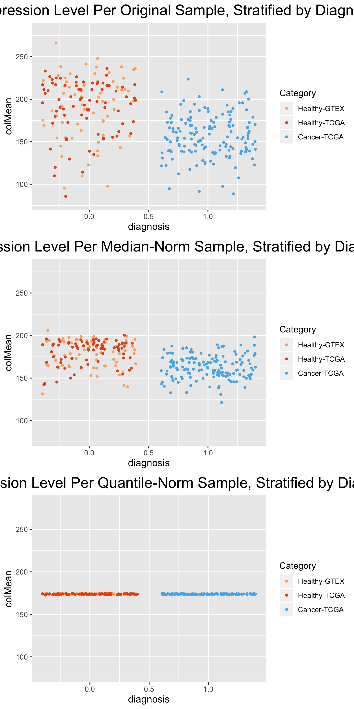

LassoQA
================
Michael Kesling
9/19/2019

### Effect of Data Normalization

I've gotten an extremely powerful Logistic Classifier with Lasso Regularizer on a breast cancer dataset. However, I'm concerned that the prediction accuracy (98%) is far higher than is reasonable. So I'm investigating the effects of (a) DESeq2 normalization and (b) quantile-quantile normalization on the prediction accuracies.

###### (Document in Progress)

### Finish Dataframe Cleanup

We start by importing the data as a dataframe while taking the transpose, as the genes will act as the predictors. We also need to combine the Hugo symbol and Entrez ID rows as the column names and then remove those 2 rows from the dataframe.

``` r
# transpose causes data to be saved as matrix rather than df.  However, that helps manipulation
# of text in first 2 rows to create meaningful column names for the df.
wangMatrix <- t(read.table("../data/wangBreastFPKM398_Attrib.txt", header=TRUE)) # rownames okay now
numRows <- dim(wangMatrix)[1]
# convert to dataframe while removing first 2 rows and name the columns from the Matrix data:
wangWithAttrib <- data.frame(wangMatrix[3:numRows,], stringsAsFactors = FALSE)
colnames(wangWithAttrib) <- gsub("-NA", "",(gsub(" ", "", paste0(wangMatrix[1,], "-", wangMatrix[2,]))))
```

Next, we'll need to decide which sample attributes to use. As the only consistent attribute is Age, I'll remove all others (perhaps we could impute the others at another time). I'll also filter out the 3 male samples. And I'll need to create an output vector. I'm going to start with *primary\_diagnosis*, which will be cleaned up to 0 for healthy and 1 for cancer. However, the *tumor\_stage* describes cancer in greater detail, and I'll save that as an alternative output vector.

``` r
require(dplyr);
require(tibble);
# convert rownames to column so that they are not lost through filter step
wangWithAttrib <- wangWithAttrib %>% rownames_to_column('sample')

# wangWithAttrib %>% dplyr::filter(gender=="female") %>% dim() #shows correctly removes 3 rows
wangWithAttrib <- wangWithAttrib %>% dplyr::filter(gender=="female")
primary_diagnosis_archive <- wangWithAttrib$primary_diagnosis    # archive
tumor_stage_archive <- wangWithAttrib$tumor_stage                # archive

# before removing output variable, I'm going to split wangWithAttrib into a training and test sets
# first, we'll convert primary_diagnosis into 0's and 1's.
wangWithAttrib$primary_diagnosis <- ifelse(wangWithAttrib$primary_diagnosis=="healthy", 0, 1)
require(caTools);
set.seed(233992812)
idxTrain <- sample.split(wangWithAttrib$primary_diagnosis, SplitRatio = 0.75)

# confirm randomness of selection:
qa <- cbind(idxTrain, wangWithAttrib$primary_diagnosis)
paste(sum(qa[qa[,2]==0,][,1]), " and ", sum(qa[qa[,2]==1,][,1]), " training sizes amongst healthy and cancer samples shows equal partitioning")
```

    ## [1] "148  and  148  training sizes amongst healthy and cancer samples shows equal partitioning"

``` r
# next, we grab the output vectors, both train and test
diagTrain <- subset(wangWithAttrib$primary_diagnosis, idxTrain==TRUE)
diagTest <- subset(wangWithAttrib$primary_diagnosis, idxTrain==FALSE)

# next, we remove unused columns
wangWithAge <- wangWithAttrib %>% select(-gender, -race, -ethnicity, -prior_malignancy,
                                         -vital_status,
                                         -primary_diagnosis, -tumor_stage)  # correctly removes 7 columns

# then we use indices to separate what remains into train and test sets:
wangTrain <- wangWithAge %>% filter(idxTrain==TRUE)    # 296 training obs
wangTest <- wangWithAge %>% filter(idxTrain==FALSE)    #  99 test obs
print(paste(dim(wangTrain), dim(wangTest)))
```

    ## [1] "296 99"      "19740 19740"

``` r
# finish data cleanup:
# start by converting data-frames to matrices, and create row names:
wangTrainMatrix <- data.matrix(wangTrain[,2:dim(wangTrain)[2]])
rownames(wangTrainMatrix) <- wangTrain[,1]
wangTestMatrix <- data.matrix(wangTest[,2:dim(wangTest)[2]])
rownames(wangTestMatrix) <- wangTest[,1]
```

### Normalize Data

We're working with the Breast Cancer Dataset from TCGA and GTEX.
There were normalization problems that affected the learning algorithm. So I'm going to use median-normalization (using the DESeq2 methodology), as well as the Quantile-Quantile normalization from the preprocessCore package. We'd like to see that there arent' any biases in the gene levels between the tumor and healthy samples.

``` r
Xorig <- t(wangTrainMatrix)
Xorig <- Xorig[-1,] #rm age variable
sampleMediansOrig <- data.frame(colMedians(Xorig))
rownames(sampleMediansOrig) <- colnames(Xorig)
sampleMediansOrig <- cbind(sampleMediansOrig, c(rep(0, 148), rep(1, 148)))

#############
# DESeq2 sample-to-sample normalization procedure:
logXorig <- log(Xorig)                     # 1. take natural log
geneAvgs <- apply(logXorig, 1, mean)       # 2. take mean of each row
logXfilter <- logXorig[geneAvgs != -Inf,]  # 3. remove those genes whose avg = -Inf
# 6525 genes filtered out
geneAvgs <- geneAvgs[geneAvgs != -Inf]     # 3a. update relevant gene-Avgs
logFC <- logXfilter - geneAvgs             # 4. subtract off gene mean (give logFC)
sampleMedians <- apply(logFC, 2, median)   # 5. calculate sample medians
scalingFactor <- exp(sampleMedians)        # 6. convert medians back to natural scale
# the medianNatural is the scaling factor
Xmedian <- t(apply(Xorig, 1, function(x){x / scalingFactor})) # 7. divide original
# matrix by scaling factors, one row at a time.
sampleMediansMedian <- data.frame(colMedians(Xmedian))
rownames(sampleMediansMedian) <- colnames(Xmedian)
sampleMediansMedian <- cbind(sampleMediansMedian, c(rep(0, 148), rep(1, 148)))

#############
# Quantile - Quantile Normalization
require(preprocessCore)
```

    ## Loading required package: preprocessCore

``` r
X_quantile <- normalize.quantiles(Xorig)
colnames(X_quantile) <- colnames(Xorig)
rownames(X_quantile) <- rownames(Xorig)
sampleMediansQuantile <- data.frame(colMedians(X_quantile))
rownames(sampleMediansQuantile) <- colnames(X_quantile)
sampleMediansQuantile <- cbind(sampleMediansQuantile, c(rep(0, 148), rep(1, 148)))
```

### Plotting Sample Medians to View Bias

``` r
# create vector based on GTEX-healthy, TCGA-healthy, TCGA-cancer
# classes GTEX-healthy = 1, TCGA-healthy = 2, TCGA-cancer = 3
sampleNames <- rownames(sampleMediansOrig)
c3vect <- c(rep(0, length(sampleNames)))
c3vect <- grepl("^GTEX", sampleNames) + c3vect
c3vect <- c3vect + 2*(grepl("^TCGA", sampleNames) &
                      grepl("\\.11[AB]\\.", sampleNames, perl=TRUE))
c3vect <- c3vect + 3*(grepl("^TCGA", sampleNames) &
                      grepl("\\.01[AB]\\.", sampleNames, perl=TRUE))

# add color column to sampleMeansXXXX dataframes
sampleMediansOrig <- cbind(sampleMediansOrig, c3vect)
colnames(sampleMediansOrig) <- c("colMean", "diagnosis", "class")
sampleMediansMedian <- cbind(sampleMediansMedian, c3vect)
colnames(sampleMediansMedian) <- c("colMean", "diagnosis", "class")
sampleMediansQuantile <- cbind(sampleMediansQuantile, c3vect)
colnames(sampleMediansQuantile) <- c("colMean", "diagnosis", "class")


# Plotting Function
colors3pal <- c("#FDAE6B", "#E6550D",  "#56B4E9")
jitterPlot3var <- function(df, var1, var2, var3, titl, pal){
   obj <- ggplot(df, aes(df[,var1], df[,var2]), colour=as.factor(df[,var3]))+ #as.factor() 
   geom_jitter(aes(col=as.factor(df[,var3])),size=1.0, height=0.3) +   #as.factor() needed
   scale_color_manual(name="Category",
                      breaks = c("1", "2", "3"),
                      values = pal,
                      labels = c("Healthy-GTEX", "Healthy-TCGA", "Cancer-TCGA")) +
   ggtitle(titl) + xlab(var1) + ylab(var2) +
   scale_y_continuous(limits=c(80, 280)) +
   theme(plot.title = element_text(size = 18, hjust=0.5)) +
   theme(axis.title = element_text(size = 12, hjust=0.5));
   return(obj)
}

# create plotting objects
p1 <- jitterPlot3var(sampleMediansOrig, "diagnosis", "colMean", "class", 
                 "Average Expression Level Per Original Sample, Stratified by Diagnosis",
                 colors3pal)
p2 <- jitterPlot3var(sampleMediansMedian, "diagnosis", "colMean", "class", 
                 "Average Expression Level Per Median-Norm Sample, Stratified by Diagnosis",
                 colors3pal)
p3 <- jitterPlot3var(sampleMediansQuantile, "diagnosis", "colMean", "class", 
                 "Average Expression Level Per Quantile-Norm Sample, Stratified by Diagnosis",
                 colors3pal)


grid.arrange(p1, p2, p3, nrow=3)
```

 Earlier work showed that average sample signal across all gene varied significantly between the cancer samples and the healthy samples. However, using the median here shows that the bias is much smaller (and eliminated via quantile-quantile normalization--as it's in the definition of this procedure).

The median normalization (DESeq2 procedure) greatly improved the center of the MEANS. The quantile values are on top of each other (see y-axis scale). \[Not shown in this document.\]

### MA Plot

As another point of QA, I'm going to look at the MA plot of (a) pre-normalized genes (b) median-normalized genes (c) quantile-normalized genes

``` r
require(viper)
```

    ## Loading required package: viper

    ## Loading required package: Biobase

    ## Loading required package: BiocGenerics

    ## Loading required package: parallel

    ## 
    ## Attaching package: 'BiocGenerics'

    ## The following objects are masked from 'package:parallel':
    ## 
    ##     clusterApply, clusterApplyLB, clusterCall, clusterEvalQ,
    ##     clusterExport, clusterMap, parApply, parCapply, parLapply,
    ##     parLapplyLB, parRapply, parSapply, parSapplyLB

    ## The following objects are masked from 'package:dplyr':
    ## 
    ##     combine, intersect, setdiff, union

    ## The following object is masked from 'package:gridExtra':
    ## 
    ##     combine

    ## The following objects are masked from 'package:stats':
    ## 
    ##     IQR, mad, sd, var, xtabs

    ## The following objects are masked from 'package:base':
    ## 
    ##     anyDuplicated, append, as.data.frame, basename, cbind,
    ##     colMeans, colnames, colSums, dirname, do.call, duplicated,
    ##     eval, evalq, Filter, Find, get, grep, grepl, intersect,
    ##     is.unsorted, lapply, lengths, Map, mapply, match, mget, order,
    ##     paste, pmax, pmax.int, pmin, pmin.int, Position, rank, rbind,
    ##     Reduce, rowMeans, rownames, rowSums, sapply, setdiff, sort,
    ##     table, tapply, union, unique, unsplit, which, which.max,
    ##     which.min

    ## Welcome to Bioconductor
    ## 
    ##     Vignettes contain introductory material; view with
    ##     'browseVignettes()'. To cite Bioconductor, see
    ##     'citation("Biobase")', and for packages 'citation("pkgname")'.

    ## 
    ## Attaching package: 'Biobase'

    ## The following object is masked from 'package:BiocGenerics':
    ## 
    ##     dims

    ## The following objects are masked from 'package:matrixStats':
    ## 
    ##     anyMissing, rowMedians

``` r
# to eliminate zero values, I'll add 1 to every value in data matrices
Xorig <- Xorig + 1
Xmedian <- Xmedian + 1
X_quantile <- X_quantile + 1

# for each gene, calculate average among healthy samples and average among tumors
healthyGeneMeansOrig <- apply(Xorig[,1:148], 1, mean)
cancerGeneMeansOrig <- apply(Xorig[,149:296], 1, mean)
healthyGeneMeansMedian <- apply(Xmedian[,1:148], 1, mean)
cancerGeneMeansMedian <- apply(Xmedian[,149:296], 1, mean)
healthyGeneMeansQuantile <- apply(X_quantile[,1:148], 1, mean)
cancerGeneMeansQuantile <- apply(X_quantile[,149:296], 1, mean)

# next we calculate the logFC (M) and averageExpr (A) for the 3 datasets
# and save them in 3 separate dataframes
# I'm also calculating row-T-Test p-values which I'll use for the volcano
# plots below
M_orig <- log(cancerGeneMeansOrig) - log(healthyGeneMeansOrig)
A_orig <- 0.5 * (log(cancerGeneMeansOrig) + log(healthyGeneMeansOrig))
ttests <- rowTtest(Xorig[,1:148], Xorig[,149:296])
BHpval <- p.adjust(ttests$p.value, method="BH")
MA_orig <- cbind(A_orig, M_orig, ttests$p.value, BHpval)
colnames(MA_orig) <- c("A", "M", "Pvalue", "BH")
rownames(MA_orig) <- rownames(Xorig)

A_median <- 0.5 * (log(cancerGeneMeansMedian) + log(healthyGeneMeansMedian))
M_median <- log(cancerGeneMeansMedian) - log(healthyGeneMeansMedian)
ttests <- rowTtest(Xmedian[,1:148], Xmedian[,149:296])
BHpval <- p.adjust(ttests$p.value, method="BH")
MA_median <- cbind(A_median, M_median, ttests$p.value, BHpval)
colnames(MA_median) <- c("A", "M", "Pvalue", "BH")
rownames(MA_median) <- rownames(Xorig)

A_quantile <- 0.5 * (log(cancerGeneMeansQuantile) + log(healthyGeneMeansQuantile))
M_quantile <- log(cancerGeneMeansQuantile) - log(healthyGeneMeansQuantile)
ttests <- rowTtest(X_quantile[,1:148], X_quantile[,149:296])
BHpval <- p.adjust(ttests$p.value, method="BH")
MA_quantile <- cbind(A_quantile, M_quantile, ttests$p.value, BHpval)
colnames(MA_quantile) <- c("A", "M", "Pvalue", "BH")

# MA plotting function:
MAplot <- function(df, titl){
   obj <- ggplot(data.frame(df), aes(A, M)) +
      geom_point(size =0.5) + geom_hline(yintercept = 1, col="red", size=0.5) +
      geom_hline(yintercept = -1, col="red", size=0.5) +
      geom_smooth(col="yellow", size=0.5) +
      ggtitle(titl)
   return(obj)
}

ma1 <- MAplot(MA_orig, "MA Plot on Original Dataset")
ma2 <- MAplot(MA_median, "MA Plot on Median-Normalized Dataset")
ma3 <- MAplot(MA_quantile, "MA Plot on Quantile-Norm Dataset")


grid.arrange(ma1, ma2, ma3, nrow=3)
```

    ## `geom_smooth()` using method = 'gam' and formula 'y ~ s(x, bs = "cs")'

    ## `geom_smooth()` using method = 'gam' and formula 'y ~ s(x, bs = "cs")'
    ## `geom_smooth()` using method = 'gam' and formula 'y ~ s(x, bs = "cs")'

 Visually, it's hard to distinguish between the three plots. However, the Quantile-Normalized smoother seem very wiggly, which is not a great sign.
It's also useful to note that the noisy points are below A = 4.
Let's count the number of points outside of the 2 red lines:

``` r
print(paste0("In the original data, there are ", sum(abs(M_orig) > 1), " genes whose fold-change is greater than 2 or less than 0.5.  In the median-normalized data, there are ", sum(abs(M_median) > 1), " genes whose fold-change is greater than 2 or less than 0.5.  In the quantile-normalized data, there are ", sum(abs(M_quantile) > 1), " genes whose fold-change is greater than 2 or less than 0.5."))
```

    ## [1] "In the original data, there are 2607 genes whose fold-change is greater than 2 or less than 0.5.  In the median-normalized data, there are 2667 genes whose fold-change is greater than 2 or less than 0.5.  In the quantile-normalized data, there are 2741 genes whose fold-change is greater than 2 or less than 0.5."

So it looks like the normalizations don't really affect the proportion of differentially expressed genes.

### Volcano Plots

I'm going to create Volcano Plots to try and gain more insight into the plots

``` r
volcano <- function(df, titl){
   obj <- ggplot(data.frame(df), aes(M, -log10(BH))) +
      geom_point(size =0.5) + geom_hline(yintercept = 2, col="red", size=0.5) +
      geom_vline(xintercept = 1, col="red", size=0.5) +
      geom_vline(xintercept = -1, col="red", size = 0.5) +
      xlim(-4,4) +
      ggtitle(titl)
   return(obj)
}
v1 <- volcano(MA_orig, "Original Dataframe")
v2 <- volcano(MA_median, "Median Normalized")
v3 <- volcano(MA_quantile, "Quantile Normalized")
grid.arrange(v1, v2, v3, nrow=3)
```

    ## Warning: Removed 61 rows containing missing values (geom_point).

    ## Warning: Removed 79 rows containing missing values (geom_point).

    ## Warning: Removed 30 rows containing missing values (geom_point).

 These volcano plots look really similar. \#\#\# Selecting genes with |M| &gt; 1 and p-value &lt; 10^-10 Let's see how much the BH correction helped. (I also did not perform independent filtering.)

``` r
data.frame(MA_orig) %>% filter(abs(M) > 1) %>% #2607
   filter(Pvalue < 0.01)  %>% dim()                    #2094
```

    ## [1] 2094    4

``` r
data.frame(MA_orig) %>% filter(abs(M) > 1) %>%
   filter(BH < 0.01) %>% dim()                          #2051
```

    ## [1] 2051    4

``` r
data.frame(MA_quantile) %>% filter(abs(M) >1) %>% #2741
   filter(Pvalue < 0.01) %>% dim()                       #2201
```

    ## [1] 2201    4

``` r
forPlotting <- data.frame(MA_quantile) %>% rownames_to_column() %>% 
   filter(abs(M)>1) %>% filter(BH < 0.0001)    #1774
```

BH is not really helping at all. I'm also wondering how "rigged" this system is, given the batch correction by Wang.

THE QUESTION IS, IF TRAINING AND TEST SETS WERE HANDLED SEPARATELY FROM THE OUTSET, HOW WELL WOULD MY LASSO MODEL PERFORM?

### p-value histograms

Here, we look at p-value histograms by taking 2 random samples of samples from the same diagnosis to see if the gene p-values between them (for row t-tests) are uniformly distributed.

``` r
hist(MA_quantile[,3])
```

 This p-value distribution is WAY off, unless it's because my sample numbers are so high. The vast majority of genes change less than 2-fold. Let's plot a few of these out.

### Sorting Significant Genes by Absolute-Value of Fold-Change

``` r
PutValidGenesSrtFC <- forPlotting %>% arrange(BH) %>% mutate(absM = abs(M)) %>%
   arrange(desc(absM))
geneNames <- PutValidGenesSrtFC$rowname[1:10]
head(PutValidGenesSrtFC, n=10)
```

    ##           rowname        A         M       Pvalue           BH     absM
    ## 1    COL10A1-1300 5.344793  5.232344 4.438819e-24 6.072878e-23 5.232344
    ## 2       MYOC-4653 3.565392 -4.530055 5.982216e-10 2.110779e-09 4.530055
    ## 3        LEP-3952 5.968471 -4.137727 2.481505e-20 2.329051e-19 4.137727
    ## 4       CST1-1469 5.186764  4.016182 1.291589e-11 5.277039e-11 4.016182
    ## 5      MMP11-4320 6.625559  3.985913 2.251311e-26 4.014126e-25 3.985913
    ## 6     ADIPOQ-9370 7.648451 -3.963055 4.746155e-12 2.011155e-11 3.963055
    ## 7     GLYAT-10249 4.479121 -3.950099 3.077153e-21 3.193315e-20 3.950099
    ## 8       ADH1B-125 8.388970 -3.933703 1.746458e-17 1.228058e-16 3.933703
    ## 9     CIDEC-63924 7.339406 -3.880159 2.315647e-17 1.609374e-16 3.880159
    ## 10 CD300LG-146894 5.544140 -3.823212 6.604438e-22 7.250188e-21 3.823212

### Plotting Gene Expression Values Across Diagnosis for Signifcant Genes

``` r
jitterPlot3var2 <- function(df, var1, var2, var3, titl, pal){
   obj <- ggplot(df, aes(df[,var1], df[,var2]), colour=as.factor(df[,var3]))+ #as.factor() 
   geom_jitter(aes(col=as.factor(df[,var3])),size=1.0, height=0.3) +   #as.factor() needed
   scale_color_manual(name="Category",
                      breaks = c("1", "2", "3"),
                      values = pal,
                      labels = c("Healthy-GTEX", "Healthy-TCGA", "Cancer-TCGA")) +
   ggtitle(titl) + xlab(var1) + ylab(var2)
   theme(plot.title = element_text(size = 8, hjust=0.5)) +
   theme(axis.title = element_text(size = 6, hjust=0.5));
   return(obj)
}
ls <- list()
for(i in 1:6){
   geneValues <- cbind(c(rep(0, 148), rep(1, 148)), log2(Xorig[geneNames[i],]), c3vect)
   colnames(geneValues) <- c("diagnosis", "log2FPKM", "class")
   ls[[i]] <- jitterPlot3var2(data.frame(geneValues), "diagnosis", 
                  "log2FPKM", "class", geneNames[i], colors3pal)
}
grid.arrange(ls[[1]], ls[[2]], ls[[3]], ls[[4]], ls[[5]], ls[[6]], ncol=2)
```

 I'm going to plot these same genes when they are quantile-normalized:

``` r
ls <- list()
for(i in 1:6){
   geneValues <- cbind(c(rep(0, 148), rep(1, 148)), log2(X_quantile[geneNames[i],]), c3vect)
   colnames(geneValues) <- c("diagnosis", "log2FPKM", "class")
   ls[[i]] <- jitterPlot3var2(data.frame(geneValues), "diagnosis", 
                  "log2FPKM", "class", geneNames[i], colors3pal)
}
grid.arrange(ls[[1]], ls[[2]], ls[[3]], ls[[4]], ls[[5]], ls[[6]], ncol=2)
```

 While the data for COL10A1 and MMP11 are very clean, one can see the diversion in expression across healthy / cancer samples for the other 4 genes with sufficient data.

*My main concern now is the number of genes 'differentially expressed' between cancer and healthy*, so I'm going to continue my QA.

##### Does t-SNE graph look similarly when only considering paired TCGA samples?

##### how many paired samples do I have?

``` r
tcgaCancer = list()
tcgaHealthy = list()
tcgaPatients = list()
for(name in wangWithAttrib$sample){
   if(grepl("^GTEX.*", name)){
      next()}
   else{
      tmp <- unlist(strsplit(name, "\\."))[2:4]
      sample <- paste0(tmp[1], tmp[2])
      tcgaPatients <- c(tcgaPatients, sample)
      if(grepl("01[AB]", tmp[3])){
         tcgaCancer <- c(tcgaCancer, sample)
      }
      else if(grepl("11[AB]", tmp[3])){
         tcgaHealthy <- c(tcgaHealthy, sample)
      }
      else{
         print("exception")
      }
   }
}
tcgaPatients <- unique(unlist(tcgaPatients))
tcgaCancer <- unique(unlist(tcgaCancer))
tcgaHealthy <- unique(unlist(tcgaHealthy))

patientSamples = list()
for(patient in tcgaPatients){
   if(patient %in% tcgaCancer){
      if(patient %in% tcgaHealthy){
         patientSamples <- c(patientSamples, paste(patient, "BOTH"))
      }
      else{
         patientSamples <- c(patientSamples, paste(patient, "Cancer only"))
      }
   }
   else{
      patientSamples <- c(patientSamples, paste(patient, "Healthy only"))
   }
   
}
patientSamples <- unlist(patientSamples)
print(paste("Within the 395 samples that were selected, the number of TCGA patients with healthy and cancer samples is ",
            length(grep("BOTH", patientSamples)), ". The number of TCGA patients with only cancer samples is ", length(grep("Cancer only", patientSamples)),
            ". And the number of TCGA patients with only healthy samples is ",
            length(grep("Healthy only", patientSamples)), " There are also 89 GTEX healthy samples"))
```

    ## [1] "Within the 395 samples that were selected, the number of TCGA patients with healthy and cancer samples is  20 . The number of TCGA patients with only cancer samples is  177 . And the number of TCGA patients with only healthy samples is  88  There are also 89 GTEX healthy samples"

``` r
print(c("The TCGA patients in this dataset (training and test sets together) that have both a tumor and a healthy match are ", patientSamples[grep("BOTH", patientSamples)]))
```

    ##  [1] "The TCGA patients in this dataset (training and test sets together) that have both a tumor and a healthy match are "
    ##  [2] "BHA0DO BOTH"                                                                                                        
    ##  [3] "BHA18L BOTH"                                                                                                        
    ##  [4] "A7A0CH BOTH"                                                                                                        
    ##  [5] "E2A158 BOTH"                                                                                                        
    ##  [6] "BHA0H9 BOTH"                                                                                                        
    ##  [7] "GIA2C8 BOTH"                                                                                                        
    ##  [8] "E9A1RF BOTH"                                                                                                        
    ##  [9] "BHA0B5 BOTH"                                                                                                        
    ## [10] "BHA0AY BOTH"                                                                                                        
    ## [11] "BHA1ET BOTH"                                                                                                        
    ## [12] "BHA1FN BOTH"                                                                                                        
    ## [13] "BHA203 BOTH"                                                                                                        
    ## [14] "ACA23H BOTH"                                                                                                        
    ## [15] "BHA0AZ BOTH"                                                                                                        
    ## [16] "BHA0DG BOTH"                                                                                                        
    ## [17] "BHA18U BOTH"                                                                                                        
    ## [18] "E2A15I BOTH"                                                                                                        
    ## [19] "BHA1FM BOTH"                                                                                                        
    ## [20] "E2A15M BOTH"                                                                                                        
    ## [21] "GIA2C9 BOTH"

t-SNE to view Cancer/Healthy Diagnosis Partitioning
===================================================

``` r
require(Rtsne);
```

    ## Loading required package: Rtsne

``` r
require(ggplot2);
set.seed(31234)

XorigSmpl <- t(Xorig)
XmedianSmpl <- t(Xmedian)
XquantileSmpl <- t(X_quantile)

# we start by creating a vector of the 296 training examples according to their class
#classes3 <- subset(wangWithAttrib, idxTrain==TRUE)
#sampleNames <- classes3$gene           # actually the sample name and not gene name
#rm(classes3)                           # cleanup

# classes GTEX-healthy = 1, TCGA-healthy = 2, TCGA-cancer = 3
c3vect <- c(rep(0, length(sampleNames)))
c3vect <- grepl("^GTEX", sampleNames) + c3vect
c3vect <- c3vect + 2*(grepl("^TCGA", sampleNames) & 
                      grepl("\\.11[AB]\\.", sampleNames, perl=TRUE))
c3vect <- c3vect + 3*(grepl("^TCGA", sampleNames) & 
                      grepl("\\.01[AB]\\.", sampleNames, perl=TRUE))


tSNEout_orig <- Rtsne(XorigSmpl, dims=2)
tsne_plot_orig <- data.frame(x=tSNEout_orig$Y[,1], y = tSNEout_orig$Y[,2], col=c3vect)
tSNEout_median <- Rtsne(XmedianSmpl, dims=2)
tsne_plot_median <- data.frame(x=tSNEout_median$Y[,1], y = tSNEout_median$Y[,2], col=c3vect)
tSNEout_quant <- Rtsne(XquantileSmpl, dims=2)
tsne_plot_quant <- data.frame(x=tSNEout_quant$Y[,1], y = tSNEout_quant$Y[,2], col=c3vect)


# define colors
colors3pal <- c("#FDAE6B", "#E6550D",  "#56B4E9")

tsne_plot_3class <- function(df){
   #data.frame(x=tSNEout_full$Y[,1], y = tSNEout_full$Y[,2], col=c3vect)
   obj <- ggplot(df) + 
   geom_point(aes(x=x, y=y, color=as.factor(col))) + 
   ggtitle("t-SNE Plot of Training Data Using All Predictors") +
   scale_color_manual(name="Category",
                      breaks = c("1", "2", "3"),
                      values = c(colors3pal[1], colors3pal[2], colors3pal[3]),
                      labels = c("Healthy-GTEX", "Healthy-TCGA", "Cancer-TCGA"))
   return(obj)
}
ts1 <- tsne_plot_3class(tsne_plot_orig)
ts2 <- tsne_plot_3class(tsne_plot_median)
ts3 <- tsne_plot_3class(tsne_plot_quant)
grid.arrange(ts1, ts2, ts3, ncol=2)
```


##### Normalizing Each Test Sample Individually? (Real-life scenario) and also validation samples?
