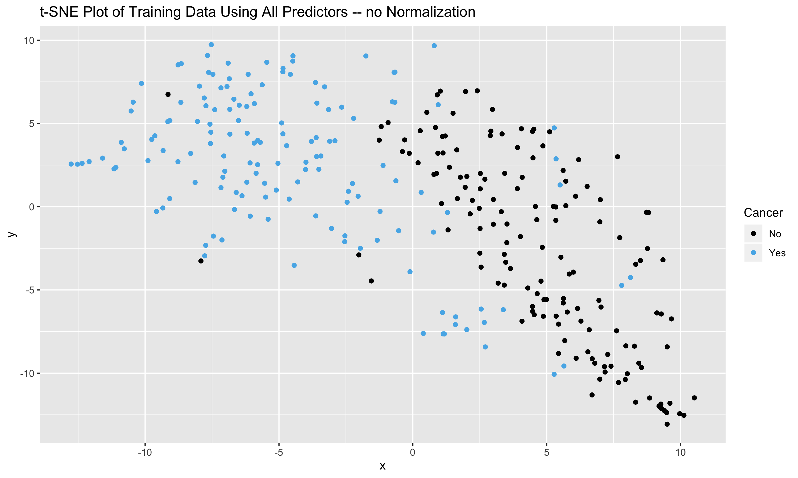
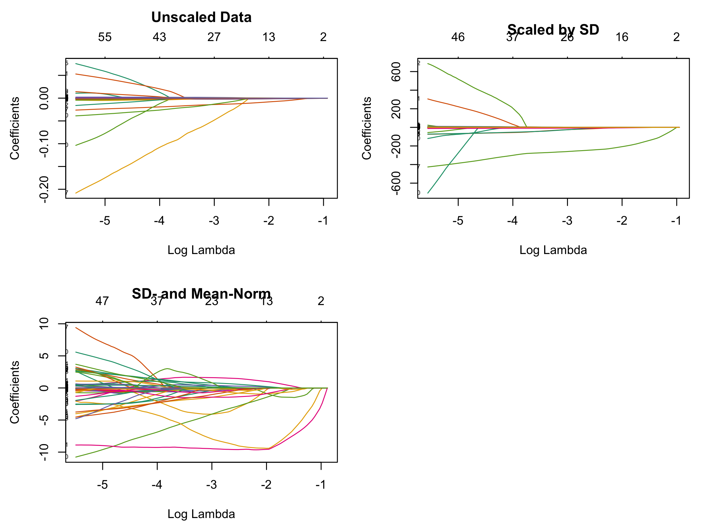
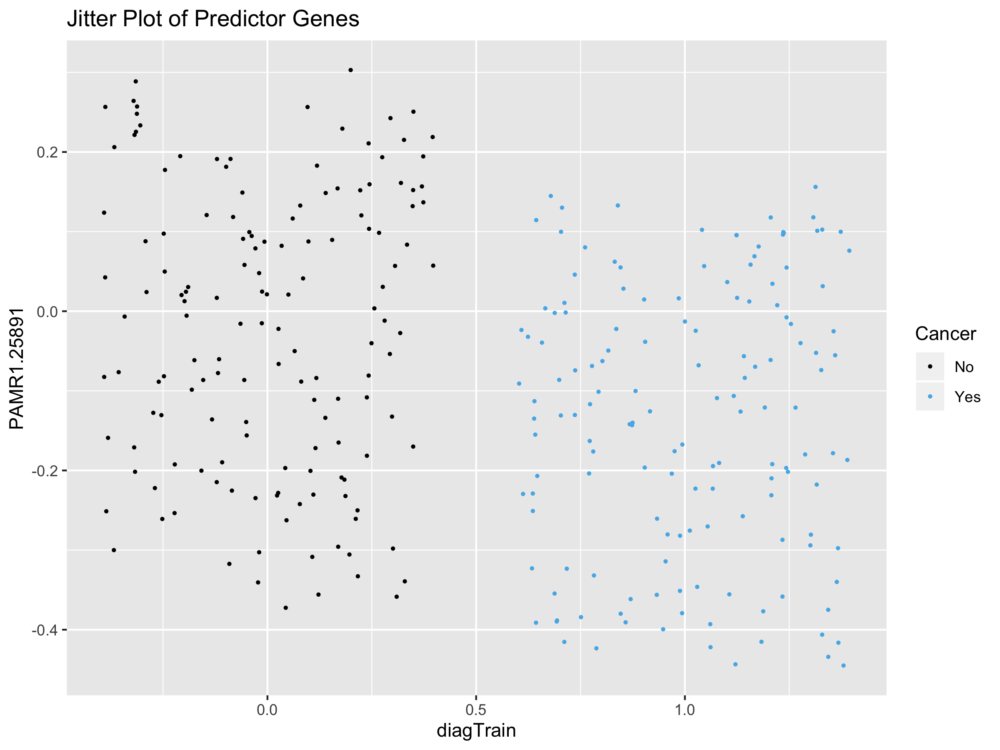

Using Lasso to Find Predictors for Breast Cancer
================
Michael Kesling
8/23/2019

###### (Document in Progress)

### Objective:

We are going to use the cleaned batch-normalized dataset of RNASeq data from 199 healthy breast samples and 199 breast tumors to find RNASeq signatures which predict the cancerous state.

###### NOTE: Some functions are not included in the markdown / html file. To view those, see the [.RMD file](https://github.com/keslingmj/MachineLearningRNASeq/blob/master/Lasso_on_BRCA_RNASeq.Rmd)

### Finish Dataframe Cleanup

We start by importing the data as a dataframe while taking the transpose, as the genes will act as the predictors. We also need to combine the Hugo symbol and Entrez ID rows as the column names and then remove those 2 rows from the dataframe.

``` r
# transpose causes data to be saved as matrix rather than df.  However, that helps manipulation
# of text in first 2 rows to create meaningful column names for the df.
wangMatrix <- t(read.table("../data/wangBreastFPKM398_Attrib.txt", header=TRUE)) # rownames okay now
numRows <- dim(wangMatrix)[1]
# convert to dataframe while removing first 2 rows and name the columns from the Matrix data:
wangWithAttrib <- data.frame(wangMatrix[3:numRows,], stringsAsFactors = FALSE)
colnames(wangWithAttrib) <- gsub("-NA", "",(gsub(" ", "", paste0(wangMatrix[1,], "-", wangMatrix[2,]))))
```

Next, we'll need to decide which sample attributes to use. As the only consistent attribute is Age, I'll remove all others (perhaps we could impute the others at another time). I'll also filter out the 3 male samples. And I'll need to create an output vector. I'm going to start with *primary\_diagnosis*, which will be cleaned up to 0 for healthy and 1 for cancer. However, the *tumor\_stage* describes cancer in greater detail, and I'll save that as an alternative output vector.

``` r
require(dplyr);
require(tibble);
# convert rownames to column so that they are not lost through filter step
wangWithAttrib <- wangWithAttrib %>% rownames_to_column('gene')

# wangWithAttrib %>% dplyr::filter(gender=="female") %>% dim() #shows correctly removes 3 rows
wangWithAttrib <- wangWithAttrib %>% dplyr::filter(gender=="female")
primary_diagnosis_archive <- wangWithAttrib$primary_diagnosis    # archive
tumor_stage_archive <- wangWithAttrib$tumor_stage                # archive

# before removing output variable, I'm going to split wangWithAttrib into a training and test sets
# first, we'll convert primary_diagnosis into 0's and 1's.
wangWithAttrib$primary_diagnosis <- ifelse(wangWithAttrib$primary_diagnosis=="healthy", 0, 1)
require(caTools);
set.seed(233992812)
idxTrain <- sample.split(wangWithAttrib$primary_diagnosis, SplitRatio = 0.75)

# confirm randomness of selection:
qa <- cbind(idxTrain, wangWithAttrib$primary_diagnosis)
paste(sum(qa[qa[,2]==0,][,1]), " and ", sum(qa[qa[,2]==1,][,1]), " training sizes amongst healthy and cancer samples shows equal partitioning")
```

    ## [1] "148  and  148  training sizes amongst healthy and cancer samples shows equal partitioning"

``` r
# next, we grab the output vectors, both train and test
diagTrain <- subset(wangWithAttrib$primary_diagnosis, idxTrain==TRUE)
diagTest <- subset(wangWithAttrib$primary_diagnosis, idxTrain==FALSE)

# next, we remove unused columns
wangWithAge <- wangWithAttrib %>% select(-gender, -race, -ethnicity, -prior_malignancy,
                                         -vital_status,
                                         -primary_diagnosis, -tumor_stage)  # correctly removes 7 columns

# then we use indices to separate what remains into train and test sets:
wangTrain <- wangWithAge %>% filter(idxTrain==TRUE)    # 296 training obs
wangTest <- wangWithAge %>% filter(idxTrain==FALSE)    #  99 test obs
print(paste(dim(wangTrain), dim(wangTest)))
```

    ## [1] "296 99"      "19740 19740"

### Normalizing Data for Lasso

In order to perform Lasso, each gene must be normalized so that larger-unit betas don't dominate smaller betas

###### Need to rigorously test whether my normalization yields identical

###### results to glmnet's own internal normalization.

``` r
# start by converting data-frames to matrices, and create row names:
wangTrainMatrix <- data.matrix(wangTrain[,2:dim(wangTrain)[2]])
rownames(wangTrainMatrix) <- wangTrain[,1]
wangTestMatrix <- data.matrix(wangTest[,2:dim(wangTest)[2]])
rownames(wangTestMatrix) <- wangTest[,1]


# Normalizing Training Data with and without subtracting off mean:
wangTrainNormMean <- scaleData(wangTrainMatrix, MEAN=TRUE, ROW=TRUE)
wangTrainNorm <- scaleData(wangTrainMatrix, MEAN=FALSE, ROW=TRUE)

# Normalizing Test Data with and without subtracting off mean:
wangTestNormMean <- scaleData(wangTestMatrix, MEAN=TRUE, ROW=TRUE)
wangTestNorm <- scaleData(wangTestMatrix, MEAN=FALSE, ROW=TRUE)

# Must re-order Test Data columns to be the same as for Training Data:
wangTestNormMean <- wangTestNormMean[,colnames(wangTrainNormMean)]
wangTestNorm <- wangTestNorm[,colnames(wangTrainNorm)]
# test consistency with wangTrainNorm
print(c(all(colnames(wangTestNorm) == colnames(wangTrainNorm)),
             all(colnames(wangTestNormMean) == colnames(wangTrainNormMean))))
```

    ## [1] TRUE TRUE

### Viewing Partitioning of Cancer/Healthy Samples in Data Space using t-SNE

T-distributed stochastic neighbor embedding is a popular technique for projecting the high-dimensional dataset onto a 2-D surface. We perform that here in order to view how the cancer/healthy sample attribute partitions across the dataset.

``` r
require(glmnet);
require(ggplot2);
# install_github("ririzarr/rafalib")
require(rafalib);

###############
### Fitting Logistic Regression with Lasso Regularizer on 
### (A) non-scaled data
### (B) data scaled by SD only
### (C) data scaled by SD and centered by Mean


xTrainSDnorm <- as.matrix(wangTrainNorm)
xTrainSDMean <- as.matrix(wangTrainNormMean)
# Let's look at map of data after normalizing using t-SNE
require(Rtsne);
require(ggplot2);
set.seed(31234)
tSNEout_full_noNorm <- Rtsne(wangTrainMatrix, dims=2)
set.seed(31234)
tSNEout_full_SD <- Rtsne(xTrainSDnorm, dims=2)
set.seed(31234)
tSNEout_full_SDmean <- Rtsne(xTrainSDMean, dims=2)

tsne_plot_full_noNorm <- data.frame(x=tSNEout_full_noNorm$Y[,1], 
                                    y = tSNEout_full_noNorm$Y[,2], col=diagTrain)
tsne_plot_full_SD <- data.frame(x=tSNEout_full_SD$Y[,1], 
                                y = tSNEout_full_SD$Y[,2], col=diagTrain)
tsne_plot_full_SDmean <- data.frame(x=tSNEout_full_SDmean$Y[,1], 
                                    y = tSNEout_full_SDmean$Y[,2], col=diagTrain)

palette <- c("#000000", "#56B4E9")
mypar(1,3)
ggplot(tsne_plot_full_noNorm) + 
   geom_point(aes(x=x, y=y, color=as.factor(col))) + 
   ggtitle("t-SNE Plot of Training Data Using All Predictors -- no Normalization") +
   scale_color_manual(name="Cancer",
                      breaks = c("0","1"),
                      values = palette,
                      labels = c("No", "Yes")) 
```



``` r
ggplot(tsne_plot_full_SD) + 
   geom_point(aes(x=x, y=y, color=as.factor(col))) + 
   ggtitle("t-SNE Plot of Training Data Using All Predictors -- SD scaling only") +
   scale_color_manual(name="Cancer",
                      breaks = c("0","1"),
                      values = palette,
                      labels = c("No", "Yes"))
```


``` r
ggplot(tsne_plot_full_SDmean) + 
   geom_point(aes(x=x, y=y, color=as.factor(col))) + 
   ggtitle("t-SNE Plot of Training Data Using All Predictors -- SD and mean norm") +
   scale_color_manual(name="Cancer",
                      breaks = c("0","1"),
                      values = palette,
                      labels = c("No", "Yes"))
```

 While the t-SNE plots show good separation between the healthy samples and the cancerous samples, it's not a clean when I normalized across genes rather than normalized across samples, which was done here.

I'm going to continue with the analysis using all 3 normalization schemes.

### Perform Logistic Regression with Lasso Coefficient Shrinkage

We will perform Logistic Regression with a Lasso shrinkage term on the dataset that is
(a) unscaled by gene standard deviation across samples
(b) scaled by gene standard deviation across samples
(c) scaled by gene standard deviation and offset by gene mean across samples

``` r
# creating fits
set.seed(1011)
fit.NONORM.lasso <- glmnet(wangTrainMatrix, diagTrain, family="binomial",
                           alpha = 1)
set.seed(1011)
fit.SD.lasso <- glmnet(xTrainSDnorm, diagTrain, family="binomial",
                       alpha = 1)
set.seed(1011)
fit.SDmean.lasso <- glmnet(xTrainSDMean, diagTrain, family="binomial",
                           alpha = 1)
frame()
par(mfrow=c(2,2), mar=c(4.5,4.5,4,1))
plot(fit.NONORM.lasso, xvar="lambda", label=TRUE)
title("Unscaled Data", line=2.5)
plot(fit.SD.lasso, xvar="lambda", label=TRUE)
title("Scaled by SD")
plot(fit.SDmean.lasso, xvar="lambda", label=TRUE)
title("SD- and Mean-Norm")
```



Normalizing by both subtracting off the mean and scaling by the standard deviation (right panel) gives the greatest number of genes with coefficients not close to 0 for the greatest range of lambda values.

Also note that the magnitudes of the coefficients in these 3 plots vary greatly

### Fit Quality as Function of Lambda

``` r
set.seed(1011)
cv.NONORM.lasso <- cv.glmnet(wangTrainMatrix, diagTrain, family="binomial", alpha=1, 
                      type.measure = "deviance")
set.seed(1011)
cv.SD.lasso <- cv.glmnet(xTrainSDnorm, diagTrain, family="binomial", alpha=1, 
                      type.measure = "deviance")
set.seed(1011)
cv.SDmean.lasso <- cv.glmnet(xTrainSDMean, diagTrain, family="binomial", alpha=1, 
                      type.measure = "deviance")

mypar(1,3)
plot(cv.NONORM.lasso)    # gives results close to earlier results
plot(cv.SD.lasso)
plot(cv.SDmean.lasso)
```


``` r
#coefsNN <- data.frame(as.matrix(coef(fit.NONORM.lasso, s=cv.NONORM.lasso$lambda.1se)))
#coefsNN <- cbind(rownames(coefsNN), coefsNN) %>% filter(X1!=0) %>% arrange(X1)
#cNNnames <- coefsNN$`rownames(coefsNN)` %>% sort()


###############
#xTrain <- as.matrix(wangTrainNorm)
#fit.lasso <- glmnet(xTrain, diagTrain, family="binomial",
#                    alpha = 1)   # 'binomial' needed for logistic regression
                                 # alpha = 1 -> Lasso; alpha = 0 -> Ridge
#mypar(1,2)   # doesn't work in RMD, but does on R command line
#plot(fit.lasso, xvar="dev", label=TRUE)
#plot(fit.lasso, xvar="lambda", label=TRUE) + abline(v=-3.77)

###########
#xTrain2 <- as.matrix(wangTrainNorm2)
#fit.lasso2 <- glmnet(xTrain2, diagTrain, family="binomial",
#                    alpha = 1)  # no subtraction of mean
```

### Choosing Simplest Model with Near-Minimum Error

To determine what the simplest model that gives low error is, we'll plot MSE vs log-Lambda

``` r
#set.seed(1011)
#cv.lasso <- cv.glmnet(xTrain, diagTrain, family="binomial", alpha=1, 
#                      type.measure = "deviance")
                      # misclassification error use type.measure = "class"
                      # misclassif. gives much smaller model (8 predictors)
######
#cv.lasso2 <- cv.glmnet(xTrain2, diagTrain, family="binomial", alpha=1,
#                       type.measure = "deviance")
#all(coef(cv.lasso) == coef(cv.lasso2))   # not identical
which(coef(cv.NONORM.lasso)!= 0) # 37 coefs
```

    ##  [1]     1   530  1138  1879  2543  4257  4801  6145  6978  6989  6995
    ## [12]  7228  7503  7886  8397  9134  9277 10140 10664 11873 12259 12635
    ## [23] 12671 12716 13010 13382 13598 14072 14207 14484 15811 15958 16017
    ## [34] 16454 16666 17197 18542

``` r
which(coef(cv.SD.lasso)!= 0) # 44 coefs
```

    ##  [1]     1    67   541  1433  1740  4650  4699  5662  5681  6186  6735
    ## [12]  6792  6978  6995  7228  7268  7638  8437  8595  8680  8851  8866
    ## [23]  9630  9959 10404 10548 11873 12671 13382 13598 13956 14072 15129
    ## [34] 15811 15958 16303 17080 17108 17521 17542 18455 18542 18799 19195

``` r
which(coef(cv.SDmean.lasso)!=0) #46 coefs
```

    ##  [1]     1    67   154  1197  2158  4857  5447  5662  5681  6145  6186
    ## [12]  6273  6662  6735  6995  7268  7653  8397  8437  8680  9287  9439
    ## [23]  9630  9686  9699  9959 10548 10664 10700 11729 12295 12531 13199
    ## [34] 13662 15030 15958 16011 16303 16390 16666 16779 16955 17521 17542
    ## [45] 18542 19195

``` r
which(coef(cv.NONORM.lasso)!= 0) %in% which(coef(cv.SDmean.lasso)!=0) # models diverge significantly   
```

    ##  [1]  TRUE FALSE FALSE FALSE FALSE FALSE FALSE  TRUE FALSE FALSE  TRUE
    ## [12] FALSE FALSE FALSE  TRUE FALSE FALSE FALSE  TRUE FALSE FALSE FALSE
    ## [23] FALSE FALSE FALSE FALSE FALSE FALSE FALSE FALSE FALSE  TRUE FALSE
    ## [34] FALSE  TRUE FALSE  TRUE

``` r
# might look at those only having abs value > 0.1 or something, but can't compare
# across datasets, as units will vary
#plot(cv.lasso)
```

We see that about between 25 and 46 genes plus the intercept are needed to get within 1 std deviation of the minimum error. This is a random event, and so varies from run-to-run, even when setting the random seed.

Let's see what the value of lambda is for the 1-SE-from-minimum is:

Let's look at the coefficient values for the selected model:
\#\# LATER

``` r
# grabbing model coefficients
# (if we substitute "fit.lasso" with "cv.lasso", it yields the identical coefs)
#coefs <- data.frame(as.matrix(coef(fit.lasso, s=cv.lasso$lambda.1se)))
#coefs <- cbind(rownames(coefs), coefs) %>% filter(X1!=0) %>% arrange(X1)
#print(coefs)
#cNames <- coefs$`rownames(coefs)` %>% sort()
#as.character(cNames) == as.character(cNNnames)
```

### Predictions on Test Data

Now that we've identified a Lasso-shrinked model, we'll see how well the model performs on the test data that were not involved in model training.

``` r
# While the intercept is not needed for the training data (glmnet takes care
# of it), we need to add it to the TEST data, as the first coefficient in the
# model will be the intercept term.

xTest_noNorm <- cbind(1, wangTestMatrix)
colnames(xTest_noNorm)[1] <- "(Intercept)"
xTest_noNorm <- as.matrix(xTest_noNorm)

xTest_SD <- cbind(1, wangTestNorm)
colnames(xTest_SD)[1] <- "(Intercept)"
xTest_SD <- as.matrix(xTest_SD)

xTest_SDmean <- cbind(1, wangTestNormMean)
colnames(xTest_SDmean)[1] <- "(Intercept)"
xTest_SDmean <- as.matrix(xTest_SDmean)

######
# TO DO: change setup so that we're only using the reduced model.
######

# we then extract the fitted "lambda.1se" coefficient
nBeta_noNorm <- coef(cv.NONORM.lasso, s="lambda.1se")
nBeta_SD <- coef(cv.SD.lasso, s="lambda.1se")
nBeta_SDmean <- coef(cv.SDmean.lasso, s="lambda.1se")

# we then perform the class prediction:
testPredictions_noNorm <- ifelse(xTest_noNorm %*% nBeta_noNorm > 0, 1, 0)
testPredictions_SD <- ifelse(xTest_SD %*% nBeta_SD > 0, 1, 0)
testPredictions_SD_mean <- ifelse(xTest_SDmean %*% nBeta_SDmean > 0, 1, 0)

# confusion matrix
tbl1 <- table(diagTest, testPredictions_noNorm)
tbl2 <- table(diagTest, testPredictions_SD)
tbl3 <- table(diagTest, testPredictions_SD_mean)
print(tbl1)
```

    ##         testPredictions_noNorm
    ## diagTest  0  1
    ##        0 50  0
    ##        1  1 48

``` r
print(tbl2)
```

    ##         testPredictions_SD
    ## diagTest  0  1
    ##        0 50  0
    ##        1  0 49

``` r
print(tbl3)
```

    ##         testPredictions_SD_mean
    ## diagTest  0  1
    ##        0 50  0
    ##        1  0 49

``` r
# I had difficulty getting the 'predict()' function to work on this model
# Many people online say the same thing, as well as predict's own error
# message.  So I simply performed matrix multiplication.
```

### Plotting Predictors and Non-Predictors Across Samples

We've seen that these models perform extremely well. I'd like to ensure that it's not due to some artifact that would prevent the model from scaling well.

We'll start by plotting a number of predictor and non-predictor genes, grouped by sample = cancer and sample = healthy.

``` r
# grab predictors, random genes, and output and place into df
# create jitter plot for each gene, colored by output
# we expect to see a clear difference in the chosen predictors and the random genes.

coefs_SDmean <- data.frame(as.matrix(coef(fit.SDmean.lasso, s=cv.SDmean.lasso$lambda.1se)))
coefs_SDmean2 <- cbind(rownames(coefs_SDmean), coefs_SDmean) %>% filter(X1!=0) %>% arrange(X1)
##### ERROR ON NEXT LINE:
predictorCols <- as.character(coefs_SDmean2$`rownames(coefs_SDmean)`)
predictorCols <- predictorCols[grep("(Intercept)", predictorCols, invert=TRUE)]
predictors_SDmean <- xTrainSDMean[, predictorCols]  # predictors
predictors_SDmean <- data.frame(cbind(predictors_SDmean, diagTrain))


nonPredictors_SDmean <- cbind(rownames(coefs_SDmean), coefs_SDmean) %>% filter(X1==0) 
nonPredSample <- as.character(sample(nonPredictors_SDmean$`rownames(coefs_SDmean)`, 10))
#tmp <- cbind(diagTrain, xTrainSDMean)
non_predictors_SDmean <- data.frame(cbind(xTrainSDMean[, nonPredSample], diagTrain))


# need to convert into a taller df to plot in ggplot

palette <- c("#000000", "#56B4E9")
jitterPlot <- function(df, var1, var2, titl, pal){
   obj <- ggplot(df, aes(df[,var1], df[,var2]), colour=as.factor(diagTrain))+ #as.factor() 
   geom_jitter(aes(col=as.factor(diagTrain)),size=0.5, height=0.3) +   #as.factor() needed
   scale_color_manual(name="Cancer",
                      breaks = c("0","1"),
                      values = pal,
                      labels = c("No", "Yes")) +
   ggtitle(titl) + xlab(var1) + ylab(var2)
   theme(plot.title = element_text(size = 18, hjust=0.5)) +
   theme(axis.title = element_text(size = 12, hjust=0.5));
   return(obj)
}
p1 <- jitterPlot(predictors_SDmean, var1 = "diagTrain", var2="PAMR1.25891", 
           "Jitter Plot of Predictor Genes", 
           pal = palette)
grid.arrange(p1)
```

 This plot is very problematic, as the PAMR1 gene, which has the largest coefficient in the prediction model has far more noise than the difference in signal.

#### Next, I'm going to need to do an MA plot of the whole dataset, coloring the predictor genes.

### Visualizing Model on Training Data

We're going to visualize the reduced training dataset using only the non-zero coefficients from the Lasso model.

``` r
# start by reducing training dataset
# coefs <- data.frame(as.matrix(nBeta)) 
# coefs <- cbind(rownames(coefs), coefs) %>% filter(X1!=0) 
# xTrainReduced <- xTrain[,coefs$`rownames(coefs)`]   # (matrix)
# 
# # now create the t-SNE plot
# require(Rtsne);
# require(ggplot2);
# set.seed(31234)
# tSNEout_reduced <- Rtsne(xTrainReduced)
# tsne_plot_reduced <- data.frame(x=tSNEout_reduced$Y[,1], y = tSNEout_reduced$Y[,2],
#                                 col=diagTrain)
# ggplot(tsne_plot_reduced) + 
#    geom_point(aes(x=x, y=y, color=col)) + 
#    ggtitle("t-SNE Plot of Training Data Using Only Non-Zero Lasso Coefficients")
```

Now let's try the t-SNE Plot of the non-reduced Training Dataset:

``` r
#require(devtools)
#install_github("ropensci/plotly")
# require(plotly);
# require(Rtsne);
# require(ggplot2);
# set.seed(31234)
# tSNEout_full <- Rtsne(xTrain, dims=2)
# tsne_plot_full <- data.frame(x=tSNEout_full$Y[,1], y = tSNEout_full$Y[,2], col=diagTrain)
# ggplot(tsne_plot_full) + 
#    geom_point(aes(x=x, y=y, color=col)) + 
#    ggtitle("t-SNE Plot of Training Data Using All Predictors")
#ggplotly(g)  # better if sample named appeared in mouse-over
```

Using t-SNE to separate out genes in full dataset
=================================================

``` r
# require(Rtsne);
# require(ggplot2);
# require(RColorBrewer);
# palette <- c("#000000", "#56B4E9")
# spctrlPal <- c("#9E0142", "#D53E4F", "#F46D43", "#FDAE61", "#FEE08B", "#FFFFBF", "#E6F598", "#ABDDA4", "#66C2A5","#3288BD", "#5E4FA2")
# # I need a vector for coloring genes that were important in Lasso model
# # 3 COLORS MIGHT BE INTERESTED DEPENDING ON COEF VALUES IN MODEL
# geneImportance = c()
# for(gene in colnames(xTrain)){
#    if(gene %in% coefs$`rownames(coefs)`){
#       if(coefs[coefs$`rownames(coefs)`==gene,][,2] > 0){
#          geneImportance <- c(geneImportance, 1)
#       }
#       else{
#          geneImportance <- c(geneImportance, -1)
#       }
#    }
#    else{
#       geneImportance <- c(geneImportance, 0)
#    }
# }
# # run t-SNE and plot:
# set.seed(31234)
# tSNEout_genes <- Rtsne(t(xTrain), dims=2, check_duplicates = FALSE)
# tsne_plot_genes <- data.frame(x=tSNEout_genes$Y[,1], y = tSNEout_genes$Y[,2],
#                               col=geneImportance)
# tsne_Important <- tsne_plot_genes %>% filter(col!=0)
# tsne_plot_genes <- rbind(tsne_plot_genes, tsne_Important)
# ggplot(tsne_plot_genes) + 
#    geom_point(aes(x=x, y=y, color=as.factor(col)), size=.3) + 
#    ggtitle("t-SNE Plot of Genes using Training Data Using All Predictors") +
#    scale_color_manual(name="Corr With",
#                       breaks = c("-1", "0", "1"),
#                       values = c(spctrlPal[1], spctrlPal[8], spctrlPal[11]),
#                       labels = c("Healthy", "None", "Cancer"))
#ggplotly(g)
```

We can see that there is a clean separation between genes whose expression is positively correlated with cancer (blue) and genes whose expression is negatively correlated with cancer (red). This isn't necessarily surprising, as these are the genes that give the greatest predictive value for separating the disease state (cancer / healthy).

Ruling Out Arifacts
-------------------

One possibility that the Cancer / Healthy Breast samples segregate so cleanly in the t-SNE graph while using all data is that there could be a batch effect between these samples that isn't the "cancer"/"healthy" state, but is something else, such as repository/project (TCGA/GTEx), date, or other effect.

A. Plotting TCGA / GTEx Batch Effects
-------------------------------------

All GTEx samples are of healthy subjects. Luckily, TCGA has a good numbered of healthy and cancer samples. That should enable us to see if there is a major TCGA vs GTEx batch effect while looking at the healthy samples.

We're going to do this using the full set of predictors.

``` r
# we start by creating a vector of the 296 training examples according to their class
# classes3 <- subset(wangWithAttrib, idxTrain==TRUE)
# sampleNames <- classes3$gene           # actually the sample name and not gene name
# rm(classes3)                           # cleanup
# 
# # classes GTEX-healthy = 1, TCGA-healthy = 2, TCGA-cancer = 3
# c3vect <- c(rep(0, length(sampleNames)))
# c3vect <- grepl("^GTEX", sampleNames) + c3vect
# c3vect <- c3vect + 2*(grepl("^TCGA", sampleNames) & 
#                       grepl("\\.11[AB]\\.", sampleNames, perl=TRUE))
# c3vect <- c3vect + 3*(grepl("^TCGA", sampleNames) & 
#                       grepl("\\.01[AB]\\.", sampleNames, perl=TRUE))
# 
# # define colors
# colors3pal <- c("#FDAE6B", "#E6550D",  "#56B4E9")
# 
# tsne_plot_3class <- data.frame(x=tSNEout_full$Y[,1], y = tSNEout_full$Y[,2], col=c3vect)
# ggplot(tsne_plot_3class) + 
#    geom_point(aes(x=x, y=y, color=as.factor(col))) + 
#    ggtitle("t-SNE Plot of Training Data Using All Predictors") +
#    scale_color_manual(name="Category",
#                       breaks = c("1", "2", "3"),
#                       values = c(colors3pal[1], colors3pal[2], colors3pal[3]),
#                       labels = c("Healthy-GTEX", "Healthy-TCGA", "Cancer-TCGA"))
```

Overall, healthy/cancer still separate much better in the data than do healthy-TCGA and healthy-GTEX. However, one can see a smaller effect in that the healthy-TCGA tend to be more tightly clustered within the healthy group than do healthy-GTEX.

Ruling Out Batch Effect of Date
-------------------------------

Plotting Disease State WRT 1st 2 Principal Components
-----------------------------------------------------

The above plots have looked at

Plotting Informative Genes across samples and on MA Plot (along with other genes)
---------------------------------------------------------------------------------

Functional grouping of genes
----------------------------

Though we have a small grouping of gene predictors (26), and most of them are correlated with healthy tissue and not breast cancer, I'd like to see if there's enrichments with Panther / GO classes

``` r
# # grab coef gene names and just use GeneID:
# geneIDs <- gsub("-[A-Z,0-9]+", "", as.character(coefs$`rownames(coefs)`))
# geneIDs <- geneIDs[2:length(geneIDs)]
# write.csv(geneIDs, file="predictorGenesBRCA.txt", row.names = FALSE)
# 
# # reference gene list:
# allGeneIDs <- gsub("-[A-Z,0-9]+", "", colnames(xTrain))
# write.csv(allGeneIDs, file="allGenesRNASeq.txt", row.names = FALSE)
```

These genes had no significant correlation with GO categories, as analyzed on the Panther website. I needed to strip out all quotes (") around the gene names.

Unsupervised clustering may yield structure with gene patterns across the dataset.

Unsupervised clustering
-----------------------
