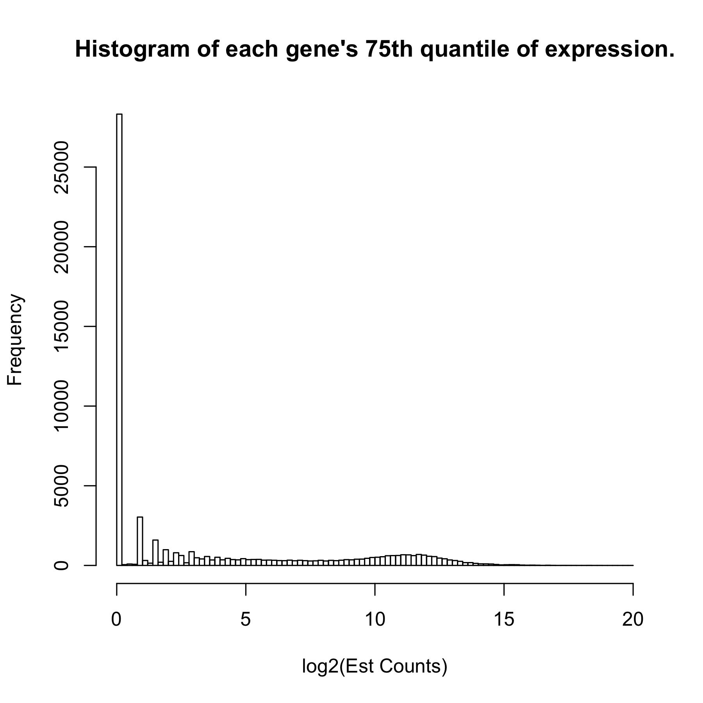
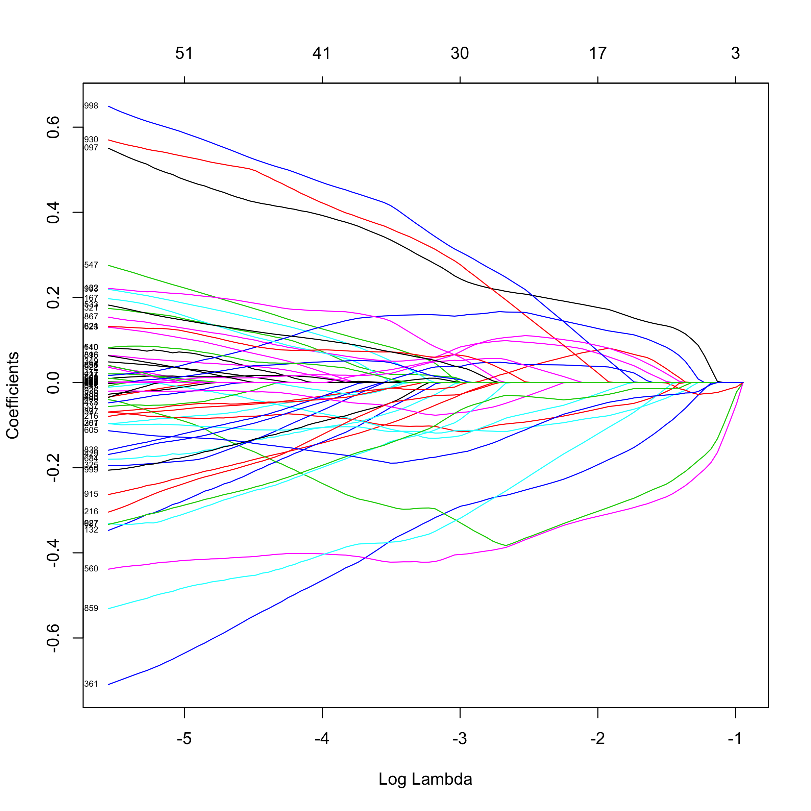
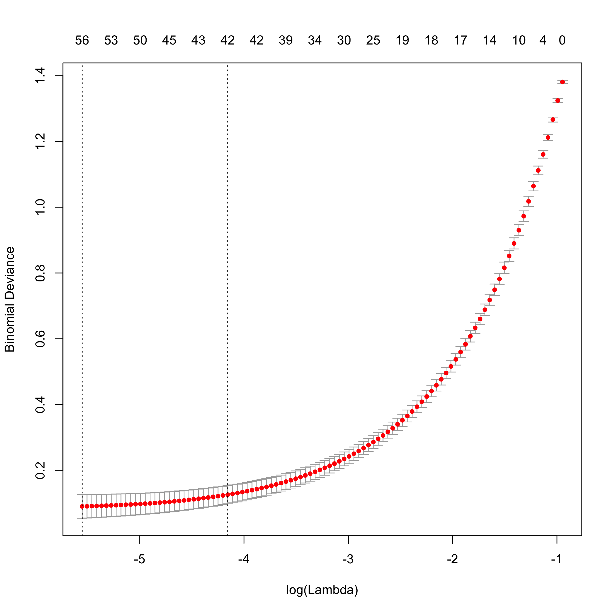
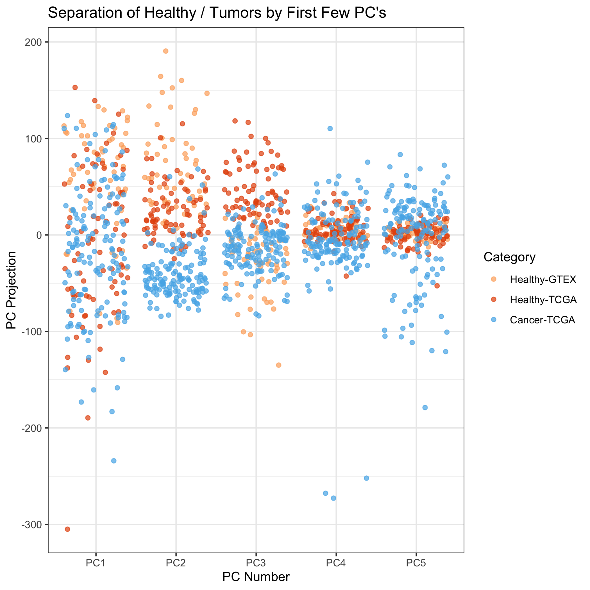
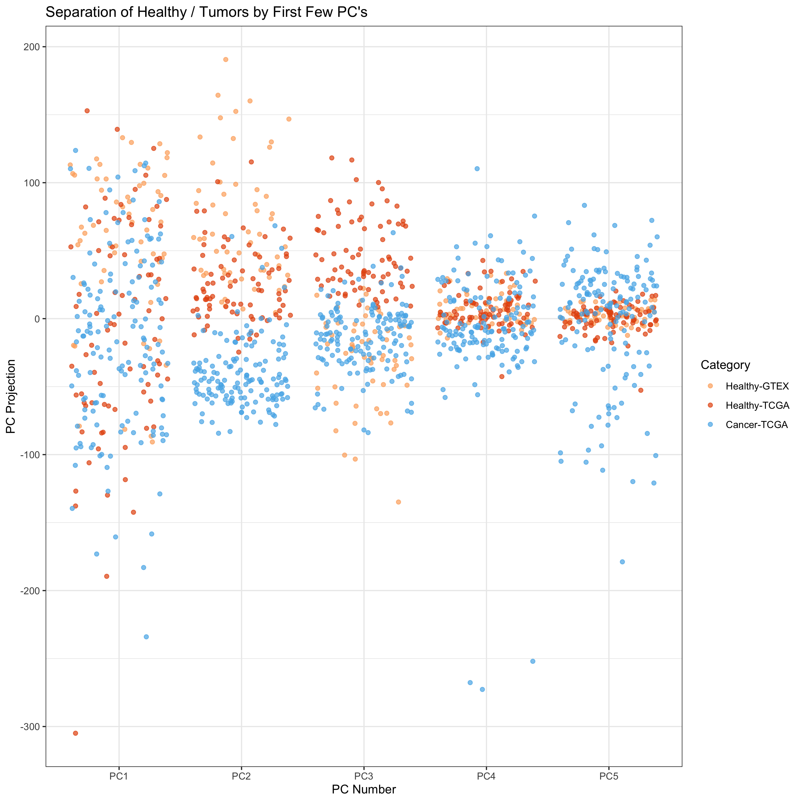
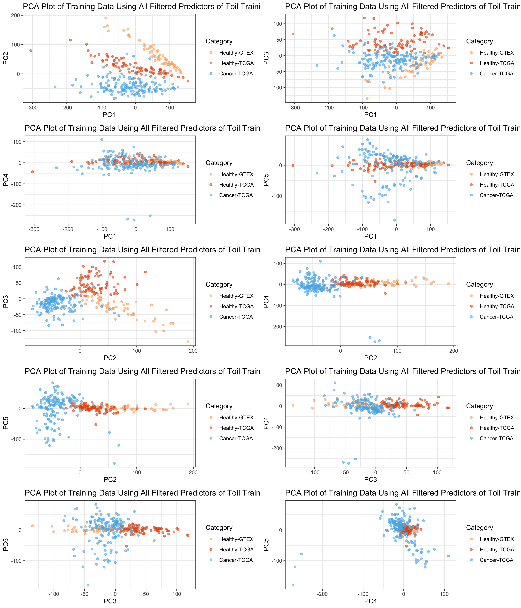
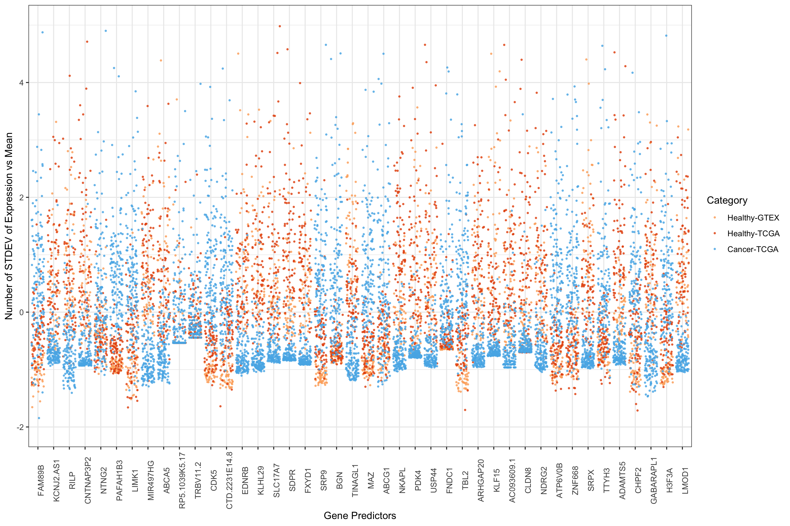
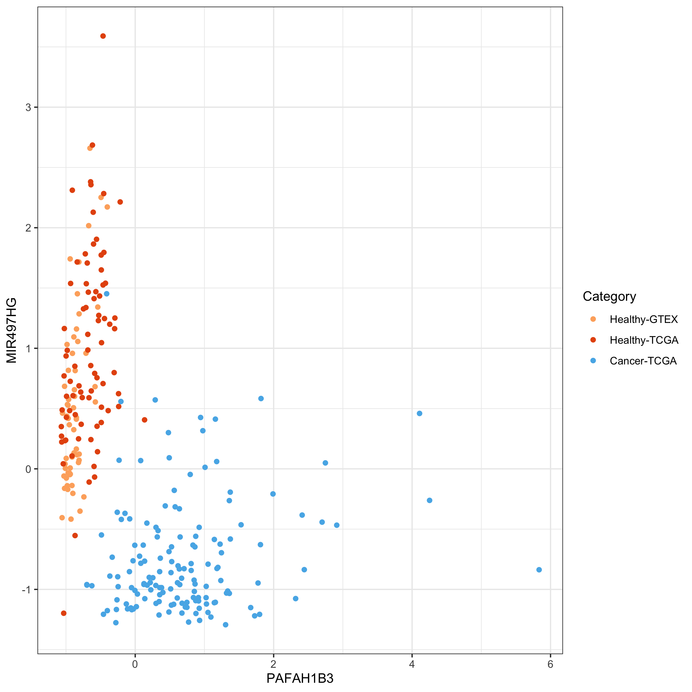
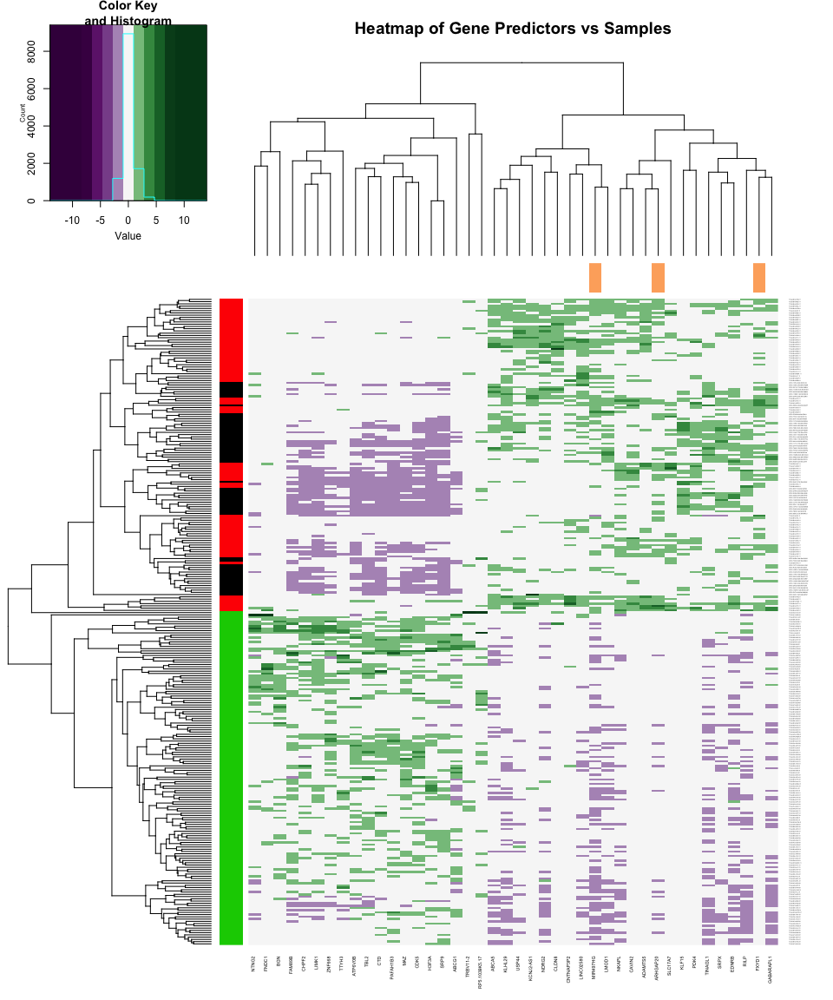
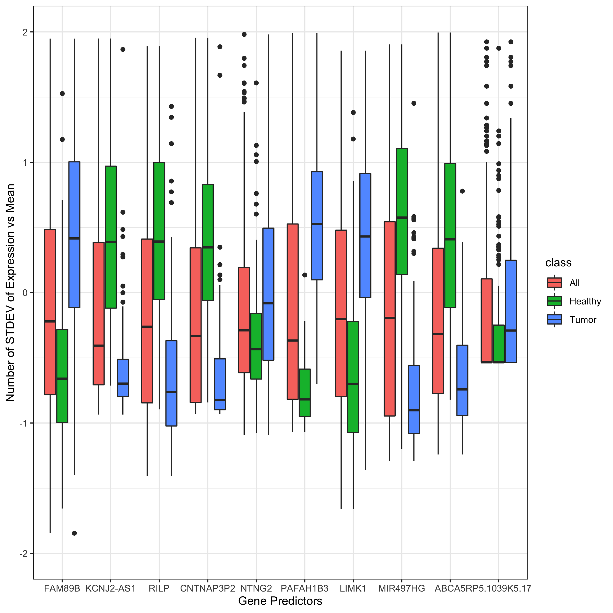

Breast Cancer Prediction
================
Michael Kesling
11/28/2019

Making Cancer Predictions on Breast RNA-Seq Samples
---------------------------------------------------

This particular document takes the Toil-normalized TCGA and GTEx breast cancer samples and runs the logistic regression algorithm with lasso regularizer on them. Importantly, the only sample-to-sample normalization performed in quantile-quantile normalization relative to a single reference sample. No batch normalization is performed at this point, as it's the simplest scenario for test samples processed in the clinic, as they will appear one at a time, typically.

The data were downloaded from the UCSC server at: <https://xenabrowser.net/datapages/?cohort=TCGA%20TARGET%20GTEx&removeHub=https%3A%2F%2Fxena.treehouse.gi.ucsc.edu%3A443> There are 2 relevant *gene expression RNAseq* datasets there. *RSEM expected\_count (n=19,109)* which is used in this document, and *RSEM expected\_count (DESeq2 standardized) (n=19,039)* which was used in the *Toil\_Norm.Rmd* file.

The *markdown* and *html* versions of this document have some of the code masked for better readability. To view the full code, see the [.Rmd version](Toil_Analysis_ObjOrient.Rmd).

#### Setting Global Parameters

For this code to run, one must set the path, on one's machine to the *RSEM\_COUNTS\_FILE*, which contains the RNASeq data, and the *TOILGENEANNOT* file, which maps the Ensembl identifiers to the gene names.

``` r
knitr::opts_chunk$set(echo = TRUE)
# rmarkdown::render("./Toil_Analysis_ObjOrient.Rmd")
#######################
# SET GLOBAL PARAMETERS
#######################
RSEM_COUNTS_FILE <- "/Users/mjk/Desktop/Tresorit_iOS/projects/RNA-Seq/MachineLearningRNASeq/toilSubsetRSEM382.txt"
TOILGENEANNOT <- "~/RNA-Seq_2019/TOIL_Data/gencode.v23.annotation.gene.probemap"
BIOMART_GENE_ATTR_FILE <- "/Users/mjk/Desktop/Tresorit_iOS/projects/RNA-Seq/MachineLearningRNASeq/geneAttr.csv"
TCGA_ATTR_FILE <- "~/Desktop/Tresorit_iOS/projects/RNA-Seq/data/TCGA_Attributes_full.txt"
WANG_MATRIX <- "/Users/mjk/Desktop/Tresorit_iOS/projects/RNA-Seq/data/wangBreastFPKM398_Attrib.txt"
FULL_TOIL_DATA <- "/Users/mjk/RNA-Seq_2019/TOIL_Data/TcgaTargetGtex_gene_expected_count"
SEED <- 233992812
SEED2 <- 1011
```

#### Hidden Functions

There are 3 large functions that don't appear in the .md and .html versions of this document to improve readability: one pre-processes the Toil\_RSEM data, one performs TMM sample-to-sample scaling, just like the edgeR method, and the last centers and scales each gene relative to its mean and standard deviation.

### Define main data structure and create methods for it

``` r
## The DAT object will contain all the various data matrices, sample names,
## and lists as the original data matrix is pre-processed before the data
## analysis ensues.

createDAT <- function(M){                # M is a data.matrix
   # it's assumed that samples are rows and genes are columns already
   z <- list(M_orig = M,                     # assumed log2 scale
             M_nat = matrix(),          # M_orig on natural scale
             M_filt = matrix(),         # after gene filtering
             M_scaled = matrix(),       # as fraction of all counts
             M_norm = matrix(),         # after gene normalization
             ZEROGENES = list(),
             outcome = list(),
             RefSampleName = character(),
             RefSample = matrix(),
             RefSampleUnscaled = matrix(),
             M_filtScaled = matrix(),   # after TMM scaling
             seed = numeric())
   #names(z[[2]]) <- "Nat"
   class(z) <- "DAT"
   return(z)
}

##########
# pick the most representative sample, calling it RefSample
##########
pickRefSample <- function(x) UseMethod("pickRefSample", x)
pickRefSample.DAT <- function(x, logged=FALSE){  # X is matrix with samples as rows
                   # representative reference sample selected via edgeR specs
                   # this script assumes data are on natural scale.
   # Xnat <- if(logged==TRUE) ((2^X)-1) else X  # put in natural scale
   N <- apply(x$M_filt, 1, sum)
   scaledX <- apply(x$M_filt, 2, function(x) x / N)
   thirdQuartiles <- apply(scaledX, 1, function(x) quantile(x)[4])
   med <- median(thirdQuartiles)
   refSampleName <- names(sort(abs(thirdQuartiles - med))[1])
   return(list(refSampleName, scaledX))
}

##########
# transform log2 data to natural scale
natural <- function(x) UseMethod("natural", x)
natural.DAT <- function(x){
   x$M_nat <- (2^x$M_orig) - 1
}

############
# filter Genes
filterGenes <- function(x) UseMethod("filterGenes", x)
filterGenes.DAT <- function(x, cutoff=0.2){ # filters calculated in log2 scale
                                       # but applied to data in natural scale
   ZEROEXPGENES <- which(apply(x[[1]], 2, function(x) quantile(x)[4]) < cutoff)
   filteredGenes <- x[[2]][, -ZEROEXPGENES]  
   return(list(ZEROEXPGENES, filteredGenes))
}

###########
# Add Zero Genes (to test set from training Zero list)
addZeroGenes <- function(x, ZERO){    # used when training-ZERO applied to 
   x[[6]] <- ZERO                     # test set
} 
```

MAIN
----

The RSEM-Counts file originated as the full set of GTEX and TCGA breast samples, both healthy and tumors, which numbered over 1200. I wanted an equal number of tumor and healthy samples in my training and test set, as it gave me the best chance at seeing how well my predictor performed. Further, some samples had been found by the Sloan-Kettering group to be of low quality, and these were filtered out. These steps were performed by another script (Toil\_RSEM.Rmd). Our starting dataframe here, is therefore called *toilSubset*, and has 387 samples.

``` r
# just read already-subsetted dataframe
toilSubset <- read.table(RSEM_COUNTS_FILE, sep="\t", header=TRUE)
rownames(toilSubset) <- toilSubset$sample
```

### RSEM-Counts Dataframe Cleanup

I'm going to add the gene name to the Ensembl ID to make it easier to figure out what genes we're looking at. Samples were also sorted in the dataframe so that healthy and tumors were separated, as subsequently were TCGA and GTEX.

``` r
toilSubset <- preProcess(toilSubset, TOILGENEANNOT)
```

### Create Test and Training Sets

Up to this point, all we've done is grabbed the Toil RSEM output data and re-formatted it. It's still in log2-format.

Next:
1. Randomly select samples to be in the training and test sets in a way that keeps the ratio of healthy/tumors at about 50/50
2. Filter out genes with very low or zero expression across the data set.
3. perform edgeR normalization with a reference sample to control for depth-of-sequencing effects. Use same reference for training and (future) test set
4. Center and scale each gene about its mean and std deviation, respectively.
5. Perform ML
6. Test the model on the test set.

``` r
toilSubsetWide <- t(toilSubset)                               # transpose matrix

outcome <- c(rep(0, 185), rep(1, 197))                  # 0 = healthy, 1 = tumor

# bind outcome variable on data frame for even, random partitioning
toilSubsetWide <- data.frame(cbind(toilSubsetWide, outcome))
set.seed(SEED)
idxTrain <- caTools::sample.split(toilSubsetWide$outcome, SplitRatio = 0.75)
# QA
sum(idxTrain)/length(idxTrain)             # 75% observations in training set OK
```

    ## [1] 0.7513089

We see that 75% of the samples ended up in the training set, as expected.

``` r
# create training and test predictor sets and outcome vectors:
toilTrain <- subset(toilSubsetWide, idxTrain==TRUE)
outcomeTrain <- subset(toilSubsetWide$outcome, idxTrain==TRUE)  # Is this used?

toilTest <- subset(toilSubsetWide, idxTrain==FALSE)
outcomeTest <- subset(toilSubsetWide$outcome, idxTrain==FALSE)

# remove outcome variable from predictor matrices:
toilTrain <- toilTrain %>% dplyr::select(-outcome)
toilTest <- toilTest %>% dplyr::select(-outcome)

# convert back to matrices:
toilTrain <- as.matrix(toilTrain)
toilTest <- as.matrix(toilTest)

# reclaim memory
rm(toilSubset); rm(toilSubsetWide)
```

Now create object starting with toilTrain data matrix

``` r
train <- createDAT(toilTrain)
train$M_nat <- natural(train)
train$outcome <- outcomeTrain
```

### 1. Removing genes whose expression is very close to zero.

We know that there are about 9103 genes that are never expressed (data not shown), but there are over 25000 genes whose 75th quantile-level expression is under 2^(0.2) - 1 = 0.14 counts. We really don't want to deal with those genes in selecting a reference sample, etc.

``` r
hist(apply(toilTrain, 2, function(x) quantile(x)[4]), breaks=100, main="Histogram of each gene's 75th quantile of expression.", xlab="log2(Est Counts)")
```

 Another attempt at filtering genes whose log2(Est Counts) was less than 5 gave very unstable results at the sample-to-sample scaling factor step that corrects for unequal depth-of-sequencing between samples (not shown here). The exact reason for this hasn't been pursued at this point. One possibility is that samples whose depth-of-sequencing is low may have most of their genes absent for the sample-to-sample adjustment step.

``` r
tmp <- filterGenes(train)
train$ZEROGENES <- tmp[[1]]; train$M_filt <- tmp[[2]]
```

### 2. Sample-to-Sample Scaling

I'm using the TMM algorithm to perform sample-to-sample scaling, just as what is done in edgeR. First, one picks a reference sample (whose depth-of-sequencing is close to the median), then one scales all other samples relative to it, using weighted Trimmed Mean (TMM).

``` r
tmp <- pickRefSample(train)
train$M_scaled <- tmp[[2]]; train$RefSampleName <- tmp[[1]]
train$M_filtScaled <- weightedTrimmedMean(train)
```

### 3. Gene-level Normalization

When performing lasso regularization, it's important that the each gene is on the same scale as all other genes. Otherwise, highly expressed genes will influence the algorithm more than other genes. And with differential expression, we're not interested in the absolute expression level in any case. So here, we subtract each gene's mean and divide by the gene's standard deviation so that each gene is standard-normalized.

``` r
train$M_norm <- normalizeGenes(train$M_filtScaled, TRUE, FALSE)
```

#### train$M\_norm is what we'll perform our machine learning on.

### Logistic Regression with Lasso Regularizer on Toil Data

I'd like to compare the performance on this breast cancer dataset in the absence of batch normalization (ComBat). This helps rule out any bias the batch normalization may have had on improving the previous prediction results, which were much better than I'd expected.

INSERT EQUATION HERE

``` r
set.seed(SEED2)
fitToil.lasso <- glmnet(train$M_norm, train$outcome, family="binomial",
                           alpha = 1)
plot(fitToil.lasso, xvar="lambda", label=TRUE)
```

 Here, we see which genes have the strongest effect on the logistic regression model as the value of lambda increases from left to right. It appears that perhaps with a few dozen genes, we might have a well-performing model.

### Cross-Validating the Model to Pick the Smallest, Well-Performing Model

I'm going to look at cross-validating the model in order to pick the simplest one that performs well.

``` r
set.seed(SEED2)                                # need same seed as previous step
cv.Toil.lasso <- cv.glmnet(train$M_norm, train$outcome
                           , family="binomial", alpha=1) 
plot(cv.Toil.lasso)
```

 We can see that 42 predictors gives us a model whose deviance is within 1-standard deviation from the minimum.

### Store the Model in a Custom Structure

``` r
coefsToil <- coef(cv.Toil.lasso, s=cv.Toil.lasso$lambda.1se)

##########
# Store model in a structure:
storeMODEL <- function(coefsToil, train=train){
   idx <- which(coefsToil[,1] != 0)
   predictorFullNames <- rownames(coefsToil)[idx]
   colIDs <- which(colnames(train$M_norm) %in% 
                   predictorFullNames) 
   tmpDF <- train$M_norm[,colIDs]
   predGeneNames <- gsub("\\.ENSG.*","", predictorFullNames)
   colnames(tmpDF) <- predGeneNames[2:length(predGeneNames)]

   z <- list(
      fullModel = coefsToil,
      predFullNames = predictorFullNames,
      predCoefs = coefsToil[idx],
      predGeneNames = predGeneNames, 
      predEntrezID = gsub(".*.(ENSG.*)\\..*$","\\1", predictorFullNames),
      modelDF = tmpDF                                 # lacks (Intercept)
   )
   
   class(z) <- "MODEL"
   return(z)
}

LogRegModel <- storeMODEL(coefsToil, train)
```

Working with Test Data
----------------------

### Filter and Scale Test Data.

#### Relying on Training Data for Zero-Filtering and Scaling of Test Data

In order to see how well our model actually performs, we need to test it on test data that it hasn't seen before. First, we need to process the test data just as we did the training data, but completely separately, as this is the real-world case.

In data not shown here, I have found that sample-to-sample scaling performs well only when either
(i) it's done in the context of a large number of samples, which is a challenge for the real-world case where a single sample comes out of the clinic.
(ii) it's done relative to a single *reference sample* that was identified in the training set.

Here, I'm using case (ii) by normalizing each test sample individually against this reference sample. Towards the bottom of the document, I perform case (i) below in order to rule out any lingering bias derived from the fact that sample scaling is performed relative to a single training sample.

Furthermore, the process of filtering out genes with very-near-zero expression levels across all samples cannot be easily defined by a single clinical sample. Likewise, here, I'll use the "(near) zero-expressed genes" from the training set in order to perform gene-level filtering in the test set.

We start by entering the test data into a new instance of our **DAT** object.

``` r
test <- createDAT(toilTest)               # add matrix to DAT object
test$M_nat <- natural(test)                # transform from log2 to natural scale
test$outcome <- outcomeTest                  # add outcome variable
```

#### 1. Filter out genes from test set using those defined in the training set

``` r
                                               # transfer ZEROEXP to test object
test$M_filt <- test$M_nat[, -train$ZEROGENES]  # subtract off genes and return 
                                               # remainder to test object
```

#### 2. Sample-to-Sample Scaling of Test Set

We're going to use the Reference Sample data from the training set here

``` r
tmp <- pickRefSample(test)                  # only doing this to get scaled data
test$M_scaled <- tmp[[2]]; 
test$RefSampleName <- train$RefSampleName      # RefSampleName from training set
test$M_filtScaled <- weightedTrimmedMean(test, train, 1)     # filtered & scaled
```

#### 3. Gene-level Normalization on Test Set

``` r
test$M_norm <- normalizeGenes(test$M_filtScaled, TRUE, FALSE)
```

#### 4. Remove Non-Predictor Genes from Filtered Test Data

We're just keeping the 42 predictors from toilTestFiltScaled

``` r
colIDs <- which(colnames(test$M_norm) %in% 
                   LogRegModel$predFullNames[2:length(LogRegModel$predFullNames)])
toilTestFiltScal42 <- test$M_norm[,colIDs]                    # SEPARATE FROM OBJECT
```

#### 5. Test Set Sensitivity and Specificity

First we add an intercept column to test predictor variables, then we perform matrix multiplication with the predictor coefficients and then look at the prediction performance in the confusion matrix.

``` r
toilTestFiltScal42 <- cbind(rep(1,nrow(toilTestFiltScal42)), toilTestFiltScal42)

testPredictions_toil <- ifelse(toilTestFiltScal42 %*% LogRegModel$predCoefs > 0, 1, 0)
table(test$outcome, testPredictions_toil)
```

    ##    testPredictions_toil
    ##      0  1
    ##   0 46  0
    ##   1  0 49

I'm at 100% sensitivity and 100% specificity.

Why does the model perform so well?
-----------------------------------

I expected that the logistic regression with a lasso regularizer would perform okay, but not nearly as well as it did. The question is why? Is it simply that tumors have a sufficiently different genetic programming that they can easily be partitioned from healthy samples?

### Principal Components

To explore this idea, I'm going to look at the first 2 principal components of the overall variability of the data across all genes that weren't filtered out for having near-zero expression, and plot those out, coloring each sample according to whether or not it's healthy or a tumor.

``` r
plotPCs <- function(dfComponents, compIdx){
   PC_plot <- data.frame(x=dfComponents[,compIdx[1]], y = dfComponents[,compIdx[2]], col=prognosis)
   colors3pal <- c("#FDAE6B", "#E6550D",  "#56B4E9")
   obj <<- ggplot(PC_plot) + 
      geom_point(aes(x=x, y=y, color=as.factor(col)), alpha=0.6) + 
      ggtitle("PCA Plot of Training Data Using All Filtered Predictors of Toil Training Data") +
      xlab(paste0("PC",compIdx[1])) + ylab(paste0("PC", compIdx[2])) +
      theme_bw() + 
      scale_color_manual(name="Category",
                         breaks = c("1", "2", "3"),
                         values = c(colors3pal[1], colors3pal[2], colors3pal[3]),
                         labels = c("Healthy-GTEX", "Healthy-TCGA", "Cancer-TCGA"));
   return(obj)
}


prognosis <- c(rep(1, 59), rep(2,80), rep(3, 148))       # 1/2 = healthy, 3 = cancer
PCs <- prcomp(train$M_norm)                               # (data already scaled)
nComp <- 2
dfComponents <- predict(PCs, newdata=train$M_norm)[,1:nComp]

PC_plot <- data.frame(x=dfComponents[,1], y = dfComponents[,2], col=prognosis)
colors3pal <- c("#FDAE6B", "#E6550D",  "#56B4E9")

ggplot(PC_plot) + 
   geom_point(aes(x=x, y=y, color=as.factor(col))) + 
   ggtitle("PCA Plot of Training Data Using All Filtered Predictors of Toil Training Data") +
   xlab("PC1") + ylab("PC2") + theme_bw() +
   scale_color_manual(name="Category",
                      breaks = c("1", "2", "3"),
                      values = c(colors3pal[1], colors3pal[2], colors3pal[3]),
                      labels = c("Healthy-GTEX", "Healthy-TCGA", "Cancer-TCGA"))
```



We can see that even only employing the first 2 Principal Components, that:
(1) there is very good separation between the tumors in the training set (blue) and the healthy samples.

1.  We also see that the 2nd PC separates the outcome variable much better than the 1st PC.

2.  We also notice that the healthy samples from TCGA (red) and the healthy samples from GTEX (orange) are also separated out. This has to do with how there's a batch effect between TCGA and GTEX and which was addressed by the Sloan Kettering group in the [Wang, et. al. Combat paper](https://www.nature.com/articles/sdata201861). Earlier work of mine on the Wang batch-corrected version of this dataset also performed well with the logistic regression with lasso model (not shown here). However, I have focused on the pre-batch corrected version here, because batch correcting would probably be difficult to implement for clinical samples.

In light of the PC plot, it perhaps should not be surprising that an off-the-shelf algorithm would perform so well, as the variability in transcription is quite significant between healthy samples and tumors. It might be that after tissue type, healthy/tumor may impact variability in transcription more than any other factor.

### Top 5 Principal Components

I wanted to see if any other of the top PCs were good at separating healthy samples from tumors.

``` r
plotPCs_1d <- function(dfComponents){
   PC_plot <- data.frame(x=dfComponents$Var2, y = dfComponents$value, col=prognosis)
   colors3pal <- c("#FDAE6B", "#E6550D",  "#56B4E9")
   obj <- ggplot(PC_plot) + 
      geom_jitter(aes(x=x, y=y, color=as.factor(col)), alpha=0.7) + 
      ggtitle("Separation of Healthy / Tumors by First Few PC's") +
      xlab("PC Number") + ylab("PC Projection") +
      theme_bw() +
      scale_color_manual(name="Category",
                         breaks = c("1", "2", "3"),
                         values = c(colors3pal[1], colors3pal[2], colors3pal[3]),
                         labels = c("Healthy-GTEX", "Healthy-TCGA", "Cancer-TCGA"));
   return(obj)
}


nComp <- 5
dfComponents <- predict(PCs, newdata=train$M_norm)[,1:nComp]

dfCompMelt <- melt(dfComponents)
plotPCs_1d(dfCompMelt)
```

 We see that the 2nd and 3rd PCs give pretty good outcome variable separation. Let's look at pairwise PC plots.

``` r
ls <- list()
pairs <- combn(5,2)
for(idx in 1:dim(pairs)[2]){
   pair <- pairs[,idx]
   ls[[idx]] <- plotPCs(dfComponents, pair)                  # Add a MAIN TITLE and remove other titles
}
grid.arrange(ls[[1]], ls[[2]], ls[[3]], ls[[4]], ls[[5]], ls[[6]],
             ls[[7]], ls[[8]], ls[[9]], ls[[10]], ncol=2)
```

 It appears that PC2 and PC2 together perhaps give the best separation.

### What Genes are the Model Predictors?

I'm going to pull the definition and symbols for the 42 predictors in the model from *biomaRt* to see what genes the predictors are. The following table is sorted from the gene predictor that has the coefficient with the greatest (absolute) magnitude to the predictor with the least magnitude.

``` r
# get predictor gene names and Ensembl IDs while removing Intercept term:
ensembl_geneID <- LogRegModel$predEntrezID[2:length(LogRegModel$predEntrezID)]
predictorGeneNames <- LogRegModel$predGeneNames[2:length(LogRegModel$predGeneNames)]
modelCoefs <- LogRegModel$predCoefs[2:length(LogRegModel$predCoefs)]
ensembl_coefs <- data.frame(ensembl_geneID, modelCoefs, abs(modelCoefs)) 

##############
# we'll grab biomaRt data for these genes.  
# The following block of code is ONLY
# RUN ONCE, and the results are stored in a file.
if(FALSE){                                         # rm this line the first time
listMarts()
ensembl=useMart("ensembl")
ensembl = useDataset("hsapiens_gene_ensembl",mart=ensembl)

geneID_Name_Description <- getBM(attributes=c("ensembl_gene_id", "hgnc_id", 
                                              "hgnc_symbol", "description"),
   values=geneNames,
   mart=ensembl)
write.csv(geneID_Name_Description, file=BIOMART_GENE_ATTR_FILE)
}
#############

Ensmbl_HGNC_SYM_DESC <- read.csv(BIOMART_GENE_ATTR_FILE, header=TRUE, stringsAsFactors = F)
predGeneAnnot <- Ensmbl_HGNC_SYM_DESC %>% dplyr::filter(ensembl_gene_id %in% ensembl_geneID) 
# join with ensembl-coeff df-abs coeff
rm(Ensmbl_HGNC_SYM_DESC)
joinedAnnot <- inner_join(predGeneAnnot, ensembl_coefs, by=c("ensembl_gene_id" = "ensembl_geneID"))
```

    ## Warning: Column `ensembl_gene_id`/`ensembl_geneID` joining character vector
    ## and factor, coercing into character vector

``` r
# arrange by order to desc abs coeff and print select columns:
joinedAnnot$description <- gsub(" \\[.*$","",joinedAnnot$description) # %>% substr(1,40)
modelAnnot <- as_tibble(joinedAnnot %>% arrange(desc(abs.modelCoefs.)) %>% dplyr::select("ensembl_gene_id", 
                                                          "hgnc_symbol", "modelCoefs",
                                                          "description"))
modelAnnot$hgnc_symbol[15] <- "RP5.1039K5.17"; modelAnnot$hgnc_symbol[40] <- "CTD"
print(modelAnnot, n=42)
```

    ## # A tibble: 42 x 4
    ##    ensembl_gene_id hgnc_symbol  modelCoefs description                     
    ##    <chr>           <chr>             <dbl> <chr>                           
    ##  1 ENSG00000267532 MIR497HG       -0.490   mir-497-195 cluster host gene   
    ##  2 ENSG00000182492 BGN             0.489   biglycan                        
    ##  3 ENSG00000143742 SRP9            0.445   signal recognition particle 9   
    ##  4 ENSG00000137727 ARHGAP20       -0.421   Rho GTPase activating protein 20
    ##  5 ENSG00000079462 PAFAH1B3        0.404   platelet activating factor acet…
    ##  6 ENSG00000266964 FXYD1          -0.401   FXYD domain containing ion tran…
    ##  7 ENSG00000165795 NDRG2          -0.219   NDRG family member 2            
    ##  8 ENSG00000119771 KLHL29         -0.213   kelch like family member 29     
    ##  9 ENSG00000101955 SRPX           -0.212   sushi repeat containing protein…
    ## 10 ENSG00000106638 TBL2            0.171   transducin beta like 2          
    ## 11 ENSG00000167705 RILP           -0.161   Rab interacting lysosomal prote…
    ## 12 ENSG00000163431 LMOD1          -0.156   leiomodin 1                     
    ## 13 ENSG00000267365 KCNJ2-AS1      -0.154   KCNJ2 antisense RNA 1           
    ## 14 ENSG00000230587 LINC02580      -0.147   long intergenic non-protein cod…
    ## 15 ENSG00000272582 RP5.1039K5.…    0.140   novel transcript, antisense to …
    ## 16 ENSG00000241657 TRBV11-2        0.124   T cell receptor beta variable 1…
    ## 17 ENSG00000103495 MAZ             0.117   MYC associated zinc finger prot…
    ## 18 ENSG00000276386 CNTNAP3P2      -0.116   CNTNAP3 pseudogene 2            
    ## 19 ENSG00000142910 TINAGL1        -0.109   tubulointerstitial nephritis an…
    ## 20 ENSG00000033100 CHPF2           0.106   chondroitin polymerizing factor…
    ## 21 ENSG00000189134 NKAPL          -0.106   NFKB activating protein like    
    ## 22 ENSG00000106683 LIMK1           0.0913  LIM domain kinase 1             
    ## 23 ENSG00000104888 SLC17A7        -0.0871  solute carrier family 17 member…
    ## 24 ENSG00000164694 FNDC1           0.0808  fibronectin type III domain con…
    ## 25 ENSG00000164885 CDK5            0.0774  cyclin dependent kinase 5       
    ## 26 ENSG00000167394 ZNF668          0.0760  zinc finger protein 668         
    ## 27 ENSG00000136160 EDNRB          -0.0751  endothelin receptor type B      
    ## 28 ENSG00000168497 CAVIN2         -0.0622  caveolae associated protein 2   
    ## 29 ENSG00000136014 USP44          -0.0614  ubiquitin specific peptidase 44 
    ## 30 ENSG00000156284 CLDN8          -0.0493  claudin 8                       
    ## 31 ENSG00000136295 TTYH3           0.0459  tweety family member 3          
    ## 32 ENSG00000163041 H3F3A           0.0451  H3 histone family member 3A     
    ## 33 ENSG00000139112 GABARAPL1      -0.0440  GABA type A receptor associated…
    ## 34 ENSG00000154265 ABCA5          -0.0428  ATP binding cassette subfamily …
    ## 35 ENSG00000160179 ABCG1           0.0410  ATP binding cassette subfamily …
    ## 36 ENSG00000004799 PDK4           -0.0392  pyruvate dehydrogenase kinase 4 
    ## 37 ENSG00000163884 KLF15          -0.0298  Kruppel like factor 15          
    ## 38 ENSG00000196358 NTNG2           0.0228  netrin G2                       
    ## 39 ENSG00000117410 ATP6V0B         0.0173  ATPase H+ transporting V0 subun…
    ## 40 ENSG00000269243 CTD             0.0145  novel transcript, antisense RAB…
    ## 41 ENSG00000154736 ADAMTS5        -0.0113  ADAM metallopeptidase with thro…
    ## 42 ENSG00000176973 FAM89B          0.00695 family with sequence similarity…

Of the 42 predictors, 3 are anti-sense RNAs, 1 pseudogene: (CNTNAP3 pseudogene 2), 1 non-protein coding gene, 1 micro RNA, and the others being protein-coding genes.

### Expression of the 42 Predictors Across Healthy Samples and Tumors

``` r
require(reshape2)
trainNorm42predictors <- train$M_norm[,colIDs]
#print(cbind(geneNames, colnames(trainNorm42predictors)))
# need to shorten names and print those gene names vertically
colnames(trainNorm42predictors) <- predictorGeneNames  # simplify predictor names   
colors3pal <- c("#FDAE6B", "#E6550D",  "#56B4E9")
predict42scaledMelt <- melt(trainNorm42predictors)
predict42scaledMelt <- cbind(predict42scaledMelt , colr=as.factor(rep(prognosis, 42)))
ggplot(predict42scaledMelt, aes(x=Var2, y=value)) + #, colour=colr)) +
   geom_jitter(aes(colour=colr), size=0.5, alpha=0.75) +
   theme_bw() +
   ylim(-2,5) + theme(axis.text.x=element_text(angle=90)) +
   xlab("Gene Predictors") + ylab("Number of STDEV of Expression vs Mean") +
   scale_color_manual(name="Category",
                         breaks = c("1", "2", "3"),
                         values = c(colors3pal[1], colors3pal[2], colors3pal[3]),
                         labels = c("Healthy-GTEX", "Healthy-TCGA", "Cancer-TCGA"))
```

    ## Warning: Removed 12 rows containing missing values (geom_point).

 We can see that the majority of these gene predictors have either a higher level of expression in tumors (positive coefficient) or a higher level of expression in healthy tissues (negative coefficient). 2 genes seem to disciminate poorly--at least on their own. I thought they might all have coefficients very close to zero. However, they are mid-to-high range (RP5.1039K5.17 = 0.140 and TRBV11-2 = 0.124). Beyond this basic point, I haven't pursued this.

### Using 2 genes to separate out healthy and tumor samples

I'm going to use MIR497HG and PAFAH1B3 to create a 2D plot of the samples colored by their healthy / tumor status. I'm choosing these two because they have large coefficients in the model and because they are inversely correlated with one another.

``` r
df03 <- LogRegModel$modelDF[,c("PAFAH1B3", "MIR497HG")]    # BGN
df03 <- data.frame(cbind(df03, col=as.factor(prognosis)))
ggplot(df03) +
   geom_point(aes(x=PAFAH1B3,y=MIR497HG,colour=as.factor(col))) +
   theme_bw() +
    #ylim(-2,5) + #theme_bw() + # (axis.text.x=element_text(angle=90)) +
   scale_color_manual(name="Category",
                         breaks = c("1", "2", "3"),
                         values = c(colors3pal[1], colors3pal[2], colors3pal[3]),
                         labels = c("Healthy-GTEX", "Healthy-TCGA", "Cancer-TCGA"))
```

 We can see that 2 genes with coefficients that are large, but of opposite sign, nearly create a separating hyperplane between the tumors and the healthy samples. This recapitulates the earlier idea of how the gene expression programming of tumors have greatly diverged from that of healthy samples that we saw with the Principal Components plots.

### Heatmap

``` r
samples <- factor(prognosis)
sampleCols <- palette(colors3pal)[samples]           # set color of sample class

# for the gene-column to be color-coded by the value of its coefficient,
# the coefficients must be placed in the same order they appear in in the 
# LogRegModel$modelDF dataframe.  modelAnnot$modelCoefs are where the coefficients
# reside initially.

geneCoefs <- data.frame(modelAnnot$modelCoefs)
rownames(geneCoefs) <- modelAnnot$hgnc_symbol

# QA: columns not matching
# colnames(LogRegModel$modelDF)[!(colnames(LogRegModel$modelDF) %in% modelAnnot$hgnc_symbol)]
# modelAnnot$hgnc_symbol[!(modelAnnot$hgnc_symbol %in% colnames(LogRegModel$modelDF))]

# manually cleaning these up -- later the gene names should be derived from a common source
colnames(LogRegModel$modelDF)[2] <- gsub("\\.", "-", colnames(LogRegModel$modelDF)[2])
colnames(LogRegModel$modelDF)[11] <- gsub("\\.", "-", colnames(LogRegModel$modelDF)[11])
colnames(LogRegModel$modelDF)[13] <- "CTD"
colnames(LogRegModel$modelDF)[17] <- "CAVIN2"
colnames(LogRegModel$modelDF)[31] <- "LINC02580"

geneCoefsMatrixOrder <- geneCoefs[colnames(LogRegModel$modelDF),]    #reordering
range01 <- function(x)(x-min(x))/diff(range(x))
geneCols <- palette(brewer.pal(11, "Spectral"))[cut(range01(geneCoefsMatrixOrder), breaks=11, labels=FALSE)]

hmcol <- colorRampPalette(c("#40004B", "#40004B", "#40004B", "#762A83", "#9970AB", 
  "#F7F7F7", "#5AAE61", "#1B7837", "#00441B", "#00441B", "#00441B"))
heatmap.2(as.matrix(LogRegModel$modelDF), col=hmcol, trace="none", cexRow = 0.15, cexCol = 0.5,  
          ColSideColors = geneCols, RowSideColors = sampleCols, main = "Heatmap of Gene Predictors vs Samples")
```

 The heatmap just provides another way at looking at the closeness of relationship between the different gene predictors and likewise between the different samples. The color-coding of the columns and rows has a bug in it at the moment.

Testing the Model Sensitivity on More RNASeq Samples
----------------------------------------------------

When the initial dataset of 382 samples were obtained from GTEX and TCGA, there were far more tumors available than healthy samples. All healthy samples were part of these 382 samples which were then split into 287 training samples and 95 test samples.

However, there remain many more RNA-Seq samples from TCGA that have not yet been used in this study. I'd like to see how the model performs on them, and since there are so many, I thought that I'd first break them into their stage of cancer (I - IV) and test them in those groups. Since all of these samples are tumors, we'll further be measuring the sensitivity of the model. But since there are no healthy samples, we'll be unable to measure the specificity.

Another point that I'll bring up is that in creating the set of 382 from an initial group of 398 samples, there was a filtering step where samples that had a low RNA quality score were eliminated from the set.

In the dataset we'll now look at, I'm not performing any filtering step.

The code is a bit extensive, partly because it hasn't been cleaned up with common functions. It's not shown in the .html nor .md versions of this file. It can be seen in the .Rmd version.

1. Process the 4 datasets (stageOne, stageTwo, stageThree, stageFour)
---------------------------------------------------------------------

I'll process these datasets the same way as I did above. I'm still using the ZEROGENES that were defined by the training data for gene filtering. And I'm still using the Reference Sample defined in the training set for calculating the sample-to-sample scaling factors. \#\#\#\# A function for processing dataframes and making predictions

``` r
filterScaleNormalizePredict <- function(df, REF_MEANS, REF_SDS,
                                        train, LogRegModel, useRef=0){
   # if useRef==0, then geneNormalization done within df
   # if useRef==1, then geneNormalization done with parameters from train 
   # (REF_MEANS & REF_SDS)
   
   # 1b. convert to natural scale:
   df$M_nat <- natural(df)
   
   # 2. subtract out ZEROEXPGENES, as defined in training set
   df$M_filt <- df$M_nat[,-train$ZEROGENES]

   # 2b. represent intensities as fraction of all signals in each sample
   N <- apply(df$M_filt, 1, sum)
   df$M_scaled <- apply(df$M_filt, 2, function(x) x / N)              
   
   df$RefSampleName <- train$RefSampleName             # transfer from train set
   
   # 3. Calc scaling factor, relative to REFSAMPLE (in train) and scale data
   df$M_filtScaled <- data.frame(weightedTrimmedMean(df, train, TRUE))         
   
   # 4. Remove Non-Predictor Genes from Filtered Test Data, REF_MEANS, REF_SDS
   coefsFullNames <- LogRegModel$predFullNames[2:length(LogRegModel$predFullNames)]
   dfFiltScal42 <- df$M_filtScaled %>% dplyr::select(coefsFullNames)  

   # 5. scale each gene by its stdev and offset by its mean.  Add intercept
   if(useRef == 1){
      REF_MEANS_Predictors <- REF_MEANS[coefsFullNames]
      REF_SDS_Predictors <- REF_SDS[coefsFullNames]
      df$M_norm <- t(apply(dfFiltScal42, 1, function(x){
         (x - REF_MEANS_Predictors)/REF_SDS_Predictors}))}
   if(useRef == 0){                       
      SMP_MEANS <- apply(df$M_filtScaled, 2, mean)
      SMP_SDS <- apply(df$M_filtScaled, 2, sd)
      SMP_MEANS_Predictors <- SMP_MEANS[coefsFullNames]
      SMP_SDS_Predictors <- SMP_SDS[coefsFullNames]
      df$M_norm <- t(apply(dfFiltScal42, 1, function(x){
         (x - SMP_MEANS_Predictors)/SMP_SDS_Predictors}))}
   
   dfFiltScaledSD <- cbind(rep(1,nrow(df$M_norm)), df$M_norm)
   
   # 6. perform predictions
   testPredictions <- ifelse(dfFiltScaledSD %*% LogRegModel$predCoefs > 0, 1, 0)
   return(testPredictions)
}
```

Other TCGA Sample Sensitivity
-----------------------------

METHODOLOGY: Processing samples as above, with:
1. The filtering of genes defined by the training set

1.  The sample-to-sample scaling factors done relative to a Reference Sample defined in the training set

2.  The centering and scaling of each gene about its mean and standard deviation, respectively, within the dataset at hand.

#### Cancer Stage I Predictions

``` r
# stage 1 only   
stageOne <- createDAT(stageOneDF)
rm(stageOneDF)
stage1Preds <- filterScaleNormalizePredict(stageOne, NULL, NULL, 
                                           train, LogRegModel, FALSE)
table(stageOneOutcome, stage1Preds)
```

    ##                stage1Preds
    ## stageOneOutcome  0  1
    ##               1 58 89

#### Cancer Stage II Predictions

``` r
# stage 2 only   
stageTwo <- createDAT(stageTwoDF)
rm(stageTwoDF)
stage2Preds <- filterScaleNormalizePredict(stageTwo, NULL, NULL, 
                                           train, LogRegModel, FALSE)
table(stageTwoOutcome, stage2Preds)
```

    ##                stage2Preds
    ## stageTwoOutcome   0   1
    ##               1 188 326

#### Cancer Stage III Predictions

``` r
# stage 3 only   
stageThree <- createDAT(stageThreeDF)
rm(stageThreeDF)
stage3Preds <- filterScaleNormalizePredict(stageThree, NULL, NULL, 
                                           train, LogRegModel, FALSE)
table(stageThreeOutcome, stage3Preds)
```

    ##                  stage3Preds
    ## stageThreeOutcome   0   1
    ##                 1  67 136

#### Cancer Stage IV Predictions

``` r
# stage 4 only   
stageFour <- createDAT(stageFourDF)
rm(stageFourDF)
stage4Preds <- filterScaleNormalizePredict(stageFour, NULL, NULL, 
                                           train, LogRegModel, FALSE)
table(stageFourOutcome, stage4Preds)
```

    ##                 stage4Preds
    ## stageFourOutcome  0  1
    ##                1  8 12

We are getting terrible performance! Why?
-----------------------------------------

It has to do with the centering and scaling of each gene about its mean and standard deviation. Let's look at a figure, where for the first 10 gene predictors (out of a total of 42), we create a boxplot for
(a) all 287 training samples (red)
(b) just the 139 healthy training samples (green)
(c) just the 148 training tumors (blue)

``` r
numCols <-10
fullTrainPredictors <- LogRegModel$modelDF[,1:numCols]
healthyTrainPredictors <- fullTrainPredictors[1:139,]
tumorTrainPredictors <- fullTrainPredictors[140:287,]

trainPredictorsMelt <- cbind(rbind(melt(fullTrainPredictors), melt(healthyTrainPredictors), 
                             melt(tumorTrainPredictors)), class=c(rep("All", numCols*287), 
                                                            rep("Healthy", numCols*139), 
                                                            rep("Tumor", numCols*148)))
ggplot(trainPredictorsMelt, aes(x=Var2, y=value, fill=class)) + geom_boxplot() +
   ylim(-2,2) + theme_bw() +
   xlab("Gene Predictors") + ylab("Number of STDEV of Expression vs Mean")
```

    ## Warning: Removed 234 rows containing non-finite values (stat_boxplot).

 This figure illustrates the problem we're having quite well.
The gene-level centering and scaling we just performed on the Stage I-IV TCGA tumors was done based ONLY on the tumor data for each gene (blue boxplot). However, the training model was created based on the gene-level normalization from the red boxplot.

Looking at the gene on the left (FAM89B), we see that the mean across healthy sample and tumors is about -0.25, but amongst only the tumors, the mean is about +0.45. What that means is that there will be many samples whose FAM89B level lies between -0.25 and +0.45. In these cases, they would have had POSITIVE post-normalization values if all samples had been used, but NEGATIVE values if just the tumor samples had been used. In these cases, the data would have been working counter to the model due to erroneous gene-level centering and scaling.

Looking at the figure, we see that this issue is relevant for many genes.

If this is true, then it should be the case that if we take the mean and standard deviation for all 42 genes in the training set (red boxplot) and apply these numbers to the gene-level centering and scaling of the Stage I-IV Predictions, our model performance should greatly improve.

### Testing the Gene-Level Centering and Scaling Hypothesis

We start out by calculating the gene-level means and standard deviations for all genes *in the training set*. We then apply these values for the Stage I-IV test sets

``` r
REF_MEANS <- apply(train$M_filtScaled, 2, mean)
REF_SDS <- apply(train$M_filtScaled, 2, sd)
```

``` r
# stage 1 only   
#stageOne <- createDAT(stageOneDF)
stage1Preds <- filterScaleNormalizePredict(stageOne, REF_MEANS, REF_SDS, 
                                           train, LogRegModel, TRUE)
table(stageOneOutcome, stage1Preds)
```

    ##                stage1Preds
    ## stageOneOutcome   1
    ##               1 147

``` r
# stage 2 only   
#stageTwo <- createDAT(stageTwoDF)
stage2Preds <- filterScaleNormalizePredict(stageTwo, REF_MEANS, REF_SDS, 
                                           train, LogRegModel, TRUE)
table(stageTwoOutcome, stage2Preds)
```

    ##                stage2Preds
    ## stageTwoOutcome   0   1
    ##               1   5 509

``` r
# stage 3 only   
#stageThree <- createDAT(stageThreeDF)
stage3Preds <- filterScaleNormalizePredict(stageThree, REF_MEANS, REF_SDS, 
                                           train, LogRegModel, TRUE)
table(stageThreeOutcome, stage3Preds)
```

    ##                  stage3Preds
    ## stageThreeOutcome   0   1
    ##                 1   3 200

``` r
# stage 4 only   
#stageFour <- createDAT(stageFourDF)
stage4Preds <- filterScaleNormalizePredict(stageFour, REF_MEANS, REF_SDS, 
                                           train, LogRegModel, TRUE)
table(stageFourOutcome, stage4Preds)
```

    ##                 stage4Preds
    ## stageFourOutcome  1
    ##                1 20

We see that our results are greatly improved! The sensitivity is not proportional nor inversely proportional to the stage of the disease. Overall, we have a sensitivity of 99.1%!
