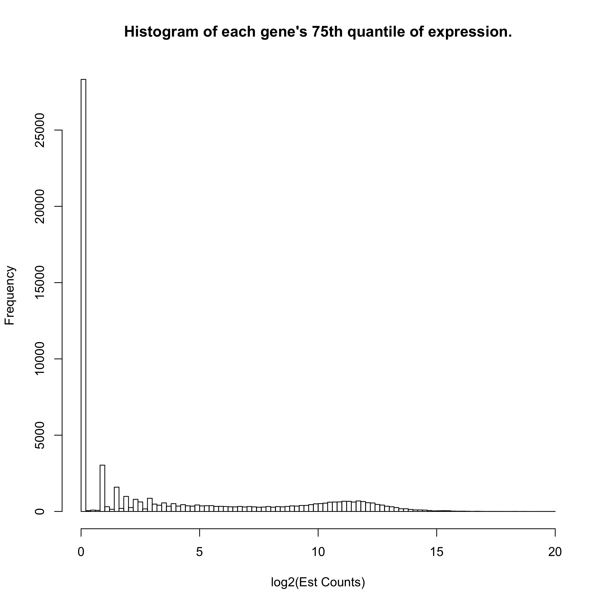

Breast Cancer Prediction
================
Michael Kesling
11/28/2019

Making Cancer Predictions on Breast RNA-Seq Samples
---------------------------------------------------

This particular document takes the Toil-normalized TCGA and GTEx breast cancer samples and runs the logistic regression algorithm with lasso regularizer on them. Importantly, the only sample-to-sample normalization performed in quantile-quantile normalization relative to a single reference sample. No batch normalization is performed at this point, as it's the simplest scenario for test samples processed in the clinic, as they will appear one at a time, typically.

The data were downloaded from the UCSC server at: <https://xenabrowser.net/datapages/?cohort=TCGA%20TARGET%20GTEx&removeHub=https%3A%2F%2Fxena.treehouse.gi.ucsc.edu%3A443> There are 2 relevant *gene expression RNAseq* datasets there. *RSEM expected\_count (n=60,500)* which is used in this document, and *RSEM expected\_count (DESeq2 standardized)* which was used in the *Toil\_Norm.Rmd* file.

The *markdown* and *html* versions of this document have some of the code masked for better readability. To view the full code, see the [.Rmd version](Toil_Analysis_ObjOrient.Rmd).

#### Setting Global Parameters

For this code to run, one must set the path, on one's machine to the *RSEM\_COUNTS\_FILE*, which contains the RNASeq data, and the *TOILGENEANNOT* file, which maps the Ensembl identifiers to the gene names.

``` r
knitr::opts_chunk$set(echo = TRUE)
#######################
# SET GLOBAL PARAMETERS
#######################
RSEM_COUNTS_FILE <- "/Users/mjk/Desktop/Tresorit_iOS/projects/RNA-Seq/MachineLearningRNASeq/toilSubsetRSEM382.txt"
TOILGENEANNOT <- "~/RNA-Seq_2019/TOIL_Data/gencode.v23.annotation.gene.probemap"
SEED <- 233992812
SEED2 <- 1011
```

#### Hidden Functions

There are 3 large functions that don't appear in the .md and .html versions of this document to improve readability: one pre-processes the Toil\_RSEM data, one performs TMM sample-to-sample scaling, just like the edgeR method, and the last centers and scales each gene relative to its mean and standard deviation.

### Define main data structure and create methods for it

``` r
## The DAT object will contain all the various data matrices, sample names,
## and lists as the original data matrix is pre-processed before the data
## analysis ensues.

createDAT <- function(M){                # M is a data.matrix
   # it's assumed that samples are rows and genes are columns already
   z <- list(M_orig <- M,                     # assumed log2 scale
             M_nat <- matrix(),          # M_orig on natural scale
             M_filt <- matrix(),         # after gene filtering
             M_scaled <- matrix(),       # as fraction of all counts
             M_norm <- matrix(),         # after gene normalization
             ZEROGENES <- list(),
             outcome <- list(),
             RefSampleName <- character(),
             RefSample <- matrix(),
             RefSampleUnscaled <- matrix(),
             M_filtScaled <- matrix(),   # after TMM scaling
             seed <- numeric())
   #names(z[[2]]) <- "Nat"
   class(z) <- "DAT"
   return(z)
}

##########
# pick the most representative sample, calling it RefSample
##########
pickRefSample <- function(x) UseMethod("pickRefSample", x)
pickRefSample.DAT <- function(x, logged=FALSE){  # X is matrix with samples as rows
                   # representative reference sample selected via edgeR specs
                   # this script assumes data are on natural scale.
   # Xnat <- if(logged==TRUE) ((2^X)-1) else X  # put in natural scale
   N <- apply(x[[3]], 1, sum)
   scaledX <- apply(x[[3]], 2, function(x) x / N)
   thirdQuartiles <- apply(scaledX, 1, function(x) quantile(x)[4])
   med <- median(thirdQuartiles)
   refSampleName <- names(sort(abs(thirdQuartiles - med))[1])
   return(list(refSampleName, scaledX))
}

##########
# transform log2 data to natural scale
natural <- function(x) UseMethod("natural", x)
natural.DAT <- function(x){
   x[[2]] <- (2^x[[1]]) - 1
}

############
# filter Genes
filterGenes <- function(x) UseMethod("filterGenes", x)
filterGenes.DAT <- function(x, cutoff=0.2){ # filters calculated in log2 scale
                                       # but applied to data in natural scale
   ZEROEXPGENES <- which(apply(x[[1]], 2, function(x) quantile(x)[4]) < cutoff)
   filteredGenes <- x[[2]][, -ZEROEXPGENES]  
   return(list(ZEROEXPGENES, filteredGenes))
}

###########
# Add Zero Genes (to test set from training Zero list)
addZeroGenes <- function(x, ZERO){    # used when training-ZERO applied to 
   x[[6]] <- ZERO                     # test set
} 
```

MAIN
----

The RSEM-Counts file originated as the full set of GTEX and TCGA breast samples, both healthy and tumors, which numbered over 1200. I wanted an equal number of tumor and healthy samples in my training and test set, as it gave me the best chance at seeing how well my predictor performed. Further, some samples had been found by the Sloan-Kettering group to be of low quality, and these were filtered out. These steps were performed by another script. Our starting dataframe here, is therefore called *toilSubset*, and has 387 samples.

``` r
# just read already-subsetted dataframe
toilSubset <- read.table(RSEM_COUNTS_FILE, sep="\t", header=TRUE)
rownames(toilSubset) <- toilSubset$sample
```

#### RSEM-Counts Dataframe Cleanup

I'm going to add the gene name to the Ensembl ID to make it easier to figure out what genes we're looking at. Samples were also sorted in the dataframe so that healthy and tumors were separated, as subsequently were TCGA and GTEX.

``` r
toilSubset <- preProcess(toilSubset, TOILGENEANNOT)
```

### Create Test and Training Sets

Up to this point, all we've done is grabbed the Toil RSEM output data and re-formatted it. It's still in log2-format.

Next: \#\#\#\#\#\#\#\# WRONG ORDER \#\#\#\#\#\#\#\#\# FIX this text. 1. Randomly select samples to be in the training and test sets in a way that keeps the ratio of healthy/tumors at about 50/50
2. perform edgeR normalization with a reference sample to control for depth-of-sequencing effects. Use same reference for training and (future) test set
3.filter out genes (independent if possible) 4. look at overall structure using t-SNE and PCA 5. Perform ML

``` r
toilSubsetWide <- t(toilSubset)         # transpose matrix

outcome <- c(rep(0, 185), rep(1, 197))  # 0 = healthy, 1 = tumor

# bind outcome variable on data frame for even, random partitioning
toilSubsetWide <- data.frame(cbind(toilSubsetWide, outcome))
set.seed(SEED)
idxTrain <- sample.split(toilSubsetWide$outcome, SplitRatio = 0.75)
# QA
sum(idxTrain)/length(idxTrain)  # 75% observations in training set OK
```

    ## [1] 0.7513089

``` r
# create training and test predictor sets and outcome vectors:
toilTrain <- subset(toilSubsetWide, idxTrain==TRUE)
outcomeTrain <- subset(toilSubsetWide$outcome, idxTrain==TRUE)
toilTest <- subset(toilSubsetWide, idxTrain==FALSE)
outcomeTest <- subset(toilSubsetWide$outcome, idxTrain==FALSE)

# remove outcome variable from predictor matrices:
toilTrain <- toilTrain %>% select(-outcome)
toilTest <- toilTest %>% select(-outcome)
# convert back to matrices:
toilTrain <- as.matrix(toilTrain)
toilTest <- as.matrix(toilTest)
```

Now create object on toilTrain data matrix

``` r
train <- createDAT(toilTrain)
train[[2]] <- natural(train)
train[[7]] <- outcomeTrain
```

#### 1. Removing genes whose expression is very close to zero.

We know that there are about 9103 genes that are never expressed (data not shown), but there are over 25000 genes whose 75th quantile-level expression is under 2^(0.2) - 1 = 0.14 counts. We really don't want to deal with those genes in selecting a reference sample, etc.

``` r
hist(apply(toilTrain, 2, function(x) quantile(x)[4]), breaks=100, main="Histogram of each gene's 75th quantile of expression.", xlab="log2(Est Counts)")
```

 Another attempt at filtering genes whose log2(Est Counts) was less than 5 gave very unstable results at the sample-to-sample scaling factor step that corrects for unequal depth-of-sequencing between samples (not shown here). The exact reason for this hasn't been pursued at this point. One possibility is that samples whose depth-of-sequencing is low may have most of their genes absent for the sample-to-sample adjustment step.

``` r
tmp <- filterGenes(train)
train[[6]] <- tmp[[1]]; train[[3]] <- tmp[[2]]
```

### 2. Sample-to-Sample Scaling

I'm using the TMM algorithm to perform sample-to-sample scaling, just as what is done in edgeR. First, one picks a reference sample (whose depth-of-sequencing is close to the median), then one scales all other samples relative to it, using weighted Trimmed Mean (TMM).

``` r
tmp <- pickRefSample(train)
train[[4]] <- tmp[[2]]; train[[8]] <- tmp[[1]]
train[[11]] <- weightedTrimmedMean(train)
```

### 3. Gene-level Normalization

When performing lasso regularization, it's important that the each gene is on the same scale as all other genes. Otherwise, highly expressed genes will influence the algorithm more than other genes. And with differential expression, we're not interested in the absolute expression level in any case. So here, we subtract each gene's mean and divide by the gene's standard deviation so that each gene is standard-normalized.

``` r
train[[5]] <- normalizeGenes(train[[11]], TRUE, FALSE)
```

#### train\[\[5\]\] is what we'll perform our machine learning on.

### Logistic Regression with Lasso Regularizer on Toil Data

I'd like to compare the performance on this breast cancer dataset in the absence of batch normalization (ComBat).

``` r
set.seed(SEED2)
fitToil.lasso <- glmnet(train[[5]], train[[7]], family="binomial",
                           alpha = 1)
plot(fitToil.lasso, xvar="lambda", label=TRUE)
```

 Here, we see which genes have the strongest effect on the logistic regression model as the value of lambda increases from left to right. It appears that perhaps with a few dozen genes, we might have a well-performing model.

### Cross-Validating the Model to Pick the Smallest, Well-Performing Model

I'm going to look at cross-validating the model in order to pick the simplest one that performs well.

``` r
set.seed(SEED2)
cv.Toil.lasso <- cv.glmnet(train[[5]], train[[7]], family="binomial", alpha=1) 
plot(cv.Toil.lasso)
```

 We can see that 42 predictors gives us a model whose deviance is within 1-standard deviation from the minimum.

### Filter and Scale Test Data. (A) Relying on Training Data for Zero-Filtering and Scaling of Test Data

In order to see how well our model actually performs, we need to test it on test data that it hasn't seen before. First, we need to process the test data just as we did the training data, but completely separately, as this is the real-world case.

In data not shown here, I have found that sample-to-sample scaling performs well only when either
(i) it's done in the context of a large number of samples, which is a challenge for the real-world case where a single sample comes out of the clinic.
(ii) it's done relative to a single *reference sample* that was identified in the training set.

Here, I'm using case (ii) by normalizing each test sample individually against this reference sample. Towards the bottom of the document, I perform case (i) below in order to rule out any lingering bias derived from the fact that sample scaling is performed relative to a single training sample.

Furthermore, the process of filtering out genes with very-near-zero expression levels across all samples cannot be easily defined by a single clinical sample. Likewise, here, I'll use the "(near) zero-expressed genes" from the training set in order to perform gene-level filtering in the test set.

We start by entering the test data into a new instance of our **DAT** object.

``` r
test <- createDAT(toilTest)               # add matrix to DAT object
test[[2]] <- natural(test)                # transform from log2 to natural scale
test[[7]] <- outcomeTest                  # add outcome variable
```
