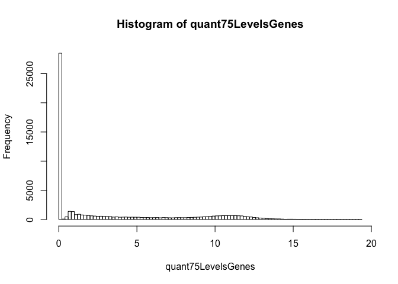
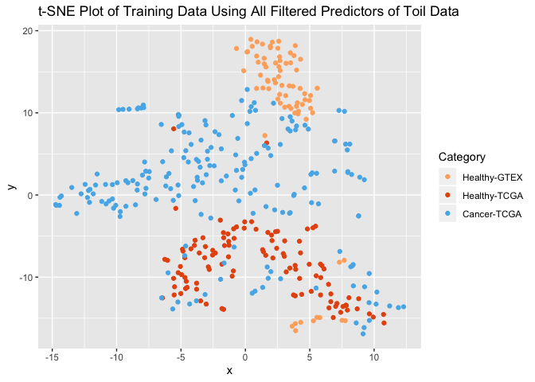

Toil\_Selection
================
Michael Kesling
9/22/2019

### Looking at Batch Effects

As I've had trouble with the samples that went through the ComBat Batch normalization, I've downloaded the input files of that process, but which have already gone through the Toil-standardization (RSEM\_expected\_counts with DESeq2-standardization).

Here, I'm going to subset the 8GB file with those files that are contained within the 398 samples I've been working with.

Then, I'm going to convert the Ensemble IDs to the more readable HUGO gene IDs.

``` r
require(dplyr)
```

    ## Loading required package: dplyr

    ## 
    ## Attaching package: 'dplyr'

    ## The following object is masked from 'package:matrixStats':
    ## 
    ##     count

    ## The following objects are masked from 'package:stats':
    ## 
    ##     filter, lag

    ## The following objects are masked from 'package:base':
    ## 
    ##     intersect, setdiff, setequal, union

``` r
require(magrittr)
```

    ## Loading required package: magrittr

``` r
wangMatrix <- read.table("/Users/mjk/Desktop/Tresorit_iOS/projects/RNA-Seq/data/wangBreastFPKM398_Attrib.txt", header=TRUE) # rownames okay now
wangSelectedSamples <- colnames(wangMatrix)
wangTCGAsamples <- wangSelectedSamples[grep("^TCGA", wangSelectedSamples)] %>%
   {gsub("\\.", "-", .)} %>% 
   {gsub("([TCGA]-[^-]+[-][^-]+[-][^-]+)[-].*", "\\1", .)} %>% 
   {gsub("[AB]$", "", .)}

wangGTEXsamples <- wangSelectedSamples[grep("^GTEX", wangSelectedSamples)] %>%
   {gsub("\\.", "-", .)}

wangSamples <- c(wangGTEXsamples, wangTCGAsamples)

#toilSampleNames <- system(" head -1 /Users/mjk/RNA-Seq_2019/TOIL_Data/TCGA-GTEx-TARGET-gene-exp-counts.deseq2-normalized.log2 | sed 's/\t/ /g'", intern = TRUE) %>% strsplit(" ")
toilSampleNames <- read.table("toilDataHeader", sep="\t")

#grep(wangSamples[1], toilSampleNames[[1]])
#apply(wangSamples, grep, toilSampleNames[[1]])
multiGrep <- function(var1, var2){
   return(grep(var1, var2))
}

wangSampleMapping <- sapply(wangSamples, multiGrep, var2=toilSampleNames[[1]])

# missing samples in TOIL set:
missingSamples <- wangSampleMapping[grep("integer", wangSampleMapping)]
```

Next, I read in the toil dataset (8GB+) and subset it by the Wang sample labels.

``` r
# code only run the first time:
#toilData <- read.table("/Users/mjk/RNA-Seq_2019/TOIL_Data/TCGA-GTEx-TARGET-gene-exp-counts.deseq2-normalized.log2", header=TRUE, stringsAsFactors = FALSE)

# QA:
#sum(gsub("-", "\\.", toilSampleNames[[1]]) %in% colnames(toilData))
#length(toilSampleNames[[1]])


#write.table(paste(unique(sort(unlist(wangSampleMapping[grep("integer", wangSampleMapping, invert=TRUE)], use.names = FALSE))), 
#                  collapse=","), "wangSamples.uniq", sep=",",
#            row.names = FALSE, col.names = FALSE)
#relevantCols <- unique(sort(unlist(wangSampleMapping[grep("integer", wangSampleMapping, invert=TRUE)], use.names = FALSE)-1))

#toilSubset <- toilData[, relevantCols]

#write.table(toilSubset, "toilSubset382.txt", sep="\t")
```

``` r
# just read already-subsetted dataframe
toilSubset <- read.table("toilSubset382.txt", sep="\t")
```

Next, I add gene names to the dataframe based on the Ensembl ID:

``` r
require(dplyr)
toilGeneAnnot <- read.table("~/RNA-Seq_2019/TOIL_Data/gencode.v23.annotation.gene.probemap",
                            header=TRUE)
id2gene <- setNames(as.list(as.character(toilGeneAnnot$gene)),
                    toilGeneAnnot$id)
toilSubset <- toilSubset %>% tibble::rownames_to_column()
toilSubset <- toilSubset %>% mutate(gene=id2gene[toilSubset$rowname])
```

Next, I reorder the toilSubset data frame to group "like" samples and make the gene name the row name.

``` r
colReOrder <- grep("^GTEX", colnames(toilSubset))
colReOrder <- c(colReOrder, grep("11$", colnames(toilSubset)))
colReOrder <- c(colReOrder, grep("01$", colnames(toilSubset)))
tmp <- toilSubset[,colReOrder]
rownames(tmp) <- paste0(toilSubset$gene, "-", toilSubset$rowname)
toilSubset <- tmp
rm(tmp)
```

Next, I'll remove all genes if &gt;75% of it's sample have XXX

``` r
require(ggplot2)
```

    ## Loading required package: ggplot2

``` r
# Let's start with distribution of median counts for each gene.
quant75LevelsGenes <- apply(toilSubset, 1, quantile)[4,]
hist(quant75LevelsGenes, breaks=100)
```

 Remember that these values are on the log2 scale! Therefore, genes under log2(exp) = 5 are likely very noisy. For now, I'm only going to filter out the lowest genes:

``` r
print(paste("The maximum log2(Gene 75th quantile) is ", max(quant75LevelsGenes), " and the number of genes whose log2(75th quantile expression-level) is less than 0.2 is ", sum(quant75LevelsGenes < 0.2)))
```

    ## [1] "The maximum log2(Gene 75th quantile) is  19.381825  and the number of genes whose log2(75th quantile expression-level) is less than 0.2 is  28503"

Gene Filtering, Convert Values to Normal Scale, and transpose Matrix

``` r
# filter genes virtually non-existent:
toilSubset <- toilSubset %>% tibble::rownames_to_column("genename") %>%  filter(quant75LevelsGenes > 0.2)    # 31995 genes left across 382 samples plus genename column
# to natural scale and transpose the matrix:
toilSubNatural <- as.matrix(exp(toilSubset[,2:dim(toilSubset)[2]]) -1)
rownames(toilSubNatural) <- toilSubset$genename
toilSubNatural <- t(toilSubNatural)
```

t-SNE to view Cancer/Healthy Diagnosis Partitioning
===================================================

``` r
require(Rtsne);
```

    ## Loading required package: Rtsne

``` r
require(ggplot2);
set.seed(31234)
tSNEout_toilSN <- Rtsne(toilSubNatural, dims=2)
prognosis <- c(rep(1, 76), rep(2,109), rep(3, 197))       # 1/2 = healthy, 3 = cancer
tsne_plot_toil <- data.frame(x=tSNEout_toilSN$Y[,1], y = tSNEout_toilSN$Y[,2], col=prognosis)
colors3pal <- c("#FDAE6B", "#E6550D",  "#56B4E9")
#tsne_plot_3class <- data.frame(x=tSNEout_full$Y[,1], y = tSNEout_full$Y[,2], col=prognosis)
ggplot(tsne_plot_toil) + 
   geom_point(aes(x=x, y=y, color=as.factor(col))) + 
   ggtitle("t-SNE Plot of Training Data Using All Filtered Predictors of Toil Data") +
   scale_color_manual(name="Category",
                      breaks = c("1", "2", "3"),
                      values = c(colors3pal[1], colors3pal[2], colors3pal[3]),
                      labels = c("Healthy-GTEX", "Healthy-TCGA", "Cancer-TCGA"))
```

 The t-SNE plot shows significant batch effects between healthy TCGA samples and healthy GTEX samples. \#\#\# Logistic Regression with Lasso Regularizer on Toil Data I'd like to compare the performance on this breast cancer dataset in the absence of batch normalization (ComBat).

##### (in progress)
