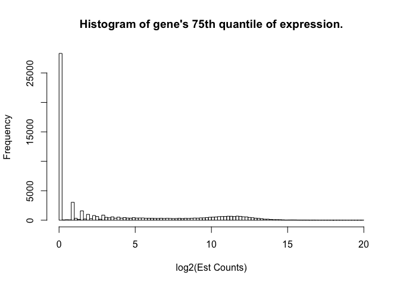
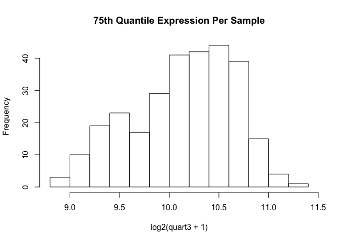
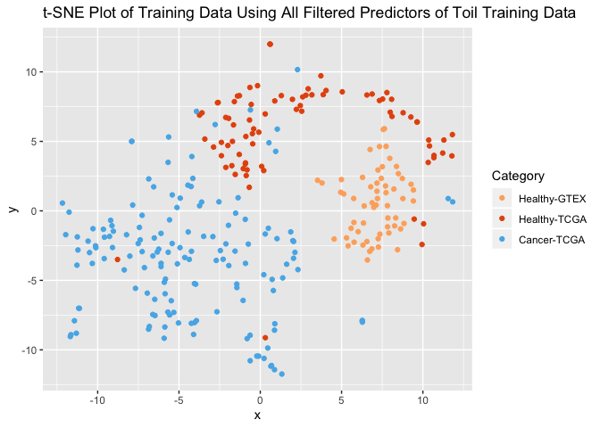
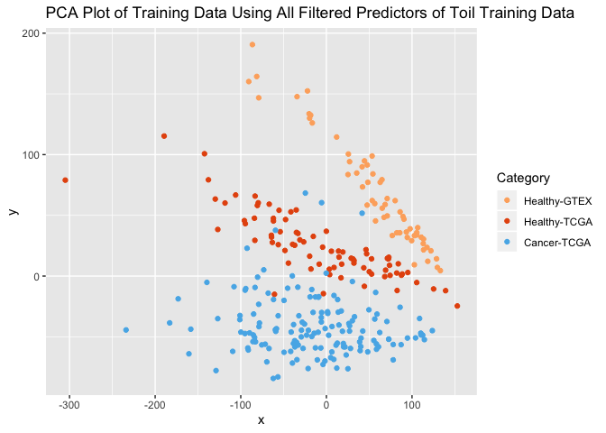
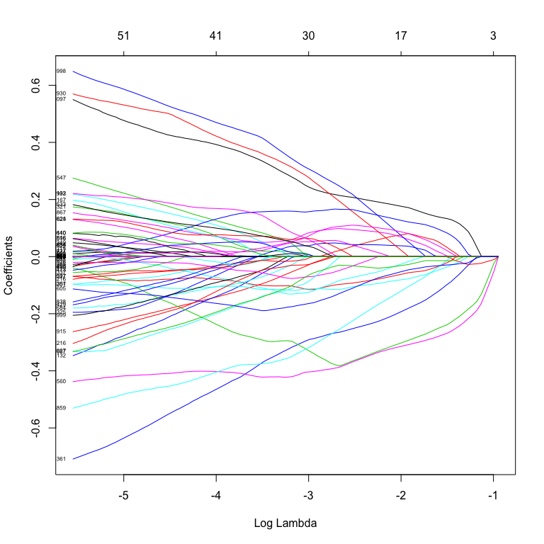
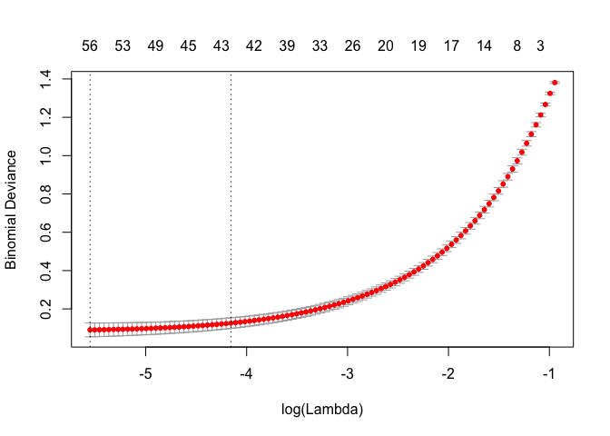

Toil\_Selection
================
Michael Kesling
9/27/2019

This particular document takes the Toil-normalized TCGA and GTEx breast cancer samples and runs machine learning algorithms on them. Importantly, the only sample-to-sample normalization performed in quantile-quantile normalization relative to a single reference sample. No batch normalization is performed at this point, as it's the simplest scenario for test samples processed in the clinic.

The data were downloaded from the UCSC server at: <https://xenabrowser.net/datapages/?cohort=TCGA%20TARGET%20GTEx&removeHub=https%3A%2F%2Fxena.treehouse.gi.ucsc.edu%3A443> There are 2 relevant *gene expression RNAseq* datasets there. *RSEM expected\_count (n=19,109)* which is used in this document, and *RSEM expected\_count (DESeq2 standardized) (n=19,039)* which was used in the *Toil\_Norm.Rmd* file.

The *markdown* and *html* versions of this document have some of the code masked for better readability. To view the full code, see the \[.Rmd version\].

### Subsetting Toil Data

As I'm only looking at just under 400 Breast Cancer samples that were previously selected, I'll subset the very large Toil RSEM file (19k samples).

The samples I'm interested in are located in a file called wangBreastFPKM398\_Attrib.txt, created earlier. While this file contains FPKM counts, I'm only pulling out the sample names from it.

Additionally, I'm going to convert the Ensemble IDs to the more readable HUGO gene IDs.

I start by grabbing the Wang sample names, the Toil sample names, and finding the overlap between the two.

15 of the Wang samples are missing in the Toil dataset. I'll therefore be working with 382 remaining samples.

Next, I read in the toil dataset (8GB+) and subset it by the Wang sample labels (data seen in .Rmd file).

``` r
# just read already-subsetted dataframe
toilSubset <- read.table("toilSubsetRSEM382.txt", sep="\t", header=TRUE)
rownames(toilSubset) <- toilSubset$sample
```

Next, I add gene names to the dataframe based on the Ensembl ID:

``` r
require(dplyr)
toilGeneAnnot <- read.table("~/RNA-Seq_2019/TOIL_Data/gencode.v23.annotation.gene.probemap",
                            header=TRUE)
id2gene <- setNames(as.list(as.character(toilGeneAnnot$gene)),
                    toilGeneAnnot$id)
toilSubset <- toilSubset %>% tibble::rownames_to_column()
toilSubset <- toilSubset %>% mutate(gene=id2gene[toilSubset$rowname])
```

Next, I reorder the toilSubset data frame to group "like" samples and make the gene name the row name.

``` r
colReOrder <- grep("^GTEX", colnames(toilSubset))
colReOrder <- c(colReOrder, grep("11$", colnames(toilSubset)))
colReOrder <- c(colReOrder, grep("01$", colnames(toilSubset)))
tmp <- toilSubset[,colReOrder]
rownames(tmp) <- paste0(toilSubset$gene, "-", toilSubset$rowname)
toilSubset <- tmp
rm(tmp)
```

### Create Test and Training Sets

At this point, all we've done is grabbed the Toil RSEM output data and subsetted it with the Wang sample lists. It's still in log2-format.

Next: 1. break into Test and Train
2. perform edgeR normalization with a reference sample to control for depth-of-sequencing effects. Use same reference for training and (future) test set
3.filter out genes (independent if possible) 4. look at overall structure using t-SNE and PCA 5. Perform ML

``` r
toilSubsetWide <- t(toilSubset)

require(caTools)
```

    ## Loading required package: caTools

``` r
set.seed(233992812)
outcome <- c(rep(0, 185), rep(1, 197))  # 0 = healthy, 1 = tumor

# bind outcome variable on data frame for even, random partitioning
toilSubsetWide <- data.frame(cbind(toilSubsetWide, outcome))
idxTrain <- sample.split(toilSubsetWide$outcome, SplitRatio = 0.75)
# QA
sum(idxTrain)/length(idxTrain)  # 75% observations in training set OK
```

    ## [1] 0.7513089

``` r
# create training and test predictor sets and outcome vectors:
toilTrain <- subset(toilSubsetWide, idxTrain==TRUE)
outcomeTrain <- subset(toilSubsetWide$outcome, idxTrain==TRUE)
toilTest <- subset(toilSubsetWide, idxTrain==FALSE)
outcomeTest <- subset(toilSubsetWide$outcome, idxTrain==FALSE)

# remove outcome variable from predictor matrices:
toilTrain <- toilTrain %>% select(-outcome)
toilTest <- toilTest %>% select(-outcome)
# convert back to matrices:
toilTrain <- as.matrix(toilTrain)
toilTest <- as.matrix(toilTest)
```

### edgeR Sample-to-Sample Normalization

Next, we select a reference sample within the training set and relative to that reference, we perform edgeR sample-to-sample normalization, one sample at a time. The methodology can be found in Robinson MD and Oshlack A, "A scaling normalization method for differential expression analysis of RNA-seq data", Genome Biology, 11: R26 (2010).

#### 1. Removing genes whose expression is very close to zero.

We know that there are about 9103 genes that are never expressed (data not shown), but there are over 25000 genes whose 75th quantile-level expression is under 2^(0.2) - 1 = 0.14 counts. We really don't want to deal with those genes in selecting a reference sample, etc.

``` r
hist(apply(toilTrain, 2, function(x) quantile(x)[4]), breaks=100, main="Histogram of gene's 75th quantile of expression.", xlab="log2(Est Counts)")
```

 We are going to filter out genes whose 75th quantile across 287 samples is less than 0.14 counts (log2(counts) &lt; 0.2).

``` r
# Convert from log to natural scale:
toilTrainNat <- (2^toilTrain)-1
# Filter all 3rd quartile < 0.14 counts--filter criterion in log-scale:
ZEROEXPGENES <- which(apply(toilTrain, 2, function(x) quantile(x)[4]) < 0.2)
TOILTRAINFILTER <- toilTrainNat[,-ZEROEXPGENES]
quart3 <- apply(TOILTRAINFILTER, 1, function(x) quantile(x)[4])
hist(log2(quart3 + 1), main="75th Quantile Expression Per Sample")
```

 We see that due to variation in depth-of-sequencing, some sample's 75th quantil can be a bit higher than others. Note that the histogram is on the log2-scale.

Having filtered out ~28k genes whose expression is nil or very, very close to that. The range stays the same, which is 2.5 on the log scale. Only subtraction, and not division, is relevant on this scale. This matrix, called "TOILTRAINFILTER" is on the natural scale, has only the 287 training samples, and 32177 genes. We will stick to these same genes when filtering test data before sample-to-reference normalization.

#### 2. Selecting a Reference Sample for Sample-to-Sample Normalization

``` r
# we remove matrices and lists we no longer need:
rm(toilGeneAnnot)
rm(toilSampleNames)
rm(quart3)

### Define Functions
pickRefSample <- function(X, logged=FALSE){  # X is matrix with samples as rows
                   # representative reference sample selected via edgeR specs
                   # this script assumes data are on natural scale.
   Xnat <- if(logged==TRUE) ((2^X)-1) else X  # put in natural scale
   N <- apply(Xnat, 1, sum)
   scaledX <- apply(Xnat, 2, function(x) x / N)
   thirdQuartiles <- apply(scaledX, 1, function(x) quantile(x)[4])
   med <- median(thirdQuartiles)
   refSampleName <- names(sort(abs(thirdQuartiles - med))[1])
   return(list(refSampleName, scaledX))
}
### 2. select a reference sample against which other samples will be scaled
lst <- pickRefSample(TOILTRAINFILTER, logged=FALSE) 
REFNAME <- lst[[1]]                                                         #### USED LATER
TOILTRAINSCALED <- lst[[2]]
REFSAMPLE <- TOILTRAINSCALED[which(rownames(TOILTRAINSCALED) == REFNAME),]  #### USED LATER
REFSAMPLEUNSCALED <- TOILTRAINFILTER[REFNAME,]                              #### USED LATER
print(paste0("The sample chosen to the the Reference Sample for the purposes of Sample-to-Sample Normalization is ",
        REFNAME, "."))
```

    ## [1] "The sample chosen to the the Reference Sample for the purposes of Sample-to-Sample Normalization is TCGA.BH.A1ET.01."

### 3. Scaling Training Samples Relative to the Chosen Reference Sample (Sample-to-Sample Normalization)

``` r
weightedTrimmedMean <- function(refSample, testSample, refName, testName, testSmpUnscaled, refSmpUnscaled){
   # refSample and testSample are both numeric vectors, and we assume data are on natural
   # scale.  The values are represented as fraction of total counts.  So
   # df should be 'TOILTRAINFILTER' which are not as fracction of total counts, as
   # this is needed in computing the weights and TMM in the final step.
   # BTW, "testSample" does not infer that the sample is from the test set, but only
   # that it's a sample being scaled relative to the refSample.
   # refSmpUnscaled could be derived from df, but only with training sets and not 
   # with test sets.  So it is supplied separately.
   
   
   # first filter off any genes that are zero in refSample or testSample
   # # but for Yg• ≠ 0.

   refZeros <- which(refSample==0)
   smpZeros <- which(testSample==0)
   unionZeros <- sort(unique(append(refZeros, smpZeros)))
   refSampleFilt <- refSample[-unionZeros]
   testSampleFilt <- testSample[-unionZeros]
   
   # calculate M and A only for filtered genes   
   refLog <- log2(refSampleFilt)
   smpLog <- log2(testSampleFilt)

   M <- refLog - smpLog           # ref sample in numerator
   A <- 0.5 * (refLog + smpLog)   
   
   # grab middle 40% of M and middle 90% of A
   M_limits <- quantile(M, probs = seq(0,1,0.05))[c(7,15)]  # diagnostic
   A_limits <- quantile(A, probs = seq(0,1,0.05))[c(2,20)]  # diagnostic
   
   A_middle90 <- names(A[(A >= A_limits[1] & A <= A_limits[2]) == TRUE])
   M_middle40 <- names(M[(M >= M_limits[1] & M <= M_limits[2]) == TRUE])
   
   
   # grab genes names in intersection of A_middle90 and M_middle40
   genes4norm <- dplyr::intersect(A_middle90, M_middle40)

   #########
   # Nk and Nr must be relative to the genes that remain.
   # further, Ygk and Ygr need to be recalculated relative to that value
   #########
   # grab 2 samples on Norm Genes on Natural Scale that aren't a fraction of
   # the total sample counts.  refSmpUnscaled is separately supplied so that
   # this function will work with scaling test sets.
   refSelectNat <- refSmpUnscaled[genes4norm]
   testSelectNat <- testSmpUnscaled[genes4norm]
   
   # subset M for normalization genes
   M_norm <- M[genes4norm]
   
   # calculate Nk and Nr
   Nr <- sum(refSelectNat)
   Nk <- sum(testSelectNat)

   # calculate weights
   RefDiff <- Nr - refSelectNat
   TestDiff <- Nk - testSelectNat
   RefProd <- Nr * refSelectNat
   TestProd <- Nk * testSelectNat
   weights <- (RefDiff/RefProd) + (TestDiff/TestProd)

   # calculate Trimmed Mean scaling factor
   TMM_log2 <- sum(M_norm * weights)/sum(weights)   # some NaN here
   TMM <- 2^TMM_log2
   return(TMM)
}
```

#### 3. go through each sample in training set and get scaling factor

``` r
ScalFact <- list()
samples <- rownames(TOILTRAINFILTER)
i <- 1
for(trainSampleName in samples){
   trainSample <- TOILTRAINSCALED[i,]
   trainUnscaled <- TOILTRAINFILTER[i,]
   scalingFactor <- weightedTrimmedMean(REFSAMPLE, trainSample, REFNAME, trainSampleName, trainUnscaled,
                                        REFSAMPLEUNSCALED)
   ScalFact <- c(ScalFact, scalingFactor)
   i = i+1
}
ScalFact <- unlist(ScalFact)

### 4. Scale toilTrainFilter matrix using scaling factors
#dim(toilTrainFilter)
toilTrainFiltScaled <- apply(TOILTRAINFILTER, 2, function(x) x/ScalFact)
```

we now have a scaled training matrix

### t-SNE to view Cancer/Healthy Diagnosis Partitioning among training samples

t-SNE is a way of speading out the data, which are in many dimensions, such that they can be approximately viewed in 2 dimensions. It gives us a rough idea as to how different samples are spread across the predictor space.

``` r
require(Rtsne);
```

    ## Loading required package: Rtsne

``` r
require(ggplot2);
set.seed(31234)
tSNEout_toilSN <- Rtsne(toilTrainFiltScaled, dims=2)
prognosis <- c(rep(1, 59), rep(2,80), rep(3, 148))       # 1/2 = healthy, 3 = cancer
tsne_plot_toil <- data.frame(x=tSNEout_toilSN$Y[,1], y = tSNEout_toilSN$Y[,2], col=prognosis)
colors3pal <- c("#FDAE6B", "#E6550D",  "#56B4E9")
#tsne_plot_3class <- data.frame(x=tSNEout_full$Y[,1], y = tSNEout_full$Y[,2], col=prognosis)
ggplot(tsne_plot_toil) + 
   geom_point(aes(x=x, y=y, color=as.factor(col))) + 
   ggtitle("t-SNE Plot of Training Data Using All Filtered Predictors of Toil Training Data") +
   scale_color_manual(name="Category",
                      breaks = c("1", "2", "3"),
                      values = c(colors3pal[1], colors3pal[2], colors3pal[3]),
                      labels = c("Healthy-GTEX", "Healthy-TCGA", "Cancer-TCGA"))
```



We can see that although these samples were not subject to batch normalization (such as ComBat, SVA), there is good segregation of healthy samples and tumors even though the healthy samples come from 2 different projects: TCGA and GTEx. On the other hand, we see that there is segregation between those groups, but it still allows a separation of healthy / tumor.

### PCA Analysis

I'd like to compare the t-SNE plot to one using the 1st and 2nd principal components, as PC's are to scale and t-SNEs are not.
I'll quickly scale the data first, as PCA requires that.

``` r
trainScaled <- scaleData(toilTrainFiltScaled, TRUE, FALSE)
PCs <- prcomp(trainScaled)
nComp <- 2
dfComponents <- predict(PCs, newdata=trainScaled)[,1:nComp]
PC_plot <- data.frame(x=dfComponents[,1], y = dfComponents[,2], col=prognosis)
colors3pal <- c("#FDAE6B", "#E6550D",  "#56B4E9")
#tsne_plot_3class <- data.frame(x=tSNEout_full$Y[,1], y = tSNEout_full$Y[,2], col=prognosis)
ggplot(PC_plot) + 
   geom_point(aes(x=x, y=y, color=as.factor(col))) + 
   ggtitle("PCA Plot of Training Data Using All Filtered Predictors of Toil Training Data") +
   scale_color_manual(name="Category",
                      breaks = c("1", "2", "3"),
                      values = c(colors3pal[1], colors3pal[2], colors3pal[3]),
                      labels = c("Healthy-GTEX", "Healthy-TCGA", "Cancer-TCGA"))
```



Again, the healthy samples partition well from the tumors. And again, GTEX-healthy and TCGA-healthy are in distict clusters, showing that a batch effect still persists. However, not addressing the batch effect allows us to either (a) keep the test set entirely separated from the training set through this entire procedure (one the data are split in step 1 above) or (b) process a single test sample without using other test samples for normalization.

### Logistic Regression with Lasso Regularizer on Toil Data

I'd like to compare the performance on this breast cancer dataset in the absence of batch normalization (ComBat).

``` r
###############
### Fitting Logistic Regression with Lasso Regularizer on toilSubNatural matrix
require(glmnet);
```

    ## Loading required package: glmnet

    ## Loading required package: Matrix

    ## Loading required package: foreach

    ## Loaded glmnet 2.0-18

``` r
require(ggplot2);
# install_github("ririzarr/rafalib")
require(rafalib);
```

    ## Loading required package: rafalib

``` r
# scale each gene by its standard deviation and center it by its mean so that all coefficients
# are on equal footing
toilTrainFiltScaledSD <- scaleData(toilTrainFiltScaled, TRUE, FALSE)
set.seed(1011)
fitToil.lasso <- glmnet(toilTrainFiltScaledSD, outcomeTrain, family="binomial",
                           alpha = 1)
plot(fitToil.lasso, xvar="lambda", label=TRUE)
```

 It's clear that scaling the predictors before Lasso enables many more to be used. It would be interesting to see how many of these genes have a low level of expression (and therefore might be noisy data).

### Cross-Validating the Model to Pick the Smallest, Well-Performing Model

I'm going to look at cross-validating the model in order to pick the simplest one that performs well.

``` r
set.seed(1011)
cv.Toil.lasso <- cv.glmnet(toilTrainFiltScaledSD, outcomeTrain, family="binomial", alpha=1) 
                      #type.measure = "deviance")
plot(cv.Toil.lasso)
```

 We can see that 42 predictors gives us a model whose deviance is within 1-standard deviation from the minimum.

### Select the Model by Capturing the Coefficients

``` r
coefsToil <- coef(fitToil.lasso, s=cv.Toil.lasso$lambda.1se)
allCoefsNames <- rownames(coefsToil)
idx <- which(coefsToil!= 0)
coefsFullNames <- allCoefsNames[idx]

coefsToilNonZero <- coefsToil[which(coefsToil!= 0)]
coefsShortNames <- gsub("\\..*$", "", coefsFullNames)
coefsDF <- cbind(coefsShortNames, coefsToilNonZero)
#print(c("The (cleaned-up) names of the predictors are "))
print(coefsDF)
```

    ##       coefsShortNames coefsToilNonZero     
    ##  [1,] "(Intercept)"   "0.103835824729068"  
    ##  [2,] "FAM89B"        "0.00695299966174044"
    ##  [3,] "KCNJ2"         "-0.15437413145241"  
    ##  [4,] "RILP"          "-0.161110046150884" 
    ##  [5,] "CNTNAP3P2"     "-0.115918391140833" 
    ##  [6,] "NTNG2"         "0.0228293874404326" 
    ##  [7,] "PAFAH1B3"      "0.403517002327788"  
    ##  [8,] "LIMK1"         "0.0912555661127044" 
    ##  [9,] "MIR497HG"      "-0.489762161179337" 
    ## [10,] "ABCA5"         "-0.0427907386468421"
    ## [11,] "RP5"           "0.140245487055762"  
    ## [12,] "TRBV11"        "0.124095300293986"  
    ## [13,] "CDK5"          "0.077422286918571"  
    ## [14,] "CTD"           "0.0144654918879737" 
    ## [15,] "EDNRB"         "-0.0751286549912099"
    ## [16,] "KLHL29"        "-0.213031917591343" 
    ## [17,] "SLC17A7"       "-0.0871454970598027"
    ## [18,] "SDPR"          "-0.0621553202372865"
    ## [19,] "FXYD1"         "-0.401167051091719" 
    ## [20,] "SRP9"          "0.444774219585766"  
    ## [21,] "BGN"           "0.488596031870429"  
    ## [22,] "TINAGL1"       "-0.109128136242681" 
    ## [23,] "MAZ"           "0.116643236502949"  
    ## [24,] "ABCG1"         "0.0410481018694342" 
    ## [25,] "NKAPL"         "-0.105679849811726" 
    ## [26,] "PDK4"          "-0.0391539999271433"
    ## [27,] "USP44"         "-0.0614113358876626"
    ## [28,] "FNDC1"         "0.0808110889280294" 
    ## [29,] "TBL2"          "0.171165797327715"  
    ## [30,] "ARHGAP20"      "-0.421212982849093" 
    ## [31,] "KLF15"         "-0.0298468596946475"
    ## [32,] "AC093609"      "-0.147386823734745" 
    ## [33,] "CLDN8"         "-0.0493317486407827"
    ## [34,] "NDRG2"         "-0.218934135345502" 
    ## [35,] "ATP6V0B"       "0.0173414843585327" 
    ## [36,] "ZNF668"        "0.0760366266522648" 
    ## [37,] "SRPX"          "-0.212244682737333" 
    ## [38,] "TTYH3"         "0.0458833175798673" 
    ## [39,] "ADAMTS5"       "-0.0113043506255962"
    ## [40,] "CHPF2"         "0.106260997574339"  
    ## [41,] "GABARAPL1"     "-0.0440394829502514"
    ## [42,] "H3F3A"         "0.0450684494316483" 
    ## [43,] "LMOD1"         "-0.156497680054827"

when performing predictions, we'll need *coefsFullNames* and *coefsToilNonZero*. Remember when looking at these Lasso-Regularized Coefficients that each predictor gene was offset by its mean and scaled by its standard deviation. That way, lower and more highly transcribed genes are on equal footing to influence the model.

### Filter and Scale Test Data. (A) Relying on Training Data for Zero-Filtering and Scaling of Test Data

``` r
### 1. Filter out near-zero genes as defined with training data:

## zero Filtering Must be re-indexed for test set
toilToFilterPosn <- which(colnames(toilTest) %in% names(ZEROEXPGENES))
toilTestFilter <- toilTest[,-toilToFilterPosn] # using Same Gene List Filter (near-zero) established in Training Set
# now 95 x 32177 on log2(x+1) scale


### 2. Scale test data as fraction of all sample counts
## define scaling function (same logic as with training data)
toilTestFiltNat <- 2^(toilTestFilter) - 1

scaleTestSamples <- function(X, logged=FALSE){  # X is matrix with samples as rows
                   # representative reference sample selected via edgeR specs
                   # this script assumes data are on natural scale.
   Xnat <- if(logged==TRUE) ((2^X)-1) else X  # put in natural scale
   N <- apply(Xnat, 1, sum)
   scaledX <- apply(Xnat, 2, function(x) x / N)
   return(scaledX)
}
toilTestScaled <- scaleTestSamples(toilTestFiltNat, logged=FALSE)


### 3. Individually scale test samples relative to training reference sample.  
# Each scaling is independent of other scalings.
# There is a filtering step (subsetCommonPredictors) that is applied first, 
# as we're using some of the references from the training set for the test set.

# subsetCommonPredictors <- function(refSmp, tstSmp, coefsFullNames){
#    
#    # AT this point, I've moved the common genes upstream
#    # the only thing that's happening here is that the (Intercept) is being 
#    # removed from the RefSample.
#    
#    commonNames = intersect(names(refSmp), names(tstSmp))
#    # need to add back any missing predictors
#    commonNamesPlus <- sort(unique(append(commonNames, coefsFullNames)))
#    print(c("commonQA", length(commonNames), length(commonNamesPlus)))
#    refUniqNames <- setdiff(names(refSmp), commonNamesPlus)
#    refUniqPosn <- which(names(refSmp) %in% refUniqNames)
# 
#    tstUniqNames <- setdiff(names(tstSmp), commonNamesPlus)
#    tstUniqPosn <- which(names(tstSmp) %in% tstUniqNames)
#    print(c("Other", refUniqPosn,tstUniqPosn))
#    print(c("final Lengths", length(refSmp[-refUniqPosn]), length(tstSmp[-tstUniqPosn])))
#    return(list(refSmp[-refUniqPosn], tstSmp[-tstUniqPosn]))
# } # I am losing some critical predictors at this stage


ScalFact <- list()
samples <- rownames(toilTestFilter)

## Are the coefficients already missing here?  -- YES.
# toilTest has them all
# toilTestScaled and Filter missing many
#which(colnames(toilTestFilter) %in% coefsFullNames[2:length(coefsFullNames)])


i <- 1
for(testSampleName in samples){  # some of the passed variables were created in training set
   testSample <- toilTestScaled[i,]
   testUnscaled <- toilTestFiltNat[i,]
   
   # ensure that intersection of genes the same across 4 lists
   #v <- subsetCommonPredictors(refSample, testSample, coefsFullNames)
   #refSample2 <- v[[1]]
   #testSample2 <- v[[2]]
   refSample2 <- REFSAMPLE[2:length(REFSAMPLE)]
   testSample2 <- testSample[names(refSample2)]
   testUnscaled2 <- testUnscaled[names(refSample2)]
   refSampleUnscaled2 <- REFSAMPLEUNSCALED[names(refSample2)]
   #print(all(names(testUnscaled2)==names(testSample2)))
   #print(c(length(refSample2), length(testSample2), length(refSampleUnscaled2),
           #length(testUnscaled2)))
   
   scalingFactor <- weightedTrimmedMean(refSample2, testSample2, REFNAME, testSampleName,
                                        testUnscaled2, refSampleUnscaled2)
   ScalFact <- c(ScalFact, scalingFactor)
   i = i+1
}
ScalFact <- unlist(ScalFact)

### 4. Scale toilTrainFilter matrix using scaling factors
# dim(toilTestFiltNat)
toilTestFiltScaled <- apply(toilTestFiltNat, 2, function(x) x/ScalFact)

### 5. scale each gene by its standard deviation and center it by its mean so that all coefficients
#      are on equal footing
#toilTestFiltScaledSD <- scaleData(toilTestFiltScaled, TRUE, FALSE)       # this would not be possible for individual samples!!!!!!
#toilTestFiltScaledSD <- cbind(rep(1,dim(toilTestFiltScaledSD)[1]), toilTestFiltScaledSD) #add intercept column
```

### 4. Remove Non-Predictor Genes from Filtered Test Data

We're just keeping the 42 predictors from toilTestFiltScaled

``` r
colIDs <- which(colnames(toilTestFiltScaled) %in% coefsFullNames[2:length(coefsFullNames)])
toilTestFiltScal42 <- toilTestFiltScaled[,colIDs]
```

### 5. Each Relevant Predictor Gene offset by Its Mean and Scaled by Its Standard Deviation

``` r
# colnames(toilTestFiltScal42)
toilTestFiltScaledSD <- scaleData(toilTestFiltScal42, TRUE, FALSE)       
# this would not be possible for individual samples!!!!!!
toilTestFiltScaledSD <- cbind(rep(1,dim(toilTestFiltScaledSD)[1]), toilTestFiltScaledSD)
```

### Create Confusion Matrix for Test Data

``` r
testPredictions_toil <- ifelse(toilTestFiltScaledSD %*% coefsToilNonZero > 0, 1, 0)
table(outcomeTest, testPredictions_toil)
```

    ##            testPredictions_toil
    ## outcomeTest  0  1
    ##           0 46  0
    ##           1  0 49

I am seeing 100% specificity and 100% specificity!

### Filter and Scale Test Data. (B) Not Relying on Training Data for Zero-Filtering or Scaling of Test Data

In order to see if the test data predictions might be biased by filtering relative to a list of genes identified using only training data or by scaling relative to a training reference sample, I'll repeat the process here, but using only *test data*. In order to achieve this, when the predictions are made, we must only use predictors with non-zero coefficients, or the linear algebra will fail.

### 1. Filter Out Genes Whose Expression is Near-Zero

``` r
# next, let's filter all 3rd quartile < 0.14 counts--filter criterion in log-scale:
toilTestNat <- (2^toilTest)-1    # natural scale
# next, let's filter all 3rd quartile < 0.14 counts--filter criterion in log-scale:
zeroExpGenes <- which(apply(toilTest, 2, function(x) quantile(x)[4]) < 0.2)    #USED LATER
toilTestFilter <- toilTestNat[,-zeroExpGenes]
#quart3 <- apply(toilTestFilter, 1, function(x) quantile(x)[4])
#sd(quart3)/mean(quart3)              # CV drops slightly to 0.336
#hist(log2(quart3 + 1))
```

### 2. Select a Reference Sample Amongst Test Samples for Scaling Data

``` r
lst <- pickRefSample(toilTestFilter, logged=FALSE) 
testRefName <- lst[[1]]                                                        
toilTestScaled <- lst[[2]]
testRefSample <- toilTestScaled[which(rownames(toilTestScaled) == testRefName),]  
testRefSampleUnscaled <- toilTestFilter[testRefName,]                              
print(paste0("The sample chosen to the the Reference Sample for the purposes of Sample-to-Sample Normalization is ",
        testRefName, "."))
```

    ## [1] "The sample chosen to the the Reference Sample for the purposes of Sample-to-Sample Normalization is TCGA.E9.A1NA.11."

### 3. Scaling Test Samples Relative to the Chosen TEST Reference Sample (Sample-to-Sample Normalization)

``` r
ScalFact <- list()
samples <- rownames(toilTestFilter)
i <- 1
for(testSampleName in samples){
   testSample <- toilTestScaled[i,]
   testUnscaled <- toilTestFilter[i,]
   scalingFactor <- weightedTrimmedMean(testRefSample, testSample, testRefName, testSampleName, testUnscaled,
                                        testRefSampleUnscaled)    
   ScalFact <- c(ScalFact, scalingFactor)
   i = i+1
}
ScalFact <- unlist(ScalFact)

### Scale toilTrainFilter matrix using scaling factors
# dim(toilTestFilter)
toilTestFiltScaled <- apply(toilTestFilter, 2, function(x) x/ScalFact)
### we now have a scaled test matrix
```

### 4. Remove Non-Predictor Genes from Filtered Test Data

We're just keeping the 42 predictors from toilTestFiltScaled

``` r
toilTestFiltScal42 <- toilTestFiltScaled[,coefsFullNames[2:length(coefsFullNames)]]
```

### 5. Each Relevant Predictor Gene offset by Its Mean and Scaled by Its Standard Deviation

``` r
toilTestFiltScaledSD <- scaleData(toilTestFiltScal42, TRUE, FALSE)       
# this would not be possible for individual samples!!!!!!
toilTestFiltScaledSD <- cbind(rep(1,dim(toilTestFiltScaledSD)[1]), toilTestFiltScaledSD)
```

### Create Confusion Matrix for Test Data

``` r
testPredictions_toil <- ifelse(toilTestFiltScaledSD %*% coefsToilNonZero > 0, 1, 0)
table(outcomeTest, testPredictions_toil)
```

    ##            testPredictions_toil
    ## outcomeTest  0  1
    ##           0 46  0
    ##           1  0 49

I am still at 100% sensitivity and 100% specificity! I used no training data for filtering or scaling the test samples. The test set was treated separately from the beginning.

### Look at Function of Predictors
